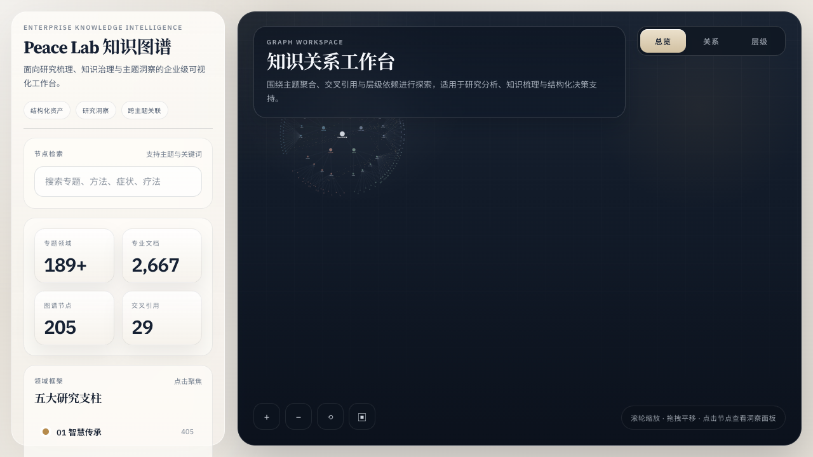

# 01-Wisdom-Traditions | 智慧传承

> 跨越地理与时代的界限，整合古代智慧与现代科学，涵盖瑜伽、禅宗、道家及全球灵性疗愈。

> ⚠️ **内容免责声明**:本支柱内容涉及世界主要宗教传统(佛教、道家、印度教、亚伯拉罕诸教、儒家等)、哲学流派与文化实践,旨在为读者提供学习与跨文化理解的资源。所有内容仅供学术研究与个人学习,不代表任何特定宗教组织的官方立场。涉及教义诠释、修行方法、文化习俗等内容时,请尊重传统的多样性、具体脉络与在地诠释。任何宗教/灵性实践都不应取代专业医疗、心理或法律咨询。如有心理困扰或紧急情况,请咨询专业人士或拨打 24 小时心理援助热线(中国:010-82951332 / 400-161-9995;国际:988 Lifeline)。完整资源见 [_meta/docs/CRISIS_RESOURCES.md](../_meta/docs/CRISIS_RESOURCES.md)。

---

## 📚 阅读路径建议 | Reading Path Guide

> 本支柱内容广博，以下路径帮助不同背景的读者找到适合自己的学习顺序。

### 🌱 初阶路径 (入门者)

**目标**: 建立对智慧传统的整体感知，培养日常练习习惯

| 顺序 | 文档 | 建议 | 时长 |
|:----:|:-----|:-----|:-----|
| 1 | [瑜伽哲学 (Philosophy)](yoga/philosophy-history/Yoga_Philosophy.md) | 理解瑜伽的核心思想体系 | 30分钟 |
| 2 | [道家哲学与宇宙论](religions/dao/Dao_Philosophy_Cosmology.md) | 建立"道"的整体世界观 | 30分钟 |
| 3 | [禅宗智慧与传承](religions/zen/Zen_Wisdom_Lineage.md) | 理解禅宗的核心智慧 | 25分钟 |
| 4 | [太极拳总览](tai-chi/Tai_Chi_Overview.md) | 体验身心合一运动 | 20分钟 |
| 5 | [正念与冥想入门](#) | 建立日常冥想习惯（参考 02-Mind-Psychology） | 持续 |

**适合**: 首次接触东方智慧传统的读者，希望建立基础认知和日常练习习惯。

---

### 🌿 中阶路径 (已有基础)

**目标**: 深入特定传统，理解修习方法论，建立跨传统比较视野

| 顺序 | 文档 | 建议 | 时长 |
|:----:|:-----|:-----|:-----|
| 1 | [瑜伽经深度 (Yoga Sutra)](yoga/philosophy-history/Yoga_Sutra_Philosophical_Deep_Dive.md) | 深入瑜伽哲学核心经典 | 45分钟 |
| 2 | [止观双运 (Samatha & Vipassana)](religions/buddhism/meditation/Buddhism_Samatha_Vipassana.md) | 掌握佛教核心修习方法 | 40分钟 |
| 3 | [内丹修持与路径](religions/dao/Dao_Internal_Alchemy_Neidan.md) | 理解道家内丹学体系 | 35分钟 |
| 4 | [佛教心理学与疗愈](religions/buddhism/psychology/) | 连接古老智慧与现代心理学 | 30分钟 |
| 5 | [佛教神经科学](religions/zen/Zen_Neuroscience_Psychology.md) | 了解冥想的科学基础 | 25分钟 |

**适合**: 已完成初阶路径，希望深入特定传统的读者。

---

### 🌳 高阶路径 (专业研习)

**目标**: 掌握传统全貌，进行跨文化比较研究，准备从事教学或传播

| 顺序 | 文档 | 建议 | 时长 |
|:----:|:-----|:-----|:-----|
| 1 | [五家七宗法脉](religions/zen/Zen_Five_Houses_Lineage.md) | 深入禅宗七宗传承体系 | 60分钟 |
| 2 | [大圆满与大手印](religions/buddhism/dzogchen/) | 藏密最高教法 | 60分钟 |
| 3 | [高阶内丹实务](religions/dao/Dao_Advanced_Internal_Alchemy.md) | 道家高阶修持 | 50分钟 |
| 4 | [中观、唯识与华严](religions/buddhism/core-philosophy/Buddhism_Madhyamaka_Philosophy.md) | 大乘佛教三大体系 | 60分钟 |
| 5 | [全球灵性比较](religions/syncretism/) | 建立跨文化视野 | 45分钟 |

**适合**: 有志于深入研究，希望成为传播者或学者的读者。

---

### 🎯 专题路径 | Special Interest Paths

| 主题 | 推荐文档序列 | 适合人群 |
|------|-------------|----------|
| **冥想修习** | 瑜伽冥想 → 止观双运 → 禅宗公案 → 大圆满 | 实践者 |
| **身体锻炼** | 瑜伽体式 → 太极拳基础 → 道家气功 → 运动科学 | 健身爱好者 |
| **哲学研究** | 印度哲学概论 → 吠檀多 → 道家 → 斯多葛 | 哲学学习者 |
| **心理疗愈** | 佛教心理学 → 瑜伽疗愈 → 道教心理养生 → 正念减压 | 心理健康从业者 |

---

## 核心索引 | Core Index

### 1. 🧘‍♂️ 瑜伽与印度传统 (Yoga & Indian Traditions) — [完整知识地图](yoga/INDEX.md)

**哲学与历史**
- [瑜伽哲学 (Philosophy)](yoga/philosophy-history/Yoga_Philosophy.md) | [瑜伽经深度 (Yoga Sutra)](yoga/philosophy-history/Yoga_Sutra_Philosophical_Deep_Dive.md) | [哲学流派 (Schools)](yoga/philosophy-history/Yoga_Philosophy_Schools_Deep.md)
- [瑜伽历史 (History)](yoga/philosophy-history/Yoga_History_Tradition.md) | [术语总表 (Glossary)](yoga/philosophy-history/Yoga_Glossary_Master.md)

**练习与技术**
- [体式与调息 (Asana & Pranayama)](yoga/practice-technique/Yoga_Asana_Pranayama.md) | [体式库 (Asana Library)](yoga/asana-library/INDEX.md)
- [冥想 (Meditation)](yoga/meditation-consciousness/Yoga_Meditation_Dharana_Dhyana.md) | [Mantra与声音 (Mantra & Nada)](yoga/practice-technique/Yoga_Mantra_Nada_Chanting.md)
- [六业净化 (Shatkarma)](yoga/practice-technique/Yoga_Shatkarma_Cleansing.md) | [昆达里尼 (Kundalini)](yoga/meditation-consciousness/Yoga_Advanced_Kriya_Kundalini.md)
- [Yoga Nidra](yoga/meditation-consciousness/Yoga_Nidra.md) | [那洛六法 (Six Yogas of Naropa)](yoga/six-yogas-naropa/)

**科学与治疗**
- [解剖学 (Anatomy)](yoga/anatomy-science/Yoga_Anatomy_Physiology.md) | [神经科学 (Neuroscience)](yoga/anatomy-science/Yoga_Neuroscience_Modern_Research.md)
- [瑜伽治疗 (Therapy)](yoga/therapy-clinical/Yoga_Therapy.md) | [心理健康 (Mental Health)](yoga/therapy-clinical/Yoga_Mental_Health_Clinical.md)
- [阿育吠陀整合 (Ayurveda)](yoga/integrative-medicine/Yoga_Ayurvedic_Therapy_Integration.md) | [中医整合 (TCM)](yoga/integrative-medicine/Yoga_TCM_Integration.md)

**人群与生活**
- [特殊人群 (Populations)](yoga/specific-populations/Yoga_Specific_Populations.md) | [女性健康 (Women)](yoga/specific-populations/Yoga_Women_Health.md)
- [营养与生活 (Nutrition)](yoga/lifestyle/Yoga_Nutrition_Lifestyle.md) | [现代流派 (Styles)](yoga/modern-professional/Yoga_Modern_Styles.md)

**职业与资源**
- [伦理与专业 (Ethics)](yoga/modern-professional/Yoga_Ethics_Business_Professional.md) | [静修设计 (Retreats)](yoga/modern-professional/Yoga_Retreat_Workshop_Design.md)
- [科技与数字 (Technology)](yoga/modern-professional/Yoga_Technology_Digital.md) | [资源指南 (Resources)](yoga/resources/Yoga_Resources.md)

### 2. 🏮 禅宗与东亚静修 (Zen & East Asian Contemplation)
- [禅宗智慧与传承 (Zen Wisdom)](religions/zen/Zen_Wisdom_Lineage.md)
- [实践技术与法要 (Practice Methodology)](religions/zen/Zen_Practice_Methodology.md)
- [觉悟阶次与地图 (Enlightenment Stages)](religions/zen/Zen_Enlightenment_Stages.md)
- [五家七宗法脉 (Five Houses Lineage)](religions/zen/Zen_Five_Houses_Lineage.md)
- [禅宗经论深研 (Zen Sutras)](religions/zen/Zen_Sutras_In_Depth.md)
- [禅门礼仪与规制 (Monastic Rituals)](religions/zen/Zen_Monastic_Rituals.md)
- [禅宗审美与文化 (Aesthetics & Culture)](religions/zen/Zen_Aesthetics_Culture.md)
- [日常生活实修 (Daily Life Practice)](religions/zen/Zen_Daily_Life_Practice.md)
- [公案研究 (Koan Anthropology)](religions/zen/Zen_Koan_Anthropology.md)
- [禅宗神经科学 (Zen Neuroscience)](religions/zen/Zen_Neuroscience_Psychology.md)

### 3. ☯️ 道家智慧与内丹 (Daoist Wisdom & Internal Alchemy)
- [哲学与宇宙观 (Philosophy & Cosmology)](religions/dao/Dao_Philosophy_Cosmology.md)
- [内丹修持与路径 (Internal Alchemy)](religions/dao/Dao_Internal_Alchemy_Neidan.md)
- [高阶内丹实务 (Advanced Internal Alchemy)](religions/dao/Dao_Advanced_Internal_Alchemy.md)
- [道家养生与气功 (Health & Qigong)](religions/dao/Dao_Health_Yangsheng_Qigong.md)
- [道家本草与养生 (Herbology)](religions/dao/Dao_Yangsheng_Herbology.md)
- [符号、仪式与疗愈 (Talisman & Ritual)](religions/dao/Dao_Talisman_Ritual_Healing.md)
- [道家审美与现代生活 (Daoist Aesthetics)](religions/dao/Dao_Aesthetics_Modern_Life.md)
- [法脉传承与仪式 (Lineage & Ritual)](religions/dao/Dao_Lineage_Ritual_Tradition.md)
- [道教心理养生 (Psychological Cultivation)](religions/dao/Daoist_Psychological_Health_Cultivation.md)

### 3.5 黄帝内经养生 (Huangdi Neijing Health Cultivation)
- [**内经养生核心体系 (Neijing Yangsheng Core)**](tcm-neijing/) - 四气调神、五脏养生、子午流注、情志调摄
  - [黄帝内经养生核心理论 (Core Theory)](tcm-neijing/yangsheng/Neijing_Yangsheng_Overview.md)
  - [内经养生实践指南 (Practice Guide)](tcm-neijing/yangsheng/Neijing_Yangsheng_Practice.md)

### 3.6 ☯️ 太极拳学院体系 (Tai Chi Academy) — [完整知识地图](tai-chi/INDEX.md) **48+文档 · 13维度**

**核心概览**
- [太极拳总览](tai-chi/Tai_Chi_Overview.md) · [五大流派](tai-chi/schools-lineage/Tai_Chi_Schools_Styles.md) · [基本功法](tai-chi/fundamentals/Tai_Chi_Fundamentals_Practice.md)
- [神经科学证据](tai-chi/neuroscience-research/Tai_Chi_Neuroscience_Evidence.md) · [临床应用](tai-chi/clinical-health/Tai_Chi_Clinical_Applications.md) · [气功整合](tai-chi/qigong-neigong/Tai_Chi_Qigong_Integration.md) · [心理调适](tai-chi/psychology-wellbeing/Tai_Chi_Psychological_Adjustment_Mechanism.md)

**13维度子目录**
- [philosophy-history/](tai-chi/philosophy-history/) 哲学源流 · [schools-lineage/](tai-chi/schools-lineage/) 流派传承 · [fundamentals/](tai-chi/fundamentals/) 基本功法
- [forms-routines/](tai-chi/forms-routines/) 套路招式 · [push-hands-martial/](tai-chi/push-hands-martial/) 推手武术 · [qigong-neigong/](tai-chi/qigong-neigong/) 气功内功
- [clinical-health/](tai-chi/clinical-health/) 临床健康 · [neuroscience-research/](tai-chi/neuroscience-research/) 神经科学 · [psychology-wellbeing/](tai-chi/psychology-wellbeing/) 心理健康
- [teaching-pedagogy/](tai-chi/teaching-pedagogy/) 师资培训 · [special-populations/](tai-chi/special-populations/) 特殊人群 · [culture-art/](tai-chi/culture-art/) 文化艺术 · [resources/](tai-chi/resources/) 学习资源

### 4. ☸️ 佛教智慧体系 (Buddhist Wisdom System)
- [佛教核心概论 (Core Overview)](religions/buddhism/foundations/Buddhism_Core_Overview.md)
- [四圣谛与四无量心 (Four Truths & Immeasurables)](religions/buddhism/foundations/Buddhism_Four_Noble_Truths.md)
- [止观双运 (Samatha & Vipassana)](religions/buddhism/meditation/Buddhism_Samatha_Vipassana.md)
- [中观、唯识与华严 (Madhyamaka, Yogacara, Huayan)](religions/buddhism/core-philosophy/Buddhism_Madhyamaka_Philosophy.md)
- [天台止观与净土实修 (Tiantai & Pure Land)](religions/buddhism/tiantai/Buddhism_Tiantai_Zhiguan.md)
- [南传阿毗达摩 (Theravada Abhidhamma)](religions/buddhism/theravada/Buddhism_Theravada_Abhidhamma.md)
- [金刚乘基础 (Vajrayana Foundation)](religions/buddhism/vajrayana/Buddhism_Vajrayana_Foundation.md)
- [大圆满与大手印 (Dzogchen & Mahamudra)](religions/buddhism/dzogchen/)
- [佛教心理学与疗愈 (Buddhist Psychology & Healing)](religions/buddhism/psychology/)
- **佛教仪轨专题 (Buddhist Rituals)** — [完整索引](religions/buddhism/rituals/INDEX.md)
  - [南传仪轨总览](religions/buddhism/rituals/Theravada_Rituals_Overview.md) — 日常功课、布萨、出家、丧葬
  - [汉传仪轨总览](religions/buddhism/rituals/Chinese_Rituals_Overview.md) — 早晚课、水陆法会、焰口、三坛大戒、盂兰盆会
  - [藏传仪轨总览](religions/buddhism/rituals/Tibetan_Rituals_Overview.md) — 皈依发心、加行、本尊、灌顶、度亡、火供
  - [禅宗与东亚密教](religions/buddhism/rituals/Zen_Seven_Day_Retreat.md) — 禅七、唐密/东密护摩、真言宗、韩国梵呗
  - [本尊完整仪轨](religions/buddhism/rituals/Sadhana_Amitabha.md) — 阿弥陀佛、观音、药师佛、文殊、莲师、金刚萨埵、度母、大威德、胜乐、时轮、普巴
- [藏传佛教专题 (Tibetan Buddhism)](religions/tibetan-buddhism/)
  - [五大教派 (Five Schools)](religions/tibetan-buddhism/Tibetan_Schools_Detailed.md)
  - [加行实修 (Ngondro)](religions/tibetan-buddhism/Tibetan_Ngondro_Preliminaries.md)
  - [藏医与曼茶罗疗愈 (Tibetan Medicine)](religions/tibetan-buddhism/Tibetan_Medicine_Sowa_Rigpa.md)

### 5. 🏛️ 全球灵性与古典哲学 (Global Spirituality & Philosophy)
- [**哲学经典三方书评总索引**](philosophy/book-reviews/INDEX.md) — 东西方哲学经典的专业书评人/哲学爱好者/哲学学者三方评析
- [西方实用哲学：斯多葛与存在主义](philosophy/western-philosophy/practical-philosophy/Philosophy_Western_Stoicism_Existentialism.md)
- [东亚哲学体系 (East Asian Philosophy)](philosophy/east-asian-philosophy/)
  - [儒家 (Confucianism)](philosophy/east-asian-philosophy/china/confucianism/)
  - [道家哲学 (Taoist Philosophy)](philosophy/east-asian-philosophy/china/taoism/)
  - [诸子百家 (Other Schools)](philosophy/east-asian-philosophy/china/other-schools/)
- [克里希那穆提教学 (Krishnamurti Teachings)](religions/wisdom-traditions/Krishnamurti_Teachings.md)
- [基督宗教内在疗愈 (Christian Inner Healing)](religions/wisdom-traditions/Wisdom_Christianity_Inner_Healing.md)
- [伊斯兰心理与净心术 (Islamic Psychology)](religions/wisdom-traditions/Wisdom_Islamic_Psychology_Tazkiyah.md)
- [萨满疗愈与自然智慧 (Shamanic Healing)](religions/wisdom-traditions/Wisdom_Shamanic_Healing_Journey.md)
- [全球三教合一研究 (Syncretism)](religions/syncretism/Syncretism_Three_Teachings.md)
- [唯识学与阳明心学异同论 (Yogacara vs. Yangming)](religions/syncretism/Syncretism_Yogacara_Yangming_Comparison.md)
- [法家管理心理学 (Legalist Management)](religions/legalist/Legalist_Management_Psychology.md)
- [卡巴拉/犹太神秘主义 (Kabbalah)](religions/wisdom-traditions/Wisdom_Kabbalah_Jewish_Mysticism.md) **[NEW]**
- [东亚书道 (Calligraphy Way)](religions/wisdom-traditions/Wisdom_East_Asian_Calligraphy_Way.md) **[NEW]**
- [茶道与疗愈 (Tea Ceremony Healing)](religions/wisdom-traditions/Wisdom_Tea_Ceremony_Healing.md) **[NEW]**

### 5.5 🕉️ 印度教/吠檀多哲学 (Vedanta Philosophy) **[NEW]**
- [**吠檀多哲学体系**](philosophy/south-asian/india/vedanta/) — 不二论/限定不二/二元论/五鞘模型
  - [吠檀多哲学总览](philosophy/south-asian/india/vedanta/Vedanta_Philosophy_Overview.md)
  - [薄伽梵歌研读](philosophy/south-asian/india/vedanta/Bhagavad_Gita_Study.md)
  - [奥义书智慧](philosophy/south-asian/india/vedanta/Upanishads_Wisdom.md)

### 5.6 🌌 跨域主题资源 (Cross-Domain Bridges)
- [**独处哲学资源索引 (Solitude Wisdom Bridge)**](Solitude_Wisdom_Bridge.md) — 跨智慧传统与现代心理学的"独处"主题资源桥接文档
  - 涵盖佛教/基督教/瑜伽/冥想/CBT/哲学等六大传统中关于独处的核心智慧

---

## 🗺️ 知识图谱

点击查看本支柱知识图谱

*图注：智慧传承支柱的知识结构，涵盖瑜伽、禅宗、道家、佛教、全球灵性哲学等核心领域。*

**导航提示**:
- 圆形节点代表专题入口
- 点击节点可跳转至对应文档
- 颜色编码对应不同的知识类别

---

## 跨支柱关联 | Cross-Pillar References

> 本支柱内容与以下支柱存在深度关联，详见 [交叉引用索引](../_meta/cross-references.md)。

| 关联支柱 | 关键连接 | 代表性关联 |
|----------|---------|------------|
| **02-心理学** | 冥想·疗法·躯体 | 止观↔正念冥想、瑜伽↔ACT/躯体疗法、太极↔自我调节 |
| **03-生命科学** | 神经·运动·免疫 | 瑜伽/太极↔脑科学、太极↔疼痛/心血管、气功↔呼吸法 |
| **04-人文艺术** | 审美·声音·身体 | 禅宗审美↔书法疗愈、书道↔书法实践、梵咒↔音乐疗愈 |
| **05-实践增长** | 正念·心力·职业 | 冥想体系↔正念生活、太极↔心流、法家↔职场管理 |

---
*返回根目录 [README.md](./)*