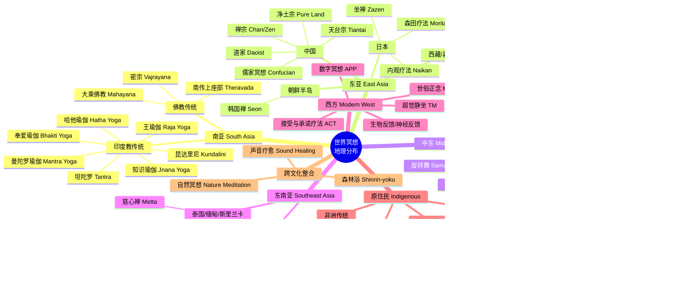
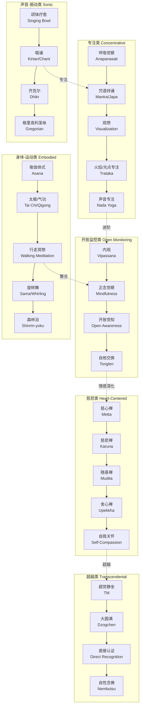
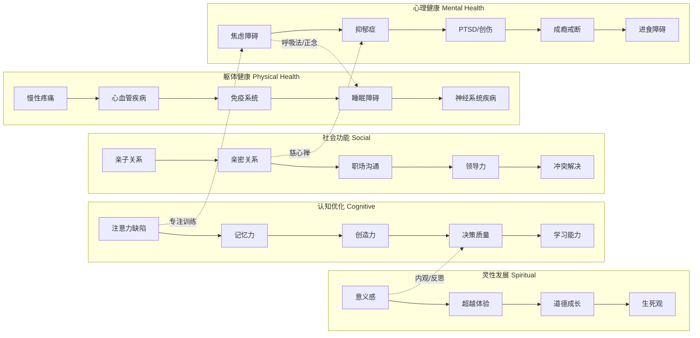
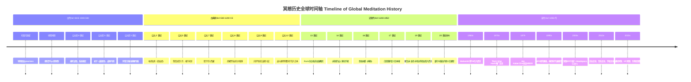
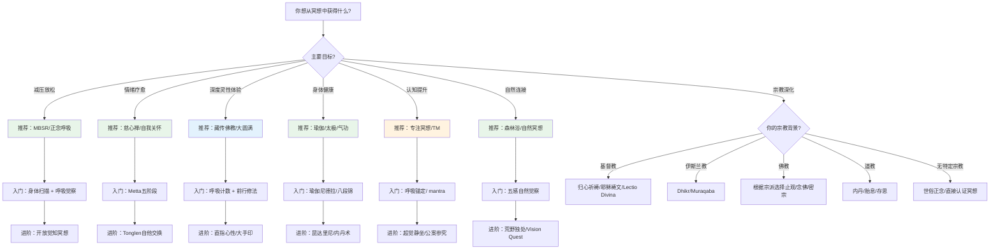

# 世界冥想全景图 | World Meditation Panorama

> **版本**：v1.0  
> **最后更新**：2026-05  
> **阅读时长**：约 20 分钟  
> **用途**：作为 Peace Lab 冥想知识库的导航地图，帮助学习者、研究者和执行师定位全球冥想传统的坐标

---

## 一、引言：为什么要有一张"世界冥想地图"

冥想（Meditation）并非单一的技术，而是人类在数千年的文明演进中，在不同地理、文化、宗教和科学语境下发展出的**一系列心智训练方法的集合**。从喜马拉雅的洞穴到日本的禅堂，从埃及的沙漠到亚马逊的雨林，从印度的恒河边到硅谷的写字楼——人类一直在寻找让心安静下来的方法。

这张全景图的目的，不是将丰富多样的冥想传统简化为一张表格，而是：
- 为**初学者**提供选择路径的导航
- 为**研究者**提供跨文化比较的概念框架
- 为**冥想执行师**提供知识边界的参照
- 为**内容创作者**指出尚未被充分探索的领域

---

## 二、按地理-文化区域分类

---

## 三、按宗教-哲学传统分类

| 传统 | 核心世界观 | 冥想目标 | 代表方法 | 知识库覆盖 |
|-----|----------|---------|---------|-----------|
| **印度教 Hinduism** | 梵我合一（Atman-Brahman） | 解脱（Moksha）、与神合一 | 王瑜伽八支、昆达里尼、奉爱唱诵 | ✅ [瑜伽尼德拉](yoga-nidra/) · [昆达里尼](kundalini-meditation/) · [唱诵](mantra-chanting/) · [脉轮](chakra-meditation/) |
| **佛教 Buddhism** | 四圣谛、缘起性空、心性本觉 | 觉悟（Bodhi）、涅槃、慈悲智慧 | 止观、内观、慈心禅、大圆满、坐禅 | ✅ [止观](samatha-vipassana/) · [内观](vipassana/) · [慈心禅](metta-lovingkindness/) · [藏传](tibetan-meditation/) · [坐禅](zazen/) · [直接认证](direct-recognition/) |
| **道教 Daoism** | 道法自然、天人合一、三宝养生 | 长生久视、与道合一、成仙 | 内丹、胎息、存思、导引 | ✅ [道家冥想](taoist-meditation/) · [中国传统](chinese-traditions/) |
| **儒教 Confucianism** | 修身齐家治国平天下 | 成圣、仁心修养 | 静坐、存心养性、礼乐涵养 | ✅ [中国传统](chinese-traditions/Chinese_Meditation_Overview.md) |
| **基督教 Christianity** | 上帝临在、道成肉身、恩典 | 与上帝联合（Unio Mystica）、爱神爱人 | Lectio Divina、归心祈祷、耶稣祷文、神操 | ✅ [基督教默观](christian-contemplative/) |
| **伊斯兰教 Islam** | 真主独一（Tawhid）、服从 | 接近真主、寂灭于真主（Fana） | Dhikr、Muraqaba、旋转舞 | ✅ [苏菲冥想](sufism-meditation/) |
| **犹太教 Judaism** | 唯一真神、托拉律法 | 认识神、修复世界（Tikkun） | 卡巴拉冥想、字母冥想、Hitbonenut | ✅ [犹太教冥想](jewish-meditation/) |
| **锡克教 Sikhism** | 唯一真神、 Guru 指引 | 与神合一、服务他人 | Naam Simran（持名冥想） | ✅ [锡克教冥想](sikh-meditation/) |
| **耆那教 Jainism** | 非暴力、灵魂解脱 | 解脱（Moksha）、消除业力 | 内省（Samayika）、持咒 | ✅ [耆那教冥想](jain-meditation/) |
| **巴哈伊信仰 Baha'i** | 人类一体、渐进启示 | 灵性发展、服务人类 | 祈祷与冥想 | ✅ [巴哈伊冥想](bahai-meditation/) |
| **萨满传统 Shamanism** | 万物有灵、三界互通 | 疗愈、智慧获取、灵魂旅程 | 鼓之旅程、植物药、视觉追寻 | ✅ [萨满传统](shamanic-traditions/) |
| **世俗科学 Secular/Science** | 唯物主义/自然主义 | 减压、健康、认知优化 | MBSR、TM（去宗教化）、生物反馈 | ✅ [MBSR](mbsr-program/) · [MBCT](mbct-program/) · [TM](../../04-Humanities-Arts/literature/world-nonfiction/meditation-mindfulness/transcendental-meditation.md) · [超觉静坐](../../04-Humanities-Arts/literature/world-nonfiction/meditation-mindfulness/transcendental-meditation.md) |

---

## 四、按技术类型分类

| 技术类型 | 核心机制 | 适合人群 | 代表传统 | 知识库覆盖 |
|---------|---------|---------|---------|-----------|
| **呼吸专注** | 利用呼吸的节律性锚定注意力 | 几乎所有初学者 | 佛教安那般那念、瑜伽Pranayama | ✅ [调息](pranayama-breath/) |
| **咒语持诵** | 声音振动+重复创造神经可塑性变化 | 喜欢声音/音乐的人 | 印度教Japa、佛教真言、苏菲Dhikr | ✅ [唱诵](mantra-chanting/) |
| **观想** | 心理意象激活相应脑区和身体反应 | 视觉型学习者 | 藏传佛教本尊瑜伽、脉轮观想 | ✅ [曼陀罗](mandala-meditation/) · [脉轮](chakra-meditation/) · [藏传](tibetan-meditation/) |
| **开放监控** | 不评判地觉察一切经验 | 有一定专注力基础者 | 南传内观、正念减压MBSR | ✅ [内观](vipassana/) · [止观](samatha-vipassana/) |
| **慈悲冥想** | 培养积极情感连接，激活社交脑回路 | 情绪困难/社交焦虑者 | 慈心禅Metta、自我关怀 | ✅ [慈心禅](metta-lovingkindness/) |
| **超越冥想** | 让心智自然趋向超越性安静状态 | 寻求深层体验者 | 超觉静坐TM、大圆满 | ✅ [TM](../../04-Humanities-Arts/literature/world-nonfiction/meditation-mindfulness/transcendental-meditation.md) · [藏传](tibetan-meditation/) · [直接认证](direct-recognition/) |
| **身体运动** | 通过运动整合身心，释放躯体化紧张 | 坐不住的人/身体疲劳者 | 瑜伽、太极、行走冥想 | ✅ [行走](walking-meditation/) · [瑜伽尼德拉](yoga-nidra/) · [自然](nature-meditation/) |
| **自然沉浸** | 利用自然环境恢复注意力和降低压力 | 城市居民/自然爱好者 | 森林浴、荒野独处 | ✅ [自然](nature-meditation/) |
| **团体共修** | 利用集体能量场和社会支持强化练习 | 需要社群归属感者 | Kirtan唱诵、禅修营、苏菲旋转 | ✅ [唱诵](mantra-chanting/) · [苏菲](sufism-meditation/) |
| **书写/反思** | 结构化自我反思促进认知重构 | 喜欢文字/逻辑的人 | 日本内观Naikan、依纳爵神操 | ✅ [内观](naikan-meditation/) |

---

## 五、按现代应用领域分类

| 应用领域 | 最相关的冥想类型 | 证据强度 | 知识库覆盖 |
|---------|---------------|---------|-----------|
| **焦虑障碍** | MBSR、正念呼吸、身体扫描 | ⭐⭐⭐⭐⭐（强） | ✅ [焦虑症](clinical-conditions/Meditation_Anxiety_Disorders.md) |
| **抑郁症** | MBCT、慈心禅、TM | ⭐⭐⭐⭐⭐（强） | ✅ [抑郁症](clinical-conditions/Meditation_Depression.md) |
| **PTSD/创伤** | 正念、瑜伽、Mantra、慈心禅 | ⭐⭐⭐⭐（中强） | ✅ [PTSD](clinical-conditions/Meditation_PTSD_Trauma.md) |
| **慢性疼痛** | 正念减压、身体扫描 | ⭐⭐⭐⭐（中强） | ✅ [慢性疼痛](clinical-conditions/Meditation_Chronic_Pain.md) |
| **心血管疾病** | TM、正念、呼吸法 | ⭐⭐⭐⭐（中强） | ✅ [心血管](clinical-conditions/Meditation_Cardiovascular_Health.md) |
| **睡眠障碍** | 身体扫描、呼吸法、瑜伽尼德拉 | ⭐⭐⭐⭐（中强） | ✅ [睡眠](overview/Meditation_And_Sleep.md) · [瑜伽尼德拉](yoga-nidra/) |
| **注意力/ADHD** | 专注冥想、正念、TM | ⭐⭐⭐（中等） | ✅ [神经疾病](clinical-conditions/Meditation_Neurological_Disorders.md) |
| **成瘾戒断** | 正念复发预防、内观 | ⭐⭐⭐⭐（中强） | ✅ [成瘾](clinical-conditions/Meditation_Addiction_Recovery.md) |
| **免疫功能** | 昆达里尼、气功、森林浴 | ⭐⭐⭐（中等） | ✅ [昆达里尼](kundalini-meditation/) · [自然](nature-meditation/) |
| **癌症护理** | MBSR、慈心禅、瑜伽 | ⭐⭐⭐⭐（中强） | ✅ [癌症](clinical-conditions/Meditation_Cancer_Care.md) |
| **领导力/职场** | 正念、情绪觉察、决策冥想 | ⭐⭐⭐（中等） | ✅ [职业手册](professional-handbook/) |
| **教育/儿童** | 正念教育、呼吸游戏、慈心禅 | ⭐⭐⭐（中等） | ✅ [儿童青少年](overview/Children_Youth_Meditation.md) |

---

## 六、知识库覆盖度地图

### 覆盖度统计

| 级别 | 标准 | 数量 | 目录示例 |
|-----|------|------|---------|
| **充分覆盖** | 有理论体系+实践指南+科学证据+安全指引 | 9 个 | overview, safety, samatha-vipassana, clinical-conditions, professional-handbook, pranayama-breath, yoga-nidra, mandala-meditation, guided-courses |
| **充分覆盖** | 有理论体系+实践指南+科学证据+安全指引 | 9 个 | overview, safety, samatha-vipassana, clinical-conditions, professional-handbook, pranayama-breath, yoga-nidra, mandala-meditation, guided-courses |
| **已建立基础** | 有概述文档+实操深化，需进一步体系化 | 20 个 | tibetan-meditation, zazen, metta-lovingkindness, taoist-meditation, kundalini-meditation, christian-contemplative, sufism-meditation, nature-meditation, naikan-meditation, chakra-meditation, mantra-chanting, transcendental-meditation, direct-recognition, chinese-traditions, jewish-meditation, sikh-meditation, jain-meditation, bahai-meditation, shamanic-traditions, korean-seon |
| **现代应用** | 新领域，已建立框架 | 6 个 | meditation-technology, meditation-education, meditation-workplace, meditation-critique, meditation-space, crisis-meditation |
| **跨领域整合** | 新领域，已建立框架 | 1 个 | meditation-integration |
| **工具资源** | 实操工具，已建立框架 | 1 个 | tools |
| **待补充** | 尚无内容或仅有框架 | 3 个 | 非洲传统、澳洲原住民、南美传统 |
| **总目录数** | — | **40** | — |

---

## 七、冥想历史的全球时间轴

---

## 八、选择指南：如何找到适合你的冥想路径

---

## 九、对冥想执行师的知识建议

作为专业的冥想执行师或身心疗愈从业者，以下是我们建议的知识结构：

| 层级 | 必备知识 | 推荐深度 | 对应知识库模块 |
|-----|---------|---------|--------------|
| **基础层** | 至少精通 1 种传统的理论与实践 | 能独立带领课程 | 任一"特定传统"目录 |
| **通用层** | 解剖学、神经科学、心理学基础 | 理解机制，能回答学员疑问 | [overview神经科学](overview/Meditation_Neuroscience_Mechanisms.md) · [临床应用](overview/Meditation_Clinical_Applications.md) |
| **安全层** | 不良反应识别、创伤知情、危机干预 | 能处理突发状况 | [safety](safety/) |
| **拓展层** | 了解 3–5 种其他传统的基本方法 | 能根据学员背景推荐适合路径 | 本全景图 + 多个"特定传统"目录 |
| **伦理层** | 职业道德、文化敏感性、边界设定 | 符合行业最佳实践 | [practitioner-training伦理](practitioner-training/Practitioner_Ethics_Standards.md) |
| **研究层** | 循证实践、评估工具、研究方法 | 能跟踪最新科学进展 | [professional-handbook研究](professional-handbook/) |

---

## 十、延伸阅读与参考

### 跨传统比较
- **《Meditation and Culture》** — Wolfgang J. Fuchs（跨文化冥想研究）
- **《The Oxford Handbook of Meditation》** — Cristina Alcnso et al.（牛津冥想手册）
- **《Mysticism East and West》** — Rudolf Otto（东西方神秘主义比较）

### 全球冥想地图
- **《The Way of the Explorer》** — Edgar Mitchell（太空视角下的意识研究）
- **《Waking Up》** — Sam Harris（世俗框架下的冥想）

### 历史脉络
- **《The Story of Yoga》** — Alistair Shearer（瑜伽全球传播史）
- **《Buddhism: One Teacher, Many Traditions》** — 达赖喇嘛与Thubten Chodron（佛教多传统比较）
- **《The Mystics of Islam》** — Reynold A. Nicholson（苏菲主义经典研究）

---

*本文档为 Peace Lab 冥想知识库的全景导航地图。随着知识库的持续扩展，覆盖度地图将定期更新。欢迎贡献者补充尚未覆盖的传统与领域。*

---

## 📞 危机干预资源 | Crisis Resources

> **如果您或您认识的人正在经历心理危机或有自杀念头,请立即寻求帮助。**

### 中国大陆

| 资源 | 联系方式 |
|---|---|
| 北京心理危机研究与干预中心 | **010-82951332** (24小时) |
| 全国心理援助热线 | **400-161-9995** (24小时) |
| 希望24热线 | **400-161-9995** (24小时) |
| 生命热线 | **400-821-1215** (24小时) |

### 国际

| 地区 | 资源 | 联系方式 |
|---|---|---|
| 🇺🇸 美国 | 988 Suicide & Crisis Lifeline | **988** (24/7) |
| 🇬🇧 英国 | Samaritans | **116 123** (24/7) |
| 🇭🇰 香港 | 撒玛利亚防止自杀会 | **2389-0000** |
| 🇹🇼 台湾 | 生命线 | **1995** |

**完整资源列表**:[_meta/docs/CRISIS_RESOURCES.md](../../_meta/docs/CRISIS_RESOURCES.md)

**全球资源**:[Befrienders Worldwide](https://www.befrienders.org) | [WHO 心理健康](https://www.who.int/health-topics/mental-health)

