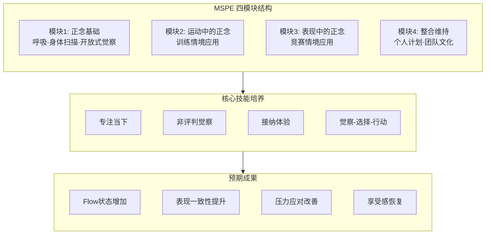
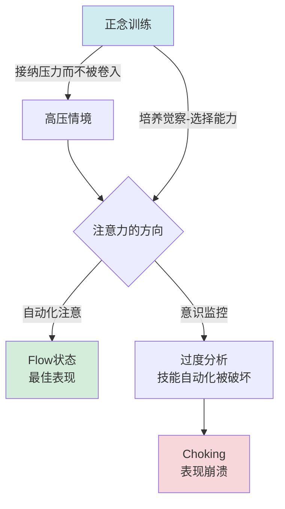
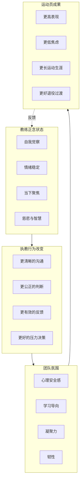
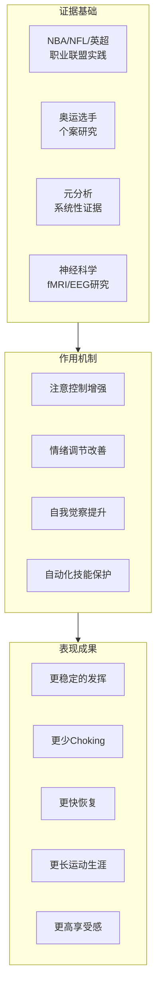

# 冥想与运动表现

> 最后更新：2026-05

---

## 目录

1. [运动心理学中的正念](#1-运动心理学中的正念)
2. [不同运动类型的正念适配](#2-不同运动类型的正念适配)
3. [运动损伤恢复中的冥想](#3-运动损伤恢复中的冥想)
4. [竞技压力管理](#4-竞技压力管理)
5. [团队运动中的正念](#5-团队运动中的正念)
6. [科学证据](#6-科学证据)
7. [参考资源](#7-参考资源)

---

## 1. 运动心理学中的正念

### 1.1 MSPE：正念运动表现提升

**Mindful Sport Performance Enhancement (MSPE)** 是专为运动员设计的标准化正念干预方案：

| 模块 | 内容 | 时长 | 目标 |
|:---:|:---|:---:|:---|
| **1. 正念基础** | 呼吸觉察、身体扫描、开放式觉察 | 2周 | 建立基础觉察能力 |
| **2. 运动中的正念** | 将觉察带入训练活动（如正念跑步、正念举重） | 2周 | 将正念迁移到运动情境 |
| **3. 表现中的正念** | 比赛模拟中的正念应用；处理失误与压力 | 2周 | 高压下的当下聚焦 |
| **4. 整合与维持** | 制定个人正念计划；团队正念整合 | 2周 | 长期维持与内化 |

### 1.2 ACT 在竞技体育中的应用

**接纳与承诺疗法 (Acceptance and Commitment Therapy, ACT)** 的六边形模型在运动中的应用：

| ACT 过程 | 运动应用 | 运动员常见问题 | 正念练习 |
|:---|:---|:---|:---|
| **接纳** | 接纳赛前焦虑的生理症状 | "我必须消除紧张才能比赛好" | 允许紧张存在，与其共存而非对抗 |
| **认知解离** | 从"我会失败"的想法中后退 | 灾难化思维、自我批评 | "我注意到我有一个'我会失败'的想法" |
| **当下觉察** | 完全投入于当下的动作 | 思绪飘向结果或过去失误 | 锚定于呼吸、身体感受或感官输入 |
| **以己为景** | 觉察自己是经验的观察者 | 过度认同"失败者"身份 | "我是觉察本身，而非我的表现" |
| **价值观** | 连接到运动的核心意义 | 只关注外在结果（奖金、名次） | 赛前价值观澄清："为什么我选择这项运动？" |
| **承诺行动** | 在不适中坚持有效行动 | 困难时放弃或逃避 | 无论感受如何，执行既定的比赛计划 |

### 1.3 Flow State 与正念的关系

| Flow 条件 | 正念贡献 | 具体练习 |
|:---|:---|:---|
| **挑战-技能平衡** | 觉察当前真实能力，设定合理目标 | 训练日志+正念反思 |
| **明确目标** | 将注意力集中于过程目标而非结果 | 设定"这一回合我只关注..." |
| **即时反馈** | 对反馈保持开放，不防御 | 失误后的呼吸锚定，快速接收信息 |
| **深度专注** | 正念培养的注意力稳定性 | 专注冥想（Samatha）训练 |
| **自我意识消失** | 减少自我监控与评判 | 开放式觉察冥想 |
| **时间感扭曲** | 不纠结于"还剩多少时间" | 将时间线索视为外部信息，回到当下 |
| **自成目的性** | 重新连接运动本身的内在乐趣 | 回忆开始这项运动的初心；感恩练习 |

---

## 2. 不同运动类型的正念适配

### 2.1 耐力运动

| 运动 | 正念应用 | 具体技术 | 关键提示 |
|:---|:---|:---|:---|
| **跑步** | 将跑步转化为移动冥想 | 脚步作为锚点；呼吸与步频同步（如3步吸气/2步呼气） | 不要用正念"逃避"疲劳，而是觉察疲劳的所有维度 |
| **马拉松** | "移动冥想"应对"撞墙期" | 身体扫描式跑步——轮流觉察脚、腿、呼吸、手臂；将里程分段，只关注当下这一段 | "这只是当下的感受，它会变化" |
| **游泳** | 利用呼吸节奏的自然锚定 | 将呼吸与划水同步；水下时的听觉觉察（水泡声）；感受水的阻力与浮力 | 游泳的呼吸限制天然训练了呼吸觉察 |
| **骑行** | 长时间单调节奏中的觉察 | 踏板画圆的感觉；风与皮肤的接触；风景的开放式觉察 | 注意交通安全——正念不意味着关闭对外部危险的觉察 |

### 2.2 技巧型运动

| 运动 | 正念核心 | 具体练习 | 常见误区 |
|:---|:---|:---|:---|
| **高尔夫推杆** | 单一动作的极致当下 | 击球前三次深呼吸；感受握杆的压力；击球后保持"收势觉察"3秒 | 不要用正念"控制"结果——正念是觉察，不是保证进球 |
| **射箭** | "无心"（Mushin）——无执着的专注 | 拉弓时的呼吸与肌肉觉察；放箭时的"无抓取"；不立即看结果 | "瞄准时没有靶心"——过度关注命中会颤抖 |
| **体操** | 复杂序列中的分段觉察 | 将成套动作分解为"此刻这一个动作"；失误后的即时呼吸重置 | 不因为上一个动作的失误影响下一个 |
| **射击** | 扳机控制中的微观觉察 | 食指压力的渐变觉察；心跳与呼吸的协调；不预判击发时刻 | 不要"催促"击发——等待它自然发生 |

### 2.3 对抗性运动

| 运动 | 正念挑战 | 正念策略 | 训练方法 |
|:---|:---|:---|:---|
| **格斗（拳击/MMA/柔术）** | 在攻击/被击中时保持觉察 | "战斗中的第三只眼"——一部分注意力在对手，一部分在自己身体 | 对打中的呼吸觉察；被击中后的即时呼吸恢复 |
| **足球/篮球** | 快速情境切换、团队动态 | "广角觉察"——同时觉察球、队友、对手、空间 | 训练中的"正念扫描"——每5秒快速觉察全场 |
| **网球/羽毛球** | 回合间的快速重置 | "一分结束，一分开始"——每次失分/得分后的呼吸重置仪式 | 设定触地线/过网线为"呼吸信号" |
| **失误后恢复** | 快速从错误中回到当下 | "错误觉察三步骤"：1.承认 2.呼吸 3.下一个 | 训练中故意制造失误并练习恢复 |

### 2.4 极限运动

| 运动 | 正念维度 | 具体应用 | 安全关联 |
|:---|:---|:---|:---|
| **攀岩** | "当下"——每一个手点/脚点是唯一的现实 | 触岩时的质地觉察；身体与岩壁的关系；不纠结于上方还有多高 | 分心=危险；正念是安全工具 |
| **冲浪** | Flow 的自然发生 | 等浪时的开放觉察；起乘时的全身协调；浪上的"无我"体验 | 读懂海洋的节奏需要深度觉察 |
| **滑雪** | 速度与控制的平衡觉察 | 转弯时的身体重量转移觉察；雪质的触觉反馈；视线引导的意图 | 恐惧会僵硬身体；正念允许恐惧存在而不被控制 |
| **跳伞/翼装** | 极端情境下的当下聚焦 | 出舱时的感官全开；自由落体的身体觉察；开伞后的检查清单 | 程序化动作+当下觉察=安全 |

---

## 3. 运动损伤恢复中的冥想

### 3.1 疼痛管理

| 阶段 | 疼痛特点 | 正念策略 | 具体练习 |
|:---|:---|:---|:---|
| **急性期** | 尖锐、强烈的疼痛信号 | 接纳而非对抗；呼吸与疼痛共存 | "呼吸进入疼痛"——吸气时想象气息包围疼痛区域 |
| **亚急性期** | 持续的隐痛、活动受限的沮丧 | 区分"疼痛"与"痛苦"（疼痛+抗拒=痛苦） | 身体扫描，区分"实际疼痛"与"对疼痛的想象" |
| **慢性期** | 长期疼痛、身份丧失感 | 重新叙事——"我有疼痛，但我不只是疼痛" | 价值观澄清："除了运动，我是谁？" |

### 3.2 手术前后的心理准备

| 时间点 | 正念应用 | 具体练习 | 辅助效果 |
|:---|:---|:---|:---|
| **术前焦虑** | 降低术前焦虑，改善睡眠 | 术前身体扫描+慈悲冥想；对医疗团队的信任冥想 | 术前焦虑↓、睡眠质量↑ |
| **术中** | （如可能）保持平静 | 术中呼吸觉察（局麻时）；术前练习过的观想 | 麻醉药需求可能减少 |
| **术后早期** | 应对疼痛、制动、依赖感 | 感恩练习——感恩身体的愈合能力；每日"小胜利"觉察 | 抑郁风险↓、配合度↑ |
| **术后恢复** | 耐心的培养、康复进度接纳 | "比较心"觉察——不与他人/过去的自己比较；每日进展日志 | 更现实的期望、更少二次损伤 |

### 3.3 康复期的耐心培养

**运动员身份丧失的冥想应对：**

| 挑战 | 正念回应 | 练习 |
|:---|:---|:---|
| "我不再是我" | 觉察身份执着；扩展自我定义 | 价值观冥想："我的价值不只是我的表现" |
| "别人都在进步，我在倒退" | 觉察比较心；回到自己的节奏 | 每日记录"今天的身体教了我什么" |
| "我会不会被取代？" | 觉察恐惧；连接到团队/运动的更大意义 | 团队观想："即使我不能上场，我仍是团队的一部分" |
| "我还能回到从前吗？" | 放下对"从前"的执着；接纳"新的可能" | 未来自我观想——不是回到过去，而是发现新的版本 |

---

## 4. 竞技压力管理

### 4.1 赛前焦虑

| 焦虑类型 | 身体表现 | 认知表现 | 正念应对 |
|:---|:---|:---|:---|
| **认知焦虑** | 心跳加速、肌肉紧张 | "我会失败""我没准备好" | 认知解离："我有一个想法..."；回归过程目标 |
| **躯体焦虑** | 手心出汗、肠胃不适 | 对身体症状的灾难化解读 | 身体扫描+接纳："这是我的身体在准备战斗" |
| **自信心不足** | 姿势收缩、能量低落 | 与过去的成功失联 | 成功回忆冥想：闭眼重温最佳表现的感受 |

**赛前正念仪式示例（15分钟）：**

| 阶段 | 时长 | 内容 |
|:---:|:---:|:---|
| 身体着陆 | 3分钟 | 坐姿或卧姿身体扫描，释放明显紧张 |
| 呼吸稳定 | 3分钟 | 4-4-4呼吸（吸-屏-呼）或自然呼吸觉察 |
| 价值观连接 | 2分钟 | "我选择这场比赛是因为..." |
| 过程意图 | 2分钟 | "今天我专注于...（1-3个过程目标）" |
| 成功观想 | 3分钟 | 观想比赛中的流畅表现（多感官） |
| 结束 | 2分钟 | 感恩、准备好行动 |

### 4.2 发挥失常 "Choking" 的应对

**Choking 的正念模型：**

| Choking 触发 | 正念应对 | 比赛中的即时技术 |
|:---|:---|:---|
| **意识侵入** | 觉察到"我在过度思考" | STOP技术；将注意力外化到感官或动作 |
| **后果思维** | 觉察到思绪飘向结果 | "回来"——回到呼吸或当下的身体感受 |
| **自我监控** | 觉察到"我在看自己表现" | 扩展觉察到环境——声音、空间、对手 |
| **时间压力** | 觉察到"时间不多了"的恐慌 | 一个动作一个动作来；"此刻只有这个回合" |

### 4.3 裁判/观众压力

| 压力源 | 正念重构 | 练习 |
|:---|:---|:---|
| **裁判误判** | "裁判也是人；我的控制只在我的回应" | 误判后的呼吸-释放仪式 |
| **观众噪音** | 将噪音作为"背景"而非"威胁" | 训练中在有干扰的环境下练习专注 |
| **主场/客场压力** | "场地只是场地；比赛只是在当下进行" | 赛前场地行走冥想——熟悉化与去神秘化 |
| **社交媒体/媒体压力** | 设定"数字边界"；比赛期间不看评论 | 赛前48小时"数字排毒" |

---

## 5. 团队运动中的正念

### 5.1 团队凝聚力

| 正念应用 | 具体活动 | 预期效果 |
|:---|:---|:---|
| **集体呼吸** | 赛前围圈同步呼吸1分钟 | 生理同步→心理连接 |
| **正念倾听圈** | 每周一次，轮流分享，他人只听不说 | 深度理解、减少误解 |
| **共同行走冥想** | 训练前的沉默行走 | 非言语连接、共同当下 |
| **感恩练习** | 轮流感谢队友的具体贡献 | 积极团队文化、减少内部竞争 |

### 5.2 更衣室文化

| 文化要素 | 正念转化 | 领导者角色 |
|:---|:---|:---|
| **赛前能量管理** | 从"煽动性"到"稳定存在"——每个队员找到自己的最佳唤起水平 | 队长示范冷静专注 |
| **失误后的氛围** | "错误是学习的数据"而非"失败的标记" | 资深队员首先示范接纳 |
| **竞争与合作的平衡** | 觉察自己的竞争心是否伤害到团队 | 教练引导"团队价值观"讨论 |
| **多样性包容** | 觉察对"不同"的自动反应；培养好奇 | 正念沟通培训 |

### 5.3 教练的正念领导力

| 领导力维度 | 正念应用 | 教练实践 |
|:---|:---|:---|
| **情绪稳定** | 觉察自己的情绪状态，避免将个人情绪带入执教 | 赛前5分钟个人正念；情绪日志 |
| **当下反馈** | 给予反馈时全然在场，而非敷衍或发泄 | 反馈前三次呼吸；具体、当下、可行动 |
| **觉察偏见** | 觉察对特定队员的偏好/偏见 | 定期反思："我对这个队员的评判是基于什么？" |
| **压力下的决策** | 关键时刻暂停、觉察、选择 | 暂停时的呼吸锚定 |
| **自我关怀** | 教练也是高压职业；防止耗竭 | 定期的个人正念 retreat |

---

## 6. 科学证据

### 6.1 NBA/NFL/英超中的正念项目

| 联盟/球队 | 正念项目 | 关键人物 | 报告成果 |
|:---|:---|:---|:---|
| **NBA** | 多队引入正念训练（如雄鹿、勇士） | George Mumford（禅师Phil Jackson的助手） | 球员报告专注力、压力管理、团队协作改善 |
| **NFL** | 西雅图海鹰队 Pete Carroll 的正念文化 | Pete Carroll（主教练）、Michael Gervais（运动心理师） | 超级碗冠军；更衣室文化转型 |
| **英超** | 多俱乐部引入正念（如曼联、阿森纳） | 各队运动心理部门 | 伤病恢复加速、球员心理健康关注 |
| **MLB** | 芝加哥小熊队等 | 各队心理教练 | 高压情境下的表现稳定性 |

### 6.2 奥运选手的冥想训练

| 运动员/项目 | 正念应用 | 成果/影响 |
|:---|:---|:---|
| **Michael Phelps（游泳）** | 可视化+呼吸技术 | 23枚奥运金牌；赛前系统的"心理准备" |
| **Novak Djokovic（网球）** | 超觉冥想+正念饮食 | 多次大满贯；公开谈论冥想对恢复的助益 |
| **Rasmus Ankersen（足球/作家）** | 丹麦体育文化中的正念元素 | 《The Gold Mine Effect》作者，推广运动心理训练 |
| **美国奥运队** | 美国奥委会支持的正念项目 | 多项目运动员的心理韧性培训 |

### 6.3 运动表现元分析

| 元分析 | 样本 | 主要发现 |
|:---|:---|:---|
| Sappington & Longshore (2015) | 运动正念研究综合分析 | 正念与运动表现正相关（中等效应量）；与Flow体验、专注度显著相关 |
| Noetel et al. (2017) | 正念干预对运动员的影响 | 正念训练显著改善运动员的心理技能（焦虑、自信、专注力） |
| Bühlmayer et al. (2017) | 正念对运动表现的元分析 | 中等程度的积极效应；对需要精确控制的运动效果更明显 |
| Josefsson et al. (2019) | 运动员正念干预的系统综述 | 正念改善心理韧性、恢复质量、整体幸福感 |

| 效果维度 | 效应量 | 证据强度 |
|:---|:---:|:---:|
| 焦虑降低 | 中等 | ⭐⭐⭐⭐ |
| 专注力提升 | 中等 | ⭐⭐⭐⭐ |
| 表现改善 | 中-小 | ⭐⭐⭐ |
| Flow体验增加 | 中等 | ⭐⭐⭐⭐ |
| 压力恢复 | 中等 | ⭐⭐⭐⭐ |
| 团队凝聚力 | 中-小 | ⭐⭐⭐ |

---

## 7. 参考资源

### 核心书籍

1. Mumford, G. (2015). *The Mindful Athlete: Secrets to Pure Performance*. Parallax Press.
2. Jackson, P., & Delehanty, H. (1995). *Sacred Hoops: Spiritual Lessons of a Hardwood Warrior*. Hyperion.
3. Carroll, P. (2010). *Win Forever: Live, Work, and Play Like a Champion*. Portfolio.
4. Gardner, F. L., & Moore, Z. E. (2012). *Mindfulness and Acceptance Models in Sport Psychology: A Practitioner's Guide to Help Athletes and Coaches Peak Perform*. Context Press.
5. Ravizza, K., & Hanson, T. (1995). *Heads-Up Baseball: Playing the Game One Pitch at a Time*. McGraw-Hill.

### 学术研究

- Gardner, F. L., & Moore, Z. E. (2012). "Mindfulness and acceptance models in sport psychology: A decade of basic and applied scientific advancements." *Canadian Psychology*, 53(4), 309.
- Sappington, R., & Longshore, K. (2015). "Systematically reviewing the efficacy of mindfulness-based interventions for enhanced athletic performance." *Journal of Clinical Sport Psychology*, 9(3), 232-262.
- Bühlmayer, L., et al. (2017). "How mindfulness changes the white matter structure of the brain." *Progress in Brain Research*, 232, 207-221.

### 训练项目

| 项目 | 类型 | 适用对象 |
|:---|:---|:---|
| MSPE (Mindful Sport Performance Enhancement) | 标准化干预方案 | 团队/个人运动员 |
| Mindful Athlete Course (George Mumford) | 工作坊/线上 | 各级运动员 |
| mPEAK (Mindful Performance Enhancement, Awareness and Knowledge) | 8周课程 | 高压职业人士包括运动员 |
| Headspace Sport | App | 日常正念训练的运动员 |
| Calm Sport | App | 睡眠+表现心理的运动员 |

---

> **跨领域标签**: `#运动心理学` `#运动表现` `#Flow` `#竞技压力` `#团队运动` `#运动损伤` `#正念运动` `#心流`
