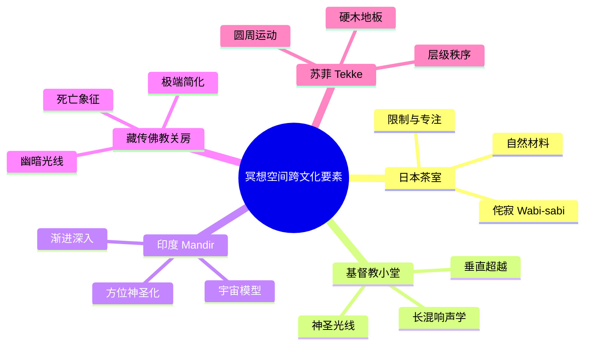
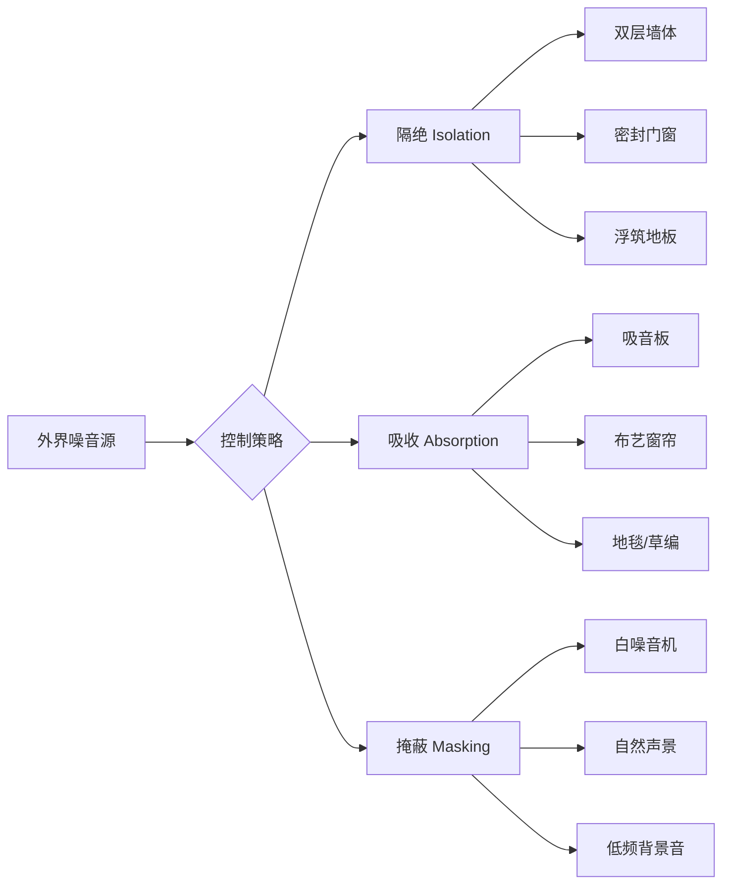
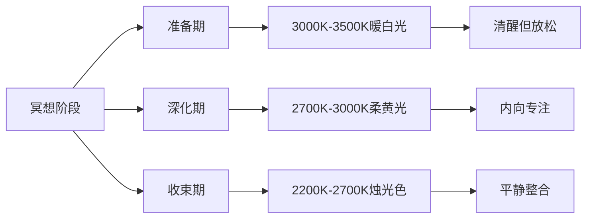
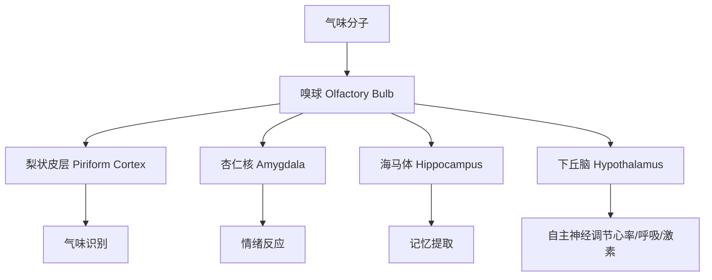
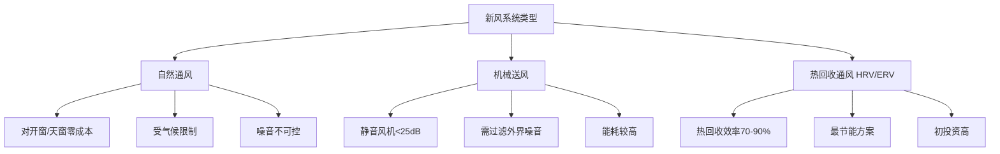
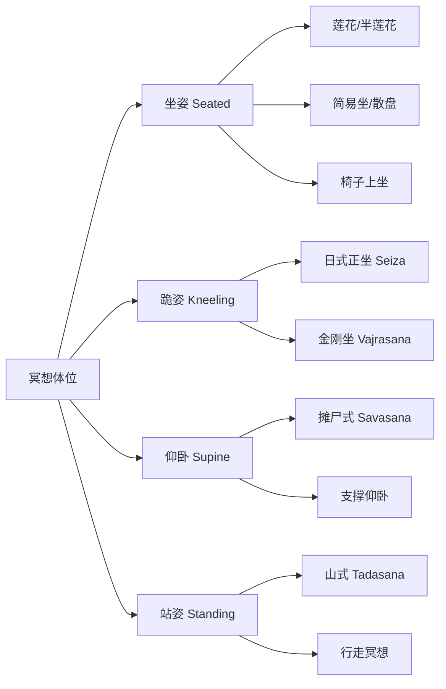
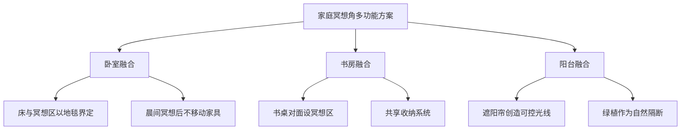
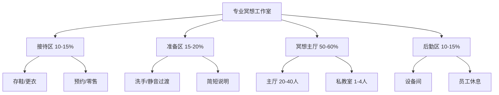
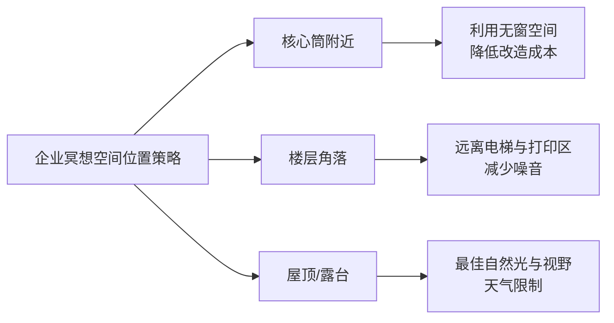
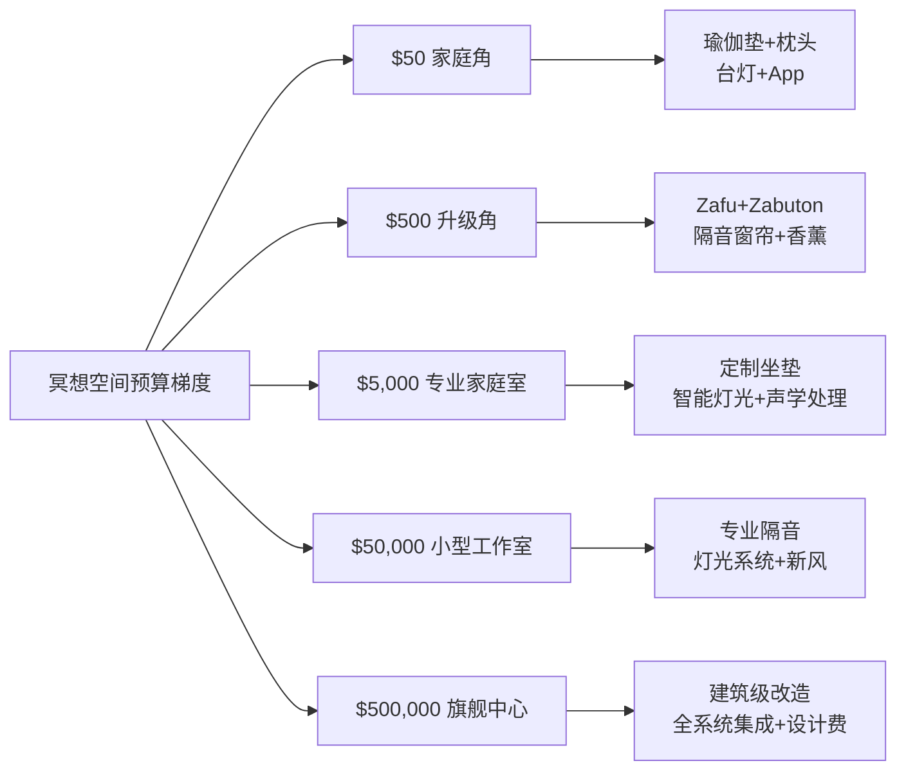

---

title: "冥想空间设计专业指南 Meditation Space Design Guide"
description: "冥想空间设计专业指南 Meditation Space Design Guide的详细解析与实践指南"
category: "心智与心理学 > 冥想 > Meditation Space"
tags: ["anxiety", "brain"]
last_updated: "2026-05"
difficulty: "intermediate"
reading_level: "intermediate"
estimated_read_time: "15min"
intent_queries:
  - "什么是冥想空间设计专业指南 Meditation Space Design Guide"
  - "冥想空间设计专业指南 Meditation Space Design Guide的核心概念"
  - "冥想空间设计专业指南 Meditation Space Design Guide的方法与实践"
trigger_keywords: ["act", "adolescent", "anxiety", "art"]
cross_refs:
  - path: "01-Wisdom-Traditions/religions/buddhism/meditation/Buddhism_Meditation_Practice_System.md"
    relation: "anxiety/buddhism/meditation"
  - path: "01-Wisdom-Traditions/religions/buddhism/meditation/Buddhism_Samatha_Vipassana.md"
    relation: "anxiety/buddhism/meditation"
  - path: "01-Wisdom-Traditions/religions/buddhism/psychology/Buddhism_Mindfulness_Therapy_Integration.md"
    relation: "anxiety/buddhism/meditation"
  - path: "01-Wisdom-Traditions/religions/wisdom-traditions/Wisdom_Buddhism_Healing_Psychology.md"
    relation: "anxiety/buddhism/meditation"
  - path: "01-Wisdom-Traditions/religions/wisdom-traditions/Wisdom_Mahamudra_Great_Seal.md"
    relation: "anxiety/buddhism/meditation"

---
# 冥想空间设计专业指南 Meditation Space Design Guide

> **最后更新：2026-05**
> 本指南整合建筑学、声学工程、环境心理学与跨文化宗教空间传统，为从家庭冥想角到专业冥想工作室的全梯度空间提供设计参考。

---

## 目录

1. [空间设计的跨文化历史](#一空间设计的跨文化历史)
2. [物理环境要素](#二物理环境要素)
3. [空间类型设计](#三空间类型设计)
4. [建筑案例研究](#四建筑案例研究)
5. [预算与实施指南](#五预算与实施指南)
6. [参考文献与延伸阅读](#六参考文献与延伸阅读)

---

## 一、空间设计的跨文化历史

冥想空间的设计并非现代发明。人类文明在数千年的宗教与精神实践中，已经发展出高度成熟的空间原型（spatial archetypes）。理解这些传统，有助于我们在当代设计中汲取深层智慧。

### 1.1 日本茶室（Chashitsu / 茶室）

| 特征 | 设计智慧 |
|------|---------|
| 空间尺度 | 通常仅 4.5 叠（约 8.2㎡），刻意限制尺度以促发专注 |
| 入口（Nijiri-guchi） | 膝行入口，象征放下社会身份，人人平等 |
| 材料 | 自然材料（榻榻米、竹、土墙），不加修饰，体现侘寂（Wabi-sabi） |
| 光线 | 柔和间接光，避免直射，营造幽玄氛围 |
| 景观 | 躏口外设露地（Roji），以狭窄路径完成心理过渡 |

**核心洞见**：茶室不是为舒适而设计，而是为觉醒而设计。空间的限制本身就是一种修行。

### 1.2 基督教小堂（Chapel / Oratory）

| 特征 | 设计智慧 |
|------|---------|
| 纵向轴线 | 长轴布局引导视线朝向祭坛或圣坛，创造视觉焦点 |
| 垂直尺度 | 高耸的拱顶与穹顶，唤起对超越性（Transcendence）的感知 |
| 彩窗光线 | 彩色玻璃过滤自然光，创造神圣的光氛围（Luminous Mysticism） |
| 声学 | 石质材料产生较长混响（RT60 2-4秒），适合圣咏与管风琴 |
| 座椅 | 跪拜椅（Prie-dieu）支持 kneeling 冥想姿态 |

**核心洞见**：基督教小堂通过垂直方向的张力，将人的注意力从世俗水平面拉升至神圣垂直面。

### 1.3 印度 Mandir（神庙）

| 特征 | 设计智慧 |
|------|---------|
| 方位 | 严格按 Vastu Shastra（印度风水）定向，主神朝向特定方位 |
| 塔楼（Shikhara） | 高耸的石塔象征宇宙轴心（Axis Mundi） |
| 内殿（Garbhagriha） | 最核心、最幽暗的空间，仅容祭司进入，象征子宫与神圣核心 |
| 庭院 | 开放的庭院供群体唱诵（Kirtan），实现由外至内的渐进神圣化 |
| 雕刻 | 繁复的叙事性雕刻将神话视觉化，辅助观想（Visualization） |

**核心洞见**：Mandir 是一座宇宙模型，信徒从世俗外部逐步进入神圣核心，空间本身就是一场朝圣。

### 1.4 藏传佛教闭关房（Retreat Cabin / 关房）

| 特征 | 设计智慧 |
|------|---------|
| 位置 | 远离人烟的山腰或崖壁，最大限度减少外界干扰 |
| 结构 | 石木混合结构，厚墙小窗，冬暖夏凉 |
| 光线 | 极小窗洞，光线昏暗，支持闭黑关（Dark Retreat）修行 |
| 功能分区 | 仅容一榻一灶，消除选择疲劳（Decision Fatigue） |
| 象征 | 闭关房是坟冢的象征，修行者在其中经历象征性死亡与重生 |

**核心洞见**：极端的简化不是剥夺，而是将意识从物质世界完全收回，转向内在。

### 1.5 苏菲 Tekke（修道院 / 旋舞厅）

| 特征 | 设计智慧 |
|------|---------|
| 中央大厅（Samahane） | 圆形或八角形空间，支持旋舞（Sema）的圆周运动 |
| 地板 | 硬木地板，支撑旋转时的身体稳定与足感反馈 |
| 穹顶 | 象征天空与神圣穹庐，中央常悬挂吊灯代表太阳 |
| 方位 | 麦加方向（Qibla）设祭坛，旋舞逆时针旋转 |
| 层级 | 不同高度的平台区分导师（Sheikh）、乐师与舞者的位置 |

**核心洞见**：苏菲空间为运动中的冥想而设计，身体在空间中的轨迹成为通向神圣的路径。

### 1.6 跨文化空间设计要素对比

---

## 二、物理环境要素

现代神经科学与环境心理学研究已证实：物理环境直接影响冥想深度与生理放松水平。以下六个要素是冥想空间设计的科学基础。

### 2.1 声学设计 Acoustic Design

#### 2.1.1 混响时间（Reverberation Time / RT60）

| 空间类型 | 推荐 RT60 | 声学效果 | 适用冥想类型 |
|---------|----------|---------|------------|
| 个人家庭冥想角 | 0.3 - 0.5 秒 | 清晰、亲密 | 内观（Vipassana）、正念呼吸 |
| 小型团体工作室 | 0.6 - 0.8 秒 | 温暖、包裹感 | 引导冥想、瑜伽休息术（Yoga Nidra） |
| 大型冥想厅 | 1.0 - 1.5 秒 | 庄严、空间感 | 唱诵（Chanting）、铜锣浴（Gong Bath） |
| 自然户外空间 | 无固定值 | 开放、无边际 | 自然觉知、行走冥想 |

> **设计提示**：过多混响（>2秒）会导致语音清晰度下降，不适合引导语冥想；过少混响（<0.2秒）则产生消声室效应，令人不安。

#### 2.1.2 噪音控制（Noise Control）

| 噪音类型 | 频率范围 | 控制方法 | 成本等级 |
|---------|---------|---------|---------|
| 交通低频噪音 | 20-200 Hz | 质量定律墙体、密封条 | 高 |
| 人声谈话 | 200-4000 Hz | 吸音板、厚重窗帘 | 中 |
| 空调/设备 | 全频段 | 设备降噪、管道消音 | 中 |
| 邻里脚步声 | 低频撞击 | 浮筑地板、地毯 | 中高 |

#### 2.1.3 自然声 vs 人工声

| 声源类型 | 优势 | 风险 | 最佳实践 |
|---------|------|------|---------|
| 自然声（雨、溪、风铃） | 进化偏好、自动降低皮质醇 | 不可控、可能引发联想 | 录制高品质自然声，音量 <40dB |
| 人工声（白噪音、粉噪音） | 稳定、可精确控制 | 可能感觉机械、单调 | 粉噪音（Pink Noise）比白噪音更自然 |
| 音乐 | 情绪调节、文化熟悉感 | 旋律可能干扰注意力、引发记忆 | 选择无歌词、无强烈节奏的器乐 |
| 完全静默 | 最纯粹的内观条件 | 可能放大耳鸣、令初学者焦虑 | 提供渐进式静默训练 |

#### 2.1.4 ASMR 设计（Autonomous Sensory Meridian Response）

ASMR 设计是冥想空间的新兴领域。研究表明，特定低频、重复性声音可触发愉悦的头皮发麻反应，加速放松。

| ASMR 元素 | 实现方式 | 适用场景 |
|----------|---------|---------|
| 风铃（Wind Chimes） | 铜管或竹制，挂于通风处 | 户外冥想空间、窗边 |
| 流水声 | 微型桌面喷泉（<30dB） | 个人冥想角 |
| 颂钵（Singing Bowl） | 手工青铜钵，专业演奏 | 工作室开场/收束 |
| 雨棍（Rain Stick） | 仙人掌刺填充竹筒 | 儿童冥想空间 |
| 拂尘声 | 传统拂尘轻扫 | 仪式感冥想 |

### 2.2 光照与色温 Lighting & Color Temperature

#### 2.2.1 自然光：无可替代的黄金标准

多项研究（如 Figueiro & Rea, 2012）证实，自然光暴露与昼夜节律（Circadian Rhythm）同步，对冥想后恢复效果最佳。

| 自然光条件 | 生理效应 | 设计建议 |
|-----------|---------|---------|
| 晨曦（日出后1小时） | 高比例蓝光，提升警觉与清晰 | 东向开窗或天窗 |
| 正午日光 | 全光谱，维生素D合成 | 需遮阳避免过热与眩光 |
| 黄昏/黄金时刻 | 低色温（<3000K），促进褪黑素分泌 | 西向低窗、拉窗（Shoji）式柔光 |
| 阴天漫射光 | 无阴影、无眩光，最均匀的冥想光环境 | 北向天窗（北半球） |

#### 2.2.2 人工光的色温选择

| 色温范围 | 颜色描述 | 生理效应 | 适用冥想阶段 |
|---------|---------|---------|------------|
| 2200K - 2700K | 烛光色/极暖白 | 强烈促发褪黑素、深度放松 | 睡前冥想、 Yoga Nidra、收束 |
| 2700K - 3000K | 暖白 | 放松、舒适 | 一般坐姿冥想、慈心禅 |
| 3000K - 3500K | 中性暖白 | 平衡警觉与放松 | 晨间冥想、动态冥想 |
| 3500K - 4000K | 中性白 | 提升警觉、清晰 | 正念认知训练、初学者引导 |
| > 4000K | 冷白 | 过于警觉、可能增加焦虑 | **不推荐**用于冥想空间 |

#### 2.2.3 明暗节律（Light-Dark Rhythm）

冥想空间应模拟自然光的明暗过渡，而非恒定亮度：

| 时段 | 照度建议 | 控制方式 |
|------|---------|---------|
| 进入/准备 | 50-100 lux | 调光开关、感应渐亮 |
| 冥想主体 | 10-30 lux | 极低亮度，仅辨轮廓 |
| 收束/整合 | 5-20 lux，缓慢渐亮 | 定时调光，5分钟内回到50 lux |

#### 2.2.4 烛光冥想的光环境（Trataka / Candle Gazing）

| 要素 | 规格要求 |
|------|---------|
| 光源 | 蜂蜡或酥油蜡烛，火焰稳定、无黑烟 |
| 背景 | 全黑或极暗（<1 lux），火焰成为唯一视觉焦点 |
| 距离 | 眼睛至火焰 50-70 cm，略低于水平视线 |
| 安全 | 防火底座、自动熄灭设计、通风但不直吹 |
| 数量 | 单支为主；多支排列仅用于特定仪式 |

### 2.3 气味与香氛 Olfactory Design

#### 2.3.1 嗅觉与边缘系统的连接

嗅觉是唯一不经过丘脑（Thalamus）中继、直接投射至边缘系统（Limbic System，含杏仁核与海马体）的感觉通路。这意味着气味可绕过认知过滤，直接触发情绪与记忆反应。

#### 2.3.2 传统香 vs 现代香薰

| 维度 | 传统香（线香、熏香、精油） | 现代香薰（扩香机、香薰蜡烛） |
|------|------------------------|------------------------|
| 成分 | 天然树脂、木材、草药 | 天然或合成香料、载体溶剂 |
| 烟雾/微粒 | 有（传统线香产生PM2.5） | 无（冷扩香）或少量（蜡烛） |
| 控制精度 | 低，随燃烧变化 | 高，可定时定量 |
| 文化深度 | 高，与仪式传统绑定 | 低，功能导向 |
| 安全性 | 需注意通风、防火 | 注意精油毒性（对宠物/儿童） |
| 成本 | 中-高（高品质天然香） | 低-中 |

> **健康提示**：长期暴露于线香烟雾可能增加呼吸道风险。专业冥想工作室建议使用冷扩香或低烟雾天然香，并保证新风换气（>6次/小时）。

#### 2.3.3 不同传统的气味选择

| 传统/流派 | 典型气味 | 活性成分 | 心理效应 |
|----------|---------|---------|---------|
| 日本禅宗 | 白檀（Sandalwood）、沉香（Agarwood） | 檀香醇（Santalol） | 镇静、专注、降低血压 |
| 藏传佛教 | 藏香（含杜松、丁香、诃子） | 多种萜类化合物 | 净化感、驱邪象征、 grounding |
| 印度瑜伽 | 乳香（Frankincense）、没药（Myrrh） | 乳香酸（Boswellic Acid） | 深化呼吸、宗教敬畏感 |
| 苏菲传统 | 玫瑰水（Rose Water）、乌木（Oud） | 香茅醇（Citronellol） | 心轮开启、爱与慈悲联想 |
| 基督教 | 乳香、没药、安息香 | 苯甲酸酯类 | 庄严、超越、仪式感 |
| 现代正念 | 薰衣草（Lavender）、雪松（Cedarwood） | 芳樟醇（Linalool） | 焦虑降低、副交感激活 |

### 2.4 温度与通风 Temperature & Ventilation

#### 2.4.1 最佳温度范围

| 冥想类型 | 最佳温度 | 原因 |
|---------|---------|------|
| 动态冥想（瑜伽、太极） | 20-24C | 代谢产热，需避免过热 |
| 坐姿冥想 | 18-22C | 代谢降低，需保持清醒；微凉促发警觉 |
| 躺姿冥想（Yoga Nidra） | 20-24C | 体温调节能力下降，需保暖 |
| 闭关/长坐 | 16-20C | 传统戒律中的少欲；过暖易昏沉 |

> **注意**：个体差异显著。提供毛毯、披肩等自主调节工具，比恒定高温更灵活。

#### 2.4.2 CO2 浓度与认知功能

大量研究（如 Allen et al., 2016, Harvard）表明，CO2 浓度直接影响认知功能：

| CO2 浓度 (ppm) | 效应 | 冥想影响 |
|---------------|------|---------|
| 400-600 | 室外新鲜水平 | 最佳认知与清醒度 |
| 800-1000 | 典型室内水平 | 轻度认知下降，可能未察觉 |
| 1000-1500 | 通风不良 | 显著嗜睡、注意力涣散、头痛 |
| >1500 | 严重通风不足 | **绝对不适合冥想**，昏沉、缺氧感 |

**设计标准**：冥想空间应维持 CO2 < 800 ppm。在密闭团体冥想厅中，10人/100㎡ 1小时后 CO2 可达 1500 ppm。

#### 2.4.3 新风系统设计

| 方案 | 换气次数 | 噪音控制 | 成本 | 推荐场景 |
|------|---------|---------|------|---------|
| 自然通风（对开窗） | 不定 | 差 | 低 | 乡村/郊区住宅 |
| 静音管道风机 | 3-6次/时 | 中 | 中 | 改造空间 |
| 全热交换新风机 | 3-6次/时 | 优 | 高 | 专业工作室 |
| 独立空气净化器 | 内循环 | 优 | 低 | 辅助方案，不减CO2 |

### 2.5 色彩心理学 Color Psychology

#### 2.5.1 墙面颜色对冥想深度的影响

| 颜色 | 波长/心理属性 | 生理效应 | 适用冥想类型 | 注意事项 |
|------|------------|---------|------------|---------|
| 纯白 | 全光谱反射 | 清晰、开阔，但过度刺激 | 极少使用 | 易产生医院感、视觉疲劳 |
| 米白/象牙 | 暖中性 | 温暖、包容、不干扰 | 通用 | **最安全的基础色** |
| 浅灰 | 中性、低调 | 平静、现代、去情绪化 | 内观、正念 | 避免冷灰，易显阴郁 |
| 鼠尾草绿 | 中波、自然联想 | 副交感激活、心率降低 | 自然觉知、恢复性冥想 | 2020年代最受欢迎冥想色 |
| 暖沙色 | 大地色调 | grounding、稳定、安全感 | 创伤敏感冥想、初学者 | 与木质地板极佳搭配 |
| 淡蓝灰 | 短波、天空联想 | 降低血压、扩展空间感 | 慈心禅、观呼吸 | 避免饱和蓝，易显冷 |
| 淡藕荷/裸粉 | 暖柔色调 | 自我慈悲、温柔、接纳 | 自我关怀冥想、哀伤支持 | 男性使用者可能需适应 |
| 深棕/赭石 | 低反射、包裹感 | 向内、私密、洞穴感 | 深度禅定、暗夜冥想 | 小面积使用，避免压抑 |
| 炭黑/深蓝 | 极低反射 | 感官剥夺、深度内转 | 高级闭关、Dark Retreat | 需专业指导，非通用 |

#### 2.5.2 不同传统偏好的色彩

| 传统 | 主色调 | 辅助色 | 象征意义 |
|------|-------|-------|---------|
| 日本禅宗 | 米白、灰、原木色 | 墨色、苔藓绿 | 空、无、侘寂 |
| 藏传佛教 | 金、红、蓝、白 | 绿、黄 | 五方佛、五智 |
| 印度瑜伽 | 藏红（Saffron）、白 | 金 | 弃绝、纯净、火元素 |
| 基督教神秘主义 | 紫（Advent/Lent）、白 | 金 | 忏悔、复活、神圣之光 |
| 苏菲主义 | 蓝（土耳其蓝） | 金、绿 | 真理、穆罕默德之光 |
| 现代极简 | 白、灰、原木 | 单一 accent 色 | 去宗教化、普世性 |

### 2.6 家具与坐垫 Furniture & Cushions

#### 2.6.1 冥想体位的人体工学

| 体位 | 关键支撑点 | 常见不适 | 家具解决方案 |
|------|-----------|---------|------------|
| 莲花/半莲花 | 臀部高于膝盖、膝盖有支撑 | 膝盖扭伤、腰椎后凸 | 圆形冥想垫（Zafu）+ 矩形垫（Zabuton） |
| 简易坐 | 臀部略高于膝盖 | 腿部麻木、驼背 | 可调高度坐垫、瑜伽砖 |
| 椅子坐 | 坐骨承重、双脚平放 | 腰椎塌陷、尾骨痛 | 硬面椅+腰椎支撑枕、脚踏板 |
| Seiza 跪坐 | 臀部坐于脚跟、减轻膝压 | 脚踝痛、脚背麻木 | 冥想凳（Meditation Bench）、V形凳 |
| 仰卧 | 颈椎中立、腰椎微支撑 | 腰椎过度前凸、入睡 | 瑜伽垫+颈部卷巾+膝下垫枕 |
| 站立 | 体重均匀分布于双脚 | 膝超伸、疲劳 | 赤脚或薄底鞋、可间歇倚靠墙面 |

#### 2.6.2 传统 vs 现代家具

| 维度 | 传统家具 | 现代家具 | 融合方案 |
|------|---------|---------|---------|
| 坐垫 | Zafu（荞麦壳/棉填充） | 记忆棉冥想垫、凝胶垫 | 传统外形+现代填充材料 |
| 支撑 | Zabuton（厚棉垫） | 高密度瑜伽垫 | 可折叠便携垫 |
| 冥想凳 | 实木手工凳 | 可调节角度折叠凳 | 轻质铝+实木面 |
| 靠背 | 无（传统不依赖靠背） | 冥想椅（带微倾靠背） | 初学者友好过渡方案 |
| 温度调节 | 蒲团、毛毯 | 远红外加热垫 | 温控智能坐垫（新兴） |

---

## 三、空间类型设计

不同场景下的冥想空间，其设计逻辑差异巨大。本节覆盖六种主要空间类型，从家庭角落到虚拟世界。

### 3.1 个人家庭冥想角 Personal Home Meditation Corner

#### 3.1.1 小户型方案（<5㎡）

| 要素 | 最低配置 | 推荐配置 |
|------|---------|---------|
| 位置 | 卧室角落、阳台一侧 | 独立小房间、步入式衣帽间改造 |
| 地面 | 瑜伽垫（6mm TPE） | Zabuton + Zafu 组合 |
| 隔断 | 窗帘、屏风、书架 | 日式障子门、滑动隔板 |
| 光照 | 可调光台灯（2700K） | 智能调光系统、蜡烛 |
| 声学 | 白噪音App（手机播放） | 小型桌面 fountain、隔音窗帘 |
| 收纳 | 墙面挂钩、收纳篮 | 嵌入式壁龛、矮柜 |
| 成本 | $50 - $150 | $300 - $800 |

#### 3.1.2 多功能空间设计

在小型住宅中，冥想角常与其他功能共享空间：

| 共享空间 | 设计策略 | 心理过渡仪式 |
|---------|---------|------------|
| 卧室 | 以不同材质地毯界定区域 | 铺展坐垫 = 冥想开始 |
| 书房 | 书架背面设小型佛龛/祭坛 | 点燃蜡烛 = 切换模式 |
| 阳台 | 升降竹帘实现可逆封闭 | 拉上帘幕 = 进入内在 |
| 客厅 | 可移动屏风随时展开 | 屏风展开 = 边界建立 |

#### 3.1.3 最低成本方案（$50 以下）

| 物品 | 具体选择 | 价格 | 为什么足够 |
|------|---------|------|-----------|
| 坐垫 | 旧枕头折叠 / 瑜伽砖+毯子 | $0-20 | 核心需求：臀部高于膝盖 |
| 地面 | 现有地毯 / 旧浴巾叠放 | $0 | 核心需求：隔绝地面冷硬 |
| 光线 | 现有台灯调暗 / 手机蜡烛App | $0 | 核心需求：降低亮度 |
| 声音 | 免费App（Insight Timer等） | $0 | 核心需求：遮蔽突发噪音 |
| 方位 | 面向墙面或角落，避免面向门窗 | $0 | 核心需求：减少视觉干扰 |

> **核心原则**：冥想空间的质量不取决于预算，而取决于使用者的意图（Intention）与一致性（Consistency）。

### 3.2 专业冥想工作室 Commercial Meditation Studio

#### 3.2.1 商业空间设计框架

#### 3.2.2 声学处理要点

| 声学目标 | 具体措施 | 材料选择 | 成本 |
|---------|---------|---------|------|
| 隔音（隔声量 Rw>50dB） | 双层石膏板+隔音毡 | 14mm隔音毡、双层12mm石膏板 | $80-120/㎡ |
| 吸音（中高频） | 墙面30-50%覆盖率 | 聚酯纤维吸音板、羊毛毡、软包 | $30-60/㎡ |
| 低频控制 | 墙角低频陷阱 | 矿棉+木框陷阱、薄膜吸收体 | $50-100/个 |
| 地板隔音 | 浮筑地板或厚地毯 | 橡胶减震垫+地板+地毯 | $100-200/㎡ |
| 门隔音 | 隔音门（Rw>35dB） | 实木填充门+密封条 | $500-1500/扇 |

#### 3.2.3 灯光系统设计

| 区域 | 灯具类型 | 色温 | 控制方式 |
|------|---------|------|---------|
| 接待区 | 嵌入式筒灯+壁灯 | 3000K | 手动开关 |
| 准备区 | 间接灯带 | 2700K | 感应调暗 |
| 主厅冥想 | 全隐藏灯带+地面微光 | 2200K-2700K | DALI智能调光，预设场景 |
| 主厅收束 | 缓慢渐亮至 3500K | 2200K-3500K | 定时程序，5分钟过渡 |
| 私教室 | 可调角度射灯+烛台 | 2200K-4000K | 客户自主调节 |

#### 3.2.4 预约与管理系统

| 功能 | 工具/平台 | 说明 |
|------|----------|------|
| 在线预约 | Mindbody, Acuity, 小程序 | 支持课程包、会员制 |
| 签到管理 | iPad 自助签到 | 减少前台人力 |
| 空间占用感应 | 人体感应+灯光联动 | 自动调节冥想厅状态 |
| 环境监测 | CO2/温度/湿度传感器 | 超标自动提醒新风系统 |
| 客户反馈 | 课后 1-5 星评分 | 持续优化体验 |

### 3.3 企业冥想室 Corporate Meditation Room

#### 3.3.1 开放式 vs 封闭式

| 维度 | 开放式冥想区 | 封闭式冥想室 |
|------|------------|------------|
| 位置 | 办公区角落、茶水间旁 | 独立房间 |
| 面积 | 10-20㎡ | 15-40㎡ |
| 隐私 | 低，使用屏风/植物隔断 | 高，实体墙+隔音门 |
| 声学 | 依赖降噪耳机 | 专业声学处理 |
| 使用场景 | 15分钟微休息、快速 grounding | 30分钟深度冥想、团体课程 |
| 成本 | $2,000-10,000 | $15,000-80,000 |
| 维护 | 低 | 中 |

#### 3.3.2 与办公环境的融合

| 设计策略 | 说明 |
|---------|------|
| 视觉隔离 | 磨砂玻璃、智能调光玻璃（一键雾化） |
| 声学隔离 | 与会议室同等级隔音，避免电话会议声泄漏 |
| 技术融合 | 预订系统与 Outlook/钉钉日历集成 |
| 文化融合 | 去宗教化设计，避免特定传统符号，确保包容性 |
| 使用引导 | 门口简明指示牌，降低初次使用门槛 |

### 3.4 学校冥想空间 School Meditation Space

#### 3.4.1 不同年龄段的适配

| 年龄段 | 认知特点 | 空间需求 | 安全要点 |
|--------|---------|---------|---------|
| 幼儿（3-6岁） | 具象思维、短注意力 | 圆形围坐、柔软地面、童话元素 | 无小零件、圆角家具、防滑 |
| 儿童（7-12岁） | 规则意识、同伴影响 | 可移动坐垫、小组分区、色彩丰富 | 防火材料、通风、紧急出口 |
| 青少年（13-18岁） | 自我意识、抗拒权威 | 现代极简、可选私密隔间、无 preachy 氛围 | 隐私保护、不强制参与 |
| 大学生 | 自主性强、高压 | 24小时开放、自助使用、APP预约 | 夜间照明、紧急呼叫 |

#### 3.4.2 安全性设计

- **可视性**：教师可在紧急情况下快速观察室内全貌
- **家具固定**：重型家具防倾倒，避免攀爬风险
- **材料安全**：防火等级 B1 以上，无 VOC 释放
- **心理安全**：明确的使用规则、不强制闭眼、随时可退出

### 3.5 自然冥想空间 Outdoor Meditation Space

#### 3.5.1 户外设计要素

| 要素 | 设计要点 | 材料/技术 |
|------|---------|----------|
| 地面 | 平坦、排水良好、 barefoot 友好 | 碎石垫层+木板/石板/草坪 |
| 座椅 | 耐候材料、多种高度 | 整石、防腐木、金属网格 |
| 遮阳 | 可调节、抗风 | 张拉膜、竹廊架、落叶乔木 |
| 围合感 | L形或半圆形边界，不过度封闭 | 矮墙、灌木、地形起伏 |
| 焦点 | 自然焦点（水、石、树） | 枯山水、镜面水池、孤植树 |

#### 3.5.2 天气应对

| 天气条件 | 应对策略 |
|---------|---------|
| 烈日 | 落叶乔木夏季遮荫、冬季透光；遮阳帆 |
| 降雨 | 排水坡度 >2%；部分覆盖区域（雨棚/亭） |
| 寒风 | 风障设计（矮墙、密植灌木），利用地形挡风 |
| 蚊虫 | 避免静水；种植驱蚊植物（薰衣草、香茅） |
| 噪音 | 水景掩蔽（瀑布/溪流声）；远离道路侧设土堤 |

#### 3.5.3 生态保护原则

- **最小干预**：保留原有乔木，避免大面积硬化
- **乡土植物**：减少灌溉需求，支持本地生态
- **暗天空**：夜间照明仅满足安全，避免光污染
- **无塑料**：家具与装饰避免一次性/短期塑料

### 3.6 数字冥想空间 Digital Meditation Space

#### 3.6.1 VR 环境设计

| 设计维度 | 最佳实践 | 禁忌 |
|---------|---------|------|
| 视觉场景 | 低多边形自然场景、抽象光影、缓慢动态 | 过于写实（恐怖谷）、快速移动、复杂交互 |
| 空间尺度 | 略大于真实冥想空间，创造适度空旷感 | 无限空间（迷失感）、过于狭窄（幽闭） |
| 声音 | 3D空间音频、头部追踪混响 | 单声道、与头部运动不同步 |
| 交互 | 手势/眼动选择，零学习成本 | 复杂控制器、文字输入 |
| 时长 | 预设 5/10/20/30 分钟 | 无计时提示、强制长时间 |

#### 3.6.2 元宇宙冥想空间

| 特征 | 设计考量 |
|------|---------|
| 化身（Avatar） | 可选透明/极简化身，减少自我关注；支持纯音频参与 |
| 社交距离 | 虚拟空间中的个人气泡（Personal Bubble），防止陌生人闯入 |
| 同步性 | 团体冥想时全球用户时区适配，提供异步体验 |
| 持久性 | 用户可「拥有」并装饰个人冥想角落，增强归属感 |
| 跨平台 | 支持 VR/AR/桌面/手机多端接入 |

---

## 四、建筑案例研究

### 4.1 安藤忠雄：水之教堂（Church on the Water, 1988）

| 项目信息 | 内容 |
|---------|------|
| 地点 | 日本北海道星野度假村 |
| 建筑师 | 安藤忠雄（Tadao Ando） |
| 面积 | 约 520㎡（含水池） |

**设计亮点**：
- **十字架**：钢制十字架矗立在水池中央，通过巨大玻璃幕墙成为视觉焦点。自然光穿过玻璃，在水面与十字架间创造无尽反射。
- **材料**：清水混凝土（Fair-faced Concrete）——安藤 signature，冷峻、沉默、拒绝装饰。
- **路径**：进入教堂需经过蜿蜒的廊道，完成从世俗到神圣的过渡。
- **季节**：冬季白雪、夏季绿水、秋季红叶、春季樱花——自然本身成为「活的圣像」。

**冥想空间启示**：
> 水之教堂证明：一个极简的框架 + 一个自然焦点 + 一条仪式性路径 = 足以撼动心灵的冥想空间。不需要宗教符号，不需要繁复装饰。

### 4.2 彼得·卒姆托：Bruder-Klaus 田野礼拜堂（Feldkapelle, 2007）

| 项目信息 | 内容 |
|---------|------|
| 地点 | 德国 Mechernich, Wachendorf |
| 建筑师 | 彼得·卒姆托（Peter Zumthor） |
| 建造方式 | 村民与建筑师共同手工建造 |

**设计亮点**：
- **形式**：从外部看，是一座粗糙的混凝土「帐篷」或「焦炭」，几乎拒绝被识别为教堂。
- **内部**：最惊人的内部空间——卒姆托用 112 根树干支起模板，浇筑混凝土后焚烧取出树干，留下焦黑的内壁和树形的凹槽。天花板上的洞洞是雨滴留下的痕迹。
- **光线**：仅有的光线来自顶部的几个不规则开口和门洞，如同洞穴中的天光。
- **气味**：烧焦的木头气味至今弥漫，触发深层原始记忆。

**冥想空间启示**：
> Bruder-Klaus 礼拜堂是「感官建筑」的极致——它不追求视觉美观，而追求触觉、嗅觉、温度觉的全身体验。冥想空间可以是粗糙的、黑暗的、甚至有点令人不安的，只要它能将人从现在拉出来，拉入一种「别处」。

### 4.3 佛教寺庙的现代诠释：水月寺（Water-Moon Monastery, 2017）

| 项目信息 | 内容 |
|---------|------|
| 地点 | 台湾台中 |
| 建筑师 | 隈研吾（Kengo Kuma）事务所参与；本地建筑师整合 |
| 理念 | 将传统禅宗空间语汇转译为当代材料 |

**设计亮点**：
- **格栅与光**：以细密木格栅取代传统实墙，创造「半透明」的边界，光线被过滤成无数条纹。
- **水镜**：庭院水面如镜，建筑倒影与现实交错，挑战「真实」与「幻象」的边界——这正是禅宗的核心命题。
- **去物质化**：建筑仿佛「消失」在竹林与水景中，与安藤的「抵抗自然」形成对比。

**冥想空间启示**：
> 现代冥想空间不必复古，但必须「翻译」传统的精神品质。隈研吾用格栅翻译了「空性」，用水镜翻译了「无常」。

### 4.4 案例对比总结

| 案例 | 核心材料 | 光线策略 | 空间情绪 | 对当代设计的启示 |
|------|---------|---------|---------|----------------|
| 水之教堂 | 清水混凝土、钢、水 | 自然光+水面反射 | 庄严、纯净、超越 | 焦点+框架+自然 = 神圣 |
| Bruder-Klaus | 烧焦混凝土 | 顶光洞穴感 | 原始、神秘、内省 | 感官刺激可替代视觉华美 |
| 水月寺 | 木格栅、竹、水 | 过滤漫射光 | 空灵、消融、诗意 | 半透明边界创造暧昧深度 |

---

## 五、预算与实施指南

### 5.1 全梯度预算方案

#### $50 家庭冥想角

| 物品 | 具体建议 | 估算价格 |
|------|---------|---------|
| 坐垫 | 瑜伽砖 × 2 + 旧枕头/毯子 | $10-20 |
| 地面 | 现有瑜伽垫或厚毛巾 | $0-20 |
| 光线 | 可调光LED灯泡（替换现有台灯） | $10-15 |
| 声音 | 免费冥想App + 手机支架 | $0 |
| 氛围 | 一支蜂蜡蜡烛 + 打火机 | $10-15 |
| **总计** | | **$30-70** |

#### $500 升级家庭角

| 物品 | 具体建议 | 估算价格 |
|------|---------|---------|
| 坐垫 | 高品质 Zafu（荞麦壳）+ Zabuton | $80-150 |
| 地面 | 手工编织地毯（2m×1.5m） | $100-200 |
| 光线 | 智能调光灯带 + 蜡烛台 | $80-120 |
| 声学 | 厚重天鹅绒窗帘（兼具吸音与遮光） | $100-150 |
| 香氛 | 冷扩香机 + 精油（薰衣草/雪松） | $50-80 |
| 收纳 | 小型矮柜或藤编篮 | $50-80 |
| **总计** | | **$460-780** |

#### $5,000 专业家庭冥想室

| 项目 | 具体建议 | 估算价格 |
|------|---------|---------|
| 声学处理 | 墙面30%吸音板 + 门窗密封 + 地毯 | $800-1,500 |
| 灯光系统 | DALI调光系统/智能灯带，预设场景 | $600-1,000 |
| 通风 | 壁挂式静音新风机 | $500-800 |
| 家具 | 定制冥想凳、靠垫、毛毯、存储系统 | $800-1,200 |
| 装饰 | 原创艺术品、小型水景、植物 | $500-1,000 |
| 温控 | 独立空调或电暖器 + 加湿器 | $400-600 |
| 技术 | 高品质蓝牙音箱、平板支架、智能计时器 | $300-500 |
| 设计费 | 如有室内设计师参与（可选） | $0-1,000 |
| **总计** | | **$3,900-7,600** |

#### $50,000 小型商业工作室（50-80㎡）

| 项目 | 估算价格 |
|------|---------|
| 租赁押金与前期 | $5,000-10,000 |
| 基础装修（地面、墙面、天花） | $8,000-15,000 |
| 声学工程（隔音+吸音） | $10,000-18,000 |
| 灯光系统（智能调光） | $5,000-8,000 |
| 新风与空调 | $5,000-10,000 |
| 家具与软装 | $5,000-8,000 |
| 品牌与标识 | $2,000-5,000 |
| 技术与设备 | $3,000-5,000 |
| 设计费（10-15%） | $4,000-8,000 |
| **总计** | **$47,000-87,000** |

#### $500,000 旗舰冥想中心（300-500㎡）

| 项目 | 估算价格 |
|------|---------|
| 选址与租赁/购买前期 | $50,000-100,000 |
| 建筑改造与结构 | $80,000-150,000 |
| 机电系统（HVAC、电气、给排水） | $60,000-100,000 |
| 声学工程（专业级） | $50,000-80,000 |
| 灯光与智能控制 | $40,000-60,000 |
| 室内精装（材料+施工） | $80,000-120,000 |
| 家具、艺术品、软装 | $40,000-60,000 |
| 品牌、网站、系统 | $20,000-30,000 |
| 设计费（建筑+室内+灯光+声学） | $60,000-100,000 |
| 不可预见费（10%） | $48,000-80,000 |
| **总计** | **$528,000-880,000** |

### 5.2 实施流程

| 阶段 | 时长 | 关键任务 |
|------|------|---------|
| 1. 需求分析 | 1-2周 | 用户画像、冥想类型、预算确认 |
| 2. 概念设计 | 2-4周 | 平面布局、氛围板、材料样板 |
| 3. 深化设计 | 4-8周 | 施工图、声学模拟、灯光模拟 |
| 4. 施工 | 8-16周 | 硬装、机电、声学、灯光安装 |
| 5. 调试 | 2-4周 | 声学测试、灯光场景编程、CO2测试 |
| 6. 试运营 | 4-8周 | 用户反馈、微调、正式开放 |

---

## 六、参考文献与延伸阅读

### 学术文献

1. Allen, J. G., et al. (2016). Associations of Cognitive Function Scores with Carbon Dioxide, Ventilation, and Volatile Organic Compound Exposures in Office Workers. *Environmental Health Perspectives*, 124(6), 805-812.
2. Figueiro, M. G., & Rea, M. S. (2012). Light as a circadian stimulus for architectural lighting. *Lighting Research & Technology*, 44(4), 417-438.
3. Mehta, R., et al. (2012). Is noise always bad? Exploring the effects of ambient noise on creative cognition. *Journal of Consumer Research*, 39(4), 784-799.
4. Kellert, S. R., & Calabrese, E. F. (2015). The Practice of Biophilic Design. 

### 设计参考

1. Ando, T. (2004). *Light and Space*. Naoshima Contemporary Art Museum.
2. Zumthor, P. (2006). *Atmospheres: Architectural Environments, Surrounding Objects*. Birkhauser.
3. Pallasmaa, J. (2012). *The Eyes of the Skin: Architecture and the Senses*. Wiley.
4. Barrie, T. (2010). *The Sacred In-Between: The Mediating Roles of Architecture*. Routledge.

### 标准与指南

1. ISO 3382:2022 - Acoustics — Measurement of room acoustic parameters.
2. WELL Building Standard v2 — Mind concept.
3. ASHRAE 62.1 - Ventilation for Acceptable Indoor Air Quality.

---

> **最后更新：2026-05**  
> 本指南为持续更新文档。如有建议或补充，欢迎提交至本项目的协作流程。
