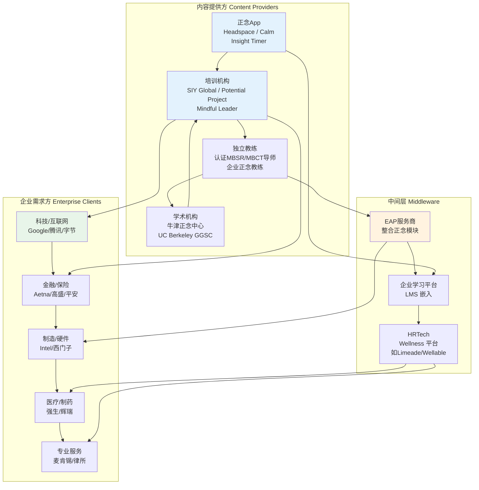
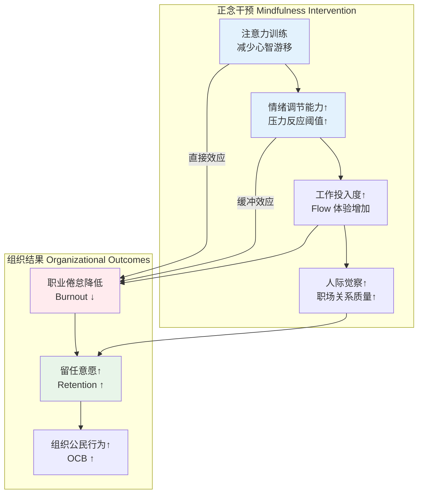
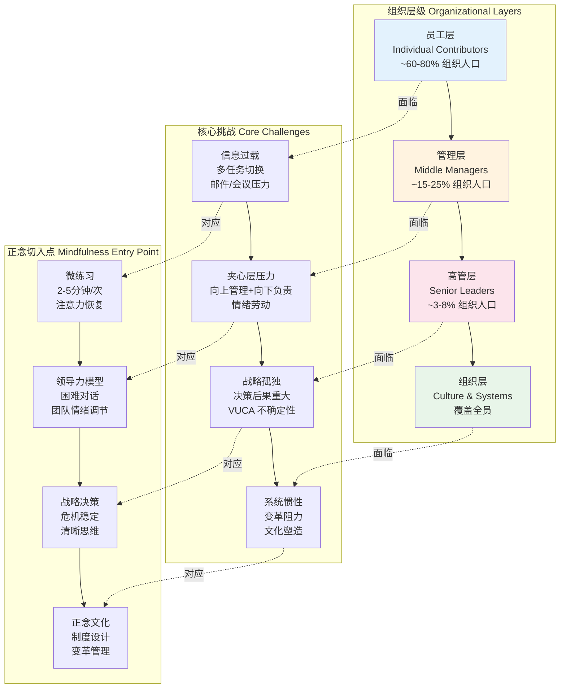
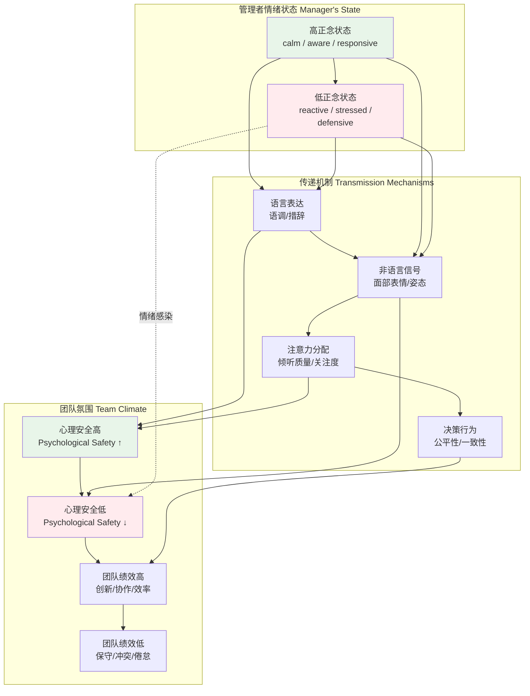
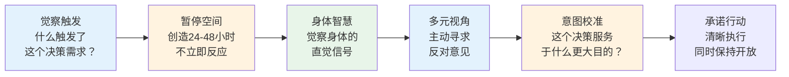

---

title: "职场冥想与企业正念：专业概述"
description: "职场冥想与企业正念：专业概述的详细解析与实践指南"
category: "心智与心理学 > 冥想 > Meditation Workplace"
tags: ["anxiety", "brain", "mbsr", "mindfulness", "mbct"]
last_updated: "2026-05"
difficulty: "expert"
reading_level: "expert"
estimated_read_time: "30min"
intent_queries:
  - "什么是职场冥想与企业正念：专业概述"
  - "职场冥想与企业正念：专业概述的核心概念"
  - "职场冥想与企业正念：专业概述的方法与实践"
trigger_keywords: ["act", "anxiety", "art", "assessment"]
cross_refs:
  - path: "01-Wisdom-Traditions/religions/buddhism/meditation/Buddhism_Meditation_Practice_System.md"
    relation: "anxiety/buddhism/exercise"
  - path: "01-Wisdom-Traditions/religions/buddhism/modern-applications/Digital_Mindfulness_AI_Mental_Health.md"
    relation: "anxiety/buddhism/exercise"
  - path: "01-Wisdom-Traditions/religions/tibetan-buddhism/Tibetan_Singing_Bowl.md"
    relation: "anxiety/buddhism/exercise"
  - path: "01-Wisdom-Traditions/religions/wisdom-traditions/Wisdom_Buddhism_Healing_Psychology.md"
    relation: "anxiety/buddhism/exercise"
  - path: "01-Wisdom-Traditions/religions/wisdom-traditions/Wisdom_Mahamudra_Great_Seal.md"
    relation: "anxiety/buddhism/exercise"

---
# 职场冥想与企业正念：专业概述

> **适用对象**：企业HR/OD负责人、高管教练、EAP从业者、正念培训师、组织发展顾问、对职场身心整合感兴趣的领导者  
> **阅读时长**：约 50–70 分钟（可分段阅读）  
> **实践建议**：建议结合企业实际场景，分 4–6 次阅读，每次聚焦一个层级或行业  
> **最后更新**：2026-05

---

## 一、核心认知：全球企业正念运动的演进

### 1.1 从东方修行到西方企业：正念商业化的三次浪潮

职场正念（Workplace Mindfulness）并非简单的"在公司里冥想"，而是一套经过科学验证、系统设计的组织干预体系。其商业化进程大致经历了三个阶段：

```mermaid
graph LR
    subgraph 第一波 1970s-1990s<br/>临床与学术奠基
        W1A[Jon Kabat-Zinn<br/>MBSR 1979] --> W1B[医院慢性病管理<br/>临床减压]
        W1B --> W1C[Richard Davidson<br/>威斯康星大学<br/>fMRI 正念研究]
    end

    subgraph 第二波 2000s-2015<br/>科技巨头先锋
        W2A[Google<br/>Chade-Meng Tan<br/>SIY 2007] --> W2B[Intel<br/>Awake@Intel 2012]
        W2B --> W2C[General Mills<br/>正念领导力 2007]
        W2C --> W2D[Aetna<br/>医保成本节约<br/>2010-2014]
    end

    subgraph 第三波 2015-至今<br/>规模化与本土化
        W3A[Headspace/Calm<br/>企业版订阅<br/>B2B SaaS] --> W3B[SAP/LinkedIn<br/>全球正念项目]
        W3B --> W3C[中国科技巨头<br/>阿里/腾讯/字节<br/>内部项目]
        W3C --> W3D[金融/医疗/制造<br/>行业深度适配]
    end

    W1C -.->|科学证据积累| W2A
    W2D -.->|ROI数据驱动| W3A
    W2B -.->|方法论输出| W3B

    style W2A fill:#e8f5e9
    style W2D fill:#e8f5e9
    style W3C fill:#e3f2fd
```

**关键转折点**：

| 时间节点 | 里程碑事件 | 标志性意义 |
|---------|-----------|-----------|
| **1979** | Jon Kabat-Zinn 在马萨诸塞大学医学中心创立 MBSR（正念减压课程） | 正念从佛教修行剥离，进入现代医学体系 |
| **2003** | Richard Davidson 在威斯康星大学发表首批正念 fMRI 研究 | 为职场正念提供神经科学背书 |
| **2007** | Google 工程师 Chade-Meng Tan 创立 "Search Inside Yourself"（SIY） | 科技行业首次将正念系统化为领导力发展项目 |
| **2010** | Aetna CEO Mark Bertolini 因滑雪事故引入正念，后推广至全公司 | 传统行业的破冰案例，ROI 数据首次被公开报道 |
| **2012** | Intel 启动 "Awake@Intel" 项目 | 制造业/硬件公司的标杆，证明正念不限于"创意型"企业 |
| **2015** | Headspace for Work / Calm Business 上线 | 正念 SaaS 化，降低企业引入门槛 |
| **2018** | 中国阿里"静心堂"、腾讯"正念工坊"陆续公开 | 中国企业正念运动进入公众视野 |

### 1.2 全球标杆企业案例深度解析

#### Google：Search Inside Yourself（SIY）

SIY 是全球最具影响力的企业正念项目之一，由 Google 早期工程师 Chade-Meng Tan（陈一鸣）创立，后发展为独立机构 SIY Global。

| 维度 | 详情 |
|------|------|
| **创立时间** | 2007年（Google 内部），2012年（对外独立运营） |
| **核心课程** | 2天沉浸式培训 + 28天线上跟进练习 |
| **理论框架** | 情商（EQ）× 正念（Mindfulness）× 神经科学 |
| **内容模块** | 1. 正念基础（注意力训练）→ 2. 自我觉察（情绪识别）→ 3. 自我管理（情绪调节）→ 4. 动机与意义 → 5. 同理心 → 6. 领导力与社交技巧 |
| **参与规模** | 全球超过50,000名高管与员工完成培训 |
| **独特价值** | 将正念包装为"情商领导力"，避开宗教色彩，降低推行阻力 |

**SIY 领导力模型核心**：注意力（Attention）→ 自我觉察（Self-Knowledge）→ 自我掌控（Self-Mastery）→ 创造有用产品（Create Useful Products）

#### Intel：Awake@Intel

Intel 的项目证明正念可以渗透进高度工程化、流程驱动的制造业文化。

| 维度 | 详情 |
|------|------|
| **创立时间** | 2012年，由员工自发倡议，后获HR正式支持 |
| **核心形式** | "静默起点"（Quiet Start）—— 每次会议前2分钟静默 |
| **扩展内容** | 9周正念课程、每周"正念午餐"、线上资源库 |
| **参与数据** | 试点阶段：300人；两年后：约10,000人参与 |
| **内部调研结果** | 报告压力降低的员工：试点前 46% → 试点后 13%；报告活力提升的员工：试点前 62% → 试点后 81% |
| **关键洞察** | 从"会议前2分钟"这种微小干预切入，比"上冥想课"更容易被工程师文化接受 |

#### Aetna：医保成本导向的正念投资

Aetna（美国大型健康保险公司）的案例是职场正念 ROI 的经典商业论证。

| 维度 | 详情 |
|------|------|
| **推动力** | CEO Mark Bertolini 2004年滑雪事故后个人实践正念与瑜伽，2010年推动入公司 |
| **项目设计** |  mindfulness + yoga 结合，每周3小时，持续12周 |
| **参与规模** | 约13,000名员工参与（占当时员工总数约25%） |
| **医疗成本数据** | 参与员工的人均医疗成本降低 **$2,000/年**；公司整体医疗支出估算减少 **$9M/年** |
| **生产力数据** | 参与员工每人每年增加 productive hours：约 **$3,000 价值** |
| **投资回报率** | 每投入 $1，回报约 **$3–$11**（不同统计口径） |
| **战略意义** | 作为健康保险公司，Aetna 的正念项目本身就是"产品可信度广告" |

#### SAP：Mindful Leadership 全球推广

| 维度 | 详情 |
|------|------|
| **创立时间** | 2013年，由联合创始人 Hasso Plattner 支持 |
| **核心课程** | "Mindful Leadership" — 2天线下 + 6周线上跟进 |
| **全球覆盖** | 德国总部 → 美国、中国、巴西、印度等全球办公室 |
| **参与规模** | 超过15,000名领导者完成培训 |
| **内部数据** | 参与者的"领导力影响力"自评提升 30%；"团队信任度"提升 25%（SAP 内部年度调研） |
| **制度化程度** | 将正念纳入领导力发展必修模块，与晋升体系挂钩 |

### 1.3 中国企业正念运动：从福利到战略工具

中国企业的正念实践起步较晚（约2015年后），但发展速度快，且呈现出与西方不同的组织逻辑。

| 企业 | 项目名称/形式 | 启动时间 | 核心特点 | 公开信息 |
|------|------------|---------|---------|---------|
| **阿里巴巴** | "静心堂"（内部冥想空间）+ 正念培训 | 约2016年 | 与太极、禅修等传统文化结合；内部设有专门冥想室 | 内部员工分享、媒体采访 |
| **腾讯** | "正念工坊" + EAP 整合 | 约2017年 | 通过内部EAP平台提供正念课程；高压岗位（如游戏工作室）优先试点 | 腾讯健康公众号报道 |
| **字节跳动** | 内部冥想室 + Headspace 企业版 | 约2018年 | 全球化公司，海外办公室引入 Headspace；国内结合内部App | 脉脉/职场社区分享 |
| **华为** | 内部压力管理课程含正念模块 | 约2015年 | 嵌入员工帮助计划（EAP），不与宗教关联；强调"心理韧性" |
| **平安集团** | "平安心语" EAP 正念模块 | 约2019年 | 金融高压行业，结合保险业务员的心理健康支持 |
| **蔚来汽车** | 创始人李斌个人推动，管理层冥想 | 约2020年 | 造车新势力代表，与"用户企业"文化定位结合 |

**中西方企业正念的关键差异**：

| 维度 | 西方企业（硅谷/欧洲） | 中国企业 |
|------|---------------------|---------|
| **推动力** | 员工自发倡议 + CEO 个人信仰 | 自上而下 HR/EAP 推动为主 |
| **文化包装** | "情商领导力""神经科学""绩效提升" | "心理健康""压力管理""员工关怀" |
| **与晋升关系** | 少数公司纳入领导力必修（如SAP） | 极少与晋升/绩效直接挂钩 |
| **宗教敏感性** | 极强调去宗教化 | 对传统文化（禅修/太极）容忍度更高 |
| **预算来源** | L&D（学习与发展）或 Wellness 预算 | 多从 EAP/工会福利预算支出 |
| **评估重点** | ROI、生产力、医疗成本 | 员工满意度、流失率、心理健康指标 |

### 1.4 企业正念生态图谱



---

## 二、商业价值：职场正念的ROI分析

### 2.1 医疗成本与缺勤率：最直接的可量化收益

职场正念的 ROI 计算通常从医疗成本和缺勤率两个硬指标入手，因为这是最容易与财务模型挂钩的数据。

| 研究/案例来源 | 样本量 | 干预形式 | 医疗成本变化 | 缺勤率变化 |
|-------------|--------|---------|------------|-----------|
| **Aetna 内部数据** | ~13,000人 | 12周正念+瑜伽 | 人均降低 $2,000/年 | 未单独公布 |
| **Kaiser Permanente 研究** | 309人 | 8周 MBSR | 医疗费用降低 43%（追踪1年） | 病假天数减少 76% |
| **Duke Integrative Medicine** | 企业保险客户 | 正念减压项目 | 索赔成本降低 31% | — |
| **Mindful Nation UK 报告** | 多项研究元分析 | 各类职场正念 | 医疗成本平均降低 15–30% | 缺勤率平均降低 20–35% |
| **WHO 工作压力报告引用** | 全球数据 | 综合压力管理 | — | 压力相关缺勤占全部缺勤的 50%以上 |

**ROI 计算模型示例（以500人企业为例）**：

| 成本/收益项目 | 金额（年） | 计算依据 |
|-------------|-----------|---------|
| **投入成本** | | |
| 8周正念课程（外聘讲师） | $30,000–$50,000 | 每人 $60–$100/小时 × 20小时 × 25人/批 × 4批 |
| 冥想App企业版订阅 | $6,000–$12,000 | Headspace for Work: $12/人/年 × 500人 |
| 内部正念大使培训 | $5,000–$10,000 | 10名大使，每人 $500–$1,000 |
| **总投入** | **$41,000–$72,000** | |
| **预期收益** | | |
| 医疗成本降低（人均 $500，保守估计） | $250,000 | 500人 × $500 |
| 缺勤率降低1天/人（按日均成本 $200） | $100,000 | 500人 × 1天 × $200 |
| 员工流失率降低2%（替换成本 $30,000/人） | $300,000 | 10人 × $30,000 |
| **总收益（保守）** | **$650,000** | |
| **ROI** | **约 9:1 – 16:1** | 收益/投入 |

> **注意**：上述 ROI 计算基于行业平均数据和保守假设。实际收益高度依赖实施质量、员工参与度和组织文化。后文"实施挑战"章节将详细讨论为何许多项目无法达到预期 ROI。

### 2.2 员工留任率与敬业度：组织健康的核心指标

正念对员工留任率（Retention）和敬业度（Engagement）的影响，虽然不如医疗成本那样直接量化，但对组织的长期健康更为关键。

| 研究来源 | 核心发现 |
|---------|---------|
| **Gallup 全球敬业度调查关联分析** | 高敬业度团队流失率低 59%；正念训练被识别为提升敬业度的有效干预之一 |
| **SAP Mindful Leadership 内部调研** | 完成正念培训的领导者，其团队成员的"留任意愿"评分提升 18% |
| **Adobe 内部项目** | 参与正念项目的员工，12个月内的主动离职率降低 28% |
| **Journal of Management 元分析（2018）** | 职场正念干预对员工心理资本（PsyCap）的提升效应量 d = 0.38（中等到大效应） |

**正念影响留任率的机制模型**：



### 2.3 创造力、决策质量与领导力效能

正念对"软技能"的提升，是知识密集型企业和管理层最为关注的收益领域。

| 能力维度 | 正念的作用机制 | 代表性研究 |
|---------|--------------|-----------|
| **创造力（Creativity）** | 减少认知固着（Cognitive Fixation），增加发散思维（Divergent Thinking）；默认模式网络（DMN）与执行控制网络（ECN）的动态切换更灵活 | Colzato et al. (2012): 开放监控冥想提升发散思维表现；Lebuda et al. (2016) 元分析: 正念与创造力正相关 r = 0.22 |
| **决策质量（Decision Quality）** | 减少确认偏误（Confirmation Bias）和沉没成本谬误；增加对情绪信号的觉察，避免"情绪劫持"（Amygdala Hijack） | Hafenbrack et al. (2014): 正念冥想减少沉没成本效应；Kiken & Shook (2011): 正念提升积极信息加工偏向 |
| **领导力效能（Leadership）** | 提升情绪智力（EQ）中的自我觉察与共情；改善困难对话中的表现；在 VUCA 环境中保持认知灵活性 | Reb et al. (2014): 正念领导者获得更高的下属满意度评分；Purser & Milillo (2015): 正念与变革型领导行为正相关 |
| **战略思维（Strategic Thinking）** | 减少反应性模式（Reactivity），增加回应性模式（Responsiveness）；在信息过载中保持优先级清晰 | 多位管理学者（如 Jerome Duchemin）的定性研究 |

**创造力与正念的 fMRI 研究摘要**：

| 研究者 | 方法 | 核心发现 |
|-------|------|---------|
| **Colzato et al. (2012)** | 行为实验 + 冥想干预 | 开放监控（Open Monitoring）冥想后，被试在替代用途测试（AUT）中产生的创意数量增加 |
| **Lebuda et al. (2016) 元分析** | 20项研究元分析 | 正念与创造力的整体效应量为小到中等；"观察"（Observing）维度与创造力关系最强 |
| **Berkovich-Ohana et al. (2013)** | fMRI | 长期冥想者的默认模式网络（DMN）活动模式与自我参照加工去耦合，可能与创造性洞察有关 |
| **Ding et al. (2015)** | fMRI | 正念训练后，背外侧前额叶（dlPFC）与 DMN 的功能连接增强，可能反映认知控制的灵活性提升 |

---

## 三、不同层级的正念应用

职场正念不是"一刀切"的干预。不同组织层级的角色压力、时间资源、学习目标和应用场景存在显著差异，需要分层设计。



### 3.1 员工层：压力管理与注意力恢复

员工层是组织中最广泛的群体，其正念应用的核心目标是**可操作性强、时间成本低、即时有效**。

#### 压力管理（Stress Management）

| 具体场景 | 正念技术 | 时长 | 实施方式 |
|---------|---------|------|---------|
| **工作 overwhelm 时** | STOP 技术（Stop-Take a breath-Observe-Proceed） | 30–60 秒 | 个人随时可用，无需工具 |
| ** deadline 前焦虑** | 延长呼气呼吸法（吸气4秒-呼气6-8秒） | 2–3 分钟 | 工位可完成，闭眼或目视前方 |
| **午后能量低谷** | 身体扫描（Body Scan）简化版 | 5–10 分钟 | 可配合安静角落或耳机引导音频 |
| **通勤路上** | 行走正念 / 公交地铁中的开放觉察 | 10–30 分钟 | 将日常通勤转化为练习时间 |

#### 会议前正念（Pre-Meeting Mindfulness）

会议是企业时间的最大消耗者之一。会议前的短暂正念练习，可以显著提升会议质量。

**"3分钟会议准备"标准流程**：

```mermaid
graph LR
    A[到达会议室/打开视频会议<br/>提前2-3分钟] --> B[三次深呼吸<br/>鼻吸口呼]
    B --> C[扫描身体<br/>觉察紧张部位<br/>肩膀/下颌/腹部]
    C --> D[设定意图<br/>"我希望这场会议<br/>达成什么？"]
    D --> E[放下此前事务<br/>清空心智白板]
    E --> F[开始会议]

    style A fill:#e3f2fd
    style D fill:#fff3e0
    style F fill:#e8f5e9
```

| 步骤 | 操作细节 | 目的 |
|------|---------|------|
| **三次深呼吸** | 吸气4秒 → 屏息1秒 → 呼气6秒 | 激活副交感神经，降低生理唤醒水平 |
| **身体扫描** | 从头顶到脚底，快速扫描身体紧张 | 将注意力从思维拉回到身体当下 |
| **设定意图** | 在心中默念会议目标和个人角色 | 从"自动反应"切换到"有意识回应" |
| **清空白板** | 将上一个任务的残余思绪"放在门外" | 减少认知残留（Attention Residue）|

> **研究支持**：Sophie Leroy 的"注意力残留"（Attention Residue）研究表明，当员工从一个任务切换到另一个任务时，前一任务的思绪会持续占用认知资源。正念练习被证明是减少注意力残留的有效手段。

#### 邮件正念（Email Mindfulness）

电子邮件是知识工作者最主要的压力源之一。"邮件正念"不是"慢慢写邮件"，而是在邮件互动中保持觉察。

| 场景 | 正念策略 | 具体操作 |
|------|---------|---------|
| **收到激怒邮件** | "24小时规则"的变体 | 不立即回复；进行3次深呼吸；觉察自己的身体反应（心跳、肌肉紧张）；写下回应（不发送），过1小时再审视 |
| **写重要邮件** | 意图觉察 | 在点击"发送"前，暂停5秒，问自己："这条信息的目的是什么？接收者会如何感受？" |
| **批量处理邮件** | 单任务模式 | 关闭邮件通知；设定固定时段处理邮件；处理时不切换其他窗口 |
| **邮件 overload** | 接纳与边界 | 承认"我无法回复所有邮件"；设定合理的回复预期；使用自动回复管理期望 |

#### 通勤冥想（Commute Meditation）

对于拥有较长通勤时间的员工，通勤时段是正念练习的"隐藏宝藏"。

| 通勤方式 | 正念练习形式 |
|---------|------------|
| **地铁/公交（有座）** | 坐姿正念：觉察身体与座位的接触、车辆的运动、声音的来去 |
| **地铁/公交（站立）** | 站立正念：觉察双脚与地面的接触、重心的微调、扶手的触感 |
| **自驾车** | "驾驶冥想"：将注意力锚定在方向盘触感、视野边缘、呼吸节奏；遇到红灯时进行3次深呼吸 |
| **步行/骑行** | 行走正念：觉察脚底与地面接触的每一个瞬间、腿部肌肉的收缩与放松 |

### 3.2 管理层：正念领导力与团队情绪调节

管理层（Middle Managers）是组织中最容易职业倦怠的群体——既要承受来自高层的业绩压力，又要处理来自下属的情绪和需求。正念在这一层级的应用，核心是从"个人减压"升级为"领导力行为改变"。

#### Marc Lesser 的 SIY 领导力模型

Marc Lesser 是 SIY Global 的联合创始人之一，他在《Seven Practices of a Mindful Leader》中提出了正念领导力的七个实践：

| 实践 | 核心内容 | 管理场景应用 |
|------|---------|------------|
| **1. 爱自己（Love the Work）** | 对工作的热情与初心保持觉察 | 在KPI压力下，定期回顾"我为什么选择这个岗位" |
| **2. 做重要贡献（Do the Work）** | 区分忙碌与有效，聚焦高杠杆活动 | 每周进行"时间审计"，消除低价值会议 |
| **3. 不要成为专家（Don't Be an Expert）** | 保持初学者心态，倾听不同声音 | 团队决策时，先让 junior 成员发言 |
| **4. 连接到你的痛苦（Connect to Your Pain）** | 不逃避困难情绪，从中学习 | 项目失败后，带领团队进行"无指责复盘" |
| **5. 连接到你对他人的痛苦（Connect to Others' Pain）** | 培养共情，识别团队中的隐性压力 | 一对一会议中，不只谈工作，也关心员工状态 |
| **6. 依靠他人（Depend on Others）** | 放弃"独自扛"的英雄主义 | 主动 delegation，信任团队成员 |
| **7. 不断学习（Keep Making It Simpler）** | 持续简化流程和沟通 | 定期检查团队流程中的冗余环节 |

#### 困难对话中的正念（Difficult Conversations）

管理者每年约有 15–20% 的工作时间用于"困难对话"（绩效反馈、冲突调解、裁员沟通等）。正念可以显著改善这些对话的质量。

**"正念困难对话"四步法**：

| 阶段 | 管理者内部操作 | 外部行为表现 |
|------|--------------|------------|
| **准备阶段（对话前）** | 身体扫描：觉察自己的紧张/防御/愤怒；识别"故事"（我对这个人的预设判断） | 提前5分钟到达，进行呼吸锚定 |
| **开场阶段** | 双脚扎根感受：保持与地面的连接，防止"飘走"；设定意图："我是来帮助对方成长的" | 语速放慢，眼神接触，开放姿态 |
| **进行阶段** | 觉察情绪波动：当感到被激怒时，暂停2秒再回应；区分"事实"与"解读" | 使用"我观察到..."而非"你总是..."；允许沉默 |
| **收尾阶段** | 检查身体：确保自己没有带着残余紧张离开；总结共识，明确下一步 | 确认对方理解；表达支持意愿 |

#### 情绪调节与团队管理

管理者的情绪状态会通过"情绪感染"（Emotional Contagion）机制迅速扩散到整个团队。



**管理者正念团队干预工具箱**：

| 工具 | 适用场景 | 操作方法 |
|------|---------|---------|
| **"开场静默"** | 团队会议开始时 | 集体静默1分钟，帮助成员从上一个任务切换过来 |
| **"情绪天气报告"** | 每周团队例会 | 每人用一句话描述当前情绪状态（如"我今天像多云"），不解释不讨论 |
| **"正念倾听轮"** | 需要深度倾听的议题 | 发言者3分钟不受打断；听者只反馈"我听到了..."，不加评判和建议 |
| **"压力信号识别"** | 团队高压期（如项目交付前） | 管理者公开分享自己的压力信号（如"我开始频繁清嗓子时，说明我焦虑了"），邀请团队成员也分享 |

### 3.3 高管层：战略决策中的正念

高管层的正念应用，已从"压力管理"跃迁到"认知质量"和"存在方式"的层面。这一层级的练习通常更私密、更个人化，但其对组织的杠杆效应最大。

#### 战略决策中的正念

| 战略决策挑战 | 正念的应对机制 | 具体练习 |
|-------------|--------------|---------|
| **信息过载** | 提升"信号/噪声"识别能力 | 每日"信息断食"——设定1小时不查看任何电子设备，让大脑整合信息 |
| **认知偏误** | 增强对自动化思维模式的觉察 | 重大决策前，写下"我可能存在的偏误"清单（如"我是否过度依赖最近的信息？"） |
| **时间压力** | 在紧迫感中保持生理稳定 | 决策会议前的"权力姿势+呼吸"组合（2分钟） |
| **利益冲突** | 澄清内在价值观优先级 | 定期"价值观检视"冥想：在安静中回顾"对我而言，什么最重要？" |

**"正念战略决策"五步框架**：



#### VUCA 时代的清晰思维

VUCA（Volatility 易变性, Uncertainty 不确定性, Complexity 复杂性, Ambiguity 模糊性）是当代高管面临的核心环境特征。正念不是消除 VUCA，而是改变高管**与 VUCA 的关系**。

| VUCA 维度 | 典型高管反应（自动化） | 正念回应方式 |
|----------|---------------------|------------|
| **易变性（Volatility）** | 焦虑、过度监控、频繁改变方向 | 稳定内在节奏，区分"需要响应的变化"和"噪音" |
| **不确定性（Uncertainty）** | 假装知道、过度分析、决策瘫痪 | 接纳"我不知道"，在不确定性中保持行动 |
| **复杂性（Complexity）** | 简化过度（黑白思维）、或分析瘫痪 | 培养"系统觉察"，看到关联而非孤立因素 |
| **模糊性（Ambiguity）** | 急于定义、强加框架、排斥模糊 | 容忍"悬而未决"，让清晰度自然浮现 |

#### 危机管理中的身心稳定

危机时刻，高管的生理状态会直接影响整个组织的士气。正念训练的核心价值之一，就是在极端压力下保持"身心稳定"（Somatic Stability）。

| 危机阶段 | 高管正念应用 | 组织层面效果 |
|---------|------------|------------|
| **危机爆发初期** | "双脚扎根"技术：在混乱中，刻意感受双脚与地面的接触，防止"飘走"或"冻结" | 向组织传递"领导者还在这里"的稳定信号 |
| **危机持续期** | 每日保留20分钟"不可侵犯"的正念练习时间；使用"盒式呼吸"（4-4-4-4）在会议间隙恢复 | 防止决策质量随疲劳而递减 |
| **危机后恢复期** | 带领核心团队进行"集体哀悼/复盘"冥想：承认损失、表达情绪、从中学习 | 加速组织从"创伤反应"到"学习成长"的过渡 |

### 3.4 组织层：正念组织文化

当正念从个人练习扩展到组织层面，它就成为一种"文化操作系统"——影响组织的价值观、制度、仪式和空间设计。

#### 正念组织文化的四个支柱

| 支柱 | 内涵 | 具体表现 |
|------|------|---------|
| **注意力文化（Attention Culture）** | 将"深度工作"和"单任务"视为组织美德 | 取消不必要的会议；推行"无会议周三"；尊重"专注时间块" |
| **觉察文化（Awareness Culture）** | 鼓励对情绪、身体信号和人际动态的觉察 | 将"情绪智力"纳入晋升标准；提供正念培训预算 |
| **回应文化（Responsiveness Culture）** | 从"反应性"转向"回应性" | 推行"24小时邮件回复"而非"立即回复"规范；在冲突调解中使用正念倾听 |
| **关怀文化（Care Culture）** | 将员工福祉视为战略优先，而非福利附加 | 高管公开谈论心理健康；将正念空间纳入办公室设计标准 |

#### 变革管理中的正念

组织变革（如并购、数字化转型、裁员重组）是压力最集中的时期。正念可以作为变革管理的"润滑剂"。

```mermaid
graph TD
    subgraph 变革曲线 Change Curve<br/>Kubler-Ross 适配版
        K1[震惊/否认<br/>Shock/Denial] --> K2[愤怒/恐惧<br/>Anger/Fear]
        K2 --> K3[协商/讨价还价<br/>Bargaining]
        K3 --> K4[低落/学习<br/>Depression/Learning]
        K4 --> K5[接纳/整合<br/>Acceptance/Integration]
    end

    subgraph 正念干预 Mindfulness Interventions
        M1[信息透明<br/>呼吸空间] --> M2[情绪命名<br/>允许表达]
        M2 --> M3[参与协商<br/>倾听技巧]
        M3 --> M4[支持资源<br/>身体觉察]
        M4 --> M5[庆祝小胜<br/>意义建构]
    end

    K1 -.->|对应| M1
    K2 -.->|对应| M2
    K3 -.->|对应| M3
    K4 -.->|对应| M4
    K5 -.->|对应| M5

    style K2 fill:#ffebee
    style K4 fill:#fff3e0
    style K5 fill:#e8f5e9
```

| 变革阶段 | 员工典型状态 | 正念干预策略 |
|---------|------------|------------|
| **宣布期** | 震惊、否认、谣言蔓延 | 高管进行"正念沟通"：坦诚、不防御、允许沉默；提供呼吸/减压工具包 |
| **过渡期** | 焦虑、愤怒、生产力下降 | 增设临时正念支持（如每周团体冥想、热线辅导）；管理者接受"困难对话"培训 |
| **稳定期** | 疲惫、怀疑新制度 | "感恩与庆祝"练习：每周团队分享一个小胜利；正念复盘"我们学到了什么" |
| **整合期** | 逐渐接纳、新身份形成 | 将变革经验纳入组织故事；正念成为"我们如何度过困难"的集体记忆 |

#### 远程/混合办公中的团队连接

远程办公的普及，使团队失去了许多非正式连接的机会（走廊偶遇、午餐闲聊、共同空间的身体共在）。正念可以帮助重建这种"虚拟共在"。

| 挑战 | 正念解决方案 |
|------|------------|
| **"Zoom 疲劳"** | 会议前30秒集体静默；每50分钟会议设置5分钟"屏幕休息"；鼓励"音频模式"（关闭摄像头）进行部分会议 |
| **边界模糊** | "正念上下班仪式"：如在家设置物理"通勤路径"（绕小区走一圈），或用特定音乐标记工作开始/结束 |
| **孤独感** | "正念伙伴"制度：两名员工每周15分钟视频正念共修，不谈工作，只共享静默 |
| **信任下降** | 视频会议中引入"正念倾听"：轮流发言，其他人关闭麦克风，用表情和点头回应 |

---

## 四、具体项目模式：设计与选择

企业正念项目有多种实施模式，各有其适用场景、投入成本和预期效果。

### 4.1 项目模式对比总表

| 模式 | 形式 | 周期 | 人均成本 | 参与率 | 效果深度 | 最佳适用 |
|------|------|------|---------|--------|---------|---------|
| **8周团体课程（MBSR/MBCT改编）** | 线下/线上团体，每周2-3小时 | 8周+ | $300–$800 | 10–30% | ★★★★★ | 试点阶段、高压力部门、领导力发展 |
| **冥想App企业版订阅** | Headspace/Calm/Insight Timer for Work | 年度订阅 | $12–$50/年 | 30–60% | ★★☆☆☆ | 全员推广、预算有限、远程团队 |
| **"正念时刻"（会议前2分钟）** | 会议主持人引导集体静默 | 持续 | 几乎为零 | 100%（被动） | ★★☆☆☆ | 会议文化改善、零成本启动 |
| **正念领导力教练** | 一对一高管教练，整合正念 | 6–12个月 | $5,000–$20,000 | 1–5% | ★★★★★ | C-suite、高潜领导者 |
| **EAP 整合** | 将正念纳入员工帮助计划 | 持续 | $20–$50/人/年 | 5–15% | ★★★☆☆ | 已有EAP体系、匿名需求高 |
| **内部正念大使网络** | 培训员工成为内部引导者 | 年度循环 | $100–$300/大使 | 20–40% | ★★★☆☆ | 规模化推广、文化内化 |
| **正念空间 + 自助练习** | 办公室设立冥想室/舱 | 持续 | $5,000–$50,000一次性 | 10–20% | ★★☆☆☆ | 办公环境升级、物理空间充裕 |

### 4.2 八周团体课程：黄金标准

8周团体课程是职场正念中效果最深入、证据最充分的形式，改编自 Jon Kabat-Zinn 的 MBSR（正念减压课程）或 Segal 等人的 MBCT（正念认知疗法）。

**标准8周课程结构**：

| 周次 | 主题 | 核心练习 | 职场应用 |
|------|------|---------|---------|
| **第1周** | 自动导航与觉察 | 葡萄干练习；身体扫描 | 识别工作中的"自动模式" |
| **第2周** | 障碍与反应 | 身体扫描深化；记录愉悦事件 | 识别压力反应的早期信号 |
| **第3周** | 呼吸空间——将觉察带入活动 | 3分钟呼吸空间；正念行走 | 会议/邮件/冲突中的即时应用 |
| **第4周** | 压力反应与回应 | 探索困难；呼吸空间（困难版） | 从"反应"到"回应"的转化 |
| **第5周** | 回应与沟通 | 正念倾听练习；探索沟通模式 | 困难对话中的正念应用 |
| **第6周** | 思维模式 | 将想法视为想法；认知去中心化 | 减少灾难化思维和过度担忧 |
| **第7周** | 自我照护与生活方式 | 选择照顾自己的方式；制定练习计划 | 可持续的个人正念习惯 |
| **第8周** | 维持与扩展 | 回顾与庆祝；长期练习规划 | 将正念融入工作与生活 |

**企业改编要点**：
- **案例替换**：将 MBSR 原始案例（如慢性疼痛）替换为职场案例（如 deadline 压力、绩效反馈）
- **时间压缩**：部分企业提供"6周加速版"（每周1.5小时+每日15分钟练习）
- **线上适配**：疫情后，多数机构发展出同步线上团体课程，保留互动性

### 4.3 冥想App企业版：规模化入门

App 企业版是覆盖面最广、成本最低的模式，适合作为"全员基础层"。

| App | 企业版特色 | 内容库特点 | 适合企业类型 |
|-----|-----------|-----------|------------|
| **Headspace for Work** | 管理后台、使用数据报告、定制化内容 | 结构清晰、动画友好、新手友好 | 科技公司、年轻化团队 |
| **Calm Business** | 睡眠内容强、名人配音、企业仪表板 | 故事/音乐/大师课丰富 | 高压行业、睡眠问题普遍 |
| **Insight Timer for Work** | 免费基础版强大、社区驱动、多元内容 | 正念/瑜伽/灵性内容最全面 | 多元化团队、预算有限 |
| **国内：Now冥想/小睡眠/潮汐** | 中文内容、本土化场景 | 中文引导、午休/睡眠场景优化 | 中国企业、中文环境 |

**App 企业版的常见陷阱**：

| 陷阱 | 表现 | 解决方案 |
|------|------|---------|
| **"订阅即完成"** | 购买订阅后没有任何推广，使用率 < 5% | 指定"正念大使"推广；将App使用与团队挑战/积分结合 |
| **数据监控引发反感** | 员工感到"公司监视我的冥想" | 明确数据使用边界；仅看聚合数据，不看个人；自愿参与 |
| **内容不匹配** | App内容过于"灵性"或"医疗"，员工不适 | 选择企业定制版；筛选推荐播放列表 |
| **缺乏人际连接** | 纯App无法替代团体支持 | App作为"日常工具"，配合月度团体共修 |

### 4.4 "正念时刻"：零成本的会议文化干预

"正念时刻"是在会议开始前进行1–3分钟集体静默或呼吸练习。它是成本最低、最容易启动的正念干预。

**实施层级演进**：

```mermaid
graph LR
    A[Level 1<br/>个人自发<br/>主持人在会议前<br/>自己静默30秒] --> B[Level 2<br/>团队约定<br/>核心团队成员同意<br/>会议前1分钟静默]
    B --> C[Level 3<br/>部门规范<br/>部门会议默认<br/>开场2分钟呼吸]
    C --> D[Level 4<br/>组织文化<br/>全公司会议指南<br/>包含"正念开场"]

    style A fill:#e3f2fd
    style B fill:#e8f5e9
    style C fill:#fff3e0
    style D fill:#fce4ec
```

**引导脚本示例（会议前2分钟）**：

> "在我们开始之前，让我们一起花两分钟，帮助每个人从上一个会议或任务中切换过来。
> 
> 请大家找到一个舒适的坐姿，双脚平放在地面上。可以轻轻闭上眼睛，或者目光柔和地落在桌面上。
> 
> 现在，做三次深呼吸。吸气... 呼气... （停顿）
> 
> 不需要改变呼吸，只是觉察它。觉察空气进入鼻腔的感觉，胸腔或腹部的轻微起伏。
> 
> 如果你的脑海中还有很多思绪——待办事项、上一个会议的余音——这很正常。不需要推开它们，只是温柔地把注意力带回到呼吸上。
> 
> （静默30秒）
> 
> 现在，为这场会议设定一个意图：你希望这场会议达成什么？你希望自己以什么样的状态参与？
> 
> （静默15秒）
> 
> 好，让我们开始。"

### 4.5 正念领导力教练与EAP整合

**正念领导力教练**是最高端、最深度的形式，通常面向 C-suite 和高潜领导者。

| 维度 | 传统高管教练 | 正念领导力教练 |
|------|------------|--------------|
| **核心焦点** | 目标达成、绩效提升、职业发展 | 存在方式（Way of Being）、内在稳定、觉察力 |
| **方法论** | GROW模型、行为反馈、360评估 | 正念练习 + 反思对话 + 躯体觉察 |
| **时间框架** | 通常3–6个月 | 通常6–12个月（正念改变需要时间） |
| **练习要求** | 以对话和作业为主 | 要求每日正式正念练习（20–30分钟） |
| **评估方式** | KPI、晋升、360反馈 | 加上：HRV、压力激素水平、下属敬业度调研 |

**EAP 整合模式**：将正念作为 EAP（Employee Assistance Program，员工帮助计划）的一个模块，通常由第三方 EAP 供应商提供。

| 优势 | 劣势 |
|------|------|
| 匿名性高，员工不担心"被公司知道我去看心理" | EAP 使用率通常很低（平均3–8%） |
| 可以利用现有的 EAP 预算和供应商关系 | EAP 咨询师的正念专业度参差不齐 |
| 适合处理严重压力/焦虑/抑郁的员工 | 正念容易被定位为"治病"而非"发展" |
| 符合合规和隐私保护要求 | 难以与组织文化和领导力发展联动 |

---

## 五、行业适配：高压行业的特殊需求

不同行业的工作性质、压力源和组织文化差异巨大，正念项目需要针对性适配。

### 5.1 行业适配总览表

| 行业 | 核心压力源 | 职业倦怠高发岗位 | 正念适配重点 | 推荐项目模式 |
|------|-----------|----------------|------------|------------|
| **金融/交易** | 市场波动、巨额资金压力、长时间高度专注 | 交易员、基金经理、风控 | 注意力训练、决策冷静、快速恢复 | 一对一教练 + 微练习 |
| **医疗/护理** | 生死情境、情感耗竭、轮班制 | ICU医护、急诊、肿瘤科 | 共情疲劳预防、情感边界、自我关怀 | 8周课程 + 同伴支持小组 |
| **科技/互联网** | 信息过载、快速迭代、996文化 | 程序员、产品经理、运营 | 注意力管理、工作生活边界、创造性恢复 | App订阅 + "无会议日" |
| **创意/广告/设计** |  deadline 压力、创意枯竭、客户反馈 | 创意总监、文案、设计师 | Flow状态培育、接纳批评、内在动机 | 开放监控冥想 + 创意工作坊 |
| **客服/呼叫中心** | 情绪劳动、重复性、低自主权 | 一线客服、投诉处理专员 | 情绪调节、情绪脱离、恢复仪式 | 班次间隙微练习 + EAP |
| **法律/咨询** | 高强度脑力、客户期望、计费压力 | 初级律师、顾问、审计 | 完美主义缓解、身体觉察、长期可持续性 | 8周课程 + 领导力教练 |
| **教育** | 情绪耗竭、行政负担、学生需求 | 中小学教师、辅导员 | 课堂正念、情绪边界、职业意义感 | 教师培训 + 课堂工具 |
| **制造业/物流** | 物理疲劳、安全隐患、轮班 | 产线工人、仓储、司机 | 身体觉察、安全专注、轮班适应 | 班次前正念 + 安全整合 |

### 5.2 金融交易员：注意力训练与决策冷静

金融交易是正念应用最早、最深度的行业之一。交易员的核心能力是**在极端不确定性中保持冷静决策**。

| 交易场景 | 正念技术 | 目的 |
|---------|---------|------|
| **开盘前** | 10分钟坐姿正念 + 意图设定 | 清空昨日残余情绪，以"空白状态"进入市场 |
| **持仓期间** | "锚定呼吸"：在监控屏幕角落放一个呼吸提示（如每5分钟一次深呼吸） | 防止"盯盘焦虑"导致的过度交易 |
| **重大亏损后** | "RAIN"技术：Recognize（识别情绪）- Allow（允许存在）- Investigate（探究身体感受）- Non-identify（不认同） | 防止"复仇交易"（Revenge Trading）|
| **收盘后** | 5分钟"放下"练习：将当天的交易结果"放在"一个想象的盒子中 | 防止工作情绪侵入个人生活 |

**金融机构正念项目案例**：

| 机构 | 项目 | 特点 |
|------|------|------|
| **高盛（Goldman Sachs）** | 内部正念课程 + 呼吸生物反馈 | 与交易 floor 的物理环境结合，设置"正念角落" |
| **对冲基金（多家）** | 聘请正念教练一对一辅导顶级交易员 | 高度保密，与交易心理教练结合 |
| **桥水基金（Bridgewater）** | 达里奥个人推崇冥想，公司文化鼓励 | 与"极端透明"文化结合，冥想被视为"清晰思考的工具" |

### 5.3 医疗工作者：共情疲劳预防

医疗行业的正念应用有其特殊性——医护人员需要保持共情（Empathy）来提供优质护理，但过度共情会导致"共情疲劳"（Compassion Fatigue）和"继发性创伤应激"（Secondary Traumatic Stress）。

| 问题 | 正念干预 |
|------|---------|
| **共情疲劳** | "慈悲冥想"（Loving-Kindness / Metta）：将关怀意图先导向自己，再导向患者。研究表明，Metta 冥想可以增加正性情绪，而不增加情感耗竭 |
| **情感边界模糊** | "呼吸空间 + 意图"：每次进入病房前，设定"我给予关怀，但不承担对方的痛苦"的心理边界 |
| **轮班睡眠紊乱** | 身体扫描 + 睡眠卫生：夜班后使用引导式身体扫描帮助入睡 |
| **道德困境/悲伤** | "正念哀悼"：在患者死亡后，医护人员进行简短的集体静默，承认悲伤的存在 |

**医疗行业正念的著名项目**：

| 项目 | 机构 | 成果 |
|------|------|------|
| **Mindful MD** | 多家美国医院 | 医生参与后，沟通质量评分提升，职业倦怠降低 |
| **Schwartz Rounds** | 美国广泛采用 | 虽非纯正念项目，但包含正念倾听元素；医护人员讨论困难病例的情感层面 |
| **英国 NHS 正念项目** | 英国国家医疗服务体系 | 为医护人员提供免费MBSR课程，作为职业健康的一部分 |

### 5.4 创意行业：Flow 状态培育

创意工作（设计、广告、写作、艺术）的核心产出依赖于**Flow 状态**（心流）——全神贯注、物我两忘、产出高效的心理状态。正念与 Flow 之间存在复杂的双向关系。

| 维度 | 正念的作用 | 注意事项 |
|------|-----------|---------|
| **进入 Flow** | 正念帮助清理"心智噪音"，为 Flow 创造入口 | 正念本身不是 Flow，它更像是"Flow 的前奏" |
| **维持 Flow** | 正念提升对干扰的觉察速度，更快回到 Flow | 过度正念（过度自我监控）可能打断 Flow |
| **从 Flow 恢复** | Flow 后的"枯竭感"可以通过正念缓解 | 创意人员常在 Flow 后经历情绪低谷，正念帮助平稳过渡 |
| **接纳批评** | 正念帮助创意人员不将作品批评等同于自我否定 | "将想法视为想法"的技术，特别适用于创意评审 |

**"正念创意工作坊"设计示例**：

| 阶段 | 时长 | 内容 |
|------|------|------|
| **清空** | 10分钟 | 开放监控冥想，让脑海中已有的想法"流过" |
| **扎根** | 5分钟 | 身体扫描，特别觉察与创意工作相关的身体部位（手、眼睛） |
| **创意发散** | 20分钟 | 在轻度背景冥想音乐中进行自由创作（手写/草图） |
| **正念评审** | 15分钟 | 团队正念倾听：展示作品的人不说话，其他人只描述"我看到的"，不加评判 |
| **整合** | 10分钟 | 集体呼吸，将过程中的洞察整合 |

### 5.5 客服行业：情绪劳动管理

客服行业是"情绪劳动"（Emotional Labor）最集中的领域之一——员工需要持续展示积极情绪，无论内心真实感受如何。

| 挑战 | 正念策略 |
|------|---------|
| **表面表演耗竭（Surface Acting）** | "情绪觉察"：在每次通话前，花10秒觉察自己当前的真实情绪，承认它（"我现在感到烦躁"），然后有意识选择"我要以什么状态服务这个客户" |
| **客户愤怒投射** | "这不是关于我"：正念帮助员工觉察身体对愤怒的反应（心跳加速、肌肉紧张），但不被愤怒"吞没"；将客户的愤怒视为"客户的痛苦"而非"对我的攻击" |
| **班次间恢复不足** | "班次间隙微恢复"：两次通话之间的30秒，进行1轮深呼吸 + 肩膀放松；午休时进行5分钟身体扫描 |
| **长期情感麻木** | "感恩练习"：每天下班前，回忆今天一个"我帮助了某人"的具体瞬间；防止"所有客户都一样"的麻木感 |

---

## 六、科学证据：职场正念的研究基础

职场正念的快速发展，离不开过去20年积累的科学研究证据。以下从元分析、生理指标、神经影像和行为评估四个维度进行综述。

### 6.1 职场正念的元分析证据

元分析（Meta-analysis）是评估干预效果的最强证据等级。

| 元分析研究 | 纳入研究数 | 样本总量 | 核心发现 | 效应量 |
|-----------|-----------|---------|---------|--------|
| **Virgili (2015)** | 23项RCT | 约1,500人 | 正念减压（MBSR）对工作压力的效果 | d = 0.53（中等） |
| **Bartlett et al. (2019)** | 23项研究 | 约1,300人 | 职场正念对心理健康（焦虑、抑郁、困扰）的效果 | d = 0.63（中到大） |
| **Lomas et al. (2017)** | 61项研究 | 多样本 | 正念对福祉（well-being）的整体效果 | d = 0.37（小到中等） |
| **Jamieson & Tuckey (2017)** | 29项研究 | 多样本 | 正念对职业倦怠（Burnout）的效果 | d = 0.42（中等）；对情绪耗竭子维度效果最强 |
| **Regehr et al. (2014）— 医疗行业** | 12项研究 | 医护人员 | 正念对医护人员压力和创伤症状的效果 | d = 0.58（中等） |

**效应量解读**：

| 效应量 d | 含义 | 职场意义 |
|---------|------|---------|
| **0.2** | 小效应 | 群体层面有意义，个人可能难以察觉 |
| **0.5** | 中等效应 | 多数人能感受到明显改善 |
| **0.8** | 大效应 | 显著改变，肉眼可见的差异 |
| **>1.0** | 非常大 | 罕见，通常见于高强度、针对性干预 |

> **关键结论**：职场正念的元分析效应量通常在 **d = 0.4–0.6** 之间，属于中等效应。这意味着正念是有效的，但不是"万能药"。效果的强弱高度依赖于实施质量、参与者投入度和组织支持。

### 6.2 HRV（心率变异性）与职业倦怠

HRV（Heart Rate Variability，心率变异性）是评估自主神经系统功能的核心生理指标，也是职场正念研究中最常用的生物标志物。

| HRV 指标 | 定义 | 与职业倦怠的关系 | 正念训练后的变化 |
|---------|------|----------------|----------------|
| **RMSSD** | 相邻RR间期差值的均方根 | 职业倦怠者 RMSSD 显著降低 | 8周 MBSR 后 RMSSD 平均提升 15–30% |
| **HF（高频功率）** | 0.15–0.4 Hz 频段功率，反映副交感神经活动 | 情绪耗竭与 HF 呈负相关 | 正念呼吸训练可即时提升 HF |
| **LF/HF 比值** | 低频/高频比值，反映交感-副交感平衡 | 职业倦怠者 LF/HF 升高（交感过度激活） | 正念训练后 LF/HF 趋于正常化 |
| **SDNN** | 全部RR间期的标准差 | 长期压力导致 SDNN 降低 | 长期正念练习者 SDNN 高于对照组 |

**HRV 在职场正念中的应用模式**：

```mermaid
graph TD
    subgraph 评估层 Assessment
        A1[基线测量<br/>5分钟静息HRV] --> A2[干预后测量<br/>8周后复测]
        A2 --> A3[追踪测量<br/>3-6个月后]
    end

    subgraph 反馈层 Feedback
        F1[个人HRV报告<br/>"你的压力恢复力"] --> F2[团队聚合报告<br/>匿名化趋势]
        F2 --> F3[干预调整<br/>高风险个体关注]
    end

    subgraph 技术层 Technology
        T1[消费级设备<br/>Polar / Apple Watch<br/>Oura Ring] --> T2[医疗级设备<br/>Kubios HRV系统]
    end

    T1 --> A1
    T2 --> A2
    A3 --> F1
    F1 --> F2
    F2 --> F3

    style A1 fill:#e3f2fd
    style F2 fill:#fff3e0
    style T1 fill:#e8f5e9
```

> **注意事项**：HRV 受多种因素影响（睡眠质量、咖啡因、运动、月经周期），在职场场景中作为评估工具时，需要标准化测量条件（如固定时间、坐姿、测量前30分钟无咖啡因）。

### 6.3 正念与创造力的 fMRI 研究

神经影像研究帮助我们理解正念如何影响大脑中与创造力相关的网络。

| 脑区/网络 | 功能 | 正念训练后的变化 |
|----------|------|----------------|
| **默认模式网络（DMN）** | 自我参照思维、思维漫游、自发认知 | 长期冥想者 DMN 活动降低，且与自我相关性的耦合减弱；可能减少"自我审查"对创意的抑制 |
| **执行控制网络（ECN）** | 目标导向注意、认知控制、任务切换 | 正念训练增强 ECN 对 DMN 的调节能力，可能促进"受控的自发思维"——创意的关键 |
| **突显网络（Salience Network）** | 检测显著刺激、在DMN和ECN之间切换 | 正念训练可能优化突显网络的功能，使创意者更快识别有价值的灵感 |
| **背外侧前额叶（dlPFC）** | 工作记忆、认知灵活性 | 正念训练后 dlPFC 激活模式改变，与认知灵活性提升相关 |

**关键研究解读**：

| 研究 | 发现 | 对职场的启示 |
|------|------|------------|
| **Colzato et al. (2012）** | 开放监控冥想后，被试在发散思维任务中表现更好 | 创意会议前进行开放监控冥想（而非聚焦冥想）可能更有益 |
| **Berkovich-Ohana et al. (2013）** | 长期冥想者 DMN 的功能连接模式与自我加工脱钩 | 长期正念练习可能减少"我必须看起来聪明"的自我监控，释放创意 |
| **Lebuda et al. (2016）元分析** | 正念与创造力整体正相关，但"观察"维度最强，"不评判"维度较弱 | 职场正念项目应强调"开放觉察"而非"不评判"，以最大化创意收益 |

### 6.4 正念领导力的行为评估

评估正念领导力的效果，不能仅依赖自我报告，需要结合行为评估和多源反馈。

| 评估工具 | 类型 | 测量内容 | 适用场景 |
|---------|------|---------|---------|
| **MLQ（Mindful Leadership Questionnaire）** | 自评/他评量表 | 领导者的正念特质与行为 | 培训前后对比 |
| **MAAS（Mindful Attention Awareness Scale）** | 自评量表 | 日常正念注意力水平 | 个人基线和追踪 |
| **FFMQ（Five Facet Mindfulness Questionnaire）** | 自评量表 | 五维度：观察、描述、不评判、不反应、有觉察地行动 | 培训效果评估 |
| **360度反馈（定制版）** | 他评 | 下属/同事/上级评估领导者的正念行为（如倾听质量、情绪稳定、决策冷静） | 领导力教练项目 |
| **HRV 行为关联** | 生理+行为 | 在模拟压力任务中测量 HRV 与决策质量的关系 | 高管选拔与发展 |
| **语音分析（新兴）** | AI+语音 | 分析会议录音中的语速、停顿、情绪语调 | 大规模、隐蔽性评估 |

**正念领导力行为评估的"黄金组合"**：

| 层级 | 推荐评估组合 | 频率 |
|------|------------|------|
| **个人发展** | MAAS + FFMQ + 每日HRV | 基线、8周后、6个月后 |
| **团队评估** | MLQ + 团队敬业度调研 + 会议观察 | 培训前后、年度 |
| **组织评估** | 聚合HRV趋势 + 缺勤率 + 流失率 + 员工调研 | 季度/年度 |

---

## 七、实施挑战与失败案例

职场正念项目并非总是一帆风顺。了解常见的失败模式和陷阱，对于设计和实施成功项目至关重要。

### 7.1 员工抵触："这是佛教/新时代玩意儿"

| 抵触类型 | 深层原因 | 应对策略 |
|---------|---------|---------|
| **宗教顾虑** | 担心冥想是"佛教的宗教仪式" | 明确去宗教化；强调神经科学证据；使用"注意力训练""心理健身"等替代词 |
| ** skepticism（怀疑主义）** | 认为正念是"软技能 fluff"，没有实际价值 | 展示 ROI 数据；邀请内部"早期采纳者"分享真实改变 |
| **时间焦虑** | "我已经忙死了，哪有时间冥想" | 从2–5分钟微练习开始；将正念嵌入现有流程（如会议前），而非额外任务 |
| **隐私担忧** | 担心正念与心理健康评估挂钩 | 明确自愿原则；数据匿名化；不与绩效评估关联 |
| **文化不匹配** | 在竞争极度激烈的文化中，正念被视为"软弱" | 从高管开始示范；将正念包装为"精英表现工具"（如体育界的应用） |

### 7.2 "强制正念"的反效果

将正念设为"必修"或"全员参与"，可能产生严重的反效果。

| 强制形式 | 负面后果 | 案例 |
|---------|---------|------|
| **全员必修** | 抵触者产生逆反心理；假装参与；对正念产生持久负面印象 | 某咨询公司强制全员参加2天正念课程，后续调研显示30%参与者对正念态度比之前更负面 |
| **与绩效挂钩** | 员工将正念视为"表演"；正念成为新的"待办清单"压力源 | 某公司将"每日冥想"纳入员工 wellness 积分，员工为了积分在App上"挂机" |
| **管理层施压** | "老板让我来冥想" → 员工无法真正放松，反而增加压力 | 某制造企业要求产线工人班次前集体冥想，工人感到被控制 |
| **替代其他支持** | "公司已经给了正念，不需要心理咨询了" | 某科技公司削减EAP预算，用免费App替代，导致严重心理问题员工得不到专业帮助 |

**自愿参与 vs. 制度化的平衡原则**：

| 层面 | 建议做法 |
|------|---------|
| **个人层面** | 完全自愿，无追踪、无绩效关联 |
| **团队层面** | "团队约定"而非"上级命令"——如团队成员共同决定会议前静默 |
| **组织层面** | 将正念作为"可选资源"和"文化支持"制度化，而非"要求" |

### 7.3 沦为绩效工具的异化

正念的核心精神是"非评判的觉察"和"接纳当下"，但当它被嵌入绩效导向的组织中时，容易发生**工具化异化**（Instrumentalization）。

| 异化形式 | 原本的正念精神 | 异化后的表现 |
|---------|--------------|------------|
| **"正念让你更高效"** | 觉察当下，不追求结果 | 正念成为"996的润滑剂"——让员工在更高压力下"更平静地工作" |
| **"正念让你更快乐"** | 接纳不快乐的时刻 | 正念成为"积极思维训练"——要求员工"正念地"压抑负面情绪 |
| **"正念提升创造力"** | 不执著于产出 | 正念成为"创意 KPI 的催化剂"——"冥想了30分钟，创意呢？" |
| **"正念领导力"** | 自我觉察与真诚 | 正念成为"操控员工的工具"——"正念地操纵他人情绪" |

**防止异化的设计原则**：

1. **多元化目标**：不只宣传"效率"和"绩效"，也强调"福祉""关系质量""意义感"
2. **批判性对话**：在项目设计中纳入对正念商业化的批判反思
3. **员工主导**：让员工参与项目设计，而非完全由HR/管理层定义"正念对你有什么用"
4. **与制度变革联动**：正念不应成为"让员工适应糟糕制度"的工具，而应同时推动工作负荷、会议文化等制度改善

### 7.4 短期培训无长期效果

这是职场正念项目最常见的失败模式——8周课程结束后，参与者热情高涨，但3个月后绝大多数停止了练习，效果消失。

| 问题节点 | 原因分析 | 解决方案 |
|---------|---------|---------|
| **课程结束后的"断崖"** | 失去了团体支持和外部结构 | 设计"毕业后的社群"：月度共修、线上互助小组 |
| **日常练习的时间冲突** | 工作一忙，冥想最先被砍掉 | 将练习嵌入工作流：通勤冥想、会议前呼吸、午休身体扫描 |
| **"我已经会了"的错觉** | 短期体验后认为自己"掌握了" | 强调正念是"练习"而非"知识"；引入进阶课程 |
| **缺乏即时反馈** | 不像健身那样有"肌肉可见" | 使用HRV设备提供生物反馈；定期自评量表 |
| **环境不支持** | 同事不理解、办公室嘈杂、没有空间 | 设立冥想空间；培养内部正念大使；改变会议文化 |

**维持长期效果的"3-6-12"模型**：

| 时间节点 | 支持措施 |
|---------|---------|
| **3个月** | 每周线上共修（30分钟）；App推送提醒；月度邮件分享 |
| **6个月** | 半日深化工作坊；配对"正念伙伴"；内部讲师-led 课程 |
| **12个月** | 年度复训或进阶课程；内部正念大使网络成熟；将正念纳入新员工入职 |

### 7.5 中层管理者的执行阻力

在大多数组织中，中层管理者是正念项目的"最后一公里"——但他们往往也是阻力最大的群体。

| 阻力来源 | 具体表现 | 解决方案 |
|---------|---------|---------|
| **"又一个HR项目"疲劳** | 中层管理者已经应付太多" initiative du jour " | 让中层管理者参与项目设计；展示同行的成功案例 |
| **时间压力** | "我的团队没时间冥想，有 deadline " | 从"节省时间"的角度设计：正念会议让会议更高效 |
| **技能缺失** | 中层管理者自己没学过正念，无法引导团队 | 优先培训中层管理者；提供"管理者正念工具包" |
| **恐惧暴露弱点** | 担心在团队面前冥想会显得"软弱"或"不专业" | 高管率先示范；将正念包装为"精英表现"（如运动员/军事应用） |
| **绩效冲突** | 担心正念与"结果导向"文化冲突 | 展示正念如何帮助团队更好地达成目标，而非替代目标 |

---

## 八、实践指南：企业引入正念的完整SOP

### 8.1 需求评估 → 供应商选择 → 试点 → 推广 → 评估

```mermaid
graph TD
    subgraph Phase 1 需求评估<br/>Needs Assessment
        P1A[组织压力调研<br/>员工敬业度/倦怠数据] --> P1B[利益相关者访谈<br/>HR/高管/员工代表]
        P1B --> P1C[现有资源盘点<br/>EAP/ Wellness / L&D]
        P1C --> P1D[确定目标与范围<br/>全员/管理层/高压力部门]
    end

    subgraph Phase 2 供应商选择<br/>Vendor Selection
        P2A[RFP/调研<br/>3-5家供应商] --> P2B[试听/体验<br/>课程质量评估]
        P2B --> P2C[参考检查<br/>联系其现有客户]
        P2C --> P2D[合同谈判<br/>效果指标/数据隐私]
    end

    subgraph Phase 3 试点<br/>Pilot
        P3A[小范围试点<br/>25-50人/1个部门] --> P3B[过程调整<br/>根据反馈迭代]
        P3B --> P3C[基线与终点测量<br/>定量+定性]
        P3C --> P3D[案例故事收集<br/>参与者见证]
    end

    subgraph Phase 4 推广<br/>Scale
        P4A[分批次推广<br/>按部门/地区] --> P4B[内部大使培养<br/>降低依赖外部]
        P4B --> P4C[制度嵌入<br/>会议文化/领导力发展]
        P4C --> P4D[持续资源<br/>App/空间/社群]
    end

    subgraph Phase 5 评估<br/>Evaluation
        P5A[短期效果<br/>8-12周] --> P5B[中期效果<br/>6-12个月]
        P5B --> P5C[长期效果<br/>24个月+]
        P5C --> P5D[ROI报告<br/>向高管层汇报]
    end

    P1D --> P2A
    P2D --> P3A
    P3D --> P4A
    P4D --> P5A
    P5D -.->|反馈优化| P1A

    style P1A fill:#e3f2fd
    style P3A fill:#fff3e0
    style P5D fill:#e8f5e9
```

#### Phase 1: 需求评估（4–6周）

| 评估维度 | 具体方法 | 输出 |
|---------|---------|------|
| **定量数据** | 分析现有员工调研（敬业度、压力、倦怠）、缺勤率、流失率、医疗索赔数据 | 压力热图——识别高风险部门/岗位 |
| **定性访谈** | 访谈HR负责人、部门总监、高压力岗位员工、潜在参与者 | 痛点清单、期望清单、顾虑清单 |
| **文化 readiness** | 评估组织文化对正念的开放度（通过焦点小组或简短调研） | Readiness 评分：高/中/低 |
| **资源盘点** | 现有EAP、 Wellness 预算、L&D预算、可用空间 | 预算范围、可用资源清单 |
| **目标定义** | 与高管层对齐：引入正念的核心目的 | 明确1–3个可衡量的目标 |

**需求评估核心问题清单**：

1. 组织中哪些部门/岗位的压力/倦怠指标最高？
2. 员工目前使用哪些减压方式？效果如何？
3. 高管层对正念的态度是支持、中立还是怀疑？
4. 组织文化中是否存在"正念友好"的元素（如已有人练习瑜伽/冥想）？
5. 预算范围和时间框架是什么？
6. 是否有内部"正念倡导者"可以作为种子？

#### Phase 2: 供应商选择（4–8周）

| 评估维度 | 权重 | 考察要点 |
|---------|------|---------|
| **专业资质** | 20% | 导师是否拥有 MBSR/MBCT/ 其他认证？是否有企业培训经验？ |
| **内容适配** | 20% | 是否有针对我行业的案例？能否定制内容？ |
| **科学严谨** | 15% | 是否引用研究证据？是否有效果评估机制？ |
| **技术能力** | 15% | 线上交付能力？App/平台支持？数据报告？ |
| **客户参考** | 15% | 能否提供同类企业的客户参考？客户续约率？ |
| **价格** | 10% | 人均成本？是否包含后续支持？ |
| **文化契合** | 5% | 导师风格是否匹配我司文化？ |

#### Phase 3: 试点（8–12周）

| 试点设计要素 | 建议 |
|-------------|------|
| **规模** | 25–50人（1个团体课程的标准规模） |
| **范围** | 选择1个"压力高但开放度高"的部门，或1个"有影响力高管"支持的部门 |
| **对照组** | 如条件允许，设立等待名单对照组（Waitlist Control），增强效果可信度 |
| **测量** | 基线（前）→ 终点（8周后）→ 追踪（3个月后） |
| **测量工具** | 自评：MAAS/FFMQ + 职业倦怠量表（MBI） + 定制问卷；可选：HRV |
| **定性收集** | 焦点小组访谈、参与者日记/反思 |

#### Phase 4: 推广（6–18个月）

| 推广策略 | 适用情况 |
|---------|---------|
| **涟漪模式** | 从试点部门的"毕业生"中培养大使，逐步扩散到相邻部门 |
| **自上而下** | 高管率先参与，然后通过领导力发展项目覆盖管理层 |
| **高压力优先** | 根据需求评估的热图，优先覆盖压力最高的部门 |
| **全员基础+深度选修** | 全员提供App订阅（基础层）+ 自愿报名8周课程（深度层） |

#### Phase 5: 评估（持续）

| 评估层级 | 指标 | 方法 | 频率 |
|---------|------|------|------|
| **反应层（Reaction）** | 参与者满意度 | 课程结束问卷 | 每次课程 |
| **学习层（Learning）** | 正念特质提升（MAAS/FFMQ） | 前后测对比 | 基线、8周、6月 |
| **行为层（Behavior）** | 工作中的正念行为改变 | 自评 + 主管观察 + 360反馈 | 6个月、12个月 |
| **结果层（Results）** | 缺勤率、流失率、医疗成本、敬业度 | HR数据分析 | 年度 |

### 8.2 内部正念大使培养

内部正念大使（Mindfulness Champions / Ambassadors）是项目规模化和可持续化的关键——他们降低对外部供应商的依赖，增强项目的文化根植性。

| 维度 | 详情 |
|------|------|
| **选拔标准** | 已有个人正念练习习惯（至少6个月）；在组织中有影响力（非层级，而是人际网络）；愿意投入额外时间（约2–4小时/周） |
| **培训内容** | 深化个人练习（通常需要完成一个正式的8周课程）；基础引导技能（如何带领呼吸练习、身体扫描）；组织推广技能（如何向同事介绍正念、处理抵触）；边界与伦理（何时转介专业帮助） |
| **认证要求** | 完成培训 + 实践引导一定小时数 + 持续督导 |
| **角色定位** | **不是治疗师**：不处理严重心理健康问题；**不是强制者**：不强迫任何人参与；**是同伴支持者**：分享经验、提供资源、营造氛围 |
| **激励方式** | 正式认可（证书/内部称号）；少量时间分配（如5–10%工作时间）；年度正念大使聚会/进阶培训 |

**大使网络运营节奏**：

| 频率 | 活动 |
|------|------|
| **每周** | 大使个人练习维持 |
| **每月** | 大使线上共修（1小时）；分享经验、解决问题 |
| **每季度** | 大使线下聚会（半日）；进阶培训、网络建设 |
| **每年** | 年度大使大会；表彰优秀大使；战略规划 |

### 8.3 预算模型

企业正念项目的预算因规模、模式和目标而异。以下是三种典型预算模型。

#### 模型A：精益启动（小型企业/初创公司，50–200人）

| 项目 | 成本 | 备注 |
|------|------|------|
| 冥想App企业版订阅 | $1,000–$5,000/年 | Headspace/Calm for Work |
| "正念时刻"推广（无成本） | $0 | 内部倡导，会议前静默 |
| 1次内部正念工作坊 | $2,000–$5,000 | 外聘讲师1天 |
| **年度总预算** | **$3,000–$10,000** | 人均 $15–$50/年 |

#### 模型B：标准配置（中型企业，200–1,000人）

| 项目 | 成本 | 备注 |
|------|------|------|
| App企业版订阅 | $5,000–$20,000/年 | 覆盖全员 |
| 8周课程（2–4批/年，25人/批） | $20,000–$60,000/年 | 外聘认证讲师 |
| 正念空间 setup | $5,000–$15,000（一次性） | 冥想室/冥想舱 |
| 内部正念大使培训（10人） | $5,000–$10,000 | 含初始培训和年度进阶 |
| HRV评估工具（可选） | $3,000–$8,000/年 | 消费级设备+软件 |
| **年度总预算** | **$38,000–$113,000** | 人均 $40–$115/年 |

#### 模型C：企业级全面部署（大型企业，1,000+人）

| 项目 | 成本 | 备注 |
|------|------|------|
| 企业学习平台整合 | $20,000–$50,000/年 | LMS嵌入正念内容 |
| 多地点8周课程（全年滚动） | $80,000–$200,000/年 | 全球/全国多点交付 |
| 正念领导力教练（C-suite + 高潜） | $50,000–$150,000/年 | 10–20名高管 |
| 内部正念大使网络（50–100人） | $20,000–$50,000/年 | 培训、督导、活动 |
| 正念空间（多地点） | $30,000–$100,000（一次性） | 主要办公地点 |
| 效果评估与研究合作 | $15,000–$40,000/年 | 可能含大学研究合作 |
| **年度总预算** | **$215,000–$640,000** | 人均 $20–$60/年（规模效应） |

### 8.4 实施 Checklist

#### 启动前检查清单（Pre-Launch Checklist）

| # | 检查项 | 状态 |
|---|--------|------|
| 1 | 高管层至少有一名明确的正念支持者（Sponsor） | ☐ |
| 2 | 需求评估已完成，有数据支持 | ☐ |
| 3 | 预算已批准，有明确的所有权（HR/L&D/Wellness） | ☐ |
| 4 | 供应商已选定，合同已签署 | ☐ |
| 5 | 试点参与者已招募，知情同意已获取 | ☐ |
| 6 | 基线测量工具已准备就绪 | ☐ |
| 7 | 内部沟通计划已制定（FAQ、宣发材料） | ☐ |
| 8 | 隐私和数据保护政策已明确 | ☐ |
| 9 | "正念空间"或等效场所已准备（如需要） | ☐ |
| 10 | 抵触应对策略已准备（FAQ、宗教顾虑回应） | ☐ |

#### 试点期检查清单（Pilot Checklist）

| # | 检查项 | 状态 |
|---|--------|------|
| 1 | 每次课程/活动后收集即时反馈 | ☐ |
| 2 | 参与者出勤率和练习依从性被追踪 | ☐ |
| 3 | 中途流失者的原因被了解（访谈） | ☐ |
| 4 | 基线与终点测量已完成 | ☐ |
| 5 | 正面案例故事被收集（文字/视频） | ☐ |
| 6 | 试点部门的直线经理被咨询意见 | ☐ |
| 7 | 任何负面反馈或问题被及时处理 | ☐ |
| 8 | 与供应商的定期复盘会议在进行 | ☐ |

#### 规模化检查清单（Scale Checklist）

| # | 检查项 | 状态 |
|---|--------|------|
| 1 | 试点效果报告已呈报高管层 | ☐ |
| 2 | 推广计划已制定（时间表、范围、批次） | ☐ |
| 3 | 内部正念大使培训计划已启动 | ☐ |
| 4 | 正念被纳入相关制度（会议指南、领导力发展、新员工入职） | ☐ |
| 5 | 长期评估机制已建立 | ☐ |
| 6 | 持续预算已纳入年度规划 | ☐ |
| 7 | 供应商关系从"全权外包"过渡到"内外结合" | ☐ |
| 8 | 项目的批判性反思在进行（防止异化） | ☐ |

---

## 附录

### 关键术语表（中英对照）

| 中文 | 英文 | 定义 |
|------|------|------|
| 正念 | Mindfulness | 有意识地、不评判地觉察当下的觉察力 |
| 正念减压课程 | MBSR (Mindfulness-Based Stress Reduction) | Jon Kabat-Zinn 创立的8周标准化正念课程 |
| 正念认知疗法 | MBCT (Mindfulness-Based Cognitive Therapy) | 将正念与认知疗法结合，主要用于预防抑郁复发 |
| 心率变异性 | HRV (Heart Rate Variability) | 心跳间隔的变化性，反映自主神经系统灵活性 |
| 职业倦怠 | Burnout | 由长期工作压力导致的情绪耗竭、去人格化、个人成就感降低 |
| 情绪劳动 | Emotional Labor | 工作中需要管理和调节情绪表达的要求 |
| 共情疲劳 | Compassion Fatigue | 长期关怀他人导致的情感耗竭和共情能力下降 |
| 心理安全 | Psychological Safety | 团队成员敢于冒险、提问、承认错误而不受惩罚的感知 |
| 注意力残留 | Attention Residue | 从一个任务切换到另一个任务时，前一任务思绪的持续占用 |
| 默认模式网络 | DMN (Default Mode Network) | 大脑在休息状态下的活跃网络，与自我参照和思维漫游相关 |
| 执行控制网络 | ECN (Executive Control Network) | 大脑负责目标导向认知控制的网络 |
| 心流 | Flow | 全神贯注、物我两忘、高效产出的最优体验状态 |
| VUCA | VUCA | 易变性（Volatility）、不确定性（Uncertainty）、复杂性（Complexity）、模糊性（Ambiguity） |
| 员工帮助计划 | EAP (Employee Assistance Program) | 企业为员工提供的保密心理咨询和支持服务 |
| 学习与发展 | L&D (Learning & Development) | 企业员工培训与发展的职能领域 |

### 推荐资源

| 类型 | 资源 | 说明 |
|------|------|------|
| **书籍** | *Search Inside Yourself* — Chade-Meng Tan | Google SIY 项目起源，职场正念入门经典 |
| **书籍** | *Seven Practices of a Mindful Leader* — Marc Lesser | 正念领导力实践指南 |
| **书籍** | *Mindful Work* — David Gelles | 《纽约时报》记者对企业正念运动的深度报道 |
| **学术综述** | *Mindfulness in Organizations* (Reb et al., 2015) | 学术性组织正念综述 |
| **报告** | *Mindful Nation UK* (2015) | 英国议会正念报告，含职场章节 |
| **机构** | SIY Global (siyglobal.org) | Google SIY 项目的独立运营机构 |
| **机构** | Mindful Leader (mindfulleader.org) | 企业正念专业社区 |
| **App** | Headspace for Work / Calm Business | 企业级冥想App |

---

> **最后更新**：2026-05  
> **维护说明**：本文件为职场冥想与企业正念领域的专业概述，内容基于截至2026年的研究证据与行业实践。建议在实施具体项目时，结合最新研究进展和本土组织情境进行调整。
