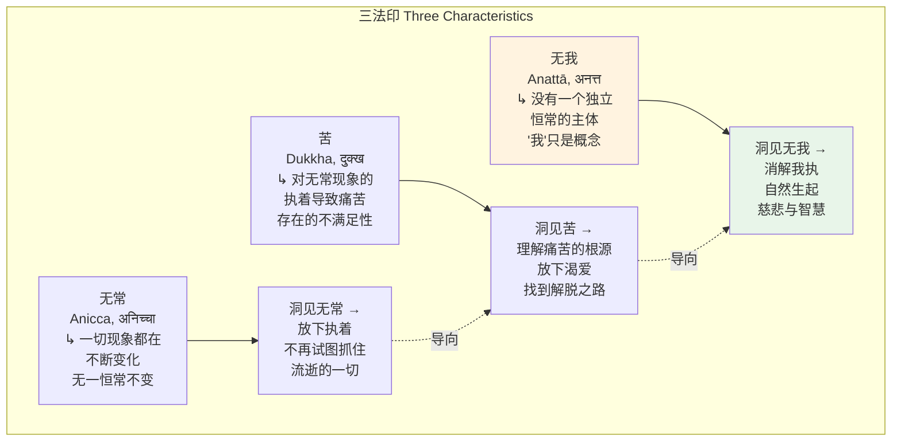
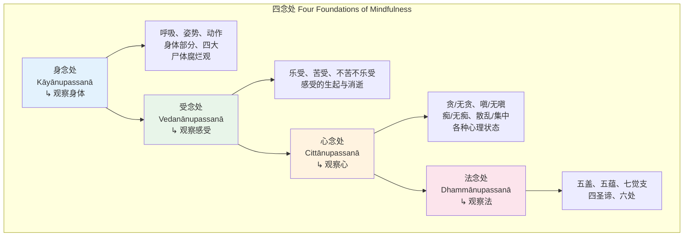
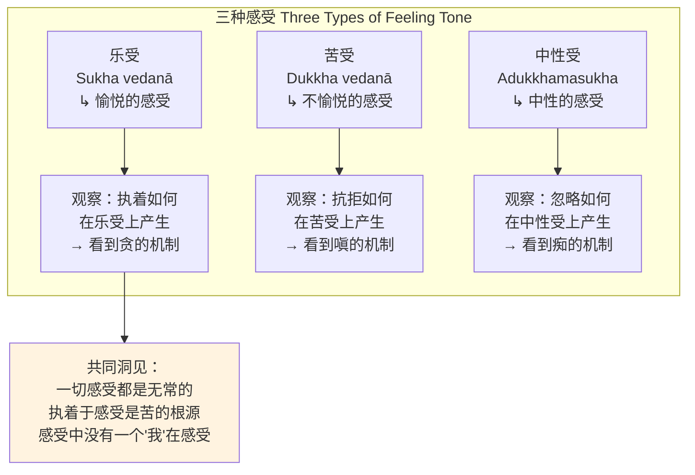
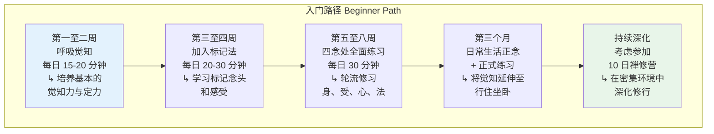

---

title: "佛教内观冥想概述 | Buddhist Vipassana Overview"
description: "佛教内观冥想概述 | Buddhist Vipassana Overview的详细解析与实践指南"
category: "心智与心理学 > 冥想 > Buddhist Vipassana"
tags: ["anxiety", "brain", "mindfulness", "act"]
last_updated: "2026-05"
difficulty: "advanced"
reading_level: "advanced"
estimated_read_time: "10min"
intent_queries:
  - "什么是佛教内观冥想概述 | Buddhist Vipassana Overview"
  - "佛教内观冥想概述 | Buddhist Vipassana Overview的核心概念"
  - "佛教内观冥想概述 | Buddhist Vipassana Overview的方法与实践"
trigger_keywords: ["佛教内观冥想概述", "act", "anxiety", "behavioral", "body"]
cross_refs:
  - path: "01-Wisdom-Traditions/religions/buddhism/foundations/Buddhism_Four_Immeasurables.md"
    relation: "anxiety/buddhism/meditation"
  - path: "01-Wisdom-Traditions/religions/buddhism/meditation/Buddhism_Meditation_Practice_System.md"
    relation: "anxiety/buddhism/meditation"
  - path: "01-Wisdom-Traditions/religions/buddhism/meditation/Buddhism_Samatha_Vipassana.md"
    relation: "anxiety/buddhism/meditation"
  - path: "01-Wisdom-Traditions/religions/buddhism/modern-applications/Digital_Mindfulness_AI_Mental_Health.md"
    relation: "anxiety/buddhism/meditation"
  - path: "01-Wisdom-Traditions/religions/buddhism/modern-applications/INDEX.md"
    relation: "anxiety/buddhism/meditation"

---
# 佛教内观冥想概述 | Buddhist Vipassana Overview

> **适用对象**：对佛教内观传统感兴趣的冥想练习者、佛教研究者、正念教师、心理健康从业者
> **阅读时长**：约 50–60 分钟（可分段阅读）
> **实践建议**：配合正文中的阶段性练习，分 4–6 次完成，每次 15–20 分钟
> **最后更新**：2026-05

---

## 一、核心概念

### 1.1 内观（Vipassana）的本质

内观（Vipassana, विपश्यना / Pali: Vipassanā）是佛教冥想传统中最重要的**洞察型冥想**方法。其名称由"vi"（特殊地、深入地）和"passati"（看、观察）组成，意为**以特殊的、深入的方式如实观察事物**。

内观的核心原则可以用佛陀在《大念处经》（Satipaṭṭhāna Sutta, 念处经）中的一句话来概括：

> **"这是使众生清净、超越忧悲苦恼、体证涅槃的唯一道路——四念处。"**
> —— 《大念处经》开篇

内观冥想不是追求特殊体验或 altered states of consciousness（意识改变状态），而是**培养一种彻底的、无遮蔽的觉知，看见现象的真实本性——无常（Anicca, अनिच्चा）、苦（Dukkha, दुक्ख）和无我（Anattā, अनत्त）**。

### 1.2 核心概念体系

内观冥想建立在以下核心概念之上：

| 概念 | 巴利语 | 含义 | 在内观中的角色 |
|------|--------|------|--------------|
| **念** | Sati, सति | 觉知、正念、不忘失 | 内观修行的基础能力 |
| **正勤** | Sammā-vāyāma | 精进但不紧张的努力 | 维持持续的觉知 |
| **定** | Samādhi, समाधि | 心的统一与安定 | 内观所需的稳定性 |
| **慧** | Paññā, पञ्ञा | 超越性的智慧/洞见 | 内观修行的成果 |
| **如实知见** | Yathābhūta-ñāṇa | 如其所是地知道 | 内观的核心认知方式 |
| **观智** | Vipassanā-ñāṇa | 通过内观生起的智慧 | 内观进阶的具体里程碑 |

### 1.3 三法印——内观的终极洞见

内观冥想所追求的终极洞见是**三法印**（Ti-lakkhaṇa），即一切现象共同具有的三个根本特征：

这三者不是哲学理论，而是**通过内观实践直接体证的实相**。当修行者在经验层面深刻体认到无常、苦和无我时，执着自然减弱，心自然趋向解脱。

### 1.4 内观与止禅的关系

内观冥想不是孤立进行的，它需要与**止禅**（Samatha, समथ）配合。止禅培养心的安定与集中，为内观提供清晰的观察基础。

| 维度 | 止禅（Samatha） | 内观（Vipassana） |
|------|----------------|-------------------|
| **目的** | 培养心的集中与平静 | 培养对实相的洞察 |
| **方法** | 将心专注于单一对象 | 观察不断变化的身心现象 |
| **结果** | 禅定（Jhāna）— 深层的安止状态 | 智慧（Paññā）— 对三法印的体证 |
| **比喻** | 如磨利的刀刃 | 如使用利刀切割无明 |
| **关系** | 内观的基础 | 修行的终极目的 |

---

## 二、历史与传统

### 2.1 佛陀的教导与四念处

内观冥想的历史源头是释迦牟尼佛（Siddhartha Gautama, 约公元前 5 世纪）的教导。佛陀在菩提树下通过深入的观察获得觉悟，其核心体验就是对身心现象的如实观察（即内观）。

佛陀在《大念处经》（*Satipaṭṭhāna Sutta*, 念处经 / *Mahāsatipaṭṭhāna Sutta*, 大念处经）中系统阐述了内观修行的框架——**四念处**（Satipaṭṭhāna, सतिपट्ठान）：

### 2.2 上座部佛教的传承

内观冥想在**上座部佛教**（Theravāda Buddhism）传统中得到了最完整的保存和发展。上座部佛教的三个主要国家——斯里兰卡、缅甸和泰国——各自发展出独特的内观传统：

| 国家 | 主要传统 | 特点 |
|------|---------|------|
| **缅甸** | 马哈希传统、葛印卡传统、帕奥传统 | 高度系统化的内观方法，密集禅修营制度完善 |
| **泰国** | 森林僧传统（阿姜查、阿姜曼） | 强调在日常生活和自然中修行，较少形式化 |
| **斯里兰卡** | 尼南达传统、葛印卡传统 | 融合了经典学术研究与实修 |

### 2.3 马哈希·西亚多传统

**马哈希·西亚多**（Mahāsī Sayādaw, 1904–1982）发展出缅甸最广泛传播的内观方法之一。其核心特点是：

- **主要对象**：腹部的起伏（升降）作为主要的觉知对象
- **标记法**：在心里默默"标记"（Noting）正在发生的现象（如"升起、落下"、"痛、痛"、"想、想"）
- **次要对象**：任何强烈到吸引注意力的现象都成为觉知对象
- **密集修行**：强调在禅修营（10 天至数月）中的密集练习

马哈希西亚多的方法以其**精确的标记技术**和**详细的观智进阶体系**而闻名。修行者通过持续的标记，逐渐看到身心现象的三个特征——无常、苦和无我。

### 2.4 葛印卡传统

**S.N. 葛印卡**（S.N. Goenka, 1924–2013）传承自缅甸的**乌巴庆**（U Ba Khin, 1899–1971），发展出全世界传播最广的内观禅修运动之一。

**葛印卡传统的方法特点**：

1. **第一阶段——呼吸觉知**（Anapana, 安般念）：前三天专注于鼻孔周围的呼吸感受，培养定力和觉知力
2. **第二阶段——身体扫描**：从第四天开始，系统地扫描全身的感受，从头到脚、从脚到头
3. **第三阶段——慈心修习**（Metta, 慈悲冥想）：在课程最后学习慈心冥想，将修行功德回向一切众生

**葛印卡十日课程的严格时间表**：

| 时段 | 活动 |
|------|------|
| 04:00 | 起床钟 |
| 04:30–06:30 | 禅坐 |
| 06:30–08:00 | 早饭与休息 |
| 08:00–09:00 | 团体禅坐 |
| 09:00–11:00 | 禅坐（个人练习） |
| 11:00–12:00 | 午饭 |
| 12:00–13:00 | 休息 |
| 13:00–14:30 | 禅坐（个人练习） |
| 14:30–15:30 | 团体禅坐 |
| 15:30–17:00 | 禅坐（个人练习） |
| 17:00–18:00 | 茶点（新学生）或禅坐（旧学生） |
| 18:00–19:00 | 团体禅坐 |
| 19:00–20:15 | 开示（葛印卡录音讲座） |
| 20:15–21:00 | 团体禅坐 |
| 21:00–21:30 | 问题解答 / 休息 |
| 21:30 | 熄灯 |

### 2.5 泰国森林传统

**泰国森林传统**（Thai Forest Tradition）以内观修行为核心，但比缅甸传统更强调**自然的、非形式化的修行方式**。

关键人物：

| 人物 | 年代 | 贡献 |
|------|------|------|
| **阿姜曼** | 1870–1949 | 复兴了泰国的森林冥想传统 |
| **阿姜查** | 1918–1992 | 以简朴、直接的教导著称，强调"法的自然性" |
| **阿姜摩诃布瓦** | 1913–2011 | 详细描述了禅定和内观的进阶过程 |

阿姜查的教导风格以**直接、朴实**著称：

> "这不是什么复杂的事。只是看——看到一切都在变化。当你真正看到这一点，心就放下了。就这么简单，但也这么困难，因为我们总想抓住什么。"

---

## 三、核心修习方法

### 3.1 身念处（Kāyānupassanā）—— 身体 contemplation

身念处是四念处的基础，其核心是**如实观察身体的现象，看到身体的本质是物质性的、无常的、不净的**。

#### 3.1.1 呼吸观察（Anapanasati）

呼吸观察（安般念）既是止禅的基础练习，也是内观的重要入口。在内观语境下，呼吸观察的目的不是达到深层的禅定，而是**通过观察呼吸的自然流动来培养对身心现象的觉知力**。

**内观式呼吸观察的方法**：

1. 以舒适的坐姿坐下，脊背自然挺直
2. 将注意力放在呼吸最明显的地方（鼻孔、腹部等）
3. 观察每一次呼吸的自然流动——入息、出息、长息、短息
4. 不控制呼吸，如实观察它本来的样子
5. 当分心时，温和地注意到"心跑了"，然后回到呼吸
6. 逐渐观察呼吸的微细特征——它的节奏、温度、质感

#### 3.1.2 身体姿势与动作的正念

内观不仅发生在坐垫上，**日常生活中的每一个动作都可以成为内观的对象**。

| 动作 | 观察焦点 | 内观洞见 |
|------|---------|---------|
| **行走** | 抬脚、移动、放脚的每一个微细动作 | 看到动作只是物理过程，没有"行走者" |
| **伸展** | 肌肉、关节的感受和运动 | 看到身体的机械性，没有"控制者" |
| **吃饭** | 手的移动、咀嚼、吞咽、味觉 | 看到进食只是过程的组合，打破自动化的习惯 |
| **日常活动** | 每一个有意识的动作 | 在一切活动中培养不间断的觉知 |

#### 3.1.3 身体扫描（葛印卡方法）

葛印卡传统的身体扫描是内观中最系统化的身体观察方法：

1. 从头顶开始，依次将注意力移向面部、颈部、肩膀、手臂、胸部、腹部、背部、臀部、大腿、小腿、脚部
2. 在每个部位停留片刻，觉知那个部位的感受——热、冷、痒、痛、压力、振动，或没有感受
3. 以**平等心**（Equanimity, Upekkhā）观察一切感受——不追求愉悦感受，不排斥不悦感受
4. 关键洞见：一切感受都是无常的——它们生起又消逝，没有任何感受值得执着
5. 逐渐培养出一种**对感受的流动性的深刻体验**——整个身体如同一团不断变化的感受之流

### 3.2 受念处（Vedanānupassanā）—— 感受 tone 的觉知

受念处是对**感受**（Vedanā, वेदना）的观察。这里"感受"不是指复杂的情绪，而是指**每时每刻经验中的基本感受 quality——乐受、苦受或不苦不乐受（中性受）**。

**受念处的修行**：

**感受在内观中的关键角色**：

佛陀在《受相应》中指出，感受是内观修行的**关键交汇点**：

- 感受是**因果链**（Paṭiccasamuppāda, 缘起）中可以实际操作的环节——当感受生起时，如果以渴爱（Taṇhā）回应，就延续了苦的循环；如果以平等心（Upekkhā）回应，就开始了苦的止息
- 葛印卡传统特别强调身体层面的感受作为内观的核心对象

### 3.3 心念处（Cittānupassanā）—— 心状态的观察

心念处是对**心本身的状态**的观察。修行者学会如实看见心的各种状态，而不与它们认同。

**心念处观察的内容**：

| 心的状态 | 观察方式 | 内观洞见 |
|---------|---------|---------|
| **贪/无贪** | 心是否被某种欲望占据？ | 看到贪心只是心的状态，不是"我" |
| **嗔/无嗔** | 心是否有抗拒或愤怒？ | 看到嗔心只是心的状态，不是"我" |
| **痴/无痴** | 心是否昏沉或迷惑？ | 看到痴心只是心的状态，不是"我" |
| **散乱/集中** | 心是否安定？ | 看到散乱和集中都是无常的状态 |
| **广大/不广大** | 心是否开阔？ | 看到心的大小、宽窄都是变化的状态 |
| **有上/无上** | 心是否还有更高的可能性？ | 看到一切心的状态都是有条件的 |

**马哈希传统的标记法**特别适合心念处的修行：当心跑掉时，标记"想、想"；当昏沉时，标记"昏沉、昏沉"；当焦躁时，标记"焦躁、焦躁"。

### 3.4 法念处（Dhammānupassanā）—— 法的 contemplation

法念处是四念处中最精深的部分，它将内观的觉知应用于**佛教教义的核心范畴**。

**法念处的五个主题**：

1. **五盖**（Pañca Nīvaraṇā）：观察欲贪、嗔恚、昏沉睡眠、掉举后悔、疑这五种障碍冥想的心理因素
2. **五蕴**（Pañca Khandhā）：观察色、受、想、行、识这五个构成"人"的因素如何不断变化
3. **六处**（Saḷāyatana）：观察眼耳鼻舌身意与色声香味触法的接触如何产生感受和执着
4. **七觉支**（Satta Bojjhaṅgā）：观察念、择法、精进、喜、轻安、定、舍这七个觉悟因素的生起与培养
5. **四圣谛**（Cattāri Ariya Saccāni）：在经验层面直接体证苦、集、灭、道

---

## 四、实践指南

### 4.1 内观智慧进阶（Visuddhimagga 的十六观智）

根据上座部佛教的《清净道论》（Visuddhimagga），内观修行会依次生起**十六观智**（Vipassanā ñāṇa），这是衡量修行进度的重要框架：

| 阶段 | 观智 | 核心体验 |
|------|------|---------|
| 1 | **名色分别智** | 区分心理现象（名）和物质现象（色） |
| 2 | **缘摄受智** | 看到现象之间的因果关系 |
| 3 | **遍知智** | 开始理解三法印 |
| 4 | **生灭随观智** | 直接看到现象的生起和消逝（重要的里程碑） |
| 5–9 | **坏灭智等** | 深刻体验一切现象的坏灭，可能伴随恐惧和厌恶 |
| 10 | **审察智** | 回顾和确认之前的洞见 |
| 11 | **行舍智** | 对一切形成现象的平等心——重要的转折点 |
| 12 | **随顺智** | 顺应解脱道的智慧 |
| 13 | **种姓智** | 从凡夫到圣者的转变点 |
| 14 | **道智** | 体证四圣谛的圣道 |
| 15 | **果智** | 圣道的果——解脱的体验 |
| 16 | **省察智** | 回顾和确认已达到的境界 |

> **重要提醒**：观智的进阶不应被当作"成就清单"来执着。过度关注进度本身可能成为修行的障碍。最好的态度是：**精进修行，但不执着结果**。

### 4.2 初学者入门路径

### 4.3 日课建议

| 时段 | 练习 | 时长 | 说明 |
|------|------|------|------|
| **晨起** | 坐禅（呼吸/腹部升降） | 20–30 分钟 | 以觉知开始新的一天 |
| **上午** | 行禅 | 15–20 分钟 | 缓慢行走中培养对动作的觉知 |
| **午后** | 坐禅（感受观察/身体扫描） | 20–30 分钟 | 深入观察感受的生灭 |
| **傍晚** | 生活正念 | 持续进行 | 在日常活动中保持觉知 |
| **夜间** | 慈心冥想 + 坐禅 | 15–20 分钟 | 以慈悲和安静结束一天 |

### 4.4 禅修营（Retreat）

参加**禅修营**是内观修行中最有效的深化方式。在禅修营中，修行者在数天至数周内完全专注于修行，远离日常生活的干扰。

**参加禅修营的准备**：

1. 选择信誉良好的禅修中心（如葛印卡中心、马哈希中心、森林寺院）
2. 了解并遵守禅修营的纪律要求（静默、素食、过午不食等）
3. 安排好工作和家庭事务，确保可以全程参加
4. 放下对"获得体验"的期望——以开放的心态参加
5. 如有心理健康问题，提前与禅修中心沟通

---

## 五、现代应用与研究

### 5.1 正念运动与内观

现代西方的**正念运动**直接源于佛教内观传统。乔·卡巴金（Jon Kabat-Zinn）在 1979 年创立的**正念减压疗法**（MBSR）将内观的核心技术从佛教框架中提取出来，应用于世俗的医疗和心理环境。

| 维度 | 传统内观 | 现代正念（MBSR/MBCT） |
|------|---------|---------------------|
| **框架** | 佛教解脱道 | 世俗健康与心理治疗 |
| **目标** | 涅槃、解脱 | 减压、心理健康 |
| **方法** | 四念处完整修习 | 呼吸觉知、身体扫描等精选技术 |
| **伦理** | 佛教戒律（五戒、八戒） | 世俗伦理（不伤害、慈悲） |
| **时间投入** | 密集禅修营（10天至数月） | 每日 30–45 分钟 + 8 周课程 |

### 5.2 内观的神经科学研究

内观冥想是所有冥想类型中被研究得最充分的：

| 研究领域 | 关键发现 |
|---------|---------|
| **脑结构** | 长期内观修行者表现出前额叶皮层、脑岛和海马体的灰质密度增加（Lazar et al., 2005） |
| **杏仁核** | 8 周正念训练后杏仁核体积减小，与压力反应降低相关（Hölzel et al., 2010） |
| **默认模式网络** | 内观练习中 DMN 活跃度降低，与自我指涉思维的减少相关 |
| **疼痛** | 内观训练可以改变对疼痛的感知和反应方式，减少疼痛带来的痛苦（不减少感觉本身） |
| **注意力** | 内观练习改善持续注意力、选择性注意力和注意力转换能力 |
| **情绪调节** | 增强前额叶对杏仁核的调节，改善情绪反应模式 |
| **炎症** | 正念训练与降低的炎症标志物（如 IL-6、CRP）水平相关 |

### 5.3 临床应用

| 应用领域 | 证据强度 | 说明 |
|---------|---------|------|
| **焦虑障碍** | 强 | MBCT 和 MBSR 被证明对广泛性焦虑障碍有效 |
| **抑郁复发预防** | 强 | MBCT 被英国 NICE 指南推荐为抑郁复发预防的干预措施 |
| **慢性疼痛** | 中-强 | 正念训练可以帮助患者改变与疼痛的关系 |
| **物质滥用** | 中 | 正念复发预防（MBRP）显示出积极效果 |
| **创伤后应激障碍** | 发展中 | 需要创伤敏感的调整，不应直接使用标准内观 |
| **进食障碍** | 中 | 正念饮食干预显示出积极效果 |

---

## 六、注意事项与建议

### 6.1 安全须知

1. **禅修病**（Meditation Sickness / Qi Gong Deviation）：长时间密集禅修可能引发各种身心不适，包括焦虑加剧、解离、幻觉等。这些通常是暂时的，但需要正确应对
2. **创伤敏感性**：有创伤史的人在参加内观禅修前应咨询心理健康专业人士。标准的身体扫描和闭眼冥想可能触发创伤记忆
3. **"暗夜"体验**：在内观的深入阶段，修行者可能经历所谓的"领悟之苦"（Knowledge of Suffering / Bhaya ñāṇa），看到实相可能暂时带来恐惧、厌恶或不安——这是正常的但需要正确理解和支持
4. **不要独自处理困难**：如果在禅修中遇到严重的心理困难，应及时与禅师或心理健康专业人士沟通
5. **身体照顾**：长时间坐禅可能带来膝盖、背部等身体问题。尊重身体的信号，必要时调整姿势

### 6.2 修行中的常见陷阱

| 陷阱 | 表现 | 应对 |
|------|------|------|
| **执着于特殊体验** | 追求光、乐、深定等体验 | 记住内观的目的是如实观察，不是追求体验 |
| **将标记机械化** | 标记变成无意识的习惯 | 让标记保持鲜活和精确，真正"看到"现象 |
| **灵性自我** | 以"我很有正念"为骄傲 | 观察这个"灵性自我"本身——它也是无常的 |
| **过度分析** | 在禅坐中思考佛法而不是直接观察 | 佛法理解应发生在禅坐之外，禅坐中只管观察 |
| **比较与竞争** | 与他人比较"修行的深度" | 每个人的因缘不同，专注自己的修行 |

### 6.3 推荐阅读

| 书籍 | 作者 | 说明 |
|------|------|------|
| 《大念处经》Satipaṭṭhāna Sutta | 佛陀 | 四念处的原始经典 |
| 《清净道论》Visuddhimagga | 觉音尊者 | 内观修行的百科全书式论述 |
| 《内观》The Art of Living | 威廉·哈特 | 葛印卡传统的入门介绍 |
| Practical Insight Meditation | 马哈希西亚多 | 马哈希传统的修行手册 |
| Full Catastrophe Living | Jon Kabat-Zinn | 正念减压的经典著作 |
| Mindfulness in Plain English | Bhante Gunaratna | 面向初学者的内观入门 |

---

> **相关资源**
> - 返回 [INDEX](./INDEX.md)
> - 参见 [止观概述](../samatha-vipassana/INDEX.md)
> - 参见 [内观冥想](../vipassana/Vipassana_Meditation.md)
