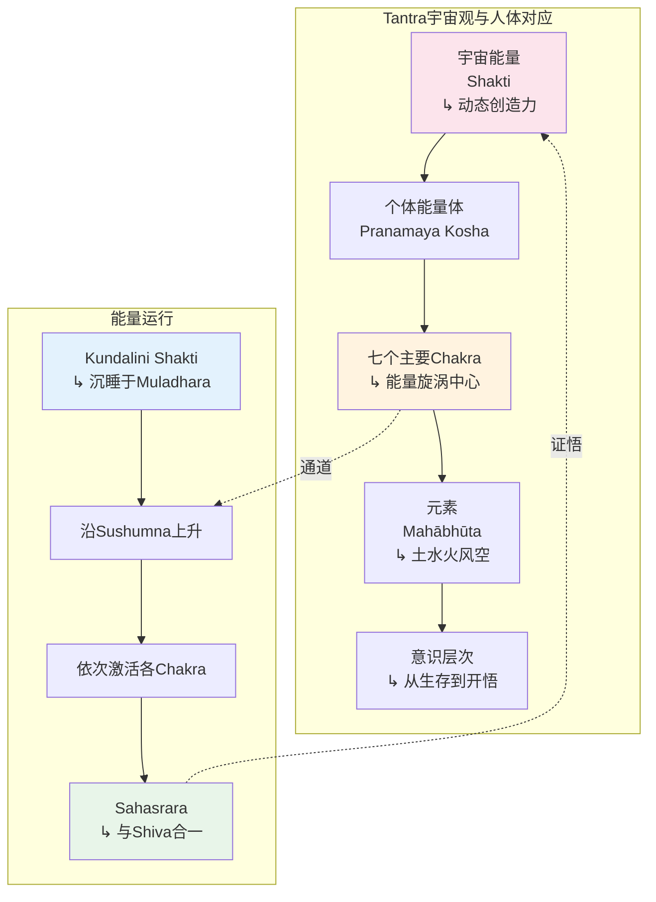

# 脉轮冥想专业概述：从Tantra传统到现代能量修习

> **适用对象**：对能量冥想有兴趣的练习者、瑜伽/疗愈从业者、心理咨询师、身心灵研究者  
> **阅读时长**：约 35–45 分钟（可分段阅读）  
> **实践建议**：脉轮冥想以温和观想为主，但仍需注意身心反应，循序渐进  
> **最后更新**：2026-05

---

## 一、历史渊源

### 1.1 印度Tantra传统——脉轮概念的诞生

脉轮（Chakra，梵语：चक्र，意为"轮"或"盘"）的概念起源于印度次大陆的**Tantra传统**（约公元5–9世纪），并在随后的哈他瑜伽经典中得到系统化发展。与吠陀传统强调祭祀和知识不同，Tantra将人体视为**微宇宙（Microcosm）**，认为人体内部蕴含着与宇宙对应的能量结构和神圣力量。

**Tantra中的脉轮萌芽**：

早期的Tantra文本（如《Mahabhuta Tantra》《Kubjika Tantra》《Shri Chakra Nirupana》）中，脉轮被描述为人体能量系统（Pranamaya Kosha）中的**旋涡状能量中心**。它们沿着脊柱中轴分布，是宇宙能量（Shakti）与个体意识交汇的节点。每个脉轮对应特定的身体区域、心理功能、感官能力乃至宇宙元素（Mahābhūta）。

> *"身体即庙宇，脉轮即祭坛。"* —— Tantra传统格言

| 维度 | 吠陀传统 | Tantra传统 |
|------|---------|-----------|
| **身体观** | 身体是束缚，需超越 | 身体是神圣圣殿，是觉醒的载体 |
| **能量观** | 未系统化 | 人体是微宇宙，脉轮是能量节点 |
| **修行方法** | 祭祀、苦行、知识 | 仪式、曼陀罗、观想、呼吸、能量修炼 |
| **目标** | 解脱（Moksha） | 觉醒（Moksha/Bhukti），在世间体验神性 |



### 1.2 Kundalini Yoga——脉轮修习的身体化

14世纪《哈他瑜伽之光》（*Hatha Yoga Pradipika*）和稍晚的《Shiva Samhita》《Gheranda Samhita》将脉轮理论与**哈他瑜伽的身体技术**系统整合。在这些经典中，脉轮不再是纯抽象的哲学概念，而是与具体的呼吸法（Pranayama）、身体锁定（Bandha）、手印（Mudra）和冥想观想直接对应的**可操作体系**。

**经典文献中的脉轮描述**：

| 经典 | 年代 | 脉轮相关贡献 |
|------|------|-------------|
| **《哈他瑜伽之光》** | ~14世纪 | 首次将六脉轮（加Sahasrara）与Kundalini上升路径系统整合；描述Pranayama、Bandha对能量引导的作用 |
| **《Shiva Samhita》** | ~17世纪 | 详细描述各脉轮的莲花瓣数、颜色、字母、神祇；强调脉轮与身体解剖的对应 |
| **《Gheranda Samhita》** | ~17世纪 | 七重身净化体系中，脉轮是净化能量体（Pranamaya Kosha）的关键节点 |
| **《Sat-Chakra-Nirupana》** | ~16世纪 | 最详细的脉轮描述文本之一；每个脉轮的精细结构、颜色、神祇、能力 |

> *"她（Kundalini）像一条盘绕的蛇，沉睡于海底轮。当她被瑜伽唤醒，她沿中脉上升，开启每一个莲花轮，最终在千瓣莲花中沉睡者醒来。"* ——《Shiva Samhita》

### 1.3 Theosophy时代——脉轮的西方化重构

19世纪末至20世纪初，**神智学（Theosophy）**运动将脉轮概念引入西方知识界。海伦娜·布拉瓦茨基（Helena Blavatsky, 1831–1891）及其追随者通过翻译和诠释印度经典，使"Chakra"成为西方神秘学圈的通行术语。

**Theosophy的关键影响**：

| 人物/著作 | 贡献 | 对现代脉轮体系的影响 |
|----------|------|-------------------|
| **H.P. Blavatsky** | 《The Secret Doctrine》（1888）引入东方概念到西方 | 奠定"东方智慧"在西方的话语框架 |
| **C.W. Leadbeater** | 《The Chakras》（1927）——第一本系统介绍脉轮的西方著作 | **首次将彩虹七色系统性地赋予七个脉轮**；描述脉轮的"超感官"可见形态 |
| **Annie Besant** | 与Leadbeater合著多部作品 | 将脉轮与"星光体"（Astral Body）理论整合 |

**Leadbeater的关键"创新"与争议**：

- **颜色体系**：传统印度文献中，脉轮颜色描述并不统一（或以莲花颜色为主），而Leadbeater首次将**红橙黄绿蓝靛紫的彩虹光谱**依次对应七个脉轮。这一体系被后来的新时代运动广泛采纳，成为今天最流行的脉轮颜色模型。
- **可视化方法**：描述了通过"灵视"（Clairvoyance）观察脉轮的方法，强调其旋转速度、方向和光泽。
- **争议点**：Leadbeater的颜色对应缺乏传统经典支撑，更多是基于个人"灵视"体验，被后来的学者批评为**西方神秘学的建构**而非印度传统的忠实传承。

### 1.4 新时代运动（New Age）——脉轮的大众化与商业化

1960–1980年代的新时代运动将脉轮从神秘学圈层推向大众市场。这一时期，脉轮体系经历了**进一步的简化、视觉化和商业化**：

```mermaid
graph TD
    subgraph 印度传统源头
        I1[Tantra经典<br/>5-9世纪] --> I2[哈他瑜伽经典<br/>14-17世纪]
        I2 --> I3[传统Kundalini Yoga<br/>师徒口传]
    end

    subgraph Theosophy重构<br/>1880s-1920s
        T1[Blavatsky引入] --> T2[Leadbeater《The Chakras》<br/>1927：彩虹七色]
        T2 --> T3[星光体/光环理论]
    end

    subgraph New Age转型<br/>1960s-1980s
        N1[嬉皮文化<br/>东方灵性热] --> N2[脉轮与水晶疗愈<br/>色彩疗法整合]
        N2 --> N3[John Harvey《Anatomy of the Spirit》<br/>1996：脉轮与心理对应]
        N3 --> N4[商业化产品<br/>脉轮精油/服饰/APP]
    end

    subgraph 现代整合<br/>2000s至今
        M1[瑜伽全球化<br/>脉轮成为瑜伽课标配] --> M2[科学探索<br/>内分泌/神经/频率]
        M2 --> M3[批判性反思<br/>文化挪用/简化]
    end

    I3 -.->|西传| T1
    T3 -.->|影响| N1
    N4 -.->|发展| M1
    M3 -.->|回归| I2

    style I2 fill:#e8f5e9
    style T2 fill:#fff3e0
    style N2 fill:#fce4ec
    style M2 fill:#e3f2fd
```

**新时代运动的关键人物与作品**：

| 人物 | 著作/贡献 | 影响 |
|------|----------|------|
| **John Harvey** | 《Anatomy of the Spirit》（1996） | 将七脉轮与犹太-基督教的七圣礼、佛教的七觉支对应，构建跨传统框架 |
| **Anodea Judith** | 《Wheels of Life》（1987/1999） | 最畅销的脉轮书籍之一；将脉轮与现代心理学深度整合；提出"脉轮发展心理学" |
| **Caroline Myss** | 《Anatomy of the Spirit》合著者 | 将脉轮与"能量医学"话语体系整合，推动进入主流替代医疗 |

**商业化表现**：
- **脉轮主题产品**：精油、香薰、瑜伽服、纹身、饰品、家居装饰
- **脉轮课程**：从瑜伽工作室到水疗中心，"脉轮平衡"成为标准服务项目
- **数字产品**：脉轮冥想APP、脉轮测试问卷、在线脉轮"诊断"工具

---

## 二、脉轮系统理论

### 2.1 七个主要脉轮（Sapta Chakra）

传统哈他瑜伽描述的七脉轮体系是现代脉轮冥想的核心框架。以下表格综合了传统文献、Theosophy色彩体系和现代通用表述：

| 脉轮 | 梵名 | 位置 | 颜色 | 元素 | 功能/心理主题 | Bija Mantra | 莲花瓣数 | 身体对应 |
|------|------|------|------|------|-------------|-------------|---------|---------|
| **海底轮** | Muladhara（मूलाधार） | 会阴/尾骨尖端 | 红色 | 土（Pṛthivī） | 生存、安全感、根基、物质世界连接 | **LАМ**（लं） | 4瓣 | 盆底肌、腿、足、骨骼、肾上腺 |
| **生殖轮** | Svādhiṣṭhāna（स्वाधिष्ठान） | 耻骨上方、下腹部 | 橙色 | 水（Apas） | 情绪、性欲、创造力、关系、流动 | **VАM**（वं） | 6瓣 | 生殖器官、膀胱、肾脏、性腺 |
| **脐轮** | Maṇipūra（मणिपूर） | 肚脐上方、太阳神经丛 | 黄色 | 火（Agni） | 意志力、个人力量、自尊、消化 | **RАM**（रं） | 10瓣 | 消化系统、胰腺、肝脏、胆囊 |
| **心轮** | Anāhata（अनाहत） | 胸骨中央、心脏水平 | 绿色 | 风/气（Vāyu） | 爱、慈悲、连接、接纳、和谐 | **YАM**（यं） | 12瓣 | 心脏、肺、胸腺、免疫系统 |
| **喉轮** | Viśuddha（विशुद्ध） | 喉结水平、颈部中央 | 天蓝色 | 空/以太（Ākāśa） | 表达、沟通、真理、聆听、创造力 | **HАM**（हं） | 16瓣 | 甲状腺、甲状旁腺、喉咙、口腔 |
| **眉心轮** | Ājñā（आज्ञा） | 两眉之间、眉心 | 靛蓝色 | 光（Jyotis）/ 心智（Manas） | 直觉、洞察、智慧、想象力、指挥 | **OM**（ॐ） | 2瓣 | 松果体、脑下垂体、双眼、大脑 |
| **顶轮** | Sahasrāra（सहस्रार） | 头顶中央、百会穴 | 紫/白色 | 意识（Cit）/ 超越元素 | 灵性觉醒、与神合一、超越、统合 | **AUM** / 寂静（शून्य） | 千瓣 | 大脑皮层、神经系统、脑垂体 |

```mermaid
graph TD
    subgraph 七脉轮能量层级模型<br/>Seven Chakra Hierarchy
        C7[Sahasrāra 顶轮<br/>↳ 紫/白色<br/>↳ 意识/超越<br/>↳ 灵性觉醒] --> C6[Ājñā 眉心轮<br/>↳ 靛蓝<br/>↳ 光/心智<br/>↳ 直觉智慧]
        C6 --> C5[Viśuddha 喉轮<br/>↳ 天蓝<br/>↳ 空/以太<br/>↳ 表达沟通]
        C5 --> C4[Anāhata 心轮<br/>↳ 绿色<br/>↳ 风/气<br/>↳ 爱慈悲]
        C4 --> C3[Maṇipūra 脐轮<br/>↳ 黄色<br/>↳ 火<br/>↳ 意志力量]
        C3 --> C2[Svādhiṣṭhāna 生殖轮<br/>↳ 橙色<br/>↳ 水<br/>↳ 情绪创造]
        C2 --> C1[Muladhara 海底轮<br/>↳ 红色<br/>↳ 土<br/>↳ 生存根基]
    end

    subgraph 意识发展维度
        D1[物质生存<br/> groundedness] --> D2[情感流动<br/> relationships]
        D2 --> D3[个人意志<br/> empowerment]
        D3 --> D4[爱与连接<br/> compassion]
        D4 --> D5[真理表达<br/> authenticity]
        D5 --> D6[内在洞见<br/> intuition]
        D6 --> D7[灵性合一<br/> transcendence]
    end

    C1 -.->|对应| D1
    C4 -.->|对应| D4
    C7 -.->|对应| D7

    style C1 fill:#ffcdd2
    style C2 fill:#ffe0b2
    style C3 fill:#fff9c4
    style C4 fill:#c8e6c9
    style C5 fill:#bbdefb
    style C6 fill:#d1c4e9
    style C7 fill:#f3e5f5
```

### 2.2 三脉系统（Tridaṇḍa / Three Nadis）

Nāḍī（नाडी）是瑜伽生理学中的能量通道。在所有Nāḍī中，三脉最为核心：

```mermaid
graph TD
    subgraph 三脉能量模型<br/>Three Nadi System
        S1[Sushumna 中脉<br/>↳ 脊柱中央<br/>↳ 最精微通道<br/>↳ Kundalini上升路径] --> S2[Iḍā 左脉<br/>↳ 脊柱左侧<br/>↳ 阴/月/Chandra<br/>↳ 副交感主导<br/>↳ 清凉、接纳]
        S1 --> S3[Piṅgalā 右脉<br/>↳ 脊柱右侧<br/>↳ 阳/日/Sūrya<br/>↳ 交感主导<br/>↳ 温热、行动]
    end

    subgraph 交汇与脉轮
        C1[Muladhara<br/>三脉起点] --> C2[Svādhiṣṭhāna<br/>交汇]
        C2 --> C3[Maṇipūra<br/>交汇]
        C3 --> C4[Anāhata<br/>交汇]
        C4 --> C5[Viśuddha<br/>交汇]
        C5 --> C6[Ājñā<br/>三脉合一]
    end

    S2 -.->|运行| C2
    S3 -.->|运行| C2
    S1 -.->|中央通道| C6

    style S1 fill:#fff3e0
    style S2 fill:#e3f2fd
    style S3 fill:#ffebee
    style C6 fill:#e8f5e9
```

**三脉详解**：

| Nāḍī | 梵名 | 传统位置 | 性质 | 对应系统 | 失衡表现 |
|------|------|---------|------|---------|---------|
| **Sushumna** | सुषुम्णा | 脊柱中央，从会阴至顶轮 | 中性、平衡、灵性 | 中央能量通道；昆达里尼上升的唯一路径 | 堵塞时：灵性追求受阻，冥想难以深入，能量无法上升 |
| **Iḍā** | इडा | 脊柱左侧，从左鼻孔起 | 阴、月（Chandra）、副交感主导 | 情绪、直觉、接受性、内在世界、潜意识 | 过盛时：抑郁、昏沉、过度内向、冷漠、缺乏行动力 |
| **Piṅgalā** | पिङ्गला | 脊柱右侧，从右鼻孔起 | 阳、日（Sūrya）、交感主导 | 行动、理性、外向性、外在世界、显意识 | 过盛时：焦虑、躁动、攻击性、失眠、过度消耗 |

**左右鼻孔交替与能量平衡**：
传统瑜伽认为，人的左右鼻孔通气量约每 **90–120 分钟** 自然交替一次主导鼻孔，这对应 Iḍā 和 Piṅgalā 的交替主导。通过**Nāḍī Śodhana（左右交替鼻孔呼吸）**可主动平衡两脉能量。

### 2.3 Kundalini能量上升路径（Kuṇḍalinī Ascent）

在脉轮系统理论中，Kundalini（昆达里尼）被描述为**沉睡于海底轮（Muladhara）的蛇形能量**。它盘绕三圈半，阻塞了中脉（Sushumna）的入口。当通过特定修习唤醒时，它沿中脉上升，依次穿过各脉轮，最终在顶轮（Sahasrāra）与纯粹意识（Shiva）合一。

**上升路径与转化过程**：

| 阶段 | 脉轮 | 能量转化 | 心理/灵性主题 | 可能的体验 |
|------|------|---------|-------------|-----------|
| **起点** | Muladhara | Kundalini从沉睡中唤醒 | 从物质生存走向灵性觉醒的转折点 | 脊柱底部温热/酥麻感 |
| **第一阶段** | Svādhiṣṭhāna | 能量进入水元素区域 | 情绪的净化；创造力的觉醒 | 情绪波动、创造力涌现、性能量转化 |
| **第二阶段** | Maṇipūra | 能量进入火元素区域 | 个人意志的淬炼；自尊的重塑 | 腹部温热、意志力增强、愤怒释放 |
| **第三阶段** | Anāhata | 能量进入风元素区域 | 从个人走向无条件的爱 | 心口扩展感、爱与悲伤的涌现 |
| **第四阶段** | Viśuddha | 能量进入空元素区域 | 真理的表达；沟通的净化 | 表达欲增强、声音变化、聆听能力提高 |
| **第五阶段** | Ājñā | 能量进入光/心智区域 | 直觉的开启；智慧的显现 | 内视能力、清晰洞见、梦境变化 |
| **终点** | Sahasrāra | 能量与宇宙意识合一 | 超越个体自我的觉醒 | 无边界的喜悦、与万物合一感 |

> **重要区分**：脉轮冥想（Chakra Meditation）通常指**温和的观想和声音冥想**，目的是**平衡和净化**脉轮能量；而Kundalini唤醒（Kundalini Awakening）是一个更强烈、更不可控的能量过程，可能带来显著的身心变化。两者相关但不等同。

---

## 三、主要修习方法

### 3.1 脉轮观想（Chakra Visualization）

脉轮观想是脉轮冥想中最核心的技术，通过**心像（Mental Imagery）**在特定身体区域创造和维持色彩/形状觉知，以引导、平衡和净化能量。

#### 3.1.1 颜色观想

基于Leadbeater确立的彩虹七色体系（虽为西方建构，但已成为现代通用标准）：

**基础方法**：
1. 以舒适坐姿（散盘/简易坐/椅子坐）安定身心
2. 将注意力带至目标脉轮的身体位置
3. 观想该脉轮处有一朵旋转的莲花，颜色为对应色彩
4. 莲花缓缓顺时针旋转（传统中，从上方俯视为顺时针）
5. 想象色彩的光芒向身体内外散发，充满整个身体区域

| 脉轮 | 观想颜色 | 观想辅助 | 进阶技巧 |
|------|---------|---------|---------|
| Muladhara | 鲜红色，如红宝石 | 四瓣莲花；地面扎根感 | 观想红色光柱向下延伸至地球中心 |
| Svādhiṣṭhāna | 橙色，如落日 | 六瓣莲花；水波流动感 | 观想橙色光如暖流在骨盆区域流转 |
| Maṇipūra | 金黄色，如太阳 | 十瓣莲花；火焰燃烧感 | 观想金色火焰净化腹部所有紧张 |
| Anāhata | 翠绿色，如翡翠 | 十二瓣莲花；微风轻拂感 | 观想绿色光从心脏向四周散发 |
| Viśuddha | 天蓝色，如晴空 | 十六瓣莲花；空间扩展感 | 观想蓝色光净化喉咙和颈部 |
| Ājñā | 靛蓝色，如深海 | 两瓣莲花；内在光明感 | 观想靛蓝光在第三眼处如星辰闪耀 |
| Sahasrāra | 紫/白金色 | 千瓣莲花；无边光芒 | 观想紫色光柱向上延伸至无限 |

#### 3.1.2 形状/莲花观想

传统文献中，每个脉轮被描述为一朵特定瓣数的莲花（Padma），莲花的中心有特定的几何图形（Yantra）和象征符号：

```mermaid
graph TD
    subgraph 脉轮莲花结构<br/>Chakra Lotus Structure
        L1[Muladhara<br/>4瓣莲花<br/>中心：黄色方形<br/>象征土元素] --> L2[Svādhiṣṭhāna<br/>6瓣莲花<br/>中心：白色新月<br/>象征水元素]
        L2 --> L3[Maṇipūra<br/>10瓣莲花<br/>中心：红色三角形<br/>象征火元素]
        L3 --> L4[Anāhata<br/>12瓣莲花<br/>中心：烟熏色六芒星<br/>象征风元素]
        L4 --> L5[Viśuddha<br/>16瓣莲花<br/>中心：白色圆形<br/>象征空元素]
        L5 --> L6[Ājñā<br/>2瓣莲花<br/>中心：白色五芒星/OM符号]
        L6 --> L7[Sahasrāra<br/>千瓣莲花<br/>中心：无形象<br/>纯粹光]
    end

    style L1 fill:#ffcdd2
    style L2 fill:#ffe0b2
    style L3 fill:#fff9c4
    style L4 fill:#c8e6c9
    style L5 fill:#bbdefb
    style L6 fill:#d1c4e9
    style L7 fill:#f3e5f5
```

**莲花观想进阶**：
- 不仅观想颜色和瓣数，还可以观想莲花中心的几何图形
- 观想莲花从闭合到缓缓绽放的过程，象征脉轮的"开启"
- 观想莲花散发光芒，光芒的颜色与脉轮颜色一致

### 3.2 种子音冥想（Bīja Mantra Meditation）

Bīja（बीज）意为"种子"，Bīja Mantra是脉轮对应的单音节种子音，被认为蕴含该脉轮的**核心振动频率**和能量本质。

| 脉轮 | Bīja Mantra | 梵文字母 | 发音要点 | 共振区域 | 传统功能 |
|------|-------------|---------|---------|---------|---------|
| Muladhara | **LАМ** | लं | 舌尖抵上颚，发"朗姆"，尾音归鼻 | 会阴/骨盆底 |  grounding、稳定、安全感 |
| Svādhiṣṭhāna | **VАM** | वं | 上齿轻触下唇，发"瓦姆" | 下腹部/骨盆 | 情绪流动、创造力、关系和谐 |
| Maṇipūra | **RАM** | रं | 舌尖颤音，发"拉姆" | 太阳神经丛 | 意志力、自信、消化火力 |
| Anāhata | **YАM** | यं | 舌面接近硬腭，发"亚姆" | 胸腔中央 | 爱、慈悲、心轮开启 |
| Viśuddha | **HАM** | हं | 呼气声，发"哈姆"，如叹息 | 喉咙/颈部 | 表达、沟通、真理 |
| Ājñā | **OM** | ॐ | A-U-M三音合一，归静 | 眉心/前额 | 直觉、智慧、内在洞见 |
| Sahasrāra | **AUM** / 寂静 | ॐ / शून्य | 超越声音，归于无声 | 头顶/全身 | 灵性觉醒、宇宙合一 |

**Japa（重复诵念）练习方法**：

1. **选择目标脉轮**：根据当下身心状态选择需要平衡的脉轮
2. **坐姿**：舒适坐姿，脊柱自然挺拔
3. **发声方式**：
   - **出声诵念**（Vaikhari）：声音从口中发出，感受身体共振
   - **低语诵念**（Upamshu）：嘴唇微动，仅自己可闻
   - **心念诵念**（Manasika）：心中默诵，不发声
4. **节奏**：每轮吸气后呼气时诵念；或配合呼吸自然节奏
5. **数量**：传统以 **108 次**为一轮（可用念珠计数），初学者从 **21 次**开始
6. **观想配合**：诵念时观想对应脉轮的颜色和光芒

> **发音提示**：梵语发音有其特定规则，错误的发音可能改变振动效果。建议在熟悉梵语音韵的老师指导下学习，或通过可靠的音频资源校准发音。尤其对 RАM（रं）的舌尖颤音和 OM（ॐ）的三段式发音（A-U-M），值得专门练习。

### 3.3 脉轮呼吸法（Chakra Breathing）

将呼吸觉知与脉轮位置结合，通过呼吸引导能量在脉轮间流动。

#### 3.3.1 单脉轮呼吸

将呼吸的觉知聚焦于单一脉轮：

**操作方法**：
1. 找到目标脉轮的身体位置
2. 吸气时，想象气息/能量从该脉轮位置进入身体
3. 呼气时，想象气息/能量从该脉轮位置向外散发光芒
4. 保持呼吸自然、不刻意加深

| 脉轮 | 呼吸觉知位置 | 吸气观想 | 呼气观想 |
|------|------------|---------|---------|
| Muladhara | 会阴/尾骨 | 红色光芒从地球升起进入身体 | 红色光芒向下回归大地 |
| Maṇipūra | 肚脐上方 | 金色太阳光芒从前方进入 | 金色光芒向四周散发 |
| Anāhata | 胸骨中央 | 绿色光芒从宇宙四面八方汇聚 | 绿色光芒从心脏向无限散发 |
| Ājñā | 眉心 | 靛蓝色光芒从额头前方进入 | 靛蓝色光芒照亮整个大脑 |

#### 3.3.2 脉轮串联呼吸（Chakra Breathing Sequence）

一种更动态的脉轮呼吸法，引导能量从下至上依次经过各脉轮：

```mermaid
graph LR
    subgraph 吸气上升<br/>Inhalation Ascent
        A1[吸气起始<br/>Muladhara] --> A2[能量上升至<br/>Svādhiṣṭhāna]
        A2 --> A3[能量上升至<br/>Maṇipūra]
        A3 --> A4[能量上升至<br/>Anāhata]
        A4 --> A5[能量上升至<br/>Viśuddha]
        A5 --> A6[能量上升至<br/>Ājñā]
        A6 --> A7[吸气顶点<br/>Sahasrāra]
    end

    subgraph 呼气下降<br/>Exhalation Descent
        B7[呼气起始<br/>Sahasrāra] --> B6[能量下降至<br/>Ājñā]
        B6 --> B5[能量下降至<br/>Viśuddha]
        B5 --> B4[能量下降至<br/>Anāhata]
        B4 --> B3[能量下降至<br/>Maṇipūra]
        B3 --> B2[能量下降至<br/>Svādhiṣṭhāna]
        B2 --> B1[呼气终点<br/>Muladhara]
    end

    A7 -.->|转换| B7
    B1 -.->|下一循环| A1

    style A1 fill:#ffcdd2
    style A4 fill:#c8e6c9
    style A7 fill:#f3e5f5
    style B1 fill:#ffcdd2
    style B4 fill:#c8e6c9
    style B7 fill:#f3e5f5
```

**操作方法**：
1. 吸气（约 5–7 秒）：观想能量从海底轮缓缓上升，依次经过生殖轮、脐轮、心轮、喉轮、眉心轮，最终到达顶轮
2. 短暂悬息（约 1–2 秒）：能量在顶轮停留，感受光芒绽放
3. 呼气（约 5–7 秒）：观想能量从顶轮缓缓下降，依次经过各脉轮，最终回到海底轮
4. 重复 7–21 个循环

> **注意**：脉轮串联呼吸是一种观想技术，不是要求呼吸真的"到达"身体各部位。其本质是**通过呼吸节律和心像引导注意力流动**，从而产生能量移动的**主观体验**。不应强求或过度用力。

### 3.4 脉轮瑜伽体式配合（Chakra-Aligned Āsana）

特定的瑜伽体式被认为能够激活、平衡或净化对应的脉轮能量。以下是传统和现代瑜伽教学中常用的脉轮-体式对应：

| 脉轮 | 对应体式 | 体式梵名 | 作用机制 |
|------|---------|---------|---------|
| **Muladhara** | 山式、战士式系列、树式 | Tādāsana, Vīrabhadrāsana, Vṛkṣāsana | 强化腿部和盆底根基；建立 groundedness |
| **Svādhiṣṭhāna** | 束角式、坐角式、鸽子式 | Baddha Koṇāsana, Upaviṣṭha Koṇāsana, Eka Pāda Rājakapotāsana | 打开髋关节；释放骨盆区域的紧张 |
| **Maṇipūra** | 船式、弓式、战士III式 | Nāvāsana, Dhanurāsana, Vīrabhadrāsana III | 强化核心肌群；激活太阳神经丛 |
| **Anāhata** | 骆驼式、鱼式、轮式 | Uṣṭrāsana, Matsyāsana, Cakrasana | 打开胸腔；扩展心轮区域 |
| **Viśuddha** | 犁式、肩倒立、鱼式（变体） | Halāsana, Sarvāṅgāsana, Matsyāsana | 倒置体式刺激颈部；打开喉轮 |
| **Ājñā** | 婴儿式（前额触地）、头倒立 | Bālāsana, Śīrṣāsana | 前额轻微压力刺激眉心区域 |
| **Sahasrāra** | 莲花坐、摊尸式 | Padmāsana, Śavāsana | 脊柱挺拔促进能量上行；摊尸式中能量自然流向顶轮 |

**体式配合冥想的建议**：
- 先进行 **5–10 分钟** 的对应体式练习，打开和激活目标脉轮的身体区域
- 随后进入 **15–20 分钟** 的坐姿脉轮观想或Bīja Mantra冥想
- 体式产生的身体感觉可作为冥想的"入口"——更容易将注意力聚焦于对应区域

### 3.5 脉轮水晶/声音疗愈（Chakra Crystal & Sound Healing）

#### 3.5.1 水晶/宝石对应

新时代运动中，特定颜色的水晶/宝石被认为与对应脉轮产生共振：

| 脉轮 | 对应水晶/宝石 | 颜色匹配 | 传统用途 |
|------|-------------|---------|---------|
| Muladhara | 红玛瑙（Red Agate）、石榴石（Garnet）、黑曜石（Obsidian） | 红/黑 | grounding、保护、稳定 |
| Svādhiṣṭhāna | 红玉髓（Carnelian）、月光石（Moonstone） | 橙/白 | 情绪平衡、创造力、性能量 |
| Maṇipūra | 黄水晶（Citrine）、虎眼石（Tiger's Eye） | 黄/金 | 自信、意志力、财富能量 |
| Anāhata | 绿幽灵（Green Aventurine）、翡翠（Jade）、粉晶（Rose Quartz） | 绿/粉 | 爱与慈悲、情感疗愈 |
| Viśuddha | 蓝纹玛瑙（Blue Lace Agate）、海蓝宝（Aquamarine） | 蓝 | 沟通、表达、真理 |
| Ājñā | 青金石（Lapis Lazuli）、紫水晶（Amethyst）、苏打石（Sodalite） | 靛蓝/紫 | 直觉、智慧、灵性觉醒 |
| Sahasrāra | 透明石英（Clear Quartz）、紫水晶（Amethyst）、钻石（Diamond） | 白/紫/透明 | 灵性连接、宇宙意识 |

> **批判性提示**：水晶疗愈的效应缺乏严格的科学证据支持，更多基于**色彩心理学**和**安慰剂效应**。作为冥想辅助工具，水晶可以提供**触觉锚点和心理暗示**，但不应替代医学治疗或被赋予超自然的治愈力量。

#### 3.5.2 颂钵对应（Singing Bowls & Chakra）

 Himalayan 颂钵（Singing Bowls）和水晶颂钵在现代脉轮冥想中被广泛使用。不同尺寸的颂钵产生不同的基频，被认为与不同脉轮共振：

| 脉轮 | 颂钵尺寸（约） | 音高范围（约） | 对应音名（现代通用） | 使用方式 |
|------|-------------|-------------|------------------|---------|
| Muladhara | 大（25–30 cm） | 低音 | C 或 G | 放在地面或近身体会阴处敲击 |
| Svādhiṣṭhāna | 中大（20–25 cm） | 中低音 | D | 放在腹部近骨盆处 |
| Maṇipūra | 中（18–22 cm） | 中音 | E | 放在太阳神经丛区域 |
| Anāhata | 中（16–20 cm） | 中音 | F 或 F# | 放在胸骨中央 |
| Viśuddha | 中小（14–18 cm） | 中高音 | G 或 A | 放在喉部前方或近颈部 |
| Ājñā | 小（12–16 cm） | 高音 | A 或 A# | 放在前额前方 |
| Sahasrāra | 小（10–14 cm） | 最高音 | B 或高八度 C | 放在头顶上方 |

**颂钵冥想操作方法**：
1. 选择对应脉轮的颂钵
2. 以木槌轻敲颂钵边缘，产生持续泛音
3. 将颂钵靠近（但不接触）对应脉轮的身体位置
4. 闭眼聆听，感受振动在身体的传播
5. 可将颂钵声音与脉轮颜色观想结合

> **科学提示**：颂钵的振动确实可以通过骨传导和身体组织传播，产生**体感振动效应**。研究表明，颂钵的声音可以降低交感神经活动、促进放松。但颂钵与特定脉轮的"精确对应"缺乏生理学依据，更多是**文化建构**和**听觉-心理联想**的结果。

---

## 四、现代科学视角

### 4.1 脉轮与内分泌腺体的对应

现代整合医学和身心灵研究中，最常提出的"科学对应"是**脉轮与内分泌腺体的映射**。这一对应虽非传统文献中的原生内容，但为脉轮体系提供了一个**生理学框架**：

| 脉轮 | 传统位置 | 对应内分泌腺体 | 腺体功能 | 现代关联理论 |
|------|---------|--------------|---------|------------|
| **Muladhara** | 会阴/尾骨 | **肾上腺（Adrenals）** | 应激反应；皮质醇、肾上腺素分泌 | 生存本能、战斗-逃跑反应；慢性压力与根基感缺失的关联 |
| **Svādhiṣṭhāna** | 下腹部 | **性腺（Gonads）** | 性激素分泌（雌激素/睾酮） | 性欲、创造力、情绪调节；性腺功能与情绪状态的关系 |
| **Maṇipūra** | 太阳神经丛 | **胰腺（Pancreas）** | 血糖调节；胰岛素/胰高血糖素分泌 | 意志力与能量代谢的关联；血糖波动对情绪和决策的影响 |
| **Anāhata** | 胸骨中央 | **胸腺（Thymus）** | T细胞成熟；免疫系统发育 | 爱与免疫的关联；"心碎"与免疫抑制的研究；催产素与心脏健康 |
| **Viśuddha** | 喉部 | **甲状腺（Thyroid）** | 代谢率调节；T3/T4激素分泌 | 自我表达与代谢的关联；甲状腺功能失调与沟通意愿的关系 |
| **Ājñā** | 眉心 | **松果体（Pineal）** | 褪黑素分泌；昼夜节律调控 | "第三眼"与松果体的位置巧合；褪黑素与深度冥想状态的关联 |
| **Sahasrāra** | 头顶 | **脑垂体（Pituitary）** | "主腺体"；调控所有其他内分泌腺 | 脑垂体作为"指挥中心"与顶轮"灵性统合"的象征对应 |

```mermaid
graph TD
    subgraph 脉轮-内分泌映射模型<br/>Chakra-Endocrine Correspondence
        C1[Muladhara<br/>肾上腺<br/>Adrenals] --> C2[Svādhiṣṭhāna<br/>性腺<br/>Gonads]
        C2 --> C3[Maṇipūra<br/>胰腺<br/>Pancreas]
        C3 --> C4[Anāhata<br/>胸腺<br/>Thymus]
        C4 --> C5[Viśuddha<br/>甲状腺<br/>Thyroid]
        C5 --> C6[Ājñā<br/>松果体<br/>Pineal]
        C6 --> C7[Sahasrāra<br/>脑垂体<br/>Pituitary]
    end

    subgraph 生理功能维度
        F1[应激反应<br/>Fight/Flight] --> F2[生殖/创造<br/>Reproduction]
        F2 --> F3[能量代谢<br/>Metabolism]
        F3 --> F4[免疫防御<br/>Immunity]
        F4 --> F5[代谢调节<br/>Thyroid Function]
        F5 --> F6[昼夜节律<br/>Circadian Rhythm]
        F6 --> F7[内分泌总控<br/>Master Gland]
    end

    C1 -.->|对应| F1
    C4 -.->|对应| F4
    C7 -.->|对应| F7

    style C1 fill:#ffcdd2
    style C2 fill:#ffe0b2
    style C3 fill:#fff9c4
    style C4 fill:#c8e6c9
    style C5 fill:#bbdefb
    style C6 fill:#d1c4e9
    style C7 fill:#f3e5f5
```

> **重要声明**：脉轮与内分泌腺体的对应是**现代整合理论**的建构，而非传统印度医学（Āyurveda）或经典瑜伽文献中的原生内容。这一对应提供了有趣的**启发式框架**，但不应被视为已被科学证实的生理学事实。内分泌系统的实际调控远比这种简单对应复杂得多。

### 4.2 色彩心理学视角

脉轮颜色体系的"科学性"可以从**色彩心理学（Color Psychology）**的角度部分解读：

| 脉轮颜色 | 色彩心理学效应 | 研究支持 | 应用提示 |
|---------|--------------|---------|---------|
| **红色** | 激活、警觉、能量、兴奋 | 红色可提升心率和血压；增强注意力但可能增加焦虑 | 红色环境不适合放松冥想；红色观想可能激活交感神经系统 |
| **橙色** | 温暖、社交、创造力、乐观 | 橙色与情绪提升有关；可能促进社交互动 | 橙色观想可能有助于情绪低落的时期 |
| **黄色** | 专注、理性、自信、清晰 | 黄色与认知表现有关；过量可能导致视觉疲劳 | 黄色观想可能支持需要专注力的冥想 |
| **绿色** | 平衡、恢复、自然、平静 | 绿色环境降低皮质醇；促进副交感激活 | 绿色是最适合放松冥想的色彩之一 |
| **蓝色** | 平静、信任、沟通、冷却 | 蓝色降低心率和血压；促进放松和信任感 | 蓝色观想有助于喉咙放松和表达冥想 |
| **靛蓝/紫** | 灵性、内省、神秘、深度 | 紫色与创造力和灵性体验有关；但研究较少 | 靛蓝观想可能支持深度冥想和直觉练习 |
| **白色** | 纯洁、完整、空间感、清明 | 白色空间促进开放感；过量可能产生冷漠感 | 白色/紫光观想适合顶轮的超越性体验 |

**色彩心理学的局限性**：
- 色彩效应受到**文化背景**的强烈影响（例如，白色在西方代表纯洁，在东方某些文化中代表哀悼）
- 个体对颜色的反应存在**显著差异**
- 色彩效应的研究多基于**环境暴露**，而非内观想颜色的效应

### 4.3 频率/振动理论

新时代运动中常见的另一种"科学化"尝试是将脉轮与**特定频率**对应，通常基于**声音频率（Hz）**或**光频率（THz）**：

| 脉轮 | 常用对应频率（声音） | 音名（现代通用） | 理论基础 | 科学性评估 |
|------|------------------|----------------|---------|-----------|
| Muladhara | 256 Hz 或 396 Hz | C | Solfeggio频率体系 | Solfeggio体系为现代建构，缺乏古典音乐史支撑 |
| Svādhiṣṭhāna | 288 Hz 或 417 Hz | D | 同上 | 同上 |
| Maṇipūra | 320 Hz 或 528 Hz | E | 同上；528 Hz 被称为"奇迹频率" | 缺乏严格的同行评审研究支持 |
| Anāhata | 341 Hz 或 639 Hz | F | 同上 | 同上 |
| Viśuddha | 384 Hz 或 741 Hz | G | 同上 | 同上 |
| Ājñā | 426 Hz 或 852 Hz | A | 同上 | 同上 |
| Sahasrāra | 480 Hz 或 963 Hz | B | 同上 | 同上 |

**批判性分析**：

- **Solfeggio频率**（396–963 Hz）是20世纪70年代由Joseph Puleo "重新发现"的一套频率体系，声称源自古希腊和格里高利圣咏。但音乐史学者普遍认为这是**现代神秘学的建构**，而非真正的历史传承。
- **双耳节拍（Binaural Beats）**：通过向左右耳输入略有不同的频率（如左耳200 Hz，右耳210 Hz），大脑可感知到10 Hz的"差频"。有初步研究表明，特定频率的双耳节拍可能影响脑波状态（如诱导α波或θ波），但与脉轮的对应关系是**推测性的**。
- **振动治疗（Vibroacoustic Therapy）**：有证据表明，低频振动（30–120 Hz）通过体感振动可以促进放松和疼痛缓解，但这与特定脉轮的"精确频率对应"是两回事。

> **科学诚实原则**：频率-脉轮对应是**高度推测性的**。虽然声音和振动确实可以影响身心状态（这有科学支持），但将特定Hz数值精确对应到特定脉轮，目前缺乏可靠的生理学或物理学依据。

---

## 五、批判与争议

### 5.1 西方化简化（Western Simplification）

现代流行的七脉轮体系（彩虹颜色、心理对应、水晶疗愈）与印度传统文献中的描述存在**显著差异**：

| 维度 | 传统印度文献 | 现代西方/New Age体系 |
|------|-----------|-------------------|
| **颜色** | 描述不一，或以莲花/神祇色彩为主；无统一彩虹光谱 | 红橙黄绿蓝靛紫的彩虹序列（Leadbeater建构） |
| **数量** | 主要经典多描述 **6个** 脉轮（加Sahasrāra为7）；《Kubjika Tantra》描述更多 | 固定为7个，成为标准 |
| **对应系统** | 与元素（Mahābhūta）、神祇、字母、感官对应 | 与心理学概念（安全感、自尊、爱等）、内分泌腺体对应 |
| **修习目标** | Kundalini觉醒、解脱（Moksha） | "脉轮平衡"、情绪疗愈、个人成长 |
| **身体观** | 精微身（Liṅga Śarīra / Prāṇamaya Kośa） | 能量体/光环（Aura） |
| **商业产品** | 无 | 精油、水晶、服饰、APP、课程 |

**传统脉轮体系的复杂性**：
- 不同的Tantra经典描述**不同的脉轮数量和位置**（有5个、6个、7个、12个脉轮的不同体系）
- 传统中脉轮不仅是"能量中心"，更是**神祇居所、宇宙字母（Matṛkā）的座位、感官与元素的交汇点**
- 《Kubjika Tantra》等经典描述的脉轮系统远比现代简化版复杂，包含次级脉轮、能量通道网络和复杂的仪式程序

### 5.2 缺乏传统经典支撑

许多现代脉轮冥想的核心元素在**传统经典中找不到直接来源**：

| 现代元素 | 声称来源 | 实际来源/评估 |
|---------|---------|-------------|
| **彩虹七色对应** | "古老的印度传统" | Leadbeater《The Chakras》（1927）的个人"灵视" |
| **水晶-脉轮对应** | "传统水晶疗愈" | 20世纪新时代运动的发明 |
| **颂钵-精确频率-脉轮对应** | "藏传佛教传统" | 现代商业化建构；传统颂钵无音高标准化 |
| **脉轮-内分泌对应** | "Āyurveda/瑜伽生理学" | 20世纪西方身心灵作者的整合 |
| **脉轮发展心理学**（如Anodea Judith） | "整合东西方" | 现代心理学与脉轮概念的创造性结合 |

> **这不意味着现代建构"无效"**——许多现代脉轮实践对练习者具有真实的身心益处（通过放松、注意力聚焦、心理暗示等机制）。问题是将这些实践包装为"古老传统"时的**不诚实和文化挪用**。

### 5.3 商业化过度

脉轮体系在全球范围内的商业化带来了以下问题：

| 问题 | 表现 | 风险 |
|------|------|------|
| **教师资质参差** | 大量"脉轮疗愈师"缺乏传统或现代医学训练 | 延误正规医疗；错误诊断 |
| **过度承诺** | 声称脉轮冥想可以"治愈"癌症、不孕、抑郁症等 | 患者放弃正规治疗；产生不切实际的期望 |
| **高价产品** | 水晶、精油、课程价格远超实际价值 | 将灵性实践变成阶层特权 |
| **伪科学包装** | 使用"量子"、"频率"、"振动"等科学术语但无实质内容 | 混淆公众对科学的理解；降低批判性思维 |
| **灵性逃避** | 以"脉轮不平衡"为名逃避现实责任 | 人际关系破裂、经济困难、心理健康恶化 |

### 5.4 与正统印度瑜伽的距离

正统的印度瑜伽传统（如传统Gurukula体系、Āyurveda医师、正宗的Tantra传承）对现代脉轮商业化持**批判或距离化**态度：

- **传统观点**：脉轮理论是**高级修行体系**的一部分，需要长期的传统训练（通常在有经验的Guru指导下）才能安全修习
- **对Kundalini的态度**：传统上，Kundalini觉醒被视为**稀有而深刻的事件**，不是通过常规课堂练习就能"开启"的
- **对商业化的批判**：许多印度传统学者认为，将脉轮系统剥离其**文化、哲学和仪式语境**，简化为"颜色+水晶+咒语"的消费产品，是对源传统的**不尊重**

---

## 六、实践指引

### 6.1 初学者路径

```mermaid
graph LR
    subgraph 第一阶段<br/>基础建立<br/>1-2个月
        S1A[学习七脉轮<br/>基本理论知识] --> S1B[自然呼吸觉察<br/>不控制呼吸]
        S1B --> S1C[单脉轮颜色观想<br/>从Anāhata开始]
        S1C --> S1D[温和的身体扫描<br/>感知各脉轮位置]
        S1D --> S1E[目标：建立习惯<br/>每日10-15分钟]
    end

    subgraph 第二阶段<br/>声音与深入<br/>2-4个月
        S2A[引入Bīja Mantra<br/>从LAM/YAM/OM开始] --> S2B[双脉轮平衡练习<br/>如Anāhata + Ājñā]
        S2B --> S2C[脉轮串联呼吸<br/>7个脉轮循环]
        S2C --> S2D[简单瑜伽体式<br/>配合脉轮冥想]
        S2D --> S2E[目标：能辨识<br/>不同脉轮的质感]
    end

    subgraph 第三阶段<br/>深化与整合<br/>4-12个月
        S3A[全脉轮系统冥想<br/>从Muladhara到Sahasrāra] --> S3B[颂钵/声音疗愈<br/>辅助练习]
        S3B --> S3C[Bīja Mantra串联<br/>七个种子音循环]
        S3C --> S3D[脉轮日记<br/>记录身心变化]
        S3D --> S3E[目标：自主设计<br/>个性化练习]
    end

    S1E -->|巩固| S2A
    S2E -->|进阶| S3A

    style S1E fill:#e8f5e9
    style S2E fill:#e8f5e9
    style S3E fill:#e8f5e9
```

**为什么建议从Anāhata（心轮）开始**：
- 心轮位于身体中央，是最容易**感知到**的脉轮之一
- 绿色是最令人放松的颜色之一，不易引发过度激活
- 心轮主题（爱与慈悲）对大多数人具有**心理安全感**
- 从中心向上下扩展，比从海底轮或顶轮开始更平衡

### 6.2 逐个脉轮激活 vs 整体平衡

| 方法 | 适用情况 | 操作方法 | 优势 | 注意 |
|------|---------|---------|------|------|
| **逐个激活** | 感觉某个特定区域/主题需要关注 | 选择一个脉轮，连续 1–2 周专注于它 | 深度聚焦；针对性解决特定议题 | 避免过度激活单一脉轮而忽略整体平衡 |
| **整体平衡** | 日常维护；全面身心调和 | 每次练习依次经过所有七个脉轮 | 系统性；不易失衡 | 每个脉轮停留时间较短，可能不够深入 |
| **上下整合** | 感觉"漂浮"或"不接地" | 重点加强 Muladhara 和 Sahasrāra 的连接观想 | 建立顶天立地的整体感 | 需要一定的观想能力基础 |
| **中心扩展** | 情绪主导型人格；需要建立内在稳定 | 从 Anāhata 开始，向上下脉轮扩展 | 以爱为中心展开整合 | 可能忽略 lower chakra 的 groundedness |

### 6.3 安全注意事项

脉轮冥想虽然通常温和，但仍需注意以下安全事项：

| 状况 | 建议 | 原因 |
|------|------|------|
| **精神疾病史**（尤其精神病性障碍、双相障碍） | 避免强烈的脉轮/Kundalini激活类练习；以温和的呼吸觉察和 grounding 为主 | 能量激活类练习可能触发精神病性症状或情绪不稳定 |
| **孕期** | 可进行温和的脉轮颜色观想；避免强烈的能量上升观想和悬息 | 能量观想的强烈身体感受可能对孕妇产生不安；悬息影响胎儿血氧 |
| **创伤史**（尤其性创伤、童年虐待） | 谨慎进行 lower chakra（Muladhara/Svādhiṣṭhāna）的深入工作；建议有创伤治疗师陪同 | lower chakra 区域与生存、安全、性有关，可能触发创伤记忆 |
| **高血压/心脏病** | 避免强烈的能量上升观想和快速呼吸；以缓慢、柔和的观想为主 | 强烈的能量感可能引发交感神经兴奋 |
| **癫痫** | 避免闪烁的光观想和强烈的色彩对比观想 | 光敏性癫痫风险 |
| **解离倾向** | 避免过度深入的上部脉轮（Ājñā/Sahasrāra）练习；加强 grounding 和 body-based 练习 | 上部脉轮练习可能加剧解离感 |

**出现以下情况时，应停止练习并寻求专业支持**：
- 持续的身体不适（不明疼痛、灼热感、颤抖）
- 强烈的情绪失控（无法停止的哭泣、愤怒、恐惧）
- 现实感丧失（感觉"不在身体里"、周围环境不真实）
- 持续的睡眠障碍或过度亢奋
- 任何让你感到"失控"的体验

### 6.4 与Kundalini练习的区别

| 维度 | **脉轮冥想**（Chakra Meditation） | **Kundalini唤醒练习**（Kundalini Awakening Practices） |
|------|--------------------------------|------------------------------------------------------|
| **核心目标** | 平衡、净化、觉知各脉轮能量 | 唤醒沉睡的Kundalini能量，使其沿中脉上升 |
| **方法强度** | 温和（观想、Bīja Mantra、呼吸） | 强烈（Kriyas、Bandha、Breath of Fire、悬息） |
| **身体反应** | 通常温和（温热、酥麻、放松） | 可能强烈（灼热、颤抖、自发体式、情绪释放） |
| **可控性** | 高——练习者可以随时停止 | 较低——一旦唤醒，能量运动可能自发持续 |
| **风险等级** | 低 | 中至高（可能出现Kundalini综合征） |
| **传统要求** | 可自学 | 传统上要求有Guru指导 |
| **适合人群** | 大多数健康成年人 | 身体健康、心理稳定、有长期瑜伽基础的进阶练习者 |

> **核心建议**：如果你是初学者，或对强烈能量体验有顾虑，**选择脉轮冥想而非Kundalini唤醒练习**。脉轮冥想可以在没有强烈身体反应的情况下，带来深度的放松、觉知提升和心理整合。

---

## 七、延伸阅读与参考

### 传统经典

- **《哈他瑜伽之光》（*Hatha Yoga Pradipika*）** — Swātmārāma（14世纪）；英译本推荐：Brian Dana Akers
- **《Shiva Samhita》** — 匿名（约17世纪）；详细描述脉轮结构与Kundalini
- **《Gheranda Samhita》** — Gheranda（17世纪）；七重身净化体系
- **《Sat-Chakra-Nirupana》** — Pūrṇānanda（16世纪）；最精细的脉轮描述文本之一
- **《Kubjika Tantra》** — 早期Tantra经典；包含复杂的脉轮和能量通道网络

### Theosophy与西方脉轮学

- **《The Chakras》** — C.W. Leadbeater（1927）；西方脉轮学的奠基之作（需批判性阅读）
- **《The Serpent Power》** — Arthur Avalon（John Woodroffe, 1919）；西方学者对Tantra的早期系统介绍

### 现代身心灵著作（批判性阅读）

- **《Wheels of Life》** — Anodea Judith（1987/1999）；最畅销的脉轮书籍；心理学整合视角
- **《Anatomy of the Spirit》** — Caroline Myss（1996）；脉轮与跨传统灵性体系的对应
- **《Eastern Body, Western Mind》** — Anodea Judith（1996）；脉轮与发展心理学的深度整合

### 科学/批判性视角

- **《Kundalini: The Evolutionary Energy in Man》** — Gopi Krishna（个人觉醒记录，有争议但影响深远）
- **《The Kundalini Experience》** — Lee Sannella, M.D.（精神科医生的临床视角）
- **《Spiritual Emergency》** — Stanislav Grof & Christina Grof（灵性危机的开创性研究）
- **《Trances, Visions and Spiritual Channelling》** — 关于New Age建构的民族志研究

### 声音与振动研究

- **《The Science of the Singing Bowl》** — 颂钵声学与振动的物理研究
- **Tomatis Method / Vibroacoustic Therapy** — 声音振动治疗的循证研究文献

---

> **免责声明**：本文所述的脉轮冥想技术以温和的观想和声音冥想为主，通常被认为是安全的。然而，任何涉及深度放松和心理内容的练习都可能触发未解决的情绪或记忆。有精神疾病史、创伤史或正在服用精神科药物的个体，应在开始任何新的冥想练习前咨询医疗专业人员。本文中的"脉轮-内分泌对应"和"频率-脉轮对应"为现代整合理论，尚未被主流科学完全证实，不应替代医学诊断或治疗。如出现持续的身体不适、情绪失控或现实感丧失，请立即停止练习并寻求专业医疗和心理支持。
