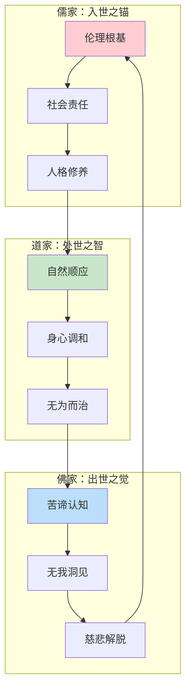
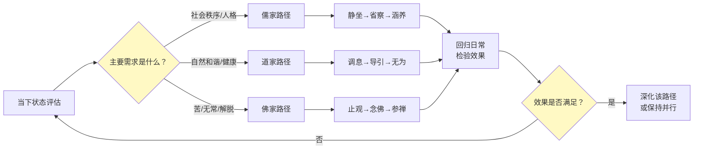
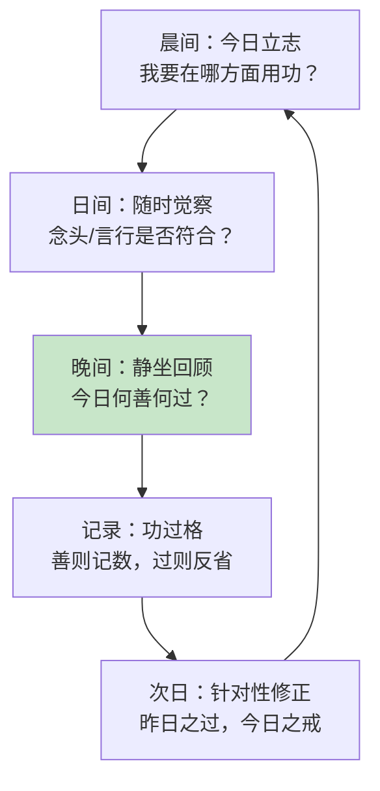
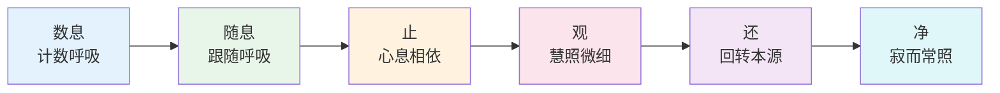
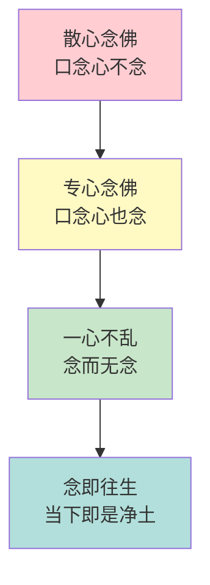
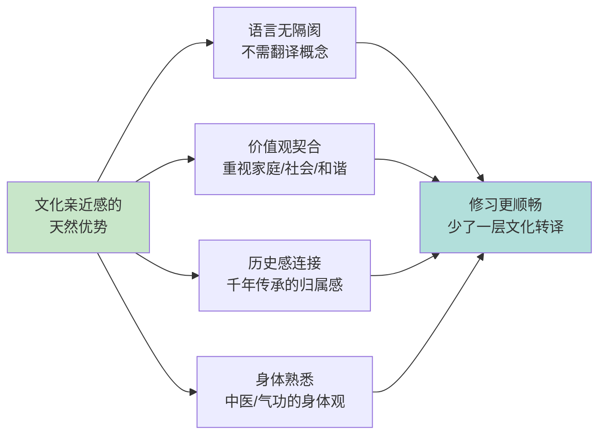

---

title: "中国本土冥想现代实践指南"
description: "中国本土冥想现代实践指南的详细解析与实践指南"
category: "心智与心理学 > 冥想 > Chinese Traditions"
tags: ["anxiety", "calligraphy"]
last_updated: "2026-05"
difficulty: "advanced"
reading_level: "advanced"
estimated_read_time: "10min"
intent_queries:
  - "什么是中国本土冥想现代实践指南"
  - "中国本土冥想现代实践指南的核心概念"
  - "中国本土冥想现代实践指南的方法与实践"
trigger_keywords: ["aging", "anxiety", "art", "assessment"]
cross_refs:
  - path: "README.md"
    relation: "anxiety/art_therapy/buddhism"
  - path: "01-Wisdom-Traditions/religions/buddhism/psychology/Buddhism_Mindfulness_Therapy_Integration.md"
    relation: "anxiety/buddhism/death"
  - path: "01-Wisdom-Traditions/religions/buddhism/vasana/Vasana_Clinical_Applications.md"
    relation: "aging/anxiety/buddhism"
  - path: "01-Wisdom-Traditions/religions/zen/Zen_Neuroscience_Psychology.md"
    relation: "anxiety/buddhism/death"
  - path: "04-Humanities-Arts/arts/ballet/Ballet_Therapy_Applications.md"
    relation: "aging/anxiety/art_therapy"

---
# 中国本土冥想现代实践指南

> 儒释道三家的当代修习路径——不是混合，而是根据需求选择

**最后更新：2026-05**

---

## 目录

1. [儒释道现代整合路径](#儒释道现代整合路径)
2. [儒家静坐四法门](#儒家静坐四法门)
3. [天台止观六妙门详解](#天台止观六妙门详解)
4. [净土念佛持名实操](#净土念佛持名实操)
5. [中国本土冥想与现代中国人的适配](#中国本土冥想与现代中国人的适配)
6. [参考资源](#参考资源)

---

## 儒释道现代整合路径

中国文化的深层结构中，儒释道三家并非割裂，而是构成了一个完整的精神生态系统。现代修行者不必强行"三教合一"，而是根据人生的不同阶段、不同需求，灵活选择对应的修习法门。

### 三家定位与功能对照

| 维度 | 儒家 | 道家 | 佛家 |
|-----|------|------|------|
| **核心关切** | 如何做一个好人 | 如何顺应自然 | 如何超越苦 |
| **人生阶段** | 青年-中年（建立期） | 中年（调适期） | 中年-晚年（超越期） |
| **主要功能** | 人格塑造、社会责任 | 压力调节、身心平衡 | 终极关怀、生死解脱 |
| **修习重心** | 省察、涵养、静坐 | 呼吸、导引、自然观 | 止观、念佛、参禅 |
| **现代适用** | 职业伦理、家庭教育 | 压力管理、健康管理 | 意义危机、死亡焦虑 |
| **代表经典** | 《大学》《中庸》 | 《道德经》《庄子》 | 《心经》《金刚经》 |

### 根据需求选择：非混合式修习

**不是混合，而是次第与情境选择：**

| 当下需求 | 对应传统 | 推荐法门 | 修习时长 |
|---------|---------|---------|---------|
| 感到人生无方向、缺乏价值感 | 儒家 | 省察功夫+立志 | 持续日常 |
| 工作压力极大、身心紧绷 | 道家 | 吐纳/站桩+自然冥想 | 每日20-40分钟 |
| 遭遇重大丧失、死亡焦虑 | 佛家 | 净土念佛/观无常 | 每日定课 |
| 人际关系冲突、情绪失控 | 儒家 | 克己复礼/涵养 | 冲突前后即时修习 |
| 寻求终极答案、生命意义 | 佛家 | 止观/参禅 | 每日1-2小时 |
| 想要健康长寿、延缓衰老 | 道家 | 内丹/导引/睡功 | 每日早晚 |

---

## 儒家静坐四法门

儒家并非没有冥想传统。从孔子的"默而识之"到宋明理学的"半日静坐，半日读书"，儒家发展出了一套以"心性修养"为核心的静坐体系。

### 四法门概览

| 法门 | 核心操作 | 目标 | 经典依据 |
|-----|---------|------|---------|
| **静坐** | 每日定时静坐，调息静心 | 收敛身心、复性 | 程颢《定性书》、朱熹《调息箴》 |
| **读书** | 诵读经典，与圣贤心印相合 | 变化气质、明理 | 朱熹读书法、王阳明《传习录》 |
| **省察** | 每日回顾言行，检讨起心动念 | 诚意正心、去私欲 | 曾子"三省吾身"、王阳明"省察克治" |
| **涵养** | 在日常事上保持戒惧慎独 | 动静一如、主敬 | 程颐"主敬"、朱熹"持敬" |

### 法门一：静坐

**操作步骤：**

1. **时间：** 清晨最佳（借鉴佛道晨修传统），或睡前。初学者从15分钟开始，逐步增至30-45分钟。
2. **姿势：** 可散盘、单盘，或端坐椅上。儒家不要求双盘，强调"端坐"即可。
3. **调身：** 脊柱正直，两肩平展，双手交叠放于腹前或膝上。
4. **调息：** 不刻意控制呼吸，只是观察。朱熹《调息箴》云："静极而嘘，如春沼鱼；动极而翕，如百虫蛰。"
5. **调心：** 不刻意断念，但念起即觉，觉即不随。重点在"收敛此心"，使其不放逐于外。

**儒家静坐 vs 佛家禅定的区别：**

| 维度 | 儒家静坐 | 佛家禅定 |
|-----|---------|---------|
| 目的 | 收敛身心、为省察涵养打基础 | 开发定力、导向解脱 |
| 对念头的态度 | 觉而不随，回归正念 | 深入观察无常无我 |
| 终极指向 | 修身齐家治国平天下 | 涅槃解脱 |
| 对境的运用 | 静坐后投入世事 | 座上观慧，座下行持 |

### 法门二：读书

儒家的"读书"不是信息获取，而是一种冥想性的心印传承。

**冥想念书法：**

1. **选经：** 选择一部核心经典，如《大学》《中庸》《论语》某章。
2. **缓读：** 一字一句，缓慢诵读，不急求理解。
3. **默识：** 读到触动处，停下来，让这句话在心中回荡。
4. **心印：** 问自己："圣贤说此句时，心是何状态？"尝试与之"心印"。
5. **体证：** 当日生活中，寻找应用这句话的机会。

| 经典 | 每日建议读诵量 | 冥想焦点 |
|-----|--------------|---------|
| 《大学》 | 一章 | "明明德"——那个能明的本身是什么？ |
| 《中庸》 | 一章 | "天命之谓性"——当下体验这个"性" |
| 《论语》 | 数则 | 孔子的"仁"在具体情境中如何呈现？ |
| 《传习录》 | 一则 | 王阳明的"致良知"如何在当下发动？ |

### 法门三：省察

省察是儒家最具特色的冥想方法，将反思提升到了系统化、日常化的修行层面。

**日间省察法（参照《了凡四训》与阳明学）：**

**省察的操作细节：**

| 时段 | 操作 | 问题示例 |
|-----|------|---------|
| 晨起 | 三省预检 | "今日最可能在何处失念？" |
| 事前 | 动机审查 | "我做此事，真正动机是什么？" |
| 事中 | 当下觉察 | "此刻我的心是公还是私？" |
| 事后 | 效果反思 | "此事结果如何？是否有更好的处理方式？" |
| 夜间 | 全面回顾 | "今日有过什么不善的念头？" |

### 法门四：涵养

涵养是儒家的"日常冥想"——不是固定时段的修习，而是将警觉性融入每一刻。

**程颐"主敬"法的现代应用：**

- **对事敬：** 无论大事小事，全身心投入，不敷衍。
- **对人敬：** 与他人互动时，心中保持尊重，不轻慢。
- **对己敬：** 不纵容自己的惰性、私欲，保持自律。
- **对天地敬：** 感知自身与天地万物的关联，常怀敬畏。

**"慎独"的冥想维度：**

| 层面 | 含义 | 修习要点 |
|-----|------|---------|
| 独处时 | 无人看见也保持端正 | 将独处视为"天在看"的觉知 |
| 独知处 | 只有自己知道的起心动念 | 在念头的最微深处保持觉知 |
| 独一无二 | 感知此心即天地之心 | 在平凡中体验与天地合 |

---

## 天台止观六妙门详解

天台宗的"六妙门"（数息、随息、止、观、还、净）是一套由浅入深、次第分明的禅定体系，被誉为"最系统的禅修入门法"。

### 六门修习总表

| 门次 | 名称 | 核心操作 | 所对治 | 过渡条件 |
|-----|------|---------|--------|---------|
| 第一 | 数息 | 一呼一吸数"一"，至十循环 | 散乱心 | 数至十无忘无错，心不急躁 |
| 第二 | 随息 | 不数，只觉知呼吸出入 | 昏沉+微细散乱 | 觉知清晰，呼吸自然微细 |
| 第三 | 止 | 心息相依，止于一处 | 浮心（心浮气躁） | 心能安住，不随内外境转 |
| 第四 | 观 | 以慧照察身心实相 | 昏沉+暗昧 | 定心稳固，不生喜乐贪着 |
| 第五 | 还 | 反观能观之心，回转本源 | 能所对立 | 知能观之心亦空 |
| 第六 | 净 | 寂而常照，照而常寂 | 最后一分微细执着 | 无证无修，本来清净 |

### 第一门：数息

**详细操作：**

1. **坐姿：** 单盘、双盘或散盘，脊柱正直，双手结定印。
2. **调息：** 先深呼吸三次，然后让呼吸自然进行，不刻意控制。
3. **计数：**
   - 呼气时数"一"，吸气不管；
   - 再呼气数"二"……直到"十"；
   - 然后回到"一"，循环。
4. **处理忘失：** 如果数到一半忘了数到几，或者超过十，说明心已散乱，从头再数。
5. **处理急躁：** 如果急于数到十，说明心浮躁，应将速度放慢。

**常见问题与处理：**

| 问题 | 表现 | 处理方式 |
|-----|------|---------|
| 散乱 | 数着数着想起他事 | 温和地将注意力拉回，从头数 |
| 昏沉 | 数着数着想睡 | 睁眼、坐直、加快计数速度 |
| 急躁 | 急于数完十 | 刻意放慢，每一呼气都充分觉知 |
| 窒息感 | 为了数而控制呼吸 | 放下控制，让呼吸自然 |

**过渡信号：** 能够连续数到十，心不急躁、不昏沉、不散乱，数息变成一种轻松的背景活动。此时可转入随息。

### 第二门：随息

**详细操作：**

1. **放下计数：** 不再数数字，只是单纯地觉知呼吸。
2. **出入皆知：** 知道呼气，知道吸气，知道呼气与吸气之间的间隙。
3. **不干预：** 不控制呼吸的长短、深浅，只是"知道"它正在发生。
4. **扩展觉知：** 可以觉知鼻孔处呼吸的触感，或腹部起伏，或全身随呼吸的微妙律动。

**数息与随息对比：**

| 维度 | 数息 | 随息 |
|-----|------|------|
| 注意力锚点 | 数字+呼吸 | 纯呼吸 |
| 心的状态 | 较活跃（有计数活动） | 较安静 |
| 适合时段 | 心特别散乱时 | 心已稍安静时 |
| 常见陷阱 | 变成机械数数 | 失去觉知，变成发呆 |

**过渡信号：** 呼吸自然变得微细，甚至似乎"停止"（其实是变得太微细而感觉不到），心非常安静。此时可转入止。

### 第三门：止

**详细操作：**

1. **心息相依：** 此时不再刻意觉知呼吸，而是让心自然地"停"在一个稳定的点上。
2. **止点选择：** 可以选在鼻尖、眉间、丹田，或心轮。天台宗传统上多选在脐下或鼻端。
3. **不寻不伺：** 不主动寻找什么，也不分析什么，只是保持一种"在"的状态。
4. **持续时间：** 初期可能只能维持很短时间，逐渐延长。

**止的层次：**

| 层次 | 名称 | 特征 |
|-----|------|------|
| 初步 | 系缘止 | 心系于一处，但需努力维持 |
| 中级 | 制心止 | 心已较听话，不需太多努力 |
| 高级 | 体真止 | 知一切法空，心自然不随境转 |

**过渡信号：** 能够稳定地安住在止的状态，不再被明显的散乱和昏沉打扰。此时若发起观察，则转入观。

### 第四门：观

**详细操作：**

1. **在定心中观察：** 利用第三门建立的定力，开始观察身心现象。
2. **观察内容：**
   - 身体：观察身体的感觉、姿势、呼吸的变化
   - 感受：观察苦、乐、不苦不乐的感受生灭
   - 心念：观察念头的来去
   - 法：观察无常、无我、苦的真理
3. **智慧照明：** 不只是"看"，而是带着"无常""无我"的洞见来看。

**观与观的区别：**

| 类型 | 名称 | 核心 |
|-----|------|------|
| 第一观 | 对治观 | 针对具体烦恼观对治法 |
| 第二观 | 正观 | 观无常无我，开发慧解 |
| 第三观 | 境观 | 观十二因缘、四谛等法境 |

### 第五门：还

**详细操作：**

1. **反观能观：** 在前面的观中，有一个"我在观"的感觉。现在反过来观察这个"能观"本身。
2. **追问：** "谁在观？""能观之心在哪里？""它是什么性质？"
3. **发现：** 找不到一个实体的"观者"，只有觉知本身。
4. **回转本源：** 觉知回到觉知，能所双亡。

### 第六门：净

**境界描述：**

- 不再有需要对治的烦恼
- 不再有需要修证的功德
- 寂而常照，照而常寂
- 烦恼即菩提，生死即涅槃

**重要提醒：** 六妙门是修行次第，但也不可执着于次第。有人可能顿悟第六门，再回头修前五门作为助行。初学者应以次第为主，老实修行。

---

## 净土念佛持名实操

净土宗的持名念佛，是汉传佛教流传最广、最接地气的修行法门。它不强调复杂的理论，而是以"信愿行"为核心，通过不断称念"南无阿弥陀佛"，往生西方极乐世界。

### 念佛层次进阶

### 从散念到定课

**初学者的每日安排：**

| 时段 | 内容 | 时长 | 要点 |
|-----|------|------|------|
| 晨起 | 称念十声佛号+发愿 | 5分钟 | 不求多，但求日日不断 |
| 日间 | 散念（行住坐卧间默念） | 累计30分钟 | 利用碎片时间，不必计数 |
| 晚间 | 定课（固定时间、地点、数量） | 30分钟 | 可以计数，如念珠108遍 |
| 睡前 | 回向+十念法 | 5分钟 | 即使只念十声，也算完成 |

**定课的建立：**

1. **固定时间：** 选择一天中精神最好的时段。晨起最佳（称"晨朝十念"）。
2. **固定地点：** 设立简单的佛堂或净室，减少干扰。
3. **固定数量：** 初学者可以从"佛号108声"开始，逐步增至300声、500声、1000声。
4. **记录追踪：** 用念佛计数表或APP记录，培养持续感。

### 十念法

十念法是印光大师提倡的简易法门，特别适合忙碌的现代人。

**操作：**

1. 晨起洗漱后，面朝西方（象征净土方向）。
2. 合掌，深呼吸三次，静心。
3. 一口气念"南无阿弥陀佛"，尽一口气为一念。
4. 共念十口气，即十念。
5. 回向："愿生西方净土中，九品莲花为父母……"

| 十念法的变体 | 适用情境 | 操作要点 |
|------------|---------|---------|
| 晨朝十念 | 每日晨起 | 如上述标准操作 |
| 睡前十念 | 临睡时 | 作为一天的总结，带着佛号入睡 |
| 紧急十念 | 遇突发恐惧/危险时 | 立即念佛，不求完整仪式，急呼佛号 |
| 呼吸十念 | 配合呼吸 | 吸气时默念"南无"，呼气默念"阿弥陀佛" |

### 追顶念

追顶念是一种高强度的念佛方法，通过快速、连续的佛号，以"德追顶"之势压倒杂念。

**操作：**

1. 以较快的速度连续称念"南无阿弥陀佛"，中间几乎不停顿。
2. 声音可大可小，但要求字字分明。
3. 一口气接一口气地念，不给杂念留空间。
4. 适合心绪极度混乱、杂念纷飞时使用。

**注意事项：**

| 方面 | 建议 |
|-----|------|
| 时间 | 每次不超过30分钟，以免耗气 |
| 身体状态 | 身体较弱者不宜过长 |
| 声音 | 可以金刚念（大声）、小声或默念 |
| 后续 | 追顶念后应转入较和的念诵，安定身心 |

### 念佛与日常的结合

| 日常活动 | 念佛融入方式 |
|---------|------------|
| 通勤 | 地铁/公交上默念或轻声念 |
| 排队 | 等待时自然念佛 |
| 家务 | 边做家务边听佛号或自念 |
| 散步 | 配合步伐节奏念佛 |
| 睡前 | 躺卧时默念，直到入睡 |
| 醒来 | 睁眼第一念即是佛号 |

---

## 中国本土冥想与现代中国人的适配

对于当代中国人而言，选择中国本土的冥想传统有着独特的优势和需要注意的陷阱。

### 文化亲近感的利用

**具体优势：**

| 优势领域 | 说明 | 实践建议 |
|---------|------|---------|
| **概念理解** | "心""性""气""神"等概念在中文语境中天然存在 | 不需要学习梵文、巴利文或藏文术语 |
| **伦理基础** | 儒家的孝悌、诚信与佛法不冲突，反而为修行打好人格基础 | 不要割裂修行与日常伦理 |
| **身体技术** | 道家的导引、站桩、内丹与佛家的禅修可以互补 | 初学者可从道家身法入手，再入佛家的慧观 |
| **社群资源** | 中国各地寺院、道观数量众多，方便参学 | 利用假日参加寺院禅修、打七 |
| **文化节日** | 春节、清明、中秋等传统节日蕴含修行契机 | 在这些时刻做特别修习，如除夕夜通宵念佛 |

### 避免"外来和尚"心态

**"外来和尚好念经"的表现：**

| 表现 | 心理机制 | 对治 |
|-----|---------|------|
| 认为藏传佛教一定比汉传佛教高深 | 稀缺性偏见+神秘化 | 深入了解汉传天台、华严、禅宗的深度 |
| 觉得印度传来的佛法比中国本土更"纯正" | 源头崇拜 | 认识中国祖师的发展与超越 |
| 追捧外国老师，忽视本土善知识 | 崇洋心理 | 发掘当代中国优秀的僧俗导师 |
| 认为儒家道家"不够究竟" | 宗教等级化思维 | 认识到三家的不同功能，非层级关系 |

**平衡的态度：**

- 尊重所有传统的价值，不进行比较级的评判
- 根据自己的根器和因缘选择，而非根据"哪种最高"
- 中国本土传统经过两千年的消化改造，已深契中国人的心灵结构

### 现代调适建议

| 传统元素 | 现代挑战 | 调适方案 |
|---------|---------|---------|
| 长时打坐 | 久坐导致的腰椎/膝盖问题 | 结合道家导引、现代瑜伽热身；使用坐垫保护 |
| 寺院生活 | 无法长期离开工作和家庭 | 周末禅修、七日闭关、居家定课 |
| 素食要求 | 家庭/社交聚餐的压力 | 以"心素"为主，形式随缘；不因此产生冲突 |
| 晨钟暮鼓 | 城市生活的噪音限制 | 使用耳机聆听法器声音；或改用心念 |
| 师徒关系 | 难以找到具德上师 | 以经典为师、以同行者为伴、以戒为师 |
| 经忏佛事 | 现代人不理解其意义 | 学习背后的原理，不盲从也不轻慢 |

### 面向不同人群的入门建议

| 人群 | 推荐入手 | 原因 |
|-----|---------|------|
| 企业高管 | 儒家静坐+省察 | 与领导力、决策力直接相关 |
| IT从业者 | 数息法+念佛 | 逻辑性强的人适合有明确步骤的方法 |
| 退休人员 | 念佛+道家导引 | 时间充裕，可深入；关注健康长寿 |
| 大学生 | 禅宗公案+我是谁探究 | 思维活跃，适合参究 |
| 心理咨询师 | 天台止观+内观 | 与专业工作可互相滋养 |
| 艺术家 | 道家自然观+禅意 | 与创作直觉相通 |

---

## 参考资源

### 核心经典

| 书名 | 作者/编者 | 所属传统 | 阅读建议 |
|-----|----------|---------|---------|
| 《童蒙止观》 | 智顗（隋代） | 天台宗 | 六妙门最系统的入门书 |
| 《六妙法门》 | 智顗 | 天台宗 | 专讲六妙门的短篇 |
| 《传习录》 | 王阳明 | 儒家心学 | 儒家静坐与省察的巅峰 |
| 《近思录》 | 朱熹/吕祖谦 | 宋明理学 | 儒家修养的全面纲领 |
| 《道德经》 | 老子 | 道家 | 每日一章，冥想式阅读 |
| 《太乙金华宗旨》 | 吕洞宾（传） | 道家内丹 | 道家冥想的实操指南 |
| 《印光法师文钞》 | 印光 | 净土宗 | 念佛修行的权威指导 |
| 《禅宗无门关》 | 无门慧开 | 禅宗 | 公案参究的入门 |

### 当代中国导师

| 导师 | 传承/风格 | 特色 | 接触方式 |
|-----|----------|------|---------|
| 净慧长老（已圆寂） | 生活禅 | 将禅融入日常生活 | 著作、柏林禅寺传承 |
| 济群法师 | 唯识/戒律 | 系统性强，适合现代人 | 书院课程、著作 |
| 明海法师 | 生活禅 | 年轻、亲和、善用新媒体 | 柏林禅寺、网络开示 |
| 陈履安 | 藏传/儒家 | 科学与修行结合 | 讲座、课程 |

### 本系列相关文档

- [中国冥想传统概述](../INDEX.md)
- [道家冥想](../taoist-meditation/)
- [禅修基础](../zazen/)
- [正念减压](../mbsr-program/)

---

> **结语：** 中国本土的冥想传统，是两千多年来无数先贤用生命验证过的智慧路径。对于当代中国人，这些传统不是故纸堆里的古董，而是可以当下启用的活水源泉。儒家的诚敬、道家的自然、佛家的解脱——三家如三扇门，通向同一个觉醒的殿堂。愿你找到属于自己的那扇门，或三扇门自由出入。

---

*文档属于 Peace Lab 冥想知识库。如引用请保留出处。*
