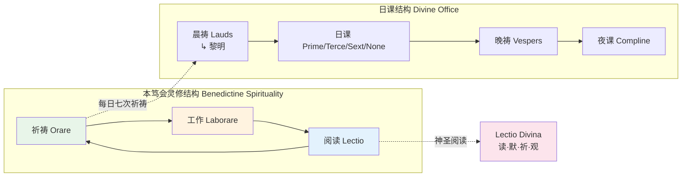
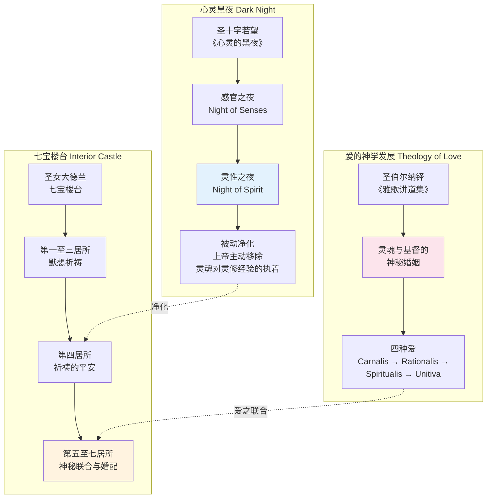
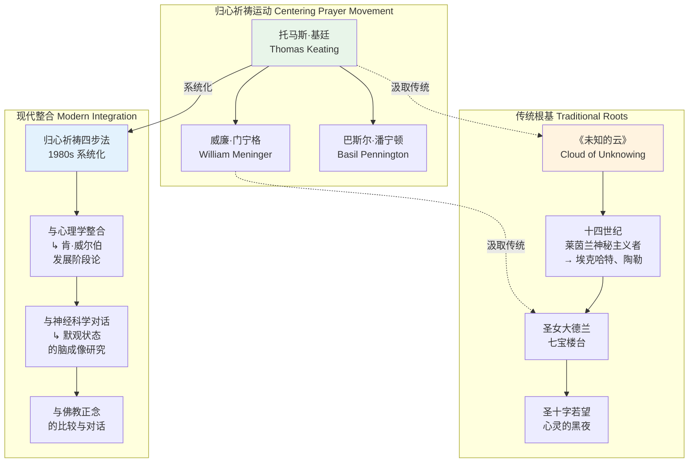
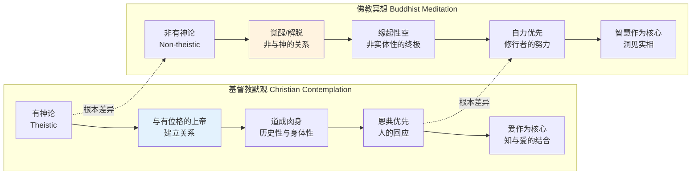
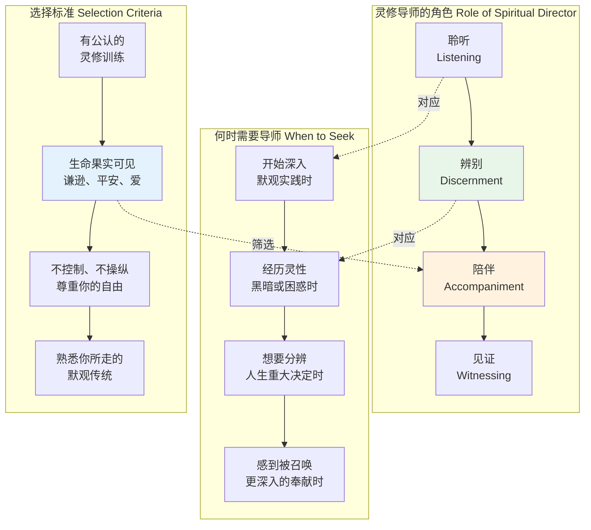

---

title: "基督教默观/冥想专业概述"
description: "基督教默观/冥想专业概述的详细解析与实践指南"
category: "心智与心理学 > 冥想 > Christian Contemplative"
tags: ["anxiety", "brain", "cardiovascular"]
last_updated: "2026-05"
difficulty: "advanced"
reading_level: "advanced"
estimated_read_time: "15min"
intent_queries:
  - "什么是基督教默观/冥想专业概述"
  - "基督教默观/冥想专业概述的核心概念"
  - "基督教默观/冥想专业概述的方法与实践"
trigger_keywords: ["基督教默观", "冥想专业概述", "act", "anxiety", "assessment", "body"]
cross_refs:
  - path: "01-Wisdom-Traditions/religions/zen/Zen_Monastic_Rituals.md"
    relation: "anxiety/buddhism/cardiovascular"
  - path: "01-Wisdom-Traditions/religions/zen/Zen_Practice_Methodology.md"
    relation: "anxiety/buddhism/cardiovascular"
  - path: "03-Bio-Science/death/Death_Meditation_Practices.md"
    relation: "anxiety/buddhism/cardiovascular"
  - path: "README.md"
    relation: "anxiety/buddhism/cardiovascular"
  - path: "01-Wisdom-Traditions/INDEX.md"
    relation: "buddhism/cardiovascular/meditation"

---
# 基督教默观/冥想专业概述

> **适用对象**：对基督教灵修传统感兴趣的冥想练习者、神学研究者、跨宗教对话参与者、心理健康从业者
> **阅读时长**：约 50–60 分钟（可分段阅读）
> **实践建议**：配合正文中的阶段性练习，分 4–6 次完成，每次 15–20 分钟
> **最后更新**：2026-05

---

## 一、历史渊源：从沙漠到现代

### 1.1 早期沙漠教父与教母（3–5 世纪）

基督教默观传统的根基深植于埃及、叙利亚和巴勒斯坦的沙漠。公元 3 世纪，一批基督徒为了逃离日益世俗化的城市教会生活，退隐至沙漠，寻求与上帝的直接相遇。他们被称为**沙漠教父/母**（Desert Fathers/Mothers）。

```mermaid
graph TD
    subgraph 沙漠传统起源 Desert Tradition Origins
        D1[安东尼大帝<br/>St. Anthony the Great<br/>↳ 约251-356年] --> D1D[退隐埃及沙漠<br/>与诱惑搏斗<br/>"心之战"的先驱]
        D2[艾瓦格利乌斯<br/>Evagrius Ponticus<br/>↳ 345-399年] --> D2D[系统整理八邪念<br/>Eight Logismoi<br/>→ 后来发展为七宗罪]
        D3[亚姆una的玛喀里<br/>Macarius of Egypt<br/>↳ 约300-391年] --> D3D[论心灵的纯净<br/>心作为上帝临在之所]
        D4[叙利亚的艾弗冷<br/>Ephrem the Syrian<br/>↳ 约306-373年] --> D4D[诗性神学<br/>以诗歌默观创造]
        D5[沙漠教母们<br/>Amma Syncletica<br/>Sarah, Theodora] --> D5D[女性灵修声音<br/>《沙漠教母语录》]
    end

    D2D -->|直接影响| M1[约翰·卡西安<br/>John Cassian<br/>↳ 360-435年]
    D3D -->|直接影响| M1
    M1 --> M1D[将沙漠传统传入西方<br/>《会谈录》Conferences<br/>→ 本笃会灵修基础]

    style D1 fill:#e3f2fd
    style D2 fill:#fff3e0
    style D5 fill:#fce4ec
    style M1 fill:#e8f5e9
```

**核心贡献**：

| 人物 | 核心教导 | 对后世的影响 |
|-----|---------|------------|
| **安东尼** St. Anthony | 心是属灵争战的战场；通过**警醒**（Nepsis, νῆψις）和**默念**守护心灵 | 为整个基督教灵修奠定了"心之战"的框架 |
| **艾瓦格利乌斯** Evagrius | 系统提出**八邪念**（贪食、淫欲、贪财、忧愁、愤怒、懈怠、虚荣、骄傲），主张以**静观**（Theoria, θεωρία）超越思想 | 其思想经伪狄奥尼修斯伪托，深刻影响中世纪神秘主义 |
| **玛喀里** Macarius | 强调**心**（Kardia, καρδία）作为圣灵临在的殿；心灵是可以被圣火净化的 | 为后来的"归心祈祷"提供了神学根基 |
| **卡西安** Cassian | 将沙漠传统系统化为**八重思想**（Eight Thoughts），提出**不间断祈祷**（Unceasing Prayer）的实践 | 直接影响本笃会会规，成为西方修道传统的基石 |

### 1.2 本笃会传统（6 世纪）

圣本笃（St. Benedict of Nursia, 约 480–547 年）撰写了《会规》（*Regula Sancti Benedicti*），将沙漠传统转化为西方修道生活的制度化框架。



**本笃会核心原则**：

- ***Ora et Labora***（祈祷与工作）：灵性成长不是逃离日常生活，而是在规律的节奏中培养对上帝的觉知
- **稳定性**（Stabilitas）：修士对地点、团体和灵修承诺的坚守，反对灵性上的"流浪"
- **服从**（Oboedientia）：不是盲目的屈从，而是在信任中放下自我意志，为圣灵的引导腾出空间
- **Lectio Divina** 的系统化：将神圣阅读确立为修道生活的核心实践，从"读"逐步深入至"观"

### 1.3 12 世纪熙笃会改革与爱的神学

熙笃会（Cistercian Order）由圣罗贝尔（St. Robert of Molesme）于 1098 年创立，旨在回归本笃会原初的简朴与严格。两位熙笃会神秘主义者深刻重塑了基督教默观传统：

| 人物 | 年代 | 核心贡献 |
|-----|------|---------|
| **圣伯尔纳铎** St. Bernard of Clairvaux | 1090–1153 | 将**雅歌**（Song of Songs）解释为灵魂与基督之间的神秘之爱的对话；发展出"**爱的知识**"（Scientia Amoris）——爱本身就是认识上帝的方式 |
| **圣方济各·撒肋爵** St. Francis de Sales | 1567–1622 | 《虔修生活的入门》（*Introduction to the Devout Life*）将修道院灵修带入平信徒生活 |
| **圣十字若望** St. John of the Cross | 1542–1591 | 与圣女大德兰共同改革加尔默罗会；《心灵的黑夜》（*Dark Night of the Soul*）系统阐述了默观进阶中的净化阶段 |
| **圣女大德兰** St. Teresa of Ávila | 1515–1582 | 《七宝楼台》（*Interior Castle*）将心灵描述为一座七层的城堡，最内层是与神联合之所 |



### 1.4 14 世纪《未知的云》与非象征之道

《未知的云》（*The Cloud of Unknowing*）是一部匿名著作（约 1370 年代），代表了英语世界基督教神秘主义的巅峰。

**核心教导**：

- **"不知之云"**（Cloud of Unknowing）：在上帝与人之间存在着一片"云"——人的理解力无法穿透它。只有通过**爱**（Love）才能穿透这片云，而非知识。
- **"爱之刺击"**（Dart of Love）：以一种"简短而隐秘的祈祷"——如一句词语或短语——持续穿透云层，直达上帝。
- **否定之道**（Via Negativa）：强调对一切概念、形象甚至神圣概念的放下，在"赤裸的觉知"中与上帝相遇。
- **个体化教导**：作者明确指出，此书是为那些"被上帝召唤进入此道"的人而写，不是给普通大众的入门书——体现了基督教默观的**精英性**与**恩典性**。

| 概念 | 原文表述 | 现代理解 |
|-----|---------|---------|
| **Cloud of Unknowing** | "A cloud of unknowing between you and God" | 理性认知的极限；超越概念和语言的上帝临在 |
| **Cloud of Forgetting** | "A cloud of forgetting beneath you" | 放下一切受造物的执着，包括自己的灵修成就 |
| **One little word** | "One little word with one syllable" | 简化祈祷——如"神"、"爱"、"主"——作为锚点 |
| **Naked intent** | "Naked intent directed to God" | 剥离一切形象、概念和情感需求的纯粹意向 |

### 1.5 16 世纪依纳爵·罗耀拉与《神操》

依纳爵·罗耀拉（St. Ignatius of Loyola, 1491–1556）是耶稣会（Society of Jesus）的创始人。他的《神操》（*Spiritual Exercises*）是一套为期 30 天的系统灵修 retreat，深刻影响了基督教的默观传统。

```mermaid
graph LR
    subgraph 神操四期结构 Four Weeks of Exercises
        W1[第一周<br/>罪恶与怜悯<br/>↳ 认识罪 → 悔改 →<br/>上帝的慈爱接纳] --> W2[第二周<br/>基督生平<br/>↳ 默观基督的<br/>诞生、事工、受难]
        W2 --> W3[第三周<br/>受难与死亡<br/>↳ 深入默观<br/>基督的苦难]
        W3 --> W4[第四周<br/>复活与喜悦<br/>↳ 与复活的基督<br/>相遇 → 爱的回应]
    end

    subgraph 核心方法 Core Methods
        M1[想像式默观<br/>Imaginative Contemplation] --> M1D[以想像进入<br/>圣经场景]<br/>调动五感
        M2[分辨神类<br/>Discernment of Spirits] --> M2D[分辨内心<br/>推动的来源]<br/>安慰 vs 不安
        M3[对观默想<br/>Application of Senses] --> M3D[用五种感官<br/>体验神圣场景]
    end

    W2 -.->|主要方法| M1
    W2 -.->|主要方法| M3
    W1 -.->|主要方法| M2

    style W2 fill:#e8f5e9
    style W4 fill:#fff3e0
    style M1 fill:#e3f2fd
    style M2 fill:#fce4ec
```

**想像式默观**（Imaginative Contemplation）的独特性：

这是基督教传统中最具特色的默观方法之一。练习者被要求以想像力"进入"圣经场景——例如耶稣平息风浪的故事——不是作为旁观者，而是作为场景中的一员。

1. **视觉化**：看到场景的颜色、光线、人物表情
2. **听觉化**：听到风声、浪声、人群的嘈杂、耶稣的声音
3. **触觉与动觉**：感受船身的摇晃、水花的温度
4. **情感回应**：观察内心对场景的情感反应
5. **对话**：与耶稣或场景中的人物进行内在对话
6. **整合**：将场景的意义带入当下生活

这种方法强调**个人与基督的关系性相遇**，而非抽象的神学理解。它既是认知的，也是情感的，更是身体的。

### 1.6 20 世纪：托马斯·默顿与归心祈祷运动

20 世纪见证了基督教默观传统的重要复兴，其中两位托马斯尤为关键：

| 人物 | 年代 | 核心贡献 |
|-----|------|---------|
| **托马斯·默顿** Thomas Merton, OCSO | 1915–1968 | 特拉比斯特隐修士；著作《七重山》（*The Seven Storey Mountain*）使隐修生活进入主流文化；与东方宗教（佛教禅宗、道教）展开深度对话；提出"**在人性深处与上帝相遇**"的普世默观观 |
| **托马斯·基廷** Thomas Keating, OCSO | 1923–2018 | 共同创立"**归心祈祷**"（Centering Prayer）运动；将传统基督教默观传统（《未知的云》、14 世纪莱茵兰神秘主义者）现代化、平民化 |



**托马斯·默顿的跨宗教对话**：

默顿在 1968 年意外去世前不久，在亚洲与藏传佛教上师、禅宗大师和印度教圣人进行了深度交流。他特别被藏传佛教的大圆满（Dzogchen）和禅宗的顿悟思想所吸引，但始终坚持**基督信仰的独特性**——他不是在寻找一种"普世宗教"，而是在探索"**在各自传统深处相遇**"的可能性。

他的核心洞见是：**默观不是任何宗教的专利，而是人类心灵的根本能力；但默观的内容（即与谁相遇、在谁的临在中安息）由各自的信仰传统所决定**。

---

## 二、核心神学框架

### 2.1 上帝临在：无所不在与特别临在

基督教默观的神学根基首先建立在**上帝的临在**（Divine Presence）之上。但这并非简单的"上帝无处不在"，而是有着精微的神学区分：

```mermaid
graph TD
    subgraph 临在的层次 Presence Dimensions
        P1[本体临在<br/>Ontological Presence<br/>↳ 上帝在一切存在中<br/>维持万有存在] --> P2[恩典临在<br/>Grace Presence<br/>↳ 圣灵内住于<br/>信者心灵]
        P2 --> P3[圣事临在<br/>Sacramental Presence<br/>↳ 基督真实临在<br/>于圣体圣血]
        P3 --> P4[神秘临在<br/>Mystical Presence<br/>↳ 在默观中<br/>直接的、非概念的<br/>亲密相遇]
    end

    subgraph 默观的回应 Contemplative Response
        R1[意识觉察<br/>意识到上帝的临在] --> R2[意志降服<br/>放下抗拒]
        R2 --> R3[爱的注视<br/>Gaze of Love<br/>→ 不占有、不分析的<br/>纯粹关注]
        R3 --> R4[神秘联合<br/>Unio Mystica<br/>→ "我活，但非我活」<br/>乃是基督在我内活"]
    end

    P4 -.->|默观目标| R4
    P2 -.->|日常根基| R1

    style P4 fill:#e8f5e9
    style R4 fill:#fff3e0
```

### 2.2 道成肉身：身体性与关系性

基督教默观与东方冥想的一个根本差异在于**道成肉身**（Incarnation）的神学。在基督教看来，上帝不是在人的"超越"中被找到的，而是在**具体的历史性、身体性和关系性**中。

| 维度 | 基督教观点 | 对比（以佛教为例） |
|-----|----------|------------------|
| **身体的地位** | 身体是圣灵的殿；道成了肉身；身体性经验是神圣相遇的通道 | 身体是苦的根源之一；最终目标是超越色身的限制 |
| **历史的地位** | 救赎发生在具体历史中（基督的生平、死亡、复活）；圣经叙事是默观的素材 | 历史是轮回的显现，本质是苦；核心关注是当下觉知的转化 |
| **关系的地位** | 默观是"我-你"（I-Thou）的相遇；上帝是有位格（Person）的 | 终极实相是非二元的（Advaya）；没有永恒的"自我"与"他者" |
| **受造物的地位** | 受造物是"上帝的另一本书"（ Liber Naturae ）；自然可以启示上帝 | 受造物是缘起性空；不执着于任何现象为终极 |

### 2.3 圣灵内住：默观的主动因

基督教传统强调，**真正的默观不是人努力的产物，而是圣灵的工作**。人可以"准备"自己（通过祈祷、净化、顺服），但默观的经验本身是"** gratis **"（白白的恩赐）。

```mermaid
graph TD
    subgraph 圣灵的默观工作 Holy Spirit in Contemplation
        S1[圣灵作为默观的<br/>主动者] --> S2[光照 Illumination<br/>↳ 使人认识真理]
        S2 --> S3[联合 Union<br/>↳ 使信徒与基督联合]
        S3 --> S4[成圣 Sanctification<br/>↳ 转化整个生命]
    end

    subgraph 人的回应 Human Response
        H1[准备 Preparation<br/>↳ 净化、祈祷、顺服] --> H2[配合 Cooperation<br/>↳ "与圣灵同工"]
        H2 --> H3[放下 Surrender<br/>↳ "非我活，<br/>乃是基督在我内活"]
        H3 --> H4[果实 Fruit<br/>↳ 仁爱、喜乐、<br/>和平、忍耐等]
    end

    S1 -.->|恩宠| H1
    H3 -.->|降服| S3
    S4 -.->|结出| H4

    style S1 fill:#e3f2fd
    style S3 fill:#e8f5e9
    style H3 fill:#fff3e0
    style H4 fill:#fce4ec
```

### 2.4 Unio Mystica：神秘联合

**Unio Mystica**（拉丁文：神秘联合）是基督教神秘主义的核心目标。它不是形而上学的同一（即人变成上帝），而是**意志与爱的最深合一**，在保持个体性的同时，与神圣意志完全和谐。

圣女大德兰在《七宝楼台》第七居所中描述这种联合：

> "灵魂与上帝结合得如此紧密，以至于她无法怀疑上帝在她内，她在上帝内。这不是视觉，不是味觉，不是触觉——而是比所有这些更真实、更确定。"

圣十字若望则用**婚配**（Spiritual Marriage）的意象来描述：

> "两个意志——上帝的意志和灵魂的意志——合而为一；只有一个意志，即上帝的意志。"

### 2.5 Apophatic vs Kataphatic 神学

这是基督教神学中两种关于"如何谈论上帝"的路径，也是两种默观风格的根基：

```mermaid
graph LR
    subgraph 肯定之道 Kataphatic<br/>Via Affirmativa
        K1[通过肯定<br/>言说上帝] --> K2[属性论<br/>上帝是善、是爱、是光]
        K2 --> K3[圣经叙事<br/>以形象和故事<br/>默观上帝]
        K3 --> K4[圣像与圣事<br/>可见的恩典载体]
        K4 --> K5[代表传统<br/>依纳爵式默观<br/>圣方济各·撒肋爵]
    end

    subgraph 否定之道 Apophatic<br/>Via Negativa
        A1[通过否定<br/>接近上帝] --> A2[超越一切属性<br/>"上帝超越善"]
        A2 --> A3[放下形象<br/>在赤裸的静默中]<br/>与上帝相遇
        A3 --> A4[超越认知<br/>在"不知"中知]
        A4 --> A5[代表传统<br/>《未知的云》<br/>伪狄奥尼修斯<br/>埃克哈特大师]
    end

    K5 -.->|互补| A5
    A1 -.->|并非对立| K1

    style K4 fill:#e3f2fd
    style A4 fill:#fff3e0
```

| 维度 | Kataphatic（肯定之道） | Apophatic（否定之道） |
|-----|----------------------|----------------------|
| **认识论** | 人可以经由受造物和启示，正面认识上帝 | 上帝超越一切人类概念；只能在"放下"中被"认识" |
| **默观方法** | 想像式默观、圣经默想、圣像凝视、感恩祈祷 | 归心祈祷、静默冥想、放下一切概念和形象 |
| **情感特质** | 热烈、丰富、充满意象和情感 | 宁静、朴素、"赤裸"、无求 |
| **适合阶段** | 默观初学者；需要形象和内容来聚焦 | 进阶练习者；能够在静默中安住 |
| **风险** | 执着于形象和经验，将手段误认为目的 | 可能陷入虚无或冷漠；需要神学框架防止偏差 |
| **代表人物** | 圣依纳爵、圣伯尔纳铎 | 伪狄奥尼修斯、埃克哈特、《未知的云》作者 |

**关键洞见**：这两种路径不是对立的，而是**互补的**。一个完整的基督教默观生命通常需要在两者之间往返——通过肯定之道建立与上帝的关系深度，通过否定之道放下对这些关系的执着，进入更深的自由。

---

## 三、主要冥想/默观传统

### 3.1 Lectio Divina：神圣阅读法

Lectio Divina（拉丁文：神圣阅读）是基督教最古老的默观实践之一，其系统化的四步法最早由 12 世纪熙笃会修士吉戈二世（Guigo II）在《默观者之梯》（*Ladder of Monks*）中明确提出。

```mermaid
graph LR
    subgraph Lectio Divina 四步法 Four Stages
        L1[Lectio 读<br/>↳ 缓慢朗读圣经<br/>"聆听"文字] --> L2[Meditatio 默<br/>↳ 咀嚼文字<br/>与之对话]
        L2 --> L3[Oratio 祈<br/>↳ 以文字为起点<br/>向上帝回应]
        L3 --> L4[Contemplatio 观<br/>↳ 静默安息于<br/>上帝的临在]
    end

    subgraph 进阶方向 Advanced Flow
        L4 -->|自然溢出| A1[Actio 行<br/>↳ 将默观所得<br/>转化为行动]
        A1 -->|回归| L1
    end

    subgraph 关键转变 Key Transitions
        T1[Lectio→Meditatio<br/>从"读"到"回应"] --> T2[Meditatio→Oratio<br/>从"思考"到"祈祷"]
        T2 --> T3[Oratio→Contemplatio<br/>从"说话"到"聆听"]
        T3 --> T4[Contemplatio→Actio<br/>从"接受"到"给予"]
    end

    L1 -.->|转变| T1
    L4 -.->|转变| T3

    style L1 fill:#e3f2fd
    style L2 fill:#fff3e0
    style L3 fill:#fce4ec
    style L4 fill:#e8f5e9
    style A1 fill:#c8e6c9
```

**四步详解**：

| 阶段 | 原文 | 核心动作 | 注意力焦点 | 常见误区 |
|-----|------|---------|----------|---------|
| **Lectio** | 读 | 缓慢朗读一段经文（通常 1–3 节），如同第一次听到 | 文字本身；让文字"进入"心灵 | 读太多、太快；把读经当作信息获取 |
| **Meditatio** | 默 | "咀嚼"（Ruminatio）文字——像反刍动物一样反复回味；与文字对话 | 文字在个人生命中的意义；触动心灵的词语 | 陷入智力分析；远离文字做自由联想 |
| **Oratio** | 祈 | 从默想自然涌出的回应——可以是感恩、祈求、赞美、甚至抱怨 | 与上帝的对话；真实的情感表达 | 形式化的祈祷；不真实的"属灵"语言 |
| **Contemplatio** | 观 | 在爱中静默安息；不再说话，只是"在"；上帝的临在成为全部 | 单纯的觉知；与上帝共在 | 试图"制造"经验；对静默感到焦虑 |

**实践建议**：初学者每次 20–30 分钟，选择短篇经文（如诗篇中的一节、福音书中的一段）。不必强求每次都到达"观"的阶段——有时在"默"中停留很久也是正常的。

### 3.2 Centering Prayer：归心祈祷

归心祈祷是 20 世纪下半叶由托马斯·基廷等人系统化的基督教默观方法，旨在将古代传统（尤其是《未知的云》）转化为现代人可操作的实践。

```mermaid
graph TD
    subgraph 归心祈祷四步法 Centering Prayer Method
        S1[选择圣言<br/>Sacred Word] --> S2[安定坐下<br/>闭眼放松]
        S2 --> S3[以圣言<br/>同意上帝临在<br/>与行动]
        S3 --> S4[回归圣言<br/>当分心时<br/>温和带回]
        S4 --> S5[结束<br/>保持静默<br/>数分钟]
    end

    subgraph 核心机制 Core Mechanism
        M1[同意 God's Consent] --> M2[放下思想<br/>不追随、不抗拒]
        M2 --> M3[超越思维<br/>进入心灵的<br/>"深层"]
        M3 --> M4[上帝在静默中<br/>主动工作]
    end

    S3 -.->|核心| M1
    S4 -.->|操作| M2
    M3 -.->|结果| S5

    style S1 fill:#e3f2fd
    style S3 fill:#e8f5e9
    style M2 fill:#fff3e0
    style M3 fill:#fce4ec
```

**具体步骤**：

1. **选择圣言**（Sacred Word）：选择一个简短词语或短语，象征你对上帝临在的同意。例如："主"、"耶稣"、"父"、"爱"、"平安"。
2. **安静坐下**：闭上眼睛，简短地意识到上帝临在，并宣告你的同意。
3. **引入圣言**：在心中温和地、几乎是无声地重复圣言，作为同意上帝临在和行动的表达。
4. **处理分心**：
   - **思想**浮现 → 温和地回归圣言
   - **情感**涌现 → 温和地回归圣言
   - **身体感受** → 温和地回归圣言
   - **反思/顿悟** → 温和地回归圣言（这是最难的——即使是"好的"思想也要放下）
5. **结束**：设定时间（通常 20 分钟，进阶者可 30 分钟），结束时保持静默 1–2 分钟，睁眼。

**关键原则**：

| 原则 | 说明 | 常见错误 |
|-----|------|---------|
| **同意**（Consent） | 归心祈祷的核心不是"做"什么，而是"同意"上帝已经在做的工作 | 把归心祈祷当作一种"技巧"去追求某种状态 |
| **圣言是工具，不是咒语** | 圣言的意义在于表达同意，其重复本身没有魔力 | 机械式重复，像念咒一样 |
| **所有分心都要放下** | 包括"属灵"的顿悟、祈祷请求、甚至对祈祷本身的分析 | 觉得"好的"思想应该被保留 |
| **温柔地回归** | 当发现分心时，不要责备自己，只是温和地回到圣言 | 用力的"抓回"，造成紧张 |
| **神圣时刻** | 托马斯·基廷认为，在归心祈祷中有时会经历"神圣时刻"——一种深刻的平安与联合感 | 追求或期待这些经验；将它们作为"成功"的标志 |

### 3.3 Jesus Prayer：耶稣祷文

耶稣祷文（Jesus Prayer）源于东方正教的**静修主义**（Hesychasm）传统，是基督教最古老、最持续的默观祈祷形式之一。

```mermaid
graph LR
    subgraph 耶稣祷文 Jesus Prayer
        J1[完整版<br/>"主耶稣，基督，<br/>上帝之子，<br/>怜悯我罪人"<br/>↳ 希腊文：Κύριε Ἰησοῦ Χριστέ,<br/>Υἱὲ τοῦ Θεοῦ,<br/>ἐλέησόν με τὸν ἁμαρτωλόν] --> J2[简化版<br/>"主耶稣，<br/>怜悯我"]
        J2 --> J3[最简版<br/>"主耶稣"]<br/>或只是<br/>"耶稣"
    end

    subgraph 呼吸配合 Breath Integration
        B1[吸气<br/>"主耶稣"] --> B2[呼气<br/>"怜悯我"]
        B2 --> B3[呼吸自然<br/>成为祈祷的<br/>节奏载体]
    end

    subgraph 心祷 Heart Prayer
        H1[从"口祷"<br/>到"心祷"] --> H2[祈祷从嘴唇<br/>下降至心灵]<br/>成为持续的<br/>内在旋律
        H2 --> H3[最终状态<br/>"不间断祈祷"]<br/>即使睡眠中<br/>心在祈祷
    end

    J3 -.->|配合| B1
    B3 -.->|深化| H1

    style J1 fill:#e3f2fd
    style J3 fill:#e8f5e9
    style H2 fill:#fff3e0
    style H3 fill:#fce4ec
```

**发展历程**：

| 时期 | 发展 | 关键文献 |
|-----|------|---------|
| **早期教会** | 不断呼求主名（罗 10:13；徒 2:21） | 新约圣经 |
| **沙漠传统** | "主啊，照你的话，让你的仆人安然去世"（路 2:29）成为个人祈祷 | 《沙漠教父语录》 |
| **10–14 世纪** | 系统化为"耶稣祷文"；与呼吸和身体练习结合 | 《登山宝训》（*The Ladder of Divine Ascent*，约翰·克利马科斯）；**《论祈祷》**（*On Prayer*，Evagrius） |
| **14 世纪** | 静修主义争议与帕拉马斯的辩护 | 圣格列高里·帕拉马斯（St. Gregory Palamas） |
| **18–19 世纪** | 《朝圣者之路》（*The Way of a Pilgrim*）使耶稣祷文广为人知 | 俄罗斯匿名著作 |
| **20–21 世纪** | 在西方教会和跨宗教语境中传播 | 多部现代注释与指南 |

**呼吸配合的具体方法**：

1. **坐姿**：正教传统推荐坐在低矮的凳子上（或地板），身体前倾，下巴靠近胸口，眼睛微垂注视心脏区域（"心位"）。
2. **呼吸节奏**：
   - 吸气时默念"主耶稣"（或"主耶稣基督"）
   - 呼气时默念"怜悯我"（或"上帝之子，怜悯我罪人"）
3. **心位觉知**：将注意力放在胸部中央偏左的"心"的位置——不是解剖学的心脏，而是象征心灵/灵性的中心。
4. **渐进深化**：
   - 第一阶段：口祷——嘴唇出声念诵
   - 第二阶段：口静祷——嘴唇不动，舌头微动
   - 第三阶段：心祷——祈祷完全内在化，与心跳/呼吸融合
   - 第四阶段：自运祷——祈祷自动进行，即使在从事其他活动时

### 3.4 Ignatian Contemplation：依纳爵式默观

依纳爵式默观的核心是**想像式进入圣经场景**，前文已概述。此处补充其独特的**分辨神类**（Discernment of Spirits）框架：

```mermaid
graph TD
    subgraph 分辨神类 Discernment of Spirits
        D1[灵性安慰<br/>Consolation] --> D1D[内心涌起<br/>向爱、信、望的<br/>推动力]<br/>即使外在困难<br/>内心有平安
        D2[灵性不安<br/>Desolation] --> D2D[内心涌起<br/>向怀疑、恐惧、<br/>冷漠的推动力]<br/>与上帝的<br/>距离感
    end

    subgraph 来源辨别 Source Discernment
        S1[善神<br/>Good Spirit] --> S1D[推动向<br/>谦卑、爱、感恩]<br/>在软弱时<br/>带来激励
        S2[恶神<br/>Evil Spirit] --> S2D[推动向<br/>骄傲、恐惧、绝望]<br/>在软弱时<br/>打击信心
    end

    subgraph 应对原则 Response
        R1[安慰时<br/>感恩但不过分<br/>执着] --> R2[不安时<br/>不做出重大决定<br/>保持耐心]
        R2 --> R3[寻找"中间状态"<br/>Neutral Time<br/>做重要分辨]
    end

    D1 -.->|可能来自| S1
    D2 -.->|可能来自| S2
    D1 -.->|应对| R1
    D2 -.->|应对| R2

    style D1 fill:#e8f5e9
    style D2 fill:#ffebee
    style S1 fill:#c8e6c9
    style S2 fill:#ffcdd2
```

**想像式默观的具体操作**：

| 步骤 | 操作 | 示例（以五饼二鱼为例） |
|-----|------|----------------------|
| **预备** | 祈求圣灵引导想像；选择一段叙事性经文 | 约翰福音 6:1–14 |
| **看见** | 以想像之眼进入场景；观察环境、人物、光线 | 看到加利利海的蓝色、草地的绿色、人群的面孔 |
| **听见** | 注意场景中的声音 | 孩子的笑声、波浪声、耶稣说话的语调 |
| **感受** | 注意身体的感受和情感的流动 | 饥饿感、对奇迹的惊奇、分享食物的温暖 |
| **品尝/触摸** | 调动更多感官 | 面包的质地、鱼的咸味、阳光的温暖 |
| **对话** | 与场景中的人物对话，或倾听耶稣对你说话 | "你在这里做什么？" |
| **整合** | 将场景的意义带入当下生活 | "我今天在何处可以分享我的'五饼二鱼'？" |

### 3.5 Hesychasm：静修主义

静修主义（Hesychasm，希腊文：ἡσυχασμός，意为"宁静"、"静默"）是东方正教最核心的默观传统。

```mermaid
graph TD
    subgraph 静修三合一 The Hesychastic Triad
        H1[身体姿势<br/>Body Posture] --> H2[呼吸控制<br/>Breath Control]
        H2 --> H3[祈祷公式<br/>Prayer Formula]
        H3 --> H1
    end

    subgraph 身体姿势 Posture
        P1[坐在低矮凳子<br/>或跪坐] --> P2[身体前倾<br/>下巴靠近胸口]
        P2 --> P3[眼睛微垂<br/>注视"心位"<br/>↳ 胸骨下方]
    end

    subgraph 呼吸控制 Breath
        B1[吸气时<br/>"主耶稣"] --> B2[呼气时<br/>"怜悯我"]
        B2 --> B3[呼吸深缓<br/>不强迫]
    end

    subgraph 祈祷公式 Prayer
        W1[耶稣祷文<br/>Jesus Prayer] --> W2[持续重复<br/>从嘴唇<br/>下降至心灵]
    end

    H1 -.->|具体化| P1
    H2 -.->|具体化| B1
    H3 -.->|具体化| W1

    style H1 fill:#e3f2fd
    style H2 fill:#fff3e0
    style H3 fill:#e8f5e9
    style W2 fill:#fce4ec
```

**帕拉马斯辩护**（Palamite Defense）：14 世纪，静修主义者受到 Barlaam of Calabria 的批评，认为他们所经验到的神圣之光只是被造的光（如幻觉）。圣格列高里·帕拉马斯辩护说：

- **本质**（Ousia, οὐσία）与**能量**（Energia, ἐνέργεια）的区分：上帝的**本质**不可知、不可见；但上帝的**能量**（即神圣行动、恩典）是可经验、可参与的。
- **非被造之光**（Uncreated Light）：静修者所经验的不是被造的光，而是**上帝能量的直接临在**——与基督在大博尔山（Mount Tabor）上变容时所显现的光为同一光。

这一神学辩护确立了静修主义在正教中的正统地位，并深刻影响了东正教的神学、灵修和圣像神学。

---

## 四、与东方冥想的比较

### 4.1 根本差异：有神论 vs 非有神论



### 4.2 详细对比表

| 维度 | 基督教默观 | 佛教冥想（以上座部/禅宗为例） |
|-----|----------|---------------------------|
| **终极关怀** | 与上帝联合（Unio Mystica）；永生与救恩 | 解脱苦（Dukkha）；涅槃/觉悟 |
| **自我观** | 真我（True Self）在上帝中被发现和成全；假我（False Self）被放下 | 无我（Anatta）；没有一个永恒的"我"需要被保全 |
| **方法取向** | 关系性、爱导向；通过祈祷和降服与上帝相遇 | 觉知导向；通过正念和洞见看清实相 |
| **身体的角色** | 身体是圣灵的殿；身体性经验是神圣相遇的通道 | 身体是五蕴之一；观身不净/观身如念处 |
| **情感的角色** | 情感是灵性生命的重要组成部分；"爱的知识" | 情感是观察对象（受念处）；不执着也不压抑 |
| **静默** | 在爱中静默；静默是聆听上帝的声音 | 静默是看清心念流动；不追随也不抗拒 |
| **历史叙事** | 圣经叙事是默观的核心素材；救恩历史有意义 | 历史是轮回的显现；当下觉知才是重点 |
| **神圣经验** | 由圣灵赐予的恩典；不可制造 | 修行自然发展的结果；可被系统培养 |
| **苦难** | 与基督一同受苦（参 His Passio）；苦难有救赎意义 | 苦难是苦谛（Dukkha）；需要被理解和超越 |
| **社群** | 教会作为基督的身体；灵修导师（神师）制度 | 僧团（Sangha）；禅师/导师关系 |

### 4.3 共同点与对话空间

尽管存在根本差异，基督教默观与东方冥想仍有重要的**共同点**和**对话空间**：

| 共同点 | 具体内容 |
|-------|---------|
| **静默的价值** | 两者都认同，在语言的尽头有一种更深层的"知" |
| **当下的重要性** | 基督教强调"此刻"是上帝临在之处；佛教强调"当下"是唯一实相 |
| **放下执着** | 基督教放下"假我"和世界的执着；佛教放下一切法的执着 |
| **慈悲/爱** | 基督教的 Agape（圣爱）与佛教的 Metta（慈心）有结构性相似 |
| **身体觉知** | 耶稣祷文的"心位"与佛教的"观呼吸"在技术上相似 |
| **不评判的觉知** | 归心祈祷中"温和地回归"与正念的"不评判地觉察"相似 |

**托马斯·默顿的对话框架**：

默顿提出，不同传统的默观者可以在以下层面相遇：
1. **人性的深处**（Depth of Human Nature）：都承认在自我意识的底层有一种超越概念的觉知
2. **静默的共同语言**：在真正的静默中，概念的差异暂时消融
3. **实践层面的互相学习**：如呼吸觉知、身体放松、放下技巧等

但他也坚持**不可还原的差异**：基督信仰的核心——上帝在基督里主动的、救赎性的爱——不能从任何其他传统中推导出来。

---

## 五、现代科学视角

### 5.1 默观状态的神经科学研究

```mermaid
graph TD
    subgraph 默观的神经机制 Neuroscience of Contemplation
        N1[前额叶皮层 PFC<br/>↑ 激活] --> N1D[注意力控制<br/>执行功能增强]
        N2[岛叶 Insula<br/>↑ 灰质密度] --> N2D[内感受增强<br/>身体觉知提升]
        N3[杏仁核 Amygdala<br/>↓ 活动] --> N3D[恐惧反应降低<br/>情绪调节改善]
        N4[默认模式网络 DMN<br/>↓ 活动] --> N4D[自我参照思维减少<br/>"忘我"体验的神经基础]
        N5[顶叶交界处 TPJ<br/>↓ 活动] --> N5D[自我-他者边界模糊<br/>联合/合一体验的神经基础]
    end

    subgraph 生理指标 Physiological Markers
        P1[心率变异性 HRV<br/>↑] --> P1D[副交感神经<br/>张力增强]
        P2[皮质醇 Cortisol<br/>↓] --> P2D[应激反应降低]
        P3[炎症标志物<br/>CRP, IL-6 ↓] --> P3D[免疫功能改善]
    end

    N1 -.->|关联| P1
    N3 -.->|关联| P2

    style N1 fill:#e3f2fd
    style N3 fill:#e8f5e9
    style N4 fill:#fff3e0
    style P1 fill:#c8e6c9
```

### 5.2 对焦虑、抑郁与心灵健康的研究

| 研究主题 | 主要发现 | 代表研究者/文献 |
|---------|---------|--------------|
| **焦虑障碍** | 归心祈祷显著降低广泛性焦虑（GAD）和恐慌症状；效果与 CBT 相当 | Wachholtz & Pargament (2005); Kharlamov (2012) |
| **抑郁症** | 基督教默观练习与更低的抑郁复发率相关；Lectio Divina 对轻度至中度抑郁有帮助 | Smith (2008); Williams et al. (2014) |
| **PTSD/创伤** | 想像式默观（依纳爵方法）在创伤知情框架下可帮助重新整合破碎的叙事；但需谨慎处理 | Lobb (2013); 创伤知情默观研究 |
| **灵性幸福感** | 默观祈祷与更高的生命意义感、内在平安、灵性幸福感显著正相关 | Poloma & Pendleton (1991); Underwood & Teresi (2002) |
| **心血管健康** | 耶稣祷文配合呼吸可降低血压和心率；与放松反应研究一致 | Bernardi et al. (2001); Dusek et al. (2008) |
| **疼痛管理** | 基督教默观练习与慢性疼痛患者的生活质量改善相关 | Rippentrop et al. (2005) |

### 5.3 与 MBSR 的融合尝试

将基督教默观与现代正念减压（MBSR）框架融合，是当代的一个重要趋势，但也引发了神学上的讨论：

```mermaid
graph TD
    subgraph 融合路径 Integration Paths
        I1["世俗化正念"<br/>剥离宗教框架] --> I2[基督教语境中的<br/>正念实践]
        I2 --> I3[以默观传统<br/>重新诠释正念]
        I3 --> I4[保持神学完整性的<br/>"基督教正念"]
    end

    subgraph 主要模式 Models
        M1[Gregory Bottaro<br/>《基督徒正念》] --> M1D[以天主教心理学<br/>和依纳爵传统<br/>为基础]
        M2[Thomas McConkie<br/>LDS 正念] --> M2D[摩门教框架下的<br/>正念实践]
        M3[重洗派传统<br/>如 Richard Foster] --> M3D[基督教灵修经典<br/>中的"专注"与"安息"]
    end

    subgraph 争议 Concerns
        C1[神学风险<br/>将"觉知"替代<br/>"与上帝的关系"] --> C2[灵性风险<br/>"技术化"祈祷<br/>追求效果而非降服]
        C2 --> C3[身份风险<br/>模糊基督教<br/>独特性]
    end

    I3 -.->|代表| M1
    I4 -.->|代表| M3
    I1 -.->|引发| C1

    style I3 fill:#e8f5e9
    style I4 fill:#c8e6c9
    style C1 fill:#ffebee
    style C2 fill:#ffebee
```

**关键讨论点**：

| 立场 | 观点 | 代表人物 |
|-----|------|---------|
| **支持融合** | 正念作为一种"注意力训练"，可以与任何信仰传统结合；MBSR 的技术框架是"中性"的 | Jon Kabat-Zinn; 部分天主教心理学家 |
| **谨慎整合** | 可以借用正念的技术，但必须在基督教神学和灵修传统的框架内重新诠释 | Gregory Bottaro; Thomas McConkie |
| **保持距离** | 正念的哲学基础（缘起性空、非二元）与基督教信仰根本不相容；应回归传统默观方法 | 部分保守福音派学者；部分正教神学家 |

**建议路径**：对于基督徒冥想者，最安全的做法是先在自己的传统内建立坚实的根基（如 Lectio Divina、归心祈祷、耶稣祷文），然后再谨慎地借用正念的技术元素（如身体扫描、呼吸觉知），始终将这些技术**置于与上帝关系的框架**中。

---

## 六、实践指引

### 6.1 初学者路径


**推荐起始方法对比**：

| 方法 | 适合人群 | 每日时长 | 核心挑战 | 资源建议 |
|-----|---------|---------|---------|---------|
| **Lectio Divina** | 喜欢圣经、需要内容来聚焦的人 | 15–20 分钟 | 从"读"到"观"的转变 | 选择一本好的圣经注释；参加教会小组 |
| **归心祈祷** | 喜欢简洁、想要放下一切内容的人 | 20 分钟 | 放下"好"的思想和属灵经验 | 托马斯·基廷《归心祈祷》；寻找当地小组 |
| **耶稣祷文** | 被东方传统吸引、喜欢呼吸配合的人 | 10–20 分钟 | 从嘴唇到心灵的下降 | 《朝圣者之路》；正教灵修书籍 |
| **依纳爵默观** | 想像力丰富、喜欢叙事和情感的人 | 20–30 分钟 | 不过度"导演"场景；让圣灵引导 | 《神操》；寻找依纳爵灵修导师 |

### 6.2 不同教派的选择

| 教派传统 | 推荐的默观方法 | 特色 | 入门资源 |
|---------|-------------|------|---------|
| **天主教** | Lectio Divina、归心祈祷、依纳爵神操 | 丰富的修道院传统；系统化的灵修导师制度 | 托马斯·基廷著作；《神操》；熙笃会传统 |
| **东正教** | 耶稣祷文、静修主义、圣像凝视 | 强调心祷；身体-呼吸-祈祷的整合；圣像作为"天国之窗" | 《朝圣者之路》；圣格列高里·帕拉马斯著作；圣像祈祷 |
| **圣公会/安立甘宗** | 归心祈祷、Lectio Divina、颂祷（Sung Prayer） | 兼具天主教深度与新教自由；日课传统 | 《公祷书》；托马斯·默顿著作；圣公会修院 |
| **路德宗** | 以圣经为中心的静默、诗歌默观 | 强调"唯独圣经"；在圣言中静默 | Martin Laird 《一支蜡烛在日光下》；路德宗默观传统 |
| **改革宗/长老会** | 圣经默想、归心祈祷（部分教会） | 神学严谨；强调上帝的主权 | 部分改革宗作者（如 Tim Keller）对默观的重新发现 |
| **福音派** | 圣经默想、祷告日记、部分接受正念 | 近年来对默观的兴趣增长；但仍有神学警惕 | Richard Foster 《属灵传统礼赞》；部分福音派灵修书籍 |

### 6.3 神师/灵修导师的重要性

基督教默观传统特别强调**灵修导师**（Spiritual Director / Mentor / 神师）的重要性。这不是"心理治疗"，而是在灵性旅程中提供陪伴和辨别。



**寻找灵修导师的途径**：
- 天主教：当地教区、修会（耶稣会、道明会、本笃会等）通常提供灵修辅导
- 圣公会：大教堂和修道院通常有灵修导师
- 跨宗派："灵修导师国际协会"（Spiritual Directors International）提供全球目录
- 在线：部分机构提供远程灵修辅导（如依纳爵灵修辅导）

### 6.4 与教会传统的关系

基督教默观不是"个人灵性"的私有化，而是**植根于教会传统**的公共实践。

| 层面 | 关系 | 实践意义 |
|-----|------|---------|
| **圣事生活** | 默观与圣体圣事、修和圣事等紧密相连 | 定期领受圣事，将默观与圣事性恩宠结合 |
| **圣经传统** | 默观的素材和内容来自圣经 | 在教会认可的圣经诠释框架内阅读 |
| **礼仪传统** | 日课（Liturgy of the Hours）是公共默观 | 参与或私下诵念日课，与普世教会同步祈祷 |
| **社群生活** | 默观不是孤独的，而是"在基督身体内"的 | 参与教会小组、默观团体、修道院 retreat |
| **伦理生活** | 真正的默观必然结出伦理果实 | 默观与正义、慈悲、服务不可分割 |

> **托马斯·默顿的警告**："默观若不与行动结合，就会退化为自恋的灵性消费。"（Contemplation without action becomes narcissistic spiritual consumerism.）

---

## 七、常见挑战与应对

### 7.1 默观中的"黑夜"

圣十字若望区分了两种"黑夜"：

| 类型 | 特征 | 目的 | 应对 |
|-----|------|------|------|
| **感官之夜** Night of Senses | 失去对灵修经验的愉悦感；祈祷变得枯燥；感觉上帝不在 | 净化对灵性安慰的依赖；从"为了感受而祈祷"转向"为了爱而祈祷" | 继续规律练习；不要寻找替代性的"刺激"；信任过程 |
| **灵性之夜** Night of Spirit | 更深的黑暗；不仅失去感受，甚至怀疑上帝的存在和信仰本身；深层的存在性焦虑 | 彻底放下对自我和上帝的"概念"；为最深的联合做准备 | 必须有经验丰富的导师陪伴；不要做出重大决定；可能需要专业心理支持 |

### 7.2 与心理健康问题的区分

| 灵性现象 | 心理健康问题 | 区分要点 |
|---------|-----------|---------|
| 默观中的深层平静 | 解离（Dissociation） | 默观后感到整合、清明；解离后感到破碎、迷失 |
| 失去自我感（在联合中） | 人格解体（Depersonalization） | 联合后感到更大的爱和连接；人格解体后感到恐惧和异化 |
| 灵性黑暗（黑夜） | 临床抑郁症 | 黑夜中仍有深层的爱和信任；抑郁症中是全面的绝望和无力 |
| 异象/神秘经验 | 精神病性症状 | 异象后是平安、谦卑和服务；精神病性症状后是混乱、夸大或偏执 |

**重要原则**：当不确定时，寻求专业的心理健康评估。好的灵修导师会鼓励你在需要时寻求心理咨询。

---

## 八、延伸阅读与参考

### 经典文本

- **《未知的云》** *The Cloud of Unknowing* — 匿名（14 世纪）
- **《神操》** *Spiritual Exercises* — 圣依纳爵·罗耀拉
- **《朝圣者之路》** *The Way of a Pilgrim* — 俄罗斯匿名（19 世纪）
- **《七重山》** *The Seven Storey Mountain* — 托马斯·默顿
- **《归心祈祷》** *Open Mind, Open Heart* — 托马斯·基廷
- **《心灵的黑夜》** *Dark Night of the Soul* — 圣十字若望
- **《七宝楼台》** *Interior Castle* — 圣女大德兰
- **《攀登加尔默罗山》** *Ascent of Mount Carmel* — 圣十字若望

### 现代学术与研究

- Laird, Martin. *Into the Silent Land* — 基督教默观的现代入门
- Keating, Thomas. *Intimacy with God* — 归心祈祷的深入探讨
- Merton, Thomas. *Contemplative Prayer* — 默观的神学基础
- Pargament, Kenneth. *The Psychology of Religion and Coping* — 宗教应对的心理学研究
- Poloma, Margaret & Pendleton, Brian. "The Effects of Prayer and Prayer Experiences" — 祈祷经验的实证研究
- Newberg, Andrew & d'Aquili, Eugene. *Why God Won't Go Away* — 宗教经验的神经科学

### 跨宗教对话

- Merton, Thomas. *Zen and the Birds of Appetite* — 与禅宗的对话
- Laird, Martin. *An Ocean of Light* — 基督教默观与佛教冥想的比较
- Johnston, William. *Christian Zen* — 耶稣会士的禅宗体验
- St. John of the Cross & Buddhism 比较研究 — 多数学术期刊文章

---

*Peace Lab Database — Christian Contemplative Tradition*
