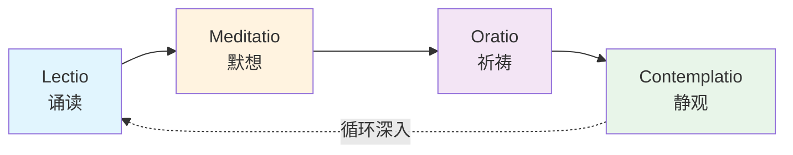
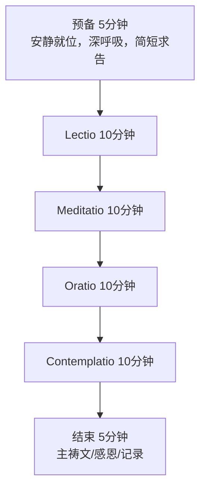
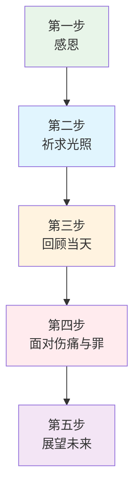

---

title: "基督教默观冥想实操指南"
description: "基督教默观冥想实操指南的详细解析与实践指南"
category: "心智与心理学 > 冥想 > Christian Contemplative"
tags: ["anxiety", "brain"]
last_updated: "2026-05"
difficulty: "beginner"
reading_level: "beginner"
estimated_read_time: "10min"
intent_queries:
  - "什么是基督教默观冥想实操指南"
  - "基督教默观冥想实操指南的核心概念"
  - "基督教默观冥想实操指南的方法与实践"
trigger_keywords: ["anxiety", "art", "body", "brain"]
cross_refs:
  - path: "03-Bio-Science/sexuality/sexual-anxiety-china/Frontier_Technology_Integration.md"
    relation: "anxiety/communication/emotion"
  - path: "04-Humanities-Arts/arts/Modern_Artists_Therapy.md"
    relation: "anxiety/communication/emotion"
  - path: "04-Humanities-Arts/arts/arts-therapy/Modern_Artists_Therapy.md"
    relation: "anxiety/communication/emotion"
  - path: "04-Humanities-Arts/arts/ballet/Ballet_Therapy_Applications.md"
    relation: "anxiety/communication/emotion"
  - path: "04-Humanities-Arts/arts/craft-therapy/Craft_Textile_Therapy.md"
    relation: "anxiety/communication/emotion"

---
# 基督教默观冥想实操指南

> **适用范围**：天主教、东正教、新教及跨传统灵修者
> **最后更新**：2026-05

---

## 目录

1. [Lectio Divina 神圣阅读四步法](#1-lectio-divina-神圣阅读四步法)
2. [Centering Prayer 归心祈祷](#2-centering-prayer-归心祈祷)
3. [Jesus Prayer 耶稣祈祷](#3-jesus-prayer-耶稣祈祷)
4. [依纳爵神操与每日意识省察](#4-依纳爵神操与每日意识省察)
5. [三传统适配冥想路径](#5-三传统适配冥想路径)
6. [常见问题与疑难排解](#6-常见问题与疑难排解)

---

## 1. Lectio Divina 神圣阅读四步法

Lectio Divina（神圣阅读）是基督教最古老的冥想传统之一，起源于修道院，核心是以祷告的心态度阅读圣经，让圣言成为灵魂的滋养。

### 1.1 四步流程总览



### 1.2 每一步详解

| 步骤 | 拉丁名 | 核心行动 | 时间建议 | 关键态度 |
|------|--------|----------|----------|----------|
| **诵读** | Lectio | 缓慢朗读经文，聆听圣言 | 5-10分钟 | 开放、聆听、不分析 |
| **默想** | Meditatio | 与经文对话，让某词或句触动内心 | 5-10分钟 | 咀嚼、回应、个人化 |
| **祈祷** | Oratio | 将触动转化为祈祷，向上主倾诉 | 5-10分钟 | 真诚、敞开、情感表达 |
| **静观** | Contemplatio | 静默安息在上帝临在中，无言的爱 | 10-20分钟 | 放下、接纳、休息 |

#### Lectio · 诵读

**操作说明**：
1. 选择一段简短经文（建议 5-15 节，如诗篇23篇、约翰福音15章1-8节）
2. 预备心灵：深呼吸三次，默念"主，请祢开口，仆人侧耳而听"
3. 缓慢朗读经文，可出声或默读，第一遍通读，第二遍逐句停留
4. 留意是否有某个词、短语或意象特别吸引你——这是圣灵的提示

**时间建议**：初学者 5 分钟，进阶者 10-15 分钟

**常见问题**：

| 问题 | 原因 | 解决方法 |
|------|------|----------|
| 头脑分析经文的语法和历史背景 | 学术阅读习惯 | 温柔地提醒自己：此刻不是研究，是聆听 |
| 无法集中注意力，思绪飘散 | 心神不宁或经文太长 | 缩短经文，从一节开始；允许分心，温柔带回 |
| 没有任何词句"触动"我 | 期待过高或心灵封闭 | 不要强迫，选择一句最熟悉的经句反复诵读 |

#### Meditatio · 默想

**操作说明**：
1. 停留在 Lectio 中触动的词或句上
2. 问自己：这与我今天的生活有什么关系？
3. 想象自己置身于经文场景中（如与门徒一起听耶稣讲道）
4. 用感官体验经文：看到什么、听到什么、感受到什么

**示例**：若触动的是"耶和华是我的牧者"——
- 想象自己是羊，上帝是牧者
- 感受被引领、被保护、被喂养的安全感
- 回想生活中上帝作为牧者的具体时刻

**时间建议**：5-10 分钟

#### Oratio · 祈祷

**操作说明**：
1. 将默想中的感受转化为对上帝的直接说话
2. 可以是感恩、认罪、祈求、赞美，或简单的爱语
3. 使用经文本身的语言作为祈祷词（如将诗篇转化为个人祈祷）
4. 如果无话可说，可以重复简短的祷词如"主啊，我属于祢"

**时间建议**：5-10 分钟

#### Contemplatio · 静观

**操作说明**：
1. 放下经文、思想和言语
2. 在静默中安息于上帝的临在
3. 不试图做什么，只是"在"（be）
4. 如果念头升起，温柔地放下，回到静默的安息

**时间建议**：10-20 分钟（这是最深也最宝贵的一步）

**进阶**：经验纯熟的修习者，四步之间的界限会自然消融，最终安息于无言的共融中。

### 1.3 完整流程时间分配（以45分钟为例）



---

## 2. Centering Prayer 归心祈祷

Centering Prayer 由特拉普会修士托马斯·基廷（Thomas Keating）等人在1970年代系统整理，融合了东方教会传统与现代人的需求，是一种以"同意上帝的爱与临在"为核心的简化冥想方法。

### 2.1 20分钟标准流程

| 阶段 | 时长 | 操作内容 |
|------|------|----------|
| **预备** | 2-3分钟 | 选择坐姿，闭目或微睁，简短向上帝敞开 |
| **引入神圣符号** | 1分钟 | 温和地在心中引入选定的神圣符号 |
| **核心修习** | 15分钟 | 当意识到念头时，温和地回到神圣符号 |
| **结束过渡** | 2-3分钟 | 从内在静默中缓缓出来，可念诵主祷文 |

### 2.2 神圣符号（Sacred Word）的选择

神圣符号是一个简短、有意义的词或短语，用于在念头飘散时回到当下与上帝的临在。

**选择原则**：
- 1-2个音节为佳，便于在心中默念
- 对你有个人意义，唤起对上帝临在的感受
- 可以随时间更换，也可以在修习中自然变化

| 类型 | 示例 | 适合人群 |
|------|------|----------|
| 古典 | "主" / "Lord" / "Jesus" | 传统基督教背景者 |
| 关系性 | "阿爸父" / "Abba" / "爱" | 渴望亲密关系者 |
| 开放性 | "和平" / "光" / "平安" | 偏好非人格意象者 |
| 短句 | "主与我同在" / "Here I am" | 需要完整意义表达者 |

> **重要**：神圣符号不是咒语或专注对象。当内心安静时，它如落叶般自然飘落；当念头升起时，它如羽毛般轻轻触碰，提醒我们回到临在。

### 2.3 处理念头的方法：温和地回到神圣符号

这是 Centering Prayer 的核心技术。

**四步回应念头**：

1. **觉察**：意识到自己正在被某个念头、感觉或意象带走
2. **不评判**：不批评自己分心，不分析念头内容，不试图驱赶它
3. **温和地**：用最轻柔的方式——可以在心中默念神圣符号，或只是"放下"
4. **回到**：重新安息于上帝临在的开放意识中

**念头处理对照表**：

| 念头类型 | 典型表现 | 回应方式 |
|----------|----------|----------|
| 日常琐事 | "今天要买牛奶" | 温和地放下，回到神圣符号 |
| 情感反应 | 焦虑、愤怒、渴望 | 不深入剧情，轻轻回到临在 |
| 灵性内容 | "我刚才的感悟很深刻" | 不抓住"好"体验，平等放下 |
| 身体感觉 | 痒、痛、不适 | 不立即反应，若持续则调整后回来 |
| 昏沉睡眠 | 打瞌睡、意识模糊 | 可睁大眼睛或调整坐姿，重新引入符号 |

> **核心心法**：Centering Prayer 不是"停止思考"，而是"不被思考带走"。每一次回到神圣符号，都是一次同意上帝临在的行动。

### 2.4 每日修习建议

| 经验层级 | 每日次数 | 每次时长 | 最佳时段 |
|----------|----------|----------|----------|
| 初学者 | 1次 | 10-15分钟 | 早晨起床后 |
| 中级 | 2次 | 20分钟 | 晨间 + 傍晚 |
| 深入者 | 2次 | 20-30分钟 | 晨间 + 睡前，或 retreat 中延长 |

---

## 3. Jesus Prayer 耶稣祈祷

Jesus Prayer（耶稣祈祷）源于沙漠教父传统，在东正教灵性中占据核心地位，是一种将短祷与呼吸配合的持名祈祷。

### 3.1 完整祷文

> **希腊原文**：Κύριε Ἰησοῦ Χριστέ, Υἱὲ τοῦ Θεοῦ, ἐλέησόν με τὸν ἁμαρτωλόν
> **中文**：主耶稣基督，上帝之子，怜悯我这个罪人

### 3.2 呼吸配合的具体操作


**详细操作**：

| 呼吸阶段 | 祷文内容 | 操作要点 |
|----------|----------|----------|
| **吸气** | "主耶稣基督" | 缓慢深吸气，同时默念或微声念诵，感受神圣名号的临在 |
| **呼气** | "上帝之子" | 缓慢呼气，释放紧张，确认基督的神圣身份 |
| **停顿** | "怜悯我罪人" | 在呼气后的自然停顿中，怀着谦卑与悔改之心，感受怜悯的降临 |
| **自然呼吸** | 静默 | 让呼吸自然流动，在间隙中安息于无言的临在 |

**节奏变体**：

| 变体 | 适用场景 | 呼吸节奏 |
|------|----------|----------|
| 标准版 | 日常固定修习 | 自然呼吸，不刻意控制 |
| 缓慢版 | 深入静观 | 每句配一次完整呼吸，延长停顿 |
| 念珠版 | 使用祈祷绳 | 每结一祷文，113结为一圈 |
| 行走版 | 户外步行冥想 | 两步一吸气，两步一呼气 |

### 3.3 祈祷绳（Komboskini / Prayer Rope）使用

东正教传统中使用编织的祈祷绳辅助持诵。

**标准结构**：113个结，分成四组（33+33+33+14），对应基督在世33年。

**使用方法**：
1. 将祈祷绳握在手中，拇指与食指捏住第一结
2. 每诵一遍耶稣祈祷，滑过一节
3. 完成一圈（113次）约需15-20分钟
4. 不求速度，求心灵的专注与柔软

---

## 4. 依纳爵神操与每日意识省察

依纳爵·罗耀拉（Ignatius of Loyola, 1491-1556）在其《神操》中发展了一套系统化的灵修方法，其中"意识省察"（Examen of Consciousness）是最适合日常实践的工具。

### 4.1 每日意识省察五步法



| 步骤 | 名称 | 核心问题 | 操作建议 |
|------|------|----------|----------|
| **一** | 感恩（Gratitude） | "今天我为何感恩？" | 回顾一天，找出至少一件值得感恩的事，向天主表达感谢 |
| **二** | 祈求光照（Petition for Light） | "请天主照亮我的心" | 祈求圣灵帮助你看清今天的真相，不带滤镜 |
| **三** | 回顾当天（Review） | "今天我的情绪如何起伏？" | 按时间顺序回顾，注意何时感到活力/枯竭、平安/不安、亲近/远离天主 |
| **四** | 面对伤痛与罪（Sorrow/Sin） | "我在哪里偏离了爱？" | 诚实面对自己的过失、伤人言行、错失的爱之机会，表达悔改与祈求宽恕 |
| **五** | 展望未来（Resolution） | "明天我想如何活出爱？" | 基于回顾，设定一个具体、可操作的明日意向 |

### 4.2 实操指南

**时间选择**：
- **经典时间**：中午与睡前各一次（依纳爵原建议）
- **现代简化版**：每天睡前一次
- **单次时长**：10-15分钟

**具体流程（以15分钟为例）**：

| 分钟 | 内容 |
|------|------|
| 0-2 |  settling down：安静就位，深呼吸，意识天主临在 |
| 2-4 |  感恩：回想今日至少一件感恩的事 |
| 4-6 |  祈求光照：简短祈祷"主啊，请祢光照我" |
| 6-11 |  回顾：从早晨到现在，标记情绪的起伏点 |
| 11-13 |  面对：在何处亏欠了爱？不自我批判，只诚实面对 |
| 13-15 |  展望：一个具体的明日行动意向 |

### 4.3 情绪地图法

在第三步"回顾当天"中，可以使用情绪地图来可视化一天的灵性状态：

```
情绪高低轴
    ↑
 高 |        ● 午餐与同事
    |  ● 晨间祈祷
    |                  ● 傍晚散步
    |                          ● 省察时刻
    |        ○ 被批评时的防御
 低 |                  ○ 交通堵塞的愤怒
    |  ○ 赖床不想起
    +----------------------------→ 时间
       早晨   中午   下午   傍晚   夜间
```

**标记规则**：
- ● 代表让你感到生命、感恩、与天主亲近的时刻
- ○ 代表让你感到枯竭、远离、不安的时刻

---

## 5. 三传统适配冥想路径

### 5.1 三大传统核心差异

| 维度 | 天主教（Catholic） | 东正教（Orthodox） | 新教（Protestant） |
|------|-------------------|-------------------|-------------------|
| **默观传统** | 丰富且系统化（修道院传统） | 神秘主义深厚（圣山阿索斯） | 较多元，部分宗派重视，部分谨慎 |
| **圣典角色** | 圣经 + 圣传 + 教父教导 | 圣经 + 七大公会议 + 圣传 | 唯独圣经（Sola Scriptura） |
| **意象使用** | 圣像、圣体、玫瑰经 | 圣像、礼仪、耶稣祈祷 | 较简化，侧重文字 |
| **默观态度** | 积极培育 | 核心灵性道路 | 因宗派而异 |
| **权威指导** | 神师/灵修导师 | 长老/灵性父亲 | 牧师/小组/个人领受 |

### 5.2 各传统适配冥想路径

#### 天主教路径

| 阶段 | 修习方法 | 资源推荐 |
|------|----------|----------|
| 入门 | 玫瑰经默想 + 每日弥撒 | 《玫瑰经默想指南》 |
| 进阶 | Lectio Divina + Centering Prayer | 托马斯·基廷著作 |
| 深入 | 依纳爵神操30天闭关 | 寻找依纳爵灵修导师 |

#### 东正教路径

| 阶段 | 修习方法 | 资源推荐 |
|------|----------|----------|
| 入门 | 耶稣祈祷（简短版）+ 敬拜礼仪 | 《慕善集》（Philokalia）选读 |
| 进阶 | 耶稣祈祷配合呼吸 + 圣像凝视 | 圣山阿索斯长老教导 |
| 深入 | 心祷（Prayer of the Heart）+ 静修 | 长老指导下的闭关 |

#### 新教路径

| 阶段 | 修习方法 | 资源推荐 |
|------|----------|----------|
| 入门 | 圣经默想（Meditative Bible Reading） | 个人读经计划 |
| 进阶 | Centering Prayer（非礼仪背景者友好） | 托马斯·基廷《敞开心扉》 |
| 深入 | 结合神学的默观阅读 + 独处 Retreat | 新教神秘主义传统研究 |

### 5.3 跨传统共通要素

无论哪个传统，以下要素都是基督教默观的核心：

1. **以圣经为锚**：默观始终扎根于圣言
2. **基督中心**：默观的对象和终点是基督
3. **恩典为先**：默观不是自我努力到达的境界，是上帝主动的赐予
4. **爱的关系**：默观的本质是人与上帝之间的爱的关系
5. **转化的生命**：真正的默观必然导向生活方式的更新

---

## 6. 常见问题与疑难排解

### 6.1 通用疑难

| 问题 | 诊断 | 建议 |
|------|------|------|
| "我什么都感受不到" | 将默观看成"获得感受" | 默观的核心是"在"而非"感"；继续规律修习，放下期待 |
| "我总是在分析经文" | 学术研究模式主导 | 区分"研究圣经"与"让圣经研究你"；用不同的时段分别进行 |
| "念头太多，无法安静" | 对自己要求过高 | 念头不是问题，被念头带走才是；每一次回来都是进步 |
| "做了一段时间没有进步" | 对"进步"的定义有误 | 默观不是线性的；保持忠信，把结果交给上帝 |
| "感到空虚或恐惧" | 可能是"灵魂的暗夜"或需要指导 | 与有经验的灵修导师谈谈；区分正常的灵性低谷与需要帮助的困境 |

### 6.2 安全提醒

- **不建议**：在没有适当指导的情况下自行进行长时间的严格禁食或睡眠剥夺
- **建议**：若出现持续的灵性危机、异常体验或心理健康困扰，寻求灵修导师和/或专业心理咨询师的帮助
- **重要**：默观修习应与日常生活平衡，不应成为逃避现实的工具

---

## 附录：推荐阅读

| 书名 | 作者 | 重点 |
|------|------|------|
| 《敞开心扉》（Open Mind, Open Heart） | 托马斯·基廷 | Centering Prayer 经典入门 |
| 《慕善集》（Philokalia） | 多位圣徒 | 东正教灵修经典合集 |
| 《神操》（Spiritual Exercises） | 依纳爵·罗耀拉 | 天主教系统灵修 |
| 《未知之云》（The Cloud of Unknowing） | 匿名作者 | 中世纪英国神秘主义 |
| 《耶稣祈祷的艺术》 | 无名氏 | 耶稣祈祷入门 |

---

*本指南旨在提供实用的基督教默观冥想方法。愿每一位修习者在静默中更深地经历上帝的临在与爱。*
