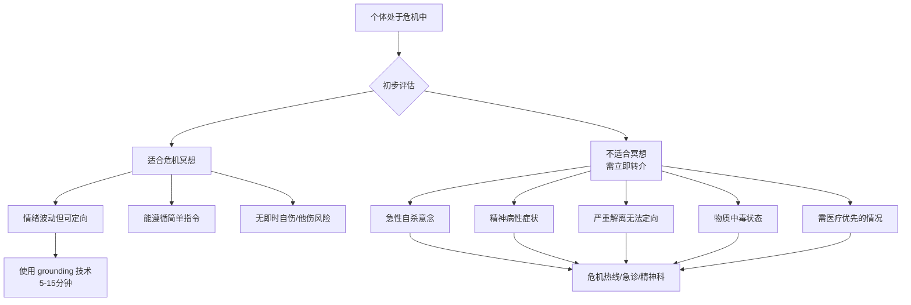
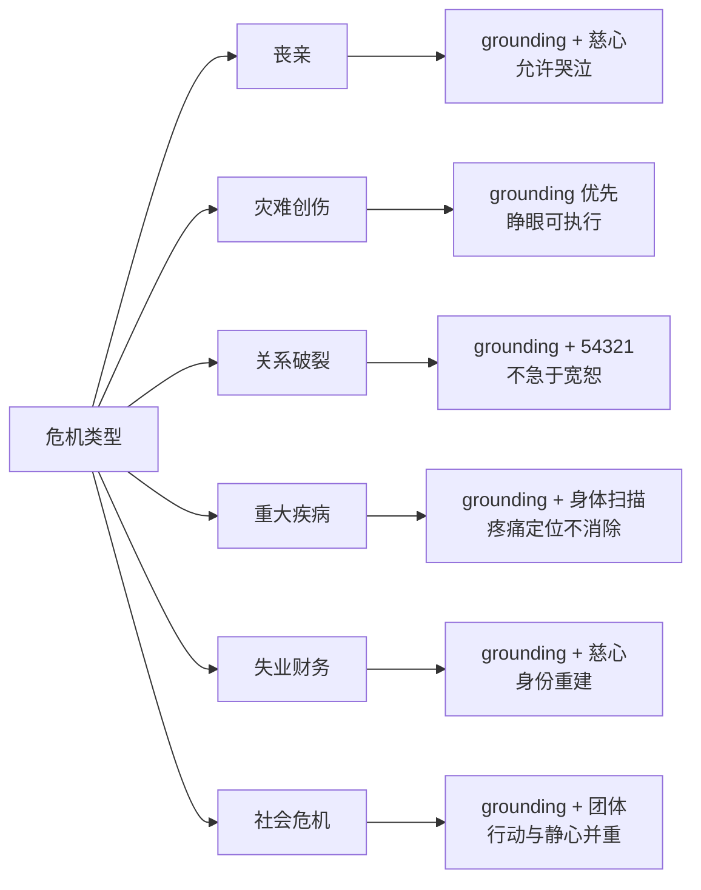
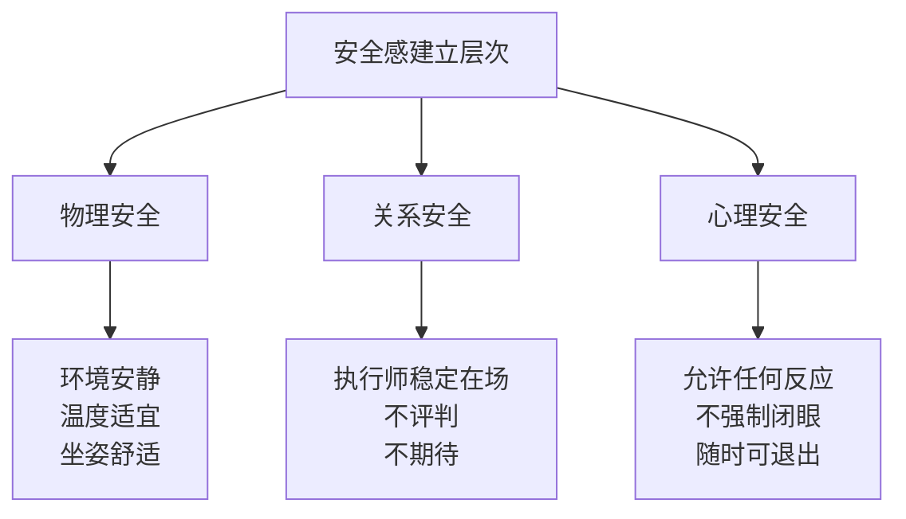
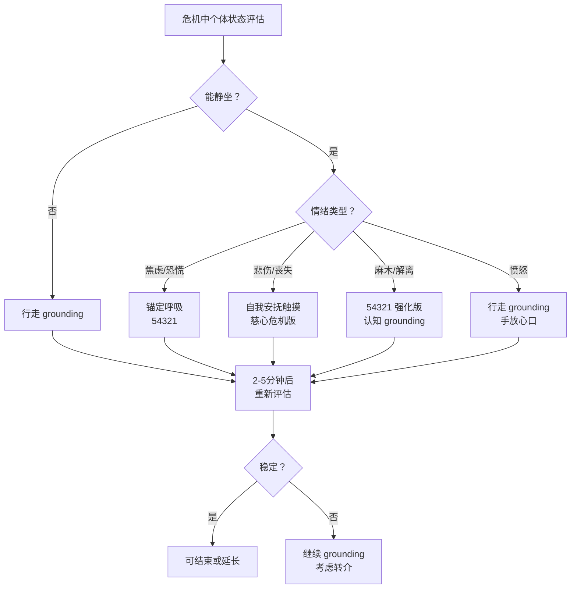
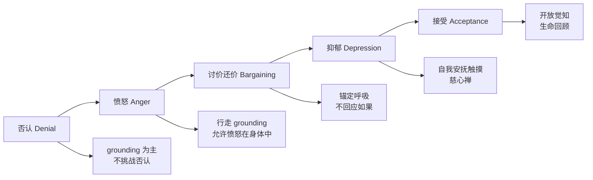
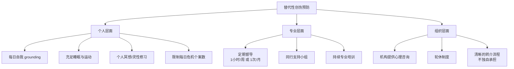

# 危机与哀伤冥想专业指南 Crisis & Grief Meditation Guide

> **最后更新：2026-05**  
> 本指南为心理健康专业人员、冥想导师及经过培训的志愿者提供危机情境下的冥想应用框架。**重要声明**：危机冥想是辅助工具，不能替代专业心理危机干预或医疗救治。

---

## 目录

1. [危机冥想的定义与边界](#一危机冥想的定义与边界)
2. [危机类型与冥想适配](#二危机类型与冥想适配)
3. [危机冥想的技术原则](#三危机冥想的技术原则)
4. [具体技术库](#四具体技术库)
5. [哀伤冥想的阶段适配](#五哀伤冥想的阶段适配)
6. [团体危机冥想](#六团体危机冥想)
7. [执行师的自我保护](#七执行师的自我保护)
8. [参考文献与资源](#八参考文献与资源)

---

## 一、危机冥想的定义与边界

### 1.1 什么是危机冥想？

危机冥想（Crisis Meditation）是指在急性心理压力、创伤事件或重大丧失情境下，运用经过适配的冥想技术，帮助个体恢复基础自我调节能力（Self-Regulation）的简短干预。它不是「深度修行」，而是「心理急救」（Psychological First Aid）的组成部分。

### 1.2 何时使用冥想？何时需要转介？

| 适合危机冥想 | 需专业心理危机干预 | 需医疗紧急处理 |
|------------|-----------------|--------------|
| 震惊后的轻度麻木 | 自杀计划或企图 | 药物过量 |
| 可控的哭泣与悲伤 | 严重自伤行为 | 酒精/毒品急性中毒 |
| 焦虑但可对话 | 幻听/幻视指挥性内容 | 头部外伤后意识混乱 |
| 失眠但无自杀意念 | 严重解离（不知道自己是谁/在哪里） | 躯体疾病急性发作 |
| 重大丧失后的第一周 | 暴力倾向或他伤风险 | 任何生命体征不稳定 |
| 灾难现场的幸存者 | 儿童/老人无法自我照顾 |  |

### 1.3 核心边界原则

1. **不深入**：危机冥想绝不引导深入内观、探索创伤记忆或挑战核心信念。
2. **不处理**：目标是「允许情绪存在」，而非「处理/解决情绪」。
3. **不评判**：执行师不评判危机反应「对错」，不比较「应该」如何感受。
4. **可退出**：参与者随时可睁开眼睛、离开、拒绝继续——这是其自主权的行使，而非失败。
5. **有后续**：单次危机冥想后，必须提供后续资源（心理咨询热线、持续支持渠道）。

---

## 二、危机类型与冥想适配

### 2.1 急性丧亲之痛（Acute Bereavement）

#### 2.1.1 亲人/伴侣离世

| 危机特点 | 冥想适配策略 |
|---------|------------|
| 震惊与否认 | 极短 grounding（2-3分钟），不期待任何「感受」 |
| 强烈悲伤哭泣 | 允许哭泣，引导呼吸与身体接触（手放心口） |
| 自责与反刍 | **不做认知重构**，仅引导回到当下感官 |
| 孤独感 | 慈心禅危机版（见4.4节），从「愿我平安」开始 |
| 睡眠崩溃 | 睡前身体扫描（仅到膝盖，不全身，避免触发） |

#### 2.1.2 宠物离世

宠物丧失常被社会轻视（Disenfranchised Grief），但神经研究显示，宠物丧失激活的脑区与亲人丧失高度重叠。

| 特殊考量 | 冥想适配 |
|---------|---------|
| 社会支持缺乏 | 执行师明确肯定：「这是真实的丧失，你的痛苦是合理的」 |
| 日常节律断裂 | 在宠物常待的位置进行 grounding，重建空间安全感 |
| 内疚（安乐死/未能救治） | 不辩解，仅引导呼吸，允许内疚存在而不展开 |

#### 2.1.3 未完成的哀伤（Complicated Grief）

若哀伤持续 >6个月且严重功能受损，需转介心理治疗（如 prolonged grief disorder therapy）。冥想仅作为辅助。

### 2.2 灾难与创伤后（Disaster & Post-Trauma）

#### 2.2.1 自然灾害幸存者（地震、火灾、洪水）

| 阶段 | 时间窗 | 冥想角色 |
|------|-------|---------|
| 急性期（0-72小时） | 危机稳定后 | 仅 grounding，2-5分钟，可睁眼 |
| 亚急性期（3天-3月） | PTSD 形成窗口 | 锚定呼吸 + 身体 grounding，建立安全感 |
| 恢复期（3-12月） | 重建生活 | 渐进式正念，注意闪回（Flashback）触发 |
| 慢性期（>1年） | 可能慢性 PTSD | 配合创伤聚焦治疗（TF-CBT/EMDR），冥想辅助情绪调节 |

#### 2.2.2 战争与难民创伤

| 特殊考量 | 冥想适配 |
|---------|---------|
| 持续的生存威胁 | 强调「此刻此地安全」可能不切实际，改用「此刻这一刻，你的身体在哪里」 |
| 集体创伤 | 团体 grounding 优先，重建社群连接 |
| 文化差异 | 避免特定宗教框架，使用普世身体感知 |
| 儿童 | 游戏化 grounding（如「找到5种蓝色的东西」） |

#### 2.2.3 PTSD 预防性冥想

在创伤后早期（<1月）介入冥想可降低 PTSD 发病率。

| 技术 | 频率 | 证据等级 |
|------|------|---------|
| 身体扫描（简化版） | 每日1次，10分钟 | 中等（Kearney et al., 2012） |
| 锚定呼吸 | 每日2-3次，3分钟 | 中等 |
| 慈心禅 | 每日1次，5分钟 | 初步 |
| 行走 grounding | 每日随意，2-5分钟 | 低但安全性高 |

### 2.3 关系破裂（Relationship Breakdown）

#### 2.3.1 离婚/分手

| 危机特点 | 冥想适配 |
|---------|---------|
| 身份崩塌（Who am I without them?） | grounding，强调身体存在，不回答哲学问题 |
| 愤怒与怨恨 | 允许愤怒存在，引导感受愤怒在身体的哪个部位，不展开故事 |
| 反复回想关系细节 | 54321 技术打断反刍循环 |
| 社交退缩 | 团体 grounding 或线上引导，降低参与门槛 |

#### 2.3.2 怨恨释放（Forgiveness Meditation 的危机适配）

**禁忌**：危机早期（<3月）不做正式宽恕冥想，可能引发二次创伤或压抑愤怒。

| 阶段 | 可使用的技术 |
|------|------------|
| 危机期（0-1月） | 仅 grounding、自我安抚触摸 |
| 稳定期（1-3月） | 慈心禅从「愿我平安」开始，不涉及对方 |
| 恢复期（3-6月） | 可渐进至「愿对方无痛苦」——若当事人主动提出 |
| 深度期（>6月） | 在心理治疗框架下，可考虑正式宽恕练习 |

#### 2.3.3 共同育儿中的正念

| 场景 | 微型正念（Micro-Mindfulness） |
|------|----------------------------|
| 与前伴侣通话前 | 3次深呼吸，肩膀下沉 |
| 孩子提及前伴侣时 | 觉察面部肌肉紧张，放松眉心 |
| 交接孩子时 | 身体 grounding（双脚踩地感受） |
| 夜间焦虑 | 手放心口，感受心跳，自我安抚 |

### 2.4 重大疾病诊断（Serious Illness）

#### 2.4.1 癌症/绝症的心理调适

| 心理挑战 | 冥想适配 |
|---------|---------|
| 死亡焦虑（Death Anxiety） | 不回避，但也不聚焦；grounding 回到当下身体 |
| 治疗副作用（恶心、疼痛） | 身体扫描定位不适，不试图消除，仅观察 |
| 丧失控制感 | 锚定呼吸——「至少在这一刻，我可以选择如何呼吸」 |
| 意义危机 | 危机期不做意义建构；稳定后可引入生命回顾（Life Review） |

#### 2.4.2 医疗决策中的清晰心

| 决策阶段 | 冥想支持 |
|---------|---------|
| 信息过载 | 5分钟呼吸冥想，降低认知负荷后再决策 |
| 多方意见冲突 | grounding + 身体感知：「这个选项让我的身体感到紧绷还是舒展？」 |
| 决策后后悔 | 慈心禅：「愿我接纳已做的选择，愿我在不确定中保持平安」 |

#### 2.4.3 临终关怀（End-of-Life Care）

| 阶段 | 冥想重点 |
|------|---------|
| 接受临终 | 开放觉知（Open Awareness），不抗拒任何体验 |
| 身体衰竭 | 简化技术：仅感受呼吸进出，或播放录制引导语 |
| 最后的时刻 | 执行师或家属轻声引导：「放下，你正在被抱着」 |
| 家属支持 | 同步进行 grounding，防止家属崩溃影响病人 |

### 2.5 失业与财务危机（Unemployment & Financial Crisis）

| 心理冲击 | 冥想适配 |
|---------|---------|
| 身份丧失（I am my job） | grounding + 慈心：「愿我在无职衔时仍看见自己的价值」 |
| 焦虑循环（How will I survive?） | 54321 技术，将注意力从未来拉回到当下感官 |
| 羞耻感 | 自我安抚触摸（手放心口），不辩解、不分析 |
| 决策瘫痪 | 3分钟呼吸后，写下三个最小可行步骤 |
| 关系紧张 | 与伴侣同步 grounding，重建共同基础 |

### 2.6 社会危机（Societal Crisis）

#### 2.6.1 疫情隔离（Pandemic Isolation）

| 挑战 | 冥想适配 |
|------|---------|
| 孤独感 | 线上团体 grounding，强调「我们同时在做同一件事」 |
| 信息焦虑 | 设定「无信息时段」，以身体扫描替代刷新闻 |
| 空间束缚 | 室内行走冥想，以脚步丈量有限空间的无限可能 |
| 未来不确定 | 慈心禅：「愿我在不确定中保持平安」 |

#### 2.6.2 政治动荡与集体焦虑

| 挑战 | 冥想适配 |
|------|---------|
| 无力感 | grounding：「此刻，我的双脚踩在地上，这是真实的」 |
| 对立与仇恨 | 不否认正义愤怒，但引导觉察愤怒在身体的表达 |
| 行动与静心的平衡 | 明确：冥想不是逃避，是为行动充电 |

#### 2.6.3 气候焦虑（Eco-Anxiety / Climate Grief）

| 挑战 | 冥想适配 |
|------|---------|
| 对地球未来的绝望 | grounding 于自然元素：感受空气、光线、水的流动 |
| 负罪感（个人碳足迹） | 慈心：「愿我接纳作为人类的局限，愿我以清醒的心行动」 |
| 无力感 | 团体冥想 + 行动社群连接，将个体焦虑转化为集体关怀 |

### 2.7 危机类型适配总览

---

## 三、危机冥想的技术原则

危机冥想与常规冥想有本质区别。以下五项原则是安全有效性的基石。

### 3.1 简短（Brief）

| 原则 | 说明 |
|------|------|
| 时长 | 2-15分钟，极少超过20分钟 |
| 原因 | 危机中的注意力资源极度有限；长时间冥想可能引发解离或情绪淹没 |
| 例外 | 临终关怀中，病人可能进入深度宁静，时间可延长，但需家属陪伴 |

### 3.2 Grounding 为主（Grounding-Centered）

grounding 技术的核心是将注意力从内在情绪/思维转移到外部感官或身体感知，重建「此时此地」的定向。

| grounding 类型 | 定义 | 示例 |
|---------------|------|------|
| 感官 grounding | 五感知觉 | 54321 技术 |
| 身体 grounding | 身体感觉 | 感受双脚踩地、手放心口 |
| 认知 grounding | 现实定向 | 「今天是几号？我在哪里？」 |
| 舒缓 grounding | 自我安抚 | 温水洗手、毛毯包裹、香氛 |
| 行动 grounding | 有目的的动作 | 缓慢行走、整理物品 |

### 3.3 不深入内观（No Deep Introspection）

| 常规冥想 | 危机冥想 |
|---------|---------|
| 探索情绪根源 | 仅命名情绪，不探索 |
| 观察念头的生灭 | 念头只是背景噪音，不关注 |
| 深入身体感受 | 仅表面感知，不深入不适区域 |
| 挑战核心信念 | **绝对禁止** |
| 长时间静默 | 持续语言引导，不留长静默 |

### 3.4 优先安全感建立（Safety First）

### 3.5 允许情绪而非处理情绪（Allow, Don't Process）

这是危机冥想最核心的原则。

| 语言示例 | 说明 |
|---------|------|
| 「如果你感到悲伤，那是可以的。」 | 许可，不分析 |
| 「不需要改变任何东西。」 | 接纳，不修正 |
| 「你的心跳很快，那是身体在保护你。」 | 正常化，不消除 |
| 「不需要现在理解为什么。」 | 延迟认知，不解释 |

---

## 四、具体技术库

### 4.1 Grounding 54321 技术

**全称**：5-4-3-2-1 Sensory Grounding Technique  
**起源**：源于 trauma therapy，是最广泛验证的 grounding 技术之一。

#### 操作步骤

| 步骤 | 感官 | 引导语示例 | 时长 |
|------|------|-----------|------|
| 5 | 视觉 | 「环顾四周，说出你看到的5样东西。可以是大是小，任何颜色。」 | 约1分钟 |
| 4 | 触觉 | 「感受4样你能触摸到的东西。可能是衣服的质地、椅子的硬度、空气的温度。」 | 约1分钟 |
| 3 | 听觉 | 「聆听3种声音。可以是远处的车声、自己的呼吸、房间的嗡嗡声。」 | 约1分钟 |
| 2 | 嗅觉 | 「注意2种气味。可以是淡淡的香水、空气的味道、你手边的任何气味。」 | 约30秒 |
| 1 | 味觉 | 「注意1种味道。可以是口中残留的食物、唾液的味道，或想象一种你喜欢的味道。」 | 约30秒 |

#### 危机适配变体

| 变体 | 适用场景 |
|------|---------|
| 简化版 333 | 极度焦虑时：3样看到、3样听到、3样身体感觉 |
| 移动版 | 行走中执行：5样看到、4样听到、3样脚底感觉 |
| 儿童版 | 「找到5种红色的东西、4种方形的东西……」 |
| 室内受限版 | 极窄空间：5样身体内部感觉、4样呼吸特征…… |

### 4.2 锚定呼吸（Anchor Breathing）

**核心**：最简单的呼吸觉察，不控制、不延长、不深究。

#### 操作步骤

| 阶段 | 引导语 | 时长 |
|------|-------|------|
| 就位 | 「你可以坐着或站着，找到一个稳定的姿势。不需要特殊姿势。」 | 10秒 |
| 觉察 | 「现在，不需要改变呼吸，只是注意到你在呼吸。空气进入，空气离开。」 | 30秒 |
| 锚定 | 「你可以选择将注意力放在鼻孔的感觉、肚子的起伏，或整个身体的轻微晃动。选一个，不需要换。」 | 1分钟 |
| 允许走神 | 「如果注意力跑掉了，那很正常。温柔地回到呼吸。不需要批评自己。」 | 1分钟 |
| 结束 | 「现在，慢慢睁开眼睛（如果闭着的话），感受你的身体在这个空间中。」 | 10秒 |

#### 危机适配要点

- **不强调腹式呼吸**：危机中深呼吸可能引发过度换气（Hyperventilation）。
- **不数息**：计数增加认知负荷。
- **提供选择**：「注意鼻孔或肚子，选一个」——给控制感。
- **允许张嘴呼吸**：危机中鼻塞常见，不要求鼻呼吸。

### 4.3 自我安抚触摸（Self-Soothing Touch）

**神经科学基础**：自我触摸激活 C-tactile afferents，降低皮质醇，提升催产素（Oxytocin）。

| 触摸方式 | 操作方法 | 适用情境 |
|---------|---------|---------|
| 手放心口 | 一手或双手轻放于胸口心脏位置，感受心跳 | 悲伤、焦虑、孤独 |
| 双手交叠于腹部 | 一手在肚脐上，一手在下，感受腹部起伏 | 恐慌、肠胃紧张 |
| 自我拥抱 | 双臂交叉抱肩，双手轻抚上臂，可轻微摇晃 | 极度不安、需要被抱感 |
| 脸颊触摸 | 一手轻触脸颊，如同被温柔抚摸 | 羞耻、自我批评强烈时 |
| 双手合十 | 掌心相对，轻压，感受温度与压力 | 需要 grounding 与专注 |
| 足底按压 | 坐着，一脚踩于另一脚脚背，感受压力 | 解离、身体感知丧失 |

#### 引导语示例

> 「把你的手放在心口。感受你的心跳。这是你的身体，它一直在工作，一直在陪伴你。你的手是温暖的，这个温暖可以流进你的身体。不需要做任何事，只是感受这个接触。」

### 4.4 慈心禅的危机适配版（Loving-Kindness Crisis Adaptation）

传统慈心禅（Metta）从「愿我平安」扩展到亲人、中性人、敌人、一切众生。危机适配版**严格限制扩展**。

#### 标准危机版流程

| 阶段 | 对象 | 语句 | 时长 |
|------|------|------|------|
| 1 | 自己 | 「愿我平安。愿我在痛苦中保持平安。」 | 1分钟 |
| 2 | 自己（重复） | 「愿我平静。愿我的身体放松。」 | 1分钟 |
| 3 | 一个安全的人/宠物 | 「愿[名字]平安。」（仅一句，不深入） | 30秒 |
| 4 | 回到自己 | 「愿我接纳此刻的一切感受。」 | 30秒 |

#### 禁忌与注意

| 情况 | 处理方式 |
|------|---------|
| 对自己说「愿我平安」引发强烈悲伤 | 改为「愿我在悲伤中被抱着」或完全省略慈心，改用 grounding |
| 想到安全的人引发丧失感 | 立即回到自己，或使用无对象语句：「愿平安存在」 |
| 无法产生任何温暖感 | 完全正常。改为身体扫描或 grounding，不强迫慈心 |

### 4.5 行走 Grounding（Walking Grounding）

**适用**：坐立不安、极度焦虑、身体紧张到无法静坐。

#### 室内行走 grounding 步骤

| 步骤 | 引导语 | 要点 |
|------|-------|------|
| 站立 | 「双脚分开与肩宽，感受双脚与地面的接触。」 | 确保地面安全、无障碍 |
| 起步 | 「慢慢抬起一只脚，感受重量转移。慢慢放下，感受脚跟、脚掌、脚趾依次接触地面。」 | 极慢，每一步 10-15 秒 |
| 行走 | 「继续走，注意力在脚底的感觉。不需要看脚，知道它们在动就好。」 | 短距离，3-5米往返 |
| 停止 | 「停下，感受双脚再次稳定地站在地面上。」 | 停顿 10 秒 |
| 循环 | 可重复 3-5 分钟 | 不求距离，求感受 |

#### 危机适配要点

- **小空间可用**：2米走廊即可往返。
- **可睁眼**：危机中闭眼行走增加不安。
- **可扶墙**：提供物理安全感。
- **可配合语句**：每步默念「我在走」或「地面在这里」。

### 4.6 技术选择决策树

---

## 五、哀伤冥想的阶段适配

### 5.1 Kubler-Ross 五阶段与冥想支持

Elisabeth Kubler-Ross 的哀伤五阶段模型（否认-愤怒-讨价还价-抑郁-接受）虽受现代研究修正，但仍为临床工作者提供有用的框架。以下将各阶段与冥想技术适配。

| 阶段 | 核心体验 | 冥想策略 | 禁忌 |
|------|---------|---------|------|
| **否认** | 「这不是真的。」 | 极短 grounding（2分钟），不挑战否认；强调身体当下的安全 | 强迫面对现实、提供认知重构 |
| **愤怒** | 「为什么是我/TA？」 | 行走 grounding 或站立 grounding，允许愤怒作为身体能量存在；手放心口自我安抚 | 劝「不要生气」、分析愤怒原因 |
| **讨价还价** | 「如果我当时……」 | 锚定呼吸，每次出现「如果」时温柔回到呼吸；不回应内容 | 参与逻辑辩论、提供虚假保证 |
| **抑郁** | 「没有意义了。」 | 自我安抚触摸（手放心口）、慈心禅危机版；极短，不期待改变情绪 | 鼓励「振作」、要求感恩练习 |
| **接受** | 「这是真的，我可以继续。」 | 开放觉知、简化身体扫描、生命回顾（若当事人主动） | 急于「向前看」、设定康复时间表 |

### 5.2 哀伤冥想的重要提醒

1. **非线性**：哀伤不是直线五阶段，个体可能在各阶段间跳跃或同时经历多个阶段。
2. **无时间表**：不要为任何阶段设定「应该」的时长。
3. **不追求接受**：接受不是目标，许多丧亲者终身不「接受」，但学会了与丧失共存。
4. **纪念日与触发点**：节日、逝生日、忌日等需提前准备 grounding 资源。

### 5.3 特殊哀伤：自杀丧失、流产、突然死亡

| 类型 | 特殊挑战 | 冥想适配 |
|------|---------|---------|
| 自杀丧失 | 复杂的内疚、愤怒、社会污名 | 格外强调「这不是你的错」； grounding 为主，不做深入内观 |
| 流产/婴儿死亡 | 被忽视的哀伤、身体记忆 | 身体扫描时尊重腹部区域；允许对未出生孩子的静默对话 |
| 突然/暴力死亡 | 创伤叠加哀伤、侵入性画面 | 睁眼 grounding；不闭眼想象；必要时转介 EMDR |

---

## 六、团体危机冥想

### 6.1 集体悲剧后的团体支持

#### 6.1.1 场景与时机

| 场景 | 最佳介入时机 | 形式 |
|------|------------|------|
| 学校意外死亡 | 24-72小时后，危机稳定后 | 班级/年级团体 grounding |
| 企业同事猝死 | 1-3天后 | 自愿参加的午间冥想 |
| 社区灾难（火灾、车祸） | 72小时后，避难所/社区中心 | 开放团体，随时进出 |
| 线上社群成员自杀 | 确认消息后 24-48小时内 | 线上同步 grounding |

#### 6.1.2 团体危机冥想流程

| 阶段 | 时长 | 内容 |
|------|------|------|
| 开场 | 2分钟 | 说明：「这是一个 grounding 的空间，不需要任何经验。你可以随时睁开眼睛或离开。」 |
| grounding | 5-10分钟 | 54321 或锚定呼吸，全程语言引导，无长静默 |
| 静默 | 1-2分钟 | 可选：播放轻柔自然声或颂钵单音 |
| 收束 | 2分钟 | 缓慢回到环境，不提问、不要求分享 |
| 资源提供 | 2分钟 | 分发心理咨询资源、热线、后续活动信息 |

### 6.2 社区冥想仪式

| 仪式类型 | 形式 | 功能 |
|---------|------|------|
| 烛光守夜（Vigil） | 团体静坐 + 个人点燃蜡烛 + 静默 | 集体哀悼、见证丧失 |
| 钟声仪式 | 每逝一位，鸣钟一次，团体默数呼吸 | 结构化哀悼、节奏安全 |
| 行走冥想圈 | 团体慢走圆圈，中心放置纪念物 | 动态 grounding、社群连接 |
| 自然埋葬仪式 | 植树/种花 + 简短 grounding | 生命循环、希望重建 |

### 6.3 在线危机冥想

| 平台 | 优势 | 挑战 | 最佳实践 |
|------|------|------|---------|
| Zoom/腾讯会议 | 视频可见、分组可能 | 技术门槛、Zoom疲劳 | 提供纯音频选项、减少视频压力 |
| 直播（B站/YouTube） | 大规模、匿名 | 无互动、无法评估个体状态 | 明确 disclaimer、提供求助信息 |
| 语音社群（Discord/微信群） | 低门槛、持续性 | 无视觉线索、信息过载 | 固定时段、简短引导、文字辅助 |
| App内团体 | 结构化、数据追踪 | 缺乏人际温度 | 结合真人直播 + 录制内容 |

---

## 七、执行师的自我保护

### 7.1 替代性创伤（Vicarious Trauma / Secondary Traumatic Stress）

长期暴露于他人的创伤叙事，执行师可能出现与创伤者类似的症状：侵入性画面、情感麻木、过度警觉、存在性绝望。

| 警示信号 | 正常疲劳 | 替代性创伤 |
|---------|---------|-----------|
| 工作后的情绪 | 疲惫但可恢复 | 持续低落、无望 |
| 对求助者的态度 | 共情但保持边界 | 过度投入或情感疏离 |
| 世界观 | 基本稳定 | 安全感崩塌、对人类悲观 |
| 身体 | 一般疲劳 | 慢性疼痛、失眠、免疫下降 |
| 人际关系 | 可能减少社交 | 亲密关系受损、孤立 |

### 7.2 预防策略

### 7.3 督导需求

| 督导类型 | 频率 | 内容 |
|---------|------|------|
| 临床督导 | 每周1小时或每案1次 | 个案概念化、技术选择、风险评估 |
| 同伴督导 | 每月1-2次 | 经验分享、情感支持、资源互通 |
| 个人治疗 | 按需或持续 | 执行师自身未处理议题 |

### 7.4 界限设定（Boundary Setting）

| 界限类型 | 健康做法 | 危险信号 |
|---------|---------|---------|
| 时间 | 明确服务时段，非24小时 | 深夜回消息、无法关机 |
| 关系 | 专业关系，不成为朋友 | 社交邀约、情感依赖 |
| 能力 | 在训练范围内工作 | 处理超出能力的严重个案 |
| 自我披露 | 极少，服务于个案 | 过度分享自己经历 |
| 结局 | 适时转介，不长期绑定 | 无法放手，觉得只有自己能帮忙 |

---

## 八、参考文献与资源

### 学术文献

1. Kearney, D. J., et al. (2012). Loving-kindness meditation for posttraumatic stress disorder: A pilot study. *Journal of Traumatic Stress*, 25(4), 426-434.
2. Keng, S. L., et al. (2011). Effects of mindfulness on psychological health: A review of empirical studies. *Clinical Psychology Review*, 31(6), 1041-1056.
3. Litz, B. T., et al. (2009). Moral injury and moral repair in war veterans. *Clinical Psychology Review*, 29(8), 695-706.
4. Neff, K. D., & Germer, C. K. (2013). A pilot study and randomized controlled trial of the mindful self-compassion program. *Journal of Clinical Psychology*, 69(1), 28-44.
5. Pearlman, L. A., & Saakvitne, K. W. (1995). *Trauma and the Therapist*. W.W. Norton.
6. Stroebe, M., et al. (2007). The rationale for conceptualizing complicated grief as a distinct disorder. *Psychiatry*, 70(2), 104-107.

### 危机干预资源（中国）

| 资源 | 联系方式 | 说明 |
|------|---------|------|
| 北京心理危机研究与干预中心 | 010-82951332 | 24小时热线 |
| 全国希望24小时热线 | 400-161-9995 | 生命教育与危机干预 |
| 简单心理 | 线上平台 | 预约心理咨询 |
| 壹心理 | 线上平台 | 心理测评与咨询 |

### 危机干预资源（国际）

| 资源 | 联系方式 | 覆盖地区 |
|------|---------|---------|
| Samaritans | 116 123（英国） | 英国/爱尔兰 |
| Crisis Text Line | Text HOME to 741741（美国） | 美国/加拿大/英国 |
| International Association for Suicide Prevention | www.iasp.info | 全球资源目录 |

### 培训认证

| 项目 | 机构 | 内容 |
|------|------|------|
| Mindfulness-Based Stress Reduction (MBSR) | UMass Memorial | 8周正念减压培训 |
| Trauma-Sensitive Mindfulness | David Treleaven | 创伤敏感正念专项 |
| Psychological First Aid | WHO/红十字会 | 心理急救基础 |
| Compassion-Focused Therapy | Paul Gilbert / 相关培训 | 慈悲聚焦治疗 |

---

> **最后更新：2026-05**  
> 本指南为持续更新文档。危机冥想是一个需要严谨训练的专业领域，请勿在未接受适当培训的情况下对危机中的个体实施干预。
> 
> **记住：在危机中，你的稳定存在本身就是疗愈。**
