# MOCICI 直接认知冥想执行师课程教材

## Course 1: Meditator — 港中文 & MOCICI 联合认证

---

> **核心理念**：看见 → 了解 → 接纳 → 转化 — 从间接认知走向直接认知
>
> **方法论体系**：觉察 → 设感 → 专注 → 观 → 直接认知（前三为「止」，后二为「观」）

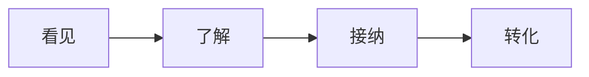

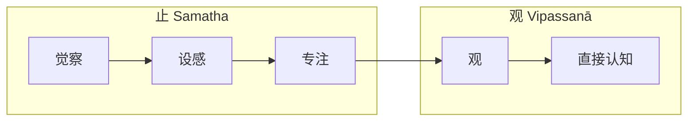

---

## 第一编 课程总论

### 一、课程定位与认证体系

本课程为**港中文（香港中文大学）& MOCICI 联合认证冥想执行师课程**第一阶（Course 1: Meditator），是培养合格冥想执行师的完整理论与实修体系。

**课程目标**：

1. 建立对冥想的科学化、系统化认知
2. 掌握止观（Samatha-Vipassanā）的完整原理与实修方法
3. 培养从间接认知走向直接认知的能力
4. 通过系统实修获得身心层面的实质转化
5. 达到冥想执行师认证的专业标准

**课程特点**：

- 三大理论来源：西方哲学、东方哲学（唯识中观）、止观实践方法
- 去宗教化设计，17 年打磨
- 科学循证与传统智慧的有机整合

### 二、学习路径总览

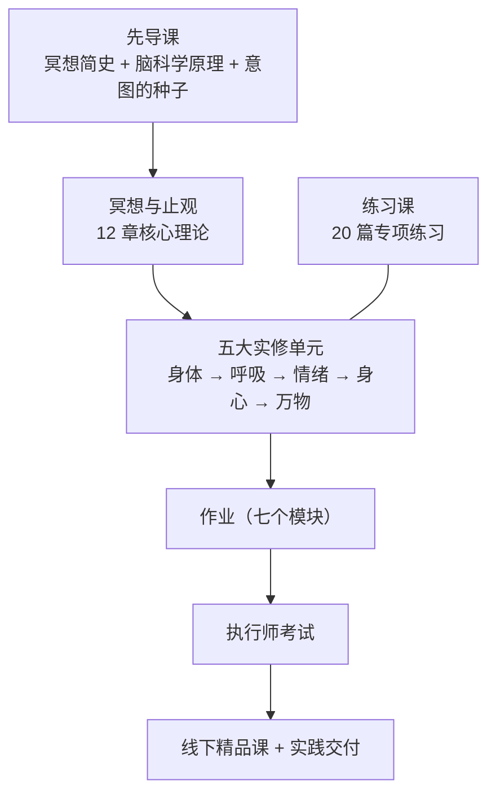

### 三、评估标准

**认证考试核心维度**：

1. 所有必修课程内容，包含先导课程
2. 清晰冥想练习的目的、方法及步骤
3. 理解直接认知和间接认知的区别
4. 结合自己的实际练习体验理解

---

## 第二编 先导课程

### 第一章 意图的种子：冥想解决什么问题

#### 1.1 冥想能解决的三个层面问题

| 层面 | 具体作用 |
|------|----------|
| **身体层面** | 修复身体疲劳、改善睡眠、提升精力、增强细胞活力、延缓衰老、提升免疫力、辅助缓解疼痛 |
| **情绪层面** | 平静内心、理解情绪波动、减轻压力、改善焦虑抑郁、提升心理韧性与内在复原力 |
| **认知层面** | 提升专注力、调节注意力、增长内在智慧、提升判断力与决策力、增强深度认知与问题解决能力 |

#### 1.2 烦恼不安的核心来源

外界的人和事难以依靠个人力量改变，身边他人有根深蒂固的模式。**核心结论**：人唯一能够掌控并解决烦恼的，就是调整自身内在的心念。

#### 1.3 认知规律

- **观念塑造认知**：人无法看到事实的全貌，只会看到自身过往经验、概念、信念筛选后的内容
- **想法不是事实**：想法仅仅是事实的一部分，而非事实全貌
- **柏拉图洞穴隐喻**：固有观念会带来认知局限，不走出原有认知，永远不会知道洞穴之外更开阔的世界

#### 1.4 心念循环与命运模式

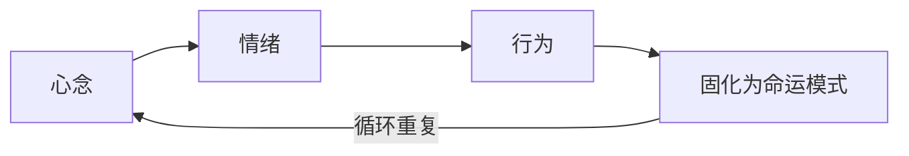

> 如果不打破心念源头，固化的循环会一直重复，最终成为无法改变的命运模式。

#### 1.5 冥想四步法（宏观框架）

| 步骤 | 名称 | 操作定义 |
|------|------|----------|
| 第一步 | **看见** | 觉察心念惯性——「不怕念起，只怕觉知迟」，看见即转变，觉察即自由 |
| 第二步 | **了解** | 抽离旁观内在模式——在觉察空间中深度梳理反应模式，不需要刻意分析 |
| 第三步 | **接纳** | 定中观察不抗拒——如浑浊水静置自然沉淀，核心是「定中生活」 |
| 第四步 | **转化** | 破茧新生——积蓄心力后创造新的生命状态，培养更好的判断力与行动方式 |

#### 1.6 有效冥想的五阶段拆分

| 阶段 | 归属 | 核心目标 |
|------|------|----------|
| **觉察** | 止 | 培养回归当下的能力，从惯性模式中抽离，积蓄内在安稳力量 |
| **设感（收摄感官）** | 止 | 主动收回对外在的注意力，将注意力导向身体感知，划分内外边界 |
| **专注** | 止 | 使用锚点训练注意力稳定维持在一处，达到住心一处的状态 |
| **观** | 观 | 带着稳定专注力，如实观照内在心念与情绪波动，穿透表象看根源 |
| **直接认知** | 观 | 消融自我意识，照见事物本质真相，获得心性智慧——终极目标 |

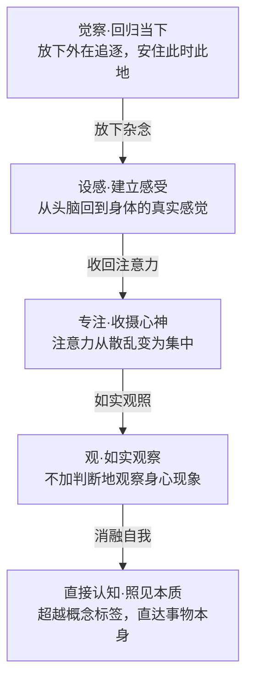

### 第二章 冥想简史

#### 2.1 西方哲学家对认知局限性的讨论

- **柏拉图**：二元世界划分——可被认知的现象世界 vs 不可被理解的理念世界
- **康德**：物自体理论——人类只能认知现象，无法理解事物本身的内涵
- **培根**：四假象理论（种族、洞穴、市场、剧场假象）——人类难以掌握世界真理
- **罗素**：认知谦卑——「我绝不会为我的信仰而献身，因为我可能是错的」

#### 2.2 「科学尽头是神学」的本质解读

本质是说明人类的理性存在局限性，仅依靠理性无法解决所有问题，需要超越理性的方法来补充。

**佛教修行核心逻辑**：因戒生定、因定生慧。所有殊胜善根依靠禅修获得（《大毗婆沙论》）。

#### 2.3 冥想的官方定义

> 冥想是通过正念等特定方法，将注意力集中在特定对象上，训练注意力与意识，最终达到精神清晰、情绪平静稳定状态的练习。

#### 2.4 冥想相关概念谱系

瑜伽、禅定（三摩地/三昧）、静虑、禅那、正念、止观——均属于冥想的范畴。

**止观的核心逻辑**：止对应定、观对应观照。只修定不修观无法成就。

#### 2.5 冥想史核心脉络

| 时间 | 里程碑 |
|------|--------|
| 公元前1500–500年 | 《梨俱吠陀》——最早有冥想记载的文字 |
| 公元前1000–500年 | 奥义书——冥想体系化成型，提出瑜伽六支，确立梵我合一目标 |
| 16世纪 | 冥想通过天主教进入西方宗教体系 |


#### 2.6 中国传统冥想思想

- **道家**：「致虚极，守静笃」（《道德经》）；庄子心斋与坐忘
- **儒家**：「知止而后有定，定而后能静，静而后能安，安而后能虑，虑而后能得」（《大学》）

### 第三章 脑科学原理

#### 3.1 学科定位

冥想被归类在脑科学下的心理学研究范畴。

#### 3.2 科学监测证据

- 冥想深度状态出现**特征性伽马波**，该特征无法造假
- 不同人出波时间为 **7–48 分钟**不等
- 正念冥想 **3 分钟**可观测到脑区活动变化，建议最少 **30 分钟**

#### 3.3 长期冥想的结构改变

- 增加大脑灰质体积
- **16 个**相关脑区可观测到明确变化
- 延缓大脑衰老
- 增加特定脑区的功能代谢

#### 3.4 适用人群

| 人群 | 作用 |
|------|------|
| 儿童青少年 | 治疗多动症、改善抽动症、焦虑症、抑郁症 |
| 老年人 | 减少脑结构退化、增加脑容量、预防老年痴呆 |
| 看护者 | 减轻压力、改善情绪与认知状态 |
| 成年人 | 减少压力性进食、改善默认模式网络功能连接 |

#### 3.5 关键神经科学概念

- **DMN（默认模式网络）**：自动化的反刍思维、自我参照活动的神经基础
- **TPN（任务正性网络）**：专注当下任务时激活的网络
- **杏仁核 vs 前额叶**：杏仁核应激反应速度比前额叶快 0.08–0.8 秒；冥想觉察创造停顿空间，让前额叶有时间调控杏仁核
- 长期冥想：降低 DMN 活跃度、激活 TPN，前额叶灰质密度提高，杏仁核体积缩小

**DMN 与 TPN 对比**：

| 维度 | DMN（默认模式网络） | TPN（任务正性网络） |
|------|---------------------|--------------------|
| 激活场景 | 走神、白日梦、反刍思维 | 专注当下任务 |
| 与冥想关系 | 过度活跃 → 焦虑内耗 | 冥想训练目标 → 安定当下 |
| 长期冥想影响 | 活跃度降低 | 激活能力增强 |

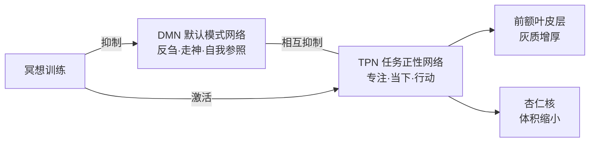

---

## 第三编 核心理论：冥想与止观十二章

### 第四章 什么是冥想

#### 4.1 冥想的核心目的

所有冥想方法的本质都是解决问题——核心是处理**人与自己、他人、世间万物的相处关系**，最终落点是如何与自己相处。

#### 4.2 东西方语境的定义差异

- **东方**：原称「静虑」，本质就是禅修——在止静基础上做有指向性的沉思观察，并非无目的的想象
- **西方**：将冥想概念宽泛化，从中拆分出正念，衍生出正念冥想等分支

#### 4.3 印度冥想体系的发展

- **奥义书六支**：调息→制感→静虑→总持→思择→等持（三摩地）
- **瑜伽经八支**：在六支基础上增加外在戒律控制和身体体位调整
- **核心目标差异**：奥义书/瑜伽经的目标是梵我合一；佛教的目标是认识真相断除烦恼

#### 4.4 止观的精确定义

| 概念 | 梵文 | 定义 | 核心功能 |
|------|------|------|----------|
| **止** | 奢摩他（Samatha） | 让心念系住一处不散乱，身心安定宁静 | 获得稳定定力——冥想的必不可少基础 |
| **观** | 毗婆舍那（Vipassanā） | 在止的基础上对对象进行观察 | 获得正见与智慧——冥想的最终目的 |

> **「没有止的冥想叫乱想。」** ——本课程核心金句

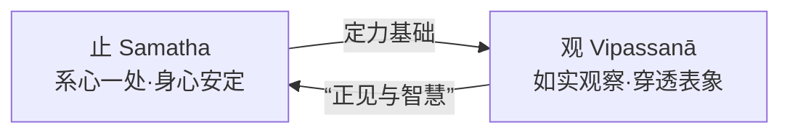

### 第五章 冥想的作用

#### 5.1 教学原则

讲解习惯是先说明「为什么做」，再开展实践，说明原理是为实践服务。说明原理能降低实践难度，提升实践动力。

#### 5.2 观的定义与核心作用

**定义**：观是对特定对象进行觉察、体会、感受、领略、映照、相应、熏习，观察对象可以是画面、事件、语言等具体内容。

**三个核心作用**：

1. **发掘问题根源**：找到情绪产生的过程，而不是只处理情绪结果。举例说明和伴侣发生冲突后，通过观能复盘整个事件和情绪发生的完整过程，找到根源。
2. **明确解决方法**：观察到根源后，能明确解决问题的方法。
3. **在观中直接完成问题解决**：解决结果再放到日常生活中试炼。

> **「解决情绪永远都是在处理结果，就像跟影子作战，永远刺不到敌人的心脏，所有功夫都是白费。」**

**观的练习逻辑**：类似太极拳训练，需要先在打坐冥想中锻炼能力，再到日常生活中历练，反复循环逐步提升心力与解决问题的能力。

#### 5.3 观察的三类局限性

看清问题的观必须建立在止的能力基础上，没有止的能力，观很难做到精确。

人的观察受三类因素限制：

| 限制因素 | 具体说明 |
|----------|----------|
| **观察位置** | 决定了观察必然有盲点，站在不同位置只能看到事物的不同部分，不可能全观 |
| **观察工具** | 不同工具看到的世界完全不同——人类用肉眼观察，苍蝇用复眼观察，结果差异极大 |
| **观察经验** | 每个人成长环境、地域、家庭带来的不同经验，会过滤认知结果，形成认知偏差 |

> **「你所有的观察一定有盲点，我们至少在起点上要知道我们可能有盲点，这是非常重要的一件事情。」**

#### 5.4 认知偏差的本质——皇帝深宫隐喻

每个人认知世界都像住在深宫的皇帝，只能透过想法（大臣）、感觉（宦官）间接了解世界，经过翻译的世界不是完全真实的世界，只是折射后的认知。我们默认这套VR系统认知的世界就是真实，其实并不符合真实样貌。

> **「我们从小到大就带着我们的VR，你很难离开这套VR，你就会把这一套VR认知的世界当做完全真实的世界，但事实上它并不那么真实。」**

基于偏差认知做出的生命选择和事件判断，容易出现方向偏差，观的作用就是停下原有角度、工具，重新认知事物，获得更接近真实的结果。

#### 5.5 两种观的分类

止观冥想分为**观察问题的观**和**解决问题的观**，当代止观冥想绝大多数使用解决问题的观，核心目的是解决问题。

**解决问题的核心指向**：真正要解决的不是外部具体事件，而是内在情绪产生的根源，比如解决的不是「和太太吵架」这个事件，而是「为什么会生气」这个根源问题。

**传承背景**：止观禅修源自释迦摩尼的修行，释迦摩尼透过观找到烦恼焦虑的根源，后人沿用他总结的方法解决问题，普通人可以直接用已经总结好的方法解决问题，不用自己成为医生，只要能判断方法是否适合即可。

#### 5.6 解决问题的观的核心逻辑

**核心原则**：心的问题必须由心解决，不是调整外境，而是调整我们的意识形态，尤其是浅层意识与行为动机，不是只调整表层想法。调整动机后，行为自然会改变，不会出现「想得到却做不到」的问题。

**两类解决方式**：
1. 一面看清问题一面微调扭转，类似自己学医配药解决自身问题
2. 直接借鉴成熟方法自我熏习，类似找信任的大夫直接用现成药方

**止观循环原理**：有效冥想是通过观达到止，再在止的基础上开展更深的观，往复循环逐步深入。获得止的能力后，能和事物保持一定空间，减少外境干扰，相当于给身体加上防护盔甲。

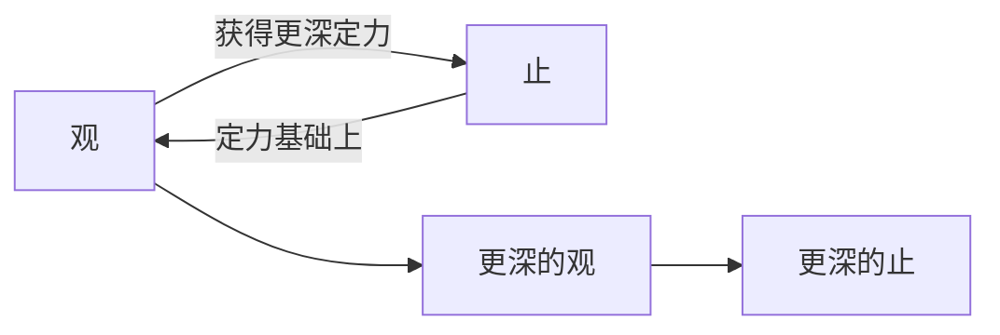

**止的使用尺度**：止不能过度依赖，如果把止变成封闭的碉堡，虽然能隔绝干扰，但也看不到问题根源，所以要把握尺度，既要防护干扰，也要能观察问题。

#### 5.7 止观冥想的边界定义

- **不包含表层思考**：表层思考不属于止观
- **不包含没有止基础的观**：没有止的观只是编剧式臆想，不能达到止观的作用
- **对臆想的态度**：允许进行编剧式想象，但不能将其定义为能产生效果的止观冥想

#### 5.8 智者大师提出的三种止

| 类别 | 定义 | 特点 | 举例 |
|------|------|------|------|
| **制心止** | 用意念强迫心念停下来 | 费力难持续，日常生活中收效甚微 | 每个人都可以通过憋气、咬牙等方式短暂让头脑空白 |
| **系缘守境止** | 主动设计一个所缘境，让心念主动依附在固定对象上 | 传统禅修最常用的基础训练方法，属于阶段性的拐杖，不是最终目标 | 给心找一个家，心念有固定依止的地方，就不会不断向外奔忙 |
| **体真止** | 体会真相后自然让心止息 | 最不吃力的止，不需要用力控制也不需要转移注意力 | 如果明确知道长期刷手机会导致脑瘤，自然而然就不会再刷 |

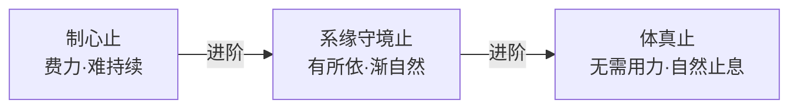

#### 5.9 定力锻炼的动力与时间

**动力不足的原因**：很多学员锻炼定力无法持续，核心原因是不知道没有定力会带来坏结果，只是单纯知道锻炼有好处，动力不足。如果像走在悬崖边，一步错就会跌落，自然就会保持精进。

**时间投入**：锻炼定力严格来说不需要额外花专门的时间，可以结合日常生活的走路、吃饭、工作、散步等活动开展。只有观的练习需要专门抽出一点时间。

#### 5.10 定力锻炼的核心目标

> **「定最重要的不是获得一时叫做定的状态，它其实是要获得一个叫做定的特质，定这件事情已经成为你的个性上的特质了。」**

很多人锻炼定力追求一时的定的状态，实际上核心目标是把定力变成个性特质，让定成为日常稳定的状态，而不是只有打坐时才会出现的偶发现象。

**偶发定态难以复制的三个原因**：
1. 偶发获得，不知道原理，无法重复
2. 获得美好状态后开始追逐，追逐的行为反而让状态无法重现
3. 无法将打坐的定结合到日常生活中，打坐和生活割裂，很难产生持续效果

#### 5.11 动中定与静中定

**分类与优先级**：培养禅定个性需要动中定和静中定两种训练，**动中定比静中定更重要**。

> **「定力的锻炼呢，动中定的锻炼比静中定的锻炼要重要。」**

**原因**：静中定就是坐姿打坐的静定训练，是必要的深化训练，但大多数人一天最多只能抽出3小时打坐，剩下十几小时都在日常生活中。如果日常生活能维持稳定的心智状态，打坐时就能快速进入深度定境，形成良性循环。

**动中定与静中定对比**：

| 维度 | 动中定 | 静中定 |
|------|--------|--------|
| 练习场景 | 日常活动（走路、吃饭、工作） | 坐姿打坐 |
| 时间占比 | 一天十几小时 | 一天最多 3 小时 |
| 核心作用 | 将定融入生活，积累连贯性 | 深化定力，进入更深定境 |
| 优先级 | **更重要** | 必要的深化训练 |
| 互补关系 | 动中定积累的基础让静坐更快入定 | 静坐深化的定力延续到日常 |

### 第六章 练习止的关键词

#### 6.1 第一个关键词：活在过程（即活在当下）

大多数人习惯直奔结果，忽略当下过程，心永远放在未发生的事情上，无法全力应对当下。活在过程就是清楚知道自己正在做什么，让心与当下的动作共处，自然就能达到活在当下的状态。

> **「活在当下是一个结果，活在过程了，它必然就会活在当下。」**

**动中定与静中定对比**：动中定力的锻炼比静中定力锻炼更重要，同时方法要领更简单，普通人更容易上手掌握。

**日常练习要点**：
- 刚开始练习建议先从站起来、坐下、走路等简单自我动作开始，不要先从讲话思考这类高难度动作开始
- 可以定闹钟提醒自己回到当下，养成随时活在过程的习惯
- 即便忘记保持觉知也不需要懊恼，忘记是旧习惯带来的正常结果，不需要纠结上一刻的失误

#### 6.2 动中禅定的强化练习方法

| 方法 | 具体说明 |
|------|----------|
| **慢跑** | 人在慢跑达到状态后，心会止静下来，获得清安定的愉悦感；可以在日常生活中复制 |
| **瑜伽体式** | 结合活在过程的原理，成为动中定的强化训练 |
| **八段锦** | 传统功法，可结合动中定练习 |
| **太极拳** | 传统功法，可结合动中定练习 |
| **写书法** | 结合活在过程的原理，成为动中定的强化训练 |
| **猫步**（重点推荐） | 学猫走路，全程活在走路的过程中，把注意力收回到自己身上，能量不会向外发散 |

**猫步的具体方法**：
- 略微保持膝盖弯曲，不伸直
- 每一步缓慢踏出，前脚完全站稳后再抬起后脚，重心缓慢前移
- 初始可关注脚底接触地板的触感，把它作为所缘境收摄心念
- 熟练后不用低头看脚，目视前方靠足部感受即可
- 不需要大场地，适合在家练习
- 原理和南传佛教的慢经行一致

#### 6.3 静坐三步骤：调身、调息、调心

静坐也需要遵循活在过程的原则，准备工作分为调身、调息、调心三个步骤，调身、调息都是为调心服务，最终目的是让纷乱的心趋于稳定。

##### 调身：姿势详解

**双盘姿势的误区纠正**：传统静坐建议双盘是因为古代没有现代软垫，双盘能形成三足鼎立的稳定结构，还能聚集能量帮助气血循环；但现代人从小坐椅子，骨骼已经成型，强行硬掰双盘容易造成身体损伤，不建议初学者勉强双盘。

> **「打坐是在打坐，不是在练腿功。」**

**不同盘腿方式的处理**：

| 姿势 | 处理方式 |
|------|----------|
| 不能双盘 | 选择单盘，给悬空的膝盖垫稳，左右腿定期轮换避免脊柱侧弯 |
| 单盘不适 | 选择散盘 |
| 散盘也不适应 | 直接伸开腿，不用勉强，保证舒适即可 |

**上半身姿势要点**：
- 不要全靠在靠背，仅靠腰部支撑即可，避免过于舒服睡着
- 不要一直挺腰，容易上火导致便秘
- 不能塌腰
- 吸气挺胸后呼气放松的状态就是最合适的姿势

**手部姿势**：不同结印的要求本质和环境温度有关——南方气候热手掌向上打开散热，北方气候冷双手握住聚热，没有额外的神秘作用。

##### 调息：操作方法

调息不需要复杂操作，也不是练气功，上座后只需要做3个深呼吸即可。只需要知道自己吸气、呼气的过程，不需要刻意控制呼吸节奏，完成3个深呼吸后就可以进入调心阶段。

##### 调心：所缘境的选择

调心需要选择一个所缘境，用来收摄纷乱的心念，让心念从庞杂归于单纯。

| 类别 | 具体方式 | 说明 |
|------|----------|------|
| **触感类**（推荐初学者） | 扣齿、随呼吸握放右手大拇指、手放小腹感受触感 | 感受明确，更容易收摄心念 |
| **声音类** | 舒缓音乐，经典的是观音法门的听海潮音 | 声音拥有固定频率，心念依附后自然平静 |
| **呼吸类** | 呼吸觉察 | 自带潮起潮落的节奏，适合深入练习 |

**所缘境使用禁忌**：
- 不建议选择身体痛点作为所缘境，容易引发内心对抗，也不利于痛点疏散
- 同一座静坐中不要频繁更换所缘境
- 初学者可以多尝试不同方法，找到适合自己的之后固定使用一段时间再更换
- 如果部分人一关注呼吸就紧张打乱节奏，不需要勉强，可以换其他所缘境

#### 6.4 第二个关键词：一期一会

该词源自日本茶道，后被广泛引用，指所有事件都是唯一时间与唯一空间的交叉，不会重复出现。

**实践方法**：以庄严尊重的心态面对当下每一刻，将全部生命投入当下的事项，不会让当下匆匆流逝。

**对心态的影响**：每一刻都尽全力面对，即使结果不理想也已经发挥了当下的最高水平，因此不容易后悔、纠结，也不会愧疚。

**打坐前的自我暗示**：每次上座打坐前，要告诉自己当下这一座是全生命的第一座，也是最后一座，以一期一会的心态进入打坐。

> **「你生命的每一刻其实都是唯一一次，你这一刻过了，你以后见不到它了，不管那一刻是顺、是逆、是喜或是哀，其实都是唯一的一刻。」**

#### 6.5 第三个关键词：主从分明

就像走路去目的地，清楚知道主目标，遇到干扰只是暂时偏离，不会彻底偏离目标，一定能走到终点。

**上座前的准备**：打坐前需要先确定这一座的主目标，明确自己要选择什么作为所缘境，不要三心二意频繁更换，三心二意非常耗散心神。

**定力锻炼的阶段起始**：第一个阶段是「寻」，也就是确定目标找到所缘境，确定后就轻松清醒地陪伴所缘境即可。

#### 6.6 打坐的自然发展阶段

找到所缘境陪伴后，会自然依次出现三个阶段：

| 阶段 | 表现 | 比喻 |
|------|------|------|
| **喜** | 放松稳定的满足感，出现喜就代表打坐上轨道 | 在风雨里找到安稳的住处 |
| **乐** | 充足满足感，心不会向外追逐其他事物 | 吃饱饭之后对外面的事物不再有追逐的欲望 |
| **心一境性** | 心念自然稳定，不需要用力扣住所缘境就能维持平稳状态 | — |

> **这三个阶段都是自然结果，不是刻意模仿就能获得。练习者只需要做好扣住所缘境的部分，剩下的自然发生就好。**

#### 6.7 动中定结合的必要性

> **「烧开水，你把火点着，结果烧十秒钟，你就把火关掉，停一分钟，再打开火烧十秒钟，再关掉停一分钟，你一天下来哪怕加起来的时间烧了一个小时水还是烧不开的。」**

如果日常生活中保持动中定训练，相当于一直保持小火，更容易积累水平，不会每次打坐都从头开始。

#### 6.8 第四个关键词：不要大惊小怪

打坐中所有现象的呈现都有它的原因，只是我们不一定能知道原因，不需要对陌生现象过度反应。这是避免打坐出现负面问题**最关键的原则**，绝大多数打坐问题都是大惊小怪导致的。

**走火的定义与亲身案例**：走火是打坐带来的生理问题。主讲20岁服役期间，每天打坐超过10小时持续一年，一次导引气息时分神听到爆炸声后晕倒，醒来后头痛持续了7年才完全解决。

**走火的预防原则**：不要跟着道家书籍自行练习导引气息，道家典籍大多故意颠倒书写，没有老师指导很容易练错。只要不刻意长时间瞎练，普通人很难走火。

**入魔的原理**：入魔是打坐带来的心理问题，比走火更常见，核心表现是对打坐中出现的幻境产生错误解读。

**感官放大原理**：闭眼打坐后视觉退出主导，其他感官的感受会被放大，同时闭眼后空间坐标感知会弱化，容易出现身体部位消失、飘起来等幻觉，这些都是感知失真，不是真的练成了特殊能力。

> **「我们绝大多数打坐啊，会出现问题都是因为大惊小怪所产生的。」**

#### 6.9 第五个关键词：不受二见

这个概念来自佛法经典中佛陀举的将军中箭的例子：将军中箭后不先治疗，反而要先调查射箭的人、箭的材质等所有细节，最终耽误治疗。

**核心含义**：单纯的事件发生就像中了第一支箭，不需要在单纯事件之上继续添加额外的解读、纠结和情绪，否则就是给自己射更多箭。

**实践方法**：如同浑浊的泥水要变清澈，最好的方法就是什么都不做，搅动反而会让泥沙更浑浊。打坐中尊重现象自然呈现，回到自己的所缘境，给足够的时间，现象自然会沉淀消失。

> **「所有的念头跟现象，通通都是出现之后自然就会消失的，没有任何一个念头或任何一个现象，它会一直在那里。」**

#### 6.10 第六个关键词：请宇宙之力活在眼前一瞬

这句话来自主讲的老师李老师。已经过去的事情和还没发生的事情，对当下来说都是不存在的，只是人们的记忆或想象。

**限量经验与比量经验**：当下正在体验的才是真实的限量经验，过去的记忆、未来的计划都是推理想象出来的比量经验，不是真实存在的。

**常见误区**：人们经常为不存在的过去或未来产生喜悦、骄傲、痛苦、担忧等情绪，这些情绪都是多余的，只会浪费当下的时间和精力。

> **「觉得下一站才是幸福的人永远不会得到幸福，只有懂得享受此刻幸福的人，下一站才会继续幸福。」**

### 第七章 练习止的方式

#### 7.1 声音静心原理

引磬、颂钵等声音拥有固定频率，将心念作为所缘境依附该频率后，心念会自然跟随频率平静下来。初期需要借助外力让心念平静，训练的最终目标是不再需要外力，自己随时可以让心念停下来。

> **「你要有拐杖的目的是为了有一天你能够自己走，不是为了一直依赖那个拐杖。」**

#### 7.2 打坐核心观念：活在过程 & 一期一会

- 打坐不是只有上座调身调息时才开始，而是从准备打坐前就已经开始，打坐结束后心态也要延续
- 如果将打坐和生活分成两件事，就无法做到动静一如
- 每次上座前告诉自己当下这一座是全宇宙唯一的一座

#### 7.3 数息方法实操

共四种数息方法，每种从一数到十循环往复：

| 方法 | 关注点 | 数法 |
|------|--------|------|
| 方法一 | 鼻下 | 吸气时数1到10，呼气不数 |
| 方法二 | 鼻下 | 呼气时数1到10，吸气不数 |
| 方法三 | 小腹 | 吸气时数1到10，呼气不数 |
| 方法四 | 小腹 | 呼气时数1到10，吸气不数 |

**核心原理**：四种方法都有不同比例的学员认为自己掌握得更好，没有一种方法适配所有人。数息是定力训练最常用的入门方法，但方法需要根据自身情况调整，就像鞋子要匹配脚的尺寸，不要削足适履。

**随息练习**：先通过数息找到状态，数完一轮后停止数数，单纯观察呼吸的出入，以及呼吸间隙的短暂停顿。

#### 7.4 所缘境位置轻重调整原则

**所缘境轻重的差异**：
- 用力扣住所缘境能快速让心神专注意集中，不容易被外境干扰，但耗神耗气，无法长时间维持
- 轻扣住所缘境更放松，适合心神稳定后调整，但初学者容易昏沉或心神散乱

**位置轻重规律**：

| 位置 | 重量 | 说明 |
|------|------|------|
| 眉间/头顶 | 最重 | **不推荐初学者**，现代人本来就多思考容易气滞于顶，长期关注此处容易引发偏头痛 |
| 膻中穴（胸间） | 重 | **不推荐**，容易诱发扩大心率不整的问题 |
| 鼻尖 | 中等 | 最推荐的最高位置 |
| 小腹 | 较轻 | 安全位置 |
| 脚底涌泉穴 | 最轻 | 最安全的位置 |

**调整原则**：心神散乱时用重所缘境收摄，心神稳定或身体紧张时调轻所缘境。数吸比数呼重，吸气比呼气更容易聚神，呼气更容易放松。

#### 7.5 打坐昏沉的处理方法

觉察到昏沉后，分步处理：
1. 先尝试**深呼吸、咬牙扣齿、提肛**，三种方法一起用效果更快
2. 调整2次后仍然昏沉，建议起身走一走活动调整
3. 调整后还是想睡，建议直接睡觉，睡醒再打坐，不要勉强

#### 7.6 初学者时长建议

> **初学者建议从3-5分钟开始练习，不要一次坐10分钟以上，宁可分多次做每次3分钟，也不要一次坐长时间。**

**原理**：初学者心力不足，长时间打坐容易积累打瞌睡、散乱的负面经验，短打坐更容易获得成功经验，能维持对打坐的兴趣，后续再自然延长时长。打坐坐得久是状态好后的自然结果，不是刻意强求的。

#### 7.7 分段打坐方法

若进行10-20分钟的较长打坐训练，建议分成多段，每段5分钟。每段结束闹钟响后，睁开眼睛活动身体、走动时，打坐的禅定状态需要延续，活动本身就是动中定的练习，下一段打坐只是动中定的延续。

所缘境调御方法：第一座使用较重的所缘境，后续逐步调轻；如果出现昏沉散乱，再换回重所缘境收摄心神，稳定后再次调轻。

> **「所缘境就像爸爸妈妈牵住孩子的手，先牵住走稳，等你成熟了，就可以松开手自己走了。」**

#### 7.8 从有所缘境到无所缘境的过渡

直接练习无所缘境容易心慌散乱，必须通过过渡阶段，从主动聚焦转为被动关注。

**睁眼预练步骤**：
1. 先在眼前找一个目标，主动把视线聚焦在目标上
2. 将焦点微微收回，放在自身和目标中间，感受聚焦程度的变化
3. 完全放松焦点，不主动投注向外的注意力，焦点安放在自身，目标自然呈现在视野中，不主动抓取，只是被动接收

**闭眼打坐迁移**：将睁眼预练的感受迁移到打坐中，原来主动抓住所缘境，逐渐退一步松开，从主动聚焦转为被动关注——呼吸仍然存在，仍然能被感知，但不需要主动抓住它，让它自然呈现。

**过渡的两个发展方向**：
1. 可以逐步脱离对所缘境的依赖，进入更深的定境
2. 会留出内心空间，搭好“舞台”，为后续的观修做准备

#### 7.9 动中定的辅助锻炼：云手

参考太极拳云手改编的动中定练习，初学者可从单手开始：向下掬起→拨到面前往外翻→到另一侧后下沉重复。练习要点：
- 不需要追求动作标准，核心是和动作本身相处，知道动作在进行即可
- 体会空气的质感：如同在水中拨水，感受空气的阻力与流动，温柔地完成动作

#### 7.10 多支箭的应对原则

外界刺激本身是中性的，对刺激的负面评判是第一支箭；随后产生的情绪、对抗、自责会接连引出第二、第三、第四支箭，不断扩大干扰。

**主从分明的安住方法**：外界刺激不需要刻意消除，只要让自身安住于所缘境成为主旋律，刺激成为不产生影响的副旋律，即可保持安定。

#### 7.11 定的松紧调整

主动松开所缘境，不是放弃所缘境，只是松开主动关注的动机。一直紧绷抓住所缘容易弹性疲乏，反而容易落入昏沉。主动松紧交替比一直紧绷更适合进入观修。

**常见问题解答**：
- 松开后念头变多：念头本来就存在，只是扣住时被压抑了，练习和念头和平相处，念头会像泡泡一样自然浮现消散
- 注意力无法一直锚定：不需要预设必须牢牢抓住固定所缘，只要能觉察念头的生灭，不跟着念头跑，就已经达标
- 收紧就散乱、放松就昏沉：建议先充分休息睡觉，打坐前先花3-5分钟无所事事彻底放松

> **「念头就是信息，没有好跟不好，它是中性的。」**

### 第八章 冥想练习的五种障碍

#### 8.1 五盖及其对治

传统禅修中将阻碍修行者到达正确方向、令主从不明的五种障碍状态称为五盖，如同盖子般笼罩本心，阻碍修行。

| 障碍 | 表现 | 心的状态 | 对应感受 | 对治方法 |
|------|------|----------|----------|----------|
| **贪** | 对好体验的执着，急迫想要再次回到该状态 | 心太紧 | 好感受 | 调松。觉察眉头深锁、身体前倾蜷缩，主动放松 |
| **嗔** | 对坏感受的不满意、焦躁与抗拒 | 心太紧 | 坏感受 | 调松。与贪一体两面 |
| **痴/昏沉** | 麻木丧失动力，落入昏昏沉沉的状态 | 心太松 | 中性感受 | 调紧：咬牙+吸气+提肛三者同时，或起身走动 |
| **掉举** | 对已发生的事不断回头检查纠结 | 散乱 | — | 长期培养「不纠结过去」的心态 |
| **疑** | 对修行方法方向产生疑惑犹豫不前 | 散乱 | — | 长期培养「不担忧未来」的心态 |

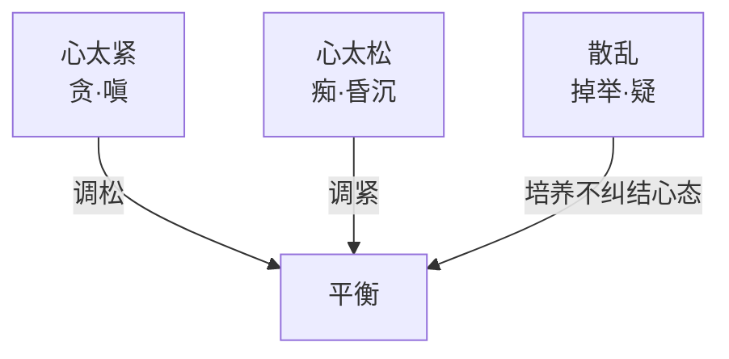

**核心原则：渐进调整，熟练生巧**。禅修如同调琴弦、学开车、打拳，一开始必然顾此失彼，不可能一下子做到完美，只需要每次修正一点点，持续练习熟练后自然会逐步解决问题。

**掉举与疑的对治核心**：
- 对过去：可以反省但无需后悔懊恼，反省后继续专注当下践行即可，过去已经发生，结果不可更改
- 对未来：可以规划但无需过度担忧，只需要负责践行计划，培养“船到桥头自然直”的勇气

> **「船到桥头自然直，船到桥头再弄就好了，弄不直到时候也有到时候的方法，你现在想那么多于事无补，只是平添忧愁，耗散你的心力而已。」**

#### 8.2 打坐定境阶段详解

##### 粗分定与细分定

绝大多数现代人日常都在这两个阶段切换：
- **细分定**：心相对止静，比如散步、泡茶、听音乐、打理花草时，处于不复杂的事务中心自然宁静
- **粗分定**：心没有达到细分定的宁静，但也并不焦躁，是现代人日常最多的状态

##### 欲界定

极度专注于感官对象达成的心止静状态，非常接近禅定，但并非禅修目标。

**普通人都有相关经验**：极限运动中与运动合一、打游戏时完全投入、追剧时完全融入剧情、工作进入心流、甚至性行为，都是欲界定的表现。

**欲界定不是禅修锻炼目标的原因**：
1. 需要高度专注紧绷，无法长时间持续，出定后会非常疲惫
2. 难以延续到日常生活中

但欲界定的专注经验可以作为参考，如果能在欲界定中自觉放松，就可以进入下一个阶段。

##### 未到地定（现代禅修核心目标）

放松版的欲界定，也是现代禅修、止观练习的核心目标。

**判断标准**：
1. **轻松清醒**：既不紧绷、也不昏沉
2. **有来无去**：可以感知到外界信息，但不会对信息进行判断、贴标签，内心不会被干扰

**特点**：未到地定不如真正的禅定稳定，容易被干扰进出，但是**进可攻退可守**：日常有事可以出定处理问题，处理完可以回到未到地定保持宁静；如果想要进入更深的禅定，从未到地定出发也会容易很多。未到地定可以在日常走路、做家务等动作中练习维持，难度不高。

> **要进入深度禅定，需要满足“后续无事务”的心理条件，只要心中有未完成的事，就很难放心进入深度禅定，因此一般人能稳定安住于未到地定就已经非常不错。**

##### 四禅八定

深度禅定分为初禅、二禅、三禅、四禅，再加上空无边处定、识无边处定、无所有处定、非想非非想处定，合称四禅八定。

> **练习止观不需要深度禅定**，观需要保持轻微的觉察力，进入初禅以上的深度禅定后，心已经完全静止，无法再做观修；想要做观修必须退回到未到地定才可以。

**定境阶段层次总览**：

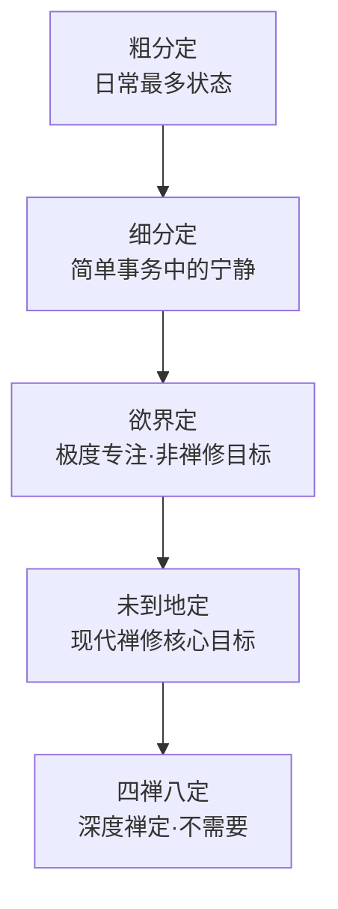

#### 8.3 现代人止观冥想的实践方向

**核心目标**：以未到地定为核心——如果能常常让自己保持在未到地定的一心一境状态，做到动静一如，生活中70%的问题都可以解决，至少面对问题时不会立刻被情绪带跑。

**古今修学基础差异**：古代人生活简单，日常劳作本身就是在锻炼动中定，基础比现代人好；现代人生活纷杂，基础不如古人，不用妄自菲薄，也不用强行追求和古人一样的深度。

**现代人的优势与陷阱**：
- 优势：视野更广阔、学习资源更便捷，智慧开发比古人好
- 陷阱：容易陷入“急于获取新知识，却不实践已知内容”的陷阱，不断追逐新的道理却永远做不到，反而造成自我分裂

> **「不可能有完美的方案，我们总是期待那个没有漏失的完美方案，其实是不太可能的，先做再修正，做比想更重要。」**

> **「我们现代人普遍理想中的自己越来越高，可是实际中的自己越来越差，做不到，这就是现代人精神容易分裂的重要原因。」**

### 第九章 定力如何解决问题

#### 9.1 定力的三重功用

1. **八风吹不动**：锻炼定力后，心念拥有固定依止处，面对色声香味触法等一切内在外境现象时，可保持稳定不被扰动
2. **集中心力**：稳定的心境不会过度纠结过去、担忧未来，减少精力分散，能将全部心力集中在当下处理的事务上
3. **看清全貌**：有定力者面对事情时会保留空间，不会立刻扑向单一细节，更容易看清事物全貌与本质，处理问题更加从容

#### 9.2 禅定是经验性试验

止观不是纯学问，是前人将自己的实践经验整理成了理论，最终目的是获得实修体验，不是只让头脑获得知识；冥想本身是解决问题的工具，只要开始使用就能产生效果，不需要一开始就练到很高水平。

#### 9.3 初学者常见反应

刚开始锻炼定力的人，一开始反应会变慢，感觉有些木木呆呆，这就像刚学开车会僵硬，是非常正常的。熟练之后就会逐渐放松。禅修中的“傻”不是真的迟钝，是心不再躁动、不再有非分欲望，甘愿安住于当下正在做的事情。

> **「人不是一直在追逐幸福，就是在想象幸福，永远享受不到幸福。」**

#### 9.4 止观观修的核心原理

**观修的前置准备：中篇思维**：上座之前就要确认观修的主题，提前在日常生活中对主题进行多次思考熟悉，不要上座后才临时想观什么。提前思考熟悉后，上座后才不会变成抽象思考，能让内容自然呈现方便观察。

**止观不是哲学思考，是现量观察**：观修必须将主题情境化、具体化，结合自身真实经验，不能停留在抽象义理的思考上。以「无常」为例：抽象讨论无常是什么不是观修，结合自己经历过的亲友离别、世事变迁的真实经验去观察，才是现量止观。

> **「世间如果没有无常，那就永远没有新的事物呈现，我们之所以出现，是拜无常之所赐。」**

**观修的心态：做摄像机不做摄影师**：观修时要成为不带评判的摄像机，如实接纳呈现的一切，不挑拣、不评判；不要像摄影师一样不断调整角度、评判好坏。

**观修对定的要求**：不需要定力达到极其稳定的程度才能起观，只要心暂时能稳定，像一个可以遮风的茅棚，就可以开始起观；观修本身也会反过来增加定力，二者是相互增上的关系。

### 第十章 练习观照的方式

#### 10.1 观的基础前提

观**不需要**达成一念不生的深入禅定，只需要获得基本稳定的心态即可开始。不需要强行驱散杂念，只需坦然接纳所有现象的呈现。

**杂念的比喻**：杂念如同山间云雾，云雾的浓淡不会完全遮挡视线，不要因杂念多而退转，急于驱散杂念反而会制造更多杂念。

> **不是「没有念头才能观」，而是「带着杂念依然可以观」，核心是不急于对境界贴标签、做判断。**

#### 10.2 观的核心理念

观的本质是停下预设判断，让观察对象自然呈现，减少有色眼镜对认知的污染，从而更接近事物本来面目。不这样做一定看不到本质，这样做才有机会接近本质。

**用相亲举例**：想要了解一个对象最好的方法就是单纯和他相处，不要心不在焉、不停比较，否则会失去真正了解对方的机会。

#### 10.3 两种止观类型

| 类型 | 操作方式 | 核心要求 |
|------|----------|----------|
| **认知型止观** | 为了了解特定对象，停下所有预设分析与比较，先单纯和观察对象相处 | 观察获得初步体会后，再放到生活中比对思考，之后再重新带入止观中深化 |
| **熏习型止观** | 选择好的内容作为观察对象，停下自身的思维判断，让自己被内容潜移默化熏习 | 理性可以帮我们规避选择坏内容的风险，但契入情感与心境的根源，必须依靠共情与止观 |

> **观后必须践行，打坐中获得的体会要放到日常生活中实践，否则只会变成颅内高潮，对生命没有实际改变。**

#### 10.4 观的第一关键：留出空间

开始练习观的第一步，是主动为观察对象留出空间，不能一直紧紧盯着所缘境，要主动从紧到松、从靠前的主动观察，退到靠后的被动觉察。

**摄像机比喻**：练习者就像一台摄像机，只需要待在自己的位置，尊重所有现象自然呈现，不需要主动指挥、判断、掌控。

#### 10.5 正念练习的定位

现代西方的正念练习源自南传佛教，经过去宗教化、纯工具化改造，核心就是培养如实接纳当下、不急于贴标签的能力。

养成习惯后，面对生活中的人事物，会自然留出缓冲空间，不再急于和不符合预期的人事物对抗，能做到尊重差异、接纳不同，减少不必要的冲突。

> **「森罗万象许峥嵘」——真正的平等不是齐头式的一致，而是允许所有生命依各自因缘呈现，认可不同存在的合理性。**

#### 10.6 观的第二关键：层层深入

观不是一次就能达成的，一定需要反复练习，每次都会比上一次更清晰、更丰富。

**三次观想练习案例**：三次观想同一空间，第一次观想后睁眼观察，再第二次观想，再实地移动观察，再第三次观想，每一次都能获得更多细节，越来越清晰。

> **越是重要的对象（孩子、伴侣、自我、人生重要议题、工作项目），越值得反复观察，哪怕反复观察一百次，每次都能有新的发现。**

#### 10.7 观的第三关键：情境化

观要有效必须情境化，通过构建具体的画面，带动相应的感受，让观察对象更具体可感，提升止观的效果。类似读小说需要构建画面，改编影视剧是把文字内容情境化。

#### 10.8 自然意象练习

先聚焦所缘境收心，再放松后退留出空间，之后选择对应意象体会：可以将自己想象成一颗石头、一座山或一棵树。核心不是想象意象外形，而是体会意象的心态：安住于自己的位置，对所有外境变化都没有意见，只是本分做好自己。

### 第十一章 练习观的关键词

#### 11.1 微笑静心练习（以境诱情）

**练习步骤**：闭目静心后，微微上扬嘴角形成微笑，在心中观照自己的微笑，感受微笑带来的轻松心境，只是放松地与这份心境共处；如果心境模糊，重复动作重新唤起感受。

**核心原理**：身体动作形成的「外景」（微笑的画面）会自然带动内在心境，主动营造的正向心境会熏习改变自身状态。该方法简单易操作，不需要高深基础，适合日常随时练习。

#### 11.2 本居地概念

人会习惯停留在特定的想法、感受、世界观中，这个习惯停留的心理位置就是本居地。如果长期陷在负面的本居地（悲伤、焦虑等），就会持续产生烦恼。通过练习将自己拉离负面本居地，就能快速改变心境，缓解烦恼。

#### 11.3 内在风水与自我调整

对现代人来说，最重要的风水是「内在风水」和「人际风水」：

1. **人际风水**：日常相处的人会持续熏习影响自己，需要主动创造适合自己的风水圈——减少不必要的无意义社交，多和志同道合、能带动你正向改变的朋友相处
2. **内在风水**（最核心）：通过禅修练习可以在自己内心创造良好的风水，闭目就可以回到平和的内在状态，不需要依靠他人滋养，自身就可以成为滋养他人的正向存在

> **「你如果有一个内在的你能够在你的心就创造一个非常好的风水。你闭目就跟他待在一起。开眼的时候活在二元的世界，可是闭目就回到0的世界。你都不需要依靠别人来滋养你，因为你就是滋养别人的那个发光体。」**

#### 11.4 打坐的核心要求

禅修打坐需要保持清醒主动，缺乏明确目的的打坐很容易变成「被动编剧」，只是跟着感觉胡思乱想，相当于在打坐中做梦，达不到练习效果。

> **「你每天张开眼睛做的梦还不够吗？你每天晚上睡觉的梦还不够吗？干嘛要打坐还去做梦呢？打坐是希望你清醒的。」**

#### 11.5 标签诱发实验

通过随机抛出不同词性的名词（狮子、樱桃、股票、蜘蛛、婴儿、蛇、垃圾、房贷、结婚、鬼、天使、大便），让学员体会：仅仅是一个名词的声音，就会瞬间在人心中诱发对应的画面与情绪反应。

**核心结论**：日常生活中我们随时都在被各种外界信息诱发情绪，但因为诱发速度太快，我们几乎无法觉察。培养不快速贴标签的能力，是情绪平和的关键。

#### 11.6 情绪止观复盘三层进阶

静心后，在心中重现最近一次让自己生气或焦虑的真实场景，直接回到事件现场观察：

| 层级 | 操作 | 说明 |
|------|------|------|
| 第一层 | 用思考解析事件发生的过程 | 间接的主观复盘，不是止观观察 |
| 第二层 | 情景再现，直接观察「什么因素诱发了情绪」 | 已经比思考解析更接近真实 |
| **第三层（最深层）** | **直接观察「生气这个情绪本身是怎么发生的」** | 这才是最有价值的止观观察 |

**练习技巧**：如果不小心陷入情绪中，就停下重新调整状态，再次重现情景，反复多次就能越来越清楚情绪发生的过程。

> **「人其实是一个一个模式，人之所以生气他反反复复生气的点都差不多。这个就轮回了，反反复复。」**

#### 11.7 人类四种根本恐惧

| 恐惧 | 说明 | 应对原则 |
|------|------|----------|
| **不存在恐惧** | 本质是对死亡的恐惧，是最根本的恐惧 | 难以彻底解决，但可以减缓 |
| **大众畏** | 对他人眼光、公众关注的本能压力 | 普遍的根本恐惧 |
| **非人畏** | 对非人类物种/未知存在的恐惧（比如怕蛇、怕蜘蛛、怕鬼） | 本质是对不熟悉事物的意象恐惧，每个人的诱发点不同 |
| **苦畏** | 对不舒服、痛苦的本能排斥 | **不要强迫自己训练「不怕」，因为「想要不怕」的根源和「害怕痛苦」的根源是一致的，接纳才是调整的起点** |

#### 11.8 送莲花止观冥想练习

静心后依次完成四次送莲花：
1. 将心中的莲花送给曾经让你生气、不快的对象
2. 将第二朵莲花送给你思念或关心的人
3. 将第三朵莲花送给今天在场你想赠送的人
4. 将第四朵莲花送给自己

**原理**：莲花本身自带普世的洁净意象，当你主动观想莲花（创造「境」），就会自然诱发对应的平和心境（产生「情」），再将这份心境和具体的人关联，会产生更强的调节效果。

### 第十二章 止观共同的关键词

#### 12.1 情境化观想的影像原则

**影像稳定性与定力的关系**：禅修打坐时浮现的观想影像，稳定性与修习者的定力直接相关。定力不足时，影像会闪烁、跳动、忽隐忽现，还未达到未到地定的程度；达到未到地定后，影像不会再闪烁忽有忽无，不要求一定非常清晰。

**观想目的对清晰度的要求**：
1. 如果观想目的是训练「止」（如藏传佛教观想本尊细节），就需要将细节逐步观想得清晰分明
2. 如果观想目的是透过影像诱发体会特定心境（如观莲花体会清净感），只需要影像能够诱发对应心境就足够，不需要追求样貌清晰

#### 12.2 禅修冥想与生活融合

**割裂的危害**：很多人修习冥想后逐渐变成脱离现实的幻想，就是因为将打坐静坐和现实生活完全割裂。

**实践方法**：完成止观/冥想训练后，要主动在日常生活的各个场景中试用学到的方法。生活事件作为观修素材——日常生活中的各类事件本身就是情境化观修最好的素材。

> **先会刹车才能开好车，修习止观帮你先学会稳定心态（刹车），不是让你一直刹车逃避生活，最终还是要在生活中用出来，不然不如不练。**

#### 12.3 主从分明

上座打坐前先明确自己这一座的目标：是修止还是修观，具体要观什么、目的是什么，确定后就以这个目标为主；一座之内尽量不要频繁更换目标；其他生起的念头、感受都属于「从」，任由它们生起灭去，不需要对抗、消灭。

#### 12.4 不大惊小怪

尤其在修观的时候，不对观修中出现的任何现象过度反应，避免给自己过度「编剧」，引导体会朝向正确的方向，不会被奇异的感受带偏。

#### 12.5 自主选择与自我负责

**尊重自我意志**：生命是自己的，不需要活在他人的眼光里，要经过清晰思考，自主选择人生方向，哪怕选择错误、不被他人认可都没有关系，重点是为自己的人生负责。

> **「人们最多能够伤害你的身体，但没有人可以伤你的心。世界上唯一可以伤你的心的人只有你自己。」**

#### 12.6 经典诗词熏习法

诗词、圣贤经典本身自带情境，是非常好的直观素材，文字只是桥梁，核心目的是透过文字体会作者/圣贤背后的心境。

**实践方法**：不需要急着拆解义理，也不需要通篇精读，找到和自己相应的句子/偈颂，经常反复吟诵，就可以被开阔的心境熏习，相当于在自己心中创造一个安定的「风水圈」。

吟诵示例：
- 「随风潜入夜，润物细无声」
- 「竹径任凭风去扫，柴门且待月来关」
- 「千锤万凿出深山，烈火焚烧若等闲。粉骨碎身浑不怕，要留清白在人间」
- 「一切有为法，如梦幻泡影，如露亦如电，应作如是观」

### 第十三章 决定与动力

#### 13.1 学习冥想的常见动机

| 动机 | 冥想的实际作用 |
|------|----------------|
| **放松与平静** | 减少心的躁动，帮助身心舒缓 |
| **提升专注** | 培养一心一意、全力应对当下事务的能力 |
| **改善健康** | 不直接带来健康，而是减少心的焦虑躁动对身体能量的消耗，帮助身体恢复正常机能 |
| **改善睡眠** | 失眠的核心问题之一是对“必须睡着”的焦虑，反而加重精神紧张 |
| **减缓焦虑** | 帮助看见执着，放松下来 |
| **了解自我** | 降低标准、接纳当下反而是更重要的自我提升 |
| **探知神秘事物** | 所谓神秘只是自身对事物不了解，本质上一切现象都是平常事 |
| **开发潜能** | 不是开发神通异能，而是打破自身固有认知对自己的局限 |

#### 13.2 愿力决定成效

止观冥想是解决身心问题的有效工具，方法和原理掌握后，最终成效取决于个人的愿力：你有多想要改变，你想用它实现什么，决定了你能坚持练习多久、能练习到多深的程度。

#### 13.3 核心警示

- **完美主义**是现代心理疾病的温床，是无明与执着的开端，是生命苦病的根源
- 对未知保持「**敬鬼神而远之**」的态度：承认其存在并保持尊重，不主动追逐、不提前恐慌
- 生活中的冲突大多来自**越界**——谁是负责这件事、掌握主导权的人，其他人只可以提建议，不能强行干预

> **「每个人如果都能把自己的门前雪扫好，那天下就太平了。」**

#### 13.4 自我提升的正确方向

普遍的认知认为自我提升就是不断提高对自己的要求；换个方向，降低标准、接纳当下反而是真正的自我提升。核心是：尽全力做好每件事，对结果保持尊重，培养倾尽全力活在当下、接纳一切现况的能力。

> **「尽力就好了，每一件事都全力做，但于结果尊重它。」**

#### 13.5 禅修核心目标链

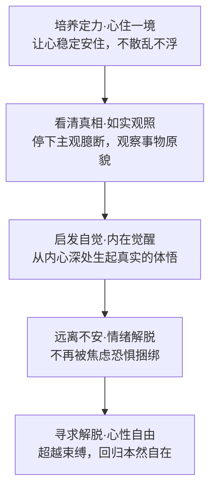

#### 13.6 课程定位与后续安排

- **本次课程定位**：针对冥想初学者，用冥想语境讲解止观禅修，侧重基础原理梳理，带领入门
- **后续课程定位**：将侧重实修练习，以练习为主，再结合实践讲解原理，会直接分享止观在禅修中的具体运用
- **本次课程的价值**：梳理出了一套去宗教化的直接认知工具，宗教、非宗教、科学领域都可以使用，不止是情绪安抚，更能从根本上改变认知与行为习惯

---

## 第四编 五大实修单元

### 统一结构说明

每个实修单元遵循三段式：**冥想练习**（座修）+ **生活觉察**（日用）+ **答疑解惑**（Q&A）

**修习递进逻辑**：由浅入深、由专注到开放。

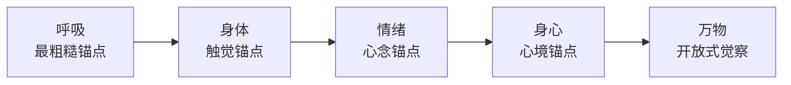

### 第十四章 与身体对话（C3）

#### 14.1 核心主题：收摄感官（设感）

**定义**：主动将原本向外抓取信息的注意力收回，引导意识从被动接收外部刺激转为主动向内回归。

**闭眼冥想的意义**：闭眼本质是收摄感官的支持性姿势，非强制要求。视觉是最消耗注意力的感官，关闭视觉能显著降低外部信息干扰。

#### 14.2 心锚定的三种方式

1. **强制意念控制**：过于费力，难以持久，不推荐
2. **锚定所缘境**：本课程核心方法，使用身体触感作为锚点
3. **自然安住**：终极目标，需练习积累，初学者难以直接达到

| 方式 | 难度 | 适用对象 | 特点 |
|------|------|----------|------|
| 强制意念控制 | 高 | 不推荐 | 过于费力，难以持久 |
| 锚定所缘境 | 中 | 本课程核心 | 使用身体触感作为锚点 |
| 自然安住 | 低 | 终极目标 | 需练习积累，初学者难以直接达到 |

#### 14.3 以身体为锚的两类冥想

**动态冥想**：
- **运动冥想**：精细觉察动作模式、发力位置、骨骼配合，将每个动作分解为微小单元进行觉察
- **行走冥想**：提-落-放，觉察动作轨迹，重心转移的每一个微小变化
- **小幅度冥想**：指节冥想/NASA 冥想、五指呼吸冥想，适合日常随时练习

**静态冥想（身体扫描）**：
- 遵循固定顺序（从头到脚或从脚到头），不能随意跳换
- 觉察感觉（触感、温度、重量）、感知（舒适度）与状态（清醒度）
- 遇到紧张区域不强行放松，只是觉察并允许其自然呈现
- 扫描过程本身就是「看见」的练习——觉察即转变

#### 14.4 姿势要点详解

| 姿势 | 核心要点 | 适用场景 |
|------|----------|----------|
| **站姿** | 锚定双脚支点，觉察重心分布，微屈膝 | 日常等候、乘车时练习 |
| **坐椅式** | 不坐满椅背，双脚落地，重心微后调 | 办公室、日常练习 |
| **盘坐式** | 坐骨承重（非尾骨），膝低于髋，不盲目追求双盘 | 正式冥想练习 |
| **仰卧式** | 腰底保留「慈悲的距离」（三指节空间） | 睡前练习、身体疲劳时 |

> **「冥想是调心的练习，不是练腿的技巧。」**

#### 14.5 答疑解惑：冥想的姿势选择

**意识状态的三类分类与冥想核心目标**：意识大体可分为激性（偏激活跃，对应紧张焦虑）、惰性（昏沉怠惰，对应拖延低落）和月性（平静清明）三种状态。冥想的核心目标是在两种极端状态之间创造平衡，让意识进入平静清明的「月性」状态。

**姿势选择的依据**：如果当下意识昏沉怠惰，选择动态站姿或坐姿调动积极性；如果意识过度活跃，选择静态放松的姿势平复情绪。不要求固定标准坐姿，只要姿势能支持意识保持清醒觉察，任何姿势都可使用。

**脊柱的核心作用**：大脑神经穿过脊髓通道，脊柱是否延展、中正、舒适，直接影响意识状态。无论站、坐、躺、行走，都要保持脊柱延展中正。身体保持紧而不僵、松而不懈的状态。

**身体结构排列**：将身体从脚到头想象成逐层叠加的楼层，下层越稳定，上层越轻松。坐姿需要骨盆、腹部、胸腔、头颈纵向对齐，小腹微收、胸腔松软，维持足够腹腔空间。

**盘坐的适配性**：盘坐能支持脊柱延展，正好处于激活与放松的平衡，双腿向内收拢帮助意识向内集中。不强制要求标准莲花坐/单盘/双盘。如盘坐酸麻干扰，可选择小腿落地、大小腿呈90度的坐姿，不建议瘫坐沙发。

**酸麻的应对**：酸麻是正常生理反应，训练方向不是消除酸麻，而是训练意识不被酸麻干扰。初期可练习和酸麻共处1分钟，逐步延长。将注意力稳定在冥想锚点上，自然会忽略酸麻感受。

**躺姿的限制**：训练清醒觉察目标不推荐躺姿，躺姿过于放松易进入昏沉。辅助入睡目标可选择仰卧，允许在练习中睡着。

**冥想与睡眠的脑波区别**：清醒对应贝塔波，冥想放松对应阿尔法波，深度冥想前期对应西塔波，深度睡眠对应德尔塔波，深度冥想呈现伽马波。分水岭在西塔波阶段：保持清醒进入深度冥想，反之滑入睡眠。

**应对昏沉的四种方法**：①尊重身体需求，睡饱后再练习；②切换锚点唤醒意识（扣齿、握拳、提肛、调整呼吸）；③选择清醒时段练习（如早起活动后）；④熟练后深度冥想10分钟约等于睡眠1-2小时的休息效果。

> **"冥想的练习，其实就是在两种极端的意识状态中间去创造一个平衡，这个平衡就是月性。"**

#### 14.6 生活觉察：和身体建立亲密关系

**身体讯号的诚实性**：身体比头脑中的想法更敏感、更直接、更诚实。遇到喜欢的人/环境感觉舒适放松，遇到排斥的会感觉拘紧不适。大脑会出于对不安全、不被接纳的恐惧本能屏蔽部分内在讯息，而身体反应不会被轻易屏蔽。

**和身体建立关系的三个核心探索方向**：
1. **是否愿意和身体相处**：核心是是否接纳身体——是否愿意照镜子观察自己，是否习惯性批评挑剔身体不完美，是否能安静将注意力锚定在身体上
2. **是否了解身体感受**：很多现代人已经不知道放松是什么感觉，无法准确识别冷热、松紧等基础感受
3. **是否愿意对身体表达感谢**：身体是支撑人完成所有生命探索的重要伙伴

**现代人失去身体连接的两类原因**：①现代生活方式过度依赖头脑，久坐缺乏运动，身体感知逐渐麻木；②过度向外追求财富、成就、外在关系作为人生锚点，通过向外索取回避直面内在。

**正确态度**：接纳身体本来的样子（阿德勒自卑心理学：人天生自带自卑特质，总能找到不完美的部分）；保持感知敏锐度，不因害怕过度敏感就屏蔽身体讯号。

**具身认知理论支撑**：认知是大脑、身体和环境互动塑造的结果，不只是大脑单独的功能。身体感知的敏锐度直接决定认知的内容、方式和过程。

**与身体对话的五步练习流程**：①觉察身体动作→②觉察身体感受→③觉察身体状态→④根据身体需求采取支持行动→⑤对身体表达感恩。推荐傍晚时段练习。

> **"身体是我们重要的生命伙伴，不仅支持着你去探索一切你想要探索的事物，同时也是我们的内在精神居住的安全空间。"**

### 第十五章 与呼吸同频（C4）

#### 15.1 核心原理

> **「呼吸动心念动，呼吸止心念止」** ——传统瑜伽经典核心结论

呼吸是连接身体与心识的桥梁。呼吸具有双重属性：既是自主神经控制的无意识过程，又可以被意识主动调节。这使得呼吸成为从身体层面进入心识层面的天然门户。

越专注于精微的觉察对象，心念越容易主动归于平稳。

#### 15.2 腹式呼吸的科学原理

吸气时横膈膜下沉→挤压内脏→腹部向外鼓胀（**非**气息进入腹部）。呼气时横膈膜上提→内脏回位→腹部自然回收。

腹式呼吸的生理效应：
- 激活副交感神经系统，降低应激反应
- 增加肺部气体交换效率
- 按摩内脏，促进消化循环

#### 15.3 呼吸觉察练习

**粗层次（初始练习）**：
1. 觉察「正在吸气/正在呼气」
2. 觉察快慢节奏、吸呼长短
3. 觉察全程：鼻腔→口腔后侧→喉咙→胸腔→腹腔
4. 不刻意控制呼吸，只是观察其自然节奏

**精微层次（进阶练习）**：
- **内屏息**：吸气结束后、呼气开始前的自然停顿
- **外屏息**：呼气结束后、吸气开始前的自然停顿
- 区分自然停顿与憋气——吸气八九分，不刻意用力
- 停顿是心念最静止的时刻，也是观察心念的最佳窗口

#### 15.4 数息冥想

- **基础规则**：1–10 循环计数，数到 10 回到 1；走神回到 1
- **关键原则**：自然数息，不刻意调息
- **数吸与数呼的差异**：数吸更容易聚神（重），数呼更容易放松（轻），根据自身状态选择

#### 15.5 专注式冥想核心原则

> **走神后必须将注意力从干扰对象带回呼吸锚点——在不断「带回」的过程中训练注意力稳定能力。**

这是专注式冥想与开放式冥想的核心区别。走神不是失败，「发现走神并带回」才是训练的核心动作。

#### 15.6 进阶：5050 法则

- 50% 注意力在锚点/事务，50% 保持松弛觉察自身状态
- 练习「松开不丢」的松弛锚定状态
- 这是从「专注」到「观」的桥梁，也是从有所缘到无所缘的过渡准备

#### 15.7 答疑解惑：冥想中的呼吸

**呼吸的本质：横膈膜完全式呼吸**：不需要严格区分胸式与腹式呼吸。腹部的起伏是横膈膜移动挤压内脏的自然结果，自然呼吸本身就是横膈膜主导、胸腹腔同时参与的呼吸，瑜伽中称为完全式呼吸。不要刻意强迫切换为腹式呼吸，刻意调整反而会让神经系统紧张。

**三维呼吸观想**：不要只关注身体前侧起伏，将整个体腔想象成一个气球：吸气时整个身体均匀向外饱满扩张，呼气时自然微微向内收缩。这种方法可打开纵向呼吸通道，消除对胸/腹式的执着。

**数息练习紧张的调整**：数息是偏“重”的锚定方法，不需要长时间整段保持，只从1数到10循环即可。计数节奏要放慢，单次呼吸在6个数以内。如调整后仍紧张，可直接停止使用数息法，替代方法：手触碰身体感知呼吸、手指呼吸法。

**冥想专注四阶段**：①收摄心念：在呼吸里安顿，加入锚点拉回散乱心念；②安住觉察：稳定锚点远离心念扰动；③松开重锚点：杂念减少后回到轻松呼吸锚定；④松掉呼吸锚：无需刻意收摄，安住内心安定，只保留10%呼吸觉知。

**呼吸间停顿的要点**：停顿必须是自然的，呼吸轻盈自然地滑入停顿空间，像滑滑梯一样自然停下。一定要尊重当下状态，从0.1秒开始循序渐进。

**呼吸锚点与身体锚点的选择**：身体锚点更粗大、更易锚定，适合注意力稳定度不足的练习者；呼吸更精微、更少受情绪扰动，是进阶方向。习惯身体锚点者需逐步向呼吸过渡；习惯呼吸锚点但难以锚定身体者，可能与身体存在断联。

> **"不要着急，要让一切自然发生，这个也是我们在冥想当中非常重要的态度。"**

#### 15.8 生活觉察：用呼吸安定身心

**内心不安的核心成因**：大多数人缺少内在调节路径，习惯将注意力放在外界，依赖外在结果与他人评价获得自我认可。越企图掌控外在、获取外在认可，越容易陷入惶恐不安。

**呼吸安定身心的原理**：
- **传统视角**：汉字“息”本身就是“自心”的组合，梵文“冥想”的核心含义就是收拢收回呼吸
- **神经科学视角**：吸气激活交感神经（应激状态），呼气激活副交感神经（放松状态）
- **呼吸与情绪的对应**：焦虑紧张→急促短浅（超过20次/分钟）；愤怒激动→节奏混乱；平和放松→均匀缓慢
- **研究结论**：科学家可通过呼吸模式以96.8%的准确率识别个体，呼吸模式如同指纹具备个体独特性

**谐振式呼吸（盒子呼吸）**：吸气、内屏息、呼气、外屏息四个阶段时长相等，是平稳神经系统最有效的呼吸方式。标准比例为4:4:4:4，但必须循序渐进：从当下能做到的最短等长时长开始（如2:0:2:0），逐步进阶。

**进阶路径**：①先练无停顿等长呼吸2:0:2:0，优先加呼气后停顿，逐步延长到4秒；②加入吸气后停顿，达到4:0:4:0；③逐步延长停顿，最终达到4:4:4:4标准盒子呼吸。

> **"所有外在的因素都是我们难以掌控的，我们只有可以掌控自己的内在。"**

### 第十六章 与情绪共处（C6）

#### 16.1 核心主题：如实观照心念

观照如同照镜子，核心要求是**「如实」**反映事物本来面貌。

#### 16.2 如实难做到的原因

内心镜子被以下因素染污：

| 染污因素 | 具体表现 |
|----------|----------|
| **主观视角与过往经验** | 我们看到的不是事物本身，而是我们经验筛选后的内容 |
| **预设判断形成的「模具」** | 所有事物都被塞入预设的分类框架 |
| **二元分别心** | 好/坏、喜欢/不喜欢的自动评判机制 |
| **执着** | 对自由束缚最大的染污，让我们无法如实看待 |

#### 16.3 观照的操作方法

1. 保持观察者视角，与感受保持距离——如同站在河岸看水流，而不是跳入水中
2. 穿透表象，看到引发情绪的根源——不是「我生气了」，而是「是什么让我生气」
3. 不急于分析，只是如实观看——让情绪自然呈现其完整过程
4. 区分「陷入情绪」与「观察情绪」：前者是参与者，后者是观察者

#### 16.4 水面类比

> 心如止水时既能映照外物也能看清内在；浑浊时只需允许扰动自然沉淀。

#### 16.5 答疑解惑：冥想的效果

**常见误区：“冥想是情绪按摩”**：大众普遍需求是放松情绪、转移注意力，但冥想是主动内观练习，而非被动营造体验。错误意图会导致练习无效。

**两种练习意图的区别**：

| 维度 | 被动缓解情绪 | 主动成长改变 |
|------|------------|----------|
| 驱动方式 | 依托环境、引导、氛围等外在条件 | 由练习者主导 |
| 效果持续性 | 体验无法精准复刻，受外在条件掌控 | 从根源转化引发情绪的内在信念机制 |
| 本质定位 | 情绪释放体验 | 主动内观练习 |

**冥想的核心目标**：获得内在恒久稳定的平和喜乐。培养的不是暂时舒适感，而是情绪觉察力与接纳力、心理韧性、注意力管理与认知转化能力。

**止观双运的练习原则**：先修止再修观。在没有获得足够稳定能力前，不要过早深入修观，否则容易因觉察到情绪后无法应对，引发更多波动。定力培养是自我保护，也是内修成长必须踩稳的阶梯。

**练习很久还是静不下来？**：冥想培养的是和任何状态共处的关照能力，静是状态，不静也是状态。强求静下来本质是贪（只想要好状态）、嗔（抗拒不完美状态），会带来内心扰动。只需保持念头清净，只观察不互动，扰动自然会变化消散。

> **"冥想不是避难所，不是用来逃避的美好幻觉。就像训练身体的肌肉一样，你也可以训练你的情绪智慧、心力的肌肉。"**

#### 16.6 生活觉察：观照情绪故事

在日常生活中观察情绪的升起、持续、消退过程。当情绪出现时，不急于行动或压抑，而是停下来问自己：「此刻正在发生什么？」如同观烟的练习——只是观察烟的自然变化，不需要要求烟变化出你想要的特定形状。情绪的故事有开始、高潮、结尾，允许它完整呈现，不中途干预。

### 第十七章 与身心同在（C7）

#### 17.1 核心主题：心境转化心念

**两种观心念方法**：

| 方法 | 比喻 | 操作方式 | 止观类型 | 要求 |
|------|------|----------|----------|------|
| **层层探究法** | 自学医治病 | 抽离观察者视角，逐步深入找到根源 | 认知型止观 | 需要勇气和耐心 |
| **榜样熏习法** | 直接用药 | 直接借助目标心境转变当下状态 | 熏习型止观 | 如微笑冥想、送莲花冥想 |

#### 17.2 五层深度觉察（瑜伽五层身体）

```
身体（粗身）→ 气窍（呼吸/能量身）→ 心窍（情绪品质/心理身）→ 智窍（心念/智慧身）→ 真实自我（妙乐身）
```

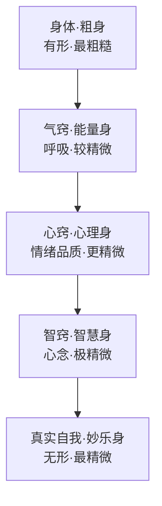

每一层都比上一层更精微，觉察对象从有形到无形，从粗糙到细腻。冥想的过程就是由外向内、由粗到细的觉察过程。

#### 17.3 境随心转

改变的不是外境而是内在心境——心念一变，幻象力量即被转化。同样的事件，在不同的心境下会呈现完全不同的意义。

#### 17.4 冥想目的的三个核心层面

1. 突破间接认知局限，获得直接认知
2. 从根源松动心念习性
3. 重建与自我、他人、世界的关系

#### 17.5 练习状态五标准

```
乐（喜悦满足）→ 定（稳定安宁）→ 安（安稳自在）→ 明（清明觉知）→ 爱（慈悲开放）
```

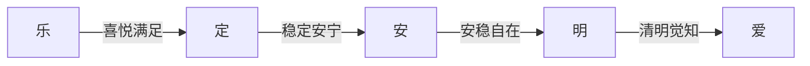

这是逐步递进的状态，不是一次性达到的目标。每一次练习都可能在不同的层次上体验。

#### 17.6 践行三大原则（出自《瑜伽经》）

- **持续精进**：持之以恒，不轻言放弃
- **不执着**：不追求特定结果，允许一切自然呈现
- **正信**：相信方法的有效性，相信自身的转化可能

#### 17.7 答疑解惑：冥想的目的

**常见误区**：错误将“学习掌握所有冥想工具”当成练习目标。方法只是通往目标的道路，如同“以手指月，指月非月”、“竹筏渡河，过河放筏”，不要对工具产生执着。

**达成目标的三要素**：①清晰正确的目标；②有效的适配工具（当前阶段核心是试错，找到最适合自己的工具）；③持续的内在动力（来自对改变的渴望，是成长性思维的正向渴望）。

**践行三大原则详解**：
- **持续精进**：选好工具后持续往前走，不要一直停留在试错阶段。工具不存在完美，是在练习过程中逐渐匹配的。哪怕每天只练习3分钟，也要保持规律持续。先给自己定一个三个月的每日练习约定
- **不执着**：放下对结果的控制，专注当下行动。结果受多重因素影响，对结果要有耐心，成长如爬山，有起有伏都是前进
- **正信**：信念基于正见，不鼓励盲信，但不要反复怀疑纠结。信念的强度决定达成目标的速度

**掌控人生马车的比喻**：车身=身体，马=感官，缰绳=心识，车夫=智慧，乘客=本心本性；车轮=持续精进+不执着，道路=信念。信念越强道路越开阔，信念越长远道路越长远。

> **"从你的所在之处出发，你一定要知道你现在在哪，你就从哪出发。信念的程度，决定了你达成目标的时间。"**

#### 17.8 生活觉察：如何过好人生

**核心命题：为什么听过很多道理依然过不好一生**：多数道理只停留在头脑认知层面，未经过个人实践与内在体验。知道道理不等于掌握真理，只有让道理在真实生活里“活过来”，拥有生命力，才能真正被使用。

**落地原则**：过具体真实的生活，爱具体的人。真实行动是AI无法取代的，耕种、盖房子等具体行动能驯化心性，在面对不确定性时培养接纳与面对的真实力量。

**人生的本质是处理三种关系**：自己与自己的关系（最根基最重要）、自己与他人的关系、自己与周遭世界的关系。另外两种关系都是自我关系模式的复制。

**自由意志的真正内涵**：不是掌控环境，而是在任何境遇中，你永远拥有选择面对态度与行动的权利。

**奥德赛人生剧本练习**：①设计三种人生剧本（延续当前生活/应对Plan A消失/放下限制后的渴望）；②用冥想体验不同人生带来的真实心境；③锚定内心向往的方向；④转化行动障碍；⑤落实未来一周内可做到的三件具体小事。

> **"再不完美的行动也胜过完美的等待。自由意志不是掌控环境，是在任何境遇里你都有选择。真正的快乐是内心的平和安宁，是不过度卷入、不执着的自由感。"**

### 第十八章 与万物共感（C5）

#### 18.1 专注与冥想的核心差异

| 维度 | 专注 | 冥想 |
|------|------|------|
| 注意力状态 | 间断——如蜂蜜滴落 | 持续——如油顺滑流动 |
| 核心动作 | 住心一处，积蓄稳定能力 | 与对象建立稳定持续连接 |
| 终极目标 | 定力训练（止） | 消融自我意识，获得直接认知（观） |

专注是冥想的基础，但专注本身不是冥想。专注训练的是定力，冥想训练的是从直接感知中获得智慧。

#### 18.2 以心境为锚的两种方式

1. **借助具体对象**：具体事物/画面 → 引出心境 → 锚定心境。这是视觉化冥想的核心方法，适合初学者
2. **直接用意涵锚定**：直接基于过往体验，契入目标心境。适合有经验的练习者

**核心规则**：画面只是辅助工具，获得心境后松开画面，沉浸体验。如同过河后要放下船，不能背着船走。

#### 18.3 五大自然元素心境参考

| 元素 | 具体意象 | 核心品质 | 对应内在状态 |
|------|----------|----------|----------------|
| **土** | 土壤、大地、沙滩、山脉、树木 | 稳定承托、宽厚滋养、巍峨坚定 | 安全感、根基感 |
| **水** | 海浪、溪流、湖泊、瀑布、泉水 | 柔和力量、清澈甘甜、水利万物而不争 | 流动性、适应性 |
| **火** | 烛火、炉火、篝火、阳光、体温 | 温暖淬炼、照亮指引、热情勇气 | 内在动力、转化力 |
| **风** | 微风、春风、山风、风铃、蒲公英 | 轻盈自在、流动惬意、柔和通透 | 自由感、释放感 |
| **空** | 空间、居所、开阔天地、内在心灵空间 | 空灵开阔、无限包容 | 开放性、接纳感 |

#### 18.4 答疑解惑：冥想中的画面

**画面的本质定位**：冥想中画面只是调动心境的媒介，而非练习的最终目的。相较于纯概念理解，画面能带来更强的真实感。一旦心境被成功调动，画面就需要慢慢退场。

**使用画面的正确原则**：①不要过度编剧细节（自然呈现即可，过度分析细节会产生思绪扰动力）；②不要执着画面本身（不能将停留画面当作目的，更不能在画面中游离玩耐）。

**不同特质人群的使用适配**：能否顺利调动画面和右脑使用习惯相关。偏逻辑思维者调动画面更生疏，偏感受型更容易调动。无法调动画面不代表不能做冥想，可用身体锚点、呼吸锚点或专注思维概念练习。

**左右脑功能分工与冥想核心**：左脑擅长文字信息、逻辑分析；右脑擅长画面、韵律、直觉感受。冥想的核心是打破惯性、拓宽认知边界、达成脑区功能平衡。长期陷入逻辑思维者更鼓励主动调用画面（右脑主导活动可显著降低DMN默认模式网络激活）；擅长感受者反而需要弱化画面使用。

**使用画面的核心目标**：不是创造情绪避难所，而是借由画面锚定心获得内在平和安定，最终帮助直面真实自我、重新获得内在力量。

> **"冥想并不是培养舒适区，而是拓宽自己的边界。它一定不是关于创造美好的幻想，而是锤炼直面真实的心力。"**

#### 18.5 生活觉察：按你想要的方式生活

**理想生活的本质是内在感受**：社会普遍认同的理想生活是房子、车子、财富等外在标准，但如果这些无法触动你的内心，就对你毫无意义。理想生活的核心从来不是外在条件，而是内心的真实感受。

**心境对生活的塑造作用**：你日常沉浸的情绪状态会塑造你看待生活的方式，最终塑造生活的整体样貌。改变心境就是重塑生活现实。

**《让梦想照进现实》觉察练习**：①定位核心感受（真正能触动你内心的内在体验）；②连接过往场景（回忆曾经获得过这份体验的具体场景）；③放下头脑限制（放下“这已经是过去”等固有念头）；④沉浸锚定心境（放开具体画面，全然浸泡在美好心境中）；⑤给自己祝福（未来一定还有机会体验它）。

> **"你每天沉浸其中的那个感受，它正在塑造你看待生活的方式，也正在塑造你生活的样貌。世界会以一个更奇妙的方式向你呈现它。"**

---

## 第五编 直接认知与间接认知

### 第十九章 间接认知

#### 19.1 定义

基于已知经验和概念，通过逻辑分析判断事物的认知过程。

#### 19.2 三大局限

1. **受经验局限**：无法突破原有框架
2. **陷入分别评判**：给事物贴标签，形成固化认知
3. **形成执着**：固定思维模式产生执着，限制认知空间

#### 19.3 具体表现

- 被信念覆盖——预先信念预设放大细节、偏离事物本来面貌
- 受三类因素限制：观察位置（盲点）、观察工具（感官局限）、观察经验（固定习惯）

### 第二十章 直接认知

#### 20.1 定义

不依赖概念和经验，通过直接感知瞬间洞见事物本质的认知方式。

#### 20.2 核心要点

1. **在概念前认知**：不依赖语言文字
2. **无分别、无执着、无我**：不通过头脑思考获得，而是直接照见
3. **消融自我意识**：让心成为纯净的镜子如实映照
4. **与对象合一**：「成为对象」而非「分析对象」
5. **去除染污后自然呈现**：本然智慧本就能认知真相

#### 20.3 认知的三个世界模型

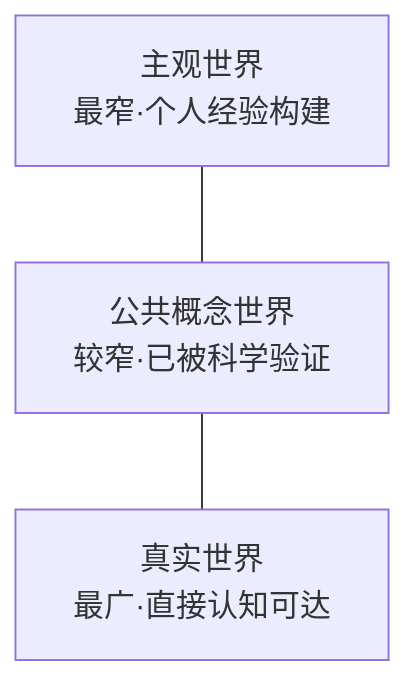

| 世界 | 范围 | 认知方式 | 典型内容 |
|------|------|----------|----------|
| **主观世界** | 最窄 | 间接认知 | 个人经验、信念、偏好 |
| **公共概念世界** | 较窄 | 间接认知 | 科学验证的知识、公理 |
| **真实世界** | 最广 | 直接认知 | 事物的本来面貌 |

前两者属于间接认知范围；直接认知帮助我们直接感知真实世界。

### 第二十一章 核心区别对照

| 维度 | 间接认知 | 直接认知 |
|------|----------|----------|
| 认知路径 | 通过概念、经验、逻辑等中介 | 去除中介后直接照见 |
| 认知主体 | 带有自我偏见与信念滤镜 | 消融自我，心如明镜 |
| 认知结果 | 被染污扭曲后的「事实」 | 事物的本来面貌/真相 |
| 比喻 | 通过 VR 设备看虚拟世界 | 摘下设备看真实世界 |
| 佛教对应 | 无明 | 明觉/般若智慧 |
| 禅宗对应 | 「时时勤拂拭」 | 「本来无一物」 |

### 第二十二章 经典比喻与案例

| 比喻/案例 | 间接认知表现 | 直接认知表现 | 核心启发 |
|------------|------------|------------|----------|
| **过桥洞** | 听别人说过不去就绕路三里 | 亲自观察发现只有半米深一步跨过 | 间接认知让你不掉坑，直接认知让你不绕路 |
| **吃梨** | 无论他人如何描述，用西瓜去想象 | 只有亲自品尝才是直接认知 | 体验不可替代 |
| **柏拉图洞穴** | 洞穴中只能看到影子 | 走出洞穴看到真实世界 | 认知局限与突破 |
| **镜面比喻** | 心念是覆盖在镜面上的污垢和滤镜 | 擦拭干净如实映照 | 去除染污即是智慧 |
| **禅宗两偈** | 神秀「时时勤拂拭」是基础觉察 | 慧能「本来无一物」是直接认知 | 渐修与顿悟 |
| **看电影** | 沉浸剧情当作真实 | 看到这只是光影投射 | 从沉浸到觉知 |

### 第二十三章 从间接认知走向直接认知的路径

1. 通过「止」获得稳定定力（目标：未到地定）
2. 在定力基础上开展「观」——留出空间，从主动退到被动觉察
3. 停下预设判断，让观察对象自然呈现（正念的本质）
4. 积累「明」（正知正见），拓展认知空间
5. 每次练习去掉一点染污即是进步
6. 观后必须在日常生活中践行
7. 最终达到明觉状态——本然智慧自然照见真相

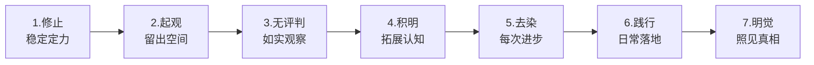

**两者关系**：间接认知有实际价值，两种认知同等重要，关键是根据场景合理运用，不能偏废其一。

---

## 第六编 练习课体系

### 二十篇专项练习索引

| 类别 | 练习 | 核心训练目标 |
|------|------|--------------|
| **基础技能** | 专注数息、呼吸空间、身体呼吸觉知、冥想的环境选择 | 建立注意力稳定基础 |
| **身体与安定** | 安定的身体空间、稳定如山、深度休息 | 建立身体锚点与安全感 |
| **觉察与当下** | 感知当下、觉察心念、与当下同行、心如止水 | 培养当下觉知能力 |
| **情绪管理** | 情绪觉察、情绪故事、海浪情绪清理 | 发展与情绪共处的能力 |
| **生活正念** | 正念喝水、正念行走、微笑冥想、给惯性生活按下暂停键 | 将正念融入日常生活 |
| **自然与整合** | 回归自然、自在如风 | 开放式觉察与整合 |

### 练习课设计原则

**递进逻辑**：从专注式冥想（止）到开放式冥想（观），从粗糙锚点（呼吸、身体）到精微锚点（情绪、心境），从静态练习到动态生活觉察。借鉴瑜伽八支从粗糙到精微的练习逻辑，将有效冥想的「止与观」拆解为五个小步骤逐步掌握。

**每篇练习结构**：
1. **引导准备**：环境、姿势、心态的调整
2. **核心练习**：特定锚点的觉察训练
3. **觉察要点**：需要注意的关键体验
4. **收尾整合**：将练习收获带入日常

**通用退出流程**：轻轻弹动手指脚趾→绕动手腕脚踝→搓热手掌温热眼球→点按面部头皮→慢慢睁开眼睛。

---

### 第一课 与当下同行：觉察是当下之门

**心念惯性的两个维度**：时间维度——心念不在当下时，要么陷入对过往的消耗性反刍，要么过度担忧未发生的未来；内外维度——要么完全陷入内在情绪念头的漩涡，要么过度被外在评价标准掌控。回归当下就是回到人生坐标的中心原点，获得内外、时间维度的平衡。

**大脑两种工作模式**：

| 模式 | 全称 | 特点 | 优势 | 劣势 |
|------|------|------|------|------|
| **DMN** | 默认模式网络 | 后台漫游/白日梦状态 | 有利于激发灵感 | 能量消耗大，长期处于该状态容易失控消耗身心 |
| **TPN** | 任务正性网络 | 专注当下做事 | 能量消耗小，提升行动效率 | 长期处于该状态会缺乏灵感 |

人一天产生6~8万个念头，其中90%都是DMN模式下重复无意义的念头。健康的大脑运行需要灵活切换两种模式。每天刷手机超过3小时，前额叶脑区活跃度会降低；频繁切换注意力获取短视频的短快感，会削弱自控能力与计划性。

**觉察训练的双重作用**：①切换作用：当DMN漫游分心时，觉察到当前状态就能帮助切换回TPN专注模式；②观察者视角：帮助和当下情绪念头拉开距离，明白「念头不是我，情绪不是我」，它们只是流经自己。

**两种存在视角**：「我思故我在」让人认同思考，陷入思想囚笼；「我在故我思」是观察者视角，能稳定存在，观察心念浮动。

**惯性循环的形成与打破**：外界现象→主观感受→想法→情绪行为→认知→影响下次行为→循环。打破循环的核心就是觉察——只觉察到现象本身，不对感受过度发酵，即可终止惯性循环。

**澄清两大误区**：
1. **「冥想是什么都不想」**：无念状态是自然达成的，不需要刻意对抗念头。冥想的本质是重塑人和想法之间的关系，不是消除所有想法。对念头保持不迎不拒的态度。
2. **「冥想必须打坐」**：行禅坐卧都可以练习冥想，核心是训练觉察。禅宗认为最高境界就是「吃饭就是吃饭，喝茶就是喝茶」。

> **"冥想其实是在重塑我们与想法之间的关系，而不是什么都不想。"**

---

### 第二课 专注数息

数息是定力训练最基础的入门方法，共分为三个递进阶段加停顿练习：

**第一阶段：手指触指数息**
- 操作方法：以右手计数，从食指根部指节开始，每完成一次一呼一吸移动一个指尖
- 计数规则：每根手指3个指节，沿手指轮廓画圈计数，12个指节对应12次呼吸为一轮
- 作用：结合手指触感锚定注意力，降低初学者的专注难度

**第二阶段：呼吸分别计数**
- 吸气计数1，呼气计数2，从1数到10为一轮
- 走神时注意从第几个数字走神，温和地带回下一个数字即可，不需要自我责备

**第三阶段：呼吸单一成分数拍**
- 吸气过程从1数到4拍，呼气过程也数4拍，保持4:4的比例
- 气息短可以数快，气息长可以数慢，如感憋闷不适直接调整到适合的节拍

**进阶：带停顿的盒子呼吸**
- 在吸气和呼气完成后都加入停顿计数，形成5:5的盒子呼吸
- 停顿时不刻意用力，等待身体发出呼吸信号再顺应动作

**坐姿要求**：盘坐时双手掌心向上放在膝盖上；办公场景坐在椅子上，双手掌心向上放在大腿上。核心是让小腹柔软、脊背自然延展。

---

### 第三课 冥想的环境选择

**核心认知**：环境只是冥想练习的支持条件，而非必要条件。特定环境是意识的提示信号，能帮助更快进入冥想状态；初期安静环境可降低练习阻抗，但放下对环境的依赖后可以随时随地练习。

**专属冥想空间搭建**：
- 不一定需要单独房间，大开间也可用靠垫、地毯围出冥想角
- 可放置花艺、香氛、画作、信仰塑像或榜样照片帮助收拢注意力
- 保持适宜通风和温度，光线柔和不刺眼
- 搭配无人声的轻柔自然音乐，保持空间整洁有序

**干扰应对与脱敏训练**：
- 提前沟通约定20分钟不被打扰的时间
- 手机放远关闭提示音，将宠物请出练习空间
- 如遇到必须回应的干扰，回应后重新回归练习即可
- **脱敏训练方法**：由远及近、由近及远聆听外界声音，直到能和干扰声音平和共处。越对抗干扰，影响越大；把干扰当成练习素材就能实现脱敏

> **"跟环境相处其实就是跟你自己的感受相处的能力。"**

---

### 第四课 呼吸空间

**核心概念**：呼吸空间指吸气与呼气之间的留白停顿空间。将注意力安住在这个停顿空间中，就能感受到内在的安定、平和与安宁。

**练习步骤**：
1. **初始呼吸觉察**：关注鼻腔以下、嘴唇以上的位置，感受气团在这里吸入呼出的循环，觉察气息温度变化（吸入冰凉，呼出温热）
2. **自然停顿练习**：呼吸放慢后，留意呼吸之间自然出现的停顿。吸气完成后不急于呼气，稍稍停留；呼气完成后不急于吸气，也稍稍停留
3. **安住停顿空间**：不需要刻意用力，等待身体发出想要呼吸的信号，信号出现就顺应动作，信号未出现就安住在停顿的平静中

**思绪干扰的应对**：即便冒出思绪也不需要焦虑，把思绪当做一次呼吸的起落即可。在一念止歇、一念未起之间，依然存在停顿空间。

> **"停顿不是你刻意做到的，而是当你放松下来，自然的呼吸里，就会有停顿。"**

---

### 第五课 安定的身体空间

**盘坐姿势分步调整**：
- 使用带坡度坐垫，坐到二分之一处，脚跟放在坐垫前端凹窝处
- 脚掌心尽可能翻转向上，另一只脚对齐放前方
- 膝盖翘起可用小毯子垫高，形成臀、双膝三个支点
- 确认重心坐到坐骨上，避免骨盆后倾或过度前倾

**完整引导流程**：
1. **身体连接觉察**：感受身体哪些位置和地面产生触碰连接，将身体重量信任交托给地面
2. **脊柱逐节延展**：从尾骨开始逐节向上觉察，保持脊柱有空间地排列，一直延展过头顶
3. **头面部放松**：放松头皮、额头、太阳穴、眉心、眼眶、面颊、牙齿和舌头
4. **躯干内部空间觉察**：感受手掌传递的温度从腿部回到小腹部，依次向上觉察腹部、胸腔的肌肤感觉和温度
5. **核心安定保持**：体验回归身体带来的如同回家一般的安心感，不需要去往任何地方，只需要安静停留

> **"这一刻，你不再去哪儿了，你不再需要做任何事了，只是在这儿，好好的陪伴自己。"**

---

### 第六课 微笑冥想

**核心原理**：通过面部微笑的身体实感带动心境变化，能转化当下心念。主动选择以喜悦心境面对所有境遇，即使在负面情绪场景中也能创造松动空间。

**完整练习六步**：
1. **身体接地觉察**：感受身体如何获得地面支持，支撑力穿过脊背延伸到头顶
2. **面部放松准备**：闭上双眼，觉察面部表情，找到紧绷位置允许放松
3. **激活微笑体感**：有意识轻轻拉动嘴角朝耳根方向，觉察面部变化，对比前后差异
4. **锚定正向体验**：回想近期让你自然露出笑容的人或事，沉浸喜悦从心底蔓延
5. **微笑转化负面情绪**：回想让你焦灼愤怒的负面场景，全然感受被困住的状态；再将微笑状态和喜悦心境带入该场景，体验内心变化
6. **收尾**：做几个大大的深呼吸，唤醒手指脚趾，轻柔转动眼球后睁开眼睛

> **"如果喜悦是你主动的选择，在任何境遇里，你都主动选择以他来面对，你的生活会发生不一样的变化。"**

---

### 第七课 情绪故事

**适用场景**：当下存在未释放的情绪、对应事件仍牵动心绪时练习。心情平稳无未消化情绪时可暂时不练习。

**完整练习流程**：

**准备阶段**：调整舒适坐姿，闭眼如实觉察当下状态，双手掌心向下搭放双膝，感受手掌温度传递关爱。

**呼吸锚定**：将注意力带到心口，呼气时想象心口像柔软海绵松软内陷，保持「柔和的呼，放松的吸」的节奏。

**第一阶段观想**：选择情绪故事播放位置和距离，给自己心理暗示「我只是旁观者，只需要重新观看，不会卷入情节」。播放故事画面，留意产生不舒服情绪的瞬间，暂停、倒放，定位触发情绪的具体刺激（一句话、一个表情或肢体信号）。

**身体觉察与情绪处理**：如实觉察身体反应（收紧、憋闷、发热等），将温和注意力和轻柔呼吸带到该位置，用呼吸像按摩一样陪伴感受。需要更多空间专注缓慢深长的吸气，需要释放专注缓慢彻底的呼气，需要释放时可张嘴吐气。直到身体回到没有特殊紧绷感的状态。

**二次观想与整合**：带着呼吸带来的平静，重新完整播放一次情绪故事，保持旁观者身份，觉察新的发现。如果身体仍有强烈情绪感受，重复身体觉察+呼吸陪伴练习。

> **"你不再被那个情绪紧紧地抓住了，又或者说，你不再紧紧地抓住那个情绪了。"**

---

### 第八课 情绪觉察

**两大核心原则**：
1. **止而后能观**：先让心境平静，先让自己安宁，再去关照情绪本身
2. **无条件接纳**：不催促自己改变情绪，不抗拒当下体验。抗拒和改变要求会制造新的内在波动

**完整六步练习**：
1. **身体锚定放松**：感受身体获得支持的安定感，依次放松双手、脚底、面部（眉心、眼角、嘴角）
2. **呼吸觉察**：观察当下呼吸状态，不用刻意改变，只要观察它，呼吸自然慢慢平稳
3. **意象观想情绪**：将翻涌的情绪想象成水面波澜，允许自然涌动，给它耐心和时间。每次呼气感受波浪变得平缓一点
4. **身体感受定位**：留意情绪在身体上呈现的具体感觉（发热、发胀等），带着温和关注允许感觉流过身体
5. **解离情绪**：水面化为开阔平静后，将混乱情绪拆解为清晰感受，建立边界——「那是你的情绪，但不是你」
6. **不抓取原则**：每个想法感受都化作水面涟漪，看着散开，允许它来也允许它走

> **"那是你的情绪，但不是你。"**

---

### 第九课 海浪情绪清理

**情绪主题系列三种冥想的适用场景**：
1. **海浪清理冥想**：被情绪冲击、有未释放的情绪残留时，帮助清理释放
2. **微笑冥想**：情绪低落时，帮助快速调整转换心情
3. **情绪故事探索冥想**：心态平稳时，深度探索处理情绪根源

**完整引导流程**：
1. **身体放松扫描**：感受身体被支撑物承托，逐渐松开所有用力，将全身重量完全交给支撑物
2. **连接呼吸节奏**：聆听呼吸气流经过鼻腔的轻柔摩擦声，找到平稳呼吸节奏
3. **建立海浪潮汐意象**：吸气=海浪涌起，呼气=海浪退去。想象清澈海岸线，洁白浪花随潮汐起伏，沙滩上所有残留印记都被海水冲刷抚平
4. **情绪释放**：将内心纠缠的思绪都想象成留在沙滩上的印记，跟随每一次潮汐交给海浪带走。进阶意象：想象躺在海岸边，吸气时海水从脚底漫到肚脐下方，呼气时海水退离
5. **收尾整合**：海浪逐渐平缓，感受冲刷后的完全释放与放松，重新找回身体的轻盈与干净

> **"每一次海水的起落就能将一切抚平，回到最初平整的、没有一丝杂扰的样子。"**

---

### 第十课 深度休息

**适用场景**：睡前、午休或任何需要短暂调整休息时使用。

**课前支持物准备**：头部垫枕不宜过高（折成三折或四折）；腰部垫一层厚度即可；膝窝垫毛毯卷或小枕头。

**完整全身扫描放松流程**：
1. **初始体位**：仰卧，收回下巴拉长颈根，双脚自然分开脚尖外展，手臂放身体两侧掌心向上
2. **感官放松**：觉察眼球被眼皮包裹，允许眼球沉入眼窝深处再沉入后脑空间
3. **身体接触感知**：依次觉察后脑勺、上背部、臀部、手臂、小腿肚、脚跟和地面的接触感觉
4. **上半身扫描**：头顶→前额→眼眶→面颊→下巴→舌头→颈部→左肩臂→左手指→右肩臂→右手指
5. **躯干扫描**：胸腔肌肤状态→腹部肌肤→脊背左右两侧→左右臀部
6. **下半身扫描**：左腿从大腿到每一根脚趾→右腿从大腿到每一根脚趾
7. **深度沉坠**：允许身体完全向地面松懈释放，身体沉入大地，心也跟着松沉，意识逐渐模糊
8. **唤醒**：弹动手指脚趾→深呼吸→右手举过头顶→左腿屈膝踩地→转向右侧→推起回到坐姿

> **"觉察到那些不同，并不代表你要改变或纠正什么。你只是观察。"**

---

### 第十一课 给惯性生活按下暂停键

**疲惫漏斗**：当人执着于某种心念而不自知时，会不断缩窄注意力，隔离其他视角与可能，最终精疲力竭。困住人的不是事件本身，而是人对事件的想法。

**两种生活状态对比**：

| 维度 | 生存模式（doing） | 存在模式（being） |
|------|-------------------|-------------------|
| 动力 | 被动被事情推着走 | 主动找到热情 |
| 关注点 | 只重结果忽略感受 | 看重过程接纳结果 |
| 情绪 | 情绪失控或回避 | 能主动调节情绪 |
| 满意度 | 苛责挑剔满意度低 | 接纳当下找幸福点 |
| 连接 | 陷入思绪脱离环境 | 融入环境获取滋养 |
| 时间 | 陷入过去懊悔或未来担忧 | 专注当下 |

**生存模式的成因**：①生理原因——大脑优先选择熟悉路径节省精力，但全惯性模式会浪费复杂决策能力；②社会原因——多任务处理让注意力分散，认知控制能力下降，情绪调节能力受损。

**切换模式两步法**：
1. **打断惯性**：觉察行为惯性、思考惯性、情绪惯性，在惯性启动时打断它
2. **拓展注意**：连接真实环境，通过触摸、嗅觉等感官和真实事物互动，深度感知当下

> **"当你主动将注意力转向当下发生的小事，相当于给大脑安装了一个幸福过滤器。"**

---

### 第十二课 稳定如山

**心锚设置**：以山为冥想心锚，提取山稳定、巍峨、庄严的品质，内化到个人内在体验中。若无法自行观想到山的画面，可借助参考图片、视频辅助。

**完整练习步骤**：
1. **身体山形化**：感受臀部、腿部、脚底如同山的底座，宽广安稳，向下扎根，将身体重量完全交托给大地
2. **脊柱延展**：让脊椎毫不费力地向天空延伸，头顶如同山峰顶端连接天空的开阔感，整个身体如同连绵山脉
3. **注意力收束**：将全部注意力安放在身体的稳定感上
4. **思绪处理**：头脑中的思绪、外界干扰都类比为天边云朵、变化气候、四季流转，山本身不会因这些变化改变位置。不需要对抗或改变，允许存在，自身保持稳定不动

> **"四季流转，山不动；思绪干扰，你不动。无论外境如何变动，你不动，你的心就拥有了坚韧的力量。"**

---

### 第十三课 正念喝水

**五步练习流程**：
1. **准备与深呼吸**：准备好水后做三个深呼吸锚定当下，观察杯子样式、触摸质感
2. **端杯感受**：感受杯子和水的重量，感受手、手臂、肩膀的受力感，感受水的温度、颜色、气味
3. **小口品尝**：喝一小口含在口中，感受温度和质感；有意识缓慢吞咽，感受水从口腔流向身体的整个过程
4. **观想沉静**：晃动水杯后放在平面上，观察水面从摇晃回归平静；闭眼观想身体内的水分从流动回归安定，感受水分子进入每个细胞
5. **感恩连接**：感恩大自然的馈赠，感谢所有参与水的开采、运输的人，感谢自己创造价值拥有了这杯水

> **"如果你带着觉察的意念喝晨起第一杯水，那么这种临在当下的心灵品质也会被你注入到这一天当中去。"**

---

### 第十四课 正念行走

**两部分结构**：站姿觉察观想 + 四步走冥想。

**站姿觉察**：感受脚掌哪些位置接触地面，感受重量分布。自下而上觉察地面给身体的支撑感，穿过小腿、膝窝、大腿、臀部、脊背直到头顶。

**四步走冥想**：
- **提**：屈膝让脚尖慢慢离地
- **移**：将脚向前移动
- **落**：先让脚跟接触地面
- **放**：再将整个脚掌放平

**变速练习**：先慢速仔细感受每个步骤→恢复正常速度专注觉察脚掌交替起落→加快速度觉察感受变化。

**日常延伸**：可将行走冥想带到通勤途中、办公间隙、买菜逛街、午休后公园漫步等日常场景。

> **"行走冥想的核心，是对行走动作的觉察，并不是刻意一定要按固定方式去走，只要你的觉知在这里就好。"**

---

### 第十五课 感知当下

**适用场景**：从繁杂思绪抽离、调整缓解情绪、安静内在状态、做短暂休息。无论身处任何场景，保持站、坐任何姿态都可以随时练习。

**五感分层觉察步骤**：
1. **视觉锚定**：环顾所处空间，寻找之前未留意的对象，只确认看到内容，不做想法延伸。留意是否因看到某对象产生了新想法，有意识拉回
2. **眼部放松**：收回目光自然看前方，觉察眼球眼眶感觉，让眼球向眼窝深处移动，带动身心安静，自然闭上眼睛
3. **听觉觉察**：留意所有能听到的声音，分层感知——最远的声音→中等距离→空间内部→身体内部（通常能听到呼吸气息摩擦鼻腔的细微声响）
4. **嗅觉觉察**：在呼吸交替之间觉察空气中的味道，有味道就体验本身，没有不刻意寻找
5. **身体感官**：感知当下姿态、环境温度、衣物触感，感受脚下大地或座椅的支撑，卸除多余的主动用力

---

### 第十六课 回归自然

**"松"的多层内涵**：

| 层面 | 内涵 |
|------|------|
| **身体层面** | 从紧到松的变化觉察，识别常见紧张位置：眉心、咬紧牙齿、紧绷肩膀、用力脚趾、僵硬肚脐 |
| **空间与关系层面** | 松的核心不止是力量放松，更是营造空间感、松动执着的关系。当紧紧抓取某种想法时形成挂碍，松意味着不再执着，让关系重新产生空间 |
| **心念层面** | 结合《心经》「心无挂碍，无挂碍故，无有恐怖」，挂碍本质是对念头太过当真、太过执着，松就是对念头不当真，允许自然流动 |
| **姿态层面** | 不刻意的努力，放下抓取、紧绷的发力，保持清醒觉知同时安住当下 |

**核心练习方法**：唤起让你紧绷的具体情境（他人评判、自身渴望、内心抗拒等），找到紧紧抓住的执着内容，将「必须如此」的确定性从100%降到99%，只是主动松开一点点，体会松带来的感受变化。

**松的终极指向**：回归没有被观念、概念印记的全新生命状态，简单自然、如其所是地看见一切，获得如实接纳的开阔感与无所依附的自在。

> **"松是一种松动，你对他不那么当真了，你没有那么紧紧地抓住他，不那么执着于他。"**

---

## 第七编 线下精品课

### 六门沉浸式专题课程总览

线下精品课是直接认知冥想体系的深度拓展模块，每门课时长1.5–2.5小时，由不同领域专家授课，将冥想核心理论延伸到呼吸科学、瑜伽修持、亲子教育、职业发展等具体应用场景。

| 课程 | 授课专家 | 核心内容 |
|------|----------|----------|
| **直接认知冥想理论与实践** | 木野（申文） | 间接/直接认知精确定义、三大局限、三个世界模型、止观双运方法、动中定 |
| **呼吸的科学** | 雪鱼教授 | 呼吸文化底层逻辑、呼吸频率与寿命、多种呼吸方法详解 |
| **瑜伽与冥想** | — | OM唱诵分层体验、五层身理论、身体/呼吸/心念三种锚定冥想 |
| **能量瑜伽** | — | 觉察+不评判练习原则、直接认知在体式中的应用 |
| **家庭教育亲子冥想** | 戴鹏 | 儿童正念游戏、直接认知亲子应用、觉知三角、家庭系统排列 |
| **瑜伽冥想新生活方式与商业变现** | — | 行业经验、创新商业模型、冥想师培训体系 |

---

### 第一课 直接认知冥想理论与实践（核心旗舰课）

**课程定位**：整个体系的核心旗舰课，2小时8分钟，系统梳理直接认知冥想的理论框架与实践方法。

#### 认知决定世界：三个石匠案例

三个石匠对同一个凿石头的工作分别认为是苦役、手艺、建造教堂，多年后第一个还是牢骚满腹的石匠，第二个成为包工头，第三个成为著名建筑师。核心启发：认知决定我们的世界，改变认知就能改变世界，冥想练习的核心着力点就是提升认知水平。

#### 两种认知方式的精确定义

**间接认知**：基于已知经验和概念，通过逻辑分析判断事物的认知过程。三大局限：
1. 受个人或他人经验局限，无法突破原有框架
2. 容易陷入主观视角的分别评判，给事物贴标签
3. 容易形成固定思维模式，产生执着，不愿质疑现有认知

**直接认知**：不依赖概念和经验，通过直接感知瞬间洞见事物本质的认知方式。核心要点是在概念前认知，不依赖语言文字，是无分别、无执着、无我的直接照见。

两者关系：间接认知有实际价值，两种认知同等重要，关键是根据场景合理运用。

#### 认知的三个世界模型

1. 个人知识积累形成的**主观世界**
2. 已被科学验证的**公共概念世界**
3. 广阔无限的**真实世界**

前两者都窄于真实世界，直接认知帮助我们直接感知真实世界。

**经典案例**：
- **过桥洞**：第一个人掉下去后提醒后人；第二个人绕了三里路；第三个人亲自观察发现洞只有半米深一步跨过——间接认知让你不掉坑，直接认知让你不绕路
- **吃梨**：别人说梨甜水分多，你会用西瓜去想象，只有自己咬一口才知道梨的甜和西瓜完全不同

#### 冥想的科学依据

- **神经网络**：DMN与TPN相互抑制，冥想降低DMN活跃度、激活TPN，减少焦虑反刍思维
- **大脑结构**：长期冥想后前额叶皮层灰质增厚（理性脑变强）、杏仁核体积缩小（情绪脑变弱）

#### 止观双运的核心方法

**止的三种分类**（戒酒案例）：
1. **制心止**：靠意志力硬撑，像靠决心戒酒，撑不了多久
2. **系缘守境止**：把心念拴在锚点上，像把戒酒欲望转为早起跑步，入门核心方法
3. **体真止**：亲身体会到真相后自然不执着，像喝酒后关节疼自然戒酒

**止的入门练习**：握住大拇指（吸气用力握住，呼气放松）或手按腹部（感受呼吸时腹部起伏），锚点没有对错，能帮你进入安定状态的就是好锚点。

**观的四个核心要领**：
1. 必须在止的基础上起观
2. 松开锚点、留出空间，松而不垮（止如照相对焦，对焦后需稍松开退一步）
3. 无评判如实观察，像稳定的摄像机
4. 情境化但不编剧

**观的入门练习**：先通过锚点进入止，随后松开锚点，观想眼前大山，体会山稳定坚实的特质。原理：观察事物的特质会被熏习，自己也获得对应品质。

**止观循环**：先止后观，观后获得更深的定，循环往复不断提升，不存在一次到位的认知。没有止的基础就去观情绪，只会越想越生气，那是编剧不是观。

#### 静中定与动中定

- **动中定更重要**：不可能24小时打坐，定的训练可融入所有日常场景——起床、刷牙、吃饭，了了分明知道自己在做什么不胡思乱想
- **两者关系**：动中定相当于把水烧到七八十度，再上座静坐很快就能煮沸
- **培养禅定个性**：把稳定安定变成本能，无论遇到什么事先不慌，生活中80%的问题自然解决

> **金句**：「认知决定我们的世界，改变认知就能改变我们的世界。」
> **金句**：「外面没有别人，只有你自己。所有的关系到最后都是和自己的关系。」
> **金句**：「一旦你看清问题的本质和根源，解决方法自然就在看到的过程中显现。」
> **金句**：「光有静中定，会让冥想和生活分裂，动中定能让定融入你的日常。」

---

### 第二课 呼吸的科学

**课程定位**：精品课开篇讲座，由雪鱼教授讲解呼吸作为身心灵连接核心法门的理论与实践。

#### 呼吸的核心意义

**呼吸贯通生活、生命与生死**：掌握呼吸就能掌握生活质量，把握生命本质，从容面对生死，是所有东西方修行流派都重视的核心法门。

**文化底层逻辑**：
- 东西方创世传说都将生命起源归于"吹气"，气是生命本源
- 中文"息"=自心，知息者知心，知心者知命
- 一呼一吸就是阴阳变化，《道德经》"冲气以为和"，呼吸就是吐故纳新、阴阳调和

**呼吸的功能**：
- **通内外**：排出浊气淤堵，帮助消解身体结节，实现人与自然的能量循环
- **连身心**：在物质身体和精神意识之间，气是连接二者的桥梁

#### 呼吸与生命健康

- **频率与寿命**：兔子每分钟22-30次呼吸寿命10-12年；乌龟每分钟3-5次呼吸寿命300-500年
- **科学证实**：呼吸可以改变基因表达、改造大脑结构，清洁渗透力远强于饮水

#### 健康呼吸的核心原则

- **总体要求**：深长绵细、轻匀平松，从粗重的风相进入平静的息相
- **核心状态**：心息相依，心静则息静，息静则心静
- **位置要求**：《庄子》"真人之息以踵，众人之息以喉"，要把气沉到最远端；核心用腰腹部带动呼吸，"呼吸入腰，百病全消"
- **比例要求**：呼:吸≈2:1，中间空档不是憋气，是自然延伸

#### 常见呼吸方法详解

| 方法 | 要点 |
|------|------|
| **逆腹式呼吸** | 吸气腹部收缩、会阴上提、头顶向上；呼气放松气沉足底。站桩太极的自然呼吸，冬天练习全身发热 |
| **方块式呼吸（4-4-4）** | 吸气4秒→止息4秒→呼气4秒，美国海军陆战队用来帮士兵快速入睡 |
| **4-7-8呼吸法** | 吸气4秒→止息7秒→呼气8秒，东方正念结合西方科学，对慢性病和心理问题都有效 |
| **六字诀呼吸法** | 不同发音对应不同脏腑：呵对心、呬对肺、嘘对肝、吹对肾、呼对脾 |
| **波状/念诵呼吸** | 通过持续念诵让声音带动呼吸，排出浊气，和外界能量共振 |
| **吐纳法** | 延长呼和吸之间的停留时间，增强气的力量 |

> **金句**：「你如果掌握了呼吸，你就掌握了生命。」
> **金句**：「知息者知心，知心者知命。」
> **金句**：「呼吸入腰，百病全消。」

---

### 第三课 瑜伽与冥想

**课程定位**：围绕冥想核心原理与实践方法，通过OM唱诵、身体锚定、呼吸锚定三个模块的沉浸式体验展开。

#### OM唱诵分层体验

**OM的结构**：由A（创造/醒）、U（维持/梦）、M（毁灭/睡）三个音节融合，加上结尾的静默共四个部分。

**第四音节——静默**：OM唱诵结束后的留白是最核心的部分。不急着吸气，保留余韵，停留在无行动的空白中，学习舒服地停留在当下——这个状态就是冥想的目的地，代表超越一切的永恒。

**五层整合练习**：五次分层唱诵对应瑜伽五层身理论——身体层→呼吸能量层→心意情绪层→智性理解层→平和真吾层，越往后整合层面越多，体验越深入。

#### 冥想的核心定义与科学原理

**冥想中文词源**：「冥」=隔绝干扰回归内在，自己成为光源；「想」=观察事物在心上呈现的样子，每面镜子沾着不同的"我"的印记。

**冥想四步骤**：
1. **回收**：将注意力从外界收回到内在空间
2. **锚定**：选择唯一一个对象，专注在上
3. **稳定**：维持无波动的专注
4. **观照**：稳定后观察事物在心上真实呈现的样子

**DMN与TPN**：冥想训练的不是消灭杂念，而是获得注意力的自主控制权——想让它工作就工作，想让它停就能停。

#### 身体锚定冥想：成为树

瑜伽体式的本来目的不是拉伸肌肉，而是进入生命形态后长时间停留冥想，体验那个生命的感受。身体不只是塑形的工具，更是冥想的容器。

**练习步骤**：站稳感受大地承托→配合呼吸抬脚跟（向上生长/向下扎根）→手臂伸展（枝叶扩展）→静态冥想（根须延伸、阳光雨露滋养）→拓展平衡树式（暴风雨中的稳定）。

#### 呼吸锚定冥想：消化火

**冥想梵文词根**=收拢收回+呼吸，传统冥想本来经由调息进入。

**吸气激活交感神经**（兴奋），**呼气激活副交感神经**（放松）。焦虑多练呼气，犯困多练吸气。

**消化火观想**：吸气火焰向下靠近腹腔杂质燃烧，呼气盆底肌轻提带动内脏靠近火焰。如太强烈可换成献礼的柔和意象。

#### 心念觉察

**不怕念起，只怕觉迟**：人一天产生6~8万个念头，觉察带来选择空间。

**"想法不是事实"**：不是否定事实，而是给你留出和念头相处的空间。

**念头之间的空隙**：前一个念头结束、下一个念头未升起之间的空白，是进入内在清净的"窄门"。可借助云朵意象——盯着云朵之间的蓝天。

**止而后观**：先通过锚点培养安住能力（止），安住后才能进入观察转化（观）。最终目的不是停在定中，而是转变认知、转化心念。

> **金句**：「当你的身心不在一起的时候，你感受的都是分离的痛苦。」
> **金句**：「不怕念头起，只怕觉迟。」
> **金句**：「你选择不了外境出不出现，但你能掌控内境。」
> **金句**：「听道理过不好人生，必须在内在体验中消化才能真正改变。」

---

### 第四课 能量瑜伽

**课程定位**：结合冥想觉知与瑜伽体式的带练课程，核心传递「保持觉察、不做自我评判」的练习理念。

#### 练习核心原则

- 瑜伽练习的核心不是完成标准体式，而是带着觉察感知身体，不做自我否定
- 永远根据自身能力调整难度：10做不了做9，9做不了做8，绝对不要直接放弃
- 遇到肌肉酸痛不要逃避或否定，接纳酸痛本身，不放大扭曲，不与他人攀比
- 筋膜肌肉越拉伸越健康，和弹簧橡皮筋原理完全不同

#### 直接认知在体式中的应用

- 直接认可酸痛感本身就是正确的**直接认知**
- 因为酸痛否定自己、觉得不适合练习，就是扭曲的**间接认知**

#### 体式练习流程

初始冥想→热身流动序列（猫式动态呼吸）→开髋伸展序列（弓步、平衡、深度伸展、神猴式）→核心力量练习（斜板等长收缩、旋风式）→仰卧放松扫描→整合冥想。

#### 学员核心收获

- 将冥想带入瑜伽后能更向内探索，在想要放弃时坚持，生出全新内在力量
- 带着不评判的心态练习，打破固有认知，获得更深入的身体感受与能量提升
- 松弛感就是热爱就够了，练习就够了，不需要太多顾虑

> **金句**：「10做不了做9，9做不了做8，但绝对不是10做不了做零。身体会因为你的每一次坚持而变好。」
> **金句**：「能量在你坚持的路上就在提升，你内心的power会因为意志力的提升而快速增长。」
> **金句**：「真正的松弛，不是什么都不做，而是做完之后不再执着于结果。」

---

### 第五课 家庭教育亲子冥想

**课程定位**：将冥想应用于家庭教育亲子场景，原理对人际沟通、情绪管理同样通用。

#### 儿童正念游戏

儿童无法像成年人一样打坐，需通过正念游戏培养专注力与觉察力。

- **听延长音训练**：倾听乐器延长音直到声音彻底消失再举手，对应止观——止=专注，观=觉察
- **顶书比赛**：孩子头上顶书放玩偶和家长比赛谁坚持更久，输了完成约定内容，本质是游戏化训练专注力
- **五指呼吸法**：一只手张开成「五指山」，另一只手手指当「孙悟空」，吸气从掌根爬到指尖，呼气从指尖爬回掌根
- **静心瓶**：瓶中水和亮粉晃动代表烦躁念头，静看亮粉沉淀对应心情平静
- **反向激励**：孩子不练琴时家长自己接手练，让孩子当老师教基础指法

#### 直接认知在亲子中的应用

- 不对孩子贴标签、不赋予额外故事，接受孩子本来的样子就是直接认知
- **孩子抠橡皮**：直接认知是「一个孩子正在抠橡皮」没有问题；间接认知是「抠橡皮=不认真=没前途」引发愤怒
- **成长的核心认知**：接受父母是普通人、伴侣是普通人、自己是普通人、孩子是普通人。小满胜万全

#### 环境营造原理

- **核心原理**：我们不能强迫别人改变，只能营造一个令对方愿意改变的环境
- 孩子写完作业家长又加更多作业→「早写完=更多作业」是惩罚→磨蹭才符合孩子利益
- **儿童价值特点**：孩子前额叶22-25岁才发育成熟，不被长远价值驱动，看重当下的有趣、认可、自主

#### 觉知三角与消防演习

**觉知三角**：任何情绪事件都同时包含念头、情绪、身体感受三个部分，任何一个部分得到处理，另外两个都会自动松动改变。

**消防演习vs救火**：情绪爆发后再处理难度很高，平时提前通过冥想处理情绪触发事件就是「消防演习」。辅导孩子写作业时带着40%的觉察就够，发现情绪被搅动立刻暂停平复。

**父母冥想的影响**：哪怕孩子不练，只是父母练习冥想，孩子情绪也会更稳定，亲子关系更亲密。

#### 家庭系统排列核心原则

- 新系统优先于老系统，先来的优先于后到的
- 核心家庭中夫妻关系优先于亲子关系，有效果比讲对错更重要
- 子女结婚后核心家庭优先于原生家庭

> **金句**：「成长，就是接受你的父母是普通人，接受你伴侣是普通人，接受你孩子是普通人，接受你自己是普通人。」
> **金句**：「凡事不能求全责备，小满胜万全。」
> **金句**：「冥想是技能不是知识，听懂理论没用，必须下水练习。」
> **金句**：「有效果比有道理更重要。」

---

### 第六课 瑜伽冥想新生活方式与商业变现

**课程定位**：面向瑜伽老师和冥想师的职业发展课程，分享行业经验、创新商业模型与系统化培训体系。

#### 行业经验与模型迭代

- 分享人22年瑜伽行业经验，创业13年，曾做到估值1.4亿、25家直营店，2025年主动关闭所有大店
- **传统模型判断**：大型馆连锁预付费复制模型已无机会；180-300平商场店因租金人工过高不可行
- **消费习惯变化**：客户不再偏好大额年卡，偏好短平快的周卡、月卡、次卡
- **行业数据**：2025年关店2.3万家同时新开3.1万家，消费增长54亿，需求仍在扩大

#### 疗愈赛道与创新商业模型

- 疗愈经济潜力超3万亿，当前瑜伽健身市场仅600亿
- **核心痛点**：没有统一师资认证标准，从业者乱象多，难以规模化

**两种创新模型**：
1. **嵌入式热疗舱**：单个占地不到4平米，可嵌入多种场景，单小时收费200-300元，无人值守单日收益最高1600元
2. **80平社区康养店**：含2个热疗舱、5个私教室，总投资13-15万，合伙人制，2个月可回本

#### 冥想师培训体系

- 2024年8月与香港中文大学达成战略合作，共同建立中国冥想标准体系
- **第一级·冥想执行师**（线上8周）：理论（脑科学、冥想简史、系统框架）+实践（每周主题练习），考核通过颁发双认证证书
- **第二级·冥想导师**（一年期线下+线上督导）：心力培养、职业发展、场景应用、对话技术、问题解决五大板块，需完成50小时真实教学实习
- 优秀学员可上线课程售卖，承接企业团建，合作企业包括爱马仕、华为等

> **金句**：「想要得到爱，就先把爱给出去。」
> **金句**：「冥想不玄，它只是让你更睁开眼睛，更真实，更灵敏。」
> **金句**：「家是讲爱的地方，不是讲理的地方。」

---

## 第八编 评估体系

### 作业系统（C1–C7）

课程作业是学习闭环的核心环节，每周作业包含三个部分：

| 作业编号 | 对应单元 | 日常跟练 | 核心觉察与沉思题 |
|---------|---------|---------|------------------|
| **C1** | 先导课 | 正念饮水、觉察想法 | 记录从生存模式切换到觉察模式的经历；冥想要解决的是什么问题 |
| **C2** | 与当下同行 | 正念饮水、感知当下 | 记录生存模式→觉察模式切换体验 |
| **C3** | 与身体对话 | 身体呼吸觉察、稳定如山 | 记录对身体觉察的应对方式；选择练习止的六个关键态度之一谈理解 |
| **C4** | 与呼吸同频 | 身体呼吸觉察、专注数息、呼吸空间 | 记录以呼吸为锚点进入稳定专注的体验；为何倾全力回到当下 |
| **C5** | 与万物共感 | 稳定如山、自在如风、心如止水 | 记录连接对象品质进入冥想体验；三种锚点（身体/呼吸/心境）的练习体会 |
| **C6** | 与情绪共处 | 情绪觉察、情绪故事、海浪情绪清理 | 记录对情绪的觉察过程；谈谈对观的理解 |
| **C7** | 与身心同在 | 微笑冥想、回归自然、安住当下 | 记录心境熏习转化心念的练习体验；对冥想目的的理解 |

#### 作业示例与学习体验摘录

**C1作业核心回答**：
- **冥想的本质**：心念管理。方法论：看见、了解、接纳、转化。认知论基础：通过止息散乱心念、培育深度定力，让认知从间接的变为直接的
- **学冥想的目的**：「我学冥想是为了不冥想，就像学游泳不是为了永远待在泳池里，而是为了在任何水域都不会溺亡。冥想是脚手架，不是建筑本身。」

**C2作业学习体验**：
- **疲惫漏斗**：困住人的不是事件本身，而是对事件的想法，每次反复思虑都让注意力范围越来越小
- **生存模式与存在模式**：生存模式是持续的"doing"，存在模式是"being"，感受自己的存在，让感受和行动同步
- **DMN/TPN切换**：冥想训练切换注意力的过程和维持TPN模式稳定的能力，抑制DMN过度活跃

**C3作业学习体验**：
- **不大惊小怪原则**：观察感受自然生灭即可，回到所缘境而不加解读、不扰动泥水
- **一期一会应用**：以庄严尊重的心态将全部生命投入这一座，消解"坐不好下一次再补"的拖延

**C4作业学习体验**：
- **呼吸与心念**：「心念随呼吸趋于安定，故呼吸动心念动，呼吸止心念止」
- **包容主题**：「真正的安全感不是打造一座坚不可摧的城堡，而是承认自己是一团泥，你越柔软越有无限可能」

**C5作业学习体验**：
- **三种锚点递进**：散乱时用身体→稳定后用呼吸→熟练后用心境，由重到轻层层松手，是同一次练习里的阶梯而不是三选一
- **焚香加持**：香味自然把呼吸拉长拉深，不必刻意控制

**C7作业学习体验**：
- **微笑冥想**：微微上扬嘴角形成的微笑画面，会自然带动内在产生轻松愉悦的心境
- **冥想目的**：「不是停在定中，而是通过止而后观，去转变认知、转化心念」

---

### 执行师认证考试

**考核维度**：

1. **知识掌握**：全部必修课程内容的准确理解（含先导课程）
2. **方法清晰**：冥想练习的目的、方法及步骤的清晰表达
3. **概念辨析**：直接认知与间接认知的区别
4. **实修验证**：结合自身练习体验的深度理解

**考试要求**：不是理论复述，而是通过个人真实体验验证课程核心观点。

#### 五道核心考题框架

**第一题：冥想真正要解决的是什么问题？可以体现在哪些层面？**

冥想真正要解决的不是失眠、焦虑等具体症状，而是症状背后的共同根源：心被自身的心念、情绪、概念、习气所驱动而不自知。体现在七个层面：
1. **认知层面**：破除间接认知局限，走向直接认知
2. **情绪层面**：从被情绪淹没到与情绪共处
3. **注意力层面**：从散乱昏沉到稳定专注
4. **身体生理层面**：调身、调息、调心的整体调节
5. **生活行动层面**：动中定，活在过程即活在当下
6. **意志动力层面**：愿力为本，决定先行
7. **究竟存在层面**：破除我执，走向自由与清明

**第二题：有效冥想的步骤次第有哪些？每个步骤要达成的目标？**

有效冥想五个阶段：觉察→设感（收摄感官）→专注（止）→观→直接认知。每个阶段有明确的次第关系，前一阶段是后一阶段的前提：
1. **觉察**：看到自己受困，从沉浸中拔出来——未被觉察的困境无法被解决
2. **设感**：把向外攀缘的注意力收回向内，划分内外边界
3. **专注**：训练心力，让心能停在一处不被妄念拉走
4. **观**：在心已稳定安住的基础上如实观察、辨识与照见
5. **直接认知**：在概念前认知，无分别无执着无我，与对象建立直接相应

**第三题：练习止定的六种关键态度**

1. **活在过程**：安住每一念的当下，不期待入定或无念，过程被认真对待结果自然来
2. **主从分明**：上座前确定一个所缘境为主，杂念声音感受都是从，不消灭从只持续和主待在一起
3. **一期一会**：把每一座当作此生唯一一座，以全部生命投入
4. **不大惊小怪**：打坐中出现的一切现象皆有因缘，不解读不兴奋不恐惧
5. **不受二见**：不在第一支箭上射第二支箭，念头来是事，「我怎么又走神了」是故事，二次加工才制造痛苦
6. **倾宇宙之力活在眼前一瞬**：全部力量收回此刻，不分散在三个时间维度

**第四题：直接认知和间接认知的区别，为何要培养直接认知？**

间接认知是通过经验、概念、语言等中介看事物，三大局限：受经验框架限制、陷入分别评判、形成执着。本质看到的是二手现实。直接认知是不依赖概念和经验，在语言生起之前直接照见事物本来面貌。核心区别：间接认知是透过滤镜看世界，直接认知是摘下滤镜如实照见。

培养直接认知的原因：认知失真是烦恼的根源，绝大多数痛苦不是来自事物本身，而是来自概念世界的扭曲与放大。

**第五题：你会从哪些方面向身边人分享冥想的益处？**

不神秘化冥想，从对方当下最关心的问题切入，结合真实体验分享：
1. **情绪调节**：在高压环境中保持情绪稳定，一到考核时期问题放大时冥想是解药
2. **注意力与心力**：心是可以被训练的，冥想对极致专注力的培养不可替代
3. **身心整体调节**：调身调息调心重建平衡，看清烦恼来自概念而非事实

---

### 考试复习指南：课程内容模块总结

#### 先导课程核心要点

**意图的种子**：
- 冥想能解决三层问题：身体层（修复疲劳、改善睡眠）、情绪层（平静内心、减轻压力）、认知层（提升专注力与决策力）
- 心念循环与命运模式：心念→情绪→行为→固化为命运模式，冥想从根源打破此循环
- 有效冥想五阶段：觉察→设感→专注→观→直接认知（前三为「止」，后二为「观」）

**冥想简史**：
- 西方哲学家对认知局限性的讨论：柏拉图二元世界、康德物自体、培根四假象、罗素认知谦卑
- 佛教修行核心逻辑：因戒生定、因定生慧
- 源头3500年前《梨俱吠陀》→体系化于奥义书→16世纪通过天主教传入西方
- 中国传统：道家「致虚极，守静笃」、庄子心斋与坐忘；儒家《大学》「知止而后有定」

**脑科学原理**：
- 冥想深度状态出现特征性伽马波，不同人出波时间7-48分钟不等
- 长期正念训练改变默认模式网络功能连接，长期练习增加16个脑区灰质体积
- 适用人群：儿童青少年（多动症、抽动症）、老年人（预防老年痴呆）、看护者（减轻压力）

#### 冥想与止观十二章精要

| 章节 | 核心要点 |
|------|----------|
| 什么是冥想 | 冥想核心目的：解决人与自己、他人、世间万物的相处问题。止（奢摩他）让心念系住一处不散乱；观（毗婆舍那）在止的基础上观察获得正见 |
| 冥想的作用 | 观的三个作用：发掘问题根源、明确解决方法、在观中直接完成解决。三种止：制心止、系缘守境止、体真止 |
| 练习止的关键词 | 核心关键词「活在过程即活在当下」。动中定方法：猫步、慢跑、八段锦、太极拳。静坐三步骤：调身→调息→调心 |
| 冥想练习的五种障碍 | 五盖：贪（对好体验执着）、嗔（对坏感受抗拒）、痴/昏沉（麻木丧失动力）、掉举（纠结过去）、疑（担忧未来） |
| 定力如何解决问题 | 定力三重功用：心有立足之地八风吹不动、减少精力分散集中心力、保留空间看清事物全貌 |
| 练习观照的方式 | 观不需要一念不生，杂念如山间云雾。两种止观：认知型与熏习型。观的第一关键：留出空间，像摄像机一样尊重所有现象 |
| 练习观的关键词 | 微笑静心练习（以境诱情）、本居地概念。标签诱发实验。情绪止观复盘三层：思考解析→情景再现→直接观察情绪本身 |
| 止观共同的关键词 | 主从分明、不大惊小怪。生活事件是最好的观修素材。「先会刹车才能开好车」 |
| 决定与动力 | 愿力决定成效。完美主义是现代心理疾病的温床。禅修目标：培养定力→看清真相→启发自觉→远离不安→寻求解脱 |

#### 五大实修单元精要

| 单元 | 核心要点 |
|------|----------|
| 与身体对话 | 收摄感官（设感）；心锚定三种方式：强制意念控制、锚定所缘境（核心）、自然安住；身体扫描规则：固定顺序 |
| 与呼吸同频 | 呼吸是连接身体与心识的桥梁；腹式呼吸原理：横膈膜下沉；数息1-10循环；进阶5050法则 |
| 与万物共感 | 专注vs冥想：专注如蜂蜜滴落，冥想如油流动；五大自然元素心境：土（稳定）、水（柔和）、火（温暖）、风（轻盈）、空（包容） |
| 与情绪共处 | 如实观照如照镜子；水面类比：心如止水时既能映照也能看清内在；执着是对自由束缚最大的染污 |
| 与身心同在 | 两种观心念方法：层层探究法与榜样熏习法；五层深度觉察：身体→气窍→心窍→智窍→真实自我；练习状态五标准：乐→定→安→明→爱 |

---

### 间接认知与直接认知的系统对比

| 维度 | 间接认知 | 直接认知 |
|------|----------|----------|
| 认知路径 | 通过概念、经验、逻辑等中介 | 去除中介后直接照见 |
| 认知主体 | 带有自我偏见与信念滤镜 | 消融自我，心如明镜 |
| 认知结果 | 被染污扭曲后的「事实」 | 事物的本来面貌/真相 |
| 比喻 | 通过VR设备看虚拟世界 | 摘下设备看真实世界 |
| 禅宗对应 | 「时时勤拂拭」 | 「本来无一物」 |

**从间接认知走向直接认知的七步路径**：
1. 先通过「止」获得稳定定力，让浑浊之水沉淀澄清（目标达到「未到地定」：轻松清醒、有来无去）
2. 在定力基础上开展「观」——留出空间，从主动聚焦退到被动觉察
3. 观的核心操作：停下预设判断，让观察对象自然呈现（这就是正念的本质）
4. 积累「明」（正知正见），拓展认知空间，松动错误执着
5. 每次练习去掉一点染污，多看到事物一分真实面相就是进步
6. 观后必须在日常生活中践行，否则只是颅内高潮
7. 最终达到明觉状态——本然智慧自然照见真相

---

### 考试范例答案与个人实修体验精选

以下为执行师考试中的优秀答案范例，展示了将理论知识与个人实修体验结合的标准。

#### 「止」阶段的练习体验

- **身体为锚**：初期坐下来闭眼后，心念并不会自动停止，反而涌现大量杂念。这正是「不怕念起，只怕觉知迟」的真实写照：觉察到走神本身就是练习
- **呼吸为锚**：焦虑时呼吸自然急促浅短，将注意力放回呼吸后，心念确实随着呼吸平稳而逐渐安定。数息练习让人深刻理解「不断带回」的意义——每一次从走神中拉回呼吸锚点，都是在做注意力的俯卧撑

#### 「觉察创造停顿空间」的体验

在情绪刺激出现时，能觉察到一个微小的「停顿空间」。杏仁核比前额叶快0.08-0.8秒的应激反应，在实际练习后确实体验到这个间隙——原本会脱口而出的情绪反应，能在爆发前一瞬间被「看到」。这个停顿足以选择不同的回应方式。

#### 间接认知局限的切身体验

在日常沟通中发现「等着说」模式——表面在听对方讲话，实际上内心已在组织自己要说的话。这就是「内心镜面被染污」的直接体验：带着预设结论去听，只能听到符合预设的内容。在亲密关系中尤为明显：用「理想对方」的模具要求伴侣，看到的不是真实的对方，而是自己心念投射出的形象。

#### 「境随心转」的实践验证

微笑转化练习：仅仅通过主动提起嘴角的物理动作，就能感受到面部舒展→呼吸开阔→内心放松的连锁变化。面对焦虑时实践「浑水自清」方法——不对焦虑做额外操作，只是允许它存在、给它时间自然流动，焦虑强度确实会在不施加对抗的情况下自然消退。

#### 「动中定」的重要体会

运用5050法则——50%注意力在当下事务，50%觉察自身状态——在工作、行走、对话中保持觉知。当这种觉察成为生活底色而非特定时段的练习时，「禅定个性」的培养才真正开始。

#### 七层面的个人体验范例

1. **认知层面**：「让我难受的不是事件本身，而是我给事件贴上的标签。当这些标签被我看到了，事件的刺就松了一大半。痛苦不是物理世界给我的，是概念世界给我的。」
2. **情绪层面**：「不去分析为啥烦，只去看烦躁在身体哪个部位、什么质地、强度如何。仅仅几分钟，烦躁就明显软化了。情绪不需要被解决，它需要被看见。」
3. **注意力层面**：「最初5分钟就散乱十几次，坚持几周后可保持10-30分钟连续清明。心力变强的体验，靠真实训练和实修，这是任何道理都无法替代的。」
4. **身体层面**：「每次完整静坐结束后觉得很踏实，整个人重新落回身体里。再疲惫狼狈的状态，静坐后都可以很大改善。冥想解决的不只是心的问题，是身心一体的失衡。」
5. **生活层面**：「走路和骑车本身就有一种安静的充实感。冥想不是生活之外的另一件事，冥想就是把生活活回它本来的样子。」
6. **意志层面**：「把目标从解决焦虑变成每天花15分钟与自己的心相处，练习就从自我要求变成自我陪伴，反而更稳定、更能坚持。」
7. **究竟层面**：「在深度专注的瞬间，体验到观察者与对象之间界限的松动——呼吸不再是我在观察的呼吸，是自然呈现的一段过程。」

---

## 第九编 核心概念术语表

| 术语 | 梵文/英文 | 定义 |
|------|------------|------|
| **止** | Samatha/奢摩他 | 让心念系住一处不散乱，获得稳定定力。冥想的必不可少基础 |
| **观** | Vipassanā/毗婆舍那 | 在止的基础上如实观察对象，获得正见与智慧。冥想的最终目的 |
| **直接认知** | — | 不依赖概念和经验，通过直接感知瞬间洞见事物本质的认知方式。无分别、无执着、无我 |
| **间接认知** | — | 基于已知经验和概念，通过逻辑分析判断事物的认知过程。受经验、工具、位置限制 |
| **设感（收摄感官）** | Pratyāhāra | 主动将向外抓取的注意力收回向内，划分内外边界 |
| **所缘境** | Ālambana | 冥想锚点——心念系住的固定对象。可以是呼吸、触感、声音、画面等 |
| **未到地定** | Anāgamya | 轻松清醒、有来无去——接近禅定的过渡阶段，现代人练习的核心目标 |
| **五盖** | Nīvaraṇa | 贪、嗔、痴（昏沉）、掉举、疑——冥想五种障碍，如盖子笼罩本心 |
| **欲界定** | Kāmāvacara-samādhi | 透过感官极度专注达成的心止静状态，不是禅修目标但可作为参考 |
| **四禅八定** | Jhāna | 深度禅定的阶段划分，练习止观不需要深度禅定 |
| **DMN** | Default Mode Network | 默认模式网络——自动化反刍思维、自我参照活动的神经基础 |
| **TPN** | Task-Positive Network | 任务正性网络——专注当下任务时激活的网络 |
| **5050 法则** | — | 50% 注意力在事务/锚点，50% 觉察自身状态。从专注到观的桥梁 |
| **动中定** | — | 在运动/活动中保持觉知——比静中定更重要，是培养禅定个性的关键 |
| **心境为锚** | — | 以内在心境体验作为冥想的锚定对象——最精微的锚点 |
| **黄叶止啼** | — | 所缘境由重到轻渐次调整的比喻，本质是帮助不安的心暂时安住 |
| **本居地** | — | 人习惯停留的特定心理位置，包含固定的想法、感受与世界观 |
| **一期一会** | — | 源自日本茶道，指所有事件都是唯一时间与空间的交叉，不会重复 |
| **主从分明** | — | 上座前确定主修目标，一座之内以主修目标为主，其他现象为从 |
| **不受二见** | — | 不在第一支箭上射第二支箭——现象会自行消散，二次加工才制造痛苦 |
| **情境化** | — | 通过构建具体画面带动感受，让观察对象更具体可感，提升止观效果 |
| **内在风水** | — | 通过禅修在内心创造的良好状态，不依赖外界滋养 |
| **森罗万象许峥嵘** | — | 禅修平等观——允许所有事物依各自因缘呈现，尊重差异的存在 |

---

## 附录 A：课程金句集

### 核心战略洞见

> 「所有冥想方法，目的都是解决人怎么跟自己、他人、世间万物相处的问题，甚至只是如何找到跟自己相处的方式。」

> 「没有止的冥想叫乱想。」

> 「我们每一个人其实心是残废的，至少你不是你的心的主人，禅修就是重新拿回你的心的所有权。」

> 「解决情绪永远都是在处理结果，就像跟影子作战，永远刺不到敌人的心脏，所有功夫都是白费。」

> 「我们从小到大就带着我们的VR，你很难离开这套VR，你就会把这一套VR认知的世界当做完全真实的世界，但事实上它并不那么真实。」

> 「不可能有完美的方案，我们总是期待那个没有漏失的完美方案，其实是不太可能的，先做再修正，做比想更重要。」

> 「我们现代人普遍理想中的自己越来越高，可是实际中的自己越来越差，做不到，这就是现代人精神容易分裂的重要原因。」

### 方法与实践

> 「活在当下是一个结果，活在过程了，它必然就会活在当下。」

> 「定最重要的不是获得一时叫做定的状态，它其实是要获得一个叫做定的特质，定这件事情已经成为你的个性上的特质了。」

> 「打坐是在打坐，不是在练腿功。」

> 「你要有拐杖的目的是为了有一天你能够自己走，不是为了一直依赖那个拐杖。」

> 「所有的念头跟现象，通通都是出现之后自然就会消失的，没有任何一个念头或任何一个现象，它会一直在那里。」

> 「我们绝大多数打坐啊，会出现问题都是因为大惊小怪所产生的。」

> 「念头就是信息，没有好跟不好，它是中性的。」

> 「那个旋律不用消失，但它是副旋律，你只要把握住你的主旋律，于是你有一个安住于你所缘境的节奏，这样就好了。」

> 「先会刹车才能开好车。」

> 「只要带着冥想的品质去做任何行动，它都可以成为冥想。」

> 「在不断带回的过程中，你在训练注意力维持稳定的能力。」

> 「大脑不是固定的硬件，而是随着每一次觉察而重新布线的软件。」

> 「你的潜意识正在主宰你的行为，而你却称之为命运。」——荣格

> 「困扰我们的不是事物本身，而是我们对事物的看法。」——斯多葛学派

> 「想法不是事实，想法仅仅是事实的一部分。」

> 「好的关系中，双方都要做纯净的镜子，既能看见自己，也能照见对方。」

> 「我们不能强迫别人改变，只能营造一个令对方愿意改变的环境。」

> 「冥想是内求的道路，属于勇敢者一生的修习之路。」

> 「痛苦不是物理世界给我的，是概念世界给我的。」

> 「情绪不需要被解决，它需要被看见。」

### 生命与幸福

> 「你生命的每一刻其实都是唯一一次，你这一刻过了，你以后见不到它了，不管那一刻是顺、是逆、是喜或是哀，其实都是唯一的一刻。」

> 「如果那一刻已经倾全力了你不太会后悔了，因为那就是你能力的极限了啊。」

> 「下一站是幸福的人，永远不会有幸福的啦。只有此刻就知道他是幸福的人，下一站会继续幸福。」

> 「人不是一直在追逐幸福，就是在想象幸福，永远享受不到幸福。」

> 「每一刻不一定是最好的，不一定是最美的，哪怕它不顺利，也是独一无二的，我们都应该庄严面对，不要轻易错过。」

> 「尽力就好了，每一件事都全力做，但于结果尊重它。」

### 情绪与认知

> 「外面没有别人，只有你自己。」

> 「看见即转变，觉察即自由。」

> 「自由不是想做什么就做什么，而是在刺激和反应之间，拥有选择如何回应的权利。」

> 「所有伤心都是自伤，停下伤害自己的心没人能伤到你。」

> 「人们最多能够伤害你的身体，但没有人可以伤你的心。世界上唯一可以伤你的心的人只有你自己。」

> 「船到桥头自然直，船到桥头再弄就好了，弄不直到时候也有到时候的方法，你现在想那么多于事无补，只是平添忧愁，耗散你的心力而已。」

> 「森罗万象许峥嵘——真正的平等不是大家齐头式的平等，是各自因为有各自的因缘都很好。」

### 认知与直接认知

> 「以文字搭起来的认知体系，永远代替不了鲜活的生命体验。」

> 「你可以外包思考，但你不可以外包理解。AI 能把全世界的风景搬到眼前，但心境只能自己一寸一寸走进去。」

> 「不这样做一定看不到本质，不这样做一定看不到，那样做才有机会。」

> 「你在打坐中所观到的喜悦领会，很容易就变成美丽的回忆，很容易就只是你的颅内高潮，你自己自嗨一下，之后与生活与生命，没有办法真的起半点涟漪。」

> 「一个人理解你的深度，不会超过他理解自己的深度。」

> 「越是会用工具的人，越能清晰地看到工具的边界在哪儿。」

> 「工具的本分，是把人送到门口；至于你走进门的那一步，AI走不进来，我也走不进来，只能你自己走进去。」

> 「死亡有一万种形状，呼吸只此一种——此刻这一种。」

---

## 附录 B：演讲课题——《认知工程中 AI 的立场与边界》

### 演讲概要与场合

本演讲是课程学员完成执行师认证后在**直接认知论坛**的实践交付。

- **论坛主题**：直接认知冥想与心力提升（Unmediated Apprehension Forum）
- **场合**：香港中文大学（深圳），前置嘉宾为学愚教授、李晨钟院士、杨硕诚老师
- **主讲人身份**：IT 工程师、AI+冥想应用专家、MOCICI 直接认知冥想学员
- **核心命题**：以两句话收束——①以文字搭起来的认知体系，永远代替不了鲜活的生命体验；②你可以外包思考，但你不可以外包理解

### 两句核心命题

**第一句**：以文字搭起来的认知体系，永远代替不了鲜活的生命体验。

> 再精美的文字也只是标本，没有呼吸；你读过再多关于「喝水」的描述，也解不了眼下的渴；你听过再动人的「日照金山」，也代替不了你自己站在山下，抬头睁开眼睛的那一刻。

**第二句**：你可以外包思考，但你不可以外包理解。(*You can outsource thinking, you can't outsource understanding.*)

> AI 可以替你查全人类的资料，梳理全人类的思想，甚至可以让你和任何一位高僧大德促膝长谈；但「这件事跟我有什么关系、我为什么在乎」这一步，也就是心心相印这一步，只能从你自己的身体、经历、眼泪里长出来。这个「长」的过程，外包不出去。

### 「在场」的立场——一个真实故事

2026年5月29日，下午5点17分，主讲人刚交完「直接认知冥想执行师」线上考试。仅五分钟后，一位认识七年的老同事打来电话，声音低沉带哭腔，说出了一句令人震惊的话：「我可能，今天人就没了。」

接下来的三十分钟，同事几乎都在沉默。主讲人只问出来：他最近一直很低落，昨天去了医院，想自杀。那一刻，学过的所有东西——呼吸术、放松术、认知重构、心理咨询技巧——全都说不出口，全都堵在了喉咙里。

主讲人没有挂电话，一边联系主管和HR，一边说：「我现在就来公司，三十分钟，你等我。」在车上被拉进会议电话，各级主管、HR都在，声音里全是紧张、担忧和不解。到达后在会议室找到他——坐立难安，眼神飘忽，如临大敌。

接下来两个小时，他几乎说不出话。只能一个一个问下去：「喉咙紧？」「嗯。」「很深的羞耻感？」「嗯。」「女友分手了？」「嗯。」那天晚上大家一起吃了碗牛肉面，离他家近的同事送他回家。深夜，他终于开口——是抑郁症，已经去过两家医院。

那个晚上让主讲人重新读懂了第一句话——**真正接住他的，不是我学过的话术，是我愿意从考试桌前起身、跨过三十分钟的车程，去坐到他对面那张椅子上。那一坐，就是「在场」。再漂亮的话术、再熟练的技巧，都顶替不了这一坐。**

> **核心洞见**：一个人理解你的深度，不会超过他理解自己的深度。有些人就是没办法理解你，这没关系，不必再去争取。做认知工程，做AI加持的产品，最先要做对的那一步，是把人先接住——让坐在屏幕另一头的那个人，先感到被理解、感到「在场」。

### AI加持的认知工程：立场与边界

**立场**——在场。AI加持的认知工程，核心是让人**感到被理解、感到「在场」**。文字本身苍白，只有点燃鲜活体验的那一刻才有分量。让那些带着答案在找问题的人，先把答案放下，慢慢找回自己真正的问题——再从自己的身体里、经历里、眼泪里，一寸一寸把答案长出来。

**边界**——思考可以外包，理解只能自己长出来。AI的深度思考功能可以拆解问题、提出假设、左右对比、自我反驳、最后归纳总结——你面对的是一个汇聚人类所有现有知识的智能体。但眼前的风景再壮阔，你自己的心境，AI永远走不进来，只能你自己一寸一寸走进去。

> **关于二手认知**：每次读书会都会有人推荐书——《正见》《遇见未知的自己》《唯识二十论》《瑜伽师地论》。主讲人选择走窄门：「哪怕长坡漫雪，我不要写完阿弥陀佛就放下笔，我不要无脑下载各种认知工具，我要写出自己的答案。」预制菜吃惯了，还是要自己切菜做饭。

### 开放认知数据库（Open Cognition）

作为「间接认知」的基础设施，主讲人建设了完全免费、可直接挂到任何AI智能体上的开放认知数据库：

**一级数据库**：
- **哲学**：15个流派，28个思想家
- **宗教**：全球九大宗教的教义、仪轨、大师认知（佛教涵盖南传藏传所有经文、派系、大师思想）
- **社会学**：12个流派，18个大师认知
- **心理学**：16个流派，28个大师认知
- **伦理学**：10个流派，15个大师认知
- **美学文学艺术**：23个大师认知
- **认知系统工程CSE**：7个流派，26个思想家
- **跨学科专题**：苦难、自我、权力、意义、认知与知识、伦理与德性、自由、平等、神圣与超越等

**二级数据库**：
- **Peace Lab Database**：平静实验室数据库，四千万字，五大学科群（智慧传承、心智与心理学、生物黑客、人文与艺术疗愈、个人成长）
- **ZenX**：佛学数据库（佛经佛法佛教全面研究）
- **LonelyReader**：文学数据库（文学的疗愈性研究）
- **SitMusic**：音乐数据库（疗愈系音乐及音乐疗愈性研究）
- **Thanatopedia（万死志）**：死亡冥想工具——通过穷举人类可能面临的终结方式，以客观、诗性、去恐怖化的语言呈现，将死亡从「不可言说的恐惧」转化为「可凝视的风景」，唤起对当下每一刻呼吸的深切觉察。「死亡有一万种形状，呼吸只此一种——此刻这一种。」

**使用方式**：语料可导入腾讯ima/元宝、扣子/豆包、Google NotebookLM等平台，支持问答、PPT、脑图、播客等多种输出形式。优先导入MOCICI小程序后台供学员使用。

> **自我定位**：「这些东西确实都是间接认知，可能要被严厉的人骂作'奶头乐'，我也认。但既然今天你就是想吃奶，那我们至少得去挑一头最好的奶牛。」就像《楞严经》那一句——方便有多门，归元无二路。

### 「小观」设备——主体性守护的工程实践

「小观」（观照的观），自制冥想辅助设备，使用最普通的零件——淘宝一百块、华强北50块就能买到。一个陀螺仪加一个麦克风。

**功能**：
- 放在手心或腿上：检测身体的止和定（坐得稳不稳、有没有晃）
- 别在口罩上：识别呼吸的深度和长度
- 数据只跟自己比，不跟别人比——只看今天是不是比昨天更稳了一点点

**三条铁律**（写在产品第一页）：
1. **不替代你打坐**——它只看身体，不评判心念
2. **不诱导依赖**——连续用21天，它会主动建议你**关掉它，自己坐**
3. **不打分**——只画自己跟自己的曲线，没有排行榜，没有段位

> **设计理念**：「一颗50块的陀螺仪、一个麦克风，刚刚好——让你回到呼吸、回到身体；多一分是干扰，少一分是糊涂。我不愿意让任何人去打坐之前，先打开App、戴好仪器、盯着脑波图、等一个分数。那就是把'我今天有没有静下来'这件事，又一次外包了出去。」
>
> 「我希望认知工程是人人都能上桌的，不是只属于那些买得起几千块头环的人——这一半是经济问题；另一半是主体性问题。」

### 收束：「在」与「长」

> **立场，就一个字——在。** 再聪明的AI、再漂亮的话术，都顶替不了你愿意从椅子上起身、坐到他对面的那一坐。
>
> **边界，也就一个字——长。** AI能给你全世界现成的答案，可真正属于你的那个答案，只能从你自己的身体里、经历里、眼泪里，一寸一寸长出来。
>
> **这一寸长出来的地方——就是「我」作为一个人，最后那一寸不能再退的土地。**
>
> 工具的本分，是把人送到门口；至于你走进门的那一步，AI走不进来，我也走不进来，只能你自己走进去。

---

### 演讲课题设计框架（10+10课题体系）

以下为论坛演讲准备的完整课题设计，涵盖10个主课题和10个补充课题，构成从认知论到未来形态的完整递进体系。

#### 十大主课题

| 课题 | 主题 | 核心观点 |
|------|------|----------|
| 1 | 从间接认知到直接认知——心力提升的认知拐点 | 人生几乎所有烦恼都来自「间接认知」。心力的根本提升不在情绪管理，而在认知模式从「概念后认知」切换为「概念前认知」 |
| 2 | 0.08秒的自由——神经科学视角下的觉察与心力 | 心力的可量化定义是杏仁核与前额叶之间那0.08–0.8秒的「反应缝隙」。冥想的全部技术本质都是在拓宽这条缝隙 |
| 3 | 止观双运的现代解码——未到地定才是当代人的圣地 | 现代人不需追求四禅八定，「未到地定」才是真正可日用、可工作、可解决70%生活问题的心力工程目标 |
| 4 | 看见—了解—接纳—转化——心念转化的四阶工程图 | 心力提升不是一次性顿悟，而是有清晰工序的「心念工程」，每一步对应不同的脑区训练与心理学证据 |
| 5 | 境带动情，情塑命运——内在风水与本居地的革命 | 现代人最重要的不是阳宅风水，而是「内在风水」——心念长期停驻的「本居地」决定了看见的世界与命运走向 |
| 6 | 当代人的五盖诊断——心力流失的五个隐形漏洞 | 你不是不努力，是被「贪嗔痴掉举疑」五个漏斗每天悄悄抽走80%的心力 |
| 7 | 动中定——把禅堂折叠进会议室、地铁与餐桌 | 心力不是在蒲团上练出来的，是在「起床—刷牙—走路—开会」的全部流程里熏出来的 |
| 8 | 从主动聚焦到被动观照——观察者视角与心力的「摄像机模式」 | 真正的心力不是「用力专注」，是「松而不垮」地架起一台心灵摄像机，让事实自动显影 |
| 9 | 情绪止观复盘——比CBT更直接的三层观察术 | 传统CBT仍困在「思考分析思考」循环；直接认知冥想用「情景再现+止观观照」直抵情绪发生的源代码 |
| 10 | AI时代的心力工程——脑机接口、数字人导师与冥想的人机协同未来 | AI可以「外包思考，但无法外包理解」。冥想是AI永远无法替代的最后疆域 |

**递进逻辑**：1（认知论）→ 2（神经科学）→ 3（核心方法）→ 4（操作工序）→ 5（环境维度）→ 6（障碍诊断）→ 7（生活落地）→ 8（视角升级）→ 9（情绪应用）→ 10（未来形态）

#### 十大补充课题（实修×技术×AI×整合）

| 课题 | 主题 | 独特角度 |
|------|------|----------|
| 补1 | 脑波闭环——EEG实时反馈下的可验证定境训练 | 把「未到地定/欲界定」做成可量化、可复现的实验协议 |
| 补2 | 冥想导师数字人——把17年师承装进一个24h陪练 | 师徒制无法规模化的死结被数字人破解，含三条铁律 |
| 补3 | RAG+经典语料库——给每位学员定制属于他的注本 | 世界宗教/心理学经典全量入库，按当下心境召唤经典 |
| 补4 | 多模态情绪识别+止观复盘——让「看清情绪发生」有数据回放 | 把「情绪三层观察」从主观练习变成可回看的客观录像 |
| 补5 | 心力KPI体系——把「动中定」变成可考核的工作能力 | 注意力残留率/任务切换损耗/情绪恢复时长/决策反悔率四大指标 |
| 补6 | 三栖整合实修——瑜伽体式、心理咨询、直接认知冥想的同台协议 | 体式作为「身体所缘境」的精细化标定 |
| 补7 | 禅病2.0——AI时代的实修陷阱与心理急救协议 | 人格解体/去现实化/灵性绕道/数据上瘾四大新型禅病 |
| 补8 | 群体共修的同频技术——多人脑波耦合下的「集体定力」 | 超扫描研究综述，共修中老师与学员脑波耦合度数据 |
| 补9 | 实修产品化——从一对一师承到SaaS心力平台 | 内容/数据/服务三层产品架构，隐私与神圣性的张力 |
| 补10 | 人机心法的边界——什么必须留给人类、什么交给AI | 心力六层模型——前三层AI必将超越人类，后三层AI永远到不了 |

---

### 心力六层模型——AI时代主体性的最后疆域

这是演讲体系中最核心的理论框架，是主讲人做AI产品三年被边界一层层逼出来的工程综合地形图。

#### 六层定义

| 层级 | 名称 | 定义 | AI能否触及 |
|------|------|------|------------|
| ① | **信息** | 事实数据（如「今天下午有个论坛」） | AI完胜 |
| ② | **思考** | 信息组合、推理、得结论 | AI基本拿下 |
| ③ | **觉察** | 注意到自己正在思考、焦虑、分心 | **主体性边界**——觉察的主语必须是「我」 |
| ④ | **理解** | 不是知道事件是什么，而是知道**事件对我意味着什么** | AI永远停在「说得出来」的边界 |
| ⑤ | **转化** | 旧的反应模式被改写，新的行为长出来 | 必须是自己的神经突触重新长一遍 |
| ⑥ | **见性** | 无分别、无我、无执着 | 不可言说的终极疆域 |

**横贯线**：**前三层是认知劳动，AI必将赢过人类；后三层是认知主体，AI永远到不了。**

#### 三个工程案例验证主体性边界

**案例一 · 脑波闭环**：头戴四个干电极，伽马波/Theta波/Alpha波实时上屏。学员第一次直观看到「未到地定」的曲线。但30天训练后发现：曲线漂亮的学员中一半说「心更静了」，另一半说「没有，但我学会了让曲线变漂亮」。**脑波是觉察的影子，不是觉察本身。** 产品重新定义为「冥想体检仪」——每三个月体检一次，不允许进入日常练习。

**案例二 · 数字人陪练**：把授课导师17年的课、上千小时录音喂进去。用了一周差点哭出来，因为真的非常像老师。但用了一个月发现开始**回避真正的老师**——数字人永远温柔，真正的老师会说「你这个问题问得不对」。**老师真正给学员的不是答案，是一个会让你难堪、失望、愤怒的「活人所缘境」**，这个摩擦力把学员的主体性「磨」出来。

**案例三 · 心力KPI体系**：四个指标（注意力残留率、任务切换损耗、情绪恢复时长、决策反悔率）进入企业OKR。但**外显可以被工程化，内核不能**。一旦KPI当成员工的「心力本身」，主体性就被指标偷走。部署文档第一条铁律：**「指标只用于自我观察，不用于绩效考核；一旦进入考核，立即归零重来」**。

#### 三道护栏总结

1. **脑波护栏**：让AI待在第三层之下，不允许越过主体性红线
2. **数字人护栏**：把AI钉在「陪练」位置上，不让它升格为「师父」（三条铁律：不替代师父、不诱导依赖、不做诊断）
3. **KPI护栏**：让指标服务于主体，而不是让主体服务于指标

#### AI时代老师的位置

AI时代老师不会消失，但工作内容发生剧变。前两层「信息加工」和「思考引导」全部可以外包，老师从「信息加工者」回归为「主体性的引路人」——

- 在学员讲完一段话之后，**保持一个让他自己听见自己的沉默**
- 在学员说「我懂了」的时候，**问一句让他知道自己其实没懂的反问**
- 在学员崩溃的时候，**用身体的稳定，告诉他世界没塌**

> **核心判断**：AI不会抢走老师的位置，AI会把不属于老师的工作还给AI，把属于老师的工作还给老师。前者越彻底，后者越纯粹。
>
> 老师要保持自己作为「活着的人」的真实——会犯错、会动情、会承认「我也不知道」——这些瑕疵不是缺点，**这些瑕疵就是你区别于AI的全部资产**。

---

### 演讲最终收束

> **心力有六层。前三层是认知劳动，AI必将赢过人类；后三层是认知主体，AI永远到不了。**
>
> **AI时代的认知工程，不是让AI替我们思考、觉察、理解；而是让AI把不该我们扛的劳动扛走，把该我们守的主体性还给我们。**
>
> **可以外包思考，但不能外包理解。理解不被外包，主体性才有最后的疆域。**
>
> 外包思考，是给生产力松绑。**不外包理解，是给「我」留住一寸不能再退的土地。**
>
> 在AI全面接管认知劳动的时代，冥想——尤其是直接认知冥想——不是修身养性的爱好，是一个**结构性的、不可替代的、人类主体性最后的疆域**。
>
> 做AI让我比以前更敬重老师。因为技术的边界，在「直接」前面停了下来——而那一寸停下的地方，**就是主体性的最后疆域**。

---

*MOCICI 直接认知冥想 · Course 1: Meditator — 港中文 & MOCICI 联合认证执行师课程教材*

*Peace Lab Database | 最后更新：2026-06*
