# MOCICI 直接认知冥想导师课程

## 专业培训教材

---

> **课程全称**：直接认知冥想导师课程（第二期·进阶班）  
> **英文标识**：MOCICI Course 2 — Meditator Advance  
> **授课形式**：全日制集中培训  
> **学术支持**：港中文 & MOCICI 联合认证体系  
> **课程领域**：冥想导师培训 / 禅修心理学 / 佛法认知科学 / 唯识与中观  
> **核心目标**：培养具备义理根底与实修能力的冥想导师——能陪伴他人走出心理困境

---

## 目录

- [第一章 课程概述与定位](#第一章-课程概述与定位)
- [第二章 学习目标与预期成果](#第二章-学习目标与预期成果)
- [第三章 理论框架与哲学基础](#第三章-理论框架与哲学基础)
- [第四章 实修方法与技术指导](#第四章-实修方法与技术指导)
- [第五章 课程专题详述](#第五章-课程专题详述)
- [第六章 练习指导与注意事项](#第六章-练习指导与注意事项)
- [第七章 评估标准与考核要求](#第七章-评估标准与考核要求)
- [第八章 教学资源与参考资料](#第八章-教学资源与参考资料)
- [附录一：对冥想导师的三条成长忠告](#附录一对冥想导师的三条成长忠告)
- [附录二：关键金句汇编](#附录二关键金句汇编)
- [附录三：核心方法论体系图](#附录三核心方法论体系图)

---

## 第一章 课程概述与定位

### 1.1 课程性质

本课程为 MOCICI 冥想导师认证体系的第二阶段进阶培训，面向已完成 Course 1（Meditator 基础班）的学员。课程以认知科学路径研习佛法止观系统，融合阿含、般若中观、唯识三大义理传承，建构从理论理解到实修体证的完整转化路径。

### 1.2 冥想导师核心定位

| 维度 | 定义 |
|---|---|
| **角色本质** | 陪伴他人走出困境的「同行者」，而非高处的「指导者」 |
| **工作原则** | 不直接给答案，留出对方的自我空间，唤醒其内在自信与力量 |
| **有效性标准** | 能否减少痛苦、获得安宁，远比掌握多少名词重要（「喝水解渴」原则） |
| **终极目标** | 培养来访者自我解决问题的能力，而非制造依赖（「大医无病」） |

### 1.3 冥想从业者三阶段成长路径

| 阶段 | 能力定位 | 核心要求 |
|---|---|---|
| **冥想疗愈师** | 帮助来访者松动当下的负面纠结，走向正向心境 | 合格门槛 |
| **冥想导师** | 不仅做表层转化，还能清晰把握起心动念、心境转换的核心原理 | 进阶目标 |
| **具格冥想师** | 能引导来访者逐步看清烦恼根源，完成完整自我观察 | 最高标准 |

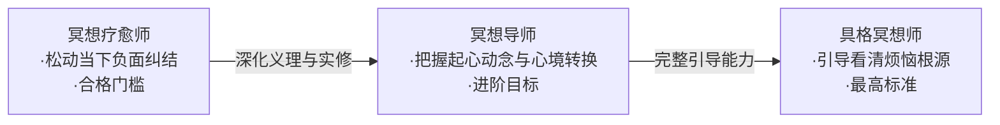

### 1.4 两种根性与导师双重能力

| 根性类型 | 优势 | 劣势 | 导师要求 |
|---|---|---|---|
| **法行人**（理性） | 不易盲从、不易出错 | 进步慢，易卡头脑层 | 需补充直接认知（止观）的深入能力 |
| **信行人**（感性） | 深入快、得感受快 | 缺鉴别力，易吸收偏差内容 | 需补充间接认知（理性思辨）的鉴别力 |

> **核心要求**：冥想导师必须兼具——用间接认知（理性思辨）做鉴别选择，用直接认知（止观）深入转化；既能讲清道理，也能停下来同理对方。

### 1.5 课程核心主题概览

本课程围绕三大理论体系与一套实修体系展开，系统回答冥想导师培训的核心问题：

| 主题模块 | 核心内容 | 教学目标 |
|---|---|---|
| **唯识体系** | 八识结构、三能变识、百法分类、三性说、转识成智 | 理解意识结构与改造原理，建立"万法唯识"的世界观 |
| **般若中观** | 缘起性空、自性见、八不中道、二谛说、六度中观实践 | 以"破"为路径，破除概念执着，获得内心自由 |
| **阿含正观** | 五蕴正观（无常、苦、空、非我）、二甘露法 | 回归源头，正观身心实相，获得厌离与解脱 |
| **实修与执业** | 有效冥想三步、五步禅观疗愈、动中修定、偏差路径、导师素养 | 将全部义理落到导师执业层面——带什么、带到哪里、怎样不走偏 |

**贯穿全课程的三大核心问题**：

1. **问题是什么？**
2. **怎么解决问题？**
3. **为什么知道方法却做不到？**

---

## 第二章 学习目标与预期成果

### 2.1 知识层目标

完成本课程后，学员应能够：

1. **系统阐述**佛法止观四阶段发展脉络（阿含→般若→唯识→密教），理解各阶段核心贡献与适用场景
2. **准确描述**唯识八识结构，解释末那识（第七识）作为烦恼根源的机制
3. **清晰区分**中观（解构路径）与唯识（建构路径）的方法论差异，理解二者殊途同归的实践目标
4. **熟练运用**阿含正观（无常、苦、空、非我）、般若梦幻观、八不中道、转识成智等核心修法的义理基础
5. **辨析理解**直接认知（现量）与间接认知（比量）的关系及其在冥想实践中的应用

### 2.2 技能层目标

1. **独立引导**五步禅观疗愈流程（止心→主题思考→联结自身→松动转化→浸泡浸润）
2. **准确示范**经行（猫步）、芳香呼吸冥想、身体觉察冥想等具体实修技术
3. **灵活运用**"动中修定、静中修观"的日常修持分工原则
4. **有效处理**冥想教学中的常见偏差（昏沉、头脑编织、境界黏着、犹疑懊悔）
5. **创编能力**：理解原理后可针对不同来访者根性，灵活创编适合的冥想引导方案

### 2.3 素养层目标

1. **确立**"有一分体会说一分体会"的如实品质
2. **保持**对导师身份的因缘观——不把角色赞誉认同为真实的自己
3. **培养**持续学习、不耻下问的专业精进态度
4. **建立**"自渡才能渡人"的核心信念——以熏习影响替代说教控制

---

## 第三章 理论框架与哲学基础

### 3.1 佛法止观四阶段发展脉络

> 核心原则：不是"后胜于前"，而是不同时代为新问题打的补丁，本质原理一致。

| 阶段 | 对应传承 | 核心贡献 |
|---|---|---|
| ① 阿含止观 | 原始佛教 / 南传 | 正观"色受想行识"无常、苦、空、非我 |
| ② 般若中观 | 大乘佛法 | 缘起性空，破人我执 + 法我执 |
| ③ 唯识止观 | 大乘后期 | 清晰说明意识结构与改造原理 |
| ④ 密教止观 | 晚期密宗 | 体系最庞杂，适配更晚近时代 |

> **三大传承**：南传（阿含）/ 汉传（般若中观、唯识）/ 藏传（密教）


| 维度 | 阿含止观 | 般若中观 | 唯识止观 | 密教止观 |
|---|---|---|---|---|
| **核心方法** | 正观五蕴 | 缘起性空 | 转识成智 | 身口意三密 |
| **破执对象** | 人我执 | 人我执 + 法我执 | 第七识执着 | 一切微细执着 |
| **时代背景** | 佛陀在世 | 佛灭后 ~700 年 | 大乘后期 | 晚期密宗 |
| **适用根性** | 出家专业修行者 | 在家众（般若根器） | 理性分析型 | 信心虔诚型 |

### 3.2 唯识体系：意识结构与冥想原理

#### 3.2.1 八识结构

意识是**一个整体的八种功能**，不是八个独立意识。

| 识 | 功能定义 | 性质 | 冥想意义 |
|---|---|---|---|
| 前六识（眼耳鼻舌身意） | 表层可觉察的感知与思考 | 本性中性 | 修行的入手处 |
| 第七识·末那识 | 自我意识与调度功能（「机场塔台」） | **一切烦恼的真正根源** | 修行的目标 |
| 第八识·阿赖耶识（藏识） | 储存全部经验痕迹（含潜意识），因缘具足即重新显现 | 本性中性 | 修行的底层基础 |

**末那识的「机场塔台」比喻**：
- 末那识如机场控制塔，负责调度航班起降（前六识活动）
- 长期调度产生"这一切都是我的"的执着——如塔台误将整个机场当作自己的财产
- 执着→掌控欲→失控时焦虑烦恼
- **举例**：僧侣三日不坐同一棵树（怕执着"我的树"）；三餐时间的执着引发冲突——看似小事，根源都在末那识的掌控欲

**表层意识如"晃动的膜"**：
- 意识形态波动剧烈时如一张不断晃动的膜
- 外来影响（正见、道理）被反射掉，无法深入底层
- **定力 = 让这张膜的波动逐渐变小** → 影响力才能穿透表层

**冥想为何有效**（核心机制）：

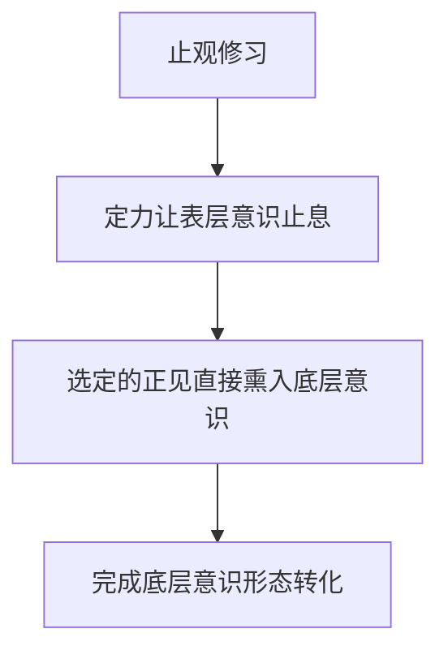

> **核心原理**：必须改变底层动机、世界观，只改表层行为效果有限。

#### 3.2.2 唯识学派创始人与传承

唯识学派由**无着菩萨**与**世亲菩萨**（兄弟）所建立。世亲菩萨著《唯识三十颂》《唯识二十论》等，为唯识体系奠定理论基础。核心传承经典包括《解深密经》《成唯识论》《百法明门论》《华严经》等。

#### 3.2.3 情境熏习原理

烦恼由底层固有心境诱发 → 解决也需从底层换心境 → **止观即是用新心境熏习旧心境**。

**类比**：如吟咏古典诗词（苏东坡《定风波》），不只是理解文字意思，而是让心境进入那个意境——止观修习同理，不是理解概念，而是让整个人浸入新的心境。

**实修四步骤**（观苦 / 梦幻观共通）：


1. **修止安住**：以呼吸为所缘境收摄心念，平稳无大震荡即可（不必追求初禅二禅）
2. **唤起经验**：浮现一件曾让你焦虑烦恼的事，让感受重新生起
3. **当下观察**：不思考事件本身，只观当下生起的不安——以及它如何离开、为何"知道方法却做不到"
4. **松开掌控**：体会"想要一切如我所愿"不可能 → 尊重无常 → 松开执着

#### 3.2.4 六根 × 六境 × 六识

| 根（感官） | 境（外尘） | 识（辨识） |
|---|---|---|
| 眼 | 色 | 眼识 |
| 耳 | 声 | 耳识 |
| 鼻 | 香 | 鼻识 |
| 舌 | 味 | 舌识 |
| 身 | 触 | 身识 |
| **意**（意根） | **法**（法尘） | **意识**（第六识） |

> **意根 + 法尘 + 意识** 是表层意识的枢纽：前五识依五根五境而起，第六识统合反思、生起概念。

**世界 = 根（感官）+ 境（外象）+ 识（意识）三者和合**，缺一不可。

**「每个人的世界皆不同」典型例证**：
- 同一录音，妻子只听到"建议先生改"，过滤掉了"建议自己调整"的部分
- 同一童年事，妈妈、妹妹、自己三人讲出三个版本
- **一物四境**：同一潭水——人见湖水、鱼见空气、天人见琉璃、饿鬼见脓血

> **痛苦根源**：每个人建构自己的世界本属正常，问题在**坚持自己版本是唯一正确并要求他人一致**——"为你好"本质仍是控制。

#### 3.2.5 三三昧（三解脱门）

| 三昧 | 含义 | 对应破除 |
|---|---|---|
| **空三昧** | 观一切法因缘空、无我无我所 | 我执 / 法执 |
| **无相三昧** | 离一切相，不执取相状差别 | 相执（概念、名号、区别） |
| **无愿三昧** | 不起希求愿欲，不刻意造作 | 求执（掌控欲 / 希求心） |

三三昧次第贯通：见空 → 不执相 → 无所求愿——即《金刚经》「无所住而生其心」。


#### 3.2.6 三能变识

> 「由假说我法、有种种相转，彼依识所变」——世亲菩萨《唯识三十颂》首颂

| 三能变识 | 对应识 | 变异方式 |
|---|---|---|
| 异熟能变 | 第八阿赖耶识 | 储存种子的"硬盘"——旧种子成熟、新种子存入，内容永远在变 |
| 思量能变 | 第七末那识 | 执取经验为"我"，但执取对象始终在变 |
| 了境能变 | 前六识 | 依外境因缘而起，外境变则识变 |

**结论**：八识皆变 → 建构的世界永远变化 → 用复杂体系阐述的本质仍是无常义理。

#### 3.2.7 唯识百法分类

唯识学派将一切法分为五大类（百法），是对早期五蕴（色受想行识）的扩展说明体系：

| 类别 | 说明 |
|---|---|
| **心法** | 认知主体（心的本体） |
| **心所法** | 心的作用（烦恼、善念、情绪等心理活动） |
| **色法** | 物质身体、感官系统 |
| **不相应行法** | 时间、空间、生死次第（意识建构的概念，无自性） |
| **无为法** | 涅槃、真如等本质状态 |

> 百法分类的核心意义不在记忆名词，而在理解一切现象皆可被分析、解构——最终仍回到"怎么办"的实践。

#### 3.2.8 唯识三性说（修行框架）

| 三性 | 对应识 | 修行要点 |
|---|---|---|
| **依他起性** | 前六识 | 无法控制全部外境，但可选择浸泡环境（「朋友圈即风水」） |
| **遍计所执性** | 第七识 | 不断分别计较如乌云遮蔽自性。修行核心：松开执着，乌云散去自性自显 |
| **圆成实性** | 第八识 | 本自具足，无需创造，只需让其呈现 |

#### 3.2.9 转识成智（双向路径）

| 识 | 对应智 | 含义 |
|---|---|---|
| 第八阿赖耶识 | **大圆镜智** | 圆满映照，本自具足 |
| 第七末那识 | **平等性智** | 不再分别计较 |
| 第六意识 | **妙观察智** | 尊重因缘，不斤斤计较 |
| 前五识 | **成所作智** | 单纯接触外境，不批判 |

**两种修行路径**：

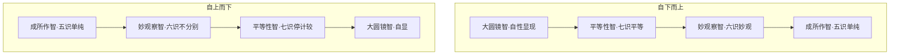

> **核心**：转识成智不是改造自性，而是让本自具足的智慧呈现——只需松开执着，无需额外创造。

#### 3.2.10 唯识核心实践意义

- **万法唯识 / 三界唯心 / 一切唯心造**——一切被认知的事物都是心识作用所建立
- 世界既由心建构 → **改造自己的心，世界自然改变**，无须穷尽改造外境
- **幸福观**：「我了无遗憾，世界也了无遗憾」——珍惜每个当下因缘，每一站都幸福

### 3.3 般若中观体系：缘起性空

#### 3.3.1 核心概念

- **空性 ≠ 什么都没有**，而是"一切事物没有永恒不变的自性，无法真正抓住、掌控"
- **缘生即幻生，幻生即无生**：一切因缘所生现象本质如梦幻，并非不存在，而是不以永恒、真实、可被主宰的方式存在
- 生命如电影：身处其中所以执着真实，提前观到本质，心态与决策都会改变
- **沙滩筑城堡比喻**（阿含经）：看清实相者尽情筑城堡、潇洒放下；被自性见束缚者死守城堡，徒劳无功

#### 3.3.2 阿含 vs 般若主要差异

| 维度 | 阿含 | 般若 |
|---|---|---|
| 空的阐释 | 主讲人无我 | 人无我 + 法无我 |
| 适应对象 | 出家专业修行者 | 在家众 |
| 修行倾向 | 厌离、远离 | 不远离生活，「于梦中不执梦」 |

> 实际临床中，绝大多数人解决人我执即可。

**二甘露法**（阿含经）：
- 观呼吸（对治散乱）+ 观身不净（对治贪爱）
- 后者因易致偏差，佛陀后来改为择人而教

#### 3.3.3 中观学派与核心经典

**大乘兴起背景**：佛陀入灭约 700 年后，大乘般若系经典出现，相比阿含经文学性更强、传播力更广，核心是开发**般若智慧**（透视真相的能力）。

**「五度为盲，般若为导」**：六度（布施、持戒、忍辱、精进、禅定、般若）中前五度都需般若指引方向，否则如盲人走路。

**龙树菩萨**：著《中论》《大智度论》统合各派，被汉传八大宗派共尊为「八宗共祖」。

**汉传中观四论典**（鸠摩罗什译）：

| 论名 | 作者 | 核心定位 | 特点 |
|---|---|---|---|
| 《中论》 | 龙树 | 中观根本、八不中道、三是偈 | 严谨、体系化、破尽一切法执 |
| 《十二门论》 | 龙树 | 中观纲要、入门捷径 | 精简、十二门、直显空性 |
| 《百论》 | 提婆 | 破邪显正、论战利器 | 犀利、应成法、破内外道 |
| 《大智度论》 | 龙树 | 般若百科、修行指南 | 广博、通俗、结合菩萨行 |

> **三是偈**（《中论》核心）：「众因缘所生法 → 空 → 假名 → 中道义」四重转进，一句话总摄中观。

#### 3.3.4 自性见——一切烦恼的根源

**自性见 = 执着事物具备「自有 / 独有 / 常有」三特征**：

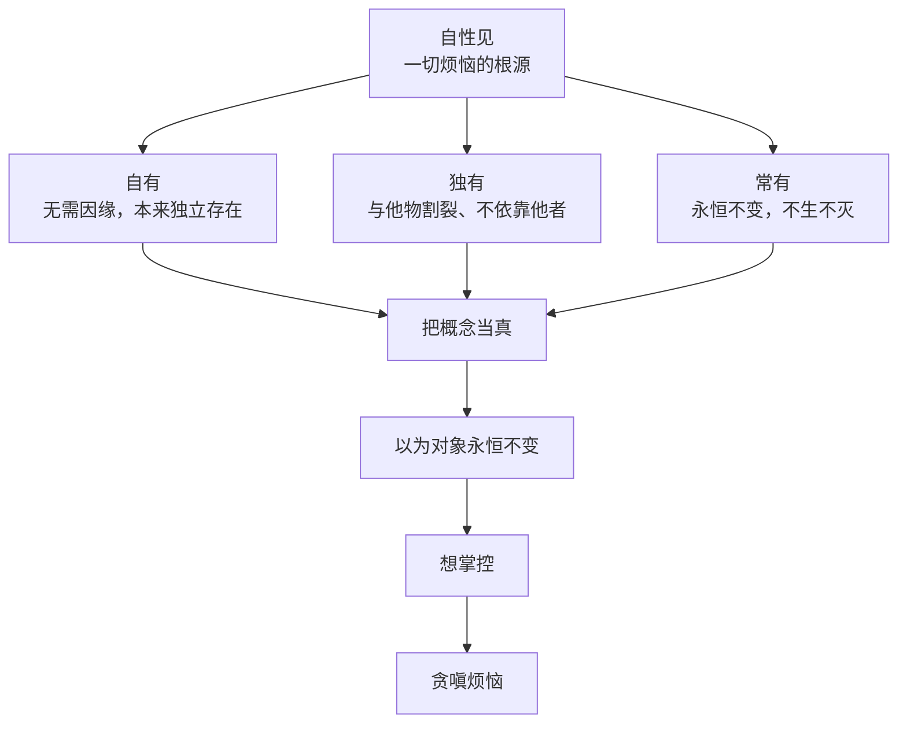

- **自有**：无需因缘，本来独立存在
- **独有**：与他物割裂、不依靠他者
- **常有**：永恒不变，不生不灭

> 生活体现：把概念、定义、认知"当真"→ 以为对象永恒不变 → 想掌控 → 贪嗔烦恼

#### 3.3.5 中观方法论：以破为立

| 方法 | 核心内容 | 经典依据 | 破执目标 |
|---|---|---|---|
| **应成归谬** | 不立自见，只破他见的内在矛盾 | 《大智度论》 | 一切自见 |
| **破四生颂** | 「诸法不自生，亦不从他生，不共不无因，故知无生」 | 《中论》 | 因果实在论 |
| **层层递进** | 破“实有”后若执“空”，则再破——只要起新概念就再破 | 「无所住而生其心」 | 一切概念执着 |
| **中观平等观** | 非“完全相同”，而是本质平等 | 「色即是空」 | 名词概念执着 |

**中观与分别计较**：
- 「朋友圈」即「计」的体现——无时无刻不在分别计较
- 龙树破一切见 = 破一切分别计较
- **中观平等观**：非“完全相同”，而是本质平等（参天大树与小草同为因缘生命）；「色即是空」破名词概念执着——不仅破“实体”执着，连“概念”执着也一并破除

#### 3.3.6 八不中道

> "不生亦不灭，不常亦不断，不一亦不异，不来亦不出"

| 八不 | 对应执着 | 现代语境 |
|---|---|---|
| 不生 / 不灭 | 绝对的产生与消失 | **空间**：此处生即彼处灭，只是观察位置不同 |
| 不常 / 不断 | 永恒不变 vs 彻底断灭 | **时间**：长短皆主观 |
| 不一 / 不异 | 完全相同 vs 完全对立 | **同一性**：求一求异皆极端 |
| 不来 / 不出 | 绝对的来处与去处 | **运动位置**：来去由观察者视角定义 |

**中道义颂**：「众因缘所生法，我说即是空，亦为是假名，亦是中道义。」

> 最大坑——执着「空」：「空亦不空，大圣说空法，为离诸见故，若复见有空，诸佛所不化」

#### 3.3.7 二谛说

| 二谛 | 含义 | 作用 |
|---|---|---|
| 世俗谛 | 依世间常识的言说表达 | 体会真理的阶梯 |
| 第一义谛 | 指向空性、心无挂碍的涅槃 | 修行最终目标 |

> 「若不依俗谛，不得第一义谛；不得第一义谛，不得涅槃」——既不能离世俗谈空，也不能停在世俗忘解脱。

#### 3.3.8 涅槃在当下

《中论》「涅槃与世间，无有少分别」——不必远离日常生活去深山修行，「在家亦可修，深山未必证」。

**大乘经义破执核心**：

| 原则 | 内容 | 实践要点 |
|---|---|---|
| **离苦不贪** | 离苦不贪、离罪不犯、知罪通福 | 行为可取善避恶，但不立绝对界限 |
| **只见因缘** | 不见人我，只见因缘 | 不以人我论是非，只见因缘流转 |
| **相对是非观** | 「眼见色时不生染着」 | 眼见色时不生染着，心不随境转 |
| **当下安住** | 不寻外在终极真相，关注当下心如何安住 | 佛法认知出发点 |
| **心灭即尽头** | 「当下既是起点也是终点」 | 心的尽头是「死心灭」（心不再执着） |

#### 3.3.9 中观在生活与冥想中的实践

**对治烦恼原理**：
- 所有焦虑、不安、恐惧、怨恨，根源都是对某概念定义的执着
- **松动定义的真实感 → 情绪自然平复**
- **比喻**：红绿灯坏了不敢走——被概念定义束缚；中观修行的目的就是让人摆脱概念绳索，获得内心自由

**六度的中观实践**：

| 六度 | 中观实践要点 |
|---|---|
| **布施** | 三轮清净（不执“我是施者 / 对方受者 / 我布施物”） |
| **持戒** | 不执“我持戒高尚”（如吃素者看不起不吃素者即破了持戒的原意） |
| **忍辱** | 三层次细分（见下表） |
| **精进** | 不执“我在精进”，自然而然 |
| **禅定** | 不执“我有定境”，定中亦无所得 |
| **般若** | 指导上述五度的方向 |

**忍辱三层**：
1. **生忍**：理解众生被业力推动，不结怨
2. **法忍**：接受现象因缘所生，不执自感为唯一正确
3. **无生法忍**：「内六情不着，外六尘不受」——内有情绪不执着、外境不染着

### 3.4 阿含止观：正观无常

#### 3.4.1 核心目标

解脱烦恼 → 获得「乐 / 定 / 安 / 明 / 爱」（与流派、信仰无关，是普遍人性需求）

#### 3.4.2 核心观法

止观五蕴（色受想行识）皆为：

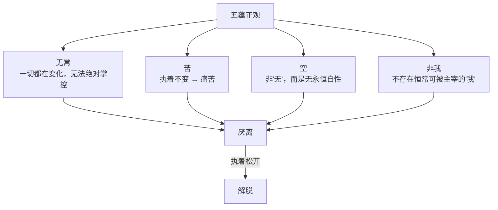

1. **无常**：一切都在变化，无法绝对掌控
2. **苦**：执着不变 → 痛苦
3. **空**：非"无"，而是无永恒自性
4. **非我**：不存在恒常可被主宰的"我"

#### 3.4.3 效果机制

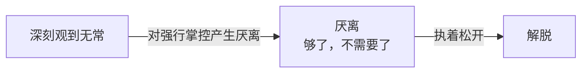

深刻观到无常 → 对"强行掌控"产生**厌离**（不是讨厌，是"够了，不需要了"）→ 执着松开 → 解脱

> 难点不在理解，在转化：头脑懂 ≠ 末那识懂，所以需要反复止观练习。

#### 3.4.4 经证：阿含经 259 经

舍利弗答摩诃俱胝罗：从初果到四果，从头到尾做的是**同一件事**——止观五蕴为病、为痈、为刺、为杀，无常苦空非我，只是深浅不同。

### 3.5 两种认知模式

| 维度 | 现量（直接认知） | 比量（间接认知） |
|---|---|---|
| 方式 | 直接体验当下，尽量不带已有角度经验 | 思维、分析、推论，带着自身/他人经验判断 |
| 深度 | 能进入认知底层 | 停留在表层 |
| 提供 | 认知的**深度** | 认知的**广度** |
| 局限 | 较窄 | 永远受“角度”限制 |

**现代人偏差**：长期过度训练间接认知 → 大脑停不下来 → 失去直接相处能力 → 「暗耗精血」

```mermaid
graph LR
    subgraph 比量·间接认知
        A1[思维分析推论] --> A2[带着经验判断]
        A2 --> A3[停留在表层]
    end
    subgraph 现量·直接认知
        B1[直接体验当下] --> B2[尽量不带角度经验]
        B2 --> B3[能进入认知底层]
    end
    A3 -.->|"止观修习"| B1
```

**培养止观认知 = 节能放松 + 直接看清烦恼模式 + 从根源转化**

> 固化偏执的预设角度会障蔽真相——这就是禅修中所说的「染色」（认知污染）。  
> **定力的作用**：让奔腾的预设角度暂时止息，让底层意识从零出发重新观察。

**定力的清晰定义**：定力 = 平静稳定的基础心境，不是神秘境界，而是稳定宽松的心智——不只是专注，更是能停下来的能力。

### 3.6 业力、轮回与缘起

- **业力 = 惯性**：由点滴行为种子累积，形成生命趋势
- **趋势说 ≠ 宿命说**：改变种子即可改变趋势，永远存在改变可能
- **轮回（可经验角度）**：因果相续的惯性——反复踩相似坑、找相似伴侣即是轮回
- **缘起论四果**：相续性 → 差异性 → 因果性 → 无自性

| 缘起论四果 | 含义 | 生活体现 |
|---|---|---|
| **相续性** | 因果相续，不断灭 | 行为习惯的惯性延续 |
| **差异性** | 因缘不同，果报各异 | 同一家庭不同性格 |
| **因果性** | 种什么因得什么果 | 努力方向决定结果 |
| **无自性** | 一切因缘和合，无独立自性 | 没有永远不变的事物 |

> 「知业报不失，不起有见；知诸法如幻，不起空见」——不落两边，即中观核心。

### 3.7 东西方哲学对比

| 体系 | 方法论 | 认知层面 | 与冥想的关系 |
|---|---|---|---|
| 唯识（东方·建构） | 建立"一切如幻"的唯识观 | 源于直接认知（禅修止观） | 破执着→解脱痛苦 |
| 中观（东方·解构） | 以缘起性空解构一切现象 | 源于直接认知（禅修止观） | 让执着无落点 |
| 西方哲学（建构/解构） | 康德/尼采/福柯 | 仅在间接认知层面 | 难脱心理困境 |

---

## 第四章 实修方法与技术指导

### 4.1 有效冥想的通用步骤

| 步骤 | 操作 | 目的 |
|---|---|---|
| ① 明确目标 | 确定冥想要解决的核心问题 | 方向清晰 |
| ② 评估风险 | 了解自身条件与可能的障碍 | 避免盲目 |
| ③ 吃透原理 | 理解所选方法的理论依据 | 原理通则可适配 |
| ④ 锻炼基础 | 培养定力、放松等基础能力 | 打好地基 |
| ⑤ 准备资源 | 选择合适的环境、工具、引导 | 创造有利条件 |
| ⑥ 出发实践 | 按步骤实施，持续调整 | 知行合一 |

> **懂原理 > 懂方法**，原理通则可适配不同根性的对象。

### 4.2 有效冥想三步核心原理

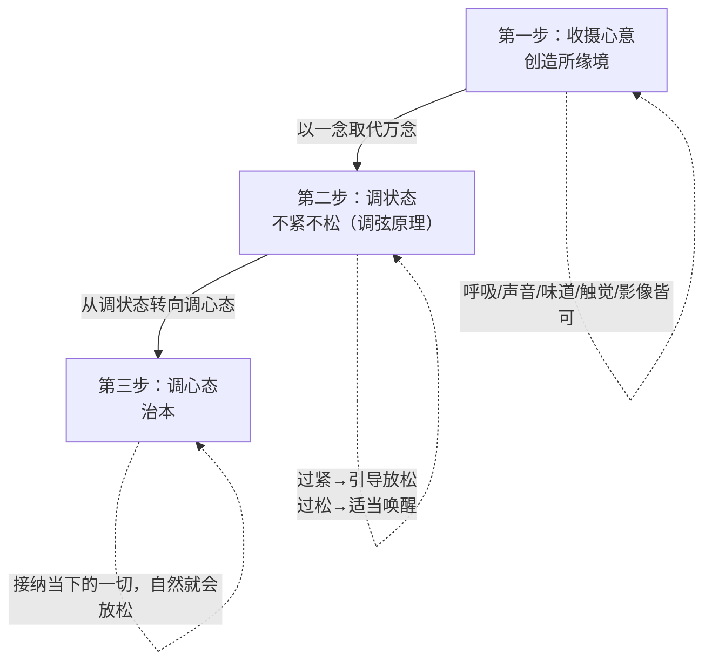

#### 第一步｜收摄心意，创造所缘境

- **现代人核心障碍**：感知过敏，闭眼念头依然纷乱
- **正确做法**不是"压抑念头"，而是**以一念取代万念**：主动创造单一所缘境
- **所缘境无好坏**：呼吸、声音、味道、触觉、影像皆可

#### 第二步｜调状态：不紧不松（调弦原理）

| 偏差 | 表现 | 调整方向 |
|---|---|---|
| 过紧 | 眉头深锁、注意力僵硬 | 引导放松 |
| 过松 | 打瞌睡、昏沉 | 适当唤醒 |

#### 第三步｜从调状态转向调心态（治本）

- 状态是心态的结果，要从**因（心态）**调，不从果（状态）强行修
- **接纳当下的一切，自然就会放松**——刻意要求"放松"本身就是紧张
- 工具的本质 = 方便善巧：月光、颂钵、芳香、太极拳冥想……核心原理一致

### 4.3 冥想的核心目标 = 心境转换


- 把**负面、紧绷、狭隘、纠结**的心境 → 调整为**正面、松弛、开阔、平和**的状态
- 心境是状态的根源，心境调了，状态自然改变
- 身体健康、关系和谐是**附加价值**；安心、放松、宽坦才是核心

### 4.4 动中修定 vs 静中修观

| 方向 | 适合时段 | 原理 |
|---|---|---|
| **动中修定** | 日常 2–3.5 小时 | 一直保持小火，定力随时间累积 |
| **静中修观** | 每日 0.5–1 小时静坐 | 观的深入需要静的环境 |

> **核心原则**：时间充足动静都修定；**时间有限，动中修定，静中修观**。  
> **烧水比喻**：只在静坐时修定，就像烧水几分钟就停火——永远烧不开。

**动中修定的方法**：核心就是**知道当下正在做什么**，全然陪伴当下的自己——
- 走路知道走路、写字知道写字、起身知道起身、坐下知道坐下
- **不是控制、监督，只是相处**
- 从小细节开始积累

**一日禅定义**：进门到离开全程保持觉知——不只是坐着才算修禅。午餐午休也尽量保持觉知。

**止与观的关系**：止是基础，观是启发。止提供定力基床，观在定力基础上开启智慧。

### 4.5 五步禅观疗愈流程（标准操作模板）

> 冥想疗愈师的标准操作手册

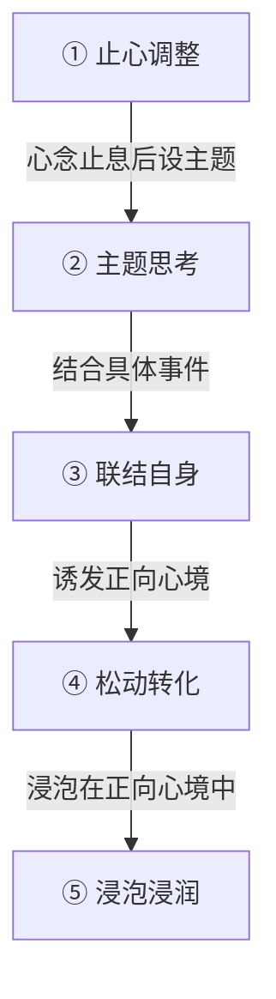

| 步骤 | 操作 | 要点 |
|---|---|---|
| ① **止心调整** | 先放松让心念止息，波动平稳后再设主题 | 没有止息直接进入会变成头脑编织 |
| ② **主题思考** | 意识层面理解主题（什么是苦？怎么产生？） | 先把名相想清楚 |
| ③ **联结自身** | 结合具体事件，看清如何陷入烦恼漩涡 | 观察心的运作过程 |
| ④ **松动转化** | 诱发新的正向心境松动原负面情绪 | **疗愈的核心** |
| ⑤ **浸泡浸润** | 浸泡在正向心境中，再观察"明知不对却不愿离开" | 完成完整自我观察 |

> **后半段比前半段更重要**：观察原因不等于疗愈，松动转化才是核心。

**转化的两种方法**：
1. 引导自己观察解决方法（最智慧）
2. 直接介入正向工具转换心境（无力解决时使用）

### 4.6 实修方法总汇

#### 4.6.1 观苦四问

1. 你感受到的苦/不安/烦恼是什么？它如何产生？
2. 结合具体事例观察烦恼产生的过程
3. 日常什么情境下你特别容易产生烦恼不安？
4. 明明知道如何远离烦恼，为什么还是不愿意远离？

#### 4.6.2 现量观苦五步

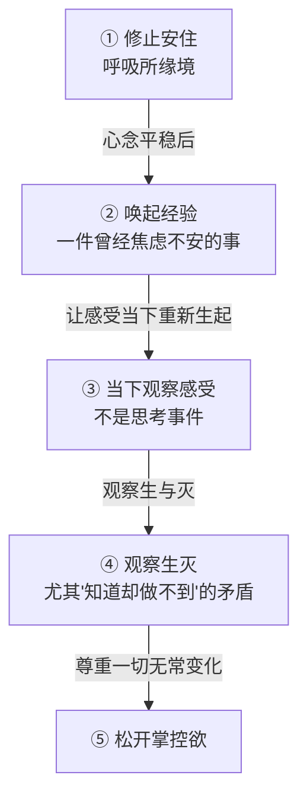

1. **修止安住**（呼吸所缘境）
2. **唤起一件曾经焦虑不安的事件**，让感受当下重新生起
3. **当下观察感受**（不是思考事件）
4. **观察生与灭**：尤其离开烦恼的经验，以及"知道却做不到"的矛盾
5. **松开掌控欲**，尊重一切无常变化

#### 4.6.3 梦幻观（空观）

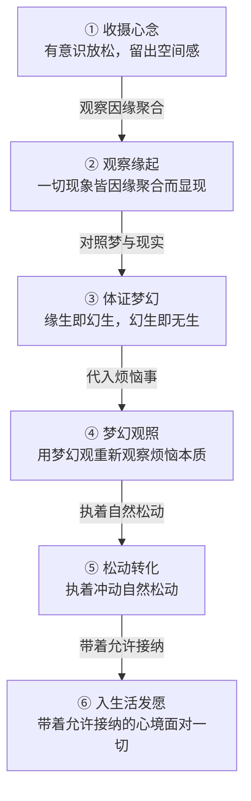

1. 收摄心念后有意识放松，留出空间感
2. 观察一切现象皆因缘聚合而显现
3. **缘生即幻生，幻生即无生**——对照梦与现实，体会本质相同
4. 浮现一件烦恼事，用梦幻观重新观察其本质
5. 体会执着冲动自然松动
6. **入生活发愿**：未来仍带着允许接纳的心境面对一切

> 《金刚经》：「一切有为法，如梦幻泡影，如露亦如电，应作如是观。」

#### 4.6.4 八不中道体证

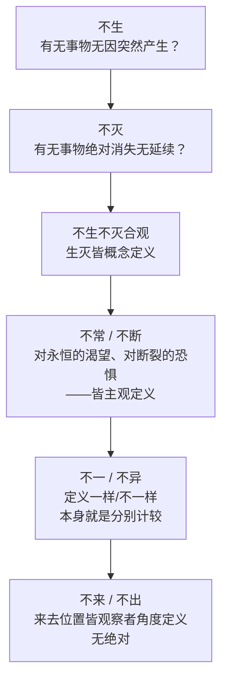

依次体证：
1. **不生**：有没有任何事物是无因突然产生？
2. **不灭**：有没有任何事物会绝对消失、无任何延续？
3. **不生不灭合观**：生灭皆概念定义
4. **不常 / 不断**：体会对永恒的渴望、对断裂的恐惧——皆主观定义
5. **不一 / 不异**：定义"一样/不一样"本身就是分别计较
6. **不来 / 不出**：来去位置皆观察者角度定义，无绝对

#### 4.6.5 唯识止观


1. 收摄心——以呼吸/身体位置/一句话为所缘，回到当下
2. 体证「依识所变」——一切认知都是识与外接触构筑，识在变 → 世界在变
3. 按"从表层到底层"路径松动：前五识单纯 → 六识不分别 → 七识停计较 → 大圆镜智显现

#### 4.6.6 经行（猫步）要领

| 要点 | 说明 |
|---|---|
| 膝盖 | 微微弯曲，**不过度弯曲**（避免膝盖受伤） |
| 步法 | **前脚脚跟先落地** → 放平脚掌 → 重心**缓慢**从后脚移向前脚 |
| 视线 | **看向前方**，不低头盯脚 |
| 方向 | 身体方向与膝盖迈出方向**一致**，避免膝盖拧转 |
| 速度 | 慢而稳定，模拟猫捕猎的蓄势状态 |
| 所缘境 | **脚与地板接触**作为定力的锚点 |

> 原理溯源：源自武术训练，核心是**蓄势**——放松积蓄力量，最后才能一发即中。

**疲劳处理原则**：走累了换普通走路，**保持觉知就符合要求**——不必强迫自己始终保持猫步形态。

**常见错误纠正**：
- 不低头盯脚（视线前方）
- 身体方向与膝盖一致（避免拧转伤膝）
- 不追求过慢而失平衡

#### 4.6.7 动中禅·水中捞月拨云见日

| 步骤 | 操作 |
|---|---|
| ① 单侧手 | 右手举起，腰部带动转动，下捞（如水中捞月）、上拨（如拨云见日） |
| ② 双手同时 | 熟练后双手并行 |
| ③ 加意识观想 | 体会空气像水、像浓稠水泥的不同触感 |

> **三界唯心造**：心境如何预设，世界就如何对你显现。

#### 4.6.8 芳香呼吸冥想

> 精油香气作为天然所缘境，可替代呼吸作为入门级定力训练。

1. 双手指尖相对搭成"小房子"放在鼻尖，闭眼
2. 三轮深呼吸：吸气感受芳香分子入鼻入脑，呼气将压力疲惫呼出
3. 身体沉浸香气，进入呼吸冥想
4. 收尾：搓热掌心包围双眼，对眼睛说"你辛苦了"

#### 4.6.9 身体觉察冥想

**扫描顺序**（从头到脚）：眉心 → 前额、太阳穴、头顶头皮 → 眼球、眼皮（眼球沉向后脑） → 面部肌肉（柔软舒展） → 口腔、牙齿 → 头脑 → 肩膀、手臂、双手 → 胸口 → 腹部 → 臀部骨盆 → 双腿、膝盖 → 脚踝、脚背、脚趾 → 全身整合 → **三次深呼吸 + 双手合掌胸口收尾**

> 核心原则：仅要求如实感受当下状态，**不立刻强制调整**。感受到紧绷/酸痛/温暖等各种状态，都只是觉察，不加评判。

### 4.7 散客团课与导师执业场景指导

#### 4.7.1 散客团课的合理预期

- **核心 = 随缘**：根据受众基础设定预期，不要用过高标准要求体验者
- 团课能让大家**心定、放松、愉悦**就是合格——本质是**撒下冥想的种子，静待因缘**
- 开课初期就明确告知本次可达成目标，降低不合理期待
- 不必在团课中追求深度观修效果，适合用体验式引导

#### 4.7.2 盘腿打坐指导

- **核心原则：打坐管的是心，不是腿**——腿麻就松开活动，不要变成和腿麻的对抗
- 真正不麻的核心是**养成日常盘腿习惯**（多拉伸、练瑜伽松腰开髋）
- 初学者不必强求全莲花/双盘，舒适坐姿即可
- 引导学员关注点放在内心而非身体姿势

#### 4.7.3 自我练习与脱离引导词依赖

- 初期可依赖引导词，但须**逐渐脱离**
- **方法**：先搭框架（五步流程的骨架），再通过练习丰富细节
- 每次练习不必完美，重点是保持持续性
- 导师自己必须先熟练脱离引导词，才能自由引导他人

---

## 第五章 课程专题详述

> 本章将课程全部义理与实修内容按专题系统组织，供学习者深入研读。

### 5.1 冥想导师的定位与方法论

#### 5.1.1 核心定位

- **培养目标**：陪伴他人走出困境的「同行者」，而非高处的「指导者」
- 不直接给答案，留出对方的自我空间，唤醒其内在自信与力量
- **有效性是唯一标准**：能否减少痛苦、获得安宁，远比掌握多少名词重要（「喝水解渴」原则）
- **大医无病**：目标是培养来访者自我解决问题的能力，而非制造依赖

#### 5.1.2 止观的两个核心功能

1. **现量观察发掘模式**：直接体验当下，观察烦恼的产生过程与运作方式
2. **现量熏习转化**：用定力让表层意识止息，把正见熏入底层意识形态，完成转化

**止观实践基本要求**：
- 观察对象必须是当下，不立刻贴标签下定义
- 遇剧烈痛苦的来访者先松动当下，再探根源
- 区分观想练习与思考的差别：很多人初学时把观想做成思考，未真正进入止观

#### 5.1.3 针对不同根性的引导策略

- **法行人**（理性）需先讲道理，再进入实修
- **信行人**（感性）需先被关心感化，再进入实修
- 以苏东坡《定风波》为例说明意境与止观——止观是“体会心境”而非“理解文字”
- 「放下」的正确理解：建立在“有勇气拿起”之上，没拿起就没有资格谈放下

#### 5.1.4 对冥想导师的三条成长忠告

1. **如是最关键**：有一分体会就说一分体会，不做超过自己能力的事，冥想导师是**桥梁**，不是权威
2. **不执身份为真**：导师身份是因缘和合的角色，不把课堂赞誉认同为真实的自己——入戏太深会产生精神问题，记得**角色是假，不执为真**
3. **要提升专业能力**：干一行对一行负责，不断练习、交流、不耻下问，利用现有师长伙伴环境资源，**不要浪费福报**

### 5.2 止观的义理基础

#### 5.2.1 佛法与冥想的关系

- 佛法是人类共同宝藏，不局限于宗教信仰，名词只是代号，核心是把概念转化为自身经验
- 「研究水却忘了喝水」是误区——有效性是唯一标准
- 早期佛教经典特点：直白、对话式记录、侧重方法与因果；阿含经长期被忽视，鼓励回归源头
- 戒律演变规律：佛陀随犯随制，「小小戒可舍」的开示，应符合当地法律与公序良俗

#### 5.2.2 解决烦恼的正确路径

- 常见误区：只解决外在诱发事件，永远在解决“外面”——止观能直接观察内在模式
- 止观的两个核心功能：现量观察发掘模式 + 现量熏习转化

#### 5.2.3 AI 时代的启示

理性思维体系或被 AI 终结，直接认知的描述更具价值。冥想导师的核心竞争力在于直接认知（现量）的深度，而非间接认知（比量）的广度。

---

### 5.3 唯识体系专题

#### 5.3.1 唯识学派的教学意义

唯识学派本质是一种**观法**，重构认知世界的底层方法论。印顺法师指出：「般若是阿含的说明系统，中观是般若的说明系统」——各体系层层递进，互为补充。

#### 5.3.2 唯识与日常烦恼

- **现实例证**：同一经历，看待方式百分百可选——经历不可选，看待方式可选
- 原生家庭议题：如何看待过往经历，是修行者可以自主掌握的部分
- 依他起性修行实践：选择浸泡环境，「朋友圈就是最好的风水」，亲近善知识/读经典
- 遍计所执与圆成实性：本自具足如太阳被乌云遮，散开即显现

#### 5.3.3 业力、轮回与缘起的实修意义

- **业力 = 惯性 = 行为种子累积**：「三岁看一生」是趋势可调整，非命运注定
- 轮回可经验部分：因果相续的惯性；三世六道属超经验范畴，无须绝对论断
- 佛法只主张「生命影响不断灭」，不做绝对论断

#### 5.3.4 唯识实修要点

- 观一切意识皆**因缘所生、不断变化**
- 体会**无我**——色身与精神我都在变，没有恒常可执的我
- 体会阿赖耶识**含摄一切、允许接纳**的本质，松动第七识的计较执着
- 让**平等大圆镜智**成为世界观主体，前六识的判断来自无挂碍的心境

---

### 5.4 般若中观专题

#### 5.4.1 中观修行的核心目的

让人摆脱概念绳索，获得内心自由。自性见与日常烦恼的关系：「把它当真了」→ 以为对象永恒不变 → 想掌控、非要不可 → 贪嗔烦恼。

**经典比喻**：
- **沙滩筑城堡**（阿含经）：看清实相者尽情筑、潇洒放下；被执着束缚者死守城堡
- **红绿灯坏了不敢走**：被概念定义束缚；中观修行的目的就是让人摆脱概念绳索
- 「涅槃不在当下之外」——涅槃就在日常生活中

#### 5.4.2 中观八不实修要点

- **可全修可选修**：从「不生不灭」切入，或结合空间、时间、运动、饮食角度
- **不追求一次到位**：练习只是**台阶**，核心是走出焦虑烦恼的泥沼
- **核心作用**：松动对**时间、空间、事物本质**的固有真实感预设——预设松动 → 焦虑纠结随之松动

#### 5.4.3 大乘经义破执核心

- 「离苦不贪、离罪不犯、知罪通福」
- 不见人我，只见因缘
- **相对是非观**：行为可取善避恶，但不立绝对界限；引「眼见色时不生染着」
- **佛法认知出发点**：不寻外在终极真相，关注当下心如何安住
- 「当下既是起点也是终点」——心的尽头是「死心灭」（心不再执着）

---

### 5.5 阿含正观与认知模式专题

#### 5.5.1 正观无常的实践意义

深刻观到无常 → 对“强行掌控”产生**厌离**（不是讨厌，是“够了，不需要了”）→ 执着松开 → 解脱。难点不在理解，在转化：头脑懂 ≠ 末那识懂，所以需要反复止观练习。

#### 5.5.2 直接认知在实修中的应用

- **「染色」（认知污染）**：固化偏执的预设角度障蔽真相——把预设判断当成对象本身，看不到对象真貌
- **定力的作用**：让奔腾的预设角度暂时止息，让底层意识从零出发，重新观察对象

#### 5.5.3 东西方哲学对比的当代价值

> 详见 [§3.7 东西方哲学对比](#37-东西方哲学对比)。

AI 时代下，直接认知的描述更具价值——冥想导师的核心竞争力在于现量的深度，而非比量的广度。

---

### 5.6 实修专题

#### 5.6.1 冥想核心目标：心境转换

- 定力非常重要，**但不是唯一重要，更不是最重要的**
- 冥想最重要的目标 = 帮助自己/他人完成心境转换：把**负面、紧绷、狭隘、纠结**的心境 → 调整为**正面、松弛、开阔、平和**的状态
- 心境是状态的**根源**，心境调了，状态自然改变
- **附加价值 vs 核心目标**：身体健康、关系和谐都是附加价值；让心获得**安心、放松、宽坦**才是核心，是个体可以自主掌握的部分

#### 5.6.2 五步禅观疗愈的完整流程逻辑

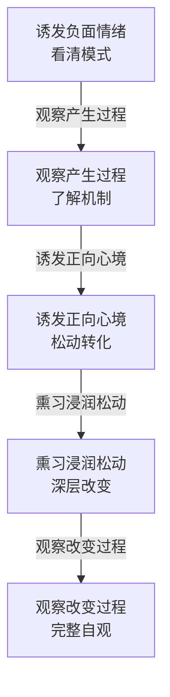

**艾灸收尾比喻**：前半段观察会扰动负面情绪，必须做收尾转化，否则一直浸泡在负面情绪中（如艾灸不收尾则散乱）。

#### 5.6.3 实修方法引导要点

- **芳香呼吸冥想**：精油香气作为天然所缘境，适合入门级定力训练；三轮深呼吸后进入呼吸冥想；收尾时搓热掌心包围双眼，对眼睛说“你辛苦了”
- **身体觉察冥想**：仅要求如实感受当下状态，不立刻强制调整；感受到紧绷/酸痛/温暖等各种状态，都只是觉察，不加评判
- **空观（梦幻观）**：「空」无感者直接用「梦幻观」替代；代入焦虑事件放入缘起梦幻泡影视角重新观察；浸泡在允许、接纳、宽坦、无挂碍的心境中；最后入生活发愿
- **唯识转识成智**：观一切意识因缘所生不断变化 → 体会无我 → 体会阿赖耶识含摄一切允许接纳 → 松动第七识计较执着 → 让平等大圆镜智成为世界观主体

#### 5.6.4 实修总结

阿含、般若、中观、唯识最终都指向「无障碍的自由心」——允许一切、尊重一切、承担一切，不把一切当成压力。内容不是听完就有用，关键在练习。

---

### 5.7 导师执业与素养专题

#### 5.7.1 冥想从业者的三阶段定位

> 详见 [§1.3 冥想从业者三阶段成长路径](#13-冥想从业者三阶段成长路径)。

**课程愿景**：把冥想方法带入焦虑快速的现代社会，是对社会的法布施。

#### 5.7.2 改变意识形态的两条路径

> 详见 [§6.8 导师意识形态影响路径](#68-导师意识形态影响路径)。

**核心原则**：真正深刻的改变 = 熏习浸润渗透感化，不是头脑明白——道理懂了停留在表层，影响深度有限。

#### 5.7.3 导师核心素养：菩萨四特质

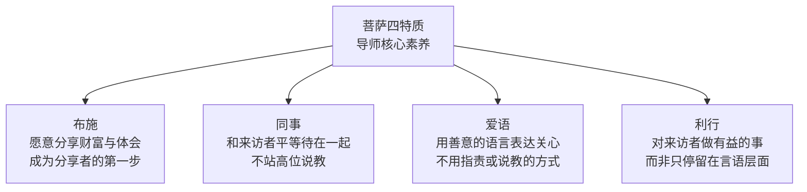

1. **布施**：愿意分享财富与体会——成为分享者的第一步
2. **同事**：和来访者平等待在一起，不站高位说教，一起喝茶、做小事都能建立信任
3. **爱语**：用善意的语言表达关心，不用指责或说教的方式
4. **利行**：对来访者做有益的事，而非只停留在言语层面

| 导师类型 | 注意事项 |
|---|---|
| **理性导师** | 避免"高高在上讲道"的错 |
| **感性导师** | 补充"和外界保持空间"的定力 |

#### 5.7.4 执业常见问题答疑

> 详见各专题详述：[§6.7 感性冥想师的自我保护](#67-感性冥想师的自我保护)、[§6.8 导师意识形态影响路径](#68-导师意识形态影响路径)、[§5.7.5 学员问答精要](#575-学员问答精要)。

- **方法运用与药方创编**：课程教药性药效（原理），不是固定药方；理解原理才能创编，不理解原理不要盲目自创，先沿用已验证有效的方法积累临床经验
- **散客团课的合理预期**：核心是随缘，团课能让大家心定、放松、愉悦就是合格——本质是撒下冥想的种子，静待因缘
- **只修止不修观**：止 = 止痛药，能伏烦恼、获得世间定；想根本解决需修观

#### 5.7.5 学员问答精要

| 问题 | 核心回答 |
|---|---|
| 明心见性与唯识学的关系 | 本质即停下执着，大圆镜智显现；不同宗派同一件事 |
| 明心见性是一时还是彻底 | 当下心境状态；初果至四果差别在频率；真正明心见性是「有事也不挂碍」 |
| 现代为何看不到成佛者 | 关键看对「佛」的定义；解脱者社会上是有的 |
| 冥想导师收费如法吗 | 关键在发心；免费班反易吸引不珍惜者；正当行业皆是布施 |
| 情绪浮躁如何引导 | 尽力而为不力尽强为；冥想核心是松动而非改造；松开抗拒与叠加，感觉自然消退 |

---

## 第六章 练习指导与注意事项

### 6.1 「禅」的三层语义辨析

| 层次 | 含义 | 定位 |
|---|---|---|
| **禅那（禅修）** | 「思维修」——在安定状态中作思维观察 | 广义：所有探索心理底层的实践 |
| **禅宗** | 思维修的结果：开启般若、远离烦恼 | 中国语境最广义，等同开悟境界 |
| **禅定** | 禅修过程中「止心修定」的核心环节 | 日常说「修禅」常特指修定 |

> 清晰当下目标——是修思维观察、修定、还是学习禅宗？不同目标对应不同路径，不要为「未到达最终目标」焦虑。

### 6.2 走火入魔的真相与安全原则

| 概念 | 含义 | 本质 |
|---|---|---|
| **走火** | 身体紊乱 | 生理层面的失调 |
| **入魔** | 心理混乱 | 心理层面的失衡 |

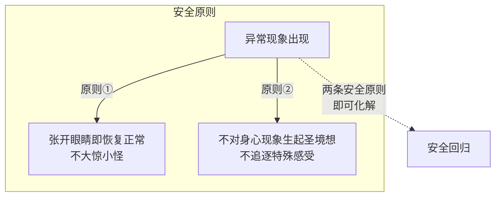

- **走火** = 身体紊乱；**入魔** = 心理混乱
- **两条安全原则**：
  1. 任何异常现象，**张开眼睛即恢复正常**，不大惊小怪
  2. **不对身心现象生起圣境想**，不追逐特殊感受

### 6.3 冥想中的两类偏差路径

**「正」与「邪」的真义**：
- 正 ≠ 好，而是「没有偏差」——清晰朝核心目标前进
- 邪 ≠ 坏，本意只是「偏差」——走错路耽误时间

```mermaid
graph TB
    A1[境界出现]
    A4[正常因缘现象]
    B4[回到正确方向]
    subgraph 偏差① 境界黏着
        A1 -->|"产生神圣想象"| A2[忘记原目标]
        A2 -->|"被境界黏着"| A3[走火入魔]
        A1 -.->|"正确处理：允许接纳"| A4
    end
    subgraph 偏差② 犹疑与懊悔
        B1[犹疑·未发生的事] -->|"对不存在产生真实感"| B3[执着]
        B2[懊悔·已过去的事] -->|"对不存在产生真实感"| B3
        B3 -.->|"定力锚定当下"| B4
    end
```

#### 偏差① 对境界的黏着

- 境界 = 冥想中出现的所有感受、想法、画面——都是因缘和合的自然现象
- **坑点**：对特殊境界产生神圣想象 → 忘记原目标 → 被境界黏着 → 走火入魔
- **正确处理**：允许接纳，明白只是正常现象

#### 偏差② 犹疑与懊悔

| 偏差 | 指向 | 本质 |
|---|---|---|
| 犹疑 | 对未发生的事过度执着 | 对不存在的现象产生真实感 |
| 懊悔 | 对已过去的事不甘心 | 对不存在的现象产生真实感 |

> 核心应对：定力锚定当下。认出偏差后重新回到正确方向即可，不需过度谴责自己。

### 6.4 观修异常处理

| 现象 | 处理方法 |
|---|---|
| 昏沉 | 深呼吸提肛，重新回到观修对象 |
| 头脑想象编织 | 重新回到止息，心念平稳后再出发 |
| 不知下一步 | 短暂睁眼参考要点，找到方向后闭眼继续 |
| 观察到负面心境 | 必须重新建立正面心境，不要停留在负面中 |

### 6.5 重要提醒

| 主题 | 核心要点 | 常见误区 |
|---|---|---|
| **放下 ≠ 逃避** | 放下建立在"先有勇气拿起"之上 | 没拿起就没有资格谈放下 |
| **欲望无错** | 只要不伤害他人，不必压抑 | 把压抑当成修行 |
| **直心是道场** | 发心善直即可 | 虚假的人脉繁荣只会消耗自己 |
| **只修止不修观** | 止 = 止痛药，能伏烦恼、获得世间定 | 想根本解决需修观；生活困扰即修观好机会 |
| **打坐管心不管腿** | 腿麻就松开活动，不和腿麻对抗 | 真正不麻靠日常拉伸开髋 |
| **活在当下** | 陪伴而非控制，从小细节开始积累 | 把"活在当下"变成一种控制 |

### 6.6 心力与定力

#### 心力定义

心能够被自己**调度掌控**的能力——「自藏主人」：心听从指挥，想跑能跑、想停能停。

#### 禅修五力

| 五力 | 含义 |
|---|---|
| 信力 | 信任能力 |
| 精进力 | 持续推进 |
| 念力 | 觉知锚定 |
| **定力** | 能停下来的心力——稳定穿过迷雾的能力 |
| **慧力** | 看清真相、穿透迷雾的能力 |

- 心力不足的表现：犹豫不决、容易懊恼、经常怀疑
- 心力具足的表现：果断、主次分明
- **对初学者的通俗解释**：心力 ≈ 生命的原动力 / 活力
- **重要补充**：对活力过旺、停不下来的人，**能停下来**也是心力具足的表现——需根据对象灵活调整解释

### 6.7 感性冥想师的自我保护

- 感性不需要改成理性，**只需补充“和外界保持空间”的定力**
- 感性导师的优势：天然有共情优势，能快速建立信任
- 感性导师的风险：容易被来访者情绪带走，影响自身状态

**锚点法详细操作**：

| 步骤 | 操作 | 作用 |
|---|---|---|
| ① 接访前准备 | 先回到当下，站稳自己 | 确保导师自身状态稳定 |
| ② 设置锚点 | 选择一个触觉物（握球/握笔） | 提供可随时回到的定力锚点 |
| ③ 配合呼吸 | 吸气时轻握（收紧），呼气时松开（释放） | 建立身心联结的触发器 |
| ④ 过程中使用 | 感到被来访者情绪影响时，轻触锚点 | 拉开与来访者情绪的空间 |
| ⑤ 效果 | 既不影响共情，又避免被带走 | 维持导师和来访者之间健康的边界 |

> 核心原理：通过锚点收摄心神→拉开和来访者情绪的空间→**既不影响共情，又避免被带走**。

### 6.8 导师意识形态影响路径

| 路径 | 操作 | 适用 | 前提 |
|---|---|---|---|
| **熏习** | 自己转变后的意识形态自然散发影响来访者 | 最根本最有效 | 导师自身必须先转变 |
| **创造环境** | 借助语言、工具、空间帮助来访者放松 | 需先取得对方信任 | 感性导师天然有优势 |

> **真正深刻的改变 = 熏习浸润渗透感化**，不是头脑明白——道理懂了停留在表层，影响深度有限。

### 6.9 导师身份与因缘观

> 详见 [§5.1.4 对冥想导师的三条成长忠告](#514-对冥想导师的三条成长忠告)。

- 导师身份是**因缘和合的角色**，不是恒常的自我
- **记住角色是假，不执为真**
- 导师是桥梁，不是权威；是同行者，不是指导者

---

## 第七章 评估标准与考核要求

### 7.1 考核原则

- **不背名词**：概念只是工具，核心是转化能力
- **考核维度**：内核稳定度、心力强弱、解决问题的能力
- **分数标准**：60 分及格、80 分优秀

### 7.2 核心能力评估维度

| 维度 | 评估内容 | 权重 |
|---|---|---|
| **内核稳定度** | 面对压力/挑战时心境的稳定程度；是否能保持如实品质 | 高 |
| **心力强弱** | 决策果断性；能否在需要时停下来；觉知的持续性 | 高 |
| **解决问题能力** | 面对来访者的实际困境，能否运用原理灵活创编方案 | 高 |
| **义理通达** | 对三大体系（阿含/中观/唯识）核心原理的理解深度 | 中 |
| **实修体验** | 止观实修的投入度和体验深度 | 中 |

### 7.3 导师资格持续要求

- 导师班一年陪伴制
- 持续练习、交流、不耻下问
- 不做超过自己能力的事
- 每日保持动中修定 + 静中修观的练习

### 7.4 方法运用与创编规范

- 课程教**药性药效（原理）**，不是固定**药方**
- **理解原理才能创编**——不理解原理不要盲目自创
- 先沿用已验证有效的方法积累临床经验，再逐步创编

---

## 第八章 教学资源与参考资料

### 8.1 核心经论依据

| 经论 | 核心贡献 | 课程对应 |
|---|---|---|
| 《阿含经》（第一经、第 259 经） | 五蕴正观、无常苦空非我 | 阿含止观 |
| 《金刚经》 | 梦幻泡影、无所住而生其心 | 般若梦幻观 |
| 《中论》 | 八不中道、三是偈、涅槃在当下 | 中观体系 |
| 《大智度论》 | 中观定义、般若百科 | 中观体系 |
| 《十二门论》 | 中观入门纲要 | 中观体系 |
| 《百论》 | 破邪显正 | 中观体系 |
| 《唯识三十颂》 | 三能变识、唯识总纲 | 唯识体系 |
| 《解深密经》 | 唯识传承 | 唯识体系 |
| 《成唯识论》 | 唯识理论体系化·八识论证 | 唯识体系 |
| 《百法明门论》 | 百法分类 | 唯识体系 |
| 《华严经》 | 一切唯心造 | 唯识体系 |

### 8.2 课程配套材料清单

| 类型 | 内容 | 格式 |
|---|---|---|
| 完整课程笔记 | 全部专题内容系统整理 | PDF / DOCX / MD |
| 分专题详细笔记 | 按唯识/中观/阿含/实修分主题详述 | PDF / MD |
| 信息图表 | 核心概念可视化（共 36 张） | PNG |
| 交互式解构剧场 | 6 个主题沉浸式网页 | HTML |

### 8.3 交互式解构剧场六大主题

| 序号 | 主题 | 核心教学点 |
|---|---|---|
| 01 | 涅槃在当下 | 花的生灭/楼的因缘/天的不动→世间=涅槃 |
| 02 | 三界唯心 | 心的建构决定世界的呈现 |
| 03 | 空性与梦幻 | 缘起性空的直观体验 |
| 04 | 八不中道 | 四组对立概念的超越 |
| 05 | 镜智圆成 | 大圆镜智的含摄与映照 |
| 06 | 五步禅观疗愈 | 止心→思考→联结→松动→浸泡的完整流程 |

### 8.4 导师执业答疑精要

> 本节汇总导师执业常见问题，详见各专题章节的完整论述：
>
> - **明心见性、导师收费、情绪浮躁引导** → [§5.7.5 学员问答精要](#575-学员问答精要)
> - **散客团课界限、只修止不修观、盘腿打坐、感性冥想师自我保护** → [§6.7 感性冥想师的自我保护](#67-感性冥想师的自我保护) 及 [§4.7 散客团课与导师执业场景指导](#47-散客团课与导师执业场景指导)
> - **导师意识形态影响路径** → [§6.8 导师意识形态影响路径](#68-导师意识形态影响路径)
> - **菩萨四特质** → [§5.7.3 导师核心素养：菩萨四特质](#573-导师核心素养菩萨四特质)

### 8.5 八识 × 戒律 × 修行路径

```mermaid
graph TB
    subgraph 修行路径
        A["第六识·表层认知\n修行入手处"] -->|"先改变表层认知"| B["第七识·末那识\n解决掌控欲"]
        B -->|"掌控欲解决后"| C["第八识·阿赖耶识\n种子自然以无执着方式呈现"]
    end
    subgraph 戒律本质
        D["划定边界\n不伤害他人"] -->|"提供安全感"| E["戒能生定"]
    end
```

| 维度 | 要点 |
|---|---|
| **修行入手** | 无法直接改第七识，必须先从第六识（表层认知）入手 |
| **第八识种子** | 不需逐一清除；只要解决第七识掌控欲，种子被调取时自然以无执着方式呈现 |
| **特质与舒适区** | 特质 = 第八识经验惯性 = 舒适区，舒适区无错，问题在"不能离开" |
| **戒律本质** | 核心是"不伤害他人"，划定边界 → 提供安全感 → 「戒能生定」 |
| **当代戒律两条** | ① 尽量不伤害他人；② 遵守当地法律与公序良俗 |

---

## 附录一：对冥想导师的三条成长忠告

> 详见 [§5.1.4 对冥想导师的三条成长忠告](#514-对冥想导师的三条成长忠告)。

---

## 附录二：关键金句汇编

1. 「有效性是唯一标准——喝水解渴」
2. 「懂原理 > 懂方法」
3. 「必须改变底层动机、世界观，只改表层行为效果有限」
4. 「众因缘所生法，我说即是空，亦为是假名，亦是中道义」
5. 「破一切见，不自立见，是名中观」
6. 「涅槃与世间，无有少分别」
7. 「我了无遗憾，世界也了无遗憾」
8. 「一切有为法，如梦幻泡影，如露亦如电，应作如是观」
9. 「无所住而生其心」
10. 「知业报不失，不起有见；知诸法如幻，不起空见」
11. 「冥想核心是松动而非改造」
12. 「状态是心态的结果，要调因不调果」
13. 「自渡才能渡人」
14. 「有一分体会说一分体会，不做超过自己能力的事」
15. 「三界唯心造——心境如何预设，世界就如何显现」
16. 「一定解千愁」
17. 「布施、同事、爱语、利行——菩萨四特质」
18. 「内容不是听完就有用，关键在练习」
19. 「放下建立在先有勇气拿起之上」
20. 「禅修不是离开世间，而是在世间不执梦」

---

## 附录三：核心方法论体系图

### 完整转化路径

```mermaid
graph LR
    A[看见] --> B[了解]
    B --> C[接纳]
    C --> D[转化]
```

### 五步方法论体系

```mermaid
graph LR
    A[觉察] --> B[设感]
    B --> C[专注]
    C --> D[观]
    D --> E[直接认知]
```

### 从间接认知到直接认知的转化

```mermaid
graph TB
    subgraph 比量·间接认知
        A1[思维分析推论] --> A2[表层理解] --> A3[知道方法]
    end
    subgraph 现量·直接认知
        B1[直接体验当下] --> B2[深入底层] --> B3[完成转化]
    end
    A3 -.->|"止观修习：定力让表层止息→正见熏入底层"| B1
```

### 冥想疗愈完整逻辑

```mermaid
graph TB
    A["诱发负面情绪·看清模式"] --> B["观察产生过程·了解机制"]
    B --> C["诱发正向心境·松动转化"]
    C --> D["熏习浸润松动·深层改变"]
    D --> E["观察改变过程·完整自观"]
```

---

*本教材基于 2026 年 6 月 19–21 日直接认知冥想导师课程（第二期进阶班）全部课堂录音、板书资料、配套文档及交互式教学材料整理编写*
