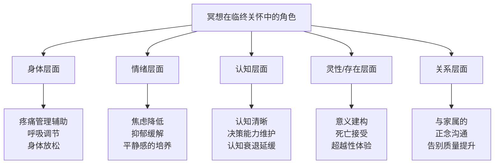
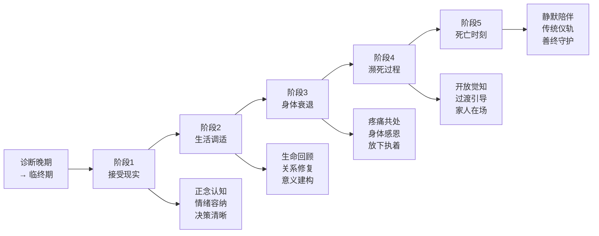

# 冥想与临终关怀专业指南 | Meditation & End-of-Life Care Guide

> **领域**：临终关怀、安宁疗护与死亡准备的冥想应用（Palliative Care, Hospice & Death Preparation）
> **关键词**：临终关怀（End-of-Life Care）、安宁疗护（Hospice/Palliative Care）、死亡准备（Death Preparation）、临终冥想（Death Meditation）、善终（Good Death）、家属哀伤支持、存在性关怀（Existential Care）、死亡焦虑（Death Anxiety）
> **上次更新**：2026-05

---

## 目录

1. [临终关怀的独特性与冥想角色](#1-临终关怀的独特性与冥想角色)
2. [临终者的冥想适配：身体、心理、灵性](#2-临终者的冥想适配身体心理灵性)
3. [分阶段的临终冥想方案](#3-分阶段的临终冥想方案)
4. [死亡准备冥想：生前修行](#4-死亡准备冥想生前修行)
5. [家属与照护者的冥想支持](#5-家属与照护者的冥想支持)
6. [不同文化传统的临终冥想](#6-不同文化传统的临终冥想)
7. [临终冥想的伦理与边界](#7-临终冥想的伦理与边界)
8. [执行师/陪伴者的自我照护](#8-执行师陪伴者的自我照护)
9. [案例库](#9-案例库)
10. [参考文献与资源](#10-参考文献与资源)

---

## 1. 临终关怀的独特性与冥想角色

### 1.1 临终作为独特的人生阶段

临终（Dying）不是一个医学事件，而是一个深刻的人生过程。与危机干预不同，临终是一个**已知、渐进、不可逆**的过程，具有独特的心理动力学：

| 维度 | 危机干预 | 临终关怀 |
|------|---------|---------|
| **时间框架** | 急性、不可预测 | 渐进、可预测（数周至数月） |
| **目标** | 恢复功能、回归常态 | 安宁、意义整合、善终 |
| **关系** | 可能陌生、短期 | 深度、长期、告别导向 |
| **身体** | 通常 intact | 持续衰竭、疼痛、依赖 |
| **心理** | 震惊、否认、急性应激 | 存在性议题、死亡焦虑、人生回顾 |
| **灵性** | 通常不是焦点 | 常常是核心议题 |

### 1.2 冥想能在临终关怀中提供什么



**研究证据**：

| 研究 | 样本 | 关键发现 |
|------|------|---------|
| Lobb et al. (2010) | 晚期癌症患者 | 正念冥想显著降低死亡焦虑，提升生命意义感 |
| Wright et al. (2019) | 安宁疗护患者 | 引导式冥想降低疼痛感知和止痛药需求 |
| Balkin et al. (2021) | 临终者家属 | 家属的正念练习降低复杂性哀伤风险 |
| Lee et al. (2015) | 韩国临终关怀 | 冥想与佛教仪轨结合提升善终质量评分 |

---

## 2. 临终者的冥想适配：身体、心理、灵性

### 2.1 身体衰竭的冥想适配

临终者的身体能力每天都在变化，冥想必须高度灵活：

| 身体状态 | 适配策略 | 推荐技术 |
|---------|---------|---------|
| **仍能坐起** | 椅子冥想、靠垫支持 | 呼吸觉察、慈心禅 |
| **只能平躺** | 躺卧引导冥想 | 身体扫描（简化版）、瑜伽尼德拉改编 |
| **极度虚弱** | 被动式冥想（播放录音） | 录制引导语、音乐冥想 |
| **意识波动** | 短时段、可重复 | 每次2-5分钟，多次进行 |
| **疼痛主导** | 疼痛作为锚点或对象 | 疼痛觉察冥想、呼吸与疼痛共处 |
| **呼吸困难** | 不强调呼吸控制 | 开放觉知、声音 grounding |

**核心原则**：
- **不追求姿势**：任何姿势都是好姿势
- **不强调时长**：2分钟的冥想与20分钟同等有价值
- **以舒适为最高原则**：任何引起不适的指导语都应调整或省略

### 2.2 心理状态的评估与适配

**常见心理状态与冥想策略**：

| 心理状态 | 表现 | 冥想策略 | 禁忌 |
|---------|------|---------|------|
| **死亡焦虑** | 对死亡过程的恐惧、对未知的害怕 | 呼吸 grounding；生命回顾中的正向记忆；死亡冥想（若准备就绪） | 不否认恐惧；不强迫"接受" |
| **未竟事宜** | 遗憾、未说出的道歉/原谅 | 内在对话冥想；写信冥想（即使不寄出） | 不催促解决；不评判 |
| **身份丧失** | "我不再是我"（失去角色、能力） | 开放觉知；超越身份的觉察练习 | 不鼓励"积极思考"否认丧失 |
| **愤怒** | 对命运、医疗系统、家人的愤怒 | 允许愤怒存在；感受愤怒在身体的位置；慈心禅（若可能） | 不劝"不要生气" |
| **抑郁/退缩** | 沉默、拒绝交流、无望 | 陪伴式静默冥想；简单的存在共在；不期待回应 | 不强迫互动 |
| **接受/宁静** | 平和、准备离去 | 深化开放觉知；死亡过渡引导（若传统支持） | 不打扰宁静 |

### 2.3 灵性需求的敏感处理

**灵性评估（FICA框架在临终关怀中的应用）**：

| 维度 | 问题 | 冥想整合 |
|------|------|---------|
| **F-信仰/信念** | "什么给予你力量和希望？" | 在其信仰框架内设计冥想语言 |
| **I-重要性** | "你的信仰/灵性对你有多重要？" | 决定灵性在冥想中的比重 |
| **C-社群** | "你属于哪个灵性/宗教社群？" | 联系相关灵性照护者 |
| **A-应用** | "你的信仰如何影响你的医疗决策？" | 尊重其信仰对死亡的态度 |

**跨文化临终冥想适配**：

| 传统 | 临终信仰 | 适配方式 |
|------|---------|---------|
| **佛教** | 死亡是过渡，心念决定去向 | 佛号持诵、光明观想、助念 |
| **基督教** | 回归天父怀抱 | 耶稣祷文、圣歌聆听、赦罪仪式配合 |
| **道教** | 回归自然、成仙 | 自然意象冥想、放松无为 |
| **印度教** | 轮回、解脱（Moksha） | 曼陀罗、OM唱诵、梵天观想 |
| **伊斯兰教** | 回归真主 | Dhikr（赞念）、古兰经聆听 |
| **无宗教/世俗** | 意义在人世关系 | 生命回顾、感恩冥想、存在性对话 |

---

## 3. 分阶段的临终冥想方案

### 3.1 临终五阶段与冥想支持



### 3.2 各阶段详细方案

**阶段1：接受现实（诊断后数周）**

| 目标 | 技术 | 引导语示例 | 频率 |
|------|------|-----------|------|
| 降低急性应激 | grounding 呼吸 | "感受你的双脚，它们此刻还在这里" | 每日2-3次 |
| 处理情绪波动 | R.A.I.N技术 | "识别、允许、探究、不认同" | 情绪升起时 |
| 辅助医疗决策 | 决策前呼吸 | "在呼吸中找到清晰，不急于决定" | 决策前 |
| 与家人沟通 | 正念倾听 | 引导家属与患者"呼吸同步"后交谈 | 重要对话前 |

**阶段2：生活调适（数月）**

| 目标 | 技术 | 引导语示例 | 频率 |
|------|------|-----------|------|
| 生命回顾 | 叙事冥想 | "回想一个你感到活着的时刻..." | 每周1-2次 |
| 感恩整合 | 感恩冥想 | "感谢这个身体为你做的一切..." | 每日 |
| 关系修复 | 内在对话 | "想象对[某人]说出你真正想说的话..." | 按需 |
| 意义建构 | 价值观澄清 | "什么是你真正在乎的？" | 每周 |
| 日常正念 | 微型正念 | 在吃饭、洗漱、看窗外时全然在场 | 持续 |

**阶段3：身体衰退（数周）**

| 目标 | 技术 | 注意事项 |
|------|------|---------|
| 疼痛共处 | 疼痛觉察冥想 | 不试图消除疼痛，改变与疼痛的关系 |
| 身体感恩 | 身体部位感谢 | "感谢我的双腿，它们曾带我走过..." |
| 放下执着 | 无常观想 | 温和地："一切都在变化，这不是失败" |
| 应对丧失感 | 资源 grounding | 引导回到安全记忆、爱的人的面容 |
| 睡眠支持 | 简化身体扫描 | 仅到膝盖或腹部，避免全身扫描引发不适 |

**阶段4：濒死过程（数天至数周）**

| 目标 | 技术 | 说明 |
|------|------|------|
| 维持宁静 | 播放录制引导语 | 患者熟悉的声音最有安抚作用 |
| 降低恐惧 | 家人在场的静默共在 | 不说什么，只是握着手的陪伴 |
| 传统支持 | 按信仰传统的临终仪轨 | 佛号、圣歌、祈祷、诵经 |
| 过渡引导 | "放下"引导（若文化合适） | "你可以放心地放下..." |
| 意识波动期的 grounding | 简单重复的声音或触摸 | 熟悉的声音、握着的手 |

**阶段5：死亡时刻**

| 场景 | 陪伴者行动 |
|------|-----------|
| **独自陪伴** | 保持平静呼吸（陪伴者的呼吸会影响患者）；轻声说安慰的话；按传统持诵 |
| **家人在场** | 引导家人保持平静；协助传统仪式；守护空间不被打扰 |
| **医疗环境** | 与医护沟通减少不必要的干扰；维护尊严和宁静 |
| **死亡后即刻** | 按传统保持身体不被打扰的时间（佛教：8小时；其他传统各异） |

---

## 4. 死亡准备冥想：生前修行

### 4.1 为什么生前准备死亡

死亡准备不是"放弃生活"，而是**更深入地生活**。通过直面死亡的必然性，许多人报告：
- 生活优先级的重新排序
- 关系的深化
- 对日常小事的更大感激
- 存在性焦虑的降低

### 4.2 死亡冥想（Death Meditation / Maranasati）

**上座传统：死随念（Maranasati）**

```
核心练习：
1. 舒适坐好，先建立 grounding
2. 温和地回想：死亡是必然的；我的生命有限
3. 不追求悲伤或恐惧，只是面对真实
4. 问：如果这是我生命的最后一天，我如何度过？
5. 回到当下，感受此刻活着的真实
6. 以感恩结束
```

**现代改编版本**：

| 练习 | 方法 | 时长 | 频率 |
|------|------|------|------|
| **日常死亡提醒** | 设定手机壁纸或便签："Remember you will die" | 看到时停留3秒 | 每日多次 |
| **睡前死亡冥想** | 躺下时想："今晚我可能死去；如果我醒来，这是额外的礼物" | 1分钟 | 每晚 |
| **月度死亡反思** | 每月一次较深的死亡冥想 journaling | 20分钟 | 每月 |
| **生命终点想象** | 想象自己的临终场景：谁在身边？还有什么想说的？ | 15分钟 | 每季度 |

### 4.3 生前预嘱与冥想

冥想可以帮助个体更清晰地面对生前预嘱（Advance Directive）的决策：

| 决策领域 | 冥想支持 | 效果 |
|---------|---------|------|
| **是否抢救** | 在平静状态下想象两种场景的身体感受 | 决策与价值观更一致 |
| **疼痛管理** | 呼吸冥想降低对药物的心理抗拒 | 更愿意接受充分的疼痛控制 |
| **器官捐献** | 无常冥想 + 慈心（愿我的身体最后还能帮助他人） | 决策更清晰 |
| **遗体处理** | 观想身体回归自然 | 接受各种方式 |

---

## 5. 家属与照护者的冥想支持

### 5.1 家属的冥想需求

临终者的家属面临多重压力：
- **悲伤 anticipatory grief**：在死亡发生前就开始哀伤
- **决策疲劳**：无数的医疗和后勤决策
- **角色冲突**：作为家属 vs. 作为照护者 vs. 作为个人
- **存在性压力**：面对至亲将离去的事实
- **经济压力**：医疗和照护费用

### 5.2 家属冥想支持方案

| 需求 | 冥想技术 | 说明 |
|------|---------|------|
| **即时压力** | 3次深呼吸 + 肩膀下沉 | 可在任何场景使用 |
| **睡眠不足** | 简化身体扫描（到膝盖即可） | 降低复杂性，减少入睡焦虑 |
| **情绪淹没** | R.A.I.N + grounding | 允许情绪，但不沉溺 |
| **与患者的困难对话** | 对话前同步呼吸 | 降低双方的防御性 |
| **决策清晰** | 决策前10分钟呼吸冥想 | 减少决策疲劳的影响 |
| **哀伤预备** | 慈心禅（对患者、对自己、对其他家属） | 在悲伤中培养连接感 |
| **患者离世后** | 哀伤冥想（见危机冥想指南） | 支持整个哀伤过程 |

### 5.3 家属支持团体中的正念

**团体冥想流程（30分钟）**：

| 阶段 | 时长 | 内容 |
|------|------|------|
| 开场 grounding | 5分钟 | 全体同步呼吸 |
| 分享（自愿） | 15分钟 | 每人2-3分钟，正念倾听 |
| 慈心禅 | 8分钟 | 对患者、自己、所有家属 |
| 收束 | 2分钟 | 静默， Resources 提供 |

---

## 6. 不同文化传统的临终冥想

### 6.1 佛教传统

**藏传破瓦法（Phowa）**：
- 将意识迁移到佛净土的技术
- 需要长期训练，通常在临终时由上师引导
- 关键点：观想头顶的佛国门户，意识如小鸟飞升

**净土宗念佛**：
- 持续持诵"阿弥陀佛"
- 临终助念团在旁同诵
- 信念：佛号能将意识导向西方极乐世界

**禅宗**：
- 强调"生死一如"
- 临终保持"平常心"
- 不刻意追求，也不恐惧

### 6.2 基督教传统

**依纳爵神操中的死亡默想**：
- 想象自己的死亡和审判
- 在基督的爱中面对死亡
- 目的是"在一切事上找到天主"

**现代基督教临终祈祷**：
- "主啊，我将我的灵魂交在你的手中"
- 赦罪与和解圣事
- 圣体圣事（若可能）

### 6.3 印度教传统

**梵天冥想**：
- 临终时念诵"OM"或梵咒
- 观想梵天（宇宙终极实在）
- 目标：意识与梵合一，脱离轮回

### 6.4 世俗/人文主义方法

**存在性冥想**：
- 不依赖宗教框架
- 强调：与所爱之人的连接、对生命的感恩、意义的个人建构
- 技术：生命回顾、感恩练习、关系修复

---

## 7. 临终冥想的伦理与边界

### 7.1 核心伦理原则

| 原则 | 说明 | 实践要点 |
|------|------|---------|
| **尊重自主权** | 患者有权拒绝任何冥想或宗教仪轨 | 不强迫、不暗示"冥想才能善终" |
| **不替代医疗** | 冥想是辅助，不是替代疼痛控制或其他医疗 | 与医疗团队沟通，确保不冲突 |
| **文化敏感** | 尊重患者的文化和宗教背景 | 不将自己的信仰强加于人 |
| **专业边界** | 清楚自己的角色（陪伴者/执行师，而非医生/家人） | 不逾越专业范围 |
| **知情同意** | 即使是简单的引导，也应获得同意 | "我可以和你一起做一个简短的呼吸练习吗？" |

### 7.2 高风险情况

| 情况 | 风险 | 应对 |
|------|------|------|
| **患者处于谵妄状态** | 冥想可能加剧混乱 | 仅使用最简单的触摸/声音 grounding |
| **患者明确拒绝灵性内容** | 任何灵性语言都可能引起愤怒 | 完全世俗化的 grounding 和放松 |
| **家属之间对冥想有冲突** | 家庭冲突可能加剧患者的痛苦 | 与所有关键家属沟通，寻求共识 |
| **患者有未处理的创伤** | 冥想可能激活创伤记忆 | 极其温和，优先安全感 |
| **冥想者自己的死亡焦虑被触发** | 陪伴者的反应会影响患者 | 陪伴者必须有自己的支持和督导 |

---

## 8. 执行师/陪伴者的自我照护

### 8.1 临终陪伴的独特压力

**存在的双重暴露**：
- 持续面对死亡，激活自身的死亡焦虑
- 深度共情导致的情感耗竭
- 无力感："我无法拯救这个人"

### 8.2 自我照护方案

| 层面 | 策略 | 频率 |
|------|------|------|
| **每日** | 自己的冥想练习；简短的 grounding | 每日 |
| **每周** | 督导或同伴支持 | 每周1次 |
| **每月** | 生命回顾：这个月的工作对我意味着什么？ | 每月 |
| **每季度** | 自己的死亡冥想练习 | 每季度 |
| **持续** | 明确的专业边界；知道自己的局限；适时转介 | 持续 |

### 8.3 督导议题

| 议题 | 信号 | 处理方式 |
|------|------|---------|
| **过度认同** | 把患者当成自己的亲人 | 督导中探讨；轮换个案 |
| **回避** | 对某个患者迟到、取消 | 觉察自己的死亡焦虑 |
| **救世主情结** | 觉得"只有我能帮助TA" | 团队工作；承认局限 |
| **情感麻木** | 对死亡不再有感觉 | 休息；个人治疗 |

---

## 9. 案例库

### 案例1：晚期癌症患者的生命回顾冥想

**背景**：68岁女性，乳腺癌转移，预计生命2-3个月。感到"我的人生没有意义"。

**干预**：
- 第1-2周：建立 trust，简单的呼吸 grounding
- 第3-4周：生命回顾冥想——每周一次，每次30分钟
  - "回想一个你感到被爱的时刻..."
  - "回想一个你帮助他人的时刻..."
  - "回想一个你克服困难的时刻..."
- 第5-8周：将这些时刻编织成"我的人生故事"，发现重复的主题

**结果**：患者重新发现了自己作为母亲、教师和朋友的价值。在临终前主动修复了与疏远女儿的关系。

### 案例2：阿尔茨海默病晚期患者的非语言陪伴

**背景**：82岁男性，阿尔茨海默病晚期，几乎无法说话，常常焦躁。

**干预**：
- 每日2次，陪伴者坐在床边，进行同步呼吸
- 播放患者年轻时喜欢的音乐
- 握着患者的手，简单的触摸 grounding
- 不进行语言引导（患者无法处理）

**结果**：患者在陪伴时的焦躁明显降低。家属报告"他看起来更平静了"。

### 案例3：突发恶化的 grounded 告别

**背景**：54岁男性，肺癌晚期，预期还有数周，但突然恶化进入濒死状态。家属（妻子和两个孩子）惊慌失措。

**干预**：
- 对家属：5分钟的 grounding（"感受你们的双脚在地上"）
- 引导家属围坐在床边，每人握住患者的一只手或触摸他
- 邀请家属轮流对患者说出最后想说的话
- 播放患者喜爱的古典音乐
- 陪伴者在旁保持平静的呼吸作为"锚定"

**结果**：家属虽然悲伤，但报告感到"这是我们能给他的最好的告别"。

---

## 10. 参考文献与资源

### 学术文献

1. Lobb, E. A., et al. (2010). Phased-based needs assessment in palliative care: A tool for reflective practice. *Journal of Palliative Medicine*, 13(7), 833-840.
2. Wright, A. A., et al. (2019). Associations between palliative chemotherapy and adult cancer patients' end of life care and place of death. *BMJ*, 351, h4730.
3. Balkin, R. S., et al. (2021). Grief counseling in palliative care: A mindfulness-based approach. *Death Studies*, 45(3), 234-243.
4. Lee, S. L., et al. (2015). The effect of a death preparedness program on death anxiety in terminally ill cancer patients. *Journal of Palliative Care*, 31(3), 178-184.
5. Neimeyer, R. A. (2016). *Meaning Reconstruction and the Experience of Loss*. American Psychological Association.
6. Kellehear, A. (2005). *Compassionate Cities: Public Health and End-of-Life Care*. Routledge.
7. Byock, I. (2012). *The Best Care Possible: A Physician's Quest to Transform Care Through the End of Life*. Avery.
8. Halifax, J. (2008). Being with Dying: Cultivating Compassion and Fearlessness in the Presence of Death. *Shambhala Sun*, 16(4), 54-59.
9. Rosenberg, L. (2000). *Living in the Light of Death: On the Art of Being Truly Alive*. Shambhala.
10. Levine, S. (1982). *Who Dies?: An Investigation of Conscious Living and Conscious Dying*. Anchor.

### 实践资源

| 资源 | 类型 | 说明 |
|------|------|------|
| Zen Hospice Project | 机构 | 整合禅宗与临终关怀的示范项目 |
| Upaya Institute | 培训 | 提供"Being with Dying"专业培训 |
| 英国St Christopher's Hospice | 机构 | 现代临终关怀的发源地 |
| 北京协和医院安宁疗护科 | 机构 | 中国安宁疗护的领先机构 |
| 台湾莲花临终关怀基金会 | 机构 | 佛教背景的综合临终关怀 |

### 相关链接

- [危机与哀伤冥想指南](Crisis_Meditation_Guide.md)
- [创伤知情冥想指南](../safety/Meditation_Trauma_Sensitive.md)
- [冥想不良反应系统分类](../safety/Meditation_Adverse_Effects.md)
- [慈心禅与创伤疗愈](../metta-lovingkindness/Metta_Trauma_Healing.md)
- [03-Bio-Science/death/](../../03-Bio-Science/death/INDEX.md) 死亡相关资源

---

> **最后更新：2026-05**
> 临终关怀中的冥想不是为了"修得更好"，而是为了"在的更好"。在生命的最后阶段，深度的临在本身就是最深的慈悲。
>
> **记住：在临终者面前，你的平静存在比任何引导语都更有力量。**
