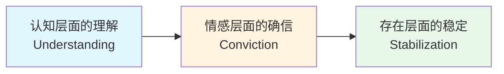
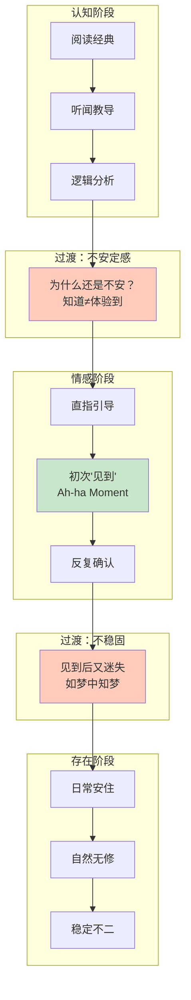
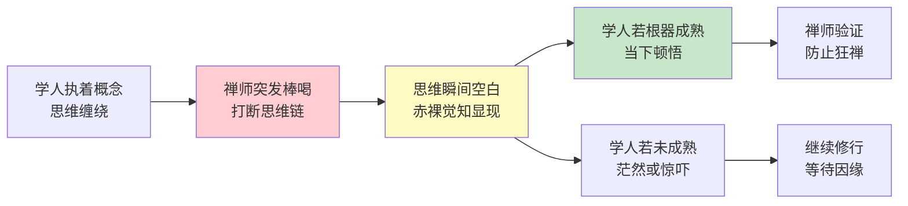
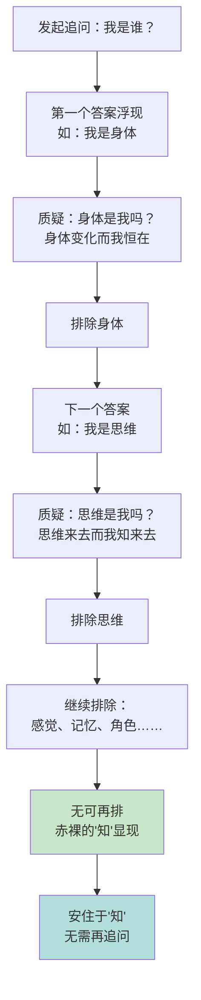
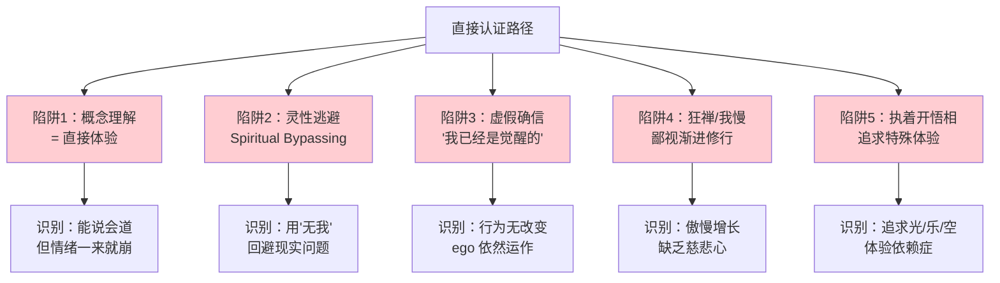
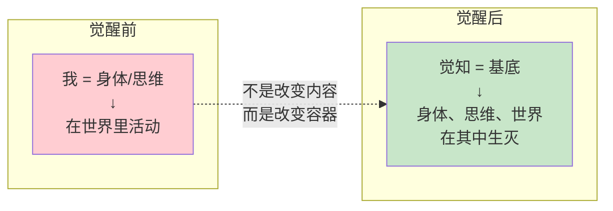
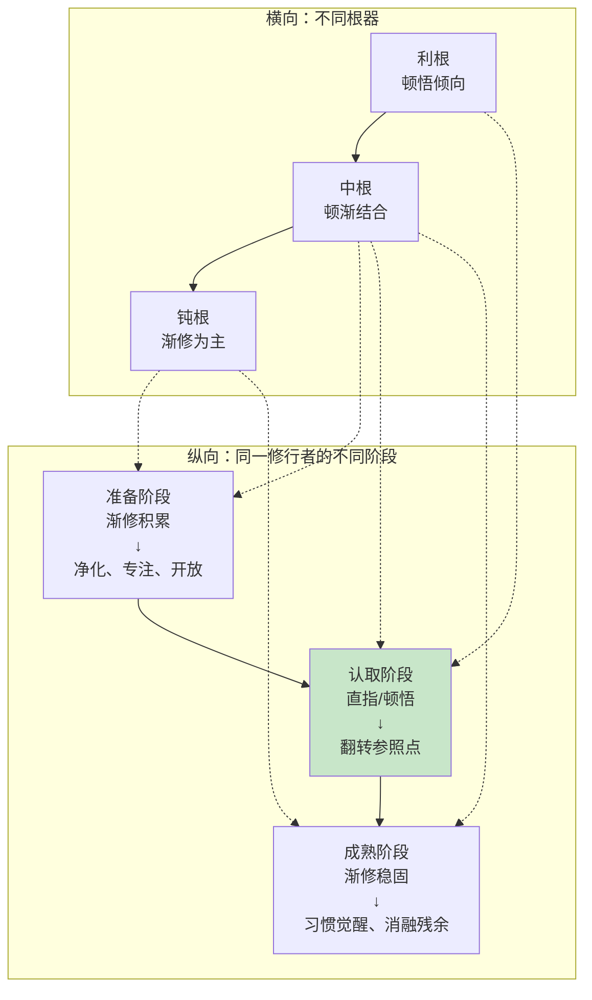

---

title: "直接认证修习实践指南"
description: "直接认证修习实践指南的详细解析与实践指南"
category: "心智与心理学 > 冥想 > 直接认知"
tags: ["brain", "decision-making"]
last_updated: "2026-05"
difficulty: "beginner"
reading_level: "beginner"
estimated_read_time: "10min"
intent_queries:
  - "什么是直接认证修习实践指南"
  - "直接认证修习实践指南的核心概念"
  - "直接认证修习实践指南的方法与实践"
trigger_keywords: ["直接认证修习实践指南", "behavioral", "body", "brain", "breathwork"]
cross_refs:
  - path: "04-Humanities-Arts/arts/calligraphy-therapy/Calligraphy_Therapy_Overview.md"
    relation: "buddhism/communication/emotion"
  - path: "04-Humanities-Arts/arts/craft-therapy/Craft_Therapy_Overview.md"
    relation: "buddhism/communication/emotion"
  - path: "04-Humanities-Arts/media/music/classical-music/bach-english-suites/Suite3/Bach_English_Suite_No3_Overview.md"
    relation: "communication/emotion/meditation"
  - path: "04-Humanities-Arts/media/music/classical-music/chopin-preludes/Chopin_Preludes_Overview.md"
    relation: "communication/emotion/meditation"
  - path: "04-Humanities-Arts/media/music/music-therapy/Sacred_Music_Therapy.md"
    relation: "buddhism/communication/emotion"

---
# 直接认证修习实践指南

> 从"知道"到"是"——非概念觉醒的完整路径

**最后更新：2026-05**

---

## 目录

1. [修习路径：从理解到稳定](#修习路径从理解到稳定)
2. [各传统"直指"方法对比](#各传统直指方法对比)
3. [常见陷阱与识别](#常见陷阱与识别)
4. [真正的直接认证体验特征](#真正的直接认证体验特征)
5. [与渐进路径的整合](#与渐进路径的整合)
6. [参考资源](#参考资源)

---

## 修习路径：从理解到稳定

"直接认证"（Direct Recognition）并非一蹴而就的顿悟，而是一个经历三个深层转变的修习过程。这三个层面——认知、情感、存在——层层递进，每一层都建立在前一层的基础上，但又发生质的飞跃。

### 第一阶段：认知层面的理解（Understanding）

在这一阶段，修行者通过听闻、阅读和思考，在概念层面把握"无我"或"觉知本性"的含义。

**核心特征：**
- 能够用语言表达空性/觉性的概念
- 在理性上认同"我并非这个身体、思维或情绪"
- 开始质疑日常对"自我"的默认假设

**修习方法：**

| 修习方式 | 具体操作 | 时间投入 | 常见障碍 |
|---------|---------|---------|---------|
| 经典研读 | 阅读《心经》《金刚经》、Nisargadatta《我是那》、Ramana《我是谁》的探究 | 每日30-60分钟 | 过度依赖文字，将解释当作体验 |
| 听闻开示 | 聆听有证悟经验的上师/老师的直指教导 | 每周1-2次 | 迷恋说法者的人格，而非法本身 |
| 逻辑辨析 | 运用中观逻辑分析"我"的五蕴构成 | 每周数次 | 分析变成智力游戏，脱离内心 |
| 闻后思维 | 独处时反复消化听到的教导 | 每日15-30分钟 | 思维变成重复盘旋，无新洞见 |

**过渡条件：** 概念理解开始产生"不安定感"——不再满足于仅仅知道，而是渴望亲身体验。此时应寻找有经验的引导者，准备进入下一阶段。

### 第二阶段：情感层面的确信（Conviction）

在这一阶段，认知上的理解转化为一种发自内心的、不可动摇的确信。这不是通过更多思考获得，而是通过直接的"见到"——见到觉知本身。

**核心特征：**
- 有一种"啊哈"的瞬间——不是想通了，而是看到了
- 对无我/觉性的了知从头脑落到心底
- 即使不刻意去想，也知道"那是什么"

**修习方法：**

| 修习方式 | 具体操作 | 预期效果 | 注意事项 |
|---------|---------|---------|---------|
| 直指引导 | 在具格上师面前接受直指心性（Pointing-out instructions） | 首次"见到"心性 | 需确认上师确有证悟，非仅精通理论 |
| 我是谁探究 | Ramana Maharshi式自我探究：持续追问"我是谁？" | 思维退回源头，觉性显露 | 避免期待某个答案；保持追问的势头 |
| 大圆满"椎击三要" | 安住于当下赤裸的觉知，不修正、不造作 | 直接认出自心本性 | 需有经验的金刚上师引导 |
| Advaita Vedanta "我是谁" | 否定式分析：我不是身体、不是思维、不是…… | 剩下的"那"即是真我 | 警惕停留在否定层面，未安住于所余 |

**过渡条件：** 虽然能"见到"，但日常生活中很快迷失，需要反复"被提醒"。此时应转入稳定训练。

### 第三阶段：存在层面的稳定（Stabilization）

觉醒不再是需要刻意维持的状态，而成为存在的基本底色。如同人不需要刻意呼吸，觉知也不需要刻意安住。

**核心特征：**
- 日常活动中自然觉知，不需"提醒自己"
- 情绪、思维来去，不扰动根本的寂静
- "觉醒"与"未觉醒"的二元对立消融

**修习方法：**

| 修习方式 | 具体操作 | 目标 | 误区 |
|---------|---------|------|------|
| 座上稳固 | 每日1-2小时专门安住于裸然觉知 | 延长不迷失的时间 | 将座上视为"真实"，座下视为"散逸" |
| 座下融合 | 行走、饮食、交谈中保持觉知连续性 | 打破座上与座下的割裂 | 变成"监控自己"的紧张状态 |
| 睡梦瑜伽 | 入睡前保持觉知，梦中知梦，醒时不别 | 将觉知延伸至24小时 | 急于求成，产生睡眠障碍 |
| 逆境试炼 | 在强烈情绪、冲突、病痛中检验觉知 | 确认觉知的不可动摇 | 刻意寻找逆境，变成自我折磨 |

---

## 各传统"直指"方法对比

不同灵性传统发展出各自独特的"直指"技术，虽然终极目标一致，但方法路径、适合根器和文化背景各有不同。

### 四大传统直指方法概览

| 传统 | 核心方法 | 关键手段 | 适合根器 | 核心文本/传承 |
|-----|---------|---------|---------|-------------|
| **禅宗** | 棒喝、公案、话头 | 突发打断思维流；超越逻辑的机锋 | 利根、能承担巨大不确定性者 | 《无门关》《碧岩录》；临济、德山传统 |
| **大圆满** | 椎击三要、上师相应 | 上师直指，弟子当下认取 | 对上师有深厚信心者 | 《椎击三要》、莲师《直指觉性》 |
| **Advaita Vedanta** | "我是谁"探究（Atma Vichara） | 持续追问以剥离层层伪装 | 善于内省、有耐心者 | Ramana Maharshi教导；Nisargadatta《我是那》 |
| **Ch'an/Zen 现代** | 正念觉察的究极指向 | 在觉知中自然了知能觉之性 | 已有正念基础者 | 一行禅师、孔思（Adyashanti） |

### 禅宗的"棒喝"

禅宗尤以临济宗著称的"棒喝"（Katsu!），是最具戏剧性的直指方式。

**运作机制：**

**现代适用性：**

| 方面 | 传统形式 | 现代调适 |
|-----|---------|---------|
| 棒喝 |  physical 击打或大声喝斥 | 强烈的反问、逻辑悖论、突然的沉默 |
| 公案 | 参究古德公案（如"念佛是谁"） | 用现代生活场景重构公案精神 |
| 话头 | 持续参一个话头 | 将话头转化为日常触发的追问 |
| 师资 | 长期依止一位禅师 | 禅师可能稀缺；需辨别真实证悟者 |

### 大圆满的大圆满法

藏传宁玛派的大圆满（Dzogchen）被认为是"九乘之顶"，其直指方法以"椎击三要"为核心。

**椎击三要详解：**

| 要点 | 名称 | 含义 | 修习要点 |
|-----|------|------|---------|
| 第一要 | 直指心性（Direct Introduction） | 上师直接指出觉知的本来面目 | 弟子需放下期待，保持开放的接收状态 |
| 第二要 | 确断自解（Deciding with Certainty） | 一旦认出，必须彻底确定"就是这个" | 反复确认，不被后续怀疑动摇 |
| 第三要 | 解脱于自信（Confidence in Liberation） | 任何念起即自解脱，不需对治 | 从"安住"进步到"无住之住" |

**大圆满特有的优势与挑战：**

- **优势：** 一旦认出，路径直接；不依赖逐步净化，而是直接认取本性。
- **挑战：** 对上师的依赖极高；若弟子未真正认出而自认为认出，风险极大；灌顶和传承的要求使得非藏传文化背景者进入门槛较高。

### Advaita Vedanta 的"我是谁"

由 Ramana Maharshi 在20世纪初系统化的自我探究法，是印度不二论传统中最广为人知的直指方法。

**探究步骤：**

1. **设定情境：** 独处静坐，将注意力从外部收回到内在。
2. **发起追问：** 在心中问"我是谁？"
3. **观察回应：** 每当有答案浮现（"我是身体""我是思维"），立即追问"那是真的吗？"
4. **层层剥离：** 逐一排除所有可能的答案——身体、感觉、思维、记忆、角色……
5. **安住于"那"：** 当所有可排除的都被排除，剩下的不可名状的"知"即是。

### Ramana Maharshi 探究法的日常变体

| 场景 | 应用方式 | 效果 |
|-----|---------|------|
| 情绪升起时 | 问"谁在愤怒？谁在悲伤？" | 情绪与"我"的距离立即拉开 |
| 决策困惑时 | 问"谁在犹豫？那个'知'犹豫吗？" | 从纠结回到清明 |
| 人际冲突时 | 问"谁在受伤？那个'知'受伤了吗？" | 从反应模式回到回应模式 |
| 睡前 | 问"谁在入睡？那个'知'会睡吗？" | 为梦瑜伽打基础 |

---

## 常见陷阱与识别

直接认知道路虽短，却布满陷阱。以下是最常见的几种，以及识别和应对方法。

### 陷阱总览

### 陷阱1：将"概念理解"误认为"直接体验"

**表现：** 能流利阐述空性、无我、觉性，但生活中的反应模式毫无改变。情绪一来，理论全忘。

**识别信号：**

| 概念理解的标志 | 直接体验的标志 |
|--------------|--------------|
| "我知道无我" | "无法找到我" |
| 能够长篇论证 | 沉默、无法言说 |
| 头脑清晰但心不安 | 即使头脑混乱，心仍安稳 |
| 需要不断"提醒自己" | 无需提醒，自然如是 |
| 概念掌握带来满足感 | 体验到一种"失去"——失去立场、中心 |

**对治：** 找到真正有证悟经验的老师，请求验证；减少阅读，增加实际探究；将教导应用到最难受的情绪时刻。

### 陷阱2：灵性逃避（Spiritual Bypassing）

**表现：** 用"无我""不执着""一切都是空"来合理化逃避责任、回避痛苦关系、不处理实际问题。

**典型话术与真实意图对照：**

| 灵性话术 | 可能的真实逃避 |
|---------|--------------|
| "我不执着于这段感情" | 不敢面对亲密和脆弱 |
| "身体只是幻象" | 忽视真实的健康需求 |
| "没有人在受苦" | 回避对他人的同理和关怀 |
| "一切都是最好的安排" | 放弃主动改变的动力 |
| "我不需要金钱/物质" | 恐惧面对世俗能力的不足 |

**对治：** 检验标准——真正的觉醒者，其 compassion（慈悲）和行动力是增长的，而非减少的。如果"觉醒"让你变得更冷漠、更疏离、更不负责任，这很可能是灵性逃避。

### 陷阱3："我已经是觉醒的"的虚假确信

**表现：** 在仅有一点点体验或甚至没有体验的情况下，宣称自己已经开悟，不再需要做进一步工作。

**鉴别表：**

| 虚假确信的特征 | 真实觉醒的特征 |
|-------------|-------------|
| 宣称"我开悟了" | 不会宣称，甚至觉得"开悟"这个概念已不适用 |
| 行为中自我中心依然明显 | 自我中心的冲动大幅减少 |
| 对他人的批评极度敏感 | 能坦然接受反馈，甚至感恩 |
| 需要别人认可自己的觉醒 | 不需要任何外在确认 |
| 依然有明显的贪嗔痴 | 即使情绪生起，也很快自解脱 |

**对治：** 找到可信赖的善知识（不一定是名师，可以是同行者），请其对自己的状态进行观察反馈；保持"我不知道"的开放态度。

### 陷阱4：狂禅与我慢

**表现：** 因为接触了"顿悟"教导，就轻视甚至鄙视需要长期修行的渐进路径。

**关键认知：** 顿悟和渐修不是对立的。

| 维度 | 顿悟 | 渐修 |
|-----|------|------|
| 所指层面 | 认知存在层面的翻转 | 习惯模式、情绪反应、业力的净化 |
| 时间性 | 可以瞬间发生 | 通常需要时间 |
| 比喻 | 认出珍珠在囊中 | 囊上的污垢需要慢慢擦拭 |
| 是否必要 | 觉醒的本质是顿悟 | 觉醒后的成熟需要渐修 |
| 适合的人 | 极少数上上根器 | 绝大多数人 |

---

## 真正的直接认证体验特征

真正的觉醒体验有其不可伪装的特征。以下四个标准可用于自我检验和他人观察。

### 四大核心特征

| 特征 | 描述 | 检验问题 |
|-----|------|---------|
| **持久性** | 不是昙花一现的体验，而是持续的参照点改变 | 三个月后、三年后，这种了知是否仍在？ |
| **不可撤销性** | 一旦"见到"，就无法真正"不见"，即使忘记也不会回到之前的无知状态 | 即使生活最忙碌、最混乱时，这种了知是否仍在背景中？ |
| **参照点改变** | "我"的位置、大小、性质发生了根本变化 | 你讲述自己的故事时，主语是否发生了微妙变化？ |
| **无所得感** | 不是获得了什么，而是失去了什么——失去了中心、立场、需要维护的形象 | 是否感到一种轻松，因为"没有什么需要保护的"？ |

### 持久的（Persistent）

真正的觉醒不是一次性的高峰体验（peak experience），而是一个新的稳定基线（baseline）。

**对比：**

| 高峰体验 | 稳定觉醒 |
|---------|---------|
| 强烈的光、乐、明 | 平淡的觉知，不特别 |
| 持续数分钟到数小时 | 成为24小时的底色 |
| 回忆时渴望重现 | 不追求重现，因为从未失去 |
| 与日常状态有明显落差 | 日常状态本身即是 |

### 不可撤销的（Irreversible）

如同见过大海的人无法再被"海"的概念满足，真正认取过觉性的人无法再被概念层面的理解满足。

**重要澄清：** 不可撤销不等于"恒常维持在明显的觉醒状态中"。迷失可能发生，但：
- 迷失的时间越来越短
- 意识到迷失的那一刻，觉醒已经在
- 不再恐惧"失去"觉醒，因为知道它不可真正失去

### 改变基本参照点的（Referential Shift）

这是最根本的改变。觉醒前，"我"是身体里的一个人，在世界里活动。觉醒后，"我"变成觉知本身，而世界在其中展现。

**参照点改变的体验描述：**

**日常表现：**

| 情境 | 觉醒前 | 觉醒后 |
|-----|-------|-------|
| 说话 | "我在想/说" | 话自然流出，无明确"说者" |
| 行走 | "我在走路" | 走发生，觉知着走 |
| 情绪 | "我生气了" | 愤怒能量升起，在觉知中被容纳 |
| 决策 | "我要选择" | 选择自然呈现，无纠结的"决策者" |

### 持久与迷失的动态关系

| 阶段 | 座上状态 | 座下状态 | 迷失后恢复 |
|-----|---------|---------|----------|
| 初认取 | 短暂安住 | 很快迷失 | 需要刻意提起 |
| 稳固期 | 自然安住 | 部分保持 | 自动觉察迷失 |
| 成熟期 | 无座无散 | 始终如是 | 已无"迷失"概念 |

---

## 与渐进路径的整合

直接认证与渐进修行不是对立的，而是同一过程的不同面向。理解这一点，可以避免许多不必要的冲突和困惑。

### 整合模型

### 顿渐互补的实践框架

| 修行层面 | 渐进元素 | 直接元素 | 整合方式 |
|---------|---------|---------|---------|
| 伦理/行为 | 持戒、培养善行 | 从觉性自然流露的慈悲 | 以戒为辅，以觉为主 |
| 专注力 | 数息、观想等定功 | 直接安住于无对象觉知 | 定功为辅助，直指为核心 |
| 洞察力 | 逐步分析五蕴无我 | 当下认取能观之本 | 分析为 finger，直指为 moon |
| 情绪转化 | 逐步处理创伤、模式 | 在觉性中情绪自解脱 | 深度处理+当下超越 |
| 关系修行 | 逐步学习沟通、同理 | 从无二元自然回应 | 技巧学习+本体流露 |

### 对渐进修行者的建议

如果你已经走在渐修道路上（如正念、止观、瑜伽等），如何引入直接认证的维度？

1. **在定中引入追问：** 当定力较深、心念较净时，问"谁在觉知呼吸？""这个觉知本身在哪里？"
2. **不将所缘当终点：** 观呼吸不是目的，通过观呼吸发现"能观之心"才是。
3. **寻找间隙：** 在呼与吸之间、念与念之间，有一个觉知始终在场的"间隙"——那便是入口。
4. **请益直指：** 当渐修到一定深度，寻找能提供直指教导的老师。

### 对直接认证倾向者的建议

如果你倾向于直接认证路径，如何避免"悟后不修"的陷阱？

1. **承认残余业力：** 即使认取了觉性，身体的习惯、情绪的模式、关系的业力需要时间消融。
2. **保持日常修行：** 不要放弃正式的座上修行，那是稳固觉醒的容器。
3. **在关系中检验：** 真正的觉醒必须在亲密关系中经受检验，独自一人的"觉醒"可能是幻觉。
4. **服务他人：** 将觉醒转化为对世界的服务，这是防止我执重新包装的最佳方式。

---

## 参考资源

### 核心经典

| 书名/文本 | 作者/传承 | 核心价值 |
|----------|----------|---------|
| 《我是谁》的探究 | Ramana Maharshi | 自我探究法的原始教导 |
| 《我是那》（I Am That） | Nisargadatta Maharaj | 不二论直指的巅峰对话 |
| 《椎击三要》 | 莲花生大士 | 大圆满直指心性的核心文本 |
| 《无门关》 | 无门慧开 | 禅宗公案的直指力量 |
| 《直指觉性》（The Crystal and the Way of Light） | 顶果钦哲仁波切 | 大圆满的现代阐释 |

### 现代老师与传承

| 老师 | 传统 | 风格 | 适合人群 |
|-----|------|------|---------|
| Adyashanti | 禅宗/现代不二论 | 清晰、直接、温和 | 已有一定修行基础者 |
| Rupert Spira | Advaita Vedanta | 哲学精确性高 | 喜欢逻辑分析者 |
| Mingyur Rinpoche | 藏传佛教（噶举/宁玛） | 幽默、结合科学 | 现代西方人、对大脑科学感兴趣者 |
| 一行禅师 | 越南禅宗 | 诗意、生活化 | 初学者、喜欢渐进者 |
| Eckhart Tolle | 现代不二论 | 普及性高、门槛低 | 完全初学者 |

### 本系列相关文档

- [直接认证基础概念](../INDEX.md)
- [Samatha-Vipassana 对比](../samatha-vipassana/)
- [大圆满心性修持](../tibetan-meditation/)

---

> **结语：** 直接认证不是给少数幸运儿的礼物，而是每个众生的本来面目。问题从来不是"如何获得"，而是"何时放下阻碍认取的一切"。然而，放下本身也是一个过程——需要勇气、诚实和不懈的探究。愿你早日认出你从未失去过的。

---

*文档属于 Peace Lab 冥想知识库。如引用请保留出处。*
