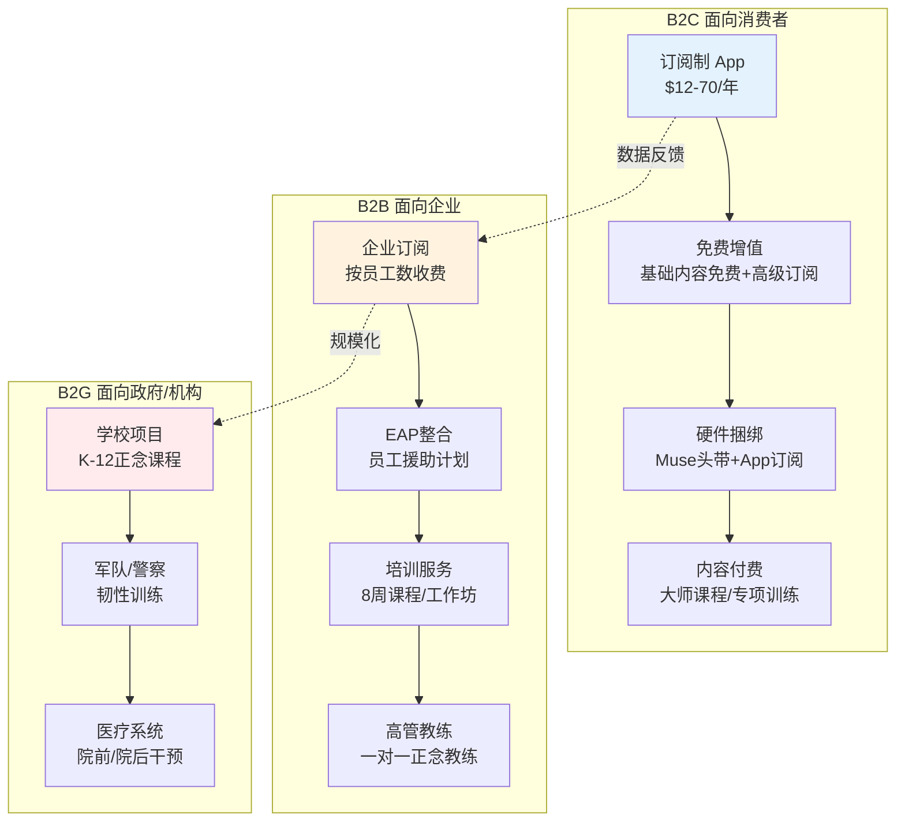
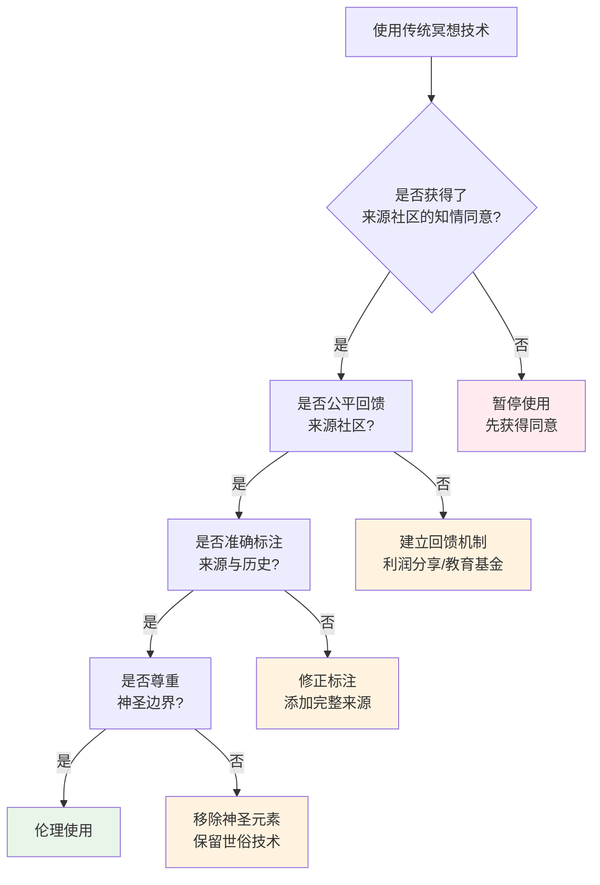

# 冥想商业化与文化挪用批判

> **适用对象**：冥想研究者、执行师、传统文化守护者、行业从业者、消费者
> **阅读时长**：约 30 分钟
> **最后更新**：2026-05

---

## 一、引言：为什么需要批判性审视

冥想在全球范围内的爆发式增长，带来了前所未有的普及机会，同时也引发了一系列深刻的伦理、文化和社会问题。批判的目的不是否定冥想的价值，而是**在推广过程中保持清醒，避免将千年智慧异化为消费商品或控制工具**。

> **核心立场**：我们支持冥想的广泛传播，但反对其去语境化的简化、文化挪用的剥削、以及被权力结构工具化的异化。

---

## 二、冥想产业的规模与商业模式

### 2.1 全球市场概览

| 指标 | 数据 | 来源/年份 |
|-----|------|----------|
| 全球冥想市场规模 | ~$5.3B（2023） | Grand View Research |
| 预计年复合增长率 CAGR | 18.5% | 2024-2030 |
| 冥想App用户数（全球） | ~600M+ | 各平台公开数据汇总 |
| Headspace估值峰值 | $3B（2020） | 融资轮次 |
| Calm估值 | $2B（2020） | 融资轮次 |
| 企业正念培训市场 | ~$1.2B（2023） | Market Research Future |

### 2.2 主要商业模式拆解



---

## 三、商业化的七宗罪

### 罪一：过度简化（Oversimplification）

**表现**：将数千年传统压缩为3分钟App课程、"每天5分钟改变人生"的营销话术、剥离哲学与伦理根基的"纯技术"。

**后果**：
- 学习者获得的是碎片化技巧而非系统性理解
- 遇到深层困难时缺乏应对框架
- 对传统的误解和刻板印象加深

**案例**：某App将藏传佛教的"大圆满"简化为"开放觉知练习"，完全剥离了其宗教语境、上师传承和伦理基础。

### 罪二：消费主义包装（Consumerist Packaging）

**表现**："冥想生活方式"品牌营销、冥想静修度假村（$5000+/周）、设计师冥想坐垫（$300+）、"正念饮食"变成高端餐饮概念。

**核心矛盾**：佛教教导"放下执着"，而消费主义冥想产业却在**制造新的欲望对象**。

### 罪三：数据殖民主义（Data Colonialism）

**表现**：
- 用户的HRV、EEG、睡眠数据被收集并用于算法训练
- 情绪状态数据被出售给广告商或保险公司
- 生物特征数据成为新的"石油"

**风险**：当保险公司获得你的冥想数据，可能会据此调整保费——冥想者=低风险=低保费，但反之亦然。

### 罪四：去语境化（Decontextualization）

**表现**：
- 从佛教中提取"正念"却剥离四圣谛、八正道
- 从瑜伽中提取"体式"却剥离哲学根基
- 从原住民中提取"仪式"却剥离神圣意义


### 罪五：证书工厂（Certification Mills）

**表现**：
- 200小时"冥想导师"在线培训
- 无传统认证的商业证书
- 缺乏督导的独立执业

**后果**：不合格的执行师可能对创伤学员造成伤害、传播错误信息、商业化传统知识而不回馈来源社区。

### 罪六：效率至上（Productivity Hijacking）

**表现**：
- "冥想让你更高效"
- "正念提升你的工作表现"
- "每天10分钟，多赚2小时"

**悖论**：当冥想被工具化为"生产力提升手段"，它就失去了其本质——**对存在本身的观照，而非对效率的追求**。

### 罪七：伪科学营销（Pseudo-Scientific Marketing）

**表现**：
- "量子冥想"（滥用量子力学概念）
- "振动频率提升"（无科学定义的频率概念）
- "DNA激活冥想"（完全无依据）
- 选择性引用研究、夸大效果

---

## 四、文化挪用：谁的传统？谁的利益？

### 4.1 文化挪用的光谱

| 程度 | 行为 | 示例 |
|-----|------|------|
| **欣赏** | 学习、尊重、归因 | 在课程中说明技术来源，邀请传统守护者授课 |
| **借鉴** | 改编、标注、回馈 | 将传统技术适配现代语境，利润部分回馈来源社区 |
| **挪用** | 提取、隐藏、盈利 | 使用传统技术但不说明来源，利润不归传统社区 |
| **掠夺** | 盗取、扭曲、垄断 | 将传统知识申请专利，起诉传统社区"侵权" |

### 4.2 典型案例

**案例1：西方"正念"的佛教剥离**
- Jon Kabat-Zinn将佛教Vipassana提取为MBSR时，刻意隐藏了佛教渊源
- 结果是：佛教社区感到被掠夺，而西方消费者却不知道技术的来源
- 建设性回应：Kabat-Zinn后来承认了佛教根源，但产业整体仍继续去语境化

**案例2：瑜伽的商业化**
- 瑜伽从印度的精神实践变为全球$80B产业
- 传统瑜伽教师获得的比例极小
- 许多"瑜伽"与印度传统几乎没有关系

**案例3：原住民仪式的商业化**
- Sweat Lodge（汗水屋）被白人企业家收费运营
- Ayahuasca仪式被包装为"灵性旅游"
- 原住民社区面临文化商品化但无经济回报

### 4.3 建设性伦理框架



---

## 五、灵性绕过 Spiritual Bypassing

### 5.1 定义

由心理学家 John Welwood 于1984年提出：**使用灵性实践和信念来逃避未解决的情感问题、心理创伤和发展任务**。

### 5.2 常见形式

| 形式 | 表现 | 潜在危害 |
|-----|------|---------|
| **正能量暴政** | "不要负面思考""保持高频" | 压抑正常情绪，导致情绪失调 |
| **灵性逃避** | 用"一切都是幻象"逃避现实责任 | 关系破裂、财务崩溃、社会功能丧失 |
| **灵性自恋** | "我比你更觉醒" | 傲慢、孤立、缺乏同理心 |
| **宽恕强迫** | "你必须原谅才能前进" | 绕过正义需求，二次伤害受害者 |
| **超然伪装** | "我已经超越了这些情绪" | 解离、情感麻木、伪平静 |
| **业力合理化** | "这是我前世的业力" | 对社会不公的冷漠、受害者有罪论 |

### 5.3 识别信号

```mermaid
flowchart TD
    Start[观察自己/他人]

    Start --> Q1{是否用灵性概念<br/>逃避困难对话?}
    Q1 -->|是| A1[可能绕过]
    Q1 -->|否| Q2

    Q2 --> Q3{是否否定<br/>"负面情绪"的价值?}
    Q3 -->|是| A1
    Q3 -->|否| Q4

    Q4 --> Q5{是否在关系中<br/>用"无条件爱"容忍虐待?}
    Q5 -->|是| A1
    Q5 -->|否| Q6

    Q6 --> Q7{是否认为灵性<br/>可以替代心理治疗?}
    Q7 -->|是| A1
    Q7 -->|否| A2[健康的灵性实践]

    A1 --> A1a[停止灵性练习<br/>先处理心理问题]
    A1a --> A1b[寻求专业心理治疗]
    A1b --> A1c[心理稳定后<br/>逐步恢复灵性练习]

    style A1 fill:#ffebee
    style A1a fill:#fff3e0
    style A2 fill:#e8f5e9
```

---

## 六、不适合冥想的人群：诚实的边界

### 6.1 明确禁忌症

| 状况 | 风险 | 替代方案 |
|-----|------|---------|
| **精神分裂症（急性期）** | 冥想可能加重幻觉、妄想、解离 | 稳定后的心理治疗为主，若冥想需在精神科医生监督下进行 |
| **双相障碍（躁狂期）** | 可能诱发或加重躁狂发作 | 仅在稳定期、在医生许可下进行简短的 grounding 练习 |
| **严重解离障碍** | 身体扫描等练习可能加重解离 | 以运动-based 疗法为主（瑜伽、行走），避免长时间静坐 |
| **复杂PTSD（未处理）** | 身体扫描可能触发闪回、情绪崩溃 | 创伤知情治疗优先（EMDR、躯体体验），稳定后再引入冥想 |
| **边缘型人格障碍** | 团体冥想中的情绪感染可能不稳定 | 一对一治疗优先，DBT技能训练 |
| **进食障碍（活跃期）** | 正念饮食可能被扭曲为控制工具 | 专门化进食障碍治疗优先 |
| **创伤性脑损伤** | 某些冥想可能加重症状 | 神经科医生评估后进行定制化方案 |
| **癫痫** | 某些呼吸法（如过度换气）可能诱发发作 | 避免呼吸控制练习，仅使用简单的 grounding |

### 6.2 筛查工具

**冥想前自我评估清单**（执行师或学员使用）：

1. 您是否正在经历精神病性症状（幻觉、妄想）？
2. 您是否处于双相障碍的躁狂或混合发作期？
3. 您是否经常性地与自己的身体/现实感到"分离"？
4. 您是否在未经治疗的创伤记忆困扰下生活？
5. 您是否有过冥想后情绪恶化或解离的经历？
6. 您是否有当前的自杀意念或自伤行为？
7. 您是否正在服用精神类药物且剂量不稳定？

**如果有任何一项回答"是"，建议在开始或继续冥想前咨询精神科医生或临床心理学家。**

---

## 七、正念的武器化：当冥想成为控制工具

### 7.1 军事应用

**案例**：
- 美国海军陆战队的"Mindfulness-Based Mind Fitness Training"（MMFT）
- 英国军队的正念韧性训练
- 以色列军队的冥想项目

**核心争议**：
- 正念让士兵在杀戮时更冷静、更专注——这是保护还是助长？
- 如果正念减少了PTSD，是否也减少了士兵对战争的道德反思？
- Ron Purser 和 David Loy 提出的"McMindfulness"批判

### 7.2 企业剥削

**案例**：
- Aetna的冥想项目节省$9M医保费用，但员工的工作压力和裁员并未减少
- Amazon仓库的"正念舱"被批评为"让工人更忍受恶劣条件"

**核心争议**：
- 企业正念是否将**系统性的压迫**转嫁为**个人的适应不良**？
- 如果正念让你接受了996，它是解药还是帮凶？

### 7.3 监控国家

**争议方向**：
- 生物反馈数据被政府获取
- "情绪管理"成为公民服从训练
- 某些威权政府引入"正念教育"是否为了培养更顺从的公民

---

## 八、建设性回应：走向伦理的冥想未来

### 8.1 对从业者

| 原则 | 具体行动 |
|-----|---------|
| **归因** | 在技术来源、课程、出版物中明确标注传统的文化来源 |
| **回馈** | 将部分利润捐赠给传统来源社区的教育或保护基金 |
| **教育** | 不仅教技术，也教其哲学、伦理和文化背景 |
| **伦理审查** | 定期进行文化敏感性审查、邀请传统守护者参与课程设计 |
| **透明** | 诚实地说明科学证据的局限性，不夸大效果 |
| **拒绝** | 对不适合的"项目"说不（如军事杀戮效率提升） |

### 8.2 对消费者

| 原则 | 具体行动 |
|-----|---------|
| **追问来源** | 问自己：这个技术来自哪里？谁从中获益？ |
| **质疑营销** | 警惕"快速""简单""改变人生"的话术 |
| **尊重边界** | 认识到冥想不是万能的，有明确的禁忌症 |
| **支持伦理品牌** | 选择有文化回馈机制的产品和服务 |
| **批判性参与** | 既享受冥想的好处，也保持对其局限性的清醒 |

### 8.3 对传统社区

| 原则 | 具体行动 |
|-----|---------|
| **知识产权保护** | 建立传统知识的法律保护框架 |
| **主动发声** | 在公共平台上参与关于文化挪用的对话 |
| **教育授权** | 建立授权机制，允许在特定条件下的使用 |
| **数字档案** | 建立传统知识的数字档案，确保传承 |

---

## 九、延伸阅读与参考

### 批判性著作
- **《McMindfulness》** — Ron Purser（商业化批判的经典）
- **《Selling Spirituality》** — Jeremy Carrette & Richard King（灵性商品化）
- **《The Buddha Pill》** — Miguel Farias & Catherine Wikholm（冥想副作用的科学审视）
- **《Trauma-Sensitive Mindfulness》** — David Treleaven（创伤知情正念）
- **《The Dark Night of the Soul》** — various authors（修行的困难阶段）

### 文化挪用
- **《Decolonizing Buddhism》** — Natalie Quli
- **《White Utopias》** — Emily K. Frank（新时代运动中的种族问题）

### 伦理框架
- **《Ethics in Mindfulness》** — various, Mindfulness journal special issues

---

*本文档旨在促进冥想产业的伦理自觉和消费者的批判性思考。批判的目的不是摧毁，而是建设一个更健康、更公平、更尊重传统的冥想生态系统。*

---

## 📞 危机干预资源 | Crisis Resources

> **如果您或您认识的人正在经历心理危机或有自杀念头,请立即寻求帮助。**

### 中国大陆

| 资源 | 联系方式 |
|---|---|
| 北京心理危机研究与干预中心 | **010-82951332** (24小时) |
| 全国心理援助热线 | **400-161-9995** (24小时) |
| 希望24热线 | **400-161-9995** (24小时) |
| 生命热线 | **400-821-1215** (24小时) |

### 国际

| 地区 | 资源 | 联系方式 |
|---|---|---|
| 🇺🇸 美国 | 988 Suicide & Crisis Lifeline | **988** (24/7) |
| 🇬🇧 英国 | Samaritans | **116 123** (24/7) |
| 🇭🇰 香港 | 撒玛利亚防止自杀会 | **2389-0000** |
| 🇹🇼 台湾 | 生命线 | **1995** |

**完整资源列表**:[_meta/docs/CRISIS_RESOURCES.md](../../_meta/docs/CRISIS_RESOURCES.md)

**全球资源**:[Befrienders Worldwide](https://www.befrienders.org) | [WHO 心理健康](https://www.who.int/health-topics/mental-health)

