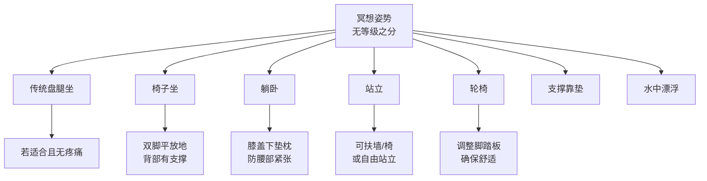

---

title: "冥想与残障人士无障碍指南 | Meditation Accessibility & Disability Inclusion Guide"
description: "冥想与残障人士无障碍指南 | Meditation Accessibility & Disability Inclusion Guide的详细解析与实践指南"
category: "心智与心理学 > 冥想 > Overview"
tags: ["anxiety", "brain", "mindfulness", "adhd", "act"]
last_updated: "2026-05"
difficulty: "advanced"
reading_level: "advanced"
estimated_read_time: "10min"
intent_queries:
  - "什么是冥想与残障人士无障碍指南 | Meditation Accessibility & Disability Inclusion Guide"
  - "冥想与残障人士无障碍指南 | Meditation Accessibility & Disability Inclusion Guide的核心概念"
  - "冥想与残障人士无障碍指南 | Meditation Accessibility & Disability Inclusion Guide的方法与实践"
trigger_keywords: ["act", "adolescent", "aging", "anxiety"]
cross_refs:
  - path: "01-Wisdom-Traditions/yoga/therapy-clinical/Yoga_Therapy.md"
    relation: "aging/anxiety/emotion"
  - path: "03-Bio-Science/biology/brain/Brain_Clinical_Applications.md"
    relation: "aging/anxiety/emotion"
  - path: "03-Bio-Science/biology/lower-back-pain/Lower_Back_Pain_Psychological_Rehabilitation.md"
    relation: "aging/anxiety/emotion"
  - path: "03-Bio-Science/biology/spa/SPA_Clinical_Applications.md"
    relation: "aging/anxiety/emotion"
  - path: "04-Humanities-Arts/arts/craft-therapy/Craft_Textile_Therapy.md"
    relation: "aging/anxiety/emotion"

---
# 冥想与残障人士无障碍指南 | Meditation Accessibility & Disability Inclusion Guide

> **领域**：冥想实践的包容性与无障碍设计（Meditation Inclusion & Accessible Design）
> **关键词**：无障碍冥想（Accessible Meditation）、包容性正念（Inclusive Mindfulness）、视障冥想（Blind/Low Vision）、听障冥想（Deaf/Hard of Hearing）、肢体障碍冥想（Physical Disability）、神经多样性（Neurodiversity）、通用设计（Universal Design）、适应性生活（Adaptive Practice）
> **上次更新**：2026-05

---

## 目录

1. [为什么冥想无障碍很重要](#1-为什么冥想无障碍很重要)
2. [通用设计原则：让冥想惠及所有人](#2-通用设计原则让冥想惠及所有人)
3. [视障人士的冥想适配](#3-视障人士的冥想适配)
4. [听障人士的冥想适配](#4-听障人士的冥想适配)
5. [肢体障碍与行动受限者的冥想适配](#5-肢体障碍与行动受限者的冥想适配)
6. [神经多样性人群的冥想适配](#6-神经多样性人群的冥想适配)
7. [慢性病痛与疲劳者的冥想适配](#7-慢性病痛与疲劳者的冥想适配)
8. [语言与认知障碍的冥想适配](#8-语言与认知障碍的冥想适配)
9. [冥想教师的无障碍教学指南](#9-冥想教师的无障碍教学指南)
10. [组织与空间的无障碍设计](#10-组织与空间的无障碍设计)
11. [参考文献与资源](#11-参考文献与资源)

---

## 1. 为什么冥想无障碍很重要

### 1.1 被忽视的群体

全球有超过13亿残障人士（WHO, 2023），但冥想资源和教学大多以"典型"身体和能力为假设：

| 障碍类型 | 全球人数（估计） | 冥想中的常见假设 |
|---------|---------------|----------------|
| **视觉障碍** | 2.85亿 | "闭上眼睛"是标准指令 |
| **听觉障碍** | 4.66亿 | 引导语依赖声音 |
| **肢体障碍** | 约10亿 | "盘腿坐"是标准姿势 |
| **神经多样性** | 约数亿 | "安静坐着"是标准行为 |
| **慢性疼痛/疲劳** | 约15亿 | "持续30分钟"是标准时长 |

### 1.2 冥想对残障人士的特别价值

| 需求 | 冥想提供的支持 |
|------|-------------|
| **慢性疼痛管理** | 改变与疼痛的关系，降低疼痛的情绪放大 |
| **医疗程序焦虑** | 降低对针剂、手术、检查的恐惧 |
| **社会孤立感** | 慈心禅减少孤独感；团体冥想提供社群 |
| **身体失控感** | 在身体限制内重获主观能动性和控制感 |
| **歧视与污名压力** | 自我慈悲减少内化污名 |
| **护理者压力** | 为残障人士及其护理者提供共同的支持工具 |

### 1.3 法律与伦理框架

| 框架 | 核心原则 | 对冥想的启示 |
|------|---------|-------------|
| **联合国CRPD** | 残障是社会建构，而非个人缺陷 | 障碍存在于环境设计，而非身体 |
| **通用设计（Universal Design）** | 为所有人设计，而非单独为残障者设计 | 无障碍冥想惠及所有人 |
| **社会模式 vs. 医学模式** | 社会模式：移除环境障碍 | 冥想教学应移除能力主义假设 |
| **Nothing About Us Without Us** | 残障者参与决策 | 邀请残障冥想者共同设计教学 |

---

## 2. 通用设计原则：让冥想惠及所有人

### 2.1 通用设计的七个原则（应用于冥想）

| 原则 | 通用设计定义 | 冥想应用 |
|------|------------|---------|
| **公平使用** | 对所有人有用且具市场性 | 同一课程设计满足多种能力需求 |
| **灵活使用** | 适应不同个人偏好和能力 | 提供多种姿势、时长、感官通道 |
| **简单直观** | 不论经验或认知能力都易理解 | 清晰的指令，避免抽象隐喻 |
| **可感知信息** | 不论感官能力都有效传达 | 视觉+听觉+触觉的多通道教学 |
| **容错设计** | 降低意外和不良后果的风险 | 不将走神或移动视为"错误" |
| **低体力负荷** | 高效舒适，减少疲劳 | 允许椅子、躺卧、支撑 |
| **接近使用的尺寸空间** | 无论身高、姿势、行动能力都可接近 | 宽敞的教室、多种家具选择 |

### 2.2 "能力光谱"视角

```mermaid
graph LR
    A[能力光谱] --> B[视觉]<br/>全盲 → 低视力 → 典型视觉
    A --> C[听觉]<br/>全聋 → 重听 → 典型听觉
    A --> D[运动]<br/>无自主运动 → 有限运动 → 典型运动
    A --> E[认知]<br/>智力障碍 → 学习差异 → 典型认知
    A --> F[神经]<br/>自闭症 → ADHD → 典型神经发育
    
    B --> B1[冥想适配:<br/>触觉引导·声音描述<br/>盲文材料]
    C --> C1[冥想适配:<br/>视觉引导·手语翻译<br/>字幕·振动提示]
    D --> D1[冥想适配:<br/>椅子·躺卧·支撑<br/>简化动作]
```

---

## 3. 视障人士的冥想适配

### 3.1 视障者的冥想优势与挑战

| 优势 | 挑战 |
|------|------|
| 听觉敏锐，适合声音引导 | "闭上眼睛"指令可能引起困惑或创伤 |
| 触觉敏感，适合身体觉察 | 视觉 grounding 技术无法使用 |
| 日常依赖非视觉感知 | 对环境的陌生感增加焦虑 |
| 可能已有丰富的内在意象 | 教师可能假设所有人都有视觉经验 |

### 3.2 具体适配策略

**教学语言调整**：

| 避免使用 | 替代为 |
|---------|--------|
| "闭上眼睛" | "让你的注意力向内转"或"让眼睛休息" |
| "想象一片蓝色的天空" | "想象凉爽的微风、开阔的空间感" |
| "看着前方" | "让你的脸朝向正前方" |
| "将注意力放在眉心" | "将注意力放在 forehead 中央的位置" |
| "想象光从头顶进入" | "想象温暖从头顶蔓延下来" |

**增强触觉引导**：

| 技术 | 方法 | 适用 |
|------|------|------|
| **触觉图示** | 3D打印的身体图，让学员用手指跟随扫描路径 | 身体扫描教学 |
| **触觉钟** | 使用有纹理的钟或颂钵，让学员感受振动 | 开始/结束信号 |
| **引导者的触摸** | 经同意后，轻触相应身体部位提示 | 一对一教学 |
| **触觉呼吸提示** | 教师的手放在学员腹部，示范呼吸节律 | 初学者 |

**声音环境优化**：

| 要素 | 建议 |
|------|------|
| **空间导航** | 进入教室时提供详细的口头环境描述 |
| **座位引导** | 提供扶手引导到座位，描述座位类型和位置 |
| **声音定位** | 教师说话时保持固定位置，或使用定向扬声器 |
| **环境噪音** | 减少背景噪音，因为视障者更依赖听觉 |
| **材料提供** | 提前提供盲文或音频版材料 |

### 3.3 盲文与音频资源

| 资源类型 | 说明 | 获取方式 |
|---------|------|---------|
| 盲文冥想书 | 《Mindfulness in Plain English》等有盲文版 | 盲文图书馆 |
| 音频引导 | 专门的视障友好引导（详细空间描述） | 视障组织网站 |
| 播客 | 描述丰富的冥想播客 | 主流播客平台 |
| 智能设备 | 语音控制的冥想App | Apple Vision Accessibility等 |

---

## 4. 听障人士的冥想适配

### 4.1 听障者的冥想优势与挑战

| 优势 | 挑战 |
|------|------|
| 视觉敏锐，适合视觉引导 | 声音引导完全不可用 |
| 身体感知可能更发达 | 颂钵/钟声信号无法感知 |
| 可能在安静环境中更舒适 | 团体冥想中的"静默"可能被误解 |
| 手语是天然的"身体觉察" | 教师通常不懂手语 |

### 4.2 具体适配策略

**视觉替代方案**：

| 声音元素 | 视觉替代 | 说明 |
|---------|---------|------|
| 引导语 | 投影字幕/实时转录 | 需要准备文字稿 |
| 开始信号 | 灯光暗亮/手举牌子 | 视觉提示 |
| 结束信号 | 灯光变化/视觉提示卡 | 避免突然的光线刺激 |
| 颂钵 | 震动地板的扬声器或触觉设备 | 低频振动可被感知 |
| 呼吸提示 | 教师示范呼吸的视觉动作 | 夸张的腹部起伏 |

**手语翻译**：

| 考虑 | 建议 |
|------|------|
| **翻译位置** | 翻译者站在教师旁边，光线充足 |
| **翻译风格** | 使用描述性手语，而非逐字翻译 |
| **空间需求** | 留足够空间让聋人学员看到教师、翻译和幻灯片 |
| **聋人教师** | 最理想：聘请聋人冥想教师 |

**书面材料的核心作用**：

| 材料类型 | 用途 |
|---------|------|
| **详细课程手册** | 替代口头说明 |
| **视觉冥想流程图** | 展示冥想步骤 |
| **提示卡** | 学员可自行查阅 |
| **文字版引导语** | 学员可跟随阅读 |

### 4.3 聋人社区特有的冥想形式

**Sign Language Mindfulness**：
- 利用手语本身的"身体在场"特性
- 将手语作为冥想对象：觉察手部动作、形状、空间位置
- 聋人文化中的"眼神接触"可以作为连接练习

**Vibroacoustic Meditation**：
- 使用低频振动设备（体感音乐床、振动地板）
- 让听障者通过触觉感受声音的节奏和模式
- 特别适用于颂钵、鼓声等节律性声音

---

## 5. 肢体障碍与行动受限者的冥想适配

### 5.1 姿势的多样性



### 5.2 椅子冥想的详细指南

**椅子选择**：
- 高度：脚能平放地面，膝盖呈90度
- 靠背：有支撑但不过于后倾
- 扶手：可有可无，根据个人偏好
- 轮子：最好锁定

**坐姿调整**：

| 步骤 | 操作 |
|------|------|
| 1 | 臀部坐满椅子，不靠背（若要保持警觉）或轻靠背（若需支持） |
| 2 | 双脚平放地面，与臀同宽 |
| 3 | 双手放膝盖或大腿上 |
| 4 | 脊柱自然挺直，不强迫自己"完美"姿势 |
| 5 | 若腰部不适，在后腰处放一个小靠垫 |
| 6 | 若颈部不适，确保视线水平或略向下 |

### 5.3 躺卧冥想的详细指南

**适用情况**：
- 无法长时间坐着
- 慢性疼痛
- 严重疲劳（如ME/CFS）
- 晚期疾病

**防睡着的策略**：

| 策略 | 方法 |
|------|------|
| **膝盖垫高** | 膝盖下垫枕头，减少睡眠信号 |
| **一只手臂举起** | 将一只手放在腹部，另一只手举过头顶（疲劳时手臂会落下提醒） |
| **半躺姿势** | 将床头或靠垫调至45度 |
| **睁眼冥想** | 微睁眼睛， gaze 柔和向下 |
| **较短时长** | 10-15分钟，避免过长 |
| **温度调节** | 稍微降低室温，增加警觉性 |

### 5.4 特定疾病的适配

| 疾病/状况 | 特殊考量 | 冥想适配 |
|---------|---------|---------|
| **脊髓损伤** | 无法感受身体某些部位 | 从可感受区域开始；使用视觉/听觉补偿 |
| **帕金森病** | 震颤、僵硬 | 允许移动；将震颤作为觉察对象 |
| **多发性硬化** | 疲劳、感觉异常 | 极度灵活的时间安排；躺卧优先 |
| **脑瘫** | 肌张力异常 | 找到最稳定舒适的姿势；不强迫"静止" |
| **截肢** | 幻肢痛 | 在幻肢区域使用镜像疗法结合觉察 |
| **关节炎** | 关节疼痛 | 热敷后冥想；水中冥想；椅子/躺卧 |

---

## 6. 神经多样性人群的冥想适配

### 6.1 自闭症谱系（Autism Spectrum）

| 特质 | 挑战 | 适配策略 |
|------|------|---------|
| **感觉敏感** | 灯光、声音、触觉可能过载 | 提供感官友好环境；允许降噪耳机、 sunglasses |
| **对变化敏感** | 意外的指令或流程改变引起焦虑 | 提前提供详细流程；固定结构 |
| **社交疲劳** | 团体冥想后的社交时间耗竭 | 提供"退出选项"；允许不参与分享 |
| **兴趣聚焦** | 可能对冥想本身产生强烈专注 | 利用此优势；注意防止强迫 |
| **字面理解** | 抽象隐喻（"放下""打开心"）困惑 | 使用具体、描述性语言 |

**自闭症友好的冥想教学原则**：

1. **提前发送"路线"**：时间、地点、环境、流程、人员
2. **明确的开始和结束**：使用清晰的信号（钟声、灯光变化）
3. **可选的社交**：不强制围圈分享；提供书面反馈选项
4. **感觉工具**：允许使用fidget toys、 weighted blankets
5. **短时长**：从5分钟开始，逐步延长
6. **具体的语言**："感受你的腹部"而非"感受你的中心"

### 6.2 ADHD（注意力缺陷多动障碍）

| 特质 | 挑战 | 适配策略 |
|------|------|---------|
| **注意力波动** | 难以维持持续关注 | 短时段（5-10分钟）；频繁引导；动态冥想 |
| **静坐困难** | 身体需要移动 | 行走冥想；站立冥想；允许轻微晃动 |
| **冲动性** | 急于"做对" | 强调"没有错误的方式"；减少评判语言 |
| **启动困难** | 难以开始练习 | 极简启动程序；习惯堆叠 |
| **情绪失调** | 情绪波动大 | 情绪识别冥想；自我慈悲 |

**ADHD友好的冥想形式**：

| 形式 | 为什么有效 |
|------|-----------|
| **行走冥想** | 运动帮助注意力维持 |
| **计数呼吸** | 提供认知任务，减少走神 |
| **正念运动（瑜伽、太极）** | 结合身体活动与觉察 |
| **引导式身体扫描** | 持续的声音引导减少注意力漂移 |
| **微型正念（2-5分钟）** | 降低启动阻力 |

---

## 7. 慢性病痛与疲劳者的冥想适配

### 7.1 慢性疼痛的冥想方法

| 方法 | 描述 | 注意事项 |
|------|------|---------|
| **疼痛觉察** | 观察疼痛的性质、位置、变化 | 不适用于急性发作期；需要心理准备 |
| **疼痛外转移** | 将注意力转移到无疼痛区域 | 当疼痛觉察过于强烈时使用 |
| **想象技术** | 想象温暖或冷却流入疼痛区域 | 避免暗示"消除"疼痛（可能造成挫败） |
| **自我慈悲** | 对痛苦中的自己发送善意 | 对长期疼痛者特别重要 |
| **接纳练习** | "这是今天的身体；我可以在其中找到安宁" | 不是放弃治疗，而是减少对抗 |

### 7.2 慢性疲劳综合征（ME/CFS）的冥想适配

| 挑战 | 适配 |
|------|------|
| **极度疲劳** | 躺卧冥想；2-5分钟极短练习 |
| **运动后不适（PEM）** | 避免任何要求"努力"的冥想；强调无为 |
| **认知困难** | 极简指令；录音引导；避免复杂的认知任务 |
| **光敏感** | 昏暗环境；允许 eye mask |
| **声音敏感** | 静音冥想；或使用极柔和的自然声 |

---

## 8. 语言与认知障碍的冥想适配

### 8.1 失语症与语言障碍

| 策略 | 说明 |
|------|------|
| **非语言引导** | 使用呼吸同步、触摸、眼神 |
| **简单重复** | 极简单的词语："呼吸""安静""好" |
| **音乐引导** | 使用熟悉的、 calming 的音乐 |
| **身体示范** | 教师示范呼吸和放松 |

### 8.2 痴呆症与认知衰退

| 阶段 | 能力 | 冥想适配 |
|------|------|---------|
| **早期** | 仍可学习新技能 | 简化正念课程；录音引导 |
| **中期** | 需要大量支持 | 熟悉的感官刺激（香氛、音乐、触摸） |
| **晚期** | 有限的回应 | 陪伴者的平静 presence；抚触；音乐 |

**痴呆友好冥想的核心**：
- 不是"教会"冥想，而是提供 calming 的感官体验
- 重复和熟悉比新奇更重要
- 照顾者的自我冥想对患者的平静有直接传递作用

---

## 9. 冥想教师的无障碍教学指南

### 9.1 教师自我评估清单

| 检查项 | 是 | 否 | 改进计划 |
|--------|----|----|---------|
| 我的教室是否轮椅可达？ | | | |
| 我是否提供多种坐姿选择？ | | | |
| 我的语言是否不假设视觉/听觉/运动能力？ | | | |
| 我是否为听障者提供视觉/文字替代？ | | | |
| 我是否为视障者提供触觉/听觉增强？ | | | |
| 我的教学材料是否有多种格式？ | | | |
| 我是否在宣传中欢迎残障者？ | | | |
| 我是否了解基本的残障礼仪？ | | | |
| 我是否邀请残障者反馈教学体验？ | | | |
| 我是否持续学习残障相关的知识？ | | | |

### 9.2 语言能力主义（Linguistic Ableism）检查

| 避免的语言 | 原因 | 替代语言 |
|-----------|------|---------|
| "只要努力，任何人都能冥想" | 忽视了结构性障碍 | "我们将一起找到适合你的方式" |
| "真正的冥想需要盘腿坐" | 将某种身体能力定义为"真正" | "冥想可以在任何姿势中进行" |
| "闭上眼睛" | 假设所有人都能/愿意闭眼 | "让你的注意力向内" |
| "静静地坐着，不要动" | 对某些障碍者不可能 | "找到你当下最舒适的姿势" |
| "如果你足够专注，就不会走神" | 将注意力波动道德化 | "走神是正常的过程" |

### 9.3 询问与协助的礼仪

**正确的做法**：
- 问："我可以怎样支持你？"
- 相信对方对自己需求的了解
- 提供选项，而非假设
- 尊重隐私：不追问障碍的细节

**避免的做法**：
- 未经询问就触碰对方的辅助设备或身体
- 大声对听障者说话（除非对方要求）
- 对 wheelchair 使用者说话时不看对方的眼睛
- 将对方"英雄化"（"你真勇敢"）或"可怜化"

---

## 10. 组织与空间的无障碍设计

### 10.1 冥想空间的物理无障碍

| 要素 | 标准 | 建议 |
|------|------|------|
| **入口** | 无障碍通道，自动门或易开门 | 坡度<1:12 |
| **教室** | 轮椅回转空间（直径150cm） | 预留多种座位位置 |
| **地面** | 平整、防滑、无高差 |  carpet 不宜过厚（轮椅推行困难） |
| **灯光** | 可调亮度 | 避免荧光灯闪烁（对自闭症/癫痫友好） |
| **声音** | 声学处理 | 减少回声（对听障使用辅具者重要） |
| **温度** | 舒适且可调 | 某些障碍者对温度更敏感 |
| **卫生间** | 无障碍卫生间 nearby | 检查扶手、空间 |
| **辅助动物** | 欢迎服务犬 | 提供水和休息区 |

### 10.2 在线课程的无障碍

| 要素 | 无障碍措施 |
|------|-----------|
| **视频** | 提供字幕/手语窗口；高对比度；描述视觉内容 |
| **音频** | 提供文字稿；视觉提示补充 |
| **平台** | 兼容屏幕阅读器；键盘可导航 |
| **材料** | 提供多种格式（PDF、Word、音频） |
| **互动** | 提供文字聊天选项；不假设能开摄像头 |

---

## 11. 参考文献与资源

### 学术文献

1. WHO (2023). *World Report on Disability*. World Health Organization.
2. United Nations (2006). *Convention on the Rights of Persons with Disabilities*.
3. Center for Universal Design (1997). *The Principles of Universal Design*. NC State University.
4. Plecas, I. (2020). Mindfulness for people with visual impairments: A systematic review. *Disability and Rehabilitation*, 42(24), 3534-3542.
5. Ridder, H. M., et al. (2017). Individual music therapy for agitation in dementia. *Nordic Journal of Music Therapy*, 26(4), 384-400.
6. Creswell, J. D., et al. (2007). Neural correlates of dispositional mindfulness during affect labeling. *Psychosomatic Medicine*, 69(6), 560-565.
7. Geschwind, N., et al. (2011). Mindfulness training increases momentary positive emotions and reward experience in adults vulnerable to depression. *Journal of Consulting and Clinical Psychology*, 79(5), 618.
8. Hwang, Y. S., et al. (2015). A Mindful Learning Community: Cultivating Mindfulness and Well-being for Young Adults with Autism Spectrum Disorder and/or Attention Deficit Hyperactivity Disorder. *Mindfulness*, 6(5), 1086-1096.

### 组织与资源

| 资源 | 类型 | 说明 |
|------|------|------|
| **Accessible Yoga** | 组织 | 推广适应性瑜伽和冥想 |
| **Mindful Schools** | 教育 | 包含特殊教育需求的学校正念项目 |
| **The Autism-Friendly Guide to Periods** | 资源 | 神经多样性友好资源的范例 |
| **Disability Visibility Project** | 社群 | 残障者自己的声音和故事 |
| **美国ADA中心** | 法规 | 无障碍标准与指南 |

---

## 相关链接

- [冥想与睡眠](Meditation_And_Sleep.md)
- [老年冥想指南](Meditation_Seniors_Elderly.md)
- [儿童青少年冥想](Children_Youth_Meditation.md)
- [创伤知情冥想指南](../safety/Meditation_Trauma_Sensitive.md)
- [冥想核心基础](Meditation_Core.md)
- [危机与哀伤冥想指南](../crisis-meditation/Crisis_Meditation_Guide.md)
- [冥想与运动表现](../meditation-integration/Meditation_Sports_Performance.md)

---

> **最后更新：2026-05**
> 无障碍冥想不是"特殊"冥想，而是更好的冥想。当我们为残障者设计时，我们为所有人创造了更灵活、更 compassionate 的实践方式。
>
> **记住：冥想不属于某种特定的身体或心智。觉察本身就是人类的共同能力。**
