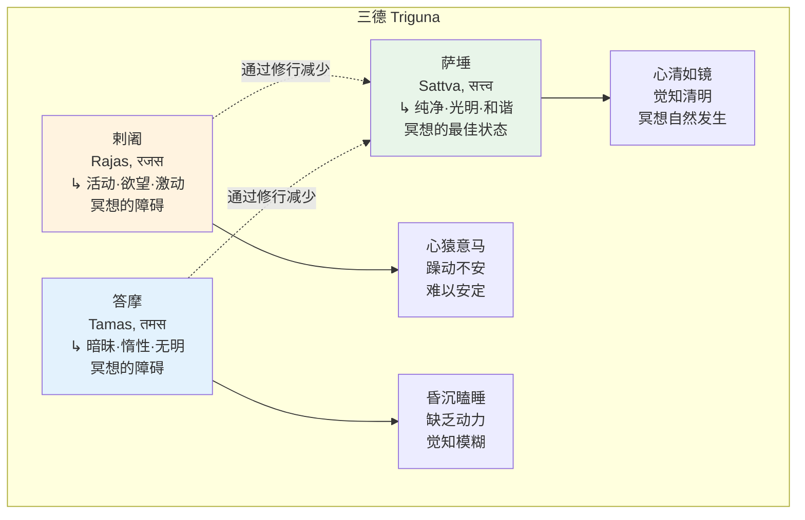
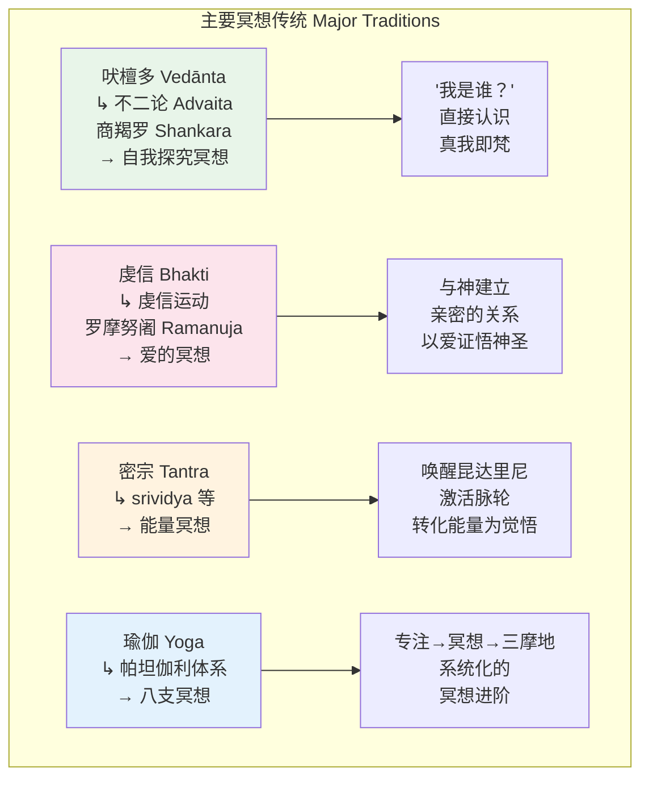
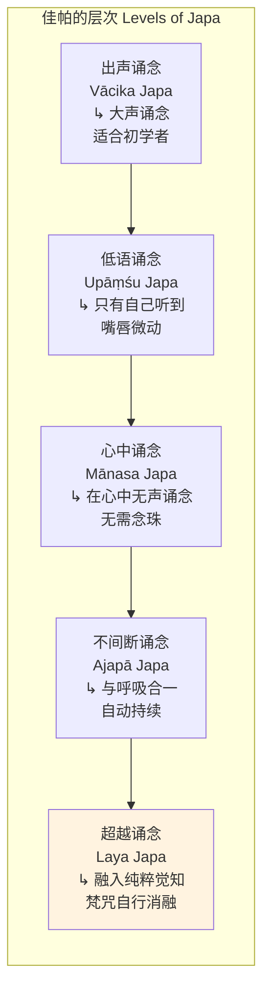
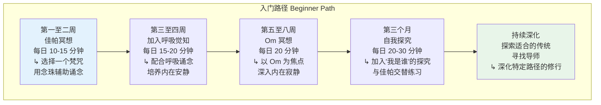

---

title: "印度教冥想概述 | Hindu Meditation Overview"
description: "印度教冥想概述 | Hindu Meditation Overview的详细解析与实践指南"
category: "心智与心理学 > 冥想 > Hindu Meditation"
tags: ["anxiety", "brain", "depression"]
last_updated: "2026-05"
difficulty: "intermediate"
reading_level: "intermediate"
estimated_read_time: "10min"
intent_queries:
  - "什么是印度教冥想概述 | Hindu Meditation Overview"
  - "印度教冥想概述 | Hindu Meditation Overview的核心概念"
  - "印度教冥想概述 | Hindu Meditation Overview的方法与实践"
trigger_keywords: ["印度教冥想概述", "act", "anxiety", "body", "brain"]
cross_refs:
  - path: "01-Wisdom-Traditions/religions/buddhism/meditation/Buddhism_Meditation_Practice_System.md"
    relation: "anxiety/buddhism/depression"
  - path: "01-Wisdom-Traditions/religions/buddhism/psychology/Buddhism_Psychotherapy_Theory.md"
    relation: "anxiety/buddhism/depression"
  - path: "01-Wisdom-Traditions/religions/buddhism/vasana/Vasana_Clinical_Applications.md"
    relation: "anxiety/buddhism/depression"
  - path: "01-Wisdom-Traditions/religions/wisdom-traditions/Wisdom_Buddhism_Healing_Psychology.md"
    relation: "anxiety/buddhism/exercise"
  - path: "01-Wisdom-Traditions/religions/wisdom-traditions/Wisdom_Mahamudra_Great_Seal.md"
    relation: "anxiety/buddhism/exercise"

---
# 印度教冥想概述 | Hindu Meditation Overview

> **适用对象**：对印度教灵修传统感兴趣的冥想练习者、印度哲学研究者、跨传统灵修探索者、心理健康从业者
> **阅读时长**：约 50–60 分钟（可分段阅读）
> **实践建议**：配合正文中的阶段性练习，分 4–6 次完成，每次 15–20 分钟
> **最后更新**：2026-05

---

## 一、核心概念

### 1.1 印度教冥想的本质

印度教冥想（Hindu Meditation）是世界上最古老、最多样化的冥想传统之一，其根源可追溯至三千多年前的吠陀文明。不同于许多其他传统中的单一冥想方法，印度教传统发展出了**一个庞大而精密的冥想体系**，涵盖了从简单的呼吸觉知到最深层的本体论沉思。

印度教冥想的核心可以用一句古老的梵文格言来概括：

> **"Tat Tvam Asi"**（तत्त्वमसि）——"汝即彼"
> —— 《唱赞奥义书》6.8.7

这意味着冥想的终极目的是**认识到个体自我（Jīvātman, जीवात्मन्）与宇宙本体（Brahman, ब्रह्मन्）的同一性**——不是在理智上知道，而是在直接的体验中证悟。

### 1.2 核心概念体系

印度教冥想建立在一系列精密的概念体系之上：

| 概念 | 梵文 | 含义 | 在冥想中的角色 |
|------|------|------|--------------|
| **梵** | Brahman, ब्रह्मन् | 宇宙的终极实在 | 冥想的终极对象与目标 |
| **真我** | Atman, आत्मन् | 个体存在的核心，等同于梵 | 通过冥想直接认识的"那个" |
| **达雅那** | Dhyana, ध्यान | 深层冥想 | 修行的主要方法 |
| **三摩地** | Samadhi, समाधि | 超越性的统一意识 | 冥想的高阶境界 |
| **达磨** | Dharma, धर्म | 法则、正道 | 修行的伦理基础 |
| **羯磨** | Karma, कर्म | 因果业力 | 冥想净化的对象 |
| **解脱** | Moksha, मोक्ष | 从轮回中解脱 | 冥想的终极目标 |

### 1.3 三德（Triguna）与意识层次

印度教冥想深受**数论派**（Sāṃkhya, सांख्य）哲学的影响，特别是其关于**三德**（Triguna, त्रिगुण）的理论。一切物质自然（Prakṛti, प्रकृति）都由三种基本力量构成，这三种力量的比例决定了心灵的状态：

冥想修行的本质过程就是：**通过规律性的修行（Sādhanā, साधना），增加萨埵（纯净）的品质，减少剌阇（激动）和答摩（暗昧）的影响，使心达到自然清净的状态**。

### 1.4 自我实现（Self-Realization）

印度教冥想的终极目标可以用不同的术语表达，但核心都指向同一个体证：

- **解脱**（Moksha, मोक्ष）：从业力轮回（Samsara, संसार）中彻底解脱
- **自我实现**（Ātma-jñāna, आत्मज्ञान）：直接认识真我（Atman）即梵（Brahman）
- **涅槃**（Nirvāṇa, निर्वाण）：熄灭无明和执着之焰
- **与神合一**（Bheda-abheda / Advaita）：体验个体与神圣的不二性

> "不是通过大量的学习，也不是通过智力，也不是通过大量的听闻，而是**通过冥想**，这[梵]是可以被认识的。" —— 《沉思奥义书》3.2.3（修改引述）

---

## 二、历史与传统

### 2.1 吠陀时期（约公元前 1500–500 年）

印度教冥想的最早源头在**吠陀文献**中。《梨俱吠陀》的**内观颂**（Nasadiya Sukta, RV 10.129）已经表现出对终极实在的深层沉思，而**阿兰尼雅卡**（Āraṇyaka, 阿兰尼书）和**奥义书**（Upanishad）则将冥想从外在的祭祀仪式转向内在的精神探索。

这一时期的关键发展：

| 文献 | 核心冥想教导 |
|------|-------------|
| **《梨俱吠陀》** Ṛg Veda | 宇宙之音 Om（ॐ）作为冥想对象 |
| **《夜柔吠陀》** Yajur Veda | 内在祭祀——将外在仪式转化为内在冥想 |
| **《大林间奥义书》** Bṛhadāraṇyaka | "Neti Neti"（非此，非此）——通过否定一切有限者来接近无限 |
| **《唱赞奥义书》** Chāndogya | "Tat Tvam Asi"——汝即彼的伟大宣言 |
| **《曼杜卡奥义书》** Māṇḍūkya | Om 与意识的四种状态（醒、梦、深眠、第四境） |

### 2.2 奥义书的冥想哲学

奥义书时期（约公元前 800–200 年）是印度教冥想哲学的黄金时代。这一时期的核心洞见可以概括为**"梵我一如"**——个体自我（Atman）与宇宙本体（Brahman）在本性上是同一的。

**奥义书中描述的主要冥想方法**：

1. **Om 冥想**：将注意力集中于神圣之音 Om（ॐ），体验其与宇宙振动的同一
2. **内观冥想**：向内探索"我是谁"，层层剥去虚假的身份认同
3. **五鞘冥想**（Pañca-kośa, पञ्चकोश）：从身体层到极乐层，逐层穿越意识的五个层次
4. **冥想梵的属性**：以"Sat-Cit-Ananda"（存在-意识-极乐）为冥想对象

### 2.3 后期经典与宗派发展（公元前 2 世纪至公元 15 世纪）

随着印度教的发展，不同的哲学宗派和灵修传统各自发展出独特的冥想方法：

### 2.4 现代复兴（19 世纪至今）

19 至 20 世纪见证了印度教冥想传统的重大复兴和全球化传播：

| 人物 | 年代 | 贡献 |
|------|------|------|
| **罗摩克里希那** Ramakrishna | 1836–1886 | 通过个人实践证实了多条冥想路径的有效性 |
| **维韦卡南达** Swami Vivekananda | 1863–1902 | 将印度教冥想传统介绍给西方世界（1893 年芝加哥宗教议会） |
| **罗摩那·马哈希** Ramana Maharshi | 1879–1950 | 复兴了"自我探究"（Ātma-vichāra）冥想法 |
| **奥罗宾多** Sri Aurobindo | 1872–1950 | 发展出"整合瑜伽"——将冥想与生活转化相结合 |
| **奇那帕·萨奇达南达** Swami Chinmayananda | 1916–1993 | 以吠檀多哲学为基础推广冥想 |

---

## 三、核心修习方法

### 3.1 吠陀冥想（Vedic Meditation）

吠陀冥想是印度教冥想中最古老的形式之一，其核心是**通过反复诵念神圣的声音（Mantra, मन्त्र）使心进入深层宁静，然后超越梵咒本身进入纯粹的觉知状态**。

**实践方法**：

1. **获得梵咒**：传统上，梵咒由导师（Guru, गुरु）根据个人的特质传授
2. **舒适的坐姿**：坐在舒适的椅子上或盘坐，闭上眼睛
3. **轻松地诵念**：在心中轻松地反复诵念梵咒，不强求专注
4. **自然地超越**：当心自然安静下来时，让梵咒变得愈来愈细微，最终融入寂静
5. **回到梵咒**：当注意到思绪涌起时，轻松地回到梵咒
6. **持续 15–20 分钟**：以柔和的方式结束，缓慢睁开眼睛

### 3.2 奥义书的禅那（Upanishadic Dhyana）

奥义书中的冥想方法以**深刻的哲学反思**为特色，不同于纯粹的专注技术。

**主要方法**：

#### 净观冥想（Neti Neti）
"Neti Neti"（नेति नेति）意为"非此，非此"——通过排除一切可以被观察到的（因而是有限的）经验，逐渐接近那个无法被对象化的纯粹觉知。

1. 安静地坐着，闭眼
2. 观察身体感受 → "我不是这些感受"
3. 观察情绪 → "我不是这些情绪"
4. 观察思想 → "我不是这些思想"
5. 问自己："如果我不是身体、情绪或思想，那我是谁？"
6. 安住在那个问号后面的**纯粹的"我在"感**（Aham, अहम्）中

#### 五鞘冥想（Pañca-kośa）

奥义书描述了意识的五个层次（五鞘），冥想者可以逐层穿越：

| 层次 | 梵文 | 含义 | 冥想焦点 |
|------|------|------|---------|
| **食物鞘** | Annamaya-kośa | 物质身体 | 觉知身体的感受和边界 |
| **能量鞘** | Prāṇamaya-kośa | 生命能量体 | 觉知呼吸和能量的流动 |
| **心意鞘** | Manomaya-kośa | 思想和情绪 | 观察思想和情绪的升起与消逝 |
| **智慧鞘** | Vijñānamaya-kośa | 深层直觉和智慧 | 安住在直觉性的"知道"中 |
| **极乐鞘** | Ānandamaya-kośa | 极乐与宁静 | 体验超越条件的内在喜悦 |

### 3.3 密宗冥想（Tantra Meditation）

密宗（Tantra, तन्त्र）传统为印度教冥想引入了**身体和能量的维度**。不同于将身体视为障碍的禁欲传统，密宗认为**身体本身就是灵性觉醒的工具和场所**。

**密宗冥想的核心要素**：

1. **脉轮冥想**（Chakra Dhyana, चक्रध्यान）：将注意力依次放在身体内的七个能量中心

| 脉轮 | 梵文 | 位置 | 冥想焦点 |
|------|------|------|---------|
| 根轮 | Mūlādhāra, मूलाधार | 脊椎底部 | 安全感、扎根 |
| 腹轮 | Svādhiṣṭhāna, स्वाधिष्ठान | 下腹部 | 创造力、情感流动 |
| 脐轮 | Maṇipūra, मणिपूर | 太阳神经丛 | 个人力量、意志 |
| 心轮 | Anāhata, अनाहत | 胸部中心 | 无条件的爱、慈悲 |
| 喉轮 | Viśuddha, विशुद्ध | 喉部 | 真实表达、纯净 |
| 眉心轮 | Ājñā, आज्ञा | 眉心 | 直觉、内在觉知 |
| 顶轮 | Sahasrāra, सहस्रार | 头顶 | 与神圣合一 |

2. **昆达里尼冥想**：观想沉睡在根轮的灵性能量（Kuṇḍalinī, कुण्डलिनी）沿着中脉（Suṣumnā, सुषुम्णा）上升
3. **瑜伽尼达拉**：在保持觉知的同时进入深层放松
4. **纳达瑜伽**（Nāda Yoga, नादयोग）：通过聆听内在的声音进行冥想

> **重要提醒**：密宗冥想（特别是昆达里尼相关的练习）应在有经验的导师指导下进行，不当的练习可能导致能量失衡。

### 3.4 佳帕冥想（Japa Meditation）

**佳帕**（Japa, जप）意为"反复诵念"，是印度教冥想中最普遍、最易入门的修习方法。修行者通过反复诵念神圣的名号或梵咒来集中心灵。

**佳帕的工具——念珠**（Mala, माला）：

印度教修行者通常使用 108 颗珠子的念珠来辅助佳帕修行。108 这个数字在印度教中具有深远的象征意义——据说它代表了宇宙的基本结构（如 12 星座 × 9 行星 = 108）。

**佳帕冥想的层次**：

**常用梵咒**：

| 梵咒 | 梵文 | 含义 | 传统 |
|------|------|------|------|
| **Om Namah Shivaya** | ॐ नमः शिवाय | 向湿婆致敬 | 湿婆派 |
| **Om Namo Narayanaya** | ॐ नमो नारायणाय | 向那罗延致敬 | 毗湿奴派 |
| **Om Sri Ram Jai Ram** | ॐ श्री राम जय राम | 赞美罗摩 | 虔信传统 |
| **Hare Krishna Mahamantra** | हरे कृष्ण... | 大梵咒 | Gaudiya Vaishnava |
| **Om Aim Saraswatyai Namaha** | ॐ ऐं सरस्वत्यै नमः | 向辩才天女致敬 | 智慧女神传统 |

### 3.5 冥想梵（Meditation on Brahman）

冥想梵（Brahma-dhyāna, ब्रह्मध्यान）是印度教冥想的最高形式——不再以具体对象为焦点，而是**以宇宙终极实在本身为冥想对象**。

**三种关于梵的冥想**：

1. **萨-维-阿南达冥想**（Saccidānanda-dhyāna）：冥想梵作为"存在-意识-极乐"（Sat-Cit-Ananda, सच्चिदानन्द）的三位一体
2. **Om 冥想**：奥义书将 Om（ॐ）视为梵的声音化身——冥想 Om 就是冥想梵本身
3. **无相冥想**（Nirguṇa-dhyāna）：不借助任何形象或概念，直接安住在对无形无相的梵的觉知中

---

## 四、实践指南

### 4.1 初学者入门路径

### 4.2 日课建议

| 时段 | 练习 | 时长 | 说明 |
|------|------|------|------|
| **晨起（梵时）** | 佳帕 + 冥想 | 20–30 分钟 | 在日出前后的"梵时"（Brahma-muhurta, ब्रह्ममुहूर्त）修行被认为效果最佳 |
| **午前** | Om 冥想 | 10–15 分钟 | 简短的冥想以保持内在连接 |
| **午后** | 自我探究或五鞘冥想 | 15–20 分钟 | 在午后安静时段深入探究 |
| **傍晚** | 虔信冥想 / 神圣敬拜 | 15–20 分钟 | 以虔诚的心与神圣连接 |
| **夜间** | 瑜伽尼达拉 | 15–20 分钟 | 深度放松，为睡眠做准备 |

### 4.3 选择适合自己的冥想路径

印度教传统认识到不同的人有不同的心理气质（Adhikāri, अधिकारी），因此提供了多种冥想路径：

| 心理气质 | 适合的冥想路径 | 关键方法 |
|---------|--------------|---------|
| **理智型** | 吠檀多 / 知识之路 | 自我探究、Neti Neti、梵的冥想 |
| **情感型** | 虔信之路 | 佳帕、神的冥想、虔诚祈祷 |
| **行动型** | 瑜伽 / 行动之路 | 体位-调息-冥想的整合 |
| **能量型** | 密宗之路 | 脉轮冥想、昆达里尼、纳达瑜伽 |

### 4.4 寻找导师（Guru）

在印度教传统中，**导师**（Guru, गुरु）被视为冥想修行中不可或缺的指引。梵文中"Guru"由"Gu"（黑暗）和"Ru"（驱散）组成，意为**驱散无明黑暗的人**。

选择导师的智慧准则：

1. 导师的教导应与经典（Śruti/Smṛti）一致，而非个人创新
2. 导师的生活应体现其所教授的原则
3. 真正的导师不会要求盲目的服从或过度的物质回报
4. 导师应鼓励学生独立思考，最终自己证悟真理
5. 最重要的是内心的直觉——你与这位导师是否产生了真实的灵性共鸣

---

## 五、现代应用与研究

### 5.1 心理健康领域的应用

印度教冥想实践（特别是佳帕、Om 冥想和瑜伽尼达拉）在心理健康领域有广泛的研究支持：

- **佳帕冥想与焦虑**：Wolf 和 Abell（2005）的研究发现，规律练习佳帕冥想可以显著降低焦虑、愤怒和抑郁水平
- **Om 冥想与脑电波**：Harinandan 等人（2018）的研究发现，Om 诵念导致边缘系统活动显著变化，与情绪调节相关
- **自我探究与心理整合**：虽然直接关于"自我探究"的研究较少，但基于"我是谁"式探问的治疗方法在当代心理治疗（如接纳承诺疗法 ACT）中有类似应用
- **瑜伽尼达拉与创伤**：瑜伽尼达拉被越来越多地用于创伤恢复和压力管理项目

### 5.2 神经科学研究

| 研究领域 | 发现 |
|---------|------|
| **Om 诵念** | 与副交感神经系统的激活、心率和血压的降低相关 |
| **佳帕冥想** | 长期练习者表现出前额叶皮层的增厚和杏仁核体积的减小 |
| **密宗冥想** | 某些研究显示密宗修行者能够自主调节通常不受意识控制的生理过程 |
| **梵咒诵念** | 研究发现梵咒诵念可以增强迷走神经张力，改善自主神经平衡 |

### 5.3 全球影响

印度教冥想传统对全球冥想文化的影响是深远的：

- **超觉静坐**（TM）源于印度教的佳帕传统，是最广泛研究的冥想方法之一
- **正念运动**的先驱们（如乔·卡巴金）公开承认受到印度教和佛教冥想传统的启发
- **瑜伽全球化**使得体位-调息-冥想的整合路径在全世界广泛传播
- **吠檀多哲学**通过拉达克里希南、奥罗宾多等思想家的著作影响了西方哲学和心理学

---

## 六、注意事项与建议

### 6.1 安全须知

1. **身体健康**：在开始任何冥想修行前，如有慢性疾病应咨询医生
2. **心理健康**：有严重心理健康问题者应在专业心理健康从业者的指导下进行冥想
3. **能量安全**：密宗和昆达里尼相关的冥想练习必须在有经验的导师指导下进行
4. **灵性危机**：如冥想中出现持续的心理困扰、人格解体或脱离现实的体验，应立即停止并寻求帮助
5. **避免极端**：印度教传统强调"中道"——冥想应是整体生活的一部分，不应导致对家庭、工作和社会责任的忽视

### 6.2 文化尊重

1. **认识根源**：理解印度教冥想传统深植于特定的文化、语言和哲学语境中
2. **避免简化**：不要将印度教冥想简化为"技术"——它是一种完整的生活方式（Dharma, धर्म）
3. **尊重梵文**：学习基本的梵文术语有助于更深入地理解冥想传统
4. **避免商业化的误导**：警惕将古老传统商业化、浅薄化的现象

### 6.3 推荐阅读

| 书籍 | 作者/来源 | 说明 |
|------|----------|------|
| 《奥义书》Upanishads | 多位 | 印度教冥想哲学的核心文本 |
| 《薄伽梵歌》Bhagavad Gita | — | 瑜伽与冥想之道的综合指南 |
| 《瑜伽经》Yoga Sutras | 帕坦伽利 | 冥想修行的系统化论述 |
| 《吠檀多精髓》Vivekachudamani | 归于商羯罗 | 不二论吠檀多的入门经典 |
| Be As You Are | 大卫·戈德曼 编 | 罗摩那·马哈希的教导集 |
| The Upanishads | Eknath Easwaran 译 | 面向现代读者的奥义书翻译和注释 |

---

> **相关资源**
> - 返回 [INDEX](./INDEX.md)
> - 参见 [瑜伽冥想概述](../yoga-meditation/Yoga_Meditation_Overview.md)
> - 参见 [昆达里尼冥想概述](../kundalini-meditation/Kundalini_Meditation_Overview.md)
