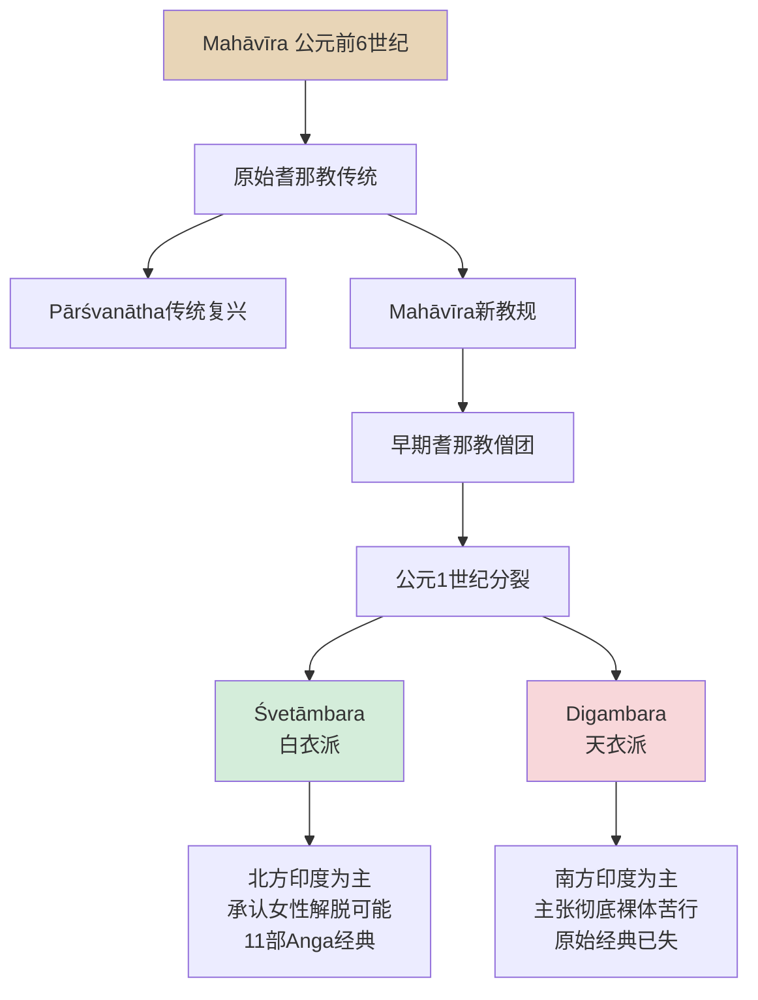
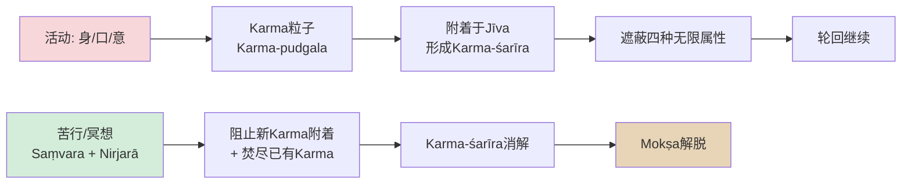
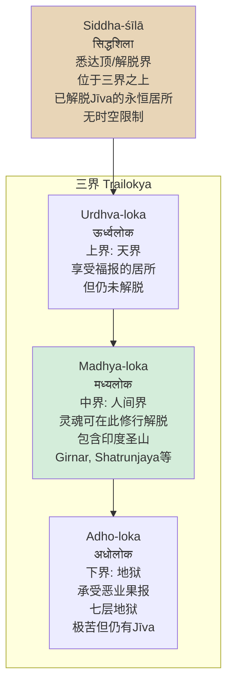
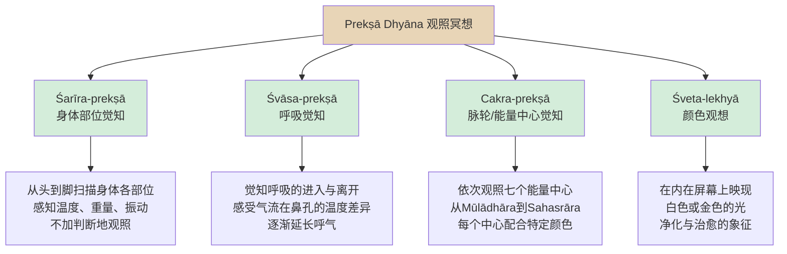
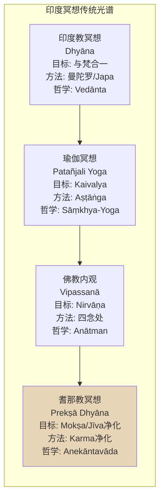

---

title: "耆那教冥想概述 (Jain Meditation Overview)"
description: "耆那教冥想概述 (Jain Meditation Overview)的详细解析与实践指南"
category: "心智与心理学 > 冥想 > Jain Meditation"
tags: ["anxiety", "cinema"]
last_updated: "2026-05"
difficulty: "intermediate"
reading_level: "intermediate"
estimated_read_time: "15min"
intent_queries:
  - "什么是耆那教冥想概述"
  - "耆那教冥想概述的核心概念"
  - "耆那教冥想概述的方法与实践"
trigger_keywords: ["耆那教冥想概述", "aging", "anxiety", "behavioral", "body"]
cross_refs:
  - path: "01-Wisdom-Traditions/religions/buddhism/meditation/Buddhism_Samatha_Vipassana.md"
    relation: "aging/anxiety/buddhism"
  - path: "01-Wisdom-Traditions/religions/buddhism/nan-huaijin/Nan_Huaijin_Teachings.md"
    relation: "aging/anxiety/buddhism"
  - path: "01-Wisdom-Traditions/religions/buddhism/psychology/Buddhism_Psychotherapy_Theory.md"
    relation: "aging/anxiety/buddhism"
  - path: "01-Wisdom-Traditions/religions/buddhism/theravada/Theravada_Overview.md"
    relation: "aging/anxiety/buddhism"
  - path: "01-Wisdom-Traditions/religions/buddhism/vasana/Vasana_Clinical_Applications.md"
    relation: "aging/anxiety/buddhism"

---
# 耆那教冥想概述 (Jain Meditation Overview)

> **主题**: 耆那教（Jainism）冥想传统——从Mahāvīra的解脱之道到Prekṣā Dhyāna的现代复兴
> **关键词**: Samayika, Prekṣā Dhyāna, Kāyotsarga, Anekāntavāda, Ahimsā, Jīva, Karma, Mokṣa
> **最后更新**: 2026-05

---

## 目录

1. [历史脉络](#历史脉络)
2. [核心理论](#核心理论)
3. [主要修习方法](#主要修习方法)
4. [与现代科学的交汇](#与现代科学的交汇)
5. [与其他印度传统的比较](#与其他印度传统的比较)
6. [实践指引](#实践指引)
7. [附录](#附录)

---

## 历史脉络

### Mahāvīra 与第24位 Tīrthaṅkara

耆那教（Jainism, जैनधर्म）将自身传统追溯至24位精神导师——**Tīrthaṅkara**（तीर्थंकर, "渡津者"或"渡桥者"）。据耆那教宇宙学，第一位Tīrthaṅkara **Ṛṣabha**（Ṛṣabhadeva, 勒舍婆）生活于数百万年前，而第24位也是最后一位**Mahāvīra**（महावीर, "伟大的英雄"）约于公元前6世纪活跃于印度比哈尔邦（Bihar）地区。

Mahāvīra（原名Vardhamāna）出生于一个刹帝利（Kṣatriya）王室，30岁时弃绝世俗生活，进行长达12年的极端苦行（tapas），最终在Pārśvanātha（第23位Tīrthaṅkara）所开创的传统基础上获得**Kevala Jñāna**（केवलज्ञान, 圆满智慧/全知）。他随后周游讲法30年，建立了以**五戒**（Mahāvratas, 五大誓言）为核心的僧团体系：

- **Ahimsā**（अहिंसा）— 非暴力
- **Satya**（सत्य）— 真实语
- **Asteya**（अस्तेय）— 不偷盗
- **Brahmacarya**（ब्रह्मचर्य）— 禁欲
- **Aparigraha**（अपरिग्रह）— 不执取

### 耆那教与佛教的分化

Mahāvīra与释迦牟尼（Śākyamuni Buddha）生活在几乎同一时代、同一地区（摩揭陀国, Magadha）。两者均反对婆罗门教的祭祀主义和种姓特权，提倡通过个人修行获得解脱——这使二者常被外界混为一谈。然而，二者在核心哲学上存在深刻分歧：

| 维度 | 耆那教 | 佛教 |
|------|--------|------|
| **灵魂观** | **Jīva**（जीव）永恒存在，被Karma所缚 | **Anātman**（अनात्मन्），否定永恒灵魂 |
| **宇宙观** | 三界（Trailokya）实有，无始无终 | 缘起（Pratītyasamutpāda），无常幻有 |
| **解脱观** | 净化Karma，灵魂升至 Siddha-śīlā（悉达顶） | 熄灭贪瞋痴，证入 **Nirvāṇa**（涅槃） |
| **苦行态度** | 极端苦行是净化Karma的必要手段 | **Madhyamā Pratipad**（中道），反对极端苦行 |
| **逻辑学** | **Anekāntavāda**（多元实在论）、**Syādvāda**（或然论） | **Catuṣkoṭi**（四句破），解构一切命题 |

这一分化深刻影响了二者的冥想路径：佛教内观（Vipassanā）以"无我"观照为核心，而耆那教冥想则围绕"净化灵魂"（Jīva-śuddhi）展开。

### 两大传统：Digambara 与 Śvetāmbara

耆那教在大约公元1世纪前后分裂为两大主要传统：

**Śvetāmbara**（श्वेताम्बर, "白衣派"）：僧侣身着白色棉布长袍（muhpattī 覆面布以防止吸入微生物），主要活跃于印度西部（古吉拉特邦、拉贾斯坦邦）。该派认为女性亦可获得解脱，保留了11部**Aṅga**（अङ्ग, 肢分/主要经典）等完整经典体系。

**Digambara**（दिगंबर, "天衣派/空衣派"，字面义"以天空为衣"）：僧侣彻底裸体，象征对物质世界的完全弃绝。该派认为女性因生理限制无法达到终极解脱（除非转世为男性），认为原始经典已在历史动荡中散佚，仅存后世的教义概要（如Ṣaṭkhaṇḍāgama《六部分论》）。

### 耆那教在印度的延续

尽管耆那教徒仅占印度人口的约0.4%（约450-500万人），但其在印度文化中的影响远超人口比例：

- **商业与慈善**：耆那教社群（尤其是Śvetāmbara）在印度商界占据重要地位，以严格诚信和慈善闻名
- **动物保护**：耆那教的Ahimsā传统深刻影响了印度的素食文化，许多印度教寺庙和保护区（如Rajasthan的Mount Abu）由耆那教徒维护
- **现代复兴**：20世纪Acharya Mahāprajña的**Prekṣā Dhyāna**运动将耆那教冥想推广至全球，建立了跨宗派的修行体系

---

## 核心理论

耆那教冥想建立在一套精密的宇宙论和灵魂学之上。理解这些理论是进入耆那教冥想实践的必要基础。

### Jīva（灵魂）与 Ajīva（非灵魂）

耆那教宇宙由两大永恒范畴构成：

| 范畴 | 定义 | 特征 | 与冥想的关系 |
|------|------|------|-------------|
| **Jīva** (जीव) | 有生命的灵魂实体 | 永恒、有意识、被Karma所缚或已解脱 | 冥想的对象——净化并认识真正的自我 |
| **Ajīva** (अजीव) | 无生命的物质与空间 | 五种类型：Dharma（运动介质）、Adharma（静止介质）、Ākāśa（空间）、Pudgala（物质）、Kāla（时间） | 冥想中需要超越的对境 |

Jīva具有四个根本属性（Guṇas, 属性）：
1. **Ananta-jñāna**（अनन्तज्ञान）— 无限知识
2. **Ananta-darśana**（अनन्तदर्शन）— 无限观照/洞见
3. **Ananta-cāritra**（अनन्तचारित्र）— 无限正行
4. **Ananta-sukha**（अनन्तसुख）— 无限喜乐

然而，由于Karma的遮蔽，这些属性在轮回中的灵魂（Saṃsārī-jīva）处于被压抑状态。冥想的终极目标是去除Karma的遮蔽，使Jīva恢复其本然的无限性。

### Karma（业力）的颗粒化理论

耆那教的Karma理论是印度各传统中最为精细化和物理化的：

Karma不是抽象的"因果报应"，而是由极细微物质粒子（**Karma-pudgala**, कर्मपुद्गल）构成。这些粒子被灵魂的情绪波动（**Kaṣāya**, कषाय, 贪瞋痴慢等染污）所吸引，附着于灵魂表面，形成**Karma-śarīra**（Karma身）。

Karma按其对灵魂的遮蔽功能分为8类（Aṣṭa-karma, अष्टकर्म）：

| 类别 | 梵文 | 功能 | 解脱条件 |
|------|------|------|---------|
| **知识遮蔽** | Jñānāvaraṇīya | 阻碍全知 | 修习智慧与冥想 |
| **观照遮蔽** | Darśanāvaraṇīya | 阻碍正见 | 信仰与静虑 |
| **感受业** | Vedanīya | 决定苦乐体验 | 平等心（Samatva） |
| **寿命业** | Āyus | 决定寿命长短 | 无法中断，只能承受 |
| **名色业** | Nāma-karma | 决定身体与命运细节 | 通过修行逐步弱化 |
| **种姓业** | Gotra | 决定出身高低 | 修行可转化 |
| **阻碍业** | Antarāya | 阻碍能力与善行 | 精进与布施 |
| **迷妄业** | Mohanīya | 最根本的贪瞋痴遮蔽 | 最难消除，需深层冥想 |

其中**Mohanīya-karma**（摩哈维业/迷妄业）是最难去除的，因为它直接导致Kaṣāya（情绪染污），从而持续吸引新的Karma粒子。耆那教冥想的深层目标正是净化这一根本业力。

### Ahimsā（非暴力）作为最高戒律

**Ahimsā paramo dharmaḥ**（अहिंसा परमो धर्मः, "非暴力是最高的法"）是耆那教的核心宣言。这一原则不仅是伦理规范，更是一个宇宙论命题：

- 每一个Jīva，无论多么微小（细菌、微生物、植物中的灵魂），都具有同等的神圣性
- 暴力（Himsā）产生最粗重的Karma粒子，严重阻碍灵性进步
- 彻底的Ahimsā需要对自身心念的极端警觉——甚至愤怒的念头也是一种暴力

因此，耆那教冥想不仅是"坐着闭眼"，而是将整个生活转化为一种持续的冥想状态：在每一刻选择非暴力，即是在每一刻净化Karma。

### 三界宇宙观（Trailokya）

耆那教宇宙是永恒而无始无终的——没有创造，也没有终极毁灭。**Siddha**（सिद्ध, 成就者）是已经解脱的Jīva，居于三界之上的**Siddha-śīlā**（悉达顶），不再轮回，也不再介入宇宙事务。Tīrthaṅkara在获得Kevala Jñāna后、进入最终解脱前，会作为**Arhat**（अर्हत्, 应供者）在人间继续讲法。

### Mokṣa（解脱）路径：Ratna-traya（三宝）

解脱不是神的恩赐，而是通过个人精进达到的理性结果。耆那教将解脱之路总结为**Ratna-traya**（रत्नत्रय, 三宝）：

| 宝 | 梵文 | 含义 | 在冥想中的体现 |
|---|------|------|--------------|
| **正信** | Samyag-darśana | 对Tīrthaṅkara教法的正确信仰 | 皈依与发愿 |
| **正知** | Samyag-jñāna | 对Jīva、Karma等真理的正确理解 | 经典研读（Svādhyāya） |
| **正行** | Samyak-cāritra | 五戒与苦行等正确实践 | Samayika, Kāyotsarga等冥想 |

冥想贯穿三宝的每一层面：从虔诚的皈依冥想，到理性的真理观照，再到身体力行的苦行冥想。

### Anekāntavāda（多元实在论）

**Anekāntavāda**（अनेकान्तवाद, "非一端论"或"多元实在论"）是耆那教最独特的哲学贡献，也被视为其逻辑学与认识论的基石：

> 任何实体（Dravya, 实体）都具有无限属性，从任何一个单一视角（Naya, नय）出发的断言都只能是部分的真理。

与之配套的是**Syādvāda**（स्याद्वाद, "或然论"或"七支论法"），它将任何命题从七个可能的角度来审视：

1. **Syād-asti**（或有）— 从某角度看，它是
2. **Syād-nāsti**（或无）— 从另一角度看，它不是
3. **Syād-asti-nāsti**（或亦有亦无）— 从不同角度看，它既是又不是
4. **Syād-avaktavya**（或不可说）— 从某角度看，它不可言说
5. **Syād-asti-avaktavya**（或是而不可说）— 复合视角
6. **Syād-nāsti-avaktavya**（或非而不可说）— 复合视角
7. **Syād-asti-nāsti-avaktavya**（或是非而不可说）— 复合视角

Anekāntavāda对冥想的意义在于：它训练修习者同时保持多种视角，培养一种**认知上的非执着**——不将任何一个单一观点绝对化。这种心智弹性直接增强了冥想中的**平等心**（Samatva）。

---

## 主要修习方法

耆那教拥有丰富的冥想技术体系，从日常的48分钟等持到临终的灵性准备，涵盖了生命的各个阶段。

### Samayika（सामायिक, 等持冥想）

Samayika是耆那教最基础的冥想形式，也是所有在家信众（Śrāvaka, 听法者）的日常必修。

**时间结构**：传统上以**48分钟**（一个Muhūrta,  moments）为一个完整周期。这一时间单位对应于古代印度的时间分割系统，被认为是一个人能够维持深度专注的合适长度。

**修习程序**：

| 阶段 | 名称 | 内容 | 时间分配 |
|------|------|------|---------|
| 1 | Prārambha（准备） | 沐浴、着白衣、进入清净空间、面向圣像 | 5分钟 |
| 2 | Pratyākhyāna（发愿） | 重复发誓守护五戒，忏悔当日过失 | 5分钟 |
| 3 | Sāmāyika-mūla（等持核心） | 盘坐（Padmāsana或Sukha-āsana），闭目，将心念安住于平等的觉知中——不对任何对象产生贪爱或厌憎 | 30分钟 |
| 4 | Pāṇḍava（结束） | 缓慢出定，回向功德，感恩 | 8分钟 |

**核心要领**：
- **Samatva**（समत्व, 平等心）：将一切境遇——苦乐、得失、毁誉——视为平等。这不是情感麻木，而是一种深层的不执着。
- **Ekāgratā**（एकाग्रता, 一心专注）：心念安住于一个对象（通常是呼吸、咒音或内在的自我觉知）不散乱。
- **Sva-parasama-tvānuprekṣā**：将自我与他人的苦难等同看待，培养普世的慈悲心（在耆那教框架下，即是对一切Jīva的尊重）。

Samayika不仅是一种冥想，更是一种**存在状态的转换**：通过48分钟的等持，修行者暂时从世俗角色（商人、父母、公民）中脱离，进入一个"无身份"的纯粹觉知状态——这被认为是对Mokṣa状态的预演。

### Prekṣā Dhyāna（प्रेक्षा ध्यान, 观照冥想）

Prekṣā Dhyāna是20世纪耆那教最重要的冥想革新，由**Ācārya Mahāprajña**（आचार्य महाप्रज्ञ, 1920-2010）系统整理并推广。虽然其技术元素深植于古老的耆那教传统，但Mahāprajña将其结构化、科学化，使其成为全球性的跨宗派修行体系。

**历史背景**：Mahāprajña是Śvetāmbara Terapanth传统的第十任Ācārya。他早年深入研习耆那教经典、梵文、Prakrit文和印度哲学，中年时期（1960年代起）开始将耆那教传统中的身体觉知（Śarīra-prekṣā, 身体观照）和呼吸觉知（Śvāsa-prekṣā, 呼吸观照）技术系统化。1970年代，他在拉贾斯坦邦进行了多次闭关，最终确立了Prekṣā Dhyāna的完整体系。

**核心修习技术**：

**详细修习步骤**：

**第一阶段：基础准备（5-10分钟）**
- 采取舒适的坐姿（Padmāsana, Vajrāsana或椅子坐）
- 双手结Dhyāna-mudrā（禅定印，右手在上左手在下，拇指相触）
- 三次深长的净化呼吸
-  mentally 吟诵咒语 "Arham"（अर्हं, 对Arhat的致敬）或简单的元音"AUM"

**第二阶段：Śarīra-prekṣā 身体部位觉知（15-20分钟）**
- 将注意力从头顶（Śiras）开始，缓慢向下移动
- 依次观照：头顶→额头→眼睛→鼻子→嘴唇→下巴→颈部→右肩→右上臂→右前臂→右手→左肩→左上臂→左手→胸部→腹部→背部→腰部→右大腿→右小腿→右脚→左大腿→左脚
- 在每个部位停留约30秒至1分钟，单纯感知该部位的**触觉感受**（温度、压力、轻微振动）
- 关键原则：**Prekṣā**（प्रेक्षा）意为"观照"——如同旁观者观看电影，不与感受认同，不追逐愉悦，不排斥不适

**第三阶段：Śvāsa-prekṣā 呼吸觉知（10-15分钟）**
- 将注意力集中于鼻孔入口处的呼吸感触
- 观察**吸气的清凉**与**呼气的温暖**
- 逐渐延长呼气时间（吸:呼 = 1:2）
- 将心念安住于呼吸的节律，如丝线穿过莲花

**第四阶段：Cakra-prekṣā 能量中心觉知（10-15分钟）**
- 依次观照七个Cakra，每个配合特定颜色观想：

| Cakra | 位置 | 颜色 | 耆那教对应 |
|-------|------|------|-----------|
| Mūlādhāra | 会阴 | 红色 | 基础生命力 |
| Svādhiṣṭhāna | 下腹部 | 橙色 | 创造力 |
| Maṇipūra | 肚脐 | 黄色 | 意志力 |
| Anāhata | 心轮 | 绿色 | 慈悲与平等心 |
| Viśuddha | 喉部 | 蓝色 | 真实语 |
| Ājñā | 眉心 | 靛色 | 直觉与智慧 |
| Sahasrāra | 头顶 | 白色/金色 | Kevala Jñāna/全知 |

**第五阶段：Śveta-lekhyā 白色观想（5-10分钟）**
- 在内在视觉中想象一片纯净的白光
- 让白光从头顶灌注全身，净化所有Karma的染污
- 最终融入无边无际的光明之中

**Prekṣā Dhyāna 的独特性**：
- **科学化**：Mahāprajña刻意剥离了神秘主义色彩，强调可验证的身心效应
- **跨宗派**：吸引大量非耆那教徒修习，在印度和西方均有推广中心
- **医学整合**：在印度多个医院用于慢性病管理、压力缓解和康复治疗

### Anuprekṣā（अनुप्रेक्षा, 深思冥想）

Anuprekṣā是一种**主题式冥想**（Thematic Meditation），修行者围绕特定的哲学主题进行深度contemplation（深思）。耆那教传统中最重要的Anuprekṣā体系是**Dvādaśa-anuprekṣā**（द्वादशानुप्रेक्षा, 十二个深思主题），源自Umāsvāti的《Tattvārtha Sūtra》（《真理义经》）等经典。

**十二深思主题**：

| 编号 | 梵文 | 中文 | 主题内容 | 冥想效果 |
|------|------|------|---------|---------|
| 1 | **Anitya** (अनित्य) | 无常 | 一切物质现象皆无常变灭，财富、关系、身体皆不可依赖 | 减少执着 |
| 2 | **Aśaraṇa** (अशरण) | 无庇护 | 在生死轮回中没有任何外在的庇护者，唯有自己的修行可依赖 | 激发精进 |
| 3 | **Saṃsāra** (संसार) | 轮回之苦 | 反复经历生、老、病、死、别离的痛苦 | 厌离轮回 |
| 4 | **Ekatva** (एकत्व) | 孤独 | 每一个Jīva本质上都是孤独的，无人能替你受苦或享受 | 自我负责 |
| 5 | **Anyatva** (अन्यत्व) | 他性 | 一切外物（身体、财产、关系）都与真正的自我不同 | 分离执着 |
| 6 | **Aśuci** (अशुचि) | 不净 | 身体的本质是脓血、污秽和不净的混合物 | 破除身见 |
| 7 | **Āśrava** (आश्रव) | 漏入 | 情绪波动（Kaṣāya）导致Karma粒子不断漏入灵魂 | 警觉心念 |
| 8 | **Saṃvara** (संवर) | 止漏 | 通过冥想和戒律阻止新Karma的附着 | 建立防护 |
| 9 | **Nirjarā** (निर्जरा) | 焚尽 | 通过苦行和深层冥想焚尽已积累的Karma | 净化灵魂 |
| 10 | **Loka** (लोक) | 宇宙 | 三界宇宙的广阔与复杂，个体在其中的渺小 | 扩展视野 |
| 11 | **Bodhi-durlabha** (बोधिदुर्लभ) | 觉悟难得 | 获得人身、遇见正法、有机会修行的稀有性 | 珍惜当下 |
| 12 | **Dharma** (धर्म) | 正法 | 对Tīrthaṅkara所教导的正法的深思与感恩 | 坚定信仰 |

**修习方法**：
- 选择一个主题（通常按顺序或根据当前心境）
- 在Samayika或单独的冥想时段中，围绕该主题进行逻辑推演和情感沉浸
- 例如"无常"主题：回忆过去的失去，观察当下的变化，推演未来的不可知——直到一种深层的"放下"自然升起
- 不同于悲观的虚无主义，Anuprekṣā的最终目的是**将注意力从外在转向内在的Jīva**，认识到唯有内在的觉知是恒常的

### Kāyotsarga（कायोत्सर्ग, 身体抛弃法）

Kāyotsarga是耆那教冥想中最具特色的技术之一，字面义为"抛弃身体"（Kāya = 身体, Utsarga = 抛弃/释放）。它通常作为冥想的最后阶段，也可独立修习。

**修习姿势**：
- 站立、仰卧或舒适的坐姿
- 传统上采用**站立不动**的姿势（与Rishabha雕像的经典姿势相同）
- 双臂自然下垂，全身完全放松

**核心程序**：

| 阶段 | 内容 | 目标 |
|------|------|------|
| 1 | **身体扫描放松** | 从头顶到脚底，依次放松每一块肌肉 | 达到身体仿佛"不存在"的状态 |
| 2 | **分离觉知** | 意识到"我是觉知本身，不是这个身体" | 建立Jīva与身体的距离 |
| 3 | **静止安住** | 保持完全静止，如雕像一般 | 体验超越身体的自由 |
| 4 | **Karma净化观想** | 想象Karma粒子如尘埃般从灵魂表面脱落 | 强化Nirjarā的效应 |

**深层意义**：Kāyotsarga不仅是一种放松技术，更是耆那教核心教义的**具身化实践**：
- 身体是Pudgala（物质），会生病、衰老、死亡
- Jīva（灵魂）是纯粹的觉知，不受物质的限制
- 通过"抛弃"身体的认同，修行者预演了最终的Mokṣa状态

在极端的苦行传统中，Digambara僧侣会进行长达数小时甚至数天的Kāyotsarga站立冥想，作为对毅力和非执着的考验。

### Svādhyāya（स्वाध्याय, 经典诵读与反思）

Svādhyāya在耆那教中具有双重含义：
1. **自我研习**（Sva = 自己, Adhyāya = 研读）——对自身内在状态的观察
2. **经典诵读**——大声或默诵耆那教圣典

**经典体系**：

| 传统 | 经典 | 内容 |
|------|------|------|
| Śvetāmbara | **Siddha-śāstra**（悉达经）| Mahāvīra的讲法记录 |
| Śvetāmbara | **Ācārāṅga Sūtra**（行为经）| 僧侣的行为规范与苦行方法 |
| Śvetāmbara | **Sūtrakṛtāṅga**（经造经）| 教义辩论与哲学 |
| Śvetāmbara | **Uttarādhyayana**（北传经）| 出家修行者的指导 |
| Digambara | **Ṣaṭkhaṇḍāgama**（六部分论）| 宇宙论与灵魂学 |
| Digambara | **Kashaya-pahuda**（漏入论）| Karma理论与心理学 |

**冥想性的Svādhyāya**：
- 选择一段简短的经典文句（如Ahimsā的赞颂或Mokṣa的描述）
- 缓慢诵读，感受每个音节的振动（耆那教认为梵文/Prakrit的音声本身具有净化力）
- 诵读后闭眼沉思文句的含义，将其与个人经验连接
- 最终超越文句，安住于文句所指向的真理本身

### Sallekhanā（सल्लेखना, 临终冥想的灵性准备）

Sallekhanā是耆那教最具争议但也最具深度的实践之一：在预知死亡将至时，通过逐步减少食物和水的摄入，以一种清醒、平和、冥想的状态迎接死亡。

**重要澄清**：耆那教传统严格区分Sallekhanā与自杀：
- **自杀**是出于绝望、痛苦或逃避的主动求死
- **Sallekhanā**是在寿命自然终结时，选择以冥想状态面对死亡，而非为延续生命而挣扎

**修习过程**：

| 阶段 | 行为 | 冥想焦点 |
|------|------|---------|
| 1 | 放弃固体食物，仅摄入流质 | Anitya（无常）— 身体的需要正在消退 |
| 2 | 放弃流质，仅湿润嘴唇 | Anyatva（他性）— 这个身体正在回归它来的地方 |
| 3 | 完全断食断水 | Samatva（平等心）— 对饥饿和口渴保持平等观照 |
| 4 | 临终时刻 | Kāyotsarga（身体抛弃）— "我不是这个身体" |

**法律与伦理地位**：
- 印度最高法院于2017年裁定Sallekhanā是一种宗教实践，受宪法保护
- 耆那教社群内部有严格的监督机制，确保实践者是在清醒、自愿、有资深僧侣指导的情况下进行
- 批评者（包括部分佛教和世俗人道主义者）认为这一实践可能被滥用

**冥想维度**：Sallekhanā是耆那教冥想的终极考验——在最极端的生理挑战下维持平等心和自我分离。修行者通过这一实践，证明了Jīva可以超越身体的限制，为最终的Mokṣa做最后的准备。

---

## 与现代科学的交汇

### 非暴力饮食对微生物组的影响

耆那教的Ahimsā饮食（严格素食+避免根茎类蔬菜以防伤害土壤微生物+过滤饮水）提供了独特的研究样本：

- **肠道微生物多样性**：初步研究表明，严格的耆那教饮食者拥有较高的肠道微生物多样性，可能与高纤维、低动物蛋白的饮食结构有关
- **抗生素耐药性**：耆那教社群因医疗原因使用抗生素时，耐药性菌株的传播率似乎较低（可能与其避免动物源食品中的抗生素残留有关）
- **炎症指标**：部分小型研究显示耆那教饮食者的C反应蛋白（CRP）和IL-6等炎症标志物较低

然而，这些研究尚处于初步阶段，样本量较小，且难以将饮食效应与耆那教社群的其他生活方式因素（如冥想、社群支持、低烟酒率）完全分离。

### Prekṣā Dhyāna 对压力与健康的研究

Ācārya Mahāprajña的Prekṣā Dhyāna体系吸引了现代医学研究者的关注：

| 研究领域 | 研究发现 | 研究机构/年份 |
|---------|---------|-------------|
| **压力激素** | 12周Prekṣā Dhyāna练习者的皮质醇水平显著降低 | Prekṣā Dhyāna Research Institute, 2010 |
| **心率变异性** | HRV指标改善，提示副交感神经系统活动增强 | JJT University, Rajasthan, 2015 |
| **慢性疼痛** | 纤维肌痛患者的疼痛评分显著下降 | 多项印度医院临床研究 |
| **免疫功能** | NK细胞（自然杀伤细胞）活性提升 | 初步免疫学研究 |
| **情绪调节** | 焦虑和抑郁量表（BAI, BDI）得分显著改善 | 跨多项研究的一致发现 |

Prekṣā Dhyāna研究的优势在于其**标准化程度高**：Mahāprajña建立了一套可以精确传授和复制的修习程序，这使得科学研究的设计比传统的"正念冥想"更为精确。

### 耆那教生态伦理与现代环保运动

耆那教的生态哲学提供了一个超越人类中心主义的伦理框架：

- **微生物伦理**：耆那教对微生物生命的尊重，与现代微生物组科学形成了有趣的对话——我们体内的微生物群落是否也应被赋予某种伦理考量？
- **非暴力经济**：耆那教商人传统中的诚信和非暴力原则，为现代"伦理投资"和"可持续商业"提供了古老的文化先例
- **城市生态**：印度多个耆那教社群建立了动物医院（Pānījrāpol）、鸟类医院和树木保护计划，其规模和系统性在全球宗教社群中罕见

---

## 与其他印度传统的比较

### 与佛教内观（Vipassanā）的比较

| 维度 | 耆那教冥想 | 佛教内观 |
|------|-----------|---------|
| **核心对象** | Jīva（灵魂的净化与认识） | Aniccā/Dukkha/Anattā（三法印） |
| **身体观照** | Prekṣā Dhyāna的身体扫描，目的是分离Jīva与身体 | Vipassanā的身体扫描，目的是体认Anattā（无我） |
| **情绪处理** | Kaṣāya（染污）的净化——将情绪波动视为Karma的附着点 | Vedanā（受）的观察——不执取苦受和乐受 |
| **平等心** | Samatva——从Anekāntavāda出发的认知平等 | Upekkhā——从缘起观出发的情感平等 |
| **终极状态** | Siddha——有觉知地居于Siddha-śīlā | Nirvāṇa——贪瞋痴的彻底熄灭 |
| **社群结构** | 僧侣与在家众严格区分，僧侣苦行 | 南传上座部相对开放，但僧侣仍为中心 |

### 与瑜伽（Patañjali Yoga）的比较

| 维度 | 耆那教冥想 | 瑜伽 |
|------|-----------|------|
| **目标** | Jīva-śuddhi（灵魂净化）→ Mokṣa | Citta-vṛtti-nirodha（心念止息）→ Kaivalya |
| **方法** | Karma净化 + Śarīra-prekṣā | Aṣṭāṅga（八支）——Yama, Niyama, Āsana, Prāṇāyāma, Pratyāhāra, Dhāraṇā, Dhyāna, Samādhi |
| **呼吸法** | Śvāsa-prekṣā（呼吸觉知）为主 | Prāṇāyāma（呼吸控制）高度发达 |
| **苦行** | 极端苦行是核心路径 | Tapas（苦行）被承认但非中心 |
| **神的概念** | Tīrthaṅkara不是神，是已解脱的导师 | Īśvara（自在天）在Patañjali体系中被承认 |

### 与印度教冥想的比较

| 维度 | 耆那教冥想 | 印度教冥想 |
|------|-----------|-----------|
| **神学** | 无神论（严格意义上）——没有创造者和主宰神 | 有神论（多种形态）——从Vedānta的梵到Bhakti的位格神 |
| **经典地位** | Tīrthaṅkara的言教是绝对权威 | Veda是天启（Śruti），但有多种解释传统 |
| **仪式** | 极简——反对祭祀和神像崇拜（传统上） | 丰富——Pūjā, Yajña, 节日众多 |
| **冥想技术** | 以Karma净化和自我分离为核心 | 以合一（Sayujya）和虔信（Bhakti）为核心 |
| **宇宙论** | 永恒宇宙，无始无终 | 循环宇宙（Kalpa），周期性创造与毁灭 |

---

## 实践指引

### 入门路径

耆那教冥想对非耆那教徒开放，但以下入门建议可帮助修行者更好地融入这一传统：

| 阶段 | 时间 | 内容 | 建议 |
|------|------|------|------|
| **探索期** | 1-4周 | 阅读耆那教入门书籍，了解基本哲学 | 推荐：Paul Dundas《The Jains》; Ācārya Mahāprajña《Preksha Dhyana: Perception of the Self》 |
| **基础期** | 1-3个月 | 每日Prekṣā Dhyāna练习（20-30分钟） | 可跟随在线音频引导或参加Prekṣā Dhyāna工作坊 |
| **深化期** | 3-12个月 | 加入Samayika练习（每周至少一次48分钟完整周期） | 寻找当地的耆那教寺庙或Prekṣā Dhyāna中心 |
| **整合期** | 1年以上 | 尝试Anuprekṣā主题冥想，将Ahimsā融入日常生活 | 考虑素食过渡，参加耆那教社群活动 |

### 素食要求

虽然不是所有耆那教冥想修习者都必须是严格素食者，但素食被认为是Ahimsā的最直接体现：

- **基础素食**：不吃任何肉类、鱼类、蛋类
- **耆那教素食**：不吃根茎类蔬菜（土豆、胡萝卜、洋葱、大蒜——因为挖掘会伤害土壤中的微生物），不吃蘑菇（真菌被视为非植物生命形态），不吃发酵食品（如酵母面包）
- **饮食时间**：传统上耆那教僧侣不在日落后进食（减少意外伤害昆虫的可能性）

### Ahimsā 在日常生活中的应用

Ahimsā不仅是饮食选择，更是一种**心智训练**：

- **语言Ahimsā**：避免伤害性的言语——包括 gossip、批评、讽刺
- **思想Ahimsā**：觉察并净化内心的愤怒、嫉妒和恶意念头
- **消费Ahimsā**：减少不必要的消费，因为生产过程中的环境破坏也是Himsā（暴力）
- **数字Ahimsā**：在社交媒体时代，不传播仇恨、不参与网络暴力

### 耆那教寺庙的冥想机会

耆那教寺庙（Derasar, देरासर）通常对非耆那教徒开放（需遵守基本礼仪）：

| 地点类型 | 特点 | 参观建议 |
|---------|------|---------|
| **Śvetāmbara寺庙** | 以白色大理石为主，圣像精美 | 需脱鞋、穿遮盖肩膀和膝盖的衣物、保持安静 |
| **Digambara寺庙** | 通常以黑色圣像为特征，更为朴素 | 同样需脱鞋，女性可能面临更多限制（视具体寺庙而定） |
| **Prekṣā Dhyāna中心** | 现代化设施，跨宗派开放 | 定期举办冥想课程和 retreats |

**重要耆那教朝圣地**（适合冥想 retreat）：
- **Shatrunjaya**（Gujarat）— Śvetāmbara最重要的朝圣地，山顶寺庙群
- **Girnar**（Gujarat）— Digambara和Śvetāmbara共同的圣地，Neminātha Tīrthaṅkara的解脱地
- **Mount Abu**（Rajasthan）— Dilwara寺庙以其精美大理石雕刻闻名
- **Shravanabelagola**（Karnataka）— 拥有世界最大的单块石雕像（Gommateshwara, 17米）

---

## 附录

### 术语表

| 梵文/Prakrit | 中文 | 英文 |
|-------------|------|------|
| Jīva | 灵魂 | Soul / Living entity |
| Ajīva | 非灵魂 | Non-living matter |
| Karma | 业力 | Karmic matter |
| Mokṣa | 解脱 | Liberation |
| Ahimsā | 非暴力 | Non-violence |
| Anekāntavāda | 多元实在论 | Non-absolutism / Multiplicity of viewpoints |
| Samayika | 等持冥想 | Equanimity meditation |
| Prekṣā Dhyāna | 观照冥想 | Perception meditation |
| Kāyotsarga | 身体抛弃法 | Body-abandonment / Deep relaxation |
| Anuprekṣā | 深思 | Contemplation |
| Svādhyāya | 自修/经典诵读 | Self-study / Scriptural study |
| Sallekhanā | 临终净化 | Spiritual fasting unto death |
| Kaṣāya | 染污 | Passions / Emotional defilements |
| Samatva | 平等心 | Equanimity |
| Kevala Jñāna | 圆满智慧 | Omniscience |
| Tīrthaṅkara | 渡津者 | Ford-maker / Spiritual victor |

### 推荐阅读

1. Dundas, Paul. *The Jains*. Routledge, 2002.（耆那教最权威的英文入门著作）
2. Jaini, Padmanabh S. *The Jaina Path of Purification*. University of California Press, 1979.（耆那教哲学与修行的经典学术著作）
3. Mahāprajña, Ācārya. *Preksha Dhyana: Perception of the Self*. Jain Vishva Bharati, 2003.（Prekṣā Dhyāna的官方教材）
4. Umāsvāti. *Tattvārtha Sūtra*（《真理义经》）.（耆那教最核心的经典，有中英文译本）
5. Zydenbos, Robert J. "Jainism as the Religion of Non-Violence." *Jainism and Early Buddhism* (2003).（关于Ahimsā的学术论述）

---

*最后更新: 2026-05*
*本文仅供学习和研究目的，耆那教冥想应在合格的导师指导下修习。*
