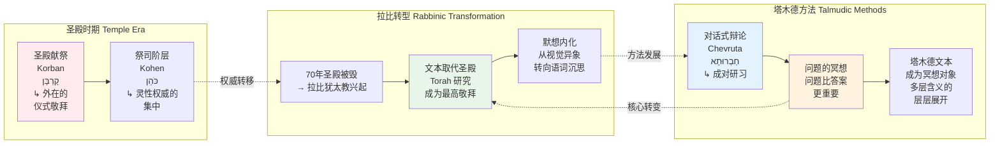
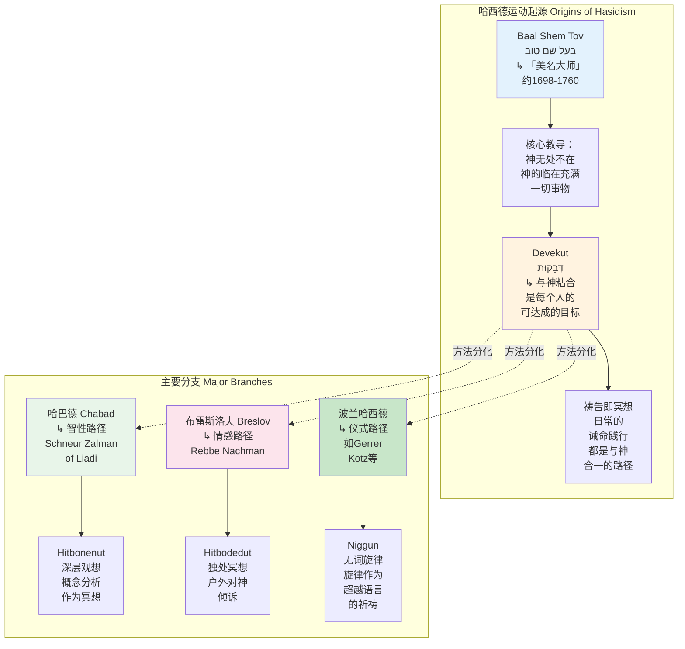
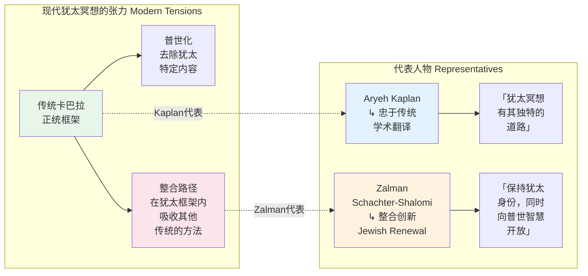
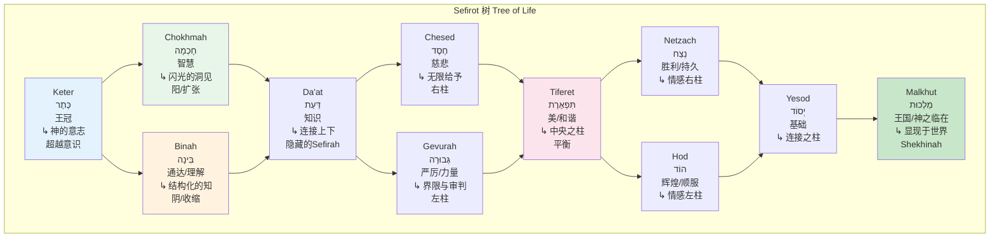
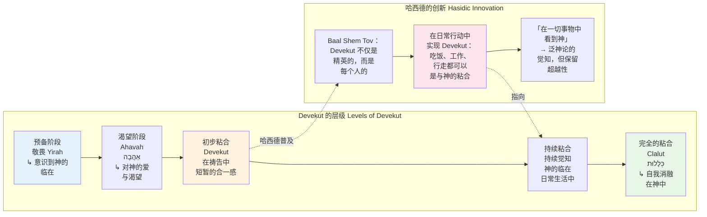
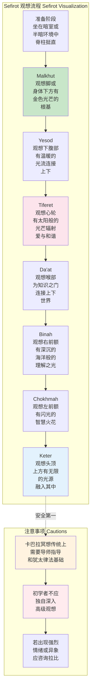
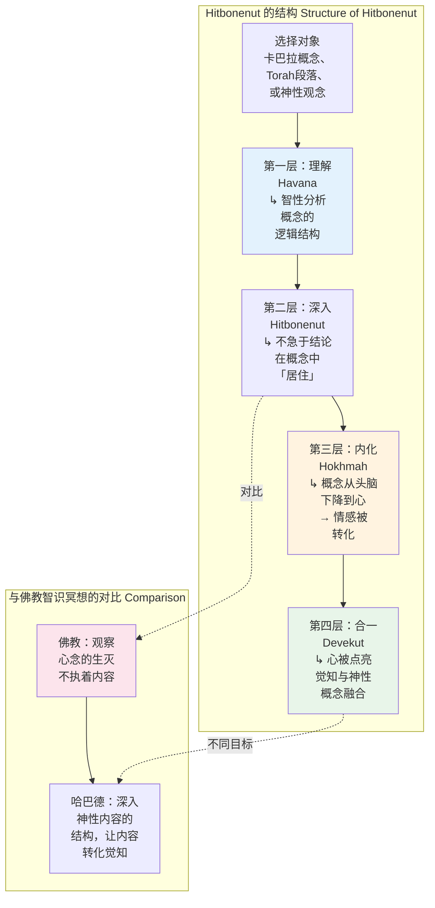
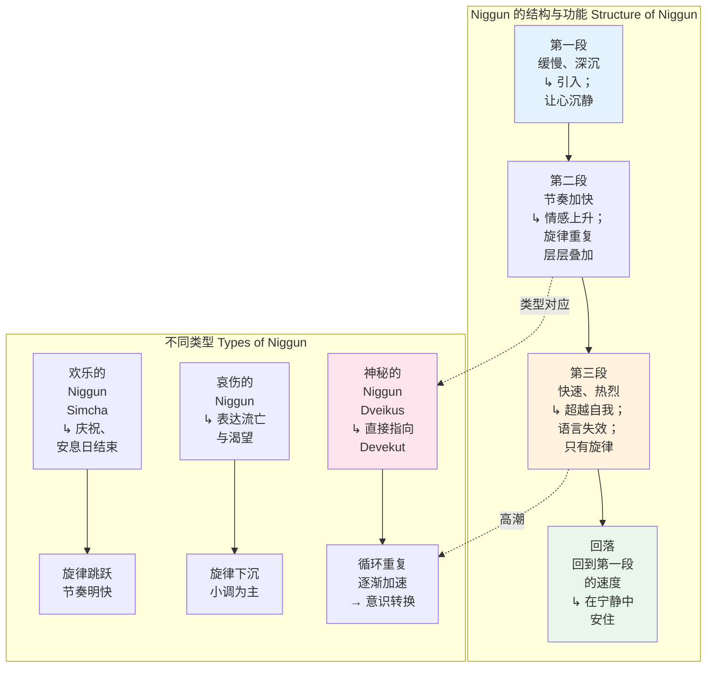
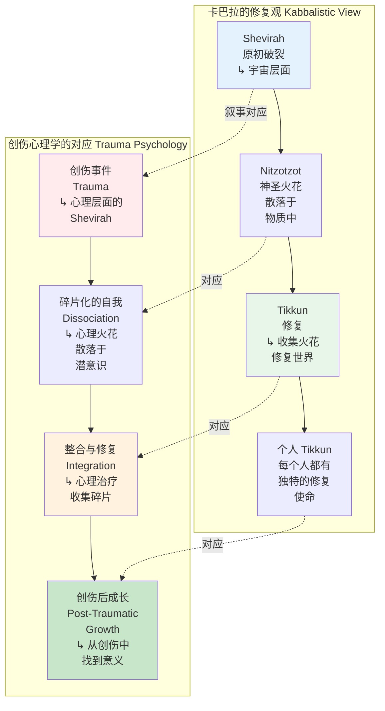
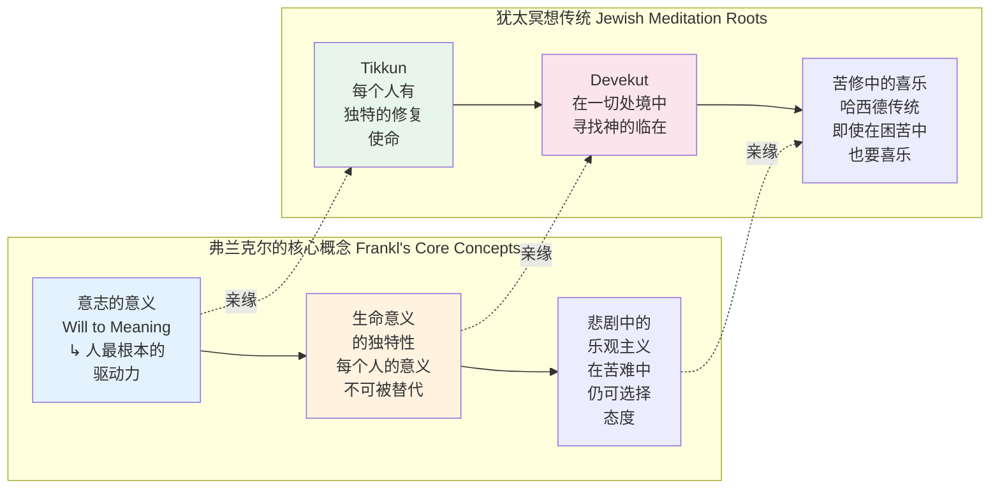

---

title: "犹太教冥想专业概述：从圣经默想到卡巴拉神视"
description: "犹太教冥想专业概述：从圣经默想到卡巴拉神视的详细解析与实践指南"
category: "心智与心理学 > 冥想 > Jewish Meditation"
tags: ["brain", "cbt"]
last_updated: "2026-05"
difficulty: "advanced"
reading_level: "advanced"
estimated_read_time: "15min"
intent_queries:
  - "什么是犹太教冥想专业概述：从圣经默想到卡巴拉神视"
  - "犹太教冥想专业概述：从圣经默想到卡巴拉神视的核心概念"
  - "犹太教冥想专业概述：从圣经默想到卡巴拉神视的方法与实践"
trigger_keywords: ["behavioral", "body", "brain", "breathwork"]
cross_refs:
  - path: "01-Wisdom-Traditions/INDEX.md"
    relation: "buddhism/exercise/meditation"
  - path: "01-Wisdom-Traditions/religions/buddhism/meditation/Buddhism_Meditation_Practice_System.md"
    relation: "buddhism/exercise/meditation"
  - path: "01-Wisdom-Traditions/religions/buddhism/modern-applications/Digital_Mindfulness_AI_Mental_Health.md"
    relation: "buddhism/exercise/meditation"
  - path: "01-Wisdom-Traditions/religions/tibetan-buddhism/Tibetan_Singing_Bowl.md"
    relation: "buddhism/exercise/meditation"
  - path: "01-Wisdom-Traditions/religions/wisdom-traditions/Wisdom_Buddhism_Healing_Psychology.md"
    relation: "buddhism/exercise/meditation"

---
# 犹太教冥想专业概述：从圣经默想到卡巴拉神视

> **适用对象**：对犹太灵修传统感兴趣的冥想练习者、宗教学研究者、跨传统灵修探索者、心理健康从业者
> **阅读时长**：约 50–60 分钟（可分段阅读）
> **实践建议**：配合正文中的阶段性练习，分 4–6 次完成，每次 15–20 分钟
> **最后更新**：2026-05

---

## 一、历史脉络：从预言异象到现代冥想运动

### 1.1 圣经时代：预言、异象与「认识」之神学

犹太冥想的根基深植于希伯来圣经（Tanakh, תַּנַ״ךְ）。与东方冥想传统追求「空」或「定」不同，圣经时代的灵性经验核心在于**与神的相遇**——一种关系性的、历史性的、对话性的觉知。

```mermaid
graph TD
    subgraph 圣经时代的灵性经验 Biblical Era Spirituality
        B1[预言 Nevuah<br/>נְבוּאָה<br/>↳ 神的言语<br/>临到人] --> B2[异象 Mar'ah<br/>מַרְאָה<br/>↳ 神的显现<br/>在视觉中]<br/>如以赛亚<br/>圣殿异象
        B2 --> B3[聆听 Shema<br/>שְׁמַע<br/>↳ 「以色列啊<br/>你要听」]<br/>申命记6:4
        B3 --> B4[默想 Hagah<br/>הָגָה<br/>↳ 如母牛反刍<br/>反复诵念<br/>神的话语]
    end

    subgraph 关键文本 Key Texts
        T1[《诗篇》1:2<br/>「惟喜爱耶和华的律法，<br/>昼夜思想Hagah」] --> T2[《约书亚记》1:8<br/>「这律法书...<br/>不可离开你的口，<br/>总要昼夜思想Hagah」]
        T2 --> T3[《以西结书》1<br/>「天上的宝座异象」<br/>→ 卡巴拉Sefirot<br/>观想的重要来源]
    end

    B4 -.->|文本依据| T1
    B2 -.->|直接影响| T3

    style B1 fill:#e3f2fd
    style B3 fill:#fff3e0
    style B4 fill:#e8f5e9
    style T3 fill:#fce4ec
```

**Hagah（הָגָה）：圣经默想的原型**

Hagah 的字面意思是「低鸣」、「喃喃自语」，如母牛反刍般反复咀嚼。在圣经语境中，它意味着将神的话语内化为身体的节律——不是智性分析，而是**让整个存在沉浸在神圣文本中**。

| 维度 | 圣经默想 Hagah | 对比：东方禅定 |
|------|---------------|-------------|
| **核心目标** | 与神建立关系；顺服神的旨意 | 超越自我；证悟实相 |
| **方法** | 反复诵念、记忆、内化 Torah | 观照呼吸/念头；参话头 |
| **身体性** | 伴随动作（佩戴 Tefillin、Tzitzit） | 坐姿为主，身体视为障碍或工具 |
| **社群性** | 强烈的集体维度（会堂、节日） | 多为个人或僧团修习 |
| **历史意识** | 深入嵌套于犹太民族历史 | 超越历史，关注当下/永恒 |

### 1.2 塔木德时期：从圣殿到书房的默想转型

公元 70 年第二圣殿被毁，犹太教经历了根本性的转型——从以圣殿献祭为中心的敬拜，转向以**文本研习（Talmud Torah, תַּלְמוּד תּוֹרָה）**为核心的灵修。书房（Beit Midrash, בֵּית מִדְרָשׁ）成为新的圣所。



**Chevruta（חַבְרוּתָא）——对话作为冥想**

Chevruta 是一种两人结对研习塔木德的方法，其深层结构本身就是一种冥想：

- **外部对话**：两人就一段文本展开辩论，互相挑战假设
- **内部对话**：每个人在与搭档的对话中，被迫审视自己的思维过程
- **文本对话**：文本本身被视为活的对话伙伴，有着多层含义（Pardes, פַּרְדֵּס：字面义、暗示义、寓言义、神秘义）

### 1.3 中世纪：卡巴拉（Kabbalah, קַבָּלָה）的神秘主义兴起

12–13 世纪，卡巴拉在普罗旺斯和西班牙兴起，标志着犹太冥想从「语词默想」向「神视观想」的深化。卡巴拉提供了一套精细的**神圣结构地图**，使冥想者可以在内在视觉中「旅行」。

| 时期 | 地区 | 代表经典/人物 | 核心发展 |
|------|------|-------------|---------|
| **12 世纪** | 普罗旺斯 | 《光明之书》*Bahir* | 最早系统阐述 Sefirot 体系；将神的光明分为十个层级 |
| **13 世纪** | 西班牙 | 《光辉之书》*Zohar* | 伪托西门· bar Yochai；卡巴拉文学的巅峰；神话式语言描述神性过程 |
| **16 世纪** | 萨法德（Safed） | 艾萨克·卢里亚 Isaac Luria | 提出 Tzimtzum、Shevirat Ha-Kelim、Tikkun 等核心理论；深刻重塑卡巴拉 |
| **16 世纪** | 萨法德 | 摩西·科尔多维罗 Moses Cordovero | 系统整合卡巴拉思想；《石榴园》*Pardes Rimmonim* |
| **18–19 世纪** | 东欧 | 哈西德运动 Hasidism | 将卡巴拉从精英学问转化为大众灵修；强调 Devekut 与喜乐 |

**《光辉之书》（Zohar, זֹהַר）的冥想维度**：

Zohar 不仅是哲学文本，更是一部**冥想指南**。其华丽的象征语言——神的光明、神圣配偶（Tiferet 与 Malkhut）、果园的神秘意象——旨在诱导一种**改变的意识状态**。传统上，卡巴拉学者在安息日（Shabbat）前夕研习 Zohar，认为此时「灵魂之门」更为敞开。

### 1.4 哈西德运动（Hasidism, חֲסִידוּת）：卡巴拉的大众化

18 世纪，东欧的哈西德运动由**以色列·巴·闪·托夫**（Israel Baal Shem Tov, 约 1698–1760）创立，将原本属于精英的卡巴拉冥想带入了普通犹太人的生活。



**哈西德对犹太冥想的革命性贡献**：

- **民主化**：卡巴拉不再只是学者的专利，而是「伐木人和挑水人」都可以实践的灵修
- **喜乐优先**：与之前的苦行传统不同，哈西德强调在**喜乐（Simcha, שִׂמְחָה）**中侍奉神——抑郁被视为灵性障碍
- **祷告作为最高冥想**：将日常的祷告（Tefillah, תְּפִלָּה）提升为卡巴拉冥想的核心载体，而非仅仅是仪式义务

### 1.5 现代犹太冥想运动：Aryeh Kaplan 与 Rabbi Zalman Schachter-Shalomi

20 世纪中后期，犹太冥想经历了一次现代复兴，两位人物尤为关键：

| 人物 | 年代 | 核心贡献 |
|-----|------|---------|
| **Aryeh Kaplan** | 1934–1983 | 物理学家背景的拉比；将卡巴拉和犹太冥想系统介绍给英语世界；《犹太冥想》（*Jewish Meditation*）是现代犹太冥想最重要的入门书；翻译并注释了《光明之书》等经典 |
| **Rabbi Zalman Schachter-Shalomi** | 1924–2014 | 哈巴德出身的拉比，后成为「犹太更新运动」（Jewish Renewal）的精神领袖；将犹太冥想与佛教正念、荣格心理学、生态灵性整合；创立 Aleph 联盟 |
| **Rabbi Jonathan Omer-Man** | 当代 | 在洛杉矶创立 Metivta，推动犹太冥想与心理治疗的对话 |
| **Sylvia Boorstein** | 当代 | 犹太裔佛教正念教师，在 Spirit Rock 促进两个传统的对话 |



---

## 二、核心理论框架

### 2.1 Ein Sof（אֵין סוֹף）：无限者

Ein Sof 是卡巴拉对神的最根本表述，字面意思是「无限」或「没有尽头」。它超越了所有名称、属性、概念和形象——甚至超越了「存在」本身。

| 层面 | Ein Sof | Sefirot（神的显现） |
|------|---------|-------------------|
| **可知性** | 绝对不可知；无法被思维、语言或经验触及 | 可知；是神向受造物显现的「面容」 |
| **关系性** | 无关系；在 Ein Sof 层面，没有「创造」或「受造」 | 有关系；是神与世界的互动界面 |
| **冥想指向** | 不可直接冥想；只能通过「否定之道」接近 | 可直接观想；Sefirot 是冥想的核心对象 |
| **文本比喻** | 「没有言语能描述你」（*Zohar*） | 「以色列啊，你要听，耶和华我们的神是独一的主」（*Shema*） |

**Ein Sof 的冥想意义**：

卡巴拉冥想中有一个根本的张力——冥想者试图与不可知的 Ein Sof 连接，但只能通过可知的 Sefirot 作为媒介。这就像通过窗户看太阳：你看到的是阳光，但太阳本身远超你的直接感知。因此，**Sefirot 观想不是偶像崇拜，而是「通过面纱看真容」**。

### 2.2 Sefirot（סְפִירוֹת）：十质点——神圣属性的地图

Sefirot 是卡巴拉最核心的理论构造，描述了神从无限到有限、从隐藏到显现的十个「发光层面」。它们既是神的属性，也是冥想中观想的对象，更是理解宇宙结构的钥匙。



**三柱结构**：

| 柱 | Sefirot | 性质 | 冥想指向 |
|---|---------|------|---------|
| **右柱（慈悲之柱）** | Chokhmah → Chesed → Netzach | 扩张、给予、阳性 | 开放、接纳、无条件的爱 |
| **左柱（严厉之柱）** | Binah → Gevurah → Hod | 收缩、界限、审判、阴性 | 辨别、放下、内在的纪律 |
| **中柱（平衡之柱）** | Keter → Da'at → Tiferet → Yesod → Malkhut | 和谐、连接、整合 | 安住于中心；在呼吸中找到中道 |

### 2.3 Tzimtzum（צִמְצוּם）：收缩——创造的空间

16 世纪萨法德的艾萨克·卢里亚（Isaac Luria, האֲרִ"י）提出了卡巴拉历史上最具原创性的理论之一：**Tzimtzum**——神的自我收缩，以创造出让「他者」（即世界和受造物）存在的空间。

> 「在创造之前，Ein Sof 的光明充满一切。神收缩了自己，在一个中心点中留下了「空」——在这个空中，世界被创造出来。」
> ——卢里亚传统

**Tzimtzum 的冥想意涵**：

| 层面 | 理解 | 冥想应用 |
|------|------|---------|
| **宇宙论** | 神为了创造世界而自我限制 | 意识到「我」的存在是神「让出空间」的结果——这是一种深刻的谦卑 |
| **心理学** | 神的收缩是「 withdraw 」以允许自由意志 | 冥想中觉察：我的每一个选择都是在神创造的空间中发生的 |
| **伦理学** | 神为了他者而自我限制；人也应如此 | Tzimtzum 成为「谦卑」和「为他人留出空间」的灵性模型 |
| **修复论** | Shevirah（容器破裂）→ Tikkun（修复） | 冥想不仅是个人平静，更是参与宇宙的修复 |

### 2.4 Shekhinah（שְׁכִינָה）：神之临在

Shekhinah 是卡巴拉中最温暖、最亲近的概念——它代表神的「居所」或「临在」，尤其与**神在世界中的显现**相关。在卢里亚卡巴拉中，Shekhinah 与第十个 Sefirah Malkhut 同一。

**Shekhinah 的独特地位**：

- **女性面向**：在卡巴拉象征中，Shekhinah 是神的「女儿」或「新娘」——代表着神与世界（尤其是以色列）的关系性面向
- **流亡与回归**：Shekhinah 与以色列一同流亡；当以色列履行诫命（Mitzvot）时，Shekhinah 得到「提升」和「团聚」
- **安息日的特殊临在**：犹太传统认为，Shekhinah 在每周的安息日（Shabbat）比其他时间更加临在

### 2.5 Devekut（דְּבֵקוּת）：与神粘合

Devekut 是犹太冥想的核心目标——字面意思是「粘合」、「紧贴」。它描述了一种意识状态，在其中个体与神之间的一切分离感消融，只剩下一种亲密的连接。



### 2.6 Tikkun（תִּקּוּן）：修复——冥想的宇宙论目的

卢里亚卡巴拉提出了一个壮丽的宇宙叙事：**原始的光明容器（Kelim）因无法容纳神的光而破裂（Shevirat Ha-Kelim），神圣火花（Nitzotzot）散落于物质世界中。人的使命是通过伦理行动和灵性修习，收集这些火花，修复宇宙——这就是 Tikkun。**

| 概念 | 希伯来文 | 含义 | 冥想意义 |
|-----|---------|------|---------|
| **Shevirah** | שְׁבִירָה | 破裂；原初容器的破碎 | 世界本质上的不完整；苦难的根源 |
| **Nitzotzot** | נִיצוֹצוֹת | 神圣火花；散落于物质中 | 每一个物体、每一个人中都隐藏着神圣火花 |
| **Tikkun** | תִּקּוּן | 修复；宇宙的修复工程 | 冥想不仅是为个人平静，更是为宇宙的修复贡献力量 |
| **Tikkun Olam** | תִּקּוּן עוֹלָם | 修复世界；社会正义行动 | 冥想与伦理行动不可分割 |

---

## 三、主要修习体系

### 3.1 卡巴拉冥想（Kabbalah Meditation）：Sefirot 观想

卡巴拉冥想的核心技术是在内在视觉中「旅行」Sefirot 树——从 Malkhut（地球/身体）向上攀升至 Keter（神圣意志），或从 Keter 向下「下载」光明。



**字母冥想 Otiyot（אוֹתִיּוֹת）**：

希伯来字母不仅是书写符号，在卡巴拉中被视为「**创造的工具**」——神通过说出希伯来字母创造了世界。字母冥想包括：

- **视觉化字母**：在内在视觉中观想一个希伯来字母（如 א Aleph 或 ש Shin），使其发光、旋转、扩大
- **发音冥想**：延长地唱诵一个字母的声音（如「Aaaaa」或「Shhhhh」），让声音的振动成为冥想的对象
- **字母组合**：将神圣名称（如 YHVH）的字母在视觉中组合，观想其光明

**Shefa（שֶׁפַע）能量流动**：

Shefa 意为「涌流」或「丰盛」，在卡巴拉中指的是从 Ein Sof 经由 Sefirot 流向世界的神圣能量。冥想中，练习者观想这种能量从头顶（Keter）向下流经身体，带来祝福、治愈和灵性觉醒。

### 3.2 Hitbonenut（הִתְבּוֹנְנוּת）：深层观想——智性冥想

Hitbonenut 是哈巴德（Chabad）哈西德传统的核心修习方法，由**施奈尔·扎尔曼**（Schneur Zalman of Liadi, 1745–1812）在《拉比的智慧》（*Tanya*）中系统阐述。



**Hitbonenut 的详细步骤**：

1. **选择主题**：例如「Tzimtzum——神的自我收缩以创造空间」
2. **逻辑分析**：思考这个概念的各个维度——宇宙论、心理学、伦理学
3. **反复咀嚼**：如母牛反刍般，不急于得出结论，让概念在意识中「停留」
4. **从智到心**：当概念足够深入时，它会自然触发情感反应——敬畏、爱、谦卑
5. **情感上升为合一**：在情感的顶峰，思维停止，只剩下一种与神性观念的「共振」

### 3.3 Hitbodedut（הִתְבּוֹדְדוּת）：独处冥想——布雷斯洛夫传统

Hitbodedut 由**布雷斯洛夫的纳赫曼**（Rebbe Nachman of Breslov, 1772–1810）发展，是一种极为独特的冥想形式——**在独处中（通常在户外）对神进行自发性的倾诉**。

| 维度 | Hitbodedut | 对比：传统祷告 |
|------|-----------|-------------|
| **场所** | 独处； preferably 自然中（田野、森林） | 会堂或家中；集体或个人 |
| **语言** | 自发性的、口语化的、甚至「胡言乱语」 | 固定的祷告文（Siddur） |
| **结构** | 无结构；像与挚友对话 | 高度结构化的祷告时间和文本 |
| **情感** | 鼓励释放一切情感——愤怒、悲伤、渴望、困惑 | 传统上更庄重、克制 |
| **目标** | 与神建立个人化的、真诚的关系 | 履行诫命；集体敬拜 |

**Hitbodedut 的实践指引**：

1. **寻找独处空间**： ideally 在自然中（Nachman 强调田野和森林）；城市中也找一个安静的角落
2. **设定时间**：Nachman 建议每天至少一小时，但可以从 15–20 分钟开始
3. **开口说话**：大声或低语，用你自己的语言——不是希伯来文的正式祷告，而是你的母语
4. **谈论一切**：你的挣扎、恐惧、愤怒、欲望、感恩、困惑——没有任何话题是禁忌
5. **倾听**：在倾诉之后，保持静默，尝试「听」——不是用耳朵，而是用心灵
6. **重复**：每天在同一时间进行，让这种对话成为习惯

> 「即使你不知道该说什么，也要开口。神会帮助你找到词语。」——Rebbe Nachman

### 3.4 Niggun（נִיגּוּן）：无词旋律冥想

Niggun 是哈西德传统中最具特色的冥想形式——**没有歌词的旋律**，通过纯粹的音声和旋律来超越语言的限制，达到与神的直接连接。



**Niggun 的冥想效应**：

- **超越语言**：旋律绕过智性分析，直接触动情感和灵性层面
- **集体共振**：集体唱诵 Niggun 时，声音的身体共振创造了一种「一体感」
- **意识转换**：快速的、重复的旋律可以诱导一种类似于轻度出神的状态
- **情感释放**：Niggun 允许释放那些无法用语言表达的情感——哀伤的 Niggun 被称为「灵魂的眼泪」

### 3.5 Tefillin（תְּפִלִּין）与 Tzitzit（צִיצִית）冥想：仪式物件的专注

犹太教中许多日常仪式物件都可以成为冥想的焦点。这不是「偶像崇拜」，而是将物理对象作为**觉知的锚点**。

| 物件 | 描述 | 冥想维度 |
|-----|------|---------|
| **Tefillin** | 经文匣； weekday 晨祷时绑在手臂和额头上 | 绑手时观想将「心的欲望」献给神；绑头时观想将「思想」献给神；匣内的经文是四个段落，提醒神与以色列的契约 |
| **Tzitzit** | 四角的繸子；附在 Tallit（祷告披巾）或日常内衣上 | 看到 Tzitzit 时，是一个「正念铃」——提醒自己「我是被命令的，我是自由的」；数字 613（繸子的打结方式）对应 613 条诫命 |
| **Mezuzah** | 门柱上的经文卷 | 经过门时触碰并亲吻 Mezuzah，是一个短暂的冥想时刻——提醒自己「神在我的出入中与我同在」 |
| **Shabbat 蜡烛** | 安息日点燃的蜡烛 | 凝视烛光，观想「额外灵魂」（Neshama Yetera）在安息日降临；火焰的上升象征灵魂的升华 |

---

## 四、与现代心理学的交汇

### 4.1 创伤与 Tikkun：修复叙事的临床对应

卢里亚卡巴拉的 Tikkun 理论——世界因原初的破裂而不完整，人的使命是修复——与现代创伤心理学有着深刻的共鸣。



**临床启示**：

- **意义建构**：Tikkun 为创伤幸存者提供了一个超越个人苦难的意义框架——「我的痛苦可以成为修复的一部分」
- **能动性恢复**：创伤常常导致无助感；Tikkun 强调每个人都有独特的修复能力，这可以恢复幸存者的能动性
- **代际维度**：犹太传统中的 Tikkun 可以是代际的——为祖先的创伤进行修复；这与代际创伤（Intergenerational Trauma）研究有对话空间

### 4.2 Chabad 认知模型与 CBT 的相似性

哈巴德的《拉比的智慧》（*Tanya*）包含了一套极为精细的**认知-情感模型**，与现代认知行为疗法（CBT）有着惊人的平行。

| 维度 | Chabad 模型（*Tanya*） | CBT 模型 |
|------|---------------------|---------|
| **认知结构** | 两个灵魂：动物灵魂（Nefesh HaBehamit）与神圣灵魂（Nefesh HaElokit） | 核心信念（Core Beliefs）与自动化思维（Automatic Thoughts） |
| **认知扭曲** | 动物灵魂的「 garments 」——错误思想、不当言语、不良行为 | 认知扭曲（Cognitive Distortions）——全或无思维、灾难化等 |
| **干预方法** | Hitbonenut——深入分析概念，让神圣灵魂的光明照亮认知 | 认知重构（Cognitive Restructuring）——识别并挑战非理性信念 |
| **情感转化** | 从头脑（Moach）到心（Lev）——智性理解下降到情感 | 认知干预导致情感和行为变化 |
| **目标** | 使神圣灵魂主导意识；Devekut | 功能改善；减少症状；提升生活质量 |

**关键差异**：Chabad 模型的最终目标不是「功能改善」，而是**与神的合一（Devekut）**。但这并不妨碍两个模型在临床层面的对话和互补。

### 4.3 意义疗法（Logotherapy）与犹太冥想的亲缘

维克多·弗兰克尔（Viktor Frankl, 1905–1997）的意义疗法直接植根于他的犹太背景——他在纳粹集中营中发展出这一理论，而其核心概念与犹太冥想传统有着深刻的亲缘。



---

## 五、实践指引

### 5.1 入门路径

```mermaid
graph TD
    subgraph 第一阶段：基础 Foundation
        F1[了解基础<br/>犹太律法与<br/>传统习俗] --> F2[每日祷告<br/>Shacharit<br/>晨祷]<br/>即使只是<br/>部分章节
        F2 --> F3[Shema 诵念<br/>早晨和<br/>睡前]<br/>「以色列啊<br/>你要听」
    end

    subgraph 第二阶段：深化 Deepening
        D1[引入 Hitbodedut<br/>每日15分钟<br/>独处倾诉] --> D2[学习基础<br/>卡巴拉概念<br/>如 Sefirot]
        D2 --> D3[尝试 Shabbat<br/>冥想体验<br/>安息日的<br/>特殊临在]
    end

    subgraph 第三阶段：整合 Integration
        I1[选择一条<br/>具体路径：<br/>Chabad /<br/>Breslov /<br/>其他] --> I2[寻找导师<br/>或社群<br/>Chevruta]
        I2 --> I3[将冥想融入<br/>日常生活<br/>的每一个<br/>行动中]
    end

    F3 -->|4-8周| D1
    D3 -->|6-12月| I1

    style F1 fill:#e3f2fd
    style F3 fill:#fff3e0
    style D1 fill:#e8f5e9
    style I1 fill:#fce4ec
```

### 5.2 需要的犹太知识基础

| 层级 | 知识内容 | 必要性 |
|------|---------|--------|
| **基础** | 希伯来字母、基本祷告（Shema、Amidah）、安息日基本规则 | 必需——没有这些，犹太冥想会失去其语境 |
| **中级** | Torah 叙事、主要节日（Rosh Hashanah、Yom Kippur、Pesach）的灵修维度 | 强烈建议——这些节日是犹太冥想的「强化训练营」 |
| **高级** | 卡巴拉基本概念（Sefirot、Tzimtzum）、Hasidut 经典文本（*Tanya*、*Likutey Moharan*） | 进阶所需——应在导师指导下学习 |

### 5.3 与拉比的关系

在传统犹太框架中，**导师（Rav 或 Rebbe）**是灵性成长不可或缺的。这与佛教中「上师」的角色类似，但也有独特之处：

- **Halakhic 权威**：拉比不仅是灵性导师，也是犹太律法（Halakha）的裁决者——冥想不能违背律法
- **个人化指导**：哈西德传统尤其强调「找到你的 Rebbe」——一位与你的灵魂有连接的导师
- **代际传递**：灵性知识通过师徒链（Shalshelet HaKabbalah）传递，强调传统的连续性

**现代语境中的替代方案**：

- 如果没有个人导师，可以寻找**犹太冥想中心**（如 Elat Chayyim、Isabella Freedman 犹太退休中心）
- 在线资源：Chabad.org、Sefaria.org 提供大量文本和学习材料
- **Chevruta 伙伴**：即使没有拉比，一个认真的学习伙伴也能提供必要的框架和问责

### 5.4 安息日冥想的特殊性

Shabbat（שַׁבָּת）在犹太传统中不是「休息日」，而是**一个神圣的时间容器**——一个「时间中的圣殿」。安息日的冥想有着独特的品质和规则。

| 维度 | 平日 | 安息日 |
|------|------|--------|
| **氛围** | 工作、创造、改变世界的能量 | 安息（Menuchah）；接受而非改变；喜乐与和平 |
| **冥想方式** | Hitbodedut、Sefirot 观想、Niggun | Torah 研习、Shabbat 祷告的深化、与家人的连接 |
| **限制** | 无特别限制 | 不书写、不使用电子设备、不从事创造性劳动——这些限制创造了一个「冥想容器」 |
| **特殊冥想** | — | Lecha Dodi（欢迎新娘）；Mussaf 祷告中的「额外灵魂」（Neshama Yetera）观想 |
| **退出** | 可能较为匆忙 | Havdalah（分离仪式）——有意识地从神圣时间回到日常时间 |

**安息日冥想实践**：

1. **周五傍晚**：点燃 Shabbat 蜡烛时，做一个简短的冥想——观想「额外灵魂」降临，用一块白布覆盖眼睛，感受光明从黑暗中诞生
2. **周五晚餐**：在 Kiddush（祝福酒）和 Challah（安息日面包）时，完全专注于这些仪式动作——它们是「吃」的冥想
3. **周六早晨**：在会堂的祷告中，不要急于「完成」，而是让 Torah 诵读和 Haftarah 成为你的冥想对象
4. **Shabbat 下午**：这是「哈西德时间」——研习哈西德故事、唱 Niggun、在公园散步中练习 Devekut
5. **Havdalah**：当安息日结束时，有意识地感受「分离」——闻一闻香料，让香气伴随你进入新的一周

---

## 六、主要修习方法对比表

### 6.1 核心修习方法综合对比

| 方法 | 希伯来文 | 核心动作 | 声音参与 | 身体参与 | 社群/个人 | 适合阶段 | 主要效果 |
|-----|---------|---------|---------|---------|----------|---------|---------|
| **Sefirot 观想** | סְפִירוֹת | 内在视觉旅行 Sefirot 树 | 否 | 坐姿 | 个人 | 中高级 | 意识扩展、神圣结构地图、能量感知 |
| **字母冥想 Otiyot** | אוֹתִיּוֹת | 观想/唱诵希伯来字母 | 是 | 坐姿 | 个人 | 中级 | 声音振动冥想、创造性意识激发 |
| **Hitbonenut** | הִתְבּוֹנְנוּת | 深入分析卡巴拉概念 | 否 | 坐姿 | 个人/ Chevruta | 中级 | 智性深化、概念内化、情感转化 |
| **Hitbodedut** | הִתְבּוֹדְדוּת | 独处中对神倾诉 | 是（自发语言） | 步行或坐姿 | 个人 | 所有阶段 | 情感释放、关系性连接、自我探索 |
| **Niggun** | נִיגּוּן | 唱诵无词旋律 | 是 | 轻度摇摆 | 集体/个人 | 所有阶段 | 情感升华、集体共振、超越语言 |
| **Tefillin 冥想** | תְּפִלִּין | 绑定经文匣时的专注 | 否 | 仪式动作 | 个人 | 入门 | 身体觉知、诫命的内化、日常正念 |
| **Shema 专注** | שְׁמַע | 反复诵念 Shema | 是 | 睡前/醒后 | 个人 | 入门 | 每日锚点、信仰声明、意识聚焦 |
| **Shabbat 冥想** | שַׁבָּת | 在神圣时间中的全面觉知 | 是（祷告/歌唱） | 仪式、饮食、行走 | 家庭/社群 | 所有阶段 | 时间意识转化、关系深化、喜乐 |

### 6.2 不同传统时期的对比

| 时期 | 核心冥想形式 | 代表性人物/文本 | 社群性 | 精英/大众 | 与律法的关系 |
|------|------------|----------------|--------|----------|------------|
| **圣经时代** | Hagah（低鸣默想）、预言异象 | 诗篇、先知书 | 高（圣殿敬拜） | 精英（先知、祭司） | 紧密 |
| **塔木德时期** | Chevruta 对话、文本辩论 | 《塔木德》、卡西安神学 | 极高（成对研习） | 学者为主 | 核心 |
| **中世纪卡巴拉** | Sefirot 观想、字母冥想 | *Zohar*、*Bahir* | 中（秘密社团） | 精英 | 交织 |
| **卢里亚卡巴拉** | Tzimtzum 冥想、Tikkun 实践 | Luria 及其弟子 | 中（萨法德圈子） | 精英 | 交织 |
| **哈西德运动** | Devekut、Niggun、Hitbodedut | Baal Shem Tov、*Tanya*、Rebbe Nachman | 高（Hasidic 社群） | 大众 | 紧密 |
| **现代运动** | 整合式冥想、正念+犹太框架 | Aryeh Kaplan、Zalman Schachter-Shalomi | 中（跨社群） | 广泛 | 从紧密到松散 |

---

## 七、常见挑战与应对

| 挑战 | 原因 | 应对 |
|-----|------|------|
| **语言障碍** | 希伯来文/阿拉姆文是核心文本语言 | 从英文/中文译本开始；逐渐学习关键术语；使用 Sefaria 的双语功能 |
| **律法要求的复杂性** | 犹太冥想嵌套于 Halakha 框架 | 从基本的 Shabbat 和 Kosher 开始；寻找「犹太更新」或「保守派」社群作为入门 |
| **找不到导师** | 犹太导师关系传统上要求长期承诺 | 参加犹太冥想 retreat（如 Elat Chayyim）；在线寻找资源；从 Chevruta 开始 |
| **卡巴拉的高门槛** | 传统上要求 40 岁、已婚、精通 Torah | 现代有许多入门资源（Aryeh Kaplan 的书）；尊重传统但也允许现代适应 |
| **与原生宗教/文化冲突** | 犹太冥想有时被视为「仅限犹太人」 | 许多犹太冥想教师欢迎非犹太人学习；区分「文化」和「方法」；尊重边界 |
| **情绪泛滥** | Hitbodedut 等练习可能触发被压抑的情感 | 放慢节奏；结合心理治疗；在安全的框架内进行 |

---

## 八、延伸阅读与参考

### 经典犹太冥想文本

- **《光辉之书》** *Zohar* — 卡巴拉文学的巅峰；推荐 Daniel Matt 的英文译本（*The Zohar: Pritzker Edition*）
- **《拉比的智慧》** *Tanya* — Schneur Zalman of Liadi；哈巴德哈西德的奠基文本
- **《布雷斯洛夫的教诲》** *Likutey Moharan* — Rebbe Nachman of Breslov
- **《犹太冥想》** *Jewish Meditation* — Aryeh Kaplan；现代犹太冥想最重要的入门书
- **《光明之书》** *Sefer HaBahir* — 最早系统阐述 Sefirot 的文本
- **《石榴园》** *Pardes Rimmonim* — Moses Cordovero；卡巴拉术语系统词典

### 现代学术与研究

- Kaplan, Aryeh. *Meditation and Kabbalah* — 卡巴拉冥想的历史和方法系统介绍
- Kaplan, Aryeh. *Meditation and the Bible* — 圣经时代冥想实践的研究
- Idel, Moshe. *Kabbalah: New Perspectives* — 卡巴拉学术研究的里程碑
- Jacobs, Louis. *Jewish Mystical Testimonies* — 犹太神秘主义者的第一人称叙述
- Wolfson, Elliot. *Through a Speculum That Shines* — 卡巴拉视觉文化的深度学术分析

### 跨宗教对话

- Green, Arthur. *Your Word Is Fire: The Hasidic Masters on Contemplative Prayer* — 哈西德祷告与冥想的选集
- Schachter-Shalomi, Zalman. *Paradigm Shift* — 犹太更新运动的宣言
- Matt, Daniel. *The Essential Kabbalah* — 适合跨宗教读者的卡巴拉入门
- Boorstein, Sylvia. *That's Funny, You Don't Look Buddhist* — 犹太-佛教对话的个人叙述

---

*Peace Lab Database — Jewish Meditation*
