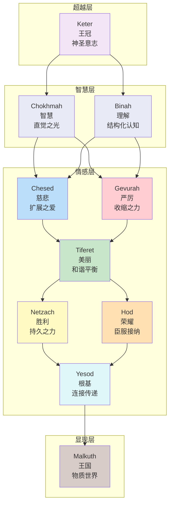
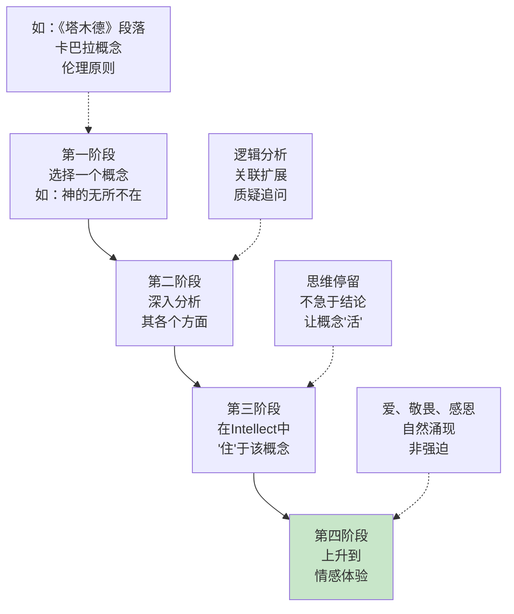
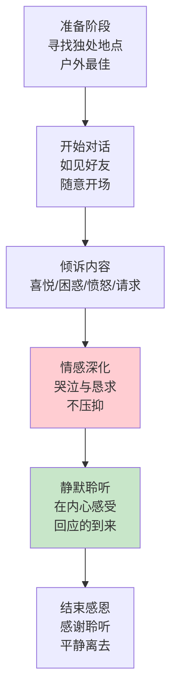
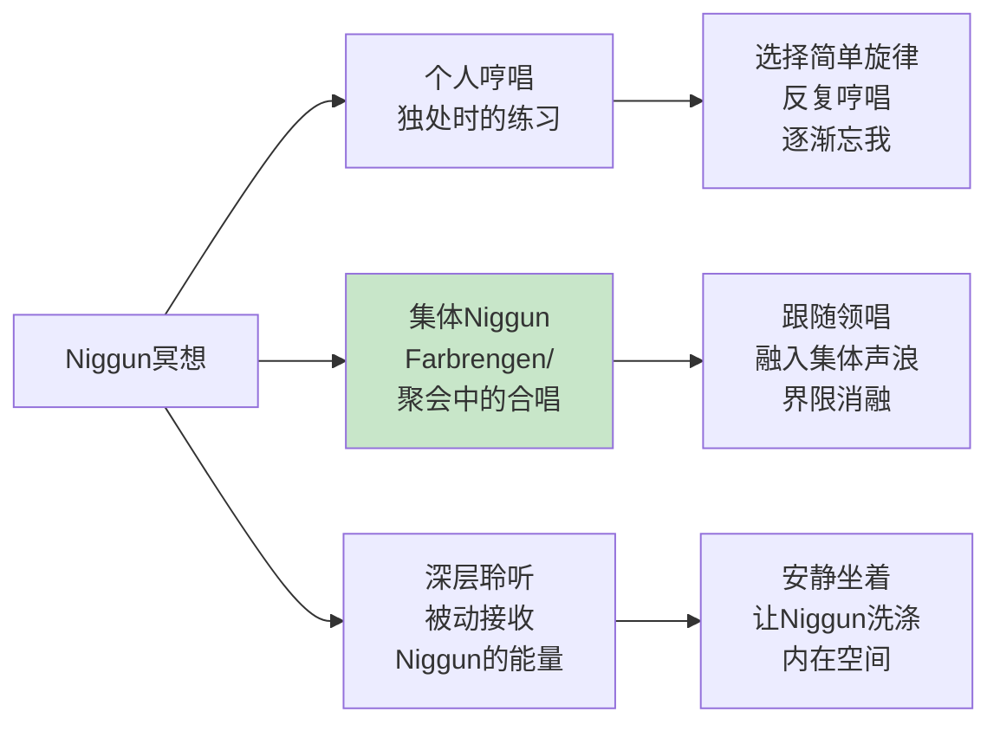
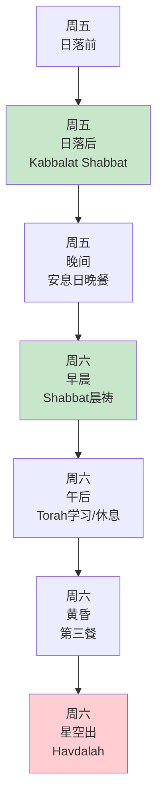

---

title: "犹太冥想实践指南"
description: "犹太冥想实践指南的详细解析与实践指南"
category: "心智与心理学 > 冥想 > Jewish Meditation"
tags: ["brain", "grief", "meditation"]
last_updated: "2026-05"
difficulty: "beginner"
reading_level: "beginner"
estimated_read_time: "10min"
intent_queries:
  - "什么是犹太冥想实践指南"
  - "犹太冥想实践指南的核心概念"
  - "犹太冥想实践指南的方法与实践"
trigger_keywords: ["犹太冥想实践指南", "art", "body", "brain", "breathwork"]
cross_refs:
  - path: "01-Wisdom-Traditions/religions/buddhism/meditation/Buddhism_Meditation_Practice_System.md"
    relation: "depression/emotion/exercise"
  - path: "01-Wisdom-Traditions/yoga/Yoga_Neuroscience_Modern_Research.md"
    relation: "depression/emotion/exercise"
  - path: "03-Bio-Science/biology/cardiovascular/Heart_Rate_Variability.md"
    relation: "death/depression/emotion"
  - path: "03-Bio-Science/biology/exercise-science/INDEX.md"
    relation: "depression/emotion/exercise"
  - path: "03-Bio-Science/biology/lower-back-pain/Lower_Back_Pain_Psychological_Rehabilitation.md"
    relation: "depression/emotion/exercise"

---
# 犹太冥想实践指南

> Hitbonenut、Hitbodedut、Sefirot 与 Niggun——犹太灵性修行的实操手册

**最后更新：2026-05**

---

## 目录

1. [Sefirot冥想：七日循环](#sefirot冥想七日循环)
2. [Hitbonenut Chabad式冥想](#hitbonenut-chabad式冥想)
3. [Hitbodedut Breslov式独白](#hitbodedut-breslov式独白)
4. [Niggun无词旋律冥想](#niggun无词旋律冥想)
5. [安息日冥想仪式](#安息日冥想仪式)
6. [参考资源](#参考资源)

---

## Sefirot冥想：七日循环

Sefirot（质点/神圣属性）是卡巴拉（Kabbalah）宇宙论的核心架构，描述了神性从无到有的十个显现层面。通过逐层观想Sefirot，修行者可以调频自己的意识，与神圣的不同面向共振。

### Sefirot架构概览

### 十个Sefirah详解

| Sefirah | 希伯来名 | 含义 | 对应色彩 | 身体对应 | 冥想焦点 |
|---------|---------|------|---------|---------|---------|
| **Keter** | כתר | 王冠、神圣意志 | 白色/无限光 | 头顶之上 | 超越一切概念的纯粹存在 |
| **Chokhmah** | חכמה | 智慧、直觉 | 银白/灰 | 右脑/太阳穴 | 一闪而过的灵感、创造的火花 |
| **Binah** | בינה | 理解、结构化 | 深蓝/黑 | 左脑/前额 | 深层理解、母性容器 |
| **Chesed** | חסד | 慈悲、无条件之爱 | 白/银 | 右臂 | 扩展、给予、恩典 |
| **Gevurah** | גבורה | 严厉、力量、界限 | 红/金 | 左臂 | 收缩、判断、必要的限制 |
| **Tiferet** | תפארת | 美丽、和谐、真理 | 黄/金/太阳色 | 心脏/胸 | 平衡、合一、基督/人子 |
| **Netzach** | נצח | 胜利、持久、情感 | 绿/粉 | 右腿 | 坚持、希望、情感的耐力 |
| **Hod** | הוד | 荣耀、臣服、接纳 | 橙/棕 | 左腿 | 谦卑、感恩、接受之美 |
| **Yesod** | יסוד | 根基、连接、生殖 | 紫/靛 | 生殖区域 | 传递、管道、盟约 |
| **Malkuth** | מלכות | 王国、物质世界、 Shekhinah | 黄/橄榄/棕 | 脚/全身 | 神圣在物质中的临在 |

### 七日循环修习法

将十个Sefirot分配到一周七天（结合犹太传统的一周节奏），每日专注观想一个Sefirah。

| 日序 | 星期 | Sefirah | 主题 | 观想操作 | 对应Affirmation |
|-----|------|---------|------|---------|----------------|
| 第1日 | 周日 | Keter | 新开始的纯粹意愿 | 观想头顶上方白色光芒，超越任何形状 | "愿我的意志与神圣意志合一" |
| 第2日 | 周一 | Chokhmah + Binah | 智慧与理解 | 观想左右脑被银白与深蓝光照亮 | "愿直觉与理性在我内和谐" |
| 第3日 | 周二 | Chesed + Gevurah | 慈悲与严厉 | 观想右臂白光（给予）、左臂红光（界限） | "愿我的爱有智慧，我的界限有爱" |
| 第4日 | 周三 | Tiferet | 心的平衡 | 观想心脏区域金色太阳般的光芒 | "愿我的心成为真理与美之地" |
| 第5日 | 周四 | Netzach + Hod | 持久与荣耀 | 观想双腿——右腿绿色（坚持）、左腿橙色（臣服） | "愿我坚持善，并谦卑接受结果" |
| 第6日 | 周五 | Yesod | 连接与盟约 | 观想下腹部紫色光，作为上下连接的管道 | "愿我成为神圣与尘世间的纯净管道" |
| 第7日 | 周六 | Malkuth | 神圣临在于物质 | 观想全身被大地色光芒包围，Shekhinah临在 | "愿我在这一刻完全临在，此处即圣地" |

**每日Sefirot冥想流程（30分钟）：**

### 详细观想指南（以Tiferet为例）

**背景：** Tiferet位于Sefirot树的中心，是Chesed（右）与Gevurah（左）的平衡点，对应太阳、心脏、真理与美。

**步骤：**

1. **坐定：** 选择安静之处，面向东方（传统上Tiferet与太阳/东方关联）。
2. **呼吸：** 深呼吸三次，每次呼气时释放紧张。
3. **色彩观想：** 观想心脏区域有一团温暖的金色光芒，如同小太阳。
4. **几何辅助：** 可以观想一个金色的六芒星（David之星）在心脏中旋转，象征上下左右的平衡。
5. **品质融入：** 感受"美"不仅是外在，而是内在的真理与和谐。想一个你生命中真正"美"的时刻——那种美来自真实与良善的结合。
6. **扩展：** 让金色光芒从心脏扩展至全身，再到整个房间，最后想象它覆盖整个地球。
7. **静默安住：** 放下观想，只是安住在Tiferet的品质中。
8. **结束：** 慢慢睁眼，将这份和谐带入日常活动。

---

## Hitbonenut Chabad式冥想

Hitbonenut（התבוננות）是哈巴德（Chabad）哈西迪派的核心冥想方法，强调通过深度智力分析达到与概念的合一，进而上升到情感体验。

### Hitbonenut四阶段

### 完整实操流程（以"神的无所不在"为例）

**总时长：** 45-60分钟

#### 第一阶段：选择概念（5分钟）

选择一个你要深入的概念。初学者建议从以下几个经典主题开始：

| 级别 | 主题 | 来源 |
|-----|------|------|
| 初级 | "神是唯一的，除祂以外别无他神" | 《申命记》6:4 Shema |
| 初级 | "爱邻如己" | 《利未记》19:18 |
| 中级 | "神充满全地" | 《以赛亚书》6:3 |
| 中级 | "耶和华在他面前，是忌邪的神" | 《出埃及记》34:14 |
| 高级 | Tzimtzum（神的自我收缩以创造空间） | 《Etz Chaim》 |
| 高级 | Sefirot中Keter与Malkuth的关系 | 《Zohar》 |

**操作：** 用希伯来语或你的母语，将该概念写在一个小卡片上，放在面前。

#### 第二阶段：深入分析（20-30分钟）

这是Hitbonenut的核心——不是被动阅读，而是主动、深入、多角度的分析。

**分析维度表：**

| 分析维度 | 具体问题 | 以"神无所不在"为例 |
|---------|---------|------------------|
| 定义分析 | 这个概念的确切含义是什么？ | "无所不在"=在空间每一点？还是超越空间概念？ |
| 逻辑推导 | 从已知前提能推出什么？ | 如果神无所不在，那么"远离神"是不可能的？ |
| 对立分析 | 其对立面是什么？ | 如果神不在某处，那意味着什么？ |
| 层级分析 | 这个概念在不同层次如何表现？ | 物理空间 vs 意识空间 vs 灵性空间 |
| 个人关联 | 这与我的生命有何关系？ | 当我认为神不在时，实际是什么蒙蔽了我？ |
| 经典印证 | 哪些经典支持/深化此理解？ | 《诗篇》139:7-10; 《Zohar》相关段落 |
| 质疑追问 | 有什么困难或矛盾？ | 如果神在恶中，恶还是恶吗？ |

**操作要点：**
- 不要急于"解决"问题，享受思考的过程本身
- 可以在纸上画思维导图
- 如果思绪散乱，温和地拉回分析对象

#### 第三阶段：在Intellect中"住"（10-15分钟）

当分析到达某个深度，停止主动思考，让思维自然"停留"在这个概念上。

**操作：**
1. 放下纸笔和主动分析
2. 闭上眼睛，让前面分析的内容在意识中自然盘旋
3. 不追求新理解，只是让已有的理解"沉淀"
4. 感受概念从"我思"变成"在我内思"——概念开始有自己的生命

#### 第四阶段：上升到情感（5-10分钟）

当Intellect充分"住"于概念，情感会自然涌现。

**可能出现的情感：**

| 概念类型 | 可能涌现的情感 | 应对方式 |
|---------|--------------|---------|
| 神的伟大 | 敬畏（Yirah） | 允许身体微微颤抖，不压抑 |
| 神的亲近 | 爱（Ahavah） | 让温暖感扩展至全身 |
| 神的唯一 | 臣服（Bitul） | 感受"小我"的消融 |
| 盟约的神圣 | 感恩（Hoda'ah） | 自然流露感谢 |

**操作：**
1. 不强迫任何情感，但欢迎其自然到来
2. 如果情感到来，不沉浸于故事，而是感受情感的"能量质地"
3. 让情感自然达到峰值，然后自然消退
4. 在消退后，安住于一种宁静的、被"充满"的感觉

### Hitbonenut的每日安排建议

| 时段 | 内容 | 时长 | 备注 |
|-----|------|------|------|
| 清晨 | 选定今日概念，初步阅读 | 15分钟 | 为正式冥想做准备 |
| 上午 | 第一次正式Hitbonenut | 45分钟 | 精神最好的时段 |
| 午后 | 散步时的回味 | 不定 | 让概念在后台继续工作 |
| 晚间 | 第二次Hitbonenut或复习 | 30分钟 | 深化或换角度分析 |
| 睡前 | 简短回顾 | 5分钟 | 将概念带入潜意识 |

---

## Hitbodedut Breslov式独白

Hitbodedut（התבודדות）是Breslov哈西迪派创始人Rebbe Nachman of Breslov（1772-1810）教导的核心修行法，意为"独处""隔离"，指在独处中对神进行出声的自语祈祷。

### Hitbodedut的核心原则

| 原则 | 含义 | 实践要点 |
|-----|------|---------|
| **独处** | 远离人群，最好在大自然中 | 选择树林、田野、河边等 |
| **出声** | 用口语对神说话，不出声不算 | 即使有人经过，也可小声继续 |
| **用母语** | 不需要希伯来语，用你最自然的语言 | 英语、中文、意第绪语皆可 |
| **像对朋友** | 像对最好的朋友说话一样自然 | 不需正式祷告词，无结构 |
| **情感真实** | 表达真实的情感，包括愤怒、怀疑 | 不需"正确"或"虔诚" |
| **持续时间** | Rebbe Nachman建议每日1小时 | 初学者从10-15分钟开始 |

### 完整实操流程

#### 第一步：准备（5分钟）

- **地点：**  ideally 户外的自然环境中（树林、田野、河边、山顶）。如果在城市，选择公园僻静处或阳台。
- **时间：** 任何时间都可以，但传统上推荐深夜或凌晨（世界安静时）。
- **身体：** 站立或行走皆可。Rebbe Nachman 推荐在树林中边走动边说话。
- **心态：** 提醒自己："我要去见我的朋友，最忠实的朋友。"

#### 第二步：开场对话（5-10分钟）

不需要正式的祈祷开头。可以像对朋友打招呼一样：

- "嗨，我来了。"
- "今天我想和你谈谈……"
- "我不知道从哪里开始，但……"

**关键：** 自然、随意、不"宗教化"。

#### 第三步：倾诉内容（15-30分钟）

这是Hitbodedut的主体。说任何你想说的。以下是常见主题：

| 主题类型 | 示例话语 | 效果 |
|---------|---------|------|
| **感恩** | "谢谢你今天让我……" | 培养看见恩典的眼睛 |
| **困惑** | "我不明白为什么……" | 将混乱外在化，获得 clarity |
| **愤怒** | "我对……很生气！" | 神圣可以承载你的愤怒 |
| **请求** | "请帮助我……" | 承认自己的局限，开放接受 |
| **忏悔** | "我做了……我很抱歉" | 真实的悔改，而非仪式化的 |
| **怀疑** | "有时候我不确定你是否……" | 诚实面对怀疑，不伪装信仰 |
| **人际关系** | "我和……的关系很艰难……" | 将人际问题交托 |
| **灵性追求** | "我想更靠近你，但……" | 灵性路上的挣扎也可以倾诉 |

#### 第四步：情感深化——哭泣与恳求（10-15分钟）

Rebbe Nachman特别强调哭泣的力量。

**关于哭泣的教导：**
- 不需要强迫哭泣，但当眼泪自然到来时，不要抑制
- 哭泣是心灵打开的标志
- 即使不哭，声音的颤抖、情感的涌动也是足够的
- 恳求（begging）不是羞耻的，而是亲密的

**操作：**
- 让声音随着情感自然变化——有时低语，有时提高
- 可以用重复的恳求："请……请……"
- 如果情感高峰过去，不要强求，自然转入下一步

#### 第五步：静默聆听（5-10分钟）

说完之后，停下来。这是Hitbodedut中被忽视但至关重要的部分。

**操作：**
- 停止说话
- 可以闭上眼睛或保持睁开
- 只是"在那里"——不期待什么，但保持开放
- 有时会有某种"感觉"、"想法"或"画面"浮现——这可能是回应
- 更多时候，没有明确回应，但有一种被"听见"的宁静

#### 第六步：结束感恩（2-5分钟）

- 感谢这份聆听的时间
- 可以做一个简单的祝福
- 平静地离开，将这份连接带入日常

### Hitbodedut的常见问题

| 问题 | 解答 |
|-----|------|
| "我不知道说什么" | 从"我今天发生了什么"开始；或诵读一段《诗篇》然后用自己的话回应 |
| "我感觉很傻，像自言自语" | 这正是突破——放下"看起来很虔诚"的形象，做真实的自己 |
| "我哭了但感觉没有回应" | 回应不是必然的，也不是立即的；倾诉本身就是净化 |
| "我没有1小时" | 从15分钟开始；Rebbe Nachman说即使几分钟也有价值 |
| "我在城市里，没有自然" | 任何独处的空间都可以；甚至浴室（传统上Breslov女性这样修行） |

---

## Niggun无词旋律冥想

Niggun（ניגון）是哈西迪传统中的无词旋律（wordless melody），被认为是超越语言的灵性表达方式。通过哼唱Niggun，修行者可以进入一种直接的、情感的、集体的冥想状态。

### Niggun的本质与功能

| 特征 | 说明 |
|-----|------|
| **无词** | 没有歌词，纯旋律；因为语言限制，旋律直达灵魂 |
| **重复** | 简单旋律反复吟唱，制造催眠般的专注 |
| **情感载体** | 不同Niggun承载不同情感：喜悦、渴望、忧伤、狂喜 |
| **集体能量** | 多人一起唱时，产生强大的场域 |
| **历史层积** | 每个Niggun背后可能有几代传承的故事 |

### Niggun冥想的三种形式

#### 形式一：个人哼唱

**操作步骤：**

1. **选择旋律：** 选择一个简单的Niggun。初学者推荐从Breslov或Lubavitch最基础的旋律开始。
2. **熟悉旋律：** 先听几遍录音，直到能哼唱大致轮廓。
3. **开始哼唱：** 闭上眼睛，开始轻声哼唱。不需要完美音准。
4. **重复深化：** 同一旋律反复哼唱。每次重复，让注意力更深入声音本身。
5. **情感允许：** 注意情感的变化——悲伤、喜悦、渴望——不评判，只是唱。
6. **渐入静默：** 当感觉"够了"，让哼唱自然停止，安住在静默中。

**推荐入门Niggun：**

| Niggun名称 | 来源/流派 | 情感特质 | 难度 |
|-----------|----------|---------|------|
| Breslov Hishtatchut | Breslov | 深沉渴望 | 简单 |
| Lubavitch Tish Niggun | Chabad | 庄严喜悦 | 中等 |
| Modzitzer Ezkera | Modzitz | 深沉哀伤 | 中等 |
| Hava Nagila（传统版） | 普遍 | 集体欢庆 | 简单 |
| Shalosh Tenu'ot | Chabad | 三段式递进 | 中等 |

#### 形式二：集体Niggun

**操作：**

1. **围坐成圈：** 传统上围坐，视线可以接触。
2. **领唱起头：** 一人起头，其他人跟随。
3. **渐入高潮：** Niggun通常有结构——开始缓慢，逐渐加速，达到高潮，然后回落。
4. **身体参与：** 可以随着旋律摇摆、拍手、跺脚。
5. **静默间隔：** 在Niggun之间，可能有静默——这同样重要。

**集体Niggun的能量场：**

| 阶段 | 体验特征 |
|-----|---------|
| 起头 | 个人声音的融入，从"我"到"我们" |
| 加速 | 思维停止，纯声音存在 |
| 高潮 | 狂喜（Devekut）的可能——与神合一的体验 |
| 回落 | 一种深沉的平静，被净化感 |
| 静默 | 无需言语的连接，集体的共鸣 |

#### 形式三：深层聆听

有时最好的Niggun冥想是被动的——聆听大师的演唱。

**操作：**
- 选择高质量的Niggun录音（推荐Avraham Fried、Mordechai Ben David、Yosef Karduner等）
- 在安静环境中，用好的音响或耳机聆听
- 不分析，不试图记住旋律，只是让声音流过
- 注意身体的感觉——某些频率可能引发颤抖、发热或流泪

---

## 安息日冥想仪式

安息日（Shabbat，从周五日落到周六晚上）是犹太教最核心的神圣时间。将冥想融入安息日的完整结构，可以创造一周中最深层的灵性体验。

### 安息日时间线总览

### 周五下午：准备与过渡（日落前1-2小时）

**操作：**

| 时间 | 活动 | 冥想维度 |
|-----|------|---------|
| 日落前2小时 | 停止所有工作 | 有意识地"放下"一周的操心 |
| 日落前1小时 | 沐浴、穿上最好衣服 | 身体层面的净化与转化 |
| 日落前30分钟 | 点亮蜡烛（一般由女性） | 观想内在之光的点燃 |

**冥想练习——放下的一周回顾：**

- 找一个安静角落
- 回顾这一周：发生了什么？未完成的事？
- 每想一件，在心中"放下"它——"这是工作日的，现在属于安息日"
- 感受一种"交接"——从"做"模式转入"在"模式

### 周五晚间：迎接安息日（Kabbalat Shabbat）

**操作流程：**

1. **会堂祈祷：** 参加Kabbalat Shabbat和Ma'ariv（晚祷）。
2. **家庭仪式：**
   - 唱Shalom Aleichem（欢迎天使）
   - 朗诵Eishet Chayil（赞美女主人/智慧）
   - Kiddush（圣化祝福） over 葡萄汁/酒
   - Netilat Yadayim（洗手仪式）
   - Hamotzi（祝福面包）

**冥想维度：**

| 仪式元素 | 冥想焦点 |
|---------|---------|
| 点燃蜡烛 | 观想神圣阴性能量（Shekhinah）的降临 |
| Shalom Aleichem | 欢迎内在和外在的"天使"——美好的面向 |
| Kiddush | 品尝甜味，感受神圣时间的"滋味" |
| 覆盖的面包 | 隐藏的丰饶——表面简朴下的富足 |

**家庭餐桌冥想（晚餐后）：**

- 继续留在餐桌旁，不要急于清理
- 唱Zemirot（安息日歌曲）——这是Niggun的最佳时机
- 分享一周的灵性反思——每个人都可以分享
- 传统上可以讨论Torah段落

### 周六全天：在安息日中"在"

**早晨（Shabbat晨祷）：**

- 比平时更慢、更深地祈祷
- 特别关注Nishmat Kol Chai（灵魂的段落）——传统的冥想文本
- 如果有Torah诵读，聆听时观想字母的光

**午后（最具冥想潜力的时段）：**

| 时段 | 传统活动 | 冥想应用 |
|-----|---------|---------|
| 午餐后 | Tisch/Farbrengen（哈西迪聚会） | 集体Niggun、Torah讨论、故事分享 |
| 下午 | 午睡（Shluf） | 被允许的"不做"——在休息中练习"在" |
| 下午 | 个人Torah学习 | Hitbonenut——深入一段文本 |
| 黄昏 | 第三次餐（Seudah Shlishit） | 最神秘的时段——连接Moses的灵魂日 |

**第三餐的特殊冥想：**

- 在黄昏时分，光线渐暗
- 传统上这是最内在、最神秘的安息日时刻
- 唱Bnei Heichala（宫殿之子）等深沉Niggun
- 讨论Moshiach（弥赛亚）和终极救赎
- 在渐暗的光线中，感受一周循环的尾声

### 周六晚间：告别（Havdalah）

**Havdalah仪式：**

1. 祝福葡萄酒/葡萄汁
2. 祝福香料（Besamim）——吸入，让安息日的甜蜜留在心中
3. 祝福火焰——观察手指在烛光下的影子
4. 祝福区分——"圣别于俗，光别于暗……"

**冥想维度：**

| 元素 | 冥想焦点 |
|-----|---------|
| 香料 | 吸入安息日的香气，储存一周 |
| 火焰 | 观想内在之光的延续——即使进入工作日 |
| 影子 | 光明与黑暗都是神圣的显现 |
| "区分" | 不是分割，而是在一切中看见神圣 |

**过渡练习——将安息日带入一周：**

- Havdalah后，不要立即打开电子设备
- 花10-15分钟安静坐着
- 设定下周的一个灵性意图
- 感受安息日的平静像斗篷一样，可以带入工作日

---

## 参考资源

### 核心文本

| 书名 | 作者 | 主题 | 阅读建议 |
|-----|------|------|---------|
| *Likutei Moharan* | Rebbe Nachman of Breslov | Breslov核心教导 | 每日一段，结合Hitbodedut |
| *Tanya* | Rabbi Schneur Zalman of Liadi | Chabad系统的神学/冥想基础 | 系统学习，配合Hitbonenut |
| *Etz Chaim* | Rabbi Chaim Vital (Isaac Luria传承) | Lurianic卡巴拉系统 | 需有基础后研读 |
| *The Sabbath* | Abraham Joshua Heschel | 安息日的灵性哲学 | 安息日前阅读 |
| *Jewish Meditation* | Aryeh Kaplan | 犹太冥想的全面导论 | 入门必读 |

### 音乐资源

| 艺术家 | 风格 | 推荐专辑 |
|-------|------|---------|
| Yosef Karduner | Breslov Niggun | *Road Marks* |
| Avraham Fried | Chabad/流行 | *The Time is Now* |
| Mordechai Ben David | 正统/经典 | *Kulam Ahuvim* |
| Shlomo Carlebach | 跨界Niggun | *At His Table* |
| Eitan Katz | 现代哈西迪 | *Shuvu* |

### 本系列相关文档

- [犹太冥想传统概述](../INDEX.md)
- [卡巴拉基础](../INDEX.md)
- [哈西迪运动](../INDEX.md)

---

> **结语：** 犹太冥想传统提醒我们，与神的关系可以是亲密的、情感的、甚至是吵闹的。Hitbodedut中的哭泣、Niggun中的旋律、Sefirot中的色彩观想——这些都不是"不严肃"的，而是另一种深刻。在犹太传统中，最高的祈祷可能不是完美的仪式，而是一个人在树林里，用最真实的语言，对最好的朋友说："我在这里，我需要你。"

---

*文档属于 Peace Lab 冥想知识库。如引用请保留出处。*
