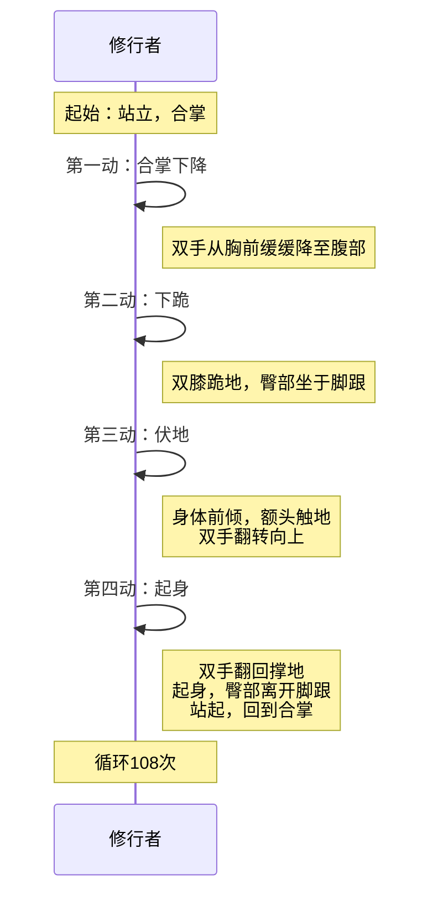
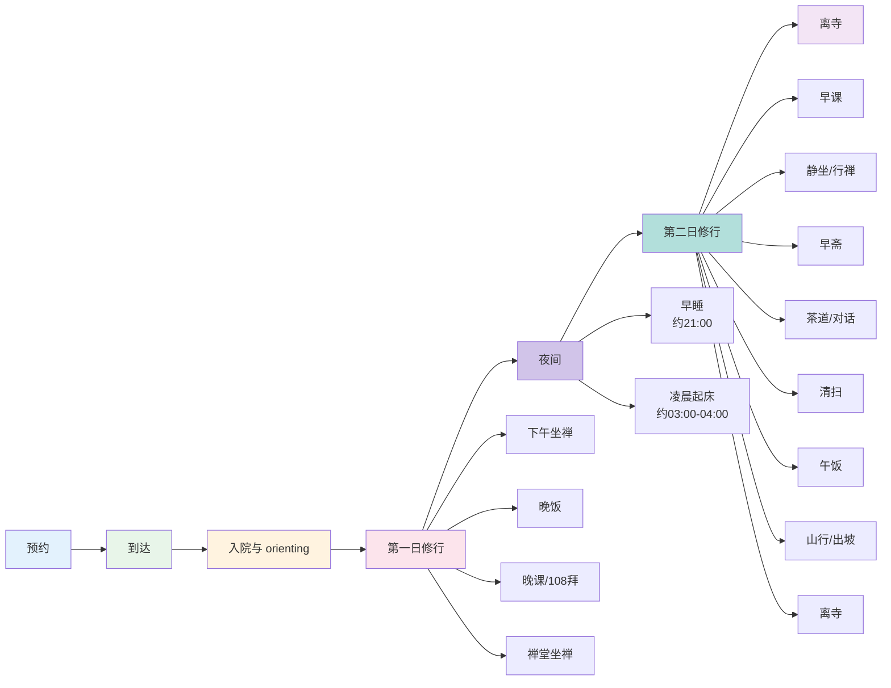
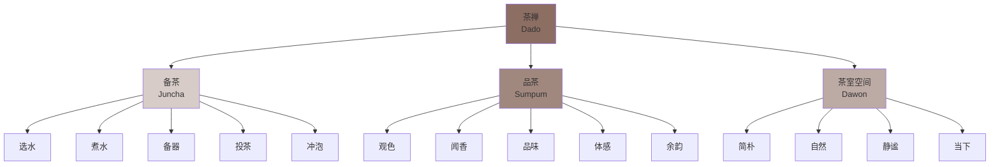

# 韩国禅（Korean Seon）实修指南

> **最后更新：** 2026-05

---

## 目录

1. [Cham-Seon 参禅完整流程](#1-cham-seon-参禅完整流程)
2. [一百零八拜标准操作](#2-一百零八拜标准操作)
3. [Hwadu 话头参究实操方法](#3-hwadu-话头参究实操方法)
4. [Templestay 完整体验指南](#4-templestay-完整体验指南)
5. [茶禅（Dado）的冥想维度](#5-茶禅dado的冥想维度)
6. [附录：参考资源](#6-附录参考资源)

---

## 1. Cham-Seon 参禅完整流程

Cham-Seon（参禅）是韩国禅宗（Seon/선）的核心修行方式。一场标准的参禅从入堂到出堂约90分钟，包含礼佛、坐禅、行禅、喝茶、对话等多个环节，形成完整的修行循环。

### 1.1 九十分钟标准流程


| 阶段 | 时长 | 核心内容 | 身心状态 |
|------|------|----------|----------|
| **入堂** | 2分钟 | 安静进入禅堂，找到自己的座位 | 放下外在事务，切换至修行模式 |
| **礼佛** | 5-8分钟 | 三拜或108拜（简化版）；念诵 | 以身体行动表达恭敬与皈依 |
| **第一段坐禅** | 30-40分钟 | 主要修行时段；可用话头或默照 | 深化专注力，面对内心浮现的一切 |
| **行禅** | 10-15分钟 | 缓慢行走，保持坐禅中的觉知 | 将静中所得延伸至动态；活动身体 |
| **第二段坐禅** | 20-30分钟 | 继续深化；可能更沉静 | 经过行禅后，身体更舒适，心更安定 |
| **喝茶** | 10分钟 | 饮用寺院茶；不说话 | 以茶为媒介，保持觉知；社交性放松 |
| **对话/问答** | 10-15分钟 | 与禅师或同修简短问答 | 将修行体验 verbalize；获得指导 |
| **出堂** | 2分钟 | 安静离开 | 将禅带入日常生活 |

### 1.2 入堂礼仪

| 步骤 | 操作 | 意义 |
|------|------|------|
| **脱鞋** | 在禅堂门外脱鞋，整齐摆放 | 放下世俗身份；保持禅堂洁净 |
| **合掌** | 进入前向堂内合掌一礼 | 尊重这个修行空间 |
| **安静入座** | 找到自己的坐垫（禅板/蒲团），轻拿轻放 | 不打扰已就座者 |
| **调身** | 采用七支坐法（见下） | 身体稳定是心智稳定的基础 |
| **调息** | 3-5次深呼吸，然后任呼吸自然 | 从外在过渡到内在 |
| **调心** | 设定本次修行的意图 | 明确方向 |

### 1.3 礼佛（YeBul）

韩国禅寺通常在每次参禅开始时进行礼佛。标准版本为三拜，精进修行者可能进行完整的108拜。

| 动作 | 分解 | 念诵（可选） |
|------|------|-------------|
| **站立合掌** | 双脚并拢，双手合十于胸前，目光下垂 | "Na-Mo-Bul"（南无佛） |
| **下跪** | 右膝先着地，然后左膝；同时双手撑地 | "Na-Mo-Bul" |
| **伏地** | 额头轻触地面；手掌翻转向上（接佛足） | "Na-Mo-Bul" |
| **起身** | 手掌翻回，撑地起身；先起左膝，再起右膝 | "Na-Mo-Bul" |
| **站立** | 回到站立合掌 | 静默 |

**礼佛三拜的冥想维度：**

| 拜次 | 象征 | 内心状态 |
|------|------|----------|
| **第一拜** | 皈依佛 | 放下自我傲慢；承认有更高的智慧 |
| **第二拜** | 皈依法 | 愿意遵循真理修行；放下自己的固执 |
| **第三拜** | 皈依僧 | 感恩传承与同修；放下孤立感 |

### 1.4 坐禅（Jwaseon）—— 七支坐法

韩国禅的坐姿要求严格，称为"七支坐法"（Chilji Jwasik）。

| 支序 | 部位 | 标准姿势 | 常见问题 |
|:----:|------|----------|----------|
| 1 | **足** | 双跏趺坐（莲花坐）或单跏趺（半莲花）；若不可则散盘（双脚平放） | 膝盖疼痛；可用坐垫垫高臀部 |
| 2 | **手** | 右手在下、左手在上，拇指轻触，形成椭圆，置于小腹前（定印） | 手滑落；可轻放大腿上 |
| 3 | **脊** | 脊柱挺直如串铜钱，不挺不弯 | 习惯性驼背；可在背后放小枕支撑 |
| 4 | **肩** | 肩膀自然平展，不耸不塌 | 紧张时耸肩；定期自检放松 |
| 5 | **颈** | 颈部微收，下巴轻触喉结 | 头过度低或仰；找到"头顶被线拉起"的感觉 |
| 6 | **舌** | 舌尖轻触上颚 | 口干；可准备小口水在旁 |
| 7 | **眼** | 目光下垂，视线投向前方1-2米处；可半闭或全闭 | 全闭易昏沉；半开易散乱；需找到平衡 |

**坐垫调整：**

| 坐垫高度 | 适用情况 | 效果 |
|----------|----------|------|
| 低（5-8cm） | 髋部非常灵活者 | 脊柱自然直立 |
| 中（10-15cm） | 大多数人 | 膝盖略低于臀部，减少腰部压力 |
| 高（15-20cm） | 髋部紧张、膝盖高起者 | 减少膝盖压力；但过高可能影响稳定 |

### 1.5 坐禅方法：话头 vs 默照

韩国禅主要有两种坐禅方法，修行者根据阶段和根器选择。

| 维度 | 话头禅（Hwadu Seon） | 默照禅（Mukjo Seon） |
|------|----------------------|----------------------|
| **核心方法** | 持续参究一个话头（如"我是谁？"） | 无特定焦点，只是觉知一切 |
| **适合根器** | 思维活跃、有强烈疑情者 | 心性较静、能安住者 |
| **关键动作** | 提起话头；产生疑情；穷追不舍 | 放下一切；只是知道 |
| **经典话头** | "我是谁？" "念佛是谁？" "万法归一，一归何处？" | 无 |
| **目标** | 疑情打成一片，最终爆破见本性 | 能所双亡，照而常寂 |
| **韩国代表** | 临济宗、曹溪宗主流 | 曹溪宗部分传承 |

### 1.6 行禅（HaengSeon）

| 维度 | 操作 |
|------|------|
| **速度** | 极慢——每步约10-20秒；在禅寺中通常由班首带领统一节奏 |
| **路线** | 沿禅堂墙壁顺时针行走；或户外特定路径 |
| **目光** | 下垂，注视前方1-2米处地面 |
| **手姿** | 可保持定印于腹部，或自然下垂 |
| **觉知** | 脚底与地面的接触；身体的移动；保持坐禅中的觉知不间断 |
| **呼吸** | 自然；或与步伐配合（如吸两步、呼两步） |

**行禅与坐禅的交替节律：**

| 修行时长 | 坐禅：行禅比例 | 说明 |
|----------|---------------|------|
| 初学者 | 20分钟坐：10分钟行 | 身体未适应长时间静坐 |
| 中级 | 40分钟坐：10分钟行 | 标准韩国禅寺节奏 |
| 精进 | 60-90分钟坐：15分钟行 | 禅修密集期 |
| 老参 | 根据身体需要灵活调整 | 以心不散乱为准 |

### 1.7 喝茶与对话

| 环节 | 操作 | 意义 |
|------|------|------|
| **喝茶** | 禅茶由专人冲泡；依次传递；接茶时双手持杯；饮茶时专注味道与温度 | 禅宗"茶禅一味"——喝茶即是修行 |
| **不说话** | 喝茶期间通常不说话；保持坐禅中的静默 | 言语是散乱的源头 |
| **简短对话** | 禅师可能问："刚才坐禅如何？"或"你的话头提得起来吗？" | 检验修行；获得指导 |
| **问答风格** | 韩国禅问答通常简短直接；不长篇大论 | 直指人心 |

---

## 2. 一百零八拜标准操作

一百零八拜（BaekpalYuBae）是韩国佛教中最普遍的修行方式之一。108次代表断除108种烦恼（百八烦恼）。标准节奏约30分钟完成，是身体、呼吸与虔信的整合修行。

### 2.1 动作分解



| 动作序号 | 名称 | 详细操作 | 呼吸配合 |
|:--------:|------|----------|----------|
| 0 | **预备** | 站立，双脚与肩同宽，双手合十于胸前 | 自然呼吸 |
| 1 | **合掌下降** | 双手保持合十，从胸前缓缓下降至腹部高度；同时屈膝微蹲 | 呼气 |
| 2 | **下跪** | 双手分开撑地；右膝先着地，左膝跟着着地；臀部坐于脚跟上 | 继续呼气 |
| 3 | **伏地** | 身体前倾，额头轻触地面；双手翻转，掌心向上（接佛足印） | 屏息或轻呼气 |
| 4 | **起身** | 双手翻回撑地；推地起身，臀部离开脚跟；先起左膝，再起右膝 | 吸气 |
| 5 | **恢复站立** | 回到站立合掌姿势 | 吸气完成 |

### 2.2 呼吸配合详解

| 阶段 | 呼吸 | 身体动作 | 心理聚焦 |
|------|------|----------|----------|
| **站立预备** | 自然呼吸 | 稳定站立 | 设定意图："以此108拜，断除108烦恼" |
| **下降** | 缓慢呼气 | 合掌下降、屈膝 | 放下自我、放下执着 |
| **下跪** | 继续呼气 | 双膝着地 | 谦卑、臣服 |
| **伏地** | 轻呼气或短暂屏息 | 额头触地 | 彻底放下；与大地连接 |
| **起身** | 深吸气 | 推地站起 | 接收能量；新生 |
| **站立** | 吸气完成 | 合掌 | 感恩；准备下一次 |

### 2.3 计数方法

| 方法 | 操作 | 适用情境 |
|------|------|----------|
| **念珠计数** | 使用108颗念珠，每拜拨一颗 | 最常用的方法；念珠可挂于手腕或放置一旁 |
| **计数板** | 韩国寺院常见的小型计数板，有108个凹槽 | 与念珠类似；适合在固定地点使用 |
| **手指计数** | 左手手指节计数：每遍拜后用右手触碰左手一个关节 | 无念珠时的替代 |
| **默数** | 心中默念数字 | 最简单；但易分心丢失 |

**念珠分段法（将108分为四段）：**

| 段落 | 次数 | 聚焦 |
|------|------|------|
| **第一段** | 1-27 | 为自身修行；断除自身的贪、嗔、痴 |
| **第二段** | 28-54 | 为家人亲友；愿他们离苦得乐 |
| **第三段** | 55-81 | 为一切众生；扩展慈悲心 |
| **第四段** | 82-108 | 为佛法久住；回向功德 |

### 2.4 身体保护与节奏

| 保护要点 | 操作 | 原因 |
|----------|------|------|
| **膝盖** | 使用拜垫或厚毯；若膝盖有病史可减少次数或改为半拜 | 108拜对膝盖压力较大 |
| **腰部** | 起身时用双手推地辅助，不纯用腰部力量 | 防止腰部扭伤 |
| **手腕** | 手掌均匀撑地，手指张开分担压力 | 防止手腕过度受压 |
| **头部** | 额头轻触地面，不撞击 | 保护颈椎和头部 |
| **呼吸** | 不憋气；保持呼吸自然流动 | 防止头晕或过度换气 |

**节奏选择：**

| 节奏 | 完成时间 | 体验 | 适用 |
|------|----------|------|------|
| **慢速** | 40-50分钟 | 深沉、 meditative、身体充分伸展 | 初学者；身体柔韧者；深度修行 |
| **中速** | 25-30分钟 | 稳定、流畅、可持续每日进行 | 大多数人日常修行 |
| **快速** | 15-20分钟 | 挑战体能、产生热力、打破昏沉 | 熟练者；需要提振能量时 |

### 2.5 一百零八拜的冥想维度

| 维度 | 修习方法 |
|------|----------|
| **身体禅修** | 将注意力完全放在身体的移动上——膝盖的弯曲、手掌的触感、呼吸的流动 |
| **情感净化** | 每一拜释放一种特定的烦恼或情绪；可以在开始前列出要释放的清单 |
| **虔诚表达** | 每一拜都是对三宝的皈依；将虔信感注入动作 |
| **耐力修行** | 30-50分钟持续动作是对意志力的锻炼；在想要停止时继续 |
| **动态冥想** | 动作成为 mantra；进入 flow 状态；动作与意识合一 |

---

## 3. Hwadu 话头参究实操方法

Hwadu（话头）是韩国禅最核心的修行法门，源自中国禅宗的"公案"（Gong'an）传统。话头是一个无法以逻辑思维回答的问题，修行者通过持续参究，最终打破思维惯性，证悟本来面目。

### 3.1 核心话头选择

| 话头 | 来源 | 特性 | 适合根器 |
|------|------|------|----------|
| **"我是谁？"** | 最普遍的入门话头 | 直接、人人可用 | 所有人，尤其是初学者 |
| **"念佛是谁？"** | 源于念佛禅 | 对念佛修行者特别有力 | 有念佛基础者 |
| **"万法归一，一归何处？"** | 源于赵州禅师 | 哲学深度强 | 思维型、知识分子 |
| **"无"** | 源于狗子佛性公案 | 极简、直指 | 喜欢简洁者 |
| **"拖死尸的是谁？"** | 源于临济宗 | 冲击力大 | 需要强烈震撼者 |
| **"未出娘胎前的本来面目"** | 源于六祖 | 超越时间 | 对"前世/本来面目"有感应者 |

### 3.2 "我是谁"话头的24小时参究

```mermaid
flowchart TB
    A[24小时话头参究] --> B[正式坐禅<br/>4-6小时/日]
    A --> C[日常活动<br/>贯穿全天]
    A --> D[睡眠前后<br/>入睡与醒来]
    
    B --> B1[提起话头<br/>"我是谁？"]
    B --> B2[产生疑情<br/>不知道！]
    B --> B3[穷追不舍<br/>持续追问]
    B --> B4[疑情打成一片<br/>行住坐卧皆是话头]
    
    C --> C1[走路时<br/>"走路的是谁？"]
    C --> C2[吃饭时<br/>"吃饭的是谁？"]
    C --> C3[工作时<br/>"工作的是谁？"]
    C --> C4[对话时<br/>"说话的是谁？"]
    
    D --> D1[入睡前<br/>最后念头是话头]
    D --> D2[醒来时<br/>第一念头是话头]
    D --> D3[梦境中<br/>梦中也能提起]
    
    style A fill:#e3f2fd
    style B fill:#e8f5e9
    style C fill:#fff3e0
    style D fill:#fce4ec
```

#### 正式坐禅中的参究

| 阶段 | 操作 | 时间 | 体验 |
|------|------|------|------|
| **提起** | 坐定后，心中清晰地提起话头："我是谁？" | 坐禅开始时 | 如同举起一盏灯 |
| **追问** | 不急于回答；让"不知道"成为状态；继续追问 | 持续 | 内心产生"疑团" |
| **深入** | 话头从头脑沉入腹部；整个身体都在问 | 10-20分钟后 | 话头成为身体的感受 |
| **打成一片** | 话头自动进行；即使不主动提，它也在 | 长期修行后 | "能问的我"与"所问的话头"开始模糊 |
| **爆破** | 疑情到达极点；突然打破 | 不可预测 | 本来面目显现；不可言说 |

#### 日常生活中保持话头

| 日常活动 | 话头转化 | 操作要点 |
|----------|----------|----------|
| **走路** | "走路的是谁？" | 脚步与话头同步；每一步都在问 |
| **吃饭** | "吃饭的是谁？" | 咀嚼时提起；味道与话头同时 |
| **工作** | "工作的是谁？" | 不因工作繁忙而丢失；话头如背景音乐 |
| **对话** | "说话的是谁？" | 倾听时不丢失；说话时不丢失 |
| **排队** | "等待的是谁？" | 利用等待时间深化话头 |
| **如厕** | "排泄的是谁？" | 话头无处不在 |
| **洗澡** | "洗澡的是谁？" | 水流与话头 |

#### 睡眠前后的话头

| 时机 | 操作 | 效果 |
|------|------|------|
| **入睡前** | 躺下后，最后清醒的念头是话头；带着话头入睡 | 可能产生与话头相关的梦；潜意识继续工作 |
| **醒来时** | 睁开眼睛的第一刹那，话头已在那里 | 将修行延伸至梦境与醒来的交界 |
| **梦中** | 若能在梦中意识到"这是梦"，立即提起"做梦的是谁？" | 清明梦中的修行极其有力 |

### 3.3 参究是否得力的验证

| 得力标志 | 说明 | 不得力的表现 |
|----------|------|-------------|
| **疑情持续** | 话头在心中如同热铁，持续发热 | 话头提起后很快忘记；或变成机械重复 |
| **话头沉重** | 话头不是轻飘飘的念头，而是有重量、有质感 | 话头如口头禅，随口而过 |
| **日常不忘** | 在日常活动中自然浮现，不需刻意提醒 | 只有在坐禅时记得，下座即忘 |
| **外缘触动** | 听到声音、看到景象时，话头自然关联 | 外缘只是外缘，与话头无关 |
| **睡眠中也提得起** | 醒来时发现话头在继续 | 睡眠完全是空白或梦境散乱 |
| **疑团成形** | 不是"我在想话头"，而是"话头在找我" | 始终是"我"在主动操作 |
| **不知最亲切** | "不知道"不再令人沮丧，反而成为最熟悉的状态 | 急于寻找答案、阅读公案答案 |

### 3.4 常见障碍与对治

| 障碍 | 表现 | 对治 |
|------|------|------|
| **浮话头** | 话头只在头脑表层，不深入 | 大声念出话头；将注意力带到丹田再提 |
| **昏沉** | 提话头后很快昏睡 | 睁眼、坐直、经行；或改为108拜 |
| **散乱** | 各种思绪纷飞，话头被淹没 | 不追逐思绪；温和地将注意力拉回话头；降低期望 |
| **求悟心** | 急于见性，反而增加压力 | 放下"要开悟"的执着；只管参究，不问结果 |
| **知解** | 以为理解了话头的"答案" | 知解是敌人；任何你能想的答案都不是；继续参 |
| **身心不适** | 长期参究产生焦虑、紧张 | 与禅师讨论；适当休息；不强迫 |

---

## 4. Templestay 完整体验指南

Templestay（寺院住宿）是韩国佛教为现代人设计的短期修行体验项目，通常2-3天，让参与者在真实寺院环境中体验禅修行。

### 4.1 体验流程



### 4.2 预约

| 项目 | 说明 |
|------|------|
| **预约渠道** | 韩国寺院住宿官网（templestay.com）；各寺院官网；电话 |
| **选择寺院** | 曹溪宗大寺院（如海印寺、通度寺、松广寺）体验较规范；小型寺院更 intimate |
| **项目类型** | 体验型（1-2天，较轻松）vs 修行型（2-7天，严格禅修） |
| **费用** | 通常50,000-100,000韩元/晚（含食宿）；部分寺院免费或随缘 |
| **准备物品** | 宽松衣物、洗漱用品、笔记本、保暖衣物（清晨寒冷）、个人药品 |
| **禁忌物品** | 烟酒、荤食、暴露衣物、电子设备（通常要求上交或静音） |

### 4.3 到达与入院

| 步骤 | 操作 | 注意事项 |
|------|------|----------|
| **到达时间** | 通常下午14:00-16:00 | 不要迟到；寺院作息严格 |
| **报到** | 到客堂（Anjae）报到；出示预约确认 | 可能需要脱鞋进入 |
| **分配房间** | 通常多人房（4-8人）；修行型可能是单独 | 简单铺盖；无床（地板睡） |
| **换衣** | 换上天主教提供的僧服（simbang）或自备宽松衣 | 穿僧服即开始转换身份 |
| **Orienting** | 工作人员说明作息、规矩、寺院地图 | 认真听；记好时间 |
| **上交物品** | 手机通常需上交或关机；其他电子设备收起 | 这是难得的无数字体验 |

### 4.4 仪式参与

| 仪式 | 时间 | 内容 | 注意事项 |
|------|------|------|----------|
| **早课** | 03:30-04:30 | 晨钟、念诵、礼佛 | 最艰难的时段；克服睡意即是修行 |
| **早斋** | 06:00 | 早餐；佛教素食；过堂仪式 | 吃饭时不说话；珍惜食物 |
| **坐禅** | 多次，每次30-60分钟 | 在禅师带领下坐禅；可能使用话头 | 保持姿势；不动 |
| **行禅** | 坐禅之间 | 户外或走廊缓慢行走 | 将坐禅的觉知带入动态 |
| **108拜** | 通常早晚各一次 | 集体108拜 | 跟随集体节奏 |
| **茶道** | 上午或下午 | 学习韩国禅茶；茶禅一味 | 专注当下；不闲聊 |
| **出坡** | 日间 | 寺院劳动——清扫、洗碗、整理 | 劳动即是修行；不挑剔 |
| **晚课** | 18:00-19:00 | 晚间念诵、礼佛 | 回顾一日；感恩 |
| **禅堂坐禅** | 20:00-21:00 | 夜间最后的坐禅 | 可能更安静、更深 |

### 4.5 坐禅注意事项

| 要点 | 说明 |
|------|------|
| **姿势** | 尽量保持七支坐法；若身体不适可微调，但不频繁变动 |
| **不动** | 坐禅期间尽量不动；痒、痛、酸都忍耐；这是心的训练 |
| **钟声** | 听到木鱼或钟声不可随意睁眼或张望；保持坐姿 |
| **退场** | 若实在无法继续，以静默方式缓慢退场；不干扰他人 |
| **提问** | 有具体问题可在对话时间向禅师或工作人员询问 |

### 4.6 礼仪与禁忌

| 类别 | 规矩 | 原因 |
|------|------|------|
| **着装** | 保守、宽松、素色；不可暴露 | 尊重神圣空间 |
| **言语** | 吃饭时、坐禅时不说话；其他时间轻声 | 减少散乱 |
| **电子设备** | 通常上交或在指定时间使用 | 全情投入修行 |
| **性别** | 男女分开住宿；部分寺院男女分开坐禅 | 传统规矩 |
| **摄影** | 通常禁止在禅堂、佛像前拍照 | 尊重神圣 |
| **垃圾** | 垃圾分类；减少浪费 | 环保；惜福 |
| **早起** | 凌晨3-4点起床 | 寺院传统 |
| **睡觉** | 约21:00就寝 | 保证修行精力 |

### 4.7 离寺

| 步骤 | 操作 | 意义 |
|------|------|------|
| **早课后** | 通常第二日早课后即可离寺 | 以修行开始一日 |
| **整理房间** | 将被褥叠好；房间恢复入住前状态 | 感恩；不留下麻烦 |
| **告别** | 向工作人员和禅师合掌告别 | 感恩这次机会 |
| **供养** | 可随喜供养寺院（非强制） | 支持寺院继续提供Templestay |
| **携带** | 带走自己的修行体验；留下世俗烦恼 | — |

---

## 5. 茶禅（Dado）的冥想维度

Dado（茶道）在韩国禅宗中不仅是饮茶的艺术，更是修行的法门。韩国禅茶与日本的茶道（Sadou）有所不同，更强调简朴、自然与禅修的整合。

### 5.1 茶禅的整体观



### 5.2 备茶中的正念

| 步骤 | 操作 | 正念焦点 |
|------|------|----------|
| **选水** | 优先山泉水；其次过滤水；避免自来水直饮 | 水的来源；感恩自然 |
| **煮水** | 用陶壶或铁壶；听水声变化 | 声音的转变——从安静到嗡鸣到沸腾 |
| **温器** | 以热水温烫茶碗、茶盏 | 感受温度传递；器物的生命 |
| **投茶** | 以茶匙取适量茶叶（通常绿茶或普洱） | 茶叶的形态、颜色、香气 |
| **注水** | 水流细而稳定；沿碗壁注入 | 水流的视觉；手部的稳定 |
| **等待** | 盖上碗盖；静候片刻 | 不急躁；等待本身就是修行 |
| **分茶** | 倒入品茗杯；若多人则依次分奉 | 先后顺序的平等心 |

**韩国禅茶四要：**

| 要点 | 说明 | 修行对应 |
|------|------|----------|
| **和** | 人与自然、人与人的和谐 | 慈悲 |
| **敬** | 对茶、对器、对人的恭敬 | 谦卑 |
| **俭** | 简朴、不浪费 | 放下贪欲 |
| **真** | 真诚、不做作 | 本来面目 |

### 5.3 品茶时的觉察

| 维度 | 操作 | 觉察内容 |
|------|------|----------|
| **观色** | 先观茶汤颜色 | 绿的层次、透的质感；不评判，只是看 |
| **闻香** | 以手轻扇，将香气引入鼻腔 | 香气的层次——前调、中调、余韵 |
| **品味** | 小口啜饮；让茶汤在舌面停留 | 苦、涩、甘、鲜的层次；温度的变化 |
| **体感** | 感受茶汤入喉后的身体反应 | 口腔的润滑、胃部的温暖、身体的放松 |
| **余韵** | 饮完后闭嘴，感受口中的余味 | 回甘的持久；空杯后的"无" |

**品茶五阶段与禅宗五事的对应：**

| 品茶阶段 | 体验 | 禅宗对应 |
|----------|------|----------|
| 第一口 | 味觉冲击；最明显的感受 | 初发心——热情与清晰 |
| 第二口 | 开始品味层次；细微处显现 | 深入——耐心与细致 |
| 第三口 | 习惯味道；可能开始平淡 | 稳定——不追求刺激 |
| 第四口 | 真正进入当下；茶与人合一 | 打成一片——能所双亡 |
| 饮毕 | 空杯；余韵；不可言说 | 本来面目——空性 |

### 5.4 茶室空间的心静

| 元素 | 韩国禅茶室特征 | 心理效果 |
|------|---------------|----------|
| **空间大小** | 通常极小（2-4榻榻米） | 限制活动，促进内省 |
| **光线** | 自然光为主；柔和、间接 | 不刺激；支持放松 |
| **色彩** | 土色、木色、白色为主；无鲜艳色彩 | 减少视觉刺激 |
| **器物** | 极简；每个器物都有用且美 | 功能与美感的统一 |
| **自然元素** | 一枝花、一块石、一幅字 | 连接自然；提醒无常 |
| **声音** | 安静；或仅有水沸声、鸟鸣 | 以少为多 |
| **气味** | 茶香；若有香则极淡 | 嗅觉的专注 |

**茶室进入礼仪：**

| 步骤 | 操作 | 意义 |
|------|------|------|
| **脱鞋** | 在茶室外脱鞋；整齐摆放 | 放下外在身份 |
| **鞠躬** | 向茶室、茶具、主人鞠躬 | 感恩与尊重 |
| **膝行** | 以膝行进入（传统）；或安静步入 | 降低身体，提升谦卑 |
| **就座** | 跪坐或盘坐；不倚靠 | 身体的稳定 |
| **静默** | 入坐后不立即说话；感受空间 | 以沉默进入当下 |
| **欣赏挂轴** | 若茶室有挂轴或花，先欣赏 | 培养审美与觉知 |

### 5.5 日常茶禅修习

| 场景 | 修习方法 | 时间 |
|------|----------|------|
| **晨起第一杯** | 以正念泡一杯茶；不边喝边看手机 | 10-15分钟 |
| **工作间隙** | 泡茶时全意识投入；喝茶时放下工作 | 10分钟 |
| **饭后** | 以茶漱口、清口；感受食物与茶的对比 | 5分钟 |
| **睡前** | 淡茶或无咖啡因茶；以茶收摄一日 | 10分钟 |
| **待客** | 以茶招待客人；泡茶与喝茶都是修行 | 因情境 |
| **独处** | 独自完整茶道；如同小型禅修 | 30-60分钟 |

---

## 6. 附录：参考资源

### 韩国禅寺推荐（Templestay）

| 寺院 | 位置 | 特色 | 推荐项目 |
|------|------|------|----------|
| **海印寺** | 庆尚南道伽倻山 | 大藏经板殿世界文化遗产；深山古刹 | 2日体验型；秋季红叶 |
| **通度寺** | 庆尚南道梁山 | 韩国三大名刹之一；佛舍利塔 | 3日修行型；108拜深化 |
| **松广寺** | 全罗南道顺天 | 曹溪宗发祥地；众多高僧辈出 | 7日禅修营；严格修行 |
| **凤停寺** | 庆尚北道安东 | 韩国最古木造建筑；宁静 | 2日体验型；适合初学者 |
| **修德寺** | 首尔近郊 | 女性出家中心；交通便利 | 周末1日体验 |

### 核心术语对照

| 韩文 | 汉字 | 英文 | 含义 |
|------|------|------|------|
| Seon | 禅 | Zen | 冥想修行 |
| Cham-Seon | 参禅 | Meditation | 正式的禅修 |
| Jwaseon | 坐禅 | Sitting meditation | 静坐 |
| HaengSeon | 行禅 | Walking meditation | 行走冥想 |
| Hwadu | 话头 | Critical phrase / Koan | 参究的短语 |
| YeBul | 礼佛 | Bowing / Prostration | 礼拜 |
| BaekpalYuBae | 一百八拜 | 108 Prostrations | 108次礼拜 |
| Dado | 茶道 | Tea ceremony | 茶禅 |
| BaruGongyang | 钵盂供养 | Formal meal | 过堂（正式用餐） |
| DaSeon | 茶禅 | Tea-Zen | 茶与禅的整合 |

### 修习记录表

| 日期 | 坐禅时长 | 话头 | 108拜 | 特殊体验 | 困难 |
|------|----------|------|-------|----------|------|
| 示例 | 40分钟 | 我是谁 | 108遍 | 话头沉入腹部 | 右膝酸痛 |

### 推荐阅读

| 书名 | 作者 | 内容 |
|------|------|------|
| *The Way of Korean Zen* | Kusan Sunim | 韩国禅的系统介绍 |
| *Tracing Back the Radiance* | Robert E. Buswell Jr. | 韩国佛教思想学术研究 |
| *Dharma Talks at Seon Centers* | 各禅师 | 韩国禅师的法语集 |
| *The Sound of the One Hand* | Yoel Hoffmann | 公案研究 |

---

> *"参禅不在坐，坐禅即是禅。行住坐卧，无非是道。"*  
> —— 韩国禅宗古德
