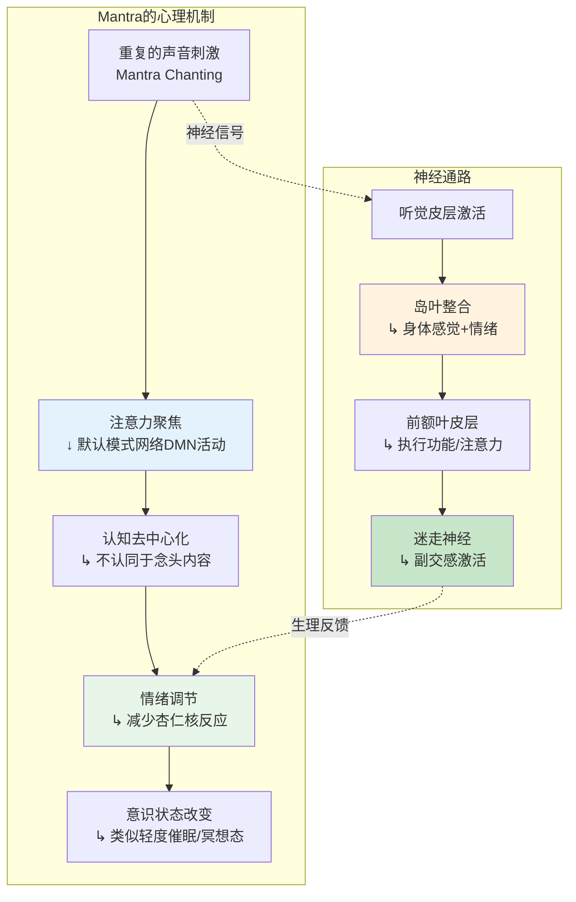
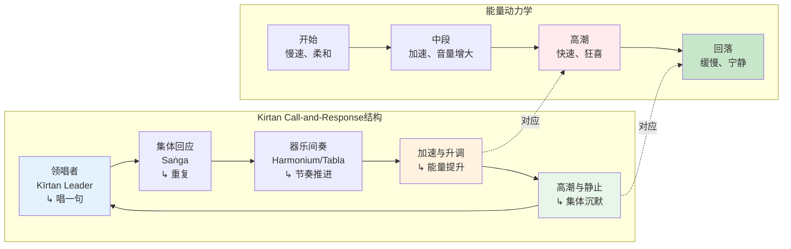
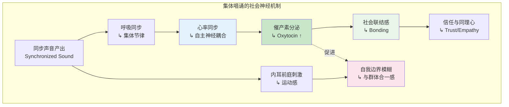

# 咒语/唱诵冥想专业概述：跨文化的声音修行传统

> **适用对象**：对声音冥想有兴趣的练习者、音乐治疗师、瑜伽/唱诵带领者、跨宗教研究者、身心灵从业者  
> **阅读时长**：约 35–45 分钟（可分段阅读）  
> **实践建议**：声音冥想可从个人低音量练习开始，逐步探索集体唱诵；注意发声技巧和音量保护  
> **最后更新**：2026-05

---

## 一、跨文化历史

### 1.1 印度Vedic传统——Mantra的源头

Mantra（梵语：मन्त्र，词根 *man-* "思" + *-tra* "工具"）的字面意思是**"超越心智的工具"**。在印度最古老的宗教文献《吠陀》（Veda，约公元前1500–500年）中，Mantra已经是核心要素。

**吠陀Mantra的核心特征**：

| 维度 | 吠陀Mantra特征 |
|------|--------------|
| **神圣性** | Mantra不是"人创造"的，而是**被"听见"（Śruti）**的——由古代先知（Ṛṣi）在深度冥想中接收自宇宙本源 |
| **音韵精确性** | 每个音节的音高（Svara）、长度（Mātrā）、发音部位都精确规定；错误的发音被认为会削弱或改变Mantra的效力 |
| **仪式功能** | Mantra是火祭（Yajña）的核心组成部分；通过正确的声音召唤神灵、维持宇宙秩序（Ṛta） |
| **宇宙论意义** | 声音（Śabda）被视为宇宙的本源；Brahman（终极实在）与Śabda Brahman（声音即梵）合一 |

**吠陀经典的分类**：

| 经典 | 内容 | Mantra角色 |
|------|------|-----------|
| **《Ṛgveda》（梨俱吠陀）** | 1017首赞美诗，歌颂自然神祇 | Mantra即赞美诗本身；最古老的Mantra文献 |
| **《Sāmaveda》（娑摩吠陀）** | 可唱的颂歌，基于Ṛgveda的韵律 | 将Mantra音乐化；印度古典音乐的源头 |
| **《Yajurveda》（夜柔吠陀）** | 祭祀仪轨的散文和咒语 | Mantra指导祭祀动作和献祭 |
| **《Atharvaveda》（阿闼婆吠陀）** | 咒语、巫术、医药、日常生活 | Mantra用于世俗目的：治愈、保护、驱邪 |

```mermaid
graph TD
    subgraph 吠陀宇宙观<br/>Vedic Cosmology
        V1[终极实在<br/>Brahman] --> V2[宇宙声音<br/>Śabda Brahma<br/>↳ 声音即梵]
        V2 --> V3[吠陀Mantra<br/>↳ 被Ṛṣi"听见"]
        V3 --> V4[宇宙秩序<br/>Ṛta]
        V4 --> V5[祭祀仪式<br/>Yajña]
    end

    subgraph Mantra的功能层级
        M1[宇宙层面<br/>维持Ṛta] --> M2[仪式层面<br/>召唤神祇]
        M2 --> M3[个人层面<br/>净化/保护/成就]
        M3 --> M4[灵性层面<br/>证悟Brahman]
    end

    V3 -.->|实现| M1
    V3 -.->|实现| M4

    style V1 fill:#e8eaf6
    style V2 fill:#fff3e0
    style V3 fill:#e8f5e9
    style M4 fill:#fce4ec
```

### 1.2 佛教密宗——真言（Dhāraṇī / Vidyā）

佛教在大乘发展后期（约公元3–7世纪）吸收了印度Tantra传统，发展出**密宗（Vajrayāna / Tantric Buddhism）**。在这一传统中，Mantra演变为**真言（Dhāraṇī / Vidyā）**，具有类似的音韵神圣性和仪式功能，但目标转向**证悟空性**和**利益众生**。

**佛教真言的核心特征**：

| 维度 | 佛教真言特征 |
|------|------------|
| **来源** | 通常被认为是佛菩萨在禅定中宣说的；具有"不可思"的效力 |
| **语言** | 多为梵语（或混合方言），但很多时候是**无意义的音节组合**（如"嗡阿吽"）——强调声音的振动本身而非语义 |
| **功能** | 净化业障、积累功德、召唤佛菩萨加持、保护修行者 |
| **目标** | 从吠陀的"与梵合一"转为"证悟空性"和"成就佛果" |

**重要佛教真言**：

| 真言 | 来源/含义 | 使用场景 |
|------|----------|---------|
| **Oṃ Maṇi Padme Hūṃ** | 观世音菩萨心咒；"唵嘛呢叭咪吽" | 藏传佛教最广泛诵念的真言；慈悲与净化 |
| **Oṃ Amideva Hrīḥ** | 阿弥陀佛心咒 | 净土修行；往生极乐世界 |
| **Oṃ Vajrasattva Hūṃ** | 金刚萨埵百字明 | 密宗忏悔仪轨；净化业障 |
| **Namo Amitābhāya** | 归命阿弥陀佛 | 东亚净土宗日常诵念 |
| **Gate Gate Pāragate Pārasamgate Bodhi Svāhā** | 《心经》心咒；"揭谛揭谛，波罗揭谛" | 般若波罗蜜多智慧的凝聚 |

### 1.3 印度教Bhakti运动——奉爱唱诵

Bhakti（भक्ति，意为"奉爱、虔诚"）运动兴起于印度南部（约公元6–9世纪），强调通过**对神的爱和 devotion**达到解脱，而非复杂的仪式或哲学思辨。Bhakti运动将Mantra和唱诵（Kīrtan）从精英祭司阶层解放出来，使之成为**普通信众的日常修行**。

**Bhakti唱诵的核心特征**：

| 维度 | Bhakti唱诵特征 |
|------|--------------|
| **可及性** | 不需要梵语知识或祭司资格；任何人都可以唱诵神的名字 |
| **情感性** | 强调情感投入（Bhāva）而非发音精确；哭泣、舞蹈、狂喜都是可接受的 |
| **社群性** | 集体唱诵（Saṅkīrtan）是核心形式；在社群中倍增 devotion 的力量 |
| **神名中心** | 唱诵神的名字（Nāma）本身即是神圣；"Nāma 等同于神"（Nāma-rūpa） |

**重要Bhakti传统Mantra**：

| Mantra | 含义 | 传统 |
|--------|------|------|
| **Hare Kṛṣṇa, Hare Kṛṣṇa, Kṛṣṇa Kṛṣṇa, Hare Hare / Hare Rāma, Hare Rāma, Rāma Rāma, Hare Hare** | "哦Kṛṣṇa的能量，哦Rāma的能量，请让我为您服务" | Gauḍīya Vaiṣṇava；国际奎师那知觉协会（ISKCON）的核心唱诵 |
| **Oṃ Namaḥ Śivāya** | "向Śiva致敬/皈依" | Śaiva传统；最广为人知的印度教Mantra之一 |
| **Gāyatrī Mantra** | "愿那值得崇拜的光芒激发我们的冥想"（Ṛgveda 3.62.10） | 最神圣的吠陀Mantra之一；每日晨祷 |

### 1.4 藏传佛教——诵经与持咒

藏传佛教（Vajrayāna）继承了印度密宗的真言传统，并发展出**极其丰富和系统化**的声音修行体系。

**藏传佛教声音修行的特色**：

| 维度 | 藏传佛教特征 |
|------|------------|
| **转经筒（Mani Wheel）** | 将真言写在经筒内，每转一圈等同于诵念一遍；利用机械动作积累功德 |
| **玛尼石（Mani Stone）** | 将真言刻在石头上，堆积成墙；声音/文字的物质化持久化 |
| **诵经调（Chöd / Dharma Chanting）** | 复杂的诵经音乐体系；不同教派（宁玛、噶举、萨迦、格鲁）有不同的诵经调式 |
| **咒轮（Dhāraṇī）** | 将真言排列成几何图案，供观想和佩戴 |

**藏传佛教主要声音修行**：

| 修行 | 内容 | 目的 |
|------|------|------|
| **念诵（Ngagpa）** | 出声或默念真言 | 净化、积累功德、专注 |
| **金刚诵（Vajra Recitation）** | 配合呼吸和观想的高级持咒法 | 将气（Prāṇa）、脉（Nāḍī）与声音合一 |
| **六字大明咒（Maṇi）** | Oṃ Maṇi Padme Hūṃ | 最普遍的日常持咒；观世音菩萨的化身 |
| **大礼拜与持咒结合** | 五体投地同时诵念 | 身口意三业同时净化 |

### 1.5 日本声明（Shōmyō）——佛教圣咏

Shōmyō（声明，意为"清晰的声音"）是日本佛教（尤其天台宗和真言宗）的**诵经音乐传统**，起源于中国唐代梵呗，后在日本独立发展，成为世界上最古老的**持续演奏的宗教音乐传统**之一。

**Shōmyō的特征**：

| 维度 | Shōmyō特征 |
|------|-----------|
| **历史** | 可追溯至9世纪；平安时代（794–1185）形成系统 |
| **音阶** | 使用独特的音阶体系（如律音阶、商音阶），不同于日本世俗音乐 |
| **发声** | 特殊的鼻腔共鸣和微分音（不完全遵循西方十二平均律） |
| **功能** | 仪式诵经、供养佛菩萨、超度亡灵、修行者自我净化 |
| **传承** | 严格的师徒口传；乐谱（如初级谱、博士谱）记录音高和节奏模式 |

### 1.6 基督教Gregorian Chant——西方圣咏传统

Gregorian Chant（格里高利圣咏）是西方基督教（罗马天主教）最古老的**单声部宗教歌唱传统**，以教皇格里高利一世（Gregory I, 540–604）命名，但实际上是几个世纪集体创作的产物。

**Gregorian Chant的核心特征**：

| 维度 | Gregorian Chant特征 |
|------|-------------------|
| **语言** | 拉丁语；圣经经文和礼仪文本 |
| **旋律** | 单声部（无和声）；自由节奏（无固定小节线）；以教会调式（Church Modes）为基础 |
| **功能** | 礼仪诵经、日课（Liturgy of the Hours）、弥撒（Mass） |
| **氛围** | 庄重、宁静、超凡脱俗；设计将心灵从世俗引向神圣 |

**Gregorian Chant的主要形式**：

| 形式 | 内容 | 使用场景 |
|------|------|---------|
| **Introit（进台经）** | 弥撒开始的赞美诗 | 神父进堂时 |
| **Gradual（升阶经）** | 诗篇经文的歌唱版本 | 弥撒读经之间 |
| **Alleluia（阿肋路亚）** | 欢呼颂歌 | 弥撒福音前 |
| **Offertory（奉献经）** | 奉献面饼和葡萄酒时的歌唱 | 弥撒奉献礼 |
| **Communion（领圣体经）** | 领受圣体时的歌唱 | 弥撒领圣体礼 |

> **现代复兴**：20世纪90年代，圣本笃会修士的专辑《Chant》（1994）成为全球畅销唱片，引发了Gregorian Chant的世俗化复兴。现代研究也证实，其缓慢的节奏和自由旋律对**副交感神经系统**具有显著的激活作用。

### 1.7 苏菲Dhikr——旋转中的忆念

Dhikr（ذکر，阿拉伯语"忆念"）是伊斯兰神秘主义（苏菲主义，Ṣūfism）的核心修行，通过**反复诵念神的名字或属性**来净化心灵、接近真主。

**Dhikr的核心特征**：

| 维度 | Dhikr特征 |
|------|----------|
| **核心公式** | "Lā ilāha illā Allāh"（万物非主，唯有真主）；"Allāh"（真主之名）；"Huwa"（他） |
| **诵念方式** | 可出声、低语或心诵；常配合呼吸节奏和身体动作 |
| **身体配合** | 摇摆（Ḥaḍra）、旋转（Sama'/Whirling）、心跳节奏同步 |
| **社群性** | 通常在苏菲教团（Ṭarīqa）的集体仪式（Majlis）中进行 |
| **目标** | 法纳（Fanā'）——自我的消融，与真主的合一 |

**土耳其Mevlevi教团的旋转仪式（Sama'）**：
- 由Jalāl al-Dīn Rūmī（鲁米，1207–1273）创立的Mevlevi教团以**旋转舞**闻名
- 舞者在旋转中诵念Dhikr，左手向下（接受来自地球的恩惠），右手向上（传递恩惠给天空）
- 旋转本身成为一种**动态冥想**；离心力和专注的结合产生意识状态的改变

### 1.8 Native American Chanting——大地之歌

北美原住民的唱诵传统极其多样，不同部落有不同的仪式歌曲体系。以下是共通的主题：

| 维度 | Native American Chanting特征 |
|------|---------------------------|
| **功能** | 狩猎、战争、治疗、祈雨、成人礼、死亡仪式 |
| **乐器** | 鼓（最重要的仪式乐器）、笛子、 rattles、沙锤 |
| **节奏** | 以心跳节奏为基础（约 60–80 bpm）；强调与大地和身体的连接 |
| **歌词** | 多为无意义的音节（Vocables），而非叙事性歌词；声音本身具有力量 |
| **社群性** | 集体 Powwow 和圆圈舞（Round Dance）是核心社交和精神活动 |

**疗愈之歌（Healing Songs）**：
- 在传统原住民医学中，唱诵是治疗仪式（如Sweat Lodge、Sun Dance）的核心组成部分
- 歌曲被认为是从**灵界接收**的；每个疗愈师有自己的"力量之歌"
- 鼓声模拟**大地母亲的心跳**，帮助参与者回归与自然的连接

---

## 二、核心理论

### 2.1 声音作为创造本源——Nāda Brahma

印度哲学中最重要的声音理论是**Nāda Brahma（नाद ब्रह्म）**——"声音即梵（终极实在）"。这一理论在多个传统中都有变体：

| 传统 | 声音本源概念 | 核心表述 |
|------|-----------|---------|
| **印度教吠檀多** | Śabda Brahman | 《曼都卡奥义书》："Oṃ即此宇宙 entirety"；Oṃ是Brahman的声音化身 |
| **印度教Tantra** | Nāda / Bindu | 宇宙从Nāda（原始声音振动）和Bindu（原点）中展开 |
| **佛教密宗** | Dharmakāya的声音 | 佛的法身（Dharmakāya）以声音形式显现；真言即佛身 |
| **基督教** | Logos（道/言） | 《约翰福音》："太初有道，道与神同在，道就是神" |
| **苏菲主义** | Kun（كن） | 真主以"Kun!"（"有！"）创造万物；《古兰经》提及 |

```mermaid
graph TD
    subgraph Nāda Brahma宇宙生成论<br/>Sound as Creation Source
        N1[终极寂静<br/>Avyakta<br/>不可表述] --> N2[原始振动<br/>Nāda<br/>第一声]
        N2 --> N3[声音分化<br/>Bindu → Varna<br/>音素/字母]
        N3 --> N4[Mantra形成<br/>音节组合<br/>神圣公式]
        N4 --> N5[宇宙万物<br/>Mahābhūta<br/>五大元素]
    end

    subgraph 修行回归路径
        R1[个体修行者<br/>诵念Mantra] --> R2[声音振动<br/>净化身心]
        R2 --> R3[回归Nāda<br/>原始振动]
        R3 --> R4[终极寂静<br/>与Brahman合一]
    end

    N5 -.->|修行逆向| R1
    R4 -.->|证悟| N1

    style N1 fill:#e8eaf6
    style N2 fill:#fff3e0
    style N4 fill:#e8f5e9
    style R4 fill:#fce4ec
```

### 2.2 振动频率对身体的影响

声音是一种**机械振动**，通过空气传播并作用于人体：

| 物理机制 | 效应 | 应用 |
|---------|------|------|
| **空气传导** | 声波通过外耳→鼓膜→听小骨→耳蜗→听觉神经 | 所有可听声的感知基础 |
| **骨传导** | 振动通过颅骨直接传递到耳蜗 | 颂钵、音叉的体感振动效应 |
| **体感振动** | 低频振动（<200 Hz）通过皮肤和深层组织传导 | Vibroacoustic Therapy（振动声疗） |
| **共振** | 特定频率引起身体特定部位的机械共振 | 颂钵接近身体时的局部振动感 |
| **内耳前庭刺激** | 低频振动刺激前庭系统（平衡感） | 可能产生"漂浮"、"旋转"的主观体验 |

**颂钵的物理效应**：

| 参数 | 典型值 | 效应 |
|------|--------|------|
| **基频** | 100–400 Hz（取决于大小） | 低频通过骨传导产生深层身体感知 |
| **泛音** | 可达 800–2000 Hz | 丰富的泛音结构创造"环绕感"和深度沉浸 |
| **持续时长** | 30 秒–数分钟 | 长持续音促进副交感神经系统激活 |
| **音量衰减** | 缓慢、渐进 | 与呼吸节律同步，诱导放松 |

### 2.3 Mantra的心理锚定效应

从现代心理学角度看，Mantra的功能可以部分理解为**注意力锚定（Attentional Anchoring）**和**认知去中心化（Cognitive Decentering）**：



**Mantra vs 呼吸锚定**：

| 维度 | Mantra锚定 | 呼吸锚定 |
|------|-----------|---------|
| **感官通道** | 听觉（+口腔/声带本体感觉） | 本体感觉（+轻微触觉） |
| **主动/被动** | 主动产生（需要发声或默诵） | 被动观察（呼吸自动发生） |
| **情绪调节** | 出声唱诵可强烈刺激迷走神经 | 横膈膜呼吸温和激活副交感 |
| **社群性** | 天然适合集体同步 | 个人化为主 |
| **文化嵌入** | 深度嵌入特定宗教传统 | 跨文化通用 |
| **适用场景** | 情绪波动大时；需要"抓住"注意力时 | 日常平静练习；身体觉察训练 |

### 2.4 双耳节拍与脑波夹带

**双耳节拍（Binaural Beats）**是一种通过听觉诱导脑波状态的技术：

**原理**：
- 左耳输入频率 f₁（如 200 Hz）
- 右耳输入频率 f₂（如 210 Hz）
- 大脑感知到 **f₂ - f₁ = 10 Hz** 的"差频"
- 这一差频可能诱导大脑产生相近频率的神经振荡（**脑波夹带，Brainwave Entrainment**）

| 差频范围 | 对应脑波 | 声称效应 | 科学证据等级 |
|---------|---------|---------|------------|
| **1–4 Hz** | Delta（δ） | 深度睡眠、恢复、无意识 | 低–中 |
| **4–8 Hz** | Theta（θ） | 深度放松、冥想、创造力、潜意识 | 中 |
| **8–13 Hz** | Alpha（α） | 放松但清醒、冥想、正念 | 中–高 |
| **13–30 Hz** | Beta（β） | 专注、警觉、认知任务 | 中 |
| **30–100 Hz** | Gamma（γ） | 高级认知、意识整合 | 低 |

**科学现状**：
- 双耳节拍确实可以影响**主观感受**（放松、专注）和部分**生理指标**（心率变异性 HRV）
- 但"精确夹带"到特定脑波频率的效应**因人而异**，且并非所有人都能感知到双耳节拍
- 将双耳节拍与特定脉轮或Mantra"精确对应"的做法是**推测性的**，缺乏严格的生理学依据

---

## 三、主要修习形式

### 3.1 Japa（念珠持诵）——印度教传统

Japa（जप，意为"低语、默念"）是印度教中最普遍的Mantra修习形式，通常配合**念珠（Mālā）**进行。

**Mālā的结构**：

| 特征 | 说明 |
|------|------|
| **珠子数量** | 标准 108 颗；另有 54 颗（半串）和 27 颗（四分之一串） |
| **108的意义** | 宇宙学数字：12星座 × 9行星；或 3（身口意）× 36（传统神祇数）等 |
| **Meru珠（母珠）** | 第109颗较大的珠子，不用于计数；标记一圈的完成 |
| **材质** | 鲁德拉克沙（Rudrākṣa，印度教）、檀香木、水晶、菩提子（佛教） |
| **使用方式** | 以拇指和中指拨珠（印度教不用食指，因食指象征自我/我执） |

**Japa的三重层次**：

| 层次 | 名称 | 方法 | 强度 | 适合 |
|------|------|------|------|------|
| **第一层** | Vaikhari Japa | 出声诵念 | 高 | 初学者；需要强烈感官锚定时 |
| **第二层** | Upāṃśu Japa | 低语/嘴唇微动，仅自己可闻 | 中 | 已建立习惯者；需要兼顾外在环境时 |
| **第三层** | Manasika Japa | 完全心诵，无外在声音 | 高（内在） | 进阶者；深度冥想状态 |

**经典Japa Mantra**：

| Mantra | 来源 | 传统圈数 | 最佳时间 |
|--------|------|---------|---------|
| **Oṃ Namaḥ Śivāya** | Śaiva传统 | 1–108 Mālā | 清晨、黄昏 |
| **Hare Kṛṣṇa Mahāmantra** | Gauḍīya Vaiṣṇava | 16 Mālā（64圈）为标准 | 任何时间；尤其清晨 |
| **Gāyatrī Mantra** | 吠陀（Ṛgveda 3.62.10） | 1–108 次 | 黎明（Sāndhyā） |

### 3.2 Kirtan（集体唱诵）——Call-and-Response形式

Kīrtan（कीर्तन，意为"讲述、歌颂"）是Bhakti传统中的**集体唱诵形式**，通常以**领唱-回应（Call-and-Response）**的方式进行。

**Kirtan的结构**：



**Kirtan的关键要素**：

| 要素 | 说明 | 功能 |
|------|------|------|
| **领唱者** | 通常一人，带领旋律和歌词 | 提供结构；设定情感基调 |
| **Harmonium** | 手风琴式键盘乐器 | 提供持续的和声基底 |
| **Tabla / Mṛdaṅga** | 印度手鼓 | 提供复杂的节奏层次 |
| **Karatāls / Cymbals** | 小钹 | 标记节奏重音；增强集体同步 |
| **旋律（Rāga）** | 通常使用简单的、重复的旋律 | 降低学习门槛；促进深度沉浸 |
| **歌词** | 多为神名或简短的奉爱诗句 | 重复性歌词使参与者可以专注于声音而非内容 |

**Kirtan的社群效应**：
- **集体同步**：当多人同时唱诵时，呼吸、心率、脑波可能产生**同步化**
- **社会连接**：共同的声音体验促进**催产素（Oxytocin）**分泌，增强归属感和信任
- **情绪传染**：领唱者的情感状态通过声音传递给群体，产生**集体情感体验**

### 3.3 Gregorian Chant——格里高利圣咏

**Gregorian Chant的现代冥想应用**：

| 方面 | 传统礼仪用途 | 现代冥想/疗愈用途 |
|------|-----------|----------------|
| **聆听** | 礼仪中的歌唱 | 作为背景音乐促进放松和专注 |
| **参与** | 修士/教友的礼仪诵唱 | 非基督徒作为声音冥想材料 |
| **音乐特征** | 单声部、自由节奏、拉丁语 | 缓慢的节奏（约 60–80 bpm）与心率同步，促进放松 |
| **氛围** | 神圣、超凡 | 帮助从世俗焦虑转向内在宁静 |

**Gregorian Chant的科学效应**：
- **心率变异性（HRV）**：研究表明，聆听Gregorian Chant可提高HRV，标志副交感神经系统激活
- **脑波变化**：可能诱导α波（放松清醒）和θ波（深度放松）的增加
- **注意力恢复**：其非重复性但结构化的旋律有助于**定向注意力的恢复**（Attention Restoration Theory）

### 3.4 密宗真言——Shingon与Diamond Sutra

**日本Shingon（真言宗）**由空海（Kūkai, 774–835）从中国唐朝引入，是**密宗在东亚的最完整传承**之一。

**Shingon的真言修行**：

| 维度 | Shingon特征 |
|------|-----------|
| **核心真言** | 阿闘梨（Ācārya）传承的真言；每位修行者有其"本尊（Honzon）"对应的真言 |
| **六种佛法** | 六种修行方式：真言（Mantra）、经卷（Sutra）、印契（Mudra）、观法（Visualization）、供养（Offering）、赞叹（Praise） |
| **声字实相** | Kūkai的核心教义：声音（Shō）、文字（Ji）与实相（Jisso）不二；真言即佛身 |
| **御咏歌（Goeika）** | 将真言和经文旋律化，以歌唱方式修行 |

**重要Shingon真言**：

| 真言 | 来源/含义 | 使用 |
|------|----------|------|
| **Oṃ Vajrasattva Hūṃ** | 金刚萨埵真言 | 忏悔、净化 |
| **Oṃ Maṇi Padme Hūṃ** | 六字大明咒 | 慈悲、普度众生 |
| **Oṃ Ah Hūṃ** | 三字总持真言 | 身口意三密合一 |

### 3.5 现代声音冥想——颂钵、音叉、Gong Bath

#### 3.5.1 颂钵冥想（Singing Bowl Meditation）

颂钵起源于喜马拉雅地区（尼泊尔、西藏、不丹、印度），传统上用于**佛教仪式和冥想**。现代颂钵分为两类：

| 类型 | 材质 | 声音特征 | 传统/现代 |
|------|------|---------|----------|
| **金属颂钵** | 铜合金（传统"七金属"配方） | 丰富的泛音、长持续音、复杂的拍频 | 传统 |
| **水晶颂钵** | 石英水晶 | 纯净的单音、高频泛音、较长的持续 | 现代（20世纪发明） |

**颂钵冥想的操作方法**：

1. **敲击法（Striking）**：以木槌轻敲颂钵边缘，产生清晰的基频和泛音
2. **摩擦法（Rimming）**：以木槌绕颂钵边缘摩擦，产生持续增强的声音
3. **水法**：在颂钵中加水后敲击/摩擦，水的振动产生视觉和听觉的双重效果
4. **身体接触法**：将颂钵放在或靠近身体特定部位，感受振动传导

#### 3.5.2 音叉疗愈（Tuning Fork Therapy）

音叉（Tuning Forks）在现代医学中用于**听力测试**，在替代疗法中被用于**振动治疗**：

| 类型 | 频率 | 声称用途 | 科学评估 |
|------|------|---------|---------|
| **Om音叉** | 136.1 Hz | grounding、放松 | 低频确实可以促进放松；与"Om"的对应是文化建构 |
| **行星音叉** | 多种（基于开普勒行星频率计算） | 与宇宙节律对齐 | 计算基础为20世纪天文学；与古代传统无关 |
| **Solfeggio音叉** | 396–963 Hz | 脉轮平衡、DNA修复 | 缺乏严格的同行评审研究 |
| **医学音叉** | 128 Hz, 256 Hz, 512 Hz | 神经肌肉测试（正统医学） | 有明确的医学用途 |

#### 3.5.3 Gong Bath（铜锣浴）

Gong Bath是一种**集体声音体验**，参与者躺卧，由演奏者用大型铜锣（Gong）创造复杂的声场。

**Gong的声音特征**：

| 特征 | 说明 | 效应 |
|------|------|------|
| **丰富的泛音** | 铜锣产生数十个可辨的泛音频率 | 创造"声墙"效应，淹没内在对话 |
| **不可预测性** | 铜锣的声音模式复杂且难以预测 | 阻止大脑的"习惯化"反应，维持注意力 |
| **低频成分** | 大型铜锣产生强烈的低频振动 | 通过骨传导产生全身振动感 |
| **音量变化** | 从极轻柔到极强烈 | 动态范围创造情绪的起伏和释放 |

---

## 四、科学证据

### 4.1 Mantra对脑波的影响

**神经影像学研究**：

| 研究 | 方法 | 对象 | 主要发现 |
|------|------|------|---------|
| **Khalsa et al. (2009)** *JACM* | SPECT扫描 | Kirtan Kriya练习者 | 额叶和顶叶活动增强；与注意力和情绪调节相关的区域激活 |
| **Newberg et al. (2010)** | SPECT扫描 | 咒语冥想者 | 顶叶活动降低（与自我边界感相关）；前额叶活动增加（与注意力相关） |
| **Wang et al. (2014)** | fMRI | 六字真言（Oṃ Maṇi Padme Hūṃ）练习者 | 默认模式网络（DMN）活动降低；与自我参照思维减少一致 |
| **Gao et al. (2019)** | EEG | 佛教诵经 vs 安静休息 | 诵经期间α波和θ波显著增加；β波降低 |

**关键发现总结**：

```mermaid
graph TD
    subgraph Mantra诵念的脑效应
        M1[重复声音刺激] --> M2[听觉皮层激活]
        M2 --> M3[前额叶注意力网络<br/>↑ 激活]
        M3 --> M4[默认模式网络DMN<br/>↓ 活动]
        M4 --> M5[自我参照思维减少<br/>↳ "自我"感减弱]

        M2 --> M6[岛叶整合<br/>身体感觉+情绪]
        M6 --> M7[杏仁核反应降低<br/>↳ 情绪调节]

        M1 --> M8[迷走神经刺激<br/>↳ 出声诵念]
        M8 --> M9[副交感神经系统激活<br/>↳ 心率变异性HRV提升]
    end

    M5 -.->|体验| E1[冥想状态<br/>平静/合一]
    M7 -.->|体验| E1
    M9 -.->|体验| E1

    style M3 fill:#e3f2fd
    style M4 fill:#fff3e0
    style M7 fill:#c8e6c9
    style M9 fill:#c8e6c9
    style E1 fill:#fce4ec
```

### 4.2 频率与脑波夹带

**双耳节拍的证据**：

| 研究 | 设计 | 发现 | 局限性 |
|------|------|------|--------|
| **Colzato et al. (2017)** | RCT, n=40 | α频率（10 Hz）双耳节拍降低心率，提高创造力测试分数 | 小样本；效应量中等 |
| **Beauchene et al. (2016)** | RCT, n=24 | θ频率（6 Hz）双耳节拍降低焦虑（STAI量表） | 样本小；缺乏长期随访 |
| **López-Caballero & Escera (2017)** | 系统综述 | 双耳节拍对焦虑、情绪、记忆有轻微至中等的积极效应 | 研究质量参差；需要更多高质量RCT |
| **García-Argibay et al. (2019)** | 元分析 | 双耳节拍对焦虑、疼痛、负面情绪有小到中等效应 | 异质性高；最佳频率和方案未确定 |

**结论**：双耳节拍可能具有**真实的但温和的**心理生理效应，但其机制可能不仅仅是"脑波夹带"，还包括**注意力聚焦**、**安慰剂效应**和**放松反应**的综合作用。

### 4.3 颂钵对自主神经的影响

**颂钵的科学研究**：

| 研究 | 设计 | 对象 | 主要发现 |
|------|------|------|---------|
| **Goldman et al. (2017)** *JEVT* | 准实验 | 62名健康成人 | 颂钵冥想后，紧张和焦虑显著降低；血压和心率呈下降趋势 |
| **Landry (2014)** | RCT | 专业护理人员 | 颂钵声音浴显著降低倦怠感（Burnout）和负面情绪 |
| **Calamassi & Pomponi (2019)** | 交叉设计RCT | 紧张性头痛患者 | 颂钵声音治疗显著降低头痛频率和强度 |
| **Dileo et al. (2020)** | 系统综述 | 多项研究 | 颂钵声音冥想对压力和焦虑有中等效应；机制可能涉及副交感激活和注意力分散 |

**颂钵效应的可能机制**：

| 机制 | 解释 |
|------|------|
| **副交感激活** | 长持续音和缓慢音量变化促进迷走神经张力 |
| **注意力分散** | 丰富的声音信息占据听觉通道，减少反刍思维 |
| **体感振动** | 低频振动通过骨传导产生深层身体放松 |
| **安慰剂效应** | 颂钵的文化符号（东方、灵性、疗愈）增强期望效应 |
| **社会因素** | 集体颂钵体验中的社会支持感 |

### 4.4 集体唱诵的社会联结效应

**集体声音活动的社会神经科学**：

| 研究 | 设计 | 发现 |
|------|------|------|
| **Kirschner & Tomasello (2010)** | 实验研究 | 同步音乐活动（如一起击鼓）提高儿童的合作行为 |
| **Weinstein et al. (2016)** | 现场研究 | 合唱团成员在排练后报告更高的社会联结感和疼痛耐受阈值 |
| ** Pearce et al. (2015)** | 现场研究 | 集体音乐活动后，参与者唾液催产素水平升高 |
| **von Zimmermann et al. (2018)** | fMRI | 同步动作（如一起拍手）激活与自我-他人边界模糊相关的脑区 |

**Kirtan的集体效应机制**：



---

## 五、跨传统经典Mantra对照

### 5.1 核心经典Mantra详解

| Mantra | 传统 | 语言 | 含义 | 核心功能 | 音节数 |
|--------|------|------|------|---------|--------|
| **Oṃ Maṇi Padme Hūṃ** | 藏传佛教 | 梵语 | "唵，莲花中的珍宝，吽" | 慈悲、净化、观世音菩萨加持 | 6音节 |
| **Oṃ Namaḥ Śivāya** | 印度教Śaiva | 梵语 | "向Śiva致敬/皈依" | 净化、转化、与神圣合一 | 5音节 |
| **Gāyatrī Mantra** | 印度教吠陀 | 梵语 | "愿那值得崇拜的光芒激发我们的冥想" | 智慧、启蒙、太阳神Savitṛ的加持 | 24音节 |
| **Ave Maria** | 基督教天主教 | 拉丁语 | "万福玛利亚，满被圣宠者" | 奉爱、祈求代祷、心灵安慰 | — |
| **Lumen Christi** | 基督教天主教 | 拉丁语 | "基督之光" | 复活节礼仪；光明、希望、复活 | — |
| **Lā ilāha illā Allāh** | 苏菲伊斯兰教 | 阿拉伯语 | "万物非主，唯有真主" | 一神论核心宣示；心灵净化 | — |
| **Hare Kṛṣṇa Mahāmantra** | 印度教Gauḍīya Vaiṣṇava | 梵语 | "哦Kṛṣṇa的能量，哦Rāma的能量" | 奉爱、净化、与神连接 | 16音节 |
| **Oṃ Ah Hūṃ** | 藏传佛教密宗 | 梵语 | 三字总持；身口意三密 | 身口意净化；三身（Tri-kāya）合一 | 3音节 |
| **Ave Maris Stella** | 基督教天主教 | 拉丁语 | "万福，海之星" | 向圣母玛利亚的古老赞美诗 | — |

### 5.2 对照分析表

| 维度 | Oṃ Maṇi Padme Hūṃ | Oṃ Namaḥ Śivāya | Gāyatrī Mantra | Ave Maria | Lā ilāha illā Allāh |
|------|------------------|----------------|---------------|-----------|-------------------|
| **传统深度** | 约1500年（藏传佛教） | 约2500年（Śaiva） | 约3500年（吠陀） | 约1500年（基督教） | 约1400年（伊斯兰） |
| **语言** | 梵语 | 梵语 | 梵语 | 拉丁语 | 阿拉伯语 |
| **语义性** | 有（但密宗解释更深层） | 有 | 有 | 有 | 有 |
| **仪式嵌入** | 极高（日常持咒、转经筒、大礼拜） | 高（日常Japa、仪式） | 极高（每日晨祷Sāndhyā） | 高（玫瑰经、礼仪） | 极高（日常五功、Dhikr） |
| **社群/个人** | 两者皆有 | 主要为个人Japa | 传统为个人；现代有集体 | 两者皆有 | 两者皆有（个人Dhikr + 集体Ḥaḍra） |
| **声音特征** | 低沉、共鸣强 | 灵活，可快可慢 | 精确的吠陀音调（Svara） | 旋律化（Gregorian调式） | 节奏化，可与心跳同步 |
| **跨文化流行** | 极高（西方最广知的佛教Mantra） | 高（瑜伽圈通用） | 中（主要在印度教圈） | 高（西方最广知的祈祷） | 中（主要在穆斯林圈） |
| **现代世俗使用** | 高（冥想APP、瑜伽课） | 高（瑜伽、身心灵） | 低 | 中（古典音乐、放松） | 低 |

---

## 六、实践指引

### 6.1 个人修习 vs 集体修习

| 维度 | 个人修习 | 集体修习 |
|------|---------|---------|
| **环境控制** | 完全可控；随时可进行 | 需要协调时间和地点 |
| **音量** | 可自由选择（出声/低语/心诵） | 通常出声或合唱；受群体音量影响 |
| **节奏** | 个人节奏 | 集体同步节奏 |
| **深度** | 可深入内在体验；更容易进入静默 | 社会联结感强；情绪感染力高 |
| **反馈** | 无外在反馈 | 领唱者/群体的支持感 |
| **适合Mantra** | Japa（念珠持诵）、个人冥想Mantra | Kirtan、Gregorian Chant、Dhikr、Gong Bath |
| **适合目标** | 日常纪律建立、深度冥想、个人转化 | 社群归属、情绪释放、庆祝、灵性连接 |
| **初学者建议** | 从个人低音量Japa开始 | 参加温和的Kirtan或合唱团 |

### 6.2 音量选择

| 音量层次 | 名称 | 方法 | 适用场景 | 注意事项 |
|---------|------|------|---------|---------|
| **高音量** | 出声唱诵（Vaikhari） | 正常说话至歌唱音量 | Kirtan、集体仪式、情绪释放 | 注意声带保护；避免在需要安静的场所 |
| **中音量** | 低语诵念（Upāṃśu） | 嘴唇微动，仅自己可闻 | 个人Japa、公共场合 | 注意喉部紧张；保持自然 |
| **低音量** | 心诵（Manasika） | 完全无声，心中默念 | 任何场所；深度冥想 | 容易走神；需要更强的专注力 |
| **耳语音量** | Udgītha | 极轻柔的哼鸣 | 睡前放松、极度敏感环境 | 可产生强烈的内在共振感 |

### 6.3 发声技巧

**安全发声原则**：

| 原则 | 说明 | 避免 |
|------|------|------|
| **呼吸支持** | 使用横膈膜呼吸支持声音；不是用喉咙"推"声音 | 胸式/肩式呼吸；声带过度用力 |
| **共鸣位置** | 感受声音在胸腔、口腔、头腔的共鸣 | 声音"卡"在喉咙 |
| **放松喉部** | 发声前轻哼或叹息，释放喉部紧张 | 喉部紧缩、下巴咬紧 |
| **渐进热身** | 从低音到高音渐进；不要突然大声 | 冷启动就大声唱诵 |
| **水分补充** | 保持充足水分；避免声带干燥 | 唱诵前饮用咖啡/酒精（脱水） |
| **休息信号** | 声音嘶哑、喉咙痛、疲劳时立即停止 | "忍痛"继续；可能造成声带损伤 |

**不同传统的特殊发声技巧**：

| 传统 | 特殊技巧 | 说明 |
|------|---------|------|
| **吠陀诵念** | 精确的Svara（音高标记） | 三个音高：Udātta（高）、Anudātta（低）、Svarita（升降） |
| **藏传佛教** | 深喉共鸣 | 从腹部深处发出的低沉声音；类似呼麦（Khoomei）技巧 |
| **Gregorian Chant** | 鼻腔共鸣 | 通过鼻腔共鸣创造"超凡"音色；避免过于"歌剧化"的胸声 |
| **苏菲Dhikr** | 心跳同步 | 以心跳节奏诵念；可产生 entrained 意识状态 |
| **Kirtan** | Call-and-Response | 领唱者展示旋律；回应者跟随；无需声乐训练 |

### 6.4 禁忌与注意事项

| 状况 | 建议 | 原因 |
|------|------|------|
| **声带疾病**（结节、息肉、急性喉炎） | 避免所有出声唱诵；可进行心诵或完全静默冥想 | 出声会加重声带损伤 |
| **精神疾病史**（尤其精神病性障碍） | 避免长时间的重复诵念（可能强化强迫性思维）；以有变化的内容为主 | 重复性声音可能触发或强化某些症状 |
| **偏头痛/声音敏感** | 避免高音量的集体唱诵和Gong Bath；选择低音量个人练习 | 强烈声音刺激可能诱发偏头痛 |
| **癫痫**（尤其光敏性/反射性癫痫） | 避免强烈节奏和闪烁灯光环境（如某些Kirtan现场） | 强烈感官刺激可能诱发发作 |
| **创伤史**（尤其宗教创伤） | 谨慎选择传统；避免与创伤相关的宗教符号和语言 | 宗教元素可能触发创伤记忆 |
| **孕期** | 温和的个人诵念和聆听为主；避免强烈的呼吸控制和腹部用力发声 | 保护胎儿和孕妇自身 |
| **高血压** | 避免极其低沉、用力的大声诵念 | 用力发声可能短暂升高血压 |

---

## 七、延伸阅读与参考

### 传统经典与学术著作

- **《Ṛgveda》** — 最古老的吠陀经典；Mantra的源头
- **《Māṇḍūkya Upaniṣad》** — "Oṃ即此宇宙 entirety"的哲学阐述
- **《The Sacred and the Profane》** — Mircea Eliade；关于神圣空间和时间的人类学分析
- **《Musical Experience in Everyday Life》** — Tia DeNora；音乐的社会心理学

### Mantra与声音修行专著

- **《Mantra Meditation》** — Thomas Ashley-Farrand；西方对梵语Mantra的系统教学
- **《The Heart of the Buddha's Teaching》** — Thich Nhat Hanh；包含对佛教真言的温和阐释
- **《Chanting the Names of God》** — Joshua Golding；跨传统的奉爱唱诵研究
- **《Dhikr: An Essential Sufi Practice》** — 苏菲传统的Dhikr实践指南

### 科学文献

- **Khalsa, D.S., et al. (2009).** Cerebral blood flow changes during chanting meditation. *Journal of Alternative and Complementary Medicine*, 15(12), 1329-1333.
- **Newberg, A., et al. (2010).** The measurement of regional cerebral blood flow during meditation: A preliminary SPECT study. *Psychiatry Research: Neuroimaging*, 106(2), 113-122.
- **Goldman, J., et al. (2017).** Effects of singing bowl sound meditation on mood, tension, and well-being. *Journal of Evidence-Based Integrative Medicine*, 22(3), 401-406.
- **García-Argibay, M., et al. (2019).** Efficacy of binaural beats in cognition, anxiety, and pain perception. *Psychological Research*, 83(2), 357-372.
- **Weinstein, D., et al. (2016).** Can music increase the chance of survival? Choir singing and pain threshold. *Evolution and Human Behavior*, 37(5), 390-396.
- **Pearce, E., et al. (2015).** Is group singing good for your health? *Royal Society Open Science*, 2(10).

### 批判性资源

- **《Selling Spirituality》** — Jeremy Carrette & Richard King；关于灵性商业化的批判
- **《The Invention of Sacred Tradition》** — Trevor Lewis & Paul Oliver；关于"传统"如何被建构的学术分析
- **《Orientalism》** — Edward Said；关于西方对东方文化再现的批判框架

---

> **免责声明**：本文所述的声音冥想和Mantra修习技术通常被认为是安全的，但出声唱诵对声带有一定要求。有声带疾病、呼吸道疾病或正在服用影响声音的药物者，应在开始出声练习前咨询医疗专业人员。有精神疾病史或创伤史的个体，应谨慎选择修习形式和内容，必要时在有经验的治疗师指导下进行。集体唱诵活动中的强烈声音和社交环境可能不适合所有人。本文中的"频率-疗愈对应"和"颂钵-脉轮对应"为现代整合理论，尚未被主流科学完全证实，不应替代医学诊断或治疗。
