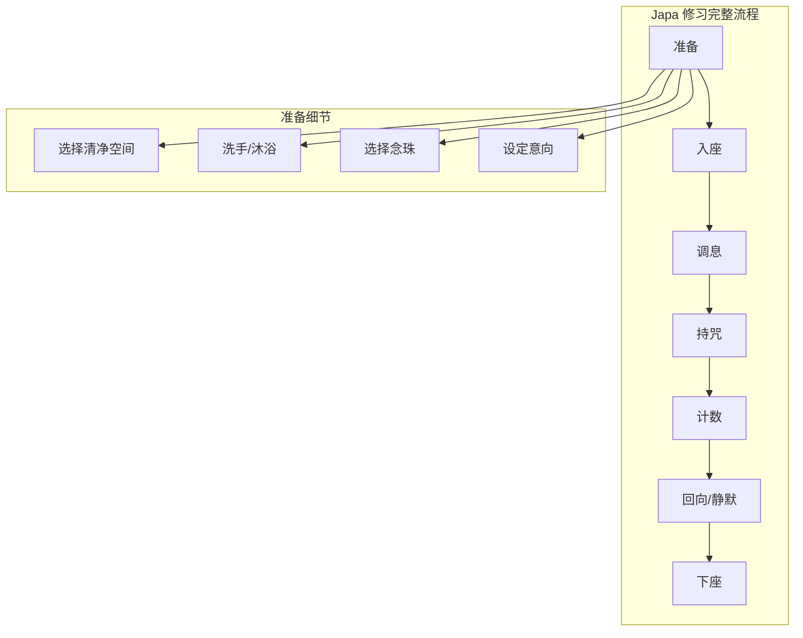
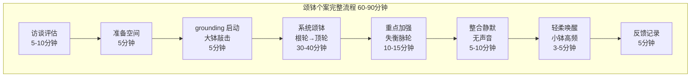
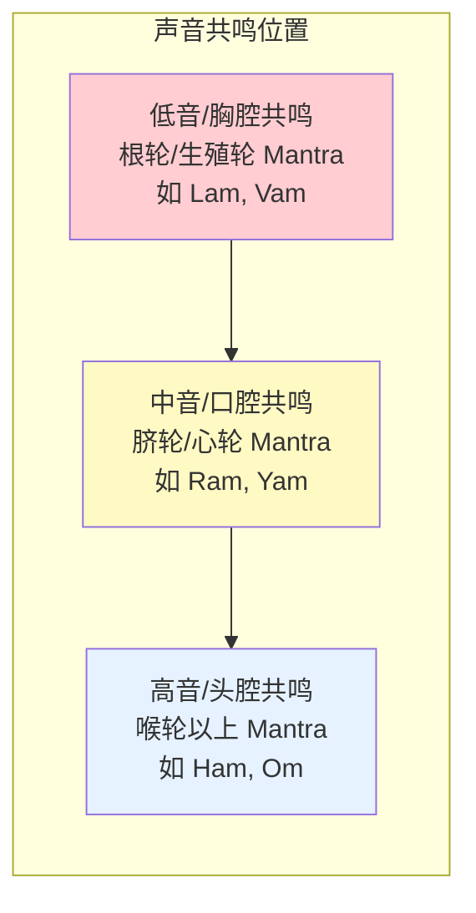

---

title: "真言唱诵实践指南"
description: "真言唱诵实践指南的详细解析与实践指南"
category: "心智与心理学 > 冥想 > Mantra Chanting"
tags: ["anxiety"]
last_updated: "2026-05"
difficulty: "intermediate"
reading_level: "intermediate"
estimated_read_time: "10min"
intent_queries:
  - "什么是真言唱诵实践指南"
  - "真言唱诵实践指南的核心概念"
  - "真言唱诵实践指南的方法与实践"
trigger_keywords: ["真言唱诵实践指南", "act", "anxiety", "art", "assessment"]
cross_refs:
  - path: "01-Wisdom-Traditions/religions/buddhism/psychology/Buddhism_Psychotherapy_Theory.md"
    relation: "anxiety/buddhism/communication"
  - path: "04-Humanities-Arts/arts/calligraphy-therapy/Calligraphy_Therapy_Overview.md"
    relation: "anxiety/buddhism/communication"
  - path: "04-Humanities-Arts/arts/craft-therapy/Craft_Therapy_Overview.md"
    relation: "anxiety/buddhism/communication"
  - path: "04-Humanities-Arts/media/music/music-therapy/Sacred_Music_Therapy.md"
    relation: "anxiety/buddhism/communication"
  - path: "README.md"
    relation: "anxiety/buddhism/communication"

---
# 真言唱诵实践指南

> **最后更新：2026-05**
>
> 本指南涵盖六种传统的经典真言（Mantra），以及 Japa、Kirtan 和颂钵疗愈的完整实操体系。

---

## 目录

1. [六大经典真言修习指南](#1-六大经典真言修习指南)
2. [个人 Japa 修习完整设置](#2-个人-japa-修习完整设置)
3. [集体 Kirtan 带领指南](#3-集体-kirtan-带领指南)
4. [颂钵疗愈操作流程](#4-颂钵疗愈操作流程)
5. [声音冥想中的声带保护](#5-声音冥想中的声带保护)
6. [附录：参考资源](#6-附录参考资源)

---

## 1. 六大经典真言修习指南

### 1.1 真言总览表

| 真言 | 传统 | 核心意义 | 最佳时间 | 推荐数量 |
|------|------|----------|----------|----------|
| Om Mani Padme Hum | 藏传佛教 | 慈悲与智慧的合一 | 清晨 | 108-1080遍 |
| Om Namah Shivaya | 印度湿婆派 | 臣服于内在转化之力 | 黄昏 | 108遍起 |
| Gayatri Mantra | 印度吠陀传统 | 内在光明的唤醒 | 日出/日落 | 108遍 |
| Ave Maria | 基督教 | 谦卑、恩典与母性庇护 | 任何时间 | 9-50遍 |
| Lumen Christi | 基督教 | 基督之光的临在 | 黎明/礼仪中 | 反复咏唱 |
| Allahu Akbar | 伊斯兰苏菲传统 | 对至高存在的臣服与赞美 | 五次礼拜时 | 33-99遍 |

---

### 1.2 Om Mani Padme Hum（藏传佛教）

#### 发音指南

| 音节 | 音标 | 发音要点 |
|------|------|----------|
| **Om** | /oʊm/ | 从"O"滑向闭口"M"，感受鼻腔共鸣 |
| **Mani** | /ˈmɑːni/ | "玛"开口音，"尼"舌尖轻抵上颚 |
| **Padme** | /ˈpʌdmeɪ/ | "帕德"轻快，"美"嘴唇微微收圆 |
| **Hum** | /hʊm/ | 低吟"吽"，胸腔与腹部共鸣，收束感 |

> **音频描述**：整体音调偏低沉平稳，速度缓慢，每个音节之间略有停顿。类似寺院晨钟的韵律，尾音"Hum"有下沉感。

#### 意义层次

| 层次 | 解释 |
|------|------|
| **字面** | "唵，宝中之莲，吽" |
| **象征** | 莲花生于淤泥，代表在烦恼中觉醒的佛性 |
| **密意** | 六音节分别净化六道众生的六种根本烦恼 |
| **修行意涵** | 将粗糙的情绪（mud）转化为清净的智慧（lotus） |

#### 修习步骤

1. **准备**：坐直，观想心间有四臂观音，白光环绕
2. **呼吸**：三次深呼吸，将浮躁安定
3. **持诵**：出声或默念，配合念珠计数
4. **观想**：每个音节发出时，白光从观音心轮发出，净化自己与他人
5. **回向**：结束时将功德回向一切众生

#### 数量建议

| 阶段 | 数量 | 时间 |
|------|------|------|
| 初学 | 21遍 | 5分钟 |
| 日常 | 108遍 | 15-20分钟 |
| 精进 | 1080遍（1 Mala × 10） | 2-3小时 |
| 闭关 | 100,000遍 | 数周至数月 |

---

### 1.3 Om Namah Shivaya（印度湿婆派）

#### 发音指南

| 音节 | 音标 | 发音要点 |
|------|------|----------|
| **Om** | /oʊm/ | 宇宙原音，深长饱满 |
| **Namah** | /ˈnʌmə/ | "那玛"，带臣服感，声调略降 |
| **Shi** | /ʃiː/ | "湿"，舌尖后缩，气音轻送 |
| **va** | /və/ | "哇"，轻而短 |
| **ya** | /jə/ | "亚"，尾音上扬 |

> **音频描述**：五个音节（Om-Na-mah-Shi-va-ya）可唱成六拍或五拍旋律。传统上音调从中音区开始，"Shiva"部分略微提高，"ya"有释放感。常见传统旋律为：低-低-中-高-中-低。

#### 意义层次

| 层次 | 解释 |
|------|------|
| **字面** | "我礼敬/臣服于湿婆" |
| **深层** | 礼敬内在的"吉祥者"——超越生死的真实自性 |
| **Tantric 解读** | 五音节对应五大元素（地水火风空），第六音 Om 超越元素 |
| **心理学意涵** | 放下小我控制，让"更大的力量"引导转化 |

#### 修习步骤

1. **准备**：可在湿婆林伽前，或任何安静处
2. **手印**：双手合十于胸前（Anjali Mudra）或置于头顶
3. **节奏**：每遍约 8-10 秒，不疾不徐
4. **融入**：感受每个音节在身体不同部位的振动
5. **静默间隔**：每 108 遍后静默 2-3 分钟

#### 最佳时间

| 时段 | 特殊意义 |
|------|----------|
| **Brahma Muhurta**（日出前1.5小时） | 最神圣的时刻，能量清净 |
| **黄昏（Sandhya）** | 日夜交替，适合转化类修习 |
| **周一** | 传统上献给湿婆的日子 |

---

### 1.4 Gayatri Mantra（吠陀传统）

#### 发音指南

| 部分 | 梵文 | 音标 | 要点 |
|------|------|------|------|
| 第一节 | Oṃ bhūr bhuvaḥ svaḥ | /oʊm bʰur bʰuˈʋaːh sʋaːh/ | 三声"斯瓦哈"短促有力 |
| 第二节 | Tat savitur vareṇyaṃ | /tʰət sʋɐˈtiːr ˈʋɐreːɳjɐm/ | "瓦伦雅"舌颤 |
| 第三节 | Bhargo devasya dhīmahi | /ˈbʰɐrɡoː ˈdeːʋɐsjɐ dʰiːˈmɐɦi/ | "德瓦西亚"有神圣感 |
| 第四节 | Dhiyo yo naḥ prachodayāt | /ˈdʰiːjoː joː nɐh prɐtʃoːˈdʰaːjaːt/ | 结尾上扬，如祈祷 |

> **音频描述**：Gayatri 有特定的吟诵调（Sāma Veda 调式），旋律呈波浪状。每节之间有短暂呼吸。整体感觉庄严如日出，尾音"prachodayāt"有向上托举的祈祷感。

#### 意义层次

| 层次 | 解释 |
|------|------|
| **字面** | "我们冥想那值得礼敬的造物主之光，愿祂启发我们的智慧" |
| **吠陀哲学** | 对太阳神 Savitr 的祈祷，请求内在光明的觉醒 |
| **现代诠释** | 对"内在智慧之源"的敞开，请求更高的洞见 |
| **科学隐喻** | 如光合作用般，让意识的"光"转化为智慧的"能量" |

#### 修习步骤

1. **准备**：面向东方（日出方向），或观想内在太阳
2. **呼吸法**：先进行 5 轮 Nadi Shodhana（交替鼻孔呼吸）净化气脉
3. **持诵**：每遍约 20-30 秒，24 个音节清晰分明
4. **数量**：传统上 108 遍为一完整修习
5. **配合**：可在 Sandhyavandanam（黄昏仪式）中进行

#### 最佳时间

| 时段 | 名称 | 意义 |
|------|------|------|
| 日出前 | Prātaḥ Sandhyā | 唤醒智慧 |
| 正午 | Mādhyāhna Sandhyā | 维持清明 |
| 日落 | Sāyaṃ Sandhyā | 转化烦恼 |

---

### 1.5 Ave Maria（基督教）

#### 发音指南

| 语言 | 版本 | 音标要点 |
|------|------|----------|
| **拉丁语** | Ave Maria, gratia plena... | /ˈaː.ʋeː maˈriː.a ˈɡraː.tsi.a ˈpleː.na/ |
| **英语** | Hail Mary, full of grace... | /heɪl ˈmeə.ri fʊl əv ɡreɪs/ |
| **中文** | 万福玛利亚，你充满圣宠... | 中文祈祷版本 |

> **音频描述**：拉丁语 Gregorio 圣咏版最为庄严，音调缓慢起伏，在"Sancta Maria"处达到情感高点。Schubert 的《Ave Maria》是古典音乐中最著名的旋律版本。

#### 意义层次

| 层次 | 解释 |
|------|------|
| **字面** | 「万福，满被圣宠者，主与你同在」 |
| **神学** | 对圣母玛利亚的祈祷，她是「中保」与庇护者 |
| **普世意义** | 对神圣女性原则（Divine Feminine）的礼敬 |
| **心理意涵** | 呼唤内在的滋养、接纳与无条件之爱 |

#### 修习步骤

1. **准备**：可在教堂、家中祭坛，或任何安静处
2. **姿态**：双手合十，或手持玫瑰经念珠
3. **玫瑰经结构**：
   - 十字圣号
   - 信经
   - 3 遍「万福玛利亚」
   - 天主经
   - 5 端奥迹（每端 1 遍天主经 + 10 遍万福玛利亚 + 1 遍圣三光荣颂）
4. **观想**：每端奥迹配合一个耶稣生平事件进行默观
5. **结束**：圣三光荣颂 + 十字圣号

#### 最佳时间

| 时间 | 意义 |
|------|------|
| **清晨** | 开启一天的恩典 |
| **困难时刻** | 寻求庇护与安慰 |
| **睡前** | 交托与安息 |

---

### 1.6 Lumen Christi（基督教）

#### 发音指南

| 短语 | 音标 | 要点 |
|------|------|------|
| **Lumen Christi** | /ˈluː.men ˈkʰris.ti/ | 「路门克里斯提」，清晰明亮 |
| **Deo gratias** | /ˈdeː.o ˈɡraː.ti.as/ | 回应「感谢天主」 |

> **音频描述**：复活节守夜礼中，执事高举复活蜡烛进入黑暗教堂，三次高呼 "Lumen Christi"，每次语调升高。声音在黑暗空间回荡，象征光明战胜黑暗。

#### 意义层次

| 层次 | 解释 |
|------|------|
| **礼仪语境** | 复活节守夜礼的核心仪式，复活蜡烛象征复活的基督 |
| **象征意义** | 内在基督之光的觉醒，照亮意识的黑暗角落 |
| **冥想意涵** | 观想心轮有蜡烛/光明，逐层照亮身体与心灵的黑暗 |
| **普世转化** | 任何传统中的「光明冥想」都可以此真言为锚点 |

#### 修习步骤

1. **环境**：昏暗空间，面前点燃一支蜡烛
2. **视觉聚焦**：注视烛光，进行 Trataka（烛光冥想）
3. **持诵**：闭眼后，在心中默念 "Lumen Christi"
4. **观想**：想象光从胸口向全身扩散
5. **回应**：每次光明扩展后，心念 "Deo gratias"

---

### 1.7 Allahu Akbar（伊斯兰苏菲传统）

#### 发音指南

| 词 | 音标 | 要点 |
|----|------|------|
| **Allah** | /ʔalˈlaːh/ | 喉音「阿」，舌尖抵上颚发「拉」，「胡」轻收 |
| **Akbar** | /ʔakˈbaːr/ | 「阿克」清晰，「巴尔」嘴唇收圆，尾音有回响感 |

> **音频描述**：宣礼（Adhan）中的 "Allahu Akbar" 高亢悠扬，「拉」音拉长上扬，在伊斯兰世界每天五次回荡。苏菲 Dhikr 中则快速重复，形成节奏性沉醉。

#### 意义层次

| 层次 | 解释 |
|------|------|
| **字面** | 「真主至大」 |
| **深层** | 在任何时刻，至高存在的伟大超越一切境遇 |
| **苏菲意涵** | 通过反复念诵（Dhikr），让「至大者」取代小我成为意识的中心 |
| **心理学** | 在焦虑/恐惧时，将注意力从问题转向「更大的存在」 |

#### 修习步骤

1. **准备**：小净（Wudu），面向麦加（如可能）
2. **坐姿**：跪坐（Tashahhud 姿势）或盘坐
3. ** Dhikr 方法**：
   - **Jahr（出声）**：大声念诵，适合集体
   - **Sirr（低声）**：嘴唇微动，只有自己听见
   - **Khafi（默诵）**：完全默念，专注内在
4. **节奏**：使用念珠（Misbaha）或手指计数
5. **数量**：33遍、99遍或100遍为常见周期

#### 最佳时间

| 时间 | 名称 | 说明 |
|------|------|------|
| 清晨（Fajr） | 晨礼 | 意识最清净 |
| 正午（Dhuhr） | 晌礼 | 工作中的暂停 |
| 下午（Asr） | 晡礼 | 转换情绪 |
| 黄昏（Maghrib） | 昏礼 | 感谢与交托 |
| 夜间（Isha） | 宵礼 | 反思与安息 |

---

## 2. 个人 Japa 修习完整设置

### 2.1 Japa 修习架构



### 2.2 念珠（Mala）选择指南

| 材质 | 传统意义 | 手感/特性 | 适合真言 |
|------|----------|-----------|----------|
| **菩提子（Rudraksha）** | 湿婆之泪，保护力量 | 粗糙有纹理，接地感强 | Om Namah Shivaya、哈他瑜伽 |
| **檀香木（Sandalwood）** | 清凉、净化 | 细腻温润，香气安神 | 任何真言 |
| **水晶/石英** | 放大能量 | 光滑清凉，触感精致 | 高频真言、眉心轮/顶轮修习 |
| **莲花子（Lotus Seed）** | 出淤泥不染 | 轻、有纹理 | 观音菩萨真言 |
| **玛瑙/红玉髓** |  grounding、力量 | 沉重、稳定 | 根轮/脐轮修习 |
| **砗磲/贝壳** | 海洋、慈悲 | 洁白、温润 | 慈悲类真言 |
| **骨/角** | 无常 reminder | 独特质感 | 藏传佛教传统 |

### 2.3 108颗念珠的结构与持珠手法

```
         主珠（Meru/Guru Bead）
              ↑
    ┌─────────────────────────┐
    │  108 颗子珠，均匀分布    │
    │  通常分成四段，每段27颗   │
    │  或以结（knots）分隔      │
    └─────────────────────────┘
```

#### 标准持珠手法

| 手 | 手指 | 动作 |
|----|------|------|
| **右手** | 拇指 + 中指 | 夹住珠子，每念一遍拨过一颗 |
|  | 食指 | **不触碰**念珠（传统上食指代表小我/欲望） |
| **左手** | 托住念珠底部 | 稳定，或持计数器 |

> **流程**：从 Meru 珠右侧第一颗开始，拇指拨珠，顺时针方向。念完一圈（108遍）后，**不跨越 Meru 珠**，反向拨回。

### 2.4 计数方法进阶

| 方法 | 说明 | 适用场景 |
|------|------|----------|
| **单圈计数** | 108 颗 = 108 遍 | 日常修习 |
| **手指计数法** | 右手手指关节计数，配合念珠 | 没有念珠时 |
| **多圈累计** | 108 × N 圈 = 总数量 | 发愿完成特定数量 |
| **计数器（ mechanical）** | 佛教/藏传佛教常用 | 精确记录大数量 |
| **手机 App** | 电子计数 | 现代人辅助，但保持仪式感 |

### 2.5 坐姿选择

| 坐姿 | 难度 | 特点 | 建议 |
|------|------|------|------|
| **莲花坐（Padmasana）** | 高 | 最稳定，能量循环最佳 | 有经验者 |
| **半莲花** | 中 | 稳定与舒适的平衡 | 大多数人 |
| **简易坐（Sukhasana）** | 低 | 舒适，可长时间保持 | 初学者首选 |
| **金刚坐（Vajrasana）** | 低 | 饭后可做， grounding | 消化不佳者 |
| **椅子坐** | 最低 | 背部有支撑 | 膝盖/髋部不适者 |

> **要点**：脊柱自然挺直，下巴微收，双肩放松。坐垫高度应使膝盖低于髋部。

---

## 3. 集体 Kirtan 带领指南

### 3.1 Kirtan 结构流程


### 3.2 歌曲选择与编排

| 阶段 | 情绪目标 | 推荐曲目类型 | 时长 |
|------|----------|-------------|------|
| **开场** | 聚集、安静 | 慢版 Hari Om / Shanti | 5-10 分钟 |
| **建立** | 温暖、连接 | 中等速度的 Mantra，如 Om Namah Shivaya | 10-15 分钟 |
| **高峰** | 释放、狂喜 | 快速 Kirtan，鼓点强烈，如 Krishna Das 风格 | 15-20 分钟 |
| **回落** | 柔软、开放 | 慢版 Gayatri / Lokah Samastah | 10 分钟 |
| **静默** | 内化、整合 | 无音乐，或极轻柔背景音 | 5-10 分钟 |
| **结束** | 感恩、和平 | Om Shanti Shanti Shanti | 3-5 分钟 |

### 3.3 乐器搭配

| 乐器 | 功能 | 使用技巧 |
|------|------|----------|
| ** Harmonium（印度手风琴）** | 旋律主导，提供和弦基础 | 掌握基本和弦进行（I-IV-V），音量适中不压人声 |
| **Kirtan 鼓（Mridangam/Dholak）** | 节奏骨架，驱动能量 | 基本节奏型（Keherwa: Dha Ge Na Ti Na Ka Dhi Na） |
| **Kartal（印度铙钹）** | 高频点缀，唤醒注意力 | 在段落切换时敲击，不过度使用 |
| **吉他/尤克里里** | 现代 Kirtan 的亲切感 | 开放式调弦，扫弦节奏 |
| **Bass 低音** |  grounding，身体共振 | 跟随根音，稳定低频 |
| **颂钵/音叉** | 开场/结束时的过渡 | 长音铺底，营造神圣空间 |

### 3.4 Call-and-Response 技巧

| 技巧 | 说明 | 示例 |
|------|------|------|
| **简单重复** | 带领者唱一句，群众重复 | Leader: "Hari Om" → Group: "Hari Om" |
| **分层叠加** | 先教旋律，再加入节奏层 | 先唱 2 遍主旋律 → 加入鼓 → 加入和声 |
| **快慢交替** | 通过速度变化制造张力 | 慢速 2 遍 → 加速 → 最快 → 骤停 → 慢速 |
| **音量动态** | 从极弱到极强的渐变 | PPP（极弱）→ FF（极强）→ PP（回归安静） |
| **循环加长** | 在某一句上停留加长 | "Om Mani Padme Hum" 循环 8-16 遍不切换 |
| **自由吟唱** | 放弃固定旋律，进入自发 | 在高潮后放开旋律，集体即兴 |

### 3.5 能量管理

| 现象 | 识别 | 应对策略 |
|------|------|----------|
| **群体能量涣散** | 声音稀疏、有人看手机 | 降低复杂度，回到最简单的 Mantra |
| **情绪过度释放** | 有人哭泣、颤抖失控 | 不阻止，但放慢节奏，增加 grounding 元素 |
| **某人主导抢唱** | 声音过大、不和谐 | 用眼神引导，或在休息间隙私下沟通 |
| **能量过高无法落地** | 结束后大家漂浮、无法交流 | 增加结束时的 grounding 唱诵，如 Earth Mantra |
| **冷场** | 带领者忘词/忘旋律 | 坦诚微笑，重新开始，群众通常支持 |

---

## 4. 颂钵疗愈操作流程

### 4.1 七脉轮对应频率参考

> **注意**：以下频率为当代商业体系常用参考，非古代传统。传统颂钵并无精确频率分配。

| 脉轮 | 音名 | 频率（Hz） | 现代对应 | 传统钵型 |
|------|------|-----------|----------|----------|
| 根轮 | C | 256-261 |  Mozart 效应基础音 | 大钵（>28cm） |
| 生殖轮 | D | 288-293 | 与地球共振相关 | 中大钵（25-28cm） |
| 脐轮 | E | 320-324 | 太阳神经丛区域 | 中钵（22-25cm） |
| 心轮 | F | 341-349 | 与爱的频率相关 | 中钵（20-23cm） |
| 喉轮 | G | 384-392 | 沟通表达 | 中小钵（18-21cm） |
| 眉心轮 | A | 426-440 | 标准音 A=440 | 小钵（15-18cm） |
| 顶轮 | B | 480-488 | 高频觉醒 | 小钵/叮夏（<15cm） |

### 4.2 敲击与磨钵技巧

| 技法 | 工具 | 动作 | 声音特点 | 适用场景 |
|------|------|------|----------|----------|
| **敲击（Striking）** | 皮槌/软槌 | 轻触钵壁中下部，快速离开 | 清澈、扩散性强 | 开场、空间净化 |
| **磨钵（Rimming）** | 木棒/皮棒 | 匀速绕钵口边缘摩擦 | 持续长音、渐强 | 深度放松、持续疗愈 |
| **水钵（Water Bowl）** | 加水后磨钵 | 钵内少量水，慢速摩擦 | 水波振动声 | 特殊效果（谨慎使用） |
| **双钵和声** | 两个相邻频率钵 | 先后敲击，让泛音交融 | 拍频（Binaural）效果 | 深度冥想 |
| **身体接触** | 钵底接触身体 | 磨钵同时让振动传入身体 | 直接体感振动 | 身体特定部位（轻压） |

### 4.3 个案操作流程



#### 详细步骤

| 阶段 | 操作细节 | 注意事项 |
|------|----------|----------|
| **访谈** | 了解个案身心状态、听力敏感度、金属植入物 | 有起搏器者避免身体接触式颂钵 |
| **空间准备** | 调暗灯光、室温舒适、个案仰卧盖毯 | 保护隐私与温暖 |
| ** grounding 启动** | 大钵（根轮钵）在个案脚边敲击 3 次 | 让意识进入身体 |
| **系统颂钵** | 按根→生殖→脐→心→喉→眉心→顶顺序，每个钵敲击+磨钵 3-5 分钟 | 观察个案呼吸与面部反应 |
| **重点加强** | 对需要特别支持的脉轮增加时间 | 不强行"打开"，尊重个案节奏 |
| **整合静默** | 所有声音停止，让共振自然消散 | 陪伴但不打扰 |
| **唤醒** | 从轻到重，从远到近，用高频小钵渐进唤醒 | 避免突然惊吓 |
| **反馈** | 询问体感、情绪、视觉印象，记录 | 用于后续 session 调整 |

---

## 5. 声音冥想中的声带保护

### 5.1 呼吸支持体系

| 呼吸类型 | 机制 | 在唱诵中的应用 |
|----------|------|---------------|
| **腹式呼吸** | 横膈膜下降，腹部隆起 | 低音 Mantra 的基础支持 |
| **胸式呼吸** | 肋骨扩张，胸部起伏 | 中音区的补充 |
| **锁骨呼吸** | 肩膀上提 | **避免**，会导致喉咙紧张 |
| **完全瑜伽呼吸** | 腹→胸→锁骨连贯，反向呼气 | 长 Mantra 的完整支持 |

#### 唱诵前呼吸准备

1. **三段式深呼吸** × 5
2. **蜂鸣呼吸（Bhramari）** × 5 — 预热声带
3. **狮子式（Simhasana）** × 3 — 释放面部紧张

### 5.2 发音位置指南



| 共鸣区 | 感受 | 练习方法 |
|--------|------|----------|
| **胸腔共鸣** | 胸口振动 | 发「V」音，手放胸口感受振动 |
| **口腔共鸣** | 口中饱满 | 发「Ma」音，感受口腔空间 |
| **鼻腔共鸣** | 鼻梁振动 | 发「M」或「N」尾音 |
| **头腔共鸣** | 头顶/眉心振动 | 发高音「Mmm」，感受头部 |

### 5.3 避免过度用声

| 危险信号 | 原因 | 对策 |
|----------|------|------|
| 唱诵后喉咙痛 | 声带过度摩擦 | 降低音量，增加气声比例 |
| 声音嘶哑持续 >24小时 | 声带小结风险 | 完全休声，就医检查 |
| 颈部肌肉酸痛 | 喉咙周围肌肉代偿 | 放松下巴，减少强制发声 |
| 头晕/过度换气 | 呼吸过快过浅 | 放慢速度，增加呼气长度 |
| 耳朵闷胀感 | 咽鼓管过度压力 | 降低闭合声（如 M、N）的强度 |

### 5.4 声音热身与冷却

| 阶段 | 练习 | 时间 |
|------|------|------|
| **热身** | 唇颤音（吹唇）、舌颤音（大舌音/小舌音） | 2 分钟 |
|  | 滑音（Siren）：从低音滑到高音再滑回 | 2 分钟 |
|  | 哼鸣（Humming）：闭口，感受面部共振 | 2 分钟 |
| **唱诵中** | 每 20 分钟喝水润喉 | — |
|  | 感到疲劳时切换为默念 | — |
| **冷却** | 叹息声（Sigh）：完全放松的呼气 | 1 分钟 |
|  | 静默：完全停止声音 | 3-5 分钟 |
|  | 温水（非冰水）润喉 | — |

---

## 6. 附录：参考资源

### 6.1 推荐书目

| 书名 | 作者 | 说明 |
|------|------|------|
| *Mantra Meditation* | Thomas Ashley-Farrand | 梵咒的发音与修习权威指南 |
| *The Heart of Tibetan Buddhism* | Chögyam Trungpa | 藏传佛教唱诵的深层理解 |
| *Kirtan!: Chanting as a Spiritual Practice* | Linda Johnsen | Kirtan 的历史与实践 |
| *The Tibetan Book of Living and Dying* | Sogyal Rinpoche | 藏传佛教修行的整体语境 |
| *Singing the Journey* | Various | UU 传统的圣歌集，跨宗教参考 |

### 6.2 推荐音乐/音频资源

| 艺术家/专辑 | 传统 | 说明 |
|-------------|------|------|
| **Krishna Das** | 印度 Kirtan | 西方最著名的 Kirtan 艺术家 |
| **Deva Premal** | 印度 Mantra | 女性柔和风格的 Sanskrit 唱诵 |
| **Tibetan Monks of Gyume** | 藏传佛教 | 传统金刚诵，极低频共鸣 |
| **Giovanni Vianelli** | 格里高利圣咏 | 天主教传统咏唱 |
| **Nusrat Fateh Ali Khan** | 苏菲 Qawwali | 苏菲狂喜音乐的经典 |
| **Snatam Kaur** | 锡克/瑜伽 | 现代瑜伽课堂常用 |

### 6.3 颂钵采购与使用建议

| 建议 | 说明 |
|------|------|
| **购买渠道** | 优先选择尼泊尔/西藏传统工艺，避免机器压制钵（声音扁平） |
| **选择标准** | 声音持续时间长（>30秒）、泛音丰富、无明显金属刺耳感 |
| **保养** | 避免阳光直射、定期用布擦拭、不用化学清洁剂 |
| **禁忌** | 有癫痫史者慎用高频连续音；孕妇避免腹部直接放钵 |

---

> **免责声明**：本指南仅供教育与自我探索之用。声音冥想虽普遍安全，但如有听力问题、精神疾病史或孕期，请在专业人士指导下进行。

---

*文档版本：1.0 | 最后更新：2026-05 | Peace Lab Database*
