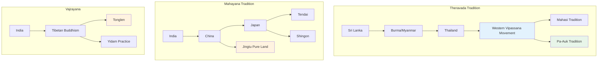
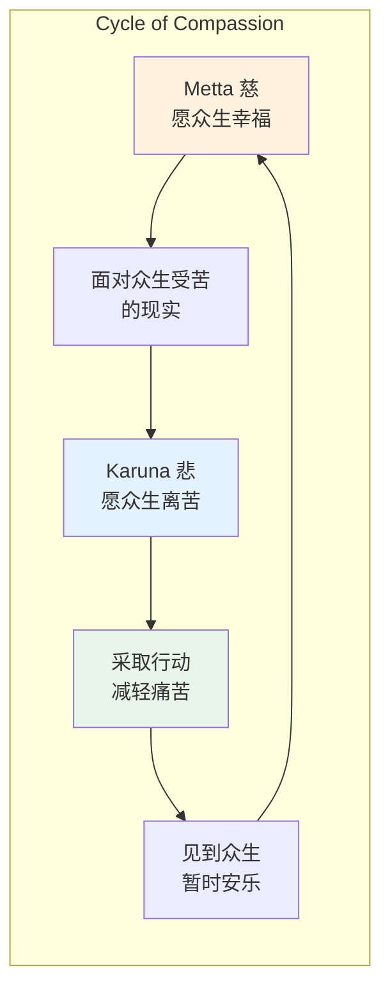
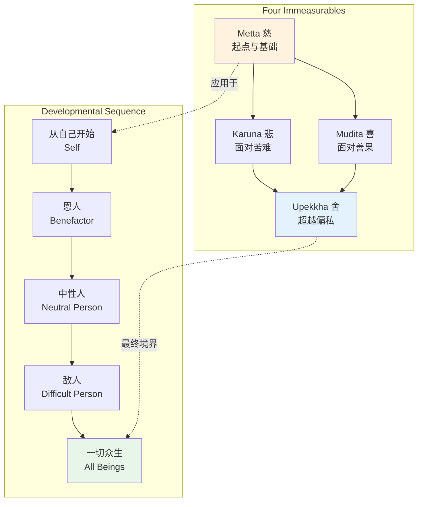
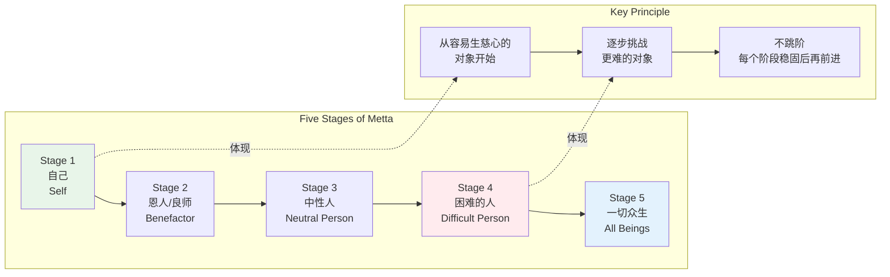
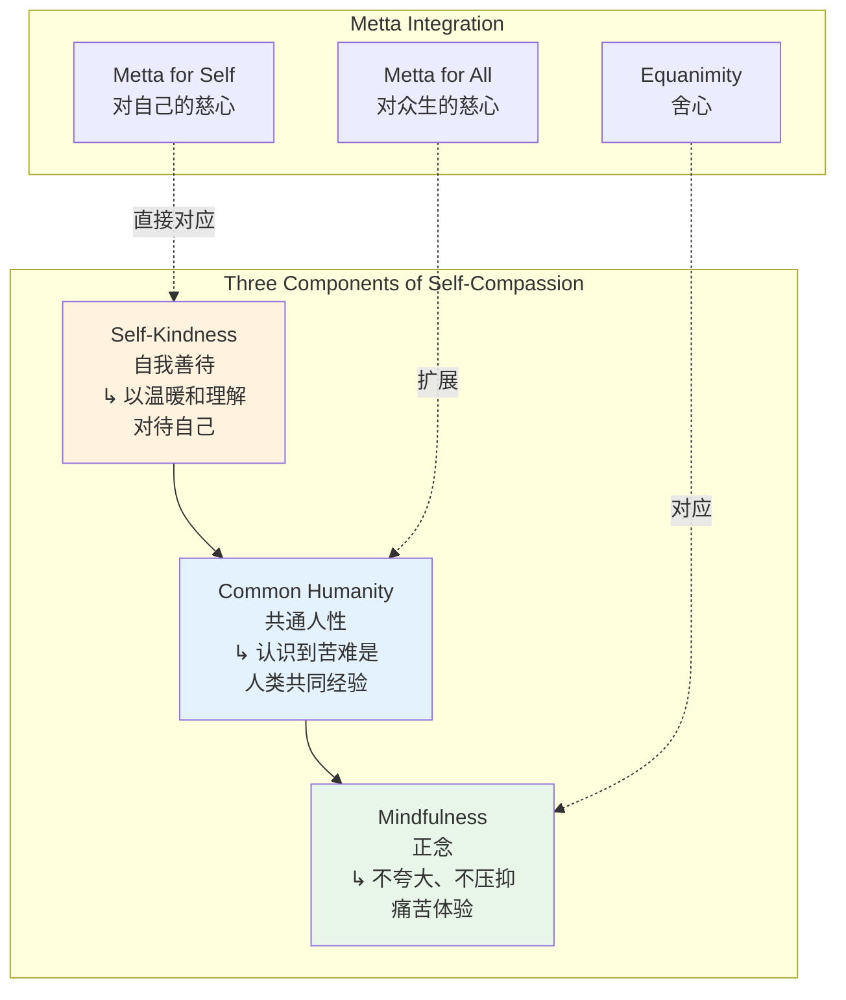
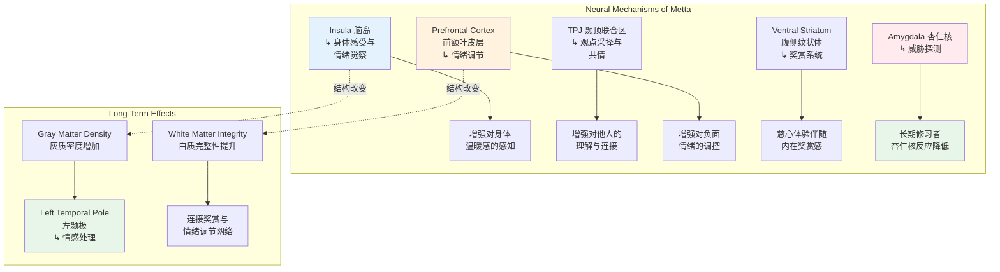
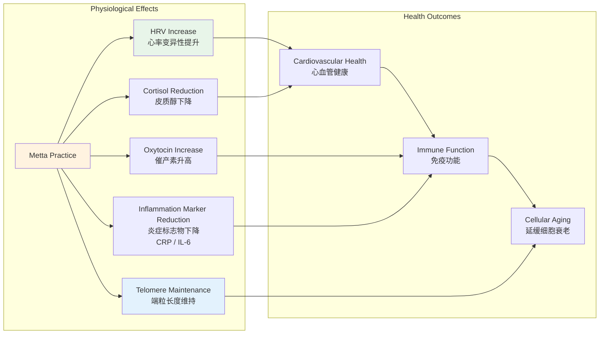
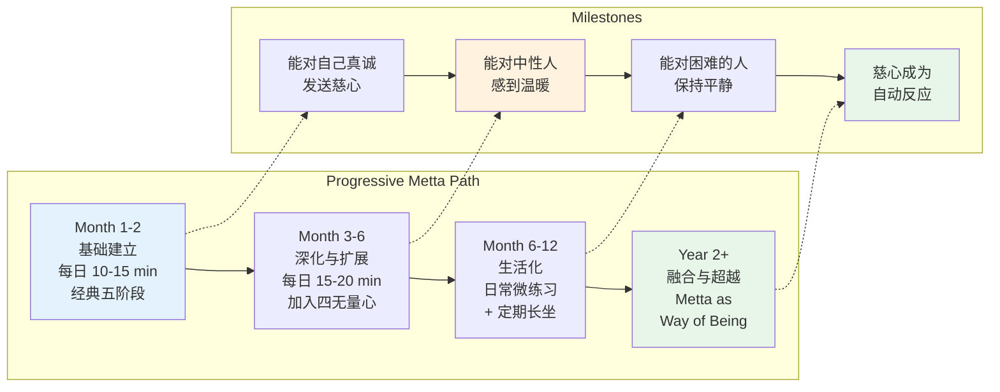

# 慈心禅专业概述：历史经典、修习体系与科学证据

> **适用对象**：冥想初学者与进阶者、心理咨询师、临床工作者、佛教研究者、社会工作者、教育工作者
> **阅读时长**：约 35–50 分钟（可分段阅读）
> **实践建议**：配合正文中的阶段性练习，分 3–5 次完成，每次 10–20 分钟
> **最后更新**：2026-05

---

## 一、历史与经典来源

### 1.1 巴利经典中的 Metta

慈心（Metta）在巴利语中的字面含义是"友好的、善意的"，词根来自 *mitta*（朋友）。它不是浪漫之爱、不是亲情、不是欲望——而是一种**无条件的、普遍的善意**，愿一切众生幸福安乐。

**核心经典：《慈心经》（Metta Sutta, Sutta Nipata 1.8 / Khuddakapatha 9）**

《慈心经》是上座部佛教中最广为传诵的经典之一，通常作为防护诵（Paritta）在仪式中念诵。它既是一首优美的诗歌，也是一份完整的慈心修习手册。

| 经文结构 | 内容要点 | 修习意义 |
|---------|---------|---------|
| **开篇** | 善行者应具备的 15 种品德 | 确立修习者的伦理基础——慈心不是空洞的愿望，而是建立在正直品格之上的 |
| **核心偈颂** | "愿一切众生快乐安稳，愿他们内心满足" | 扩展善愿的对象，从个人到一切众生 |
| **扩展对象** | 或立、或行、或坐、或卧，只要清醒，即住于慈心 | 慈心不限于坐禅，应融入一切生活姿态 |
| **防护功能** | 如母亲以生命保护独子，修行者以无量心庇护一切众生 | 慈心具有实际的防护作用——经文中提到毒物、武器、火灾等不能伤害慈心具足者 |
| **究竟指向** | 不修止观者不得禅定解脱；慈心修习者最终达到"不再入胎" | 慈心不是"软弱的情感"，而是导向解脱的正式修行路径 |

**关键巴利语词汇解析**：

| 词汇 | 巴利文 | 含义 |
|------|--------|------|
| **Metta** | Metta | 慈爱、善意、友好的祝愿；愿众生幸福 |
| **Karuna** | Karuna | 悲悯、同情；愿众生离苦 |
| **Mudita** | Mudita | 随喜、欣悦；为他人的善行善果感到喜悦 |
| **Upekkha** | Upekkha | 舍、平等心；对一切众生无分别的平静 |
| **Brahmavihara** | Brahmavihara | "梵住"、"四无量心"——四种如梵天般崇高的居住状态 |
| **Appamana** | Appamana | 无量——没有边界、没有限制 |

### 1.2 南北传佛教中的慈心修习传统



#### 南传传统的特点

在南传国家，慈心禅（Metta Bhavana）通常被归类为**止禅（Samatha）**的一种——即通过专注所缘来安定心识的修习。它与观禅（Vipassana）形成互补：

| 维度 | 慈心禅 Metta Bhavana | 观禅 Vipassana |
|------|---------------------|---------------|
| **类别** | 止禅（Samatha） | 观禅（Vipassana） |
| **所缘** | 慈爱感/祝愿语 | 身心现象的无常、苦、无我 |
| **目标** | 心识安定、培育善意 | 洞见实相、解脱烦恼 |
| **经典依据** | 《慈心经》《清净道论》 | 《念处经》《清净道论》 |
| **常见用途** | 克服恐惧、睡眠障碍、敌意；作为观禅的前行 | 根本解脱道 |
| **注意事项** | 某些传统认为过度修习慈心可能导致情感依赖 | 可能引发情绪释放，需要稳定基础 |

#### 北传与密续传统的特点

北传佛教对"慈"的理解更强调**主动的救度行为**而非内在的禅定体验：

- **中国天台宗**：智者大师在《摩诃止观》中系统阐述了"慈悲喜舍"四无量心观，结合圆顿止观的哲学框架
- **日本天台宗**：最澄将四无量心观传入日本，作为"四种三昧"之一
- **藏传佛教**：以**自他交换法（Tonglen）**最为独特——吸气时观想吸入他人苦难，呼气时观想送出幸福安乐。这与传统的向外发送慈心方向相反，被认为能更快速地摧毁我执

### 1.3 从东方寺院到西方诊所：近现代传播史

| 时间 | 事件 | 意义 |
|------|------|------|
| **1870s–1890s** | 巴利经典英译（Rhys Davids 等） | 西方学者首次系统接触南传佛教，Metta Sutta 进入英语世界 |
| **1950s–1960s** | 马哈希（Mahasi Sayadaw）在缅甸推动禅修开放 | 西方学生开始前往缅甸修习内观与慈心禅 |
| **1974** | Sharon Salzberg、Jack Kornfield、Joseph Goldstein 在美国创立内观禅修社（IMS） | 西方第一个系统的南传禅修中心，慈心禅作为核心课程 |
| **1976** | Sharon Salzberg 首次在 IMS 教授慈心禅 retreat | 慈心禅首次以系统化方式在西方传授 |
| **1995** | Sharon Salzberg 出版 *Lovingkindness: The Revolutionary Art of Happiness* | 西方第一本系统阐述慈心禅的通俗著作 |
| **2000s–2010s** | fMRI 研究爆发期：Lutz、Singer、Fredrickson 等 | 慈心禅从"佛教修行"转变为"有神经科学依据的心理训练" |
| **2010s–至今** | MBSR、MBCT、DBT、ACT 等疗法整合慈心元素 | 慈心技巧全面进入主流临床心理学 |

---

## 二、核心概念

### 2.1 Metta / Pema / Maitri：语义的深度解析

```mermaid
graph TD
    subgraph Semantic Field of Loving-Kindness
        C1[Metta / Maitri<br/>核心含义<br/>↳ 无条件的善意<br/>↳ 愿众生幸福] --> C2[Karuna<br/>悲心<br/>↳ 愿众生离苦]
        C1 --> C3[Mudita<br/>喜心<br/>↳ 随喜他人的善]
        C1 --> C4[Upekkha<br/>舍心<br/>↳ 平等无分别]
    end

    subgraph What Metta Is NOT
        N1[Romantic Love<br/>Eros] -.->|不同| C1
        N2[Attachment<br/>Upadana] -.->|不同| C1
        N3[Pity / Condescension<br/>↳ "可怜你"] -.->|不同| C1
        N4[Conditional Affection<br/>↳ "你对我好我才爱你"] -.->|不同| C1
    end

    style C1 fill:#e8f5e9
    style N3 fill:#ffebee
    style C4 fill:#fff3e0
```

**跨语言对比**：

| 语言 | 词汇 | 核心含义 | 细微差别 |
|------|------|---------|---------|
| **巴利语** | Metta | 友爱、善意、祝福 | 强调"朋友般的"非占有性关怀 |
| **梵语** | Maitri / Maitra | 慈爱、友好 | 与 Metta 同源，但大乘语境中更强调菩萨行的主动性 |
| **藏语** | Byams pa | 慈爱、温暖 | 常与菩提心（Bodhicitta）结合 |
| **中文** | 慈 | 给予快乐 | 常与"悲"（拔除痛苦）对举 |
| **日语** | 慈愛（Jiai） | 慈爱 | 多用于文学语境；佛教修行中仍用"メッタ"（Metta）音译 |
| **英语** | Loving-kindness | 爱与善的结合 | 由 Rhys Davids 创译，试图捕捉 Metta 的双重含义 |

**Metta 的本质特征**：

| 特征 | 说明 |
|------|------|
| **无条件性** | 不依赖对方的行为、品质或与你的关系 |
| **无占有性** | 不求回报、不求对方的爱、不求关系的发展 |
| **普遍性** | 最终扩展到一切众生，从亲近到敌对 |
| **主动性** | 不是被动的"感觉"，而是主动培养的意愿 |
| **温暖性** | 伴随身体的温暖、开放、扩张的感受 |
| **非排他性** | 爱一个人不减损对另一个人的爱——与浪漫之爱的排他性相反 |

### 2.2 慈（Metta）与悲（Karuna）的区别与联系

这是佛教心理学中最精微的区分之一。虽然常将"慈悲"连用，但二者指向不同的心理功能：

| 维度 | 慈 Metta | 悲 Karuna |
|------|---------|----------|
| **指向** | 众生的幸福与安乐 | 众生的痛苦与苦难 |
| **情感基调** | 温暖、光明、扩张、喜悦 | 柔软、深沉、关切、坚定 |
| **比喻** | 如阳光普照，无差别地温暖一切 | 如母亲对病中幼子的关切 |
| **风险** | 过度可能导致情感黏着、忽视苦难 | 过度可能导致悲痛欲绝、 burnout |
| **对治** | 对治敌意、冷漠、孤立 | 对治残忍、麻木、无情 |
| **身体感受** | 胸腔扩张、面部放松、微笑 | 心口柔软、眼眶微润、想要行动 |
| **与行动的关系** | 愿众生快乐（意愿层面） | 愿众生离苦，并可能激发救度行动 |

**二者的循环关系**：



> **临床意义**：现代心理学中的"同情疲劳"（Compassion Fatigue）往往发生在只有"悲"而没有"慈"的情况下。慈心禅的训练——尤其是将慈心先导向自己——为助人工作者提供了防止 burnout 的内在资源。

### 2.3 四无量心（Brahmavihara）：慈心的完整语境

四无量心是佛教心理学中对四种"崇高心境"的系统描述。理解它们之间的关系，是掌握慈心禅的关键。

| 无量心 | 巴利文 | 含义 | 对治 | 身体感受 |
|--------|--------|------|------|---------|
| **慈** | Metta | 愿众生幸福 | 敌意、愤怒、孤立 | 温暖、扩张、开放 |
| **悲** | Karuna | 愿众生离苦 | 残忍、麻木、冷漠 | 柔软、深沉、想要行动 |
| **喜** | Mudita | 随喜他人的善 | 嫉妒、竞争、不满 | 轻盈、明亮、由衷欢喜 |
| **舍** | Upekkha | 平等无分别 | 偏执、偏见、过度执着 | 平静、宽广、如天空 |



**四无量心的修习顺序**：

传统上，修行者先从**慈心**入手，因为它最容易生起、最温暖宜人。当慈心稳定后，面对苦难众生时自然转出**悲心**；面对他人善果时自然转出**喜心**；最终，当心境扩展到一切众生无分别时，达到**舍心**。

但现代教学也常将四无量心作为一个整体来修习——在每个对象上都依次发送慈、悲、喜、舍四种祝愿。

---

## 三、修习方法

### 3.1 经典五阶段：从己及人的扩展

这是上座部佛教最传统的慈心禅修习框架，以**祝愿语（Phrases）**为工具，逐步扩展善愿的对象。



#### 标准祝愿语（可根据个人调整）

传统上，慈心禅使用四句（或更多）标准化的祝愿语。以下是常用的巴利语原文与现代中文版本：

| 巴利语 | 中文 | 含义 |
|--------|------|------|
| **Sukhi attanam pariharatu** | 愿我/你平安 | 愿身心安稳，免受伤害 |
| **Avera hontu** | 愿我/你没有敌意 | 愿内心没有仇恨与冲突 |
| **Abyapajjha hontu** | 愿我/你没有身心的痛苦 | 愿远离身体病痛与心理困扰 |
| **Anigha hontu** | 愿我/你没有危难 | 愿生活顺遂，无外在威胁 |
| **Sukhi attanam pariharatu** | 愿我/你保持自己的快乐 | 愿内在的幸福得以维持和增长 |

> **个性化原则**：祝愿语不必严格遵循传统版本。你可以选择对自己最有感觉的词句——例如"愿你快乐"、"愿你健康"、"愿你安心"、"愿你自在"。关键是**真诚**，而非形式的正确。

#### 各阶段详解

| 阶段 | 对象 | 选择标准 | 常见困难 | 应对策略 |
|------|------|---------|---------|---------|
| **1** | 自己 | 最熟悉的人；但对自己有强烈自我厌恶者可能困难 | 觉得自己"不配"被慈爱 | 想象自己如一个需要关怀的孩子；或从恩人阶段开始，再回向自己 |
| **2** | 恩人/良师 | 一位无条件爱过你、帮助过你的人； ideally 已故或不常联系，以避免复杂情感 | 选择太多、或想不起来 | 可以是宠物、一位老师、甚至一个陌生人曾经的小善举 |
| **3** | 中性人 | 你认识但无强烈情感的人——便利店店员、邻居、同事 | 难以"找到感觉" | 不需要强烈情感，只是发送祝愿；可以从具体的人开始 |
| **4** | 困难的人 | 一位让你感到愤怒、受伤、嫉妒的人；初期不要选择创伤过深的人 | 愤怒爆发、无法发送祝愿 | 缩短时间；降低强度；允许愤怒存在但不被裹挟；必要时退回前一阶段 |
| **5** | 一切众生 | 从特定方向开始（东、南、西、北、上、下），再扩展到无边无际 | 感觉抽象、不真实 | 从具体场景开始——"愿这座城市的所有人…"、"愿所有生病的人…"，逐步扩展 |

### 3.2 Sharon Salzberg 的简化版与现代适配

Sharon Salzberg 是将慈心禅系统引入西方的关键人物。她在传统框架基础上做了几项重要的现代化调整：

| 传统方法 | Salzberg 的改编 | 理由 |
|---------|----------------|------|
| 固定四句祝愿语 | 允许完全个性化的祝愿语 | 让现代修习者找到真正触动内心的语言 |
| 严格的五阶段顺序 | 灵活调整，允许从恩人开始再回向自己 | 许多西方人对自己有强烈的自我批评，从自己开始反而触发痛苦 |
| 坐禅为主 | 行住坐卧皆可修习 | 适应现代生活方式，将慈心融入通勤、排队、等待 |
| 单次长时修习 | 多次短时修习（每次 5–10 分钟） | 降低门槛，建立习惯比单次深度更重要 |
| 个人独自修习 | 引导式 group practice + 个人修习 | 团体能量有助于突破个人阻力 |

**Salzberg 的个性化祝愿语示例**：

| 类型 | 示例 |
|------|------|
| **健康类** | "愿你身体健康"、"愿你远离病痛" |
| **安全类** | "愿你安全"、"愿你免受伤害" |
| **幸福类** | "愿你快乐"、"愿你内心平安" |
| **轻松类** | "愿你轻松面对生命的变化"、"愿你不执着" |
| **成功类** | "愿你的努力开花结果"、"愿你找到属于自己的道路" |

### 3.3 自我关怀（Self-Compassion）与 Metta 的结合

Kristin Neff 的研究将佛教慈心概念转化为现代心理学的"自我关怀"（Self-Compassion）框架。这不是对传统的背离，而是传统在当代语境中的重新表达。



**Neff 的自我关怀三步法**：

| 步骤 | 核心问题 | Metta 对应 |
|------|---------|-----------|
| **1. 正念** | "此刻我感到痛苦" | 如实觉知，不逃避 |
| **2. 共通人性** | "痛苦是人类经验的一部分，我并不孤独" | 将所有受苦者纳入慈心范围 |
| **3. 自我善待** | "愿我对自己温柔" | 将慈心导向自己 |

**临床应用提示**：

对于自我批评严重的人群（如抑郁症、完美主义者、饮食障碍患者），直接对自己说"愿你快乐"可能触发强烈的抗拒。Neff 建议的过渡方法是：

1. 先想象一个你深爱的孩子或朋友处于同样困境中
2. 你会对他们说什么？发送什么祝愿？
3. 然后将同样的祝愿**回向给自己**

这种"借道"的方法能绕过自我厌恶的防御机制。

### 3.4 修习方法对比表

| 方法 | 来源 | 核心特点 | 适合人群 | 典型时长 |
|------|------|---------|---------|---------|
| **传统五阶段法** | 上座部传统（Visuddhimagga） | 严格阶段、标准祝愿语、从己及人 | 有佛教背景、喜欢结构化修习者 | 每次 20–45 分钟 |
| **Sharon Salzberg 法** | IMS / 西方改良 | 个性化祝愿语、灵活顺序、生活化 | 初学者、西方文化背景者 | 每次 10–20 分钟 |
| **Tonglen 自他交换** | 藏传佛教 | 吸气观想取苦、呼气观想施乐 | 有一定基础、愿意挑战反向操作者 | 每次 15–30 分钟 |
| **四无量心循环** | 南北传共通 | 每个对象依次发送慈、悲、喜、舍 | 已掌握慈心基础、希望扩展者 | 每次 30–60 分钟 |
| **行走慈心禅** | 现代整合 | 每走一步发送一次祝愿 | 坐不住、身体活跃者 | 每次 10–20 分钟 |
| **睡眠慈心禅** | 传统应用 | 躺下后发送慈心直至入睡 | 失眠者、焦虑者 | 自然入睡为止 |

---

## 四、科学证据

### 4.1 慈心禅的神经科学：fMRI 研究的发现

过去二十年来，神经科学对慈心禅的研究呈现爆发式增长。以下是最具代表性的发现：



**关键研究概览**：

| 研究者 | 年份 | 方法 | 核心发现 |
|--------|------|------|---------|
| **Lutz et al.** | 2004 | fMRI, 长期冥想者 vs 新手 | 慈心禅激活左前额叶（与积极情绪相关），长期修习者 activation 更强 |
| **Hutcherson et al.** | 2008 | fMRI, 单次慈心禅 | 慈心禅增加对陌生人的积极情感，与脑岛和颞顶联合区激活相关 |
| **Klimecki et al.** | 2013 | fMRI, 慈心禅培训前后 | 慈心禅训练增加对苦难的积极反应（关怀而非回避），与眶额皮层激活相关 |
| **Engen & Singer** | 2015 | 元分析 | 慈心禅与共情训练激活不同神经网络——慈心更依赖奖赏系统，共情更依赖痛苦镜像 |
| **Weng et al.** | 2013 | fMRI, 行为实验 | 两周慈心禅训练增加利他行为，与腹侧纹状体激活相关 |
| **Kral et al.** | 2018 | 纵向 fMRI, 8 周 MBSR | 慈心元素在 MBSR 中促进情绪调节网络的重组 |

**关键洞察：慈心禅与共情的神经区分**

Singer 团队的重要发现是：**慈心禅（Metta）与共情（Empathy）激活不同的神经回路**。

| 维度 | 共情 Empathy | 慈心 Loving-kindness |
|------|-------------|---------------------|
| **神经基础** | 疼痛矩阵（前岛叶、前扣带回）——"镜像"他人痛苦 | 奖赏系统（腹侧纹状体、内侧前额叶）——"温暖"地回应他人 |
| **情感体验** | 可能伴随自身的痛苦感 | 伴随温暖、关怀、扩张感 |
| **长期风险** | 同情疲劳、burnout | 内在资源增加，不易疲劳 |
| **对行为的影响** | 可能因回避痛苦而不行动 | 因内在温暖而主动帮助他人 |

这一发现对**助人工作者**具有革命性意义：传统的"共情训练"可能反而增加 burnout 风险，而"慈心训练"在保持关怀的同时保护了自身。

### 4.2 Barbara Fredrickson 的"爱的微时刻"研究

Barbara Fredrickson 是北卡罗来纳大学的心理学家，她将慈心禅纳入积极心理学的研究框架，提出了**"微连接"（Micromoments of Connection）**理论。

**核心观点**：

> 爱不是一个持久稳定的特质（"我爱这个人"），而是一系列短暂的**微时刻**（"此刻我感到温暖与连接"）。慈心禅的作用，是增加这些微时刻的频率和强度。

| 研究 | 发现 |
|------|------|
| **Fredrickson et al., 2008** | 6 周慈心禅训练增加日常积极情绪的频率，且积极情绪的增加预测了个人资源（如正念、社会支持、目标感）的增长 |
| **Kok et al., 2013** | 慈心禅训练增加心率变异性（HRV）——副交感神经激活的指标，且 HRV 的增加中介了积极情绪与利他行为的关系 |
| **Fredrickson, 2013** | 提出"积极情绪拓展-建构理论"（Broaden-and-Build Theory）：慈心禅通过拓展瞬时意识范围，建构持久个人资源 |

**临床意义**：

Fredrickson 的研究表明，慈心禅不仅仅是"感觉更好"——它通过**增加日常积极情绪的频率**，逐步建构起更深层的心理资源。这与传统佛教"资粮位"的概念遥相呼应。

### 4.3 对 PTSD、抑郁症、焦虑症的临床效果

慈心禅在临床治疗中的应用研究日益增多，以下是针对主要精神障碍的证据总结：

#### 抑郁症（Major Depressive Disorder, MDD）

| 研究 | 设计 | 结果 |
|------|------|------|
| **Barnhofer et al., 2010** | 复发性抑郁症患者，随机分配至慈心禅组或候诊组 | 慈心禅显著减少自我批评和抑郁症状，效果在随访中维持 |
| **Krieger et al., 2016** | 元分析（8 项 RCT） | 慈心禅对抑郁症状有中等到大的效应量（d = 0.5–0.8），效果与认知行为疗法相当 |
| **Shahar et al., 2015** | 大学生高自我批评群体 | 单次慈心禅指导即可减少自我批评和负面情绪 |

**机制假说**：抑郁症的核心认知特征之一是**对自我的严苛批评**（Harsh Self-criticism）。慈心禅通过培育对自我的温暖态度，直接针对这一机制。与传统认知疗法"改变负面想法"不同，慈心禅是**在负面想法存在的同时，增加温暖的情感体验**。

#### 创伤后应激障碍（PTSD）

| 研究 | 设计 | 结果 |
|------|------|------|
| **Kearney et al., 2012** | 退伍军人 PTSD，12 周慈心禅课程 | 显著减少 PTSD 症状、抑郁症状和自我批评；效果在 3 个月随访中维持 |
| **Felleman et al., 2016** | 混合创伤人群，团体慈心禅 | 减少创伤相关的羞耻感和自我厌恶 |

**机制假说**：PTSD 常伴随**道德伤害**（Moral Injury）——对自己在创伤中的行为或未能阻止的事感到深刻的羞耻。慈心禅不试图"原谅"或"合理化"，而是**在痛苦存在的同时，培育对自己的善意**——这是一种存在性的接纳，而非认知上的辩解。

#### 社交焦虑障碍（Social Anxiety Disorder, SAD）

| 研究 | 设计 | 结果 |
|------|------|------|
| **Hofmann et al., 2011** | SAD 患者，随机至慈心禅组或候诊组 | 慈心禅显著减少社交焦虑症状，效果与认知行为疗法相当 |
| **Kocovski et al., 2013** | SAD 患者，团体慈心禅 + 暴露 | 慈心禅增强了暴露疗法的效果，减少了对负面评价的恐惧 |

**机制假说**：社交焦虑的核心是**对他人评价的恐惧**和**对自我的负面预期**。慈心禅通过培育对自己和他人的善意，改变了社交互动的情感基调——从"别人会评判我"转变为"愿我和他人都安心"。

#### 焦虑障碍（Generalized Anxiety Disorder, GAD）

| 研究 | 设计 | 结果 |
|------|------|------|
| **Van Dam et al., 2011** | 广泛性焦虑，8 周慈心禅 | 显著减少焦虑症状和担忧频率 |
| **Wong & Mak, 2013** | 大学生焦虑，单次慈心禅 | 即时减少焦虑水平 |

### 4.4 生理效应：从心率变异性到端粒长度



| 生理指标 | 研究发现 | 临床意义 |
|---------|---------|---------|
| **心率变异性（HRV）** | 慈心禅增加 HRV，反映副交感神经张力提升 | HRV 是自主神经系统健康的金标准指标；低 HRV 与心血管疾病、抑郁、焦虑相关 |
| **皮质醇（Cortisol）** | 长期慈心禅训练与较低的基线皮质醇水平相关 | 慢性高皮质醇与免疫抑制、记忆损伤、腹部肥胖相关 |
| **催产素（Oxytocin）** | 慈心禅可能增加催产素分泌（间接证据） | 催产素与社会连接、信任、压力缓冲相关 |
| **炎症标志物** | 慈心禅减少 CRP、IL-6 等炎症标志物 | 慢性低度炎症是心血管疾病、糖尿病、抑郁症的共同机制 |
| **端粒长度（Telomere Length）** | 冥想练习（含慈心）与较长的端粒长度相关 | 端粒缩短是细胞衰老的生物标志；端粒酶活性增加可能延缓衰老 |

---

## 五、现代应用

### 5.1 Kristin Neff 的自我关怀研究与教育应用

Kristin Neff（德克萨斯大学）是将自我关怀（Self-Compassion）系统化为心理学构念的先驱。她的**自我关怀量表（Self-Compassion Scale, SCS）**已成为该领域最广泛使用的测量工具。

**Neff 的核心发现**：

| 发现 | 说明 |
|------|------|
| **自我关怀 ≠ 自我放纵** | 高自我关怀者实际上有更高的个人标准和更强的责任感——他们不是"放任自己"，而是"在失败时善待自己" |
| **自我关怀 ≠ 自恋** | 自恋是"我比别人好"，自我关怀是"我和所有人一样，都值得被善待" |
| **自我关怀预测心理健康** | 自我关怀水平与抑郁、焦虑、压力呈负相关，与生活满意度、幸福感、关系质量呈正相关 |
| **自我关怀可训练** | 通过 8 周 MSC（Mindful Self-Compassion）课程，自我关怀水平显著提升 |

**MSC 课程结构**：

| 周次 | 主题 | 核心练习 |
|------|------|---------|
| 1 | 什么是自我关怀 | 自我关怀休息（Self-Compassion Break） |
| 2 | 与身体共处 | 正念身体扫描 + 慈心身体扫描 |
| 3 | 与情绪共处 | 为情绪命名、允许存在 |
| 4 | 与想法共处 | 认知解离、不认同于批评性想法 |
| 5 | 自我关怀与内在批评者 | 与批评者对话、理解其保护意图 |
| 6 | 深度自我关怀 | 从深处触碰痛苦、以慈爱回应 |
| 7 | 与困难情绪共处 | 安抚内在小孩、安全地触碰创伤 |
| 8 | 拥抱生活 | 将自我关怀融入日常生活、建立可持续的练习 |

### 5.2 社交焦虑与社交技能训练

慈心禅在社交焦虑治疗中的独特价值在于：它**不改变社交情境，而是改变面对社交情境时的情感基调**。

```mermaid
graph TD
    subgraph Social Anxiety Cycle
        A1[Anticipate Social Situation] --> A2[Negative Self-Image<br/>"I will embarrass myself"]
        A2 --> A3[Physiological Arousal<br/>Heart races, palms sweat]
        A3 --> A4[Avoid or Escape<br/>Safety behaviors]
        A4 --> A5[Short-term Relief<br/>Long-term Reinforcement]
        A5 --> A1
    end

    subgraph Metta Intervention
        M1[Pre-event: Send Metta to Self<br/>"May I be safe, may I be at ease"] --> M2[During event: Send Metta to Others<br/>"May you be happy, may you be peaceful"]
        M2 --> M3[Shift from self-focus<br/>to other-focus]
        M3 --> M4[Reduced threat perception<br/>Warmth replaces fear]
    end

    A2 -.->|Metta interrupts| M1
    M4 -.->|Breaks cycle| A1

    style A2 fill:#ffebee
    style A5 fill:#ffebee
    style M1 fill:#e8f5e9
    style M4 fill:#e8f5e9
```

**社交焦虑的慈心禅应用协议**：

| 阶段 | 应用 |
|------|------|
| **事件前** | 发送慈心给自己："愿我在这次互动中安心" |
| **事件中** | 将注意力转向对方，发送慈心："愿你快乐"——这减少了自我聚焦 |
| **事件后** | 若出现自我批评（"我说错话了"），以慈心回应："愿我对自己温柔" |
| **日常训练** | 每日固定慈心禅练习，建立神经回路的"肌肉记忆" |

### 5.3 亲子关系与家庭治疗

慈心禅在亲子关系中的应用日益受到关注，尤其是在**父母倦怠（Parental Burnout）**和**高冲突离婚家庭**中。

| 应用场景 | 慈心禅的作用 |
|---------|------------|
| **父母倦怠** | 父母对自己发送慈心，减少"我不够好"的自我批评；恢复内在资源后，自然能更耐心地对待孩子 |
| **对立违抗/行为问题** | 父母对孩子发送慈心（即使在愤怒时），改变互动的情感基调；孩子感受到的情感变化比语言指令更有效 |
| **高冲突离婚** | 对前配偶发送慈心（不要求"原谅"，只是祝愿对方幸福），减少自身的怨恨和毒性压力；为孩子创造更健康的情感环境 |
| **青春期亲子冲突** | 在冲突爆发前，以慈心暂停（Metta Pause）中断自动化反应 |

**"慈心暂停"（Metta Pause）技术**：

1. **觉察**：感到愤怒或挫败升起的瞬间（如孩子不听话、作业拖拉）
2. **暂停**：深呼吸一次
3. **发送慈心**：在心中快速发送——"愿我平静"、"愿孩子安心"、"愿此刻缓和"
4. **行动**：从更平静的状态回应

整个过程只需 5–10 秒，但足以中断自动化的情绪反应链。

---

## 六、跨传统对比

### 6.1 佛教 Metta vs 基督教 Agape vs 儒家仁爱

```mermaid
graph TD
    subgraph Comparative Framework
        B1[Buddhist Metta<br/>佛教慈心] --> B1P[Universality 普遍性<br/>无差别地覆盖一切众生]
        B1 --> B1E[Non-attachment 无执着<br/>不依赖回应]
        B1 --> B1G[Goal: Liberation 导向解脱<br/>从轮回中解脱]

        C1[Christian Agape<br/>基督教圣爱] --> C1P[Divine Source 神圣源头<br/>上帝是爱]
        C1 --> C1E[Sacrificial 牺牲的<br/>基督为人类舍命]
        C1 --> C1G[Goal: Union with God<br/>与上帝合一]

        R1[Confucian Ren<br/>儒家仁爱] --> R1P[Hierarchy 差序格局<br/>从亲到疏的扩展]
        R1 --> R1E[Reciprocal 互惠的<br/>"己欲立而立人"]
        R1 --> R1G[Goal: Social Harmony<br/>社会和谐]
    end

    style B1 fill:#e3f2fd
    style C1 fill:#fff3e0
    style R1 fill:#e8f5e9
```

| 维度 | 佛教 Metta | 基督教 Agape | 儒家 Ren（仁爱） |
|------|-----------|-------------|----------------|
| **核心定义** | 无条件的善意，愿众生幸福 | 上帝对人类的无私之爱；人类对上帝和邻人的爱 | 从亲情出发，逐步扩展到他人的道德情感 |
| **对象范围** | 一切众生（包括动物、甚至敌人） | 所有人（"爱你们的仇敌"），但以上帝子民为优先 | 从"亲亲"到"仁民"再到"爱物"，有差序 |
| **爱的源头** | 众生本具的清净心（佛性） | 上帝本身（"上帝就是爱"） | 人性本善（孟子）或后天修养（荀子） |
| **是否要求回应** | 不要求；对方的回应无关紧要 | 希望对方转向上帝；但仍无条件给予 | 强调互惠（"投桃报李"）和伦理回应 |
| **与苦难的关系** | 愿众生离苦（悲心），但认识到苦是轮回的本质 | 上帝与受苦者同在；苦难有救赎意义 | 以行动减轻社会苦难；强调入世担当 |
| **最高境界** | 与空性合一，无差别的慈遍满法界 | 与上帝完全合一，在爱中认识上帝 | 成圣成贤，内圣外王 |
| **修习方式** | 禅定（五阶段扩展）、日常正念 | 祷告、圣事、效仿基督 | 修身、齐家、治国、平天下 |
| **现代应用** | 心理治疗、社会服务、环境保护 | 慈善机构、社会正义运动 | 家庭伦理、教育、社群建设 |

### 6.2 互补而非对立

三种传统并非相互排斥，而是**从不同角度回应了人类对无条件善意的深层渴望**：

- **Metta 的独特贡献**：提供了**系统化的心理训练方法**（五阶段、祝愿语、扩展对象），这是其他传统所缺乏的。一个人可以信仰基督教或儒家，同时修习慈心禅的技巧。
- **Agape 的独特贡献**：强调了**爱的神圣维度**——爱不仅是个人的情感努力，更是参与神圣的爱的流动。这为慈心提供了超越性的意义框架。
- **Ren 的独特贡献**：强调了**社会关系中的实践**——爱不是孤立的内在体验，而是在五伦关系（君臣、父子、夫妇、兄弟、朋友）中的具体实践。

---

## 七、实践指引

### 7.1 初学者完整脚本（15 分钟）

> **适用**：慈心禅完全初学者
> **体位**：坐姿舒适即可（椅子、散盘、仰卧均可）；也可在行走中默念

**[准备]**

轻轻闭上眼睛。先做三个自然的呼吸，让身体安定下来。不需要控制呼吸，只是知道它在流动。

（静候 15 秒）

**[第一阶段：对自己]**

将注意力轻轻地带到自己的身体。感受你的心跳、你的呼吸、你的存在。你不需要"值得"被慈爱——你存在，这就足够了。

在心中默念，或轻声说出以下祝愿。每句之间，留出片刻的静默，让感受自然升起：

> 愿我平安。  
> 愿我快乐。  
> 愿我健康。  
> 愿我轻松面对生命的变化。

（静候 30 秒）

如果这些祝愿让你感到不自在——比如你觉得"我不配"——这是正常的。试着想象自己是一个年幼的孩子，或一位你深爱的朋友。你会对他们说什么？将同样的祝愿送给他们，然后再回向给自己。

（静候 30 秒）

**[第二阶段：对恩人]**

现在，在心中浮现一位对你有恩的人。这个人曾经帮助过你、爱过你、相信你——可能是一位老师、一位长辈、一位朋友，甚至是一只宠物。选择一位想到时会让你微笑的人。

在心中对他们说：

> 愿你平安。  
> 愿你快乐。  
> 愿你健康。  
> 愿你轻松面对生命的变化。

（静候 45 秒）

**[第三阶段：对中性人]**

现在，浮现一个你认识但没有强烈情感的人。可能是便利店的店员、一位邻居、一位偶尔见面的同事。一个"路人般"的存在。

在心中对他们说：

> 愿你平安。  
> 愿你快乐。  
> 愿你健康。  
> 愿你轻松面对生命的变化。

（静候 45 秒）

**[第四阶段：对困难的人]**

现在，浮现一位让你感到困难的人。这个人不一定是你的死敌——选择一位让你感到轻微不适、 irritation、或受伤的人。初期不要选择创伤过深的人。

注意：当你想到这个人时，身体可能有紧张感。不要压抑它，只是知道它在那里。然后，在心中尽可能真诚地说：

> 愿你平安。  
> 愿你快乐。  
> 愿你健康。  
> 愿你轻松面对生命的变化。

如果这些祝愿让你感到抗拒，不需要强迫。你可以改为："愿你远离痛苦"——这可能更容易升起。或者，你可以先回到对自己或恩人的慈心，待心境温暖后再尝试。

（静候 45 秒）

**[第五阶段：对一切众生]**

现在，将你的慈心扩展到一切众生。可以从你所在的房间开始：愿这间屋子里的人平安快乐。然后扩展到这座建筑、这条街道、这座城市、这个国家、这个地球……最终，一切众生：

> 愿一切众生平安。  
> 愿一切众生快乐。  
> 愿一切众生健康。  
> 愿一切众生轻松面对生命的变化。

（静候 60 秒）

**[结束]**

慢慢放下祝愿语。只是坐着，感受此刻内心的状态。也许温暖，也许平静，也许什么都没有——都很好。

（静候 20 秒）

轻轻动一动手指和脚趾。缓缓睁开眼睛。

**[结束]**

---

### 7.2 不同阶段/对象的发心特点对比表

| 对象 | 阶段 | 情感基调 | 常见困难 | 身体感受 | 持续时间建议 |
|------|------|---------|---------|---------|------------|
| **自己** | 1 | 温暖、呵护、或抗拒 | 自我厌恶、不配得感 | 胸腔温暖或紧缩 | 2–4 分钟 |
| **恩人** | 2 | 感激、温柔、连接 | 选择困难、悲伤（若人已逝） | 面部放松、微笑 | 2–3 分钟 |
| **中性人** | 3 | 平淡、尝试连接 | "没感觉"、无聊 | 可能无明显感受 | 2–3 分钟 |
| **困难的人** | 4 | 紧张、抗拒、或突破后的释然 | 愤怒升起、无法祝愿 | 身体紧张（ jaw、肩膀、腹部） | 1–3 分钟（初期可缩短） |
| **一切众生** | 5 | 广阔、开放、无边界 | 抽象、不真实 | 全身扩张感、与空间融合 | 2–4 分钟 |

### 7.3 常见问题与循序渐进建议

| 问题 | 回应 |
|------|------|
| **"我对困难的人完全发不出慈心"** | 完全正常。初期可以选择"不那么困难"的人；或者只停留在前三个阶段；或者将祝愿改为"愿你远离痛苦"（悲心），这通常比"愿你快乐"更容易升起 |
| **"我哭了"** | 慈心禅常触发深层情感的释放。允许眼泪流动，不需要停止练习。这是心轮打开的迹象。但若情绪过于激烈，可以暂停，照顾好自己的状态 |
| **"我觉得很假"** | "假"的感觉通常来自期待。你不是在"假装爱"，只是在"发送祝愿"——即使此刻没有感受到爱，发送祝愿本身就有价值。感受会随着练习自然成熟 |
| **"我发着发着就睡着了"** | 慈心禅非常放松，尤其在初期。如果总是睡着，可以：坐直一点、睁开眼睛、或选择站立/行走慈心禅 |
| **"我对某个人发了慈心后，他/她真的变好了"** | 传统上认为慈心有"远程效应"，但现代科学尚未证实。更可能的解释是：你对对方的态度改变了，导致互动质量改变，从而影响了对方的行为 |
| **"我应该每天练习多久？"** | 质量比数量重要。初学者每日 10–15 分钟即可。关键是持续性——每天 5 分钟，胜过每周一次 1 小时 |
| **"我可以一边做其他事一边发慈心吗？"** | 可以。慈心禅的独特优势就是可以融入日常生活——通勤时、排队时、睡前都可以。但正式的静坐练习仍是基础，建议两者结合 |
| **"慈心禅和正念有什么区别？"** | 正念（Mindfulness）是"如实觉知"，不修改体验；慈心禅（Metta）是"主动培育"，有意识地改变情感基调。二者互补——正念提供稳定性，慈心提供温暖 |
| **"我练习了很久，但对困难的人还是不行"** | 有些人（尤其创伤史较重者）需要数年才能在困难的人身上升起慈心。这不是失败。持续的练习本身就在重塑神经回路。同时，心理治疗（如 EMDR、图式治疗）可能提供辅助 |

### 7.4 进阶路径



---

## 八、结语：慈心作为存在的姿态

慈心禅（Metta）可能是佛教冥想传统中最"人性化"的一支。它不追求神秘的证悟体验，不要求极端的苦行，也不依赖复杂的哲学思辨。它所要求的，只是**一次又一次地，愿自己与他人幸福**。

在当代语境中，慈心禅提供了一种对抗社会原子化、政治极化、人际疏离的古老而前沿的方案。它从微观层面——一个人对另一个人的祝愿——开始，逐步扩展到一切众生。这种扩展不是抽象的理想主义，而是**神经可塑性**所保障的：每一次真诚的祝愿，都在重塑大脑的连接方式。

《慈心经》的最后偈颂写道：

> "如母亲以生命保护独子，  
> 愿人培育无量心于一切众生。"

这不是要求我们像爱独子一样爱每一个人——那是不可能的。它邀请我们的是：**像母亲保护孩子那样，保护自己的心免于冷漠与敌意**。当我们做到这一点时，对众生的慈心便会自然流露。

愿所有阅读此文的人平安、快乐、健康、自在。

---

## 参考文献与延伸阅读

### 佛教经典

| 文献 | 来源 | 说明 |
|------|------|------|
| 《慈心经》（Metta Sutta） | Sutta Nipata 1.8 | 上座部慈心修习的根本经典 |
| 《清净道论》（Visuddhimagga） | 觉音尊者（Buddhaghosa） | 第九章详细阐述慈心禅的修习方法与次第 |
| 《解脱道论》 | 僧伽斯那（Upatissa） | 较早的禅修手册，含慈心修习 |
| 《摩诃止观》 | 智者大师 | 中国天台宗四无量心观的系统阐述 |

### 现代教学著作

| 文献 | 作者 | 说明 |
|------|------|------|
| *Lovingkindness: The Revolutionary Art of Happiness* | Sharon Salzberg | 西方慈心禅教学的经典之作 |
| *Real Happiness: The Power of Meditation* | Sharon Salzberg | 更入门的慈心禅与正念指南 |
| *Self-Compassion: The Proven Power of Being Kind to Yourself* | Kristin Neff | 自我关怀的科学基础与练习 |
| *The Mindful Self-Compassion Workbook* | Kristin Neff & Christopher Germer | 8 周 MSC 课程的自助版本 |
| *Loving-Kindness in Plain English* | Bhante Henepola Gunaratana | 南传视角的系统慈心禅教学 |

### 科学文献

| 文献 | 作者/来源 | 说明 |
|------|----------|------|
| "Long-term meditators self-induce high-amplitude gamma synchrony during mental practice" | Lutz et al. (2004), *PNAS* | 长期冥想者的神经可塑性证据 |
| "The effects of loving-kindness meditation on daily emotions" | Fredrickson et al. (2008), *JPSP* | 慈心禅增加日常积极情绪的纵向研究 |
| "Differential pattern of functional brain plasticity after compassion and empathy training" | Klimecki et al. (2014), *Cerebral Cortex* | 慈心禅与共情训练的不同神经效应 |
| "Compassion training alters altruism and neural responses to suffering" | Weng et al. (2013), *Psychological Science* | 慈心禅增加利他行为的 fMRI 证据 |
| "The role of self-compassion in development" | Neff & McGehee (2010), *Self and Identity* | 自我关怀的发展心理学研究 |
| "Loving-kindness meditation for posttraumatic stress disorder" | Kearney et al. (2012), *JTRP* | 退伍军人 PTSD 的慈心禅干预研究 |

---

> **免责声明**：慈心禅是一种安全的身心练习，适用于大多数人。但如果你有严重精神疾病史（如精神分裂症、双相情感障碍）、创伤后应激障碍（PTSD），或在练习中出现强烈的情绪失控，请在专业人士指导下进行，或暂停练习并咨询临床心理学家。慈心禅不能替代专业的心理治疗或精神科药物治疗。
