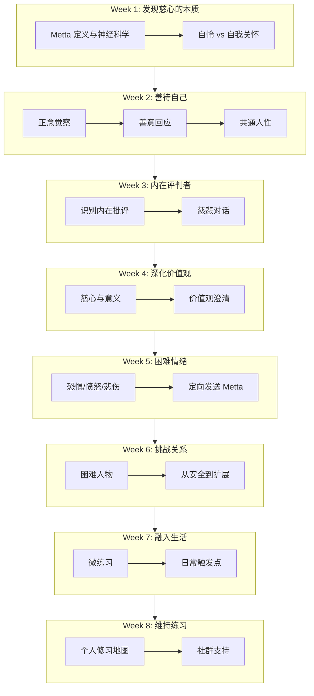
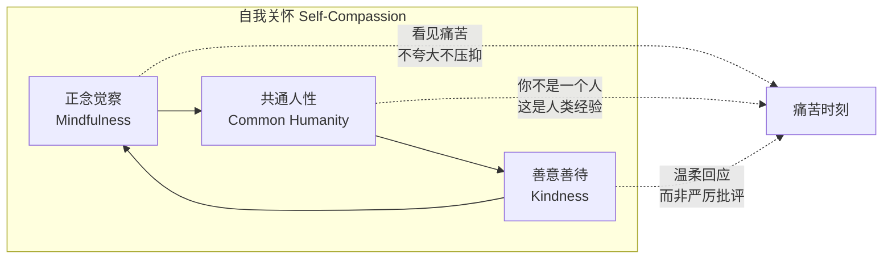
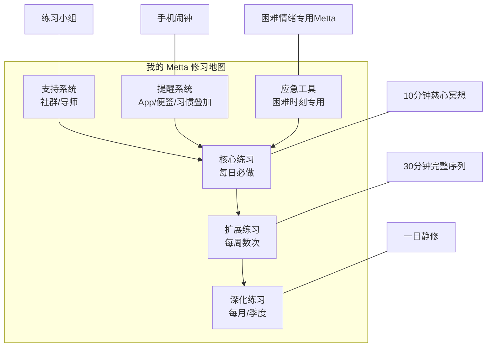

# 慈心禅与自我关怀8周课程

> **Metta-Based Mindful Self-Compassion (MSC) 8-Week Program**
>
> 基于 Kristin Neff 与 Christopher Germer 的 MSC 课程框架，融合传统上座部慈心禅（Metta）与现代临床心理学，为追求深度内在转化的修习者提供结构化路径。

---

## 课程概览

| 项目 | 内容 |
|------|------|
| **课程名称** | 慈心禅与自我关怀八周课程（Metta-MSC） |
| **总时长** | 8 周，每周 2.5 小时团体课程 + 每日 30-45 分钟个人练习 |
| **核心理论来源** | Kristin Neff 自我关怀三要素、Christopher Germer MSC 课程、传统 Metta Bhavana（慈心修习） |
| **适用人群** | 高压职业者、长期自我批评者、心理治疗从业者、慢性病患照护者、任何希望建立稳定慈心修习的人 |
| **先修要求** | 建议有基础正念练习经验（至少 4 周每日 10 分钟以上），无经验者可参加课前导论 |
| **最后更新** | 2026-05 |

---

## 一、课程架构总览

---

## 二、每周课程详细设计

### Week 1: 发现慈心的本质（Discovering the Nature of Metta）

#### 理论讲解（15 分钟）

**Metta（慈心）的核心定义**

Metta（巴利文）字面意为"善意的友谊"，是一种非占有、非浪漫、无条件地对一切生命持有善意的美好心理状态。不同于一般意义上的"爱"，Metta 不包含依恋（attachment）或渴爱（tanha），其本质是**希望一切众生幸福、平安、免于受苦的纯粹意愿**。

**自我关怀与自怜的关键区别**

| 维度 | 自怜（Self-Pity） | 自我关怀（Self-Compassion） |
|------|------------------|--------------------------|
| **视角** | 沉浸于"只有我苦"的孤立叙事 | 认识到痛苦是人类共通经验 |
| **情绪基调** | 沉重、压抑、受害者心态 | 温暖、开阔、赋能感 |
| **与他人的关系** | 疏远、比较、抱怨 | 连接、平等、善意 |
| **行动倾向** | 退缩、逃避、沉溺 | 面对、安抚、积极行动 |
| **身体感受** | 胸闷、蜷缩、沉重 | 心胸开阔、放松、温暖 |

#### 引导练习（25 分钟）

**练习：建立你的"慈心锚点"（Metta Anchor）**

1. ** settle（3 分钟）**：坐姿，轻闭双眼，三次深长的呼吸，感受身体与座垫/地面的接触。
2. **回忆一个安全对象（5 分钟）**：想起一位容易生起慈心的人（可以是宠物、幼儿、敬爱的师长）。不刻意召唤强烈情绪，只是温和地让此人的形象浮现，默念：
   > *"愿你平安，愿你快乐，愿你健康，愿你的生活平顺。"*
3. **将感受转向自身（10 分钟）**：现在，想象自己坐在面前，或者将刚刚感受到的温暖直接导向自己的心口。对自己说同样的句子。如果感到困难，允许困难存在，不强迫。
4. **结束与记录（7 分钟）**：缓慢睁眼，简短写下练习中的三个关键词（身体感受/情绪/念头）。

#### 小组讨论主题

- 当你听到"对自己发送慈心"时，第一反应是什么？
- 在你的成长环境中，"对自己好"是被鼓励的还是被视作为"自私"？
- 分享一个你自然而然对某人感到慈心的瞬间——那是什么感觉？

#### 回家作业

| 作业 | 时间 | 说明 |
|------|------|------|
| 每日慈心锚点练习 | 10 分钟/天 | 使用课程录音，专注于安全对象 |
| 慈心日志 | 5 分钟/天 | 记录当天对自己或他人自然生起的善意瞬间 |
| 触发觉察 | 日常 | 当内在批评声音出现时，只是标记："这是评判" |

---

### Week 2: 练习善待自己（Practicing Kindness Toward Yourself）

#### 理论讲解（15 分钟）

**Kristin Neff 自我关怀三要素模型**

**三要素详解**

| 要素 | 定义 | Metta 中的对应 | 常见障碍 |
|------|------|--------------|---------|
| **正念觉察** | 以平衡的觉察面对痛苦，不夸大也不压抑 | Metta 需要首先"看见"受苦者（包括自己），才能定向发送善意 | 过度认同情绪（"我就是焦虑"）或否认情绪（"我不应该难过"） |
| **共通人性** | 认识到受苦是人类共同经验，而非个人孤立失败 | 传统 Metta 从"愿一切众生"开始，天然包含共通人性视角 | 社会比较文化、完美主义叙事 |
| **善意善待** | 以温暖、关怀、支持的态度回应自己的痛苦 | Metta 的核心——将祝福的意愿导向自己 | 认为自我批评是动力来源、担心自我关怀导致懒惰 |

#### 引导练习（30 分钟）

**练习：自我关怀呼吸（Soothing Touch + Breathing）**

1. **选择抚慰姿势（2 分钟）**：双手放在心口、或双手交叠轻抚上臂、或轻抚脸颊。选择让你感到最舒适的姿势——这是你的身体在自我关怀。
2. **呼吸觉察（5 分钟）**：觉察呼吸的自然流动，不需要改变它。只是知道："我在吸气……我在呼气……"
3. **困难时刻回忆（5 分钟）**：温和地想起本周一个轻微困难的时刻（不选最创伤的事件）。如同看电影一般，从远处观察那个场景。
4. **三要素注入（15 分钟）**：
   - *正念*："这是一个痛苦的时刻。"（命名情绪）
   - *共通人性*："痛苦是人类生活的一部分。我不是唯一一个经历这些的人。"
   - *善意*：将手放在心口，默念："愿我平安。愿我对自己温柔。愿我接纳自己本来的样子。"
5. **回归与记录（3 分钟）**

#### 小组讨论主题

- 当你把手放在心口时，身体有什么反应？
- "共通人性"对你来说是容易还是困难的？什么时候你会感到"只有我一个人在受苦"？
- 分享一个你本周尝试对自己友善的瞬间。

#### 回家作业

| 作业 | 时间 | 说明 |
|------|------|------|
| 自我关怀呼吸练习 | 15 分钟/天 | 可搭配抚慰姿势 |
| 三要素日记 | 10 分钟/天 | 记录一次困难经历，并分别用三要素回应 |
| 身体觉察 | 日常 | 在感到压力时，觉察身体哪个部位紧绷，将呼吸送到那里 |

---

### Week 3: 发现你的内在评判者（Discovering Your Inner Critic）

#### 理论讲解（15 分钟）

**内在评判者的进化心理学来源**

内在批评声音并非"敌人"——它很可能是进化过程中发展出的自我保护机制，试图通过"提前自我批评"来避免被群体排斥。然而，在现代社会中，这种机制往往过度激活，变成持续的自我攻击。

**内在评判者的常见声音原型**

| 原型 | 典型话语 | 隐藏的恐惧 | Metta 回应 |
|------|---------|-----------|-----------|
| **完美主义者** | "你应该做得更好" | 害怕失败、害怕不被认可 | "愿我接纳自己的不完美" |
| **比较者** | "别人都比你强" | 害怕落后、害怕无价值 | "愿我走出比较的牢笼" |
| **灾难化者** | "你会搞砸一切的" | 害怕失控、害怕未知 | "愿我在不确定中安住" |
| **羞愧播种者** | "你不配" | 害怕被看穿、害怕被拒绝 | "愿我认识到自己本自具足" |

#### 引导练习（30 分钟）

**练习：与内在评判者的慈悲对话**

1. **静座与觉察（5 分钟）**：觉察呼吸，让身体安定。
2. **邀请内在评判者（5 分钟）**：想象你的内在评判者是一个具体的形象——它可以是一个人、一种颜色、一种形状、甚至一种声音。不要求它改变，只是邀请它"出现"。
3. **询问它的意图（5 分钟）**：温和地问它："你想保护我什么？" 等待，不急于回答。只是保持好奇与开放。
4. **以慈心回应（10 分钟）**：无论内在评判者回答什么，向它发送 Metta：
   > *"我听见你了。谢谢你试图保护我。但我现在选择用不同的方式照顾自己。愿你也能找到平静。"*
   然后，将慈心转向被评判的那部分自己：
   > *"愿我免于自我攻击的痛苦。愿我以温柔对待自己。"*
5. **整合与记录（5 分钟）**

#### 小组讨论主题

- 你的内在评判者最常在什么情境下出现？
- 如果你把内在评判者想象成一个角色，它看起来像什么？
- 本周练习中，你有没有发现内在评判者"背后的恐惧"？

#### 回家作业

| 作业 | 时间 | 说明 |
|------|------|------|
| 评判者觉察日志 | 10 分钟/天 | 每当自我批评出现时，记录：触发情境/评判内容/背后的恐惧/Metta回应 |
| 写信练习 | 15 分钟（1次） | 以慈心的声音，给内在评判者写一封信 |
| 身体扫描 | 15 分钟/天 | 觉察评判出现时身体的紧绷位置，用呼吸软化 |

---

### Week 4: 深化你的生活价值观（Deepening Your Life Values）

#### 理论讲解（15 分钟）

**慈心与生命意义的连接**

现代存在主义心理学（如 Viktor Frankl 的意义疗法）指出，人类最深层的驱动力是寻找意义。而 Metta 提供了一种独特的意义路径：**通过培养无条件的善意，我们不仅减轻自己的痛苦，也成为他人生命中的一束光**。这不是道德说教，而是神经科学已经证实的——当练习者专注于"愿他人幸福"时，大脑的奖赏回路（腹侧纹状体）会激活，产生深层的满足感和意义感。

**价值观澄清：从"应该"到"选择"**

| 来自外在"应该" | 转化为内在价值观 |
|--------------|----------------|
| "我应该更成功" | "我选择真实地活着" |
| "我应该让别人满意" | "我选择以善意连接他人" |
| "我应该没有负面情绪" | "我选择完整地体验生命" |
| "我应该永远坚强" | "我选择允许自己脆弱" |

#### 引导练习（25 分钟）

**练习：价值观驱动的慈心冥想**

1. ** settling（3 分钟）**
2. **回顾生命高峰时刻（5 分钟）**：想起一个你感到"这就是我想成为的样子"的时刻。不一定是成就，可能是一次善意的互动、一次勇敢的表达、一次真诚的陪伴。
3. **提取核心价值（3 分钟）**：那个时刻体现了什么价值？（如：连接、勇气、创造、服务、真实、慈悲……）
4. **以价值观为根基发送 Metta（12 分钟）**：
   - 对自己："愿我以 [核心价值] 活出我的生命。愿我对自己温柔。"
   - 对一位亲人："愿你的 [相关价值] 被看见和滋养。"
   - 对一位中立者："愿你也找到属于你的 [价值] 之路。"
   - 对一位困难者："愿你在痛苦中也触及 [价值] 的光芒。"
5. **结束（2 分钟）**

#### 小组讨论主题

- 你生命中最重要的三个价值观是什么？
- 你的价值观与 Metta 练习有什么连接？
- 有没有一个时刻，你感到"做这件善意的事让我找到了意义"？

#### 回家作业

| 作业 | 时间 | 说明 |
|------|------|------|
| 价值观慈心练习 | 15 分钟/天 | 围绕一个核心价值观发送 Metta |
| 价值观行动 | 日常 | 每天做一个微小的、符合核心价值观的行动 |
| 意义日记 | 10 分钟/天 | 记录"今天让我感到有意义的瞬间" |

---

### Week 5: 与困难情绪相处（Working with Difficult Emotions）

#### 理论讲解（15 分钟）

**困难情绪的神经科学**

恐惧、愤怒、悲伤等困难情绪往往与杏仁核的过度激活相关。传统反应模式是"战斗/逃跑/冻结"——而 Metta 提供了一种"第四通路"：**以温暖觉察（warm awareness）与情绪共存，既不压抑也不反刍**。

**RAIN 技术 + Metta 扩展**

| 步骤 | 操作 | Metta 融入 |
|------|------|-----------|
| **R**ecognize（识别） | 命名当下的情绪 | "这是恐惧/愤怒/悲伤……" |
| **A**llow（允许） | 不急于改变，给情绪空间 | "我允许这个感觉存在" |
| **I**nvestigate（探究） | 温和地觉察情绪在身体中的位置 | 将呼吸和慈心送到那个身体部位 |
| **N**urture（滋养） | 以 Metta 回应 | "愿我平安。愿这个 [情绪] 被温柔接纳。" |

#### 引导练习（30 分钟）

**练习：将 Metta 送给恐惧/愤怒/悲伤**

1. ** settling（3 分钟）**
2. **选择一种情绪（2 分钟）**：本周选择一种你最常体验的困难情绪（恐惧、愤怒或悲伤）。
3. **身体定位（5 分钟）**：回想一个该情绪出现的场景，然后觉察：这种情绪在身体哪个部位？它是什么质地？（热/冷/紧/重/空……）
4. **RAIN 流程（10 分钟）**：
   - R："这是恐惧。"（清晰命名）
   - A："我允许它在这里。"（不推开）
   - I：将注意力带到胃部（或其他位置），只是观察。
   - N：将手放在那个位置，默念："愿这个恐惧被温柔接纳。愿我平安。"
5. **扩展 Metta（8 分钟）**：想象世界上所有正在体验同样情绪的人，将慈心扩展："愿所有感到恐惧的人找到平静。"
6. **结束（2 分钟）**

#### 小组讨论主题

- 你最难接纳的情绪是什么？它通常携带什么"信息"？
- 当你尝试对困难情绪发送 Metta 时，有什么阻碍？
- "共通人性"在困难情绪时刻如何帮助到你？

#### 回家作业

| 作业 | 时间 | 说明 |
|------|------|------|
| 困难情绪 Metta | 15 分钟/天 | 选择一种情绪进行 RAIN+Metta 练习 |
| 情绪天气报告 | 每日 3 次 | 简短记录当下情绪，用天气比喻（如"内心是阴天有微风"） |
| 慈心短语定制 | 10 分钟 | 为你的主要困难情绪编写专属的 Metta 句子 |

---

### Week 6: 处理挑战性的人际关系（Working with Challenging Relationships）

#### 理论讲解（15 分钟）

**传统 Metta 的扩展序列**

传统慈心禅遵循一个经典的扩展序列：
1. 对自己
2. 对恩人/慈爱的对象
3. 对中立者（如路人）
4. 对困难者（敌人/伤害者）
5. 对一切众生

**对困难者发送 Metta 的核心原则**

| 原则 | 说明 |
|------|------|
| **不强迫感受** | 不要求自己"爱上"对方，只是培养"愿你不受苦"的意愿 |
| **从安全距离开始** | 先在冥想中想象对方，而不是直接互动 |
| **保护自己的界限** | 发送 Metta 不等于允许继续被伤害；慈心与界限可以共存 |
| **理解不等于原谅** | 理解对方受苦，不等于必须原谅其行为；Metta 是解放自己，不一定是修复关系 |
| **分阶段进行** | 从"较轻的困难者"开始，逐步挑战更困难的对象 |

#### 引导练习（30 分钟）

**练习：阶梯式困难者 Metta**

1. ** settling（3 分钟）**
2. **建立安全基础（5 分钟）**：先对自己和一位安全对象发送 Metta，建立内心的温暖感。
3. **第1级：轻微不适者（5 分钟）**：想起一个让你轻微不舒服的人（如难缠的同事、态度冷淡的店员）。默念："愿你平安。愿你不受苦。"
4. **第2级：中度困难者（8 分钟）**：想起一个让你明显痛苦的人。如果感到阻抗，回到自己的呼吸和安全感。然后尝试："我认识到你也曾经是个孩子，也曾受过伤。愿你从痛苦中解脱。"
5. **第3级：重度困难者（可选，7 分钟）**：如果有准备，尝试对一个重大伤害者发送 Metta。关键是：**不否认伤害，但在伤害之上叠加一个愿望——愿对方也从痛苦中解脱**。如果太困难，完全允许回到前两级。
6. **回归自身（2 分钟）**：无论进展到哪一级，最后都将慈心带回自己："愿我从这段关系的痛苦中解放。"

#### 小组讨论主题

- 对困难者发送 Metta 时，你最大的阻抗是什么？
- 你如何理解"慈心与个人界限共存"？
- 有没有一个时刻，对某人发送 Metta 让你感到自己"释放了"？

#### 回家作业

| 作业 | 时间 | 说明 |
|------|------|------|
| 阶梯式 Metta | 15 分钟/天 | 每天选择一个难度级别进行练习 |
| 关系日志 | 10 分钟/天 | 记录人际关系中的触发点，以及尝试的 Metta 回应 |
| 慈悲行动 | 日常 | 对一个"中立者"（如服务员、陌生人）做一个微小的善意举动 |

---

### Week 7: 拥抱你的生活（Embracing Your Life）

#### 理论讲解（15 分钟）

**从"正式练习"到"生活禅"**

传统上，Metta 分为"座上修"（正式冥想）和"座下修"（日常生活中的慈心）。Week 7 的核心是将 Metta 从冥想垫扩展到生活的每一个角落。

**微练习（Micro-Practices）策略**

研究表明，频繁的"微 doses"慈心练习（每次 30 秒-2 分钟）比偶尔的长练习更能改变大脑结构和日常情绪模式。

| 触发情境 | 微练习 | 时长 |
|---------|--------|------|
| 早晨醒来 | 双手放于心口，默念"愿我今日平安" | 30 秒 |
| 等红灯/排队 | 对周围陌生人发送简短 Metta | 1 分钟 |
| 收到批评邮件 | 先对自己说"愿我平静"，再回应 | 1 分钟 |
| 睡前 | 回顾一天，对三个对象发送 Metta | 2 分钟 |
| 身体疼痛时 | 将呼吸和慈心送到疼痛部位 | 1 分钟 |
| 感到愤怒时 | "愿我和这个愤怒的人都找到平静" | 30 秒 |

#### 引导练习（25 分钟）

**练习：生活触发的慈心回应**

1. ** settling（3 分钟）**
2. **回顾日常触发点（5 分钟）**：在冥想中回顾本周的几个日常瞬间——通勤、工作、家庭互动。对每个场景，想象自己以 Metta 回应。
3. **身体-情绪-慈心链（12 分钟）**：
   - 想象一个典型压力场景（如 deadline 临近）
   - 觉察身体反应（紧绷/心跳加速）
   - 命名情绪（焦虑/烦躁）
   - 插入 Metta："愿我在压力中保持平安。愿我对自己温柔。"
4. **建立个人触发-回应地图（5 分钟）**：在心里列出你最常见的 3 个压力触发点，并为每个点匹配一个简短的 Metta 句子。

#### 小组讨论主题

- 你最容易忘记练习 Metta 的时刻是什么时候？
- 设计一个你自己的"微练习"——什么触发点、什么回应、什么时候做？
- 如果 Metta 成为你生活的一部分，你希望 3 个月后的自己有什么不同？

#### 回家作业

| 作业 | 时间 | 说明 |
|------|------|------|
| 3-3-3 微练习 | 每日 3 次 | 每天找 3 个时刻，对 3 个对象发送简短 Metta |
| 个人触发地图 | 完成一次 | 列出你的主要触发点和对应的 Metta 句子 |
| 慈悲日志 | 10 分钟/天 | 记录今天你在何处"自然地"生起了善意 |

---

### Week 8: 维持你的练习（Sustaining Your Practice）

#### 理论讲解（15 分钟）

**建立长期可持续的 Metta 习惯**

研究表明，新行为变成习惯的平均时间是 66 天（非流行的 21 天）。要维持 Metta 练习，需要：**降低门槛** + **建立提醒系统** + **社群支持** + **允许波动**。

**个人修习地图构建要素**

#### 引导练习（25 分钟）

**练习：设计你的个人修习仪式**

1. ** settling（3 分钟）**
2. **回顾 8 周旅程（7 分钟）**：在冥想中，从 Week 1 走到 Week 8，回顾每个阶段最重要的领悟。
3. **承诺仪式（10 分钟）**：
   - 选择你的"核心承诺"：未来 3 个月，每天最少多少时间的 Metta 练习？（建议：不低于 10 分钟）
   - 选择你的"提醒系统"：什么时间、什么地点、什么信号触发练习？
   - 对自己说出承诺："我承诺在未来 3 个月，每天以慈心照顾自己。这不是义务，而是我选择送给自己的礼物。"
4. **发送终极 Metta（5 分钟）**：对自己、亲人、中立者、困难者、一切众生，发送完整的 Metta 序列。以四句话结束：
   > *"愿一切众生平安。愿一切众生快乐。愿一切众生健康。愿一切众生生活平顺。"*

#### 小组讨论主题

- 这 8 周最大的转变是什么？
- 你对未来练习最大的担忧是什么？如何提前应对？
- 你愿意加入（或创建）一个 Metta 练习小组吗？

#### 回家作业

| 作业 | 时间 | 说明 |
|------|------|------|
| 完成个人修习地图 | 30 分钟 | 书面化你的长期练习计划 |
| 建立练习问责伙伴 | 持续 | 与另一位学员互相支持 |
| 参加课后 3 个月聚会 | 90 分钟/次 | 课程提供的后续支持聚会 |

---

## 三、课程时间表总览

| 周次 | 主题 | 理论 | 练习 | 核心作业 |
|------|------|------|------|---------|
| 1 | 发现慈心的本质 | Metta 定义、自怜 vs 自我关怀 | 慈心锚点（25分钟） | 每日锚点练习 + 慈心日志 |
| 2 | 练习善待自己 | 三要素模型 | 自我关怀呼吸（30分钟） | 三要素日记 + 身体觉察 |
| 3 | 发现内在评判者 | 评判者原型 | 与评判者对话（30分钟） | 评判者日志 + 写信练习 |
| 4 | 深化价值观 | 意义与慈心 | 价值观驱动 Metta（25分钟） | 价值观行动 + 意义日记 |
| 5 | 与困难情绪相处 | RAIN + 神经科学 | 困难情绪 Metta（30分钟） | 情绪天气报告 + 定制短语 |
| 6 | 处理挑战性关系 | 扩展序列 | 阶梯式困难者 Metta（30分钟） | 关系日志 + 慈悲行动 |
| 7 | 拥抱生活 | 微练习策略 | 触发-回应链（25分钟） | 3-3-3 微练习 + 触发地图 |
| 8 | 维持练习 | 习惯科学 | 个人修习仪式（25分钟） | 修习地图 + 问责伙伴 |

---

## 四、推荐资源

### 核心读物

- Neff, K. (2011). *Self-Compassion: The Proven Power of Being Kind to Yourself*
- Germer, C. & Neff, K. (2019). *Teaching the Mindful Self-Compassion Program*
- Salzberg, S. (1995). *Lovingkindness: The Revolutionary Art of Happiness*
- Kornfield, J. (2017). *No Time Like the Present*

### 音频资源

- Sharon Salzberg 引导慈心禅系列
- Kristin Neff 自我关怀引导冥想（官网免费资源）
- Christopher Germer MSC 课程配套录音

### 相关课程

- 8 周 MSC 官方课程（Center for Mindful Self-Compassion）
- Insight Meditation Society (IMS) 慈心禅 retreat
- 十日 Vipassana 课程中的 Metta 环节（第 10 天）

---

> *"慈心不是找到完美的感觉，而是无论感觉如何，都选择善意。"*
>
> — Sharon Salzberg
