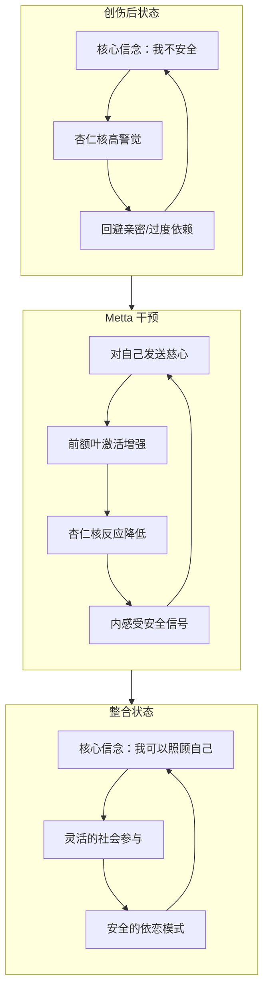
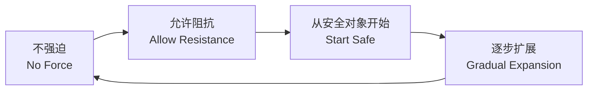

# 慈心禅与创伤疗愈专题

> **Metta-Based Trauma Healing: A Trauma-Informed Approach to Loving-Kindness Meditation**
>
> 本文档为具有创伤背景的修习者、心理咨询师及瑜伽/冥想教师提供创伤知情的慈心禅应用框架，融合神经科学、临床心理学与传统 Metta 修习智慧。

---

## 一、创伤与慈悲的神经科学

### 1.1 PTSD 的神经生物学基础

创伤后应激障碍（PTSD）的核心神经生物学特征是**杏仁核过度激活**与**前额叶皮层调节功能下降**之间的失衡。这意味着创伤幸存者的大脑对威胁信号异常敏感，即使在安全的环境中也可能触发"战斗/逃跑/冻结"反应。

| 脑区 | 正常功能 | PTSD 中的改变 | Metta 的影响 |
|------|---------|-------------|------------|
| **杏仁核** | 威胁检测、恐惧学习 | 过度活跃、阈值降低、对中性刺激也反应 | 长期 Metta 练习可降低杏仁核反应性（Kral et al., 2018） |
| **前额叶皮层 (PFC)** | 情绪调节、决策、自我参照 | 活动降低、对杏仁核的抑制减弱 | Metta 增强 PFC 与杏仁核之间的功能连接 |
| **岛叶** | 内感受觉察（身体感觉） | 高警觉者的岛叶可能过度活跃或解离性降低 | Metta 培养"温暖觉察"，重建安全的内感受 |
| **默认模式网络 (DMN)** | 自我反思、心智游移 | PTSD 中 DMN 与威胁网络的异常连接 | Metta 改变自我参照方式，从自我批评转向自我关怀 |
| **迷走神经** | 副交感神经调节、社会参与系统 | 功能降低、难以进入"安全与连接"状态 | Metta 激活社会参与系统，增强迷走神经张力 |

### 1.2 Metta 如何重建安全依恋回路

依恋理论创始人 John Bowlby 指出，安全依恋是人类心理健康的基础。而创伤往往破坏了个体的内部工作模型（internal working model），使其相信自己**不可爱、他人不可信、世界是危险的**。

**Metta 重建依恋的三条路径：**



**神经可塑性视角：** 每一次对自己发送慈心的练习，都是在"重写"神经网络——从"威胁-回避"模式转向"安全-连接"模式。这不是抽象的理论，而是已经被 fMRI 研究证实的神经变化（Hofmann et al., 2011; Kral et al., 2018）。

### 1.3 Paul Gilbert 的慈悲聚焦疗法（CFT）

Paul Gilbert 开发的 CFT（Compassion-Focused Therapy）为理解 Metta 的创伤疗愈机制提供了极为重要的理论框架。CFT 提出人类大脑存在**三种情绪调节系统**：

| 系统 | 功能 | 神经化学基础 | Metta 中的对应 |
|------|------|------------|--------------|
| **威胁系统** | 检测危险、触发保护反应 | 皮质醇、肾上腺素 | Metta 不否认威胁，但提供"安全的背景" |
| **驱动系统** | 追求目标、获取资源 | 多巴胺 | Metta 转化"我必须做得更好"为"我已足够" |
| **安抚系统** | 平静、连接、安全 | 催产素、内啡肽 | **Metta 的核心目标——激活此系统** |

**CFT 的核心洞见：** 创伤幸存者往往威胁系统和驱动系统过度活跃，而安抚系统严重欠发达。Metta 练习的本质是**有意识地训练激活安抚系统**，如同锻炼一块长期未使用的肌肉。

---

## 二、创伤知情的发送 Metta 原则

### 2.1 四项核心原则

对于创伤幸存者，传统 Metta 的"标准做法"可能需要调整。以下是创伤知情的四项核心原则：



#### 原则 1: 不强迫（No Force）

传统教导中，有时会鼓励修习者"坚持"面对困难对象。但对于创伤幸存者，强迫可能重新激活创伤反应。

> **创伤知情修正：** 如果发送 Metta 给某人（包括自己）时感到强烈不适，立即回到安全对象（如宠物、自然、尊敬的导师），或转为纯呼吸觉察。慈心不是考试，没有"应该"的感受。

#### 原则 2: 允许阻抗（Allow Resistance）

阻抗（resistance）在创伤语境中不是"修行不够"的标志，而是**神经系统自我保护的智慧**。当对自己说"愿我平安"时感到恶心、愤怒、悲伤——这些都是正常的创伤反应。

> **创伤知情修正：** 将阻抗本身作为觉察对象。"我注意到，当我说'愿我快乐'时，内心升起愤怒。我允许这个愤怒存在。" 有时，对阻抗发送慈心比强行突破更有效。

#### 原则 3: 从安全对象开始（Start Safe）

传统 Metta 从"对自己"开始，但许多创伤幸存者对自己是最难产生慈心的对象。

> **创伤知情修正：** 可以从任何安全对象开始——宠物、幼儿、自然、 spiritual figure（如观音菩萨、佛陀、基督）。关键是**先激活安抚系统**，再逐步尝试更困难的对象。

#### 原则 4: 逐步扩展（Gradual Expansion）

传统 Metta 的快速扩展（从"自己"直接跳到"一切众生"）对创伤幸存者可能过于迅速。

> **创伤知情修正：** 使用"阶梯式"扩展，每个阶段停留数周甚至数月。只有在当前阶段感到相对稳定后，才进入下一阶段。

### 2.2 创伤知情 Metta 阶梯

| 阶段 | 对象 | 建议停留时间 | 预警信号（暂停并回到前一阶段） |
|------|------|------------|------------------------|
| **0. 准备期** | 纯呼吸觉察，建立身体安全感 | 1-4 周 | 任何解离或过度唤起 |
| **1. 自然/宠物** | 对一棵树、一只宠物发送 Metta | 1-3 周 | 感到孤独、悲伤 |
| **2. 安全他人** | 对一位让你感到无条件接纳的人 | 2-4 周 | 嫉妒、"为什么不是我" |
| **3. 自己（间接）** | 想象自己是个孩子，从外部发送 Metta | 3-6 周 | 强烈的羞耻或愤怒 |
| **4. 自己（直接）** | 对自己说 Metta 句子 | 4-8 周 | 阻抗、自我批评爆发 |
| **5. 中立者** | 对陌生人发送 Metta | 2-4 周 | 麻木、疏离 |
| **6. 轻微困难者** | 对让你轻微不适的人 | 4-8 周 | 强烈愤怒或恐惧 |
| **7. 重大困难者** | 对创伤相关人物（极为谨慎） | 数月-数年 | 闪回、强烈情绪风暴 |
| **8. 一切众生** | 无差别的普遍慈心 | 长期 | 解离、虚无感 |

---

## 三、针对特定创伤类型的 Metta 调整

### 3.1 童年虐待（Childhood Abuse）

**核心挑战：** 童年虐待幸存者往往将"施虐者"的形象与"照顾者/权威"的形象混淆，形成"亲近=危险"的内部模型。对自己发送慈心可能触发深层羞耻——"我不配"。

**Metta 调整策略：**

| 挑战 | 调整策略 |
|------|---------|
| 对自己发送 Metta 触发羞耻 | 使用"间接自我"技术：想象一个与你有相似经历的 5 岁孩子，对他说 Metta。逐步将这个孩子与内在小孩连接。 |
| 对施虐者发送 Metta 触发恐惧 | **绝不强迫。** 只有在专业支持下，且自己明确选择时，才可尝试。可从"理解施虐者也受过伤"开始，但不等于原谅或接触。 |
| 身体感受触发回忆 | 从"非身体"的 Metta 开始：想象光从头顶照下，或从心脏发出，但不聚焦于身体感觉。 |
| 难以信任练习本身 | 明确告知："你可以随时停止。你有完全的掌控权。"在每次练习前后做 grounding。 |

**专属 Metta 句子：**

> *"愿我释放不属于我的羞耻。愿我重新学习什么是安全的爱。愿我对自己如同我本应被对待的那样温柔。"*

### 3.2 战争/灾难创伤（War & Disaster Trauma）

**核心挑战：** 集体性创伤往往伴随幸存者内疚（"为什么是我活下来"）、对人类的普遍不信任、以及"世界本质上是危险的"这一核心信念。

**Metta 调整策略：**

| 挑战 | 调整策略 |
|------|---------|
| 幸存者内疚 | 将 Metta 扩展到"所有与我共同经历的人"——活着的和逝去的。"愿所有幸存者找到和平。" |
| 对人类的不信任 | 从对自然/动物开始，逐步过渡到"某个具体的好人"（如救命恩人、战友），再扩展到更广泛的人类。 |
| 集体创伤的孤立感 | 强调"共通人性"——你不是唯一一个经历这些的人。使用集体 Metta："愿所有战争幸存者……" |
| 过度警觉 | 结合身体 grounding 技术与 Metta：脚踏实地的感受 + "愿我在此刻安全。" |

**集体 Metta 的力量：**

战争和灾难创伤的幸存者往往在**集体仪式**中找到最深的疗愈。集体 Metta 练习——一群人共同发送慈心给所有受难者——可以创造强大的社会连接感，对抗创伤的孤立效应。

> **示例集体 Metta：**
> *"愿所有战争中的孩子平安。愿所有失去家园的人找到庇护。愿所有目睹死亡的人找到内心的平静。愿人类有一天学会不用暴力解决冲突。"*

### 3.3 医疗创伤（Medical Trauma）

**核心挑战：** 医疗创伤（如手术并发症、ICU 经历、医疗事故）往往导致对**身体的深度不信任**——"我的身体背叛了我"。同时，医疗环境的气味、声音可能成为强烈的触发器。

**Metta 调整策略：**

| 挑战 | 调整策略 |
|------|---------|
| 对身体的愤怒/疏离 | **身体部位的 Metta**：逐个部位发送慈心，从最安全的位置开始（如左手），逐步扩展到触发区域。对每个部位说："感谢你一直在努力保护我。" |
| 医疗环境触发 | 在练习中使用"安全场景"想象——如森林、海滩——而非医疗相关的 imagery。 |
| 对医护人员的复杂情感 | 使用"区分"技术：对"医疗系统"或"某位具体医生"的感受可以复杂，但可以对"所有希望帮助病患的医护人员"发送一般性的 Metta。 |
| 对死亡的恐惧 | "愿我在面对不确定时找到平安。愿我的身体得到它需要的疗愈。" |

**身体部位 Metta 序列示例：**

```
1. 双手："愿我的双手感到温暖与被接纳。"
2. 腹部（常见紧张区域）："愿我的腹部柔软与放松。"
3. 心脏："愿我的心脏感到安全去爱。"
4. 触发部位（如手术疤痕）："愿这个部位被温柔对待。愿它知道它已经被照顾。"
5. 全身："愿我的身体成为我居住的安全家园。"
```

### 3.4 丧亲之痛（Grief & Bereavement）

**核心挑战：** 丧亲之痛中的 Metta 需要处理**未完成的情感**——未说出口的话、未解决的冲突、突然的失去。对逝者发送 Metta 可能被误解为"放下"或"不再悲伤"，但实际上，Metta 是**在悲伤中保持连接**的方式。

**Metta 调整策略：**

| 挑战 | 调整策略 |
|------|---------|
| 未完成的哀伤 | "未完成对话" Metta：在冥想中想象逝者，说出你想说的话，然后发送 Metta："愿你在彼处平安。愿你知道我的爱。" |
| 对逝者的愤怒（复杂哀伤） | 允许愤怒存在，同时对"那个受伤的自己"发送慈心。不强迫自己"原谅"。 |
| 害怕"忘记" | 明确 Metta 不是"告别"，而是"以新的方式保持连接"。可以对逝者的记忆发送 Metta："愿我对你的记忆成为祝福。" |
|  anniversary reactions | 在逝世纪念日进行特别的 Metta 仪式——点燃蜡烛、念诵 Metta 句子、写一封信。 |

**对逝者的 Metta 仪式：**

1. 设置一个安静的空间，可以放置逝者的照片或纪念品。
2. 点燃蜡烛（象征连接的延续）。
3. 三次深呼吸，允许悲伤浮现。
4. 对逝者发送 Metta：
   > *"愿你已找到平静。愿你的旅程继续光明。愿你知道你被爱。愿你在自由中安息。"*
5. 对自己发送 Metta：
   > *"愿我在悲伤中找到力量。愿我继续活出你带给我的美好。愿我知道爱不会因死亡而消失。"*
6. 静坐片刻，然后缓慢结束。

---

## 四、临床案例框架

> **声明：** 以下案例为虚构但典型的临床框架，旨在展示 Metta 干预的逻辑流程，**不构成具体治疗建议**。实际创伤治疗应在持牌心理健康专业人员的指导下进行。

### 案例 1：童年情感忽视的成年幸存者

**背景：** 女性，35 岁，长期抑郁、自我批评严重、难以建立亲密关系。童年经历父母的情感忽视——物质满足但情感冷漠。

**Metta 干预过程：**

| 阶段 | 时长 | 干预内容 | 反应与调整 |
|------|------|---------|-----------|
| **建立安全** | 1-2 周 | 纯呼吸觉察 + grounding 技术 | 初期出现解离，加入更多身体 grounding |
| **间接自我 Metta** | 3-6 周 | 想象一个 5 岁的被忽视女孩，对她发送慈心 | 强烈悲伤释放，允许哭泣，不急于"修复" |
| **直接自我 Metta** | 6-12 周 | 对自己说"愿我接纳自己" | 阻抗强烈，使用 CFT 的"多重自我"技术——区分"批评自我"与"受伤自我" |
| **关系扩展** | 3-6 个月 | 对当前亲密关系对象发送 Metta | 嫉妒和比较出现，回到共通人性 |
| **整合** | 持续 | 将 Metta 融入日常生活，建立自我关怀习惯 | 复发时回到基础练习，不评判"退步" |

**关键 Metta 句子：**
> *"愿我释放那个总是试图证明自己值得被爱的小女孩。愿我学会自己给自己我从未得到过的拥抱。"*

### 案例 2：退伍军人的战争创伤

**背景：** 男性，42 岁，退伍军人，PTSD 诊断，闪回、噩梦、幸存者内疚，对 civilian life 感到疏离。

**Metta 干预过程：**

| 阶段 | 时长 | 干预内容 | 反应与调整 |
|------|------|---------|-----------|
| **grounding 优先** | 2-4 周 | 身体扫描 + 呼吸 grounding，暂时不引入 Metta | 建立"安全基地"前不进行情感探索 |
| **集体 Metta** | 4-8 周 | 对"所有战友"发送慈心，包括活着的和阵亡的 | 幸存者内疚强烈涌现，加入仪式化元素（如点名纪念） |
| **对敌人（极为谨慎）** | 仅在治疗师支持下尝试 | 不直接对"敌人"，而是对"所有战争的受害者" | 从"人类共通受苦"角度切入，不触及具体事件 |
| **自我宽恕** | 持续 | 对自己在战争中做过的/没做的事发送 Metta | 这是最难的部分，需要长期支持 |
| ** civilians 连接** | 持续 | 逐步对 civilians 扩展 Metta，重建社会信任 | 从"某个帮助过他的人"开始 |

**关键 Metta 句子：**
> *"愿所有穿制服的人找到脱下盔甲后的平安。愿所有战争的见证者知道，他们的痛苦是被看见的。"*

### 案例 3：医疗创伤后的身体重建

**背景：** 女性，50 岁，经历重大手术并发症，ICU 停留 3 周，现对身体极度不信任，慢性疼痛，回避医疗环境。

**Metta 干预过程：**

| 阶段 | 时长 | 干预内容 | 反应与调整 |
|------|------|---------|-----------|
| **非身体 Metta** | 2-3 周 | 对自然、宠物发送慈心，不聚焦于身体 | 避免身体感受触发 |
| **身体部位 Metta** | 4-8 周 | 从最安全的部位开始，逐步扩展 | 每次只处理一个部位，不急于"全身" |
| **对疼痛的 Metta** | 持续 | 对疼痛部位说："我看见你了。我在这里陪伴你。" | 转变与疼痛的关系从"对抗"到"共存" |
| **医疗人员的 Metta** | 可选 | 对"所有希望治愈他人的医疗工作者" | 区分"系统"与"个体"，不强迫 |
| **生命本身的 Metta** | 持续 | "愿我珍惜这个仍在呼吸的身体。" | 从"战斗"转向"感恩" |

**关键 Metta 句子：**
> *"愿我的身体知道，我已经从那个可怕的房间里出来了。愿我的每一次呼吸都是安全的证明。"*

---

## 五、与主流创伤疗法的整合

### 5.1 Metta + EMDR（眼动脱敏与再加工）

| EMDR 阶段 | Metta 整合点 | 作用 |
|----------|------------|------|
| **准备期** | 教授自我关怀 Metta 作为"安全基地" | 在暴露前建立内在资源 |
| **评估期** | 使用 Metta 觉察"身体感觉" | 增强内感受觉察，不评判 |
| **脱敏期** | 在眼动之间插入 Metta 句子 | 防止过度唤起，提供安抚 |
| **安装期** | 将积极认知与 Metta 身体感受配对 | 强化新的适应性信念 |
| **身体扫描** | 对残留紧张发送 Metta | 处理躯体记忆 |
| ** Closure** | 以 Metta 结束每次会谈 | 确保来访者安全离开 |

**整合示例：** 在 EMDR 的"安全基地"（Safe/Calm Place）技术中，可以用 Metta 替代或补充传统的"安全场所"想象——"想象一个让你感到安全的地方，同时对自己说'愿我在此处平安'。"

### 5.2 Metta + Somatic Experiencing（躯体体验疗法）

| SE 概念 | Metta 整合 | 协同效应 |
|--------|-----------|---------|
| **pendulation**（摆动） | 在唤起与平静之间，用 Metta 作为"锚" | Metta 提供"安全背景"，使来访者敢于进入不适感觉 |
| **titration**（滴定） | 对微小身体感受发送慈心 | 不急于"解决"，只是陪伴 |
| **资源导向** |  Metta 本身就是一种内在资源 | 将 Metta 纳入"资源地图" |
| ** discharge**（释放） | 在震颤/哭泣后，用 Metta 整合 | 防止释放后"空虚"或"脆弱"感 |

**整合示例：** 在 SE 的"逐步接触"身体感觉时，可以指导来访者："现在，将你的温和注意力带到胃部的紧绷感。不需要改变它。只是对它说：'我看见了。愿这个感觉被温柔对待。'"

### 5.3 Metta + 其他疗法

| 疗法 | 整合方式 |
|------|---------|
| **CBT** | 用 Metta 句子替代自我批评的自动思维；认知重构 + 情感安抚 |
| **DBT** | 将 Metta 纳入"痛苦耐受"和"人际效能"模块 |
| **IFS（内部家庭系统）** | 对不同"部分"（如"受伤小孩"、"保护者"）分别发送 Metta |
| **瑜伽疗法** | 体式中结合 Metta 念诵（如猫牛式配合"愿我平安"） |
| **艺术治疗** | 创作" Metta 曼陀罗"或"内在安全基地"绘画 |

---

## 六、给教师的警示与伦理指南

### 6.1 何时转介专业心理治疗

| 信号 | 行动 |
|------|------|
| 来访者/学员出现闪回、解离、严重情绪波动 | 立即暂停 Metta 练习，进行 grounding，建议寻求专业治疗 |
| 创伤历史未被处理，但学员自行尝试困难者 Metta | 教育创伤知情原则，强烈建议在治疗师陪同下进行 |
| 出现自伤/自杀意念 | 立即启动危机协议，转介急诊/精神科 |
| 学员报告"练习后更糟" | 这是重要信号，不要鼓励"坚持"，应重新评估方法 |

### 6.2 教师自我关怀

教授创伤群体的 Metta 课程本身可能导致**替代性创伤（vicarious trauma）**。教师需要：

- 拥有自己的 Metta 支持系统
- 定期接受督导
- 知道自己的界限——你不是治疗师
- 在必要时说："这个话题超出了我的专业范围，我建议你咨询一位创伤治疗师。"

---

## 七、核心 Metta 句子库（创伤专用）

| 情境 | Metta 句子 |
|------|-----------|
| **一般创伤** | "愿我从过去的痛苦中解脱。愿我知道我现在是安全的。" |
| **闪回时** | "这是记忆，不是现在。愿我回到此刻的平安。" |
| **噩梦后** | "愿我从恐惧中醒来。愿白天的阳光温暖我的心。" |
| **羞耻感** | "这不是我的错。愿我释放不属于我的羞耻。" |
| **愤怒** | "愿我理解我的愤怒在保护我。愿我也找到平静。" |
| **解离时** | "愿我回到我的身体。愿我的脚感到坚实的大地。" |
| **对施虐者** | "愿我从你的伤害中解放。愿你也能找到你不曾得到的疗愈。"（仅在准备充分时） |
| **丧亲** | "愿你在自由中安息。愿我在记忆中找到你的光。" |
| **医疗创伤** | "愿我的身体知道它现在安全了。愿我从恐惧中疗愈。" |
| **战争创伤** | "愿所有见证暴力的人找到内心的和平。愿战争不再。" |

---

> *"慈悲不是软弱。慈悲是勇气——是直面痛苦而不逃避的勇气，是在黑暗中选择温暖的勇气。"*
>
> — Paul Gilbert

---

**最后更新：2026-05**
