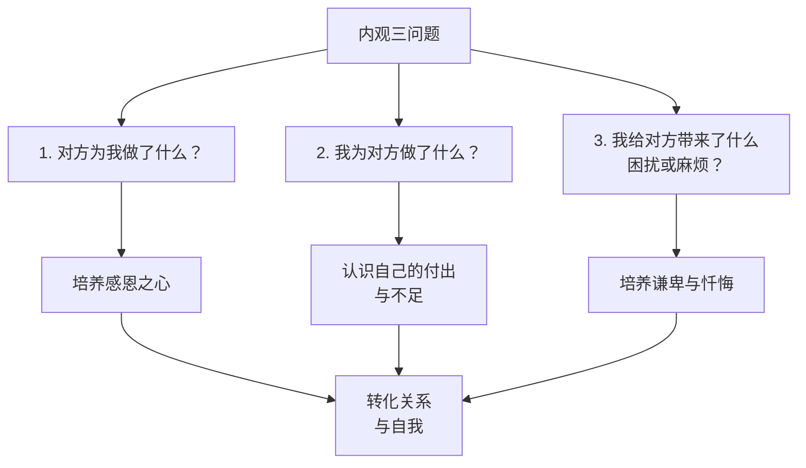

# 内观（Naikan）冥想实操指南

> **适用范围**：希望改善人际关系、深化自我认知、及进行结构化反思的修习者
> **最后更新**：2026-05

---

## 目录

1. [日常内观15分钟简化版](#1-日常内观15分钟简化版)
2. [集中内观7天闭关完整日程](#2-集中内观7天闭关完整日程)
3. [内观日记三级模板](#3-内观日记三级模板)
4. [不同应用场景的内观调整](#4-不同应用场景的内观调整)
5. [书写内观结构化工作表](#5-书写内观结构化工作表)
6. [常见问题与深化建议](#6-常见问题与深化建议)

---

## 1. 日常内观15分钟简化版

Naikan（内观）由日本学者吉本伊信于1940年代发展，核心是通过回答三个基本问题，结构化地审视自己与他人（通常是母亲）的关系。日常简化版让这一强大的方法融入每日生活。

### 1.1 三问题核心框架



### 1.2 15分钟日常流程

| 阶段 | 时长 | 内容 |
|------|------|------|
| **准备** | 1分钟 | 安静坐定，深呼吸，设定今日内观对象 |
| **第一问** | 4分钟 | "对方为我做了什么？" |
| **第二问** | 4分钟 | "我为对方做了什么？" |
| **第三问** | 4分钟 | "我给对方带来了什么困扰？" |
| **结束** | 2分钟 | 感恩与意图设定 |

### 1.3 详细操作指南

#### 第一步：选择对象（每日轮换建议）

| 星期 | 建议对象 | 原因 |
|------|----------|------|
| 周一 | 母亲/主要养育者 | 内观传统起始对象，关系根基 |
| 周二 | 父亲 | 补充另一养育者的视角 |
| 周三 | 伴侣/配偶 | 最亲密的日常关系 |
| 周四 | 一位朋友 | 选择关系中有张力或特别感激的人 |
| 周五 | 一位同事 | 职场关系的觉察 |
| 周六 | 自己 | 将三问题转向自己（自我关怀与责任） |
| 周日 | 一位"困难"的人 | 选择让你感到受伤或愤怒的人 |

#### 第二步：回答第一问——"对方为我做了什么？"

**操作要点**：
- 按时间顺序回顾：从最早的记忆到现在
- 具体化：不要笼统说"她照顾我"，要具体到"每天早上为我准备早餐"
- 量化：尽可能估算次数、时间、金钱
- 包含小事：一个微笑、一次等待、一句安慰都算上

**示例**（以母亲为对象）：

| 时期 | 她为我做了什么 | 我的感受 |
|------|---------------|----------|
| 婴儿期 | 母乳喂养约2年，每日多次 | （当时无意识，现在感恩） |
| 幼儿期 | 教我走路、说话、穿衣 | 被耐心教导的温暖 |
| 学龄期 | 每天准备三餐，送我上学 | 当时的理所当然，现在的亏欠 |
| 青少年 | 容忍我的叛逆，深夜等我回家 | 当时的反感，现在的理解 |
| 成年期 | 仍关心我的生活，不打扰但有支持 | 温暖与些许愧疚 |

#### 第三步：回答第二问——"我为对方做了什么？"

**操作要点**：
- 诚实面对：不要美化，也不要贬低
- 同样具体化：具体事件、时间、行动
- 注意"隐性"付出：如"没给她添麻烦"不算，"主动分担家务"才算

**常见问题**：许多人发现这一问的答案比第一问少得多——这是正常的，也是内观的起点。

#### 第四步：回答第三问——"我给对方带来了什么困扰？"

**操作要点**：
- 这需要勇气，但不必自责
- 同样按时间顺序回顾
- 包括：言语伤害、忽视、让她担心、经济负担、情绪消耗等

**示例**：

| 时期 | 我带来的困扰 | 当时我的觉察 |
|------|-------------|-------------|
| 幼儿期 | 夜哭让她无法睡眠 | 无意识 |
| 学龄期 | 生病时她放下工作照顾我 | 只知道难受 |
| 青少年 | 叛逆言语伤害她 | 当时觉得"她不懂我" |
| 成年期 | 长时间不联系让她牵挂 | 忙于自己的生活 |

#### 第五步：结束整合

用1-2分钟：
- 感受三问回答后的内心状态（通常会有感恩、亏欠、想要改变的混合感受）
- 设定一个简单的今日意图："今天我要为对方做一件小事"
- 感恩这次内观的机会

### 1.4 环境设置

| 要素 | 建议 |
|------|------|
| **时间** | 固定时段（如早起后或睡前） |
| **地点** | 安静、不被打扰的空间 |
| **姿势** | 坐姿，脊柱挺直，可以闭眼或微睁 |
| **工具** | 内观日记本（见第3章模板）或只用心智 |
| **光线** | 柔和，不要太亮也不要太暗 |

---

## 2. 集中内观7天闭关完整日程

集中内观（集中内観）是 Naikan 的深入形式，通常在一周内每天进行约10-14小时的结构化内观，由训练有素的内观师指导。

### 2.1 闭关结构总览


### 2.2 每日时间安排

**标准集中内观日程**（约14小时/天）：

| 时间 | 活动 | 说明 |
|------|------|------|
| **06:00** | 起床 | 简单洗漱 |
| **06:30-08:00** | 第一轮内观 | 90分钟，主要时间段 |
| **08:00-08:30** | 早餐 | 简单饮食，内观中保持觉察 |
| **08:30-10:00** | 第二轮内观 | 90分钟 |
| **10:00-10:15** | 短暂休息 | 可站立、走动 |
| **10:15-12:00** | 第三轮内观 | 105分钟 |
| **12:00-13:00** | 午餐 + 休息 | 内观师面谈（每日一次约30分钟） |
| **13:00-14:30** | 第四轮内观 | 90分钟 |
| **14:30-14:45** | 短暂休息 | |
| **14:45-16:15** | 第五轮内观 | 90分钟 |
| **16:15-16:30** | 休息 | |
| **16:30-18:00** | 第六轮内观 | 90分钟 |
| **18:00-19:00** | 晚餐 + 休息 | |
| **19:00-20:30** | 第七轮内观 | 90分钟 |
| **20:30-20:45** | 休息 | |
| **20:45-22:00** | 第八轮内观 | 75分钟 |
| **22:00** | 就寝 | |

### 2.3 七日主题安排

| 日期 | 主要内观对象 | 重点 |
|------|-------------|------|
| **第1天** | 母亲 + 适应 | 建立三问题的节奏，适应闭关环境 |
| **第2天** | 母亲深入 | 从怀孕到断奶的详细回顾 |
| **第3天** | 母亲深入 | 从幼儿期到成年，完整时间线 |
| **第4天** | 父亲 | 同样的三问题框架 |
| **第5天** | 兄弟姐妹 / 伴侣 | 选择关系最密切或最有张力者 |
| **第6天** | 扩展对象 | 老师、朋友、恩人、甚至"敌人" |
| **第7天** | 整合 + 自我内观 | 将三问题转向自己，设定未来意向 |

### 2.4 内观师面谈

每日一次的面谈是集中内观的核心支持：

| 面谈内容 | 说明 |
|----------|------|
| **汇报** | 学员汇报当日的内观内容 |
| **倾听** | 内观师主要倾听，极少评判或解释 |
| **确认** | 内观师确认三问题的覆盖完整性 |
| **引导** | 必要时引导学员回到具体事实，避免抽象分析 |
| **鼓励** | 支持学员继续深入，尤其面对困难记忆 |

### 2.5 闭关注意事项

| 项目 | 说明 |
|------|------|
| **隔离** | 通常禁止与外界通讯（手机交出） |
| **静默** | 除面谈外，保持沉默 |
| **饮食** | 简单素食或正常饮食，不追求感官享受 |
| **阅读** | 禁止阅读、写作（除内观记录外）、音乐 |
| **运动** | 可在休息时段简单伸展，无剧烈运动 |
| **医疗** | 告知内观师任何健康状况，携带必要药物 |

---

## 3. 内观日记三级模板

内观日记帮助将内观从"心中想想"转化为"结构化记录"，加深觉察并追踪转变。

### 3.1 初级模板：三问题回答

**适用**：刚开始内观的修习者

```
━━━━━━━━━━━━━━━━━━━━━━━━━━━━━━
内观日记 · 初级
日期：________  对象：________
━━━━━━━━━━━━━━━━━━━━━━━━━━━━━━

【第一问】对方为我做了什么？

1. ________________________________________
2. ________________________________________
3. ________________________________________
4. ________________________________________
5. ________________________________________

【第二问】我为对方做了什么？

1. ________________________________________
2. ________________________________________
3. ________________________________________

【第三问】我给对方带来了什么困扰？

1. ________________________________________
2. ________________________________________
3. ________________________________________

【今日感受与意图】
感受：____________________________________
今日要做的小事：__________________________
━━━━━━━━━━━━━━━━━━━━━━━━━━━━━━
```

### 3.2 中级模板：情感维度加入

**适用**：已熟悉基础三问题，希望加入情感觉察

```
━━━━━━━━━━━━━━━━━━━━━━━━━━━━━━
内观日记 · 中级
日期：________  对象：________
━━━━━━━━━━━━━━━━━━━━━━━━━━━━━━

【第一问】对方为我做了什么？

事件：__________________________
当时的我的态度：________________（感恩/理所当然/不满/无意识）
现在的我的感受：________________（感恩/愧疚/温暖/其他）

事件：__________________________
当时的我的态度：________________
现在的我的感受：________________

事件：__________________________
当时的我的态度：________________
现在的我的感受：________________

【第二问】我为对方做了什么？

事件：__________________________
我的动机：______________________（真心/义务/期待回报/其他）
对方的反应：____________________

事件：__________________________
我的动机：______________________
对方的反应：____________________

【第三问】我给对方带来了什么困扰？

事件：__________________________
当时我的觉察度：________________（完全没意识到/隐约知道/明知故犯）
现在的感受：____________________（后悔/理解当时/想要弥补）

【情感模式觉察】
我在这个关系中反复出现的情感：____________
这个情感如何影响我的行为：________________
━━━━━━━━━━━━━━━━━━━━━━━━━━━━━━
```

### 3.3 高级模板：模式识别与转化

**适用**：长期修习者，希望从个体事件上升到模式与生命叙事

```
━━━━━━━━━━━━━━━━━━━━━━━━━━━━━━
内观日记 · 高级
日期：________  对象：________
━━━━━━━━━━━━━━━━━━━━━━━━━━━━━━

【事实层】三问题详细回答
（同中级模板，更详细）

【模式层】

1. 重复出现的主题：
   在对方为我做的事中，反复出现的主题是什么？
   ________________________________________

2. 我的回应模式：
   面对对方的给予，我的典型回应方式是？
   □ 理所当然接受  □ 拒绝/推开  □ 想要回报但做不到  □ 其他：____

3. 关系动力：
   这段关系中的核心动力是什么？
   （例如：付出-亏欠、控制-依赖、忽视-渴望等）
   ________________________________________

4. 与其他关系的共鸣：
   这个模式是否也出现在其他关系中？
   ________________________________________

【转化层】

1. 认知重构：
   如果放下"受害者"或"委屈者"的叙事，我可以看到什么？
   ________________________________________

2. 行动意向：
   基于这次内观，我想做出的一个具体改变是：
   ________________________________________

3. 自我宽恕：
   对于我给对方带来的困扰，我可以如何宽恕自己？
   ________________________________________

【感恩宣言】
今天，我想对对方说：
________________________________________
━━━━━━━━━━━━━━━━━━━━━━━━━━━━━━
```

---

## 4. 不同应用场景的内观调整

### 4.1 场景对照表

| 应用场景 | 调整重点 | 对象选择 | 第三问的变体 |
|----------|----------|----------|-------------|
| **家庭关系修复** | 深度回顾成长史，理解父母的限制 | 父母为主要对象 | "我如何误解了他们的意图？" |
| **职场关系** | 关注具体事件中的互动模式 | 上司、同事、下属 | "我的哪些行为造成了团队摩擦？" |
| **自我反思** | 将三问题转向自己 | 自己 | "我如何忽视了自己的需要？" |
| **伴侣关系** | 平等审视双方付出与期待 | 伴侣 | "我的期待如何给对方压力？" |

### 4.2 家庭关系修复版

**特点**：
- 时间跨度长：从最早记忆到现在
- 深度情感工作：允许情感宣泄（在安全的设置中）
- 理解父母的局限：在第三问之后加入"第四问"——"他们当时面临什么困难？"

**第四问（家庭版附加）**：

| 时期 | 父母面临的困难 | 这些困难如何影响了他们对待我的方式 |
|------|---------------|----------------------------------|
| 我出生时 | 经济压力/年轻缺乏经验 | 可能导致焦虑或过度保护 |
| 我幼年时 | 工作与生活平衡 | 可能导致陪伴不足 |
| 我青少年时 | 他们自己的中年危机 | 可能导致沟通困难 |

### 4.3 职场关系版

**调整后的三问题**：

| 原问题 | 职场调整版 |
|--------|-----------|
| 对方为我做了什么？ | 这位同事/上司为我提供了什么支持、机会、包容？ |
| 我为对方做了什么？ | 我为团队/对方贡献了什么价值、支持、协作？ |
| 我给对方带来了什么困扰？ | 我的哪些行为增加了对方的工作负担或情绪压力？ |

**职场内观特别提示**：
- 保持专业边界：内观目的是自我成长，不是为职场冲突寻找"证据"
- 聚焦可改变的行为：关注自己的行为，而非对方的过错
- 转化到行动：每次内观后设定一个具体的职场行动

### 4.4 自我反思版

**将三问题转向自己**：

| 问题 | 自我反思版 |
|------|-----------|
| 第一问（原：对方为我做了什么？） | 我为自己做了什么？（自我关怀） |
| 第二问（原：我为对方做了什么？） | 我为自己做的努力有哪些？（自我肯定） |
| 第三问（原：我给对方带来了什么困扰？） | 我如何忽视、批评、伤害了自己？（自我宽恕的起点） |

**适用时机**：
- 感到过度自责时（平衡自我批评）
- 感到自我忽视时（培养自我关怀）
- 重大决定前（澄清自我需求）

---

## 5. 书写内观结构化工作表

以下工作表可直接打印使用。

### 5.1 单次内观工作表

```
┏━━━━━━━━━━━━━━━━━━━━━━━━━━━━━━━━━━━━━━━━━━━━━━━━━━━━━━━━━━━━━━━━┓
┃                         内观工作表                               ┃
┣━━━━━━━━━━━━━━━━━━━━━━━━━━━━━━━━━━━━━━━━━━━━━━━━━━━━━━━━━━━━━━━━┫
┃ 日期：__________    对象：__________    时长：__________         ┃
┣━━━━━━━━━━━━━━━━━━━━━━━━━━━━━━━━━━━━━━━━━━━━━━━━━━━━━━━━━━━━━━━━┫
┃                                                                 ┃
┃  【第一问】对方为我做了什么？                                     ┃
┃                                                                 ┃
┃  1. _______________________________________________________      ┃
┃     具体时间/场合：________________    频率：__________          ┃
┃                                                                 ┃
┃  2. _______________________________________________________      ┃
┃     具体时间/场合：________________    频率：__________          ┃
┃                                                                 ┃
┃  3. _______________________________________________________      ┃
┃     具体时间/场合：________________    频率：__________          ┃
┃                                                                 ┃
┃  4. _______________________________________________________      ┃
┃     具体时间/场合：________________    频率：__________          ┃
┃                                                                 ┃
┃  5. _______________________________________________________      ┃
┃     具体时间/场合：________________    频率：__________          ┃
┃                                                                 ┃
┣━━━━━━━━━━━━━━━━━━━━━━━━━━━━━━━━━━━━━━━━━━━━━━━━━━━━━━━━━━━━━━━━┫
┃                                                                 ┃
┃  【第二问】我为对方做了什么？                                     ┃
┃                                                                 ┃
┃  1. _______________________________________________________      ┃
┃     动机：□ 真心  □ 义务  □ 期待回报  □ 其他：__________       ┃
┃                                                                 ┃
┃  2. _______________________________________________________      ┃
┃     动机：□ 真心  □ 义务  □ 期待回报  □ 其他：__________       ┃
┃                                                                 ┃
┃  3. _______________________________________________________      ┃
┃     动机：□ 真心  □ 义务  □ 期待回报  □ 其他：__________       ┃
┃                                                                 ┃
┣━━━━━━━━━━━━━━━━━━━━━━━━━━━━━━━━━━━━━━━━━━━━━━━━━━━━━━━━━━━━━━━━┫
┃                                                                 ┃
┃  【第三问】我给对方带来了什么困扰？                               ┃
┃                                                                 ┃
┃  1. _______________________________________________________      ┃
┃     当时我的觉察：□ 无意识  □ 隐约知道  □ 明知故犯              ┃
┃                                                                 ┃
┃  2. _______________________________________________________      ┃
┃     当时我的觉察：□ 无意识  □ 隐约知道  □ 明知故犯              ┃
┃                                                                 ┃
┃  3. _______________________________________________________      ┃
┃     当时我的觉察：□ 无意识  □ 隐约知道  □ 明知故犯              ┃
┃                                                                 ┃
┣━━━━━━━━━━━━━━━━━━━━━━━━━━━━━━━━━━━━━━━━━━━━━━━━━━━━━━━━━━━━━━━━┫
┃                                                                 ┃
┃  【反思与意向】                                                   ┃
┃                                                                 ┃
┃  今日最强烈的感受：___________________________________________   ┃
┃                                                                 ┃
┃  我发现的模式：_______________________________________________   ┃
┃                                                                 ┃
┃  今天我想做的一件小事：_______________________________________   ┃
┃                                                                 ┃
┃  我想对对方说：_______________________________________________   ┃
┃                                                                 ┃
┗━━━━━━━━━━━━━━━━━━━━━━━━━━━━━━━━━━━━━━━━━━━━━━━━━━━━━━━━━━━━━━━━┛
```

### 5.2 七日内观追踪表

```
┏━━━━━━━━━━━━━━━━━━━━━━━━━━━━━━━━━━━━━━━━━━━━━━━━━━━━━━━━━━━━━━━━┓
┃                    七日内观追踪表                                 ┃
┣━━━━━━┳━━━━━━━━━━━━┳━━━━━━━━━━━━┳━━━━━━━━━━━━┳━━━━━━━━━━━━━━━━━━┫
┃ 日期  ┃  对象       ┃  感恩发现   ┃  亏欠发现   ┃  今日行动意向     ┃
┣━━━━━━╋━━━━━━━━━━━━╋━━━━━━━━━━━━╋━━━━━━━━━━━━╋━━━━━━━━━━━━━━━━━━┫
┃ Day 1 ┃            ┃            ┃            ┃                  ┃
┣━━━━━━╋━━━━━━━━━━━━╋━━━━━━━━━━━━╋━━━━━━━━━━━━╋━━━━━━━━━━━━━━━━━━┫
┃ Day 2 ┃            ┃            ┃            ┃                  ┃
┣━━━━━━╋━━━━━━━━━━━━╋━━━━━━━━━━━━╋━━━━━━━━━━━━╋━━━━━━━━━━━━━━━━━━┫
┃ Day 3 ┃            ┃            ┃            ┃                  ┃
┣━━━━━━╋━━━━━━━━━━━━╋━━━━━━━━━━━━╋━━━━━━━━━━━━╋━━━━━━━━━━━━━━━━━━┫
┃ Day 4 ┃            ┃            ┃            ┃                  ┃
┣━━━━━━╋━━━━━━━━━━━━╋━━━━━━━━━━━━╋━━━━━━━━━━━━╋━━━━━━━━━━━━━━━━━━┫
┃ Day 5 ┃            ┃            ┃            ┃                  ┃
┣━━━━━━╋━━━━━━━━━━━━╋━━━━━━━━━━━━╋━━━━━━━━━━━━╋━━━━━━━━━━━━━━━━━━┫
┃ Day 6 ┃            ┃            ┃            ┃                  ┃
┣━━━━━━╋━━━━━━━━━━━━╋━━━━━━━━━━━━╋━━━━━━━━━━━━╋━━━━━━━━━━━━━━━━━━┫
┃ Day 7 ┃            ┃            ┃            ┃                  ┃
┗━━━━━━┻━━━━━━━━━━━━┻━━━━━━━━━━━━┻━━━━━━━━━━━━┻━━━━━━━━━━━━━━━━━━┛

【七日总结】
最频繁出现的感恩主题：___________________________________________
最困难面对的事实：_______________________________________________
我注意到的自身模式：_____________________________________________
未来一周的一个改变承诺：_________________________________________
```

---

## 6. 常见问题与深化建议

### 6.1 常见疑难

| 问题 | 回应 |
|------|------|
| "第一问让我充满愧疚，无法进行" | 这是常见反应。记住：内观不是自责，是看见真相。愧疚感意味着你的心正在软化。不要停留于愧疚，让它转化为感恩和行动。 |
| "我觉得自己没有得到过爱，第一问答不出来" | 尝试将标准放到最低——一个面包、一次没有被抛弃、一个庇护的夜晚，都是爱。如果实在困难，可以从第二问开始。 |
| "我不想面对第三问的痛苦记忆" | 内观师或支持者的陪伴很重要。在安全的设置中，允许自己慢慢来。不需要一天内处理所有。 |
| "内观后我感到更糟了" | 初期这是正常的——"看见"本身会带来痛苦。但如果持续恶化，请暂停并与内观师或心理咨询师讨论。 |
| "我可以对已经去世的人做内观吗？" | 完全可以。内观对象可以是任何在你生命中重要的人，无论他们是否在世。 |

### 6.2 深化建议

| 阶段 | 建议 |
|------|------|
| **0-3个月** | 每日15分钟简化版，用初级日记模板，专注一个对象 |
| **3-12个月** | 扩展到多个对象，使用中级模板，开始注意情感模式 |
| **1-3年** | 考虑参加一次集中内观闭关（7天），使用高级模板 |
| **3年以上** | 可能成为内观师候选人，或在日常生活中持续深化 |

### 6.3 推荐阅读

| 书名 | 作者 | 重点 |
|------|------|------|
| 《内观入门》 | 吉本伊信 | Naikan 创始人原著 |
| 《The Quiet Therapies》 | David Reynolds | 日本静疗法的西方介绍 |
| 《内观疗法》 | 真荣城辉明等 | 临床内观疗法的系统介绍 |
| 《Naikan: Gratitude, Grace, and the Japanese Art of Self-Reflection》 | Gregg Krech | 英文 Naikan 实操指南 |

---

*"内观不是让我们看见别人的错，而是让我们看见自己的盲。"*

*愿每一次诚实的回顾，都带来更深层的自由与联结。*
