# 横膈膜呼吸专业教程：解剖、力学与冥想整合

> **适用对象**：冥想进阶练习者、瑜伽/普拉提教练、身心疗愈从业者  
> **阅读时长**：约 45–60 分钟（可分段阅读）  
> **实践建议**：配合正文中的阶段性练习，分 3–5 次完成，每次 15–20 分钟

---

## 一、核心认知：为什么横膈膜是呼吸的"第一动力"

### 1.1 横膈膜的解剖位置与功能

横膈膜（Diaphragm）是一块穹顶状的骨骼肌，分隔胸腔与腹腔。它**不是主动"下压"**，而是**被动下降**——由大脑延髓的呼吸中枢通过膈神经（C3–C5）发出信号，使其收缩变平，从而增大胸腔容积，产生负压，空气自然流入。

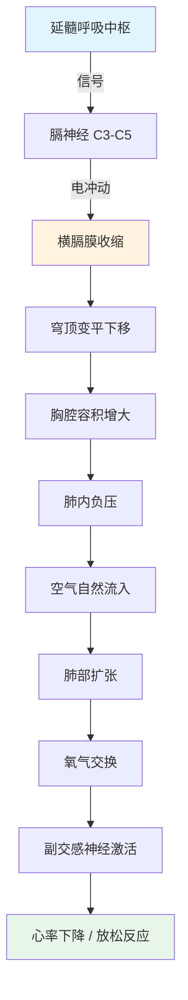

**关键认知转变**：

| 常见误解 | 生理事实 |
|---------|---------|
| "我要用力把气吸到腹部" | 腹部隆起是横膈膜下降挤压内脏的**被动结果**，不是主动"推气" |
| "腹式呼吸比胸式呼吸更好" | 健康的自然呼吸本就是**横膈膜主导 + 胸腹腔协同**，不应割裂 |
| "呼吸越深越好" | 过度深呼吸会导致**低碳酸血症**（头晕、手脚发麻），应追求**舒缓**而非**深大** |

### 1.2 横膈膜的精细解剖结构

横膈膜并非一块简单的"穹顶状肌肉"，而是由多个部分精密构成的复合结构：

| 结构部位 | 解剖描述 | 功能意义 |
|---------|---------|---------|
| **中央腱（Central Tendon）** | 位于横膈膜中央的三角形腱性区域，不含肌纤维 | 是横膈膜收缩时的**固定锚点**，肌纤维向中央腱汇聚，收缩时将中央腱向下拉平 |
| **肌性部（Muscular Part）** | 分为胸骨部、肋部、腰部三个附着区域 | 提供收缩力量，不同部位的紧张度影响呼吸的均匀性 |
| **膈脚（Crura）** | 左、右膈脚附着于腰椎前缘（L1–L3） | 右侧膈脚跨越食管裂孔，与食管下括约肌协同；**膈脚张力异常与胃食管反流相关** |
| **食管裂孔（Esophageal Hiatus）** | 约平 T10 水平，食管与迷走神经穿过 | 呼吸时横膈膜的运动**按摩食管**，促进胃排空 |
| **主动脉裂孔（Aortic Hiatus）** | 约平 T12 水平，主动脉、胸导管穿过 | 位于膈脚后方，呼吸时主动脉的节律性压力变化影响血流 |
| **腔静脉孔（Vena Caval Foramen）** | 约平 T8–T9 水平，位于中央腱右侧 | 下腔静脉穿过，**吸气时横膈膜下降会轻度挤压下腔静脉**，影响静脉回流 |

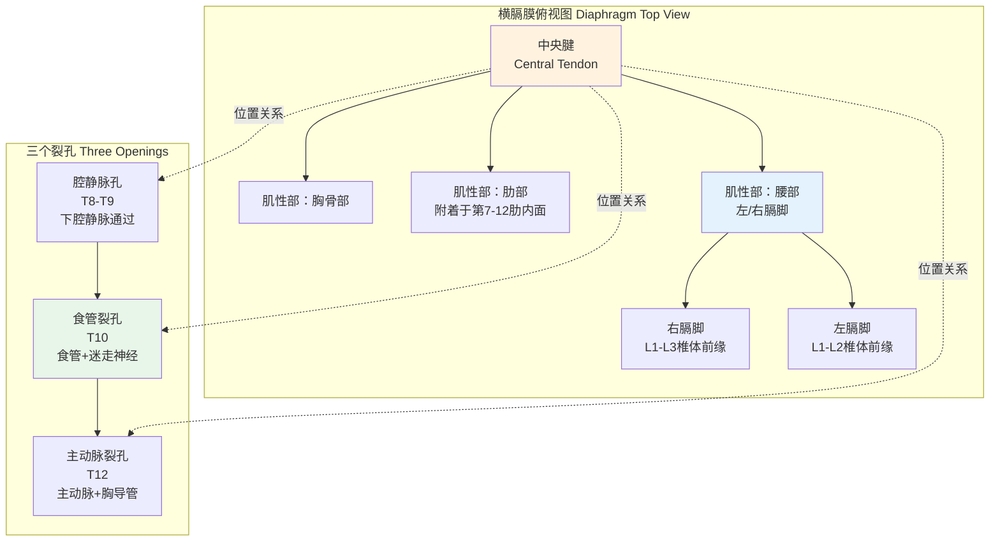

**关键洞察**：横膈膜的腰椎附着（膈脚）意味着**腰椎的姿态直接影响横膈膜的运动幅度**。长期腰椎前凸减少（久坐驼背）会牵拉膈脚，限制横膈膜下降；而骨盆前倾过度则会改变膈脚张力，同样限制呼吸效率。

### 1.3 呼吸的生理学参数参考

理解正常呼吸的量化指标，有助于自我评估和识别异常：

| 参数 | 成人安静状态 | 运动/深呼吸 | 备注 |
|------|------------|------------|------|
| **呼吸频率** | 12–16 次/分钟 | 可达 40–60 次/分钟 | 冥想深入时可降至 4–6 次/分钟 |
| **潮气量（Tidal Volume）** | 400–600 ml | 可达 2000–3000 ml | 每次正常呼吸的通气量 |
| **每分钟通气量（VE）** | 6–10 L/min | 可达 100+ L/min | = 潮气量 × 呼吸频率 |
| **横膈膜下降幅度** | 1.5–2 cm | 6–10 cm | 深呼吸时幅度显著增大 |
| **吸气时间 : 呼气时间** | 1 : 1.5 | 1 : 2 或更长 | 冥想中常延长至 1 : 2–3 |
| **肺活量（VC）** | 男性 4–5 L<br/>女性 3–4 L | — | 与身高、年龄、体能相关 |
| **功能残气量（FRC）** | 2.0–2.5 L | — | 呼气末肺内残留气体，维持肺泡开放 |

> **冥想中的呼吸变化**：当副交感神经系统深度激活时，代谢率下降约 10–20%，身体对氧气的需求减少，因此呼吸频率自然下降、潮气量减小。这是一种**适应性节省**，不是缺氧。

### 1.4 迷走神经与自主神经系统的深层机制

横膈膜呼吸之所以能有效诱导放松，核心机制在于**迷走神经（Vagus Nerve）**的激活。迷走神经是第十对脑神经，从延髓发出，下行经过颈部、胸腔，最终分布到腹腔脏器——是**副交感神经系统的主干**。

```mermaid
graph TD
    subgraph 迷走神经双分支模型<br/>Porges' Polyvagal Theory
        V1[腹侧迷走神经<br/>Ventral Vagal Complex<br/>↳ 脑干腹侧] --> V2[社会参与系统<br/>Social Engagement System]
        V2 --> V3[面部表情<br/>中耳肌肉<br/>喉部声带]
        V2 --> V4[心率变异性高<br/>HRV 升高<br/>呼吸性窦性心律不齐]

        D1[背侧迷走神经<br/>Dorsal Vagal Complex<br/>↳ 脑干背侧] --> D2[冻结反应<br/>Immobilization]
        D2 --> D3[心率骤降<br/>血压下降<br/>晕厥前兆]
        D2 --> D4[解离 / 麻木<br/>与冥想中的"深度定"不同]

        S1[交感神经系统<br/>Sympathetic] --> S2[战斗/逃跑<br/>Fight/Flight]
        S2 --> S3[心率加快<br/>呼吸急促<br/>肌肉紧张]
    end

    subgraph 横膈膜呼吸的作用<br/>Diaphragmatic Breathing Effect
        B1[缓慢深长的呼吸<br/>↓<br/>呼气延长] --> B2[刺激压力感受器<br/>Baroreceptors]
        B2 --> B3[腹侧迷走神经激活<br/>↑]
        B3 --> B4[副交感主导状态<br/>安全与连接感]
        B4 --> B5[心率变异性提升<br/>HRV 升高]
    end

    V4 -.->|生理指标| B5
    B3 -.->|促进| V2

    style V2 fill:#e8f5e9
    style D2 fill:#ffebee
    style S2 fill:#ffebee
    style B4 fill:#e8f5e9
    style B5 fill:#e8f5e9
```

**心率变异性（HRV）与呼吸的关系**：

吸气时，交感神经活动轻微增强，心率**加快**；呼气时，迷走神经活动增强，心率**减慢**——这种节律性变化称为**呼吸性窦性心律不齐（Respiratory Sinus Arrhythmia, RSA）**。RSA 的幅度就是 HRV 的重要指标之一。

| HRV 状态 | 生理意义 | 冥想表现 |
|---------|---------|---------|
| **高 HRV** | 自主神经系统灵活、适应力强 | 情绪稳定、注意力集中、恢复力强 |
| **低 HRV** | 自主神经僵硬、慢性压力 | 焦虑、抑郁、心血管风险升高 |
| **呼吸性 HRV** | RSA 幅度大，迷走神经张力高 | 横膈膜呼吸训练可直接提升此指标 |

**实操要点**：
- **呼气延长**是刺激迷走神经的关键——呼气相迷走神经张力最高
- **吸气/呼气比 1:2–1:3** 是安全有效的迷走神经刺激比例
- 过度延长呼气（如 1:4 以上）可能对初学者造成轻微缺氧感，应循序渐进

### 1.5 呼吸的化学调控：身体如何"知道"该呼吸

除了神经信号驱动，呼吸还受到血液中化学物质浓度的精密调控。理解这套系统，有助于解释为什么过度换气会导致头晕、为什么屏息会有"呼吸欲望"、以及为什么横膈膜呼吸能改变身心状态。

```mermaid
graph TD
    subgraph 中枢化学感受器<br/>Central Chemoreceptors
        C1[延髓腹外侧<br/>靠近呼吸中枢] --> C2[主要监测<br/>脑脊液中的 H+ 浓度]
        C2 --> C3[H+ 浓度↑<br/>→ 呼吸驱动↑]
        C3 --> C4[CO2 穿过血脑屏障<br/>→ 形成 H2CO3 → 解离为 H+]
        C4 --> C5[CO2 是呼吸驱动的<br/>最主要因素]
    end

    subgraph 外周化学感受器<br/>Peripheral Chemoreceptors
        P1[颈动脉体<br/>Carotid Bodies<br/>↳ 颈总动脉分叉处] --> P2[监测血氧<br/>PaO2]
        P1 --> P3[监测 CO2<br/>PaCO2]
        P1 --> P4[监测 pH<br/>血液酸碱度]
        P2 --> P5[PaO2 < 60 mmHg<br/>强烈驱动呼吸]
    end

    subgraph 横膈膜呼吸的影响<br/>Diaphragmatic Effect
        D1[缓慢深长的呼吸] --> D2[CO2 排出适度增加<br/>但不至于过度]
        D2 --> D3[血液 CO2 维持<br/>35-45 mmHg 正常范围]
        D3 --> D4[脑血管适度扩张<br/>脑供血优化]
        D4 --> D5[头晕/焦虑减少<br/>头脑清晰]
    end

    C5 -.->|过度呼吸时| D2
    P5 -.->|高海拔/缺氧时| D1

    style C5 fill:#fff3e0
    style P5 fill:#ffebee
    style D3 fill:#e8f5e9
    style D5 fill:#e8f5e9
```

**关键化学因素**：

| 因素 | 正常范围 | 对呼吸的影响 | 冥想中的意义 |
|-----|---------|------------|------------|
| **PaCO₂（动脉血二氧化碳分压）** | 35–45 mmHg | **最主要的呼吸驱动因素**。PaCO₂ 升高 → 呼吸加深加快；PaCO₂ 降低 → 呼吸抑制 | 过度换气使 PaCO₂ 下降，导致脑血管收缩、头晕、焦虑感 |
| **PaO₂（动脉血氧分压）** | 80–100 mmHg | 低于 60 mmHg 时强烈刺激呼吸；正常范围内变化对呼吸影响较小 | 正常横膈膜呼吸不会显著改变 PaO₂；冥想中的"吸不饱"感通常是心理因素，不是缺氧 |
| **pH（血液酸碱度）** | 7.35–7.45 | 酸中毒（pH↓）→ 呼吸加快；碱中毒（pH↑）→ 呼吸减慢 | 过度换气导致呼吸性碱中毒，引发手脚发麻、肌肉痉挛 |
| **H⁺（氢离子浓度）** | 间接指标 | 中枢化学感受器直接监测的是 H⁺，而非 CO₂ 本身 | CO₂ 穿过血脑屏障后转化为 H⁺，这是延髓调控呼吸的核心机制 |

**过度换气综合征的生理学解释**：

当呼吸过快过深时（如焦虑发作时的急促呼吸），CO₂ 被过度排出，PaCO₂ 迅速下降至 25–30 mmHg 甚至更低：

1. **脑血管收缩**：CO₂ 是强效的脑血管舒张因子，CO₂ 下降 → 脑血流量减少约 30% → **头晕、视物模糊、思维混乱**
2. **钙离子效应**：碱中毒使血浆中游离钙离子减少 → **手足麻木、刺痛、肌肉抽搐（腕足痉挛）**
3. **交感神经过度激活**：低 CO₂ 本身会触发应激反应 → **心慌、濒死感** → 进一步加快呼吸 → **恶性循环**

**打破循环的方法**：
- **延长呼气**：增加 CO₂ 潴留，使 PaCO₂ 回升至正常范围
- **纸袋呼吸**（急性期）：将呼出的 CO₂ 重新吸入，快速提升 PaCO₂
- **横膈膜慢呼吸**：每分钟 6 次左右，使 CO₂ 排出与产生重新平衡

**冥想应用**：
- 冥想中若出现头晕、发麻，首先考虑是否呼吸过快过深——**减慢呼吸、延长呼气**通常能在 1–2 分钟内缓解
- BOLT 测试（5.4 节）本质上测量的是身体对 CO₂ 的耐受阈值，低 BOLT 分数意味着化学感受器过于敏感

---

## 二、呼吸力学：三维腔体的协同运动

### 2.1 呼吸时的身体运动全景

呼吸不是二维的"胸式/腹式"对立，而是**三维空间**中多个腔体、多组肌群的精密协同。

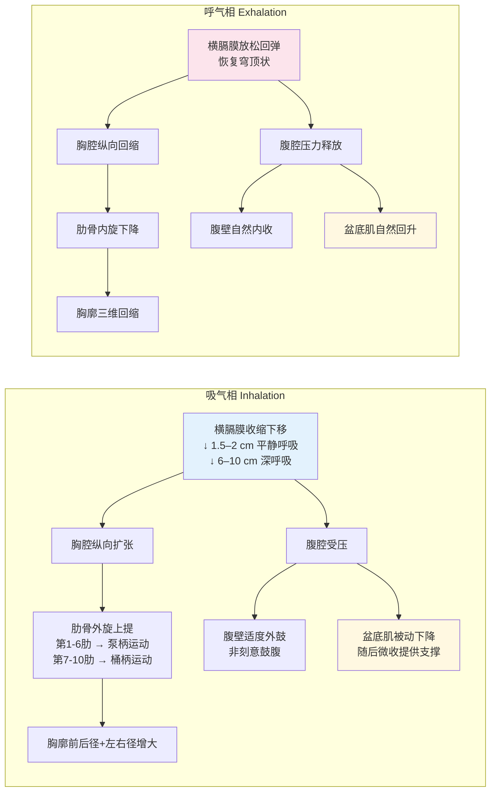

### 2.2 呼吸辅助肌群的参与层级

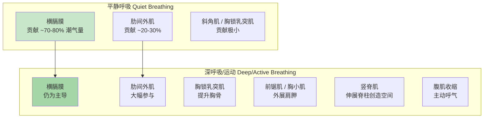

### 2.3 呼吸的内脏效应：横膈膜是内脏的"按摩师"

横膈膜的运动远不止通气功能，它对腹腔和胸腔脏器有着深远的机械性影响：

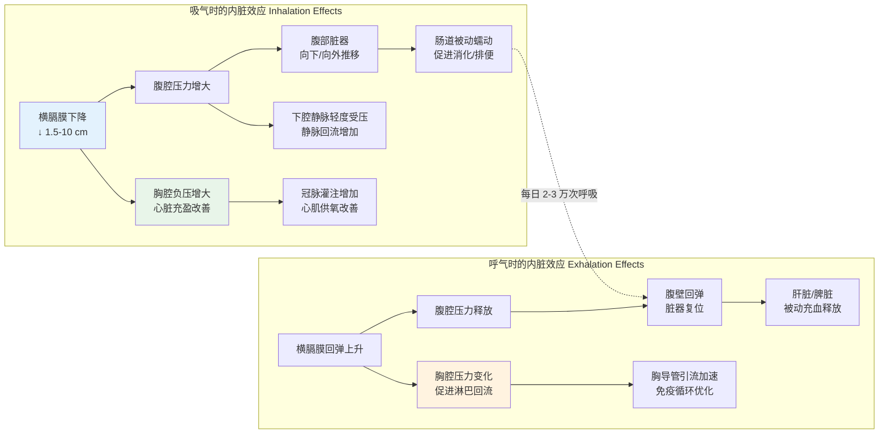

| 脏器系统 | 吸气时的影响 | 呼气时的影响 | 临床/冥想意义 |
|---------|------------|------------|-------------|
| **心脏** | 胸腔负压增大 → 静脉回心血量增加 → 心输出量增加 | 胸腔压力略升 → 心脏排空 | 深呼吸改善心血管效率；但过度深呼吸会增加心脏负荷 |
| **肝脏** | 被向下推压，被动充血 | 回弹复位，血液流出 | 横膈膜运动促进肝血循环，有助于代谢 |
| **胃/肠道** | 受压，胃内压升高 | 压力释放，胃排空 | 餐后不宜立即深呼吸练习；空腹练习更佳 |
| **脾脏** | 受压，储存血液释放 | 复位，重新充血 | 深呼吸促进血液过滤和免疫循环 |
| **淋巴系统** | 胸腔负压促进淋巴液向心流动 | 胸导管引流 | 横膈膜被称为"淋巴泵"，深呼吸增强免疫功能 |
| **肾脏** | 腹腔压力升高，肾血流略减 | 压力释放，肾血流恢复 | 影响尿液生成节律 |

**冥想应用**：理解这些效应后，可以明白为什么：
- **空腹练习**更深层的呼吸（餐后血液集中在消化系统，深呼吸的内脏按摩会干扰消化）
- **缓慢的深呼吸**比急促的深呼吸更有益（给脏器足够的时间完成充放血的循环）
- **长期横膈膜呼吸训练**可能带来消化改善、免疫力提升的附带效益

### 2.4 横膈膜与核心稳定：被忽视的"圆柱体"模型

在运动医学和物理治疗领域，横膈膜被重新定义为**核心稳定系统的首要肌肉**，而不仅仅是呼吸肌。它与腹横肌、盆底肌、多裂肌共同构成一个封闭的"圆柱体"（Cylindrical Model），这个模型的稳定性直接影响脊柱健康、运动表现和呼吸效率。

```mermaid
graph TD
    subgraph 核心圆柱体 Core Cylinder
        T1[顶部：横膈膜<br/>Diaphragm<br/>↳ 穹顶状穹顶] --> S1[侧壁：腹横肌<br/>Transversus Abdominis<br/>↳ 如腰带包裹]
        S1 --> S2[后侧：多裂肌<br/>Multifidus<br/>↳ 脊柱微调稳定]
        S1 --> B1[底部：盆底肌<br/>Pelvic Floor<br/>↳ 如吊床托底]
        T1 --> B1
    end

    subgraph 腹内压 IAP<br/>Intra-Abdominal Pressure
        I1[圆柱体四壁协同收缩] --> I2[腹内压升高<br/>↑ 10-40 mmHg]
        I2 --> I3[腰椎获得<br/>360° 稳定支撑]
        I3 --> I4[脊柱负荷减少<br/>椎间盘突出风险降低]
    end

    subgraph 呼吸-稳定整合<br/>Breath-Stability Integration
        B1a[吸气：横膈膜下降<br/>腹内压适度增加] --> B2a[腹横肌/盆底肌<br/>离心控制<br/>→ 允许横膈膜下降]
        B1a --> B3a[脊柱在呼吸中<br/>获得动态稳定]
    end

    T1 -.->|协同收缩| I1
    I3 -.->|腰椎稳定| B3a

    style T1 fill:#e3f2fd
    style B1 fill:#e3f2fd
    style I2 fill:#fff3e0
    style B3a fill:#e8f5e9
```

**ZOA：对位区（Zone of Apposition）**

ZOA 是指横膈膜与胸廓内壁接触的垂直区域——可以理解为横膈膜"依附"在肋骨上的那一圈"围裙"。这是横膈膜发挥呼吸功能和稳定功能的关键区域：

| ZOA 状态 | 解剖表现 | 功能后果 |
|---------|---------|---------|
| **理想 ZOA** | 横膈膜穹顶较高，与下肋骨有良好的垂直接触面（约 5–8 cm） | 横膈膜收缩时产生有效的向下拉力，同时通过腹内压稳定腰椎 |
| **ZOA 减小** | 横膈膜扁平化，与肋骨接触面减少 | 呼吸效率下降，辅助呼吸肌代偿，腰椎稳定不足 |
| **ZOA 丧失** | 横膈膜几乎完全扁平，失去穹顶形态 | 典型的 COPD 桶状胸模式；严重时代偿使用颈肩部呼吸 |

**导致 ZOA 减小的常见因素**：
- 长期久坐、驼背体态
- 慢性过度换气（横膈膜长期处于低位）
- 腹部肥胖（腹腔内容物推挤横膈膜向上）
- 怀孕后期（子宫顶推横膈膜）
- 慢性阻塞性肺病（COPD，肺过度充气）

**恢复 ZOA 的练习方法**：

1. **90/90 仰卧呼吸**（最简单有效）：
   - 仰卧，双脚踩在墙上，髋和膝均呈 90°
   - 腰部轻压地面（但不要过度用力）
   - 缓慢鼻吸鼻呼，感受横膈膜在重力辅助下更容易恢复穹顶形态
   - 每次 5–10 分钟

2. **侧卧肋骨扩张**（改善桶柄运动）：
   - 侧卧，上方手臂举过头顶
   - 吸气时感受上方肋骨向天花板方向打开
   - 呼气时感受肋骨回落
   - 每侧 5 分钟

**冥想应用**：
- 冥想坐姿中，**臀部垫高、脊柱挺拔**不仅是"传统要求"，更是恢复 ZOA 的生物力学需要
- 双盘坐姿时如果腰椎塌陷，ZOA 会减小，导致呼吸浅快——这是双盘不适合初学者的生理原因之一

### 2.5 筋膜系统视角：解剖列车中的深前线

从 Thomas Myers 的"解剖列车"（Anatomy Trains）筋膜理论看，横膈膜是**深前线（Deep Front Line）**的关键枢纽。深前线是从足底筋膜一直延伸到舌骨的一条连续筋膜链，负责身体的核心稳定、姿势支撑和精细运动控制。

```mermaid
graph LR
    subgraph 深前线 Deep Front Line<br/>与呼吸相关的区段
        F1[胫骨后肌<br/>↳ 足弓支撑] --> F2[内收肌群<br/>↳ 大腿内侧]
        F2 --> F3[盆底肌<br/>↳ 骨盆底托]
        F3 --> F4[横膈膜<br/>↳ 呼吸与稳定的枢纽]
        F4 --> F5[心包/纵隔筋膜<br/>↳ 心脏稳定]
        F5 --> F6[斜角肌/胸锁乳突肌<br/>↳ 头颈稳定]
        F6 --> F7[舌骨肌群<br/>↳ 吞咽与发声]
    end

    F4 -.->|筋膜连续性| F3
    F4 -.->|筋膜连续性| F5

    style F3 fill:#e3f2fd
    style F4 fill:#fff3e0
    style F5 fill:#e3f2fd
```

**筋膜视角的关键洞察**：

| 筋膜链段 | 紧张时的呼吸影响 | 放松/延展后的效果 |
|---------|---------------|----------------|
| **足底筋膜/胫骨后肌** | 足弓塌陷 → 胫骨内旋 → 股骨内旋 → 骨盆前倾/后倾 → 膈脚张力异常 | 恢复足弓弹性后，膈脚张力改善，呼吸更顺畅 |
| **内收肌群** | 大腿内侧紧张 → 骨盆底张力增加 → 盆底肌无法配合横膈膜下降 | 内收肌放松后，盆底肌与横膈膜的对位改善 |
| **胸锁乳突肌/斜角肌** | 颈前侧紧张 → 头前移 → 吞咽和呼吸模式改变 → 上胸式代偿 | 颈部筋膜松解后，辅助呼吸肌放松，横膈膜主导恢复 |
| **舌骨肌群** | 舌骨高位紧张 → 喉部紧缩 → 限制气息流动 → 呼吸浅快 | 舌骨放松后，喉部开放，气息通道通畅 |

**筋膜理论对冥想的启示**：
- 冥想前的身体准备不应只关注坐姿，**足弓、骨盆底、颈部筋膜的状态都会影响呼吸质量**
- 简单的**颈部轻柔转动、足弓激活、骨盆底觉知练习**，可以作为冥想前的"筋膜热身"
- 横膈膜不是孤立工作的——它是整条深前线上的**枢纽**，枢纽两侧的筋膜张力都会影响其功能

---

## 三、冥想中的身体配合：从解剖到觉知

### 3.1 冥想坐姿中的呼吸通道优化

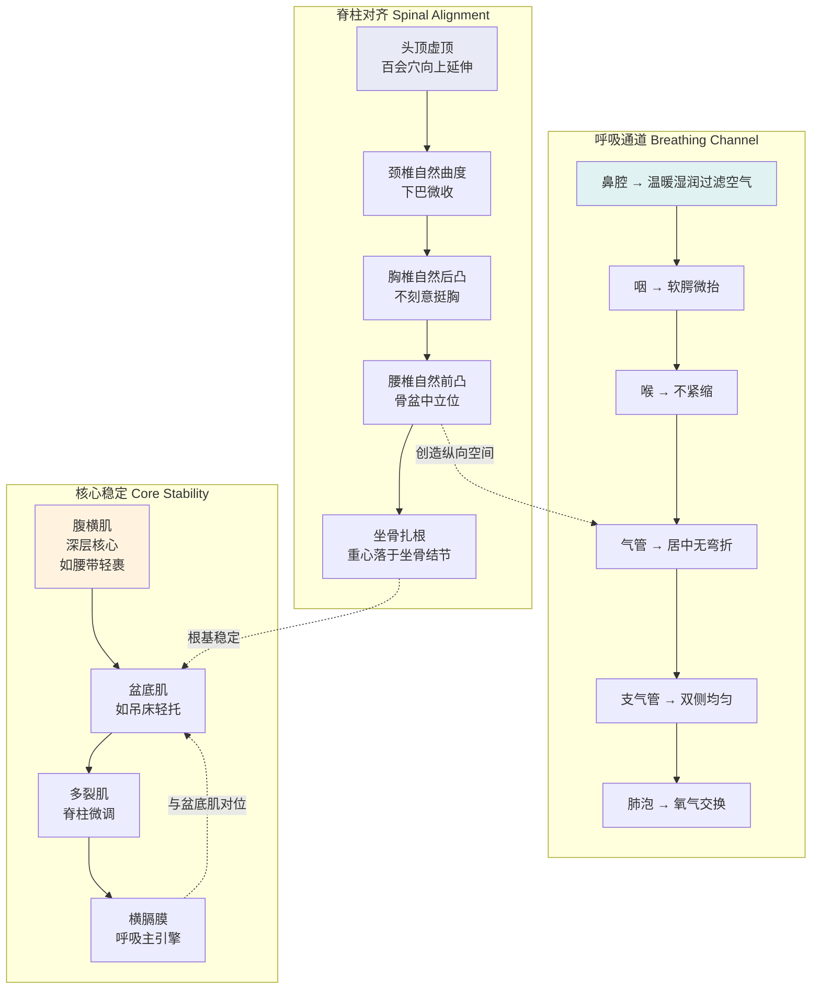

### 3.2 不同坐姿下的横膈膜自由度

| 坐姿 | 横膈膜活动度 | 适合练习 | 注意事项 |
|-----|------------|---------|---------|
| **散盘 / 简易坐** | ★★★★☆ | 初学、日常 | 臀部垫高 5–10 cm，膝低于髋 |
| **双盘（跏趺坐）** | ★★★☆☆ | 进阶、长时间 | 需充分开髋，否则腹股沟紧张限制呼吸 |
| **跪坐（金刚坐/正坐）** | ★★★★☆ | 餐后、调息 | 脚踝僵硬者垫卷毛巾 |
| **椅子坐** | ★★★★★ | 髋膝受限者 | 双脚平放地面，不倚靠背 |
| **仰卧（摊尸式）** | ★★★★★ | 放松、睡前 | 易入睡，不利于保持觉知清醒 |

### 3.3 呼吸与体态：相互塑造的循环

体态和呼吸不是单向的"体态影响呼吸"，而是**双向塑造的闭环**：

```mermaid
graph TD
    subgraph 体态→呼吸 Posture→Breath
        P1[久坐驼背<br/>胸椎后凸增加] --> P2[肋骨活动度受限<br/>桶柄运动减少]
        P2 --> P3[横膈膜下降空间受限<br/>仅能胸式呼吸代偿]
        P3 --> P4[辅助呼吸肌过度使用<br/>肩颈紧张]
        P4 --> P5[交感神经过度激活<br/>慢性应激状态]
    end

    subgraph 呼吸→体态 Breath→Posture
        B1[长期浅快胸式呼吸] --> B2[横膈膜功能弱化<br/>核心稳定不足]
        B2 --> B3[腰椎前凸增加<br/>骨盆前倾代偿]
        B3 --> B4[竖脊肌过度紧张<br/>腹肌无力]
        B4 --> B5[驼背体态固化<br/>→ 回到 P1]
    end

    P5 -.->|慢性应激| B1
    B5 -.->|体态固化| P1

    style P1 fill:#ffebee
    style P5 fill:#ffebee
    style B1 fill:#ffebee
    style B5 fill:#ffebee
```

**打破循环的切入点**：

| 切入点 | 具体方法 | 预期效果 |
|-------|---------|---------|
| **从体态入手** | 坐姿调整（臀部垫高、脊柱延伸） | 直接增加横膈膜活动空间 |
| **从呼吸入手** | 横膈膜呼吸训练 | 激活核心稳定，间接改善体态 |
| **从筋膜入手** | 胸椎灵活性练习、胸大肌/胸小肌拉伸 | 释放肋骨活动受限 |
| **从情绪入手** | 允许叹息、长呼气 | 释放情绪性屏息模式 |

**关键认知**：对于长期久坐的冥想初学者，**单纯强调"腹式呼吸"往往无效**——因为胸椎僵硬的体态已经物理性地限制了横膈膜的运动。需要先通过坐姿调整和胸椎活动练习，创造呼吸的物理空间，呼吸训练才能奏效。

### 3.4 特殊人群的呼吸适应

不同身体状况的人群，横膈膜呼吸的适应策略需要调整。以下是最常见的四类特殊人群：

#### 老年人（60 岁以上）

**生理变化**：
- 横膈膜肌纤维萎缩，肌力下降约 15–25%
- 胸廓弹性降低，肋骨钙化，桶柄运动幅度减小
- 肺弹性回缩力下降，功能残气量增加
- 化学感受器敏感性改变，对低氧的反应减弱

**调整策略**：

| 方面 | 调整建议 |
|-----|---------|
| **练习强度** | 降低期望值，呼吸深度以"舒适"为准，不强求大幅度 |
| **练习时长** | 从 5 分钟开始，逐步增加至 15 分钟，避免疲劳 |
| **体位选择** | 优先椅子坐或仰卧，减少髋关节和脊柱压力 |
| **辅助工具** | 可在腹部放一个小枕头（约 0.5 kg），帮助感知腹部起伏 |
| **频率** | 每日 1–2 次，规律比强度更重要 |
| **监测** | 如有心血管疾病，练习前后注意血压和心率变化 |

#### 肥胖者（BMI > 30）

**生理变化**：
- 腹腔脂肪增加 → 横膈膜被持续向上推挤 → ZOA 减小
- 胸壁脂肪增加 → 胸廓顺应性下降
- 仰卧位时腹腔内容物压迫横膈膜更严重

**调整策略**：

| 方面 | 调整建议 |
|-----|---------|
| **首选体位** | 椅子坐（靠背支撑），或半卧位（床头抬高 30–45°），避免平卧 |
| **呼吸深度** | 以"肋骨侧向扩张"为主要觉知点，腹部隆起可能不明显，不要勉强 |
| **练习时间** | 餐前 1–2 小时练习，避免饱腹感压迫 |
| **渐进策略** | 配合适度减重和核心稳定训练，呼吸改善会随体重下降而加速 |
| **耐心** | 横膈膜呼吸对肥胖者的效果显现较慢，通常需要 8–12 周才能感受到明显改善 |

#### COPD / 哮喘等慢性肺病患者

**COPD 的呼吸特点**：
- 肺泡壁破坏 → 肺弹性回缩力丧失 → 呼气被动困难
- 横膈膜长期处于低位、扁平化 → ZOA 严重减小
- 辅助呼吸肌持续代偿 → 肩颈疲劳、能量消耗大
- 气体陷闭（Air Trapping）→ 呼气末肺内残气过多

**调整策略**：

| 方面 | 调整建议 |
|-----|---------|
| **医疗优先** | 横膈膜呼吸训练是**辅助手段**，不能替代药物治疗和医学随访 |
| **呼气为主** | COPD 患者的问题主要在"呼气"，练习重点应是**延长呼气、缩唇呼气**（像吹口哨一样缓慢呼气） |
| **避免深大吸气** | 过度深吸气可能加重气体陷闭，应以**舒缓、不费力**为原则 |
| **体位** | 坐位前倾（手肘撑膝），这个体位能帮助辅助呼吸肌更好地参与 |
| **节奏** | 吸气 2 秒 → 呼气 4–6 秒（缩唇），吸呼比 1:2–1:3 |
| **监测** | 如出现胸闷加重、口唇发紫、呼吸急促，立即停止并就医 |

**哮喘患者的特别提示**：
- 哮喘发作期**不要**进行任何呼吸控制练习
- 缓解期可进行温和的横膈膜呼吸，有助于减少焦虑诱发的发作
- 避免任何可能诱发支气管痉挛的环境（冷空气、烟雾、花粉等）

#### 孕妇（尤其孕中晚期）

**生理变化**：
- 子宫增大 → 横膈膜被顶升约 4 cm → ZOA 减小
- 孕激素（黄体酮）→ 化学感受器敏感性改变 → 呼吸驱动增加（生理性过度换气）
- 血容量增加 → 心脏负荷增大
- 仰卧位时子宫压迫下腔静脉 → 回心血量减少（仰卧位低血压综合征）

**调整策略**：

| 方面 | 调整建议 |
|-----|---------|
| **体位** | **避免仰卧**；优先左侧卧位、半卧位、椅子坐 |
| **呼吸深度** | 以"舒适自然"为唯一原则，不追求深度 |
| **悬息禁忌** | **孕期禁止任何悬息练习**（Kumbhaka），以免影响胎儿血氧供应 |
| **频率** |  shorter 更频繁——每次 5 分钟，每日 2–3 次，比一次长时间更有效 |
| **目标** | 不是"提升呼吸效率"，而是**缓解焦虑、改善睡眠、为分娩储备放松能力** |
| **产后恢复** | 产后 6 周内优先自然呼吸觉察，待横膈膜位置恢复后再逐步引入控制练习 |

---

## 四、分阶段练习：从生理感知到冥想整合

### 4.0 常见呼吸模式紊乱的识别

在正式开始练习前，了解常见的异常呼吸模式有助于自我诊断和针对性调整：

```mermaid
graph TD
    subgraph 正常呼吸 Normal
        N1[横膈膜主导<br/>70-80% 潮气量] --> N2[肋骨三维扩张<br/>纵向+横向+前后径]
        N2 --> N3[呼气自然被动<br/>横膈膜回弹]
        N3 --> N4[肩颈放松<br/>无代偿]
    end

    subgraph 异常模式 Abnormal Patterns
        A1[上胸式呼吸<br/>Upper Chest] --> A1D[特征：肩膀明显上提<br/>锁骨区域大幅起伏]
        A2[过度换气综合征<br/>Hyperventilation] --> A2D[特征：呼吸深快<br/>频繁叹气/打哈欠]
        A3[反向呼吸<br/>Paradoxical] --> A3D[特征：吸气收腹<br/>呼气鼓腹]
        A4[胸腹矛盾呼吸<br/>Thoracoabdominal<br/>Asynchrony] --> A4D[特征：吸气时胸腹不同步<br/>一前一后/一上一下]
        A5[呼吸屏止<br/>Breath Holding] --> A5D[特征：无意识停顿<br/>常见于焦虑/专注时]
    end

    N4 -.->|偏离| A1
    A1D -.->|常见原因| C1[情绪紧张<br/>体态不良<br/>慢性压力]
    A2D -.->|常见原因| C2[焦虑发作<br/>情绪压抑<br/>习惯]
    A3D -.->|常见原因| C3[核心无力<br/>错误的"收腹"训练]
    A4D -.->|常见原因| C4[脊柱侧弯<br/>神经肌肉疾病<br/> COPD]
    A5D -.->|常见原因| C5[焦虑<br/>完美主义<br/>专注过度]

    style N1 fill:#e8f5e9
    style N4 fill:#e8f5e9
    style A1D fill:#ffebee
    style A2D fill:#ffebee
    style A3D fill:#ffebee
    style A5D fill:#ffebee
```

| 呼吸模式 | 识别方法 | 对冥想的影响 | 调整策略 |
|---------|---------|------------|---------|
| **上胸式呼吸** | 手放胸口和腹部，胸口手动幅明显大于腹部 | 交感神经过度激活，难以放松入定 | 仰卧手位感知法 + 肋骨侧向扩张练习 |
| **过度换气** | 呼吸频率 > 20 次/分，频繁叹气，自觉"吸不饱" | 低碳酸血症导致头晕、手指发麻、心慌 | 延长呼气至吸气的 2 倍，用纸袋呼吸（急性期） |
| **反向呼吸** | 吸气时腹部内收，呼气时腹部外鼓 | 横膈膜运动被腹肌主动抑制，通气效率极低 | 完全停止"收腹"指令，仰卧屈膝自然呼吸 |
| **呼吸屏止** | 观察呼吸时发现无意识停顿，尤其在情绪紧张时 | 破坏呼吸节律，增加焦虑，难以建立稳定锚点 | 引入轻柔的声息（如微风般的气息声），保持气流通畅 |
| **胸腹不同步** | 吸气时胸部先动、腹部后动，或相反 | 呼吸效率降低，能量消耗增加 | 回到三维气球观想，强调"同时均匀扩展" |

> **重要提示**：如果你发现自己在无意识状态下长期保持上胸式或过度换气模式，且伴有慢性疲劳、睡眠障碍、焦虑等症状，建议先咨询呼吸治疗师或物理治疗师进行系统评估。呼吸模式紊乱有时是更深层次身心健康问题的外在表现。

---

### 4.1 第一阶段：建立横膈膜本体感觉（1–2 周）

**目标**：清晰感知横膈膜的运动，消除"刻意鼓腹"的习惯。

#### 练习 A：手位感知法

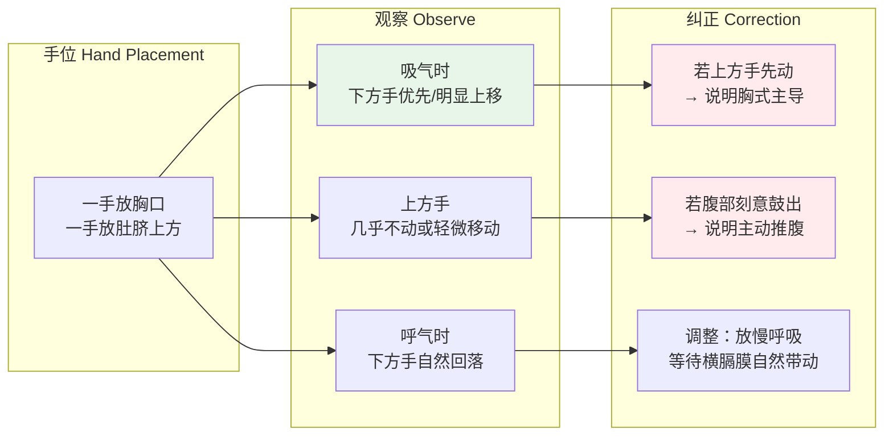

**具体操作**：
1. 仰卧或舒适坐姿，一手放胸口，一手放肚脐上方 3–4 指处
2. 闭上眼睛，先自然呼吸 1–2 分钟，不做任何调整
3. 开始观察：哪只手先动？哪只手动幅大？
4. 若胸口手先动或动幅大，轻轻将注意力转向腹部
5. **不要刻意鼓腹**，只是**等待**呼吸自然下沉
6. 每次练习 5–10 分钟，每日 1–2 次

#### 练习 B：肋骨横向扩张感知

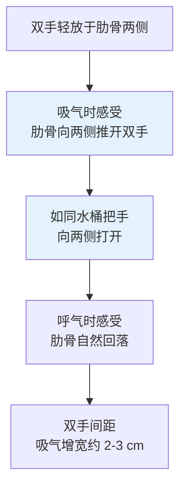

**具体操作**：
1. 坐姿或站姿，双手虎口卡住下肋骨两侧
2. 吸气时，注意力放在**侧向扩张**，感受双手被轻轻推开
3. 呼气时，感受肋骨像弹簧一样自然回弹
4. 这是**桶柄运动**的觉知培养，避免只关注前后的起伏

---

### 4.2 第二阶段：三维呼吸整合（2–4 周）

**目标**：建立胸腹腔协同的三维呼吸模式，为冥想奠定生理基础。

#### 练习 C：气球观想 — 三维腔体扩展

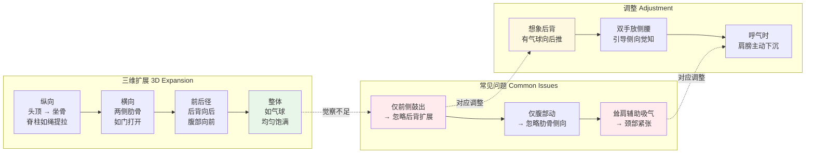

**具体操作**：
1. 坐姿，脊柱自然挺拔，闭眼
2. 吸气分三段感知（**不刻意分三段呼吸**，只是觉知）：
   - **下段**：横膈膜下降 → 腹部自然微鼓
   - **中段**：肋骨侧向扩张 → 腰侧变宽
   - **上段**：胸腔上方轻微提起 → 锁骨区域微展
3. 呼气时整体自然回落，如气球缓慢放气
4. 关键：**三段是连续的波浪，不是三个独立动作**
5. 每次练习 10 分钟

#### 练习 D：脊柱延伸呼吸法

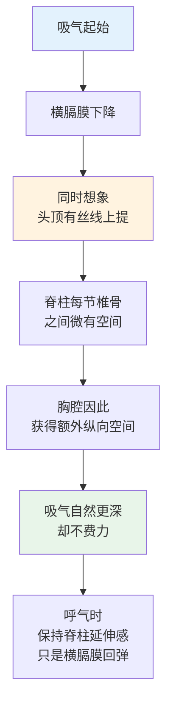

**具体操作**：
1. 坐姿或山式站立
2. 吸气开始时，**同步**启动两个动作：
   - 内在：允许横膈膜自然下降
   - 外在：想象头顶百会穴被轻轻上提（**不是抬头，是延伸**）
3. 这种"上下对开"的觉知会让呼吸变得** effortless（不费力的）**
4. 呼气时，保持脊柱的延伸感，只是让呼吸自然流出
5. 这是从"调息"进入"冥想"的关键过渡——呼吸变得如此自然，以至于不再成为注意力的焦点

---

### 4.3 第三阶段：呼吸-冥想整合（持续）

**目标**：呼吸成为背景锚点，心自然安住。

#### 练习 E：悬息（Kumbhaka）的安全入门

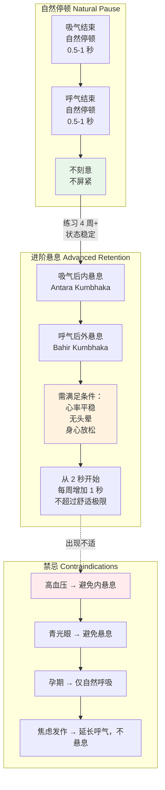

**安全原则**：
- 悬息时**身体任何部位不应感到紧张**（尤其是面部、喉咙、腹部）
- 悬息时**心率应平稳或略降**，若心跳加速说明过度用力
- 悬息是**呼吸之间的自然间隙被温柔延长**，不是"屏住呼吸"

#### 练习 F：呼吸作为锚点的四阶松脱

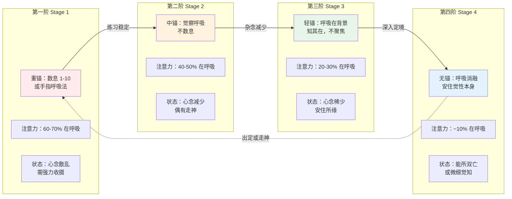

### 4.4 语音引导脚本：分步实操参考

以下是两段可直接用于练习或教学的引导词脚本。建议在熟悉内容后，用自己的语言自然表达，不必逐字背诵。

---

#### 脚本 A：仰卧横膈膜觉知建立（10 分钟）

> **适用**：初学者、长期胸式呼吸者、睡前放松
> **体位**：仰卧，双膝屈膝踩地，双脚与髋同宽；或在膝下垫枕

**[开始]**

轻轻闭上眼睛，让身体完全放松地沉入地面。

先不急着调整呼吸，只是允许它以自己的节奏流动。无论现在的呼吸是快是慢、是深是浅，都全然地允许它存在。

（静候 30 秒）

现在，将右手轻轻放在胸口，左手轻轻放在肚脐上方，约三指宽的位置。手掌放松，只是轻轻地接触，不需要施加任何压力。

（静候 15 秒）

开始观察你的呼吸。吸气的时候，哪只手先动？哪只手的起伏更明显？

不需要评判，只是好奇地观察，就像科学家第一次发现自己的呼吸一样。

（静候 30–60 秒）

如果你的胸口那只手（右手）动得更多，这很正常——这是长期习惯形成的模式。现在，试着把注意力轻轻地、温柔地转移到左手——肚脐上方的那只手。

不要刻意用力推肚子。只是想象：吸气的时候，空气像一股温暖的流水，自然地流入腹部，左手被这股流水轻轻地向上托起。

（引导 3–4 个呼吸周期）

现在，让两只手都保持在原位。尝试感受：吸气的时候，左手向上，右手几乎不动；呼气的时候，左手自然回落，右手依然安静。

如果右手也在动，没有关系，慢慢地，一次呼吸接一次呼吸，让注意力更稳定地停留在腹部。

（引导 5–6 个呼吸周期）

很好。现在，慢慢地将两只手从身体两侧滑开，平放在身体两侧的地板上。掌心向上，完全放松。

感受没有双手引导的呼吸——它是否依然能够自然地沉向腹部？

（静候 30 秒）

最后，再做三个自然的呼吸。然后，轻轻动一动手指和脚趾，缓缓睁开眼睛。

**[结束]**

---

#### 脚本 B：坐姿三维呼吸冥想（15 分钟）

> **适用**：已建立基本横膈膜觉知者、日常冥想练习
> **体位**：散盘/简易坐，臀部垫高；或椅子坐，双脚平放地面

**[开始]**

找到一个稳定而舒适的坐姿。臀部垫高，让膝盖自然地低于髋关节。坐骨扎根，想象你的身体是一棵树，坐骨是根，脊柱是树干，头顶是树冠，向着天空轻轻延伸。

下巴微微内收，不是低头，而是让后脑勺轻轻地向后向上，保持颈椎的自然曲度。肩膀放松，像两件外套轻轻地挂在衣架上。

（静候 20 秒）

先进行三个舒缓的呼气。通过鼻子，慢慢地、完全地呼出肺部的空气，比平时的呼气再长一点点。然后让吸气自然地发生。

（引导 3 个呼吸）

现在，开始三维呼吸的观想。

想象你的身体内部是一个大气球。这个气球从骨盆底部一直延伸到锁骨上方。

吸气的时候，感受这个气球在三个方向上同时、均匀地扩张：

**纵向**——头顶向上延伸，坐骨向下扎根，脊柱像被两股力量轻轻拉开，每一节椎骨之间都有微小的空间；

**横向**——两侧的肋骨像两扇小门，轻轻地向两侧打开，你的腰侧在变宽；

**前后径**——后背轻轻地向后靠，腹部自然地向前，整个躯干像一个圆鼓鼓的球，均匀饱满。

（引导 3–4 个呼吸，每个方向逐一提示）

很好。现在，放下方向的分别，只是感受整体的"气球"——吸气时，整个身体均匀地向外膨胀；呼气时，整个身体自然地微微向内收。

不需要控制呼吸的长度，也不需要数呼吸的次数。只是保持这种"气球"的觉知，让呼吸自己找到最自然、最舒适的节奏。

（静候 3–5 分钟，期间可偶尔轻声提示"保持气球的均匀扩张"）

如果你发现心念跑开了——去想了一会儿工作的事情，或者听到了外面的声音——这完全正常。不需要责备自己。只需要温柔地、一次又一次地把注意力带回这个"气球"的感觉。

每一次带回，都是一次成功的练习。

（继续静候 5–7 分钟）

现在，让我们开始准备结束。再做三个完整的三维呼吸。

最后一个呼气结束后，让呼吸恢复到完全自然的状态，不再需要观想。只是坐着，感受此刻身体的状态。

（静候 20 秒）

轻轻动一动手指和脚趾。如果你愿意，可以将双手在胸前合十，做一个简短的感恩——感谢自己今天花时间照顾身心。

缓缓睁开眼睛。

**[结束]**

### 4.5 进阶呼吸技术工具箱

以下四种呼吸技术在冥想和日常放松中极为实用，可作为横膈膜呼吸基础建立后的补充工具。

---

#### 技术 1：共振呼吸（Resonant Breathing / Coherent Breathing）

**科学原理**：心脏、血管、呼吸系统和自主神经系统之间存在一个自然的共振频率，约为 **每分钟 5.5–6 次呼吸**（吸气 5 秒 + 呼气 5 秒）。在此频率下呼吸，HRV（心率变异性）达到最大化，副交感神经激活效果最强。

**适用场景**：
- 焦虑发作时的紧急平复
- 睡前放松
- 高强度工作后的快速恢复
- 提升整体迷走神经张力

**操作方法**：
1. 坐姿或仰卧，闭眼
2. 吸气：鼻吸，默数 5 秒（约"吸——吸——吸——吸——吸——"）
3. 呼气：鼻呼或口呼，默数 5 秒（约"呼——呼——呼——呼——呼——"）
4. 无需刻意加深，保持**均匀、连贯、无声**
5. 每次 5–10 分钟

**进阶变体**：

| 变体 | 吸呼时长 | 适用情况 |
|-----|---------|---------|
| **6 次/分基础版** | 吸 5 秒 + 呼 5 秒 | 通用，适合大多数人 |
| **5.5 次/分延长版** | 吸 5.5 秒 + 呼 5.5 秒 | 追求最优 HRV 共振 |
| **延长呼气版** | 吸 4 秒 + 呼 6 秒 | 焦虑较重、入睡困难时 |

> **研究支持**：Lehrer et al. (2003) 发现，共振呼吸训练 4 周后，哮喘患者的肺功能指标和焦虑水平均有显著改善。后续研究证实其对抑郁、PTSD、高血压同样有效。

---

#### 技术 2：4-7-8 呼吸（4-7-8 Breathing）

**来源**：由哈佛大学训练出来的整合医学医生 Andrew Weil 推广，融合了瑜伽调息法和现代放松反应理论。

**科学原理**：
- **吸气 4 秒**：适度激活交感神经，为接下来的呼气做准备
- **悬息 7 秒**：允许氧气充分交换，同时轻度增加 CO₂，刺激迷走神经
- **呼气 8 秒**：强力激活副交感神经系统，诱导放松反应

**适用场景**：
- 入睡困难（Weil 称其为"天然安眠药"）
- 急性焦虑、恐慌发作
- 考试/演讲前的紧张
- 任何需要快速镇静的时刻

**操作方法**：
1. 舌头轻抵上颚（前牙后方），整个练习中保持这个位置
2. **呼气**：通过嘴巴完全呼出肺部空气，发出"呼——"声
3. **闭嘴，鼻吸**：默数 4 秒
4. **悬息**：保持屏息，默数 7 秒
5. **嘴呼**：通过嘴巴呼气，发出"呼——"声，默数 8 秒
6. 以上为一个循环，重复 4 个循环

**关键要点**：
- 4-7-8 的比例比绝对时长更重要。如果 7 秒悬息太困难，可以改为**吸 2 秒、悬 3.5 秒、呼 4 秒**，保持相同比例
- 悬息时**不要用力屏紧**，只是轻柔地"暂停"
- 每天最多进行 4 个循环 × 4 组，不要过度练习（悬息对初学者有一定挑战）

**与冥想的衔接**：
- 4-7-8 可作为**冥想前的快速镇静工具**（2–3 分钟）
- 不适合作为冥想中的持续呼吸模式（悬息会频繁打断注意力的连续性）

---

#### 技术 3：箱式呼吸（Box Breathing / Square Breathing）

**来源**：美国海豹突击队（Navy SEALs）在高压情境下使用的呼吸技术，也称为"战术呼吸"。

**科学原理**：通过四个等长时相（吸气-悬息-呼气-悬息）建立极强的**节律感和可控感**，在生理上平衡交感与副交感神经，在心理上提供"掌控感"，对抗压力情境中的失控感。

**适用场景**：
- 高压工作间隙的快速恢复
- 需要保持清醒冷静的同时降低应激（如公开演讲、谈判）
- 提升专注力和心理清晰度
- 军事、医疗、急救等高压职业人群

**操作方法**：

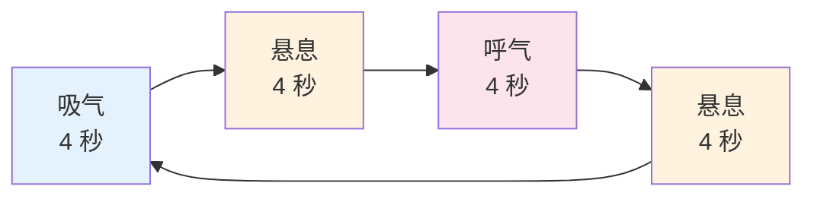

1. 坐姿，脊柱挺拔，双脚平放地面
2. **鼻吸**：缓慢深吸，默数 4 秒
3. **悬息**：屏息，默数 4 秒
4. **鼻呼**：缓慢呼出，默数 4 秒
5. **悬息**：屏息，默数 4 秒
6. 重复 4–8 个循环

**进阶调整**：

| 水平 | 时长 | 总循环数 |
|-----|------|---------|
| 初学者 | 吸/悬/呼/悬 各 3 秒 | 4 个循环 |
| 中级 | 吸/悬/呼/悬 各 4 秒 | 4–8 个循环 |
| 进阶 | 吸/悬/呼/悬 各 5 秒 | 8 个循环 |
| 高级 | 吸/悬/呼/悬 各 6 秒 | 8 个循环 |

**冥想应用**：
- 箱式呼吸的**规律性**使其成为极佳的冥想前"心定"工具
- 其对称结构（等长四边）提供了强烈的**心理锚点**，特别适合注意力容易散乱的人群
- 可结合视觉化：想象一个方框，沿四边移动，每一边对应一个呼吸时相

---

#### 技术 4：交替鼻孔呼吸（Nadi Shodhana Pranayama）

**来源**：印度哈他瑜伽经典调息法，"Nadi"意为能量通道，"Shodhana"意为净化。

**科学原理**：虽然传统解释涉及"左脉Ida/右脉Pingala"的能量平衡，现代医学发现其生理效应包括：
- 单侧鼻腔呼吸会**轻度激活对侧大脑半球**（右鼻→左脑激活；左鼻→右脑激活）
- 交替呼吸可能促进**双侧大脑半球的协调**
- 手指轻触眉心（第三眼区域）可能提供额外的**本体感觉反馈**
- 缓慢呼吸节奏本身即激活副交感神经

**适用场景**：
- 冥想前的调息准备（5–10 分钟）
- 需要快速进入"左右脑平衡"状态（创造性工作前）
- 缓解单侧鼻塞（温和刺激鼻腔循环）
- 平衡身心能量的传统瑜伽练习

**操作方法**：

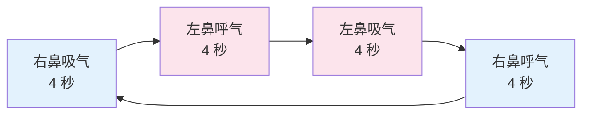

1. **手位**：右手，食指和中指弯曲（或轻触眉心），用拇指控制右鼻孔，无名指控制左鼻孔
2. **起始呼气**：双鼻同时呼气，清空肺部
3. **右吸**：关闭左鼻，右鼻缓慢吸气 4 秒
4. **左呼**：关闭右鼻，左鼻缓慢呼气 4 秒
5. **左吸**：保持右鼻关闭，左鼻缓慢吸气 4 秒
6. **右呼**：关闭左鼻，右鼻缓慢呼气 4 秒
7. 以上为**一个完整循环**，重复 5–10 个循环

**关键要点**：
- 手指只是**轻触**鼻翼，不要用力按压或完全堵住鼻孔（以免黏膜刺激）
- 如果单侧鼻塞严重，不要强行练习，改为自然呼吸
- 呼吸应保持**无声、均匀、不费力**
- 练习前清理鼻腔（擤鼻涕），保持气道通畅

**禁忌与注意**：
- **感冒/鼻塞严重时暂停**
- 不要在饱腹时练习
- 初学者若感到头晕，缩短时长或暂停悬息

**四种技术的快速选择指南**：

| 你的需求 | 推荐技术 | 每次时长 |
|---------|---------|---------|
| 快速平复焦虑 | 4-7-8 呼吸 | 2–3 分钟 |
| 提升 HRV / 长期放松 | 共振呼吸 | 10–20 分钟 |
| 高压下保持清醒冷静 | 箱式呼吸 | 2–5 分钟 |
| 冥想前调息准备 | 交替鼻孔呼吸 | 5–10 分钟 |
| 入睡困难 | 4-7-8 或共振呼吸（延长呼气版） | 5 分钟 |
| 日常副交感训练 | 共振呼吸 | 每日 10 分钟 |

---

## 五、常见问题的身体分析与调整

### 5.1 问题诊断流程图

```mermaid
flowchart TD
    Start[呼吸练习中遇到不适]

    Start --> Q1{头晕 / 发麻 / 视物模糊?}
    Q1 -->|是| A1[呼吸过度换气<br/>低碳酸血症]
    A1 --> F1[缩短呼吸长度<br/>增加呼气时间<br/>暂停练习，恢复正常呼吸]

    Q1 -->|否| Q2{颈部/肩膀紧张酸痛?}
    Q2 -->|是| A2[辅助呼吸肌代偿<br/>胸锁乳突肌/斜角肌过度参与]
    A2 --> F2[检查坐姿：下巴微收<br/>肩膀下沉<br/>手放肋骨两侧引导侧向呼吸]

    Q2 -->|否| Q3{腹部刻意鼓胀<br/>腹部肌肉疲劳?}
    Q3 -->|是| A3[主动推腹<br/>而非横膈膜被动带动]
    A3 --> F3[回到手位感知法<br/>放慢速度<br/>等待自然起伏]

    Q3 -->|否| Q4{后腰疼痛 / 腰椎不适?}
    Q4 -->|是| A4[骨盆前倾或后倾<br/>腰椎曲度异常]
    A4 --> F4[臀部垫高<br/>微卷尾骨<br/>坐骨扎根]

    Q4 -->|否| Q5{吸气短浅 / 吸不满?}
    Q5 -->|是| A5[胸椎僵硬<br/>肋骨活动度受限<br/>或情绪性屏息]
    A5 --> F5[猫牛式活动脊柱<br/>侧卧肋骨扩张练习<br/>情绪释放：允许叹息/长呼气]

    Q5 -->|否| Q6{呼气后胸闷 / 憋气感?}
    Q6 -->|是| A6[呼气过度用力<br/>或悬息过早过长]
    A6 --> F6[呼气改为"吹蜡烛"轻柔感<br/>暂停悬息练习<br/>延长自然呼气]

    Q6 -->|否| OK[状态良好<br/>继续当前练习]

    style A1 fill:#ffebee
    style A2 fill:#ffebee
    style A3 fill:#ffebee
    style F1 fill:#e8f5e9
    style F2 fill:#e8f5e9
    style F3 fill:#e8f5e9
```

### 5.2 具体问题的解剖学解释

#### 问题 1："我吸不到腹部，气只能到胸口"

**原因分析**：
- **体态因素**：长期久坐导致腰椎前凸减少、胸椎后凸增加，胸腔纵向空间受限
- **习惯因素**：长期情绪紧张形成胸式呼吸模式，横膈膜"遗忘"了全幅度运动
- **认知因素**：过度关注"腹式呼吸"，反而造成紧张

**调整方案**：
1. 先不追求"腹式"，只做**自然呼吸觉察** 5 分钟
2. 加入**肋骨侧向扩张练习**（练习 B），打开横向空间
3. 仰卧屈膝，双脚踩地，此时横膈膜活动最自由，建立本体感觉
4. 逐步过渡到坐姿，臀部始终垫高

#### 问题 2："呼吸时肩膀会上提"

**原因分析**：
- 横膈膜活动受限时，身体会**代偿性**使用胸锁乳突肌和斜角肌提升胸骨和第一肋骨
- 这是一种**紧张反应**，会让交感神经保持活跃，不利于冥想

**调整方案**：
1. 呼气时**主动下沉肩膀**，想象肩胛骨向臀部方向轻滑
2. 检查坐姿：是否过度挺胸？改为**脊柱自然曲度**
3. 手放在锁骨上方，吸气时**不允许这块肌肉明显收缩**
4. 如果无法避免，说明当前坐姿或状态不适合深入呼吸练习，回到自然呼吸

#### 问题 3："冥想中呼吸越来越浅、越来越慢，有点害怕"

**原因分析**：
- 这是**正常的副交感神经系统深度激活**表现
- 代谢率下降，身体对氧气需求减少，呼吸自然变浅变慢
- 恐惧来自于对"失控"的心理反应，而非生理危险

**调整方案**：
1. 认知重建：这是**放松反应**的标志，不是危险
2. 如果恐惧持续，轻轻**睁开一条眼缝**，引入少许外界觉知
3. 或者**刻意做一次稍深的呼吸**，打破自动模式，重新建立安全感
4. 长期方案：逐步延长冥想时间，让身体熟悉这种状态

### 5.3 呼吸与情绪的神经科学：为什么"深呼吸能冷静"

呼吸与情绪的关系不是比喻，而是有着坚实的神经解剖学基础：

```mermaid
graph TD
    subgraph 情绪→呼吸 Emotion→Breath
        E1[杏仁核激活<br/>威胁检测] --> E2[交感神经系统激活]
        E2 --> E3[呼吸变快变浅<br/>上胸式主导]
        E3 --> E4[CO2 下降<br/>血液偏碱]
        E4 --> E5[脑血管收缩<br/>头晕/思维混乱]
        E5 --> E6[焦虑感加剧<br/>→ 回到 E1]
    end

    subgraph 呼吸→情绪 Breath→Emotion
        B1[有意识的慢呼吸<br/>4-6 次/分钟] --> B2[延髓孤束核<br/>NTS 激活]
        B2 --> B3[迷走神经传出增强<br/>副交感主导]
        B3 --> B4[杏仁核活动抑制<br/>fMRI 证据]
        B4 --> B5[前额叶皮层激活<br/>执行功能恢复]
        B5 --> B6[情绪调节能力增强<br/>冷静与清晰]
    end

    E3 -.->|打破循环| B1
    B6 -.->|稳定状态| E1

    style E1 fill:#ffebee
    style E3 fill:#ffebee
    style E5 fill:#ffebee
    style B1 fill:#e8f5e9
    style B4 fill:#e8f5e9
    style B6 fill:#e8f5e9
```

**关键神经机制**：

| 脑区 | 呼吸的影响 | 情绪功能 |
|-----|----------|---------|
| **杏仁核（Amygdala）** | 慢呼吸降低其活动水平 | 威胁检测、恐惧反应 |
| **前额叶皮层（PFC）** | 慢呼吸增强其调控能力 | 决策、冲动控制、情绪调节 |
| **岛叶（Insula）** | 呼吸觉知训练增加其灰质密度 | 内感受（感知身体内部状态） |
| **蓝斑核（Locus Coeruleus）** | 慢呼吸降低去甲肾上腺素释放 | 警觉度、注意力 |
| **导水管周围灰质（PAG）** | 深呼吸激活其腹外侧区 | 疼痛调节、被动应对 |

**科学研究证据**：
- Zaccaro et al. (2018) 的元分析显示，**每分钟 6 次以下的缓慢呼吸**能显著降低焦虑水平，效果与低剂量抗焦虑药物相当
- Noble et al. (2017) 发现，**呼气延长**（吸气:呼气 = 1:2）比单纯慢呼吸更能有效激活迷走神经
- fMRI 研究证实，有意识的呼吸调节能在 **30 秒内**观察到杏仁核活动的显著下降

**冥想应用**：
- 当冥想中**情绪波动**（如烦躁、悲伤涌现）时，不需要压抑情绪，而是**将注意力带回呼吸的节奏**
- 不需要改变呼吸模式，只是**觉察呼吸的存在**——这种觉察本身就会通过岛叶-前额叶通路，增强情绪调节能力
- **不要在情绪激烈时强行进行呼吸控制**，此时优先使用自然呼吸觉察，等情绪峰值过去后再引入呼吸调节

### 5.4 呼吸功能简易自测

以下测试不需要任何设备，帮助你了解自己的呼吸基线状态：

#### 测试 1：屏息测试（BOLT Score）

> **来源**：Patrick McKeown《The Oxygen Advantage》

**方法**：
1. 坐姿，自然呼吸 1 分钟
2. 正常呼气后，捏住鼻子，开始计时
3. 直到**第一次明确的呼吸欲望**出现（不是憋到极限）
4. 松开鼻子，恢复正常呼吸

**结果解读**：

| BOLT 分数 | 含义 | 建议 |
|----------|------|------|
| **< 10 秒** | 呼吸模式紊乱，可能存在慢性过度换气 | 优先进行自然呼吸觉察，避免任何呼吸控制练习 |
| **10–20 秒** | 呼吸效率偏低，常见于心烦意乱或久坐人群 | 开始横膈膜呼吸训练，重点延长呼气 |
| **20–30 秒** | 正常范围，呼吸功能良好 | 可进入进阶练习 |
| **> 30 秒** | 优秀的呼吸效率 | 适合深入调息和悬息练习 |

> **注意**：此测试反映的是**身体对 CO2 的耐受度**，不是肺活量。BOLT 分数低不代表肺部有问题，而是呼吸中枢对 CO2 过于敏感，常见于长期压力状态下。

#### 测试 2：呼吸频率自测

**方法**：
1. 坐姿，闭眼，自然呼吸 1 分钟让自己安定
2. 计时 60 秒，默数呼吸次数（一次完整的吸+呼 = 1 次）

**结果解读**：

| 频率 | 状态 |
|------|------|
| **< 10 次/分** | 深度放松状态，常见于长期冥想者或睡眠前 |
| **10–14 次/分** | 理想放松状态 |
| **15–18 次/分** | 正常但偏快，可能有轻度紧张 |
| **> 18 次/分** | 过快，提示交感神经过度激活或呼吸模式紊乱 |

#### 测试 3：胸腹比例观察

**方法**：使用练习 A 的手位感知法，观察 5 个呼吸周期。

**评估标准**：
- 理想：腹部手（下方）动幅明显，胸口手（上方）几乎不动或轻微随动
- 可接受：腹部手动幅略大于胸口手
- 需调整：胸口手动幅大于或等于腹部手

**建议**：每周进行一次上述三项测试，记录变化趋势，比单次结果更有价值。

### 5.5 冥想中的呼吸现象：叹气、颤抖与"呼吸暂停"

深入冥想时，身体会出现一些看似异常、实则正常的呼吸现象。理解这些现象有助于避免不必要的恐慌。

#### 叹气反射（Sigh Reflex）

**定义**：叹气是一次**深而长的吸气**，随后是**延长的被动呼气**，其潮气量约为正常呼吸的 2 倍。

**生理功能**：
- 每隔 5–10 分钟自然发生一次（无意识状态下）
- **重新打开塌陷的肺泡**，防止肺不张
- 调节血液气体平衡，防止 CO₂ 过度积累
- 具有**情绪释放功能**——叹气后常伴随短暂的心率下降和肌肉放松

**冥想中的表现**：
- 静坐 5–10 分钟后，很多人会**不自觉地长叹一口气**
- 这通常是副交感神经激活、身体进入更深放松状态的标志
- **不要抑制叹气**——它是身体自我调节的智慧表现

```mermaid
graph TD
    A[静坐进入放松状态] --> B[副交感神经激活<br/>迷走神经张力升高]
    B --> C[呼吸自然减缓<br/>潮气量下降]
    C --> D[肺泡表面活性物质<br/>分布不均<br/>部分肺泡趋于塌陷]
    D --> E[脑干触发叹气反射<br/>pre-Bötzinger complex]
    E --> F[深大吸气<br/>重新打开所有肺泡]
    F --> G[延长呼气<br/>CO2 适度排出]
    G --> H[身心进一步放松<br/>心率下降]

    style D fill:#fff3e0
    style E fill:#e3f2fd
    style F fill:#e8f5e9
    style H fill:#e8f5e9
```

#### 冥想中的呼吸颤抖与节律变化

**常见现象**：

| 现象 | 发生时机 | 生理机制 | 应对 |
|-----|---------|---------|------|
| **呼吸短暂停顿** | 深度放松时 | 呼吸中枢自动调节，代谢需求下降，呼吸驱动自然降低 | 正常，不要干预，保持觉知即可 |
| **呼吸变极浅极快** | 情绪释放或能量涌动时 | 自主神经短暂失衡，边缘系统活动增加 | 温和地将注意力带回呼吸节奏，不要强行控制 |
| **身体微颤/抖动** | 深度放松后 | 交感神经从慢性紧张状态释放，肌肉张力重新分布 | 保持温暖，允许颤抖自然发生，通常 1–3 分钟内平息 |
| **频繁打嗝/排气** | 横膈膜放松后 | 横膈膜运动恢复，按摩胃部，释放积气 | 正常现象，继续练习 |
| **呼吸节律不规则** | 深度入定边缘 | 呼吸中枢受到更高层级脑区（边缘系统、皮层）的抑制 | 这是接近深度冥想状态的现象，保持放松观察 |

#### 与病理性呼吸异常的区别

以下情况**不属于正常冥想现象**，需要警惕：

| 正常冥想现象 | 病理性异常 | 区分要点 |
|------------|----------|---------|
| 呼吸变慢变浅，但能自然恢复 | 呼吸暂停 > 10 秒且频繁发生 | 正常停顿后能自然呼吸；病理性常伴打鼾、血氧下降 |
| 短暂轻微头晕，调整呼吸后消失 | 持续头晕、视物模糊、恶心 | 正常现象短暂且可控；病理持续且加重 |
| 叹气后感到轻松 | 叹息后仍感胸闷、胸痛 | 正常叹气是释放；病理叹息是求救信号 |
| 呼吸变浅但节律平稳 | 呼吸节律完全紊乱、喘息 | 冥想中节律趋于规律；病理趋于混乱 |

**安全原则**：
- 如果你有**睡眠呼吸暂停综合征**、**心脏病**、**癫痫**等病史，冥想中出现任何异常呼吸现象，应首先排除病理因素
- 不确定时，**咨询医生**比强行继续练习更明智
- 初学者应在**有经验的老师指导下**进行长时间深度冥想

---

## 六、进阶：呼吸与能量系统的交互（Prana & 气）

### 6.1 东西方呼吸观的整合

```mermaid
graph TB
    subgraph 生理学 Physiology
        P1[横膈膜运动] --> P2[肺泡通气]
        P2 --> P3[血氧 / CO2 平衡]
        P3 --> P4[自主神经调节]
    end

    subgraph 能量学 Energetics
        E1[Prana / 气<br/>生命能量] --> E2[中脉 Sushumna<br/>中央通道]
        E2 --> E3[左脉 Ida / 阴<br/>右脉 Pingala / 阳]
        E3 --> E4[气沉丹田<br/>能量下沉汇聚]
    end

    subgraph 整合 Integration
        I1[缓慢深长的横膈膜呼吸<br/>↓<br/>刺激迷走神经<br/>↓<br/>副交感激活] --> I2[身心放松<br/>↓<br/>能量流动阻碍减少]
        I2 --> I3[Prana 流动顺畅<br/>↓<br/>生理状态优化]
        I3 --> I1
    end

    P4 -.->|生理基础| I1
    E4 -.->|体验描述| I2

    style I1 fill:#e8f5e9
    style I2 fill:#e8f5e9
    style I3 fill:#e8f5e9
```

### 6.2 建议的每日练习结构

```mermaid
graph LR
    A[准备 2 min<br/>坐姿调整<br/>身体扫描] --> B[自然呼吸觉察 5 min<br/>不调整，只观察]
    B --> C[手位感知 3 min<br/>建立横膈膜觉知]
    C --> D[三维呼吸 5 min<br/>气球观想<br/>脊柱延伸]
    D --> E[冥想安住 10-20 min<br/>呼吸作为背景锚点]
    E --> F[结束 2 min<br/>逐渐恢复日常呼吸<br/>感恩/回向]

    style A fill:#e3f2fd
    style B fill:#e8f5e9
    style C fill:#fff3e0
    style D fill:#fff3e0
    style E fill:#e8f5e9
    style F fill:#fce4ec
```

### 6.3 不同冥想传统的呼吸技术对比

横膈膜呼吸是许多冥想传统的基础，但不同传统对呼吸的强调和技术有所不同：

```mermaid
graph LR
    subgraph 佛教传统 Buddhist Traditions
        B1[安那般那念<br/>Ānāpānasati] --> B1D[特点：自然呼吸觉察<br/>不刻意控制<br/>以呼吸为锚点培养正念]
        B2[密宗呼吸法<br/>Vase Breathing] --> B2D[特点：主动控制气息<br/>悬息 + 内观<br/>高级修行方法]
    end

    subgraph 印度瑜伽 Yoga Traditions
        Y1[Pranayama<br/>调息法] --> Y1D[特点：系统化呼吸控制<br/>Nadi Shodhana<br/>Kapalabhati 等]
        Y2[Ujjayi<br/>喉式呼吸] --> Y2D[特点：声门微收<br/>产生柔和气息声<br/>增强专注与产热]
    end

    subgraph 中国本土 Chinese Traditions
        C1[道家胎息] --> C1D[特点：呼吸极微细<br/>如胎儿在母腹<br/>追求"若存若亡"]
        C2[禅修调息] --> C2D[特点：自然呼吸<br/>数息/随息/止息<br/>四祖道信《入道安心要方便法》]
        C3[气功导引] --> C3D[特点：意念引导气息<br/>配合动作<br/>意到气到]
    end

    subgraph 现代正念 Modern Mindfulness
        M1[MBSR 呼吸觉察] --> M1D[特点：去宗教化<br/>医学框架<br/>强调当下体验]
        M2[呼吸空间<br/>3-Minute Breathing Space] --> M2D[特点：短时高效<br/>随时随地<br/>开放式监控]
    end

    style B1 fill:#e8f5e9
    style Y1 fill:#fff3e0
    style C1 fill:#e3f2fd
    style M1 fill:#fce4ec
```

| 传统 | 呼吸控制程度 | 主要目的 | 与横膈膜呼吸的关系 |
|-----|------------|---------|------------------|
| **南传上座部（安那般那念）** | 极低——自然呼吸 | 培养正念与定力 | 完全兼容，强调不干预横膈膜的自然运动 |
| **藏传佛教（大圆满/大手印）** | 中——有特定呼吸配合 | 快速入定、转化气脉 | 需要一定基础后才能安全练习 |
| **印度哈他瑜伽（Pranayama）** | 高——精确控制 | 净化能量通道、提升 Prana | 横膈膜呼吸是 Pranayama 的前置基础 |
| **中国禅宗** | 极低——自然呼吸 | 明心见性，不执着技法 | "平常心是道"，呼吸只是工具 |
| **现代正念（MBSR/MBCT）** | 极低——自然呼吸 | 减压、情绪调节、健康 | 强调横膈膜呼吸的生理学益处 |

**跨传统共识**：
- 几乎所有传统都认同：**初学者应从自然呼吸开始**，不要急于控制
- 控制呼吸的技术（Pranayama、胎息、密宗呼吸）属于**进阶修法**，需要明师指导
- 横膈膜呼吸是现代科学视角下，各传统"自然呼吸"的**共同生理基础**

### 6.4 喉式呼吸（Ujjayi Pranayama）的专业解析

Ujjayi（梵语：उज्जायी，意为"胜利呼吸"或"海洋呼吸"）是瑜伽中最常用的呼吸技术之一，也常用于冥想前的调息。

**机制解析**：

```mermaid
graph TD
    A[声门轻度收缩<br/>Glottis Partially Closed] --> B[气流通过狭窄通道<br/>产生柔和摩擦声]
    B --> C[声门处的拉伸感受器<br/>被持续刺激]
    C --> D[迷走神经传入信号增强<br/>→ 副交感激活]
    D --> E[心率减缓<br/>血压轻微下降]
    B --> F[气息声提供<br/>听觉锚点]
    F --> G[注意力更容易<br/>稳定在呼吸上]
    B --> H[气道阻力增加<br/>呼吸自然变慢变深]
    H --> I[横膈膜运动幅度增大<br/>强化横膈膜觉知]

    style A fill:#e3f2fd
    style D fill:#e8f5e9
    style F fill:#fff3e0
    style I fill:#e8f5e9
```

**正确做法**：
1. **吸气**：通过鼻子，轻微收缩喉咙后部的声门（像你要在镜子上哈气，但保持嘴巴闭合）
2. **声音**：产生轻柔、均匀的"嘶嘶"声，类似远处的海浪声——**不是 loud 的呼吸声**
3. **呼气**：同样通过鼻子，保持声门相同的收缩度
4. **感觉**：气息在喉咙后部产生温和的温暖和摩擦感，不应有紧张或疼痛

**常见错误**：

| 错误 | 表现 | 纠正 |
|-----|------|------|
| **过度用力** | 声音很大，像打鼾或喘息 | 声门只收缩 20–30%，声音应只有自己能隐约听到 |
| **喉部紧张** | 喉咙痛、咳嗽 | 放松舌根，让收缩发生在声门而非整个喉咙 |
| **鼻孔用力** | 鼻翼扇动，面部紧张 | 呼吸的动力来自横膈膜，不是鼻孔的吸力 |
| **屏息倾向** | 吸气和呼气之间有不自然停顿 | 保持呼吸的连续流动，如同潮汐 |

**与冥想的衔接**：
- Ujjayi 可以作为**冥想前的调息**（5–10 分钟），帮助心快速安定
- 进入正式冥想后，可以**逐渐放松声门**，回到无声的横膈膜呼吸
- 不建议在整个长时间冥想中持续使用 Ujjayi——声门持续收缩会造成轻微疲劳

### 6.5 呼吸与睡眠：昼夜节律中的呼吸变化

理解睡眠中的呼吸模式，有助于理解冥想中呼吸变浅变慢的现象，也能指导睡前冥想的呼吸策略。

```mermaid
graph LR
    subgraph 清醒状态 Wakefulness
        W1[呼吸频率<br/>12-18 次/分] --> W2[潮气量<br/>400-600 ml]
        W2 --> W3[代谢率高<br/>O2 需求大]
        W3 --> W4[交感/副交感<br/>动态平衡]
    end

    subgraph 入睡过渡期 N1/N2 Sleep
        N1[呼吸频率<br/>下降至 10-14 次/分] --> N2[潮气量略减]
        N2 --> N3[代谢率下降<br/>约 5-10%]
        N3 --> N4[副交感张力<br/>逐渐升高]
    end

    subgraph 深度睡眠 Deep Sleep N3
        D1[呼吸频率<br/>8-12 次/分] --> D2[潮气量稳定或略增]
        D2 --> D3[代谢率最低<br/>身体修复]
        D3 --> D4[副交感主导<br/>心率最慢]
    end

    subgraph REM 睡眠
        R1[呼吸频率<br/>不规则，波动大] --> R2[潮气量降低]
        R2 --> R3[代谢率回升<br/>接近清醒]
        R3 --> R4[大脑活跃<br/>肌肉抑制]
    end

    W4 -->|入睡| N4
    N4 -->|加深| D4
    D4 -->|进入 REM| R4
    R4 -->|醒来| W4

    style W3 fill:#fff3e0
    style D3 fill:#e8f5e9
    style R3 fill:#e3f2fd
```

**冥想与睡眠呼吸的异同**：

| 维度 | 深度冥想 | 深度睡眠 |
|-----|---------|---------|
| **呼吸频率** | 可降至 4–6 次/分 | 8–12 次/分 |
| **呼吸深度** | 变浅，潮气量减小 | 相对稳定 |
| **觉知状态** | 清醒且敏锐 | 无意识 |
| **代谢率** | 下降 10–20% | 下降约 5–10%（N3） |
| **心率** | 显著减慢，HRV 升高 | 减慢，但节律更固定 |
| **肌肉张力** | 保持坐姿稳定 | 完全松弛（REM 除外） |

**睡前冥想呼吸策略**：

| 目标 | 呼吸技术 | 原理 |
|-----|---------|------|
| **快速放松入睡** | 4-7-8 呼吸（吸气 4 秒，悬息 7 秒，呼气 8 秒） | 延长呼气和悬息强力激活副交感 |
| **改善睡眠质量** | 睡前 10 分钟横膈膜呼吸 + 身体扫描 | 降低核心体温、减少入睡潜伏期 |
| **减少夜间觉醒** | 白天规律的横膈膜呼吸训练 | 提升整体迷走神经张力，增强睡眠稳定性 |

> **注意**：如果在冥想中呼吸变得极浅极慢，且有强烈的困意，这是身体在向睡眠过渡的信号。如果目标是保持清醒的冥想，需要**稍微加深呼吸**或**睁开眼睛**来维持在清醒-放松的"甜蜜点"。

### 6.6 横膈膜与中医经络：膻中、丹田与呼吸的对应

将现代解剖学与中医经络理论对照，可以发现有趣的对应关系。这种对照不是为了"证明"中医理论，而是为了提供**跨文化的理解桥梁**。

```mermaid
graph TD
    subgraph 现代解剖 Modern Anatomy
        A1[横膈膜<br/>Diaphragm] --> A2[膈神经 C3-C5]
        A1 --> A3[腹腔/胸腔分隔]
        A1 --> A4[腹内压调节]
    end

    subgraph 中医经络 TCM Meridian Theory
        B1[膻中穴<br/>↳ 两乳头连线中点<br/>心包经募穴] --> B2[气会膻中<br/>宗气汇聚之所]
        B2 --> B3[任脉<br/>↳ 前正中线<br/>"阴脉之海"]
        B3 --> B4[丹田<br/>↳ 下腹部区域<br/>气沉之所]
        B4 --> B5[冲脉<br/>↳ "十二经之海"<br/>与横膈膜运动密切相关]
    end

    A1 -.->|解剖对应| B1
    A1 -.->|功能对应| B4
    A4 -.->|功能对应| B5

    style A1 fill:#e3f2fd
    style B1 fill:#fff3e0
    style B4 fill:#fff3e0
```

**膻中穴的现代解剖对应**：

| 中医描述 | 现代解剖对应 | 功能关联 |
|---------|------------|---------|
| **膻中**位于两乳头连线中点，平第 4 肋间隙 | 对应**胸骨体下半段**，深层为心包、心脏、纵隔大血管 | 横膈膜中央腱的位置约在膻中下方 2–3 指处 |
| **"气会膻中"**——八会穴之一 | 胸廓出口区域，是**肺静脉、主动脉、气管、食管**的汇聚区 | 呼吸运动时此区域压力变化最大 |
| **宗气汇聚** | 宗气即"胸中大气"，对应**功能残气量和呼吸动力** | 横膈膜是产生"大气"的第一动力 |
| **膻中主喜乐** | 胸廓开放 → 横膈膜活动自由 → 迷走神经激活 → 情绪放松 | 胸闷气短与情绪抑郁的恶性循环 |

**横膈膜与冲脉的对应**：

冲脉被称为"十二经之海"，其循行路线与横膈膜的功能区域高度重合：
- 冲脉起于胞中（子宫/前列腺区域），向上穿过横膈膜区域
- 横膈膜的节律性运动，客观上形成了对腹部-胸腔内容物的**周期性按摩**
- 从这个角度看，**横膈膜呼吸可以被视为一种内在的"气血推动"机制**

**丹田呼吸的现代解读**：

| 传统概念 | 现代理解 |
|---------|---------|
| **意守丹田** | 将注意力放在下腹部（约脐下 3 寸），这个区域正是横膈膜下降时腹腔压力变化最明显的区域 |
| **气沉丹田** | 横膈膜充分下降，呼吸重心下移至腹部；副交感神经激活，身体进入放松状态 |
| **丹田内转** | 高阶练习中，横膈膜与盆底肌、腹横肌形成协同的圆周运动；这种精微的肌筋膜协同需要长期训练才能建立 |
| **小周天** | 传统内丹术中，气息沿任督二脉循环；现代视角下，可以理解为**注意力沿脊柱-前正中线循环**，配合呼吸节律 |

**跨文化整合的练习启示**：

1. **"膻中开则肺气顺"**：中医的"开膻中"与现代的"打开胸廓前侧、恢复 ZOA"本质上指向同一个身体调整
2. **"意到气到"**：注意力引导到特定区域时，该区域的血流和神经活动确实会增加（fMRI 证实），这为"意守丹田"提供了神经科学基础
3. **"呼吸到脐，寿与天齐"**：传统养生格言与现代横膈膜呼吸训练的核心一致——横膈膜主导的深度呼吸确实与心血管健康、免疫功能和长寿指标相关

**注意**：中医经络理论有其独特的哲学框架和临床体系，不应被简化为单纯的解剖对应。上述对照旨在**促进理解**，而非**替代**任何一种理论体系。

### 6.7 呼吸与精力恢复：从疲劳到活力的转换

横膈膜呼吸不仅能用于冥想放松，更可以作为**日常精力管理的主动工具**。当你感到午后困倦、大脑昏沉、情绪耗竭或身体沉重时，有针对性的呼吸练习可以在几分钟内帮助系统重置。

#### 6.7.1 疲劳的生理学：为什么呼吸能恢复精力

```mermaid
graph TD
    subgraph 疲劳形成 Fatigue Development
        F1[持续工作/压力] --> F2[交感神经持续激活]
        F2 --> F3[肌肉持续微紧张<br/>血流减少]
        F3 --> F4[代谢产物堆积<br/>乳酸/炎症因子]
        F4 --> F5[线粒体功能下降<br/>ATP 生成减少]
        F5 --> F6[大脑供氧不足<br/>前额叶功能下降]
        F6 --> F7[主观感受：<br/>累/困/昏/烦]
    end

    subgraph 呼吸恢复 Recovery Through Breath
        R1[有意识的呼吸调节] --> R2[打破交感主导<br/>→ 副交感介入]
        R2 --> R3[肌肉松弛<br/>微循环恢复]
        R3 --> R4[CO2 适度积累<br/>脑血管扩张]
        R4 --> R5[脑供氧增加<br/>前额叶功能恢复]
        R5 --> R6[心率变异性提升<br/>自主神经恢复弹性]
        R6 --> R7[主观感受：<br/>清醒/轻/稳/静]
    end

    F7 -.->|打破循环| R1
    R7 -.->|防止复发| F1

    style F5 fill:#ffebee
    style F6 fill:#ffebee
    style F7 fill:#ffebee
    style R4 fill:#e8f5e9
    style R5 fill:#e8f5e9
    style R7 fill:#e8f5e9
```

**核心机制**：

| 机制 | 疲劳时的状态 | 呼吸如何逆转 | 时间尺度 |
|-----|------------|------------|---------|
| **脑血流调节** | 交感持续激活 → 脑血管轻度收缩 → 脑供氧下降 | 缓慢呼吸使 PaCO₂ 适度升高（而非过度降低）→ 脑血管扩张 → 脑血流量增加 15–20% | 1–3 分钟 |
| **肌肉微循环** | 慢性微紧张 → 肌筋膜血流减少 → 代谢产物堆积 | 深呼吸 + 呼气延长 → 副交感激活 → 血管扩张 → 清除代谢产物 | 3–5 分钟 |
| **自主神经重置** | 交感主导僵硬状态 → HRV 降低 | 共振呼吸（5.5–6 次/分）→ HRV 最大化 → 自主神经恢复弹性 | 5–10 分钟 |
| **前额叶皮层恢复** | 持续决策/专注 → 葡萄糖耗竭 → 执行功能下降 | 呼吸调节 → 脑血流优化 → 葡萄糖供应恢复 → 认知清晰度回升 | 5–15 分钟 |
| **情绪脱钩** | 杏仁核持续活跃 → 情绪耗竭 | 呼气延长 → 迷走神经激活 → 杏仁核活动抑制 → 情绪中性化 | 2–5 分钟 |

#### 6.7.2 四种疲劳类型与针对性呼吸策略

| 疲劳类型 | 识别信号 | 生理机制 | 呼吸对策 | 时长 |
|---------|---------|---------|---------|------|
| **身体疲劳** | 肌肉沉重、肩颈僵硬、身体发沉 | 肌肉微损伤 + 乳酸堆积 + 血流不畅 | **恢复性三维呼吸**：仰卧或半卧，吸气时想象气息流入紧绷的肌肉群，呼气时"带走"沉重感 | 10 分钟 |
| **认知疲劳** | 注意力涣散、决策困难、头脑昏沉 | 前额叶葡萄糖耗竭 + 神经递质（多巴胺/去甲肾上腺素）不足 | **共振呼吸 + 头部清凉观想**：吸气 5 秒→呼气 5 秒，呼气时想象清凉的气息冲刷前额和头顶 | 5–10 分钟 |
| **情绪疲劳** | 烦躁、易激惹、"什么都不想做" | 杏仁核过度激活 + 边缘系统耗竭 + 情绪调节资源枯竭 | **延长呼气法**：吸 3 秒→呼 6–8 秒，专注于呼气带来的"放下"感 | 5 分钟 |
| **神经疲劳** | 眼皮沉重、反应变慢、轻微头晕 | 自主神经失衡 + 副交感不足 + 可能伴随轻度过度换气 | **自然呼吸觉察 + 轻微活动**：不做任何控制，只是觉察呼吸 2 分钟，然后缓慢走动 1 分钟 | 3 分钟 |

#### 6.7.3 场景化精力恢复方案

```mermaid
flowchart TD
    Start[感到疲劳需要恢复]

    Start --> Q1{有多少时间?}

    Q1 -->|只有 1-2 分钟| A1[快速恢复方案]
    A1 --> A1a[站立或坐姿<br/>脊柱延伸]
    A1a --> A1b[鼻吸 2 秒<br/>→ 口呼 4 秒<br/>× 5 次]
    A1b --> A1c[双肩向后绕环 3 次<br/>同时深呼吸]
    A1c --> A1d[感受血液回流<br/>面部微微发热]

    Q1 -->|有 3-5 分钟| B1[标准恢复方案]
    B1 --> B1a[坐姿，闭眼<br/>手放腹部]
    B1a --> B1b[共振呼吸<br/>吸 5 秒→呼 5 秒<br/>× 10-15 次]
    B1b --> B1c[最后 3 次呼吸<br/>每次呼气时<br/>默念"松"]
    B1c --> B1d[睁眼，缓慢<br/>活动肩颈]

    Q1 -->|有 10-15 分钟| C1[深度恢复方案]
    C1 --> C1a[仰卧，屈膝<br/>或半卧位]
    C1a --> C1b[3 分钟自然呼吸<br/>觉察身体沉重区域]
    C1b --> C1c[5 分钟三维呼吸<br/>吸气向沉重区域送气<br/>呼气带走疲惫]
    C1c --> C1d[2 分钟延长呼气<br/>吸 3→呼 6]
    C1d --> C1e[最后 2 分钟<br/>完全放松<br/>自然呼吸]

    Q1 -->|慢性疲劳<br/>长期调理| D1[系统恢复方案]
    D1 --> D1a[每日早晨<br/>共振呼吸 10 分钟]
    D1a --> D1b[每工作 90 分钟<br/>3 分钟微恢复]
    D1b --> D1c[午休时<br/>仰卧三维呼吸 10 分钟]
    D1c --> D1d[睡前<br/>4-7-8 呼吸 4 个循环]
    D1d --> D1e[每周 2-3 次<br/>30 分钟深度恢复练习]

    style A1 fill:#fff3e0
    style B1 fill:#e8f5e9
    style C1 fill:#e3f2fd
    style D1 fill:#fce4ec
```

#### 6.7.4 专门的精力恢复呼吸技术

---

**技术 A：活力唤醒呼吸（Energizing Breath）**

> **适用**：早晨起床困难、午后严重困倦、需要快速进入状态
> **原理**：在短时间内增加通气量，提升血氧水平，温和激活交感神经（不同于应激反应，是可控的唤醒）

**方法**：
1. 站立，双脚与肩同宽，轻微屈膝
2. 鼻吸：快速而有力地深吸一口气（约 2 秒），同时双臂从身体两侧向上举起
3. 口呼：有力而彻底地呼出（约 2 秒），同时双臂放下
4. 连续进行 **10–15 次**，像给炉火扇风一样
5. 最后做一次深吸，悬息 3 秒，然后缓慢完全呼出
6. 站立静候 30 秒，感受身体的变化

**关键要点**：
- 这不是"过度换气"——持续时间很短（< 1 分钟），且有明确的结束点
- 如果在过程中感到头晕，立即停止，改为自然呼吸
- 结束后应有**清醒但不紧张**的感觉；如果感到心慌，说明用力过度，下次减少次数

---

**技术 B：脊柱波浪呼吸（Spinal Wave Breathing）**

> **适用**：久坐后的身体僵硬疲劳、背部沉重感
> **原理**：通过脊柱的节律性活动，促进脑脊液流动，缓解脊柱关节压力，恢复中枢神经的"流动性"

**方法**：
1. 坐姿，双脚平放地面，双手放膝上
2. **吸气**：从尾骨开始，想象气息像波浪一样一节一节向上推动脊柱——腰椎 → 胸椎 → 颈椎 → 头顶轻轻向上延伸
3. **呼气**：从头顶开始，波浪向下回落——颈椎 → 胸椎 → 腰椎 → 尾骨轻轻向下沉
4. 配合呼吸节奏：吸气 4–5 秒完成整个上行波浪，呼气 4–5 秒完成下行波浪
5. 重复 8–12 次

**关键要点**：
- 动作要**微小而流畅**，不是大幅度地弯腰挺腰
- 想象脊柱是一串珠子，气息是一颗珠子，从一端滚到另一端
- 如果某个区域（通常是胸椎中段）感觉"卡顿"，不要强行推过去，只是温和地让气息"绕过"它

---

**技术 C：分段充电呼吸（Segmented Charging Breath）**

> **适用**：情绪性疲劳、感觉"被掏空"、需要重新建立内在边界感
> **原理**：将身体分为三个能量区（下/中/上），逐一"充电"，帮助意识重新与身体连接

**方法**：
1. 坐姿或仰卧，闭眼
2. **第一段——下丹田（骨盆至肚脐）**：
   - 鼻吸，将气息只"送到"下腹部，感受下腹微微鼓起
   - 口呼，彻底呼出，感受下腹自然回落
   - 重复 3 次
3. **第二段——中丹田（肚脐至心口）**：
   - 鼻吸，气息扩展到胸腹腔中段，感受肋骨两侧和后背扩展
   - 口呼，彻底呼出
   - 重复 3 次
4. **第三段——上丹田（心口至头顶）**：
   - 鼻吸，气息充满整个胸腔，感受锁骨区域轻微提起，头顶向上延伸
   - 口呼，彻底呼出，感受整个上半身放松下沉
   - 重复 3 次
5. **三段贯通**：
   - 鼻吸，一气呵成地从下→中→上充满全身
   - 口呼，从顶→底完全释放
   - 重复 3 次
6. 自然呼吸，静候 30 秒，感受身体的"充电"状态

---

#### 6.7.5 呼吸与昼夜节律：全天候精力管理

```mermaid
graph LR
    subgraph 早晨 6:00-9:00<br/>唤醒期
        M1[活力唤醒呼吸<br/>× 15 次] --> M2[共振呼吸 5 分钟<br/>稳定觉醒状态]
        M2 --> M3[效果：温和提升<br/>皮质醇自然峰值]
    end

    subgraph 上午 9:00-12:00<br/>高效期
        AM1[自然呼吸即可<br/>无需特别干预] --> AM2[每 90 分钟<br/>起身活动 2 分钟]
        AM2 --> AM3[效果：保持自然节律<br/>避免过早疲劳]
    end

    subgraph 午后 13:00-15:00<br/>低谷期
        P1[饭后散步 5 分钟<br/>自然呼吸] --> P2[若仍困倦<br/>→ 共振呼吸 5 分钟]
        P2 --> P3[效果：平稳度过<br/>皮质醇低谷]
    end

    subgraph 傍晚 17:00-19:00<br/>转换期
        E1[下午工作结束前<br/>→ 延长呼气 3 分钟] --> E2[效果：释放累积紧张<br/>为晚间过渡]
    end

    subgraph 夜间 21:00-23:00<br/>准备期
        N1[4-7-8 呼吸<br/>4 个循环] --> N2[或仰卧三维呼吸<br/>10 分钟]
        N2 --> N3[效果：副交感主导<br/>为深度睡眠铺垫]
    end

    M3 --> AM1
    AM3 --> P1
    P3 --> E1
    E3 --> N1

    style M1 fill:#fff3e0
    style P2 fill:#e3f2fd
    style N1 fill:#e8f5e9
```

| 时间段 | 生理特点 | 呼吸策略 | 目的 |
|-------|---------|---------|------|
| **早晨（6–9 点）** | 皮质醇自然峰值，体温上升 | 活力唤醒呼吸 → 共振呼吸稳定 | 温和放大自然唤醒，避免咖啡依赖 |
| **上午（9–12 点）** | 认知能力峰值 | 自然呼吸 + 每 90 分钟微休息 | 保持节奏，不要过早消耗 |
| **午后（13–15 点）** | 体温轻微下降，餐后血糖波动 | 饭后散步 + 必要时共振呼吸 | 平稳度过低谷，避免糖分冲动 |
| **下午（15–17 点）** | 第二次小高峰 | 若疲劳 → 脊柱波浪呼吸 | 恢复脊柱流动性，提神 |
| **傍晚（17–19 点）** | 从工作向私人生活过渡 | 延长呼气 3 分钟 | 释放工作紧张，防止带回家 |
| **睡前（21–23 点）** | 褪黑素开始分泌 | 4-7-8 或仰卧三维呼吸 | 强化副交感主导，缩短入睡时间 |

#### 6.7.6 慢性疲劳综合征（CFS/ME）的呼吸注意事项

对于长期疲劳（持续 6 个月以上，休息不能缓解），呼吸训练可以作为辅助手段，但需要格外谨慎：

| 注意事项 | 说明 |
|---------|------|
| **医疗优先** | 慢性疲劳可能涉及免疫系统、内分泌系统、神经系统多重因素，必须先排除器质性疾病 |
| **极度温和** | 从仰卧自然呼吸开始，每次 3–5 分钟，不要追求"深度"或"控制" |
| **避免过度呼吸** | CFS 患者常伴有自主神经功能障碍，过度呼吸可能诱发头晕、心悸、崩溃感（Post-Exertional Malaise） |
| **记录反应** | 每次练习后记录疲劳程度（1–10 分），如果 24 小时内疲劳加重，说明强度过大 |
| **渐进原则** | 每周增加时长不超过 1 分钟，以月为单位评估进展 |
| **专业指导** | 建议在熟悉 CFS 的物理治疗师或康复医师指导下进行 |

> **核心原则**：对慢性疲劳者而言，**呼吸训练的目标不是"获得更多能量"，而是"减少能量浪费"**——通过改善呼吸效率，降低辅助呼吸肌的不必要消耗，让身体将有限的能量用于修复和恢复。

---

## 七、核心原则总结

```mermaid
mindmap
  root((横膈膜呼吸<br/>核心原则))
    不刻意
      腹部隆起是结果，不是动作
      等待呼吸自然发生
      从所在之处出发
    三维觉知
      纵向：头顶至坐骨
      横向：肋骨侧向
      前后：胸腹协同
    循序渐进
      先感知，后调整
      先稳定，后扩展
      先身体，后冥想
    安全第一
      出现不适立即暂停
      悬息需谨慎
      尊重当下状态
    身心一体
      体态影响呼吸
      呼吸影响神经
      神经影响心念
```

### 7.1 横膈膜：情绪的"隐形载体"

在身心医学和躯体心理治疗领域，横膈膜区域被认为是**情绪躯体化**的重要部位之一。许多人在深呼吸时会不自觉地哭泣、打嗝、发抖或感受到莫名的情绪涌出——这不是偶然，而是有生理基础的。

```mermaid
graph TD
    subgraph 情绪储存机制 Emotion Storage
        E1[急性应激/创伤事件] --> E2[交感神经系统激活]
        E2 --> E3[横膈膜紧张<br/>呼吸变浅变快]
        E3 --> E4[腹肌/肋间肌<br/>持续无意识紧张]
        E4 --> E5[情绪记忆<br/>"冻结"在肌肉中]
        E5 --> E6[形成慢性模式：<br/>浅快呼吸 + 横膈膜活动受限]
    end

    subgraph 释放机制 Release Through Breathing
        B1[横膈膜呼吸训练<br/>缓慢加深] --> B2[横膈膜区域<br/>被动拉伸]
        B2 --> B3[被"冻结"的肌肉<br/>逐渐放松]
        B3 --> B4[迷走神经传入信号变化<br/>→ 脑干→边缘系统]
        B4 --> B5[情绪记忆被激活<br/>浮出水面]
        B5 --> B6[哭泣/颤抖/打嗝<br/>自然的释放反应]
        B6 --> B7[情绪处理完成<br/>横膈膜恢复柔软弹性]
    end

    E6 -.->|横膈膜呼吸打破冻结| B1
    B7 -.->|身心整合| E1

    style E3 fill:#ffebee
    style E6 fill:#ffebee
    style B2 fill:#e8f5e9
    style B6 fill:#fff3e0
    style B7 fill:#e8f5e9
```

**常见现象与解释**：

| 现象 | 可能的情绪关联 | 应对方式 |
|-----|-------------|---------|
| **深呼吸时突然想哭** | 悲伤、失落、未被哀悼的过往 | 允许眼泪流出，不要抑制；这是释放，不是软弱 |
| **横膈膜区域紧绷、刺痛** | 长期焦虑、控制欲、"无法放松"的模式 | 减小呼吸深度，回到自然呼吸；配合身体扫描 |
| **打嗝、排气增多** | 横膈膜运动按摩胃部，释放积压的气体和紧张 | 正常现象，继续练习，不要尴尬 |
| **身体颤抖、发冷** | 交感神经从冻结状态释放，自主神经重新调节 | 保持温暖，不要强行停止呼吸；通常几分钟内平息 |
| **情绪涌现后感到轻松、通透** | 情绪能量被释放，横膈膜恢复自然运动 | 这是理想的疗愈反应，继续安住于呼吸 |

**冥想中的处理原则**：

1. **不追求情绪释放**：横膈膜呼吸的首要目的是建立健康的呼吸模式，情绪释放是可能的附带效应，不是目标
2. **不抑制，不放大**：情绪出现时，保持呼吸的稳定性，既不用力压抑，也不刻意沉浸在情绪故事中
3. **寻求支持**：如果冥想中频繁出现强烈的创伤性记忆或情绪反应，建议在有经验的冥想老师或心理咨询师的陪伴下练习
4. **区分释放与复发**：正常的情绪释放后会感到轻松；如果练习后持续数日感到情绪低落或焦虑加重，可能需要调整练习方式或寻求专业帮助

### 7.2 核心原则的深化：从"技巧"到"无为"

横膈膜呼吸的终极境界，不是"做得越来越好"，而是**完全放下技巧，让呼吸回归自然**。

```mermaid
graph LR
    A[第一阶段：无意识错误<br/>胸式呼吸/过度换气] --> B[第二阶段：有意识正确<br/>学习横膈膜呼吸]
    B --> C[第三阶段：熟练正确<br/>横膈膜呼吸成为习惯]
    C --> D[第四阶段：有意识放下<br/>不再关注呼吸模式]
    D --> E[第五阶段：无意识正确<br/>呼吸自然优化<br/>心专注所缘]

    style A fill:#ffebee
    style B fill:#fff3e0
    style C fill:#e8f5e9
    style D fill:#e3f2fd
    style E fill:#c8e6c9
```

这与冥想中"专注"的进阶次第相呼应：
- **初学**：需要用技巧（数息、手位感知）来纠正错误模式
- **熟练**：技巧成为习惯，不再费力
- **进阶**：放下技巧，呼吸只是背景，心安住于更深的觉知
- **成熟**：呼吸自然优化，心自然安定，无需任何干预

> **正如《道德经》所言："为学日益，为道日损。损之又损，以至于无为。"**
> 
> 横膈膜呼吸的学习也是如此——先"日益"地学习正确模式，再"日损"地放下对模式的执着，最终达到"无为而无不为"的自然呼吸状态。

---

## 八、延伸阅读与参考

- **解剖学**：《The Breathing Book》— Donna Farhi
- **调息法**：《Light on Pranayama》— B.K.S. Iyengar
- **神经科学**：《The Polyvagal Theory》— Stephen Porges
- **冥想整合**：《The Mind Illuminated》— Culadasa（John Yates）
- **呼吸生理学**：《Recognizing and Treating Breathing Disorders》— Leon Chaitow et al.
- **功能呼吸训练**：《The Oxygen Advantage》— Patrick McKeown
- **身心治疗**：《In an Unspoken Voice》— Peter Levine（躯体体验疗法与呼吸）

---

*本文档为 Peace Lab 冥想课程体系的专业参考资料，与课程 C4-5「与呼吸同频」相互补充。建议在完成基础冥想课程后，结合本文进行进阶练习。*
