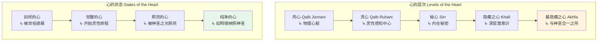
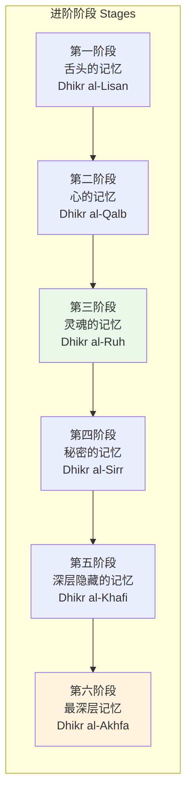
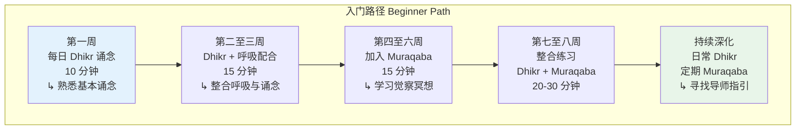

---

title: "苏菲冥想概述 | Sufi Meditation Overview"
description: "苏菲冥想概述 | Sufi Meditation Overview的详细解析与实践指南"
category: "心智与心理学 > 冥想 > Sufi Meditation"
tags: ["anxiety", "brain", "cardiovascular", "mindfulness"]
last_updated: "2026-05"
difficulty: "intermediate"
reading_level: "intermediate"
estimated_read_time: "10min"
intent_queries:
  - "什么是苏菲冥想概述 | Sufi Meditation Overview"
  - "苏菲冥想概述 | Sufi Meditation Overview的核心概念"
  - "苏菲冥想概述 | Sufi Meditation Overview的方法与实践"
trigger_keywords: ["苏菲冥想概述", "act", "anxiety", "behavioral", "body"]
cross_refs:
  - path: "01-Wisdom-Traditions/religions/zen/Zen_Monastic_Rituals.md"
    relation: "anxiety/buddhism/cardiovascular"
  - path: "01-Wisdom-Traditions/religions/zen/Zen_Practice_Methodology.md"
    relation: "anxiety/buddhism/cardiovascular"
  - path: "03-Bio-Science/death/Death_Meditation_Practices.md"
    relation: "anxiety/buddhism/cardiovascular"
  - path: "README.md"
    relation: "anxiety/buddhism/cardiovascular"
  - path: "01-Wisdom-Traditions/INDEX.md"
    relation: "buddhism/cardiovascular/meditation"

---
# 苏菲冥想概述 | Sufi Meditation Overview

> **适用对象**：对苏菲灵修传统感兴趣的冥想练习者、伊斯兰神秘主义研究者、跨传统灵修探索者、心理健康从业者
> **阅读时长**：约 50–60 分钟（可分段阅读）
> **实践建议**：配合正文中的阶段性练习，分 4–6 次完成，每次 15–20 分钟
> **最后更新**：2026-05

---

## 一、核心概念

### 1.1 苏菲冥想的本质

苏菲冥想（Sufi Meditation）是伊斯兰神秘主义传统——苏菲主义（Sufism, تصوف *Taṣawwuf*）——中的核心灵修实践。与许多东方冥想传统不同，苏菲冥想从根本上是一种**以爱为导向的、通向神圣临在的灵性实践**。它不追求空洞的寂静，而是追求在心灵深处与真主（Allah, الله）的亲密相遇。

苏菲冥想的几个核心概念构成其独特的精神气质：

| 核心概念 | 阿拉伯语 | 含义 |
|---------|---------|------|
| **齐克尔** | ذكر Dhikr | 纪念/忆念真主，通过反复诵念神圣名称接近神圣 |
| **穆拉卡巴** | مراقبة Muraqaba | 觉察冥想，以寂静的方式安住于神圣临在的觉知中 |
| **萨玛** | سماع Samāʿ | 倾听，通过音乐与旋转舞达到灵性陶醉 |
| **菲拉萨** | فراسة Firāsa | 灵性洞察力，通过内在净化获得的超越感官的感知能力 |
| **塔尔比卜** | تربية Tarbiya | 灵性培育，在导师（Murshid）指导下的系统修行 |

### 1.2 心（Qalb）的概念

在苏菲思想中，**心**（Qalb, قلب）是灵性修炼的核心场所。苏菲传统认为心有多个层次：

苏菲冥想的终极目标是使心达到**纯净**（Safa, صفاء）的状态，如同"被反复擦拭的明镜"，能够完美映照出神圣的属性。

### 1.3 神圣之爱的道路

苏菲冥想区别于其他冥想体系的关键特征在于其对**神圣之爱**（Ishq, عشق; Mahabba, محبة）的强调。在苏菲的理解中，宇宙的创造本身就是出于爱——真主作为一个"隐藏的宝藏"（Kanz Makhfi），渴望被认识，因此创造了万物。

> "我被创造为一个隐藏的宝藏，我渴望被认识，因此我创造了创造物，以便他们认识我。" —— 圣训（Hadith Qudsi）

这意味着苏菲冥想不是一种自我完善的技术，而是一种**回应神圣邀请的爱的关系**。冥想者不是在追求某种心理状态，而是在回应真主的爱的召唤。

---

## 二、历史与传统

### 2.1 早期苏菲冥想实践（8–12 世纪）

苏菲冥想实践萌芽于伊斯兰教早期的禁欲主义传统。**哈桑·巴士里**（Hasan al-Basri, 642–728）以对内心虔诚的强调而闻名，他的教导奠定了苏菲内在修行的基础。

真正的转折来自**拉比亚·阿达维娅**（Rabia al-Adawiyya, 714–801）。这位巴士拉的女性圣者将苏菲灵修从以"恐惧"为基础转向以"爱"为基础：

> "主啊，若我因惧怕火狱而崇拜你，请以火狱烧我；若我因渴望乐园而崇拜你，请拒绝我进入乐园；但若我崇拜你只是因为你本身，请不要将你的美从我心上撤去。"

### 2.2 教团体系的形成（12–15 世纪）

随着苏菲主义的发展，冥想实践逐渐在**教团**（Tariqa, طريقة）体系中被系统化。不同教团发展出各具特色的冥想方法：

| 教团 | 创始人 | 核心冥想特色 |
|------|--------|-------------|
| **卡迪里教团** Qadiriyya | 阿卜杜勒·卡迪尔·吉拉尼 | 集体 Dhikr，声音诵念 |
| **纳格什班迪教团** Naqshbandiyya | 巴哈丁·纳格什班德 | 静默 Dhikr，"心中之画" |
| **契斯提教团** Chishtiyya | 穆因丁·契什蒂 | 音乐冥想（Sama），在印度发展 |
| **梅夫拉维教团** Mevlevi | 鲁米的后继者 | 旋转舞（Sema）冥想 |
| **沙兹里教团** Shadhiliyya | 阿布·哈桑·沙兹里 | 日常生活中的觉知修行 |

### 2.3 鲁米与诗歌冥想

**鲁米**（Jalal al-Din Rumi, 1207–1273）是苏菲冥想传统中最具世界影响力的人物。他的诗歌本身就是一种冥想形式——通过反复吟诵（Zikr-i Qalbi），诗歌中的意象和情感穿透理性的防线，直达心灵深处。

鲁米的《玛斯纳维》（*Mathnawi*）被誉为"波斯语的古兰经"，其中包含了大量关于冥想状态的精微描述：

> "在你心智的市场里，有一种商品。你耗尽一生却未曾看见它。那是静默。静默是神的语言；所有其他的都是拙劣的翻译。"

鲁米的诗歌冥想传统至今仍在全世界的苏菲圈子中流传，特别是通过诗歌朗诵配合音乐的 **Mushaira**（诗歌朗诵会）形式。

### 2.4 伊本·阿拉比与默观形而上学

**伊本·阿拉比**（Ibn Arabi, 1165–1240）为苏菲冥想提供了最深刻的哲学框架。他的**存在的单一论**（Wahdat al-Wujud, وحدت الوجود）认为：存在只有一个，万物不过是这唯一存在的不同显现（Tajalli, تجلی）。

这一哲学观点对冥想实践的意义在于：冥想不是"到达"某个外在的神圣之处，而是**觉醒到早已存在于内心深处的神圣临在**。冥想的过程是剥去遮蔽心灵的层层帷幕，让本然存在的神圣之光显现。

---

## 三、核心修习方法

### 3.1 齐克尔（Dhikr）—— 纪念真主

齐克尔是苏菲冥想中最核心、最广泛的修习方法。"Dhikr"的字面意义是"记忆"或"纪念"，其灵性含义是**让心灵持续保持对真主的觉知**。

#### 3.1.1 诵念齐克尔（Dhikr al-Jali）

最基本的形式是**诵念齐克尔**——反复诵念神圣的名称或短语：

| 诵念形式 | 阿拉伯语 | 含义与用途 |
|---------|---------|----------|
| **齐克尔·纳菲·伊斯巴特** | لا إله إلا الله | 万物非主，唯有真主——最基本的信仰宣示 |
| **伊斯姆·扎特** | الله Allāh | 真主之名——最直接的神性连接 |
| **萨拉瓦特** | اللهم صل على محمد | 对先知的祝福——灵性连接与保护 |
| **哈吉拉** | هو Huwa | "祂"——超越一切属性的绝对存在 |

**实践方式**：

1. **准备工作**：进行小净（Wudu, وضوء），选择安静的空间
2. **坐姿**：盘坐或跪坐，脊背挺直，双手放在膝上或交叉于胸前
3. **呼吸配合**：吸气时默念"la ilaha"（万物非主），呼气时默念"illallah"（唯有真主）
4. **专注心**：将注意力放在心脏位置，想象诵念的声音从心中升起
5. **持续时间**：初学者从 10–15 分钟开始，逐渐延长至 30–60 分钟
6. **结束**：以祈祷（Du'a）结束，感谢真主的恩典

#### 3.1.2 静默齐克尔（Dhikr al-Khafi）

纳格什班迪教团特别强调**静默的齐克尔**——在心中无声地诵念，同时保持对外在世界的正常运作。这种修行被称为 **"在人群中与真主同在"**（Khalwat dar Anjuman）。

静默齐克尔的进阶阶段：

### 3.2 穆拉卡巴（Muraqaba）—— 觉察冥想

穆拉卡巴的字面意义是"看守"或"守护"，其冥想含义是**以觉知守护心灵，观察内在状态而不被其牵引**。这一实践与佛教的正念（Mindfulness/Sati）有相似之处，但其根本取向不同——穆拉卡巴的觉知方向朝向神圣临在。

**基本穆拉卡巴练习**：

1. **安定身体**：选择舒适的坐姿，闭眼或半闭眼
2. **观想神圣之光**：想象一道柔和的光从上方降下，笼罩全身
3. **守护心灵**：观察念头和情绪的升起，不评判，不追随，让它们如云般飘过
4. **回归中心**：每当注意力分散时，轻轻回到对神圣临在的觉知
5. **安住**：在觉知中安静地坐着，15–30 分钟

**进阶穆拉卡巴**：

| 类型 | 焦点 | 目的 |
|------|------|------|
| **穆拉卡巴·塔贾利** | 观想真主的光显现于万物 | 培养万物皆神圣显现的觉知 |
| **穆拉卡巴·毛提** | 观想自己的死亡 | 放下对世俗的执着 |
| **穆拉卡巴·法纳** | 观想自我的消融 | 体验与神圣合一的境界 |
| **穆拉卡巴·拉巴** | 观想与导师的灵性连接 | 获得灵性滋养与指引 |

### 3.3 旋转舞（Sema）—— 苏菲旋转冥想

**旋转舞**（Sema, سماع）是梅夫拉维教团最著名的冥想形式，由鲁米的儿子苏丹·维莱德系统化为正式仪式。

**旋转舞的象征意义**：

- 旋转者（Semazen）右手朝上（接受神圣恩典），左手朝下（将恩典传递给大地）
- 旋转代表行星围绕太阳的运动——灵魂围绕神圣之爱的中心旋转
- 白色长袍象征自我的死亡，黑色斗篷象征世俗的坟墓
- 旋转中进入的**陶醉**（Wajd, وجد）状态不是失控，而是在神圣之爱中的忘我

**旋转冥想的阶段**：

1. **纳特**（Na't）：对先知的赞颂
2. **道鼓**（Kudum）：鼓声象征真主对存在的命令
3. **达兰**（Devran）：四次的鞠躬——相互致意，代表灵魂对神圣临在的敬意
4. **旋转**（Sema）：正式的旋转冥想，通常持续 30–45 分钟
5. **祈祷**（Du'a）：结束祈祷

### 3.4 呼吸修行（Tasaffuh / Nafas）

苏菲传统中的呼吸修行虽然不如瑜伽中的普拉纳亚玛（Pranayama）那样系统化，但同样被视为灵性修炼的重要工具。

**核心呼吸练习**：

1. **净化呼吸**（Tasaffuh）：通过鼻子缓慢吸气，屏息片刻，通过嘴巴缓慢呼气，想象呼出的是心灵的杂质
2. **齐克尔的呼吸配合**：如前所述，将 Dhikr 的诵念与呼吸节奏同步
3. **哈乌呼吸**（Huu）：在呼气时发出"Huu"的声音，这是神圣之名的最深层发音，被认为是真主之名"Allah"中核心的"呼吸之音"

---

## 四、实践指南

### 4.1 初学者入门路径

对于初次接触苏菲冥想的练习者，建议按照以下路径循序渐进：

### 4.2 日课建议

| 时段 | 练习 | 时长 | 说明 |
|------|------|------|------|
| **晨起** | 晨间 Dhikr | 10–15 分钟 | 以诵念开始新的一天，设定灵性意图 |
| **日间** | 静默 Dhikr | 持续进行 | 在工作、行走中保持对真主的内在纪念 |
| **午后** | Muraqaba | 15–20 分钟 | 在午间休息时进行觉察冥想 |
| **夜晚** | 反省与祈祷 | 10–15 分钟 | 回顾一天，以感恩与忏悔结束 |
| **深夜** | 塔哈朱德（Tahajjud） | 视个人情况 | 夜间祈祷，苏菲传统中认为此时的灵性能量最强 |

### 4.3 寻找灵性导师

在苏菲传统中，**灵性导师**（Shaykh / Murshid / Pir, شيخ / مرشد / پیر）的角色至关重要。苏菲谚语说："没有导师的人，他的导师就是恶魔。"

选择导师的标准：

1. **正统传承**（Silsila, سلسلة）：导师应有明确的灵性传承链，可追溯至先知穆罕默德
2. **品行端正**：导师应以其生活方式体现其所教授的精神
3. **不索取物质回报**：真正的苏菲导师不将灵性指导视为商业交易
4. **尊重学生的自由意志**：导师引导学生但不过度控制
5. **遵循伊斯兰教法**（Sharia, شريعة）：苏菲修行不应脱离伊斯兰的基本框架

### 4.4 苏菲冥想中的困难与应对

| 困难 | 表现 | 应对方法 |
|------|------|---------|
| **灵性干燥** | 感受不到神圣临在，Dhikr 变得机械 | 接受这是灵性旅程的正常阶段，继续坚持；参考鲁米关于"破碎"的教导 |
| **情绪波动** | 冥想中涌现强烈的情绪、悲伤或愤怒 | 这可能是心灵的净化过程（Tasfiya）；不压抑也不追逐，以觉察守护 |
| **自我膨胀** | 感觉自己比他人更"灵性" | 这是最大的陷阱之一；回到谦逊，记住一切恩典来自真主 |
| **身体不适** | 旋转或长时间冥想导致的身体疲劳 | 尊重身体的极限，适当休息；身体是神圣的信托（Amanah） |
| **困惑与怀疑** | 对修行路径产生疑问 | 与导师交流，阅读经典文本，不要独自做重大决定 |

---

## 五、现代应用与研究

### 5.1 心理健康领域的应用

近年来，苏菲冥想实践逐渐引起心理学研究者的关注：

- **齐克尔与焦虑**：多项研究表明，规律的 Dhikr 诵念可以显著降低焦虑水平。印尼的一项研究发现，每日进行 Dhikr 的参与者其焦虑评分降低了约 35%（Aflakseir & Coleman, 2011）
- **穆拉卡巴与正念**：Muraqaba 与现代正念减压疗法（MBSR）在机制上有显著重叠，但 Muraqaba 更强调神圣维度的意义赋予
- **旋转舞与运动疗法**：苏菲旋转被发现具有类似于动态冥想的效果，可以促进情绪释放和身体觉知
- **苏菲诗歌与表达性治疗**：鲁米的诗歌被广泛用于诗歌治疗（Poetry Therapy）中，帮助来访者表达和处理深层情感

### 5.2 神经科学研究

关于苏菲冥想的神经科学研究虽然尚处于早期阶段，但已发现一些有趣的结果：

| 研究领域 | 发现 |
|---------|------|
| **脑电波** | Dhikr 诵念时，额叶出现显著的 alpha 波增强，表明放松而警觉的状态 |
| **心率变异性** | 规律的齐克尔练习与改善的心率变异性相关，暗示副交感神经系统的激活 |
| **旋转舞** | 专业旋转者（Semazen）能够在长时间旋转中保持前庭系统的稳定适应，这可能与神经可塑性相关 |
| **情绪调节** | 苏菲修行者表现出更强的情绪调节能力和更高的心理韧性 |

### 5.3 跨文化对话与和平建设

苏菲冥想传统在当代的另一个重要价值是其**促进跨宗教对话与和平**的潜力。苏菲主义强调爱的普遍性和对所有生命的尊重，这使其成为不同宗教和文化之间的桥梁。联合国教科文组织于 2005 年将梅夫拉维的 Sema 仪式列入人类非物质文化遗产代表作名录。

---

## 六、注意事项与建议

### 6.1 安全须知

1. **身体安全**：旋转冥想应在有经验的指导者陪伴下进行，有眩晕症、内耳问题或心血管疾病者应避免旋转
2. **心理安全**：如有严重心理健康问题（如精神病、重度抑郁、创伤后应激障碍），应在专业心理健康从业者的指导下进行任何形式的冥想
3. **文化尊重**：苏菲冥想深植于伊斯兰教传统之中，练习者应尊重其宗教背景，避免将实践从其精神语境中剥离
4. **避免极端**：苏菲传统警告"灵性上的走极端"（Ghuluww, غلو），修行应平衡而适度

### 6.2 修行中的伦理准则

苏菲冥想不是脱离生活的逃避，而是**在日常生活中的灵性修行**。苏菲伦理的核心美德包括：

- **诚意**（Ikhlas, إخلاص）：一切行为只为真主，不为人的赞扬
- **谦逊**（Tawadu', تواضع）：认识到一切恩典来自真主，不因灵性体验而骄傲
- **感恩**（Shukr, شكر）：对每一个呼吸、每一个瞬间保持感恩
- **信赖**（Tawakkul, توكل）：对真主旨意的完全信赖
- **服务**（Khidma, خدمة）：以服务他人作为灵性修行的表达

### 6.3 推荐阅读

| 书籍 | 作者 | 说明 |
|------|------|------|
| 《玛斯纳维》Mathnawi | 鲁米 | 苏菲灵修的核心文本，以故事和诗歌传授灵性智慧 |
| 《圣学复苏》Ihya Ulum al-Din | 安萨里 | 苏菲灵修的系统化论述，涵盖信仰、礼仪与内在修行 |
| 《麦加的启示》Futuhat al-Makkiyya | 伊本·阿拉比 | 苏菲哲学的最深刻文本，适合有基础的修行者 |
| 《智慧的珠宝》Fusus al-Hikam | 伊本·阿拉比 | 对先知灵性智慧的精炼阐述 |
| The Sufis | 伊德里斯·沙赫 | 面向西方读者的苏菲主义入门书 |
| Sufism: A New History of Islamic Mysticism | Nile Green | 学术性的苏菲主义通史 |

### 6.4 与其他冥想传统的比较

| 维度 | 苏菲冥想 | 佛教禅修 | 瑜伽冥想 |
|------|---------|---------|---------|
| **终极目标** | 与真主合一（Fana fi Allah） | 涅槃 / 解脱 | 三摩地 / 自我实现 |
| **核心取向** | 爱与奉献 | 觉知与洞察 | 整合与超越 |
| **主要方法** | Dhikr、Muraqaba、Sema | 止观、正念 | 调息、持咒、冥想 |
| **导师角色** | 不可或缺的灵性指引 | 重要但非绝对必要 | 重要但传统多样 |
| **与宗教关系** | 深植于伊斯兰教 | 相对独立于宗教框架 | 与印度教传统紧密关联 |

---

> **相关资源**
> - 返回 [INDEX](./INDEX.md)
> - 参见 [苏菲主义冥想专业概述](../sufism-meditation/Sufism_Meditation_Overview.md)
> - 参见 [苏菲实践指南](../sufism-meditation/Sufi_Practical_Guide.md)
