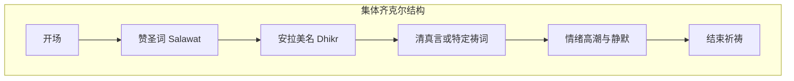
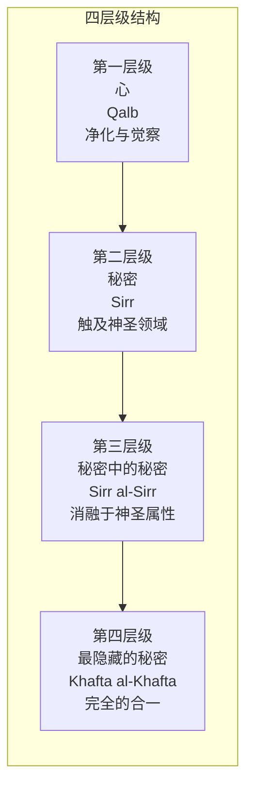

# 苏菲冥想与Dhikr实操指南

> **适用范围**：苏菲道徒、伊斯兰教灵修者、及跨传统修习者
> **最后更新**：2026-05

---

## 目录

1. [Dhikr 齐克尔完整实操](#1-dhikr-齐克尔完整实操)
2. [Sama 旋转舞安全指南](#2-sama-旋转舞安全指南)
3. [Muraqaba 观照冥想的四层级](#3-muraqaba-观照冥想的四层级)
4. [苏菲日常修习时间表](#4-苏菲日常修习时间表)
5. [五大教团修习特点对比](#5-五大教团修习特点对比)
6. [常见问题与安全提醒](#6-常见问题与安全提醒)

---

## 1. Dhikr 齐克尔完整实操

Dhikr（ذِكْر，齐克尔）意为"记念"，是苏菲修行中最核心的实践——通过反复念诵安拉的美名或清真言，使心灵持续与神圣临在联结。

### 1.1 个体 Dhikr

#### 坐姿


**推荐坐姿**：

| 坐姿 | 描述 | 适用场景 |
|------|------|----------|
| **盘腿坐** | 双腿交叉，脊柱挺直，双手置于膝上或心口 | 日常固定修习 |
| **跪坐（Tahiyat 姿）** | 跪姿臀部坐于脚跟上，脊柱挺直 | 传统苏菲修习 |
| **椅上坐** | 坐于椅子前缘，双脚平放地面，脊柱挺直 | 膝盖不适者 |

#### 呼吸配合

**基础呼吸-Dhikr 配合法**：

| 呼吸阶段 | 念诵内容 | 操作 |
|----------|----------|------|
| 吸气 | "安拉"（Allah） | 深缓吸气，在心中或微声念诵 |
| 屏息 | 观想光从心轮升起 | 短暂屏息，观想安拉之光充满心胸 |
| 呼气 | "乎"（Hu） | 缓慢呼气，发出"乎——"的音，释放一切执着 |

**进阶：Haqqani 教团呼吸法**：

```
吸气：La ilaha（没有应受崇拜的）—— 4秒
屏息：illa（除了）—— 2秒
呼气：Allah（安拉）—— 6秒
```

#### 念珠使用（Tasbih / Misbaha）

苏菲念珠通常有 99 颗珠子（对应安拉的 99 个美名）或 33 颗珠子（念诵 3 轮）。

| 念珠类型 | 珠子数 | 用途 |
|----------|--------|------|
| 美名念珠 | 99颗 | 逐一念诵安拉的99个美名 |
| 三合念珠 | 33颗 | 念诵33次"苏卜哈纳拉"、33次"艾尔哈姆杜利拉"、33次"安拉乎艾克拜尔" |
| 清真言念珠 | 100颗 | 念诵100次清真言或特定祷文 |

**使用方法**：
1. 以右手拇指和食指捏住第一颗珠子
2. 每念一次，滑过一颗珠子
3. 速度不求快，求心念合一
4. 完成后以"法谛哈"（开端章）结束

### 1.2 集体 Dhikr（Dhikr Jama'i）



#### 圆圈形式（Halqa）

| 元素 | 说明 |
|------|------|
| **排列** | 参与者围成圆圈，面向中心（或中心有导师/烛火） |
| **坐姿** | 通常盘腿坐，右肩略向内（苏菲传统中吉祥的方向） |
| **领导** | 导师（Shaykh/Murshid）或指定念诵者位于显眼位置或中心 |
| **节奏** | 由领导者带领，从慢到快，再到慢 |

#### 节奏与念诵方式

| 阶段 | 节奏 | 念诵方式 | 身体动作 |
|------|------|----------|----------|
| **开始** | 缓慢 | 低语或心中默念 | 静坐，轻微点头 |
| **升温** | 中等 | 齐声念诵，音量渐增 | 头部左右摆动，或前后摇动 |
| **高潮** | 快速 | 高声念诵，可能融入音乐 | 身体随节奏摆动，部分教团有站立旋转 |
| **回落** | 渐慢至静默 | 低语，最后归于心中默念 | 动作渐止，进入内在静默 |
| **结束** | 静默 | 无声记念 | 完全静止，安处于神圣临在中 |

#### 领导者的角色（Shaykh / Qutub）

| 职责 | 说明 |
|------|------|
| **带领念诵** | 起音、定节奏、引导高低起伏 |
| **灵性保护** | 维持场域的能量平衡，确保参与者安全 |
| **指导个体** | 观察参与者状态，适时给予调整建议 |
| **传承教导** | 念诵特定的灵性词语（Awraad/Wird），这些是教团传承的秘方 |

---

## 2. Sama 旋转舞安全指南

Sama（سَمَاع）是梅夫拉纳教团（Mevlevi）最著名的修行方式，修行者（Semaazen）通过旋转达到灵性狂喜与合一体验。

### 2.1 旋转技巧

#### 从 Pivot 开始

**Pivot（轴心转）是旋转的基础**：

| 步骤 | 动作 | 要点 |
|------|------|------|
| **1. 站姿** | 双脚并拢站立，脊柱挺直 | 想象头顶有一根线向上牵引 |
| **2. 重心** | 重心置于左脚（轴心脚），右脚轻触地面 | 左脚如钉在地上，是旋转的中心 |
| **3. 手臂** | 右臂掌心向上（接收恩典），左臂掌心向下（传递恩典） | 形成能量循环的通道 |
| **4. 启动** | 右脚轻推地面，身体开始缓慢旋转 | 由慢到快，循序渐进 |
| **5. 视线** | 目光柔和，可微闭或看向左手大拇指 | 保持专注，避免眩晕 |

#### 进阶旋转


| 阶段 | 转速 | 训练建议 |
|------|------|----------|
| 基础 | 10-15秒/圈 | 每天练习5分钟，持续1-2周 |
| 中级 | 3-5秒/圈 | 每天练习10分钟，持续1个月 |
| 高级 | 1-2秒/圈 | 在专业指导下进行，配合传统音乐 |

### 2.2 防晕方法

| 技巧 | 说明 |
|------|------|
| **凝视定点** | 选择一个视觉定点，头部最后转、最先回 |
| **颈部放松** | 头部保持中正，不要紧张或倾斜 |
| **核心收紧** | 腹部轻微内收，稳定重心 |
| **呼吸平稳** | 保持深长均匀的呼吸，不要憋气 |
| **渐进训练** | 从慢速开始，逐步加速，不要急于求成 |
| **饭后等待** | 练习前至少等待1.5-2小时 |

### 2.3 准备工作

**身体准备**：
- 充足睡眠，避免疲劳状态练习
- 适度热身（颈部、肩部、脚踝转动）
- 穿着舒适、不束缚的衣服
- 初学者可穿平底鞋或赤足（在安全地面）

**心理准备**：
- 明确意图（Niyyah）：不是为了表演，而是为了记念安拉
- 放下自我，臣服于旋转的流动
- 若情绪涌现，允许但不执着于它

**环境准备**：

| 项目 | 要求 |
|------|------|
| 地面 | 平整、不滑、有足够空间（直径至少2米） |
| 音乐 | 传统 Sama 音乐（Nay 笛、Kudum 鼓、Halile 钹） |
| 人数 | 初学者应有人陪伴或在旁观察 |

### 2.4 禁忌症

**以下情况不应练习旋转**：

| 状况 | 原因 |
|------|------|
| 眩晕症或前庭功能障碍 | 旋转会加剧症状 |
| 怀孕 | 旋转可能影响平衡，有跌倒风险 |
| 近期头部或颈部受伤 | 旋转可能加重伤情 |
| 极度疲劳或饮酒/药物后 | 判断力与平衡感受损 |
| 严重心血管疾病 | 旋转对心脏有额外负荷 |
| 未满18岁无指导 | 需在合格导师监督下进行 |

---

## 3. Muraqaba 观照冥想的四层级

Muraqaba（مُرَاقَبَة，观照/凝视）是苏菲静坐冥想的核心方法，修行者通过内在的"凝视"来觉察安拉的临在。根据深入程度，可分为四个层级。

### 3.1 四层级总览



### 3.2 各层级详解

| 层级 | 名称 | 核心体验 | 修习要点 | 典型标志 |
|------|------|----------|----------|----------|
| **一** | 心（Qalb） | 觉察到安拉在观看自己 | 注视心轮区域，感知安拉的临在之眼 | 内心感到被看见、被了解 |
| **二** | 秘密（Sirr） | 感受到安拉的属性在自己内运作 | 从"被观看"转向"观看者"的品质 | 体验到慈悲、智慧等神圣属性的临在 |
| **三** | 秘密中的秘密（Sirr al-Sirr） | 自我边界开始消融 | 观照者与所观之物之间的区隔变薄 | 较少的"我"在观照，更多的"被观照" |
| **四** | 最隐藏的秘密（Khafta al-Khafta） | 完全的合一体验（Fana） | 无法"做"，只能被赐予 | 无我、无言、纯粹的临在与爱 |

### 3.3 第一层级实操指南：心的观照

**适合**：所有修习者

**步骤**：
1. 净身、找个安静的地方，采取舒适坐姿
2. 深呼吸三次，将注意力带到心口中央
3. 在心中建立一个意象：安拉的目光如温柔的光，注视着你的心
4. 保持这种"被注视"的觉察，不做任何事情，只是被看见
5. 当念头升起时，温柔地回到"被注视"的感受

**时间**：10-20分钟

### 3.4 进阶建议

| 经验 | 建议层级 | 频率 |
|------|----------|------|
| 初学（0-6个月） | 专注第一层级 | 每日一次 |
| 中级（6个月-2年） | 在第一与第二层级之间流动 | 每日两次 |
| 深入（2年以上有导师指导） | 在导师指引下探索第三、四层级 | 遵循导师指导 |

> **重要提醒**：第三、四层级的深入体验应在有经验的苏菲导师（Shaykh/Murshid）指导下进行，不建议自行追求高级体验。

---

## 4. 苏菲日常修习时间表

### 4.1 从晨礼到夜间的完整一日 Dhikr 安排


### 4.2 详细时间安排

| 时段 | 时间（示例） | 内容 | 时长 | 形式 |
|------|-------------|------|------|------|
| **晨礼后** | 日出后 | 晨间赞词（Dhikr al-Sabah），念诵安拉美名，设定一日意图 | 15-30分钟 | 个体 |
| **上午间隙** | 工作/学习间隙 | 心中默念"安拉"或"乎"，保持记念不断 | 5-15分钟 | 个体 |
| **晌礼后** | 中午 | 念诵"苏卜哈纳拉"33次，"艾尔哈姆杜利拉"33次，"安拉乎艾克拜尔"33次 | 10-15分钟 | 个体 |
| **晡礼后** | 下午 | 短暂静坐 Muraqaba，让心从忙碌中回归 | 10-15分钟 | 个体 |
| **昏礼后** | 日落后 | 集体 Dhikr（若在教团中），或个体赞词 | 15-30分钟 | 个体/集体 |
| **宵礼后** | 夜间 | 深夜 Dhikr（Tahajjud 时间），更深层的念诵与观照 | 20-60分钟 | 个体 |
| **睡前** | 就寝前 | 简短赞词，忏悔，将一切交托给安拉 | 5-10分钟 | 个体 |

### 4.3 忙碌者的简化版

| 时机 | 最短版本 | 时长 |
|------|----------|------|
| 起床后 | 3次"安拉乎艾克拜尔" + 意图 | 1分钟 |
| 每次礼拜后 | 33次赞词（用33珠念珠一圈） | 2-3分钟 |
| 工作间隙 | 心中默念"乎"10次 | 30秒 |
| 睡前 | "安拉"呼吸配合3次 | 1分钟 |

---

## 5. 五大教团修习特点对比

### 5.1 教团概览

| 教团 | 创始人 | 起源地 | 核心特点 |
|------|--------|--------|----------|
| **Naqshbandi** | 巴哈乌丁·纳格什班德 | 中亚（布哈拉） | 沉默 Dhikr，心传心，强调隐秘 |
| **Qadiri** | 阿卜杜·卡迪尔·吉拉尼 | 伊拉克（巴格达） | 公开 Dhikr，力量型，强调奇迹与力量 |
| **Mevlevi** | 鲁米 / 其子苏丹·维拉德 | 安纳托利亚（孔亚） | Sama 旋转，诗歌与音乐，爱与合一 |
| **Chishti** | 穆因丁·奇什蒂 | 印度（阿杰梅尔） | 音乐与诗歌（Qawwali），贫困与服务 |
| **Suhrawardi** | 阿布·纳吉布·苏赫拉瓦迪 | 伊拉克/波斯 | 系统化教导，平衡内外，强调知识 |

### 5.2 修习方法对比

| 教团 | Dhikr 方式 | 是否使用音乐 | 身体动作 | 闭关心态 |
|------|-----------|-------------|----------|----------|
| **Naqshbandi** | 心中默念（Dhikr Khafi） | 否 | 极少 | 强调在日常生活中保持记念 |
| **Qadiri** | 高声与低声并用 | 部分分支使用 | 头部摆动，身体摇动 | 可以入世也可以出世 |
| **Mevlevi** | 念诵配合旋转 | 是（Nay、Kudum、Halile） | Sama 旋转为核心 | 闭关与仪式并重 |
| **Chishti** | 配合 Qawwali 音乐 | 是（Qawwali 为核心） | 轻微摇摆 | 强调服务穷人 |
| **Suhrawardi** | 系统化念诵规程 | 部分使用 | 有特定礼仪 | 强调平衡与中庸 |

### 5.3 入门建议

| 你的倾向 | 建议教团方向 | 原因 |
|----------|-------------|------|
| 偏好静默、低调 | Naqshbandi | 心传心，不依赖外在形式 |
| 喜欢力量感与公开表达 | Qadiri | 开放、热烈、直接 |
| 热爱诗歌、音乐与旋转 | Mevlevi | 美学与灵性完美结合 |
| 被音乐与奉献服务吸引 | Chishti | Qawwali 是灵魂的语言 |
| 重视系统知识与平衡 | Suhrawardi | 结构化、全面、理性与灵性并重 |

---

## 6. 常见问题与安全提醒

### 6.1 常见疑难

| 问题 | 回应 |
|------|------|
| "念诵时只感到机械重复，没有感觉" | 这是正常的。坚持规律修习，感受会自然变化。不要追求感受，追求记念本身。 |
| "在集体 Dhikr 中感到不舒服或过于激烈" | 尊重自己的边界。可以坐在外围降低强度，或选择更安静的教团（如 Naqshbandi）。 |
| "出现强烈的情绪或身体反应" | 与有经验的导师讨论。某些体验是正常的灵性净化，但也需要适当的指导。 |
| "可以同时跟多个教团学习吗？" | 传统上建议选择一个教团深入。但初期可以广泛了解，找到与自己相应的再深入。 |

### 6.2 安全提醒

| 项目 | 建议 |
|------|------|
| **导师选择** | 寻找有公认的灵性传承（Silsila）的导师，警惕要求过度服从或金钱的"导师" |
| **身体安全** | 旋转舞需循序渐进；有健康问题者请咨询医生 |
| **心理健康** | 若出现持续的解离、幻觉或情绪失控，暂停修习并寻求专业帮助 |
| **宗教敏感性** | 如果你是穆斯林，确保修习符合你的法学派（Madhhab）的规范 |

### 6.3 推荐阅读

| 书名 | 作者 | 重点 |
|------|------|------|
| 《苏菲之道》（The Sufi Path） |  various | 苏菲传统入门 |
| 《鲁米：灵魂的诗》 | 鲁米 | 爱与狂喜的经典表达 |
| 《幸福的炼金术》 | 安萨里 | 伊斯兰灵修的系统化 |
| 《苏菲教团史》 | J. Spencer Trimingham | 教团历史与结构 |
| 《Muraqaba：苏菲观照艺术》 | various | 静坐冥想实操 |

---

*"Dhikr 是舌头在念诵，心在被照亮。"—— 苏菲长老*

*愿每一位修习者通过记念，回到那从未离开的临在。*
