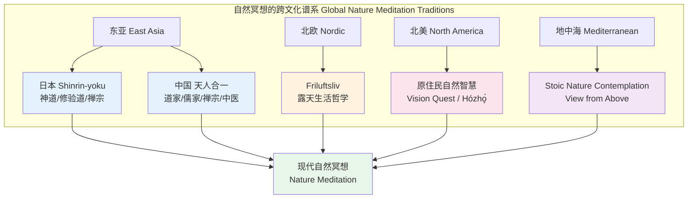
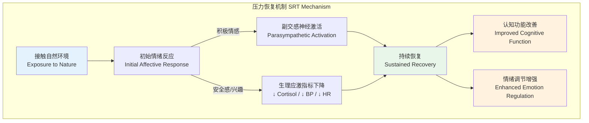
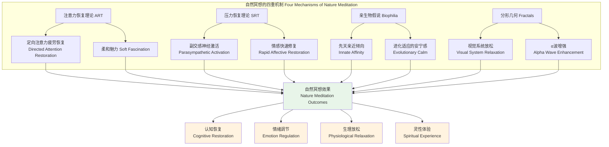
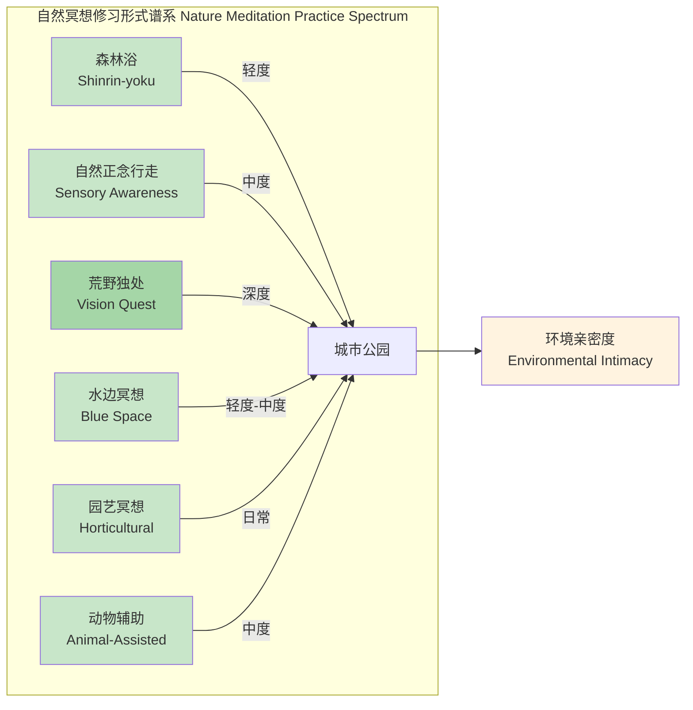
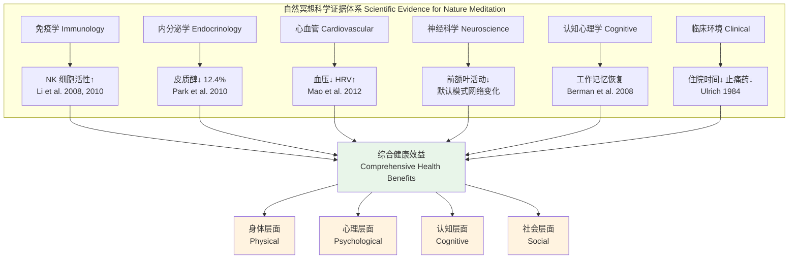
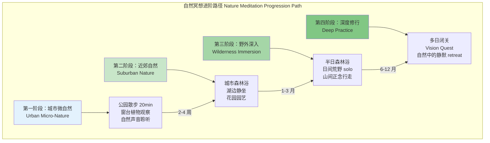

# 自然冥想专业概述 | Nature Meditation Overview

> **文档类型**: 冥想传统与实践系统介绍 | Tradition & Practice Introduction
> **适用对象**: 冥想执行师、心理咨询师、户外疗愈从业者、生态教育工作者、身心健康从业者
> **阅读时长**: 约 35–45 分钟
> **最后更新**: 2026-05

---

## 目录 | Table of Contents

1. [跨文化历史渊源](#一跨文化历史渊源)
2. [核心理论与机制](#二核心理论与机制)
3. [主要修习形式](#三主要修习形式)
4. [科学证据](#四科学证据)
5. [环境伦理与生态意识](#五环境伦理与生态意识)
6. [实践指引](#六实践指引)

---

## 一、跨文化历史渊源

自然冥想并非现代发明——人类在自然中寻求转化与治愈的历史，几乎与人类文明本身一样古老。不同文化以各自的语言和框架，描述了在森林、山川、水流与天空之下所发生的深层心理与灵性体验。

### 1.1 日本：森林浴（森林浴 Shinrin-yoku / Forest Bathing）

**Shinrin-yoku**（森林浴）一词于 1982 年由日本林野厅正式提出，意为"让自己沉浸在森林的氛围中"。尽管这一术语诞生于现代，其文化根基却深植于日本神道（Shinto）的"山岳信仰"与佛教的自然观之中。

| 历史层次 | 内涵 |
|---------|------|
| **神道传统** | 山川、树木、岩石皆有"神"（kami）栖居；进入自然即进入神圣空间 |
| **修验道** | 山伏（yamabushi）入山修行，以严酷自然环境作为觉悟的助缘 |
| **禅宗美学** | "侘寂"（wabi-sabi）——在不完美、无常的自然中见道 |
| **现代发展** | 1982年林野厅倡导；2004年建立首个森林疗法基地；现日本已有 60+ 认证森林疗法基地 |

**关键人物**：
- **宫崎良文（Miyazaki Yoshifumi）**：日本千叶大学环境、健康与野外医学中心教授， Shinrin-yoku 科学研究先驱
- **李卿（Li Qing）**：日本森林医学会会长，发表了森林浴对 NK 细胞活性影响的开创性研究

### 1.2 北欧：Friluftsliv

**Friluftsliv**（挪威语，字面意为"露天生活"）是北欧文化中一种深刻的自然哲学，而非简单的"户外活动"。它由挪威剧作家亨里克·易卜生（Henrik Ibsen）在 1859 年的诗作中首次推广，但其精神内核可追溯至维京时代的自然共生传统。

| 核心特征 | 描述 |
|---------|------|
| **不是运动，而是存在** | 区别于徒步、滑雪等运动；Friluftsliv 强调的是在自然中"自在地存在"（being）而非"做"（doing） |
| **Allemansrätten（漫游权）** | 瑞典法律赋予所有人进入自然区域的自由——这是 Friluftsliv 的制度保障 |
| **对抗黑暗与孤独** | 在北欧漫长冬季中，自然是抵御季节性抑郁（SAD）的核心资源 |
| **简单与自给** | 强调简朴、自足、与自然节奏同步——"de slår lite läger"（ Swedish: 简单扎营即可） |

### 1.3 北美原住民：自然智慧（Indigenous Nature Wisdom）

北美原住民传统中没有"自然冥想"这一分离概念——因为自然并非"外在"于人类的对象，而是生命整体的一部分。

| 传统 | 自然实践 | 核心教导 |
|------|---------|---------|
| **拉科塔（Lakota）** | 孤山静修（Hanbleceya / Vision Quest） | 在山顶独自禁食祈祷，寻求灵的指引；"Mitakuye Oyasin"（万物皆有关联） |
| **纳瓦霍（Navajo/Diné）** | 圣山朝圣、沙画仪式 | 自然地貌是神圣的；治愈需要与自然的和谐（hózhǫ́） |
| **易洛魁（Haudenosaunee）** | 感恩节地址（Thanksgiving Address） | 在每次集会前向自然元素（水、鱼、植物、动物、星辰）表达感恩 |
| **太平洋西北岸** | 图腾柱、精灵寻找仪式 | 自然中的精灵（spirit helpers）是个人力量的来源 |

**重要提醒**：原住民的自然智慧往往与特定的土地、语言和社群仪式不可分割。现代实践者在借鉴时，应尊重其文化完整性，避免浅层的"文化挪用"（cultural appropriation）。

### 1.4 中国古代：天人合一

"天人合一"是中国哲学中最核心的自然观，贯穿儒、道、释三教。

| 传统 | 自然观 | 实践形式 |
|------|--------|---------|
| **道家** | "人法地，地法天，天法道，道法自然"（《道德经》） | 辟谷、采气、导引、在山林中修道 |
| **儒家** | "知者乐水，仁者乐山"（《论语》） | 观物取象、山水比德 |
| **禅宗** | "郁郁黄花，无非般若；青青翠竹，尽是法身" | 山林禅修、行脚、云水生涯 |
| **中医** | 人禀天地之气而生，四时阴阳变化影响脏腑气血 | 顺应四时调摄、五运六气 |

**典型实践**：
- **采气/服气**：在日出时分于山林中面向东方，想象吸纳天地之清气
- **观云/观水**：以自然现象的流动变化作为观心的所缘
- **山居闭关**：传统禅宗的"阿兰若"（aranya，寂静处）修行，即远离人群的山林静修

### 1.5 古希腊-罗马：斯多葛派的自然沉思（Stoic Nature Contemplation）

斯多葛派（Stoicism）哲学家将自然（希腊语 *physis*）视为理性与秩序的终极体现，沉思自然是回归内心平静的重要途径。

| 哲学家 | 自然观 | 相关论述 |
|--------|--------|---------|
| **马可·奥勒留（Marcus Aurelius）** | 宇宙是一个有机整体，万物相互关联 | " frequently consider the connection of all things in the universe and their relation to one another."（《沉思录》） |
| **塞内卡（Seneca）** | 自然是灵魂的慰藉 | "Nature does not hurry, yet everything is accomplished." |
| **爱比克泰德（Epictetus）** | 顺应自然即是顺应理性 | 将逆境视为自然秩序的一部分，从而消解痛苦 |

**斯多葛自然沉思的核心方法**：
1. **View from Above**（俯瞰视角）：想象自己从高空俯瞰地球，将个人烦恼置于宇宙尺度中
2. **Contemplation of Cosmic Order**：观察自然界的规律（季节更替、星辰运行），以此校准内心
3. **Memento Mori in Nature**：在自然循环（落叶、枯荣）中沉思生命的有限与珍贵

---

## 二、核心理论与机制

自然冥想之所以有效，并非仅仅因为"感觉很好"——现代环境心理学和神经科学已经识别出多个可验证的作用机制。

### 2.1 注意力恢复理论（Attention Restoration Theory, ART）

由 Rachel 和 Stephen Kaplan 于 1980 年代提出，ART 是自然疗愈领域最具影响力的理论之一。

**核心假设**：
- 人类有两种注意力：
  - **定向注意力（Directed Attention）**：有意识的、需要努力的注意力，用于解决任务、抑制干扰。长期使用会导致"定向注意力疲劳"（Directed Attention Fatigue, DAF）
  - **非自愿注意力（Involuntary Attention / Fascination）**：无需努力的注意力，被有趣或迷人的刺激自动吸引

- **自然环境的独特作用**：自然环境中的元素（树叶摇动、水流、鸟鸣）具有"柔和魅力"（soft fascination），能够自动吸引非自愿注意力，同时让定向注意力得到恢复

| 环境类型 | 对注意力的影响 | 恢复效果 |
|---------|-------------|---------|
| **城市/室内** | 持续消耗定向注意力（红绿灯、人群、噪音、信息） | 疲劳累积 |
| **自然景观** | 提供"柔和魅力"，非自愿注意力自然参与 | 定向注意力恢复 |
| **荒野/深邃自然** | 强烈的"魅力"（awe/fascination） | 深度恢复，但可能伴随轻微压力 |

**"魅力"的四类型**（Kaplan & Kaplan, 1989）：
1. **柔和魅力（Soft Fascination）**： clouds, leaves, snow, rain —— 最利于注意力恢复
2. **硬性魅力（Hard Fascination）**：bright lights, fast cars —— 吸引注意力但不恢复
3. **延伸性（Extent）**：环境具有足够的空间和连贯性，让心智可以沉浸其中
4. **兼容性（Compatibility）**：环境支持个体的目的和倾向

### 2.2 压力恢复理论（Stress Recovery Theory, SRT）

由 Roger Ulrich 于 1983 年提出，SRT 侧重于自然环境的**情感与生理恢复**机制。

**核心假设**：
- 人类对自然具有先天的积极情感反应，这是进化适应的结果
- 接触自然（即使只是观看自然影像）能在**最初几分钟内**触发副交感神经激活
- 自然环境的恢复效果优于城市环境，尤其是包含"绿色"和"水"元素的环境

**关键研究支持**：
- Ulrich (1983)：手术后观看树木的患者，比观看砖墙的患者疼痛更少、住院时间更短
- Ulrich et al. (1991)：观看自然影像 10 分钟后，血压、肌肉紧张度、皮肤电导率均显著下降

### 2.3 亲生物假说（Biophilia Hypothesis）

由爱德华·威尔逊（E.O. Wilson）于 1984 年提出，并在《亲生物》（Biophilia, 1984）一书中系统阐述。

**核心假设**：
- 人类在进化过程中长期生活在自然环境中，因此发展出了对自然和其他生命形式的**先天亲近倾向**
- 这种倾向是基因层面的，解释了为什么自然接触能带来深层的满足感和安宁感
- 亲生物本能不仅包括对动植物的喜爱，也包括对自然元素（水、火、天空）的吸引

| 亲生物表现 | 进化根源 | 冥想应用 |
|-----------|---------|---------|
| **对绿色植物的偏好** | 绿色 = 水源/食物/庇护所 | 森林浴中注视绿色植物 |
| **对水的吸引** | 水是生存必需 | 水边冥想 |
| **对开阔景观的偏好** | 开阔地提供视野和安全 | 观远景冥想 |
| **对动物的亲近** | 动物提供食物、陪伴、预警 | 动物辅助冥想 |
| **对分形图案的偏好** | 自然界的分形暗示资源丰富 | 观察树冠、云朵、贝壳 |

### 2.4 分形几何与自然注意（Fractals in Nature Attention）

**分形（Fractals）**是指在不同尺度上重复相似模式的几何形状。自然界中充满分形：树枝的分叉、河流的支流、云朵的边界、贝壳的螺旋。

**Richard Taylor**（俄勒冈大学物理学家）的研究发现：
- 人类视觉系统对特定"分形维度"（约 D = 1.3–1.5）的分形图案有天生的放松反应
- 自然界的分形恰好多落在这个维度范围内
- 观看分形图案时，大脑的α波（放松波）增加，应激反应降低

| 分形维度 D | 视觉感受 | 自然实例 |
|-----------|---------|---------|
| **1.1–1.3** | 过于简单，缺乏趣味 | 平坦的沙漠 |
| **1.3–1.5** | "恰到好处"，最放松 | 树木冠层、云朵、海岸线 |
| **1.5–1.7** | 复杂，略紧张 | 茂密的丛林 |
| **1.7–2.0** | 过于复杂，压力感 | 拥挤的城市天际线 |

**冥想应用**：在自然冥想中，有意识地凝视树木的分叉结构、河流的蜿蜒曲线、云朵的边缘轮廓，可以自然引导大脑进入放松状态。

---

## 三、主要修习形式

### 3.1 森林浴（Shinrin-yoku：五感开启、慢走、树木接触、芬多精）

森林浴是最系统化的自然冥想形式之一，具有明确的技术框架和科学支持。

**核心修习要素**：

| 要素 | 日文/英文 | 修习方法 |
|------|----------|---------|
| **五感开启** | 五感の解放 / Five Senses Opening | 有意识地调动视觉、听觉、嗅觉、触觉、味觉（安全情况下） |
| **慢走** | ゆっくり歩く / Slow Walking | 速度约为平时的 1/3–1/2，每步都感受脚底与大地的接触 |
| **树木接触** | 木に触れる / Tree Touching | 用手掌触摸树皮，感受其纹理、温度、湿度；也可背靠树木静坐 |
| **芬多精吸收** | フィトンチッド / Phytoncides | 深呼吸，想象吸入树木释放的挥发性有机化合物 |

**标准流程**（2–4 小时）：
1. **入林准备**（10 min）：在森林边缘站立，深呼吸三次，设定意图
2. **缓步行走**（30–45 min）：以极慢速度行走，不交谈，不拍照，只是感知
3. **五感开放练习**（20 min）：
   - 视觉：凝视一片树叶的纹理直到看清其边缘的锯齿
   - 听觉：闭目聆听，尝试分辨 5 种不同的声音层次
   - 嗅觉：深呼吸，辨识 3 种不同的气味
   - 触觉：赤手触摸不同树种的树皮
4. **树木接触/静坐**（20–30 min）：选择一棵吸引你的树，背靠或手触，闭目冥想
5. **林间茶歇**（15 min）：在林间品茶或饮水，作为"过渡仪式"
6. **返程整合**（10 min）：缓步走出森林，在边缘停留片刻，感恩

**Phytoncides（芬多精/植物杀菌素）的科学**：
- 树木（尤其是针叶树）释放的挥发性有机化合物，包括α-蒎烯（α-pinene）、柠檬烯（limonene）等
- 被人体吸入后，可增加 NK（自然杀手）细胞活性，提升免疫功能
- 具有抗菌、抗炎和轻度镇静作用

### 3.2 自然正念行走（Sensory Awareness in Nature）

自然正念行走是将正念减压（MBSR）中的行走冥想扩展至自然环境中的修习形式。

**核心原则**：
- **每一步都是全新的**：即使走在同一条小径上，每一次脚步都是独特的
- **全身感官参与**：不仅关注脚步，也开放于周围的所有感官输入
- **不追求目的地**：行走本身就是目的，不存在"到达"的压力

**进阶技术**：

| 技术名称 | 修习方法 |
|---------|---------|
| **边界觉察** | 感受身体与空气、阳光、风的接触界面 |
| **地平线凝视** | 每 10 分钟，将视线从近处移至最远的地平线，再收回——调节视觉神经系统 |
| ** barefoot walking** | 在安全的地面上赤脚行走，最大化足部本体感觉输入 |
| **声音地图** | 闭目站立 5 分钟，在内心"绘制"周围声音的空间分布 |

### 3.3 荒野独处（Vision Quest / Solo）

荒野独处是一种深度的自然冥想形式，通常包含较长时期的独自在自然中停留。

**传统形式（Vision Quest）**：
- **准备期**（数天至数周）：在社群指导下进行净化、禁食准备
- ** solo 期**（1–4 天）：独自在荒野中，无食物或极少食物，无遮蔽，静坐或冥想
- **整合期**（数天）：返回社群，分享体验，接受长老的解读

**现代改良形式（Wilderness Solo）**：
- 时长：数小时至 3 天
- 保留"独自"和"最小化干扰"的核心，但允许携带基本安全装备
- 通常作为"自然疗法"（Wilderness Therapy）或深度静修营的一部分

**安全注意事项**：
- 必须有完善的安全预案（定期报到点、紧急联络方式）
- 不适合有严重心理疾病史（尤其是精神病性障碍）的个体
- 需具备基本的野外生存知识

### 3.4 水边冥想（Blue Space Meditation）

"蓝色空间"（Blue Space）是指可见水体——海洋、湖泊、河流、瀑布、甚至喷泉。研究表明，蓝色空间的恢复效果有时甚至优于绿色空间。

**水边冥想的独特机制**：

| 因素 | 作用 |
|------|------|
| **负氧离子** | 瀑布、海浪附近负氧离子浓度高，有助于血清素合成和情绪提升 |
| **节律性声音** | 水声的节律性（约 1–2 Hz）与大脑放松波的频率接近，有天然的"夹带"（entrainment）效应 |
| **视野开阔** | 水面反射天空，创造开阔的远景，减少压迫感 |
| **多感官整合** | 水声、水色、水气、水触感的同时存在，创造丰富的感官沉浸 |

**修习形式**：
- **静水冥想**：在湖边或池边静坐，凝视水面
- **流水冥想**：在溪流边，将听觉专注在水声的层次变化上
- **海洋冥想**：面对海浪，以呼吸同步潮汐节奏
- **雨中冥想**：在安全遮蔽下，闭目聆听雨声

### 3.5 园艺冥想（Horticultural Therapy 的冥想维度）

园艺治疗（Horticultural Therapy, HT）是将园艺活动作为治疗媒介的专业领域。其冥想维度在于：园艺活动中固有的"正念"品质——土壤的触感、植物的生长节奏、季节的循环。

**园艺冥想的修习要素**：

| 要素 | 冥想品质 |
|------|---------|
| **播种** | 意图设定、对未来的信任 |
| **浇水** | 给予与养育的觉察 |
| **除草** | 辨识"需要去除的"与"需要保留的"——隐喻内心清理 |
| **修剪** | 接受"减损"是成长的一部分 |
| **收获** | 感恩、完整周期的体验 |
| **堆肥** | 接受衰败与转化——枯枝落叶成为新生命的养分 |

**正念园艺练习**（20–30 分钟）：
1. 进入花园前，站立片刻，深呼吸三次，设定意图
2. 选择一项简单任务（浇水或除草）
3. 以极慢的速度执行，感受每一个动作的身体感觉
4. 当发现心念飘散，温柔地回到当下的动作和感觉
5. 结束时，环顾花园，感恩所有生命

### 3.6 动物辅助冥想

动物辅助冥想（Animal-Assisted Meditation）是指在与动物共处中进行的冥想修习。这不同于一般的"宠物疗愈"，而是将动物的"在场"作为冥想所缘。

**修习形式**：

| 形式 | 描述 | 注意事项 |
|------|------|---------|
| **与马冥想**（Equine Meditation） | 在马旁静坐，感受马的高度警觉与当下的完美示范 | 需专业人士陪同；马是猎物动物，对人类情绪极为敏感 |
| **与鸟冥想** | 在鸟鸣丰富的环境中，以鸟声作为听觉所缘 | 清晨（dawn chorus）效果最佳 |
| **与宠物静坐** | 与猫/狗一同静坐，感受其呼吸节奏 | 将宠物的放松状态作为"镜像"，促进自身放松 |
| **野生动物观察** | 在隐蔽处静静观察野生动物，不打扰 | 需尊重动物空间，不可诱导接近 |

**动物在场的独特作用**：
- 动物的"完全在当下"为人类提供了非语言的"正念示范"
- 人与动物的同步（如与马的呼吸同步、与狗的静坐同步）可触发催产素（oxytocin）释放
- 动物的非评判性在场，有助于降低社交焦虑和自我批判

### 3.7 修习形式对比表

| 维度 | 森林浴 Shinrin-yoku | 自然正念行走 | 荒野独处 Vision Quest | 水边冥想 Blue Space | 园艺冥想 Horticultural | 动物辅助 Animal-Assisted |
|------|-------------------|------------|---------------------|-------------------|----------------------|----------------------|
| **环境要求** | 森林/林地 | 任何自然路径 | 荒野/无人区 | 水体附近 | 花园/农田 | 有动物的安全空间 |
| **典型时长** | 2–4 小时 | 30–60 分钟 | 数小时–3 天 | 20–40 分钟 | 20–60 分钟 | 15–30 分钟 |
| **核心感官** | 五感全开 | 本体感觉+视觉 | 多感官剥夺/放大 | 听觉+视觉 | 触觉+视觉 | 视觉+触觉+情感 |
| **运动强度** | 低（缓步） | 中低（步行） | 极低（静坐） | 极低（静坐） | 中低（园艺劳动） | 极低（静坐） |
| **社会性** | 可团体（静默） | 可团体（静默） | 独自 | 可团体/独自 | 可团体/独自 | 可团体/独自 |
| **安全等级** | 高 | 高 | 低–中（需预案） | 高 | 高 | 中（需了解动物行为） |
| **主要效益** | 免疫增强、压力降低 | 正念培养、身体觉知 | 深度转化、灵性体验 | 情绪提升、认知恢复 | 意义感、日常正念 | 情感联结、焦虑降低 |
| **适合人群** | 广泛 | 初学者友好 | 有经验的修行者 | 广泛 | 广泛 | 动物爱好者 |
| **季节限制** | 四季皆可 | 四季皆可 | 受气候限制大 | 四季皆可 | 受气候限制中 | 四季皆可 |

---

## 四、科学证据

自然冥想的科学证据在过去二十年中迅速积累，涵盖免疫学、内分泌学、心血管生理学、神经科学和认知心理学。

### 4.1 森林浴与免疫学：NK 细胞研究

**李卿（Qing Li）**的开创性研究系列：

| 研究 | 设计 | 主要发现 |
|------|------|---------|
| **Li et al. (2008)** | 12 名健康男性在森林中步行 2 小时/天，连续 3 天 | NK 细胞活性显著增加；效果持续 7 天；Phytoncides 浓度与 NK 活性正相关 |
| **Li et al. (2010)** | 13 名女性在森林中停留 3 天 2 夜 | NK 细胞活性增加 50%+；NK 细胞数量增加；颗粒酶（granzyme）和穿孔素（perforin）增加 |
| **Li (2010) 综述** | 综述研究 | 森林浴增加 NK 细胞活性、数量和抗癌蛋白表达；效果持续约 7–30 天 |

**机制假说**：
- 树木释放的 Phytoncides（如α-pinene, limonene）被吸入后，增加 NK 细胞活性
- NK 细胞是人体免疫系统的第一道防线，对肿瘤细胞和病毒感染细胞有杀伤作用

### 4.2 皮质醇与压力激素

多项研究证实，自然暴露能快速降低压力激素指标。

| 研究 | 设计 | 主要发现 |
|------|------|---------|
| **Park et al. (2010）** | 280 名参与者在 24 个日本森林中进行森林浴 | 唾液皮质醇（salivary cortisol）平均下降 12.4%；心率下降 5.8%；血压下降 1.4% |
| **Roe & Aspinall (2011）** | 测量参与者在森林与城市环境中的皮质醇 | 森林环境中的皮质醇水平显著低于城市环境 |
| **Hunter et al. (2019）** | 大规模横断面研究 | 每周至少 120 分钟的自然接触与更好的健康和幸福感显著相关（"120 分钟阈值"） |

### 4.3 血压与心血管指标

| 研究 | 设计 | 主要发现 |
|------|------|---------|
| **Mao et al. (2012）** | 24 名高血压患者进行 7 天森林浴 | 收缩压显著下降；尿中肾上腺素（adrenaline）和去甲肾上腺素下降 |
| **Ochiai et al. (2015）** | 在森林中的 Shiratani Unsuikyo 进行研究 | 森林浴显著降低收缩压和舒张压；对高血压前期人群效果更明显 |
| **Lee et al. (2014）** | 系统综述 | 森林浴对血压的降低效果虽然温和但一致；可作为心血管健康的辅助干预 |

### 4.4 心率变异性（HRV）

HRV 是衡量自主神经系统健康和恢复力的关键指标。高 HRV 与更好的压力适应力、情绪调节和心血管健康相关。

| 研究 | 设计 | 主要发现 |
|------|------|---------|
| **Lee et al. (2011）** | 16 名男性在森林中步行 | HRV 指标显示副交感神经活动显著增加 |
| **Yu et al. (2017）** | 森林浴 vs 城市步行对照 | 森林浴组的 HRV 恢复更快；交感神经/副交感神经平衡改善 |

### 4.5 Roger Ulrich 的康复花园研究

Roger Ulrich（德克萨斯 A&M 大学）是"循证设计"（Evidence-Based Design）领域的先驱，其研究对医院、康复中心和城市规划设计产生了深远影响。

**关键研究**：

| 研究 | 设计 | 发现 |
|------|------|------|
| **Ulrich (1984）** | 胆囊手术后患者，随机分配至"树景房"或"砖墙景房" | 树景房患者：住院时间缩短 0.75 天；止痛药使用减少；负面评论更少 |
| **Ulrich & Simons (1986）** | 观看自然影像 vs 城市影像对压力恢复的影响 | 自然影像组：心率恢复更快；肌肉紧张度下降更多；主观压力感更低 |
| **Ulrich (1999）** | 医院花园对访客的影响 | 花园中的访客报告压力降低、情绪改善； gardens 是医院中少数允许"情绪表达"的空间 |

### 4.6 Marc Berman 的认知恢复研究

Marc Berman（芝加哥大学）的研究专注于自然对认知功能的影响，为 ART 提供了坚实的实证支持。

| 研究 | 设计 | 发现 |
|------|------|------|
| **Berman et al. (2008）** | 步行者在自然环境中 vs 城市环境中步行 50 分钟 | 自然步行组在 backwards digit span 任务中表现显著更好；情绪改善更多 |
| **Berman et al. (2012）** | 仅观看自然图片 vs 城市图片 | 即使只是观看自然图片，认知恢复效果也优于城市图片 |
| **Berman et al. (2019）** | 大规模荟萃分析 | 自然暴露与认知功能、情绪、血压的改善有稳健的关联 |

---

## 五、环境伦理与生态意识

自然冥想不仅是"利用自然来治愈人类"——在深度实践中，它会自然地导向对自然本身的关怀与责任。这种伦理维度是现代自然冥想不可或缺的组成部分。

### 5.1 深层生态学（Deep Ecology）

由挪威哲学家 **Arne Næss** 于 1973 年提出，深层生态学是一种生态哲学，强调：

| 浅层生态学（Shallow Ecology） | 深层生态学（Deep Ecology） |
|---------------------------|--------------------------|
| 自然是有待管理的"资源" | 自然有其内在价值（intrinsic value），独立于人类需求 |
| 环保是为了人类的利益 | 环保是因为所有生命都有生存和繁荣的权利 |
| 人类中心主义（Anthropocentrism） | 生态中心主义（Ecocentrism） |
| 技术解决方案 | 价值观和世界观的根本转变 |

**深层生态学的八项原则**（Arne Næss & George Sessions, 1984）：
1. 人类和非人类生命的福祉与繁荣都有其自身价值
2. 生命形式的丰富性与多样性本身就是价值
3. 人类无权减少这种丰富性，除非为了满足基本需求
4. 人类生命与文化的繁荣与人口减少相容
5. 目前人类对非人类世界的干预是过度的
6. 政策必须因此改变
7. 意识形态的根本转变主要在于珍视生活质量而非提高生活水平
8. 认同上述观点的人有义务直接或间接地参与必要的改变

**冥想应用**：在自然冥想中，将"自我"的边界从个体扩展到整个生态系统——这是深层生态学的核心实践。

### 5.2 生态冥想（Ecological Meditation）

生态冥想是一种将冥想技术与生态意识培养结合的新兴实践。

**修习框架**：

| 阶段 | 修习内容 |
|------|---------|
| **第一阶段： grounding** | 感受身体与大地的连接；意识到身体本身就是"自然"的一部分 |
| **第二阶段：扩展觉察** | 将觉察从身体扩展到周围的环境元素——土壤、空气、水、阳光 |
| **第三阶段：循环觉知** | 意识到呼吸中的气体交换（吸入氧气/呼出二氧化碳）与全球碳循环的连接 |
| **第四阶段：生态自我** | 体验"生态自我"（Ecological Self）——不再将自然视为外在，而是自我的一部分 |
| **第五阶段：承诺与行动** | 从冥想中生起对地球的关怀，转化为具体的环保承诺 |

### 5.3 气候焦虑的应对（Climate Anxiety / Eco-anxiety）

"生态焦虑"（Eco-anxiety）是指对气候危机和生态破坏的持续担忧和恐惧。美国心理学会（APA, 2017）已正式承认其为日益严重的心理健康议题。

**自然冥想对气候焦虑的独特价值**：

| 问题 | 自然冥想的回应 |
|------|-------------|
| **无力感** | 在自然中直接体验与更大系统的连接，减少孤立无援感 |
| **悲观与绝望** | 观察自然界的韧性和恢复力（如火灾后森林的再生） |
| **信息过载** | 自然冥想提供"数字排毒"空间，从气候新闻的焦虑循环中暂时抽离 |
| **行动瘫痪** | 冥想中升起的关怀情感，转化为有意义的行动而非恐慌 |
| **悲悼（Grief）** | 自然空间提供安全的容器，处理对物种灭绝和生态系统丧失的悲伤 |

**"双管齐下"的方法**：
1. **接纳与转化**：通过冥想接纳气候焦虑的存在，将其转化为关怀和行动的燃料
2. **修复性行动**：将冥想与实际的环保行动结合（如参与本地生态修复），避免冥想沦为逃避

---

## 六、实践指引

### 6.1 不同环境选择

并非所有"自然"都同样有效。选择合适的环境是自然冥想成功的关键。

| 环境类型 | 特征 | 适合的形式 | 注意事项 |
|---------|------|-----------|---------|
| **原始森林** | 高生物多样性、丰富的感官刺激、远离人类痕迹 | 森林浴、荒野独处 | 需防虫、蛇；告知他人行程 |
| **人工林/经济林** | 树种单一、但仍有森林氛围 | 森林浴、正念行走 | 效果略逊于原始森林，但仍有效 |
| **城市公园** | 可达性高、维护良好、有人流 | 自然正念行走、简短静坐 | 选择人少的时段和区域 |
| **滨水区** | 水体存在、视野开阔、负氧离子 | 水边冥想、正念行走 | 注意潮汐和水流安全 |
| **花园/庭院** | 私密、可控、日常可达 | 园艺冥想、日常自然冥想 | 可全年练习的最佳选择 |
| **阳台/窗台植物** | 最小自然单元 | 微观自然冥想、植物观察 | 效果温和，但积少成多 |

### 6.2 季节适应

自然冥想不应只在"好天气"进行——四季的变化本身就是修行的助缘。

| 季节 | 特点 | 修习建议 |
|------|------|---------|
| **春** | 萌芽、新生、花粉 | 适合观察"新生"的过程；对花粉过敏者注意防护 |
| **夏** | 繁茂、炎热、昆虫活跃 | 早晚时段最佳；注意防暑和蚊虫；适合水边冥想 |
| **秋** | 落叶、色彩变化、气温适中 | 观察"衰败与转化"的最佳季节；落叶可作为正念所缘 |
| **冬** | 枯寂、寒冷、日照短 | 适合极简的静坐冥想； Scandinavian 研究表明冬季自然接触对预防 SAD 尤其重要 |

**斯多葛式的季节智慧**：
> "冬天，你不能期待拥有无花果，所以也不要期待在自然本性的季节之外获得任何东西。" —— 爱比克泰德

### 6.3 安全注意事项

自然冥想虽然总体安全，但仍需遵循基本的安全原则。

| 类别 | 风险 | 预防措施 |
|------|------|---------|
| **天气** | 中暑、失温、雷击 | 出发前查看天气预报；携带适当衣物；雷雨时远离高地和大树 |
| **地形** | 滑倒、坠落、迷路 | 穿着合适的鞋；携带地图/导航；告知他人行程 |
| **生物** | 毒蛇、昆虫、蜱虫 | 穿长裤长袖；使用驱虫剂；活动结束后检查蜱虫 |
| **植物** | 有毒植物（毒藤、毒橡树等） | 学习辨识本地有毒植物；"不认识的不触摸" |
| **水域** | 溺水、离岸流 | 不了解的水域不进入；注意潮汐变化 |
| **人际** | 偏僻地区的治安风险 | 避免夜间独自前往偏僻地区；携带手机 |
| **心理** | 荒野独处可能触发恐惧或解离 | 有精神病史者需专业人士评估；设定"安全词"或定期报到 |

### 6.4 城市中的自然冥想

对于居住在城市中的人来说，"接触自然"似乎是一种奢侈。然而，研究表明，即使是微型的自然接触也具有显著效益。

**城市自然冥想策略**：

| 策略 | 具体做法 | 最低有效剂量 |
|------|---------|------------|
| **公园微剂量** | 在午餐时间去附近的公园散步 15–20 分钟 | 每周累计 120 分钟（Hunter et al., 2019） |
| **树木凝视** | 在窗边凝视一棵树 5 分钟，观察其树叶的细微运动 | 每日 5 分钟 |
| **室内植物** | 在办公桌放置 2–3 盆植物，间歇时观察 | 随时 |
| **自然声音** | 使用高质量的自然声音录音（雨声、鸟鸣、溪流） | 工作/冥想时的背景音 |
| **天空观察** | 在阳台或屋顶观察天空、云朵、飞鸟 | 每日 5–10 分钟 |
| **微观自然** | 用放大镜观察一片叶子、一块石头、一只昆虫 | 10–15 分钟 |

**"120 分钟法则"**：
Hunter et al. (2019) 对近 2 万名英国人的研究发现，每周接触自然至少 120 分钟的人，其健康和幸福感显著高于接触不足 120 分钟的人——而且 120 分钟是"阈值"，而非线性累积（即 200 分钟并不显著优于 120 分钟）。

### 6.5 初学者路径建议

---

## 相关链接

- [正念行走概述](../walking-meditation/Walking_Meditation_Overview.md) — 自然正念行走的技术基础
- [MBSR正念减压](../mbsr-program/MBSR_Program_Overview.md) — 正念冥想的系统训练
- [冥想与睡眠](../overview/Meditation_And_Sleep.md) — 自然冥想对睡眠的辅助作用
- [焦虑障碍](../clinical-conditions/Meditation_Anxiety_Disorders.md) — 自然冥想对焦虑的临床应用
- [抑郁症](../clinical-conditions/Meditation_Depression.md) — 自然冥想对抑郁的辅助干预

---

*Peace Lab Database — Nature Meditation Overview*
