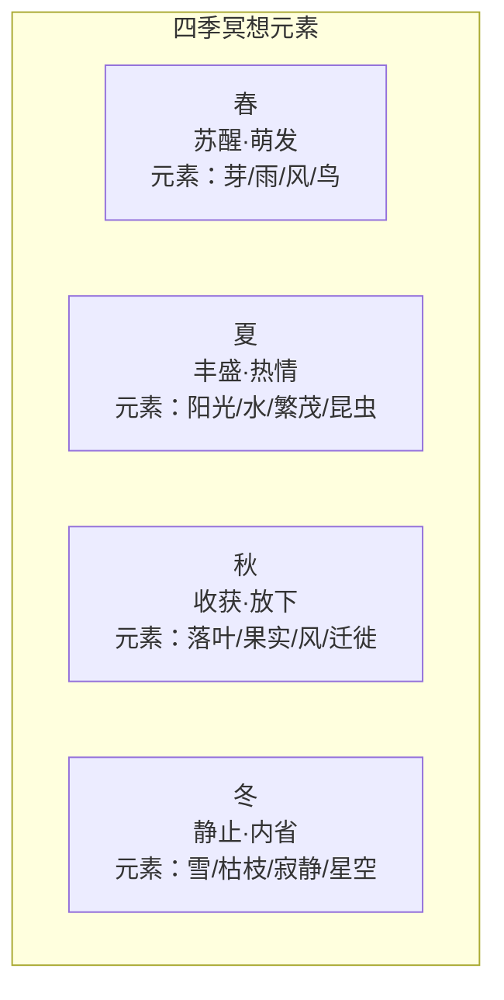

# 自然冥想实操指南

> **适用范围**：所有希望在自然中深化冥想修习者，无论经验水平
> **最后更新**：2026-05

---

## 目录

1. [森林浴（Shinrin-yoku）标准2小时流程](#1-森林浴shinrin-yoku标准2小时流程)
2. [四季冥想方案](#2-四季冥想方案)
3. [城市中的自然冥想](#3-城市中的自然冥想)
4. [荒野独处的安全准备](#4-荒野独处的安全准备)
5. [自然冥想引导词脚本](#5-自然冥想引导词脚本)
6. [常见问题与资源](#6-常见问题与资源)

---

## 1. 森林浴（Shinrin-yoku）标准2小时流程

Shinrin-yoku（森林浴）起源于1980年代的日本，是一种通过感官沉浸于森林氛围来促进身心健康的自然疗法。核心不是运动或锻炼，而是"在"（being）于森林之中。

### 1.1 五阶段流程总览

### 1.2 各阶段详解

| 阶段 | 时长 | 核心行动 | 关键心态 |
|------|------|----------|----------|
| **准备** | 5-10分钟 | 到达森林边缘，放下手机，转换心态 | 从"做"切换到"在" |
| **缓行** | 20-30分钟 | 极慢步行，打开所有感官 | 不追求目的地，只追求当下的觉察 |
| **静止** | 20-30分钟 | 找一个地方坐下或站立，不动 | 让身体静止，让森林的讯息进来 |
| **观察** | 30-40分钟 | 深入观察一个自然对象 | 用新的眼睛看熟悉的事物 |
| **结束** | 10-15分钟 | 感恩，记录，缓慢离开 | 将森林的平静带回日常生活 |

#### 准备阶段

**操作清单**：
- [ ] 关闭手机或调至飞行模式
- [ ] 将包和多余物品留在车上或入口
- [ ] 站在森林边缘，深呼吸三次
- [ ] 默念或心中确认意图："我来到这里，是为了让自己被森林洗涤"
- [ ] 有意识地从日常心智模式切换：放下待办事项、计划、分析

#### 缓行阶段

**步行方式**：

| 要素 | 建议 |
|------|------|
| **速度** | 比平时慢50-70%，每步有意识地感受脚底与地面的接触 |
| **呼吸** | 自然呼吸，不需要控制，只是觉察 |
| **视线** | 不固定于前方，让视线自然漫游——上望树冠，下看地面，环顾四周 |
| **身体** | 放松肩膀，打开胸膛，双臂自然摆动 |

**感官开启练习**（缓行中可随机进行）：

| 感官 | 练习 |
|------|------|
| **视觉** | 寻找三种不同的绿色；注视光线穿过树叶的斑驳 |
| **听觉** | 闭眼行走10步，只专注于听到的声音 |
| **嗅觉** | 停下来深呼吸，辨识空气中的气味（树脂、泥土、花香） |
| **触觉** | 用手轻轻触摸树皮、苔藓、落叶，感受质地 |
| **味觉** | 张开嘴，感受空气的味道（安全环境下） |

#### 静止阶段

**找一个地方**：
- 一块大石头、一棵倒下的树干、一块空地
- 标准：感觉安全、舒适、有自然包围感

**静止中的练习**：
1. 坐下或站立，闭上眼睛或半闭
2. 感受身体与大地/支撑物的接触
3. 感受空气的温度、湿度、流动
4. 感受周围的"声音景观"——不辨别是什么声音，只是聆听整体
5. 如果有念头升起，像云一样让它们飘过，回到当下的感受

#### 观察阶段

**深度观察练习**：

1. 选择一个自然对象（一片叶子、一块石头、一棵树的纹理）
2. 设定15-20分钟的计时器
3. 用"初见的眼睛"观察它——仿佛从未见过类似的东西
4. 注意：颜色、形状、纹理、光影变化、微小细节
5. 如果注意力分散，温柔地回到这个对象

**观察后的扩展**：
- 问自己："这个对象在教导我什么？"
- 不急于回答，让答案自然浮现或保持开放

#### 结束阶段

| 行动 | 说明 |
|------|------|
| 感恩 | 在心中或轻声对森林表达感谢 |
| 身体唤醒 | 轻轻伸展身体，唤醒可能静止后的身体 |
| 记录 | 若愿意，用手机或笔记本记录当下的感受或领悟 |
| 过渡 | 离开森林时，留意这种平静如何跟随你 |

### 1.3 森林浴的理想森林选择

| 条件 | 说明 |
|------|------|
| **树种** | 松树、杉树、柏树等针叶林效果最佳（芬多精含量高） |
| **密度** | 适度的树冠覆盖，有斑驳阳光透入 |
| **环境** | 远离交通噪音，空气清新 |
| **步道** | 不需精心维护的步道，自然的小径更佳 |
| **季节** | 全年皆可，每个季节有不同的体验 |

---

## 2. 四季冥想方案

每个季节提供不同的自然元素作为冥想对象。

### 2.1 四季元素对照

### 2.2 各季节冥想方案

#### 春 · 苏醒与萌发

| 关注重点 | 冥想方式 | 象征意涵 |
|----------|----------|----------|
| **新芽** | 注视树枝上的新绿，感受生命的萌动 | 新的开始，潜能 |
| **春雨** | 在雨中静立或静坐，感受雨滴 | 净化，滋润，柔软 |
| **春风** | 感受风吹拂皮肤，听风声 | 变化，不可捉摸的自由 |
| **鸟鸣** | 闭眼聆听鸟鸣的多样与和谐 | 喜悦，沟通，自然的歌 |

**春季冥想练习**：
- 找一个正在发芽的树枝
- 每天来观察同一个位置，记录变化
- 将植物的生长与内在成长的意图联结

#### 夏 · 丰盛与热情

| 关注重点 | 冥想方式 | 象征意涵 |
|----------|----------|----------|
| **阳光** | 感受阳光穿透皮肤，身体变暖 | 能量，光芒，清晰 |
| **流水** | 坐在溪流或瀑布旁，听水声，观流动 | 流动，放下，净化 |
| **繁茂** | 注视浓密的绿叶，感受生命的丰盛 | 繁荣，给予，慷慨 |
| **昆虫** | 观察蜜蜂、蝴蝶的工作，不打扰 | 忙碌中的专注，服务 |

**夏季冥想练习**：
- 在正午阳光中站立5分钟（注意防晒与安全）
- 感受阳光如何充满你的身体
- 心中默念："我允许自己被光充满"

#### 秋 · 收获与放下

| 关注重点 | 冥想方式 | 象征意涵 |
|----------|----------|----------|
| **落叶** | 观看叶子飘落的过程，从树上到地面 | 放下，信任，轮回 |
| **果实** | 观察成熟的果实，感受丰收 | 成果，感恩，分享 |
| **秋风** | 感受凉风，觉察温度变化 | 变迁，提醒，珍惜 |
| **迁徙** | 观察候鸟的飞行队形与方向 | 方向感，集体智慧，归属 |

**秋季冥想练习**：
- 收集一片落叶
- 仔细观察它的颜色变化、纹理、边缘
- 将它握在手心，冥想："我可以放下什么？"

#### 冬 · 静止与内省

| 关注重点 | 冥想方式 | 象征意涵 |
|----------|----------|----------|
| **雪** | 在雪中静立，听雪的寂静 | 纯净，覆盖，新的开始 |
| **枯枝** | 注视光秃的树枝结构，看到骨架之美 | 本质，结构，内在的支撑 |
| **寂静** | 体验冬日特有的深沉寂静 | 内省，聆听内在，静谧 |
| **星空** | 冬夜观星，感受宇宙的辽阔 | 渺小与伟大的共存，永恒 |

**冬季冥想练习**：
- 在清晨或深夜，到户外体验冬的寂静
- 如果下雪，抬头让雪花落在脸上
- 感受寒冷中的清醒——它不是敌人，是另一种存在方式

---

## 3. 城市中的自然冥想

即使没有森林或荒野，城市中仍然存在自然冥想的入口。

### 3.1 城市自然冥想三法

#### 公园长椅冥想

**适合场景**：午休时间、下班后、周末

| 步骤 | 操作 |
|------|------|
| **准备** | 找到公园中相对安静的长椅，坐下 |
| ** grounded** | 双脚平放地面，感受身体的重量被椅子和大地的支撑 |
| **感官开启** | 不关闭城市的声音，而是在声音的背景中寻找自然元素（风声、树叶声、鸟鸣） |
| **视觉专注** | 选择一片草地、一棵树或一朵花作为视觉锚点 |
| **呼吸** | 自然呼吸，每一次呼气想象将城市的紧张释放到大地中 |
| **时间** | 10-20分钟 |

#### 阳台植物观察

**适合场景**：居家、公寓住户

| 步骤 | 操作 |
|------|------|
| **准备** | 站在阳台或靠近窗边，面前有植物（即使是花盆中的） |
| **接近** | 将脸靠近植物，近到能看到叶脉的纹理 |
| **观察** | 用5分钟只观察一片叶子——它的颜色变化、纹理走向、边缘形状 |
| **感受** | 感受植物作为生命体的存在，它在呼吸、生长、响应光 |
| **联结** | 意识到你与这棵植物共享同一个地球、同一种空气 |

#### 雨天窗户冥想

**适合场景**：无法外出的雨天

| 步骤 | 操作 |
|------|------|
| **准备** | 坐在窗边，靠近但不紧挨窗户 |
| **观看** | 注视雨滴在玻璃上的流动——它们的轨迹、汇合、分叉 |
| **聆听** | 听雨声的节奏变化，从轻微到密集 |
| **隐喻** | 让雨滴成为你的念头——它们出现、流动、消失，不需要抓住 |
| **扩展** | 想象雨滋润大地、河流、海洋，你是这个水循环的一部分 |

### 3.2 城市自然冥想速查表

| 你的处境 | 推荐方法 | 时长 |
|----------|----------|------|
| 午休只有15分钟 | 公园长椅冥想 | 10-15分钟 |
| 居家工作间隙 | 阳台植物观察 | 5-10分钟 |
| 雨天无法出门 | 雨天窗户冥想 | 15-20分钟 |
| 通勤路上 | 步行冥想：专注路边的每一棵树 | 整个通勤过程 |
| 深夜难眠 | 月光冥想：注视月光，感受宁静 | 10分钟 |

---

## 4. 荒野独处的安全准备

荒野独处（Wilderness Solitude）是深入自然冥想的高级形式，涉及在偏远自然环境中独自停留数小时至数天。安全是第一要务。

### 4.1 装备清单

#### 基础装备（单日）

| 类别 | 物品 | 用途 |
|------|------|------|
| **导航** | 地图、指南针、GPS 设备（或离线地图APP） | 不迷路 |
| **照明** | 头灯 + 备用电池 | 应对天黑 |
| **防晒** | 防晒霜、帽子、太阳镜 | 防护 |
| **急救** | 基础急救包（绷带、消毒、止痛药） | 应急处理 |
| **火种** | 打火机/火柴（防水）+ 火绒 | 生火保暖 |
| **刀具** | 多功能刀 | 多种用途 |
| **庇护** | 应急毯/轻便帐篷 | 保暖遮风 |
| **水** | 比预期多50%的水 + 净水片 |  hydration |
| **食物** | 高能量零食（坚果、能量棒） | 补充能量 |
| **通讯** | 手机（满电）、哨子 | 求救 |

#### 过夜额外装备

| 类别 | 物品 |
|------|------|
| **睡眠** | 睡袋（适合最低温度）、防潮垫 |
| **烹饪** | 便携炉具、燃料、锅具 |
| **食物** | 脱水食品、足够两日的量 |
| **衣物** | 多层穿衣系统、防水外套、备用袜子 |

### 4.2 应急预案

**出发前必须告知**：
- 至少一位信任的人：你的目的地、路线、预计返回时间
- 约定：若你未在约定时间联系，对方应启动搜救

**常见紧急情况应对**：

| 情况 | 应对 |
|------|------|
| **迷路** | STOP：停下（Stop）、思考（Think）、观察（Observe）、计划（Plan）。不要盲目走动。 |
| **受伤** | 使用急救包处理，若严重则使用哨子/手机求救 |
| **天气突变** | 寻找避风处，使用应急毯，保持干燥 |
| **遇到野生动物** | 保持冷静，不奔跑，缓慢后退，发出声音表明你是人类 |
| **夜间未归** | 若已通知他人，留在原地等待；移动会让你更难被找到 |

### 4.3 心理准备

| 阶段 | 可能体验 | 建议 |
|------|----------|------|
| **最初几小时** | 兴奋、新鲜感 | 享受，但不要放松警惕 |
| **半天后** | 无聊、不安、想离开 | 这是正常的，坚持下去，静坐 |
| **一天后** | 深度的平静或深层的恐惧涌现 | 不逃避，不执着，让它们流过 |
| **返回后** | 重新适应社会的困难 | 给自己缓冲时间，不要立即投入繁忙 |

### 4.4 法律许可

| 地区类型 | 许可要求 |
|----------|----------|
| **国家公园** | 通常需要入园许可，露营需额外许可 |
| **自然保护区** | 可能限制进入或需要特别许可 |
| **私人土地** | 必须获得土地所有者许可 |
| **荒野区（Wilderness Area）** | 通常需要免费许可，有人数限制 |

> **原则**：研究目的地规定，获得所有必要许可，遵守 Leave No Trace（无痕山林）原则。

---

## 5. 自然冥想引导词脚本

以下脚本可直接使用，也可录音后播放。

### 5.1 15分钟版本

---

**【自然冥想 · 15分钟引导】**

**开场（0:00-1:00）**

请找一个舒适的位置，可以坐着，也可以躺下。如果可能，让自己被自然环绕——在森林中、公园里、或至少能看到天空和植物的地方。

轻轻闭上眼睛，或保持半睁，视线柔和地看向地面。

做三次深长的呼吸。吸气……感受空气进入你的身体。呼气……感受身体放松下来。

**身体觉察（1:00-4:00）**

将注意力带到你的身体。感受身体与地面的接触——也许是脚底与土地，也许是背部与草地或椅子。感受大地的支撑，它一直都在，稳稳地托住你。

感受空气的温度。是温暖的还是清凉的？是流动的还是静止的？空气轻轻地触碰你的皮肤，你的脸，你的手。你正在与整个大气层交换——你吸入的，是树木释放的；你呼出的，是树木需要的。这一刻，你与自然的呼吸是相连的。

**感官开启（4:00-8:00）**

现在，打开你的听觉。不去辨别每一个声音，只是让所有的声音同时进入你的意识。远处和近处的，大的和小的。让这些声音像一条河流一样流过你，不抓住任何一个。

如果你愿意，睁开眼睛。但不要寻找什么，只是让视觉自然接收。注意光线的质量，注意绿色的层次，注意物体的轮廓。不命名它们，只是观看它们的"如是"。

**与自然合一（8:00-12:00）**

想象你的身体正在慢慢扩展，边界变得模糊。你的皮肤不是边界，而是一个交界——你与空气、与大地、与周围的树和草交融在一起。你不是独立于自然的观察者，你是自然的一部分，正在观察自己。

在这个联结中，不需要做什么，不需要成为什么。就像旁边的那棵树，它不需要努力成为树。就像那只鸟，它不需要思考如何飞翔。你也不需要努力成为任何人，你只需要"在"这里。

**回归与感恩（12:00-15:00）**

慢慢地，开始将注意力带回你的身体。感受你的呼吸，感受你的手指和脚趾。轻轻地活动它们。

向周围的自然表达感谢——可以是心中默念，也可以是一个微笑，或一个鞠躬。感谢这片土地的接纳，感谢空气的给予，感谢这一刻的宁静。

当你准备好时，完全睁开眼睛。但不要立即站起来。停留片刻，让这份自然的宁静跟随你，进入接下来的生活。

---

### 5.2 30分钟版本

---

**【自然冥想 · 30分钟引导】**

**第一部分：抵达（0:00-5:00）**

欢迎来到这片自然之中。请找一个位置，让自己舒适地安顿下来。可以是坐着、站着，或躺下。让身体自然放松，同时保持脊柱的轻柔挺直，如同一棵幼苗向着光。

闭上眼睛。深深地吸气，感受空气充满你的肺部，充满你的胸腔，充满你的腹部。慢慢地呼气，释放任何你不需要的紧张。

再做两次这样的呼吸。每一次吸气，想象你在吸入周围自然的气息——树木的清新、泥土的厚重、花朵的甜美。每一次呼气，想象你在释放城市中积累的紧张、屏幕带来的疲劳、人际间的摩擦。

在这里，你不需要扮演任何角色。你不是职位、不是头衔、不是关系中的某个身份。你只是一个生命，如同这片叶子、这只昆虫、这滴水，存在于自然之中。

**第二部分： grounding（5:00-10:00）**

将注意力带到你的脚底或身体与地面的接触点。感受大地的温度——是凉的、温暖的、潮湿的、干燥的？感受它的质地——是柔软的草地、坚硬的石头、松软的泥土？

大地从不评判你。无论你昨天做了什么，无论你计划明天做什么，大地只是在这里，托住你。想象你的呼吸可以从大地升起，穿过你的身体，再返回大地。你与大地之间，有一个永恒的循环。

现在，将注意力扩展到你周围的声音。不要追逐任何一个声音，只是打开你的听觉，让所有声音同时存在。远处的风声、近处的虫鸣、树叶的沙沙、你自己的呼吸……这些声音共同编织成一首自然的交响乐，而你是其中的一个声部。

**第三部分：深度觉察（10:00-20:00）**

如果你愿意，可以睁开眼睛。但不要"看"——只是"接收"视觉。选择一个自然对象作为你的锚点。它可以是一片叶子、一块石头、一截树干、一朵花。

用你全部的注意力，注视这个对象。注意它的颜色——不是笼统的"绿色"，而是绿色的层次：深绿、浅绿、黄绿、墨绿。注意光影如何在它表面移动。注意它的边缘——是平滑的、锯齿的、不规则的？

这个对象在呼吸吗？也许你看不到，但它在进行着自己的生命过程——光合作用、水分运输、细胞更新。它有自己的时间尺度，不同于你的匆忙。向它学习：存在不需要 hurry。

现在，闭上眼睛。让这个对象的意象留在你的内心视野中。想象你进入这个对象内部——如果你是这片叶子，你会感受到什么？阳光的温暖？风的推动？根部的滋养？在这个想象中，你与这个自然对象合一。

**第四部分：扩展与合一（20:00-27:00）**

现在，让你的意识扩展。从这一个对象，扩展到整个周围的生态系统。感受空气在流动，它曾经吹过高山、越过海洋，现在轻抚你的脸颊。感受阳光——它穿越了1.5亿公里的虚空，只为了在这一刻温暖你的皮肤。

你体内的水分，与河流中的水、海洋中的水、云中的水，是同一批水，在地球上循环了数十亿年。你体内的原子，诞生于远古的星辰。你不是自然的访客，你是自然的产物，自然的表达。

在这个认识中，不需要说话，不需要思考。只是安住于这种"归属"的感受中。你属于这里。你一直属于这里。

**第五部分：回归与整合（27:00-30:00）**

慢慢地，开始将意识带回你的身体。感受你的呼吸，它属于你，也属于这个星球。感受你的心跳，它为你泵血，也为你的生命歌唱。

轻轻地活动你的手指和脚趾。如果你躺着，轻轻侧起身。如果你坐着，轻轻伸展你的脊椎。

向这片自然表达感恩。不是因为你获得了什么，而是因为你们共享了这一刻的存在。你可以轻轻触摸你身边的自然——草地、树皮、石头——作为告别的仪式。

当你准备好时，完全睁开眼睛。带着这份自然的宁静，回到你的世界。请记住，自然从未远离你——它只是换一种形式陪伴你：在你喝的水中、在你呼吸的空气中、在你吃的食物里。

---

## 6. 常见问题与资源

### 6.1 常见疑难

| 问题 | 回应 |
|------|------|
| "我被蚊虫打扰，无法专注" | 使用天然驱虫剂，穿长袖长裤。若仍被叮咬，将感受纳入冥想：痒也是当下的一个体验。 |
| "外面太吵，有交通声/人声" | 不抗拒声音，将它作为冥想对象的一部分。城市的自然冥想就是练习在噪音中保持中心。 |
| "天气太热/太冷，不舒服" | 选择合适的时间（清晨/傍晚），穿着适当。若极端天气，选择室内自然冥想替代。 |
| "一个人去森林感到害怕" | 从有人陪伴开始，或选择人迹较多但仍有自然氛围的公园。逐渐建立信心。 |

### 6.2 推荐资源

| 类型 | 资源 | 说明 |
|------|------|------|
| **书籍** | 《森林浴》（Forest Bathing）— Qing Li | 森林浴科学研究与实操 |
| **书籍** | 《深度的简朴》（The Soul of Nature） | 自然与灵性的联结 |
| **APP** | 离线地图（如 Maps.me） | 荒野独处必备 |
| **组织** | Leave No Trace Center | 无痕山林原则 |
| **认证** | 森林浴向导培训 | 日本森林浴协会（SNFW） |

---

*"在自然中，我们不是在逃离世界，而是回到了我们从未真正离开的家。"*

*愿每一次与自然的相遇，都让你更深地记得：你就是自然的一部分。*
