# 藏传佛教冥想概述

> **适用对象**：对藏传佛教冥想有系统了解需求的修行者、学者、心理健康从业者  
> **阅读时长**：约 60-90 分钟（建议分 3-4 次阅读）  
> **最后更新**：2026-05
>
> **声明**：本文献以学术客观立场呈现藏传佛教冥想的理论与实践，既不宣扬宗教皈依，也不贬低其精神价值。文中涉及宗教修持的内容仅作知识性介绍，不构成修行指导。

---

## 一、历史与传承脉络

### 1.1 印度那烂陀传承入藏

藏传佛教的冥想体系根植于印度大乘佛教，尤其与**那烂陀寺（Nalanda Mahavihara）**的学术传统密切相关。公元7至12世纪，那烂陀寺作为古代印度最高佛学学府，培养了包括寂护（Shantarakshita）、莲花生（Padmasambhava）、阿底峡（Atisha）等关键人物，他们的入藏标志着系统佛教冥想传统在西藏的扎根。

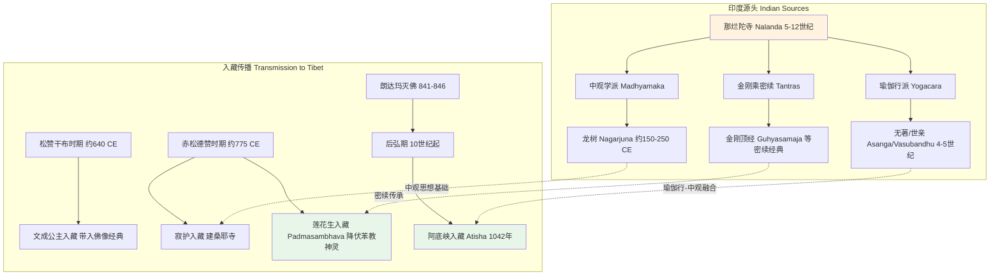

**关键历史节点**：

| 时期 | 时间 | 事件 | 意义 |
|------|------|------|------|
| **前弘期** | 640-841 | 佛教从印度和汉地传入西藏 | 建立桑耶寺（西藏第一座佛寺），创立藏文，翻译佛经 |
| **朗达玛灭佛** | 841-846 | 吐蕃末代赞普朗达玛镇压佛教 | 佛教在西藏政治中心中断约百年，僧侣逃往边远地区 |
| **后弘期上路弘传** | 978起 | 西藏僧侣赴克什米尔、印度求学 | 仁钦桑布（958-1055）翻译大量密续，确立新译密续传统 |
| **后弘期下路弘传** | 978起 | 安多地区佛教向卫藏回流 | 形成不同于上路弘传的律学传承 |
| **阿底峡入藏** | 1042 | 超戒寺（Vikramashila）高僧阿底峡受请入藏 | 撰写《菩提道灯论》，系统化修行次第，奠定噶当派基础 |

### 1.2 四大教派的形成与特点

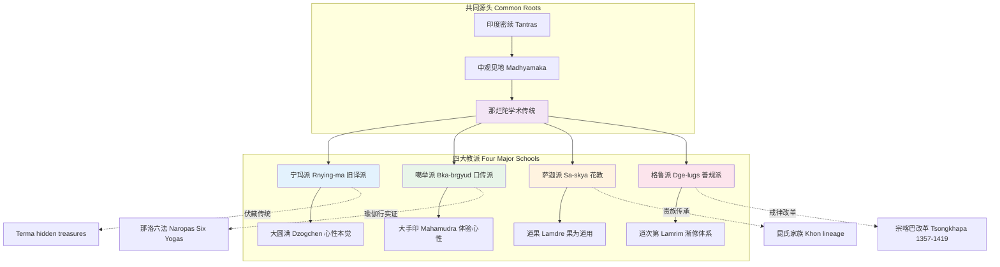

#### 宁玛派（Rnying-ma，旧译派）

宁玛派是藏传佛教最古老的教派，"宁玛"意为"古旧"，指其传承前弘期所译的经典。该派以**大圆满（Dzogchen / Rdzogs-chen）**为最高法门。

- **历史**：可追溯至莲花生大师入藏（8世纪），但作为一个有组织的教派形成于11-12世纪
- **核心人物**：莲花生（Padmasambhava）、无垢友（Vimalamitra）、毗卢遮那（Vairotsana）、龙钦巴（Klong-chen rab-byams, 1308-1364）
- **经典体系**：九乘判教，将佛教修行分为九层次，大圆满为第九乘
- **特色**：伏藏（gTer-ma）传统——相信莲花生等大师将教法封存，待因缘成熟由特定化身发掘

#### 噶举派（Bka-brgyud，口传派）

"噶举"意为"口传"，强调师徒间口耳相传的修持经验。该派以**大手印（Mahamudra）**为精髓。

- **历史**：由玛尔巴（Marpa Lotsawa, 1012-1097）创立，他三次赴印度向那洛巴（Naropa, 1016-1100）学习
- **核心人物**：玛尔巴、密勒日巴（Milarepa, 1052-1135）、冈波巴（Gampopa, 1079-1153）
- **分支**：四大八小支派，以噶玛噶举（Karma Kagyu）最为著名，是藏传佛教中最早建立活佛转世制度的教派（噶玛巴，始于13世纪）
- **特色**：注重实修体验，尤其强调瑜伽行（那洛六法）与大手印的结合

#### 萨迦派（Sa-skya，花教）

因主寺萨迦寺围墙涂有象征文殊、观音、金刚手的红、白、蓝三色条纹，俗称"花教"。以**道果（Lamdre）**教法为核心。

- **历史**：由昆贡却杰布（Khon Konchok Gyalpo, 1034-1102）于1073年建立萨迦寺
- **核心人物**：萨迦五祖——萨钦贡噶宁波（Sachen Kunga Nyingpo, 1092-1158）等
- **经典体系**：《道果》教法源于印度维鲁巴（Virupa）传承，以"显密圆融、果为道用"著称
- **特色**：历史上与元朝皇室关系密切（八思巴，1235-1280），曾执掌西藏政教大权

#### 格鲁派（Dge-lugs，善规派）

"格鲁"意为"善规"，由宗喀巴洛桑扎巴（Tsongkhapa, 1357-1419）创立，是藏传佛教最晚形成但影响最大的教派。

- **历史**：宗喀巴针对当时藏传佛教戒律松弛、密法滥传的现象发起改革，强调"先显后密、显密并重"
- **核心人物**：宗喀巴、贾曹杰（Gyaltsab Je）、克主杰（Khedrup Je，一世班禅）、五世达赖喇嘛（1617-1682）
- **经典体系**：《菩提道次第广论》（Lamrim Chenmo）、《密宗道次第广论》（Ngakrim Chenmo）
- **特色**：严格的学僧制度（格西学位）、严密的修行次第、强调逻辑辩论；政教合一体系的最终确立者

**四教派对比**：

| 维度 | 宁玛派 | 噶举派 | 萨迦派 | 格鲁派 |
|------|--------|--------|--------|--------|
| **创立时间** | 8-12世纪（形成） | 11世纪 | 1073年 | 14世纪末 |
| **最高法门** | 大圆满 | 大手印 | 道果 | 道次第+密续 |
| **见地核心** | 本觉赤裸现前 | 明空双运 | 轮涅无别 | 缘起性空（中观应成） |
| **修持特色** | 顿悟为主，辅以渐修 | 实修瑜伽，注重体验 | 显密圆融，果为道用 | 先显后密，次第严明 |
| **代表学位/制度** | 堪布 | 仁波切/瑜伽士 | 堪布 | 格西（Geshe） |
| **与政权关系** | 相对独立 | 相对独立 | 元代执政 | 清代执政（达赖/班禅体系） |

---

## 二、核心理论框架

### 2.1 心性本觉（Rigpa）与佛性论

藏传佛教各派虽在修持方法上差异显著，但在哲学基础上共享大乘佛教的**佛性论（Tathagatagarbha / 如来藏）**和**空性观（Sunyata）**。宁玛派的大圆满和噶举派的大手印尤其强调**心性本觉（Rigpa）**——一种超越概念造作、本来清净的觉知状态。

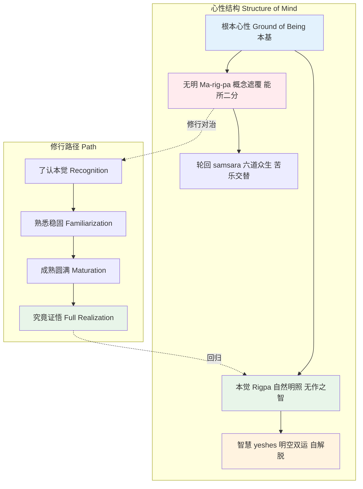

**关键概念辨析**：

| 概念 | 藏文/梵文 | 定义 | 教派侧重 |
|------|----------|------|---------|
| **本觉** | Rigpa | 心性的自然明照状态，超越主客二元，非造作而本具 | 宁玛大圆满 |
| **大手印** | Mahamudra / Phyag-chen | 心的本来面目，明空不二，如大手印般含摄一切 | 噶举派 |
| **心性** | Sems-nyid / Cittata | 心的本质，区别于心的现象（念头、情绪） | 各派共通 |
| **如来藏** | Tathagatagarbha / De-bzhin gshegs-pa'i snying-po | 众生本具的成佛潜能，被烦恼遮蔽但未丧失 | 大乘共通 |
| **明空双运** | gsal-stong zung-jug | 心的明分（觉知）与空分（无自性）不可分离 | 噶举、宁玛 |

> **学术视角**：学者Eva K. Neumaier-Dargyay（1992）指出，藏传佛教的"本觉"概念与印度佛教传统的"心性清净"思想一脉相承，但在西藏高原独特的文化语境中获得了更具"直接体验"色彩的诠释。David Higgins（2012）进一步论证，大圆满传统中的"本觉"概念在13-14世纪经历了系统哲学化，龙钦巴的著述是这一转变的里程碑。

### 2.2 气脉明点（Tsa-Lung-Tigle / Rtsa-Rlung-Thig-le）

"气脉明点"是藏传佛教密续（尤其是无上瑜伽部）特有的身心模型，构成了高级冥想（如那洛六法、圆满次第）的生理学基础。这一体系虽与现代解剖学不相容，但作为一种**精微身（Subtle Body）**理论，在藏传佛教修行传统中占据核心地位。

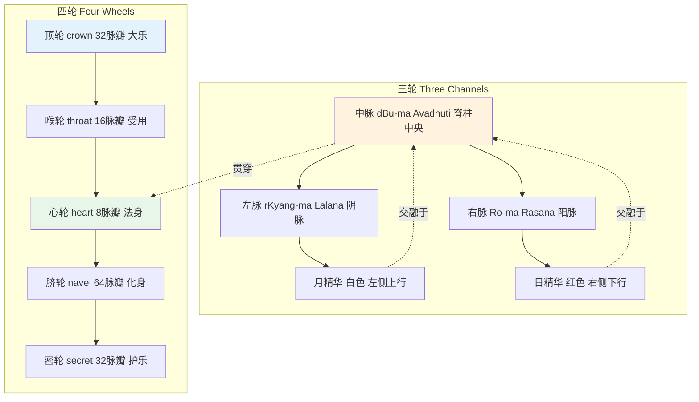

**气（Lung / Prana）**：生命能量，分为五主气（根本气、下行气、平住气、遍行气、上行气）和五支气。在冥想中，通过呼吸控制和观想引导气的流动，被认为可以净化身心障碍。

**脉（Tsa / Nadi）**：精微身的能量通道，主要描述为左、右、中三脉，以及从各轮辐射出的分支脉络。

**明点（Tigle / Bindu）**：精华滴，分为白色明点（父精，主要位于顶轮）和红色明点（母血，主要位于脐轮）。在高级密续修持中，明点的升降与"四喜"体验密切相关。

**与现代科学的对话**：

| 气脉明点概念 | 现代可能对应 | 科学评估 |
|-------------|-------------|---------|
| 气（Lung） | 自主神经系统活动、血流动力学、神经冲动传导 | 功能层面有间接对应，但具体描述（如五主气的功能分工）缺乏解剖学依据 |
| 中脉 | 脊髓/中枢神经系统 | 位置大致对应，但"脉"的精微性质无法被现有仪器检测 |
| 轮（Chakra） | 神经丛（如心轮-心神经丛、脐轮-腹腔神经丛） | 位置有粗略对应，但脉瓣数、颜色等描述属象征系统 |
| 明点 | 内分泌激素（如褪黑素、性激素） | 仅为推测性类比，缺乏实证研究 |

> **学术观点**：医学人类学家Geoffrey Samuel（2008）在其经典著作《藏传佛教的创立》中提出，气脉明点体系不应被简单视为"伪科学"，而应理解为一种**具身化的修行技术（embodied technology）**——它提供了一套可被操作的内在身体地图，使修行者能够系统性地探索意识与身体的关系。神经科学家Wolf Singer也指出，这类传统模型可能在无意中促进了某些可产生可测量神经效应的注意训练模式。

### 2.3 化身/报身/法身的三重身体观

藏传佛教继承了印度大乘佛教的**三身（Trikaya / sKu-gsum）**理论，并在密续传统中发展出更复杂的身体层级体系。

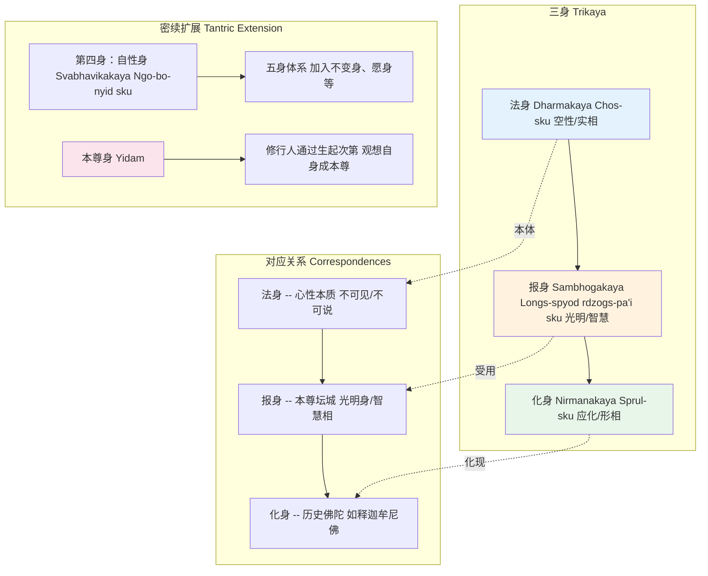

**三身理论的修行意义**：

| 身 | 本质 | 修行者如何关联 | 观想修持 |
|---|------|--------------|---------|
| **法身** | 空性，超越一切相 | 直接体认心性本空 | 大圆满/大手印的"无修"状态 |
| **报身** | 智慧光明，五佛五智 | 观想本尊坛城，净化五蕴 | 生起次第中的本尊瑜伽 |
| **化身** | 为度众生而示现的形相 | 祈请上师、本尊加持 | 上师相应法（Guru Yoga） |

在无上瑜伽部中，三身与**三脉四轮**、**四喜四空**有更复杂的对应，构成了生起次第与圆满次第修持的理论骨架。

---

## 三、主要冥想体系

藏传佛教的冥想体系丰富多样，以下介绍五大核心传统：

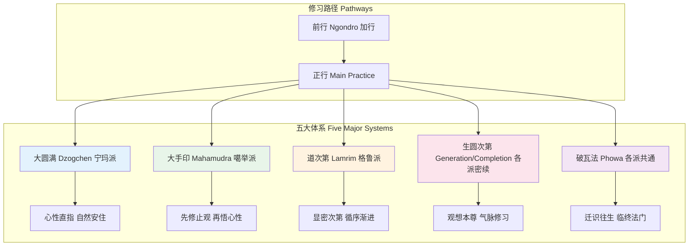

### 3.1 大圆满（Dzogchen / Rdzogs-chen）

大圆满是宁玛派的最高法门，"大圆满"意为"最圆满的境界"或"一切圆满"，强调**本觉（Rigpa）**的赤裸现前，不依赖渐次修证。

**核心特点**：

- **见地**：心性本来圆满，不假修成。轮回与涅槃的本质并无不同，差别仅在于是否"认取"本觉
- **修法**：以"立断（Trechok / Khregs-chod）"和"顿超（Togal / Thod-rgal）"为两大核心
  - **立断**：通过上师的直接指示，当下认取心性，断除对概念的执取
  - **顿超**：在认取本觉的基础上，通过光明修持（如目视虚空）使明相自然显现
- **前行要求**：传统上要求完成四共加行、五不共加行（各十万遍）后方可接受心性直指

**学术评价**：

Sam van Schaik（2004）在其对敦煌大圆满文献的研究中指出，大圆满传统在早期（8-10世纪）更接近一种**禅定解脱论**，与禅宗有深刻共鸣。直至11-14世纪，才逐渐形成独立的哲学体系和制度化的传承。Francis V. Tiso（2016）的跨文化研究表明，大圆满修行中报告的"光体验"与濒死体验、神经学中的光幻视现象存在可比较性，但修行者将其诠释为觉悟征兆而非生理现象。

### 3.2 大手印（Mahamudra / Phyag-chen）

大手印是噶举派的核心法门，"大手印"字面意为"大印"或"大符号"，象征心的本来面貌如印记般不可磨灭，又含摄一切法如大印般无所不包。

**核心特点**：

- **见地**：心性的本质是"明空双运"——既非纯粹的虚无（断边），也非实存的自性（常边）
- **修法**：
  1. **共道大手印**：先修止（Shamatha）观（Vipashyana），在此基础上直指心性
  2. **不共大手印**：直接依托那洛六法等无上瑜伽的生起圆满次第，以气脉体验为契机悟入心性
- **次第体系**：冈波巴在《解脱庄严论》中系统化了大手印的修行次第，从凡夫到佛果分为多个阶段

**与禅宗的比较**：

| 维度 | 大手印 | 禅宗 |
|------|--------|------|
| **历史渊源** | 印度那洛巴-帝洛巴传承 | 印度菩提达摩-慧可传承 |
| **核心术语** | 明空双运、本觉 | 明心见性、顿悟 |
| **修持方法** | 强调上师口传、有系统前行 | 公案、话头、默照 |
| **与密续关系** | 深融无上瑜伽密续 | 基本排斥密续（汉传） |
| **制度特征** | 活佛转世、瑜伽士传统 | 祖师传承、丛林制度 |

> **学者观点**：学者Roger R. Jackson（2019）认为，大手印传统在印度佛教晚期（10-11世纪）已经形成相对系统的"体验心性"方法论，这一传统在西藏被进一步丰富和制度化。Robert Thurman则将大手印描述为"用金刚乘工具达成禅宗目标"的尝试。

### 3.3 道次第（Lamrim）

道次第是格鲁派的核心修持体系，由阿底峡《菩提道灯论》奠基，经宗喀巴《菩提道次第广论》发扬光大。"道次第"意为"通往觉悟之路的阶段"。

**核心结构**：

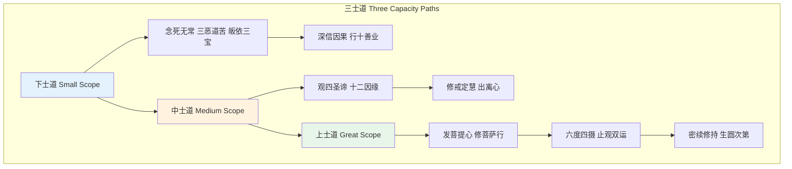

**修行次第详解**：

| 阶段 | 核心修持 | 目标 |
|------|---------|------|
| **依止善知识** | 观察上师德相、培养净信 | 建立正确的师徒关系 |
| **下士道** | 念死、念三恶道苦、皈依、因果 | 生起希求后世安乐的意愿 |
| **中士道** | 四谛、十二因缘、出离心 | 生起解脱轮回的意愿 |
| **上士道-发心** | 七支因果、自他相换发菩提心 | 生起为利众生愿成佛的大愿 |
| **上士道-六度** | 布施、持戒、忍辱、精进、禅定、般若 | 积累福慧资粮 |
| **上士道-止观** | 修止（Shamatha）、修观（Vipashyana） | 获得定慧，证悟空性 |
| **密续道** | 接受灌顶、修持生圆次第 | 即身成佛（无上瑜伽目标） |

**格鲁派的特色**：道次第强调**理性的次第性**——在接触密法之前，必须先完成显教的系统学习和实修。这与宁玛、噶举等派允许"利根者"直接修学大圆满或大手印形成对比。

### 3.4 生起次第与圆满次第（Kyerim / Dzogrim）

生起次第（bsKyed-rim）与圆满次第（rDzogs-rim）是无上瑜伽部密续的核心修持体系，为各教派所共享（尽管具体传承不同）。

**生起次第**：

- **核心**：通过观想将自身、处所、眷属转化为本尊、净土、圣众
- **目的**：净化凡夫的执取习气，建立佛的觉悟身相
- **五相成身观**：从空性中依次观想种子字、法器、本尊身相、坐处、眷属
- **日常修持**：多数格鲁派僧人每日进行**上师瑜伽**和**本尊修持**（如胜乐金刚、大威德金刚、密集金刚——格鲁派三大本尊）

**圆满次第**：

- **核心**：不依赖外在观想，直接修持气脉明点，引生内在的四喜四空体验
- **方法**：包括宝瓶气（Vase Breathing）、拙火定（Tummo / gTum-mo）、光明梦（Dream Yoga）、幻身（Illusory Body）、中阴（Bardo）、破瓦（Phowa）——合称**那洛六法**（Naropa's Six Yogas）
- **目标**：将凡夫的粗重身心转化为佛的虹光身（Rainbow Body）或光明身

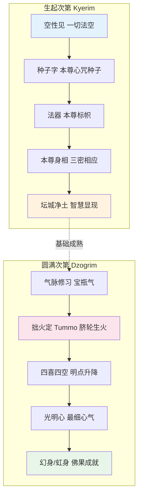

### 3.5 破瓦法（Phowa / 'Pho-ba）

破瓦法意为"迁识"或"consciousness transference"，是一种通过特定技术将意识从临终肉身迁出、投入净土或投生善道的法门。

**修持要点**：

- **观想**：观想自身为本尊，中脉顶端有本尊种子字，通过呼气将意识上冲顶门，投入阿弥陀佛或本尊的心间
- **征兆**：熟练者能在头顶梵穴处出现脓血或流出黄水（"开顶"），被视为成功的征兆
- **应用**：
  - **生前修**：日常修持，为临终做准备
  - **临终用**：自己或帮助他人临终时运用
  - **超度用**：为亡者修法，助其神识往生

**学术讨论**：

破瓦法是藏传佛教中最具争议性的法门之一。从宗教学角度，学者研究其对死亡焦虑的心理功能；从科学角度，意识的"迁移"无法用现有神经科学验证。人类学家对"开顶"现象的报道进行了记录，但对其机理持保留态度。对于心理健康从业者，了解破瓦法有助于理解藏传佛教信众的死亡观和临终关怀需求。

---

## 四、核心修习技术

### 4.1 观想（Visualization）

观想是藏传佛教冥想中最具特色的技术之一。修行者通过意念构建本尊身相、坛城、种子字等形象，达到净化习气、集中注意、培养虔诚的目的。

**观想的心理机制**：

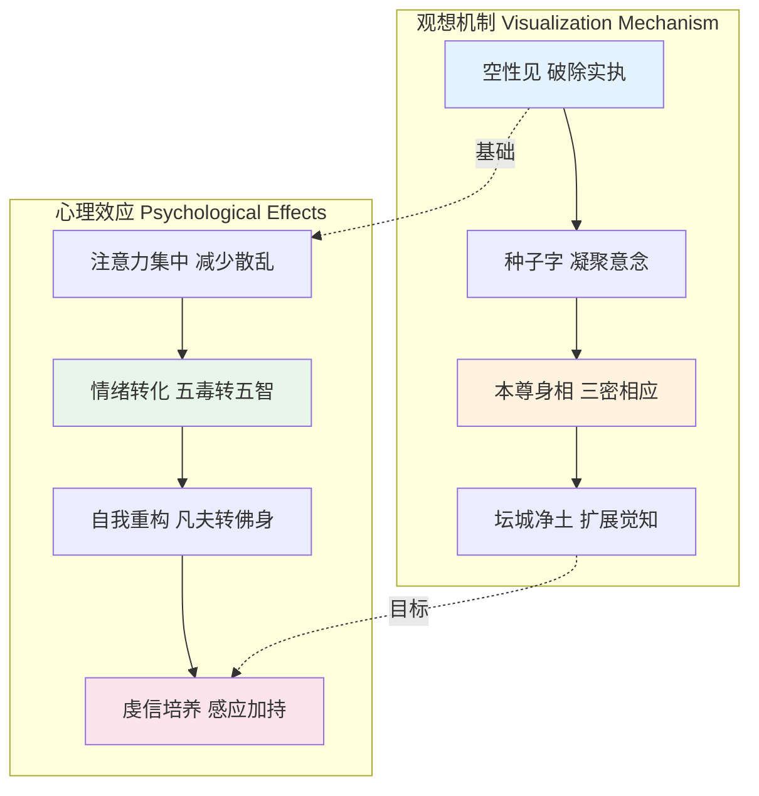

**观想与认知科学**：

神经科学家Antonio Damasio的情绪理论指出，"躯体标记"（somatic markers）在认知中扮演关键角色。藏传佛教的观想技术可能正是通过**具身化的意象（embodied imagery）**来重塑情绪反应模式。2014年一项fMRI研究发现，长期进行本尊观想的修行者在执行观想任务时，其大脑默认模式网络（DMN）的活动模式发生了显著改变（Holenstein et al., 2014）。

**不同阶段的观想要求**：

| 阶段 | 清晰度要求 | 稳定度要求 | 时间要求 |
|------|-----------|-----------|---------|
| **初学** | 大致轮廓 | 数秒不散 | 5-10分钟/座 |
| **中级** | 基本特征清晰 | 数分钟稳定 | 15-20分钟/座 |
| **高级** | 如真实般明晰 | 整座不散 | 30-60分钟/座 |
| **成就** | 梦中亦能观想 | 日常行住皆在定中 | 持续不间断 |

### 4.2 持咒（Mantra Recitation）

咒语（Mantra / sNgags）是藏传佛教修行的核心要素。咒语并非普通的祈祷文，而被认为是**佛的语加持**——特定的音声振动与本尊的智慧相应。

**主要咒语及含义**：

| 咒语 | 来源 | 含义 | 应用 |
|------|------|------|------|
| **嗡嘛呢叭咪吽** | 观世音菩萨 | "具足莲花中的珍宝"——象征慈悲与智慧 | 最广为流传的藏传咒语，日常持诵、转经筒 |
| **嗡阿吽** | 通用种子字 | 身口意三密的总摄 | 几乎所有修持的前行净化 |
| **嗡班扎萨埵吽** | 金刚萨埵 | 金刚萨埵心咒，主清净业障 | 忏悔修持、百字明 |
| **嗡嘛呢叭美吽舍** | 十一面观音 | 观音化身的心咒 | 大悲观音法 |
| **嗡阿咩吽瓦舍贺** | 作明佛母 | 怀爱本尊 | 关系修复、人缘（争议性应用） |

**持咒的科学观察**：

声音振动对神经系统的影响已有初步研究。重复的咒语持诵可以降低交感神经活动、增强副交感张力，类似于其他形式的**节律性吟诵（chanting）**的生理效应。牛津大学研究者Tomasino等（2014）发现，持咒冥想激活的脑区与正念冥想有重叠也有差异——持咒可能更依赖语言网络和听觉皮层。

### 4.3 呼吸法（Pranayama / sRog-rTsol）

藏传佛教的呼吸法主要出现在无上瑜伽的圆满次第中，与印度哈达瑜伽的调息有渊源关系但目的不同——藏传呼吸法服务于气脉控制和明点运行，而非单纯的身体健康。

**主要呼吸技术**：

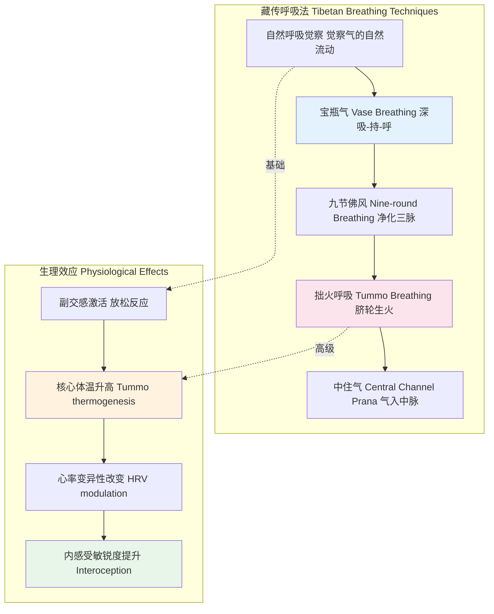

**宝瓶气（Vase Breathing / bUm-pa-can）**：

1. 深吸气，同时腹部微微外鼓
2. 吸气后吞咽，将气"压"入腹腔
3. 屏息持气，同时收缩盆底肌和腹肌
4. 缓慢呼气，同时放松

> **注意**：宝瓶气属于高级呼吸技术，未经上师指导自行练习可能导致头晕、血压波动等不良反应。现代研究者建议，此类练习应在有经验的指导下循序渐进。

### 4.4 本尊瑜伽（Deity Yoga / Lha'i rNal-'byor）

本尊瑜伽是藏传佛教密续修持的核心，"本尊"（Yidam / Yi-dam）并非外在的崇拜对象，而是修行者自心本具的觉悟品质的**象征化显现**。

**本尊的分类与象征**：

| 类别 | 代表本尊 | 象征意义 | 对治烦恼 |
|------|---------|---------|---------|
| **寂静本尊** | 阿弥陀佛、观音菩萨、绿度母 | 慈悲、智慧、救度 | 贪、嗔、痴 |
| **忿怒本尊** | 大威德金刚、马头明王 | 智慧的凶猛面向 | 愚痴的根本无明 |
| **双运本尊** | 胜乐金刚、时轮金刚 | 方便与智慧的合一 | 二元对立 |
| **护法** | 玛哈嘎拉（大黑天） | 保护正法、降伏魔障 | 障碍与干扰 |

**本尊瑜伽的心理学解读**：

荣格学派分析师James Hillman（1975）和后来的研究者提出，藏传佛教的本尊体系可被视为一种**原型心理学的实践应用**——忿怒本尊对应阴影（Shadow）的整合，双运本尊对应阿尼玛/阿尼姆斯（Anima/Animus）的融合。然而，藏传佛教自身并不接受这种还原论解读，它坚持本尊的**真实性（ontological reality）**——本尊不是心理投射，而是觉悟境界的真实显现。

---

## 五、与现代科学的交汇

### 5.1 神经科学研究概览

自20世纪70年代以来，藏传佛教冥想成为认知神经科学和临床心理学的重要研究对象。研究者主要通过以下途径开展研究：

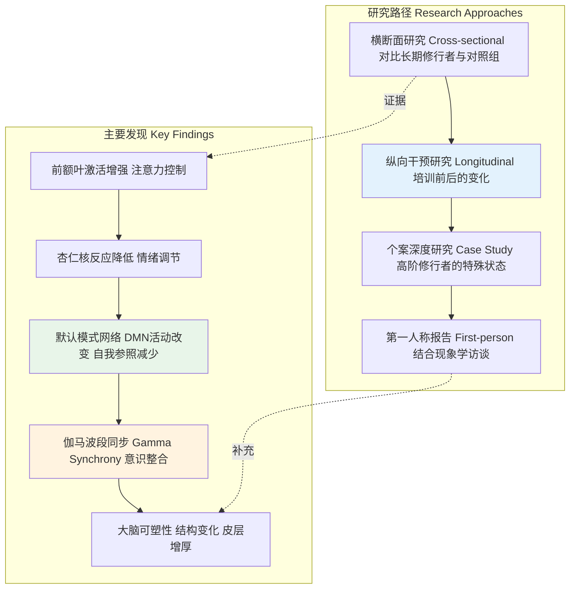

### 5.2 Richard Davidson与威斯康星研究

Richard Davidson（威斯康星大学麦迪逊分校）是藏传佛教冥想神经科学研究的先驱。他自1992年起与达赖喇嘛合作，系统研究藏传僧侣的大脑活动。

**关键实验**：

| 年份 | 研究内容 | 主要发现 | 意义 |
|------|---------|---------|------|
| **2004** | 长期冥想者的Gamma同步研究 | 高阶修行者在禅修时产生极高频率的Gamma波（25-42 Hz）同步，幅度远超对照组 | 首次揭示冥想可能引起大规模神经同步 |
| **2016** | 冥想训练对注意瞬脱的影响 | 3个月密集禅修训练后，受试者在注意瞬脱任务中表现提升，脑电P3b成分改变 | 证明冥想可增强注意力资源分配 |
| **2018** | 慈悲冥想的神经机制 | 慈悲冥想（Tonglen）激活与积极情绪、社会连接相关的脑区 | 为慈悲训练的心理机制提供证据 |

> **Davidson的评价**："藏传佛教提供了人类历史上最为系统化的注意力和情绪调节训练方法。这些方法不应被神秘化，但也不应被简单还原为放松技术。"

### 5.3 Matthieu Ricard："世界上最快乐的人"

法国出生的藏传佛教僧侣Matthieu Ricard（生于1946年）因参与多项神经科学研究而被称为"世界上最快乐的人"——这一称号源于2004年一项研究中，他在幸福感相关脑区（左侧前额叶）的活动水平在所有受试者中最高。

**Ricard的研究贡献**：

- **长期禅修者的大脑特征**：作为拥有超过10,000小时禅修经验的修行者，Ricard的大脑数据显示出显著的前额叶-杏仁核连接增强
- **慈悲冥想的倡导者**：积极推广"慈悲冥想"（Tonglen）作为改善心理健康的世俗化练习
- **《利他主义的大脑》**：将神经科学发现与佛教伦理结合，论证利他主义有神经生物学基础

**争议与反思**：

"世界上最快乐的人"这一标签后来被Ricard本人和研究者澄清为媒体简化。Antoine Lutz和Richard Davidson在后续论文中强调，单个个案不能推广为普遍结论，且"快乐"的神经指标定义仍有争议。此外，Ricard作为僧侣的生活方式（无经济压力、充足时间修行）与普通人的日常环境截然不同，这限制了研究结果的普适性。

### 5.4 其他重要研究

| 研究者/机构 | 研究主题 | 主要发现 |
|------------|---------|---------|
| **Sara Lazar（哈佛）** | 冥想与大脑结构 | 长期冥想者岛叶、感觉皮层、前额叶灰质增厚 |
| **Clifford Saron（UC Davis）** | 沙弥修炼项目（Shamatha Project） | 3个月闭关冥想改善注意力、情绪调节和心理幸福感 |
| **Wendy Hasenkamp** | 注意力漫游的神经机制 | 识别出冥想中"觉察-转移-重新专注"的神经回路 |
| **B. Alan Wallace** | 心识本质的跨学科对话 | 推动佛教哲学与认知科学的对话，强调第一人称方法的必要性 |
| **Tanya Singer（马克斯·普朗克）** | 社会情感训练 | 不同冥想类型（正念、慈悲、观息）对大脑和社会行为有不同影响 |

### 5.5 科学研究的局限性与未来方向

| 局限 | 说明 | 改进方向 |
|------|------|---------|
| **样本偏差** | 多数研究以男性僧侣为对象，缺乏女性、在家众、不同教派的数据 | 扩大样本代表性 |
| **因果推断困难** | 横断面研究无法排除修行者本身特质的差异 | 更多随机对照试验（RCT） |
| **文化语境剥离** | 将密法冥想从宗教框架中抽离可能导致效果改变 | 研究不同语境下的效果差异 |
| **测量工具局限** | 现有量表可能无法捕捉高阶修行的体验维度 | 发展更精细的现象学评估工具 |
| **发表偏差** | 阳性结果更容易发表 | 注册研究、数据共享 |

---

## 六、西方传播与适应

### 6.1 藏传佛教在西方的传播历史

**关键人物与机构**：

| 人物/机构 | 时间 | 贡献 |
|----------|------|------|
| **Alexandra David-Neel** | 1924 | 首位进入西藏的西方女性，著作激发西方对藏传佛教的兴趣 |
| **Chogyam Trungpa** | 1970-1987 | 建立那洛巴大学，将藏传冥想与西方心理学结合 |
| **Tarthang Tulku** | 1969起 | 建立西藏宁玛派中心，推动制度化 |
| **Namkhai Norbu** | 1980s起 | 建立大圆满社区，教授自解脱法 |
| **Sogyal Rinpoche** | 1980s-2017 | 《西藏生死书》成为全球畅销书 |
| **Shambhala** | 至今 | 在全球拥有超过200个中心 |
| **FPMT** | 1975至今 | 由Lama Yeshe和Lama Zopa创立 |

### 6.2 适应性调整

藏传佛教在西方的传播伴随着一系列去语境化和再语境化的过程：

| 调整维度 | 传统藏传佛教 | 西方适应形式 | 评价 |
|---------|------------|------------|------|
| **宗教框架** | 皈依三宝、上师制度、灌顶要求 | 世俗化冥想课程、正念训练 | 保留了技术，弱化了宗教承诺 |
| **修行时间** | 终生修行、长期闭关 | 8周MBSR课程、周末工作坊 | 适应现代生活节奏，但深度受限 |
| **师生关系** | 终身依止、绝对虔信 | 付费课程、平等交流 | 避免了权力滥用，但可能削弱传承深度 |
| **语言** | 藏语咒语、梵文经典 | 英语/本地语教学 | 扩大了受众，但某些概念难以精确翻译 |
| **目标** | 即身成佛、利益众生 | 减压、提升幸福感 | 短期效益明确，但可能偏离佛教终极目标 |

### 6.3 争议与批评

**1. 上师权力滥用问题**

多起备受瞩目的丑闻动摇了藏传佛教在西方的声誉：

- **Sogyal Rinpoche**：2017年被多名学生指控身体、情感和性虐待，最终辞去Rigpa组织职务
- **Chogyam Trungpa**：虽有巨大的文化贡献，但其生活方式引发持续争议
- **Shambhala International**：2018年其领袖Sakyong Mipham被指控性行为不端

社会学家和宗教学者的研究指出，藏传佛教的上师虔信制度在西方语境中可能被放大为不健康的权力关系，尤其当学生将东方上师浪漫化为绝对智慧化身时。

**2. 香格里拉主义**

英国作家James Hilton于1933年小说创造了香格里拉这一理想化东方形象。批评者指出，西方对藏传佛教的迷恋往往基于东方主义的投射——将西藏想象为一片未被现代性污染的灵性净土，而忽视了其复杂的历史、政治和社会现实。

**3. 文化挪用与商业化**

- 藏传冥想元素的商品化引发文化敏感性讨论
- 西方冥想教师未经授权教授密法内容，被传统传承视为破戒行为
- 部分藏人批评西方选择性消费藏传佛教

**4. 政治争议**

达赖喇嘛作为藏传佛教最重要的精神领袖，其政治立场与宗教传播不可避免地交织在一起。

---

## 七、实践指引与注意事项

### 7.1 上师制度的重要性与风险

藏传佛教传统中，上师（Lama / Bla-ma）是修行的核心向导。宗喀巴在《菩提道次第广论》中强调，正确的上师关系是修行成就的必要条件。

**传统上师制度的要点**：

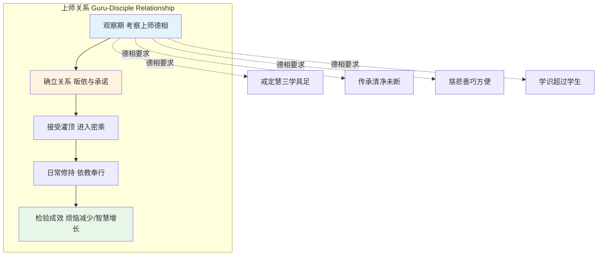

**现代风险评估**：

| 风险信号 | 说明 | 应对建议 |
|---------|------|---------|
| **要求绝对服从** | 禁止质疑、批判性思考 | 健康的师徒关系应允许理性探讨 |
| **财务不透明** | 大额捐赠要求、个人财产控制 | 正规传承有财务监督机制 |
| **性与权力的混淆** | 以"密法"为名进行性行为 | 传统密续严禁未经灌顶的性行为 |
| **社会隔离** | 要求切断家庭、朋友联系 | 健康修行应改善而非破坏社会关系 |
| **速成承诺** | 保证快速开悟或神通 | 佛教传统强调循序渐进 |

> **专业建议**：心理学家Catherine Ingram和Jon Atack等研究者建议，对任何要求绝对服从、财务控制或性关系的"灵性导师"保持高度警惕。这些特征符合邪教（cult）的心理操控模式。

### 7.2 文化尊重与伦理考量

**对藏传佛教信众的尊重**：

- **圣物处理**：佛经、佛像、唐卡不应置于低处、踩踏或作为装饰物随意使用
- **转经方向**：转经筒、绕寺应顺时针方向（苯教为逆时针，需区分）
- **礼拜礼仪**：进入佛堂脱帽、不指向佛像用手指、不背对佛像
- **语言敏感性**："喇嘛"是尊称，不应用作普通称呼；"活佛"是汉语翻译，藏语称"仁波切"或"祖古"

**学术研究的伦理**：

研究者Francoise Pommaret和Donald Lopez Jr.指出，西方学术界对藏传佛教的研究应保持**文化相对主义**的立场——既不将其浪漫化，也不以科学主义将其还原为"原始迷信"。

### 7.3 安全注意事项

**生理安全**：

| 练习类型 | 潜在风险 | 预防措施 |
|---------|---------|---------|
| **宝瓶气/拙火定** | 头晕、高血压、过度换气 | 高血压、心脏病患者禁忌；需有经验者指导 |
| **长时间静坐** | 关节损伤、深静脉血栓 | 每45-60分钟起身活动；保持正确坐姿 |
| **断食/苦行** | 营养不良、电解质紊乱 | 糖尿病患者禁忌；孕妇、老人需医生许可 |
| **观想密集修持** | 解离体验、现实感丧失 | 有精神病史者应在专业人员监督下进行 |

**心理安全**：

- **精神病史**：精神分裂症、双相情感障碍、严重抑郁症患者不宜自行进行高级观想或气脉修持
- **创伤史**：观想中可能出现的恐怖形象（忿怒本尊）可能触发创伤后应激反应
- **解离风险**：某些冥想技术可能诱发解离状态，需有经验者辨别"正常的冥想体验"与"病理性的解离"

> **临床建议**：心理学家Willoughby Britton（Brown University）的"困难体验研究"（Varieties of Contemplative Experience）发现，即使是"温和的"冥想练习也可能引发焦虑、恐惧、解离等不良反应。她建议：
> 1. 有精神健康病史者在开始冥想前应咨询精神科医生
> 2. 出现持续性负面体验时应暂停练习并寻求专业帮助
> 3. 冥想教师应接受基本的心理健康培训

### 7.4 修行次第建议

**重要提醒**：

- 大圆满和大手印虽被描述为"顿悟"法门，但传统上要求长期的前行准备（通常3-5年以上）
- 密续修持（尤其是无上瑜伽）必须在接受合格上师灌顶后方可进行，自行阅读书籍并尝试修持在传统上被视为严重过失
- 对绝大多数现代修行者而言，**基础的止观修持（Shamatha-Vipashyana）**已足以带来显著的身心健康效益

---

## 八、延伸阅读

### 学术著作

| 作者 | 书名 | 出版社 | 评价 |
|------|------|--------|------|
| **Sam van Schaik** | *Tibetan Zen: Discovering a Lost Tradition* | Shambhala, 2015 | 敦煌文献中大圆满与禅宗关系的研究 |
| **Geoffrey Samuel** | *The Origins of Yoga and Tantra* | Cambridge, 2008 | 从人类学角度理解印度-藏传瑜伽传统 |
| **Roger R. Jackson** | *Mind Seeing Mind: Mahamudra and the Geluk Tradition of Tibetan Buddhism* | Wisdom, 2019 | 大手印传统的系统学术研究 |
| **David Higgins** | *The Philosophical Foundations of Classical rDzogs chen in Tibet* | Wiener, 2012 | 大圆满哲学的历史演变 |
| **Janet Gyatso** | *Apparitions of the Self: The Secret Autobiographies of a Tibetan Visionary* | Princeton, 1998 | 密勒日巴传记的文学与宗教分析 |
| **Donald S. Lopez Jr.** | *Prisoners of Shangri-La* | Chicago, 1998 | 对西方西藏想象的批判性分析 |
| **Richard J. Davidson & Daniel Goleman** | *Altered Traits: Science Reveals How Meditation Changes Your Mind, Brain, and Body* | Avery, 2017 | 冥想科学研究的综合综述 |
| **B. Alan Wallace** | *The Attention Revolution: Unlocking the Power of the Focused Mind* | Wisdom, 2006 | 从藏传视角理解注意力训练 |

### 经典文献（译本）

| 文献 | 译者 | 出版社 | 说明 |
|------|------|--------|------|
| **《菩提道次第广论》** | 法尊法师译 | 多种版本 | 宗喀巴道次第系统的最完整阐述 |
| **《解脱庄严论》** | 陈玉蛟译 | 法尔 | 冈波巴的大手印修行次第 |
| **《西藏生死书》** | 郑振煌译 | 张老师文化 | Sogyal Rinpoche的普及著作，争议与影响力并存 |
| **《大圆满》** |  various |  various | 龙钦巴、吉美林巴等祖师的著述有多种英译本 |

### 期刊论文与研究报告

| 作者 | 论文/报告 | 发表处 | 主题 |
|------|----------|--------|------|
| **Lutz et al.** | "Long-term meditators self-induce high-amplitude gamma synchrony during mental practice" | *PNAS*, 2004 | Gamma同步的开创性研究 |
| **Lazar et al.** | "Meditation experience is associated with increased cortical thickness" | *Neuroreport*, 2005 | 冥想与大脑结构可塑性 |
| **Saron et al.** | The Shamatha Project publications | multiple journals, 2010s | 3个月密集禅修的系统性研究 |
| **Britton et al.** | "The varieties of contemplative experience" | *PLoS ONE*, 2021 | 冥想的不良反应研究 |
| **Hasenkamp et al.** | "Mind wandering and attention during focused meditation" | *NeuroImage*, 2012 | 注意力漫游的神经机制 |

### 网络资源

- **84000**: 致力于将藏传佛教经典翻译为现代语言（84000.co）
- **Tibetan Buddhist Resource Center (TBRC)**: 藏文文献数字档案（tbrc.org）
- **Mind & Life Institute**: 推动科学与藏传佛教对话的机构（mindandlife.org）
- **Berzin Archives**: Dr. Alexander Berzin的藏传佛教教学资料（studybuddhism.com）

---

> **关于本文件**：本概述旨在为读者提供一个客观、全面的藏传佛教冥想知识体系导览。文中包含的修持建议仅供一般性了解，**不构成修行指导**。有意深入实践者，应在合格的传承上师指导下进行。
>
> **反馈与更新**：如发现事实错误或过时信息，欢迎通过项目渠道提交修正建议。
>
> **最后更新**：2026-05
