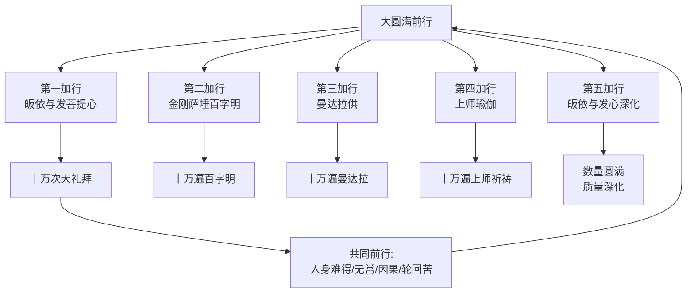
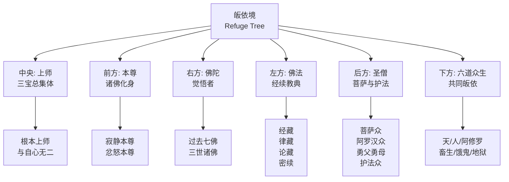
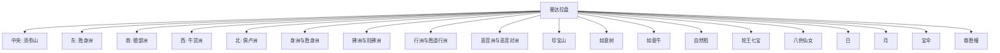
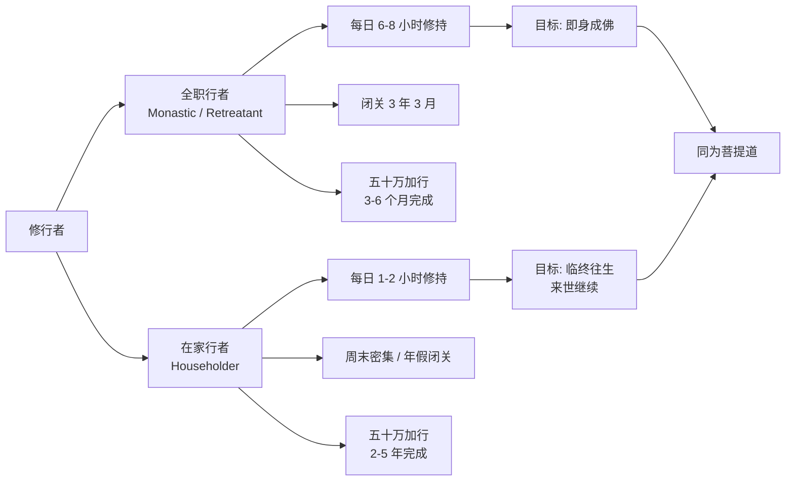

---

title: "大圆满前行五加行实操指南"
description: "大圆满前行五加行实操指南的详细解析与实践指南"
category: "心智与心理学 > 冥想 > Tibetan Meditation"
tags: ["anxiety", "attachment", "dzogchen"]
last_updated: "2026-05"
difficulty: "intermediate"
reading_level: "intermediate"
estimated_read_time: "10min"
intent_queries:
  - "什么是大圆满前行五加行实操指南"
  - "大圆满前行五加行实操指南的核心概念"
  - "大圆满前行五加行实操指南的方法与实践"
trigger_keywords: ["act", "anxiety", "attachment", "behavioral"]
cross_refs:
  - path: "01-Wisdom-Traditions/religions/buddhism/vasana/Vasana_Clinical_Applications.md"
    relation: "anxiety/attachment/buddhism"
  - path: "01-Wisdom-Traditions/religions/wisdom-traditions/Wisdom_Mahamudra_Great_Seal.md"
    relation: "anxiety/attachment/buddhism"
  - path: "01-Wisdom-Traditions/yoga/Yoga_Meditation_Dharana_Dhyana.md"
    relation: "anxiety/attachment/buddhism"
  - path: "04-Humanities-Arts/media/music/music-therapy/Sacred_Music_Therapy.md"
    relation: "anxiety/attachment/buddhism"
  - path: "05-Praxis-Growth/personal-development/practice/Daily_Advanced_Practices.md"
    relation: "anxiety/attachment/buddhism"

---
# 大圆满前行五加行实操指南

> **最后更新**: 2026-05

---

## 目录

1. [前行五加行的完整框架](#1-前行五加行的完整框架)
2. [第一加行：皈依与发菩提心](#2-第一加行皈依与发菩提心)
3. [第二加行：金刚萨埵百字明](#3-第二加行金刚萨埵百字明)
4. [第三加行：曼达拉供](#4-第三加行曼达拉供)
5. [第五加行：上师瑜伽](#5-第五加行上师瑜伽)
6. [前行的现代适应性调整](#6-前行的现代适应性调整)

---

## 1. 前行五加行的完整框架

前行（Ngondro / sNgon Gro）是藏传佛教（特别是宁玛派、噶举派、萨迦派、格鲁派）进入正行（本尊瑜伽、大圆满、大手印）之前必须完成的基础修持。其总量通常为各加行十万遍（共约五十万遍），故称**五十万加行**。

**五加行总览表**

| 加行 | 藏文 | 核心内容 | 传统数量 | 关键法器 | 核心转化 |
|------|------|---------|---------|---------|---------|
| **第一加行** | Skyabs gro sems bskyed | 皈依境观想 + 大礼拜 + 发菩提心 | 10万礼拜 + 10万发心偈 | 大礼拜垫 | 从自我中心转向三宝依止 |
| **第二加行** | rDo rje sems dpa | 金刚萨埵观想 + 百字明咒 + 忏悔净化 | 10万遍百字明 | 念珠（108颗） | 从业障覆盖转向本净光明 |
| **第三加行** | MaNDal bskyil | 三十七堆曼达拉供 + 供养偈 | 10万遍曼达拉 + 10万水供 | 曼达拉盘 + 宝石/谷物 | 从吝啬贪着转向慷慨布施 |
| **第四加行** | Bla ma'i rnal byor | 上师瑜伽 + 七支祈请 + 灌顶观想 | 10万遍上师心咒 + 祈祷文 | 上师法相 | 从自力努力转向他力加持 |
| **第五加行** | sNgon gro lNa pa | 皈依与发心的深化修持 | 数量补满 + 质量圆满 | 以上全部 | 从数量积累转向心行合一 |

> **注**：不同传承的加行次第和数量略有差异。宁玛派大圆满前行（龙钦宁提传承）通常为上述次序；噶举派大手印前行次序相近；萨迦派和格鲁派各有变体。本指南以宁玛派大圆满前行为主，兼及其他传承。

---

## 2. 第一加行：皈依与发菩提心

### 2.1 皈依的本质

皈依（Sheltering / Taking Refuge）不是加入一个宗教组织，而是**在内心深处确认三宝（佛、法、僧）为最终的依怙和道路**。这是整个佛教修行的基石。

| 皈依对象 | 象征 | 内在对应 | 恐惧所依 |
|---------|------|---------|---------|
| **佛宝** | 导师、觉悟者 | 自性佛、本觉 | 对无明的恐惧 |
| **法宝** | 道路、真理 | 自性法、本净 | 对迷失的恐惧 |
| **僧宝** | 同行善友、传承 | 自性僧、本明 | 对孤独的恐惧 |

### 2.2 皈依境观想

**观想步骤**：
1. **前置**：在自己前方虚空，观想一株巨大的如意树，枝叶繁茂，覆盖整个宇宙
2. **中央主枝**：自己的根本上师坐在狮子座上，是三世诸佛的总集体；上师的形象可以是任何你接受灌顶的具德上师
3. **前方枝**：各种本尊（寂静与忿怒），代表佛的化身
4. **右方枝**：十方三世一切佛陀，以释迦牟尼佛为主尊
5. **左方枝**：一切佛法经续，以经函形象呈现，放射智慧光芒
6. **后方枝**：一切圣僧——菩萨、阿罗汉、勇父勇母、护法
7. **下方**：自己的父亲在右、母亲在左，六道一切众生环绕，共同皈依

### 2.3 十万次大礼拜的实操

| 项目 | 细节 |
|------|------|
| **环境** | 清净、温暖、通风；地面铺大礼拜垫或地毯 |
| **着装** | 宽松柔软；手腕可戴护具防止摩擦 |
| **计数** | 传统用念珠（每108拜为一轮）；现代可用计数器 |
| **呼吸** | 自然呼吸，不刻意控制 |
| **速度** | 初学每分钟 10–15 拜；熟练后 20–30 拜 |
| **总量** | 每日目标：500–1,000 拜；总计 10 万拜约需 3–6 个月 |

**大礼拜的动作分解**：

| 步骤 | 动作 | 观想 | 口诀/心念 |
|------|------|------|----------|
| **1** | 站立合掌于顶 | 清净身业，获得上师身加持 | "皈依上师" |
| **2** | 合掌于喉 | 清净语业，获得上师语加持 | "皈依佛" |
| **3** | 合掌于心 | 清净意业，获得上师意加持 | "皈依法" |
| **4** | 五体投地 | 完全放下自我，皈依僧宝 | "皈依僧" |
| **5** | 起身 | 从三宝处获得加持，起身继续 | 发愿利益众生 |

**身体保护要点**：
| 问题 | 预防 | 对治 |
|------|------|------|
| 手掌摩擦伤 | 戴薄手套或护腕 | 涂抹凡士林；贴创可贴 |
| 膝盖痛 | 使用厚垫；动作放缓 | 改半跪或椅子上的替代礼拜 |
| 腰痛 | 保持核心微收；不塌腰 | 每 108 拜做猫牛式放松 |
| 头晕 | 起身速度放慢；确保通风 | 补充电解质；检查血压 |

### 2.4 发菩提心

发菩提心（Bodhicitta）是发愿为了一切众生的解脱而成就佛果。这是大乘佛教区别于小乘的根本标志。

| 类型 | 名称 | 内涵 |
|------|------|------|
| **愿菩提心** | 发愿行 | "愿一切众生离苦得乐，愿我为此而成佛" |
| **行菩提心** | 实践行 | 以六度万行实际利益众生 |
| **胜义菩提心** | 证量行 | 直接证悟心性与空性无二 |

**发心仪轨**：
1. 观想一切众生在前，特别是自己的怨敌
2. 念三遍："诸佛正法贤圣僧，直至菩提我皈依；我以所修诸善根，为利有情愿成佛"
3. 观想自身化为无量光，融入一切众生，消除其痛苦

---

## 3. 第二加行：金刚萨埵百字明

### 3.1 忏悔与净化的原理

| 层面 | 解释 |
|------|------|
| **业力** | 过去身口意所造的一切行为，在其相续中留下潜在的印记（习气） |
| **障垢** | 这些印记如同乌云遮蔽太阳，阻碍本觉光明的显现 |
| **净化** | 不是"洗掉罪咎"，而是**通过忏悔和观想，让习气自然消融，恢复本净** |
| **四对治力** | 依止力（皈依）、厌患力（后悔）、遮止力（发愿不再造）、对治力（修持） |

### 3.2 金刚萨埵观想

| 要素 | 观想内容 |
|------|---------|
| **本体** | 金刚萨埵（Vajrasattva）为白色本尊，单身坐于月轮之上 |
| **身相** | 一面二臂，右手持五股金刚杵于胸前，左手持金刚铃于腰侧 |
| **服饰** | 天衣、珠宝、璎珞庄严 |
| **位置** | 在自己头顶约一肘高处，面向自己 |
| **核心** | 金刚萨埵的额头、喉间、心间各有种子字：嗡（Om）、阿（Ah）、吽（Hum） |

### 3.3 百字明发音指南

**梵文罗马拼音与近似发音**：

| 音节 | 罗马拼音 | 近似中文音 | 注意事项 |
|------|---------|-----------|---------|
| 嗡 | Om | 嗡（ong） | 闭口共鸣，从腹部升起 |
| 班杂 | Vajra | 万-杂 | "杂"舌尖轻触上颚 |
| 萨埵 | Sattva | 萨-多-哇 | "多"轻读 |
| 萨玛雅 | Samaya | 萨-玛-雅 | 尾音上扬 |
| 玛努巴拉雅 | Manupalaya | 玛-努-巴-拉-雅 | "拉"卷舌 |
| ... | ... | ... | ... |

**完整百字明（简化版）**：
> Om Benza Satto Samaya Manu Palaya Benza Satto Denopa Tita Dido Me Bhawa Suto Khayo Me Bhawa Supo Khayo Me Bhawa Anurakto Me Bhawa Sarwa Siddhi Me Trayatsa Sarwa Karma Sutsa Me Tsittam Shriyam Kuru Hum Ha Ha Ha Ha Ho Bhagawan Sarwa Tata Gata Benza Ma Me Muntsa Benzi Bhawa Maha Samaya Satto Ah

> 汉传近似：嗡班扎萨埵萨玛雅、嘛努巴拉雅、班扎萨埵底诺巴、底叉知桌美巴哇、苏埵卡约美巴哇、苏波卡约美巴哇、阿努惹埵美巴哇、萨哇悉地美扎雅擦、萨哇嘎玛色匝美、则当协央格热吽、哈哈哈哈吙、巴嘎万、萨哇达他嘎达、班扎玛美母杂、班扎巴哇、玛哈萨玛雅萨埵阿

**发音建议**：
- 跟随具德上师的口传录音学习，不要仅凭文字
-  Tibetan 发音与 Sanskrit 发音有差异，跟随你的传承系统
- 关键是**信心和专注**，不是完美的梵文发音

### 3.4 修持步骤

| 步骤 | 内容 | 时长 |
|------|------|------|
| **1** | 皈依发心 | 2 分钟 |
| **2** | 观想金刚萨埵在头顶 | 3 分钟 |
| **3** | 念诵百字明 | 每遍约 30–60 秒；每日目标 21–108 遍 |
| **4** | 观想甘露从金刚萨埵心间流出，冲洗全身，黑气从毛孔排出 | 同步进行 |
| **5** | 金刚萨埵融入自身，自身化为金刚萨埵 | 2 分钟 |
| **6** | 回向 | 1 分钟 |

---

## 4. 第三加行：曼达拉供

### 4.1 曼达拉供的象征意义

曼达拉供（Mandala Offering）是以宇宙中最美好的一切供养三宝，以此对治内心的悭吝与贪着。

| 层面 | 象征 |
|------|------|
| **外曼达拉** | 整个物质宇宙：山河大地、日月星辰、七宝、八吉祥 |
| **内曼达拉** | 自己的身体、财富、眷属、功德 |
| **密曼达拉** | 内在的明点、气脉、本觉光明 |
| **真如曼达拉** | 空性本身，超越一切相的供养 |

### 4.2 三十七堆曼达拉的构建

**三十七堆具体配置**：

| 堆序 | 名称 | 象征 | 放置方位 |
|------|------|------|---------|
| 1 | 须弥山 | 宇宙中心，三千世界之基 | 中央 |
| 2-5 | 四大部洲 | 人类居住的四大洲 | 东南西北 |
| 6-13 | 八小洲 | 四大部洲的附属洲 | 各大部洲两侧 |
| 14 | 珍宝山 | 一切珍宝之山 | 外圈 |
| 15 | 如意树 | 满足一切愿望之树 | 外圈 |
| 16 | 如意牛 | 满足一切所需之牛 | 外圈 |
| 17 | 自然稻 | 不耕而熟之稻米 | 外圈 |
| 18-24 | 轮王七宝 | 金轮宝、神珠宝、玉女宝等 | 外圈 |
| 25-32 | 八供仙女 | 嬉女、鬘女、歌女、舞女、香女、灯女、涂香女、花女 | 外圈 |
| 33 | 日 | 光明、智慧 | 上方 |
| 34 | 月 | 清凉、慈悲 | 上方 |
| 35 | 宝伞 | 庇护 | 最上 |
| 36 | 尊胜幢 | 胜利 | 最上 |
| 37 | 一切妙欲 | 未包含的一切美好 | 遍满虚空 |

**实际操作**：
- 使用铜质或木质曼达拉盘，以手腕内侧摩擦盘面，同时念诵供养偈
- 以宝石、米粒、五谷杂粮代表三十七堆，逐一堆砌
- 每修完一轮（37堆），将供品倒入容器中，象征"舍弃"，再重新开始
- 共修 10 万轮

### 4.3 七堆曼达拉（简化版）

对于初学者或时间有限者，可用七堆曼达拉：
1. 须弥山
2. 四大部洲（合为一堆）
3. 日
4. 月
5. 珍宝
6. 如意树
7. 一切美好

---

## 5. 第五加行：上师瑜伽

### 5.1 上师瑜伽的核心地位

在藏传佛教中，上师瑜伽（Guru Yoga）被认为是最速疾、最殊胜的法门。因为**上师是三宝的总集体、三根本（上师、本尊、护法）的核心**。通过上师瑜伽，行者可以在最短时间内获得最大的加持。

| 上师的面向 | 代表 | 功能 |
|-----------|------|------|
| **外上师** | 人间的具德上师 | 传授法要、指出错误、给予鼓励 |
| **内上师** | 脉轮中的上师瑜伽观想 | 净化气脉、转化能量 |
| **密上师** | 自己心性的本觉 | 究竟的上师从未离开自心 |

### 5.2 七支祈请文

七支祈请文（Seven Line Prayer / Tshig bdun gsol debs）是宁玛派最广为人知的上师祈请文，据说为莲花生大士的伏藏。

| 支 | 内容 | 功能 |
|---|------|------|
| **1** | 顶礼（Homage） |  humbly 祈请上师降临 |
| **2** | 供养（Offering） | 以内外密的一切供养上师 |
| **3** | 忏悔（Confession） | 忏悔违背上师教言的罪业 |
| **4** | 随喜（Rejoicing） | 随喜上师和一切善行的功德 |
| **5** | 请转法轮（Requesting to Teach） | 请上师常住世间，转妙法轮 |
| **6** | 请不入涅槃（Requesting to Remain） | 请上师长久住世，不入涅槃 |
| **7** | 回向（Dedication） | 将功德回向一切众生 |

**七支祈请文（藏音近似）**：
> 吽！邬金由吉努向荡 / 贝玛给萨东波拉 / 雅参乔革助竹涅 / 贝玛炯尼谢思坐 / 达接班晶给伴地 / 基借度柏涅真也 / 格热贝玛思德吽

### 5.3 上师相应法修持

| 步骤 | 内容 | 时长 |
|------|------|------|
| **1** | 皈依发心 | 2 分钟 |
| **2** | 观想上师在自己头顶 | 5 分钟 |
| **3** | 念诵七支祈请文 | 7–21 遍 |
| **4** | 念诵上师心咒 | 108–1,000 遍 |
| **5** | 观想上师心间放光，融入自己 | 3 分钟 |
| **6** | 上师化光融入自心，自心上师无二 | 5 分钟 |
| **7** | 安住于无分别的明空双运中 | 尽可能长久 |
| **8** | 回向 | 2 分钟 |

---

## 6. 前行的现代适应性调整

### 6.1 数量 vs 质量：传统与现代的对话

| 维度 | 传统立场 | 现代调整 | 建议平衡 |
|------|---------|---------|---------|
| **数量** | 必须满十万遍，一不少 | 质量优先，数量随缘 | 设定合理目标，但不执着数字 |
| **时间** | 全日制闭关为佳 | 碎片化时间修持 | 每日固定 1–2 小时，周末加量 |
| **地点** | 寺院/闭关房 | 家中一角 | 设立固定佛坛，营造仪式感 |
| **传承** | 必须有灌顶和口传 | 公开教法可自学 | 核心修法仍需传承；加行可跟公开课程 |
| **身体** | 大礼拜必须全身投地 | 可依身体状况调整 | 有伤病者可做意礼拜、半礼拜或椅子礼拜 |

### 6.2 全职行者 vs 在家行者的不同路径

**在家行者实操建议**：

| 项目 | 全职行者 | 在家行者 |
|------|---------|---------|
| **每日修持时间** | 6–12 小时 | 1–3 小时 |
| **大礼拜** | 每日 3,000–5,000 拜 | 每日 108–500 拜 |
| **百字明** | 每日 1,000–3,000 遍 | 每日 108–500 遍 |
| **曼达拉供** | 每日 1,000–3,000 遍 | 每日 21–108 遍 |
| **上师瑜伽** | 每日 3,000–10,000 遍心咒 | 每日 108–1,000 遍 |
| **完成周期** | 3 个月–1 年 | 2–5 年 |
| **闭关** | 3 年 3 月大圆满闭关 | 每年 7–21 天年假闭关 |

### 6.3 前行的心理学价值（超越宗教框架）

即使不持特定的宗教立场，前行五加行的结构也具有深层的心理学价值：

| 加行 | 心理学对应 | 现代应用 |
|------|----------|---------|
| **皈依** | 建立安全依恋（Secure Attachment） | 寻找人生导师、建立支持系统 |
| **大礼拜** | 身体化臣服（Embodied Surrender） | 通过身体运动释放控制欲和傲慢 |
| **百字明** | 表达性书写/言语治疗的延伸 | 通过重复咒语实现神经系统的自我调节 |
| **曼达拉供** | 慷慨练习（Generosity Practice） | 定期捐赠、志愿服务，对治匮乏感 |
| **上师瑜伽** | 理想内化（Ideal Internalization） | 将崇拜对象的品质内化为自我的一部分 |

### 6.4 常见问题与对治

| 问题 | 原因 | 对治 |
|------|------|------|
| **数量压力导致焦虑** | 将加行视为任务而非修行 | 回归发心：每一拜都是为了众生 |
| **身体伤病无法继续** | 过度勉强 | 改修意礼拜；寻求医疗；调整姿势 |
| **枯燥无味想放弃** | 期待神秘体验 | 接受枯燥本身就是修行；观想即是转化 |
| **怀疑上师/传承** | 现代人批判性思维 | 区分"依法不依人"与"轻慢上师"；必要时求教 |
| **与日常生活冲突** | 时间分配困难 | 将加行融入日常：通勤时持咒、睡前观想 |
| **产生优越感/骄傲** | 完成大量加行后的自我膨胀 | 修曼达拉供对治；常念"一切功德回向众生" |

---

## 附录：前行修持日志模板

| 日期 | 第一加行（礼拜） | 第二加行（百字明） | 第三加行（曼达拉） | 第四加行（上师瑜伽） | 备注 |
|------|-----------------|-------------------|-------------------|-------------------|------|
| | 目标 / 完成 | 目标 / 完成 | 目标 / 完成 | 目标 / 完成 | |

---

*前行虽名前行，实即正行；正行虽名正行，不离前行。*

---

**关联阅读**：
- [藏传禅修总览](Tibetan_Meditation_Overview.md)
- [藏传气脉明点与呼吸法详解](Tibetan_Tsa_Lung_Tigle.md)
- [INDEX](INDEX.md)
