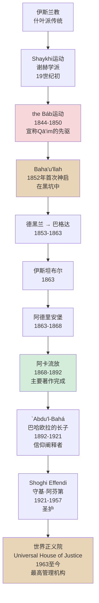
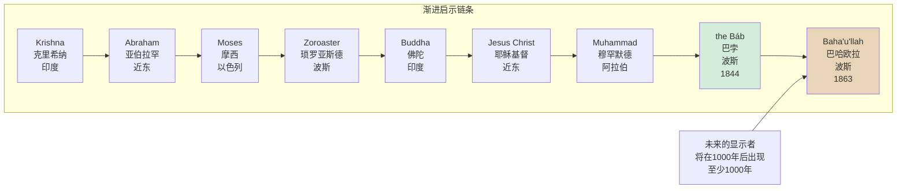
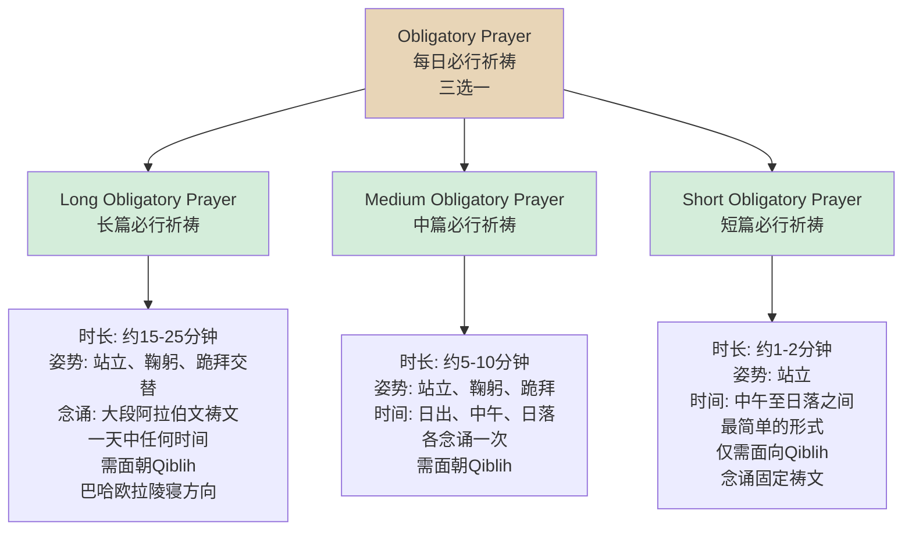
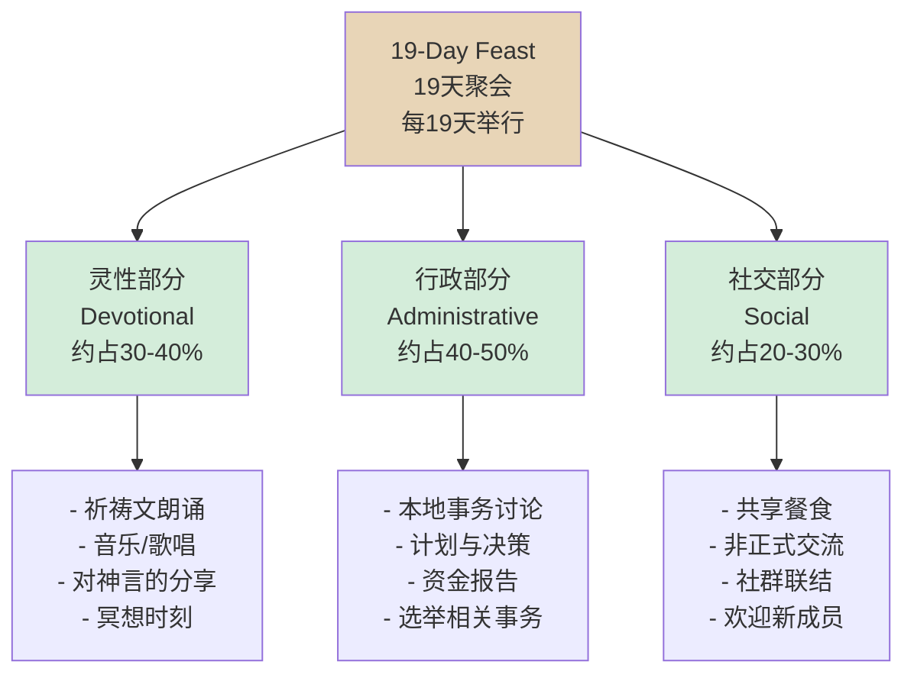

# 巴哈伊信仰冥想概述 (Bahá'í Meditation Overview)

> **主题**: 巴哈伊信仰（Bahá'í Faith）冥想传统——从Baha'u'llah的神启到全球社群的灵性实践
> **关键词**: Obligatory Prayer, Alláh-u-Abhá, 19-Day Feast, Progressive Revelation, Unity of Mankind, Meditation as Listening
> **最后更新**: 2026-05

---

## 目录

1. [历史渊源](#历史渊源)
2. [核心理论](#核心理论)
3. [主要修习方法](#主要修习方法)
4. [巴哈伊信仰对冥想的独特理解](#巴哈伊信仰对冥想的独特理解)
5. [与现代心理学的交汇](#与现代心理学的交汇)
6. [实践指引](#实践指引)
7. [附录](#附录)

---

## 历史渊源

### Baha'u'llah 与 19世纪波斯的神启

巴哈伊信仰（Bahá'í Faith, بهائی) 于19世纪中叶诞生于波斯（今伊朗），其创立者是**Mīrzā Ḥusayn-`Alī Nūrī**（米尔扎·侯赛因·阿里·努里, 1817-1892），后被尊称为**Baha'u'llah**（بهاءالله, "上帝的荣耀"）。

Baha'u'llah出身于波斯贵族家庭，但在青年时期放弃了宫廷生活，投身于当时波斯社会动荡中的宗教改革运动。1844年，一位年轻的波斯商人**Siyyid `Alī-Muḥammad Shīrāzī**（赛义德·阿里·穆罕默德·设拉子, 1819-1850），被尊称为**the Báb**（الباب, "门"），宣称自己是伊斯兰什叶派传统中期待的**Qā'im**（قائم, "复活者"或"马赫迪"）的先驱。Báb的运动迅速吸引了大量追随者（称为**Bábís**），但遭到波斯政府和什叶派教士阶层的残酷镇压。1850年，Báb被公开处决。

Baha'u'llah作为早期Bábí运动的核心成员，于1852年因莫须有的罪名被投入德黑兰的**Sīyāh-Chāl**（سیاه‌چال, "黑坑"，一个地牢）中。正是在这个极端的黑暗中，Baha'u'llah后来记述，他接受了上帝的首次启示——如同圣灵的光芒穿透黑暗。1853年获释后，他被流放至巴格达，随后辗转伊斯坦布尔、阿德里安堡（今埃迪尔内），最终于1868年被永久流放至奥斯曼帝国的**阿卡**（`Akká, عكا, 今以色列北部海法附近）。

在阿卡流放期间（1868-1892），Baha'u'llah写下数千封书简（Tablets）和数部主要著作，系统阐述了巴哈伊信仰的教义。他明确宣称自己是上帝的最新"显示者"（Manifestation of God），是Báb所预言的那一位——将带来人类统一的黄金时代。



### 从伊斯兰什叶派背景中诞生

巴哈伊信仰虽然从伊斯兰什叶派土壤中生长出来，但其教义在多个关键维度上超越了伊斯兰框架：

| 维度 | 伊斯兰什叶派 | 巴哈伊信仰 |
|------|------------|-----------|
| **先知的终结** | 穆罕默德是"封印的先知"（Khatam al-Nabiyyin） | 上帝的显示者（Manifestations of God）是持续出现的——Baha'u'llah不是最后一位，只是当前时代的显示者 |
| **宗教的永恒性** | 伊斯兰教是最终、最完美的宗教 | 所有宗教皆来自同一上帝，是"渐进启示"的不同阶段 |
| **社群结构** | 乌里玛（Ulama）阶层掌握解释权 | 无教士阶层——个人直接通过祈祷和研读与上帝连接 |
| **女性地位** | 传统上受限 | 男女完全平等——巴哈伊信仰最早将性别平等写入核心教义的宗教之一 |
| **政治参与** | 什叶派有政治性（如伊朗神权政治） | 政治不参与原则——巴哈伊教徒不参政，但积极促进社会正义 |

### 巴哈伊信仰的全球传播

Baha'u'llah在阿卡期间通过书信向全球君主和宗教领袖发出呼吁，要求他们接受其教义并实现世界和平。虽然这些呼吁在当时大多被忽视，但巴哈伊信仰在20世纪经历了快速的全球传播：

- **1890年代**：第一批西方朝圣者前往阿卡拜见Baha'u'llah
- **1910-1920年代**：`Abdu'l-Bahá访问欧洲和北美，系统阐述巴哈伊教义
- **1921-1957年**：Shoghi Effendi将巴哈伊社群制度化，翻译核心经典，推动"系统性扩展计划"
- **1963年至今**：世界正义院（Universal House of Justice）作为最高管理机构，每五年制定全球扩展计划

今天，巴哈伊信仰是世界上分布最广泛的宗教之一——存在于几乎所有国家和地区（约190+国家），但总人口估计仅为500-800万。其独特的**没有教士阶层**、**没有仪式圣礼**、**全球行政体系**使其在现代宗教景观中占据特殊位置。

### 世界正义院（Universal House of Justice）

1963年，首届**世界正义院**在海法（以色列）的巴哈伊世界中心选举产生。这是一个由9名成员组成的机构，每五年由全球各国的国家灵体会（National Spiritual Assemblies）选举产生。

世界正义院的职能包括：
- 解释巴哈伊律法（但不得解释Baha'u'llah和`Abdu'l-Bahá的启示文本——这些被视为终极权威）
- 制定全球扩展和社会发展的战略
- 保护信仰的纯洁性
- 在国际论坛代表巴哈伊社群

对于冥想实践者而言，世界正义院发布的文告和信函是重要的灵性指导来源，其中经常涉及祈祷、冥想和灵性生活的议题。

---

## 核心理论

### 上帝的显示者（Manifestations of God）与渐进启示

巴哈伊信仰的宇宙观核心是**渐进启示**（Progressive Revelation）：上帝通过一系列"显示者"向人类传达其旨意，每一位显示者都带来了适合其时代和地域的教导，但其本质是同一光源的不同反射。



**关键原则**：
- 每一位显示者都是完美的镜子，反映了上帝的属性（Mercy, Justice, Love等）
- 显示者之间的差异源于时代的需要，而非本质的不同
- Baha'u'llah宣称自己是"上帝之日"的显示者——将带来人类的统一
- 下一位显示者将在至少1000年后出现——这是巴哈伊信仰中的"千年之约"

这一理论对冥想的意义在于：巴哈伊教徒在冥想中不仅与Baha'u'llah的神言对话，也尊重所有传统中的神圣文本——因为它们是同一光源的不同表达。

### 人类一体（Unity of Mankind）

**"地球乃一国，万众皆其民"**（The earth is but one country, and mankind its citizens）——这是`Abdu'l-Bahá最著名的宣言，也是巴哈伊信仰的核心社会原则。

人类一体不仅是道德理想，更是巴哈伊宇宙论的必然推论：
- 所有人类皆由同一上帝创造，拥有同一灵性本质
- 种族、民族和文化的差异是表象，统一性是本质
- 民族主义是"爱的极限"，必须被超越
- 世界需要一种全球治理体系和辅助性语言

### 独立探求真理（Independent Investigation of Truth）

Baha'u'llah明确命令每一位信徒**独立探求真理**——不盲信任何权威（包括巴哈伊信仰自身）：

> "人必须 cleanse his own heart... He must so cleanse his heart that no remnant of either love or hate may linger therein, lest that love blindly incline him to error, or that hate repel him away from the truth."
> —— Baha'u'llah

这一原则对冥想实践的影响：
- 冥想是个人与上帝的直接对话——不需要教士的中介
- 每个人都有责任发展自己的灵性判断力
- 对教义的"理解"优先于"盲目接受"

### 祈祷与冥想的区分

巴哈伊信仰对祈祷（Prayer）和冥想（Meditation）做出了在其他传统中罕见的清晰区分：

| 维度 | 祈祷 (Prayer) | 冥想 (Meditation) |
|------|--------------|-------------------|
| **方向** | 向上/向外——人对上帝说话 | 向下/向内——人聆听上帝的回应 |
| **比喻** | 说话（Speaking） | 倾听（Listening） |
| **主动性** | 主动的——表达、请求、赞美 | 被动的——接纳、接收、敞开 |
| **形式** | 有固定的祷文和仪式要求 | 无固定形式——纯粹的意识状态 |
| **经典依据** | Baha'u'llah写下了大量祷文 | `Abdu'l-Bahá教导冥想是"与上帝的密谈" |

`Abdu'l-Bahá进一步阐述：

> "Prayer is conversation with God; meditation is communion with God. Prayer is speaking; meditation is listening."

这一区分对实践的指导意义：巴哈伊灵性生活建议**先祈祷，后冥想**——通过祈祷打开与上帝的对话，然后以冥想状态接收上帝的"回应"。这种回应可能以直觉、灵感、内心平静或某种"知晓"的形式出现。

### 灵性本质与物质进步的平衡

巴哈伊信仰拒绝将灵性追求与世俗生活对立：

- **工作即崇拜**：在巴哈伊教义中，诚实的工作被视为一种崇拜形式
- **科学与宗教的和谐**：如果二者冲突，必有一方被误解——真理只有一个来源
- **物质进步是必需的**：经济发展、教育、医疗进步都是上帝的旨意的体现
- **但物质不能取代灵性**：单纯的物质繁荣会导致精神的空虚和社会的失序

---

## 主要修习方法

### Obligatory Prayer（每日必行祈祷）

巴哈伊信仰要求每一位年满15岁的信徒每日进行**必行祈祷**（Obligatory Prayer）。Baha'u'llah设计了三种形式，修行者可以根据自身情况选择其一：



**短篇必行祈祷**（全文）：

> I bear witness, O my God, that Thou hast created me to know Thee and to worship Thee. I testify, at this moment, to my powerlessness and to Thy might, to my poverty and to Thy wealth. There is none other God but Thee, the Help in Peril, the Self-Subsisting.
> —— Baha'u'llah

> 我作证，我的上帝啊，祢创造我是为了让我认识祢、崇拜祢。我在此刻作证：我是无能的，祢是万能的；我是贫穷的，祢是富足的。除祢之外别无上帝，祢是危难中的救主，自在自存者。

**Qiblih**（قبلة, 朝向）：巴哈伊信徒在祈祷时面向Baha'u'llah陵寝的方向——位于以色列海法附近的巴哈伊世界中心。世界各地的信徒通过指南针或手机应用确定当地朝向。

**必行祈祷的意义**：
- 它是信仰的实践宣言——不仅仅是"许愿"，而是一种纪律性的灵性训练
- 固定的祷文被认为具有特殊的灵性力量——Baha'u'llah宣称这些文字本身即是启示的一部分
- 三种形式的选择体现了巴哈伊信仰的**灵活性**——适应不同生活节奏的人

### Meditation on the Words of God（对神言的冥想）

这是巴哈伊冥想的核心形式——**以神圣文本为对象的沉思**。Baha'u'llah和`Abdu'l-Bahá留下了大量的著作（估计超过10万字），包括：

**核心经典**：

| 著作 | 作者 | 内容 |
|------|------|------|
| **Kitáb-i-Aqdas**（亚格达斯经, "至圣经书"） | Baha'u'llah | 巴哈伊律法书——包含祈祷、社会规范、个人行为准则 |
| **Kitáb-i-Íqán**（伊格翁经, "确信之书"） | Baha'u'llah | 对Báb身份的论证——巴哈伊神学的基础 |
| **The Seven Valleys**（七谷经） | Baha'u'llah | 灵性之旅的七个阶段——与苏菲传统对话的神秘文本 |
| **The Hidden Words**（隐言经） | Baha'u'llah | 短小的灵性警句——被誉为"巴哈伊诗篇" |
| **Paris Talks**（巴黎谈话） | `Abdu'l-Bahá | 1911-1913年欧洲之行的演讲集 |
| **Some Answered Questions**（已答之问） | `Abdu'l-Bahá | 对神学、宇宙学、社会问题的回答 |

**研读式冥想的方法**：

| 阶段 | 名称 | 内容 | 时间 |
|------|------|------|------|
| 1 | 诵读（Recitation） | 大声或默诵一段经文 | 2-5分钟 |
| 2 | 沉思（Reflection） | 闭眼思考经文的含义——它对你个人说了什么 | 5-10分钟 |
| 3 | 对话（Dialogue） | 将经文视为上帝对你的直接信息——回应它 | 5-10分钟 |
| 4 | 安住（Abiding） | 超越文字，安住于经文所指向的灵性状态 | 5-15分钟 |

**《隐言经》（The Hidden Words）的冥想示例**：

> "O Son of Spirit! My first counsel is this: Possess a pure, kindly and radiant heart, that thine may be a sovereignty ancient, imperishable and everlasting."

冥想路径：
1. **诵读**：感受文字的韵律和力量
2. **关键词提取**："pure"（纯净）、"kindly"（仁慈）、"radiant"（光辉）——这些是心脏的三种品质
3. **个人应用**："我的心在哪些方面不够纯净？我能对哪些人更仁慈？"
4. **超越文字**：安住于一种"纯净、仁慈、光辉"的内在状态

### Dhikr / Alláh-u-Abhá（重复念诵）

**Alláh-u-Abhá**（الله أبهى, "上帝最荣耀"或"上帝是全荣耀的"）是巴哈伊信仰中最常用的咒语/圣名。它在阿拉伯语中融合了伊斯兰传统对Allah（上帝）的称呼和巴哈伊信仰对上帝荣耀的强调。

**95次念诵实践**：

巴哈伊信徒被建议在每日进行**95次**Alláh-u-Abhá的念诵（使用念珠或计数器）。这一数字具有象征意义：
- 阿拉伯语字母系统中，"Baha"（巴哈, "荣耀"）的数值等于9
- 9 × 10 + 5 = 95（这一计算的具体来源在巴哈伊传统中有多种解释）

```mermaid
graph LR
    A[Alláh-u-Abhá<br/>95次念诵<br/>日常实践] --> B[使用念珠<br/>Baha'i prayer beads<br/>通常95颗珠子<br/>+ 标记珠]
    A --> C[计数器<br/>手动或电子<br/>保持专注]
    A --> D[徒手计数<br/>手指关节计数法<br/>传统方法]
    B --> E[念诵方式<br/>1. 大声念诵<br/>2. 低语念诵<br/>3. 心念]
    C --> E
    D --> E
    E --> F[伴随动作<br/>可选]<br/>- 面向Qiblih<br/>- 双手合十<br/>- 闭目或睁眼]
    style A fill:#e8d5b7
```

**念诵的灵性效果**：
- 如同印度教的**Japa**（जप, 曼陀罗重复念诵）或佛教的**Nembutsu**（念佛），重复念诵被认为可以净化心念、集中意识
- 念诵者被鼓励将注意力集中于每个音节的意义——不仅仅是机械重复
- 许多人报告在95次念诵后进入一种深度的平静和专注状态——这正是进入冥想的理想入口

**与其他传统念诵的比较**：

| 传统 | 念诵内容 | 次数 | 工具 |
|------|---------|------|------|
| **巴哈伊** | Alláh-u-Abhá | 95次/日 | 95颗念珠 |
| **印度教** | Om Namaḥ Śivāya / Hare Kṛṣṇa | 108次（1圈）或更多 | 108颗念珠（Japamālā） |
| **佛教（净土宗）** | Namo Amida Butsu | 持续不断 | 念珠（数珠） |
| **伊斯兰教（苏菲）** | Lā ilāha illā Allāh / Dhikr | 根据教团规定 | 念珠（Tasbih, 33或99颗） |
| **锡克教** | Waheguru | 持续默念 | 无固定念珠 |

### The Healing Prayer（治愈祈祷）

巴哈伊信仰中有专门的祈祷文用于病患的治愈。这些祈祷不是"魔法"——它们被视为一种灵性支持，可以伴随（而非替代）医疗治疗。

**常见的治愈祷文**：

1. **The Short Healing Prayer**（短篇治愈祈祷）：
   > "Thy name is my healing, O my God, and remembrance of Thee is my remedy..."

2. **The Long Healing Prayer**（长篇治愈祈祷）：由Baha'u'llah撰写，包含对上帝各种治愈属性的呼唤。

**治愈祈祷的冥想维度**：
- 病患者可以通过念诵治愈祷文进入一种**接纳和信任**的状态
- 家人和朋友可以为患者念诵祈祷——这是一种"代祷"的实践
- 祈祷后的冥想时段被建议用于"感受上帝的治愈力量"

**科学研究背景**：虽然专门针对巴哈伊治愈祈祷的临床研究极少，但"代祷"（Intercessory Prayer）在更广泛的医学研究中已有探讨。结果不一——部分研究显示正面效应，部分显示无差异。巴哈伊信仰内部通常不强调祈祷的"超自然疗效"，而是强调其**灵性安慰**和**心理支持**的功能。

### 19-Day Feast（19天聚会）

巴哈伊历法是一种独特的**19个月、每月19天**的历法（每年共361天，加上4-5天的"闰日"）。每19天举行的聚会被称为**Feast**（聚会/盛宴），是巴哈伊社群生活的核心。

**Feast的三位一体结构**：



**冥想维度**：
- Feast的灵性部分通常包含**集体冥想时刻**——全体静默数分钟，用于个人反思和与上帝的连接
- 这是一个**社群冥想**的实践——在集体能量场中进行个人冥想
- 许多巴哈伊信徒报告，Feast的集体祈祷和冥想具有比个人练习更强的灵性力量

**Feast的独特性**：
- 没有教士主持——由社群成员轮流负责各个部分
- 男女平等参与——在巴哈伊历史上，Feast一直是女性发挥领导力的重要场所
- 跨文化统一——从海地村庄到挪威城市，Feast的基本结构全球一致

### Fasting Month（Ala月斋戒）

巴哈伊历法中的最后一个月称为**`Alá'**（علاء, "崇高"），对应公历的约3月2日至3月20日。这19天是巴哈伊信仰的**斋月**——信徒从日出到日落禁食食物和饮水。

**斋戒规则**：

| 维度 | 内容 |
|------|------|
| **时间** | 日出前（早餐）至日落后（晚餐） |
| **年龄** | 15至70岁 |
| **豁免** | 旅行者、病人、孕妇、哺乳期妇女、重体力劳动者等 |
| **灵性目的** | 自律、灵性反思、对贫穷者的同理心、祈祷与冥想的深化 |
| **社交维度** | 斋戒月最后一天的日落后即为**Naw-Rúz**（诺鲁孜，巴哈伊新年）——社群庆祝 |

**斋戒与冥想的结合**：

巴哈伊斋戒不仅是身体的节制，更是**灵性反思的强化期**：
- 日出前的冥想：在禁食开始前，以清醒的头脑进行祈祷和冥想
- 日间的灵性反思：饥饿和口渴成为持续的"提醒"——将注意力从物质需求转向灵性追求
- 日落后的祈祷：打破禁食时的感恩祈祷
- 斋戒月最后19天的每一天，社群会集体念诵一个特定的祈祷文

**与伊斯兰斋戒（Ramaḍān）的比较**：

| 维度 | 伊斯兰斋戒 (Ramaḍān) | 巴哈伊斋戒 (`Alá') |
|------|---------------------|-------------------|
| **时间** | 伊斯兰历第9个月（每年提前约11天） | 巴哈伊历第19个月（固定于3月2日-20日） |
| **长度** | 29-30天 | 19天 |
| **日出前餐** | Suhūr（封斋饭） | 类似，但无特定名称 |
| **日落后餐** | Iftār（开斋饭） | 类似，但无特定名称 |
| **夜间活动** | Tarawīḥ（特拉威哈） prayers | 无特定夜间仪式 |
| **结束节日** | `Īd al-Fiṭr（开斋节） | Naw-Rúz（诺鲁孜/新年） |
| **斋戒意义** | 顺从安拉、纪念古兰经降示 | 灵性更新、预备新年、个人反思 |

---

## 巴哈伊信仰对冥想的独特理解

### "祈祷是说话，冥想是倾听"

这是巴哈伊冥想理论中最核心、最优美的表述。`Abdu'l-Bahá多次用这一比喻来阐明祈祷与冥想的关系：

> "In the prayerful condition, man is speaking to God; in meditation, God is speaking to man."

**实践含义**：
- 冥想不是"空"的——它是一种**接收**的状态
- 上帝的"回应"不一定以声音形式出现——它可能是直觉、灵感、内心的平静、或对某个问题的突然领悟
- 真正的冥想需要**放下自我的议程**——不是为了"得到答案"而冥想，而是为了"与上帝同在"

### 冥想作为"与上帝的密谈"

`Abdu'l-Bahá将冥想描述为：

> "Meditation is the key for opening the doors of mysteries. In that state man abstracts himself: in that state man withdraws himself from all outside objects; in that subjective mood he is immersed in the ocean of spiritual life and can unfold the secrets of things-in-themselves."

这一描述与印度教的**Samādhi**（三摩地）、佛教的**Samādhi**（定）和苏菲的**Fanā'**（寂灭）有共鸣之处——但巴哈伊框架强调的是**与上帝的亲密连接**，而非"消融自我"。

### 无教士阶层的个人灵性

巴哈伊信仰没有教士、僧侣或灵性导师阶层。这意味着：
- **每个人都直接对上帝负责**——不需要任何人的中介
- **冥想是个人与上帝之间的私密事务**——社群可以提供支持，但不能"指导"你的冥想
- **灵性成长是个人的旅程**——每个人的路径都是独特的

这一原则对冥想实践的影响是双重的：
- **自由**：没有"正确的冥想方式"的强制——你可以发展最适合自己的方法
- **责任**：没有外部权威可以依赖——你必须发展自己的灵性判断力

---

## 与现代心理学的交汇

### 世界主义（Cosmopolitanism）的心理健康益处

巴哈伊信仰的"人类一体"原则本质上是一种**世界主义**伦理——超越民族国家认同，拥抱全球人类共同体。心理学研究提供了一些相关的发现：

| 研究领域 | 发现 | 与巴哈伊的关联 |
|---------|------|--------------|
| **全球认同** | 具有"世界公民"（Global Citizen）认同的个体，报告更高的生活满意度和更低的外群体偏见 | 巴哈伊信仰将世界主义作为核心身份认同 |
| **多元文化能力** | 跨文化接触与心理灵活性（Psychological Flexibility）正相关 | 巴哈伊社群的全球分布提供了天然的多元文化环境 |
| **意义感** | 参与超越个人利益的事业与意义感（Meaning in Life）强相关 | 巴哈伊信仰强调"服务人类"作为灵性生活的核心 |

### 社群归属感的研究

巴哈伊社群以其**高度团结和包容性**闻名。社会学和心理学的观察指出：

- **没有种族隔离**：与许多宗教社群不同，巴哈伊聚会通常具有高度的种族多样性（在美国、英国等多民族国家尤为明显）
- **跨阶级连接**：Feast的定期聚会使不同社会经济背景的人建立关系
- **青年项目**：巴哈伊信仰对儿童和青年的灵性教育投入大量资源（"儿童班"和"青年小组"是全球标准项目）

**心理健康影响**：
- 强社群归属感与更低的抑郁率和更高的复原力相关
- 巴哈伊社群提供的**非竞争性灵性环境**（无教士阶层、无圣礼竞争）可能减少某些宗教社群中常见的"灵性焦虑"
- 然而，巴哈伊社群在伊朗等受迫害地区面临的**社群创伤**（communal trauma）也带来了特殊的心理健康挑战

### 服务他人对意义感的影响

巴哈伊信仰将**服务**（Service）视为灵性生活的核心——不仅仅是"做好事"，而是"崇拜的形式"。

`Abdu'l-Bahá教导：

> "Service to humanity is service to God."

**心理学研究的相关性**：

| 研究主题 | 发现 | 巴哈伊实践 |
|---------|------|-----------|
| **利他主义与幸福感** | 帮助他人与主观幸福感呈正相关 | 巴哈伊社群强调"服务"而非"慈善"——后者隐含施与受的不平等 |
| **意义感来源** | 超越自我的目标比个人目标更能带来持久意义感 | 巴哈伊信仰的"人类一体"和"世界文明"愿景提供了超越性目标 |
| **志愿服务与长寿** | 定期志愿服务与更低的死亡率和更好的身体健康相关 | 巴哈伊青年服务项目（如"正义事业学院"）提供了结构化的服务机会 |
| **目的感与抗逆力** | 明确的人生目的感（Purpose in Life）是心理韧性的最强预测因子之一 | 巴哈伊信仰将"发展神圣品质"和"促进人类统一"作为人生核心目的 |

**"正义事业学院"（Institute for Studies in Global Prosperity）**：巴哈伊信仰建立的全球教育体系，将灵性发展与社会服务训练结合。参与者通过"学习圈"（Study Circles）系统学习，然后将所学应用于本地社区服务（如儿童灵性教育、青少年 empowerment 项目）。这一体系为研究"灵性-服务整合"对心理健康的影响提供了独特的自然实验场景。

---

## 实践指引

### 入门路径

巴哈伊信仰对任何背景的人都完全开放，没有入教仪式或皈依程序——"成为巴哈伊"即是在内心接受Baha'u'llah为上帝的显示者，并告知当地的国家灵体会或地方灵体会。

| 阶段 | 时间 | 内容 | 建议 |
|------|------|------|------|
| **探索期** | 1-3个月 | 阅读Baha'u'llah和`Abdu'l-Bahá的著作，参加本地Feast | 推荐：《The Hidden Words》（隐言经）入门；联系本地巴哈伊社群 |
| **基础期** | 3-6个月 | 建立每日祈祷和念诵的习惯，参加学习圈 | 选择一种Obligatory Prayer形式；开始95次Alláh-u-Abhá念诵 |
| **深化期** | 6-12个月 | 系统性研读经典（如《伊格翁经》），尝试Feast中的服务角色 | 参加"正义事业学院"的学习圈；考虑在社群中承担小型服务 |
| **整合期** | 1年以上 | 将巴哈伊原则融入日常生活和工作，参与社会服务项目 | 参与儿童班或青年小组的协助工作；探索巴哈伊的社区建设模式 |

### 非巴哈伊教徒的参与可能性

巴哈伊信仰对非成员极其开放：

- **Feast**：任何人都可以参加Feast的灵性部分和社交部分（行政部分通常保留给巴哈伊成员）
- **祈祷会**：巴哈伊祈祷会（Devotional Gatherings）对所有人开放
- **学习圈**："正义事业学院"的学习圈对任何背景的人开放——无需成为巴哈伊
- **儿童班和青年小组**：巴哈伊社群的儿童灵性教育项目对社区所有儿童开放
- **服务活动**：许多巴哈伊社会服务项目欢迎志愿者参与

**不成为巴哈伊而练习巴哈伊冥想**：
- 巴哈伊祷文对所有人开放——任何人都可以念诵
- 巴哈伊的冥想方法（对神言的沉思、Alláh-u-Abhá念诵）不依赖于成为正式成员
- 许多来自其他宗教背景的人在保持原宗教身份的同时，从巴哈伊冥想实践中受益

### 社群活动的角色

巴哈伊信仰的独特之处在于：**没有教士，但社群本身就是灵性载体**。

| 社群活动 | 频率 | 冥想/灵性维度 |
|---------|------|-------------|
| **19-Day Feast** | 每19天 | 集体祈祷、经文朗诵、冥想时刻 |
| **祈祷会** (Devotional Gathering) | 每周或每两周 | 跨宗教的祈祷和音乐聚会 |
| **学习圈** (Study Circle) | 每周 | 对经典的集体研读和反思——本身就是一种群体冥想 |
| **儿童班** (Children's Classes) | 每周 | 儿童通过故事、祈祷和艺术学习灵性品质 |
| **青年小组** (Junior Youth Groups) | 每周 | 青少年探讨身份、目的和社会服务的意义 |
| **Nineteen Day Feast中的服务** | 每19天 | 准备食物、朗诵祷文、演奏音乐——服务即冥想 |

### 祈祷文的使用

巴哈伊信仰留下了丰富的祈祷文传统——Baha'u'llah和`Abdu'l-Bahá撰写了数千篇祷文，涵盖生活的各个方面：

| 类别 | 示例 | 使用场景 |
|------|------|---------|
| **晨祷** | "I have wakened in Thy shelter, O my God..." | 每日清晨 |
| **夜祷** | "Glory be to Thee, O Lord my God! I beg of Thee..." | 每日睡前 |
| **感恩祷** | "Blessed is the spot, and the house, and the place..." | 进入任何空间时 |
| **困难时祷** | "Is there any Remover of difficulties save God?" | 面对挑战时 |
| **旅行祷** | "Glory be unto Thee, O Lord! Behold my servant..." | 出行前 |
| **治愈祷** | "Thy name is my healing..." | 自己或他人生病时 |
| **亡者祷** | "O my God! This is Thy servant and the son of Thy servant..." | 悼念亡者 |
| **斋戒祷** | 每日斋戒月特定祷文 | 斋戒月的每天 |

**个人祈祷的创作**：

虽然Baha'u'llah和`Abdu'l-Bahá的祷文具有特殊地位，但巴哈伊信仰也鼓励个人祈祷。`Abdu'l-Bahá说：

> "The most acceptable prayer is the one offered with the utmost spirituality and radiance."

个人祈祷没有固定格式——它可以是对上帝的直接倾诉、感恩的表达、或请求帮助。

---

## 附录

### 术语表

| 阿拉伯文/波斯文/英文 | 中文 | 含义 |
|---------------------|------|------|
| **Alláh** (الله) | 上帝/真主 | 上帝——与伊斯兰传统共享的名称 |
| **Alláh-u-Abhá** (الله أبهى) | 上帝最荣耀 | 巴哈伊最常用的圣名念诵 |
| **Baha** (بهاء) | 荣耀/光辉 | Baha'u'llah名字的核心 |
| **Baha'u'llah** (بهاءالله) | 巴哈欧拉 | "上帝的荣耀"——信仰创立者 |
| **the Báb** (الباب) | 巴孛 | "门"——Baha'u'llah的先驱 |
| **`Abdu'l-Bahá** (`عبد البهاء) | 阿博都巴哈 | "上帝的仆人"——Baha'u'llah的长子，信仰阐释者 |
| **Manifestation of God** | 上帝的显示者 | 上帝与人类之间的完美中介 |
| **Qiblih** (قبلة) | 朝向 | 祈祷时面向的方向（Baha'u'llah陵寝） |
| **Naw-Rúz** (نوروز) | 诺鲁孜 | 巴哈伊新年（3月21日前后） |
| **`Alá'** (علاء) | 崇高 | 斋戒月的名称 |
| **Feast** | 聚会/盛宴 | 19天一次的社群聚会 |
| **Mashriqu'l-Adhkár** | 祈祷殿堂 | "黎明之地"——巴哈伊礼拜堂 |
| **Huqúqu'lláh** | 上帝的权利 | 巴哈伊的捐献制度（财富的19%） |
| **Shoghi Effendi** | 守基·阿芬第 | 巴哈伊圣护（1921-1957） |
| **Universal House of Justice** | 世界正义院 | 最高管理机构（1963至今） |

### 推荐阅读

1. Hatcher, William S., and J. Douglas Martin. *The Bahá'í Faith: The Emerging Global Religion*. Bahá'í Publishing, 2002.（最权威的学术入门著作）
2. Cole, Juan R.I. *Modernity and the Millennium: The Genesis of the Bahá'í Faith in the Nineteenth-Century Middle East*. Columbia University Press, 1998.（历史学术专著）
3. Baha'u'llah. *The Hidden Words*（隐言经）.（巴哈伊最常被阅读的灵修经典）
4. Baha'u'llah. *The Seven Valleys and the Four Valleys*（七谷经与四谷经）.（神秘主义文本，与苏菲传统对话）
5. `Abdu'l-Bahá. *Paris Talks*（巴黎谈话）.（对西方听众的系统阐述）
6. McLean, J.A. *Dimensions in Spirituality: Reflections on the Meaning of Spiritual Life and Transformation from the Bahá'í Scriptures*. George Ronald, 1994.（巴哈伊灵修的神学探索）

---

*最后更新: 2026-05*
*本文仅供学习和研究目的，巴哈伊冥想实践可在当地巴哈伊社群获得支持。*
