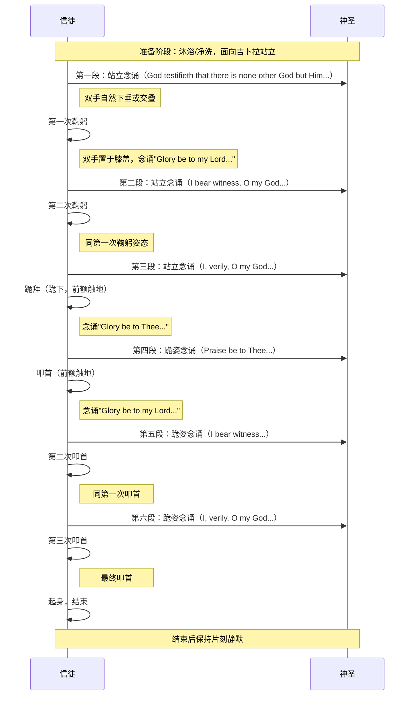
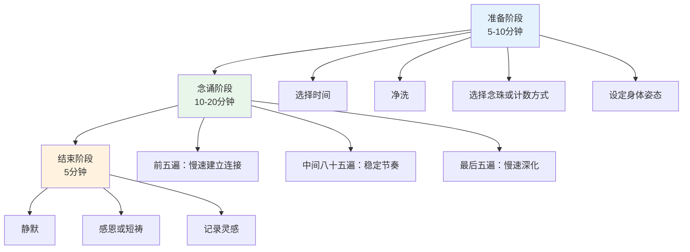
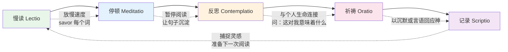
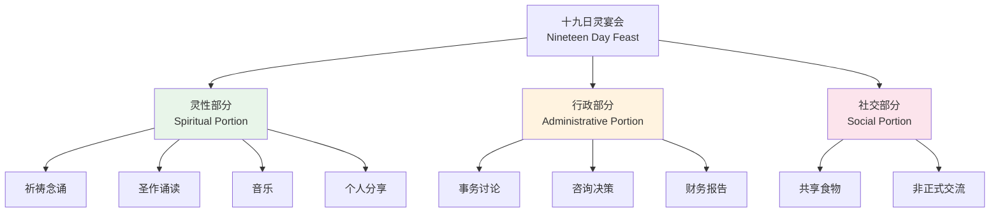

# 巴哈伊冥想实修指南 (Bahá'í Meditation Practical Guide)

> **最后更新：** 2026-05

---

## 目录

1. [三种 Obligatory Prayer 完整操作指南](#1-三种-obligatory-prayer-完整操作指南)
2. [Alláh-u-Abhá 九十五次念诵](#2-alláh-u-abhá-九十五次念诵)
3. [冥想式阅读法](#3-冥想式阅读法)
4. [十九日灵宴会中的冥想维度](#4-十九日灵宴会中的冥想维度)
5. [Ala月斋戒的冥想深化](#5-ala月斋戒的冥想深化)
6. [附录：参考资源](#6-附录参考资源)

---

## 1. 三种 Obligatory Prayer 完整操作指南

巴哈伊信仰规定，年满十五岁的信徒每日须履行一次义务祈祷（Obligatory Prayer）。共有三种形式可选：短篇、中篇与长篇。选择其中一种后应在固定时间内持续使用，不宜频繁更换。

### 1.1 三种祈祷对比总览

| 维度 | 短篇义务祈祷 | 中篇义务祈祷 | 长篇义务祈祷 |
|------|-------------|-------------|-------------|
| **时间要求** | 日出前与日落后之间任意时间 | 日出前、正午、日落后三个时段 | 24小时内任意时间 |
| **时长** | 约1-2分钟 | 约5-10分钟 | 约15-25分钟 |
| **身体姿态** | 站立，面向吉卜拉（巴哈欧拉陵寝方向） | 站立、鞠躬、跪拜、叩首 | 跪拜、叩首、坐姿 |
| **念诵方式** | 可默念或低声诵 | 需出声念诵 | 需出声念诵 |
| **面向方向** | 吉卜拉（以色列阿卡） | 吉卜拉 | 吉卜拉 |
| **洗涤要求** | 洗手洗脸 | 沐浴（若无条件则洗手洗脸） | 沐浴（若无条件则洗手洗脸） |
| **适合人群** | 时间极有限、旅行者、病人 | 大多数信徒的日常选择 | 能投入较长时间的深度修行者 |
| **灵性深度** | 简洁而集中 | 平衡的深度与可操作性 | 最完整的身体-心灵-灵性整合 |

### 1.2 短篇义务祈祷（Short Obligatory Prayer）

| 步骤 | 操作 | 细节说明 |
|------|------|----------|
| **准备** | 净洗手脸；面向吉卜拉 | 吉卜拉方向：从各地指向以色列阿卡（Akka）的巴哈欧拉陵寝。可使用指南针或手机应用确认 |
| **姿态** | 站立，双脚自然分开，双手可交叠于腹部或自然下垂 | 保持脊柱挺直但不僵硬；目光可微闭或平视前方 |
| **念诵** | 以阿拉伯语原文或翻译语念诵短篇祈祷文 | 建议背诵原文以达致最大效力；初学时可对照文本 |
| **核心文句** | "我向上帝作晚祷和早祷，我信仰祂、我笃信祂的威严与 loftiness，顺从祂的诫命……" | 念诵时观想文字背后的意义，非机械重复 |
| **结束** | 念诵完毕后保持静默站立10-30秒 | 让祈祷的余韵沉淀；可接个人默祷 |
| **时间** | 日出后至日落前 | 最佳时间为清晨起床后或傍晚日落前 |

**短篇祈祷深度修习要点：**

| 层面 | 修习方法 |
|------|----------|
| 速度 | 不急于完成；即使只有两分钟，也从容不迫 |
| 发音 | 每个词清晰完整，感受词语的振动 |
| 意义 | 念诵时不只是"说"，而是"与神对话" |
| 身体 | 感受站立的稳定性——如同在神面前的尊严 |
| 后续 | 祈祷后不立即投入世俗事务，保留1-2分钟过渡 |

### 1.3 中篇义务祈祷（Medium Obligatory Prayer）

中篇祈祷包含多个身体动作，是巴哈伊信仰中最具仪式感的日常祈祷形式。

| 动作 | 身体操作 | 念诵内容 | 灵性象征 |
|------|----------|----------|----------|
| **站立** | 双脚与肩同宽，脊柱挺直，面向吉卜拉 | 三段站立祈祷文 | 人在神面前的尊严与直立 |
| **鞠躬** | 从腰部前倾，双手置于膝盖，头略低 | "Glory be to my Lord..."（×2次） | 谦卑与臣服 |
| **跪拜** | 双膝跪地，臀部坐在脚跟上，身体保持直立 | "Glory be to Thee..." | 完全的降服 |
| **叩首** | 从跪拜姿势前倾，前额触地 | "Glory be to my Lord..."（×3次） | 终极的臣服与合一 |

**三个时段的修习建议：**

| 时段 | 最佳时间 | 身心状态 | 修习重点 |
|------|----------|----------|----------|
| **清晨** | 日出前后 | 清新、尚未被世俗事务占据 | 为一日设定灵性基调；重点放在"站立"的尊严感 |
| **正午** | 中午12:00-14:00 | 可能疲劳、忙碌 | 作为一日的灵性"重启"；重点放在"鞠躬"的谦卑 |
| **黄昏** | 日落后 | 一日将尽，回顾与放下 | 感谢与释放；重点放在"叩首"的臣服与交托 |

**常见障碍与对治：**

| 障碍 | 对治方法 |
|------|----------|
| 忘记时段 | 设置提醒；将祈祷与工作/饮食时间绑定 |
| 身体不适无法跪拜 | 巴哈伊律法允许以手势代替身体动作；生病时可坐着进行 |
| 机械重复 | 每次专注一个段落的意义；轮换使用不同语言版本 |
| 环境不允许出声 | 中篇祈祷原则上需出声；若实在不便，当日可改用短篇 |
| 时间冲突 | 中篇祈祷的三个时段各有约2小时窗口；提前规划 |

### 1.4 长篇义务祈祷（Long Obligatory Prayer）

| 维度 | 详细说明 |
|------|----------|
| **时长** | 15-25分钟 |
| **姿态序列** | 站立→跪拜→叩首→坐姿→叩首→站立→叩首→坐姿 |
| **念诵要求** | 需出声念诵；可独自念诵或在集体中由一人领诵 |
| **频率建议** | 每周1-2次，或每日一次（若时间允许） |
| **最佳时机** | 周末清晨、灵性节日、个人需要深度灵性滋养时 |

**长篇祈祷九段结构：**

| 段序 | 姿态 | 内容主题 | 时长 |
|:----:|------|----------|------|
| 1 | 站立 | 认信上帝的独一性 | 2-3分钟 |
| 2 | 跪拜 | 向巴哈欧拉致敬 | 2分钟 |
| 3 | 叩首 | 臣服于神意 | 1分钟 |
| 4 | 坐姿 | 为巴哈欧拉与阿博都巴哈祈求 | 3-5分钟 |
| 5 | 叩首 | 感恩与臣服 | 1分钟 |
| 6 | 站立 | 为巴布与巴哈欧拉的门徒祈求 | 2-3分钟 |
| 7 | 叩首 | 终极臣服 | 1分钟 |
| 8 | 坐姿 | 为全人类祈求和平与团结 | 3-5分钟 |
| 9 | 站立 | 最终认信与交托 | 2分钟 |

**长篇祈祷修习要点：**

| 要点 | 说明 |
|------|------|
| 空间准备 | 需要一个足够宽敞的空间完成姿态转换；可准备跪垫保护膝盖 |
| 能量管理 | 姿态转换本身即是修行——不匆忙、不拖延，每个动作有意识 |
| 情感流动 | 允许情感自然升起——这篇祈祷文极其丰富，可能引发深层感动 |
| 集体修习 | 长篇祈祷在集体中进行尤为 powerful，可由一人领诵，众人跟随动作 |
| 记录灵感 | 结束后若有灵感，立即简要记录 |

---

## 2. Alláh-u-Abhá 九十五次念诵

Alláh-u-Abhá（阿拉伯语，意为"上帝最荣耀"）是巴哈伊信仰中最核心的神圣语句。每日念诵95次是一项重要的灵性修持。

### 2.1 标准流程总览

### 2.2 时间选择

| 时间段 | 特性 | 适合状态 | 注意事项 |
|--------|------|----------|----------|
| **日出前** | 最推荐的时间；世界安静，能量清新 | 早起者、深度修行者 | 需前一天早睡以保证清醒 |
| **清晨** | 日出后不久；一日之始 | 大多数信徒 | 在义务祈祷前或后进行 |
| **正午** | 日光充沛 | 午休时间可用者 | 需找到安静空间 |
| **黄昏** | 日落时分；过渡时刻 | 傍晚有独处时间者 | 与自然节律呼应 |
| **夜间** | 万籁俱寂 | 夜猫子、轮班工作者 | 避免过晚导致失眠 |

### 2.3 念珠使用指南

| 念珠类型 | 结构 | 使用方法 | 适合人群 |
|----------|------|----------|----------|
| **传统巴哈伊念珠** | 95颗珠子 + 5颗分隔珠（每19颗一组） | 每诵一遍拨一颗；每19颗后以分隔珠为标记 | 所有人，尤其是初学者 |
| **19颗手链/戒指** | 19颗珠子，可绕手5圈 | 每圈19遍，共5圈 | 经常移动中念诵者 |
| **手指计数法** | 不用念珠，以右手手指节计数 | 从拇指根开始，沿四指三节的12个节点循环 | 忘记带念珠时 |
| **默数法** | 纯意识计数 | 每10遍为一组，共9组+5遍 | 熟练后追求极简者 |

**念珠材质建议：**

| 材质 | 特性 | 灵性联想 | 注意 |
|------|------|----------|------|
| 水晶/石英 | 清凉、透明 | 纯净、清晰 | 易碎 |
| 檀香木 | 温润、香气 | 宁静、专注 | 避免水浸 |
| 石头/玛瑙 | 沉稳、接地 | 坚定、持久 | 较重 |
| 种子（如菩提子） | 自然、有机 | 与大地连接 | 需防虫蛀 |

### 2.4 节奏与呼吸

| 念诵模式 | 呼吸配合 | 节奏 | 适用情境 |
|----------|----------|------|----------|
| **慢速模式** | 吸气：Alláh-u-；呼气：Abhá | 每分钟4-6遍 | 需要深度平静时；初学者 |
| **中速模式** | 一呼一吸 = 两遍 | 每分钟8-12遍 | 日常标准修习 |
| **快速模式** | 呼吸自然，不刻意配合 | 每分钟15-20遍 | 时间紧迫时；集体念诵中 |
| **吟唱模式** | 以简单旋律吟唱 | 自由 | 灵性聚会、个人深度沉浸 |

**九十五遍的能量曲线：**

| 遍数区间 | 阶段名称 | 体验特征 | 修习要点 |
|----------|----------|----------|----------|
| 1-5 | 调伏 | 思绪纷飞，难以集中 | 特别放慢，每个音节清晰 |
| 6-19 | 入轨 | 开始找到节奏 | 保持平稳，不追求速度 |
| 20-38 | 深化 | 身体放松，呼吸自然 | 感受词语的振动 |
| 39-57 | 流动 | 念诵自动进行，意识扩展 | 不干预，允许自然流动 |
| 58-76 | 沉浸 | 时间感消失，深度宁静 | 保持觉知，不昏沉 |
| 77-90 | 升华 | 可能涌现感恩、爱、连接感 | 允许情感，不执着 |
| 91-95 | 收摄 | 逐渐放慢，准备结束 | 如同降落，回到日常意识 |

### 2.5 身体姿态

| 姿态 | 操作 | 效果 | 适合情境 |
|------|------|------|----------|
| **坐姿** | 椅子或地板，脊柱挺直，手放膝盖或持念珠 | 稳定、可持续 | 大多数情境 |
| **站立** | 双脚平行，膝盖微弯，手放腹部或持念珠 | 警觉、有力量 | 需要提神时 |
| **行走** | 缓慢步行，步伐与念诵配合 | 动态冥想 | 无法在静坐时 |
| **躺卧** | 仰卧，手放腹部 | 深度放松 | 睡前；疲劳时 |

### 2.6 集体念诵

| 形式 | 操作 | 效果 |
|------|------|------|
| **齐声念诵** | 所有人同时同速念诵 | 强大的共振感 |
| **轮诵** | 一人领诵，众人跟诵 | 适合大型聚会 |
| **分组合唱** | 两组交替，如回声 | 创造神圣空间 |
| **静默间隔** | 念诵与静默交替 | 深化内省 |

---

## 3. 冥想式阅读法

巴哈伊信仰将阅读圣作视为一种冥想形式。与快速浏览不同，冥想式阅读要求缓慢、专注、反复地品味每一个词句。

### 3.1 五步法

### 3.2 各阶段详细操作

#### 第一步：慢读（Lectio）

| 维度 | 操作 |
|------|------|
| **速度** | 每分钟不超过100-150字（普通阅读为250-300字/分钟） |
| **方式** | 可轻声朗读；若默读则"听见"内心的声音 |
| **分段** | 以逗号、分号、句号为单位停顿；不跳行、不回读 |
| **首次通读** | 先完整读一段，不求理解每个词，感受整体氛围 |
| **二次细读** | 逐句品味，注意每个词的重量 |

#### 第二步：停顿（Meditatio）

| 维度 | 操作 |
|------|------|
| **时机** | 任何触动你的词句后自然停顿 |
| **长度** | 10秒至数分钟不等 |
| **内容** | 不主动思考，只是让词句在心中回响 |
| **身体** | 保持阅读姿势，可能自然地闭上眼睛 |
| **标记** | 用铅笔轻轻标记触动你的词句（若书是你自己的） |

#### 第三步：反思（Contemplatio）

| 维度 | 操作 |
|------|------|
| **问题一** | "这句话在说什么？"——字面理解 |
| **问题二** | "这句话对我意味着什么？"——个人关联 |
| **问题三** | "如果这是真的，我的生活需要如何改变？"——行动转化 |
| **问题四** | "神通过这句话想告诉我什么？"——灵性倾听 |
| **注意** | 反思不是分析或批判；是开放的接收 |

#### 第四步：祈祷（Oratio）

| 维度 | 操作 |
|------|------|
| **形式** | 可以是传统祈祷文、个人 spontaneous 话语、或纯粹的沉默 |
| **方向** | 对神说话，而非关于神说话 |
| **内容** | 回应阅读中产生的任何情感——感恩、悔改、祈求、赞美 |
| **长度** | 自然的，不强迫 |

#### 第五步：记录（Scriptio）

| 维度 | 操作 |
|------|------|
| **方式** | 手写日记、电子笔记、或在书页边缘批注 |
| **内容** | 关键词、一句摘要、个人感悟、行动承诺 |
| **时效** | 阅读后立即记录，延迟则灵感易逝 |
| **回顾** | 定期（每月/每季）回顾记录，追踪灵性成长 |

### 3.3 推荐阅读文本与顺序

| 阶段 | 文本 | 原因 |
|------|------|------|
| **入门** | 《隐言经》（The Hidden Words） | 短句、诗意、每句独立可冥想 |
| **进阶** | 《七谷经》（The Seven Valleys） | 灵性旅程的隐喻，适合长篇沉浸 |
| **深化** | 《亚格达斯经》（Kitáb-i-Aqdas） | 律法书，需深度沉思每个诫命 |
| **持续** | 巴哈欧拉书信集 | 针对具体个人或社群的书信，感受直接对话 |

### 3.4 冥想式阅读时间安排

| 时长 | 安排 | 产出 |
|------|------|------|
| **15分钟** | 慢读1-2页《隐言经》 | 一句核心收获 |
| **30分钟** | 慢读3-5页 + 停顿 + 简短记录 | 一段感悟 + 一个行动点 |
| **60分钟** | 完整五步法 | 一篇日记 + 一个祈祷 |
| **半日退修** | 一整本书的深度沉浸 | 系统性理解 + 生命转化 |

---

## 4. 十九日灵宴会中的冥想维度

十九日灵宴会（Nineteen Day Feast）是巴哈伊社区每19天举行的集体聚会，由灵性部分、行政部分和社交部分组成。灵性部分是冥想的黄金时机。

### 4.1 灵宴会三部分结构

### 4.2 灵性部分的主持与参与

**主持人的冥想引导责任：**

| 责任 | 操作 | 冥想价值 |
|------|------|----------|
| **选择祈祷文** | 根据季节、社区需要、世界事件选择 | 将集体意识聚焦于当下 |
| **安排音乐** | 巴哈伊圣歌或器乐的适时插入 | 音乐是无需语言的冥想 |
| **诵读圣作** | 提前练习，以清晰、缓慢、有情感的声音诵读 | 声音本身即是载体 |
| **创造空间** | 物理空间的安静、整洁；时间的充裕感 | 环境支持内在静定 |
| **主持分享** | 邀请而非强迫；允许沉默 | 沉默是集体冥想的一部分 |

**参与者的冥想参与：**

| 层面 | 参与方式 |
|------|----------|
| **祈祷时** | 不仅是跟诵，而是真正祈祷；将集体声音作为背景，深入个人与神的连接 |
| **听圣作时** | 采用冥想式阅读的五步法中的慢读与停顿；即使听他人诵读，内心也可以跟随 |
| **音乐时** | 闭眼或微闭；让音乐洗涤心灵；不分析，只是接收 |
| **分享时** | 若分享，先内心静默片刻再开口；若聆听，以慈爱而非评判的心听 |
| **沉默时** | 珍惜集体沉默——这是现代生活中最稀缺的礼物 |

### 4.3 行政讨论中的灵性觉知

| 挑战 | 冥想对治 |
|------|----------|
| 意见分歧 | 在发言前做一个深呼吸；问自己："我是为了真理还是为了证明自己？" |
| 情绪激动 | 将注意力带到脚底与地面的接触；感受身体的物理存在 |
| 冗长讨论 | 在心中默念"Alláh-u-Abhá"以保持觉知 |
| 决策压力 | 记住巴哈伊原则：决策是集体在神圣指引下进行的，非个人胜负 |
| 疲劳厌倦 | 以慈悲看待疲劳；它是提醒你需要休息的信号 |

### 4.4 灵宴会冥想准备清单

| 时间 | 行动 | 目的 |
|------|------|------|
| 前一天 | 阅读下次 Feast 可能使用的圣作段落 | 提前进入灵性空间 |
| 出发前30分钟 | 个人简短祈祷或95次念诵 | 以个人宁静带入集体 |
| 到达后 | 与他人交流时保持觉知，不过度社交 | 保存能量 |
| 灵性部分 | 全情投入，关闭手机，放下世俗思绪 | 创造神圣时刻 |
| 行政部分 | 以正念参与讨论 | 将灵性带入事务 |
| 社交部分 | 真诚连接，不过度、不回避 | 社区是灵性成长的土壤 |
| 离开后 | 回家路上回顾一个收获 | 巩固体验 |

---

## 5. Ala月斋戒的冥想深化

Ala月是巴哈伊历的最后一个月（约公历3月），其中最后19天为巴哈伊斋戒期。每日从日出到日落禁食（不进食、不饮水），是信仰中最具挑战也最深化的灵性修持之一。

### 5.1 斋戒日的冥想时间线

```mermaid
gantt
    title Ala月斋戒日冥想安排示例
    dateFormat HH:mm
    axisFormat %H:%M
    
    section 清晨
    早起与祈祷       : 04:00, 02:00
    日出前早餐与准备 : 06:00, 01:00
    
    section 白天
    义务祈祷         : 07:00, 00:30
    上午工作         : 07:30, 03:30
    午间冥想         : 11:00, 00:30
    下午工作         : 11:30, 04:30
    
    section 黄昏
    日落前准备       : 16:00, 01:00
    日落后开斋       : 17:00, 01:00
    晚间修习         : 18:00, 02:00
    睡前             : 20:00, 01:00
```

### 5.2 日出前：准备与意图

| 时间 | 活动 | 冥想维度 |
|------|------|----------|
| **起床时** | 立即进行义务祈祷 | 以神为第一念 |
| **早餐时** | 有意识的最后进食 | 感恩食物；观想它将支撑你度过一天 |
| **饮水时** | 缓慢、有意识地饮水 | 感受水的珍贵；想到全世界无法获得清洁水的人 |
| **日出前** | 简短95次念诵 | 以神之名封缄斋戒 |
| **日出时刻** | 静默站立，面向东方 | 感受光与意识的升起；斋戒正式开始 |

**日出前意图设定冥想（3分钟）：**
> "我自愿放下食物与水，以此一日亲近我的灵魂。当饥饿来临时，我不是受害者，而是修行者。当口渴出现时，它提醒我灵性的干渴——对神的渴望。这一日，每一次身体的信号都是冥想的钟声。"

### 5.3 白天：与空腹共修

| 时段 | 身心状态 | 冥想建议 |
|------|----------|----------|
| **上午** | 相对精力充沛；可能有轻微饥饿 | 正常工作；在空腹状态下保持冥想般的觉知 |
| **正午前后** | 饥饿感明显；可能有头晕、烦躁 | **核心冥想时段**：坐下，直接感受饥饿——它在身体的哪个部位？是什么质地？不回避、不放大 |
| **下午** | 能量低落；可能昏沉 | 轻活动；若可能则简短闭目养神；以呼吸为锚 |
| **傍晚前** | 最困难时段；身体强烈需求 | 感恩冥想——感谢即将来到的食物；念诵Alláh-u-Abhá |

**空腹冥想技术：**

| 技术 | 操作 | 效果 |
|------|------|------|
| **饥饿观照** | 当饥饿感升起，不立即反应，只是观察 | 发现饥饿是波动的，非持续的 |
| **口渴观照** | 感受口腔与喉咙的干燥 | 培养对平常忽略的身体信号的敏感 |
| **能量追踪** | 一日中定期觉察能量水平的变化 | 理解身体与食物的关系 |
| **情绪映射** | 注意斋戒日的情绪波动 | 发现多少情绪与饮食相关 |
| **感恩预备** | 每次想到食物时，转向感恩 | 转化渴望为感恩 |

### 5.4 日落开斋：感恩冥想

| 步骤 | 操作 | 意义 |
|------|------|------|
| **日落准备** | 提前15分钟停止工作，准备开斋食物 | 从世俗到神圣的过渡 |
| **日落时刻** | 面向西方，观看或观想日落 | 斋戒的结束如同一天的死亡与重生 |
| **开斋第一口** | 以枣或水开始（传统方式） | 最古老的开斋方式；简单食物唤醒味蕾 |
| **感恩念诵** | 念诵感恩祈祷文 | 将进食转化为灵性行为 |
| **有意识的进食** | 缓慢进食，感受每一口的味道、质地、温度 | 空腹后的食物如此珍贵；不浪费这份敏感 |
| **分享** | 若与他人一起开斋，分享今日的体验 | 社区支持斋戒之旅 |

**开斋感恩冥想脚本：**
> "感谢这食物。感谢提供它的人。感谢运输它的人。感谢种植它的大地。感谢太阳、雨水、空气。感谢使这一切成为可能的神。愿从未饥饿的人分享，愿饥饿的人得到滋养。愿我的身体成为服务神的工具。"

### 5.5 晚间：深化与整合

| 活动 | 时间 | 冥想重点 |
|------|------|----------|
| **义务祈祷** | 日落后 | 感恩的表达 |
| **95次念诵** | 晚间 | 庆祝一日的完成；能量可能因进食而提升 |
| **日记** | 睡前 | 记录：今日最大的挑战？最深的洞察？对食物的什么新理解？ |
| **明日预备** | 睡前 | 以平静入睡；明日又将是一次修行 |

### 5.6 斋戒期间的特别冥想主题

| 日期（斋戒第几日） | 推荐主题 | 原因 |
|:------------------:|----------|------|
| 1-3 | 纪律与承诺 | 建立斋戒节奏 |
| 4-7 | 身体与灵魂的关系 | 身体需求减弱，灵魂声音清晰 |
| 8-12 | 全球的饥饿与不平等 | 以自身有限体验连接受苦者 |
| 13-16 | 放下与超脱 | 斋戒后期，深层模式浮现 |
| 17-19 | 期待与耐心 | 诺鲁孜节（新年）将至；修行的高潮 |

### 5.7 不适用斋戒者的冥想参与

| 类别 | 冥想参与方式 |
|------|-------------|
| **病人、老人、旅人、孕妇、哺乳期妇女** | 以缩短斋戒时间、简化形式参与；重点放在"意图"而非"行为" |
| **15岁以下儿童** | 以缩短版斋戒（如半日）参与；重点是理解而非苦行 |
| **重体力劳动者** | 可选择斋戒部分日子；其余日子以冥想替代 |
| **非巴哈伊家庭成员** | 可参与开斋晚餐的冥想氛围；尊重彼此的修行选择 |

---

## 6. 附录：参考资源

### 核心祈祷文

| 祈祷文 | 来源 | 用途 |
|--------|------|------|
| Obligatory Prayers | 巴哈欧拉 | 每日义务祈祷 |
| Alláh-u-Abhá | 巴哈欧拉 | 每日95次念诵 |
| Remover of Difficulties | 巴布 | 困难时刻 |
| Tablet of Ahmad | 巴哈欧拉 | 灵性危机时 |
| Fire Tablet | 巴哈欧拉 | 深度灵性渴望 |

### 巴哈伊历法与灵性节律

| 月份名称 | 含义 | 冥想重点 |
|----------|------|----------|
| Baha（荣耀） | 新年之始 | 发愿、新起点 |
| Jalal（威严） | 第二月 | 力量与尊严 |
| Jamal（美丽） | 第三月 | 艺术与创造 |
| Azamat（宏伟） | 第四月 | 宇宙的浩瀚 |
| Nur（光） | 第五月 | 知识之光 |
| Rahmat（慈悲） | 第六月 | 仁慈与宽恕 |
| Kalimat（话语） | 第七月 | 语言的力量 |
| Kamal（完美） | 第八月 | 追求卓越 |
| Asma（名字） | 第九月 | 神圣属性 |
| Izzat（权势） | 第十月 | 真正的力量 |
| Mashiyyat（意愿） | 第十一月 | 神的旨意 |
| Ilm（知识） | 第十二月 | 学习与智慧 |
| Qudrat（力量） | 第十三月 | 神圣力量 |
| Qawl（话语） | 第十四月 | 承诺与真理 |
| Masa'il（问题） | 第十五月 | 探索与询问 |
| Sharaf（荣誉） | 第十六月 | 尊严与品格 |
| Sultan（主权） | 第十七月 | 真正的统治 |
| Mulk（统治） | 第十八月 | 神的国度 |
| Ala（崇高） | 第十九月 | 斋戒与升华 |

### 修习记录表

| 日期 | 义务祈祷类型 | 念诵95次时间 | 圣作阅读 | 特殊体验/灵感 |
|------|-------------|-------------|----------|---------------|
| 示例 | 中篇 | 06:00 | 《隐言经》15分钟 | 念诵至第47遍时感到深度平静 |

---

> *"祈祷是灵性的食物。正如身体需要食物，灵魂也需要祈祷。"*  
> —— 阿博都-巴哈
