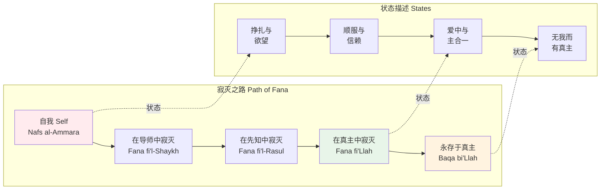
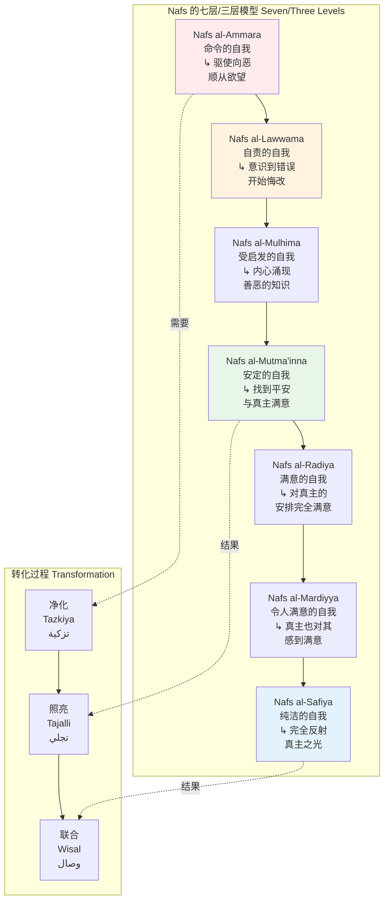
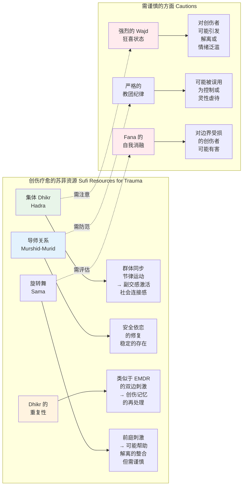
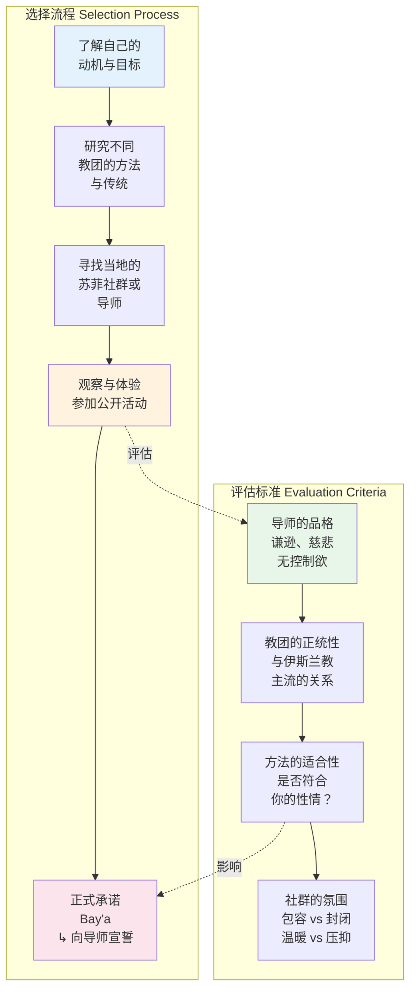

# 苏菲冥想/神秘主义专业概述

> **适用对象**：对伊斯兰神秘主义感兴趣的冥想练习者、宗教学研究者、跨传统灵修探索者、心理健康从业者
> **阅读时长**：约 50–60 分钟（可分段阅读）
> **实践建议**：配合正文中的阶段性练习，分 4–6 次完成，每次 15–20 分钟
> **最后更新**：2026-05

---

## 一、历史脉络：从禁欲到爱的神学

### 1.1 伊斯兰神秘主义的起源（8–10 世纪）

苏菲主义（Sufism, تصوف *Taṣawwuf*）并非独立于伊斯兰教之外的运动，而是**伊斯兰信仰的内在维度**——一种以亲证真主临在（Dhawq, ذوق）为核心的灵修路径。

```mermaid
graph TD
    subgraph 苏菲主义起源 Origins of Sufism
        O1[禁欲主义<br/>Zuhd, زهد<br/>↳ 对尘世执着<br/>的放下] --> O2[敬畏与希望<br/>Khawf & Raja'<br/>↳ 平衡对真主的<br/>畏惧与期盼]
        O2 --> O3[真诚<br/>Ikhlas, إخلاص<br/>↳ 一切只为真主<br/>而非世俗回报]
        O3 --> O4[爱的转向<br/>Mahabba, محبة<br/>↳ 从惧怕到热爱<br/>真主的转化]
    end

    subgraph 早期先驱 Early Pioneers
        P1[哈桑·巴士里<br/>Hasan al-Basri<br/>↳ 642-728] --> P1D[强调内心虔诚<br/>反对形式主义]
        P2[拉比亚·阿达维娅<br/>Rabia al-Adawiyya<br/>↳ 714-801] --> P2D[纯爱神学<br/>"若非因为爱<br/>我决不崇拜"]
        P3[祝奈德<br/>Junayd of Baghdad<br/>↳ 830-910] --> P3D[巴格达学派<br/>苏菲主义的<br/>系统化]
        P4[哈拉智<br/>Al-Hallaj<br/>↳ 858-922] --> P4D["我即真理"<br/>Ana al-Haqq<br/>→ 殉道]
    end

    O4 -.->|由谁完成| P2
    P1 -.->|影响| P3
    P3 -.->|与| P4

    style P2 fill:#fce4ec
    style P4 fill:#ffebee
    style O3 fill:#e8f5e9
    style O4 fill:#fff3e0
```

**关键转折点——从禁欲到爱**：

苏菲主义最初的形态是**禁欲主义**（Zuhd），强调对物质世界的疏离。但 8 世纪的巴士拉（Basra）出现了一场深刻的转变——以**拉比亚·阿达维娅**（Rabia al-Adawiyya）为代表的女性苏菲，将苏菲主义的核心从"**惧怕真主的惩罚**"转向"**因爱而爱真主**"。

拉比亚的著名祈祷：

> "主啊，若我崇拜你是出于对你的火狱的畏惧，请以火狱烧我；若我崇拜你是出于对你的乐园的渴望，请拒绝我进入乐园；**但若我崇拜你只是因为你，请不要将你的美withdrawn from my heart.**"

这一转向确立了苏菲主义的核心特质：**一种以爱为本位的神秘主义**。

### 1.2 黄金时代：安萨里、鲁米、伊本·阿拉比

```mermaid
graph LR
    subgraph 三大支柱 Three Pillars
        A1[安萨里<br/>Al-Ghazali<br/>↳ 1058-1111<br/>"伊斯兰的再生者"] --> A1D[将苏菲主义<br/>整合入正统<br/>伊斯兰教]<br/>《圣学复苏》
        R1[鲁米<br/>Jalal al-Din Rumi<br/>↳ 1207-1273] --> R1D[《玛斯纳维》<br/> Persian 诗歌的<br/>巅峰]<br/>梅夫拉维教团
        I1[伊本·阿拉比<br/>Ibn Arabi<br/>↳ 1165-1240] --> I1D[存在的单一论<br/>Wahdat al-Wujud<br/>《麦加的启示》]
    end

    subgraph 历史影响 Historical Impact
        H1[安萨里 →<br/>苏菲主义成为<br/>伊斯兰知识<br/>体系的一部分] --> H2[鲁米 →<br/>苏菲诗歌成为<br/>世界文学瑰宝]
        H2 --> H3[伊本·阿拉比 →<br/>影响整个伊斯兰<br/>世界的哲学与<br/>神秘思想]
    end

    A1D -.->|奠定| H1
    R1D -.->|创造| H2
    I1D -.->|塑造| H3

    style A1 fill:#e3f2fd
    style R1 fill:#fff3e0
    style I1 fill:#e8f5e9
    style H2 fill:#fce4ec
```

**安萨里（Al-Ghazali）的整合**：

在安萨里之前，苏菲主义常常被正统神学家视为异端。安萨里经历了深刻的个人危机（40 岁时辞去巴格达 Nizamiyya 学院的教授职位，退隐近 11 年），在《圣学复苏》（*Ihya Ulum al-Din*）中系统论证了苏菲主义的正统性。

| 贡献领域 | 具体内容 |
|---------|---------|
| **知识论** | 区分了启示知识（`Ilm al-Yaqin`）、眼见知识（`Ayn al-Yaqin`）和亲证知识（`Haqq al-Yaqin`）——苏菲的 Dhawq（品尝）属于最高层 |
| **伦理学** | 将苏菲的道德净化整合为伊斯兰教法的内在维度 |
| **心理学** | 详细分析了心的疾病（心病学）与治疗方法 |
| **灵修学** | 为后来的苏菲道路（Tariqa）奠定了理论和实践框架 |

**鲁米（Rumi）与诗歌**：

鲁米出生于中亚的巴尔赫（今阿富汗境内），后随家人迁居科尼亚（今土耳其）。他遇见了神秘流浪者**沙姆斯·大不里士**（Shams-i Tabrizi），这次相遇彻底改变了他的生命。

- **《玛斯纳维》**（*Mathnawi*, مثنوی）：六卷本的叙事诗，被誉为"波斯语的古兰经"，以故事、寓言和诗歌传授苏菲智慧
- **《沙姆斯集》**（*Diwan-i Shams*）：以沙姆斯之名创作的抒情诗集
- **梅夫拉维教团**（Mevlevi Order）：鲁米去世后，其追随者创立的教团，以"旋转舞"（Sama）闻名

**伊本·阿拉比（Ibn Arabi）的存在论**：

伊本·阿拉比提出了苏菲主义中最具哲学深度的理论——**存在的单一论**（Wahdat al-Wujud, وحدت الوجود）。

> "**存在**（Wujud）是单一的；万物只是这唯一存在的不同显现（Tajalli）。真主是隐藏的宝藏，渴望被认识，因此创造了宇宙来映照祂自己。"

这一理论既极具争议（被部分神学家视为泛神论），又深刻影响了后世苏菲思想、波斯诗歌和印度苏菲传统。

### 1.3 苏菲教团（Tariqa）的形成与发展

```mermaid
graph TD
    subgraph 主要教团 Major Tariqas
        Q1[卡迪里教团<br/>Qadiriyya<br/>↳ 12世纪<br/>创始人：Abd al-Qadir<br/>al-Jilani] --> Q1D[分布最广<br/>从摩洛哥到<br/>印尼]<br/>强调 Dhikr<br/>与忍耐
        N1[纳格什班迪教团<br/>Naqshbandiyya<br/>↳ 14世纪<br/>创始人：Baha al-Din<br/>Naqshband] --> N1D["沉默之路"<br/>强调内在 Dhikr<br/>与导师连接<br/>Rabita]<br/>中亚起源
        C1[契斯提教团<br/>Chishtiyya<br/>↳ 12世纪<br/>创始人：Muin al-Din<br/>Chishti] --> C1D[印度次大陆<br/>强调音乐与<br/>Sama]<br/>宽容与包容
        M1[梅夫拉维教团<br/>Mevlevi<br/>↳ 13世纪<br/>创始人：鲁米<br/>的后继者] --> M1D[旋转舞 Sama<br/>严格的仪式<br/>结构]<br/>土耳其为中心
        S1[沙兹里教团<br/>Shadhiliyya<br/>↳ 13世纪<br/>创始人：Abu al-Hasan<br/>al-Shadhili] --> S1D[北非、埃及<br/>强调自然生活<br/>不脱离社会]
    end

    subgraph 教团结构 Structure
        S1a[长老 Shaykh<br/>Murshid / Pir] --> S1b[哈里法 Khalifa<br/>代表长老]
        S1b --> S1c[穆里德 Murid<br/>修行者/学徒]
        S1c --> S1d[教团的灵性<br/>血缘 Isnad<br/>→ 追溯到先知]
    end

    style Q1 fill:#e3f2fd
    style N1 fill:#fff3e0
    style C1 fill:#e8f5e9
    style M1 fill:#fce4ec
    style S1 fill:#c8e6c9
```

**教团选择的考量**：

| 因素 | 说明 |
|-----|------|
| **地理与文化** | 不同教团与特定地区和文化紧密相连（如契斯提与印度、梅夫拉维与土耳其） |
| **方法偏好** | 有人喜欢出声的 Dhikr，有人喜欢静默的 Dhikr；有人喜欢 Sama，有人喜欢独自静修 |
| **导师缘分** | 在苏菲传统中，找到一位与自己心灵契合的导师（Murshid/Pir）是最关键的 |
| **与伊斯兰教法的张力** | 不同教团对伊斯兰教法（Sharia）的严格程度不同——从严格遵守到更自由的诠释 |

---

## 二、核心理论

### 2.1 Tawhid：一元论作为根基

**Tawhid**（توحيد）是伊斯兰信仰的核心——真主的独一性。但在苏菲主义中，Tawhid 不仅是教义命题，更是**可被亲证的实相**。

```mermaid
graph TD
    subgraph Tawhid 的三个层次 Three Levels
        T1[Tawhid al-Uluhiyya<br/>崇拜的独一<br/>↳ 只崇拜<br/>独一真主] --> T2[Tawhid al-Rububiyya<br/>养主的独一<br/>↳ 真主是<br/>一切存在<br/>的维系者]
        T2 --> T3[Tawhid al-Asma wa'l-Sifat<br/>尊名与属性的独一<br/>↳ 真主的尊名<br/>是认识祂的<br/>途径]
    end

    subgraph 苏菲的深化 Sufi Deepening
        S1[从"知道"<br/>到"亲证"<br/>From Ilm to Dhawq] --> S2[真主不仅是<br/>"一"，更是<br/>"唯一的真实"]
        S2 --> S3[万物是<br/>真主尊名的<br/>显现 Tajalli]
        S3 --> S4[最终在<br/>寂灭 Fana 中<br/>见证独一]
    end

    T3 -.->|苏菲深化| S1
    S4 -.->|回归| T1

    style T3 fill:#e3f2fd
    style S2 fill:#fff3e0
    style S4 fill:#e8f5e9
```

### 2.2 Fana 与 Baqa：寂灭与永存

这是苏菲神秘主义中最核心的成对概念：

| 概念 | 阿拉伯文 | 含义 | 对应阶段 |
|-----|---------|------|---------|
| **Fana** | فناء | 寂灭、消融、自我消亡 | 个体自我在真主中的消融；所有非真主之物的消逝 |
| **Baqa** | بقاء | 永存、存续、在真主中存活 | 在 Fana 之后，以真主的生命为生命而存活 |
| **Fana fi'l-Shaykh** | فناء في الشيخ | 在导师中寂灭 | 初级阶段——放下自我意志，完全顺服导师 |
| **Fana fi'l-Rasul** | فناء في الرسول | 在先知中寂灭 | 中级阶段——与先知的典范生命合一 |
| **Fana fi'Llah** | فناء في الله | 在真主中寂灭 | 最高阶段——在真主中失去自我 |



**鲁米的诗意表达**：

> "我死了，从动物性中；我死了，从天使性中。什么我都无法言说——只有我被煮过、被煮过、被煮过。"
> 
> "灯说：'当我熄灭，你将看到火焰。'"

### 2.3 Nafs：自我的层级

苏菲心理学对自我（Nafs, نفس）有着精细的分析，远比现代心理学的"自我"概念复杂。



**简化的三层模型**（最常用于实践）：

| 层级 | 名称 | 特征 | 转化方法 |
|-----|------|------|---------|
| **第一层** | Nafs al-Ammara（命令的自我） | 被欲望和愤怒驱使；自我中心；与真主疏远 | 苦修（Mujahada）、忏悔（Tawba）、 Dhikr |
| **第二层** | Nafs al-Lawwama（自责的自我） | 开始意识到错误；内心有善恶的争战；不断悔改 | 持续的 Dhikr、遵行教法（Sharia）、亲近善友 |
| **第三层** | Nafs al-Mutma'inna（安定的自我） | 找到内心的平安；对真主的安排满意；稳定的灵性状态 | 深度 Dhikr、Muraqaba（观照）、在导师指导下的进阶修习 |

### 2.4 心镜理论

苏菲传统将**心**（Qalb, قلب）视为灵性知识的核心器官——不是解剖学的心脏，而是"真主在人内的居所"。

```mermaid
graph TD
    subgraph 心的理论 Theory of the Heart
        Q1[心 Qalb<br/>قلب] --> Q2[心的性质<br/>↳ 比理性<br/>更深层]<br/>↳ 能"认识"<br/>真主
        Q2 --> Q3[心的状态<br/>如镜子]
    end

    subgraph 镜子的状态 States of the Mirror
        M1[锈迹 Rust<br/>↳ 欲望、执着<br/>自我中心] --> M2[擦拭 Polishing<br/>↳ Dhikr、忏悔<br/>服务、爱]
        M2 --> M3[明亮 Bright<br/>↳ 反射真主之光<br/>Nur]
        M3 --> M4[破碎 Shattered<br/>↳ 在爱中破碎<br/>真主直接进入]
    end

    subgraph 著名圣训 Hadith
        H1["真主说：<br/>诸天与大地<br/>不能容纳我，<br/>但信者的心<br/>能容纳我。"]<br/>↳ 圣训 Qudsi
    end

    Q3 -.->|比喻| M1
    M3 -.->|对应| H1

    style Q1 fill:#e3f2fd
    style M1 fill:#ffebee
    style M3 fill:#e8f5e9
    style M4 fill:#fff3e0
    style H1 fill:#fce4ec
```

**著名圣训**（Hadith Qudsi）：

> "我的仆人以善行接近我，直到我以他为友。当我以他为友时，我就是他用来听的听力、用来看的视力、用来抓的手、用来行走的脚。"

这一圣训是苏菲主义关于**人神联合**的最重要经文依据之一。

---

## 三、主要修习技术

### 3.1 Dhikr：齐克尔——念诵真主名

Dhikr（ذِكْر）意为"记念"，是苏菲传统最核心的修习。古兰经多次命令信者"记念真主"（如 33:41："信士们啊！你们应当常常记念真主"）。

```mermaid
graph TD
    subgraph Dhikr 的形式 Forms of Dhikr
        D1[口头 Dhikr<br/>Jahri, جهر<br/>↳ 出声念诵] --> D1D[个体念诵<br/>或集体圆圈<br/>Hadra]<br/>配合呼吸<br/>与身体动作
        D2[内心 Dhikr<br/>Khafi, خفي<br/>↳ 静默念诵] --> D2D[纳格什班迪<br/>传统核心]<br/>心在念<br/>而无口动
        D3[状态 Dhikr<br/>Hal, حال<br/>↳ 在一切状态中<br/>觉知真主] --> D3D[高级阶段<br/>心在呼吸间<br/>持续记念]
    end

    subgraph 常见的念诵词 Common Formulas
        F1[La ilaha illallah<br/>لا إله إلا الله<br/>除真主外<br/>别无神祇] --> F2[Allah<br/>الله<br/>真主之名]
        F2 --> F3[Huwa / Hu<br/>هو<br/>"祂"]<br/>最简形式
        F3 --> F4[其他尊名<br/>Ya Rahman<br/>Ya Rahim<br/>等]
    end

    D1 -.->|使用| F1
    D2 -.->|使用| F2
    D3 -.->|使用| F3

    style D1 fill:#e3f2fd
    style D2 fill:#fff3e0
    style D3 fill:#e8f5e9
    style F1 fill:#fce4ec
    style F3 fill:#c8e6c9
```

**Dhikr 的呼吸配合方法**：

| 念诵词 | 吸气 | 呼气 | 适用教团/情境 |
|-------|------|------|-------------|
| **La ilaha illallah** | La ilaha（除……外别无神祇） | illallah（唯有真主） | 通用；卡迪里教团常用 |
| **Allah** | Allah（在心中默念） | （释放，沉默中感受） | 通用；初学者友好 |
| **Hu / Huwa** | Hu（无声吸气） | （无声呼气） | 纳格什班迪传统；进阶 |
| **Ya Rahman, Ya Rahim** | Ya Rahman（啊，至仁的） | Ya Rahim（啊，至慈的） | 寻求安慰与治愈时 |

**集体 Dhikr（Hadra）**：

在集体 Dhikr 中，参与者围成圆圈，通常有一位领念者（Munshid）带领。伴随着 Dhikr 的还有：
- **身体摆动**：随着念诵的节奏前后或左右摇摆
- **声音变化**：从低声到高声，形成声波共振
- **Nafkh（吹气）**：某些教团在高潮时，导师向学徒吹气，象征神圣恩宠的传递
- **Wajd（出神状态）**：部分参与者可能进入强烈的灵性狂喜状态

### 3.2 Sama / Whirling：旋转舞

Sama（سماع）意为"聆听"，是梅夫拉维教团最著名的仪式。在西方常被称为"旋转舞"（Whirling Dervishes）。

```mermaid
graph TD
    subgraph Sama 仪式结构 Structure of Sama
        S1[开场<br/>Na't<br/>↳ 对先知<br/>的赞颂] --> S2[笛声<br/>Ney Taksim<br/>↳ 芦笛独奏<br/>象征灵魂的<br/>呼唤]
        S2 --> S3[鼓声<br/>Kudum<br/>↳ " Kun!"<br/>创造之音]
        S3 --> S4[旋转<br/>Ayın<br/>↳ 核心仪式]<br/>分为四部分<br/>Salam
        S4 --> S5[结束<br/>Qur'an<br/>↳ 诵读古兰经<br/>祈祷]
    end

    subgraph 旋转的象征 Symbolism of Whirling
        W1[右手向上<br/>接收真主的<br/>恩宠] --> W2[左手向下<br/>将恩宠传向<br/>大地与众人]
        W2 --> W3[身体旋转<br/>如行星绕日<br/>↳ 宇宙秩序<br/>的微缩]
        W3 --> W4[长袍飞起<br/>如棺材的<br/>裹尸布<br/>↳ 象征死亡<br/>于自我]
        W4 --> W5[高帽 Tombuk<br/>↳ 象征自我的<br/>墓碑]<br/>自我的死亡
    end

    S4 -.->|体现| W1
    W5 -.->|回归| S5

    style S2 fill:#e3f2fd
    style S4 fill:#fff3e0
    style W3 fill:#e8f5e9
    style W4 fill:#fce4ec
```

**旋转的技术要点**：

| 要素 | 说明 |
|-----|------|
| **姿势** | 双臂展开，右手掌心向上（接收），左手掌心向下（给予）；头微微右倾 |
| **旋转轴** | 以左脚为轴，右脚推动；左脚始终不离"地面"——象征与泥土/受造物的连接 |
| **眼睛** | 半睁或微闭，视线柔和 |
| **长袍** | 白色长袍（Tenore）象征葬礼裹尸布；黑色斗篷（Hırka）象征坟墓；高帽（Sikke）象征墓碑 |
| **速度** | 从缓慢开始，逐渐加速；经验丰富的旋转者每分钟可达 30–40 转 |
| **训练** | 需要长期训练；初学者从短时间（1–2 分钟）开始，逐步增加 |

**安全注意**：
- 旋转可能导致眩晕、恶心甚至晕厥——初学者必须在有经验的导师指导下练习
- 不要在饱腹、饮酒或疲劳时旋转
- 有前庭功能障碍、眩晕症或心血管疾病者不应尝试
- 旋转不是"表演"，而是**敬拜**——需在适当的仪式语境中进行

### 3.3 Muraqaba：观照冥想

Muraqaba（مراقبة）意为"观照"、"守护"，是苏菲传统中与 Dhikr 并列的核心修习。

```mermaid
graph LR
    subgraph Muraqaba 的类型 Types of Muraqaba
        M1[心位观照<br/>Muraqaba of the Heart] --> M1D[闭眼，注意力<br/>集中于胸部<br/>心脏区域]<br/>观想真主之光<br/>照亮内心
        M2[肚脐观照<br/>Muraqaba of the Navel] --> M2D[注意力集中于<br/>肚脐下方<br/>呼吸之源]<br/>部分教团使用
        M3[光之观照<br/>Muraqaba of Light] --> M3D[观想真主的<br/>光 Nur 从头顶<br/>进入，充满全身]
        M4[导师观照<br/>Rabita<br/>رابطة] --> M4D[观想导师的面容<br/>或心象<br/>建立灵性连接]
    end

    subgraph 技术流程 Technical Process
        T1[坐下，脊柱挺直] --> T2[闭眼，放松全身]
        T2 --> T3[将注意力<br/>集中于所选<br/>焦点]
        T3 --> T4[当分心时<br/>温和带回<br/>不责备]
        T4 --> T5[保持 Dhikr<br/>在背景中]
    end

    M1 -.->|技术| T3
    M4 -.->|技术| T3

    style M1 fill:#e3f2fd
    style M3 fill:#fff3e0
    style M4 fill:#e8f5e9
    style T3 fill:#fce4ec
```

**心位观照的详细指引**：

1. **坐姿**：散盘或椅子坐，脊柱挺直但不僵硬，双手自然放在膝盖或大腿上
2. **闭眼**：轻轻闭上眼睛，放松面部肌肉
3. **定位心位**：将注意力轻轻放在胸部中央——不是解剖学的心脏位置，而是象征性的"心灵中心"
4. **引入 Dhikr**：在心位轻轻念诵"Allah"或"Hu"——不是用嘴唇，而是用心
5. **观想光**：可以观想从头顶有一束柔和的光进入身体，下降至心位，在心中扩散
6. **处理分心**：当思想、情感或身体感受分散注意力时，温和地回到心位和 Dhikr
7. **时长**：初学者 10–15 分钟，逐步增加至 30 分钟或更长

### 3.4 配合真主名的呼吸法

这是 Dhikr 与呼吸的精密整合，不同教团有不同的方法。

| 方法名称 | 操作 | 来源/教团 |
|---------|------|----------|
| **Hosh dar dam** | 每次呼吸时保持对真主的觉知；吸气时"进入"真主，呼气时"从"真主流出 | 纳格什班迪教团 |
| **Safar dar watan** | "在故乡中旅行"——在外部活动中保持内心的 Dhikr；呼吸是锚点 | 纳格什班迪教团 |
| **Nazar bar qadam** | "注视脚步"——行走时将 Dhikr 与脚步配合；一步一个真主名 | 纳格什班迪教团 |
| **呼吸计数 Dhikr** | 每 100 次呼吸为一个周期，配合特定的念诵次数 | 卡迪里教团（部分分支） |

**纳格什班迪呼吸法的详细步骤**：

```mermaid
graph LR
    subgraph Hosh dar dam
        A1[吸气<br/>想象从<br/>右肩进入] --> A2[气息在体内<br/>下降]<br/>心中念诵<br/>真主之名
        A2 --> A3[呼气<br/>想象从左肩<br/>流出]
        A3 --> A4[在呼吸的<br/>间隙中<br/>保持觉知]
    end

    subgraph 进阶 Advanced
        B1[在呼吸中<br/>觉知真主的<br/>"气息"] --> B2[每次呼吸<br/>都是真主的<br/>创造之音<br/>"Kun!"]
        B2 --> B3[最终状态<br/>呼吸即 Dhikr<br/>Dhikr 即呼吸]
    end

    A4 -.->|深化| B1

    style A2 fill:#e3f2fd
    style A4 fill:#fff3e0
    style B3 fill:#e8f5e9
```

### 3.5 Rabita：与导师的精神连接

Rabita（رابطة）是苏菲传统中独特而重要的修习——通过观想与灵性导师（Shaykh/Pir）建立持续的精神连接。

```mermaid
graph TD
    subgraph Rabita 修习 Practice of Rabita
        R1[观想导师的面容<br/>或心象] --> R2[感受导师的<br/>临在与光芒]
        R2 --> R3[将自心向<br/>导师敞开]
        R3 --> R4[接受导师的<br/>精神恩宠 Fayd]
        R4 --> R5[在日常生活中<br/>保持此连接]
    end

    subgraph 原理 Principle
        P1[导师是<br/>已完成的<br/>镜子] --> P2[通过观想<br/>镜子]<br/>学习者的心<br/>也被照亮
        P2 --> P3[如同电路<br/>导师是已连接<br/>电源的导线]
        P3 --> P4[学习者通过<br/>Rabita<br/>间接连接<br/>电源]
    end

    R3 -.->|原理| P2
    R4 -.->|原理| P3

    style R1 fill:#e3f2fd
    style R4 fill:#e8f5e9
    style P2 fill:#fff3e0
    style P3 fill:#fce4ec
```

**Rabita 的操作步骤**：

1. **获得导师的照片或心象**：通常是导师的面部照片；如果没有照片，可以在心中回忆或想象导师的面容
2. **观想**：在冥想开始时，先在心中清晰呈现导师的面容——通常是在心位或两眉之间
3. **感受连接**：感受从导师的心流向自己的心的一种"光"或"能量"
4. **保持连接**：在整个 Dhikr 或 Muraqaba 过程中，保持这一连接在背景中
5. **日常中维持**：不仅在正式修习时，在日常生活中也尝试保持对导师的觉知

**现代注意事项**：
- Rabita 容易被误解为"个人崇拜"或"迷信"——在传统中，它有着深刻的**心灵传递**（Baraka / Fayd）理论基础
- 如果没有个人导师，有些教团允许观想**教团的创立者**（如观想鲁米、Abd al-Qadir al-Jilani 等）
- 在心理治疗框架下，Rabita 可以被视为一种**安全依恋的内化**——但苏菲传统会坚持其超越心理学的灵性维度

---

## 四、苏菲诗歌与智慧

### 4.1 鲁米《玛斯纳维》：灵魂的长诗

```mermaid
graph TD
    subgraph 《玛斯纳维》结构 Mathnawi Structure
        M1[卷一<br/>芦笛之歌<br/>↳ 灵魂的<br/>分离与渴望] --> M2[卷二<br/>托钵僧与<br/>骄傲之谷]
        M2 --> M3[卷三<br/>爱中的<br/>谦卑与<br/>死亡]
        M3 --> M4[卷四<br/>理性与<br/>疯狂的辩证]
        M4 --> M5[卷五<br/>合一之路<br/>的障碍]
        M5 --> M6[卷六<br/>回归源头<br/>完满]
    end

    subgraph 核心主题 Core Themes
        T1[分离与渴望<br/>Separation & Longing] --> T2[爱的疯狂<br/>Majnun / Divine Madness]
        T2 --> T3[导师的重要性<br/>The Guide]
        T3 --> T4[死亡与重生<br/>Death & Rebirth]
    end

    M1 -.->|体现| T1
    M3 -.->|体现| T2

    style M1 fill:#e3f2fd
    style M3 fill:#fce4ec
    style T1 fill:#fff3e0
    style T2 fill:#e8f5e9
```

**《玛斯纳维》开篇——芦笛之歌**（选段）：

> "请听这芦笛的故事，它在诉说着分离：
> 自从他们把我从芦苇丛中割下，
> 我的悲歌就令男女心碎。
> 我渴望那片因分离而破碎的心——
> 只有那些与源头分离的人，才能给我慰藉。"

这段开篇诗是整部《玛斯纳维》的缩影：**灵魂因与神圣源头的分离而痛苦，而正是这种痛苦本身，成为了回归的道路**。

### 4.2 哈菲兹（Hafiz）：酒的神秘诗学

哈菲兹（约 1315–1390）是波斯抒情诗（Ghazal）的最高代表。他的诗歌以**酒、爱、夜莺、玫瑰**等意象编织出复杂的神秘网络。

| 意象 | 表面含义 | 神秘含义 |
|-----|---------|---------|
| **酒**（Mey, می） | 酒精饮料 | 神圣的爱之狂喜（Wajd）；灵性知识（Irfan） |
| **酒保**（Saqi, ساقی） | 倒酒的人 | 灵性导师；神圣恩典的给予者 |
| **酒肆**（Kharabat, خرابات） | 酒馆 | 苏菲的聚会场所；放弃世俗之地 |
| **夜莺**（Bulbul, بلبل） | 歌唱的鸟 | 渴望的灵魂；被玫瑰（真主之美）吸引的爱者 |
| **玫瑰**（Gul, گل） | 花 | 真主的美（Jamal）；神圣之爱的对象 |
| **朝觐**（Hajj, حج） | 麦加朝圣 | 心的转向；在爱中朝觐真主 |

**哈菲兹诗选**（意译）：

> "即便朝觐之地是麦加，
> 我的朝圣之所是她弯下的眉毛。
> 一百次天房之游，不如一次酒肆之醉——
> 那里，破碎的心才找到家。"

### 4.3 拉比亚·阿达维娅：纯爱神学的先驱

拉比亚（Rabia al-Adawiyya, 714–801）是苏菲历史上最重要的女性人物之一。作为一个曾经的奴隶，她通过自己的灵性深度彻底改变了苏菲主义的方向。

```mermaid
graph TD
    subgraph 拉比亚的教导 Rabia's Teachings
        R1[纯爱神学<br/>Pure Love] --> R2[不为天堂<br/>不为火狱<br/>只为真主]
        R2 --> R3[爱的独占性<br/>Exclusivity]<br/>真主是唯一的<br/>爱的对象
        R3 --> R4[女性的灵性<br/>权威<br/>Authority] --> R4D[作为女性<br/>在男性主导的<br/>时代确立<br/>灵性权威]
    end

    subgraph 著名传说 Stories
        S1[手提灯寻主] --> S1D["我在寻找<br/>那位点燃<br/>灯的人"]
        S2[打碎陶罐] --> S2D["我忙于<br/>记念真主<br/>忘了给<br/>陶罐注水"]
    end

    R2 -.->|传说体现| S1
    R3 -.->|传说体现| S2

    style R1 fill:#fce4ec
    style R2 fill:#fff3e0
    style R4 fill:#e3f2fd
```

---

## 五、与现代心理学的交汇

### 5.1 情绪转化的独特视角

苏菲传统对情绪（尤其是"负面"情绪）有着与现代心理学截然不同但可互补的理解。

```mermaid
graph TD
    subgraph 苏菲的情绪观 Sufi View of Emotions
        E1[欲望 Shahwa<br/>شهوة] --> E1D[不是被压抑<br/>而是被转化<br/>→ 对真主的渴望]
        E2[愤怒 Ghadab<br/>غضب] --> E2D[不是被发泄<br/>而是被净化<br/>→ 对不义的<br/>正义愤慨]
        E3[悲伤 Huzn<br/>حزن] --> E3D[不是被消除<br/>而是被升华<br/>→ 因分离<br/>真主而哭泣]
        E4[恐惧 Khawf<br/>خوف] --> E4D[不是被克服<br/>而是被深化<br/>→ 敬畏真主]<br/>Khashya
    end

    subgraph 转化路径 Transformation
        T1[承认情绪<br/>的存在] --> T2[不认同情绪<br/>为"我的"]
        T2 --> T3[在 Dhikr 中<br/>将情绪的方向<br/>转向真主]
        T3 --> T4[情绪成为<br/>灵性燃料]
    end

    E1D -.->|转化路径| T2
    E3D -.->|转化路径| T3

    style E1 fill:#ffebee
    style E2 fill:#fff3e0
    style E3 fill:#e3f2fd
    style E4 fill:#e8f5e9
    style T3 fill:#fce4ec
```

**与西方心理学的比较**：

| 维度 | 现代西方心理学 | 苏菲传统 |
|-----|-------------|---------|
| **情绪调节目标** | 情绪平衡、适应性功能 | 情绪的神圣转化；将一切情感能量转向真主 |
| **悲伤的处理** | 悲伤工作（Grief Work）；哀悼过程 | 悲伤可以成为"喜极而泣"（Buka）——因思念真主而哭泣是一种祝福 |
| **愤怒的处理** | 愤怒管理；认知重评；安全表达 | 愤怒被净化为"对真主的热情"（Ghairat） |
| **欲望的处理** | 欲望的满足或升华 | 欲望不被满足也不被压抑，而是被"重新定向"到终极对象 |
| **恐惧的处理** | 暴露疗法；认知行为干预 | 恐惧被转化为"敬畏"（Khashya）——一种在真主面前的庄重与战兢 |

### 5.2 与创伤疗愈的关系

苏菲传统中的某些元素与当代创伤知情（Trauma-Informed）方法有着有趣的对应：



**实证研究**：

| 研究领域 | 发现 | 研究者 |
|---------|------|--------|
| **Dhikr 与焦虑** | 规律的 Dhikr 练习与更低的焦虑水平和更高的灵性幸福感相关 | Keshavarzi & Haque (2013) |
| **旋转与解离** | 苏菲旋转可能诱导类似于轻度解离的状态，但在受控仪式语境中通常被整合为灵性经验 | Andeweg et al. (2009) |
| **苏菲诗歌治疗** | 鲁米和哈菲兹的诗歌被用于诗歌治疗（Poetry Therapy），帮助表达难以言说的情感 | Mazza (2017) |
| **集体仪式与压力** | 参与集体苏菲仪式（Hadra）与较低的皮质醇水平和更高的催产素水平相关 | field studies, limited |

### 5.3 神经科学视角

```mermaid
graph TD
    subgraph 苏菲修习的神经机制 Neuroscience of Sufi Practices
        D1[Dhikr 重复念诵] --> D1D[前额叶激活<br/>↓<br/>杏仁核活动降低<br/>→ 焦虑减少]
        D2[Muraqaba 观照] --> D2D[岛叶激活<br/>↑<br/>内感受增强<br/>→ 身体觉知]<br/>默认模式网络<br/>↓
        D3[Sama 旋转] --> D3D[前庭系统刺激<br/>→ 独特的意识<br/>状态；内源性<br/>大麻素释放？]
        D4[集体仪式] --> D4D[同步行为<br/>→ 镜像神经元<br/>激活 → 群体<br/>认同感]<br/>催产素↑
    end

    subgraph 长期效应 Long-term Effects
        L1[规律 Dhikr<br/>6 个月+] --> L2[前额叶-杏仁核<br/>连接增强]
        L2 --> L3[心率变异性 HRV<br/>↑<br/>副交感张力增强]
        L3 --> L4[压力应对能力<br/>↑<br/>情绪调节改善]
    end

    D1D -.->|长期效应| L2
    D2D -.->|长期效应| L3

    style D1 fill:#e3f2fd
    style D2 fill:#fff3e0
    style D4 fill:#e8f5e9
    style L3 fill:#fce4ec
```

---

## 六、实践指引与注意事项

### 6.1 伊斯兰信仰基础

苏菲修习不是独立于伊斯兰教的"技术"，而是**植根于伊斯兰信仰**的内在维度。

```mermaid
graph TD
    subgraph 伊斯兰基础 Islamic Foundation
        I1[信仰告白<br/>Shahada<br/>↳ 除真主外<br/>别无神祇<br/>穆罕默德是<br/>真主的使者] --> I2[礼拜 Salat<br/>↳ 每日五次]<br/>身体朝向<br/>麦加
        I2 --> I3[斋戒 Sawm<br/>↳ 莱麦丹月]<br/>克制欲望
        I3 --> I4[天课 Zakat<br/>↳ 净化财富]
        I4 --> I5[朝觐 Hajj<br/>↳ 若能力所及]
    end

    subgraph 苏菲深化 Sufi Deepening
        S1[Dhikr<br/>记念真主] --> S2[Muraqaba<br/>观照冥想]
        S2 --> S3[在导师指导下的<br/>灵性道路<br/>Suluk]
        S3 --> S4[最终目标<br/>Ma'rifa<br/>亲证真主]
    end

    I2 -.->|深化| S1
    I1 -.->|根基| S4

    style I1 fill:#e3f2fd
    style I2 fill:#fff3e0
    style S1 fill:#e8f5e9
    style S4 fill:#fce4ec
```

**非穆斯林的参与考量**：

| 层面 | 说明 |
|-----|------|
| **Dhikr** | 念诵"La ilaha illallah"涉及信仰告白——非穆斯林应谨慎，或选择中性的 Dhikr（如只是聆听） |
| **Muraqaba** | 观照冥想的技术层面可以与信仰分离；但将 Muraqaba 与"真主临在"的概念结合时，涉及信仰 |
| **Sama** | 作为文化表演观看通常被接受；作为敬拜参与则需要尊重其宗教性质 |
| **诗歌与智慧** | 鲁米和哈菲兹的诗歌是普世文学遗产，任何人都可以阅读和受益 |
| **导师关系** | 正式成为 Murid（学徒）通常需要接受 Shahada（信仰告白） |

### 6.2 教团选择指南



**不同教团的方法对比**：

| 教团 | 核心方法 | 氛围 | 适合人群 |
|-----|---------|------|---------|
| **卡迪里 Qadiriyya** | 出声 Dhikr、Wazifa（特定念诵）、宽容的方法 | 热烈、包容 | 初学者；喜欢集体能量的人 |
| **纳格什班迪 Naqshbandiyya** | 内心 Dhikr、Rabita、严格的纪律 | 安静、严谨 | 自律性强；喜欢内在工作的人 |
| **契斯提 Chishtiyya** | Sama、音乐、诗歌、服务 | 温暖、艺术化 | 艺术家；被音乐和诗歌吸引的人 |
| **梅夫拉维 Mevlevi** | Sama 旋转、Rumi 诗歌、系统训练 | 仪式感强、优雅 | 喜欢结构化仪式和身体修习的人 |
| **沙兹里 Shadhiliyya** | 自然中的 Dhikr、不脱离社会、简约的修习 | 低调、日常化 | 希望在日常生活中灵性成长的人 |

### 6.3 文化敏感性

| 议题 | 注意事项 |
|-----|---------|
| **东方主义** | 避免将苏菲主义浪漫化为"异域的"、"神秘的东方"；尊重其作为活生生的宗教传统 |
| **文化挪用** | 区分"学习"与"挪用"；尊重传统的完整性和其宗教语境 |
| **商业化** | 警惕将苏菲修习（尤其是旋转舞）商业化为"表演"或"旅游体验" |
| **性别议题** | 不同教团和社群对女性的参与有不同的规定；需要了解和尊重当地的实践 |
| **政治语境** | 在某些国家，苏菲教团面临政治压力甚至迫害；需要了解当地语境 |

### 6.4 与主流伊斯兰教的关系

苏菲主义在伊斯兰世界中的地位复杂而多样：

```mermaid
graph LR
    subgraph 态度谱系 Spectrum of Attitudes
        A1[支持<br/>Supportive] --> A1D[多数穆斯林<br/>国家的主流<br/>苏菲教团深植<br/>于社会]
        A2[中立<br/>Neutral] --> A2D[认为苏菲是<br/>可选的<br/>个人灵修]<br/>非必要
        A3[批判<br/>Critical] --> A3D[萨拉菲主义等<br/>认为部分苏菲<br/>实践是异端<br/>Bid'a]
        A4[迫害<br/>Persecution] --> A4D[极端组织<br/>（如 ISIS）<br/>攻击苏菲圣地<br/>和仪式]
    end

    subgraph 历史事实 Historical Facts
        H1[苏菲主义<br/>在伊斯兰<br/>黄金时代<br/>是知识<br/>创新的核心] --> H2[许多伟大的<br/>伊斯兰学者<br/>都是苏菲]
        H2 --> H3[苏菲教团<br/>在历史上<br/>传播了伊斯兰<br/>到亚洲和<br/>非洲]
    end

    A1 -.->|历史基础| H1
    H2 -.->|反驳| A3

    style A1 fill:#e8f5e9
    style A3 fill:#fff3e0
    style A4 fill:#ffebee
    style H2 fill:#e3f2fd
```

**现代实践建议**：
- 在学习和参与苏菲修习时，**了解其伊斯兰根基**，不要将苏菲主义从伊斯兰教中剥离
- **尊重不同穆斯林对苏菲的态度**——不要预设所有穆斯林都是苏菲，或所有苏菲都被其他穆斯林接受
- **避免将苏菲主义作为"更好的伊斯兰教"**来宣扬——这种态度既冒犯了非苏菲穆斯林，也简化了苏菲传统的复杂性

---

## 七、不同修习方法的对比表

### 7.1 核心方法综合对比

| 方法 | 阿拉伯文/波斯文 | 核心动作 | 呼吸配合 | 身体参与 | 声音参与 | 适合阶段 | 主要效果 |
|-----|--------------|---------|---------|---------|---------|---------|---------|
| **Dhikr（出声）** | ذِكْر | 重复念诵真主名 | 吸气/呼气配合念诵 | 轻度（坐姿摇摆） | 是 | 所有阶段 | 聚焦、净化、社群连接 |
| **Dhikr（内心）** | ذِكْر خفي | 在心中默念 | 呼吸与心念同步 | 无 | 否 | 中高级 | 深层专注、内在化 |
| **Muraqaba** | مراقبة | 观照心位或光 | 自然呼吸 | 坐姿 | 否 | 中高级 | 内感受增强、平静 |
| **Sama / 旋转** | سماع | 身体旋转 | 与旋转节奏同步 | 高度 | 否（但伴随音乐） | 中高级（需训练） | 狂喜、忘我、整合 |
| **Rabita** | رابطة | 观想导师面容 | 自然呼吸 | 坐姿 | 否 | 中高级 | 安全依恋、恩宠传递 |
| **Hadra** | حضرة | 集体出声 Dhikr | 群体同步呼吸 | 中度（摇摆、站立） | 是（群体） | 所有阶段 | 集体能量、强烈联结 |

### 7.2 每日修习建议结构

```mermaid
graph LR
    subgraph 晨间 Morning
        M1[晨礼后的<br/>Dhikr<br/>10-15 min] --> M2[Muraqaba<br/>观照心位<br/>10-20 min]
    end

    subgraph 日间 Daytime
        D1[行走 Dhikr<br/>Nazar bar qadam] --> D2[工作间隙<br/>简短 Dhikr<br/>1-2 min]
    end

    subgraph 晚间 Evening
        E1[晚礼后的<br/>Dhikr<br/>10-15 min] --> E2[夜间的<br/>Muraqaba<br/>或 Rabita]<br/>睡前
    end

    M2 -.->|贯穿| D1
    D2 -.->|准备| E1

    style M1 fill:#e3f2fd
    style M2 fill:#fff3e0
    style E1 fill:#e8f5e9
    style E2 fill:#fce4ec
```

---

## 八、常见挑战与应对

### 8.1 修习中的困难

| 困难 | 原因 | 应对 |
|-----|------|------|
| **念诵时心不在焉** | 只是机械重复，心不在 Dhikr | 放慢速度；每次念诵都尝试"品味"真主名的意义；结合呼吸 |
| **强烈的情绪涌现** | 被压抑的情绪在静默中浮现 | 不要停止 Dhikr；允许情绪存在但不被卷走；必要时寻求导师或心理咨询师 |
| **恐惧或不安** | 对"失去自我"的恐惧；对神秘经验的恐惧 | 与导师讨论；确认是否在安全的框架内；放慢修习节奏 |
| **身体疼痛或不适** | 长时间坐姿；呼吸过度 | 调整坐姿；缩短时间；确保没有强迫自己 |
| **对导师的失望** | 理想化后的幻灭；导师的人性弱点 | 区分"导师作为人"和"导师作为精神通道"；必要时可以更换导师 |
| **与伊斯兰教法（Sharia）的冲突** | 苏菲修习被周围的保守穆斯林质疑 | 了解你所走的教团的正统性；与开明的宗教学者对话；不要独自对抗 |

### 8.2 "灵性 bypassing" 的警惕

苏菲传统中的某些概念（如 Fana、Tawakkul/信托真主）可能被误用为**逃避现实责任**的工具。

```mermaid
graph TD
    subgraph 健康的路径 Healthy Path
        H1[认识到<br/>自我中心] --> H2[在 Dhikr 中<br/>放下自我]
        H2 --> H3[获得内心的<br/>平安与清明]
        H3 --> H4[更有效地<br/>行动于世界<br/>服务他人]
    end

    subgraph 逃避的路径 Bypassing Path
        B1[逃避困难<br/>情绪或责任] --> B2[用"信托真主"<br/>合理化不作为]
        B2 --> B3[用"一切都是<br/>真主的安排"<br/>放弃努力]
        B3 --> B4[灵性上的<br">冷漠与<br/>脱离现实]
    end

    H3 -.->| vs | B2

    style H3 fill:#e8f5e9
    style H4 fill:#c8e6c9
    style B2 fill:#fff3e0
    style B4 fill:#ffebee
```

**检验标准**：
- 修习后是否更有能力爱和服务他人？还是更疏离和冷漠？
- 是否用"灵性"来逃避困难的关系、工作或责任？
- 是否对受苦的人更有同情心？还是更"超然"？

---

## 九、延伸阅读与参考

### 经典苏菲文本

- **《玛斯纳维》** *Mathnawi* — 鲁米（Jalal al-Din Rumi）；推荐 Coleman Barks 的英文意译版（虽非学术翻译，但传达了诗意）
- **《圣学复苏》** *Ihya Ulum al-Din* — 安萨里（Al-Ghazali）；Fazul-ul-Karim 英文译本
- **《麦加的启示》** *Al-Futuhat al-Makkiyya* — 伊本·阿拉比（Ibn Arabi）
- **《智慧的珍宝》** *Fusus al-Hikam* — 伊本·阿拉比
- **《哈菲兹诗集》** *Divan of Hafiz* — 哈菲兹；推荐 Ladinsky 的现代诠释版
- **《苏道旅程》** *Kashf al-Mahjub* — 阿里·胡吉维里（Ali Hujwiri）；最早的波斯语苏菲概论
- **《朝拜之所》** *Risala* — 卡拉巴基（Al-Qushayri）；苏菲术语的系统解释

### 现代学术与研究

- Schimmel, Annemarie. *Mystical Dimensions of Islam* — 苏菲主义的经典学术概论
- Chittick, William. *The Sufi Path of Love* — 鲁米思想的深入分析
- Ernst, Carl. *The Shambhala Guide to Sufism* — 现代入门
- Keshavarzi, H., & Haque, A. (2013). "Out of the Spiritual Closet" — 苏菲修习与心理健康
- Andeweg, A. G. M., et al. (2009). "The Neurophysiology of the Sema" — 旋转舞的神经科学
- Helminski, Kabir. *Living Presence* — 现代苏菲导师的实践指南

### 跨宗教对话

- Chittick, William. *Sufism: A Beginner's Guide* — 以易懂的方式介绍核心概念
- Renard, John. *Seven Doors to Islam* — 从苏菲角度理解伊斯兰
- Nasr, Seyyed Hossein. *Islamic Spirituality* — 伊斯兰灵性的学术综述
- 鲁米诗歌的跨宗教阅读 — 鲁米因其普世性信息而被各传统阅读

---

*Peace Lab Database — Sufism Meditation & Mysticism*
