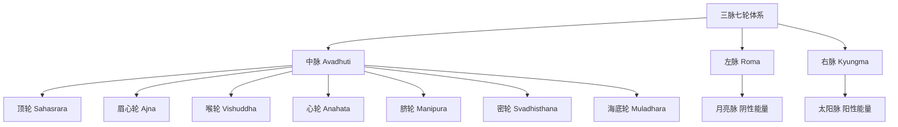
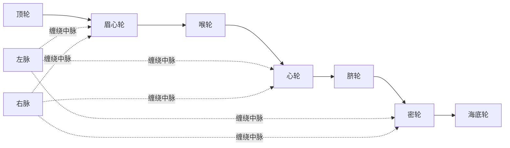
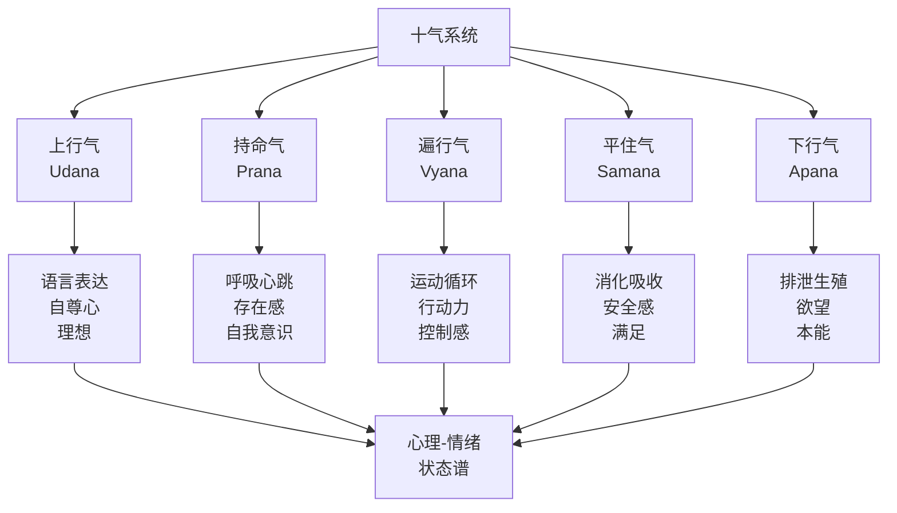
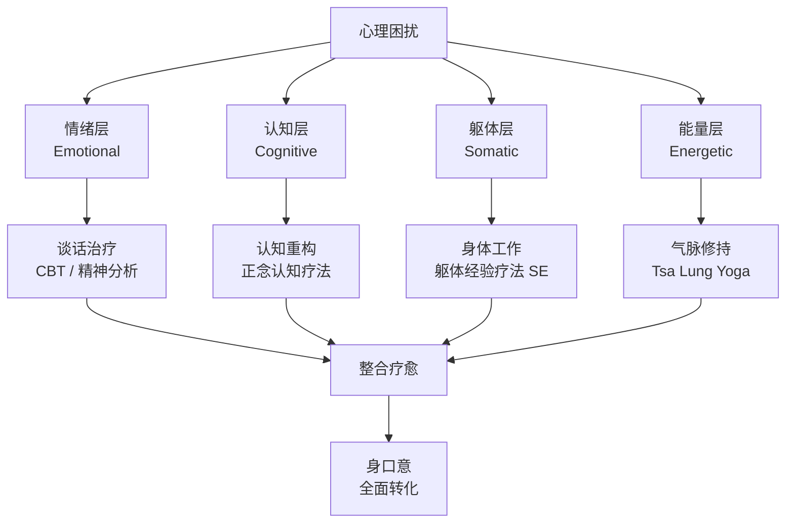

# 藏传气脉明点与呼吸法详解

> **最后更新**: 2026-05

---

## 目录

1. [三脉七轮的藏传体系](#1-三脉七轮的藏传体系)
2. [五气十气的分类与功能](#2-五气十气的分类与功能)
3. [宝瓶气：Tummo 基础呼吸法](#3-宝瓶气tummo-基础呼吸法)
4. [九节佛风：Purification Breath](#4-九节佛风purification-breath)
5. [气脉明点与心理学的对应](#5-气脉明点与心理学的对应)

---

## 1. 三脉七轮的藏传体系

藏传密宗的身体观以**气（Lung / rlung）、脉（Tsa / rtsa）、明点（Tigle / thig-le）**为三大核心要素，构成了一个精密而完整的瑜伽生理学体系。

### 1.1 三脉的解剖对应与修行功能

| 脉道 | 藏文 | 梵文 | 颜色 | 解剖学对应 | 生理功能 | 修行功能 |
|------|------|------|------|-----------|---------|---------|
| **中脉** | dBu ma | Avadhuti / Sushumna | 蓝色 | 脊髓中央管及脑室系统 | 脑脊液循环的主通道；自主神经系统的整合轴 | 觉醒能量的中央高速公路；气入中脉是证悟的关键标志 |
| **左脉** | rKyang ma | Ida / Roma | 红色 | 脊柱左侧的交感神经链/迷走神经左侧分支 | 副交感神经主导：消化、分泌、放松、修复 | 与红菩提心相关；调控情绪与感受 |
| **右脉** | Ro ma | Pingala / Kyungma | 白色 | 脊柱右侧的交感神经链/迷走神经右侧分支 | 交感神经主导：警觉、战斗-逃跑、代谢加速 | 与白菩提心相关；调控思维与行动 |

**重要说明**：三脉并非解剖学意义上可被手术刀分离的管道，而是**能量-信息通道**（subtle energy channels）。它们与神经系统、内分泌系统、筋膜网络存在复杂的对应关系，但不能简单等同。

### 1.2 中脉（Avadhuti）的详析

中脉是藏传瑜伽体系的绝对核心。其特征如下：

| 部位 | 名称 | 位置 | 功能 |
|------|------|------|------|
| **顶端正中** | 大乐轮（Mahasukha Chakra） | 头顶正中，发旋处向内约四指 | 与松果体/脑下垂体区域相关；千瓣莲花，开启时产生大乐与光明 |
| **额间** | 眉心轮 | 两眉之间，向内约一指 | 与松果体相关；天眼通的生理基础；睡眠-觉醒的调控中枢 |
| **喉间** | 受用轮（Sambhoga Chakra） | 喉结后方，颈椎 C4-C5 水平 | 与甲状腺/甲状旁腺相关；调控新陈代谢；语业清净的关键 |
| **心间** | 法轮（Dharma Chakra） | 胸骨后方，胸椎 T5-T6 水平，正对心脏后方 | 与心脏神经丛深度关联；八瓣莲花，是心识的居所；最深密的明点储藏处 |
| **脐间** | 变化轮（Nirmana Chakra） | 肚脐后方，腰椎 L2-L3 水平 | 与腹腔神经丛相关；六十四瓣莲花；生命能量的中心 |
| **密处** | 生殖轮 | 会阴上方，生殖根部 | 与性腺/骨盆神经丛相关；红白明点交汇处；性能量升华的关键 |
| **底端** | 护乐轮 | 会阴正中，肛门与生殖器之间 | 与盆底神经丛相关；根气的枢纽；昆达里尼苏醒的门户 |

**中脉的微观结构**：
传统描述中脉如空心麦秆，外蓝内红，中央有极微细的光明通道称为度玛提（Tseuma / 生命脉）。从现代视角，这可以对应：
- **宏观**：脊髓中央管到第四脑室到第三脑室到侧脑室
- **微观**：脑脊液中的离子流动、神经胶质细胞的钙波传递
- **能量**：生物光子（biophotons）在神经组织中的传导

### 1.3 左右脉的缠绕与交叉

左右脉在中脉两侧螺旋上行，于每个轮处交叉。具体而言：
- **海底轮**：左脉在左，右脉在右
- **密轮**：左右脉开始向内弯曲
- **脐轮**：左右脉与中脉形成第一次交叉
- **心轮**：第二次交叉
- **喉轮**：第三次交叉
- **眉心轮**：第四次交叉
- **顶轮**：左右脉融入中脉，三脉合一

这种交叉结构与**DNA双螺旋**、**卡德休斯之杖（Caduceus）**有惊人的形式相似性。从神经解剖学角度，这可能对应交感神经链的节段性神经节与脊髓的交叉投射。

### 1.4 七轮的现代对应假说

| 轮位 | 传统描述 | 现代解剖对应假说 | 相关内分泌腺 |
|------|---------|----------------|------------|
| 顶轮 | 千瓣莲花，大乐轮 | 大脑皮层、边缘系统整体；脑室脉络丛 | 松果体 / 脑下垂体 |
| 眉心轮 | 慧眼、天眼 | 松果体；视网膜-下丘脑通路 | 松果体 |
| 喉轮 | 语清净、受用轮 | 甲状腺、甲状旁腺；迷走神经喉返支 | 甲状腺 / 甲状旁腺 |
| 心轮 | 法轮、心识所依 | 心脏神经丛；心脏自主神经系统 | 胸腺 / 心脏内分泌细胞 |
| 脐轮 | 变化轮、火力 | 腹腔神经丛；肾上腺 | 胰腺 / 肾上腺 |
| 密轮 | 生殖轮、红白交汇 | 骨盆神经丛；性腺轴 | 性腺 |
| 海底轮 | 护乐、根气 | 盆底神经丛；荐神经 | 肾上腺髓质 |

---

## 2. 五气十气的分类与功能

### 2.1 五根本气（Five Root Winds / rLung rTsa-ba lNga）

藏传体系将生命能量分为五种根本气，分别对应不同的生理功能与心理功能。

| 根本气 | 藏文 | 梵文 | 颜色 | 主要居所 | 生理功能 | 心理功能 | 失调表现 |
|--------|------|------|------|---------|---------|---------|---------|
| **持命气** | Srog dzin | Prana | 白/蓝 | 顶轮/心轮 | 呼吸、心跳、基础生命维持 | 自我意识、存在感、求生本能 | 恐惧死亡、焦虑、胸闷 |
| **下行气** | Thur sel | Apana | 黄/绿 | 海底轮/密轮 | 排泄、生殖、分娩 | 欲望、占有欲、本能冲动 | 便秘、性失调、贪婪 |
| **遍行气** | Khyab byed | Vyana | 红/粉 | 全身（四肢末梢） | 血液循环、淋巴循环、肌肉运动 | 行动欲、扩展感、控制感 | 手脚冰凉、循环障碍、无力感 |
| **平住气** | Me mnyam | Samana | 深蓝/黑 | 脐轮 | 消化、代谢、营养吸收 | 满足感、安全感、归属感 | 消化不良、胀气、情绪性进食 |
| **上行气** | Gyen rgyu | Udana | 绿/灰 | 喉轮/眉心轮 | 语言、吞咽、面部表情 | 表达欲、自尊心、理想主义 | 失语、吞咽困难、抑郁 |

### 2.2 五支分气（Five Branch Winds / rLung Yan-lag lNga）

五支分气是五根本气的细分，对应更具体的心理-生理功能。

| 支分气 | 所属根本气 | 功能 | 心理对应 |
|--------|-----------|------|---------|
| **行气**（Naga） | 持命气（Prana） | 吞咽、打嗝、吐痰 | 表达的基本冲动 |
| **循行气**（Kurma） | 遍行气（Vyana） | 睁眼、闭眼、眨眼 | 知觉的开启与关闭 |
| **正行气**（Krkara） | 上行气（Udana） | 打喷嚏、咳嗽 | 排斥、净化冲动 |
| **最行气**（Devadatta） | 下行气（Apana） | 打哈欠、伸懒腰 | 放松、释放紧张 |
| **决行气**（Dhananjaya） | 平住气（Samana） | 关节活动、组织修复 | 维持、保护、愈合 |

### 2.3 十气与身心状态的对应模型

**临床应用示例**：
- **焦虑症患者**：通常持命气（Prana）上逆，表现为胸闷、呼吸急促、过度警觉。对治：降气法、腹式呼吸、观想气下行至脚底。
- **抑郁症患者**：通常上行气（Udana）不足，表现为言语减少、表情淡漠、动力缺乏。对治：宝瓶气、大笑瑜伽、上行气观想。
- **强迫症/控制狂**：遍行气（Vyana）过度活跃，表现为肌肉紧张、循环亢进、停不下来。对治：松弛训练、 letting-go 观想。

---

## 3. 宝瓶气：Tummo 基础呼吸法

宝瓶气（Bum Chen / Vase Breathing）是藏传密宗六成就法之一——拙火定（Tummo / gTum mo）的基础呼吸技术。它通过特定的呼吸-锁定-观想技术，在脐轮区域产生热能，净化气脉，唤醒深层能量。

### 3.1 科学验证：Herbert Benson 的 Tummo 研究

| 研究 | 年份 | 发现 |
|------|------|------|
| **Benson et al., Harvard Medical School** | 1981-2013 | 长期练习 Tummo 的藏传瑜伽师可以在室温下将手指和脚趾温度提高多达 17°C；核心体温维持稳定，外周血管扩张 |
| **Kozhevnikov et al., NUS** | 2013 | 使用 fMRI 和 EEG 发现，Tummo 练习者在体温升高时呈现独特的交感神经-副交感神经共激活模式：同时出现高觉醒（sympathetic）和深度放松（parasympathetic） |
| **Matthijs Kox, Radboud University** | 2014 | 受训志愿者通过 Tummo 类似技术，能够自主调控免疫反应：内毒素注射后的炎症标志物显著降低 |

**关键科学发现**：Tummo 不是单纯的意志控制，而是通过呼吸调控（特别是过度换气后的屏息）改变血液的 pH 值和温度，进而通过下丘脑的体温调节中枢，实现**自主神经系统的双向调节**——这是传统认为不可自主调控的生理过程。

### 3.2 宝瓶气的操作步骤

| 步骤 | 名称 | 操作细节 | 时长/次数 |
|------|------|---------|----------|
| **1** | 预备坐式 | 七支坐法或舒适的盘坐；脊柱正直，手结定印或置于膝上 | 2–3 分钟调息 |
| **2** | 深吸三口气 | 鼻吸，观想白色灵气（菩提心）从鼻孔进入，下行至脐轮 | 3 次 |
| **3** | 第四口深吸 | 同样鼻吸，气入脐轮 | 尽量深满 |
| **4** |  swallow 动作 | 吞咽唾液，如将气封入瓶中；喉锁（Jalandhara Bandha）微收 | 1 次 |
| **5** | 会阴锁（Mula Bandha） | 轻轻上提会阴/肛门，如忍大便状 | 保持 |
| **6** | 腹锁（Uddiyana Bandha） | 腹肌内收上提，脐轮内陷 | 保持 |
| **7** | 持气（屏息） | 三锁俱足，气持于脐轮区域；观想此处有红色短阿字（短啊吽），炽盛燃烧 | 尽量长久，但不强迫 |
| **8** | 缓慢呼气 | 先缓慢松开腹锁，气从鼻孔均匀呼出；观想黑色病气从毛孔排出 | 自然呼尽 |
| **9** | 休息 | 自然吸气几次，不控制；感受脐轮温热 | 3–5 次呼吸 |

### 3.3 宝瓶气的三个层次

| 层次 | 名称 | 特征 | 修习前提 |
|------|------|------|---------|
| **初阶** | 持气宝瓶 | 能持气 30 秒以上；感受脐轮温热 | 无高血压、心脏病、青光眼 |
| **中阶** | 空行宝瓶 | 持气时观想明点上升中脉，于顶轮与降下的白明点融合，产生大乐 | 初阶纯熟；有上师指导 |
| **高阶** | 智慧宝瓶 | 持气中自然入定，气入中脉，产生四喜四空，证悟空性 | 中阶纯熟；前行圆满；灌顶传承 |

### 3.4 禁忌症与安全警示

| 禁忌症 | 原因 | 替代方案 |
|--------|------|---------|
| **高血压（未控制）** | 屏息和腹锁会急剧升高血压 | 只做自然呼吸观想，不持气 |
| **心脏病/心律失常** | 自主神经剧烈波动可能诱发心律失常 | 温和的腹式呼吸，无锁定 |
| **青光眼** | 屏息时胸腔压力升高，眼内压随之升高 | 不做任何屏息练习 |
| **怀孕** | 腹锁和强烈屏息影响胎儿 | 只修自然呼吸和柔和观想 |
| **癫痫史** | 过度换气可能诱发发作 | 避免快速呼吸，只做慢呼吸 |
| **近期腹部手术** | 腹锁增加腹压，影响愈合 | 术后 6 个月内不做 |

> **重要提示**：宝瓶气是密宗修法，传统上要求灌顶传承。即使没有宗教立场，也强烈建议在经验丰富的导师指导下学习，不可仅凭文字盲修。

---

## 4. 九节佛风：Purification Breath

九节佛风（Sangkyang / 九出浊气）是藏传密宗最基础的呼吸净化法，通常在每日正式修法前进行。其目的是清除体内的浊气、病气、业障气，为后续的定观修行净化身口意。

### 4.1 九节佛风的原理

| 维度 | 解释 |
|------|------|
| **数字九** | 对应三脉各有三处主要轮位，共九处；亦对应九窍（两眼、两耳、两鼻孔、口、尿道、肛门） |
| **三色观想** | 右鼻孔出白气（嗔恨/浊气），左鼻孔出红气（贪欲/浊气），双鼻孔出黑气（愚痴/浊气） |
| **体位配合** | 右压左/左压右/双压，配合三轮（上中下）的屈伸，物理性地压缩和释放肺部不同区域 |

### 4.2 分步操作

| 节次 | 名称 | 坐姿/手姿 | 吸气 | 观想 | 呼气 | 次数 |
|------|------|----------|------|------|------|------|
| **1-3** | 排右脉浊气 | 左手无名指压左鼻孔；右手放右膝 | 右鼻孔深吸 | 白气（或红光）入，充满全身 | 右鼻孔用力呼出，观想白色病气排出 | 各 1 次，共 3 次 |
| **4-6** | 排左脉浊气 | 右手中指压右鼻孔；左手放左膝 | 左鼻孔深吸 | 红气（或白光）入，充满全身 | 左鼻孔用力呼出，观想红色病气排出 | 各 1 次，共 3 次 |
| **7-9** | 排中脉及全身浊气 | 双手握拳压大腿根部（或双膝） | 双鼻孔深吸 | 五色明光入，充满三轮 | 双鼻孔用力呼出，观想黑色病气从全身毛孔排出 | 各 1 次，共 3 次 |

### 4.3 进阶要点

| 层次 | 要点 |
|------|------|
| **身** | 每一呼气配合身体前倾，挤压膈肌和肋间肌，彻底排空残气；吸气时脊柱挺直，胸腔最大扩张 |
| **息** | 吸-呼比例约 1:1.5；呼气略长于吸气，确保浊气排尽 |
| **心** | 呼气时默念"哈"（Ha）或"呸"（Phet），以声音震动增强排出效果；同时观想具体病灶处的黑气被排出 |
| **观** | 排尽后，观想自身透明如水晶，充满五色光明，净如琉璃 |

### 4.4 九节佛风的现代变体

对于无密宗传承的现代人，可将九节佛风转化为**净化呼吸练习**：
- 保留三轮（右/左/双）的结构
- 去除特定色彩观想，改为"温暖的光"和"灰色的浊气"
- 保留身体压缩-释放的机械净化效应
- 加入现代的"渐进式肌肉放松"元素

---

## 5. 气脉明点与心理学的对应

### 5.1 气脉阻塞与情绪障碍的对应表

| 脉轮/气轮位置 | 传统说法 | 情绪/心理问题 | 躯体症状 | 呼吸对治 |
|-------------|---------|------------|---------|---------|
| **顶轮** | 大乐轮关闭 | 存在性空虚、无意义感、灵性危机 | 慢性头痛、失眠、认知模糊 | 观想顶门开放，白光入；宝瓶气持气上行 |
| **眉心轮** | 慧眼遮蔽 | 直觉缺失、决策困难、想象力枯竭 | 视力疲劳、偏头痛、睡眠障碍 | 眼球转动放松；眉心轻触观想 |
| **喉轮** | 语业不清 | 表达障碍、社交焦虑、创造力阻塞 | 咽喉异物感、甲状腺问题、颈椎病 | 上行气强化；狮子吼（Simhasana）；唱诵 |
| **心轮** | 法轮不转 | 情感封闭、共情缺乏、悲心不足 | 胸闷、心悸、免疫力低下 | 慈心观（Metta）；心轮呼吸观想 |
| **脐轮** | 火力不足 | 缺乏动力、意志薄弱、边界不清 | 消化不良、低血糖、慢性疲劳 | 宝瓶气；脐轮火焰观想； kapalabhati |
| **密轮** | 红白明点耗散 | 性心理冲突、关系依赖、羞耻感 | 骨盆疼痛、性功能障碍、泌尿问题 | 根锁（Mula Bandha）；性能量升华观想 |
| **海底轮** | 根气不稳 | 安全感缺失、生存恐惧、物质焦虑 | 慢性腰骶痛、便秘、腿部无力 | 下行气安住；接地观想；站桩 |

### 5.2 从心理治疗到气脉修持的整合模型

### 5.3 气脉修持在心理疗愈中的定位

| 层面 | 西方心理治疗 | 气脉修持 |
|------|------------|---------|
| **工作对象** | 心理内容（思维、情绪、记忆） | 能量模式（气的流动、脉的通畅） |
| **改变机制** | 意识化、重构、脱敏 | 净化、开启、转化 |
| **时间框架** | 通常以月/年计 | 可以瞬间（顿悟），也需长期（渐修） |
| **主体关系** | 治疗师-来访者二元关系 | 行者-本尊/上师/自心非二元关系 |
| **风险** | 情绪激活、依赖 | 气脉紊乱、灵性 bypass、附佛外道 |

**整合建议**：
- 有严重心理障碍者（如精神分裂症、双相情感障碍、创伤后应激障碍），应**优先接受专业心理治疗/精神科治疗**，气脉修持作为辅助。
- 气脉修持中出现强烈情绪释放（kriyas、剧烈哭泣、身体不受控运动），应在有经验的导师指导下进行，不可强行压制或过度鼓励。
- 现代心理治疗师学习气脉知识后，可更精细地识别来访者的躯体化模式，但**不应将宗教修持直接用作治疗技术**，除非有明确的跨文化培训和伦理框架。

---

## 附录：日常气脉修持建议

| 时间 | 修持内容 | 时长 | 目的 |
|------|---------|------|------|
| 晨起 | 九节佛风 + 简单伸展 | 10 分钟 | 净化夜间积聚的浊气，唤醒身体 |
| 上午 | 宝瓶气（初阶）3 轮 | 15 分钟 | 提升能量，增强专注力 |
| 午后 | 经脉行走（Kinhin / 经行） | 10 分钟 | 活动气脉，防止久坐瘀滞 |
| 睡前 | 深慢呼吸 + 全身放松 | 10 分钟 | 安抚神经系统，准备深度睡眠 |

---

*脉净则气顺，气顺则心明，心明则见性。*

---

**关联阅读**：
- [藏传禅修总览](Tibetan_Meditation_Overview.md)
- [大圆满前行五加行实操指南](Tibetan_Ngondro_Guide.md)
- [INDEX](INDEX.md)
