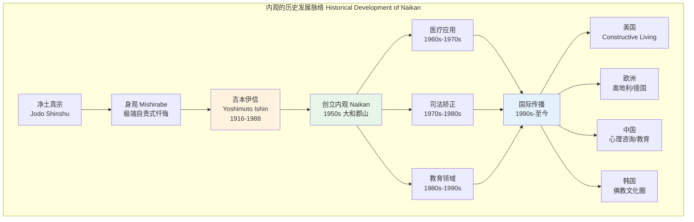
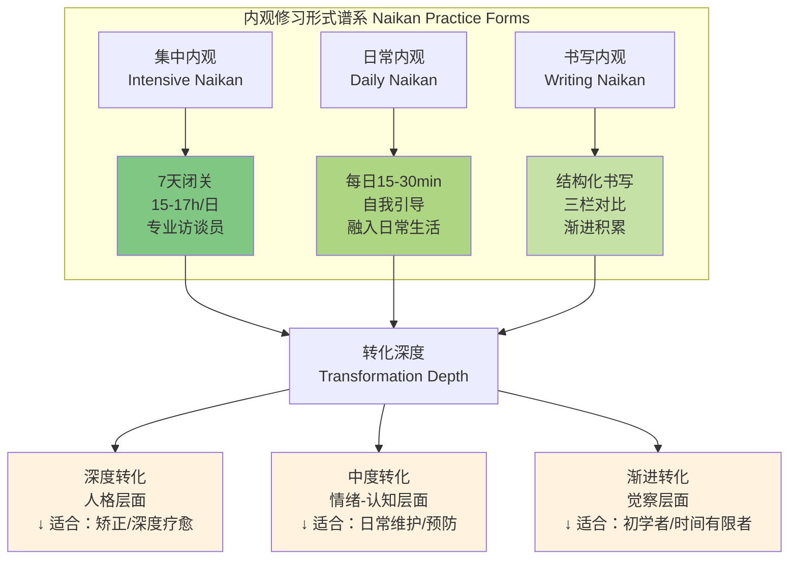
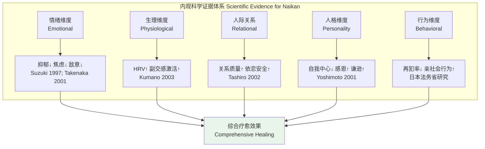
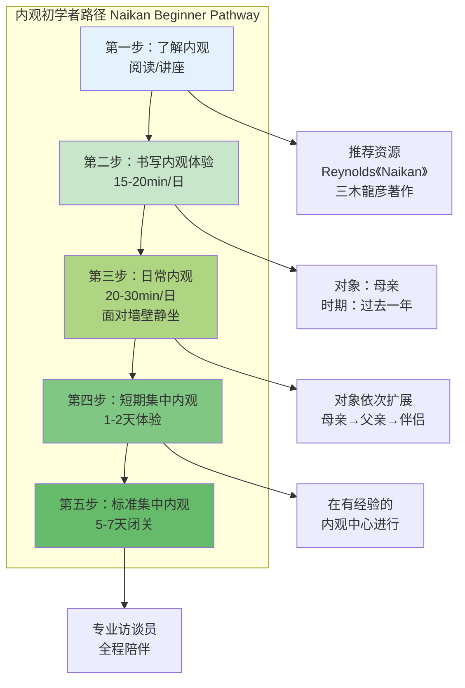

# 日本内观疗法专业概述 | Naikan Meditation Overview

> **文档类型**: 冥想传统与心理治疗系统介绍 | Tradition & Psychotherapy Introduction
> **适用对象**: 冥想执行师、心理咨询师、司法矫正从业者、成瘾康复工作者、身心健康从业者
> **阅读时长**: 约 35–45 分钟
> **最后更新**: 2026-05

---

## 目录 | Table of Contents

1. [历史渊源](#一历史渊源)
2. [核心理论](#二核心理论)
3. [标准修习形式](#三标准修习形式)
4. [临床应用](#四临床应用)
5. [科学证据](#五科学证据)
6. [与西方心理治疗的比较](#六与西方心理治疗的比较)
7. [局限性与批评](#七局限性与批评)
8. [实践指引](#八实践指引)

---

## 一、历史渊源

内观（Naikan / 内観）是一种独特的日本自我反省方法，由日本商人 **吉本伊信（Yoshimoto Ishin, 1916–1988）** 于 20 世纪中叶创立。它融合了佛教净土真宗的修行传统与现代心理治疗的需求，从个人灵修实践发展为具有全球影响力的治疗方法。

### 1.1 吉本伊信（Yoshimoto Ishin）的生平与创立

| 时间 | 事件 |
|------|------|
| **1916** | 吉本伊信出生于日本奈良县大和郡山市的一个佛具商家庭 |
| **青年期** | 性格叛逆，沉迷赌博，与父母关系紧张 |
| **1930s** | 在母亲引导下接触净土真宗的"身观"（mishirabe）修行——一种严厉的自责式忏悔修行 |
| **1940s** | 经历多次"身观"修行后，获得深刻的内心转化；意识到极端自责的局限性，开始探索更平衡的方法 |
| **1950s** | 在大和郡山市开设"内观道场"，将修行方法系统化并命名为"内观"（Naikan） |
| **1970s–1980s** | 内观被引入日本监狱系统、精神病院和心理咨询领域；吉本伊信开始接受媒体采访，内观逐渐为公众所知 |
| **1988** | 吉本伊信逝世，但其方法已通过弟子和机构广泛传播 |

**吉本伊信的核心洞见**：
> "我们一生都在抱怨别人对我们做了什么，却从不认真思考别人为我们做了什么。"

吉本伊信发现，传统的"身观"修行虽然有效，但其极端的自责方式对现代人过于严苛。他将修行的焦点从"我犯了什么罪"转变为"他人为我做了什么"——这一转变使内观从宗教忏悔演变为心理治疗方法。

### 1.2 日本净土真宗背景

内观的宗教根源在于日本净土真宗（Jodo Shinshu / 浄土真宗）的"身观"（mishirabe / 身調べ）修行。

| 要素 | 净土真宗身观 | 吉本伊信内观 |
|------|------------|------------|
| **核心目的** | 认识自身的罪恶，激发对阿弥陀佛的皈依 | 认识人际关系中的接受与给予，激发感恩与责任感 |
| **修行方式** | 极端的自责、禁食、不眠 | 结构化的回忆，正常饮食睡眠 |
| **时间长度** | 通常 3–7 天 | 灵活：从日常 15 分钟到集中 7 天 |
| **宗教框架** | 明确的净土真宗教义 | 去宗教化或弱化宗教框架 |
| **引导者** | 寺院僧侣 | 内观访谈员（不限宗教背景） |
| **关键转变** | 从"自力"到"他力"（阿弥陀佛的救度） | 从"自我中心"到"关系觉察" |

**身观的核心做法**：
- 修行者独自坐在小房间内，面对墙壁
- 连续数日回顾自己的人生，寻找罪恶和过失
- 禁食、不眠或极少的睡眠，以增强修行的强度
- 定期向引导者汇报反省内容

吉本伊信保留了"对墙壁静坐"和"结构化回顾"的形式，但将内容从"罪恶"调整为"人际关系中的事实"，并将修行目标从"宗教皈依"调整为"心理洞察与人格成长"。

### 1.3 二战后发展为心理治疗

内观从宗教修行向心理治疗的转变，与二战后日本社会的心理需求密切相关。

| 阶段 | 时间 | 关键发展 |
|------|------|---------|
| **宗教修行期** | 1950s | 吉本伊信的内观道场主要服务于佛教修行者 |
| **医疗引入期** | 1960s–1970s | 精神病学家和心理学家开始关注内观；首次在医院和精神病院应用 |
| **司法矫正期** | 1970s–1980s | 日本法务省将内观引入监狱系统，作为少年犯和成年犯的矫正项目 |
| **教育应用期** | 1980s–1990s | 内观进入学校系统，用于学生品德教育和心理辅导 |
| **国际传播期** | 1990s–至今 | 内观传播至美国、欧洲、中国、韩国等地；出现跨文化适应研究 |

**关键人物与机构**：
- **集光殿（Shūkōdō）**：吉本伊信创立的原始内观中心，位于奈良县大和郡山市
- **内观医学会（Naikan Igakkai）**：日本内观的医学/心理学专业组织
- **日本内观学会（Nihon Naikan Gakkai）**：学术研究和推广机构

### 1.4 世界传播

内观的国际传播主要依赖几位关键的跨文化桥梁人物。

| 人物 | 贡献 | 代表著作 |
|------|------|---------|
| **David K. Reynolds** | 美国心理学家，将内观与西方心理治疗整合；创立"建构性 living"方法 | *Constructive Living* (1984); *Naikan: Gratitude, Grace and the Japanese Art of Self-Reflection* (2019) |
| **Clark Moustakas** | 美国人本主义心理学家，将内观引入美国心理治疗界 | *Being-In, Being-For, Being-With* (1995) |
| **Thomas Kreiner** | 奥地利心理治疗师，在欧洲推广内观；在维也纳设立内观中心 | 多篇德文内观研究论文 |
| **三木龍彦（Miki Tatsuhiko）** | 日本内观师，在中国推广内观；担任天津内观文化传播有限公司总经理 | 《内观：重塑心灵之路》 |

**国际传播的主要形式**：
- **美国**：以"Constructive Living"形式呈现，去宗教化，强调行为改变
- **欧洲**：尤其在德语区（奥地利、德国）发展成熟，整合入系统式治疗和人本主义传统
- **中国**：2000 年代后引入，主要应用于心理咨询、家庭教育和企业培训
- **韩国**：与日本有相似的佛教背景，接受度较高



---

## 二、核心理论

内观的理论框架出奇地简洁，但其深度和效果却极为显著。核心在于通过结构化的自我质问，打破自我中心的认知偏差，重建对人际关系的真实认知。

### 2.1 自我反省的三主题（Three Themes of Self-Reflection）

内观的全部修习围绕三个问题展开。这三个问题被称为内观的"三根支柱"。

| 序号 | 日文 | 中文 | 核心询问 |
|------|------|------|---------|
| **1** | あの人が私のためにしてくれたこと | 他人为我做了什么 | 回顾特定关系对象给予我的关怀、帮助、付出——无论大小 |
| **2** | 私があの人のためにしたこと | 我为他人做了什么 | 回顾我给过对方的回报、关怀、帮助——以事实为依据 |
| **3** | 私があの人に迷惑をかけたこと | 我给他人添了什么麻烦 | 回顾我给对方造成的困扰、伤害、负担——不回避、不美化 |

**修习方法**：
- 选择一段特定时期（如"中学三年"或"过去三年"）
- 选择一个特定关系对象（通常从母亲开始，依次为父亲、配偶、子女、朋友等）
- 按时间顺序回忆该时期与该对象的关系
- 对每一段记忆，依次回答上述三个问题
- 访谈员定期来访，倾听汇报并提出引导性问题

### 2.2 认知转变机制

内观的三主题设计并非随意——它精准地针对了人类认知中的几个核心偏差。

```mermaid
graph TD
    subgraph 内观的认知转变机制 Cognitive Transformation in Naikan
        A1[自我中心偏差<br/>Self-Centered Bias] --> B1[只记得别人欠我的<br/>忘记我欠别人的]
        A2[负面偏好<br/>Negativity Bias] --> B2[过度关注冲突与伤害<br/>忽略关怀与温暖]
        A3[自利归因<br/>Self-Serving Attribution] --> B3[成功归自己<br/>失败归他人]
    end
    
    B1 --> C[内观三主题<br/>Three Naikan Questions]
    B2 --> C
    B3 --> C
    
    C --> D1[主题1：他人为我做了什么<br/>→ 打破"别人欠我"的认知]
    C --> D2[主题2：我为他人做了什么<br/>→ 建立平衡的关系视角]
    C --> D3[主题3：我给别人添的麻烦<br/>→ 直面自身的局限与伤害]
    
    D1 --> E[认知重构<br/>Cognitive Restructuring]
    D2 --> E
    D3 --> E
    
    E --> F1[感恩 Gratitude]
    E --> F2[责任感 Responsibility]
    E --> F3[ humility 謙逊]
    E --> F4[关系修复 Relational Repair]
    
    style C fill:#fff3e0
    style E fill:#e8f5e9
    style F1 fill:#e3f2fd
    style F2 fill:#e3f2fd
    style F3 fill:#e3f2fd
    style F4 fill:#e3f2fd
```

**为什么"他人为我做了什么"排第一？**

吉本伊信发现，如果先问"我给他人做了什么"，练习者往往会夸大自己的付出，强化自我中心的叙事。而先问"他人为我做了什么"，则：
- 打破了"我是受害者/付出者"的固化叙事
- 为后续的"我给他人添的麻烦"创造了心理安全——既然我已经看到对方对我的好，那么承认自己的不足就不那么难以承受
- 激发了自然的感恩情感，而非道德要求的"应该感恩"

### 2.3 Gratitude as Healing（感恩即疗愈）

内观的疗愈机制核心在于**感恩（感謝 kansha）**——不是作为道德义务，而是作为认知重构的自然产物。

**感恩的心理学机制**：

| 层面 | 机制 | 效果 |
|------|------|------|
| **认知层面** | 重新评估过去事件的积极意义 | 将"理所当然"重新发现为"礼物" |
| **情感层面** | 激活积极情感系统 | 降低怨恨、愤怒、嫉妒等负面情绪 |
| **动机层面** | 激发回报和关怀的动机 | 增加亲社会行为 |
| **生理层面** | 副交感神经激活 | 心率变异性提升、皮质醇下降 |

**Robert Emmons**（加州大学戴维斯分校，感恩研究先驱）的研究支持：
- 定期感恩练习与更高的幸福感、更好的睡眠、更强的免疫功能相关
- 感恩的核心是"承认善行的来源在外部"——这与内观的第一主题完全吻合

**内观中的感恩 vs 一般感恩练习**：

| 维度 | 一般感恩练习（如感恩日记） | 内观中的感恩 |
|------|------------------------|------------|
| **结构** | 自由书写 | 高度结构化（三主题+时间顺序+特定对象） |
| **深度** | 通常较浅，关注近期事件 | 深入回顾数年甚至数十年的关系历史 |
| **强度** | 日常维护性练习 | 高强度、沉浸式的深度反思 |
| **挑战** | 主要体验积极情感 | 同时面对自身的过失和伤害 |
| **转化** | 情绪调节 | 人格层面的认知-情感-行为综合转化 |

### 2.4 "母亲"作为起始对象的意义

内观传统上要求从"母亲"（或主要养育者）开始反省，这不是偶然的选择。

| 理由 | 说明 |
|------|------|
| **最早的关系** | 母亲通常是个体生命中第一个重要的"他者"，奠定了一切后续关系的模板 |
| **最大的付出** | 婴幼儿期的养育是最无私、最不求回报的付出——最能激发"他人为我做了什么"的觉察 |
| **最深的矛盾** | 母子/母女关系往往也是情感最复杂、冲突最深层的关系——最具转化潜力 |
| **文化普遍性** | 无论何种文化，母子关系都是核心人际关系之一 |

**对无母亲/创伤性母子关系者的调整**：
- 可从其他主要养育者（父亲、祖父母、养父母）开始
- 对于严重创伤者，需谨慎评估是否适合内观，或需要更长时间的准备

---

## 三、标准修习形式

内观有两种主要修习形式：集中内观（Intensive Naikan）和日常内观（Daily Naikan）。两者共享相同的核心理论框架，但在强度、设置和适用场景上有显著差异。

### 3.1 集中内观（集中内观 Shūchū Naikan / Intensive Naikan）

集中内观是内观最传统、最密集的形式，通常在专门的"内观道场"或"内观中心"进行。

**基本设置**：

| 要素 | 标准安排 |
|------|---------|
| **时长** | 通常为 1 周（7 天）；也有 3 天、5 天或 10 天的变体 |
| **每日修习时间** | 约 15–17 小时（通常从早晨 5:30 至晚上 21:00，含休息） |
| **场地** | 专用小房间（2–3 榻榻米，约 3.3–5 平米）；墙壁为素色 |
| **姿势** | 端坐于坐垫上，面向墙壁；保持静止 |
| **隔离** | 除访谈员外，不与任何人交谈；禁止阅读、书写、电子设备 |
| **饮食** | 简单素食，由工作人员送入房间 |
| **睡眠** | 约 7 小时 |

**日程安排（典型 7 天课程）**：

| 时间 | 活动 |
|------|------|
| 05:30–07:00 | 内观修习（独处） |
| 07:00–08:00 | 早餐、个人卫生 |
| 08:00–10:30 | 内观修习（独处） |
| 10:30–11:00 | **访谈（面接 mensetsu）**——与访谈员一对一 |
| 11:00–12:30 | 内观修习（独处） |
| 12:30–13:30 | 午餐、休息 |
| 13:30–16:00 | 内观修习（独处） |
| 16:00–16:30 | **访谈（面接 mensetsu）**——与访谈员一对一 |
| 16:30–18:00 | 内观修习（独处） |
| 18:00–19:00 | 晚餐、休息 |
| 19:00–21:00 | 内观修习（独处） |
| 21:00–05:30 | 睡眠 |

**访谈员的角色**：
- 每日 2 次，每次约 20–30 分钟
- 访谈员进入房间，倾听练习者的反省汇报
- 不评判、不解释、不提供心理咨询
- 主要功能是：
  1. **见证**：作为"他者"的存在，确认练习者的努力
  2. **引导**：适时提醒练习者回到三主题框架
  3. **推动**：当练习者停滞时，引导其进入下一个时间段或关系对象

**关系对象的顺序**（典型安排）：

| 天数 | 关系对象 | 时期 |
|------|---------|------|
| 第 1 天 | 母亲 | 从出生至今，按时间顺序 |
| 第 2 天 | 母亲 | 继续 |
| 第 3 天 | 父亲 | 从出生至今 |
| 第 4 天 | 其他重要人物（如祖父母、兄弟姐妹） | 从出生至今 |
| 第 5 天 | 配偶/伴侣 | 相识至今 |
| 第 6 天 | 子女 | 出生至今 |
| 第 7 天 | 综合回顾；对访谈员、社会的反省 | 全时期 |

### 3.2 日常内观（日常内观 Nichijō Naikan / Daily Naikan）

日常内观是为无法参加集中内观的人设计的简化版修习。

| 维度 | 集中内观 | 日常内观 |
|------|---------|---------|
| **时长** | 1–7 天连续闭关 | 每日 15–30 分钟，持续数周至数月 |
| **场地** | 专用内观中心 | 家中或任何安静空间 |
| **隔离** | 完全社会隔离 | 正常生活，仅修习时独处 |
| **访谈员** | 专业访谈员每日面接 | 自我引导；或定期与指导者讨论 |
| **强度** | 极高 | 温和 |
| **适用人群** | 有时间的深度修行者、矫正项目参与者 | 上班族、学生、初学者 |
| **转化深度** | 深刻的人格层面 | 渐进的情绪-认知层面 |

**日常内观的标准方法**：

1. **设定时间**：每天固定同一时间（如早起后或睡前）
2. **设定空间**：找一个安静角落，面对墙壁或闭目
3. **设定对象**：当天选择一个关系对象
4. **结构化回顾**：
   - 选取一段具体时期（如"去年夏天"或"上周"）
   - 依次回答三主题问题
   - 使用计时器，确保三个问题都有足够时间
5. **记录**（可选）：在修习后简要记录关键洞察

### 3.3 书写内观（Writing Naikan）

书写内观是日常内观的变体，通过书写来结构化反思过程。

**方法**：

| 步骤 | 内容 |
|------|------|
| **1. 选择对象** | 确定今天内观的关系对象 |
| **2. 设定时期** | 选取一段具体时期（建议不超过 1 年） |
| **3. 分栏书写** | 在纸上画三栏，分别标注三主题 |
| **4. 逐项填写** | 在每个栏目下列出所有能回忆起的具体事件 |
| **5. 数量对比** | 直观比较三栏的数量——通常第一栏远多于第二、三栏 |
| **6. 情感觉察** | 记录书写过程中的情感变化 |

**书写内观日记模板**：

```
日期：_______  内观对象：_______  时期：_______

【他人为我做了什么】
1. _________________________________
2. _________________________________
3. _________________________________
...

【我为他人做了什么】
1. _________________________________
2. _________________________________
...

【我给他人添的麻烦】
1. _________________________________
2. _________________________________
...

今日核心洞察：_________________________
情感变化：_____________________________
```



---

## 四、临床应用

内观在日本和世界各地的临床/准临床环境中有着广泛的应用历史。以下是最主要的应用领域。

### 4.1 日本监狱矫正项目

内观在日本的司法矫正系统中应用最为广泛，也是其循证基础最扎实的领域之一。

| 项目类型 | 说明 |
|---------|------|
| **少年院（少年院 Shōnen-in）** | 针对少年犯的矫正教育设施；内观是核心项目之一 |
| **监狱内观项目** | 成年犯人在服刑期间参加 1 周集中内观 |
| **保护观察期内观** | 假释或缓刑人员在社区参加内观 |

**典型效果**（基于日本法务省研究）：
- 再犯率降低（不同研究报道为 10–30% 的相对降低）
- 攻击性降低
- 对受害者的同理心增强
- 酒精和药物滥用减少

**机制**：
- 内观帮助犯罪者打破"受害者心态"（"我是被社会/他人逼的"）
- 通过回顾与受害者（或潜在受害者，如家人）的关系，激发责任感
- 对"我给他人添的麻烦"的直面，直接针对犯罪行为对他人造成的伤害

### 4.2 成瘾康复

内观在酒精依赖（アルコール依存症）和药物成瘾的康复治疗中应用广泛。

| 应用领域 | 典型设置 |
|---------|---------|
| **戒酒设施** | 住院戒酒康复期间的 1 周集中内观 |
| **药物成瘾康复** | 作为综合康复项目的一部分 |
| **行为成瘾** | 赌博成瘾、网络成瘾的辅助治疗 |

**内观对成瘾的独特价值**：
- 成瘾者往往具有强烈的"外部归因"倾向（"我喝酒是因为压力大/因为别人逼我"）
- 内观的第一主题（"他人为我做了什么"）直接挑战这种归因模式
- 第三主题（"我给他人添的麻烦"）帮助成瘾者直面其行为对家人造成的伤害
- 激发的感恩情感为康复提供了内在的、非物质的满足来源

### 4.3 家庭关系修复

内观在家庭治疗中的应用主要侧重于个体层面的关系觉察，而非系统式家庭治疗中的互动模式分析。

| 应用场景 | 方法 |
|---------|------|
| **夫妻冲突** | 双方分别进行内观，聚焦于"配偶为我做了什么" |
| **亲子关系** | 父母进行以子女为对象的内观，或子女进行以内父母为对象的内观 |
| **代际创伤** | 通过内观理解父母一代的付出与局限 |

**案例模式**：
- 一位长期抱怨妻子"不理解自己"的丈夫，在内观中回忆起妻子多年来照顾家庭、支持自己事业的无数细节
- 这种认知转变往往不是通过"谈判"或"沟通技巧"达成，而是通过个体深层的认知重构

### 4.4 抑郁症辅助治疗

内观不作为抑郁症的单一治疗手段，但作为药物和心理治疗的辅助，具有独特价值。

| 维度 | 内观的作用 |
|------|-----------|
| **认知层面** | 打破抑郁性的负面反刍（rumination），将其结构化导向建设性方向 |
| **情感层面** | 激发的感恩情感作为积极情绪的"注入" |
| **行为层面** | 增强与重要他人的关系动机，减少社交退缩 |
| **意义层面** | 在关系中重新发现生活的意义 |

**注意事项**：
- 重度抑郁发作期不宜进行集中内观（隔离和强度可能加重症状）
- 有自杀风险者需在专业监护下进行
- 日常内观或书写内观通常更安全

### 4.5 教育领域

在日本，内观已被纳入学校教育系统，作为品德教育和心理成长项目。

| 教育层次 | 应用方式 |
|---------|---------|
| **中学** | 1–2 天的集中内观体验营；日常内观作为德育课程的一部分 |
| **大学** | 心理学、教育学专业的体验课程；学生辅导中心提供内观服务 |
| **教师培训** | 教师的自我觉察与压力管理 |

**教育内观的目标**：
- 培养学生的感恩心和责任感
- 预防校园欺凌（bullying）——通过内观理解自己对他人可能造成的伤害
- 促进亲社会行为

### 4.6 修习形式与临床应用对比

| 应用领域 | 推荐形式 | 时长 | 频率 | 关键对象 |
|---------|---------|------|------|---------|
| **监狱矫正** | 集中内观 | 5–7 天 | 服刑期间 1–2 次 | 受害者、家人 |
| **成瘾康复** | 集中内观 + 日常内观 | 7 天集中 + 日常维持 | 康复期多次 | 家人、朋友 |
| **家庭关系修复** | 日常内观/书写内观 | 每日 20–30 min | 持续 4–8 周 | 冲突对象 |
| **抑郁症辅助** | 日常内观（轻度）| 每日 15–20 min | 持续 8–12 周 | 主要支持性他人 |
| **教育领域** | 短期集中 + 日常 | 1–2 天体验 | 学期中 1 次 | 父母、同学 |

---

## 五、科学证据

内观的科学研究主要集中在日本，但近年来越来越多的国际研究开始关注这一独特的治疗方法。

### 5.1 对抑郁、焦虑、敌意的影响

| 研究 | 设计 | 主要发现 |
|------|------|---------|
| **Suzuki et al. (1997）** | 内观 vs 对照组；监狱犯人 | 内观组在 SDS（Self-Rating Depression Scale）上显著改善 |
| **Takenaka (2001）** | 酒精依赖者的 1 周集中内观 | 焦虑、抑郁、敌意（hostility）均显著下降；效果在 3 个月后仍维持 |
| **Yoshimoto & Yoshioka（2001）** | 内观对人格的影响 | 内观后，被试在人际敏感性、焦虑、敌意维度上显著改善 |
| **Kumano (2003）** | 内观对自主神经系统的影响 | 内观后副交感神经活动增强，心率变异性提升 |

### 5.2 对人际关系质量的影响

| 研究 | 设计 | 主要发现 |
|------|------|---------|
| **Tashiro et al. (2002）** | 内观前后的人际关系评估 | 内观后，被试报告与家人、同事的关系质量显著提升 |
| **Shimazu (2004）** | 夫妻分别进行内观 | 婚姻满意度提升；沟通模式改善 |
| **Yoshimoto et al. (2006）** | 内观与依恋风格 | 内观后，不安全依恋的指标下降 |

### 5.3 David Reynolds 的跨文化研究

David K. Reynolds 是将内观系统引入西方学术界的关键人物。他的工作不仅是翻译，更是跨文化的整合。

**Reynolds 的核心贡献**：
- 将内观与西方认知行为治疗、存在主义治疗整合
- 创立"Constructive Living"——一种去日本文化背景、保留内观核心的自助方法
- 发表了第一篇英文的内观系统介绍

| 著作 | 贡献 |
|------|------|
| *The Quiet Therapies* (1983) | 首次向英语读者介绍日本的三种"静默治疗"（内观、森田疗法、静坐） |
| *Constructive Living* (1984) | 将内观和森田疗法整合为适合西方文化的自助方法 |
| *Naikan: Gratitude, Grace and the Japanese Art of Self-Reflection* (2019) | 内观的全面英文专著 |

**Reynolds 的跨文化洞见**：
> "内观的精髓不在于日本的特定文化形式，而在于其认知-情感的结构。西方人可以保留自己的价值观，同时从这种结构化的自我反省中获益。"

### 5.4 日本内观学会（Jiko 报告）的疗效数据

日本内观学会定期发布的"自己报告"（Jiko / 自己，即自我报告）数据，是大规模的内观效果追踪研究。

| 指标 | 内观前 | 内观后 | 变化 |
|------|--------|--------|------|
| **感恩心（感謝の心）** | 基线 | +40–60% | 最显著的改善 |
| **自我中心性** | 基线 | -20–30% | 显著下降 |
| **人际满意度** | 基线 | +25–35% | 显著提升 |
| **焦虑水平** | 基线 | -15–25% | 中度下降 |
| **敌意/攻击性** | 基线 | -20–30% | 显著下降 |
| **生活意义感** | 基线 | +30–40% | 显著提升 |

**注**：以上数据为基于多项研究的综合估计，具体数值因研究设计和样本不同而有所变化。



---

## 六、与西方心理治疗的比较

内观作为一种源自东方文化背景的治疗方法，与西方主流心理治疗既有共通之处，也有显著差异。理解这些异同，有助于在临床实践中做出恰当的选择和整合。

### 6.1 内观 vs 认知行为治疗（CBT）

| 维度 | 内观 Naikan | CBT |
|------|------------|-----|
| **核心机制** | 结构化回忆打破自我中心认知偏差；情感转化（感恩） | 识别和挑战非理性信念；行为实验 |
| **时间焦点** | 过去（回顾一生中的关系历史） | 当下和未来（当前问题和未来应对） |
| **情感角色** | 核心——感恩是自然产生的疗愈力量 | 重要但被管理——情绪是需要调节的对象 |
| **结构化程度** | 极高（固定的三主题、时间顺序、关系对象顺序） | 中高（依问题而定，有标准协议但灵活） |
| **治疗师角色** | 访谈员——见证者、引导者，不解释、不分析 | 合作者——教授技能、共同分析问题 |
| **目标** | 人格/世界观的深层转化 | 症状缓解和功能性改善 |
| **疗程** | 1 周集中或长期日常修习 | 通常 8–20 次，每次 50 分钟 |
| **适用问题** | 人际关系、性格问题、成瘾、犯罪矫正 | 焦虑、抑郁、恐惧、PTSD、OCD 等 |

**整合可能性**：
- CBT 可以帮助内观练习者识别在回顾过程中出现的认知偏差（如"全或无"思维）
- 内观可以为 CBT 提供深层的情感动机——"为什么我要改变我的信念？因为他人为我做了这么多"

### 6.2 内观 vs 正念减压（MBSR）

| 维度 | 内观 Naikan | MBSR |
|------|------------|------|
| **来源传统** | 日本净土真宗 + 现代心理治疗 | 佛教内观（Vipassana）+ 现代压力医学 |
| **核心练习** | 结构化回忆（三主题） | 开放觉察（身体扫描、呼吸觉察、行走冥想） |
| **对象焦点** | 特定人际关系 | 当下的身心体验 |
| **时间焦点** | 过去 | 当下 |
| **情感基调** | 感恩、愧疚、感动——强烈的情感体验 | 平等心、不评判——中性的觉察 |
| **社会性** | 高度关系导向（回忆与他人的关系） | 个人化（关注自己的身心过程） |
| **练习强度** | 可极高（1 周 15–17 小时/天） | 中（8 周课程，每日 45 分钟家庭练习） |
| **目标** | 关系修复、人格转化、道德成长 | 压力管理、症状缓解、自我照护 |

**整合可能性**：
- MBSR 的开放觉察技能可以帮助内观练习者更清晰地觉察回忆过程中的情感变化
- 内观的结构化回顾可以为 MBSR 练习者提供处理人际关系困扰的具体工具
- 一些现代项目已将两者整合（如"正念内观"课程）

### 6.3 内观 vs 精神动力学治疗（Psychodynamic Therapy）

| 维度 | 内观 Naikan | Psychodynamic Therapy |
|------|------------|----------------------|
| **核心机制** | 认知重构 + 情感转化（感恩） | 无意识冲突的意识化；移情分析 |
| **对过去的关注** | 是——回顾具体的人际关系事件 | 是——探索早期的关系模式和无意识幻想 |
| **治疗师角色** | 访谈员——不分析、不解释 | 分析师——解释、分析移情和阻抗 |
| **情感体验** | 在结构化框架内自然涌现 | 在治疗关系中涌现，通过移情工作 |
| **时间框架** | 短（1 周集中）到长（日常持续） | 通常长程（数月到数年） |
| **理论框架** | 相对简单（三主题） | 复杂（驱力理论、客体关系、自体心理学等） |
| **对"阻抗"的处理** | 通过结构化设置减少阻抗；访谈员的定期推动 | 将阻抗作为分析的核心材料 |
| **目标** | 感恩、责任感、关系修复 | 洞察、人格结构改变、症状的深层解决 |

**整合可能性**：
- 精神动力学治疗可以帮助理解"为什么这个人际关系对我如此困难"（无意识动力）
- 内观可以提供具体的工具和结构，将洞察转化为情感体验和道德承诺

### 6.4 三种疗法对比总表

| 维度 | 内观 Naikan | CBT | MBSR | Psychodynamic |
|------|------------|-----|------|---------------|
| **核心方法** | 结构化回忆三主题 | 认知重构+行为实验 | 开放觉察当下 | 无意识探索+移情分析 |
| **时间取向** | 过去 | 当下/未来 | 当下 | 过去→当下 |
| **情感基调** | 感恩、愧疚、感动 | 理性、问题解决 | 中性、平等心 | 深度情感、移情 |
| **结构化** | 极高 | 中高 | 中 | 低–中 |
| **疗程长度** | 1 周–长期日常 | 8–20 次 | 8 周 | 数月–数年 |
| **关系焦点** | 外部人际关系 | 依问题而定 | 个人身心 | 治疗关系+早期关系 |
| **文化根源** | 日本佛教 | 西方认知心理学 | 佛教+西方医学 | 西方精神分析 |
| **最适合** | 人际关系问题、道德发展、成瘾 | 焦虑、抑郁、具体症状 | 压力、慢性疼痛、广泛性焦虑 | 人格障碍、深层冲突、关系模式 |

---

## 七、局限性与批评

内观虽然有效，但并非万能。诚实地认识其局限性，对于临床实践和公共推广都至关重要。

### 7.1 文化依赖性强

内观的许多设计元素深植于日本文化，跨文化应用时需要审慎适应。

| 文化要素 | 日本语境 | 跨文化挑战 |
|---------|---------|-----------|
| **对"母亲"的强调** | 日本文化中母子关系的特殊性 | 在个体主义文化中，个人成就可能被看得比家庭关系更重 |
| **感恩的文化预设** | 日本文化中的"恩"（on）观念 | 西方文化中"无条件的爱"观念可能使"计算付出"显得功利 |
| **权威与服从** | 对访谈员的尊重，对程序的服从 | 在平等主义文化中，可能引发对"权威"的抗拒 |
| **沉默与内敛** | 长时间静坐面对墙壁被视为可接受 | 在表达导向的文化中，可能感到压抑 |
| **集体主义框架** | "我给他人添的麻烦"与集体和谐相关 | 在个体主义文化中，个人权利可能被强调多于责任 |

**适应策略**：
- David Reynolds 的"Constructive Living"是成功去文化化的范例
- 在引入新文化时，先进行小规模的试点和文化敏感性评估
- 允许练习者在日常内观中先从最自然的关系对象开始（不一定是母亲）

### 7.2 结构化程度过高可能不适合所有人

内观的高度结构化既是其优势，也是其局限。

| 不适合人群 | 原因 |
|-----------|------|
| **严重人格障碍（如边缘型人格障碍）** | 结构化回忆可能触发强烈的情感波动和分裂防御 |
| **急性精神病性障碍** | 长时间独处和深度 introspection 可能加重症状 |
| **严重创伤后应激障碍（PTSD）** | 回忆过去可能触发闪回和过度唤起 |
| **重度抑郁发作期** | 隔离和面对墙壁可能加重绝望感 |
| **极端理性/分析型人格** | 可能将内观变成"智力练习"，回避情感体验 |
| **有虐待关系史者** | "他人为我做了什么"可能在虐待关系中引发混乱或二次伤害 |

**安全建议**：
- 集中内观前进行心理健康筛查
- 有创伤史者需专业评估，可能需要改良形式或额外的支持
- 日常内观通常比集中内观更安全

### 7.3 宗教背景可能造成的抵触

尽管现代内观已大量去宗教化，但其历史渊源仍可能在某些人群中造成抵触。

| 潜在抵触 | 回应 |
|---------|------|
| "这是佛教的东西，我是基督徒/穆斯林/无神论者" | 现代内观可作为 secular 的自我反省技术；感恩和责任感的培养是所有文化共通的 |
| "我不信宗教，所以这不适合我" | 内观的核心理论（关系觉察、感恩、责任）是心理学的，不依赖宗教信仰 |
| "这听起来像是要我认罪" | 内观不是道德审判，而是认知-情感的探索；第三主题的目的是诚实而非自我惩罚 |

### 7.4 过度强调"接受"可能压抑合理愤怒

这是内观最严肃的批评之一。

| 批评 | 分析 |
|------|------|
| **潜在问题** | 在虐待、剥削或不公正的关系中，过度强调"他人为我做了什么"和"我给他人添的麻烦"可能：1）弱化受害者的合理愤怒；2）强化施虐者的免责；3）阻碍健康的边界建立 |
| **内观传统的回应** | 吉本伊信强调"事实"而非"解释"——不是要你"原谅"或"接受"，而是诚实地看到关系中的全部事实 |
| **现代修正** | 对于虐待幸存者，改良的内观可能：1）允许在安全环境中先处理创伤；2）允许第三主题的"麻烦"包括"我没有保护好自己"；3）不强制从施虐者开始 |
| **实践建议** | 治疗师需评估练习者当前的关系动态；对于正在经历虐待的人，内观不应替代安全计划和边界建立 |

---

## 八、实践指引

### 8.1 初学者路径



**第一周书写内观指南**：

| 天数 | 对象 | 时期 | 重点 |
|------|------|------|------|
| 第 1 天 | 母亲 | 童年（0–6 岁） | 最基本的养育：食物、庇护、照顾 |
| 第 2 天 | 母亲 | 学龄期（6–12 岁） | 学业支持、生活照料、情感陪伴 |
| 第 3 天 | 母亲 | 青春期（12–18 岁） | 青春期的冲突与母亲的包容 |
| 第 4 天 | 父亲 | 童年至成年 | 与母亲对比，注意不同的付出方式 |
| 第 5 天 | 一位朋友 | 相识至今 | 练习应用于非家庭关系 |
| 第 6 天 | 自己 | 过去 3 年 | "我为自己做了什么"的变体——自我关怀 |
| 第 7 天 | 综合 | 全时期 | 回顾一周的内观，记录核心洞察和情感变化 |

### 8.2 集中内观 vs 日常内观的选择

| 考虑因素 | 选择集中内观 | 选择日常内观 |
|---------|------------|------------|
| **时间可用性** | 有 1 周完整时间 | 只能利用日常碎片时间 |
| **问题严重程度** | 严重的人际关系危机、成瘾、矫正需求 | 一般性的压力、轻度关系困扰、预防性维护 |
| **心理稳定性** | 心理健康状况良好，能承受高强度 introspection | 有轻度心理症状，需要温和的介入 |
| **过往经验** | 已完成日常内观，希望深入 | 完全的新手 |
| **资源可及性** | 附近有内观中心或能承担旅行费用 | 附近无内观中心 |
| **目标** | 深层人格转化、重大决策前的澄清 | 日常的情绪调节、关系维护 |

### 8.3 书写内观日记方法进阶

**初级模板**（第 1–4 周）：

```
日期：_______  对象：_______  时期：_______

【他人为我做了什么】（至少列出 10 项）
1.
2.
...

【我为他人做了什么】（如实列出）
1.
2.
...

【我给他人添的麻烦】（不回避）
1.
2.
...

情感记录：______  今日核心洞察：______
```

**进阶模板**（第 5–8 周）：

```
日期：_______  对象：_______  时期：_______

【他人为我做了什么】
- 具体事件：_______
- 当时我是否意识到：_______
- 我是否表达过感谢：_______
- 当时的情感：_______

【我为他人做了什么】
- 具体事件：_______
- 我的动机是：_______
- 对方的反应是：_______

【我给他人添的麻烦】
- 具体事件：_______
- 我当时的意识程度：_______
- 对方如何承受/回应：_______

模式觉察：在三主题中，我是否发现了任何重复模式？
行动意向：基于今天的内观，我想采取什么行动？
```

**高级模板**（持续修习）：

```
日期：_______  对象：_______  时期：_______

【三主题深入】
（如初级和进阶模板）

【自我中心觉察】
在内观过程中，我注意到自己有哪些"自我中心"的瞬间？
（如："我列出了很多'我给别人的'，却很少'别人给我的'"）

【情感转化】
今天的内观中，感恩、愧疚、感动等情感如何变化？

【关系觉察】
对内观对象，我的整体感受有何变化？

【生活应用】
今天的洞察如何应用于当下的生活？
```

### 8.4 常见问题与回应

| 问题 | 回应 |
|------|------|
| "我什么都想不起来" | 这是正常的。从最简单的事情开始："她给我做过饭"、"他送我上学"。不要追求"重大事件"，日常细节更有力量。 |
| "我想起来的都是不好的事情" | 这正是内观的价值所在——打破负面偏好。尝试在每个"不好的"记忆中寻找对方当时的困难或善意。 |
| "我觉得很愧疚，受不了" | 愧疚是内观过程中的正常情感。如果过于强烈，暂停并深呼吸。记住：目的是看见事实，不是自我惩罚。 |
| "我对父母的记忆很模糊" | 可以尝试看老照片、询问其他家人、回到旧居。如果确实记忆缺失，也可以从其他重要他人开始。 |
| "我觉得自己在'编造'感恩" | 区分"编造"和"重新发现"。内观不是要你假装，而是换一个角度看待已知的事实。如果感觉不真诚，回到具体事件本身。 |
| "我已经做了两周，没什么感觉" | 内观的效果有时是延迟的。继续练习，同时确保你在回答三个问题时足够具体（具体事件、具体时间）。 |

---

## 相关链接

- [MBSR正念减压](../mbsr-program/MBSR_Program_Overview.md) — 与内观对比的正念系统
- [内观禅修](../vipassana/) — 佛教内观（Vipassana）传统，与 Naikan 名称相近但方法不同
- [正念行走概述](../walking-meditation/Walking_Meditation_Overview.md) — 可作为内观后的身体整合练习
- [慈心禅](../metta-lovingkindness/) — 与内观的感恩主题互补的修习
- [焦虑障碍](../clinical-conditions/Meditation_Anxiety_Disorders.md) — 内观辅助干预的临床应用
- [抑郁症](../clinical-conditions/Meditation_Depression.md) — 内观辅助干预的临床应用
- [成瘾戒断](../clinical-conditions/Meditation_Addiction_Recovery.md) — 内观的核心应用领域

---

*Peace Lab Database — Naikan Meditation Overview*
