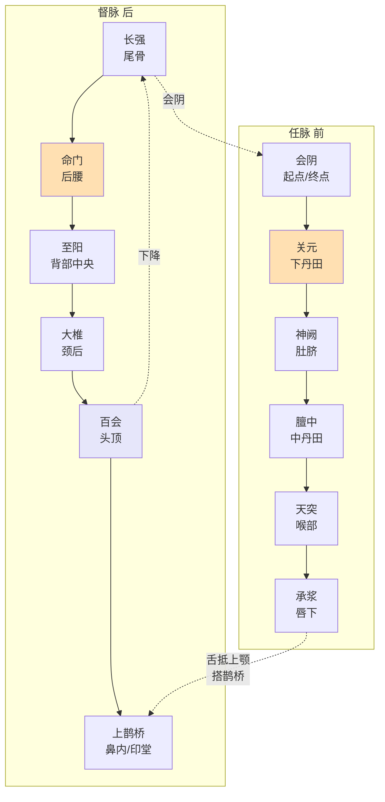
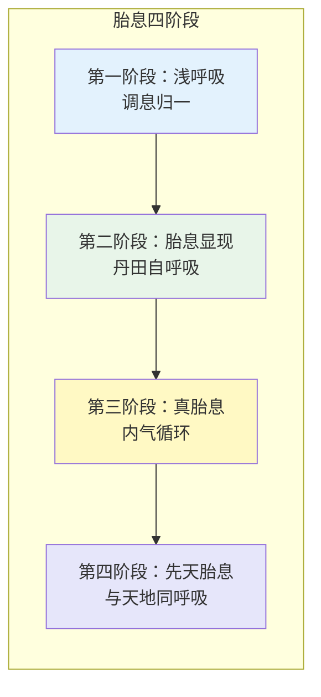
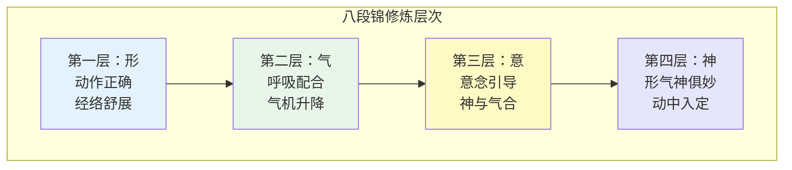
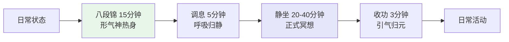
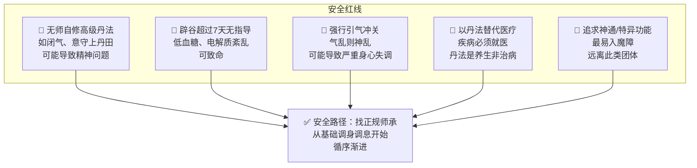

# 道家冥想实践指南

> **最后更新：2026-05**
>
> 本指南将道家内丹修炼体系转化为可操作的当代修习框架，涵盖小周天、胎息法、八段锦、子午流注及服食与冥想的关系。

---

## 目录

1. [小周天通关的完整修习路径](#1-小周天通关的完整修习路径)
2. [胎息法的四阶段实操](#2-胎息法的四阶段实操)
3. [八段锦的冥想维度](#3-八段锦的冥想维度)
4. [子午流注与冥想时辰](#4-子午流注与冥想时辰)
5. [道家"服食"与冥想的关系](#5-道家服食与冥想的关系)
6. [附录：参考资源与安全警示](#6-附录参考资源与安全警示)

---

## 1. 小周天通关的完整修习路径

### 1.1 小周天理论框架

小周天（Small Heavenly Circuit）指内气沿任督二脉循环运行的修炼路径，是道家内丹术"炼精化气"阶段的核心功法。



### 1.2 百日筑基：每日修习内容

> **目标**：在约一百天内，建立稳定的下丹田气感，并引导其沿任督循环。

#### 第一阶段：筑基期（第1-30天）

| 时间 | 修习内容 | 详细说明 | 时长 |
|------|----------|----------|------|
| **晨** | 调身 | 盘坐/平坐，脊柱正直，双手结"子午印"（左手包右手，拇指轻触） | 5分钟 |
|  | 调息 | 自然呼吸→腹式呼吸→逆腹式呼吸（吸气收腹提会阴，呼气放松） | 10分钟 |
|  | 凝神 | 意守下丹田（脐下三寸，关元穴内），似守非守 | 15分钟 |
| **晚** | 放松 | 卧式，全身扫描放松 | 5分钟 |
|  | 意守 | 丹田温热感培养，如守一暖炉 | 15分钟 |

#### 第二阶段：采药期（第31-60天）

| 修习内容 | 说明 |
|----------|------|
| **药生信号** | 丹田温热、内肾汤煎（后腰发热）、玉茎微举（无欲而举） |
| **采药时机** | 感知到上述信号时，即行「采药」——以意引气，配合呼吸内收 |
| **呼吸法** | 吸气时提会阴、收腹、舌抵上颚，引气从尾闾上升；呼气时气沉丹田 |
| **关键口诀** | 「吸、舐、撮、闭」——吸气、舌抵、撮提会阴、闭目内视 |

#### 第三阶段：通关期（第61-90天）

| 修习内容 | 说明 |
|----------|------|
| **冲关准备** | 丹田气足，自发有向背后冲击之感 |
| **尾闾关** | 气行至尾骨处，可能停顿。不急不躁，继续意守，配合提肛 |
| **夹脊关** | 气上至背部中央（与心相对），可能胸闷。深呼吸，放松心胸 |
| **玉枕关** | 气至后脑，最难通过。可轻微摇头、以意上引，或暂时放下，继续积累 |
| **百会降** | 气过玉枕，直上百会，如醍醐灌顶 |
| **任脉降** | 气从百会沿前额、鼻、喉、胸、腹下降，回归丹田 |

#### 第四阶段：周天运转期（第91-100天及以后）

| 修习内容 | 说明 |
|----------|------|
| **自然运转** | 不再刻意引导，内气自循环 |
| **火候微调** | 以「文火」温养——轻微意念，如护烛火 |
| **日常养护** | 每日至少一次完整周天，每次 30-60 分钟 |

### 1.3 火候掌握：关键要诀

| 火候类型 | 意念强度 | 呼吸 | 适用阶段 |
|----------|----------|------|----------|
| **武火** | 较强 | 深呼吸、腹式 | 采药、冲关 |
| **文火** | 轻微 | 自然呼吸 | 温养、日常 |
| **沐浴** | 无念 | 自然呼吸 | 过关后的暂停点（百会、丹田） |
| **退火** | 放下 | 自然 | 气机过亢、出现不适时 |

> **核心原则**：「忘火方能得火，有意终是障碍。」火候的掌握不在技巧，而在长期的身心敏感度培养。

### 1.4 验证标准

| 层次 | 标志 | 评价 |
|------|------|------|
| **初级** | 丹田温热、腹内气行感 | 筑基有效，继续积累 |
| **中级** | 后腰发热、脊柱有气流上升感 | 接近通关，保持耐心 |
| **高级** | 头顶清凉、面部麻痒、口水增多（金津玉液） | 通关在即，不急不躁 |
| **通周天** | 内气沿任督自循环，每次修习一圈或多圈 | 百日筑基基本完成 |
| **深化** | 全身温热、十二经脉通畅感、睡中自转 | 进入大周天预备 |

### 1.5 常见问题与应对

| 问题 | 原因 | 应对 |
|------|------|------|
| 丹田无感 | 意守过紧或过松 | 调整到「似守非守」，如鸡孵卵 |
| 气冲头部胀痛 | 意念过重、强行引气 | 立即退火，意守涌泉，引气下行 |
| 胸闷心悸 | 夹脊关气机瘀滞 | 放松胸部，做扩胸运动，暂停打坐 |
| 遗精频繁 | 采药时机不当或意守过紧 | 减少意守强度，配合固肾功法 |
| 烦躁失眠 | 火候过旺、阴虚阳亢 | 改练静功或卧功，增加睡眠时间 |

---

## 2. 胎息法的四阶段实操

### 2.1 胎息理论

胎息（Embryonic Breathing）是道家呼吸修炼的高阶境界，源自《抱朴子》「得胎息者，能不以口鼻嘘吸，如在胞胎之中」。



### 2.2 第一阶段：浅呼吸（调息归一）

| 项目 | 内容 |
|------|------|
| **时间预期** | 1-3 个月 |
| **身体信号** | 呼吸逐渐变浅、变长、变均匀；杂念减少 |
| **练习方法** | 数息法：吸气-1，呼气-2，至10后回1；或随息法：只是观察呼吸，不干预 |
| **呼吸特征** | 从胸式呼吸→腹式呼吸→逆腹式呼吸，最终回归自然浅呼吸 |
| **检验标准** | 一炷香（约30分钟）内呼吸自然浅细，心不随息跑 |

#### 浅呼吸练习步骤

1. **坐姿**：散盘/单盘，脊柱正直，双手覆于丹田
2. **调身**：头正、肩松、胸含、腹松
3. **调息**：不刻意控制，只是让呼吸自然变浅
4. **调心**：若呼吸变深，不急，轻轻带回浅呼吸的意念
5. **收功**：搓手摩面、鸣天鼓、叩齿、吞津

### 2.3 第二阶段：胎息显现（丹田自呼吸）

| 项目 | 内容 |
|------|------|
| **时间预期** | 3-12 个月（因人而异） |
| **身体信号** | 丹田区域出现自发呼吸感，如腹部内有另一套呼吸系统在运作；口鼻呼吸极微 |
| **练习方法** | 完全放弃控制，让丹田自发运动。意念如旁观者，观而不随 |
| **呼吸特征** | 口鼻几乎不呼吸，丹田区域有微弱的起伏或温热流动 |
| **检验标准** | 可连续 10-30 分钟感知丹田自呼吸，不感到憋气 |

#### 胎息显现的关键转变

> 从「我呼吸」到「呼吸在发生」。
>
> 此阶段最忌强求。胎息不是做出来的，而是当身体足够放松、能量足够积累后，自然显现的状态。

### 2.4 第三阶段：真胎息（内气循环）

| 项目 | 内容 |
|------|------|
| **时间预期** | 1-3 年 |
| **身体信号** | 全身毛孔似有呼吸感（体呼吸）；皮肤敏感度提高；身体边界感模糊 |
| **练习方法** | 完全无为，进入深定。可配合「守中」——不守任何特定点，只是觉知整体 |
| **呼吸特征** | 内外呼吸合一，身体与环境的能量交换通过全身进行 |
| **检验标准** | 长时间打坐后，身体如婴儿般柔软，面色红润，精神饱满 |

### 2.5 第四阶段：先天胎息（与天地同呼吸）

| 项目 | 内容 |
|------|------|
| **时间预期** | 多年至终身修持 |
| **身体信号** | 个体呼吸感消失，体验到「天地一呼吸」的合一感；极深的宁静与清明 |
| **练习方法** | 无修之修，日常生活皆是定境 |
| **呼吸特征** | 《道德经》「绵绵若存，用之不勤」——似有似无，与道同体 |
| **检验标准** | 非概念可及，唯证方知。古人以「脱胎神化」为终极标志 |

### 2.6 四阶段对比总表

| 阶段 | 时间预期 | 呼吸状态 | 意识状态 | 身体信号 | 常见障碍 |
|------|----------|----------|----------|----------|----------|
| 浅呼吸 | 1-3月 | 浅、长、匀 | 专注/数息 | 放松、温热 | 昏沉、散乱 |
| 胎息显现 | 3-12月 | 口鼻微，丹田动 | 旁观/观照 | 丹田自呼吸 | 强求、恐惧 |
| 真胎息 | 1-3年 | 体呼吸 | 定/守中 | 毛孔呼吸感 | 境界执着 |
| 先天胎息 | 多年 | 与天地同 | 无念/合一 | 婴儿般柔软 | 无（或傲慢） |

---

## 3. 八段锦的冥想维度

### 3.1 八段锦不是体操：「动中求静」的内丹修炼

传统八段锦（Eight Pieces of Brocade）并非单纯的健身体操，而是道家「动功」的代表——通过外在动作引导内在气机，最终达到「形气神合一」。



### 3.2 八式完整指南

| 序号 | 名称 | 动作要领 | 呼吸配合 | 意念观想 | 对应脏腑 |
|------|------|----------|----------|----------|----------|
| **1** | 双手托天理三焦 | 双手交叉上托，脚跟可提起 | 上托吸气，下落呼气 | 气从丹田上贯头顶，如托天 | 三焦 |
| **2** | 左右开弓似射雕 | 马步，一手拉弓一手推箭 | 开弓吸气，收势呼气 | 如拉千斤弓，气贯双臂 | 肺/大肠 |
| **3** | 调理脾胃须单举 | 一手上托一手下按，交替 | 上托吸气，下落呼气 | 脾胃在中焦被上下拉伸 | 脾胃 |
| **4** | 五劳七伤往后瞧 | 头向后转，身体不动 | 后转吸气，回正呼气 | 颈椎松开，气血上达头部 | 心/小肠 |
| **5** | 摇头摆尾去心火 | 马步，头摇尾摆 | 摆尾吸气，摇头呼气 | 心火沿脊柱下降入肾水 | 心肾相交 |
| **6** | 两手攀足固肾腰 | 前屈，双手攀足 | 前屈呼气，起身吸气 | 气贯脊柱，命门温暖 | 肾/膀胱 |
| **7** | 攒拳怒目增气力 | 马步冲拳，怒目圆睁 | 冲拳呼气，收拳吸气 | 肝气舒展，力量从地起 | 肝/胆 |
| **8** | 背后七颠百病消 | 提踵颠足，震动全身 | 提踵吸气，颠足呼气 | 全身气血被震荡贯通 | 全身 |

### 3.3 冥想维度的操作要点

| 层次 | 操作 | 检验 |
|------|------|------|
| **形气相合** | 每个动作的起止与呼吸起止同步 | 外人看不出呼吸痕迹，内在呼吸深长 |
| **以意领气** | 动作未起，意先动；动作已止，意仍行 | 动作结束后有持续的气流感 |
| **形神俱妙** | 动作中念头极少，甚至「忘记」自己在做动作 | 一套八段锦（约12-15分钟）如刹那 |
| **动中入定** | 动作与静坐入定状态无异 | 收势后直接进入静坐，无缝衔接 |

### 3.4 八段锦作为静坐准备的流程



---

## 4. 子午流注与冥想时辰

### 4.1 十二时辰与脏腑经络对应

| 时辰 | 时间 | 经络/脏腑 | 气血状态 | 冥想建议 |
|------|------|----------|----------|----------|
| **子** | 23:00-01:00 | 胆经当令 | 一阳初生，胆汁代谢 | **静坐黄金时**：深度入定，炼精化气 |
| **丑** | 01:00-03:00 | 肝经当令 | 肝血回流，解毒修复 | 深睡眠优于打坐 |
| **寅** | 03:00-05:00 | 肺经当令 | 气血重新分配 | **打坐佳时**：清净无扰，采气 |
| **卯** | 05:00-07:00 | 大肠经当令 | 排毒排便 | 轻度打坐+排便，不强行久坐 |
| **辰** | 07:00-09:00 | 胃经当令 | 消化准备 | 早餐后不宜打坐 |
| **巳** | 09:00-11:00 | 脾经当令 | 运化水谷 | 可短坐，或动功 |
| **午** | 11:00-13:00 | 心经当令 | 阳气最盛，一阴初生 | **正午静坐**：心肾相交，半小时为宜 |
| **未** | 13:00-15:00 | 小肠经当令 | 分清泌浊 | 饭后不宜，可散步冥想 |
| **申** | 15:00-17:00 | 膀胱经当令 | 排毒、津液代谢 | 可打坐，适宜温养 |
| **酉** | 17:00-19:00 | 肾经当令 | 藏精、修复 | **打坐佳时**：补肾气，不宜过劳 |
| **戌** | 19:00-21:00 | 心包经当令 | 保护心脏，情绪舒缓 | 适宜静坐，放松一日紧张 |
| **亥** | 21:00-23:00 | 三焦经当令 | 全身气机调和 | 轻打坐或准备入睡 |

### 4.2 最佳冥想时间表

```mermaid
timeline
    title 道家冥想最佳时辰
    section 深夜-清晨
        23:00-01:00 : 子时静坐
                      : 一阳初生
                      : 最深定境
        03:00-05:00 : 寅时打坐
                      : 气血清明
                      : 采气最佳
    section 正午
        11:00-13:00 : 午时静坐
                      : 心肾相交
                      : 半小时即可
    section 黄昏
        17:00-19:00 : 酉时打坐
                      : 补肾藏精
                      : 温养元气
```

### 4.3 四正时（四正子时）深度修习

| 四正时 | 时间 | 意义 | 修习内容 |
|--------|------|------|----------|
| **正子时** | 当日 23:00-01:00 | 天地阴阳交替，一阳初生 | 小周天、炼精化气 |
| **正午时** | 当日 11:00-13:00 | 阳极阴生 | 心肾相交、沐浴温养 |
| **正卯时** | 当日 05:00-07:00 | 日出东方，阳气生发 | 采日精、面向东方吐纳 |
| **正酉时** | 当日 17:00-19:00 | 日落西方，阴气渐盛 | 吞月华、面向西方静养 |

---

## 5. 道家"服食"与冥想的关系

### 5.1 辟谷期间的冥想调整

> **重要声明**：辟谷应在有经验的指导下进行，本指南仅提供一般性信息，不构成医疗建议。

#### 辟谷三阶段与冥想配合

| 阶段 | 时间 | 身体状态 | 冥想调整 | 注意事项 |
|------|------|----------|----------|----------|
| **减食期** | 3-5天 | 逐渐减少固体食物 | 正常静坐，增加意念于脾胃的感恩 | 不急于减少，顺其自然 |
| **断食期** | 3-7天（初阶） | 胃肠休息，能量转向内在 | **减少意念强度**：改用「文火」，多静养少引导 | 极度避免强行引气，防虚脱 |
| **复食期** | 3-5天 | 逐渐恢复饮食 | 增加吞津（金津玉液）法，意念配合消化 | 复食比断食更重要，粥→菜→肉 |

#### 辟谷期间的安全冥想原则

| 原则 | 说明 |
|------|------|
| **降强度** | 辟谷时身体能量降低，冥想意念必须更轻，如「微火温养」 |
| **多卧功** | 以卧式冥想为主，减少坐姿消耗 |
| **重呼吸** | 以自然呼吸为主，不练闭气、不练强烈腹式 |
| **防过气** | 气感过强时立即退火，引气下行至涌泉 |
| **听身体** | 头晕、心慌、极度虚弱时，立即停止一切功法，恢复饮食 |

### 5.2 饮食对气的影响

| 食物类型 | 对气的影响 | 冥想建议 |
|----------|-----------|----------|
| **五谷主食** | 养气之本，脾胃生化之源 | 日常修行的基础，不可长期偏废 |
| **辛辣刺激** | 气机上逆，心烦意乱 | 冥想前 2 小时避免 |
| **生冷寒凉** | 损伤脾阳，气机凝滞 | 脾胃虚寒者减少，冥想前避免 |
| **油腻厚味** | 痰湿内生，头脑昏沉 | 冥想当日宜清淡 |
| **肉食** | 补气但性燥，增加欲望 | 初修行者适度减少，非必须素食 |
| **五辛（葱蒜韭等）** | 传统认为散气、激发欲望 | 传统道家修行日避免 |
| **茶/咖啡** | 提神但可能使气上浮 | 冥想前 2-3 小时避免 |
| **酒** | 先扬后抑，乱气伤神 | 修行日完全避免 |

### 5.3 道家食气法（服气）简介

| 方法 | 操作 | 适用 |
|------|------|------|
| **吞津法** | 舌抵上颚，待津液满口，分三次吞下，意送丹田 | 每日可做，最佳养生法 |
| **服日精** | 日出时面对太阳，闭目，想象红光入口入腹 | 卯时进行，补阳气 |
| **吞月华** | 月圆之夜面对月亮，想象银光入口入腹 | 酉时或夜间，补阴精 |
| **食气法** | 深吸一口气，如吞咽食物般咽入腹中 | 需在空气清净处，现代城市慎用 |

---

## 6. 附录：参考资源与安全警示

### 6.1 推荐经典书目

| 书名 | 作者/编者 | 说明 |
|------|----------|------|
| 《周易参同契》 | 魏伯阳 | 内丹术之祖，难读但必知 |
| 《悟真篇》 | 张伯端 | 南宗丹法核心经典 |
| 《黄庭经》 | 相传为魏华存 | 存神观想的重要参考 |
| 《胎息经》 | 佚名 | 胎息法的根本经典 |
| 《因是子静坐法》 | 蒋维乔 | 近代最通俗的静坐入门 |
| 《道家养生学概要》 | 萧天石 | 现代整理的综合参考 |
| Opening the Dragon Gate | Chen Kaiguo & Zheng Shunchao | 《太乙金华宗旨》的当代实践记录 |

### 6.2 推荐当代资源

| 资源 | 类型 | 说明 |
|------|------|------|
| 龙门派/武当派传承 | 师承 | 内丹修炼必须有师承，不建议完全自学 |
| 李谨伯《呼吸之间》 | 书籍 | 当代丹道入门通俗读物 |
| 张至顺《炁体源流》 | 书籍 | 全真龙门派老道长的心得 |
| 八段锦国家标准版 | 视频 | 国家体育总局发布，动作规范 |

### 6.3 安全警示：不可逾越的红线



| 危险信号 | 说明 | 应对 |
|----------|------|------|
| 冥想后出现持续幻觉 | 可能是精神解离 | 立即停止，精神科评估 |
| 气乱（气机不受控地在体内乱窜） | 意念过重或方法错误 | 找有经验的老师调整，或改练动功 |
| 持续遗精/性欲亢进无法控制 | 火候失控，相火妄动 | 减少意守强度，增加运动，必要时就医 |
| 过度节食导致严重虚弱 | 误将辟谷理解为绝食 | 立即恢复正常饮食，就医检查 |
| 加入要求绝对服从的"丹道团体" | 可能是精神控制团体 | 保持独立判断，远离高压组织 |

---

> **免责声明**：本指南仅供文化与教育参考。道家内丹修炼涉及复杂的身心技术，强烈建议在合格的师承指导下进行。本指南中的任何内容均不构成医疗建议，如有健康问题请咨询专业医疗人员。

---

*文档版本：1.0 | 最后更新：2026-05 | Peace Lab Database*
