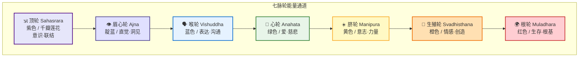
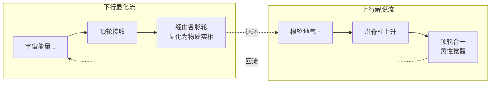
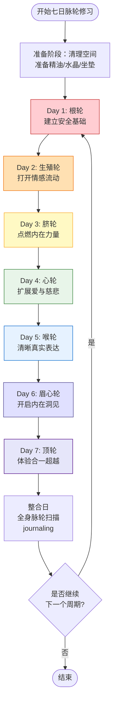
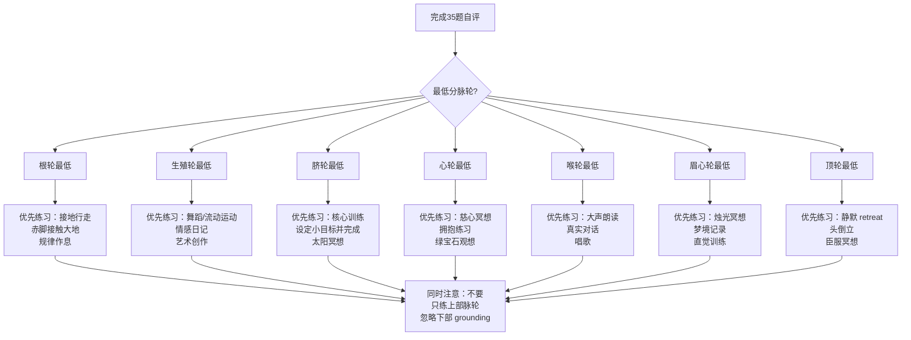

# 脉轮冥想实践指南

> **最后更新：2026-05**
>
> 本指南将古老的印度瑜伽脉轮体系转化为可操作的当代修习框架，同时提供科学视角的批判性审视。

---

## 目录

1. [脉轮体系概述](#1-脉轮体系概述)
2. [七日逐脉轮激活序列](#2-七日逐脉轮激活序列)
3. [脉轮平衡自评测试](#3-脉轮平衡自评测试)
4. [脉轮与日常生活](#4-脉轮与日常生活)
5. [西方科学批判与负责任使用指南](#5-西方科学批判与负责任使用指南)
6. [附录：参考资源](#6-附录参考资源)

---

## 1. 脉轮体系概述

### 1.1 七脉轮基本架构



| 脉轮 | 梵文名 | 位置 | 颜色 | 元素 | 核心功能 | 失衡关键词 |
|------|--------|------|------|------|----------|-----------|
| 根轮 | Muladhara | 会阴/尾骨 | 红色 | 土 | 生存、安全、根基 | 恐惧、焦虑、疏离 |
| 生殖轮 | Svadhisthana | 下腹部 | 橙色 | 水 | 情感、创造、性欲 | 压抑、成瘾、冷漠 |
| 脐轮 | Manipura | 太阳神经丛 | 黄色 | 火 | 意志、力量、自尊 | 无力、控制、自卑 |
| 心轮 | Anahata | 胸口中央 | 绿色 | 风/空气 | 爱、慈悲、接纳 | 封闭、嫉妒、过度付出 |
| 喉轮 | Vishuddha | 喉部 | 蓝色 | 以太/空间 | 表达、沟通、真理 | 沉默、多言、说谎 |
| 眉心轮 | Ajna | 眉心 | 靛蓝 | 光 | 直觉、洞见、想象 | 困惑、幻觉、偏执 |
| 顶轮 | Sahasrara | 头顶 | 紫色/白 | 思/纯意识 | 灵性联结、超越 | 虚无、物质执念、分离 |

### 1.2 脉轮能量流动示意



---

## 2. 七日逐脉轮激活序列

> **修习原则**：每日专注一个脉轮，晨间激活（20分钟）+ 晚间整合（10分钟）。七日为一完整周期，可循环修习。

### 2.1 日程总览

| 日期 | 脉轮 | 主题 | 晨间重点 | 晚间重点 |
|------|------|------|----------|----------|
| Day 1 | 根轮 | 扎根与安全 | 大地连接冥想 | 身体扫描稳固 |
| Day 2 | 生殖轮 | 流动与创造 | 水元素观想 | 情感释放书写 |
| Day 3 | 脐轮 | 力量与意志 | 太阳火冥想 | 成就回顾 |
| Day 4 | 心轮 | 爱与慈悲 | 慈心冥想扩展 | 感恩日记 |
| Day 5 | 喉轮 | 表达与真理 | 声音振动练习 | 自由书写 |
| Day 6 | 眉心轮 | 直觉与洞见 | 第三眼烛光冥想 | 梦境记录 |
| Day 7 | 顶轮 | 联结与超越 | 顶轮白光冥想 | 静默观照 |

---

### 2.2 Day 1 — 根轮 Muladhara（红色）

#### 完整练习包

| 练习维度 | 具体内容 | 时间 |
|----------|----------|------|
| **颜色观想** | 闭眼观想会阴处有旋转的红色光球，顺时针缓慢旋转，光芒逐渐扩大至整个骨盆区域 | 5分钟 |
| **种子音念诵** | 「Lam」（拉姆），低音振动，感受尾骨区域共振。每次呼气发声，吸气静默。建议108遍 | 10分钟 |
| **对应体式** | 山式（Tadasana）、战士一式（Virabhadrasana I）、婴儿式（Balasana）、挺尸式中专注脚底 | 5分钟 |
| **精油** | 岩兰草、广藿香、雪松 | 熏香或涂抹脚底 |
| **水晶** | 黑曜石、红碧玉、石榴石 | 握于手中或置于根轮处 |
| **情绪释放要点** | 恐惧、不安全感。练习中允许身体自发颤抖，这是释放深层紧张的正常反应 | — |

#### 日常识别信号

| 平衡状态 | 失衡表现 |
|----------|----------|
| 感觉踏实、财务稳定、身体健康 | 慢性焦虑、经济恐慌、体重异常、下肢冰冷 |

#### 根轮冥想引导词（精简版）

> 「感受你的坐骨接触地面……像树根一样向下延伸……无论外界如何变化，大地始终承托着你……每一次呼吸，红色的光芒在骨盆底部更加明亮……你是安全的……你是被支持的……」

---

### 2.3 Day 2 — 生殖轮 Svadhisthana（橙色）

#### 完整练习包

| 练习维度 | 具体内容 | 时间 |
|----------|----------|------|
| **颜色观想** | 观想下腹部（肚脐下方三指）有橙色漩涡，如水中涟漪般柔和扩散 | 5分钟 |
| **种子音念诵** | 「Vam」（瓦姆），唇音带水润感，感受下腹部轻微振动。108遍 | 10分钟 |
| **对应体式** | 蝴蝶式（Baddha Konasana）、青蛙式、猫牛式、髋部环绕 | 5分钟 |
| **精油** | 檀香、依兰依兰、甜橙 | 腹部按摩或熏香 |
| **水晶** | 红玉髓、月光石、琥珀 | 置于小腹 |
| **情绪释放要点** | 压抑的性欲、创作阻塞、童年情感创伤。允许哭泣、笑声或任何情感流动，不评判 | — |

#### 日常识别信号

| 平衡状态 | 失衡表现 |
|----------|----------|
| 情感流动自如、创造力充沛、性关系健康 | 情感麻木、性冷淡/成瘾、 creative block、关系依赖 |

---

### 2.4 Day 3 — 脐轮 Manipura（黄色）

#### 完整练习包

| 练习维度 | 具体内容 | 时间 |
|----------|----------|------|
| **颜色观想** | 观想太阳神经丛（胸骨下方）有明亮的黄色太阳，散发温暖与力量 | 5分钟 |
| **种子音念诵** | 「Ram」（拉姆），丹田发力，短促有力。108遍 | 10分钟 |
| **对应体式** | 船式（Navasana）、战士三式、弓式、扭转体式 | 5分钟 |
| **精油** | 柠檬、迷迭香、生姜 | 腹部涂抹 |
| **水晶** | 黄水晶、虎眼石、金色黄铁矿 | 置于胃区 |
| **情绪释放要点** | 无力感、羞耻、自我怀疑。练习中可配合「力量姿势」展开胸膛，默念「我有力量」 | — |

#### 日常识别信号

| 平衡状态 | 失衡表现 |
|----------|----------|
| 自信、目标明确、消化良好 | 拖延、讨好他人、胃溃疡、暴饮暴食、权力斗争 |

---

### 2.5 Day 4 — 心轮 Anahata（绿色）

#### 完整练习包

| 练习维度 | 具体内容 | 时间 |
|----------|----------|------|
| **颜色观想** | 观想胸口中央有绿色莲花缓缓绽放，每一片花瓣都散发着无条件的爱 | 5分钟 |
| **种子音念诵** | 「Yam」（亚姆），胸腔共鸣，温柔绵长。108遍 | 10分钟 |
| **对应体式** | 骆驼式（Ustrasana）、鱼式（Matsyasana）、上犬式、反手背后交扣 | 5分钟 |
| **精油** | 玫瑰、茉莉、佛手柑 | 心口涂抹 |
| **水晶** | 绿幽灵、翡翠、粉晶、玫瑰石英 | 置于胸口 |
| **情绪释放要点** |  grief（哀伤）、背叛感、自我厌恶。双手交叉抱肩，像拥抱自己一样 | — |

#### 日常识别信号

| 平衡状态 | 失衡表现 |
|----------|----------|
| 慈悲、同理、关系和谐、免疫强健 | 嫉妒、孤独感、心脏病风险、过度牺牲、无法 Say No |

#### 心轮冥想引导词

> 「将双手放在心口……感受心跳的节奏……这是生命本身的韵律……绿色的光芒从胸口向四面八方扩散……首先拥抱你自己……然后拥抱你所爱的人……最后拥抱整个世界……包括那些难以爱的人……」

---

### 2.6 Day 5 — 喉轮 Vishuddha（蓝色）

#### 完整练习包

| 练习维度 | 具体内容 | 时间 |
|----------|----------|------|
| **颜色观想** | 观想喉咙处有清澈的蓝色宝石，每次呼气，宝石更加明亮纯净 | 5分钟 |
| **种子音念诵** | 「Ham」（哈姆），喉部振动明显，音调可升高。108遍 | 10分钟 |
| **对应体式** | 肩倒立（Sarvangasana）、犁式、鱼式、狮子式（Simhasana）、颈部拉伸 | 5分钟 |
| **精油** | 尤加利、茶树、洋甘菊 | 喉咙外部涂抹（稀释后） |
| **水晶** | 蓝纹玛瑙、青金石、海蓝宝、蓝晶石 | 置于喉部 |
| **情绪释放要点** | 未被听见的愤怒、不敢说出的真相、创意表达受阻。可尝试「乱语冥想」（Gibberish）释放压抑 | — |

#### 日常识别信号

| 平衡状态 | 失衡表现 |
|----------|----------|
| 表达清晰、善于倾听、甲状腺健康 | 喉咙痛、话多/沉默、说谎、不敢表达需求、甲状腺问题 |

---

### 2.7 Day 6 — 眉心轮 Ajna（靛蓝）

#### 完整练习包

| 练习维度 | 具体内容 | 时间 |
|----------|----------|------|
| **颜色观想** | 闭眼将意识集中于眉心，观想靛蓝色光点，或经典「烛光冥想」（Trataka）后闭眼残像 | 5分钟 |
| **种子音念诵** | 「Om」（嗡）或「Aum」，高音，感受眉心轻微脉动。21-108遍 | 10分钟 |
| **对应体式** | 孩童式前额触地、简易坐中下巴内收（Jalandhara Bandha）、瑜伽睡眠中的眉心专注 | 5分钟 |
| **精油** | 乳香、没药、鼠尾草（谨慎使用） | 熏香 |
| **水晶** | 紫水晶、青金石、蓝铜矿、舒俱来 | 置于眉心 |
| **情绪释放要点** | 精神困惑、过度分析、幻视幻听。保持「观察者」姿态，不追逐也不排斥任何内在画面 | — |

#### 日常识别信号

| 平衡状态 | 失衡表现 |
|----------|----------|
| 直觉敏锐、决策清晰、想象力丰富 | 头痛、噩梦、偏执、脱离现实、无法做决定 |

---

### 2.8 Day 7 — 顶轮 Sahasrara（紫色/白色）

#### 完整练习包

| 练习维度 | 具体内容 | 时间 |
|----------|----------|------|
| **颜色观想** | 观想头顶千瓣莲花绽放，紫色光芒转为纯白，向上无限延伸与宇宙连接 | 5分钟 |
| **种子音念诵** | 静默。或极轻柔的「Ah」（啊）——代表开放与接受。21遍后进入纯静默 | 10分钟 |
| **对应体式** | 头倒立（Sirsasana，高级）、莲花坐、任何坐姿中头顶向上延展、尸卧式中观想顶轮开放 | 5分钟 |
| **精油** | 莲花、乳香、白檀 | 极少量熏香 |
| **水晶** | 白水晶、钻石（或透明石英）、紫水晶、透石膏 | 置于头顶附近 |
| **情绪释放要点** | 灵性逃避（Spiritual Bypassing）、虚无感、与身体脱节。结束时必须有意识地「回归」身体，按摩四肢 | — |

#### 日常识别信号

| 平衡状态 | 失衡表现 |
|----------|----------|
| 灵性觉醒、与生命合一感、意义感清晰 | 抑郁、疏离身体、傲慢的"灵性优越感"、脱离日常责任 |

---

### 2.9 七日修习流程图



---

## 3. 脉轮平衡自评测试

### 3.1 使用说明

本测试共 **35 题**（每脉轮5题），请根据过去三个月的真实状态评分：

| 评分 | 含义 |
|------|------|
| 1 | 几乎从不 / 完全不符合 |
| 2 | 很少 / 不太符合 |
| 3 | 有时 / 一般 |
| 4 | 经常 / 比较符合 |
| 5 | 几乎总是 / 非常符合 |

**计分规则**：

| 总分区间 | 状态解读 |
|----------|----------|
| 5-10 | **阻塞（Underactive）**：该脉轮能量较低，需要激活练习 |
| 11-17 | **平衡（Balanced）**：该脉轮运作良好，保持即可 |
| 18-25 | **过度活跃（Overactive）**：该脉轮能量过强，需要 grounding 和释放 |

---

### 3.2 根轮 Muladhara（5题）

| 编号 | 题目 |
|------|------|
| 1 | 我感到生活稳定，有基本的安全感 |
| 2 | 我的财务状况让我安心，没有生存焦虑 |
| 3 | 我与自己的身体连接良好，关注身体健康 |
| 4 | 我能够专注当下，不容易被未来的担忧带走 |
| 5 | 我感到与大地、自然有连接 |

**根轮计分**：____ / 25

---

### 3.3 生殖轮 Svadhisthana（5题）

| 编号 | 题目 |
|------|------|
| 6 | 我的情感表达流畅，不压抑也不过度 |
| 7 | 我有健康的性观念和身体愉悦感 |
| 8 | 我感到创造力充沛，有新点子涌现 |
| 9 | 我能够享受生活的乐趣，不只是完成任务 |
| 10 | 我在关系中能够自如地给予和接受情感 |

**生殖轮计分**：____ / 25

---

### 3.4 脐轮 Manipura（5题）

| 编号 | 题目 |
|------|------|
| 11 | 我对自己有信心，能够设定并完成目标 |
| 12 | 我在冲突中能够维护自己的边界 |
| 13 | 我的消化系统运作良好（少有胃痛/胀气） |
| 14 | 我为自己的成就感到自豪，不羞于展示 |
| 15 | 我有自律能力，但不至于苛刻对待自己 |

**脐轮计分**：____ / 25

---

### 3.5 心轮 Anahata（5题）

| 编号 | 题目 |
|------|------|
| 16 | 我容易对他人产生同理心和慈悲 |
| 17 | 我能够接受他人的爱，不感到不配 |
| 18 | 我原谅过去的伤害，不让怨恨持续 |
| 19 | 我的呼吸系统健康，呼吸深而自然 |
| 20 | 我在关系中既有亲密也有独立空间 |

**心轮计分**：____ / 25

---

### 3.6 喉轮 Vishuddha（5题）

| 编号 | 题目 |
|------|------|
| 21 | 我能够清晰表达自己的想法和需求 |
| 22 | 我善于倾听他人，不打断、不预设立场 |
| 23 | 我说的是真话，不需要伪装或掩饰 |
| 24 | 我的声音稳定有力，不颤抖或过于尖锐 |
| 25 | 我能够创造性地表达自己（写作/艺术/演讲等） |

**喉轮计分**：____ / 25

---

### 3.7 眉心轮 Ajna（5题）

| 编号 | 题目 |
|------|------|
| 26 | 我相信自己的直觉，常常 "知道" 答案 |
| 27 | 我能够在信息不全时做出决策 |
| 28 | 我有活跃的想象力和视觉化能力 |
| 29 | 我能看到事物的整体模式，不只看表面 |
| 30 | 我定期进行自省和内观练习 |

**眉心轮计分**：____ / 25

---

### 3.8 顶轮 Sahasrara（5题）

| 编号 | 题目 |
|------|------|
| 31 | 我感到生命的意义超越日常琐事 |
| 32 | 我有冥想或灵性修习的习惯 |
| 33 | 我能够体验到与更大存在的联结感 |
| 34 | 我不执着于物质拥有，追求内在成长 |
| 35 | 我对未知持开放态度，不恐惧死亡或无常 |

**顶轮计分**：____ / 25

---

### 3.9 结果可视化表

| 脉轮 | 得分 | 状态 | 优先级建议 |
|------|------|------|-----------|
| 根轮 | ___/25 | □ 阻塞 □ 平衡 □ 过度 | |
| 生殖轮 | ___/25 | □ 阻塞 □ 平衡 □ 过度 | |
| 脐轮 | ___/25 | □ 阻塞 □ 平衡 □ 过度 | |
| 心轮 | ___/25 | □ 阻塞 □ 平衡 □ 过度 | |
| 喉轮 | ___/25 | □ 阻塞 □ 平衡 □ 过度 | |
| 眉心轮 | ___/25 | □ 阻塞 □ 平衡 □ 过度 | |
| 顶轮 | ___/25 | □ 阻塞 □ 平衡 □ 过度 | |

### 3.10 结果解读与行动指南



---

## 4. 脉轮与日常生活

### 4.1 工作场景中的脉轮识别

| 脉轮 | 失衡在工作中的信号 | 即时调整策略 |
|------|-------------------|-------------|
| **根轮** | 对工作安全过度焦虑、不敢跳槽、过度囤积资源 | 整理办公桌、建立稳定日程、计算真实财务安全线 |
| **生殖轮** | 职场关系暧昧不清、创意枯竭、情绪性决策 | 设立清晰人际边界、安排创意时间、情绪冷静24小时规则 |
| **脐轮** | 不敢争取升职、过度控制团队、容易 burnout | 列出个人成就清单、练习说"不"、委派任务 |
| **心轮** | 过度讨好同事、职场冷暴力、无法拒绝额外工作 | 设定同理心边界、学习建设性冲突、优先自我保护 |
| **喉轮** | 会议中不敢发言、过度承诺、传播办公室八卦 | 会前写下三点要说的、练习"我需要时间考虑"、止语练习 |
| **眉心轮** | 过度分析导致决策瘫痪、忽视数据凭直觉、看不到大局 | 设定决策截止时间、建立数据检查清单、定期 zoom out |
| **顶轮** | 工作无意义感、灵性逃避不务正业、傲慢于"俗务" | 为日常工作赋予意义、 grounding 练习、服务他人 |

### 4.2 关系场景中的脉轮识别

| 脉轮 | 失衡在关系中的信号 | 关系修复策略 |
|------|-------------------|-------------|
| **根轮** | 依附型依恋、无法独处、用关系填补空虚 | 建立独立生活基础、学习自我安抚技巧 |
| **生殖轮** | 关系中的情感操控、性作为工具、激情后空虚 | 情感诚实对话、区分爱与需要、情欲与亲密分离练习 |
| **脐轮** | 关系中的权力斗争、一方完全主导、自尊依赖对方评价 | 明确关系契约、个人自尊建设、平等对话练习 |
| **心轮** | 过度付出、情感封闭、嫉妒控制 | 接受爱而非只给予、渐进式脆弱练习、感恩对方独立性 |
| **喉轮** | 关系中沉默冷战、言语攻击、不表达真实需求 | 非暴力沟通（NVC）训练、定期关系 check-in、写信表达 |
| **眉心轮** | 读心术假设、过度解读、不信任直觉 | 验证假设而非臆断、区分直觉与焦虑、信任建立练习 |
| **顶轮** | 关系中的"灵魂伴侣"执念、逃避日常摩擦、关系神圣化 | 接受关系的人性局限、共同 grounding 活动、服务性行动 |

### 4.3 健康场景中的脉轮识别

| 脉轮 | 相关身体系统 | 失衡的身体信号 | 调整方向 |
|------|-------------|---------------|----------|
| 根轮 | 下肢、骨骼、直肠、免疫系统基础 | 慢性疲劳、下肢冰冷、便秘、频繁感冒 |  grounding 运动、规律睡眠、蛋白质摄入 |
| 生殖轮 | 生殖系统、泌尿系统、下背部 | 月经不调、前列腺问题、腰痛、性冷淡/亢进 | 骨盆运动、水疗、情感表达 |
| 脐轮 | 消化系统、肝脏、胰腺、肌肉 | 胃溃疡、糖尿病倾向、消化不良、核心无力 | 核心训练、少量多餐、自尊建设 |
| 心轮 | 心肺系统、胸腺、手臂、淋巴 | 胸闷、呼吸浅、高血压、免疫力下降 | 深呼吸练习、有氧运动、宽恕工作 |
| 喉轮 | 甲状腺、喉咙、口腔、颈椎 | 喉咙痛、甲状腺问题、牙痛、颈椎病 | 颈部拉伸、真实表达、适度沉默 |
| 眉心轮 | 脑垂体、眼睛、神经系统 | 头痛、视力模糊、睡眠障碍、注意力不集中 | 屏幕休息、冥想、减少刺激 |
| 顶轮 | 脑松果体、头顶皮肤、整体神经 | 偏头痛、精神错乱（极端）、与身体脱节 |  grounding、身体扫描、适度灵性修习 |

---

## 5. 西方科学批判与负责任使用指南

### 5.1 脉轮体系的历史语境

| 维度 | 传统理解 | 当代简化风险 |
|------|----------|-------------|
| **起源** | 印度密教（Tantra）约8-10世纪的精微身（subtle body）理论 | 被简化为"人体能量站"，脱离其复杂的哲学与仪式语境 |
| **文献** | 《六轮维提瑜》、《哈他瑜伽之光》等密典 | 大多修习者从未阅读原始文本，依赖二手解读 |
| **传承** | 需要 Guru（上师）口传心授，配合特定仪式 | 自学为主，缺乏传统中的安全监护机制 |
| **目标** | 灵性解脱（Moksha），非健康或成功 | 被工具化为达成世俗目标的手段 |

### 5.2 科学证据的现状（截至2026）

| 声称 | 科学现状 | 评价 |
|------|----------|------|
| "脉轮是身体的能量中心" | 无解剖学对应。与中医经络类似，属前科学概念体系 | 不能按字面理解为物理存在 |
| "脉轮颜色对应内分泌腺体" | 部分对应（如喉轮-甲状腺、眉心-脑垂体），但颜色对应无生理学依据 | 有趣的类比，非科学事实 |
| "脉轮冥想能减轻焦虑" | 有研究支持。但效果可能来自冥想本身，非脉轮特定机制 | 正念/冥想的普遍益处已被证实 |
| "水晶可以治愈脉轮" | 无可靠科学证据。效应可归因于安慰剂、情境效应 | 作为聚焦注意力的工具有价值，非医疗手段 |
| "精油影响脉轮能量" | 芳香疗法对部分情绪状态有影响（通过嗅觉-边缘系统），但与"脉轮"无特定关联 | 气味心理学有依据，脉轮归因是文化建构 |

### 5.3 负责任的使用原则

```mermaid
flowchart TD
    subgraph 负责任使用框架
    P1["✅ 将脉轮视为<br/>心理-身体映射工具<br/>非解剖实体"] 
    P2["✅ 用于自我觉察<br/>情绪探索<br/>冥想聚焦"]
    P3["✅ 配合循证方法<br/>CBT / 正念 / 运动<br/>整合使用"]
    P4["✅ 严重身心问题<br/>优先寻求<br/>专业医疗"]
    P5["✅ 尊重文化源头<br/>承认印度传统<br/>避免文化挪用"]
    end
    
    subgraph 应避免的行为
    A1["❌ 替代医疗诊断<br/>或药物治疗"]
    A2["❌ 声称可治愈<br/>癌症/重病"]
    A3["❌ 贩卖"脉轮证书"<br/>快速开悟承诺"]
    A4["❌ 诱导脱离现实的<br/>过度灵性体验"]
    A5["❌ 未经训练<br/>进行能量治疗"]
    end
    
    P1 --> P2 --> P3 --> P4 --> P5
```

### 5.4 整合建议：脉轮 + 循证实践

| 传统脉轮练习 | 可整合的循证方法 | 整合方式 |
|-------------|-----------------|----------|
| 根轮 grounding | 身体导向心理治疗（Somatic Experiencing）、规律运动 | 将身体觉知与创伤释放技术结合 |
| 生殖轮情感释放 | 表达性艺术治疗、情绪日记（Expressive Writing） | 用结构化写作替代无引导的情绪泛滥 |
| 脐轮力量建设 | 认知行为治疗（CBT）中的核心信念工作、目标设定 | 将观想与具体行为实验结合 |
| 心轮慈心冥想 | Loving-Kindness Meditation（已有大量研究支持） | 直接使用科学验证的版本 |
| 喉轮表达练习 | 非暴力沟通（NVC）、叙事治疗 | 将脉轮观想与沟通技能训练结合 |
| 眉心轮直觉训练 | 正念觉察（Mindfulness）、内省（Introspection） | 区分直觉与焦虑，建立验证机制 |
| 顶轮超越体验 | 致幻剂辅助治疗（在合法研究框架内）、深度冥想 | 在专业指导下探索意识状态 |

### 5.5 红旗警告：何时停止脉轮修习并寻求专业帮助

| 信号 | 可能含义 | 建议行动 |
|------|----------|----------|
| 冥想后出现持续的解离感（"不真实感"） | 可能触发了潜在的解离障碍 | 暂停冥想，咨询精神科医生 |
| 强迫性重复念诵导致声带损伤 | 物理伤害 | 立即停止，耳鼻喉科检查 |
| 水晶/精油使用后皮肤过敏 | 接触性皮炎 | 停用，皮肤科就诊 |
| 声称"脉轮告诉我"做出重大危险决策 | 可能的精神病性症状 | 精神科评估 |
| 因"脉轮未打开"产生极端自我厌恶 | 修行变成自我攻击 | 心理治疗优先 |
| 花费大量金钱购买"必须"的脉轮产品 | 商业操纵 | 暂停消费，理性评估 |

---

## 6. 附录：参考资源

### 6.1 推荐书目

| 书名 | 作者 | 说明 |
|------|------|------|
| *Wheels of Life* | Anodea Judith | 最系统的当代脉轮教材 |
| *Eastern Body, Western Mind* | Anodea Judith | 脉轮与西方心理学的整合 |
| *The Wheels of Life* (中文版《脉轮全书》) | Anodea Judith | 中文修习者入门 |
| *Kundalini: The Evolutionary Energy in Man* | Gopi Krishna | 拙火体验的第一手记录，含重要安全警示 |

### 6.2 推荐练习音频/视频

| 资源 | 类型 | 说明 |
|------|------|------|
| Dr. Joe Dispenza - Chakra Meditation | 引导冥想 | 结构化的脉轮激活引导 |
| Yoga International - Chakra Yoga Classes | 体式课程 | 脉轮主题的瑜伽序列 |
| 西藏颂钵 Chakra Set (432Hz) | 声音疗愈 | 作为背景音使用 |

### 6.3 关键术语表

| 术语 | 解释 |
|------|------|
| **Kundalini** | 昆达里尼，常被描述为沉睡于根轮的灵性能量 |
| **Prana** | 普拉那，生命能量/气息 |
| **Nadi** | 气脉，能量流动的通道，三主脉为左脉（Ida）、右脉（Pingala）、中脉（Sushumna） |
| **Bandha** | 身印/锁，能量封锁技巧 |
| **Bija Mantra** | 种子音，每个脉轮的专属音节 |
| **Granthis** | 结，脉轮路径上的能量阻塞点 |

---

> **免责声明**：本指南仅供教育与自我探索之用，不构成医疗建议。如有身心健康问题，请咨询合格的医疗或心理健康专业人士。

---

*文档版本：1.0 | 最后更新：2026-05 | Peace Lab Database*
