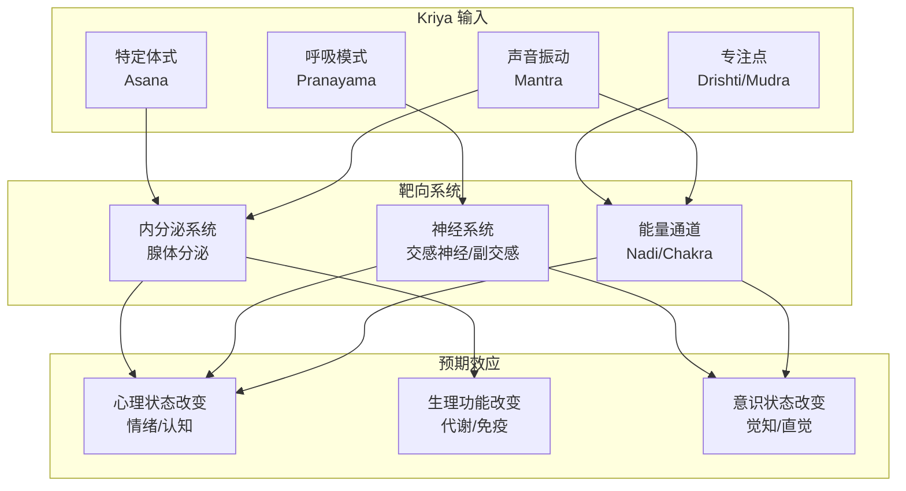
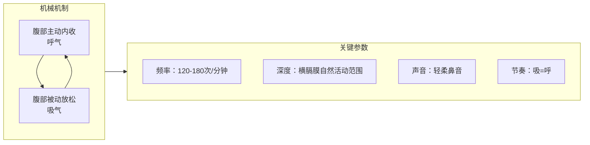

---

title: "昆达里尼 Kriya 实操序列详解"
description: "昆达里尼 Kriya 实操序列详解的详细解析与实践指南"
category: "心智与心理学 > 冥想 > Kundalini Meditation"
tags: ["anxiety", "act"]
last_updated: "2026-05"
difficulty: "intermediate"
reading_level: "intermediate"
estimated_read_time: "10min"
intent_queries:
  - "什么是昆达里尼 Kriya 实操序列详解"
  - "昆达里尼 Kriya 实操序列详解的核心概念"
  - "昆达里尼 Kriya 实操序列详解的方法与实践"
trigger_keywords: ["act", "anxiety", "art", "behavioral"]
cross_refs:
  - path: "01-Wisdom-Traditions/yoga/anatomy-science/Yoga_Neuroscience_Modern_Research.md"
    relation: "communication/emotion/immune"
  - path: "01-Wisdom-Traditions/yoga/therapy-clinical/Yoga_Psychological_Healing_Principles.md"
    relation: "anxiety/communication/emotion"
  - path: "04-Humanities-Arts/arts/calligraphy-therapy/Calligraphy_Therapy_Overview.md"
    relation: "anxiety/communication/emotion"
  - path: "04-Humanities-Arts/media/music/music-therapy/Sacred_Music_Therapy.md"
    relation: "anxiety/communication/emotion"
  - path: "README.md"
    relation: "anxiety/communication/emotion"

---
# 昆达里尼 Kriya 实操序列详解

> **Kundalini Kriya Practice Sequences: A Detailed Operational Guide**
>
> 本文档基于 Yogi Bhajan 传承的 Kundalini Yoga 传统，提供 5 个经典 Kriya 的逐日/逐周练习序列，适用于有一定瑜伽基础的修习者。初学者建议在认证教师指导下进行。

---

## 一、Kriya 的定义与原理

### 1.1 什么是 Kriya

Kriya（梵文：क्रिया，意为"行动"或"完成功课"）在 Kundalini Yoga 中指**特定体式（Asana）、呼吸法（Pranayama）、专注点（Drishti/Mudra）和声音（Mantra）的精密组合**，旨在对特定身体系统、能量中心（Chakra）或心理状态产生靶向影响。

与传统 Hatha Yoga 中 Kriya 的含义（净化行为，如 Neti、Dhauti 等 Shatkarma）不同，Kundalini Yoga 中的 Kriya 是一套完整的"能量工程学"——每一个元素的组合都经过设计，以产生特定的生理、神经和能量效应。

### 1.2 Kriya 的神经内分泌靶向机制

**核心原理：** Kundalini Yoga 认为人体有 72,000 条能量通道（Nadis），其中最重要的三条是左脉（Ida，月亮/副交感）、右脉（Pingala，太阳/交感）和中脉（Sushumna，平衡通道）。Kriya 的精密组合旨在**清理能量通道、平衡左右脉、激活沿中脉上升的昆达里尼能量**。

### 1.3 练习基本原则

| 原则 | 说明 |
|------|------|
| **准时开始** | Kundalini Yoga 传统中，练习最好在日出前（Amrit Vela，4-7 AM）进行，此时能量最为精微 |
| **空腹或轻食** | 练习前 2-3 小时避免大量进食，可饮温水或瑜伽茶（Yogi Tea） |
| **白色天然纤维服装** | 传统建议穿白色宽松棉质服装，据说有助于能量场扩展（非绝对要求） |
| **头巾/头覆盖** | 保护顶轮能量，集中注意力（长发的练习者可扎起头发） |
| **不中断** | Kriya 是一个整体，中途停止可能产生能量滞留 |
| **结束后放松** | 每个 Kriya 后必须有足够的放松时间（至少 5-10 分钟），让能量整合 |

---

## 二、五个经典 Kriya 详解

### 2.1 Kriya for Elevation（提升 Kriya）

> **最佳时机：** 早晨， sunrise 前后
> **主要效应：** 激活太阳神经丛（Manipura Chakra），提升能量、清晰度与意志力
> **适合人群：** 早晨昏沉、缺乏动力、需要启动一天的人

#### 目的

此 Kriya 旨在快速唤醒身体和心智，激活第三脉轮（太阳神经丛）——个人力量、意志力和行动力的中心。它是开启一天的"能量引擎启动器"。

#### 时间

- **总时长：** 31-45 分钟
- **体式部分：** 22 分钟
- **放松：** 5-7 分钟
- **冥想：** 3-11 分钟（可选）

#### 体式分解

| 序号 | 体式/动作 | 时间 | 要点 | 常见错误 |
|------|----------|------|------|---------|
| **1** | **Ego Eradicator（自我消除器）** | 1-3 分钟 | 坐姿，双臂呈 60° 上举，拇指指尖相触（V 字形），Breath of Fire | 手臂过度后倾、呼吸变成胸式呼吸 |
| **2** | **脊柱 flex（猫牛式动态）** | 1-3 分钟 | 跪姿，随吸气骨盆前倾、胸腔打开，呼气骨盆后卷、下巴收向胸口 | 只用颈部而非脊柱整体运动 |
| **3** | **Sat Kriya（简化版）** | 3 分钟 | 跪姿（金刚坐/Vajrasana），双臂过头伸直，掌心相贴，念诵 Sat（收根锁）/Nam（放松） | 根锁（Mula Bandha）执行不清 |
| **4** | **青蛙式（Frog Pose）** | 26 个循环 | 深蹲，脚跟并拢，指尖触地，吸气站起（不锁膝），呼气蹲下 | 膝盖内扣、脚跟离地 |
| **5** | **伸展 pose（Cobra）** | 1-3 分钟 | 俯卧，双手在肩下，吸气上抬胸腔，保持根锁 | 用手臂推而不是背肌发力 |
| **6** | **弓式（Bow Pose）** | 1-3 分钟 | 俯卧，抓脚踝，吸气抬胸和腿 | 憋气、颈部过度后仰 |
| **7** | **肩倒立（Shoulder Stand）** | 3-5 分钟 | 仰卧，抬腿过头，手托后腰，脊柱垂直 | 颈部受压、下巴未贴胸口 |
| **8** | **鱼式（Fish Pose）** | 1-3 分钟 | 仰卧，手肘撑地，胸腔上提，头后仰，头顶触地 | 颈部过度承压 |
| **9** | **最终放松（Corpse Pose）** | 5-7 分钟 | 仰卧，双腿分开，手臂旁放，掌心向上，完全放松 | 紧张、思绪纷飞 |

#### 呼吸配合

- **Ego Eradicator & Sat Kriya：** Breath of Fire（火焰呼吸）
- **脊柱 flex & 青蛙式：** 与动作同步的自然呼吸
- **伸展、弓式、肩倒立、鱼式：** 深长的横膈膜呼吸（Diaphragmatic Breathing）
- **放松：** 自然呼吸，觉察呼吸的流动

#### Mantra

- **主要：** Sat Nam（真理即我的名字/本质）
- **念诵方式：** Sat（短而有力地收根锁），Nam（放松）
- **替代：** 可在整个 Kriya 中背景播放 Adi Mantra（Ong Namo Guru Dev Namo）

#### 注意事项

- 肩倒立禁忌：高血压、颈椎病、经期、青光眼
- 鱼式是肩倒立的"解药"，不可跳过
- 若 Breath of Fire 引起头晕，改为正常呼吸
- 初学者可将每个体式时间减半

---

### 2.2 Kriya for Relaxation and Releasing Fear（放松与释放恐惧）

> **最佳时机：** 傍晚或睡前
> **主要效应：** 激活副交感神经系统，释放储存在肾脏/腰部的恐惧能量
> **适合人群：** 焦虑、失眠、慢性紧张、恐惧症患者

#### 目的

恐惧在 Kundalini Yoga 体系中被理解为储存在肾脏和第一、二脉轮的能量阻塞。此 Kriya 通过特定的前屈、扭转和呼吸模式，**释放腰部的紧张，安抚肾上腺，重置神经系统的警觉状态**。

#### 时间

- **总时长：** 31-62 分钟
- **体式部分：** 22-45 分钟
- **放松：** 11 分钟（不可减少）
- **冥想：** 11 分钟

#### 体式分解

| 序号 | 体式/动作 | 时间 | 要点 | 靶向系统 |
|------|----------|------|------|---------|
| **1** | ** alternate nostril breathing（左右鼻孔交替呼吸）** | 3 分钟 | 坐姿，Vishnu Mudra（食指中指贴掌心），拇指闭右鼻孔先吸左，无名指闭左鼻孔呼右 | 平衡左右脉（Ida/Pingala） |
| **2** | **Life Nerve Stretch（生命神经伸展）** | 3 分钟/侧 | 坐姿一腿伸直一腿屈膝，双手抓伸直脚，吸气延伸脊柱，呼气前屈 | 伸展坐骨神经（生命神经） |
| **3** | **Butterfly（蝴蝶式）** | 1-3 分钟 | 坐姿，脚掌相对，双膝上下扇动 | 打开髋关节，释放骨盆紧张 |
| **4** | ** spinal flex on heels（脚跟上的脊柱 flex）** | 1-3 分钟 | 金刚坐，双手放大腿，吸气胸腔前推，呼气后卷 | 灵活下背部 |
| **5** | **Camel Pose（骆驼式）** | 1-3 分钟 | 跪姿，双手扶腰，胸腔上提，头后仰（进阶：抓脚跟） | 打开心轮，释放胸腔压抑 |
| **6** | ** Child's Pose（婴儿式）** | 1-3 分钟 | 臀部坐脚跟，额头触地，手臂前伸或旁放 | 完全放松背部 |
| **7** | ** Corpse Pose 放松** | 11 分钟 | 仰卧，完全放松 | 整合能量 |

#### 呼吸配合

- **交替鼻孔呼吸：** 4-4-4-4 箱式呼吸（吸-停-呼-停）
- **伸展体式：** 吸气延伸，呼气深入
- **骆驼式：** 吸气上提胸腔，呼气后弯
- **放松：** 自然呼吸，觉察腹部随呼吸的起伏

#### Mantra

- **Gobinday, Mukanday, Udharay, Apuray, Hariang, Kariang, Nirnamay, Akamay**
- 这是 Guru Gaitri Mantra（光明使之 Mantra），每个词对应一个神圣品质，用于消除深层恐惧和业力
- **念诵方式：** 每个词一个呼吸循环，或跟随 Snatam Kaur 等艺术家的录音

#### 注意事项

- 骆驼式禁忌：严重腰椎问题、高血压（保持头不低过心脏）
- 此 Kriya 后的放松不可缩短——11 分钟是能量重组的必要时间
- 睡前练习后若感到过度清醒，可在放松时播放柔和音乐
- 恐惧释放过程中可能出现哭泣或情绪释放——允许它发生

---

### 2.3 Kriya for a Calm and Open Heart（平静与开放的心）

> **最佳时机：** 任何需要情感平衡的时刻
> **主要效应：** 平衡心轮（Anahata Chakra），释放悲伤与愤怒，培养无条件的爱
> **适合人群：** 情感压抑、关系困难、悲痛、心轮阻塞者

#### 目的

心轮是下三轮（物质/身体/力量）和上三轮（沟通/直觉/灵性）之间的桥梁。当心轮阻塞时，人可能感到情感麻木、难以共情、或在关系中过度防御/过度依赖。此 Kriya 通过**打开胸腔的体式、心轮聚焦的呼吸和爱的 Mantra**，温和地解锁心轮能量。

#### 时间

- **总时长：** 31-62 分钟
- **体式部分：** 22-45 分钟
- **放松：** 5-11 分钟
- **冥想：** 3-11 分钟

#### 体式分解

| 序号 | 体式/动作 | 时间 | 要点 | 心轮效应 |
|------|----------|------|------|---------|
| **1** | **手臂交叉胸前（Heart Opener）** | 1-3 分钟 | 坐姿，右臂下左臂上交叉于胸前，双手抓对侧肩膀，深缓呼吸 | 自我拥抱，激活胸腺 |
| **2** | **Cobra Pose（眼镜蛇式）** | 1-3 分钟 | 俯卧，手在肩下，吸气抬胸腔，肩胛骨后收 | 打开前胸，刺激心轮 |
| **3** | **Bow Pose（弓式）** | 1-3 分钟 | 俯卧，抓脚踝，抬胸和腿 | 强烈心轮打开 |
| **4** | **Camel Pose（骆驼式）** | 1-3 分钟 | 跪姿，胸腔上提，头后仰 | 深层心轮释放 |
| **5** | ** seated heart opener** | 1-3 分钟 | 坐姿，双手背后十指交扣，胸腔前推 | 温和打开 |
| **6** | **Maha Mudra（大印）** | 3 分钟/侧 | 坐姿一腿伸直，一腿屈膝脚跟抵会阴，双手抓伸直脚额头触膝 | 平衡能量上下流动 |
| **7** | **Deep Relaxation** | 5-11 分钟 | 仰卧，手放于心口 | 感受心轮的振动 |

#### 呼吸配合

- **体式中：** 深长的横膈膜呼吸，吸气时感觉胸腔向四面八方扩展
- **心轮聚焦呼吸：** 想象吸气时绿色光从胸口进入，呼气时从胸口向外扩散
- **放松：** 完全自然呼吸，将注意力轻轻放在心口中央

#### Mantra

- **Ra Ma Da Sa Sa Say So Hung**
- 这是经典的**疗愈 Mantra**，代表太阳、月亮、地球和宇宙能量
- **念诵方式：** 每个音节对应一个脉轮能量中心，可跟随 Deva Premal 录音
- **替代：** Aad Guray Nameh（保护 Mantra）

#### 注意事项

- 心轮打开过程中可能释放深层悲伤——允许哭泣，不评判
- 若感到情绪过于强烈，回到婴儿式或仰卧，手放心口
- 高血压者在后弯体式中避免头低于心脏
- 此 Kriya 后避免立即进入激烈社交活动，给自己整合时间

---

### 2.4 Kriya for the Kidneys and Adrenals（肾脏与肾上腺）

> **最佳时机：** 压力高峰期后、疲劳恢复期
> **主要效应：** 刺激肾脏和肾上腺区域，恢复内分泌平衡，增强抗压能力
> **适合人群：** 慢性疲劳、肾上腺疲劳、长期高压工作者、夜班工作者

#### 目的

肾脏在东方医学中不仅是过滤器官，更是储存"生命力 essence（精）"的仓库。肾上腺则负责压力激素（皮质醇、肾上腺素）的分泌。长期的慢性压力会导致肾上腺功能耗竭（adrenal fatigue）。此 Kriya 通过**针对腰部的体式、特定的呼吸节奏和肾脏区域的锁定（Bandha）**，直接刺激和恢复这些关键腺体。

#### 时间

- **总时长：** 31-62 分钟
- **体式部分：** 22-45 分钟
- **放松：** 5-11 分钟
- **冥想：** 可选

#### 体式分解

| 序号 | 体式/动作 | 时间 | 要点 | 靶向效应 |
|------|----------|------|------|---------|
| **1** | **Stretch Pose（伸展式）** | 1-3 分钟 | 仰卧，双腿抬高 6 英寸（15cm），头抬高看向脚趾，双臂旁放抬起 6 英寸，Breath of Fire | 激活脐轮，强化核心 |
| **2** | **Frog Pose（青蛙式）** | 26 个循环 | 深蹲站起循环 | 刺激海底轮和肾脏区域 |
| **3** | **Life Nerve Stretch（生命神经伸展）** | 1-3 分钟/侧 | 坐姿前屈 | 伸展坐骨神经，释放腰部 |
| **4** | **Cobra Pose（眼镜蛇式）** | 1-3 分钟 | 俯卧抬胸腔 | 向后弯曲按摩肾脏 |
| **5** | **Bow Pose（弓式）** | 1-3 分钟 | 俯卧抓脚踝抬胸腿 | 强烈刺激肾脏和肾上腺 |
| **6** | **Locust Pose（蝗虫式）** | 1-3 分钟 | 俯卧，双手在体侧，吸气抬双腿和胸腔 | 强化下背部 |
| **7** | **Root Lock 练习（Mulbandh）** | 3-11 分钟 | 坐姿，深吸气后屏息，依次收缩肛门（根锁）、下腹（腹锁）、喉咙（喉锁），然后放松呼气 | 直接刺激根轮和海底轮 |
| **8** | **Deep Relaxation** | 5-11 分钟 | 仰卧 | 让肾脏区域充血后充分恢复 |

#### 呼吸配合

- **Stretch Pose：** Breath of Fire
- **青蛙式：** 与动作同步呼吸
- **后弯体式：** 深长的横膈膜呼吸
- **Root Lock：** 完全吸气 → 屏息 → 三锁 → 缓慢呼气

#### Mantra

- **Har（创造之神）**
- 此单音节 Mantra 强烈激活脐轮和太阳神经丛，重建个人力量
- **念诵方式：** 腹部用力，从肚脐发出"Har"的声音，可配合动作节奏

#### 注意事项

- 此 Kriya 能量较强，初学者可将时间减半
- 经期女性避免 Root Lock 和剧烈 Breath of Fire
- 高血压者避免长时间屏息
- 练习后可能感到疲劳——这是恢复过程的一部分，保证充足睡眠

---

### 2.5 Sat Kriya（Sat Kriya：核心练习）

> **最佳时机：** 任何时间（传统上作为 40 天每日 sadhana 的核心）
> **主要效应：** 激活根轮（Muladhara），升起昆达里尼能量，整合所有脉轮
> **适合人群：** 所有希望深化 Kundalini Yoga 修习的人

#### 目的

Sat Kriya 被称为 Kundalini Yoga 的**核心练习（Core Kriya）**。它的结构极其简单，但效果极其深远——通过重复念诵 Sat Nam 配合根锁（Mula Bandha），直接刺激根轮，使能量沿中脉上升，依次激活所有脉轮，最终达到顶轮。

传统教导中，**每日 3 分钟 Sat Kriya 的效果超过数小时的杂乱练习**。

#### 时间

- **标准：** 3 分钟
- **进阶：** 11 分钟
- **深度：** 22 分钟
- **大师级：** 31 分钟（需在教师指导下）
- **结束后放松：** 至少 2-5 分钟

#### 体式分解

| 元素 | 执行方式 | 要点 |
|------|---------|------|
| **坐姿** | 金刚坐（Vajrasana），臀部坐脚跟，脊柱挺直 | 若膝盖不适，可在臀部下放枕头；若仍不适，可改为简易坐（ cross-legged），但效果稍减 |
| **手臂** | 双臂过头伸直，掌心相贴或平行，食指指向上方 | 手臂尽量靠近耳侧，不弯曲 |
| **手印** | 所有手指交叉，食指伸直并指向上（女性右手拇指在外，男性左手拇指在外——传统说法） | 食指代表木星（扩展与智慧） |
| **念诵 Sat** | 吸气时收紧根锁（Mula Bandha——收缩肛门和会阴区域），同时默念或低诵 "Sat" | 收紧从肛门到生殖器的整个盆底区域 |
| **念诵 Nam** | 呼气时放松根锁，默念或低诵 "Nam" | 彻底放松，让能量自然上升 |
| **眼睛** | 闭眼，注意力集中在眉心（第三眼） | 或微睁眼，聚焦鼻尖 |

#### 呼吸配合

Sat Kriya 的呼吸模式是**自然呼吸配合主动根锁**，而不是强迫的呼吸节奏。关键是：
- Sat = 吸气 + 根锁收紧
- Nam = 呼气 + 根锁放松
- 呼吸是自然发生的，不需要深吸或深呼

#### Mantra

- **核心：** Sat Nam
- **Sat** = 真理、存在、无限
- **Nam** = 身份、名字、臣服
- **整体含义：** "我的真实身份是无限的存在" 或 "真理是我的名字"

#### 注意事项

| 注意点 | 说明 |
|--------|------|
| **保持手臂高举** | 手臂酸痛是正常的，这是 Kriya 的一部分。但若肩部有伤，可短暂放下再举起 |
| **不要摇摆** | 身体保持静止，能量应在内在流动，而非外在晃动 |
| **放松不可省略** | Sat Kriya 后的放松是能量整合的关键——至少 2-5 分钟仰卧 |
| **经期调整** | 经期可进行 Sat Kriya，但将根锁改为"意念上的轻收"，不强力收缩 |
| **孕期禁忌** | 孕早期不建议；孕中晚期绝对禁止 |
| **循序渐进** | 从 3 分钟开始，每周增加 1 分钟，直至 11 分钟。不要急于跳至 22 分钟 |
| **可能反应** | 情绪释放、能量涌动、体温变化、颜色/光在内在视野中出现——这些都是正常的能量调整 |

#### Sat Kriya 的 40 天 Sadhana 协议

传统上，Sat Kriya 作为 40 日连续练习（Sadhana）的核心：

| 阶段 | 天数 | Sat Kriya 时长 | 配套练习 |
|------|------|--------------|---------|
| **第1周** | 1-7 | 3 分钟 | 热身 5 分钟 + 放松 5 分钟 |
| **第2周** | 8-14 | 5 分钟 | 热身 5 分钟 + 放松 7 分钟 |
| **第3周** | 15-21 | 7 分钟 | 热身 5 分钟 + 放松 7 分钟 |
| **第4周** | 22-28 | 9 分钟 | 热身 5 分钟 + 放松 7 分钟 |
| **第5周** | 29-35 | 11 分钟 | 热身 5 分钟 + 放松 11 分钟 |
| **巩固期** | 36-40 | 11 分钟 | 完整 sadhana 序列 |

> **40 天规则：** 如果中断一天，必须从头开始。这是传统教导中的"能量连续性"原则。建议在日历上标记每日完成情况。

---

## 三、火焰呼吸（Breath of Fire / Kapalabhati）详细技术参数

### 3.1 基本定义

Breath of Fire（Agni Pran / Kapalabhati）是 Kundalini Yoga 中最核心的呼吸技术之一。它是一种**快速、节奏均匀、通过鼻腔进行的横膈膜呼吸**，吸气和呼气时间相等，每分钟约 120-180 次呼吸（每秒 2-3 次循环）。

### 3.2 技术参数

| 参数 | 标准值 | 说明 |
|------|--------|------|
| **频率** | 120-180 次/分钟 | 约每秒 2-3 次完整的呼吸循环 |
| **力度** | 中等、均匀 | 不是"用力吹"，而是横膈膜的自然弹动 |
| **声音** | 轻柔的鼻音 | 像婴儿的呼吸声或狗喘气的轻柔版 |
| **深度** | 横膈膜的自然活动范围 | 不是深吸深呼，而是快速、短促、高效的交换 |
| **鼻/口** | 鼻腔呼吸 | 除非鼻塞，否则始终鼻呼吸 |
| **身体部位** | 腹部驱动 | 重点是腹部的快速内收和放松，不是胸部 |

### 3.3 学习步骤

**步骤 1: 感知横膈膜（2 分钟）**
- 坐姿或仰卧，一手放心口，一手放腹部
- 缓慢呼吸，确保腹部手起伏，心口手基本不动
- 这是横膈膜呼吸的基础

**步骤 2: 模拟练习（2 分钟）**
- 嘴巴微张，像吹蜡烛一样快速、轻柔地呼气
- 让吸气自然发生（不需要主动吸）
- 感受腹部在呼气时的内收

**步骤 3: 鼻呼吸入门（1-3 分钟）**
- 闭嘴，通过鼻子进行同样的快速呼气
- 吸气是被动发生的——腹部一放松，空气自然流入
- 不要强迫自己"吸"——重点在"呼"

**步骤 4: 节奏均匀化（3-5 分钟）**
- 逐渐让吸气和呼气时间相等
- 想象腹部是一个活塞，上下快速而均匀地运动
- 保持面部、肩膀、颈部完全放松

### 3.4 进阶变体

| 变体名称 | 执行方式 | 效应 | 适用场景 |
|---------|---------|------|---------|
| **标准 Breath of Fire** | 坐姿，双手放膝或做 Mudra，标准频率 | 整体激活、净化血液、提升能量 | 大多数 Kriya 的标准呼吸 |
| **延长 Breath of Fire** | 频率降低至 60-90 次/分钟，每次呼气更充分 | 更深层的净化、增强耐力 | 体能训练、排毒期 |
| **鼻孔交替 Breath of Fire** | 用 Vishnu Mudra 闭单鼻孔，轮流进行 | 强力平衡左右脉 | 情绪失衡、偏头痛 |
| **站立 Breath of Fire** | 站立，手臂上举 V 字形，同时进行 | 快速激活全身能量 | 极度疲劳时快速唤醒 |
| **仰卧 Breath of Fire** | 仰卧，双腿抬高 6 英寸，同时做 Stretch Pose | 强化核心 + 火焰呼吸双重效应 | Stretch Pose 中 |

### 3.5 禁忌与注意事项

| 禁忌情况 | 原因 | 替代方案 |
|---------|------|---------|
| **孕期** | 可能刺激子宫 | 完全避免，改用深长横膈膜呼吸 |
| **经期（前3天）** | 可能增加出血 | 改为轻柔的腹式呼吸 |
| **高血压未控制** | 血压可能进一步升高 | 避免长时间 BOF，改为 1-2 分钟短练习 |
| **心脏病** | 心脏负荷增加 | 医师许可后方可尝试极短练习 |
| **眩晕/头晕** | 过度换气前兆 | 立即停止，恢复正常呼吸，躺下 |
| **进食后 2 小时内** | 影响消化 | 空腹时练习 |

### 3.6 常见错误

| 错误 | 正确做法 |
|------|---------|
| 用胸部呼吸（肩膀起伏） | 腹部驱动，肩膀完全静止 |
| 过度用力（像打喷嚏） | 轻柔、均匀，像婴儿的呼吸 |
| 主动深吸气 | 吸气是被动的，只主动呼气 |
| 面部紧张 | 面部完全放松，甚至可微笑 |
| 憋气 | 保持连续不断的节奏，不中断 |

---

## 四、练习序列整合建议

### 4.1 初学者周计划（第 1-4 周）

| 星期 | 早晨（日出前后） | 傍晚 |
|------|----------------|------|
| **周一** | Kriya for Elevation（简化版，20分钟） | - |
| **周二** | - | Kriya for Relaxation（简化版，20分钟） |
| **周三** | Sat Kriya 3 分钟 + 热身 | - |
| **周四** | - | Kriya for Calm Heart（简化版，20分钟） |
| **周五** | Kriya for Elevation（完整版） | - |
| **周六** | Sat Kriya 3-5 分钟 + 自由选择 | - |
| **周日** | - | 休息日或 Gentle Yoga + 深长呼吸 |

### 4.2 进阶者周计划（第 2-3 个月）

| 星期 | 早晨（45-62分钟） | 傍晚（30-45分钟） |
|------|------------------|------------------|
| **周一** | Kriya for Elevation 完整版 | - |
| **周二** | - | Kriya for Relaxation 完整版 |
| **周三** | Sat Kriya 11 分钟 + 热身放松 | - |
| **周四** | - | Kriya for Calm Heart 完整版 |
| **周五** | Kriya for Kidneys and Adrenals | - |
| **周六** | 长 Sadhana：Sat Kriya 11-22 分钟 + 冥想 | - |
| **周日** | - | 休息日或恢复性练习 |

---

## 五、常见问题 FAQ

| 问题 | 回答 |
|------|------|
| **为什么手臂会麻？** | 能量在经络中流动导致的正常反应。轻微晃动手指，结束体式后会恢复。若持续疼痛需调整姿势。 |
| **练习中想哭/情绪激动？** | 这是能量释放和情绪清理的正常现象。允许它发生，不要压抑。如果太强烈，改为婴儿式或仰卧。 |
| **什么时候能"感受到昆达里尼"？** | 每个人不同。有人数周，有人数年。不要追求"感受"，专注于规律练习。 |
| **可以只练 Sat Kriya 吗？** | 可以。传统教导中 Sat Kriya 是一个完整的 sadhana。但配合其他 Kriya 能获得更全面的效益。 |
| **必须穿白色衣服吗？** | 传统建议但非强制。白色据说有助于能量场扩展和心境净化。最重要的是舒适、不妨碍呼吸。 |
| **可以配合音乐吗？** | 可以。许多修习者使用 Mantra 音乐（如 Snatam Kaur、Deva Premal、Nirinjan Kaur）作为背景。 |
| **练习后感到疲劳？** | 初期正常，尤其是肾上腺疲劳者。保证充足睡眠和营养，逐步增加强度。 |

---

> *"Kriya 不是体操。它是能量的科学。每一个动作、每一次呼吸、每一个声音都是为了让你的灵魂与无限连接。"*
>
> — Yogi Bhajan

---

**最后更新：2026-05**
