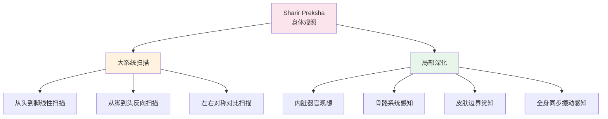
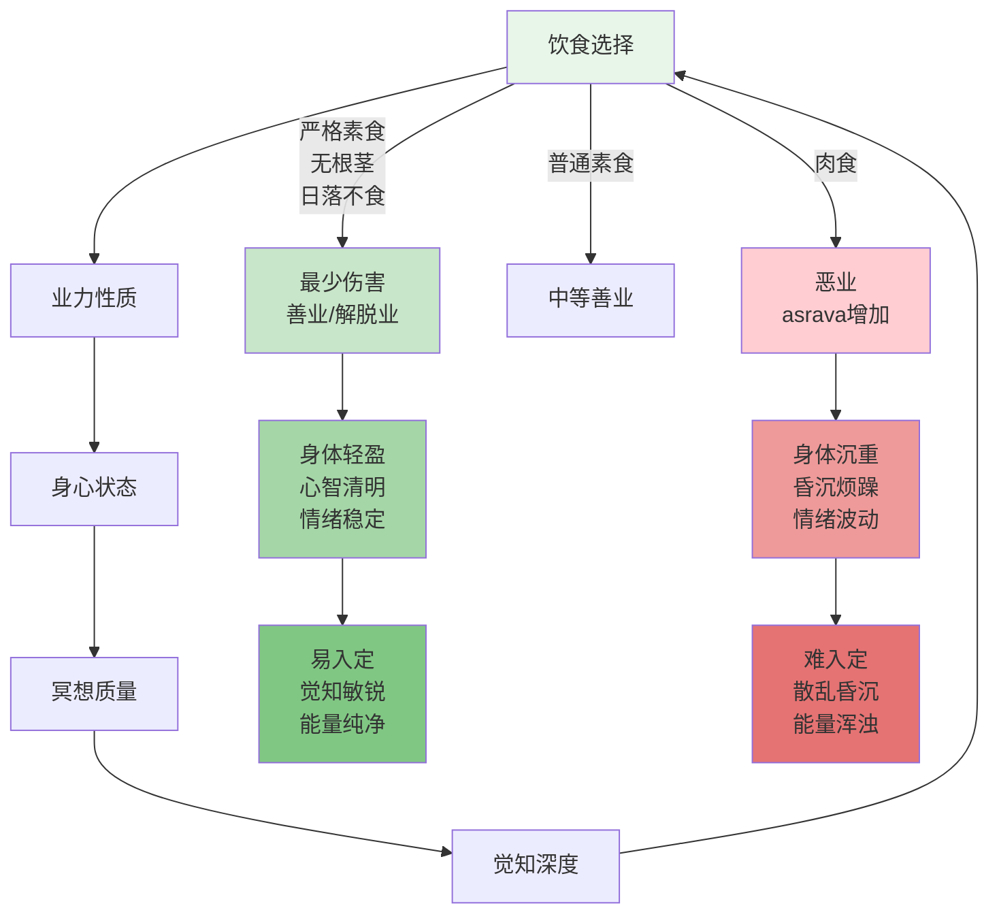

# 耆那冥想实修指南 (Jain Meditation Practical Guide)

> **最后更新：** 2026-05

---

## 目录

1. [Preksha Dhyana 八步完整流程](#1-preksha-dhyana-八步完整流程)
2. [Samayika 四十八分钟标准修习](#2-samayika-四十八分钟标准修习)
3. [Anupreksha 十二主题冥想脚本](#3-anupreksha-十二主题冥想脚本)
4. [耆那素食与冥想的整合](#4-耆那素食与冥想的整合)
5. [附录：参考资源](#5-附录参考资源)

---

## 1. Preksha Dhyana 八步完整流程

Preksha Dhyana（内观冥想）是耆那教最核心的冥想体系，由阿阇黎·图拉西（Acharya Tulsi）和阿阇黎·摩哈维格亚（Acharya Mahapragya）在20世纪系统化整理。完整的修习约需60-90分钟，分为八个递进阶段。

### 1.1 八步流程总览

### 1.2 步骤详解

#### 第一步：Kayotsarga（全身放松）

| 维度 | 详细说明 |
|------|----------|
| **时间** | 10-15分钟 |
| **身体部位** | 全身，从脚趾到头顶逐层放松 |
| **觉知焦点** | 身体各部位的紧张感释放，感知地心引力 |
| **标准姿势** | 仰卧（Shavasana）或舒适坐姿，双手自然放置 |
| **引导语** | "我的身体正在放松……每一块肌肉都放下负担……" |
| **常见障碍** | 入睡倾向、思维漂移、局部紧张残留 |
| **对治方法** | 轻微活动手指脚趾保持清醒；从脚趾到头顶分七个区域逐一扫描放松 |

**七层放松序列：**

| 序号 | 身体区域 | 具体部位 | 放松要点 |
|:----:|----------|----------|----------|
| 1 | 下肢 | 脚趾、脚掌、脚踝、小腿、膝盖、大腿 | 感受重力下沉 |
| 2 | 骨盆区 | 臀部、腹部、下背部 | 释放深层紧张 |
| 3 | 胸部 | 肋骨、心脏区域、上背部 | 呼吸自然流动 |
| 4 | 上肢 | 手指、手掌、手腕、前臂、上臂、肩膀 | 双臂如棉絮般沉重 |
| 5 | 颈部与喉咙 | 颈椎、喉结、下巴 | 头部自然支撑 |
| 6 | 面部 | 额头、眼周、脸颊、嘴唇、舌头 | 面部肌肉完全松弛 |
| 7 | 头顶 | 百会穴、整个头颅 | 如莲花绽放般轻盈 |

#### 第二步：Antaryatra（内观之旅）

| 维度 | 详细说明 |
|------|----------|
| **时间** | 5-8分钟 |
| **身体部位** | 身体中轴线，从脚趾到头顶的垂直通道 |
| **觉知焦点** | 能量沿脊柱流动的感知，超越肉体的精微身体 |
| **操作方式** | 以意识之光从脚底缓缓上升，经过小腿、膝盖、大腿、骨盆、脊柱、胸口、喉咙、面部，抵达头顶 |
| **常见障碍** | 意识跳跃、无法感知精微流动、身体部位认知模糊 |
| **对治方法** | 配合呼吸节奏——吸气时觉知上升，呼气时感受扩展 |

#### 第三步：Swas Preksha（呼吸观照）

| 维度 | 详细说明 |
|------|----------|
| **时间** | 10-15分钟 |
| **身体部位** | 鼻孔、鼻腔、胸腔、腹部 |
| **觉知焦点** | 呼吸的完整路径——空气进入鼻孔→鼻腔→气管→肺泡→呼出 |
| **进阶方法** | 计数呼吸（1-10循环）、观察呼吸温度（入凉出暖）、感知呼吸节奏（长短、深浅、快慢） |
| **常见障碍** | 控制呼吸（改为腹式呼吸或胸式呼吸）、计数混乱、烦躁 |
| **对治方法** | 明确只是"观察"而非"控制"；若呼吸自然变浅则允许它；计数丢失时温和地从1重新开始 |

**呼吸观照四维度：**

| 维度 | 观察内容 | 深度指标 |
|------|----------|----------|
| 空间路径 | 空气从鼻孔到肺泡的完整轨迹 | 能感知气流在左右鼻孔的交替主导 |
| 时间节奏 | 吸-停-呼-停的时长比例 | 达到1:0.5:1:0.5或更缓慢 |
| 温度变化 | 吸入空气较凉，呼出较暖 | 能清晰感知温差 |
| 身体联动 | 腹部、胸腔、锁骨的参与程度 | 三维呼吸自然发生 |

#### 第四步：Sharir Preksha（身体观照）

| 维度 | 详细说明 |
|------|----------|
| **时间** | 15-20分钟 |
| **身体部位** | 从头到脚或从脚到头的系统扫描 |
| **觉知焦点** | 身体各部位的内在振动、温度、重量、存在感 |
| **两种模式** | 快速扫描（2-3分钟全身，用于日常短修） vs 精细扫描（每个部位停留30秒以上） |
| **常见障碍** | 心理意象替代真实感知、跳过无感区域、评判身体 |
| **对治方法** | 对"无感"本身保持觉知；不以好坏评判；若某部位疼痛则扩大觉知范围包裹它 |

**身体观照精细路径：**

#### 第五步：Chaitanya Kendra Preksha（能量中心观照）

| 维度 | 详细说明 |
|------|----------|
| **时间** | 10-15分钟 |
| **身体部位** | 七个能量中心（Kendra），沿脊柱分布 |
| **觉知焦点** | 每个中心的独特振动频率、颜色、温度、形状 |
| **常见障碍** | 过度想象、期望看到光或颜色、能量过度激活 |
| **对治方法** | 如实感知——没有光也是一种感知；不过度停留于单一中心；保持平等心 |

**七个能量中心（Chaitanya Kendra）：**

| 序号 | 中心名称 | 身体位置 | 对应颜色 | 振动特征 | 常见体验 |
|:----:|----------|----------|----------|----------|----------|
| 1 | 根中心 | 会阴/尾骨 | 红色 | 深沉、厚重 | 稳定感、扎根感 |
| 2 | 腹中心 | 脐下三寸 | 橙色 | 流动、温暖 | 情绪流动、消化觉知 |
| 3 | 脐中心 | 肚脐区域 | 黄色 | 明亮、活跃 | 力量感、意志力 |
| 4 | 心中心 | 胸口中央 | 绿色 | 扩展、柔和 | 爱、慈悲、连接感 |
| 5 | 喉中心 | 喉咙底部 | 蓝色 | 清朗、振动 | 表达欲、声音感知 |
| 6 | 眉心中心 | 两眉之间 | 靛蓝色 | 集中、穿透 | 直觉、内在视觉 |
| 7 | 顶中心 | 头顶百会 | 紫色/白色 | 轻盈、无限 | 开放、合一感 |

#### 第六步：Leshya Dhyana（色彩观想）

| 维度 | 详细说明 |
|------|----------|
| **时间** | 8-10分钟 |
| **身体部位** | 全身气场/光晕（Leshya） |
| **觉知焦点** | 内心状态的"颜色"映射——六种Leshya对应不同心理状态 |
| **核心目标** | 将负面色彩（黑、蓝、灰）转化为正面色彩（黄、红、白） |
| **常见障碍** | 色彩想象不真实、情绪反应强烈、执着于特定颜色 |
| **对治方法** | 颜色只是象征，重点是背后的情绪状态；允许颜色自然变化；不追求白色（最高境界）而压抑当下真实状态 |

**六色Leshya与心理状态对应：**

| 颜色 | 名称 | 心理状态 | 业力性质 | 转化方向 |
|------|------|----------|----------|----------|
| 黑色 | Krishna Leshya | 极度贪婪、残忍、欺骗 | 重度恶业 | 需立即警觉并转化 |
| 蓝色 | Neel Leshya | 恐惧、焦虑、冷漠 | 恶业 | 通过慈悲冥想转化 |
| 灰色 | Kapot Leshya | 犹豫、怀疑、不安 | 中等业力 | 通过坚定修行转化 |
| 黄色 | Peet Leshya | 温和、善良、节制 | 善业 | 保持并深化 |
| 红色 | Padma Leshya | 慈悲、宽恕、热情 | 善业 | 向纯白发展 |
| 白色 | Shukla Leshya | 纯净、无执、解脱 | 最高善业/解脱业 | 终极目标，不执着 |

**色彩转化冥想脚本：**
> "我觉知到此刻内心的色彩……它是什么颜色？不评判，只是看见……如果它是深色的，我看见它背后的痛苦……我吸入白光，将它送入这片色彩……每一次呼吸，它都在 lighten……从黑到蓝到灰到黄到红……最终，我成为纯净的光……"

#### 第七步：Anupreksha（沉思冥想）

详见第3节「Anupreksha十二主题冥想脚本」。

| 维度 | 详细说明 |
|------|----------|
| **时间** | 10-15分钟 |
| **觉知焦点** | 一个特定主题的深度思维-情感整合 |
| **核心方法** | 逻辑沉思+情感体验+身体感知的三位一体 |
| **常见障碍** | 纯理性分析而无感受、陷入情绪而无洞察、主题游离 |
| **对治方法** | 每2-3分钟回到核心短语或意象；在"理解"与"感受"之间来回切换 |

#### 第八步：Bhavana（情感观想）

| 维度 | 详细说明 |
|------|----------|
| **时间** | 5-10分钟 |
| **觉知焦点** | 培养特定正面情感状态 |
| **四种核心Bhavana** | Maitri（友爱）、Pramoda（随喜）、Karuna（慈悲）、Madhyastha（平等心） |
| **常见障碍** | 情感虚假、目标对象不清晰、"应该"而非"真实感受" |
| **对治方法** | 从最容易感受的对象开始（如亲人）；允许情感自然升起而非强迫；若困难则回到呼吸安住 |

**四无量心Bhavana扩展：**

| Bhavana | 对象范围 | 核心语句 | 身体感受 |
|---------|----------|----------|----------|
| Maitri（友爱） | 从亲到怨的一切众生 | "愿一切众生幸福安康" | 心脏区域温暖扩展 |
| Pramoda（随喜） | 他人的成功与快乐 | "我为他人的成就感到喜悦" | 胸腔开阔、嘴角自然上扬 |
| Karuna（慈悲） | 受苦的众生 | "愿一切痛苦得到解脱" | 心脏区域柔软、眼眶湿润 |
| Madhyastha（平等心） | 一切情境与众生 | "一切现象皆有因果，我保持中立" | 全身平衡、无波动 |

---

## 2. Samayika 四十八分钟标准修习

Samayika（等持/平衡）是耆那教最核心的日常修习，要求修行者每日至少进行一次48分钟的完整仪式。"48分钟"对应古印度时间单位"muhurta"（一刹那），象征超越时间的平等心。

### 2.1 时间结构总览

```mermaid
gantt
    title Samayika 48分钟修习时间分配
    dateFormat X
    axisFormat %s分
    
    section 预备阶段
    入座与环境准备       : 0, 3
    
    section 正式修习
    Pratikraman忏悔     : 3, 10
    Pratyakhyan皈依     : 13, 7
    Kayotsarga放松      : 20, 8
    Preksha Dhyana冥想   : 28, 15
    Samayika等持安住     : 43, 3
    
    section 结束阶段
    Mangal祝福回向      : 46, 2
```

### 2.2 完整仪式流程

#### 第一阶段：入座与环境准备（3分钟）

| 步骤 | 操作 | 意义 |
|------|------|------|
| 1. 清洁 | 洗手、洗脸、漱口；若可能则沐浴 | 外在清洁象征内在净化 |
| 2. 着装 | 穿着干净、素色的宽松衣物；传统上使用白色棉质 | 放下社会身份 |
| 3. 环境 | 安静、通风、光线柔和的空间；面向东方或北方 | 与宇宙能量对齐 |
| 4. 入座 | 采用稳定坐姿（莲花坐、半莲花、简易坐或椅子坐姿） | 身体稳定促进心智稳定 |
| 5. 发愿 | 默念："我现在进入Samayika，放下一切世俗身份与牵挂" | 建立修习边界 |

#### 第二阶段：Pratikraman（忏悔，10分钟）

| 步骤 | 内容 | 操作说明 |
|------|------|----------|
| 1. 回顾一日 | 从晨起至今的言行检视 | 按时间顺序回顾，不回避 |
| 2. 识别过失 | 识别Himsa（伤害）、Maya（欺骗）、Chorya（盗窃）、Maithun（性不当） | 四类主要过失 |
| 3. 真诚忏悔 | 对每一过失表达悔意 | 不只口头，需感受内心震动 |
| 4. 决意改正 | 明确未来不再犯的具体决心 | 具体、可执行的承诺 |
| 5. 自我宽恕 | 放下自责，接纳自己仍在修行路上 | 防止忏悔变成自我攻击 |

**Pratikraman五大过失检视清单：**

| 过失类别 | 身体层面 | 语言层面 | 思想层面 |
|----------|----------|----------|----------|
| Himsa（伤害） | 故意伤害任何生命 | 命令或赞同伤害 | 希望他人受苦的念头 |
| Maya（欺骗） | 行为伪装 | 说谎、夸大、隐瞒 | 自欺、合理化 |
| Chorya（盗窃） | 未经允许取物 | 侵占他人名誉、时间 | 觊觎他人所有 |
| Maithun（性不当） | 非伦理身体行为 | 性暗示言语 | 性幻想、占有欲 |
| Parigraha（贪执） | 过度拥有 | 谈论财产 | 对物质的执着念头 |

#### 第三阶段：Pratyakhyan（皈依与决意，7分钟）

| 步骤 | 内容 |
|------|------|
| 1. 三皈依 | 皈依Arihant（觉悟者）、Siddha（解脱者）、Acharya（导师）、Upadhyaya（教师）、Sadhu（修行者）——五至尊（Pancha Paramesthi） |
| 2.  Navkar Mantra念诵 | "Namo Arihantanam, Namo Siddhanam, Namo Ayariyanam, Namo Uvajjhayanam, Namo Loe Savva Sahunam" — 重复3-21遍 |
| 3. 决意发愿 | "我在此决意，未来48分钟内（或更长时间）不伤害任何生命、不说谎、不偷窃、保持贞洁、放下贪执" |
| 4. 扩展至全天 | 将此决意扩展至今日余下时间 |

#### 第四阶段：Kayotsarga（全身放松，8分钟）

同Preksha Dhyana第一步，但在此语境下具有"放下一切身份"的特殊意义——在Samayika中，Kayotsarga不仅是身体放松，更是"放下作为某某某的自我故事"。

#### 第五阶段：Preksha Dhyana（内观冥想，15分钟）

根据时间选择简化的Preksha流程：
- **3分钟**：Swas Preksha（呼吸观照）
- **4分钟**：Sharir Preksha快速扫描（从头到脚一次）
- **4分钟**：Chaitanya Kendra Preksha（心中心与顶中心）
- **4分钟**：Bhavana（四无量心之一，每日轮换）

#### 第六阶段：Samayika等持安住（3分钟）

| 要点 | 说明 |
|------|------|
| 核心状态 | 不取不舍、不迎不拒的平等心 |
| 身体感知 | 全身作为整体的觉知，不分部位 |
| 心智状态 | 不思维、不想象、不专注、不散乱——纯粹的觉知 |
| 象征意义 | "Samayika"字面意义即"在时间之中保持平等" |
| 检验标准 | 若此刻有人叫你名字，你能平静回应而不被惊吓 |

#### 第七阶段：Mangal（祝福回向，2分钟）

| 步骤 | 内容 |
|------|------|
| 1. 功德回向 | "愿此Samayika的功德利益一切众生" |
| 2. 祝福世界 | "愿一切有情获得和平、解脱、觉悟" |
| 3. 起身 | 缓慢、有意识地起身，将平等心带入日常生活 |
| 4. 记录 | （可选）在日记中简短记录本次修习体验 |

### 2.3 Samayika每日修习记录表

| 日期 | 时间 | 地点 | 总时长 | 主要体验 | 困难 | 决意履行度 |
|------|------|------|--------|----------|------|------------|
| 示例 | 06:00 | 家中佛堂 | 48分钟 | 深度平静，心轮温暖 | 膝盖酸痛 | 80% |

---

## 3. Anupreksha 十二主题冥想脚本

Anupreksha（深度沉思）是耆那教冥想体系中培养智慧（Samyak Darshan）的核心方法。十二个主题覆盖存在的基本真相，每个主题需以"思维理解→情感体验→身体感知→生活应用"四个层面来修习。

### 3.1 十二主题总览

| 序号 | 主题（梵文） | 中文 | 核心洞察 | 对治烦恼 |
|:----:|-------------|------|----------|----------|
| 1 | Anitya | 无常 | 一切现象皆短暂 | 执着、永恒幻觉 |
| 2 | Asharan | 无助/孤独 | 无人能替代你的业力 | 依赖、受害者心态 |
| 3 | Samsara | 轮回 | 生死循环的苦 | 对现世的沉迷 |
| 4 | Ekatva | 独一 | 灵魂是孤独的旅行者 | 社交焦虑、合群压力 |
| 5 | Anyatva | 他者性 | 身体、财产皆非我 | 身份认同、物质主义 |
| 6 | Ashuchi | 不净 | 身体的本质不净 | 色欲、身体自恋 |
| 7 | Asrava | 漏入 | 业力如何流入灵魂 | 无明的行为模式 |
| 8 | Samvara | 止漏 | 阻止业力流入的方法 | 缺乏自律 |
| 9 | Nirjara | 消除 | 已积聚业力的消除 | 绝望、无力感 |
| 10 | Loka | 宇宙 | 宇宙的结构与尺度 | 狭隘世界观 |
| 11 | Bodhi-durlabha | 觉悟难得 | 人身难得、正法难闻 | 懈怠、不珍惜 |
| 12 | Dharma | 正法 | 修行道路的真实 | 怀疑、邪见 |

### 3.2 逐主题冥想脚本

#### 主题一：Anitya（无常）

**逻辑层（3分钟）：**
> "一切我所见的、所感的、所想的，都在变化。昨天的我已经死去，明天的我尚未出生。身体每分钟有数百万细胞死亡与新生。情绪如云彩般来去。关系在流动。我的每一个'确定性'正在被时间瓦解。"

**情感层（3分钟）：**
> "感受无常带来的不是悲伤，而是珍贵感。因为知道这一刻不会重来，所以我全心地在此刻。因为知道所爱之人终将离去，所以此刻的爱更深。因为知道身体会衰老，所以今日的健康是礼物。"

**身体层（2分钟）：**
> "感受此刻身体的一个特定感觉——也许是温度、也许是心跳、也许是呼吸。知道它在变化，即使在这几秒钟内。感受无常不是概念，而是身体的直接体验。"

**应用句：** "在这一天的每一个执着升起时，对自己说：'这也是无常的。'"

---

#### 主题二：Asharan（无助/孤独）

**逻辑层（3分钟）：**
> "无论多么亲密的关系，没有人可以替我呼吸、替我受苦、替我死亡。我的业力是我的，他人的业力是他人的。在最深的层面上，我是孤独的旅行者。这不是悲观的陈述，而是自由的起点——因为我不再期待他人来拯救我。"

**情感层（3分钟）：**
> "感受孤独背后的力量。不逃避它，不急于打电话、刷手机、找陪伴。就坐在这孤独之中，发现它不是空洞，而是充满潜能的空间。在这里，我与自己相遇。"

**身体层（2分钟）：**
> "感受身体边界——皮肤的边缘。在这边界之内，是我。没有人能进入这个空间。感受这种孤独的身体真实。"

**应用句：** "当期待他人来解决问题时，回到自己的力量：'这是我的修行，我承担它。'"

---

#### 主题三：Samsara（轮回）

**逻辑层（3分钟）：**
> "我已无数次出生、死亡、再生。每一次都带着未完成的业力。轮回不是遥远的神话，而是今日的模式——我重复着同样的反应、同样的关系困境、同样的执念。打破轮回从看见今日的模式开始。"

**情感层（3分钟）：**
> "感受轮回的疲惫。不是以绝望，而是以决心——'够了，我不想再这样循环。'让这份疲惫成为出离心的燃料。"

**身体层（2分钟）：**
> "感受身体里储存的旧有模式——紧张的部位、习惯性的姿势。这些身体是轮回的印记。以觉知之光温柔地照亮它们。"

**应用句：** "今日当重复模式升起时，问：'这是轮回的又一次循环，还是我的觉醒时刻？'"

---

#### 主题四：Ekatva（独一）

**逻辑层（3分钟）：**
> "灵魂是独一的。它不分裂、不混合、不减少、不增加。无论我扮演多少角色——父母、子女、职员、朋友——在深处，只有一个觉知者。所有角色都是戏服，独一的灵魂是演员。"

**情感层（3分钟）：**
> "感受'一'的平静。不需要与任何人比较，不需要认同任何群体，不需要为归属而战。我已经是完整的。"

**身体层（2分钟）：**
> "感受身体的整体'一'感。不是头、手、脚的分割，而是一个完整的生命体。在这'一'中休息。"

**应用句：** "在群体压力中，回到独一：'我不需要成为任何人期待的模样。'"

---

#### 主题五：Anyatva（他者性）

**逻辑层（3分钟）：**
> "这个身体不是我——它是暂时的居所。这些思想不是我——它们来来去去。这些财产不是我——它们终将离散。这些关系不是我——它们是相遇与别离。那么，我是谁？我是觉知这一切的那个。"

**情感层（3分钟）：**
> "感受放手的轻松。不是失去，而是发现从未真正拥有。身体、思想、财产、关系——我可以照顾它们、欣赏它们，但不再被它们定义。"

**身体层（2分钟）：**
> "以第三人称观察身体：'这是身体，它在呼吸。'感受'观察者'与'被观察者'的分离。"

**应用句：** "当对某物产生强烈'我的'感觉时，问：'这是可以被拥有的吗？'"

---

#### 主题六：Ashuchi（不净）

**逻辑层（3分钟）：**
> "这美丽的身体内部是血液、黏液、骨骼、内脏。它产生排泄物、汗液、油脂。它终将腐朽。这不是厌恶的缘由，而是智慧的源泉——看见本质，不被表象迷惑。"

**情感层（3分钟）：**
> "感受对身体的中立——不厌恶，也不迷恋。如同对待一间房子：可以打扫它、装饰它，但知道它不是永恒的宫殿。"

**身体层（2分钟）：**
> "感受身体内部的运作——心跳、消化、循环。以客观的科学眼光感受这个生物体。"

**应用句：** "当对身体的欲望升起时，客观地看：'这是身体的功能，不是'我'的需求。'"

---

#### 主题七：Asrava（漏入）

**逻辑层（3分钟）：**
> "业力如灰尘般不断附着于灵魂。每一个带有执念的行为、言语、思想都是漏入的通道。愤怒、骄傲、欺骗、贪婪——它们是四大漏门。我今日为业力开了哪些门？"

**情感层（3分钟）：**
> "感受业力积累的分量——不是罪恶感，而是责任感。'我创造了我的现实。'这份觉知带来力量。"

**身体层（2分钟）：**
> "感受身体中哪些部位对应'漏入'——也许是紧张的下颚（愤怒）、耸起的肩膀（骄傲）、回避的眼神（欺骗）、紧握的双手（贪婪）。"

**应用句：** "每一个行动前，问：'这是创造善业、恶业，还是解脱业？'"

---

#### 主题八：Samvara（止漏）

**逻辑层（3分钟）：**
> "既然知道业力如何流入，我就可以关闭通道。正确的信念、正确的知识、正确的行为——三者构成止漏的盾牌。觉知是第一步：看见漏入正在发生。"

**情感层（3分钟）：**
> "感受自我约束的自由——不是压抑，而是选择。'我选择不回应愤怒。'这份选择带来尊严。"

**身体层（2分钟）：**
> "感受身体的'关闭'——放松下颚、放下肩膀、打开眼神、松开双手。以身体姿态辅助止漏。"

**应用句：** "当情绪升起时，在反应前插入一个呼吸的停顿——这就是止漏。"

---

#### 主题九：Nirjara（消除）

**逻辑层（3分钟）：**
> "已积累的业力可以通过苦行、忏悔、冥想、服务来消除。不是惩罚自己，而是有意识地燃烧旧业。每一次困难的面对、每一次真诚的忏悔都是消除之火。"

**情感层（3分钟）：**
> "感受消除的轻盈——如同清理旧物后的空间。旧业力离开，新空间诞生。允许自己感受这个过程。"

**身体层（2分钟）：**
> "感受身体中旧有紧张的释放——也许是某一次创伤储存的位置。以呼吸送入该处，邀请释放。"

**应用句：** "今日选择一件困难但正确的事——这就是主动消除业力。"

---

#### 主题十：Loka（宇宙）

**逻辑层（3分钟）：**
> "耆那宇宙学描述了一个无限宇宙，分为上界（Urdhva Loka）、中界（Madhya Loka）、下界（Adho Loka）。我在中界的人道。灵魂在宇宙中无数世界流浪。我的问题在宇宙尺度中何其微小，我的灵魂在宇宙尺度中何其珍贵。"

**情感层（3分钟）：**
> "感受宇宙的浩瀚与自身的渺小——不是自卑，而是谦卑。同时感受灵魂在宇宙中的永恒旅程——不是虚无，而是意义。"

**身体层（2分钟）：**
> "扩展身体感知至房间、建筑、城市、地球、太阳系、银河系……然后回到身体。感受身体作为宇宙的微观映射。"

**应用句：** "当陷入个人困境时，扩展视角：'在宇宙的尺度中，这只是灵魂的又一次学习。'"

---

#### 主题十一：Bodhi-durlabha（觉悟难得）

**逻辑层（3分钟）：**
> "在无数生命中获得人身已属不易，遇见正法更难，遇见善知识更难，实践更难，坚持到底最难。我已经拥有了前面几个'难得'——人身、正法、意愿。不可浪费。"

**情感层（3分钟）：**
> "感受珍惜——不是因为恐惧失去，而是因为知道礼物的价值。这份珍惜转化为行动的热忱。"

**身体层（2分钟）：**
> "感受呼吸的珍贵——无数人此刻正在失去生命，而我还在呼吸。感受这呼吸作为觉悟的载体。"

**应用句：** "每日清晨醒来，第一念：'感谢这具身体、这个呼吸、这次机会。'"

---

#### 主题十二：Dharma（正法）

**逻辑层（3分钟）：**
> "正法不是信仰，不是仪式，不是组织。正法是灵魂的本来面目——纯净、觉知、自由。所有修行都是去除覆盖正法的尘埃。当最后一片尘埃落下，正法自现。"

**情感层（3分钟）：**
> "感受对正法的信心——不是盲目的，而是基于体验的。每一次冥想中的平静、每一次困难中的坚持，都在建立这份信心。"

**身体层（2分钟）：**
> "感受身体的纯净潜力——在最深的放松中，身体本身知道如何 healed。信任身体的智慧。"

**应用句：** "在每一个选择中，问：'这是朝向正法（纯净），还是远离正法（染污）？'"

### 3.3 十二主题月度修习轮

| 星期 | 推荐主题 | 适合情境 |
|------|----------|----------|
| 周一 | Anitya（无常） | 新的一周，放下上周的执着 |
| 周二 | Asharan（孤独） | 在工作关系中回到自己的力量 |
| 周三 | Asrava/Samvara（漏入/止漏） | 周中检视行为模式 |
| 周四 | Ekatva/Anyatva（独一/他者） | 准备周末，放下社会角色 |
| 周五 | Nirjara（消除） | 一周总结，释放旧业 |
| 周六 | Samsara/Loka（轮回/宇宙） | 周末深度修习 |
| 周日 | Bodhi-durlabha/Dharma（难得/正法） | 感恩与发愿 |

---

## 4. 耆那素食与冥想的整合

耆那教素食（Jain Vegetarianism）是世界上最严格的饮食体系之一，它与冥想实践有着深层的整合关系。饮食不仅关乎身体健康，更直接影响业力（Karma）的积累与冥想的质量。

### 4.1 饮食-业力-冥想三角关系

### 4.2 耆那饮食五戒与冥想对应

| 饮食戒律 | 具体内容 | 冥想影响 | 实践建议 |
|----------|----------|----------|----------|
| Ahimsa（不害） | 不食用任何动物产品；避免吃含微生物的水和食物 | 减少暴力业力，心更容易进入慈悲冥想 | 过滤水、新鲜烹饪、避免隔夜食物 |
| 不食根茎 | 不吃地下生长的蔬菜（土豆、胡萝卜、洋葱、大蒜等） | 保护土壤中的微生物生命；减少Tamas（惰性）食物 | 以叶菜、瓜果、豆类、谷物为主 |
| 日落不食 | 日落后不再进食 | 夜间消化系统休息，早起冥想时身体轻盈 | 最后一餐在日落前2-3小时完成 |
| 不饮酒 | 绝对禁酒及一切麻醉品 | 保持觉知清晰，不被化学物质干扰 | 包括咖啡、浓茶等兴奋剂也需节制 |
| 适度饮食 | 不暴饮暴食，只吃所需 | 中脉通畅，能量不被消化过度消耗 | 七分饱，细嚼慢嚥 |

### 4.3 禁食日的冥想深化

耆那教有丰富的 fasting 传统，从单日禁食（Upvasa）到多日禁食，乃至最终禁食（Sallekhana）。禁食期间，身体能量转向内在，是冥想深化的黄金时机。

**不同禁食层级的冥想指南：**

| 禁食类型 | 定义 | 冥想建议 | 注意事项 |
|----------|------|----------|----------|
| **Bela** | 日食两餐，但节制 | 日常冥想 + 餐后30分钟轻修 | 保持正常作息 |
| **Upvasa** | 日食一餐或无固体 | 延长冥想至60-90分钟；增加Preksha Dhyana | 大量饮水；避免剧烈运动 |
| **Ekasana** | 一日一餐 | 餐前90分钟完整Preksha Dhyana；餐后做Bhavana | 一餐需营养均衡 |
| **Ayambil** | 仅食一种平淡食物 | 适合Anupreksha深度沉思；减少身体扫描 | 注意电解质平衡 |
| **Tela** | 断食期间仅饮水 | 延长Kayotsarga；减少动态冥想；多做Bhavana | 不超过3天；需有经验 |
| **Atthai** | 连续8日 fasting | 需在有经验的导师指导下进行；冥想时间可达3-4小时/日 | 医学监督；逐步退出 |

**禁食日冥想时间表示例：**

| 时间 | 活动 | 冥想类型 |
|------|------|----------|
| 05:00 | 起床 | 洗簌、轻饮水 |
| 05:30 | 晨间修习 | Samayika 48分钟 |
| 06:30 | 静坐 | Preksha Dhyana完整八步 |
| 08:00 | 日常活动 | 保持正念行走 |
| 10:00 | 诵读 | Navkar Mantra 108遍 |
| 12:00 | 午间静坐 | Anupreksha一个主题深度沉思 |
| 15:00 | 休息/轻修 | Bhavana（慈悲冥想） |
| 17:00 | 傍晚修习 | Samayika或简化版 |
| 19:00 | 日落 | 禁食结束（若单日）/ 就寝准备 |
| 20:00 | 睡前 | 卧式Kayotsarga + 感恩回向 |

### 4.4 冥想前后的饮食指南

| 时间点 | 推荐食物 | 避免食物 | 原因 |
|--------|----------|----------|------|
| **冥想前2-3小时** | 轻食：水果、坚果、少量谷物 | 大餐、油腻、豆类（胀气） | 避免消化负担干扰静坐 |
| **冥想前30分钟** | 温水、淡蜂蜜水 | 咖啡、浓茶、冷饮 | 保持神经系统平稳 |
| **冥想后** | 根据禁食状态正常进食或继续禁食 | 立即大量进食 | 给能量场稳定的时间 |
| **日常主食** | 全谷物、豆类、新鲜蔬菜、水果、乳制品（若接受） | 肉类、蛋、鱼、根茎类、菌菇、酒精 | 保持Sattvic（纯净）属性 |

### 4.5 特定食物的冥想效应

| 食物类别 | 耆那教态度 | 对冥想的影响 | 推荐程度 |
|----------|------------|-------------|----------|
| 新鲜水果 | 高度推荐 | 提升心轮能量，增强慈悲冥想 | ★★★★★ |
| 绿叶蔬菜 | 推荐 | 清凉、净化，有助于身体观照 | ★★★★★ |
| 全谷物 | 推荐 | 稳定能量，支持长时间静坐 | ★★★★★ |
| 豆类 | 适量 | 蛋白质来源，但过量易胀气 | ★★★★☆ |
| 乳制品 | 有争议 | 传统接受，但现代工厂奶业引发伦理讨论 | ★★★☆☆ |
| 根茎类 | 禁止 | Tamas增加，昏沉重 | ★☆☆☆☆ |
| 辛辣食物 | 避免 | 刺激神经，扰乱平静 | ★☆☆☆☆ |
| 加工食品 | 避免 | 含隐性动物成分及添加剂 | ★☆☆☆☆ |

---

## 5. 附录：参考资源

### 经典文献

| 文献 | 作者/来源 | 核心内容 |
|------|----------|----------|
| *Preksha Dhyana: Basics & Beyond* | Acharya Mahapragya | Preksha Dhyana系统教授 |
| *Samayika Sutra* | 古代经典 | Samayika的原始教义 |
| *Tattvartha Sutra* | Umaswati | 耆那教核心哲学 |
| *Bhaktamara Stotra* | Manatunga |  devotional 诗歌，可用于冥想前念诵 |

### 修习建议

| 项目 | 建议 |
|------|------|
| 每日最低修习 | Samayika 48分钟 |
| 理想修习 | Samayika + Preksha Dhyana 共90分钟 |
| 初学阶段 | 从Kayotsarga和Swas Preksha开始，逐步加入其他步骤 |
| 导师指导 | 强烈建议在有经验的Preksha导师指导下学习前三个月 |
| 团体修习 | 参加Preksha Meditation Camp（通常3-10天）可获重大突破 |

### 相关资源

- **Preksha Foundation**: preksha.com — 官方组织，提供课程与资源
- **Jain Vishva Bharati**: jvbi.ac.in — 学术与修行中心
- **关键术语多语言对照表**（见INDEX.md）

---

> *"通过Preksha（内观），一个人看见自己的灵魂；通过Samayika（等持），一个人安住于自己的灵魂；通过Anupreksha（沉思），一个人理解自己的灵魂；通过Bhavana（观想），一个人净化自己的灵魂。"*  
> —— Acharya Mahapragya
