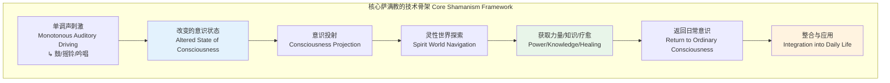
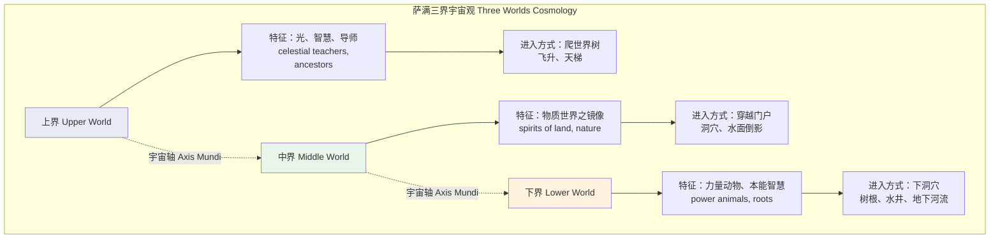
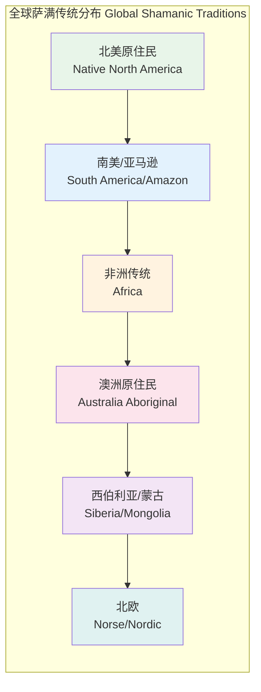
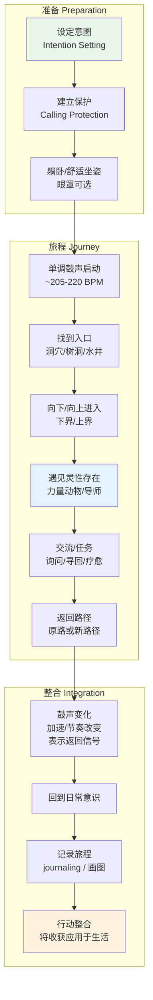
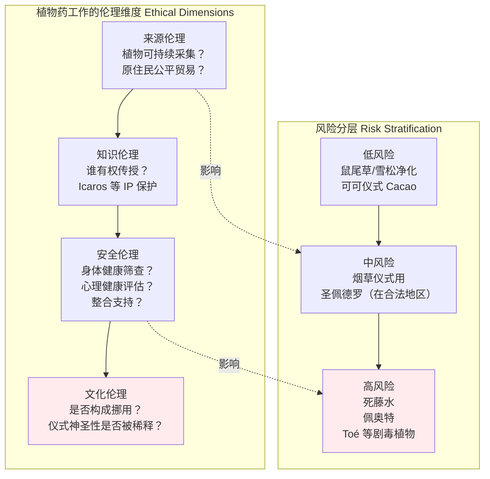
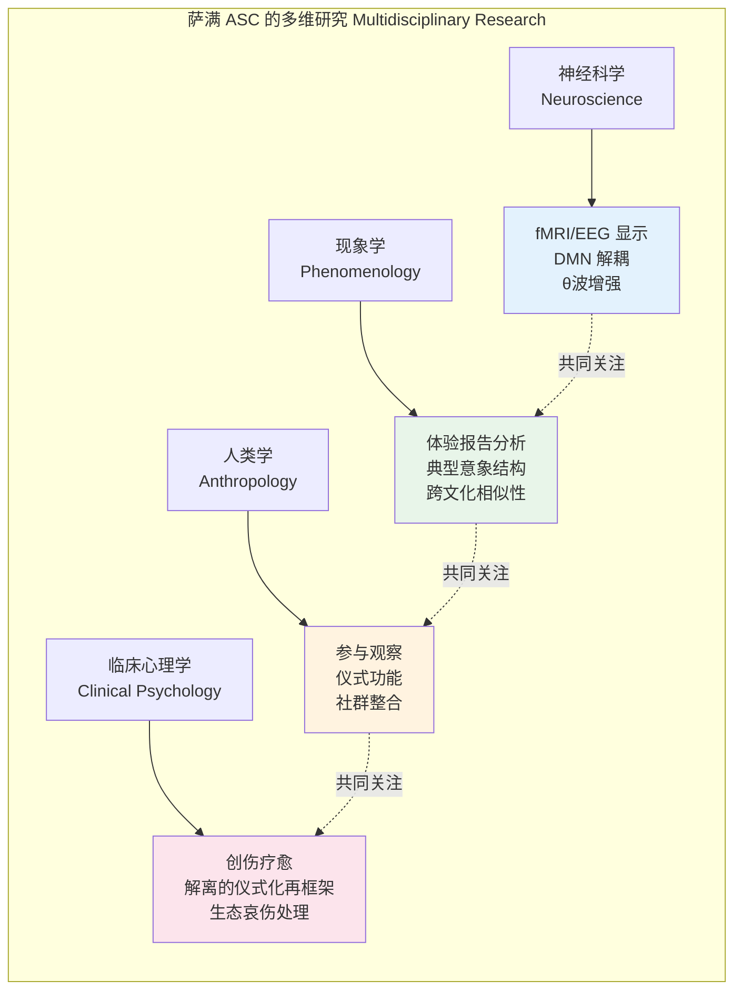

# 全球萨满传统冥想专业概述

> **适用对象**：对跨文化灵性传统感兴趣的冥想进阶练习者、人类学/心理学研究者、生态疗愈从业者  
> **阅读时长**：约 40–50 分钟（可分段阅读）  
> **实践建议**：鼓之旅程与火仪式需在经验丰富引导者带领下进行；植物药工作涉及法律与健康风险，请务必阅读安全与伦理章节  
> **最后更新**：2026-05

---

## 一、理论框架：什么是萨满教 Shamanism

### 1.1 Eliade 的经典定义

宗教学家米尔恰·伊利亚德（Mircea Eliade, 1907–1986）在其1951年的经典著作《萨满教：古老的入迷技术》（*Shamanism: Archaic Techniques of Ecstasy*）中，将萨满（Shaman）界定为：

> **一位能够因意愿而进入改变的意识状态（Altered State of Consciousness, ASC），从而与灵性世界进行直接沟通的仪式专家。**

伊利亚德强调萨满教的核心并非"信仰"，而是**技术（technique）**——一套可学习、可复制的意识转换方法。他将萨满的入迷（ecstasy）与精神病患者的失控状态严格区分：前者是**受控的、有目的的、服务于社群的**，后者则是病理性的。

| Eliade 核心概念 | 定义 | 现代理解 |
|---------------|------|---------|
| **入迷 Ecstasy** | 意识离开日常身体，进入灵性领域的状态 | 神经科学视角下对应前额叶皮层活动降低、默认模式网络（DMN）解耦 |
| **登天 Ascent** | 萨满向上飞升至上界 | 与濒死体验（NDE）中的"隧道-光"现象有神经机制重叠 |
| **入地 Descent** | 萨满向下进入下界 | 对应深度催眠、引导意象中的地下旅程 |
| **宇宙轴 Axis Mundi** | 连接三界的中轴（世界树/神山/中央图腾柱） | 仪式空间的心理锚定功能；在鼓之旅程中常由单调鼓声提供 |

### 1.2 Harner 的核心萨满教 Core Shamanism

迈克尔·哈纳（Michael Harner, 1929–2018），美国人类学家，在1970年代提出**核心萨满教（Core Shamanism）**概念。他在研究亚马逊 Jívaro 等原住民传统后，剥离了各文化特定的符号系统，提取出跨文化的共通技术骨架：

哈纳于1980年成立** Foundation for Shamanic Studies（萨满研究基金会）**，将核心萨满教技术系统化为可教学的现代课程。这一运动极大地推动了萨满教在西方的传播，但也引发了**文化挪用（cultural appropriation）**的激烈争议。

### 1.3 改变的意识状态 Altered States of Consciousness

ASC 是萨满修习的神经科学基础。当单调的鼓声以约 **200–220 次/分钟** 的节奏持续敲击时，大脑会产生显著的脑电变化：

| 脑波频段 | 频率范围 | 萨满实践中的对应状态 |
|---------|---------|-------------------|
| **β 波 Beta** | 13–30 Hz | 日常清醒意识；分析性思维 |
| **α 波 Alpha** | 8–13 Hz | 放松、闭眼后数分钟内出现；萨满准备阶段的过渡 |
| **θ 波 Theta** | 4–8 Hz | **鼓之旅程的核心频段**；梦境与深层意象；记忆与情绪的浮现 |
| **δ 波 Delta** | 0.5–4 Hz | 深层无梦睡眠；极少数深度萨满昏迷状态 |

**神经科学研究**：Felicitas Goodman 等人类学研究者通过脑电图监测发现，单调声刺激（monotonous auditory driving）能在 10–15 分钟内将大脑主导频率从 β 显著降低至 θ。这种**脑波夹带（brainwave entrainment）**效应是 Drum Journey 技术的生理学基础。

### 1.4 三界宇宙观 Upper / Middle / Lower Worlds

萨满宇宙观中，世界通常被划分为三个垂直层级：

| 界域 | 典型象征 | 常见灵性存在 | 功能与目的 |
|-----|---------|------------|----------|
| **上界 Upper World** | 太阳、星辰、云端宫殿、彩虹 | 祖先、高位导师、光明存有 | 获取智慧、预见未来、宇宙法则的学习 |
| **中界 Middle World** | 森林、河流、山脉、日常景观之镜像 | 土地灵、自然灵、亡者灵魂 | 寻回失落的灵魂碎片、与自然调和 |
| **下界 Lower World** | 洞穴、树根、地下河流、火山内部 | 力量动物、大地之母、原始守护者 | 获取力量、恢复生命力、 reconnect with instinct |

> **重要区分**：下界并非基督教意义上的"地狱"，而是**大地深处、树根之下的生命源头领域**。在多数萨满传统中，下界是温暖、充满生命力和疗愈力量的。

### 1.5 力量动物 Power Animals 与灵性导师 Spirit Guides

**力量动物（Power Animal / Spirit Animal / Totem Animal）**是萨满传统中最核心的灵性伙伴关系概念：

- **定义**：一位以动物形态显现的灵性存在，与个体建立保护性、指导性的联结
- **功能**：提供力量、保护、指引；帮助萨满在灵性世界导航；作为"载具"带萨满飞行或穿越不同界域
- **特征**：每个人的力量动物可能随人生阶段而变化；动物的选择反映个体当前最需要强化的品质（如鹰-视野、熊-力量、蛇-蜕变）
- **失落**：传统萨满认为失去力量动物会导致疾病、厄运或精神萎靡；"寻回力量动物"是常见的疗愈仪式

**灵性导师（Spirit Guides / Teacher Spirits）**则通常以人类形态或高度灵性化的光体形态出现，主要在上界被遇见。与力量动物侧重"力量与保护"不同，灵性导师侧重"智慧与教导"。

---

## 二、跨文化区域覆盖

### 2.1 北美原住民 Native North America

北美大陆的萨满实践在数百个部落中呈现丰富的多样性，以下是几个核心共性实践：

| 实践名称 | 部落/区域来源 | 核心内容 | 现代状态 |
|---------|-------------|---------|---------|
| **Vision Quest 愿景追寻** | 平原印第安人（Lakota, Sioux 等） | 独自进入荒野 1–4 天，禁食祈祷，等待幻象（vision）的降临 | 仍在传统社群中进行；部分非原住民组织在争议中提供类似体验 |
| **Sweat Lodge 汗水屋** | 广泛分布于北美 | 在黑暗密闭的圆顶小屋中，将水浇于烧热的石头上产生蒸汽，伴随祈祷与吟唱 | 因多起致死事件（如2009年James Arthur Ray事件），在美国受到严格监管 |
| **Peyote 仙人掌仪式** | 墨西哥惠乔尔（Huichol）、北美原住民教会（Native American Church） | 食用佩奥特仙人掌（*Lophophora williamsii*）中的致幻生物碱，进行通宵祈祷会 | 美国联邦法律豁免原住民教会的宗教使用；非印第安人参加存在法律与伦理风险 |
| **Sun Dance 太阳舞** | 平原部落（Lakota, Cheyenne, Crow 等） | 夏季举行的年度核心仪式，持续数日，包括穿刺、舞蹈、禁食，以祈求部落福祉 | 禁止摄影和外人参与核心环节；文化保护意识强烈 |
| **药用植物 Medicine Plants** | 各部落均有 | 烟草（仪式用，非商业烟）、鼠尾草（净化）、雪松、甜草（召唤善良灵） | 鼠尾草净化（Smudging）已被大量商业化，引发原住民批评 |

**文化敏感性提示**：北美原住民灵性实践与数百年殖民创伤、土地剥夺、文化灭绝的历史紧密交织。1984年通过的《美国印第安宗教自由法》（AIRFA）及后续法律对特定仪式提供保护。非原住民参与者应极其谨慎，尊重部落的知识产权与仪式封闭性。

### 2.2 南美/亚马逊 South America / Amazon

亚马逊雨林是地球上萨满植物药传统最密集的区域之一。

| 实践/物质 | 来源文化 | 核心内容 | 风险与伦理 |
|----------|---------|---------|----------|
| **Ayahuasca 死藤水** | 秘鲁 Shipibo、巴西 Santo Daime、哥伦比亚 等 | 由 *Banisteriopsis caapi* 藤与 *Psychotria viridis* 叶熬制，含 DMT 与 MAOI，产生持续 4–6 小时的强烈 visionary 体验 | 心理脆弱者可能触发精神病性发作；MAOI 与多种药物/食物有致命交互；不洁制备有中毒风险 |
| **Icaros 疗愈歌谣** | Shipibo-Konibo 等亚马逊部落 | 萨满在仪式中吟唱的传统歌谣，被认为是"携带药物力量的声音"，引导参与者旅程的方向 | Icaros 是部落的**知识产权**，现代录音与传播引发争议 |
| **Dieta 植物节食** | 广泛亚马逊传统 | 在萨满指导下，长期单独食用特定植物（如烟草、Toé、Chiric Sanango），配合饮食禁忌，以学习植物的"精神"并获得疗愈力量 | 部分植物（如 Toé/*Brugmansia*）有剧毒，曾有致死案例 |
| **San Pedro 圣佩德罗仙人掌** | 安第斯地区（秘鲁、厄瓜多尔） | 含 mescaline 的 *Trichocereus pachanoi*，传统上在黎明时分饮用，进行整日的大地冥想 | 相对温和，但仍有心理风险与法律问题 |

> **Shipibo 传统独特之处**：Shipibo-Konibo 人的萨满（*Onaya*）以复杂的**几何视觉图案（Kene）**著称。他们认为死藤水体验中的图案是宇宙的编织结构，萨满通过吟唱 Icaros "刺绣"这些图案到患者身上，进行"图案疗愈"。

### 2.3 非洲传统 Africa

非洲大陆的萨满实践常被西方学术话语以"巫术"（witchcraft）等贬义标签误解。实际上，非洲有着极为丰富和古老的疗愈传统。

| 传统/实践 | 区域/族群 | 核心特征 |
|----------|----------|---------|
| **San 布须曼人疗愈舞蹈** | 南部非洲喀拉哈里沙漠（博茨瓦纳、纳米比亚） | 可能是**人类最古老的持续进行的灵性仪式**，可追溯至 20,000–40,000 年前。通宵的集体舞蹈、歌唱、节奏，使疗愈者（*N/um k"ausi*）进入"力满"（*N/um*）状态，以能量传递的方式疗愈社群成员。 |
| **Yoruba Ifa 传统** | 西非尼日利亚、贝宁 | 一套庞大的宇宙学与占卜系统，通过 16 个神圣棕榈果（*Odu Ifa*）进行占卜。Ifa 祭司（*Babalawo*）不仅是占卜者，也是社群的道德与灵性顾问。Orisha（神灵）系统深刻影响了古巴 Santería、巴西 Candomblé 等美洲非裔宗教。 |
| **Sangoma / Inyanga** | 南部非洲（南非、斯威士兰、莱索托等） | *Sangoma* 是灵媒与占卜者，通过祖先沟通进行诊断；*Inyanga* 是草药专家。培训过程包括**祖先召唤病**（*Ukuthwasa*）——被认为祖先选中的人会出现身心症状，必须在资深 Sangoma 指导下完成长周期训练才能痊愈并执业。 |
| **鼓诱导恍惚 Drum-induced Trance** | 广泛非洲传统 | 节奏性鼓声（通常 200–300 BPM）是诱导 ASC 的核心技术。与西伯利亚的鼓不同，非洲鼓乐往往更加复调、层次丰富，恍惚状态常通过集体互动而非个人旅程实现。 |

### 2.4 澳洲原住民 Aboriginal Australia

澳洲原住民的灵性传统与土地有着无可比拟的一体性。他们的"宗教"不是关于信仰一个超越的神，而是**关于与土地的亲密记忆关系**。

| 核心概念 | 原住民语/英文 | 内涵 |
|---------|-------------|------|
| **梦时代 Dreamtime / The Dreaming** | *Tjukurrpa*（Pitjantjatjara 语）、*Wongar*（Yolngu 语） | 不是"过去"，而是**永恒的现在**——祖先灵在创世时期穿越大地、留下痕迹、制定律法的神圣时间维度。梦时代的故事（Dreaming stories）规定了部落与特定土地的联结、禁忌和仪式义务。 |
| **歌之路 Songlines** | 多种原住民语 | 祖先穿越大地的路线，被编码为**可歌唱的地理地图**。一首歌对应一段土地的路径，歌词中包含水源、食物、地形等关键信息。原住民通过"唱 country"来维护和活化土地。 |
| **Walkabout** | 英文借词（原住民语有多种对应词） | 青年男子在成年礼中独自进入传统土地，进行数周乃至数月的行走、禁食、冥想，与祖先和土地建立直接联结。这一过程常伴随深刻的灵性转化。 |
| **与土地的深度连接** | *Dadirri*（Ngangikurungkurr 语，意为"深层聆听"） | Miriam-Rose Ungunmerr 长老推广的概念——一种**耐心的、等待的、向内聆听**的冥想品质，与土地的节律共鸣。不同于主动"征服"自然的西方态度，*Dadirri* 是被动、接受的，"像河流等待泉水涌出"。 |

> **文化警告**：澳洲原住民的圣地、仪式和知识受到严格的**原住民文化知识产权（ICIP）**保护。许多神圣地点禁止外人进入。未获得社区许可而记录、传播或商业化原住民灵性知识是严重的不尊重行为。

### 2.5 西伯利亚/蒙古 Siberia / Mongolia

"萨满"（Shaman）一词本身即源自**西伯利亚通古斯语**（Evenki 语：*saman*，经由俄语传入西方）。这一区域是萨满教的"心脏地带"。

| 传统要素 | 描述 |
|---------|------|
| **Tengri 腾格里信仰** | 蒙古及中亚突厥语系民族的天神信仰。腾格里（*Tengri*）是至高天，与大地之母（*Eje* / *Etügen*）配对。萨满（蒙古语：*Böö*）是天地之间的媒介。成吉思汗帝国时期，腾格里信仰与军事政治高度结合。 |
| **鼓之旅 Drum Journey** | 西伯利亚萨满鼓（*dungur*）是宇宙的象征：鼓面代表天空/大地，鼓框代表世界边缘，鼓槌代表闪电。鼓声被视为**马匹在灵性世界奔驰**的声音，带萨满穿越三界。 |
| **驯鹿与萨满的关系** | 对于鄂温克、多尔干等驯鹿牧民，驯鹿不仅是经济动物，更是灵性伙伴。萨满的鼓有时用驯鹿皮制成；某些仪式中，驯鹿被视为带领亡者灵魂的载具。 |
| **萨满服饰** | 传统萨满服饰（*degel*）布满金属圆片、铃铛、骨头、鸟类羽毛。这些附件的功能包括：在仪式中产生声音（辅助意识转换）、作为"铠甲"保护萨满免受灵性攻击、象征萨满在宇宙中的多重身份。 |

### 2.6 北欧 Nordic / Norse

北欧前基督教时代的萨满实践主要通过**Seidr（赛德）**传统保存于冰岛史诗《埃达》（*Edda*）和萨迦（*Sagas*）中。

| 核心实践 | 描述 |
|---------|------|
| **Seidr 赛德仪式** | 一种预言与施法的仪式实践，由 *Völva*（女预言家）或 *Seiðmaðr*（男赛德师）主持。包括坐在高座上（*seiðhjallr*）、吟唱 galdr 歌谣、进入预言性恍惚。北欧神话中，众神之父奥丁（Odin）本人被描述为 Seidr 的实践者。 |
| **符文冥想 Runic Meditation** | 如尼文（Runes）不仅是字母，更是**带有神圣力量的符号**。现代实践中，符文冥想包括：选择一个符文进行深度观想（*rune gazing*）、将符文绘制于身体特定部位、在冥想中"进入"符文的象征世界。 |
| **自然灵沟通** | 北欧宇宙学中存在丰富的自然灵：*Landvættir*（土地灵）、*Huldufólk*（冰岛"隐藏人"）、*Näcken*（水之灵）。传统上，在开拓新土地前需要向这些灵体请求许可；现代北欧异教（Ásatrú / Heathenry）复兴了这一实践。 |
| **Galdr 吟唱** | 如尼咒语的吟唱，通过声音的振动激活符文的"内在力量"，用于疗愈、保护或改变命运。 |

---

## 三、核心修习技术

### 3.1 Drum Journey 鼓之旅程

鼓之旅程是核心萨满教最基础、最核心的技术，也是哈纳培训体系的核心内容。

**生理机制**：
- 单调鼓声（约 **205–220 次/分钟**）产生**听觉驱动（auditory driving）**
- 大脑频率从 β（日常清醒）经过 α（放松）过渡到 **θ（4–8 Hz，梦境/深层意象）**
- 前额叶皮层活动降低，自我边界暂时弱化
- 海马体与视觉皮层激活模式与梦境状态相似，但**保留观察者意识**（与做梦的关键区别）

**标准流程**：

**关键原则**：
- **意图（Intention）**是旅程的导航系统。没有清晰意图的旅程容易变成无意义的随机意象
- **被动接受而非主动创造**：与引导意象（Guided Imagery）不同，旅程中 practitioner 被教导"让意象自行浮现"
- **"这真的发生了吗？"**：核心萨满教对此保持**实用主义态度**——不问"是真的吗"，而问"有用吗"

### 3.2 Rattling & Chanting 摇铃与吟唱

| 技术 | 工具/声音 | 功能 | 与 Drum Journey 的区别 |
|-----|----------|------|---------------------|
| **摇铃 Rattling** | 种子荚、贝壳、葫芦制成的摇铃 | 产生高频、不连续的声刺激；用于**空间净化**、召唤特定方向的力量、辅助轻度意识转换 | 声刺激更轻、更不规律；适合日常短时段使用 |
| **吟唱 Chanting / Singing** | Icaros、Galdr、无词元音吟唱 | 声音本身被视为携带力量；**频率即是药** | 更加主动（需要发出声音），适合有音乐感的人 |
| **呼麦/泛音唱法** | 图瓦/蒙古喉音唱法（Khoomei） | 同时发出多个泛音，产生复杂的声学场；在蒙古传统中与自然灵的沟通直接相关 | 需要专门的发声训练；产生的声音景观极为独特 |

### 3.3 Plant Medicine Work 植物药工作

**伦理与文化敏感性问题**：

植物药（尤其是致幻类物质如死藤水、佩奥特、圣佩德罗）在当代的流行引发了严峻的伦理问题：

**降低风险的原则**：
1. **医疗筛查**：MAOI（死藤水）与 SSRI、降压药、含酪胺食物有致命交互
2. **心理筛查**：有精神病史、双相障碍、边缘型人格者风险极高
3. **整合支持（Integration）**：体验后的 24–72 小时内应有专业的整合会话，帮助将 visionary 内容转化为生活改变
4. **来源透明**：了解植物采集是否可持续、原住民社区是否获得公平回报

### 3.4 Fire Ceremony 火仪式

火在几乎所有萨满传统中都是**转化与沟通的核心媒介**。

| 传统 | 火的角色 | 典型实践 |
|-----|---------|---------|
| **北美原住民** | 神圣元素之一；被视为有生命的存在 |  sweat lodge 中的热石；篝火旁的祈祷与故事讲述；将祈祷文绑于木棍投入火中 |
| **南美亚马逊** | 保护、净化、烹饪植物药 | 仪式前围绕篝火的净化；烟草烟雾作为"运送祈祷的载体" |
| **北欧** | 世界之光；毁灭与重生的循环 | 仲夏夜篝火（Midsummer）；葬礼火葬（维京传统）；现代 Ásatrú 的 blót 仪式 |
| **西伯利亚** | 温暖、保护、神圣空间的核心 | 仪式帐篷（*chum* / *ger*）中心的火炉是宇宙的象征；火焰是灵界与物质界的接口 |
| **现代核心萨满教** | 转化与释放的象征 | 将写有需要释放之事的纸条投入火中；"送灵"仪式；集体篝火圈的分享与祈祷 |

**安全操作**：户外仪式应遵守当地消防法规；室内使用小型防火容器；始终准备灭火手段；避免在风力过大或干旱禁火期进行。

---

## 四、现代适应

### 4.1 Michael Harner 的核心萨满教运动

- **时间**：1980年基金会成立；1980–2010年代全球培训网络扩张
- **贡献**：将萨满技术从人类学博物馆中"解放"出来，证明现代西方人可以有效学习和运用
- **批评**：剥离了文化语境的"技术提取"是否仍然有效？哈纳本人认为核心元素是**普遍的神经生理学反应**，文化符号只是"包装"

### 4.2 新时代运动的影响

- **商业化与稀释**：萨满概念被广泛应用于水晶疗愈、塔罗、占星等领域，常与原始传统相去甚远
- **积极面**：提高了大众对原住民权利和文化多样性的关注
- **消极面**：" plastic shaman"（塑料萨满）现象——以萨满为名号进行商业牟利，缺乏真正的训练与伦理约束

### 4.3 城市萨满 Urban Shamanism

- 在都市环境中实践核心萨满技术（如以地铁隧道替代地下洞穴、以城市公园树木作为世界树）
- 支持者认为这是**适应性创新**；批评者认为这失去了与土地深层联结的根本

### 4.4 生态萨满 Ecological Shamanism

- 深生态学（Deep Ecology）与萨满教的结合
- 强调：人类不是自然的主宰，而是自然网络中的一节点
- 实践包括：**大地疗愈仪式**、为被污染河流/森林举行的仪式、生态哀悼（ecological grief）的仪式化处理

---

## 五、安全与伦理

### 5.1 文化挪用 Cultural Appropriation

| 行为类型 | 示例 | 伦理评估 |
|---------|------|---------|
| **学习核心技术（无文化符号借用）** | 学习 Harner 体系的鼓之旅程 | 争议较小；哈纳本人从人类学田野工作中提取 |
| **学习并融入个人实践** | 以鼓之旅程进行个人疗愈，但不声称属于任何原住民传统 | 通常可接受，前提是不商业化 |
| **使用特定文化符号进行商业化** | 销售"Native American Style"鼠尾草净化套装 | **高度问题性**；挪用原住民的 IP |
| **参加并获得原住民许可的仪式** | 经 Lakota 长老邀请参加 sweat lodge | 在原住民主动邀请和指导下可接受 |
| **自称萨满/使用部落头衔** | 非原住民自称"Cherokee Shaman" | **不可接受**；欺诈性 |

### 5.2 植物药的法律与健康风险

| 物质 | 法律地位（美国） | 主要健康风险 |
|-----|---------------|------------|
| **死藤水 Ayahuasca** | DMT 为 Schedule I；原住民教会宗教豁免；其他使用非法 | 与 SSRI 的致命交互（血清素综合征）；心理脆弱者的精神病性发作；不洁制备的毒性反应 |
| **佩奥特 Peyote** | Schedule I；印第安人宗教用途豁免 | 恶心、呕吐（常见且常被视为"净化"的一部分）；心理脆弱者的持久性知觉障碍（HPPD） |
| **圣佩德罗 San Pedro** | Mescaline 为 Schedule I；多数州非法 | 恶心、心率加快；剂量控制困难（不同植株 mescaline 含量差异大） |
| **鼠尾草 Salvia divinorum** | 联邦不列管；部分州管制 | 强烈但短暂（5–15 分钟）的解离体验；行动能力丧失导致意外伤害 |

### 5.3 心理脆弱者的风险

- **禁忌人群**：有精神病史、双相障碍 I 型、边缘型人格障碍、严重解离障碍者
- **高风险人群**：近期经历重大创伤、严重抑郁发作期、有自杀意念者
- **鼓之旅程虽相对温和**，但对于解离易感性高的个体，仍可能触发不愉快的解离体验

### 5.4 尊重原住民知识产权

- **联合国《原住民权利宣言》**（UNDRIP, 2007）第31条确认原住民对其文化、传统知识的权利
- **Nagoya 议定书**（2014）规范了遗传资源（包括传统知识）的获取与惠益分享
- **实践建议**：不录音、不录像传统仪式（除非获得明确许可）；不传播神圣歌谣（Icaros）；不在商业产品中使用部落名称或象征

---

## 六、与现代心理学的交汇

### 6.1 改变的意识状态研究

### 6.2 梦境工作 Dreamwork

萨满传统将梦境视为**灵性世界的重要访问通道**：
- 清醒梦（Lucid Dreaming）与萨满旅程在神经机制上有显著重叠
- 现代梦境工作疗法（如 Jeremy Taylor 的群体梦境分享）借鉴了萨满的"梦境作为信息源"框架
-  incubation（孵化）：在睡前设定意图，请求梦境提供指引——这一技术跨越了从古希腊阿斯克勒庇俄斯神庙到亚马逊萨满的广泛文化

### 6.3 创伤的灵性维度 Spiritual Dimensions of Trauma

| 萨满视角 | 现代心理学对应 | 整合可能 |
|---------|--------------|---------|
| **灵魂失落 Soul Loss** | 解离、情感麻木、存在性空虚 | 将解轻视为"部分自我需要被寻回"，而非病理；鼓之旅程寻回失落的"灵魂碎片" |
| **灵性入侵 Spiritual Intrusion** | 创伤后侵入性记忆、闪回 | 仪式化的"力量动物保护"可作为安全感的心理锚定 |
| **祖先创伤 Ancestral Trauma** | 代际创伤传递（Epigenetics / Bowen 家庭系统理论） | 家族系统排列与祖先疗愈仪式的交叉 |
| **未安息亡者 Restless Dead** | 复杂性哀伤、未完成的哀悼 | 仪式化的告别与"送灵"帮助完成哀悼过程 |

### 6.4 生态心理学 Ecopsychology

- 生态心理学的核心假设——**人类的心理健康与自然的健康不可分割**——与萨满的"万物有灵"世界观高度共鸣
- 萨满实践中的"与土地对话"、"自然灵沟通"可被重新框架为**深层生态意识的心理培养技术**
- "荒野独处"（Wilderness Fast / Vision Quest）已被纳入现代生态心理治疗体系，作为重新建立人与自然联结的干预手段

---

## 附录：全球萨满实践跨文化对比表

| 维度 | 北美原住民 | 南美/亚马逊 | 非洲传统 | 澳洲原住民 | 西伯利亚/蒙古 | 北欧 |
|-----|-----------|-----------|---------|-----------|-------------|------|
| **核心意识技术** | Vision Quest、Sweat Lodge、Peyote | Ayahuasca、Icaros、Dieta | 鼓舞、节奏性恍惚、N/um | Dadirri 深层聆听、Walkabout | Drum Journey、鼓击、驯鹿仪式 | Seidr、Galdr、符文冥想 |
| **关键媒介** | 烟草、鼠尾草、热石、佩奥特 | 死藤水、烟草、Chiric Sanango | 鼓、节奏、祖先沟通 | 土地本身、歌曲、岩画 | 鼓、马、驯鹿、世界树 | 高座、如尼文、篝火 |
| **宇宙结构** | 多层次：天空/大地/地下 | 河流网络、森林层次 | 祖先领域与现世交织 | Dreamtime 无时性；Songlines 地理编码 | 三界：上/中/下；世界轴 | Yggdrasil 世界树；九界 |
| **社群功能** | 部落福祉、治疗、预言 | 个人/集体疗愈、占卜 | 社群疗愈、道德维护 | 土地维护、律法传递 | 个人/部落保护、寻魂 | 预言、命运操作、诅咒解除 |
| **现代可及性** | 高度受限；仪式封闭 | 死藤水旅游产业化；争议大 | 部分传统仍在；西方接触较少 | 极严格保护；ICIP 法律 | 部分复兴；蒙古文化旅游 | Ásatrú/Heathenry 复兴；学术重构 |
| **主要伦理议题** | 文化挪用、仪式封闭性 | 植物药安全、IP  theft | 西方误解（"巫术"标签） | 圣地保护、ICIP | 旅游萨满主义 | 与极右民族主义的关联风险 |

---

> **延伸阅读建议**：
> - Eliade, M. (1951). *Shamanism: Archaic Techniques of Ecstasy*.
> - Harner, M. (1980). *The Way of the Shaman*.
> - Winkelman, M. (2010). *Shamanism: A Biopsychosocial Paradigm of Consciousness and Healing*.
> - Walsh, R. (1990). *The Spirit of Shamanism*.
> - 重要提醒：本文件仅作为知识性概述，任何涉及致幻植物药的实践均应在法律允许范围内、专业医疗监督下进行。鼓之旅程等意识转换技术对于心理脆弱者可能存在风险，建议在充分了解个人身心状态的前提下谨慎探索。

*Peace Lab Database — Meditation Knowledge Base*

---

## 📞 危机干预资源 | Crisis Resources

> **如果您或您认识的人正在经历心理危机或有自杀念头,请立即寻求帮助。**

### 中国大陆

| 资源 | 联系方式 |
|---|---|
| 北京心理危机研究与干预中心 | **010-82951332** (24小时) |
| 全国心理援助热线 | **400-161-9995** (24小时) |
| 希望24热线 | **400-161-9995** (24小时) |
| 生命热线 | **400-821-1215** (24小时) |

### 国际

| 地区 | 资源 | 联系方式 |
|---|---|---|
| 🇺🇸 美国 | 988 Suicide & Crisis Lifeline | **988** (24/7) |
| 🇬🇧 英国 | Samaritans | **116 123** (24/7) |
| 🇭🇰 香港 | 撒玛利亚防止自杀会 | **2389-0000** |
| 🇹🇼 台湾 | 生命线 | **1995** |

**完整资源列表**:[_meta/docs/CRISIS_RESOURCES.md](../../_meta/docs/CRISIS_RESOURCES.md)

**全球资源**:[Befrienders Worldwide](https://www.befrienders.org) | [WHO 心理健康](https://www.who.int/health-topics/mental-health)

