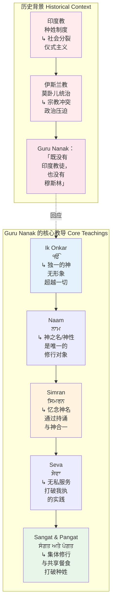
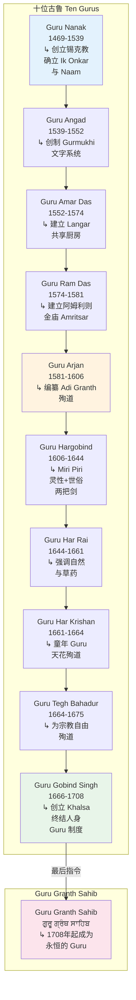
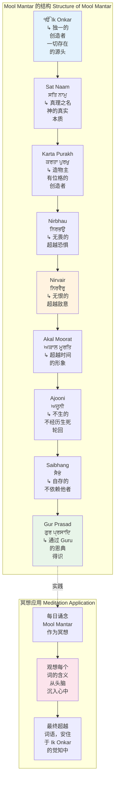
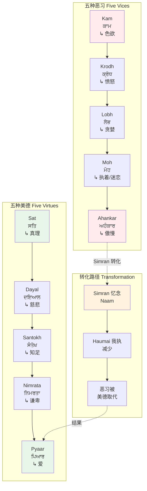
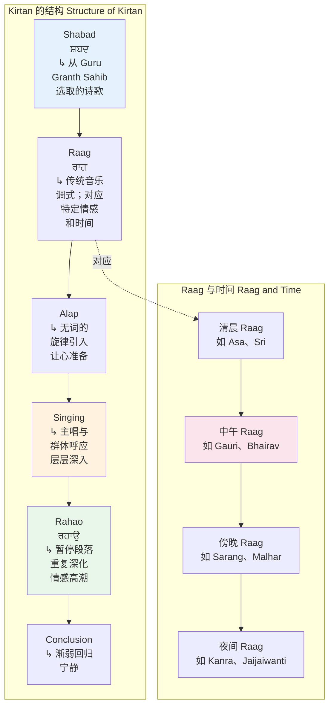
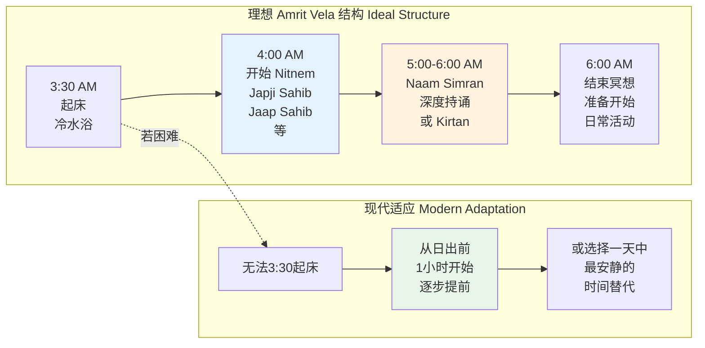
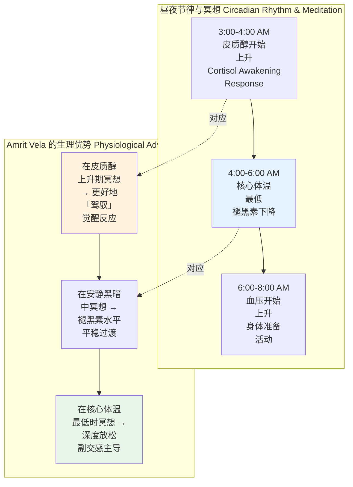
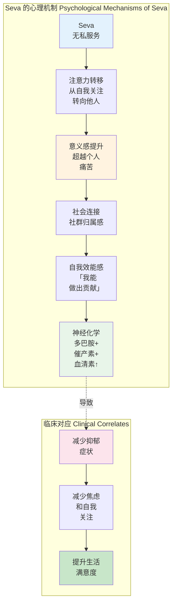

# 锡克教冥想专业概述：Naam 之道与神圣记忆

> **适用对象**：对锡克教灵修传统感兴趣的冥想练习者、宗教学研究者、跨传统灵修探索者、心理健康从业者、瑜伽/昆达里尼练习者
> **阅读时长**：约 50–60 分钟（可分段阅读）
> **实践建议**：配合正文中的阶段性练习，分 4–6 次完成，每次 15–20 分钟
> **最后更新**：2026-05

---

## 一、历史渊源：从 Guru Nanak 到 Khalsa

### 1.1 Guru Nanak（ਗੁਰੂ ਨਾਨਕ，1469–1539）：锡克教的创立

锡克教由 Guru Nanak Dev Ji 于 15 世纪末在印度次大陆的旁遮普地区创立。在伊斯兰教与印度教激烈冲突的时代背景下，Guru Nanak 提出了一条**超越宗派分歧的普世灵修路径**。



**Guru Nanak 的四大旅程（Udasis, ਉਦਾਸੀਆਂ）**：

Guru Nanak 在启示后进行了四次长途旅程，足迹遍及印度、西藏、斯里兰卡、阿拉伯和中亚。这些旅程本身就是**流动的冥想**——在行走中持诵 Naam，在与不同宗教和文化的人对话中传递合一的讯息。

| 旅程 | 方向 | 关键事件 |
|-----|------|---------|
| **第一次** | 向东 | 至孟加拉和阿萨姆；与 Sidh Yogis（悉达瑜伽士）辩论，确立 Naam 高于一切苦行 |
| **第二次** | 向南 | 至斯里兰卡；宣扬社会平等和诚实劳动（Kirat Karo） |
| **第三次** | 向北 | 至西藏和喜马拉雅；在 Kailash 附近与 Nath Yogis 辩论 |
| **第四次** | 向西 | 至麦加、巴格达；与伊斯兰苏菲和学者对话 |

### 1.2 十位古鲁的传承：活的教导

锡克教的一个独特之处在于**「活的古鲁」（Living Guru）**概念——在 1469 至 1708 年间，神的教导通过十位人身的 Guru 依次传递，每一位都在前一位的基础上深化和发展了教导。



**关键发展**：

- **Guru Angad**：创制 Gurmukhi 文字，使锡克教有了自己的书写系统——这是为了让普通信众（不仅是婆罗门）可以直接阅读神圣文本
- **Guru Amar Das**：建立 Langar（ਲੰਗਰ）制度——不分种姓、宗教、贫富，所有人坐在一起共享餐食；确立女性平等参与
- **Guru Arjan**：编纂 Adi Granth（后来的 Guru Granth Sahib），将锡克教诗歌系统化；为信仰殉道（被莫卧儿皇帝 Jahangir 处死）
- **Guru Gobind Singh**：创立 Khalsa（ਖਾਲਸਾ）制度——一个神圣的社群，成员有独特的身份标记（5K）；宣布 Guru Granth Sahib 为最后的、永恒的 Guru

### 1.3 Guru Granth Sahib（ਗੁਰੂ ਗ੍ਰੰਥ ਸਾਹਿਬ）：活的经典

Guru Granth Sahib 是锡克教的永恒 Guru，也是世界上唯一由宗教创立者亲自编纂、并在编纂过程中就被视为神圣的经典。

| 特征 | 描述 |
|-----|------|
| **编纂** | Guru Arjan 于 1604 年完成初版；Guru Gobind Singh 于 1708 年确立为最终版本和永恒 Guru |
| **内容** | 5894 首诗歌（Shabad, ਸ਼ਬਦ）；由六位锡克 Guru 和 36 位来自印度教和苏菲传统的圣人创作 |
| **语言** | 主要由旁遮普语、印地语、波斯语和梵语混合而成，以 Gurmukhi 文字书写 |
| **结构** | 按 31 个音乐调式（Raag, ਰਾਗ）编排；每个 Raag 对应不同的情感和时间 |
| **敬奉** | 在 Gurdwara（ਗੁਰਦੁਆਰਾ，锡克教寺庙）中 24 小时诵读（Akhand Path）；信徒向经典行礼（Matha Tek） |

**Guru Granth Sahib 的冥想维度**：

经典本身不是一个「阅读」的对象，而是一个**聆听和唱诵**的对象。锡克传统强调 **Shabad Kirtan**（ਸ਼ਬਦ ਕੀਰਤਨ）——将经典中的诗歌以音乐形式唱诵，让声音成为冥想的载体。

### 1.4 Khalsa（ਖਾਲਸਾ）制度：神圣的社群

1699 年，Guru Gobind Singh 在 Vaisakhi 节上创立了 Khalsa——一个由 Amrit（ਅੰਮ੍ਰਿਤ，甘露/圣水）洗礼而入的灵性-世俗共同体。

```mermaid
graph TD
    subgraph Khalsa 的创立 Foundation of Khalsa
        K1[1699年<br/>Vaisakhi 节<br/>阿南德普尔] --> K2[Guru Gobind Singh<br/>呼吁志愿者<br/>为信仰<br/>献出生命]
        K2 --> K3[五位 Beloved Ones<br/>Panj Pyare<br/>ਪੰਜ ਪਿਆਰੇ<br/>来自不同<br/>种姓]
        K3 --> K4[Amrit 仪式<br/>甜水和铁剑<br/>混合]<br/>新生为<br/>Khalsa
    end

    subgraph 五K标志 Five Ks
        F1[Kesh<br/>ਕੇਸ਼<br/>↳ 不剪头发] --> F2[Kangha<br/>ਕੰਘਾ<br/>↳ 木梳]<n        F2 --> F3[Kara<br/>ਕੜਾ<br/>↳ 铁手镯]
        F3 --> F4[Kachera<br/>ਕਛੈਰਾ<br/>↳ 短裤]
        F4 --> F5[Kirpan<br/>ਕਿਰਪਾਨ<br/>↳ 短剑]
    end

    K4 -.->|标志| F1

    style K3 fill:#e3f2fd
    style K4 fill:#fff3e0
    style F1 fill:#e8f5e9
    style F5 fill:#fce4ec
```

**五K（Panj Kakar）的冥想意涵**：

| 标志 | 名称 | 外在意义 | 内在冥想意义 |
|-----|------|---------|------------|
| **Kesh** | 不剪头发 | 顺服神的创造；保留原初形态 | 身体作为神圣临在的居所；头发是灵性的天线（3HO 解释） |
| **Kangha** | 木梳 | 保持头发整洁 | 每日梳理时是一个正念时刻；梳理身体也是在梳理心灵 |
| **Kara** | 铁手镯 | 与 Guru 的连接 | 戴在手腕上是一个持续的提醒——「我是 Khalsa」；敲击时产生声音觉知 |
| **Kachera** | 短裤 | 克制性欲；行动自由 | 对感官欲望的意识；提醒性行为的圣洁边界 |
| **Kirpan** | 短剑 | 保护弱者和正义 | 对「正义战士」身份的提醒；内在的「剑」是区分真伪的智慧 |

---

## 二、核心理论

### 2.1 Ik Onkar（ੴ）：一元论的基石

Ik Onkar 是锡克教最核心的信条，也是 Guru Granth Sahib 开篇的第一句话（Mool Mantar, ਮੂਲ ਮੰਤਰ）。

> **ੴ ਸਤਿ ਨਾਮੁ ਕਰਤਾ ਪੁਰਖੁ ਨਿਰਭਉ ਨਿਰਵੈਰੁ ਅਕਾਲ ਮੂਰਤਿ ਅਜੂਨੀ ਸੈਭੰ ਗੁਰ ਪ੍ਰਸਾਦਿ ॥**
>
> 「Ik Onkar Sat Naam Karta Purakh Nirbhau Nirvair Akal Moorat Ajooni Saibhang Gur Prasad」
>
> 「独一之神，真理之名，造物主，无畏，无恨，超越时间，不生，自存，以 Guru 的恩典得识。」



**Ik Onkar 的冥想意义**：

- **数字 1**：Ik（ਇੱਕ）不仅是数字，更是一个图形——Guru Nanak 设计了 ੴ 这个符号，将「1」和「O」结合，象征神与创造的不可分离
- **Onkar（ਓਅੰਕਾਰ）**：神的创造性音节；类似于印度教的 Om，但指向一个有位格的、历史的、参与世界的神
- **一元论的实践**：冥想 Ik Onkar 不是智性上的「相信一元论」，而是**在每一次呼吸中感受「一切都是一」**

### 2.2 Naam（ਨਾਮ）：神名——修行的核心对象

Naam 是锡克教冥想中最重要的概念——它指「神之名」，但远超「名称」的层面，而是指**神的本质、神的存在、神的力量**。

| 层面 | Naam 的含义 | 冥想中的对应 |
|------|-----------|------------|
| **作为名称** | Waheguru（ਵਾਹਿਗੁਰੂ）——「奇妙的导师」 | 持诵 Waheguru 作为 mantra |
| **作为本质** | 神的真理本性；Sat（ਸਤਿ） | 在静默中「品尝」真理 |
| **作为力量** | 创造和维系宇宙的动力 | 感受内在的生命能量（与 Kundalini 概念有对话空间） |
| **作为临在** | 神无处不在的觉知 | 在一切事物中觉知 Naam |

### 2.3 Simran（ਸਿਮਰਨ）：忆念——冥想的行动

Simran 字面意思是「记忆」或「回忆」，在锡克教中指的是**持续不断地忆念神名**。它不是「想起」一个远方的对象，而是**在心中保持神的临在**。

```mermaid
graph TD
    subgraph Simran 的三阶段 Three Stages of Simran
        S1[第一阶段：出声念诵<br/>Jap/Ucharan<br/>ਜਪ / ਉਚਾਰਨ<br/>↳ 大声或<br/>低声诵念<br/>Waheguru] --> S2[第二阶段：低语念诵<br/>Upanshu<br/>ਉਪਾਂਸ਼ੁ<br/>↳ 嘴唇微动<br/>几乎无声<br/>只有自己<br/>能听见]
        S2 --> S3[第三阶段：心念默念<br/>Mana/Hirda<br/>ਮਨਾ / ਹਿਰਦਾ<br/>↳ 完全静默<br/>在心中诵念<br/>甚至停止<br/>词语，只有<br/>觉知]
    end

    subgraph 每个阶段的时间参考 Time Reference
        T1[出声：初学者<br/>每日30分钟<br/>→ 数月到<br/>一年稳固] --> T2[低语：进阶<br/>每日1-2小时<br/>→ 一至三年<br/>深入]
        T2 --> T3[心念：高级<br/>持续不断<br/>甚至在睡眠<br/>和工作中]<br/>多年的修习
    end

    S1 -.->|时间| T1
    S2 -.->|时间| T2
    S3 -.->|时间| T3

    style S1 fill:#e3f2fd
    style S2 fill:#fff3e0
    style S3 fill:#e8f5e9
    style T3 fill:#fce4ec
```

### 2.4 Seva（ਸੇਵਾ）：无私服务——冥想的身体表达

Seva 不是「慈善」或「志愿工作」——在锡克教中，Seva 是**打破我执（Haumai, ਹਉਮੈ）的最直接方法**，因此是冥想不可分割的一部分。

> 「通过 Seva，人获得神座上的座位。」——Guru Granth Sahib

**Seva 的三种形式**：

| 形式 | 描述 | 冥想维度 |
|-----|------|---------|
| **Tan Seva** | 身体的服务：在 Langar 中切菜、洗碗、清洁 Gurdwara | 在重复的体力劳动中持诵 Naam；服务中的专注本身就是冥想 |
| **Man Seva** | 心灵的服务：以敬爱之心诵念经典；向他人提供情感支持 | 将 Simran 与服务结合；在关系中保持神之临在 |
| **Dhan Seva** | 财富的服务：捐赠收入的十分之一（Dasvandh, ਦਸਵੰਦ） | 对物质执着的放下；金钱作为服务工具 |

### 2.5 Hukam（ਹੁਕਮ）：神圣旨意——臣服的艺术

Hukam 意为「命令」、「旨意」或「神圣法则」。在锡克教冥想中，**臣服于 Hukam** 是一个核心训练——放下个人意志，接受神的安排。

**Rahao（ਰਹਾਉ）——暂停与臣服**：

在 Guru Granth Sahib 的诗歌中，几乎每一段都有一个「Rahao」（暂停）的标记。这是给歌唱者的指令——在此处暂停，让前面的内容沉入心中。在冥想意义上，Rahao 是一个**臣服的节点**——暂停自己的解释，接受神的话语。

### 2.6 五种美德与五种恶习

锡克教伦理为冥想提供了清晰的心理地图——**五种美德（Panj Virtues）**是冥想的果实，**五种恶习（Panj Vices）**是冥想要克服的障碍。



---

## 三、主要修习方法

### 3.1 Naam Simran（ਨਾਮ ਸਿਮਰਨ）：持名冥想

Naam Simran 是锡克教最核心的冥想修习——通过持诵 Waheguru（ਵਾਹਿਗੁਰੂ）或其他神名，逐步净化心灵，最终与神合一。

```mermaid
graph TD
    subgraph Naam Simran 修习流程 Practice Flow
        N1[准备阶段<br/>洗浴（Ishnaan）<br/>清晨最佳<br/>穿整洁衣服] --> N2[坐姿<br/>简易坐或<br/>跪坐<br/>脊柱挺直<br/>但不僵硬]
        N2 --> N3[开始诵念<br/>Waheguru<br/>ਵਾਹਿਗੁਰੂ]<br/>可以先出声<br/>逐渐过渡<br/>到默念
        N3 --> N4[呼吸配合<br/>Wa-吸气<br/>he-悬息<br/>Guru-呼气]<br/>或自然配合
        N4 --> N5[持续专注<br/>当念头升起<br/>温和地回到<br/>Waheguru]
        N5 --> N6[深化阶段<br/>词语消融<br/>只剩下<br/>觉知与<br/>振动感]
    end

    subgraph 常见障碍与应对 Obstacles
        O1[昏沉] --> O1D[睁眼练习<br/>或加快念诵<br/>节奏]
        O2[散乱] --> O2D[不要责备<br/>只是温和<br/>带回]
        O3[情绪波动] --> O3D[允许情绪<br/>通过持诵<br/>被转化]
    end

    N5 -.->|遇障碍| O1
    N5 -.->|遇障碍| O2

    style N1 fill:#e3f2fd
    style N4 fill:#fff3e0
    style N6 fill:#e8f5e9
    style O1 fill:#ffebee
    style O2 fill:#fff3e0
```

**Waheguru 的音节分解**：

| 音节 | 含义 | 冥想指向 |
|-----|------|---------|
| **Wa** | Wah（ਵਾਹ）——「奇妙的」、「惊叹的」 | 对神之奇妙的惊叹；从日常觉知中觉醒 |
| **He** | He（ਹੇ）——呼召 | 向神敞开；呼召神的临在 |
| **Gu** | Gu（ਗੁ）——黑暗 | 意识到内在的黑暗（无知、恶习） |
| **Ru** | Ru（ਰੁ）——光明 | 神的光明驱散黑暗；Guru 的光明 |

**其他常用 mantra**：

| Mantra | 含义 | 使用情境 |
|-------|------|---------|
| **Sat Naam** | 真理之名 | 日常简短冥想；适合初学者 |
| **Akal** | 超越时间者 | 死亡冥想；超越恐惧 |
| **Gobinday Mukanday** | 神的十个保护面向 | 来自 Kundalini Yoga 传统；需要更长修习 |
| **Mul Mantra** | 根本咒 | 深度冥想；完整的神学宣告 |

### 3.2 Nitnem（ਨਿਤਨੇਮ）：日常祈祷——五段祈祷文的冥想维度

Nitnem 是锡克教徒每日必须诵念的五段祈祷文（Amritdhari/Khalsa 必须；其他锡克教徒鼓励）。这些祈祷文不是「念完即可」的义务，而是**每日的冥想强化训练**。

| 时间 | 祈祷文 | 核心内容 | 冥想维度 |
|------|--------|---------|---------|
| **清晨（Amrit Vela）** | Japji Sahib（ਜਪੁਜੀ ਸਾਹਿਬ） | Guru Nanak 的 38 首诗歌；Mool Mantar 开篇 | 一日的灵性基础；意识觉醒 |
| **清晨** | Jaap Sahib（ਜਾਪੁ ਸਾਹਿਬ） | Guru Gobind Singh 对神的 199 个名号 | 扩展对神性的认知；语言的狂喜 |
| **清晨** | Tav Prasad Swaye | 十首诗歌；对神的赞美和臣服 | 情感投入；Hukam 的接受 |
| **傍晚（日落）** | Rehras Sahib（ਰਹਿਰਾਸ ਸਾਹਿਬ） | 黄昏祈祷；混合多位 Guru 的诗歌 | 一日的回顾；感恩与放下 |
| **睡前** | Kirtan Sohila（ਕੀਰਤਨ ਸੋਹਿਲਾ） | 五首安眠诗歌 | 意识准备进入睡眠；在 Naam 中安息 |

**Japji Sahib 的结构与冥想**：

Japji Sahib 是锡克教最重要的经典文本，其 38 首诗歌（Pauri, ਪਉੜੀ）构成了一个从「个体觉醒」到「宇宙合一」的冥想旅程：

| 段落 | 主题 | 冥想焦点 |
|------|------|---------|
| **Mool Mantar + Jap** | 根本咒 + 诵念之诫 | Ik Onkar 的安住 |
| **Pauri 1-5** | 神的创造、Hukam、Seva | 对创造的敬畏；臣服 |
| **Pauri 6-15** | 神的法庭、真理之路、Naam 的财富 | 道德自省；选择真理 |
| **Pauri 16-25** | 神的不可测量、多种路径、内在的神殿 | 谦卑；内在的探寻 |
| **Pauri 26-35** | 宇宙的结构、五元素、神的王国 | 宇宙意识；扩展 |
| **Pauri 36-38** | 终极成就、Guru 的恩典、结论 | 合一；感恩 |

### 3.3 Gurbani Kirtan（ਗੁਰਬਾਣੀ ਕੀਰਤਨ）：经典唱诵

Kirtan 是锡克教集体冥想的核心形式——以音乐唱诵 Guru Granth Sahib 中的诗歌（Gurbani, ਗੁਰਬਾਣੀ）。这不是「表演」，而是**声音的冥想（Naam Simran 的集体形式）**。



**Raag（ਰਾਗ）的冥想科学**：

Guru Granth Sahib 按 31 个 Raag 编排，这不是美学选择，而是**意识的精密工程**。每个 Raag 对应特定的情感状态（Rasa）、时间（昼夜节律）和季节。在「正确」的时间唱诵「正确」的 Raag，被认为可以最大程度地打开心灵之门。

### 3.4 Amrit Vela（ਅੰਮ੍ਰਿਤ ਵੇਲਾ）：甘露时刻——黎明前冥想

Amrit Vela 字面意思是「甘露时刻」——指**日出前最后三个小时（通常约 3:30–6:00 AM）**。锡克传统认为这是**一天中最适合冥想的时间**，因为此时世界安静、心智清明、神之临在最为浓烈。

| 维度 | Amrit Vela | 对比：其他时间 |
|------|-----------|-------------|
| **生理状态** | 皮质醇开始上升，身体从深度休息中苏醒 | 已被日常活动占据；心智已经「启动」 |
| **心理状态** | 潜意识与意识的边界模糊；直觉和灵感最容易涌现 | 逻辑和批判思维主导；更难进入深层意识 |
| **环境状态** | 安静、黑暗、世界还在沉睡 | 嘈杂、光线、干扰多 |
| **传统依据** | Guru Granth Sahib 多次强调 Amrit Vela；Guru Nanak 本人就在此时冥想 | — |

**Amrit Vela 的实践结构**：



### 3.5 Sangat（ਸੰਗਤ）与 Pangat（ਪੰਗਤ）：集体冥想与共享餐食

锡克教的一个独特之处在于**集体性不是选修，而是核心**。Sangat（与真理之人的聚会）和 Pangat（坐在一起共享 Langar）本身就是冥想。

```mermaid
graph TD
    subgraph Sangat 的维度 Dimensions of Sangat
        S1[Sangat<br/>ਸੰਗਤ<br/>↳ 与追求<br/>真理的人<br/>共聚] --> S2[共同诵念<br/>Nitnem 或<br/>Simran]<br/>声音的<br/>集体共振
        S2 --> S3[共同聆听<br/>Kirtan<br/>Gurbani<br/>的声音]<br/>在声波中<br/>合一
        S3 --> S4[共同讨论<br/>Gurbani<br/>的含义]<br/>集体的<br/>智慧展开
    end

    subgraph Pangat 的维度 Dimensions of Pangat
        P1[Pangat<br/>ਪੰਗਤ<br/>↳ 坐在一起<br/>共享 Langar] --> P2[不分种姓<br/>贫富、性别<br/>宗教]<br/>平等的<br/>冥想
        P2 --> P3[席地而坐<br/>接受服务<br/>也提供服务<br/>Seva]<br/>放下身份<br/>的练习
        P3 --> P4[素食、简单<br/>大家一起吃<br/>一样的食物]<br/>知足与<br/>感恩
    end

    S1 -.->|与| P1

    style S1 fill:#e3f2fd
    style S3 fill:#fff3e0
    style P1 fill:#e8f5e9
    style P3 fill:#fce4ec
```

**为什么集体性是冥想的核心？**

- **共振效应**：集体诵念时，声音的物理共振创造了一种无法在个人独处时达到的「场域」
- **镜像学习**：在 Sangat 中，你看到他人的虔诚，这会反映和激发你自己的内在虔诚
- **去中心化**：Pangat 中所有人都坐在地上吃一样的食物——这是对「我执」（Haumai）的直接挑战
- **问责制**：在社群中，你更难「偷懒」或放弃——社群提供了持续修习的结构

---

## 四、与现代生活的交汇

### 4.1 锡克教在西方国家的传播

19 世纪末至今，锡克教从旁遮普传播到全球，尤其在英国、加拿大、美国和澳大利亚建立了大型社群。

| 国家 | 锡克人口（估计） | 特色发展 |
|------|---------------|---------|
| **英国** | 约 50 万 | 欧洲最大锡克社群；Southall、Gravesend 等成为锡克文化中心；英国军队接受锡克士兵保留五K |
| **加拿大** | 约 77 万 |  per capita 全球最高锡克人口比例；不列颠哥伦比亚省 Surrey 是北美最大锡克城市 |
| **美国** | 约 50 万 | 加州 Yuba City 有最大锡克农场社群；9/11 后面对仇视，锡克社群积极教育公众 |
| **澳大利亚/新西兰** | 约 20 万 | 快速增长的社群；在羊毛产业和农业中有历史根基 |

### 4.2 Sikh Dharma International 与 3HO：瑜伽与锡克传统的结合

1968 年，**Harbhajan Singh Khalsa**（后被称为 Yogi Bhajan）从印度来到美国，将锡克教的教导与**昆达里尼瑜伽（Kundalini Yoga）**结合，创立了 **3HO（Healthy, Happy, Holy Organization）**。

```mermaid
graph TD
    subgraph 3HO / Sikh Dharma 的形成 Formation
        Y1[Yogi Bhajan<br/>1929-2004<br/>↳ 1968年到<br/>美国洛杉矶] --> Y2[教导昆达里尼<br/>瑜伽：呼吸、<br/>体式、持诵、<br/>冥想]
        Y2 --> Y3[同时传授<br/>锡克教导：<br/>Amrit Vela、<br/>Nitnem、<br/>五K]
        Y3 --> Y4[吸引大量<br/>西方学生<br/>许多人成为<br/>锡克教徒]
    end

    subgraph 核心实践 Core Practices
        C1[Amrit Vela<br/>黎明前冥想] --> C2[昆达里尼瑜伽<br/>Kriya + Mantra]
        C2 --> C3[白袍/白色<br/>服饰传统]
        C3 --> C4[素食<br/>清洁饮食]
        C4 --> C5[社区生活<br/>Ashram]<br/>集体修习
    end

    Y4 -.->|实践| C1

    style Y1 fill:#e3f2fd
    style Y3 fill:#fff3e0
    style C2 fill:#e8f5e9
    style C5 fill:#fce4ec
```

**3HO 的遗产与争议**：

- **遗产**：成功将锡克教介绍给成千上万的西方人；建立了全球性的锡克 Dharma 社群；创造了独特的「西方锡克」文化表达
- **争议**：Yogi Bhajan 本人在 2020 年后面临严重的虐待指控；一些传统锡克社群质疑 3HO 对锡克教义的诠释；昆达里尼瑜伽与锡克教的关系在传统锡克中存在争议

### 4.3 SikhNet：数字时代的锡克冥想资源

SikhNet 是全球最大的锡克教在线社群之一，提供：

- **Gurbani 搜索**：可搜索 Guru Granth Sahib 的多语言版本
- **Kirtan 音频**：数千首 Kirtan 录音，按 Raag 分类
- **冥想引导**：Naam Simran 和 Nitnem 的音频引导
- **儿童教育**：锡克教价值观的数字学习资源

---

## 五、科学视角

### 5.1 清晨冥想对昼夜节律的影响

Amrit Vela 的实践（黎明前起床冥想）与现代**昼夜节律（Circadian Rhythm）**研究高度一致。



| 生理指标 | Amrit Vela 时间 | 冥想效应 |
|---------|----------------|---------|
| **皮质醇** | 开始上升 | 冥想可以调节皮质醇的上升曲线，减少峰值焦虑 |
| **褪黑素** | 开始下降 | 在褪黑素下降期冥想，有助于平稳过渡，减少「起床气」 |
| **心率变异性（HRV）** | 通常较高（睡眠后恢复） | 在 HRV 基础较高时冥想，可能更容易进入深度放松 |
| **体温** | 最低点 | 体温低时身体自然趋向放松；冥想深化这一状态 |

### 5.2 集体唱诵的 HRV 研究

集体 Kirtan 和 Simran 的同步诵念可能通过多种机制影响自主神经系统：

| 机制 | 效应 | 研究状态 |
|------|------|---------|
| **呼吸同步** | 集体唱诵自然导致呼吸同步 → 呼吸性窦性心律不齐（RSA）增强 → HRV 提升 | 有充分的音乐/唱诵研究支持 |
| **声音共振** | 低频声波（尤其是男声）可能刺激迷走神经 → 副交感激活 | 初步研究；需要更多锡克 Kirtan 特定研究 |
| **社会连接** | 集体活动提升催产素 → 降低压力反应 → HRV 提升 | 充分的社交神经科学研究支持 |
| **节奏性运动** | Kirtan 中的轻微摇摆（类似苏菲的 Dhikr）可能诱导前庭-迷走神经反射 | 需要进一步研究 |

### 5.3 无私服务（Seva）对心理健康的益处

Seva 作为锡克教冥想的组成部分，其心理健康效应有越来越多的实证支持：



| 研究领域 | 发现 | 与 Seva 的关联 |
|---------|------|--------------|
| **志愿服务与长寿** | 规律志愿者服务与降低死亡率相关（约 22%） | Langar Seva 是每日/每周的规律服务 |
| **利他主义与压力缓冲** | 利他行为可以缓冲重大生活事件的压力效应 | Seva 为锡克社群成员提供了应对机制 |
| **正念与 compassion 训练** | 培养 compassion 可以减少自我批评和抑郁 | Seva 是 compassion 的「行为激活」 |

---

## 六、实践指引

### 6.1 入门路径

```mermaid
graph TD
    subgraph 第一阶段：了解 Foundation
        F1[了解锡克教<br/>基本历史和<br/>教义] --> F2[访问 Gurdwara<br/>体验 Sangat 和<br/>Langar]
        F2 --> F3[聆听 Kirtan<br/>感受 Gurbani<br/>的声音]
    end

    subgraph 第二阶段：实践 Practice
        P1[开始每日<br/>Sat Naam 或<br/>Waheguru<br/>持诵<br/>10-15分钟] --> P2[尝试 Amrit Vela<br/>即使只有<br/>日出前30分钟]
        P2 --> P3[学习一首<br/>简单的 Shabad<br/>加入集体<br/>Kirtan]
    end

    subgraph 第三阶段：深化 Deepening
        D1[学习完整<br/>Nitnem<br/>Japji Sahib] --> D2[参与 Seva<br/>Langar 服务<br/>或清洁<br/>Gurdwara]
        D2 --> D3[考虑参加<br/>锡克冥想<br/>Retreat 或<br/>Camp]
    end

    F3 -->|1-2月| P1
    P3 -->|3-6月| D1

    style F2 fill:#e3f2fd
    style P1 fill:#fff3e0
    style P2 fill:#e8f5e9
    style D1 fill:#fce4ec
```

### 6.2 需要了解的锡克礼仪

| 礼仪 | 说明 | 原因 |
|-----|------|------|
| **头部覆盖** | 进入 Gurdwara 时必须用头巾、方巾或任何干净的布覆盖头部 | 对 Guru Granth Sahib 的尊敬；头部是灵性的顶点 |
| **脱鞋** | 进入 Gurdwara 主殿前脱鞋 | 神圣空间的神圣性；印度次大陆的传统 |
| **Matha Tek** | 向 Guru Granth Sahib 鞠躬，额头触地 | 臣服于 Guru/神；不是偶像崇拜 |
| **坐姿** | 坐在地上，双腿交叉或跪坐；脚不指向 Guru Granth Sahib | 平等（没有椅子）；尊敬 |
| **Langar 礼仪** | 接受所有食物；不浪费；吃完后自己清洗餐具 | 感恩；Seva；不挑剔 |

### 6.3 头发/头巾传统与冥想的关系

Kesh（不剪头发）和头巾（Dastar）是锡克教最显眼的身份标记，它们与冥想有深层联系：

| 维度 | 传统理解 | 冥想维度 |
|------|---------|---------|
| **Kesh** | 顺服神的创造；保留原初形态 | 身体是 Naam 的居所；头发作为「能量天线」（3HO 解释） |
| **Dastar 头巾** | 尊严和王权的标志；Khalsa 的荣耀 | 包裹头部创造一种「觉知容器」；每次缠头是正念练习 |
| **每日梳理** | Kangha（木梳）是五K之一 | 梳理 Kangha 时是一个简短的冥想时刻——照顾身体如同照顾圣殿 |

**非锡克教徒的注意事项**：

- 参观 Gurdwara 时不需要留头发或戴头巾，但**必须覆盖头部**（通常 Gurdwara 会提供方巾）
- 如果你对锡克传统有尊重但不想承诺留头发，可以穿宽松的白色衣服作为替代表达
- 头巾（Dastar）在锡克文化中具有特定的宗教意义——非锡克教徒不应随意佩戴完整的头巾，但可以佩戴简单的头巾或方巾作为尊敬

### 6.4 非锡克教徒参与的可能性

锡克教在原则上对非锡克教徒极为开放——Guru Granth Sahib 包含了非锡克圣人的诗歌，Langar 对所有人开放，Gurdwara 对所有人开放。

| 参与层面 | 是否开放 | 建议 |
|---------|---------|------|
| **参观 Gurdwara** | 完全开放 | 遵守基本礼仪；不要携带烟酒 |
| **聆听 Kirtan** | 完全开放 | 可以坐着聆听；跟随哼唱 |
| **Langar** | 完全开放 | 所有人共享；体验 Pangat 的平等 |
| **Seva** | 通常开放 | 询问 Gurdwara 志愿者；通常欢迎帮助 |
| **Naam Simran** | 完全开放 | Waheguru 的持诵不需要宗教归属 |
| **Nitnem 诵念** | 开放学习 | 学习 Japji Sahib 的英文/中文翻译；理解含义 |
| **接受 Amrit** | 需要承诺 | 成为 Khalsa 意味着接受五K和完整的锡克生活方式；这是一个严肃的承诺 |

---

## 七、主要修习方法对比表

### 7.1 核心修习方法综合对比

| 方法 | 旁遮普文/Gurmukhi | 核心动作 | 声音参与 | 身体参与 | 社群/个人 | 适合阶段 | 主要效果 |
|-----|------------------|---------|---------|---------|----------|---------|---------|
| **Naam Simran** | ਨਾਮ ਸਿਮਰਨ | 持诵 Waheguru/Sat Naam | 是（三阶段：出声→低语→默念） | 坐姿或行走 | 个人 | 所有阶段 | 专注、净化、神之临在 |
| **Nitnem** | ਨਿਤਨੇਮ | 每日诵念五段 prayers | 是 | 坐姿 | 个人/集体 | 中级 | 结构化的灵性训练、经典内化 |
| **Kirtan** | ਕੀਰਤਨ | 唱诵 Gurbani | 是（音乐形式） | 轻度摇摆 | 集体 | 所有阶段 | 集体共振、情感升华、声音冥想 |
| **Amrit Vela** | ਅੰਮ੍ਰਿਤ ਵੇਲਾ | 黎明前冥想和 Nitnem | 是 | 坐姿 | 个人 | 中级 | 深度静谧、意识觉醒、全天锚定 |
| **Seva** | ਸੇਵਾ | 无私服务（身体/心灵/财富） | 否（可在 Seva 中持诵） | 高度 | 集体 | 所有阶段 | 我执消融、意义感、社会连接 |
| **Sangat** | ਸੰਗਤ | 与真理之人共聚 | 是（共同诵念/Kirtan） | 坐姿 | 集体 | 所有阶段 | 集体能量、镜像学习、问责制 |
| **Pangat** | ਪੰਗਤ | 共享 Langar | 否 | 坐姿进食 | 集体 | 所有阶段 | 平等体验、感恩、放下身份 |

### 7.2 不同修习阶段/时间段的对比

| 时间段/阶段 | 修习内容 | 目标 | 难点 | 建议时长 |
|-----------|---------|------|------|---------|
| **Amrit Vela（3:30–6:00 AM）** | Nitnem + Naam Simran | 意识觉醒；全天锚定 | 早起困难；初期昏沉 | 1.5–2 小时（理想）；30 分钟（起步） |
| **晨间（6:00–9:00 AM）** | 若错过 Amrit Vela，可补做 Japji Sahib | 启动一日的灵性觉知 | 已被日常事务干扰 | 20–30 分钟 |
| **午间间隙** | 简短 Waheguru 持诵 | 在活动中保持连接 | 容易忘记 | 5 分钟 × 数次 |
| **傍晚（日落前后）** | Rehras Sahib | 一日的回顾；感恩 | 疲惫；时间紧张 | 20–30 分钟 |
| **睡前** | Kirtan Sohila；简短 Simran | 在 Naam 中安眠 | 昏沉 | 10–15 分钟 |
| **持续阶段** | 在任何活动中保持 Simran | 持续的 Devekut | 需要多年修习 | 贯穿全天 |

### 7.3 不同传统/路径的对比

| 路径 | 核心特征 | 与锡克教的关系 | 适合人群 |
|------|---------|--------------|---------|
| **传统锡克教** | Nitnem、Amrit Vela、Seva、五K | 主流；Guru Granth Sahib 为永恒 Guru | 愿意接受完整锡克生活方式的人 |
| **3HO / Sikh Dharma** | 昆达里尼瑜伽 + 锡克教导 | Yogi Bhajan 的整合路径；有争议但广泛 | 从瑜伽进入锡克教的西方人 |
| **SikhNet 数字路径** | 在线资源、App、虚拟 Sangat | 数字时代的补充 | 远离实体 Gurdwara 的人 |
| **学术/文化路径** | 研究锡克教、聆听 Kirtan、不参与宗教实践 | 文化欣赏而非宗教归属 | 对锡克文化有兴趣但不准备皈依的人 |

---

## 八、常见挑战与应对

| 挑战 | 原因 | 应对 |
|-----|------|------|
| **语言障碍** | Gurbani 主要是旁遮普语/Gurmukhi | 从英文/中文翻译开始；学习 Gurmukhi 字母（比学习语言简单）；使用 SikhNet 的音频资源 |
| **Amrit Vela 的早起困难** | 现代生活方式与早起冲突 | 循序渐进，每周提前 15 分钟；保证早睡；如果无法做到，选择一天中最安静的时间 |
| **找不到 Gurdwara** | 某些地区没有锡克社群 | SikhNet 提供虚拟 Sangat；Naam Simran 可以独自进行；旅行时寻找最近的 Gurdwara |
| **头发/头巾的社会压力** | 西方社会中对头巾的偏见（尤其 9/11 后） | 了解当地法律（许多国家保护宗教服饰）；参与社群倡导；内在稳固的信念 |
| **与原生家庭宗教冲突** | 从其他宗教转向锡克教 | 锡克教尊重所有宗教； Guru Granth Sahib 包含非锡克圣人的诗歌； gradual 过渡 |
| **对 3HO/Yogi Bhajan 的疑虑** | 2020 年后的虐待指控 | 区分教导和教师；传统锡克教资源（如 SikhNet、SGPC）是替代选择 |

---

## 九、延伸阅读与参考

### 经典锡克文本

- **Guru Granth Sahib** — 锡克教永恒 Guru；推荐 Ernest Trumpp（学术翻译）或 Manmohan Singh 的英文译本
- **Japji Sahib** — Guru Nanak 的奠基诗歌；有多种英文注释本
- **Dasam Granth** — Guru Gobind Singh 的著作集；包含 Jaap Sahib 等
- **Varan Bhai Gurdas** — 早期锡克学者的阐释文本

### 现代学术与研究

- McLeod, W. H. *Sikhism* — 锡克教经典学术概论
- Singh, Pashaura. *The Guru Granth Sahib: Canon, Meaning and Authority* — 经典研究
- Jakobsh, Doris. *Relocating Gender in Sikh History* — 锡克教中的性别研究
- Nesbitt, Eleanor. *Sikhism: A Very Short Introduction* — 简明入门

### 锡克冥想与西方对话

- Khalsa, Shiv Charan Singh. *Let the Numbers Guide You* — 锡克数字学与冥想
- Kaur Khalsa, Nirvair Singh. *The Art of Sadhana* — 昆达里尼瑜伽与锡克冥想指南
- SikhNet 网站 — sikhnet.com — 全球最大的锡克教在线资源
- 3HO 网站 — 3ho.org — 昆达里尼瑜伽和锡克 Dharma 资源（需注意 Yogi Bhajan 争议）

### 跨传统比较

- 锡克教与苏菲主义的对话：Guru Granth Sahib 包含了 Sufi 圣人（如 Baba Farid）的诗歌
- 锡克教与印度教吠檀多的对话：Ik Onkar 与 Advaita Vedanta 的「梵我合一」
- 锡克教与佛教正念的对话：Simran 与 Sati（正念）的平行

---

*Peace Lab Database — Sikh Meditation*
