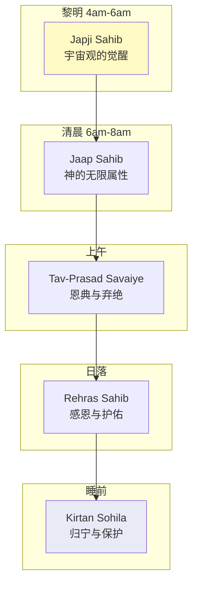
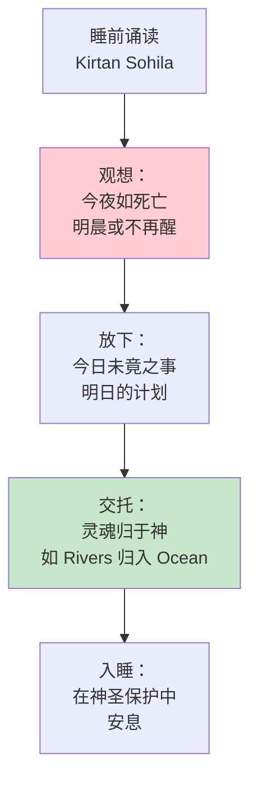
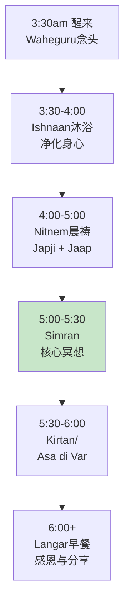
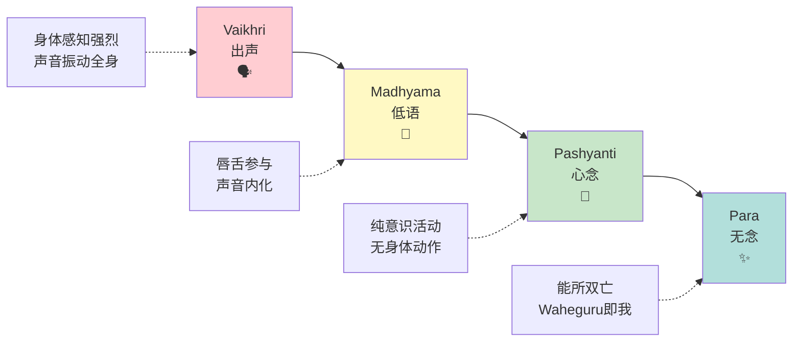
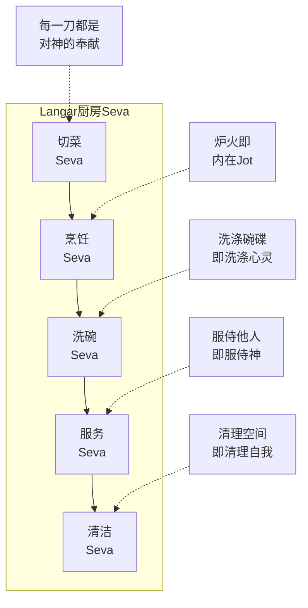

# 锡克冥想实践指南

> Nitnem、Amrit Vela、Simran、Seva——通往Waheguru的实操路径

**最后更新：2026-05**

---

## 目录

1. [Nitnem五段祈祷的冥想维度](#nitnem五段祈祷的冥想维度)
2. [Amrit Vela晨修完整流程](#amrit-vela晨修完整流程)
3. [Waheguru Simran三阶段训练](#waheguru-simran三阶段训练)
4. [Seva服务冥想实操](#seva服务冥想实操)
5. [非锡克教徒的参与路径](#非锡克教徒的参与路径)
6. [参考资源](#参考资源)

---

## Nitnem五段祈祷的冥想维度

Nitnem（ਨਿਤਨੇਮ）意为"日常义务"，是每一位受过洗礼的锡克教徒（Amritdhari）每日必须诵读的五段祈祷。对于非洗礼者或初学者，可以从Japji Sahib开始，逐步扩展。

### Nitnem五段概览

| 时段 | 祈祷名称 | 含义 | 大致时长 | 核心冥想焦点 |
|-----|---------|------|---------|------------|
| **黎明** | Japji Sahib | 致胜之颂 | 15-25分钟 | 宇宙秩序、独一神性、灵魂旅程 |
| **清晨** | Jaap Sahib | 神圣之名颂 | 10-15分钟 | 神的无限属性、敬畏与惊叹 |
| **上午** | Tav-Prasad Savaiye | 恩典十颂 | 5分钟 | 神的慈悲、弃绝虚假依附 |
| **傍晚** | Rehras Sahib | 傍晚颂 | 12-18分钟 | 感恩、护佑、日间回顾 |
| **睡前** | Kirtan Sohila | 安息颂 | 5分钟 | 死亡模拟、灵魂归宁、神圣保护 |

### Japji Sahib：38个Pauri的冥想焦点

Japji Sahib是锡克教最核心、最神圣的文本，由 Guru Nanak Dev Ji 所作，包含38个诗节（Pauri）和一个引言（Mool Mantar）。每个Pauri对应灵魂旅程的一个阶段。

| Pauri | 编号 | 核心主题 | 冥想焦点 | 现代对应 |
|-------|------|---------|---------|---------|
| **Mool Mantar** | 引言 | 一神的本质定义 | 反复观想 Ik Onkar（一神）的绝对一元性 | 存在的根本统一 |
| **1** | 开篇 | 如何"真"做礼拜 | 从外在仪式转向内在虔诚 | 超越形式的灵性 |
| **2-4** | 业力法则 | 因果与恩典 | 观察自己行为背后的动机 | 觉察意图的力量 |
| **5** |  Panch Pauri | 五种存在的层面 | 感知自己在哪个层面运作 | 意识层级诊断 |
| **6-10** | 神圣属性 | 神的不可描述性 | 在冥想中放下概念，进入惊叹 | 超越语言的觉知 |
| **11-15** | 瑜伽批判 | 真瑜伽 vs 伪瑜伽 | 检视自己的修行是否沦为表演 | 灵性真诚度检验 |
| **16-19** | 宇宙秩序 | Dharma Khand 等五境 | 观想宇宙的神圣秩序 | 与宇宙节律对齐 |
| **20** |  Sindhi Pauri | 信心与耐心 | 在困难中保持信任 | 逆境中的灵性坚持 |
| **21-27** | 心灵状态 | 多种心灵层次 | 识别自己当下的心灵状态 | 自我认知地图 |
| **28-31** | 解脱之道 | 通过恩典获得自由 | 放下自力努力的执着 | 臣服与接受 |
| **32-33** | 虔信者之道 | Bhagat 的品质 | 观想成为虔信者 | 理想人格的内化 |
| **34-35** |  Guru 之道 | 通过上师到达 | 感受 Guru Granth Sahib 的临在 | 与传承连接 |
| **36** |  Arthi | 终极问候 | 向一切神圣低头 | 终极谦卑 |
| **37-38** |  结语 | 重复与肯定 | 回到开端，循环圆满 | 螺旋上升 |

**Japji Sahib 的冥想式诵读法：**

**各Pauri诵读时的具体冥想焦点：**

| Pauri范围 | 诵读节奏 | 身体感知 | 意念焦点 |
|----------|---------|---------|---------|
| 1-5 | 较慢，建立连接 | 脊柱挺直，呼吸深长 | "我与宇宙秩序的关系" |
| 6-15 | 中等速度 | 胸口扩张感 | "神的无限性震撼我心" |
| 16-25 | 流畅自然 | 腹部温暖感 | "我在宇宙中的位置" |
| 26-35 | 稍快，能量上升 | 头顶轻灵感 | "解脱是可能的" |
| 36-38 | 放慢，回归宁静 | 全身放松 | "圆满、完整、归家" |

### Jaap Sahib：神的无限属性

Jaap Sahib由Guru Gobind Singh Ji所作，以梵文风格的华丽辞藻枚举神的无限属性。

**冥想维度：**

- **节奏感：** Jaap Sahib的韵律极强，诵读时身体自然摇摆，进入一种舞蹈般的冥想状态
- **属性观想：** 每听到一个属性（如"永恒的""全知的""遍在的"），让该属性在心中"闪光"
- **自我消融：** 在神的无限属性面前，感受"小我"的自然缩小

**与现代肯定的对比：**

| 现代自我肯定 | Jaap Sahib的神性肯定 |
|------------|-------------------|
| "我是强大的" | "神是全能的，我是祂的器皿" |
| "我值得被爱" | "神是无限的慈悲，我沐浴其中" |
| "我吸引丰盛" | "神是一切的给予者，我感恩领受" |

### Tav-Prasad Savaiye：恩典与弃绝

这一段较短但力量强大，核心是"弃绝虚假，归向真实"。

**冥想焦点：**
- 诵读时，每提到一种"虚假的依附"（如身份、财富、关系），在心中做一个"放下"的动作
- 可以配合呼气——将依附呼出
- 最后三段强调神的恩典是唯一依靠——感受一种"被托住"的安全感

### Rehras Sahib：傍晚的感恩与护佑

Rehras Sahib在日落后诵读，功能类似于"一天的灵性收束"。

**冥想维度：**
- **回顾：** 感受一天的保护——"我被守护着度过了这一天"
- **感恩：** 具体想三件今日值得感恩的事
- **交托：** 将夜晚交托给神——"我睡去，但神不眠"

### Kirtan Sohila：睡前的死亡模拟

Kirtan Sohila是Nitnem中最短但可能最深刻的段落，在睡前诵读。

**核心冥想——死亡模拟：**

**操作：**
- 在床边或地板上坐着诵读
- 诵读后将头巾/头饰整理好，象征"准备好见神"
- 躺卧时，将最后一个Waheguru放在心中，让它伴你入梦

---

## Amrit Vela晨修完整流程

Amrit Vela（ਅੰਮ੍ਰਿਤ ਵੇਲਾ）意为"甘露时刻"，指黎明前的时间段（约4:00-6:00 AM）。锡克传统认为这是灵性修习最有效的时刻，因为世界安静、心念较净、Guru的能量特别强大。

### Amrit Vela 时间线（理想流程）

| 时间 | 活动 | 时长 | 冥想维度 |
|-----|------|------|---------|
| 3:30 AM | 自然醒来（或被闹钟唤醒） | — | 第一个念头：Waheguru |
| 3:30-4:00 | Ishnaan（沐浴） | 30分钟 | 水的净化——外在清洗对应内在净化 |
| 4:00-4:30 | Japji Sahib | 20-30分钟 | 宇宙观的觉醒 |
| 4:30-5:00 | Jaap Sahib + Tav-Prasad Savaiye | 20-25分钟 | 神的属性与恩典 |
| 5:00-5:30 | Simran（Waheguru冥想） | 30分钟 | 核心的冥想时段 |
| 5:30-6:00 | Kirtan或Asa di Var | 30分钟 | 神圣音乐中的沉浸 |
| 6:00-6:30 | 早餐（Langar精神） | 30分钟 | 感恩食物，分享 |

### Ishnaan：沐浴的冥想

在锡克传统中，沐浴不是简单的清洁，而是一个重要的灵性准备。

**操作步骤：**

1. **醒后立即：** 醒来后不拖延，立即起身（克服惰性本身就是修行）。
2. **冷水或温水：** 传统上用微冷水，但如果身体不适应，温水亦可。
3. **五K的清洁：** 如果佩戴五K（Kesh头发、Kara铁镯、Kachera内衣、Kirpan短剑、Kanga木梳），在沐浴中逐一清洁它们，观想同时净化对应的灵性层面。
4. **五边浴：** 传统上从头顶浇水五次，象征对五 evils（欲望、愤怒、贪婪、执着、自负）的洗涤。
5. **穿衣：** 穿上干净的衣服，通常白色或自然色，象征纯净。

| 沐浴元素 | 冥想焦点 |
|---------|---------|
| 水流过头顶 | 神的光芒（Jot）被唤醒 |
| 清洗头发 | 放下思想的缠绕 |
| 清洗身体 | 释放身体的紧张与业力记忆 |
| 清洁五K | 维护灵性的盔甲与承诺 |
| 擦干身体 | 准备迎接新的一天，新的自己 |

### 晨祷后的Simran时段

这是Amrit Vela的核心——专门的冥想时间。

**环境准备：**
- 在家中设立一个固定的冥想角落（有Guru Granth Sahib的居所更佳）
- 点燃蜡烛或油灯（Jot）
- 坐在舒适的垫子上，脊柱挺直
- 覆盖头部（对所有人，无论性别）

**Simran的具体操作见下一章。**

---

## Waheguru Simran三阶段训练

Simran（ਸਿਮਰਨ）意为"忆念"，是锡克教最核心的冥想技术。通过反复忆念神名（Naam），修行者净化心念、稳定觉知，最终与神合一。

Waheguru（ਵਾਹਿਗੁਰੂ）是锡克教最神圣的神名，意为"奇妙的导师/解放者"。

### Simran的四声层次

锡克传统借用瑜伽的音声理论，将Simran分为四个层次：

| 层次 | 名称 | 声音特征 | 修习方法 | 难度 |
|-----|------|---------|---------|------|
| **第一** | Vaikhri | 出声念诵 | 大声或轻声说出Waheguru | 初级 |
| **第二** | Madhyama | 低语/唇动 | 嘴唇微动，几乎无声 | 中级 |
| **第三** | Pashyanti | 心念 | 完全无声，在心中默诵 | 高级 |
| **第四** | Para | 超越声音 | 不念而念，觉知本身即Waheguru | 究极 |

### 阶段一：Vaikhri——出声念诵（1-3个月）

**目标：** 建立稳定的念诵习惯，让Waheguru的声音成为身体的熟悉振动。

**操作：**

1. **出声方式：**
   - **大声诵：** 在有隔音或独处时，大声诵念"Waheguru"
   - **轻声诵：** 在共享空间中，轻声但清晰地念诵
   - **调子诵：** 可以配合简单的旋律，如"Waaa-he-gu-ru"（四拍）

2. **节奏选择：**

| 节奏 | 念诵方式 | 适合情境 | 效果 |
|-----|---------|---------|------|
| 慢速 | Waa-he-gu-ru（每个音节拉长） | 心乱时 | 镇静 |
| 中速 | 自然语速，平稳 | 日常修习 | 稳定 |
| 快速 | Waheguru-Waheguru连续 | 需要提神时 | 激活 |
| 呼吸配合 | 吸气默念Wahe，呼气默念Guru | 安静环境 | 深度放松 |

3. **计数方法：**
   - 使用Mala（念珠，通常108颗）计数
   - 或设定时间（如30分钟），不计数只念诵
   - 初学者建议每日至少念诵108遍

4. **身体配合：**
   - 可以配合点头或轻微摇摆
   - 感受声音在胸腔、头部、全身的共振
   - 舌头和嘴唇的运动本身也是冥想的一部分

### 阶段二：Madhyama——唇动低语（2-4个月）

**目标：** 从外在声音转入内在声音，减少对外在环境的依赖。

**操作：**

1. **过渡方式：**
   - 先出声念诵5-10分钟，然后逐渐降低音量
   - 直到只有嘴唇在动，几乎听不到声音
   - 旁人看你，只看到嘴唇轻微开合

2. **内在聆听：**
   - 注意力从"发出声音"转向"聆听内在的声音"
   - 即使几乎无声，内在有一个"听见"的觉知

3. **常见挑战：**

| 挑战 | 表现 | 解决 |
|-----|------|------|
| 昏昏欲睡 | 无声后容易昏沉 | 先出声提神，再转入低语；或睁眼看烛光 |
| 散乱加剧 | 没有声音的锚，念头纷飞 | 短暂回到出声，稳定后再转低语 |
| 机械唇动 | 嘴唇在动，但心不在 | 放慢速度，让每一个唇动都有觉知 |

### 阶段三：Pashyanti——心念（持续修习）

**目标：** 完全内在的念诵，心念成为唯一的活动。

**操作：**

1. **纯心念：**
   - 嘴唇完全不动
   - 在心中清晰地"听到"Waheguru的声音
   - 这种"内在的听到"与外在听觉不同，但同样真实

2. **与呼吸结合：**
   - 吸气时：在心中默念"Wahe"
   - 呼气时：在心中默念"Guru"
   - 让整个呼吸周期成为一次完整的忆念

3. **日常融合：**
   - 在走路、等待、排队时，持续心念Waheguru
   - 开始时需要有意识地提起，逐渐成为背景音

### 阶段四：Para——超越声音（自然达成）

这不是一个需要"努力达到"的阶段，而是前三个阶段自然成熟的结果。

**特征：**
- 不再刻意念诵，但Waheguru的觉知始终在
- "能念"与"所念"的界限消融
- 不是"我在念Waheguru"，而是"Waheguru在念我"

**重要提醒：**
- 不要急于达到Para，前两三个阶段的扎实修习才是基础
- Para不是终点，而是新的起点——在此基础上的Seva（服务）和Santokh（满足）

### Simran进阶训练表

| 周次 | Vaikhri | Madhyama | Pashyanti | 总时长 |
|-----|---------|----------|-----------|-------|
| 1-4 | 100% | 0% | 0% | 15-20分钟/日 |
| 5-8 | 70% | 30% | 0% | 20-30分钟/日 |
| 9-12 | 50% | 40% | 10% | 30分钟/日 |
| 13-16 | 30% | 50% | 20% | 30-45分钟/日 |
| 17-20 | 20% | 40% | 40% | 45-60分钟/日 |
| 21+ | 根据需要 | 30% | 70% | 60分钟+/日 |

---

## Seva服务冥想实操

Seva（ਸੇਵਾ）意为"无私的服务"，是锡克教三大支柱之一（Naam Simran、Kirat Karni诚实劳动、Vand Chakna分享）。在Seva中保持冥想性的觉知，是将修行带入日常生活的关键。

### Seva的核心原则

| 原则 | 含义 | 冥想应用 |
|-----|------|---------|
| **Nishkam** | 无欲（不求回报） | 做事时放下对认可的期待 |
| ** humility** | 谦卑 | 在服务中感受"我不是做者，神通过我做" |
| **Chardi Kala** | 高昂精神 | 即使工作辛苦，保持内在的喜悦 |
| **Sangat** | 共同体 | 在集体服务中感受"我们"而非"我" |

### Langar厨房Seva冥想

Langar（ਲੰਗਰ）是锡克教社区厨房，24小时提供免费素食。在Langar厨房做Seva是最经典的冥想性服务。

**各岗位的冥想焦点：**

| 岗位 | 具体工作 | 冥想焦点 | 口诀/意念 |
|-----|---------|---------|----------|
| **切菜** | 切蔬菜、水果 | 专注刀锋，每一刀都是精确的奉献 | "这一刀献给Waheguru" |
| **揉面** | 制作Chapati（印度面饼） | 感受面团的质感，手与面的连接 | "我在塑造，神在赋予生命" |
| **烹饪** | 照看大锅 | 火的转化力量——如同神的转化 | "火是神的力量，食物是神的恩赐" |
| **洗碗** | 清洗大量餐具 | 水的净化力量，重复中的冥想 | "洗净外在，也洗净内在" |
| **服务** | 为用餐者盛饭 | 见到神在每个人脸上的反射 | "我服务的是Waheguru的形体" |
| **清洁** | 打扫地面、桌椅 | 从混乱到秩序，如同心的净化 | "这个空间是神的庙宇" |

### 社区Seva冥想

在Gurdwara之外的社区服务中保持觉知：

| 服务类型 | 冥想焦点 |
|---------|---------|
| 教授 Gurmukhi | 字母即神圣之音，传递即点燃 |
| 护送老人/病人 | 关怀即神的爱之延伸 |
| 环境保护 | 保护神创造的世界 |
| 灾害救援 | 在危机中保持Chardi Kala（高昂精神） |

### Seva中的障碍与对治

| 障碍 | 表现 | 对治 |
|-----|------|------|
| **求认可** | 做Seva时希望被看见、被感谢 | 默念"这是给神的，不是给人的" |
| **比较心** | "我做的比别人多/少" | 回到自己的意图，不看他人 |
| **倦怠感** | 重复工作后的厌烦 | 转换岗位；或在同一岗位中发现新的细节 |
| **优越感** | "我在帮助穷人" | 记住：我们都是神的仆人，彼此服务 |
| **匆忙感** | 急于完成，失去觉知 | 放慢动作，让每一步都有意识 |

---

## 非锡克教徒的参与路径

锡克教是一个开放的传统，欢迎所有人参与其冥想和崇拜实践，不要求皈依。

### 基本原则

| 原则 | 说明 |
|-----|------|
| **开放** | Gurdwara对所有人开放，无论种族、宗教、性别 |
| **不传教** | 锡克教不主动寻求皈依者 |
| **尊重** | 尊重锡克传统，但不需假装是锡克教徒 |
| **真诚** | 以真诚的心参与，比完美的形式更重要 |

### Gurdwara参观礼仪

**详细礼仪：**

| 方面 | 要求 | 原因 | 非锡克徒注意 |
|-----|------|------|-------------|
| **头部覆盖** | 所有人必须覆盖头部 | 尊重神圣空间 | 可带围巾、头巾、帽子；门口通常有备用头巾 |
| **脱鞋** | 进入前脱鞋 | 洁净、谦卑 | 穿容易脱的鞋；袜子会被看到，保持干净 |
| **吸烟/饮酒** | 绝对禁止 | 身体即神的庙宇 | 进入前确保没有烟酒味 |
| **跪拜** | 接近Guru Granth Sahib时鞠躬 | 致敬神圣的Shabad（圣言） | 可以鞠躬或双手合十；不强迫 |
| **Langar** | 免费接受素食 | 平等、分享 | 即使只吃一点，也要尝试；不可浪费 |
| **捐赠** | 自愿 | 维持Gurdwara运营 | 完全自愿，不强迫 |
| **性别座位** | 传统上男女分坐 | 避免分心 | 遵循当地Gurdwara的习惯 |

### 非锡克徒的冥想修习路径

| 阶段 | 修习内容 | 时间 | 深度 |
|-----|---------|------|------|
| **了解期** | 阅读锡克教基础、听Kirtan音乐 | 1-2个月 | 旁观者 |
| **体验期** | 参观Gurdwara、参与Langar、听Kirtan | 2-3个月 | 体验者 |
| **修习期** | 开始Simran（Waheguru念诵）、阅读Japji Sahib译文 | 3-6个月 | 修习者 |
| **深入期** | 尝试Amrit Vela、参与Seva、学习Gurmukhi | 6个月+ | 深入参与者 |
| **融合期** | 将锡克修习与自己的灵性路径融合 | 持续 | 跨界修行者 |

### 常见疑问解答

| 问题 | 回答 |
|-----|------|
| "我需要成为锡克教徒才能做Simran吗？" | 不需要。Simran是通用的冥想技术，任何人都可以修习。 |
| "我可以参加Amrit仪式吗？" | Amrit是皈依仪式，需有真诚的承诺。如果只是好奇，不建议参加。 |
| "我可以佩戴Kara（铁镯）吗？" | Kara象征对神的承诺。如果不理解其意义，不建议佩戴。 |
| "女性可以参与所有活动吗？" | 锡克教强调性别平等，女性可以参与几乎所有活动。 |
| "如果我不信神，还能从锡克冥想中获益吗？" | 可以。将Waheguru理解为"宇宙的终极和谐"或"内在的最高觉知"亦可。 |

---

## 参考资源

### 核心经典

| 文本 | 作者 | 内容 | 获取方式 |
|-----|------|------|---------|
| **Guru Granth Sahib** | 十位Guru及Bhagat | 锡克教最高经典 | 英译版在线免费阅读；中文译本较少 |
| **Japji Sahib** | Guru Nanak Dev Ji | 每日必读，宇宙观与灵性路径 | 多语言版本广泛流传 |
| **Rehras Sahib & Kirtan Sohila** | 多位Guru | 傍晚和睡前祈祷 | 通常与Japji一起出版 |
| **Sukhmani Sahib** | Guru Arjan Dev Ji | 和平之珠，24段冥想诗 | 特别适合压力时期诵读 |

### Kirtan音乐资源

| 艺术家/团体 | 风格 | 推荐 |
|------------|------|------|
| Bhai Harjinder Singh Ji | 传统Ragi | Japji Sahib的经典吟唱 |
| Snatam Kaur | 西方Kundalini/锡克融合 | 适合现代背景的冥想音乐 |
| Nirinjan Kaur | 柔和女声 | 睡前/放松冥想 |
| Dya Singh | 世界音乐融合 | 跨文化的Kirtan体验 |
| Jai-Jagdeesh | 现代Kirtan | 适合年轻人的入门 |

### 现代导师与机构

| 导师/机构 | 地点 | 特色 | 接触方式 |
|----------|------|------|---------|
| Yogi Bhajan传承 | 全球（3HO） | Kundalini瑜伽+锡克冥想 | 3HO.org |
| Sikh Dharma International | 美国新墨西哥 | 西方锡克修行 | sikhdharma.org |
| Basics of Sikhi | 英国 | 教育性视频 | YouTube频道 |
| Nanak Naam | 英国 | 英译与阐释 | YouTube频道 |

### 本系列相关文档

- [锡克冥想传统概述](../INDEX.md)
- [Kundalini冥想](../kundalini-meditation/)
- [曼陀罗唱诵](../mantra-chanting/)

---

> **结语：** 锡克教的灵性路径是一条"行动中的冥想"之路。从Amrit Vela的清晨Simran，到白天的Kirat Karni（诚实劳动），再到Seva中的无私服务——每一刻都是与Waheguru连接的机会。 Guru Nanak Dev Ji 教导我们："通过Simran，你净化了；通过Kirat，你立足了；通过Seva，你升华了。"愿你在Waheguru的Nam中，找到永恒的和平。

---

*文档属于 Peace Lab 冥想知识库。如引用请保留出处。*
