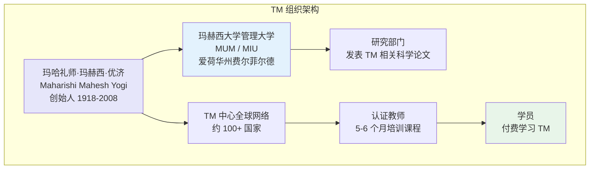
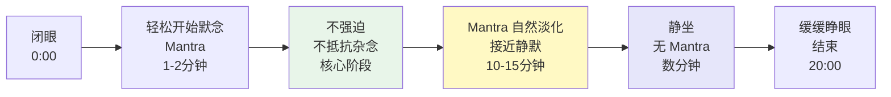
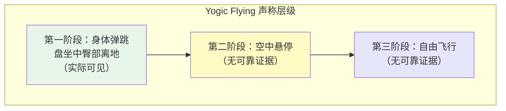
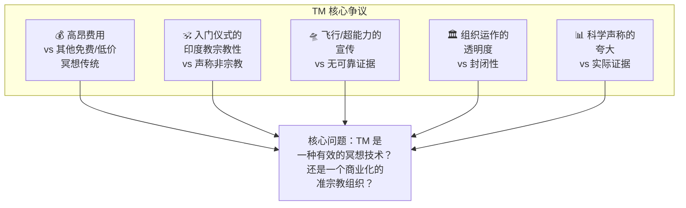
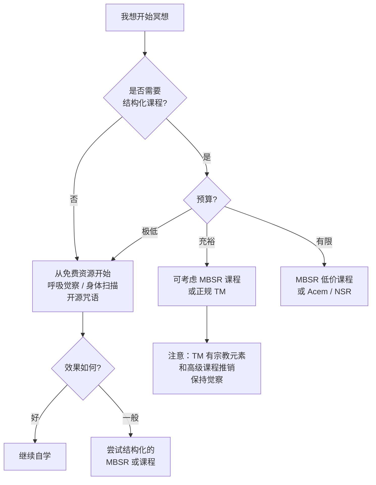

# 超觉冥想（TM）实践指南

> **最后更新：2026-05**
>
> 本指南基于公开资料、学术研究及批判性报道，提供 TM 技术的客观解析、科学争议审视，以及替代方案。

---

## 目录

1. [TM 程序的详细解析](#1-tm-程序的详细解析)
2. [TM 标准练习的 20 分钟流程](#2-tm-标准练习的-20-分钟流程)
3. [TM 与 TM-Sidhi 的区别](#3-tm-与-tm-sidhi-的区别)
4. [TM 的科学争议](#4-tm-的科学争议)
5. [TM 的替代方案](#5-tm-的替代方案)
6. [附录：参考资源](#6-附录参考资源)

---

## 1. TM 程序的详细解析

### 1.1 TM 的组织架构

### 1.2 Initiation Ceremony（入门仪式）

| 项目 | 内容 |
|------|------|
| **名称** | Puja（梵文：礼拜） |
| **时长** | 约 5-10 分钟 |
| **内容** | TM 教师面向玛赫西的导师 Guru Dev（Swami Brahmananda Saraswati）的照片，用梵文唱诵祈福文 |
| **物品** | 鲜花、水果、白布等供品 |
| **学员角色** | 传统上被要求携带白布、水果、鲜花作为供品；静坐旁观 |
| **官方解释** | 「将学员的知见开启到传承的智慧层面」 |
| **争议点** | 批评者认为这是印度教的宗教仪式，与 TM 宣传「非宗教性」矛盾 |

#### Puja 唱诵文大意（公开资料）

> 「我向那永恒的无名者致敬……我向 Guru Dev 致敬，他像一轮满月……愿我的知见被净化……」

| 观点 | 支持方 | 批评方 |
|------|--------|--------|
| **宗教性** | 只是传统祝福，无宗教要求 | 本质上是印度教 Guru 崇拜仪式 |
| **必要性** | TM 方称对技术效果不可或缺 | 研究表明咒语本身可独立产生效果 |
| **知情同意** | 学员被告知是「简单的启动仪式」 | 许多学员事前不知道仪式内容 |

### 1.3 个人 Mantra 的分配逻辑
n
| 项目 | 内容 |
|------|------|
| **来源** | TM 教师根据学员的年龄和性别，从预设列表中选择 |
| **声称** | TM 方称 Mantra 由玛赫西根据「宇宙振动法则」选定 |
| **实际** | 根据多份离职教师和学员的披露，分配基于年龄性别矩阵的固定列表 |

#### 已披露的 Mantra 分配模式（来自公开报道）

| 年龄组 | 男性 Mantra | 女性 Mantra |
|--------|------------|------------|
| 0-15 岁 | Ing | Im |
| 15-30 岁 | Aing | Aim |
| 30-45 岁 | Shiring | Shirim |
| 45-55 岁 | Hiring | Hirim |
| 55+ 岁 | Shiam | Shiama |

> **注意**：TM 组织要求学员对 Mantra 保密，声称「保密有助于加深练习效果」。批评者认为保密是为了维持神秘感和组织的权威性。

### 1.4 Mantra 的选择原则

| TM 声称的原则 | 批判性分析 |
|--------------|-----------|
| 「无意义的声音振动」 | 实际上大多源自梵文或印度教神名（如 "Shiring" 与湿婆 Shiva 相关） |
| 「与个体共振」 | 分配模式固定，非个性化 |
| 「越不费力越好」 | 这与许多传统咒语修习一致，非 TM 独有 |
| 「保密保护其力量」 | 无科学证据表明保密影响效果；传统上许多 Mantra 是公开的 |

### 1.5 TM 学习费用结构（参考）

| 项目 | 费用（美国参考） | 说明 |
|------|-----------------|------|
| **成人 TM 课程** | $1,000-$1,500+ | 包含入门仪式、4 天初步教学、后续检查 |
| **学生/低收入** | $400-$800 | 折扣价 |
| **高级技术（TM-Sidhi）** | $3,000-$5,000+ | 在 TM 基础上学习 |
| **终生会员** | 额外捐赠 | 鼓励捐赠支持「世界和平计划」 |

> **争议**：批评者指出 TM 的高昂费用与其声称的「普适性」相矛盾，且与许多免费或低费的冥想传统形成对比。

---

## 2. TM 标准练习的 20 分钟流程

### 2.1 标准流程图

### 2.2 详细步骤分解

| 阶段 | 时间 | 操作 | 关键要点 |
|------|------|------|----------|
| **准备** | 前 | 坐直、舒适，双手放膝，闭眼 | 无需特殊手印或姿势 |
| **开始** | 0-2 分钟 | 轻松地在心中默念分配的 Mantra，不刻意控制节奏 | 如「Aing」——自然重复，不发声 |
| **深入** | 2-10 分钟 | 继续默念，若杂念出现，不抵抗，温和地带回 Mantra | TM 核心教导：「不费力的轻松」 |
| **淡化** | 10-15 分钟 | Mantra 可能自然变得模糊、遥远，甚至「消失」 | 不主动找回，也不主动放弃，顺其自然 |
| **静默** | 15-18 分钟 | 可能处于无 Mantra 的静定状态 | 不制造念头，也不追逐境界 |
| **回归** | 18-20 分钟 | 若还在静默中，可轻轻带回 Mantra；然后缓缓睁眼 | 不急，给自己缓冲时间 |

### 2.3 TM 的核心技术要点

| 要点 | TM 教导 | 与传统冥想的比较 |
|------|---------|-----------------|
| **「不费力」（Effortless）** | TM 反复强调不专注、不努力、不控制 | 与专注冥想（Concentration）形成对比；与开放监控（Open Monitoring）类似 |
| **允许杂念** | 杂念是「压力释放」的标志，应欢迎 | 与某些传统要求「无念」不同，更接纳 |
| **不监控** | 不主动觉察呼吸或身体 | 与正念（Mindfulness）不同，TM 不强调觉察 |
| **不评判** | 不评价冥想「好坏」 | 与正念一致 |
| **时间固定** | 每日 2 次，每次 20 分钟 | 与大多数传统一致 |

### 2.4 TM 的「超越」体验描述

| 体验类型 | 描述 | TM 的解释 |
|----------|------|----------|
| **身体深度放松** | 感觉身体沉重或消失 | 压力释放 |
| **时间感扭曲** | 20 分钟感觉像 5 分钟 | 进入了超越时间的层面 |
| **内在宁静** | 无念头但有清晰觉知 | 「纯意识」状态 |
| **微觉（Transcending）** | 似乎「失去」了什么，但又有某种存在 | 自我边界消融的初体验 |
| **身体自发动作** | 轻微摇晃、头部转动 | 「压力释放」或气机调整 |

> **科学视角**：这些体验在其他冥想传统和放松技术中也很常见，可归因于副交感神经激活、大脑默认模式网络的变化等。

---

## 3. TM 与 TM-Sidhi 的区别

### 3.1 层级对比

| 维度 | TM（基础） | TM-Sidhi（高级） |
|------|-----------|-----------------|
| **目标** | 减压、放松、个人成长 | 开发「超能力」、加速觉悟 |
| **技术** | 单一 Mantra， effortless | TM + 特定「Sutras」（短语） |
| **费用** | $1,000+ | $3,000-$5,000+ |
| **前提** | 任何人可学 | 必须已完成 TM 并稳定练习 |
| **每日时间** | 20 分钟 × 2 | TM 20 分钟 + Sidhi 练习 |
| **组织定位** | 普及技术 | 精英项目 |

### 3.2 TM-Sidhi 技术简介

| Sutra（公式） | 操作 | 声称效果 |
|-------------|------|----------|
| 「友谊」（Friendship） | TM 后默念 Sutra，然后让 effortless 发生 | 增强人际关系 |
| 「力量」（Strength） | 同上 | 增强身体与意志力 |
| 「Yogic Flying」 | 特定的身体弹跳技术 | 最终实现「空中漂浮」 |

### 3.3 Yogic Flying（瑜伽飞行）的介绍与争议

| 方面 | 内容 |
|------|------|
| **实际观察** | 修习者在泡沫垫上半盘坐，通过腿部力量使身体弹起，臀部短暂离地 |
| **TM 解释** | 这是「飞行」的初级阶段，随着意识深化，最终实现真正的空中飞行 |
| **科学评估** | 物理上，人体无法通过意识克服重力。观察到的弹跳可用肌肉力量完全解释 |
| **媒体报道** | Time Magazine (1985)、BBC 等曾调查，未发现超越物理定律的证据 |
| **法律诉讼** | 美国曾有学员因「飞行课程」未能实现飞行而起诉 TM 组织 |

| 证据类型 | 结果 |
|----------|------|
| 视频记录 | 显示盘坐弹跳，高度通常 2-6 英寸 |
| 科学测量 | 力板测量显示弹跳来自腿部推力，符合牛顿力学 |
| 第三方独立验证 | 无可靠第三方证实「飞行」超越物理定律 |
| TM 组织内部声明 | 承认目前多数人只达到第一阶段 |

---

## 4. TM 的科学争议

### 4.1 TM 积极研究结果

| 领域 | 研究发现 | 研究者/机构 |
|------|----------|------------|
| **心血管健康** | TM 可能降低血压、减少心脏病风险 | Robert Schneider / Maharishi University |
| **焦虑缓解** | 元分析显示 TM 对焦虑有中等效果 | JAMA Internal Medicine (2014) |
| **PTSD** | 部分研究显示 TM 对退伍军人 PTSD 有帮助 | 多项小样本研究 |
| **皮质醇** | TM 练习者皮质醇水平可能较低 | 多项生理学研究 |

### 4.2 方法论批评

| 批评点 | 说明 |
|--------|------|
| **发表偏倚** | 阴性结果（TM 无效）的研究较少发表 |
| **研究者利益冲突** | 大量研究由玛赫西大学的研究人员进行，存在机构利益冲突 |
| **对照组问题** | 早期研究的对照组常是「不治疗」，而非「其他冥想」或「安慰剂」 |
| **复制困难** | 独立实验室难以复制 TM 的某些声称效果 |
| **夸大宣传** | TM 组织将初步研究宣传为「科学证实」，超出证据范围 |

### 4.3 独立研究的发现

| 研究 | 发现 | 意义 |
|------|------|------|
| **JAMA Internal Medicine (2014)** | 正念冥想对焦虑、抑郁有帮助；TM 也有效果，但不优于其他技术 | TM 并非唯一或最优选择 |
| **Shapiro et al. meta-analysis** | 各种放松技术效果相近，差异多来自安慰剂效应和期望效应 | TM 的特殊性被质疑 |
| **Bishop et al. (2002)** | 冥想研究整体质量不高，难以得出可靠结论 | 需要更严谨的研究设计 |

### 4.4 Buzfeed / Time 等媒体的调查报道

| 报道 | 关键发现 |
|------|----------|
| **Time Magazine (1985)** | 调查 TM-Sidhi「飞行」课程，发现实际上是盘坐弹跳；未能找到真正飞行的证据 |
| **Buzfeed News (2016)** | 调查 TM 组织内部文化，报告了前成员关于高压招募、财务不透明、「飞行」课程争议的证词 |
| **CBC Documentary** | 调查 TM 的高昂费用、入门仪式的宗教性质、以及「世界和平计划」的资金使用 |
| **The Guardian (2018)** | 报道 TM 在公立学校推广（"Quiet Time" 项目）的争议，包括教会与国家分离的宪法问题 |

### 4.5 争议焦点总结

| 争议 | TM 组织立场 | 批评者立场 | 客观评估 |
|------|------------|-----------|----------|
| 费用 | 教师培训和维持中心需要成本 | 利用垄断 Mantra 分配权牟利 | 价格确实高于大多数替代方案 |
| 宗教性 | 启动仪式是传统祝福，非宗教 | 本质上是印度教仪式 | 仪式确实有印度教元素，但无后续宗教要求 |
| 科学 | 600+ 研究证实 TM 独特效果 | 研究质量参差，利益冲突明显 | 有初步正面证据，但远非「科学定论」 |
| 飞行 | 初级阶段已观察到，高级阶段需要时间 | 永远无法实现，违反物理定律 | 目前只观察到弹跳，无漂浮证据 |
| 世界和平 | 团体冥想可降低地区暴力 | 无可靠证据支持「超距效应」 | 研究方法受质疑，未被主流科学接受 |

---

## 5. TM 的替代方案

### 5.1 自然发生的「超越」体验在其他传统中

| 传统 | 对应概念 | 实现方式 |
|------|----------|----------|
| **瑜伽（Patanjali）** | Samadhi（三摩地） | 通过八支瑜伽的渐进修习，Dhyana（冥想）自然深化为 Samadhi |
| **佛教（Theravada）** | Jhana（禅那） | 通过 Samatha（止）修习，达到深度定境 |
| **禅宗** | 禅定 / 见性 | 坐禅、公案、日常生活中自然呈现 |
| **道家** | 坐忘 / 入定 | 通过调息、守窍，自然进入无为状态 |
| **基督教神秘主义** | 合一（Union with God） | 通过祈祷、默观，恩典中的临在 |
| **苏菲主义** | Fana（寂灭） | 通过 Dhikr（念主），自我消融于真主 |
| **Advaita Vedanta** | 自证（Self-realization） | 通过冥想与自我探询（Who am I?） |

### 5.2 免费/低费的 TM 风格替代技术

| 技术 | 来源 | 操作 | 费用 |
|------|------|------|------|
| **自然诵咒冥想（Natural Mantra Meditation）** | 通用 | 选择一个简单的无意义音节（如 "So" 或 "Om"）， effortless 重复 | 免费 |
| **NSR（Natural Stress Relief）** | 前 TM 教师开发 | 基于 TM 原理，使用公开 Mantra，自学课程 | ~$30-50（一次性） |
| **Acem Meditation** | 挪威 | 无宗教背景，使用无意义声音， effortless 方法 | 低价课程 |
| **Clinically Standardized Meditation (CSM)** | 美国 | 标准化咒语冥想，临床研究支持 | 低成本培训 |
| **自我引导咒语冥想** | 通用 | 选择任何舒缓声音，每日 effortless 练习 20 分钟 | 免费 |

### 5.3 其他经过科学验证的冥想替代方案

| 技术 | 类型 | 研究支持 | 获取方式 |
|------|------|----------|----------|
| **正念减压（MBSR）** | 正念 / 开放觉察 | 大量高质量 RCT 研究 | 课程 / 书籍 / App（$15-600） |
| **正念认知疗法（MBCT）** | 正念 + 认知 | 预防抑郁复发有强证据 | 治疗性课程 |
| **Loving-Kindness（Metta）** | 慈悲冥想 | 对情绪调节有研究支持 | 书籍 / 音频 / 课程（免费-$200） |
| **身体扫描（Body Scan）** | 身体觉察 | MBSR 核心组成，研究充分 | 免费音频极多 |
| **呼吸觉察** | 专注冥想 | 最基础的冥想形式，效果明确 | 完全免费 |
| **开源咒语** | 咒语冥想 | 机制与 TM 相似，Mantra 公开 | 免费 |

### 5.4 替代方案效果对比

| 目标 | TM | MBSR | 自助咒语 | 呼吸冥想 |
|------|----|------|----------|----------|
| **减压** | 有证据 | 强证据 | 可能有 | 有证据 |
| **焦虑缓解** | 有证据 | 强证据 | 可能有 | 有证据 |
| **降低血压** | 部分证据 | 有证据 | 未知 | 有证据 |
| **易获取性** | 低（需教师/费用） | 中（需课程） | 高 | 极高 |
| **宗教元素** | 有（启动仪式） | 无 | 无 | 无 |
| **长期成本** | 高（进阶课程） | 中 | 极低 | 无 |

### 5.5 如何选择适合自己的冥想

---

## 6. 附录：参考资源

### 6.1 推荐书目

| 书名 | 作者 | 说明 |
|------|------|------|
| *Science of Being and Art of Living* | Maharishi Mahesh Yogi | TM 创始人原著，了解官方立场 |
| *TM and Cult Mania* | Michael A. Persinger et al. | 早期批判性分析 |
| *The TM Book* | Denise Denniston & Peter McWilliams | 中立的 TM 介绍 |
| *Full Catastrophe Living* | Jon Kabat-Zinn | MBSR 创始人，科学验证的替代方案 |
| *Mindfulness in Plain English* | Bhante Henepola Gunaratana | 免费的优质正念入门 |
| *Opening the Dragon Gate* | Chen Kaiguo & Zheng Shunchao | 对比视角：中国传统内丹修炼 |

### 6.2 科学论文

| 论文 | 期刊 | 说明 |
|------|------|------|
| "Meditation Programs for Psychological Stress and Well-being" | JAMA Internal Medicine (2014) | 独立元分析，涵盖 TM 和正念 |
| "Review of TM Research" | Various | 注意区分由 TM 大学发表和独立发表的研究 |

### 6.3 关键术语表

| 术语 | 解释 |
|------|------|
| **Mantra** | 咒语，用于冥想重复的声音 |
| **Puja** | 印度教的礼拜仪式 |
| **Sutra** | 梵文「线/公式」，在 TM-Sidhi 中指特定的短句 |
| **Transcending** | TM 术语，指超越表面思维到达更深意识状态 |
| **Pure Consciousness** | TM 声称的终极冥想状态 |
| **Maharishi Effect** | TM 声称的集体冥想降低社会暴力的效应，科学界未认可 |
| **Sidhi** | 梵文「完美/成就」，在 TM 中指「超能力」 |

---

> **免责声明**：本指南基于公开可获取的资料编写，旨在提供平衡、客观的信息。TM 是一种有争议的冥想技术——它确实帮助了许多人，但其组织的某些做法、科学声称和费用结构受到广泛批评。读者应基于充分信息做出自己的选择。

---

*文档版本：1.0 | 最后更新：2026-05 | Peace Lab Database*
