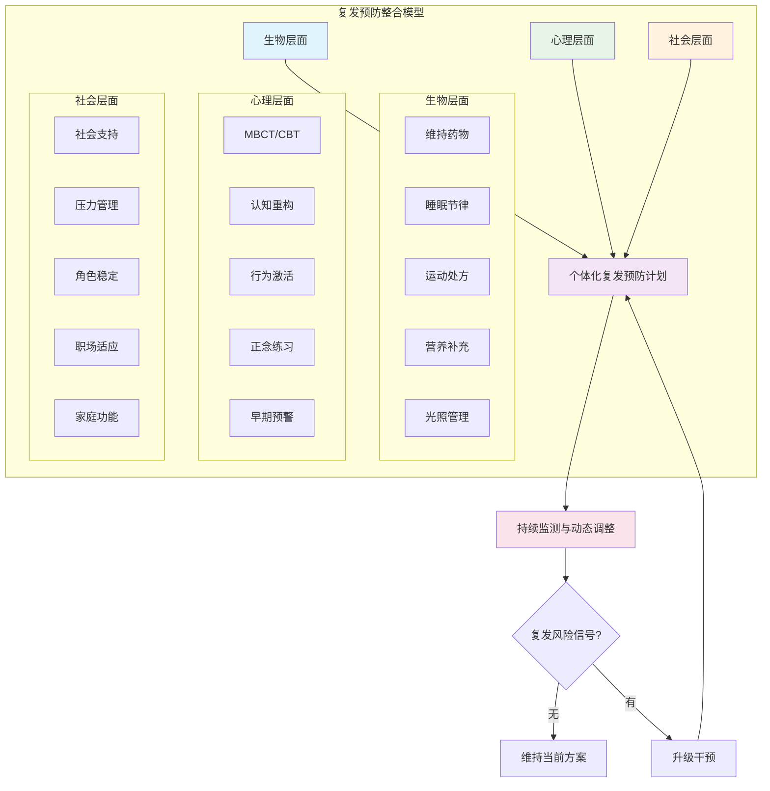

# Depression Relapse Prevention (抑郁复发预防指南)

> **抑郁症复发预防 (Depression Relapse Prevention)**
>
> *"治愈抑郁不是终点，学会与脆弱共处才是长久之道。"*
> *"Recovery from depression is not the destination; learning to coexist with vulnerability is the enduring path."*
>
> 抑郁症具有高复发性：单次发作后复发风险约50%，三次发作后升至80-90%。本文档系统整合循证复发预防策略，从风险评估到个体化维持方案，构建全周期防御体系。

---

## 1. 核心概念界定 (Core Concepts)

### 表1.1 复发相关术语精确定义

| 术语 (中文) | 英文 | 定义 | 时间框架 | 临床意义 |
|---|---|---|---|---|
| **复发** | Recurrence | 缓解期后出现的全新抑郁发作 | 完全缓解后 ≥ 4-6 个月 | 标志慢性化进程；需长期管理策略 |
| **复燃** | Relapse | 急性期治疗中或刚结束时症状的再度加重 | 缓解后 < 4-6 个月 | 提示急性期治疗不充分；需强化原治疗 |
| **残留症状** | Residual Symptoms | 急性期治疗后持续存在的亚临床症状 | 治疗全程 | 最强复发预测因子；需针对性干预 |
| **完全缓解** | Full Remission | 症状消失 ≥ 2 个月，功能基本恢复 | 缓解期 | 维持治疗的起点 |
| **部分缓解** | Partial Remission | 症状改善但未达完全缓解标准 | 治疗全程 | 复发风险极高；需调整治疗方案 |
| **慢性化** | Chronicity | 症状持续 ≥ 2 年（DSM-5 持续性抑郁障碍） | 病程维度 | 治疗难度大；需多学科整合干预 |
| **复发阈值** | Relapse Threshold | 触发新一轮发作的症状严重度临界点 | 个体差异 | 识别个人阈值是预防核心 |

### 表1.2 复燃、复发与慢性化的鉴别

| 维度 | 复燃 (Relapse) | 复发 (Recurrence) | 慢性化 (Chronicity) |
|---|---|---|---|
| **发生时机** | 急性/巩固期 | 维持期或停药后 | 整个病程 |
| **诱因** | 治疗不足、过早减药 | 生活事件、生物脆弱性 | 多重因素累积 |
| **症状特点** | 类似原发作 | 可能形式不同 | 症状持续波动 |
| **预后** | 原治疗通常仍有效 | 需重新评估治疗策略 | 需长期综合治疗 |
| **预防重点** | 足量足疗程 | 维持治疗 + 心理预防 | 功能康复 + 社会支持 |

---

## 2. 复发风险评估 (Relapse Risk Assessment)

### 表2.1 复发风险因素分层模型

| 风险层级 | 因素类别 | 具体因素 | 相对风险 (RR) | 可干预性 |
|---|---|---|---|---|
| **不可改变** | 病史因素 | 既往发作次数 ≥ 3 次 | RR 4-6 | 低 |
| | | 首次发作年龄 < 20 岁 | RR 2-3 | 低 |
| | | 家族史阳性 | RR 2-3 | 低 |
| | | 忧郁型特征 | RR 1.5-2 | 低 |
| | 生物因素 | 海马体积减小 | RR 2 | 低 |
| | | HPA轴负反馈受损 | RR 1.5-2 | 中 |
| **可改变** | 治疗因素 | 残留症状 (最强预测) | RR 3-5 | **高** |
| | | 过早停药 (< 6个月) | RR 2-4 | **高** |
| | | 治疗不依从 | RR 2-3 | **高** |
| | 心理认知 | 反刍思维 | RR 2-3 | **高** |
| | | 负性认知风格 | RR 2 | **高** |
| | | 完美主义 | RR 1.5-2 | **高** |
| | 生活方式 | 睡眠障碍 | RR 2-3 | **高** |
| | | 缺乏运动 | RR 1.5-2 | **高** |
| | | 社交孤立 | RR 2 | **高** |
| | 社会应激 | 重大生活事件 | RR 2-4 | 中 |
| | | 慢性人际压力 | RR 2-3 | **高** |
| | 共病 | 焦虑障碍共病 | RR 2 | 中 |
| | | 物质使用 | RR 2-3 | **高** |

### 表2.2 残留症状：最强复发预测因子

| 残留症状 | 对复发的影响 | 机制 | 监测工具 | 干预靶点 |
|---|---|---|---|---|
| **睡眠障碍** | 复发风险 ↑ 3 倍 | 睡眠剥夺致HPA轴激活、情绪调节受损 | PSQI、睡眠日记 | 失眠认知行为治疗 (CBT-I) |
| **疲劳/精力不足** | 复发风险 ↑ 2.5 倍 | 炎症标志物持续、线粒体功能 | FSS、CFS量表 | 运动、营养、药物调整 |
| **认知功能下降** | 复发风险 ↑ 2 倍 | 前额叶功能未恢复、BDNF不足 | DSST、TMT | 认知矫正训练、认知增强药物 |
| **焦虑症状** | 复发风险 ↑ 2.5 倍 | 共同神经环路、应激敏感化 | GAD-7、STAI | 抗焦虑药物、暴露治疗 |
| **快感缺失** | 复发风险 ↑ 2 倍 | 奖赏系统功能未恢复 | SHAPS | 行为激活、多巴胺能药物 |
| **躯体症状** | 复发风险 ↑ 1.5 倍 | 内感受敏感化 | PHQ-15 | 正念身体扫描、SSRI |

> **临床要点**：残留症状每增加1项，复发风险增加约20%（Judd et al., 1998）。完全缓解（无残留症状）者的复发率显著低于部分缓解者。

---

## 3. 循证复发预防干预 (Evidence-Based Interventions)

### 表3.1 复发预防干预方法循证汇总

| 干预方法 | 英文 | 目标人群 | 核心机制 | 复发降低率 | 效应量 | 证据等级 |
|---|---|---|---|---|---|---|
| **正念认知疗法** | MBCT | ≥3次发作史者 | 去中心化、反刍打断 | 43% | d=0.49 | **A级** (NICE指南) |
| **维持性抗抑郁药** | Maintenance AD | 2次及以上发作 | 神经递质稳定 | 60-70% | RR=0.40 | **A级** |
| **认知行为治疗巩固** | CBT consolidation | 缓解期患者 | 认知重构、技能维持 | 30-40% | d=0.45 | **A级** |
| **人际心理治疗维持** | IPT-M | 缓解期患者 | 人际关系改善、角色稳定 | 25-35% | d=0.40 | **B级** |
| **行为激活维持** | BA maintenance | 缓解期患者 | 活动结构、奖赏重建 | 20-30% | d=0.35 | **B级** |
| **运动维持** | Exercise maintenance | 缓解期患者 | BDNF↑、抗炎、社会参与 | 15-25% | SMD=-0.30 | **A级** |
| **睡眠干预** | CBT-I | 伴失眠残留 | 睡眠稳态恢复、皮质醇节律 | 20-30% | d=0.50 | **A级** |
| **社会节奏疗法** | SRT | 双相/单相抑郁 | 昼夜节律稳定 | 25-35% | d=0.40 | **B级** |

### 3.1 正念认知疗法 (MBCT)

MBCT 是目前循证最强的抑郁复发心理预防方法。

**核心机制**：
- **去中心化 (Decentering)**：将消极思维视为"心理事件"而非"事实"
- **反刍打断**：通过正念练习中断反刍-情绪恶化循环
- **早期预警觉察**：提高对情绪变化的敏感性，在发作前识别信号

**标准方案**：
- 8 周团体课程，每周 2-2.5 小时
- 每日家庭练习 45-60 分钟
- 包含正念呼吸、身体扫描、正念运动、认知去中心化

**关键研究**：
- **Kuyken et al. (2016, Lancet)**：424名缓解期患者，MBCT vs 维持抗抑郁药，24个月复发率无显著差异（44% vs 47%），对童年创伤史者MBCT更优。
- **Piet & Hougaard (2011)**：Meta分析显示MBCT对3次及以上发作者复发率降低43%（OR=0.57）。

**适用边界**：
- ✅ 复发性抑郁（≥3次发作）一线推荐
- ✅ 希望停药的维持期患者
- ❌ 急性抑郁发作（PHQ-9 ≥ 20）
- ❌ 自杀风险高、精神病性抑郁

### 3.2 维持性药物治疗 (Maintenance Pharmacotherapy)

**维持用药原则**：

| 发作次数 | 推荐维持时间 | 剂量策略 | 减停药时机 |
|---|---|---|---|
| 首次发作 | 6-12 个月 | 急性期有效剂量 | 症状缓解 + 功能恢复后 6 个月 |
| 2 次发作 | 2-3 年 | 急性期有效剂量 | 稳定 2 年后缓慢减停 |
| ≥3 次发作 | 长期/终身 | 急性期有效剂量 | 通常不建议完全停药 |
| 伴自杀史 | 长期 | 有效剂量 | 慎停 |
| 慢性抑郁 | 长期 | 有效剂量 | 症状控制即目标 |

**减停药技术**：
- **缓慢递减**：每 2-4 周减少 25% 剂量
- **监测窗口**：减药后 2-4 周为复发高风险期
- **预警信号**：出现早期信号时立即恢复原剂量
- **避免突然停药**：防止撤药综合征和反跳性复发

### 3.3 认知行为治疗巩固 (CBT Consolidation)

**巩固期目标**：
1. 强化急性期习得的认知重构技能
2. 识别并修正核心信念（如"我无能""不可爱"）
3. 建立行为激活的长期习惯
4. 预防性应对技能训练

**巩固方案**：
- 急性期后每 2-4 周 1 次，持续 3-6 个月
- 重点：技能泛化、复发情境预演、信心建立

**关键研究**：
- **Bockting et al. (2015)**：预防性认知治疗（PCT）使复发率从 60% 降至 37%。
- **Jarrett et al. (2013)**：CBT 巩固治疗对缓解期患者复发率降低约 30%。

### 3.4 社会节奏疗法 (Social Rhythm Therapy)

**核心假设**：社会节律的紊乱是抑郁复发的触发因素。

**干预要素**：
- 监测每日社会节律（起床、用餐、社交、工作、睡眠）
- 建立稳定的社会节奏
- 处理生活事件对节律的干扰
- 光照管理（早晨光照）

---

## 4. 个体化复发预防计划 (Personalized Relapse Prevention Plan)

### 表4.1 复发预防计划模板

| 模块 | 内容 | 我的具体方案 | 负责人 | 频率 |
|---|---|---|---|---|
| **我的预警信号** | 列出个人早期预警信号（情绪/认知/行为/躯体） | _________________ | 本人/家属 | 持续觉察 |
| **触发因素** | 识别个人高风险情境 | _________________ | 本人 | 持续觉察 |
| **日常维护** | 维持治疗的基础活动 | _________________ | 本人 | 每日 |
| **早期应对** | 预警信号出现时的即时策略 | _________________ | 本人 | 按需 |
| **中期升级** | 症状加重时的加强策略 | _________________ | 本人/医生 | 按需 |
| **危机预案** | 严重恶化时的紧急方案 | _________________ | 医生/家属 | 紧急 |
| **支持网络** | 关键联系人清单 | _________________ | 本人 | 定期更新 |
| **随访计划** | 定期评估安排 | _________________ | 医生 | 定期 |

### 4.2 复发预防技能工具箱

| 技能类别 | 具体技术 | 适用情境 | 实施时间 | 效果机制 |
|---|---|---|---|---|
| **认知技能** | 思维记录表 | 消极思维出现时 | 10-15分钟 | 认知重构、去灾难化 |
| | 证据检验 | 自我批评时 | 10分钟 | 纠正认知偏差 |
| | 去中心化 | 反刍开始时 | 5分钟 | 拉开与思维的距离 |
| **行为技能** | 行为激活日程 | 动力缺乏时 | 每日规划 | 打破回避循环 |
| | 渐进任务分解 | 任务 overwhelm 时 | 5分钟 | 降低行动门槛 |
| | 愉悦活动安排 | 快感缺失时 | 每日 | 奖赏系统激活 |
| **正念技能** | 三分钟呼吸空间 | 情绪变化时 | 3分钟 | 情绪调节、觉察 |
| | 身体扫描 | 躯体症状时 | 15-30分钟 | 内感受调节 |
| | 正念行走 | 日常维护 | 20-30分钟 |  grounding、运动结合 |
| **社交技能** | 主动求助 | 孤独感时 | 即时 | 社会支持激活 |
| | 边界设定 | 人际压力时 | 即时 | 减少人际应激 |
| | 支持团体 | 持续维护 | 每周 | 归属、正常化 |
| **生理技能** | 睡眠卫生 | 每晚 | 睡前1小时 | 昼夜节律稳定 |
| | 规律运动 | 每日/每周 | 30-45分钟 | BDNF、抗炎 |
| | 光照管理 | 早晨 | 20-30分钟 | 昼夜节律、5-HT |

---

## 5. 不同人群的复发预防策略 (Population-Specific Strategies)

### 表5.1 特殊人群复发预防要点

| 人群 | 复发特点 | 预防重点 | 推荐干预 | 特殊注意 |
|---|---|---|---|---|
| **青少年** | 复发率高；易激惹突出 | 家庭功能、学业压力、同伴关系 | 家庭CBT、IPT-A、学校支持 | 监测自伤；药物需FDA批准 |
| **围产期女性** | 产后3-6月高风险 | 睡眠剥夺、激素变化、角色适应 | IPT、CBT、同伴支持 | 权衡哺乳与用药；母婴同治 |
| **老年患者** | 认知症状突出；躯体共病多 | 躯体疾病管理、认知保护、社会参与 | 药物 + 社会参与项目 | 药物相互作用；跌倒风险 |
| **慢性病患者** | 疾病相关应激持续 | 疾病适应、疼痛管理、意义重建 | 整合医学、ACT、疼痛CBT | 药物相互作用；多病共存 |
| **双相抑郁** | 转相风险；混合特征 | 心境稳定剂为基础；节律稳定 | SRT、药物维持、 IPSRT | **禁用单用抗抑郁药** |
| **高压力职业** | 工作应激持续；求助率低 | 职场心理健康、压力管理、同伴支持 | 组织干预 + 个体治疗 | 降低病耻感；隐私保护 |
| **共病焦虑** | 焦虑先于抑郁复发 | 同步治疗焦虑；GAD预防 | CBT、SNRIs、暴露治疗 | 避免苯二氮卓类依赖 |
| **共病物质使用** | 物质使用与复发相互触发 | 同步戒断；替代性应对策略 | 整合治疗、动机访谈、十二步 | 物质可诱发抑郁 |

---

## 6. 复发危机应对预案 (Crisis Response Protocol)

### 表6.1 分级应对策略

| 级别 | 信号 | 应对策略 | 时间框架 | 责任人 |
|---|---|---|---|---|
| **绿色 (维持)** | 无症状；功能良好 | 坚持日常维护计划；定期随访 | 持续 | 本人 |
| **黄色 (预警)** | 出现1-2个早期信号；功能轻微下降 | 启动早期应对技能；增加自我监测；联系治疗师 | 24-72小时 | 本人/治疗师 |
| **橙色 (加重)** | 多个信号；功能明显下降；症状持续 > 1周 | 联系医生调整治疗；增加心理会谈频率；启动支持网络 | 48小时内 | 医生/治疗师/家属 |
| **红色 (危机)** | 自杀意念；严重功能丧失；精神病性症状 | **立即就医**；24小时陪伴；安全计划；考虑住院 | 即刻 | 医生/急诊/家属 |

### 表6.2 安全计划 (Safety Plan) 核心要素

| 步骤 | 内容 | 我的具体方案 |
|---|---|---|
| **1. 预警信号识别** | 什么信号提示危机来临？ | _________________ |
| **2. 内部应对策略** | 不接触他人时可做的事 | _________________ |
| **3. 分散注意力** | 可转移注意的人/地/活动 | _________________ |
| **4. 社会支持** | 可求助的家人/朋友 | _________________ |
| **5. 专业资源** | 危机时的专业联系人 | _________________ |
| **6. 环境安全** | 限制获取致命手段 | _________________ |
| **7. 求生理由** | 值得活下去的理由 | _________________ |

---

## 7. 监测与随访体系 (Monitoring & Follow-Up)

### 表7.1 复发预防随访时间表

| 阶段 | 时间 | 随访频率 | 评估内容 | 工具 |
|---|---|---|---|---|
| **急性期末** | 缓解后 0-1月 | 每周 | 症状、残留症状、功能 | PHQ-9、SDS |
| **巩固期** | 1-6月 | 每 2-4 周 | 症状、依从性、副作用 | PHQ-9、CSRI |
| **维持期早期** | 6-12月 | 每月 | 症状、生活方式、应激事件 | PHQ-9、QIDS |
| **维持期中期** | 1-2年 | 每 1-3 月 | 症状、复发信号、功能 | PHQ-9、LIFE |
| **维持期长期** | >2年 | 每 3-6 月 | 症状、生活质量、长期目标 | PHQ-9、WHO-QOL |
| **减药期** | 减药全程 | 每 1-2 周 | 撤药反应、早期信号 | PHQ-9、症状日记 |

### 表7.2 复发预防效果评估指标

| 指标 | 测量工具 | 目标 | 评估频率 |
|---|---|---|---|
| **症状水平** | PHQ-9 | ≤ 4 分（缓解） | 每次随访 |
| **功能水平** | SDS / WHODAS 2.0 | 功能恢复至病前 80%+ | 每 3 月 |
| **生活质量** | WHO-QOL / Q-LES-Q | 持续改善 | 每 6 月 |
| **反刍思维** | RRS | 较基线降低 ≥ 20% | 每 3 月 |
| **睡眠质量** | PSQI | ≤ 5 分 | 每月 |
| **运动水平** | IPAQ | 达到指南推荐量 | 每月 |
| **社会支持** | MSPSS | 稳定或改善 | 每 6 月 |
| **治疗依从性** | MARS / 药片计数 | ≥ 80% | 每次随访 |

---

## 8. 整合复发预防模型 (Integrated Relapse Prevention Model)

---

*本文档为 Peace Lab Database 抑郁复发预防专项资料。*
*复发预防是抑郁症全周期管理的核心环节，需要患者、家属与专业团队的协同努力。*
*如有自杀意念或严重症状恶化，请立即寻求专业帮助。*

---

*Created by Peace Lab Database Project*
*Author: Allen Galler (allengaller@gmail.com)*

## 交叉引用 | Cross References

| 关联主题 | 所在支柱 | 链接 | 关联维度 |
|---------|---------|------|--------|
| 抑郁症概览 | 02-心理 | [Depression Overview](Depression_Overview.md) | 诊断标准、风险因素 |
| 抑郁症治疗 | 02-心理 | [Depression Treatment](Depression_Treatment.md) | 急性期治疗、药物维持 |
| 正念认知疗法 | 02-心理 | [MBCT](../therapy/mbct-therapy/MBCT_Mindfulness_Based_Cognitive_Therapy_Overview.md) | 复发预防核心干预 |
| 行为激活 | 02-心理 | [Behavioral Activation](../behavioral/anti-procrastination/Behavioral_Activation.md) | 行为维持策略 |
| 失眠认知行为治疗 | 02-心理 | [CBT-I](../somatic-body/sleep/Sleep_CBTI.md) | 睡眠残留症状干预 |
| 慢性压力干预 | 02-心理 | [Chronic Stress](../stress-hpa/chronic-stress/) | 应激管理 |
| 运动与心理健康 | 03-生命 | [Exercise Mental Health](../../../03-Bio-Science/biology/exercise-science/Exercise_Mental_Health.md) | 运动维持方案 |
| 心理神经免疫学 | 03-生命 | [PNI](../../../03-Bio-Science/biology/immune-inflammation/Psychoneuroimmunology.md) | 炎症与复发 |
| 职业倦怠 | 02-心理 | [Burnout](../applied/occupational-burnout/) | 职场压力与抑郁复发 |
| 社会节奏疗法 | 02-心理 | [Social Rhythm](Social_Rhythm_Therapy.md) | 节律稳定 |
