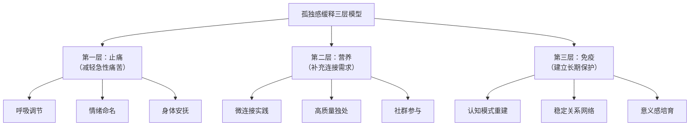

# 孤独感缓释与自助策略 (Loneliness Relief & Self-Help Strategies)

## 目录导航

- [一、缓释的核心理念](#一缓释的核心理念)
- [二、即时缓释技术](#二即时缓释技术)
- [三、认知层面的缓释策略](#三认知层面的缓释策略)
- [四、行为层面的缓释策略](#四行为层面的缓释策略)
- [五、身体与神经调节路径](#五身体与神经调节路径)
- [六、关系重建的渐进方案](#六关系重建的渐进方案)
- [七、独处的转化艺术](#七独处的转化艺术)
- [八、数字时代的缓释策略](#八数字时代的缓释策略)
- [九、意义与灵性层面的缓释](#九意义与灵性层面的缓释)
- [十、分阶段缓释路线图](#十分阶段缓释路线图)
- [十一、自我评估与调整框架](#十一自我评估与调整框架)

---

## 一、缓释的核心理念

### 1.1 缓释 vs 治愈：区分与定位

| 维度 | 缓释 (Relief/Mitigation) | 治愈 (Cure) |
|------|--------------------------|-------------|
| **目标** | 减轻孤独感的痛苦强度、缩短发作时间 | 根本性改变产生孤独的深层模式 |
| **适用情境** | 日常生活、自助、轻中度孤独 | 慢性严重孤独、需要专业治疗 |
| **实施者** | 个人自助、同伴互助 | 专业心理治疗师 |
| **时间框架** | 即时到数周起效 | 数月到数年的深度工作 |
| **关系** | 缓释为治愈创造条件，治愈巩固缓释效果 | 两者互补而非替代 |

### 1.2 缓释的三个层次



---

## 二、即时缓释技术

### 2.1 当孤独感袭来时的急救箱

**"SAFE"四步急救法：**

| 步骤 | 名称 | 操作 | 原理 |
|------|------|------|------|
| **S** | Stop (停) | 停下当前行为，放下手机，安静坐好 | 中断自动化反刍循环 |
| **A** | Acknowledge (认) | 对自己说"我现在感到孤独，这是一种正常的人类体验" | 情绪命名降低杏仁核激活 |
| **F** | Feel (感) | 用手放在胸口，感受身体中孤独的位置、温度、质地 | 将注意力从认知转向身体感受 |
| **E** | Ease (缓) | 用温暖的自我对话："你不是唯一感到这样的人"，或做3次深呼吸 | 激活副交感神经系统 |

### 2.2 生理调节即时技术

| 技术 | 操作方法 | 起效时间 | 作用机制 |
|------|---------|---------|---------|
| **4-7-8呼吸法** | 吸气4秒 → 屏气7秒 → 呼气8秒 → 重复3轮 | 1-3分钟 | 激活迷走神经、降低皮质醇 |
| **冷水激活** | 冷水洗脸或手腕浸冷水30秒 | 即时 | 潜水反射降低心率、中断情绪洪水 |
| **自我拥抱** | 双臂交叉抱住自己肩膀，轻轻拍打 | 1-2分钟 | 模拟触碰释放催产素 |
| **接地练习** | 5-4-3-2-1感官觉察法 | 3-5分钟 | 将注意力锚定当下、中断反刍 |
| **温暖触碰** | 手捧热饮、热水泡脚、拥抱宠物 | 5-10分钟 | 体温升高模拟社会温暖 |

### 2.3 情绪标记与容器技术

**情绪精确标记表：**

| 孤独的具体情绪面向 | 中文标记 | 英文 | 常见伴随身体感觉 |
|----------------|---------|------|----------------|
| 被忽视 | "没有人注意到我" | Feeling invisible | 胸口空洞感 |
| 被排斥 | "我不属于那里" | Feeling excluded | 胃部紧缩 |
| 不被理解 | "没有人真正懂我" | Feeling misunderstood | 喉咙堵塞感 |
| 无人可依 | "遇到困难我没有人可以打电话" | Feeling unsupported | 肩膀沉重 |
| 存在性空虚 | "即使有人在也觉得空" | Feeling existentially alone | 全身弥散的凉意 |

**容器技术**：想象一个安全的容器（箱子、保险柜、山洞），将当下无法处理的孤独感"暂存"其中，告诉自己"我稍后会回来处理你"——允许暂时搁置而非压抑。

---

## 三、认知层面的缓释策略

### 3.1 去灾难化训练

| 孤独时的灾难化思维 | 平衡性替代思维 | 练习方法 |
|----------------|-------------|---------|
| "我永远都会这么孤独" | "孤独感是波动的，它会来也会走" | 回忆上一次孤独感消退的经历 |
| "没有人在乎我" | "有人在乎但可能表达方式不同" | 列出过去一周别人对你善意的具体行为 |
| "我天生就不讨人喜欢" | "关系是技能，可以学习和改善" | 回忆一次成功的社交体验 |
| "我注定要一个人" | "现在暂时独处，不代表未来也是如此" | 区分"暂时状态"与"永恒命运" |

### 3.2 归因重训练

**从自我归因转向多因素归因：**

| 情境 | 自我归因 (致孤独) | 多因素归因 (缓释孤独) |
|------|-----------------|---------------------|
| 朋友没回消息 | "TA不想理我了" | "TA可能在忙，或者没注意到" |
| 聚会中觉得格格不入 | "我太无趣了" | "今天话题不是我擅长的，换个场合可能不同" |
| 周末一个人 | "我是loser" | "我需要主动发起邀约，这是一个行动问题而非价值问题" |
| 同事不邀请你午饭 | "他们故意排斥我" | "也许是习惯性的小组合，我可以主动提出加入" |

### 3.3 感恩与微连接觉察

**每日微连接日记（建议每晚完成）：**

```
今天的三个微连接时刻：
1. ________________________________（例：快递员对我微笑了）
2. ________________________________（例：同事主动递给我一杯水）
3. ________________________________（例：在超市和收银员有了短暂对话）

这些微连接让我感受到：_________________
明天我可以主动创造的一个微连接：_________________
```

**原理**：孤独时大脑的注意力偏向"被排斥"的信号，而过滤掉微小的善意和连接。微连接日记帮助重新校准注意力系统。

---

## 四、行为层面的缓释策略

### 4.1 社交行为阶梯

**从安全到挑战的渐进暴露方案：**

| 难度等级 | 行为示例 | 风险感 | 预期收益 |
|---------|---------|--------|---------|
| **Level 1 (安全)** | 对邻居/快递员微笑打招呼 | 极低 | 打破社交回避的第一步 |
| **Level 2 (低)** | 在已有群组中发一条消息或回复 | 低 | 重新进入社交对话 |
| **Level 3 (中低)** | 主动约一位同事/朋友喝咖啡 | 中低 | 从被动等待转为主动发起 |
| **Level 4 (中)** | 参加一个线下兴趣小组或活动 | 中 | 拓展新的社交场景 |
| **Level 5 (中高)** | 在小组中分享一个个人故事 | 中高 | 从表面社交走向深度连接 |
| **Level 6 (高)** | 对一位信任的人表达"我最近感到孤独" | 高 | 真实的脆弱性表达带来深度回应 |

### 4.2 仪式化社交行为

| 仪式 | 频率 | 操作要点 | 为什么有效 |
|------|------|---------|----------|
| **固定友谊日** | 每周 | 与1-2位朋友约定固定时间通话/见面 | 稳定预期减少不确定性 |
| **共食仪式** | 每周2-3次 | 至少每周2-3次与人一起吃饭 | 共食是最古老的社交粘合剂 |
| **晨间问候** | 每天 | 上班第一件事主动和至少一个人打招呼 | 建立"社交首动"的习惯 |
| **感恩联络** | 每周 | 每周给一个人发送真诚的感谢/问候消息 | 主动给予比被动等待更能减少孤独 |
| **季节性聚会** | 每季 | 主动发起/参与季节性小聚 | 创造可预期的社交节律 |

### 4.3 志愿服务与利他行为

**为什么利他是强效缓释孤独的策略：**

| 利他行为的缓释机制 | 具体方式 | 心理收益 |
|----------------|---------|---------|
| **从关注自我痛苦转向关注他人需求** | 社区志愿服务、陪伴老人 | 注意力外移减少反刍 |
| **获得被需要感** | 技能分享、辅导学生 | "我是有用的、被需要的" |
| **自然形成社交连接** | 与志愿者同伴协作 | 共同使命感带来归属 |
| **增强自我效能感** | 看到自己行动的正面影响 | "我能对世界产生积极影响" |

---

## 五、身体与神经调节路径

### 5.1 运动的社交与神经化学效应

| 运动类型 | 缓释孤独的机制 | 推荐形式 | 频率建议 |
|---------|-------------|---------|---------|
| **团体运动** | 社交连接 + 内啡肽 + 协作感 | 团体跑步、球类、团操 | 每周 2-3 次 |
| **户外运动** | 自然疗愈 + 注意力恢复 + 开放社交 | 徒步、骑行、公园运动 | 每周 2-3 次 |
| **身心运动** | 迷走神经调节 + 身体觉察 + 内在安全感 | 瑜伽、太极、气功 | 每周 2-3 次 |
| **有氧运动** | 多巴胺/血清素提升 + 睡眠改善 | 跑步、游泳、快走 | 每周 3-5 次 |

### 5.2 触碰与催产素路径

**触碰是缓释孤独的直接神经化学路径：**

| 触碰方式 | 催产素效应 | 孤独缓释效果 | 独居者替代方案 |
|---------|----------|------------|-------------|
| **拥抱 (20秒以上)** | 显著释放催产素 | 即时安全感和连接感 | 自我拥抱、加重毛毯 |
| **按摩** | 降低皮质醇 + 升高催产素 | 身体放松 + 情感安抚 | 自我按摩、泡澡 |
| **宠物互动** | 人宠互动释放催产素 | 稳定的无条件陪伴 | 猫咖啡馆、遛狗志愿者 |
| **手工与触觉活动** | 手部触觉刺激调节神经 | 专注感 + 创造满足 | 陶艺、烹饪、园艺 |

### 5.3 自然环境的缓释效应

**自然暴露对孤独的多路径缓释：**

| 自然活动 | 作用路径 | 推荐时长 | 增强效果的方式 |
|---------|---------|---------|-------------|
| **森林浴 (Shinrin-yoku)** | 降低皮质醇、NK 细胞增加 | 2小时/次 | 与他人一同进行 |
| **园艺活动** | 触觉 + 成长感 + 节律感 | 30分钟/天 | 社区花园共同参与 |
| **水边散步** | 负离子 + 白噪音安抚效应 | 30-60分钟 | 结伴而行 |
| **观星/日出** | 敬畏感扩展自我边界 | 15-30分钟 | 减少个人渺小感中的孤独 |

---

## 六、关系重建的渐进方案

### 6.1 社交网络修复策略

**从内圈到外圈的修复顺序：**

| 关系圈层 | 修复优先级 | 修复策略 | 预期时间 |
|---------|----------|---------|---------|
| **内圈 (1-3人)** | 最高 | 深化现有最好的 1-2 个关系的质量 | 1-3 个月 |
| **中圈 (5-15人)** | 高 | 重新激活"休眠关系"(dormant ties) | 1-6 个月 |
| **外圈 (15-50人)** | 中 | 通过兴趣/活动拓展新的弱连接 | 3-12 个月 |

**"休眠关系"重新激活技术：**
- 整理手机通讯录，列出曾经关系不错但很久没联系的人
- 发送一条真诚的"想起你"消息（不是群发的节日祝福）
- 提出一个低压力的见面邀约（"下周有空一起喝杯咖啡吗？"）
- 分享一个与对方相关的信息/文章/回忆（"看到这个想到了当年..."）

### 6.2 深度连接的培养

**从表面社交走向深度连接的路径：**

| 连接深度 | 对话特征 | 示例 | 如何到达 |
|---------|---------|------|---------|
| **Level 1 - 寒暄** | 天气、新闻、安全话题 | "最近怎么样？" | 默认社交入口 |
| **Level 2 - 观点** | 分享看法、讨论话题 | "我觉得这部电影..." | 主动表达真实看法 |
| **Level 3 - 感受** | 分享情绪和感受 | "最近工作让我挺焦虑的" | 选择一个安全的人尝试 |
| **Level 4 - 脆弱** | 分享恐惧、失败、真实需求 | "其实我最近蛮孤独的" | 关系中已有一定信任基础 |
| **Level 5 - 相互看见** | 真实的、双向的深度理解 | 无需言语也能感受到彼此 | 需要时间、信任和相互投入 |

### 6.3 兴趣驱动的新关系建立

**以共同兴趣为纽带的社交路径：**

| 兴趣社交形式 | 社交密度 | 关系深度潜力 | 推荐入门方式 |
|------------|---------|-------------|------------|
| **读书会** | 中 | 中高 | 线上/线下每月聚会 |
| **运动团体** | 高 | 中 | 跑团、瑜伽班、球队 |
| **创作工坊** | 中 | 中高 | 陶艺、绘画、写作班 |
| **志愿组织** | 中高 | 高 | 社区服务、公益项目 |
| **学习社群** | 中 | 中 | 语言学习、技能交换 |
| **烹饪/美食** | 中高 | 中高 | 烹饪课、美食探店团 |

---

## 七、独处的转化艺术

### 7.1 从被动孤独到主动独处

**区分与转化：**

| 维度 | 被动孤独 | 主动独处 |
|------|---------|---------|
| **选择性** | 被迫、无奈 | 主动选择、有目的 |
| **情绪色彩** | 痛苦、空虚、焦躁 | 平静、充盈、自在 |
| **内心独白** | "没人要我" | "我选择与自己好好相处" |
| **活动质量** | 被动刷屏、发呆 | 阅读、创作、冥想、自然 |
| **事后感受** | 更加空虚 | 滋养、充电 |

### 7.2 高质量独处清单

| 独处活动 | 滋养维度 | 推荐时长 | 为什么能缓释孤独 |
|---------|---------|---------|----------------|
| **深度阅读** | 认知 + 情感 | 30-60分钟 | 与作者/角色建立心灵连接 |
| **写日记/晨间写作** | 情感表达 + 自我理解 | 15-30分钟 | 自我对话替代空洞沉默 |
| **创作 (绘画/音乐/写作)** | 表达 + 心流 | 30-120分钟 | 心流状态消解孤独感 |
| **冥想/正念** | 内在安全感 | 10-30分钟 | 与自身建立稳定连接 |
| **烹饪一餐用心的饭** | 身体 + 感官 + 自我关怀 | 30-60分钟 | "我值得被好好对待" |
| **自然漫步** | 感官 + 开放 + 敬畏 | 30-60分钟 | 与更大的世界建立连接 |
| **整理空间** | 掌控感 + 秩序感 | 30-60分钟 | 外在秩序带来内在安定 |

### 7.3 独处仪式设计

**为独处时间赋予仪式感：**

- **空间仪式**：为独处创造一个专属角落（阅读角、冥想垫、窗边位）
- **时间仪式**：固定每天/每周的"与自己约会"时间段
- **感官仪式**：点一根喜欢的蜡烛、泡一壶好茶、播放喜爱的音乐
- **开始仪式**：用一句话启动独处时间（"接下来这段时间属于我和我自己"）
- **结束仪式**：用简短的感恩结束（"谢谢这段与自己相处的时光"）

---

## 八、数字时代的缓释策略

### 8.1 数字卫生协议

| 策略 | 具体操作 | 目标 |
|------|---------|------|
| **被动 --> 主动** | 将被动刷屏时间转为主动联络 1-2 位朋友 | 用真实连接替代虚拟浏览 |
| **消费 --> 创作** | 减少内容消费，增加内容创作/分享 | 从"看别人的生活"到"投入自己的生活" |
| **量 --> 质** | 取关无意义账号，只保留真正有价值的 | 减少社会比较的刺激源 |
| **屏幕 --> 面对面** | 每周至少 2-3 次把线上聊天转为线下见面 | 深化连接质量 |
| **睡前无屏幕** | 睡前 1 小时放下手机 | 改善睡眠 + 避免深夜情绪刷屏 |

### 8.2 善用数字工具

| 数字工具 | 缓释孤独的正确用法 | 错误用法 |
|---------|------------------|---------|
| **视频通话** | 与远方的朋友/家人面对面交流 | 替代所有面对面社交 |
| **兴趣社群** | 找到线下活动的入口 | 永远停留在线上 |
| **冥想App** | 辅助建立每日冥想习惯 | 对App的依赖替代内在修习 |
| **社交媒体** | 真实分享、主动互动、联络老友 | 被动刷屏、比较、表演 |

---

## 九、意义与灵性层面的缓释

### 9.1 意义感的重建

**Viktor Frankl 意义三源泉模型在孤独缓释中的应用：**

| 意义来源 | 缓释孤独的路径 | 实践方式 |
|---------|-------------|---------|
| **创造性价值** | 通过创造让自己与世界产生连接 | 写作、艺术、工作中的创造性投入 |
| **体验性价值** | 通过深度体验感受到与生命的连接 | 自然、音乐、人际之爱、审美体验 |
| **态度性价值** | 即使在痛苦中也能找到意义 | 将孤独体验转化为理解、同情和成长 |

### 9.2 灵性与超越实践

| 实践方式 | 缓释机制 | 推荐形式 |
|---------|---------|---------|
| **冥想/禅修** | 超越自我中心视角、与更大整体连接 | 每日 10-30 分钟正念/慈悲冥想 |
| **自然敬畏体验** | 扩展自我边界、感受与自然的一体性 | 登山、观星、海边、森林 |
| **灵性社群** | 共同的超越性追求创造深度归属 | 宗教团体、冥想社群、哲学读书会 |
| **慈悲练习** | 将关注从"我的孤独"扩展到"所有人的孤独" | 慈悲冥想 (Loving-Kindness Meditation) |
| **生命叙事** | 在个人故事中找到孤独的意义和位置 | 自传写作、生命故事分享 |

### 9.3 孤独的意义重构

**将孤独从纯粹的痛苦转化为成长资源：**

| 孤独的阴影面 | 孤独的光明面 | 转化路径 |
|------------|------------|---------|
| "我和别人不一样" | "我有独特的视角和深度" | 将独特性从缺陷重新定义为资源 |
| "没人理解我" | "我对理解有更深的渴望" | 这种渴望驱动你去寻找真正的深度连接 |
| "我很孤独" | "我有丰富的内在世界" | 内在丰富性可以成为创造力和同理心的源泉 |
| "这种痛苦没有意义" | "经历孤独让我更能理解他人的孤独" | 痛苦经验可以转化为帮助他人的能力 |

---

## 十、分阶段缓释路线图

### 10.1 四周入门方案

| 周次 | 主题 | 每日必做 | 每周任务 | 检查点 |
|------|------|---------|---------|--------|
| **第1周** | 觉察与接纳 | 情绪标记练习 (2分钟)、SAFE急救法 | 完成微连接日记7天 | 能否不评判地觉察孤独感？ |
| **第2周** | 身体与自我关怀 | 4-7-8呼吸 + 一项自我关怀活动 | 尝试2种身体调节技术 | 是否发展了1个身体层面的安抚方法？ |
| **第3周** | 行为激活 | 每日一个Level 1-2社交行为 | 主动联络2-3位"休眠关系"朋友 | 是否打破了社交回避？ |
| **第4周** | 深化与整合 | 继续微连接日记 + 一项高质量独处 | 参加1个线下活动/兴趣小组 | 孤独感强度和频率是否有所改善？ |

### 10.2 长期维持策略

**缓释孤独的"五个每"习惯：**

| 频率 | 习惯 | 说明 |
|------|------|------|
| **每天** | 一次真诚的人际互动 | 哪怕只是对便利店店员微笑说谢谢 |
| **每天** | 一段高质量独处时间 | 阅读、冥想、创作，而非被动刷屏 |
| **每周** | 一次深度对话 | 与至少一个人聊超过表面的话题 |
| **每月** | 一次新的社交尝试 | 参加新活动、认识新朋友、去新地方 |
| **每季** | 一次社交网络盘点 | 评估哪些关系需要投入、哪些需要放手 |

---

## 十一、自我评估与调整框架

### 11.1 孤独缓释效果自测

**每两周评估一次（0-10分，10为最严重）：**

| 评估项目 | 第__周 | 第__周 | 变化 |
|---------|--------|--------|------|
| 孤独感平均强度 | | | |
| 孤独感发作频率 | | | |
| 主动社交行为次数/周 | | | |
| 深度对话次数/周 | | | |
| 高质量独处时间/周(小时) | | | |
| 整体生活满意度 | | | |

### 11.2 何时需要专业帮助

**以下信号提示需要寻求专业心理治疗：**

- 孤独感持续 3 个月以上且自助策略无明显效果
- 孤独伴随严重抑郁症状（持续情绪低落、兴趣丧失、睡眠严重紊乱）
- 出现自杀或自伤的想法
- 孤独导致物质滥用（酒精、药物）
- 社交退缩严重到影响工作和基本生活功能
- 孤独来源涉及深层依恋创伤或童年创伤

**专业资源指引**：
- 心理咨询热线：12320-5（全国心理援助热线）
- 危机干预热线：400-161-9995（24小时生命热线）
- 本地精神卫生中心 / 心理咨询机构

---

> **交叉引用**
> - [孤独感来源与病因学](Loneliness_Sources_Etiology.md) - 理解孤独感的来源
> - [孤独概览](Loneliness_Overview.md) - 孤独的基本概念与分类
> - [孤独治疗与关系干预](Loneliness_Treatment.md) - 专业治疗方案
> - [孤独临床手册](Loneliness_Clinical_Manual.md) - 临床诊疗方案
> - [婚后孤独缓释策略](../../relationships/marriage/marital-loneliness/Marital_Loneliness_Relief.md) - 婚内孤独的专项缓释

---

*本文档整合了认知行为疗法、正念减压、积极心理学、社会神经科学与存在主义心理学等多学科的自助缓释策略，面向轻中度孤独感人群提供系统化、可操作的缓释方案。严重孤独请寻求专业帮助。*

*Created by Peace Lab Database Project*
*Author: Allen Galler (allengaller@gmail.com)*
